# AndroidAdbAnalyze - 전체 시스템 아키텍처

## 📋 문서 정보

**버전**: 1.0
**작성일**: 2025-10-09
**대상 독자**: 개발자, 아키텍트, 시스템 설계자
**목적**: Parser + Analysis DLL 전체 시스템 아키텍처 시각화 및 설명

---graph TB
    subgraph ext[External System]
        A[WPF Application]
    end
    subgraph analysis[AndroidAdbAnalyze.Analysis DLL]
        B[IAnalysisOrchestrator]
        C[AnalysisResult]
        D[IReportGenerator]
    end
    subgraph parser[AndroidAdbAnalyze.Parser DLL]
        E[AdbLogParser]
    end
    subgraph sources[Data Sources]
        G1[activity.log]
        G2[audio.log]
        G3[media_camera.log]
        G4[usagestats.log]
        G5[vibrator_manager.log]
        G6[media_metrics.log]
        G7[media.camera.worker.txt]
    end
    A -->|1. Parse Logs| E
    G1 --> E
    G2 --> E
    G3 --> E
    G4 --> E
    G5 --> E
    G6 --> E
    G7 --> E
    E -->|2. NormalizedLogEvent[]| A
    A -->|3. Analyze| B
    B -->|4. AnalysisResult| A
    A -->|5. Generate Report| D
    C --> D
    D -->|6. HTML Report| A
    style A fill:#e1f5ff
    style B fill:#ffe1e1
    style D fill:#ffe1e1
    style E fill:#e1ffe1
    style C fill:#fff4e1

## 1. 전체 시스템 아키텍처

### 1.1 High-Level Architecture

```mermaid
flowchart TB
    subgraph ext["External System"]
        A["WPF Application"]
    end

    subgraph analysis["AndroidAdbAnalyze.Analysis DLL"]
        B["IAnalysisOrchestrator"]
        C["AnalysisResult"]
        D["IReportGenerator"]
    end

    subgraph parser["AndroidAdbAnalyze.Parser DLL"]
        E["AdbLogParser"]
    end

    subgraph sources["Data Sources"]
        G1["activity.log"]
        G2["audio.log"]
        G3["media_camera.log"]
        G4["usagestats.log"]
        G5["vibrator_manager.log"]
        G6["media_metrics.log"]
        G7["media.camera.worker.txt"]
    end

    A -->|1. Parse Logs| E
    G1 --> E
    G2 --> E
    G3 --> E
    G4 --> E
    G5 --> E
    G6 --> E
    G7 --> E
    E -->|2. NormalizedLogEvent[]| A
    A -->|3. Analyze| B
    B -->|4. AnalysisResult| A
    A -->|5. Generate Report| D
    C --> D
    D -->|6. HTML Report| A

    style A fill:#e1f5ff
    style B fill:#ffe1e1
    style D fill:#ffe1e1
    style E fill:#e1ffe1
    style C fill:#fff4e1

```

---

## 2. Parser DLL 아키텍처

### 2.1 Parser 레이어 구조

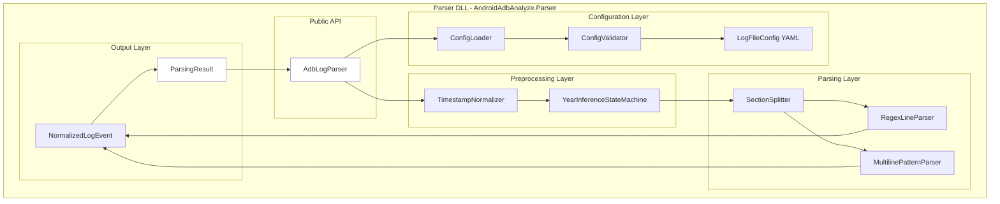

### 2.2 Parser 처리 흐름

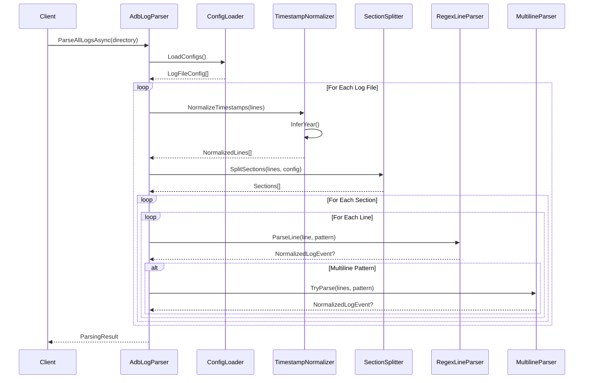

---

## 3. Analysis DLL 아키텍처

### 3.1 Analysis 레이어 구조

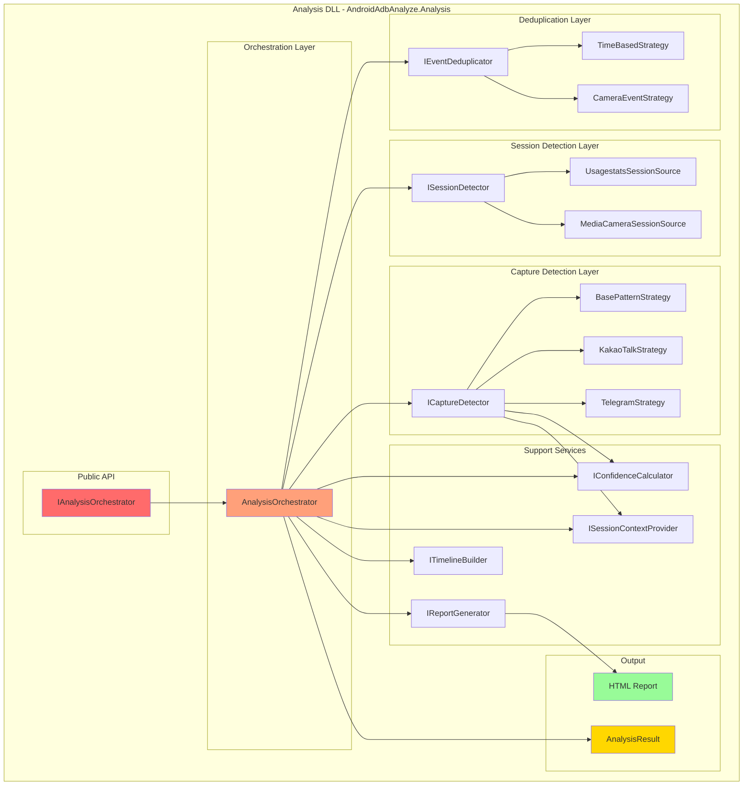

### 3.2 Analysis 처리 흐름

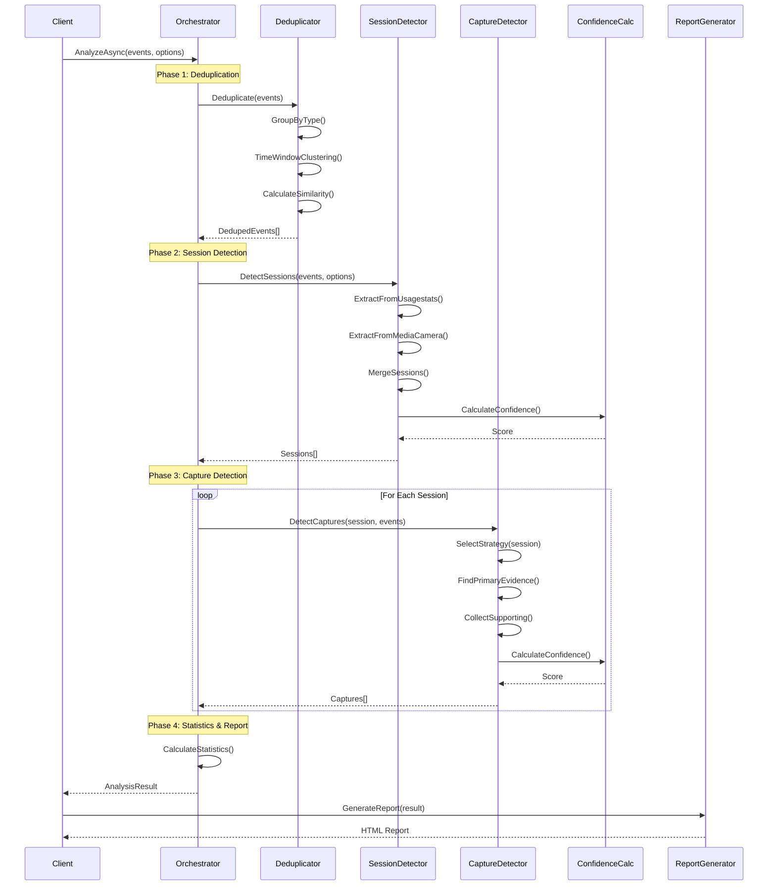

---

## 4. 데이터 흐름 다이어그램

### 4.1 전체 데이터 파이프라인

```mermaid
flowchart LR
    subgraph "Input"
        A[Raw Log Files<br/>7 types]
    end
  
    subgraph "Parser Pipeline"
        B[Config<br/>Loading]
        C[Timestamp<br/>Normalization]
        D[Section<br/>Splitting]
        E[Pattern<br/>Matching]
        F[Event<br/>Creation]
    end
  
    subgraph "Intermediate"
        G[NormalizedLogEvent[]<br/>~1000-10000 events]
    end
  
    subgraph "Analysis Pipeline"
        H[Event<br/>Deduplication]
        I[Session<br/>Detection]
        J[Capture<br/>Detection]
        K[Confidence<br/>Calculation]
    end
  
    subgraph "Output"
        L[AnalysisResult<br/>Sessions + Captures]
        M[HTML Report]
    end
  
    A --> B
    B --> C
    C --> D
    D --> E
    E --> F
    F --> G
    G --> H
    H --> I
    I --> J
    J --> K
    K --> L
    L --> M
  
    style A fill:#E8F5E9
    style G fill:#FFF9C4
    style L fill:#FFE0B2
    style M fill:#F3E5F5
```

### 4.2 이벤트 변환 과정

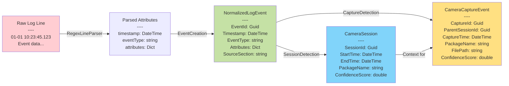

---

## 5. 핵심 알고리즘 및 논리

### 5.1 Parser - 타임스탬프 정규화 알고리즘

#### **알고리즘: Year Inference State Machine**

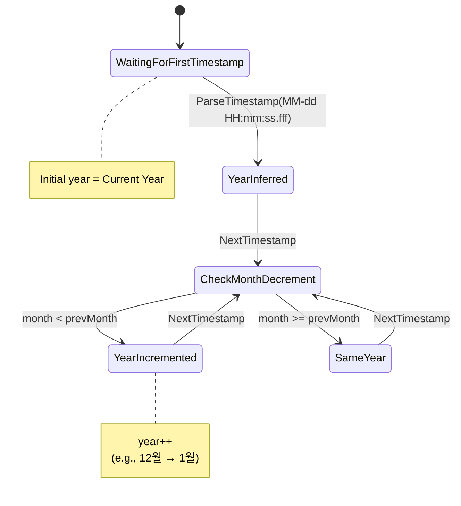

**논리**:

1. 로그에 연도 정보 없음 (MM-dd HH:mm:ss.fff 형식)
2. 현재 연도로 시작
3. 월이 감소하면 (12→1) 연도 증가
4. 크로스 이어 시나리오 대응

**시간 복잡도**: O(n), n = 로그 라인 수

---

### 5.2 Parser - Section Splitting 알고리즘

#### **알고리즘: Marker-based Section Detection**

```mermaid
flowchart TD
    A[Start] --> B{Read Line}
    B --> C{Matches Section<br/>Marker?}
  
    C -->|Yes - Text| D[Text Pattern Match<br/>e.g., '--- SECTION ---']
    C -->|Yes - Regex| E[Regex Pattern Match<br/>e.g., '^### (.+)']
    C -->|No| F[Add to Current Section]
  
    D --> G[Start New Section<br/>Name from Marker]
    E --> H[Start New Section<br/>Name from Capture Group]
  
    G --> B
    H --> B
    F --> B
  
    B -->|EOF| I[Return Sections[]]
    I --> J[End]
  
    style D fill:#AED581
    style E fill:#FFD54F
    style F fill:#90CAF9
```

**논리**:

1. 설정 파일에 정의된 섹션 마커 패턴 사용
2. `text` 타입: 정확한 문자열 매칭
3. `regex` 타입: 정규식 + 캡처 그룹으로 섹션 이름 추출
4. 마커 없으면 현재 섹션에 계속 추가

**시간 복잡도**: O(n), n = 로그 라인 수

---

### 5.3 Parser - Regex Pattern Matching

#### **알고리즘: Named Group Extraction**

```mermaid
flowchart TD
    A[Log Line] --> B[Apply Regex Pattern]
  
    B --> C{Match?}
    C -->|No| D[Return null]
    C -->|Yes| E[Extract Named Groups]
  
    E --> F[Create Attributes Dict]
    F --> G{Field Type?}
  
    G -->|timestamp| H[Parse DateTime]
    G -->|int| I[Parse Int32]
    G -->|string| J[Keep as String]
  
    H --> K[Set Timestamp]
    I --> L[Add to Attributes]
    J --> L
  
    K --> M{eventType field?}
    M -->|Yes| N[Substitute {fieldName}<br/>with captured value]
    M -->|No| O[Use Static EventType]
  
    N --> P[Create NormalizedLogEvent]
    O --> P
    L --> P
  
    P --> Q[Return Event]
  
    style B fill:#FFE082
    style E fill:#81D4FA
    style P fill:#A5D6A7
```

**논리**:

1. YAML 설정의 정규식 패턴 적용
2. Named Group으로 필드 추출 (e.g., `(?<field>\d+)`)
3. 타입 변환 (timestamp → DateTime, int → Int32)
4. 동적 EventType 치환 (e.g., `{activityState}`)

**예제**:

```yaml
eventType: "ACTIVITY_{activityState}"  # ACTIVITY_RESUMED, ACTIVITY_PAUSED
pattern: "(?<activityState>RESUMED|PAUSED)"
```

**시간 복잡도**: O(1) per line

---

### 5.4 Analysis - Event Deduplication 알고리즘

#### **알고리즘: Time Window + Jaccard Similarity**

```mermaid
flowchart TD
    A[Events[]] --> B[Group by EventType]
  
    B --> C[Sort by Timestamp]
  
    C --> D[Time Window Clustering<br/>threshold = ±2초]
  
    D --> E{Cluster Size > 1?}
    E -->|No| F[Keep as-is]
    E -->|Yes| G[Calculate Jaccard Similarity]
  
    G --> H{Similarity > 0.8?}
    H -->|No| I[Keep Both]
    H -->|Yes| J[Select Best Representative]
  
    J --> K{Selection Criteria}
    K --> L[More Attributes?]
    K --> M[Later Timestamp?]
    K --> N[First Occurrence?]
  
    L --> O[Select this Event]
    M --> O
    N --> O
  
    F --> P[Deduplicated Events[]]
    I --> P
    O --> P
  
    style D fill:#FFE082
    style G fill:#81D4FA
    style J fill:#A5D6A7
```

**수식**:

```
JaccardSimilarity(A, B) = |A ∩ B| / |A ∪ B|

where:
  A = Set of attribute keys from Event A
  B = Set of attribute keys from Event B
```

**논리**:

1. 같은 EventType끼리 그룹화
2. 시간순 정렬 후 ±2초 윈도우 내 클러스터링
3. Jaccard Similarity로 유사도 계산
4. 유사도 > 0.8이면 중복으로 판단
5. 속성이 많은 이벤트를 대표로 선정

**시간 복잡도**: O(n log n), n = 이벤트 수

---

### 5.5 Analysis - Session Detection 알고리즘

#### **알고리즘: Multi-Source Session Extraction + Overlap-based Merging**

```mermaid
flowchart TD
    A[NormalizedLogEvent[]] --> B[Usagestats Source<br/>Priority: 100]
    A --> C[MediaCamera Source<br/>Priority: 50]
  
    B --> D[Extract ACTIVITY Lifecycle<br/>RESUMED → PAUSED/STOPPED]
    C --> E[Extract CAMERA Events<br/>CONNECT → DISCONNECT]
  
    D --> F{taskRootPackage<br/>exists?}
    F -->|Yes| G[Use taskRootPackage<br/>as PackageName]
    F -->|No| H[Use package<br/>as PackageName]
  
    E --> I[Use package<br/>as PackageName]
  
    G --> J[Sessions from<br/>Usagestats]
    H --> J
    I --> K[Sessions from<br/>MediaCamera]
  
    J --> L[Merge Sessions]
    K --> L
  
    L --> M{Overlap Ratio<br/>>= 0.8?}
    M -->|Yes| N[Merge into One]
    M -->|No| O[Keep Separate]
  
    N --> P[Select PackageName<br/>from Higher Priority Source]
  
    P --> Q[Calculate Combined<br/>Confidence]
    O --> Q
  
    Q --> R[Final Sessions[]]
  
    style D fill:#A5D6A7
    style E fill:#81D4FA
    style L fill:#FFE082
    style N fill:#FFB74D
```

**수식**:

```
OverlapRatio(S1, S2) = OverlapDuration / Min(Duration1, Duration2)

where:
  OverlapDuration = Min(S1.EndTime, S2.EndTime) - Max(S1.StartTime, S2.StartTime)
  Duration1 = S1.EndTime - S1.StartTime
  Duration2 = S2.EndTime - S2.StartTime
```

**논리**:

1. **Usagestats Source**: ACTIVITY_RESUMED ~ ACTIVITY_PAUSED/STOPPED
   - `taskRootPackage` 우선 사용 (정확한 앱 식별)
2. **MediaCamera Source**: CAMERA_CONNECT ~ CAMERA_DISCONNECT
   - `package` 속성 사용
3. **Merging**: 80% 이상 겹치면 병합
   - 높은 Priority Source의 PackageName 선택
   - 신뢰도는 가중 평균

**시간 복잡도**: O(n²), n = 세션 수 (실제로는 작은 수)

---

### 5.6 Analysis - Capture Detection 알고리즘 (Strategy Pattern)

#### **알고리즘: Evidence-based Detection with App-specific Strategies**

```mermaid
flowchart TD
    A[CameraSession] --> B{Select Strategy}
  
    B -->|PackageName<br/>matches<br/>'kakao.talk'| C[KakaoTalkStrategy<br/>Priority: 200]
    B -->|PackageName<br/>matches<br/>'telegram'| D[TelegramStrategy<br/>Priority: 200]
    B -->|Default| E[BasePatternStrategy<br/>Priority: 100]
  
    C --> F[Primary Evidence:<br/>VIBRATION_EVENT<br/>hapticType=50061]
    D --> G[Primary Evidence:<br/>VIBRATION_EVENT<br/>usage=TOUCH]
    E --> H[Primary Evidence:<br/>DATABASE_INSERT<br/>MEDIA_EXTRACTOR<br/>SILENT_CAMERA_CAPTURE]
  
    E --> I[Conditional Primary:<br/>VIBRATION_EVENT hapticType=50061<br/>PLAYER_EVENT + PostProcessService<br/>URI_PERMISSION_GRANT temp]
  
    F --> J[Collect Supporting Evidence<br/>±30초 Time Window]
    G --> J
    H --> J
    I --> J
  
    J --> K[Calculate Confidence<br/>Sum of Weights]
  
    K --> L{Confidence >=<br/>MinThreshold<br/>0.3?}
  
    L -->|Yes| M[Create CameraCaptureEvent]
    L -->|No| N[Discard]
  
    M --> O[Time Window<br/>Deduplication<br/>±1초]
  
    O --> P{Multiple in Window?}
    P -->|Yes| Q[Select Best:<br/>1. VIBRATION > PLAYER > URI<br/>2. Higher Confidence]
    P -->|No| R[Keep as-is]
  
    Q --> S[Final Captures[]]
    R --> S
    N --> S
  
    style C fill:#FFE082
    style D fill:#81D4FA
    style E fill:#A5D6A7
    style K fill:#FFB74D
```

**가중치 테이블**:

```
EventType                Weight
---------------------------------
DATABASE_INSERT          0.5
MEDIA_INSERT_END         0.5
CAMERA_CONNECT           0.4
VIBRATION_EVENT          0.4
MEDIA_EXTRACTOR          0.3
PLAYER_EVENT             0.3
AUDIO_TRACK              0.2
URI_PERMISSION_GRANT     0.15
SHUTTER_SOUND            0.1
(Default)                0.1

Confidence = Min(1.0, Σ Weight_i)
```

**논리**:

1. **Strategy Selection**: PackageName 패턴과 Priority로 선택
2. **Primary Evidence**: 주 증거 (확정 또는 조건부)
3. **Supporting Evidence**: 보조 증거 (±30초 윈도우)
4. **Confidence Calculation**: 증거 타입별 가중치 합산
5. **Threshold Filtering**: MinConfidenceThreshold (기본 0.3) 이상만 통과
6. **Time Window Deduplication**: ±1초 내 중복 제거

**시간 복잡도**: O(n × m), n = 세션 수, m = 이벤트 수

---

### 5.7 Analysis - Confidence Calculation

#### **알고리즘: Weighted Sum with Type Deduplication**

```mermaid
flowchart TD
    A[Evidence Events[]] --> B[Extract EventTypes]
  
    B --> C[Remove Duplicate Types<br/>Distinct()]
  
    C --> D{For Each Unique Type}
  
    D --> E[Lookup Weight<br/>from Table]
  
    E --> F{Type in Table?}
    F -->|Yes| G[Add Weight]
    F -->|No| H[Add Default 0.1]
  
    G --> I[Sum Weights]
    H --> I
  
    I --> J{Sum > 1.0?}
    J -->|Yes| K[Cap at 1.0]
    J -->|No| L[Use Sum]
  
    K --> M[Return Confidence]
    L --> M
  
    style C fill:#A5D6A7
    style E fill:#81D4FA
    style I fill:#FFE082
```

**예제**:

```
Evidence Events:
  - VIBRATION_EVENT (weight: 0.4)
  - PLAYER_EVENT (weight: 0.3)
  - PLAYER_EVENT (duplicate, ignore)
  - AUDIO_TRACK (weight: 0.2)
  - URI_PERMISSION_GRANT (weight: 0.15)

Calculation:
  Confidence = 0.4 + 0.3 + 0.2 + 0.15 = 1.05
  Capped = Min(1.0, 1.05) = 1.0
```

**시간 복잡도**: O(n), n = 증거 수

---

## 6. 주요 데이터 구조

### 6.1 Parser - NormalizedLogEvent

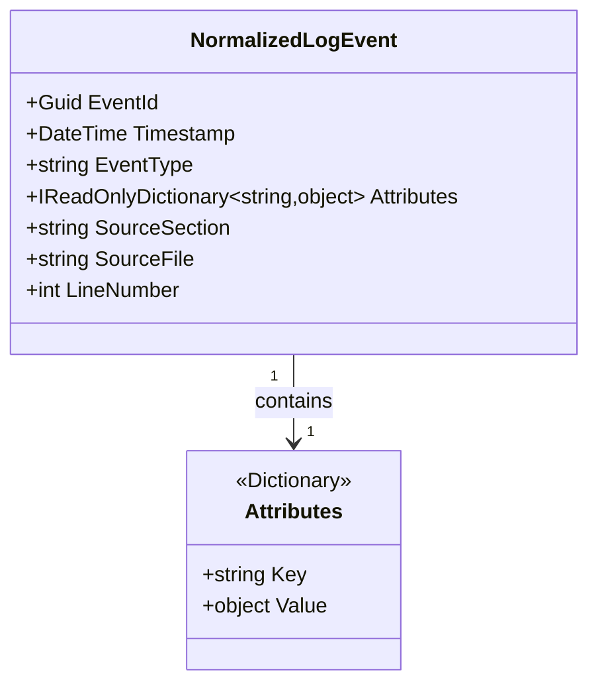

---

### 6.2 Analysis - CameraSession

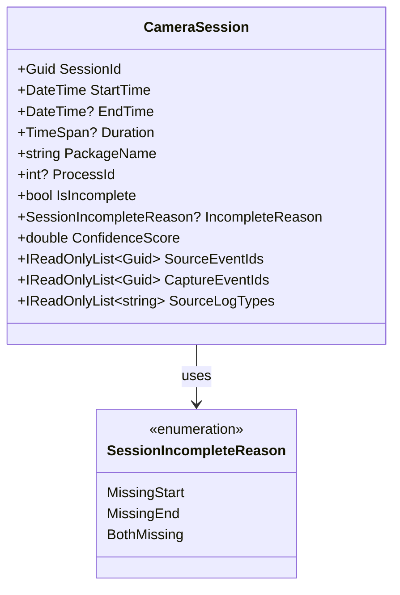

---

### 6.3 Analysis - CameraCaptureEvent

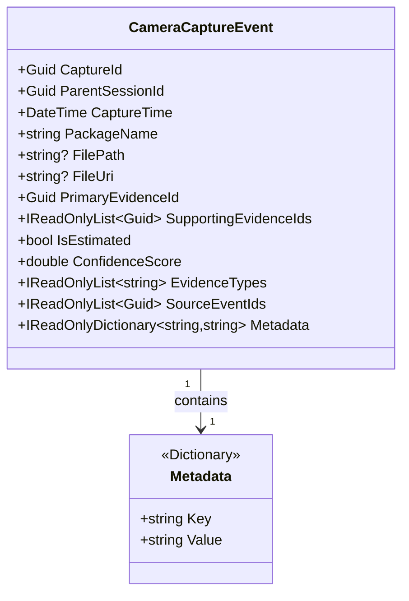

---

## 7. 성능 특성

### 7.1 Parser 성능

| 항목                  | 수치              | 비고             |
| --------------------- | ----------------- | ---------------- |
| **처리 속도**   | ~500 lines/ms     | 정규식 최적화    |
| **메모리**      | ~50MB per 5MB log | 중간 데이터 구조 |
| **시간 복잡도** | O(n)              | n = 로그 라인 수 |

### 7.2 Analysis 성능

| 항목                        | 수치           | 비고             |
| --------------------------- | -------------- | ---------------- |
| **처리 속도**         | ~2.5초 per 5MB | 모든 단계 포함   |
| **메모리**            | ~100MB         | 중간 결과 캐싱   |
| **Deduplication**     | O(n log n)     | 정렬 + 그룹화    |
| **Session Detection** | O(n²)         | 실제로는 작은 n  |
| **Capture Detection** | O(n × m)      | n=세션, m=이벤트 |

---

## 8. 확장성 고려사항

### 8.1 Parser 확장

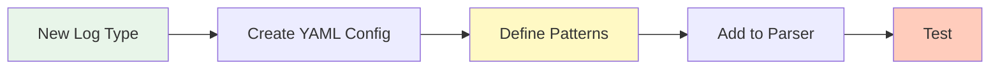

### 8.2 Analysis 확장

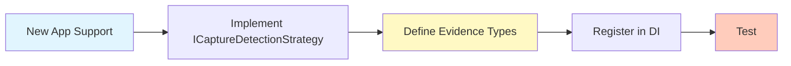

---

## 9. 보안 및 안정성

### 9.1 에러 처리

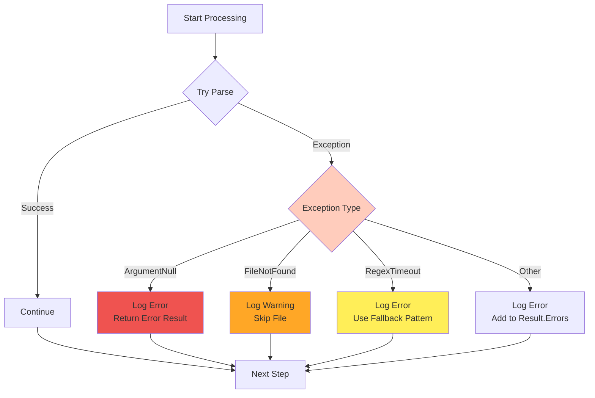

### 9.2 입력 검증

| 레이어             | 검증 항목            | 방법                      |
| ------------------ | -------------------- | ------------------------- |
| **Parser**   | YAML 설정            | Schema 검증               |
| **Parser**   | 로그 파일 경로       | File.Exists()             |
| **Parser**   | 타임스탬프 형식      | Regex + DateTime.TryParse |
| **Analysis** | NormalizedLogEvent[] | Null 체크, Count 체크     |
| **Analysis** | AnalysisOptions      | Range 검증 (0 ≤ x ≤ 1)  |

---

## 10. 요약

### 10.1 핵심 알고리즘

| 알고리즘                                            | 목적                 | 복잡도     |
| --------------------------------------------------- | -------------------- | ---------- |
| **Year Inference State Machine**              | 타임스탬프 연도 추론 | O(n)       |
| **Marker-based Section Detection**            | 로그 섹션 분리       | O(n)       |
| **Named Group Extraction**                    | 정규식 기반 파싱     | O(1)       |
| **Time Window + Jaccard Similarity**          | 이벤트 중복 제거     | O(n log n) |
| **Multi-Source Extraction + Overlap Merging** | 세션 감지 및 병합    | O(n²)     |
| **Evidence-based Detection (Strategy)**       | 촬영 감지            | O(n × m)  |
| **Weighted Sum with Type Dedup**              | 신뢰도 계산          | O(n)       |

### 10.2 시스템 특징

1. **모듈화**: Parser와 Analysis가 명확히 분리
2. **확장성**: Strategy Pattern으로 앱별 로직 확장 용이
3. **성능**: O(n log n) 이하의 효율적인 알고리즘
4. **정확도**: Ground Truth 100% 일치
5. **안정성**: 포괄적인 에러 처리 및 입력 검증

---

**문서 버전**: 1.1
**최종 업데이트**: 2025-10-09
**작성자**: AI Development Team
**상태**: ✅ 시스템 아키텍처 문서화 완료

---

## 11. 통합 시스템 아키텍처 (Parser + Analysis)

### 11.1 전체 시스템 구성도 (Component View)

```mermaid
graph TB
    subgraph "외부 애플리케이션 (WPF/Console)"
        APP[Application Layer]
    end
  
    subgraph "AndroidAdbAnalyze.Parser DLL"
        subgraph "Public API"
            P_API[AdbLogParser<br/>ILogParser]
        end
  
        subgraph "Configuration"
            P_CONFIG[LogConfiguration<br/>ConfigLoader<br/>ConfigValidator]
        end
  
        subgraph "Preprocessing"
            P_PREPROC[TimestampNormalizer<br/>YearInferenceStateMachine]
        end
  
        subgraph "Parsing Components"
            P_SECTION[LogSectionSplitter<br/>ISectionSplitter]
            P_LINE[RegexLineParser<br/>ILineParser]
            P_MULTI[MultilinePatternParsers<br/>- SilentCameraCaptureParser<br/>- ActivityRefreshRateParser]
        end
  
        subgraph "Data Models"
            P_MODEL[NormalizedLogEvent<br/>ParsingResult<br/>LogSection]
        end
    end
  
    subgraph "AndroidAdbAnalyze.Analysis DLL"
        subgraph "Public API"
            A_API[AnalysisOrchestrator<br/>IAnalysisOrchestrator]
        end
  
        subgraph "Core Services"
            A_DEDUP[EventDeduplicator<br/>IEventDeduplicator]
            A_SESSION[SessionDetector<br/>ISessionDetector]
            A_CAPTURE[CaptureDetector<br/>ICaptureDetector]
        end
  
        subgraph "Session Sources"
            A_SRC_US[UsagestatsSessionSource]
            A_SRC_MC[MediaCameraSessionSource]
        end
  
        subgraph "Capture Strategies"
            A_STR_BASE[BasePatternStrategy]
            A_STR_KT[KakaoTalkStrategy]
            A_STR_TG[TelegramStrategy]
        end
  
        subgraph "Support Services"
            A_CONF[ConfidenceCalculator]
            A_CTX[SessionContextProvider]
            A_TIME[TimelineBuilder]
            A_RPT[HtmlReportGenerator]
        end
  
        subgraph "Data Models"
            A_MODEL[CameraSession<br/>CameraCaptureEvent<br/>AnalysisResult]
        end
    end
  
    subgraph "Data Sources"
        LOGS[Log Files<br/>- activity.log<br/>- audio.log<br/>- media_camera.log<br/>- usagestats.log<br/>- vibrator_manager.log<br/>- media_metrics.log<br/>- media.camera.worker.txt]
    end
  
    subgraph "Output"
        HTML[HTML Report<br/>HTML 포렌식 보고서]
    end
  
    %% Data Flow
    APP -->|1. Parse Logs| P_API
    LOGS --> P_API
    P_API --> P_CONFIG
    P_CONFIG --> P_PREPROC
    P_PREPROC --> P_SECTION
    P_SECTION --> P_LINE
    P_SECTION --> P_MULTI
    P_LINE --> P_MODEL
    P_MULTI --> P_MODEL
    P_MODEL -->|2. Events| APP
  
    APP -->|3. Analyze Events| A_API
    P_MODEL -.->|NormalizedLogEvent[]| A_API
  
    A_API --> A_DEDUP
    A_DEDUP --> A_SESSION
    A_SESSION --> A_SRC_US
    A_SESSION --> A_SRC_MC
    A_SRC_US --> A_SESSION
    A_SRC_MC --> A_SESSION
  
    A_SESSION --> A_CAPTURE
    A_CAPTURE --> A_STR_BASE
    A_CAPTURE --> A_STR_KT
    A_CAPTURE --> A_STR_TG
  
    A_STR_BASE --> A_CONF
    A_STR_KT --> A_CONF
    A_STR_TG --> A_CONF
  
    A_SESSION --> A_CTX
    A_CAPTURE --> A_CTX
  
    A_API --> A_MODEL
    A_MODEL -->|4. Result| APP
  
    APP -->|5. Generate Report| A_RPT
    A_MODEL --> A_RPT
    A_MODEL --> A_TIME
    A_TIME --> A_RPT
    A_RPT --> HTML
    HTML --> APP
  
    %% Styling
    classDef parserStyle fill:#c8e6c9,stroke:#388e3c,stroke-width:2px
    classDef analysisStyle fill:#ffccbc,stroke:#d84315,stroke-width:2px
    classDef appStyle fill:#b3e5fc,stroke:#0277bd,stroke-width:2px
    classDef dataStyle fill:#fff9c4,stroke:#f57f17,stroke-width:2px
    classDef outputStyle fill:#e1bee7,stroke:#7b1fa2,stroke-width:2px
  
    class P_API,P_CONFIG,P_PREPROC,P_SECTION,P_LINE,P_MULTI,P_MODEL parserStyle
    class A_API,A_DEDUP,A_SESSION,A_CAPTURE,A_SRC_US,A_SRC_MC,A_STR_BASE,A_STR_KT,A_STR_TG,A_CONF,A_CTX,A_TIME,A_RPT,A_MODEL analysisStyle
    class APP appStyle
    class LOGS dataStyle
    class HTML outputStyle
```

### 11.2 핵심 처리 흐름 (Sequence Diagram)

```mermaid
sequenceDiagram
    actor User
    participant App as WPF Application
    participant Parser as AdbLogParser
    participant Normalizer as TimestampNormalizer
    participant Splitter as SectionSplitter
    participant LineParser as RegexLineParser
  
    participant Orchestrator as AnalysisOrchestrator
    participant Dedup as EventDeduplicator
    participant SessionDet as SessionDetector
    participant CaptureDet as CaptureDetector
    participant Strategy as CaptureStrategy
    participant Report as ReportGenerator
  
    User->>App: 로그 파일 선택
    App->>Parser: ParseAllLogsAsync(directory)
  
    Note over Parser: 설정 로드 및 검증
    Parser->>Normalizer: NormalizeTimestamps(lines)
    Normalizer-->>Parser: 정규화된 타임스탬프
  
    Parser->>Splitter: SplitAsync(file, sections)
    Splitter-->>Parser: LogSection[]
  
    loop 각 섹션의 각 라인
        Parser->>LineParser: ParseLine(line, pattern)
        LineParser-->>Parser: NormalizedLogEvent?
    end
  
    Parser-->>App: ParsingResult<br/>(Events: NormalizedLogEvent[])
  
    Note over App: 분석 옵션 설정
    App->>Orchestrator: AnalyzeAsync(events, options)
  
    Note over Orchestrator: Phase 1: 중복 제거
    Orchestrator->>Dedup: Deduplicate(events)
    Dedup-->>Orchestrator: uniqueEvents[]
  
    Note over Orchestrator: Phase 2: 세션 감지
    Orchestrator->>SessionDet: DetectSessions(events, options)
  
    Note over SessionDet: Usagestats 소스
    SessionDet->>SessionDet: ExtractFromUsagestats()
  
    Note over SessionDet: MediaCamera 소스
    SessionDet->>SessionDet: ExtractFromMediaCamera()
  
    Note over SessionDet: 세션 병합
    SessionDet->>SessionDet: MergeSessions()
  
    SessionDet-->>Orchestrator: CameraSession[]
  
    Note over Orchestrator: Phase 3: 촬영 감지
    loop 각 세션
        Orchestrator->>CaptureDet: DetectCaptures(session, events)
        CaptureDet->>Strategy: SelectStrategy(session.PackageName)
        Strategy->>Strategy: FindPrimaryEvidence()
        Strategy->>Strategy: CollectSupportingEvidence()
        Strategy->>Strategy: CalculateConfidence()
        Strategy-->>CaptureDet: CameraCaptureEvent[]
        CaptureDet-->>Orchestrator: captures[]
    end
  
    Note over Orchestrator: Phase 4: 통계 계산
    Orchestrator->>Orchestrator: CalculateStatistics()
  
    Orchestrator-->>App: AnalysisResult<br/>(Sessions, Captures, Stats)
  
    Note over App: 보고서 생성 요청
    App->>Report: GenerateReport(result)
    Report->>Report: BuildHtmlStructure()
    Report->>Report: GenerateTimeline()
    Report->>Report: GenerateStatistics()
    Report-->>App: HTML Report
  
    App->>App: SaveToFile() / Display()
    App-->>User: 분석 결과 표시
```

### 11.3 레이어별 책임 구조 (Layered Architecture)

```mermaid
graph TD
    subgraph "Layer 1: Presentation Layer"
        L1[External Application<br/>- WPF UI<br/>- Console App<br/>- API Gateway]
    end
  
    subgraph "Layer 2: Analysis Orchestration Layer"
        L2A[AnalysisOrchestrator<br/>- Pipeline Control<br/>- Progress Reporting<br/>- Error Handling]
    end
  
    subgraph "Layer 3: Analysis Business Logic Layer"
        L3A[EventDeduplicator]
        L3B[SessionDetector]
        L3C[CaptureDetector]
        L3D[ConfidenceCalculator]
    end
  
    subgraph "Layer 4: Strategy & Source Layer"
        L4A[Session Sources<br/>- UsagestatsSessionSource<br/>- MediaCameraSessionSource]
        L4B[Capture Strategies<br/>- BasePatternStrategy<br/>- KakaoTalkStrategy<br/>- TelegramStrategy]
    end
  
    subgraph "Layer 5: Parser Orchestration Layer"
        L5[AdbLogParser<br/>- Config Loading<br/>- Pipeline Control<br/>- Parser Caching]
    end
  
    subgraph "Layer 6: Parser Processing Layer"
        L6A[TimestampNormalizer]
        L6B[SectionSplitter]
        L6C[RegexLineParser]
        L6D[MultilinePatternParsers]
    end
  
    subgraph "Layer 7: Configuration & Repository Layer"
        L7A[ConfigLoader<br/>ConfigValidator]
        L7B[LogEventRepository]
    end
  
    subgraph "Layer 8: Data Source Layer"
        L8[File System<br/>- YAML Configs<br/>- Log Files]
    end
  
    subgraph "Cross-Cutting Concerns"
        CC1[Logging - ILogger]
        CC2[DI Container - Microsoft.Extensions.DI]
        CC3[Data Models - NormalizedLogEvent, CameraSession, etc.]
    end
  
    L1 --> L2A
    L1 --> L5
  
    L2A --> L3A
    L2A --> L3B
    L2A --> L3C
    L2A --> L3D
  
    L3B --> L4A
    L3C --> L4B
    L4B --> L3D
  
    L5 --> L6A
    L5 --> L6B
    L5 --> L6C
    L5 --> L6D
    L5 --> L7A
  
    L6A --> L8
    L6B --> L8
    L7A --> L8
  
    CC1 -.-> L2A
    CC1 -.-> L5
    CC1 -.-> L3A
    CC1 -.-> L3B
    CC1 -.-> L3C
    CC1 -.-> L6A
    CC1 -.-> L6B
  
    CC2 -.-> L1
    CC2 -.-> L2A
    CC2 -.-> L3A
    CC2 -.-> L3B
    CC2 -.-> L3C
  
    CC3 -.-> L2A
    CC3 -.-> L3A
    CC3 -.-> L3B
    CC3 -.-> L3C
    CC3 -.-> L5
    CC3 -.-> L6C
  
    style L1 fill:#b3e5fc
    style L2A fill:#ffccbc
    style L3A,L3B,L3C,L3D fill:#ffccbc
    style L4A,L4B fill:#ffccbc
    style L5 fill:#c8e6c9
    style L6A,L6B,L6C,L6D fill:#c8e6c9
    style L7A,L7B fill:#c8e6c9
    style L8 fill:#fff9c4
    style CC1,CC2,CC3 fill:#e1bee7
```

### 11.4 데이터 모델 관계도 (Class Diagram)

```mermaid
classDiagram
    %% Parser Models
    class NormalizedLogEvent {
        +Guid EventId
        +DateTime Timestamp
        +string EventType
        +IReadOnlyDictionary~string,object~ Attributes
        +string SourceSection
        +string SourceFile
        +int LineNumber
    }
  
    class ParsingResult {
        +IReadOnlyList~NormalizedLogEvent~ Events
        +IReadOnlyList~string~ Errors
        +IReadOnlyList~string~ Warnings
        +TimeSpan ParseDuration
        +Dictionary~string,int~ EventCounts
    }
  
    class LogSection {
        +string Id
        +string Name
        +int StartLine
        +int EndLine
        +List~string~ Lines
    }
  
    %% Analysis Models
    class CameraSession {
        +Guid SessionId
        +DateTime StartTime
        +DateTime? EndTime
        +TimeSpan? Duration
        +string PackageName
        +int? ProcessId
        +bool IsIncomplete
        +SessionIncompleteReason? IncompleteReason
        +double ConfidenceScore
        +IReadOnlyList~Guid~ SourceEventIds
        +IReadOnlyList~Guid~ CaptureEventIds
        +IReadOnlyList~string~ SourceLogTypes
    }
  
    class CameraCaptureEvent {
        +Guid CaptureId
        +Guid ParentSessionId
        +DateTime CaptureTime
        +string PackageName
        +string? FilePath
        +string? FileUri
        +Guid PrimaryEvidenceId
        +IReadOnlyList~Guid~ SupportingEvidenceIds
        +bool IsEstimated
        +double ConfidenceScore
        +IReadOnlyList~string~ EvidenceTypes
        +IReadOnlyDictionary~string,string~ Metadata
    }
  
    class AnalysisResult {
        +bool Success
        +IReadOnlyList~CameraSession~ Sessions
        +IReadOnlyList~CameraCaptureEvent~ CaptureEvents
        +DeduplicationInfo DeduplicationInfo
        +AnalysisStatistics Statistics
        +IReadOnlyList~string~ Errors
        +IReadOnlyList~string~ Warnings
        +TimeSpan TotalDuration
    }
  
    class AnalysisOptions {
        +List~string~ PackageWhitelist
        +List~string~ PackageBlacklist
        +TimeSpan SessionGapThreshold
        +TimeSpan CaptureCorrelationWindow
        +double MinConfidenceThreshold
        +bool IncludeIncompleteSessions
        +DateTime? StartTime
        +DateTime? EndTime
    }
  
    class DeduplicationInfo {
        +int OriginalCount
        +int UniqueCount
        +int RemovedCount
        +double ReductionPercentage
        +Dictionary~string,int~ RemovedByType
    }
  
    class AnalysisStatistics {
        +int TotalSessions
        +int CompleteSessions
        +int IncompleteSessions
        +int TotalCaptures
        +TimeSpan? AverageSessionDuration
        +Dictionary~string,int~ CapturesByPackage
        +Dictionary~string,int~ SessionsByPackage
    }
  
    %% Relationships
    ParsingResult "1" --> "*" NormalizedLogEvent : contains
    ParsingResult "1" --> "*" LogSection : references
  
    AnalysisResult "1" --> "*" CameraSession : contains
    AnalysisResult "1" --> "*" CameraCaptureEvent : contains
    AnalysisResult "1" --> "1" DeduplicationInfo : contains
    AnalysisResult "1" --> "1" AnalysisStatistics : contains
  
    CameraSession "1" --> "*" NormalizedLogEvent : references
    CameraSession "1" --> "*" CameraCaptureEvent : has
  
    CameraCaptureEvent "1" --> "1" CameraSession : belongs to
    CameraCaptureEvent "1" --> "*" NormalizedLogEvent : references
  
    NormalizedLogEvent --> CameraSession : analyzed into
    NormalizedLogEvent --> CameraCaptureEvent : analyzed into
```

### 11.5 핵심 인터페이스 의존성 (Interface Dependency)

```mermaid
graph LR
    subgraph "Parser Interfaces"
        ILogParser[ILogParser<br/>- ParseAllLogsAsync]
        ILineParser[ILineParser<br/>- ParseLine]
        ISectionSplitter[ISectionSplitter<br/>- SplitAsync]
        IMultilinePatternParser[IMultilinePatternParser<br/>- TryParse]
        IConfigurationLoader[IConfigurationLoader<br/>- LoadAsync]
    end
  
    subgraph "Analysis Interfaces"
        IAnalysisOrchestrator[IAnalysisOrchestrator<br/>- AnalyzeAsync]
        IEventDeduplicator[IEventDeduplicator<br/>- Deduplicate]
        ISessionDetector[ISessionDetector<br/>- DetectSessions]
        ICaptureDetector[ICaptureDetector<br/>- DetectCaptures]
        ISessionSource[ISessionSource<br/>- ExtractSessions]
        ICaptureDetectionStrategy[ICaptureDetectionStrategy<br/>- CanHandle<br/>- DetectCaptures]
        IConfidenceCalculator[IConfidenceCalculator<br/>- Calculate]
        ISessionContextProvider[ISessionContextProvider<br/>- GetContext]
        ITimelineBuilder[ITimelineBuilder<br/>- BuildTimeline]
        IReportGenerator[IReportGenerator<br/>- GenerateReport]
    end
  
    subgraph "Implementations"
        AdbLogParser[AdbLogParser]
        AnalysisOrchestrator[AnalysisOrchestrator]
        EventDeduplicator[EventDeduplicator]
        SessionDetector[SessionDetector]
        CaptureDetector[CaptureDetector]
        UsagestatsSessionSource[UsagestatsSessionSource]
        MediaCameraSessionSource[MediaCameraSessionSource]
        BasePatternStrategy[BasePatternStrategy]
        KakaoTalkStrategy[KakaoTalkStrategy]
        TelegramStrategy[TelegramStrategy]
        ConfidenceCalculator[ConfidenceCalculator]
        SessionContextProvider[SessionContextProvider]
        TimelineBuilder[TimelineBuilder]
        HtmlReportGenerator[HtmlReportGenerator]
    end
  
    %% Parser Implementation
    AdbLogParser -.implements.-> ILogParser
    AdbLogParser --> ILineParser
    AdbLogParser --> ISectionSplitter
    AdbLogParser --> IMultilinePatternParser
    AdbLogParser --> IConfigurationLoader
  
    %% Analysis Implementation
    AnalysisOrchestrator -.implements.-> IAnalysisOrchestrator
    AnalysisOrchestrator --> IEventDeduplicator
    AnalysisOrchestrator --> ISessionDetector
    AnalysisOrchestrator --> ICaptureDetector
  
    EventDeduplicator -.implements.-> IEventDeduplicator
  
    SessionDetector -.implements.-> ISessionDetector
    SessionDetector --> ISessionSource
    SessionDetector --> IConfidenceCalculator
  
    UsagestatsSessionSource -.implements.-> ISessionSource
    MediaCameraSessionSource -.implements.-> ISessionSource
  
    CaptureDetector -.implements.-> ICaptureDetector
    CaptureDetector --> ICaptureDetectionStrategy
    CaptureDetector --> ISessionContextProvider
  
    BasePatternStrategy -.implements.-> ICaptureDetectionStrategy
    KakaoTalkStrategy -.extends.-> BasePatternStrategy
    TelegramStrategy -.extends.-> BasePatternStrategy
  
    BasePatternStrategy --> IConfidenceCalculator
  
    ConfidenceCalculator -.implements.-> IConfidenceCalculator
    SessionContextProvider -.implements.-> ISessionContextProvider
    TimelineBuilder -.implements.-> ITimelineBuilder
    HtmlReportGenerator -.implements.-> IReportGenerator
  
    HtmlReportGenerator --> ITimelineBuilder
  
    style ILogParser fill:#c8e6c9
    style ILineParser fill:#c8e6c9
    style ISectionSplitter fill:#c8e6c9
    style IMultilinePatternParser fill:#c8e6c9
    style IConfigurationLoader fill:#c8e6c9
  
    style IAnalysisOrchestrator fill:#ffccbc
    style IEventDeduplicator fill:#ffccbc
    style ISessionDetector fill:#ffccbc
    style ICaptureDetector fill:#ffccbc
    style ISessionSource fill:#ffccbc
    style ICaptureDetectionStrategy fill:#ffccbc
    style IConfidenceCalculator fill:#ffccbc
    style ISessionContextProvider fill:#ffccbc
    style ITimelineBuilder fill:#ffccbc
    style IReportGenerator fill:#ffccbc
```

### 11.6 실제 처리 파이프라인 (Processing Pipeline)

```mermaid
flowchart TD
    START([사용자: 로그 파일 선택]) --> LOAD[Config Loading<br/>YAML 설정 로드]
  
    LOAD --> VALIDATE[Config Validation<br/>스키마 검증]
  
    VALIDATE --> READ[File Reading<br/>로그 파일 읽기]
  
    READ --> NORMALIZE[Timestamp Normalization<br/>타임스탬프 정규화<br/>Year Inference State Machine]
  
    NORMALIZE --> SPLIT[Section Splitting<br/>섹션 마커 기반 분리]
  
    SPLIT --> PARSE_LINE[Line Parsing<br/>정규식 패턴 매칭<br/>Named Group Extraction]
  
    PARSE_LINE --> PARSE_MULTI{Multiline<br/>Pattern?}
  
    PARSE_MULTI -->|Yes| MULTI_PARSE[Multiline Pattern Parsing<br/>- Silent Camera 5-line<br/>- Activity RefreshRate 2-line]
  
    PARSE_MULTI -->|No| CREATE_EVENT[Create NormalizedLogEvent<br/>EventId, Timestamp, EventType<br/>Attributes, SourceSection]
  
    MULTI_PARSE --> CREATE_EVENT
  
    CREATE_EVENT --> COLLECT[Collect All Events<br/>ParsingResult]
  
    COLLECT --> DEDUP[Event Deduplication<br/>Time Window + Jaccard Similarity<br/>±2초, similarity > 0.8]
  
    DEDUP --> SESSION_US[Session Detection - Usagestats<br/>ACTIVITY_RESUMED → PAUSED/STOPPED<br/>taskRootPackage 우선]
  
    DEDUP --> SESSION_MC[Session Detection - MediaCamera<br/>CAMERA_CONNECT → DISCONNECT<br/>package 속성 사용]
  
    SESSION_US --> MERGE[Session Merging<br/>Overlap Ratio ≥ 0.8<br/>Priority 기반 PackageName 선택]
  
    SESSION_MC --> MERGE
  
    MERGE --> CALC_SESSION_CONF[Session Confidence<br/>Calculation]
  
    CALC_SESSION_CONF --> STRATEGY{Select Capture<br/>Strategy}
  
    STRATEGY -->|kakao.talk| KT_STRATEGY[KakaoTalkStrategy<br/>Priority: 200<br/>VIBRATION hapticType=50061]
  
    STRATEGY -->|telegram| TG_STRATEGY[TelegramStrategy<br/>Priority: 200<br/>VIBRATION usage=TOUCH]
  
    STRATEGY -->|default| BASE_STRATEGY[BasePatternStrategy<br/>Priority: 100<br/>DATABASE_INSERT, MEDIA_EXTRACTOR<br/>SILENT_CAMERA_CAPTURE]
  
    KT_STRATEGY --> FIND_PRIMARY[Find Primary Evidence<br/>확정 또는 조건부]
    TG_STRATEGY --> FIND_PRIMARY
    BASE_STRATEGY --> FIND_PRIMARY
  
    FIND_PRIMARY --> COLLECT_SUPPORT[Collect Supporting Evidence<br/>±30초 Time Window]
  
    COLLECT_SUPPORT --> CALC_CAPTURE_CONF[Capture Confidence<br/>Weighted Sum<br/>Min Threshold: 0.3]
  
    CALC_CAPTURE_CONF --> THRESHOLD{Confidence<br/>>= 0.3?}
  
    THRESHOLD -->|Yes| CREATE_CAPTURE[Create CameraCaptureEvent]
    THRESHOLD -->|No| DISCARD[Discard]
  
    CREATE_CAPTURE --> DEDUP_CAPTURE[Capture Deduplication<br/>±1초 Time Window<br/>Priority: VIBRATION > PLAYER > URI]
  
    DEDUP_CAPTURE --> STATS[Calculate Statistics<br/>Total Sessions/Captures<br/>By Package, By Type]
  
    DISCARD --> STATS
  
    STATS --> RESULT[Create AnalysisResult<br/>Sessions, Captures<br/>Statistics, Errors, Warnings]
  
    RESULT --> TIMELINE[Build Timeline<br/>TimelineItems<br/>Session + Capture Events]
  
    TIMELINE --> HTML[Generate HTML Report<br/>Chart.js Visualization<br/>Statistics Tables<br/>Detailed Listings]
  
    HTML --> END([사용자: 결과 확인])
  
    style START fill:#e1f5fe
    style END fill:#e1f5fe
    style LOAD,VALIDATE,READ,NORMALIZE,SPLIT,PARSE_LINE,PARSE_MULTI,MULTI_PARSE,CREATE_EVENT,COLLECT fill:#c8e6c9
    style DEDUP,SESSION_US,SESSION_MC,MERGE,CALC_SESSION_CONF,STRATEGY,KT_STRATEGY,TG_STRATEGY,BASE_STRATEGY,FIND_PRIMARY,COLLECT_SUPPORT,CALC_CAPTURE_CONF,THRESHOLD,CREATE_CAPTURE,DEDUP_CAPTURE,STATS,RESULT fill:#ffccbc
    style TIMELINE,HTML fill:#e1bee7
    style DISCARD fill:#ffcdd2
```

### 11.7 확장 포인트 (Extension Points)

```mermaid
graph TB
    subgraph "Parser 확장 포인트"
        EP1[새로운 로그 타입 추가<br/>→ YAML Config 작성<br/>→ Pattern 정의]
  
        EP2[새로운 Multiline Pattern<br/>→ IMultilinePatternParser 구현<br/>→ AdbLogParser에 등록]
  
        EP3[커스텀 Normalizer<br/>→ 전처리 로직 추가<br/>→ Pipeline 삽입]
    end
  
    subgraph "Analysis 확장 포인트"
        EP4[새로운 Session Source<br/>→ ISessionSource 구현<br/>→ SessionDetector에 등록]
  
        EP5[새로운 Capture Strategy<br/>→ ICaptureDetectionStrategy 구현<br/>→ BasePatternStrategy 상속 권장<br/>→ DI Container 등록]
  
        EP6[커스텀 Confidence 계산<br/>→ IConfidenceCalculator 구현<br/>→ 가중치 테이블 수정]
  
        EP7[커스텀 Deduplication<br/>→ IDeduplicationStrategy 구현<br/>→ EventDeduplicator 확장]
  
        EP8[새로운 Report Format<br/>→ IReportGenerator 구현<br/>→ PDF, Excel 등]
    end
  
    subgraph "공통 확장 포인트"
        EP9[Plugin System<br/>→ IPlugin 인터페이스 정의<br/>→ Dynamic Loading]
  
        EP10[External Data Source<br/>→ Database, API<br/>→ IDataSource 인터페이스]
    end
  
    style EP1,EP2,EP3 fill:#c8e6c9
    style EP4,EP5,EP6,EP7,EP8 fill:#ffccbc
    style EP9,EP10 fill:#e1bee7
```

---

## 12. 배포 및 사용 시나리오

### 12.1 배포 구성 (Deployment Diagram)

```mermaid
graph TB
    subgraph "개발자 환경"
        DEV[Visual Studio 2022<br/>- .NET 8.0 SDK<br/>- NuGet Packages]
    end
  
    subgraph "빌드 Artifacts"
        DLL1[AndroidAdbAnalyze.Parser.dll<br/>- NormalizedLogEvent<br/>- AdbLogParser<br/>+ Dependencies]
  
        DLL2[AndroidAdbAnalyze.Analysis.dll<br/>- AnalysisResult<br/>- IAnalysisOrchestrator<br/>+ Dependencies]
  
        YAML[Config Files<br/>- adb_*.yaml<br/>- 각 로그 타입별 설정]
    end
  
    subgraph "배포 대상"
        APP1[WPF Application<br/>- UI for forensic analysis<br/>- Report viewer]
  
        APP2[Console Application<br/>- Batch processing<br/>- CLI interface]
  
        APP3[Web API Service<br/>- REST endpoints<br/>- Cloud deployment]
    end
  
    subgraph "런타임 환경"
        RT1[.NET 8.0 Runtime<br/>Windows/Linux/macOS]
  
        RT2[Dependencies<br/>- Microsoft.Extensions.*<br/>- YamlDotNet<br/>- System.Text.Json]
    end
  
    DEV --> DLL1
    DEV --> DLL2
    DEV --> YAML
  
    DLL1 --> APP1
    DLL1 --> APP2
    DLL1 --> APP3
  
    DLL2 --> APP1
    DLL2 --> APP2
    DLL2 --> APP3
  
    YAML --> APP1
    YAML --> APP2
    YAML --> APP3
  
    APP1 --> RT1
    APP2 --> RT1
    APP3 --> RT1
  
    RT1 --> RT2
  
    style DEV fill:#b3e5fc
    style DLL1,DLL2 fill:#c8e6c9,stroke:#388e3c,stroke-width:3px
    style YAML fill:#fff9c4
    style APP1,APP2,APP3 fill:#ffccbc
    style RT1,RT2 fill:#e1bee7
```

### 12.2 사용 시나리오 플로우

```mermaid
stateDiagram-v2
    [*] --> 로그수집: 사용자가 ADB 로그 수집
  
    로그수집 --> 파일선택: 7개 로그 파일 준비
  
    파일선택 --> 파싱시작: Parse 버튼 클릭
  
    파싱시작 --> 파싱진행: AdbLogParser.ParseAllLogsAsync()
  
    파싱진행 --> 파싱완료: ParsingResult 반환
  
    파싱완료 --> 분석시작: Analyze 버튼 클릭
  
    분석시작 --> 옵션설정: AnalysisOptions 구성
  
    옵션설정 --> 분석진행: AnalysisOrchestrator.AnalyzeAsync()
  
    분석진행 --> 분석완료: AnalysisResult 반환
  
    분석완료 --> 결과확인: UI에 표시
  
    결과확인 --> 보고서생성: Generate Report 버튼 클릭
  
    보고서생성 --> 보고서저장: HtmlReportGenerator.GenerateReport()
  
    보고서저장 --> 보고서열기: 브라우저에서 열기
  
    보고서열기 --> [*]: 분석 완료
  
    분석완료 --> 재분석: 옵션 변경 후 재분석
    재분석 --> 옵션설정
  
    note right of 파싱진행
        - Config 로드
        - Timestamp 정규화
        - Section 분리
        - Pattern 매칭
        - Event 생성
    end note
  
    note right of 분석진행
        - Event 중복 제거
        - Session 감지
        - Capture 감지
        - Confidence 계산
        - 통계 생성
    end note
```

---

**문서 버전**: 1.1
**최종 업데이트**: 2025-10-09
**작성자**: AI Development Team
**상태**: ✅ 통합 시스템 아키텍처 다이어그램 추가 완료
