# (c)creative <br> C O M M O N S D E E D 

## 저작자표시-비영리-변경금지 2.0 대한민국

이용자는 아래의 조건을 따르는 경우에 한하여 자유롭게

- 이 저작물을 복제, 배포, 전송, 전시, 공연 및 방송할 수 있습니다.

다음과 같은 조건을 따라야 합니다:


저작자표시. 귀하는 원저작자를 표시하여야 합니다.

비영리. 귀하는 이 저작물을 영리 목적으로 이용할 수 없습니다.

변경금지. 귀하는 이 저작물을 개작, 변형 또는 가공할 수 없습니다.

- 귀하는, 이 저작물의 재이용이나 배포의 경우, 이 저작물에 적용된 이용허락조건 을 명확하게 나타내어야 합니다.
- 저작권자로부터 별도의 허가를 받으면 이러한 조건들은 적용되지 않습니다.

저작권법에 따른 이용자의 권리는 위의 내용에 의하여 영향을 받지 않습니다.
이것은 이용허락규약(Legal Code)을 이해하기 쉽게 요약한 것입니다.
Disclaimer $\square$

# 석사학위논문 

## 스마트폰 촬영을 통한 정보 유출 보호 시스템(ODILSS)에 관한 연구

A Study on the Information Leak Security System(ODILSS)
Through Smartphone Photography


컴퓨터공학과

김 령 호
2021. 08 .

# 석사학위논문 

## 스마트폰 촬영을 통한 정보 유출 보호 시스템(ODILSS)에 관한 연구

A Study on the Information Leak Security System(ODILSS)
Through Smartphone Photography
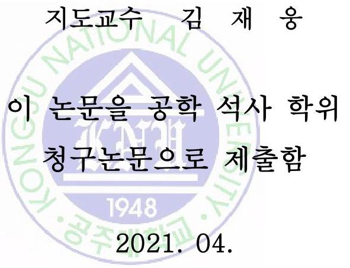

공 주 대 학 교 대 학 원

컴퓨터공학과

김 령 호

# 김 령 호의 공학석사학위 청구논문을 인준함 

2021. 06.

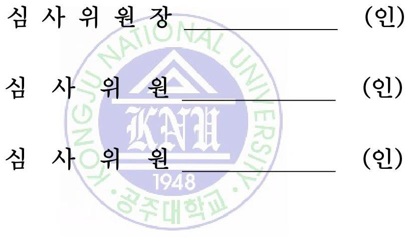

공 주 대 학 교 대 학 원

# 목 

I . 서론 ..... 1
1.1. 연구의 배경 및 필요성 ..... 1
1.2. 논문의 구성 ..... 3
II. 관련연구 ..... 4
2.1. 하드웨어 정보 유출 보호 방법 ..... 4
2.1.1. 스마트폰 반입 불가 ..... 4
2.1.2. 스마트폰 카메라 보안스티커 ..... 4
2.1.3. 스크린 보안필름 ..... 5
2.2. 소프트웨어 정보 유출 보호 방법 ..... 5
2.2.1. 스마트폰 MDM 솔루션 ..... 5
2.3. 현존 보호 방식의 문제점 ..... 6
2.4. 이미지 프로세싱 ..... 7
2.4.1. 이미지 프로세싱의 종류 ..... 7
2.4.2. 객체 탐지 알고리즘 ..... 9
2.4.3. YOLO 알고리즘 ..... 12
III. 객체 탐지 정보 유출 보호 시스템 설계 및 구현 ..... 16
3.1. 전체 시스템 구성도 ..... 16
3.2. 유스케이스 다이어그램 ..... 18
3.3. 시스템 프로세스 흐름도 ..... 19
3.4. 클래스 다이어그램 ..... 20
3.5. 객체 검출 시퀀스 다이어그램 ..... 21
3.6. ODILSS 설계 ..... 22
3.6.1. 관제 센터 DB 통신 설계 ..... 22

3.6.2. 관제 센터 DB 데이터 구조 설계 ..... 23
3.6.3. DB 통신 메시지 구조 설계 ..... 24
3.6.4. 시스템 구현 환경 ..... 25
3.6.5. 카메라 통신 및 객체 탐지 설계 ..... 25
3.6.6. 시스템 설정 정보 설계 ..... 28
3.6.7. 시스템과 관제 센터 DB 데이터 매핑 ..... 28
3.6.8. 민감 정보 PC 스크린 제어 ..... 30
3.7. ODILSS 화면 구성 ..... 31
3.8. ODILSS 이미지 프로세싱 순서도 ..... 32
3.9. 객체 검출 이벤트 설계 ..... 33
IV. 실험 결과 ..... 34
4.1. 스마트폰 영상 정보의 객체 검출 실험 ..... 34
4.1.1. 삼성 스마트폰 영상 ..... 34
4.1.2. 애플 스마트폰 영상 ..... 35
4.1.3. 구글 스마트폰 영상 ..... 36
4.1.4. 샤오미 스마트폰 영상 ..... 37
4.1.5. 비정형 스마트폰 영상 ..... 38
4.2. ODILSS 스마트폰 객체 검출 실험 ..... 39
4.2.1. 실험 환경 ..... 39
4.2.2. 관제 센터 모니터링 시스템 ..... 40
4.2.3. 스크린 보호 모드 ..... 42
V. 결론 및 향후 연구 방향 ..... 43
참고문헌 ..... 45
Abstract ..... 47

# [ 그림 차례 ] 

[그림 1] 스마트폰 보안스티커 ..... 4
[그림 2] 마이크로 루버의 구조 ..... 5
[그림 3] 컴퓨터 비전의 절차도 ..... 7
[그림 4] 콘볼루션 신경망 ..... 9
[그림 5] 슬라이딩 윈도우 방식의 경계 상자 ..... 10
[그림 6] 딥러닝을 이용한 객체 탐지 알고리즘 논문 ..... 11
[그림 7] YOLO 알고리즘 객체 추론 절차 ..... 13
[그림 8] YOLO 알고리즘 객체 추론 결과 ..... 14
[그림 9] Non-Maximum Suppression 연산 ..... 15
[그림 10] IOU 연산 ..... 15
[그림 11] ODILSS 구성도 ..... 16
[그림 12] ODILSS 유스케어스 다이어그램 ..... 18
[그림 13] ODILSS 프로세스 순서도 ..... 19
[그림 14] ODILSS 코드 탭 다이어그램 ..... 20
[그림 15] ODILSS 시퀀스 다이어그램 ..... 21
[그림 16] ODILSS DB Connetion 설정 ..... 22
[그림 17] 관제 센터 DB 테이블 목록 ..... 23
[그림 18] 관제 센터 DB 테이블 스키마 ..... 23
[그림 19] 관제 센터 DB 통신 데이터 구조 ..... 24
[그림 20] ODILSS 개발 환경 ..... 25
[그림 21] ODILSS 카메라 장치 연결 ..... 26
[그림 22] ODILSS 객체 검출 알고리즘 ..... 27
[그림 23] Global 클래스 설계 ..... 28

[그림 24] clsMYDB 클래스 설계 ..... 29
[그림 25] ODILSS 스크린 제어 명령 ..... 30
[그림 26] ODILSS 스크린 보호 모드 ..... 31
[그림 27] ODILSS 이미지프로세싱 순서도 ..... 32
[그림 28] ODILSS 객체 검출 이벤트 데이터 삽입 ..... 33
[그림 29] 삼성 스마트폰 객체 검출 결과 ..... 34
[그림 30] 애플 스마트폰 객체 검출 결과 ..... 35
[그림 31] 구글 스마트폰 객체 검출 결과 ..... 36
[그림 32] 샤오미 스마트폰 객체 검출 결과 ..... 37
[그림 33] 비정형 스마트폰 객체 검출 결과 ..... 38
[그림 34] ODILSS 카메라 설치 위치 ..... 39
[그림 35] 관제 센터 모니터링 시스템 대기 화면 ..... 40
[그림 36] 관제 센터 모니터링 시스템 이벤트 발생 ..... 41
[그림 37] ODILSS 스크린 보호 모드 작동 ..... 42

# I. 서론 

## 1.1. 연구의 배경 및 필요성

일반적으로 정보 유출 보안은 해킹이나 악성코드 등 외부에 의한 위협에 대 응하는 영역과 내부에서 외부로의 데이터 유출 등 내부자에 의한 위협에 대응 하는 영역으로 분류한다.

외부에 의한 위협에 대응하기 위해 방화벽, VPN, 시스템접속기록관리, 인터 넷 $\cdot$ 업무망 분리, 가상화 시스템, 데이터베이스 암호화, USB 보안 등 다양한 솔루션을 도입한다. 그 결과 외부에 의한 위협에 의한 정보 유출 사례는 크게 줄고 있다.

하지만, 내부에 의한 위협은 외부에 의한 위협보다 사전 탐지가 어렵고, 그 피해가 크며, 정보 유출 후 피해규모도 훨씬 클 수 있다. 2014년에 발생한 국 내 3 개 금융 회사의 개인 산출 정보 대량 유출사고, N번방 피의자 중 주민 정보 불법 조회 및 유출 사고, 해군본부 함정기술처 기밀자료 유출사고 등 내 부에 의해 발생한 정보 유출 사고는 증가하고 있는 추세이다.

내부에 의한 위협은 검색대에서 물리적인 보안조치를 회피할 수 있으며, 조 직의 보안, 데이터 및 시스템에 관한 정보 및 접근권한을 가지고 있다. 내부자 는 시스템에 대한 합법적인 접근 권한을 소유하고 있으며, 각종 보안솔루션 프로세스를 잘 알고 이를 우회하는 방법도 알 수 있어 사전감지 및 차단이 어 렵고, 정보 유출 흔적도 남지 않기 때문에 정보 유출 시 피해 규모도 훨씬 클 수 있다[12][10]. Insider Threat 2018 보고서는 조사 대상 기업의 $53 \%$ 가 지난 12 개월 동안 조직에 대한 내부자 공격을 확인했으며, $27 \%$ 는 내부자 공 격이 더 빈번해졌다고 응답했다. 연구에 따르면 내부자 공격의 $70 \%$ 이상이 외부로 공개되지 않았으며, 매년 내부자 관련 위반 건수가 등가한다고 한다.

또한, Verizon 2019 데이터 유출 조사 보고서에 따르면 2018년 모든 보안 규정 위반의 $34 \%$ 가 내부자에 의해 발생했다. 내부자에 의한 정보 유출을 보 호하기 위해 다양한 방법을 적용하고 있지만, 내부자에 의한 정보 유출은 꾸 준히 증가하고 있다. 정보 유출을 보호하기 위해 다양한 솔루션을 도입한 결 과, 작업용이성 하락, 시스템충돌, 솔루션 간 호환불가능, 과도한 시스템 권한 요구, 시스템 부하 및 성능하락 등의 문제가 발생한다. 이러한 이유로 솔루션 을 매뉴얼대로 사용하지 않기 때문에, 솔루션의 보안 취약점을 통해 정보 유 출이 발생 할 수 있다.

내부의 정보 유출 경로중 하나인 스마트폰 사진 촬영을 통한 정보 유출을 보호하기 위해 하드웨어, 소프트웨어 조치가 있다.

하드웨어적 조치로는, 스마트폰 반입불가, 스마트폰 카메라 보안스티커, 정 보PC 스크린 보안필름 부착 등의 방법을 사용한다. 소프트웨어적으로 스마트 폰 MDM(Mobile Device Management) 솔루션을 스마트폰에 설치해서 스마 트폰 사진촬영 및 데이터통신 등의 기능을 제한한다.

본 논문에서는 스마트폰 사진 촬영을 통한 방식으로 정보가 유출되는 것을 보호 할 수 있는 시스템에 관한 연구를 한다.

민감 정보에 접근이 가능한 PC의 스크린에 카메라를 설치한다. 카메라로부 터 영상 정보를 수집하여 영상처리 과정의 방법에 대해 설계한다. 영상 정보 중, 스크린 보안필름을 부착해도 보호할 수 없는 $60^{\circ}$ 이내의 영상 정보 처리 하 는 방법에 대해 설계한다.

카메라로부터 입력받은 영상 정보에서 스마트폰을 검출하는 알고리즘을 적 용한 후, 연산 결과에 따라 관제 센터 DB에 데이터를 삽입한다.

관제 센터에서 실시간으로 삽입되는 데이터를 주기적으로 조회하여 스마트 폰 사진촬영을 통한 정보 유출을 보호할 수 있도록 스크린제어 및 알람의 기 능을 제공하는 스마트폰 사진 촬영을 통한 정보 유출 보호 시스템에 관한 연 구를 제안한다.

# 1.2. 논문의 구성 

본 논문의 구성은 다음과 같다. I 장은 서론으로 연구의 배경 및 필요성에 대하여 논의 하고, II 장에서는 객체 탐지 알고리즘 관련연구를 분석하고, YOLO(You Only Look Once)에 대하여 알아본다. III장에서는 이미지 프로 세싱을 이용해 스마트폰 객체 검출 방법 및 PC제어 기법을 제시한다. IV장에 서는 III장에서 제시한 설계에 따라 개발된 프로그램으로 카메라에서 수집된 영상 정보를 이미지 프로세싱하고 스마트폰 객체를 검출하는 시스템에 대한 결과를 고찰하고, V장에서는 결론 및 향후 연구 방향에 대해서 기술하였다.


# II. 관련연구 

## 2.1. 하드웨어 정보 유출 보호 방법

스마트폰 사진 촬영을 통한 정보 유출을 보호하기 위한 하드웨어적 방식으 론 스마트폰 반입 불가조치, 스마트폰 카메라 보안스티커 부착, 민감 정보가 표시되는 PC의 스크린에 보안필름 부착하여 정보 유출을 보호할 수 있다.

### 2.1.1. 스마트폰 반입 불가

민감 정보를 관리하는 서버실 및 데이터취급 구역에 접근 시, 사전에 스마 트폰을 검색대에서 보관 후 입장한다.

### 2.1.2. 스마트폰 카메라 보안스티커

스마트폰 카메라 렌즈 부분에 보안스티커를 부착하여 사진 촬영이 불가능하도 록 조치한다.
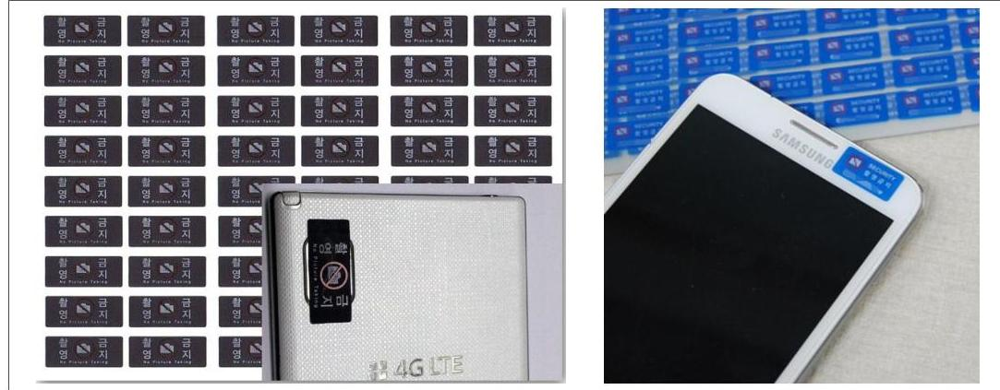
[그림 1] 스마트폰 보안스티커

# 2.1.3. 스크린 보안필름 

디스플레이용 보안 필름은 마이크로 단위의 종횡비 (aspectratio)가 큰 패턴을 플라스틱 필름 위에 형성하여 일정 시야각에서 벗어나면 불투명하게 보이도록 제 조한 필름이다. 보안필름은 기본적으로 마이크로 루버(micro louver)라는 기술 을 적용하는데 마이크로 루버란 미세한 미늘 창살이 촘촘히 배치되어 있어서 정 면에서 보면 잘 보이지만 $60^{\circ}$ 이상의 각도에서 보게 되면 화면을 볼 수 없게 되는 기술을 말한다[7].
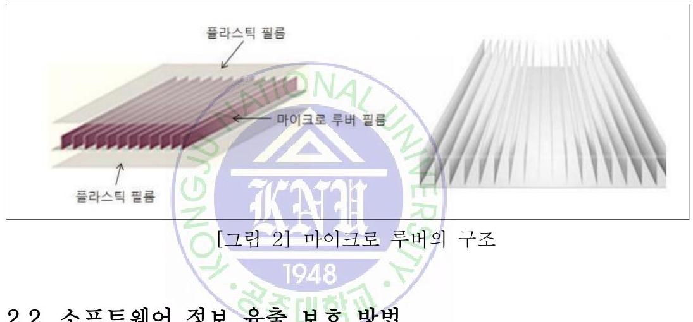

스마트폰에 MDM(Mobile Device Management) 솔루션을 설치하여 정보 유출을 보호할 수 있다.

### 2.2.1. 스마트폰 MDM 솔루션

스마트폰에 MDM 솔루션을 설치하여 소프트웨어적으로 카메라 앱 사용불 가, Wi-Fi, 블루투스, 모바일 핫스팟 및 테더링, 모바일 네트워크, USB 파일 전송 등의 기능을 비활성화 시킬 수 있다.

# 2.3. 현존 보호 방식의 문제점 

스마트폰 카메라 촬영을 이용한 정보 유출방법을 원천적으로 차단할 수 있 는 방법은 보안 검색대에서 핸드폰을 보관하는 방법이 가장 확실하다. 하지만, 디지털사회에서 스마트폰 없이 업무를 처리하기는 불가능하다.

따라서, 대부분의 민감 정보를 취급하는 곳에서 스마트폰에 보안스티커를 부착하거나, 민감 정보가 표시되는 스크린에 보안필름을 부착하고, MDM 솔 루션을 설치하는 방법을 주로 사용한다. 보안스티커를 부착하여 사진 촬영을 불가능하도록 하는 방식은 보안스티커 제조사의 특징에 따라 스티커가 잘 떨 어지기도 하고, 다수의 방문객이 보안 검색대를 통과하는 시간에 보안검색 요 원이 보안스티커 부착여부 및 제거여부를 일일이 확인하기 어렵다. 위의 문제 점으로 인해 정보 유출을 목적으로 보안스티커를 교묘하게 제거한 경우 보안 검색대에서 검문하기 어려운 경우가 많다. 스마트폰 강화유리, 실리콘, 액정보 호필름 등 보안스티커가 부착되는 표면의 성분에 따라 보안스티커를 제거해도 표시가 나지 않는 경우가 있으며, 인터넷에서도 쉽게 표시 나지 않도록 보안 스티커 제거하는 방법을 찾아볼 수 있다.

민감 정보가 표시되는 스크린에 보안필름을 부착하더라도 마이크로 루버 기 술의 특징으로 좌우 시야각이 $30 \%$ 초과하는 위치에는 효과적으로 스크린의 정보를 숨길 수 있지만, 정면에서 촬영하는 경우에 보호 작용을 할 수 없다.

MDM 솔루션은 스마트폰의 다양한 권한을 얻어서 카메라, Wi-Fi, 블루투 스, 모바일 핫스팟 및 테더링, 모바일 네트워크 및 USB 파일 전송 등의 기능 을 비활성 할 수 있다. 하지만, 방문객의 업무 종료 후 MDM 솔루션을 삭제 하려고해도, 일부 MDM 솔루션은 완전 삭제되지 않고, 스마트폰의 데이터를 필요 이상으로 점검하여 사생활 침해 문제가 발생한다[5]. 또한 스마트폰 초 기화 및 안드로이드/IOS간의 호환성, 스마트폰 보안 취약점 등 의 문제가 있 다.

# 2.4. 이미지 프로세싱 

### 2.4.1. 이미지 프로세싱의 종류

이미지 프로세싱(Image Processing)은 입출력이 영상인 형태의 모든 정보처 리를 가리킨다. 입력받은 영상을 확대, 축소, 회전 등 유클리드 기하학적 변환, 명 도, 대비 등 색 보정과 색 사상, 색조화, 양자화 등의 처리, 디지털 합성, 광학 합 성, 내삽, 모자이크, 필터, 영상 정합, 변형, 인식, 분할 HDR 등의 처리 등의 활동 이 포함된다[3]. 이미지 프로세싱은 영상형태의 입력을 받아 영상형태의 출력을 한다. 컴퓨터 비전(Computer Vision)은 입력을 영상형태로 받아 영상 인식, 이 해, 해석 등의 처리과정을 거쳐 정보로 출력하는 기술이다[11]. 영상에서 물체 (Object), 배경(Background), 전경(Foreground) 등의 주변 환경에 대한 데이터를 분석해서 유의미한 정보를 생성하는 기술이다[1]. 컴퓨터가 사람처럼 인지하고 이해할 수 있 는 컴퓨터 비전 시스템을 만들기 위해서는 입력된 영상에서 불필요한 데이터 를 제거하고 개선해서 컴퓨터가 인지하기 쉬운 상태로 만들어야한다. 그 과정 을 전처리과정이라 칭한다. 전처리과정을 거친 개선된 영상에서의 특징, 형태 등을 분석하고 해석하여 다양한 정보를 추출할 수 있다. 컴퓨터 비전의 처리 과정은 [그림 3]과 같은 절차를 통해 컴퓨터가 사람처럼 인지하고 이해할 수 있다[2].
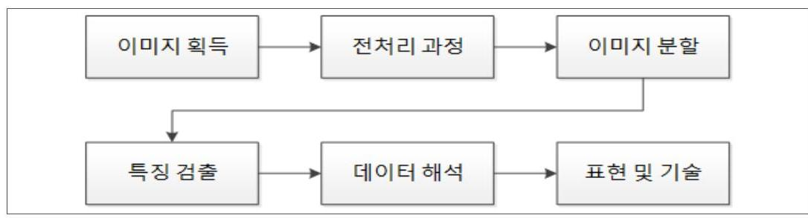
[그림 3] 컴퓨터 비전의 절차도

영상을 입력받으면 전처리 과정에서 입력 받은 영상을 사용 목적에 맞게 적 절히 처리하여 보다 개선된 영상으로 만들어 준다. 잡음을 제거하거나 초점이 흐린 영상의 화질을 개선하는 과정을 거쳐 사람이 쉽게 인지 할 수 있도록 개 선하며 이후 과정에서 처리하기 좋게 만드는 과정이 저급 비전(low level vision)이다. 저급 비전에서 출력된 영상을 기반으로 영상 안에서 목적을 위 한 속성을 뽑아내는 작업을 중급 비전(Mid Level Vision)이라고 한다.

중급 비전은 영상을 영역별로 분할하고 영상에서 에지(Edge), 선분 (Segment), 원(Circle), 코너(Corner), 질감(Texture) 등의 특징(Feature) 을 추출하는 단계이다. 추출된 특징을 입력 받아 속성들을 분석하고 해석하여 출력하는 단계가 고급 비전(High Level Vision)이다. 고급 비전의해석하는 방식은 사용목적에 따라 분류된다. 얼굴인식이 목적인 분야, 세밀하고 정밀하 게 출력해야 하는 의료분야, 차량의 자율 주행을 위한 분야 등의 샘플영상을 수집하여 학습시키는 인공 지능(Artificial Intelligence) 분야 등으로 나눌 수 있다[6].

인공 지능은 사람의 지능을 모방하여 사람이 하는 것과 같이 복잡한 일을 기계가 할 수 있게 만드는 것을 말한다. 인공지능을 구현하는 방법의 하나인 머신 러닝(Machine Learning)은 알고리즘을 이용해 데이터를 분석하고 학습 하며 학습한 내용을 기반으로 판단이나 예측을 한다.

그 결과 대량의 데이터와 알고리즘을 통해 컴퓨터를 학습시켜 의사 결정에 대한 작업을 수행하는 것이다. 머신 러닝은 주어진 데이터에서 특징을 추출하 는 과정에 사람이 개입하지만 딥 러닝(Deep Learning)은 주어진 데이터를 그대로 입력 데이터로 활용한다는 것이다. 딥 러닝은 인공신경망(Artificial Neural Network)에서 발전한 형태로 뇌의 뉴런과 유사한 정보 입출력 계층 을 활용해 데이터를 학습한다. 그렇기 때문에 사람이 생각한 특징을 훈련하는 것이 아니라, 데이터 자체에서 중요한 특징을 기계 스스로 학습하는 것이다 [15].

# 2.4.2. 객체 탐지 알고리즘 

객체 탐지(Object Detection)기술은 컴퓨터에 입력된 영상에서 특정 객체 와 배경과 구분하고, 특정 정보를 출력하는 기법이다[9]. 객체 탐지를 위해서 는 입력된 영상에서 배경과 객체간의 경계 상자(Bounding Box)를 설정하고, 탐지된 객체가 미리 설정된 사물의 카테고리와 연결되어야 한다.

객체 탐지 알고리즘의 문제 중 하나는 영상별 검출이 필요한 객체 수가 변 동되는 현상이다. 모든 영상에 하나의 객체만 있다고 가정하면, [그림 4] 컴 퓨터 비전의 핵심기술인 콘볼루션 신경망(Convolutional Neural Network) 기술을 이용하여 제한된 객체 탐지에 대한 회귀와 분류가 가능하고, 제한된 객체 탐지는 이미지 인식(Image Recognition), 핵심 포인트 탐지(Key Points Detection), 시멘틱 분할(Semantic Segmentation) 등 기존 컴퓨터 비전 업무와 마찬가지로 정해진 수의 대상을 처리할 수 있는 특성을 이용하여 하나의 경계 상자를 설정하고 이를 통한 위치 학습은 자연스럽게 회귀 (Regression)를 사용하여 객체 탐지가 가능하다[13].
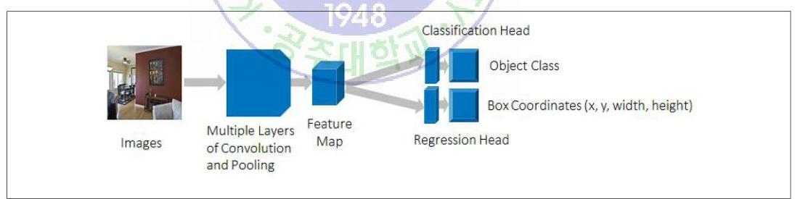
[그림 4] 콘볼루션 신경망

하지만, 영상 정보가 변경될 때 탐지해야할 객체의 수가 변경되는 콘볼루션 신경망은 객체를 탐지하는 데 한계가 있다.

다수의 경계 상자를 생성하고 경계 상자의 위치와 크기를 가정해 콘볼루션 신경망을 변형한 후 이를 객체 분류(Object Classification)에 활용할 수는

있다. 이런 방식을 슬라이딩 윈도우 방식이라 부른다. 슬라이딩 윈도우의 경계 상자는 영상의 가능한 모든 위치와 크기를 포함해야 하며, 각 경계 상자의 크 기와 위치는 객체의 존재 여부에 따라 결정될 수 있고 객체가 있는 경우에는 그 범주도 결정할 수 있다.

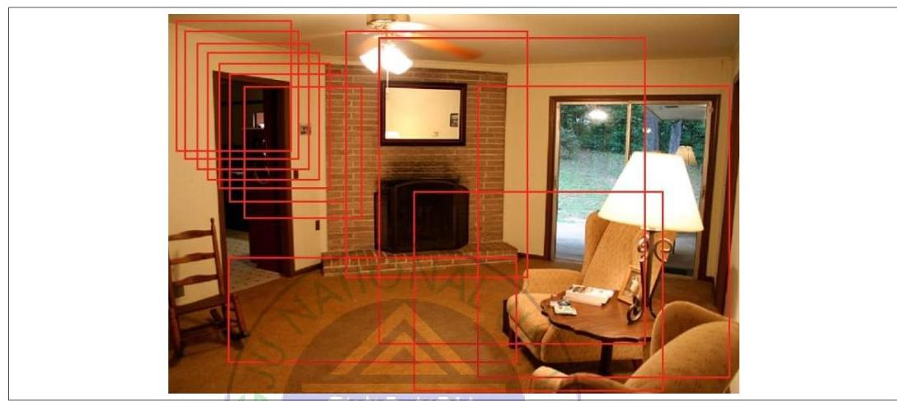

[그림 5] 슬라이딩 윈도우 방식의 경계 상자

[그림 5]은 슬라이딩 윈도우 방식으로 객체 탐지를 할 때 나타나는 경계 상 자의 일부를 보여준 그림이다. 각 이미지에는 서로 다른 개수의 픽셀이 있어 총 경계 상자의 개수도 많아지며, 영상의 해상도가 높아질수록 비효율적인 객 체 탐지 방법이다. 이러한 문제를 해결하기 위해 딥러닝을 이용한다. 딥러닝을 이용한 객체 탐지는 다양한 방면으로 발전되었다[14]. 영상 정보 내 특정 부 분만을 활용해 윈도우의 하위집합을 빠르고 정확하게 찾아서 객체 탐지를 효 율적으로 할 수 있는 방법이 연구되었다. 경계 상자의 하위집합을 찾는 방식 을 두 가지로 나눌 수 있다. 단일 단계 방식(Single-Stage Method)과 이 단 계 방식(Two-Stage Method)로 나눌 수 있다.

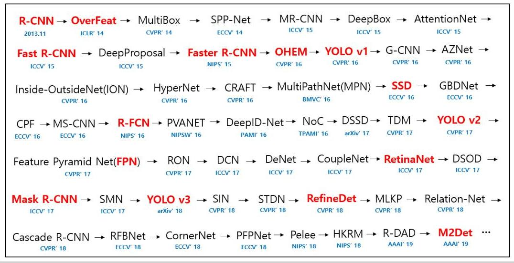
[그림 6] 딥러닝을 이용한 객체 탐지 알고리즘 논문

이 단계 방식은 영역 제안(Region Proposal)하여 윈도우를 찾는 방식이다. 객체를 포함할 가능성이 높은 영역을 선택적 탐색하며, 컴퓨터 비전, 딥러닝을 활용하여 영역 제안 네트워크(RPN; Region Proposal Network)를 통해 선 택하는 방식으로 후보군의 윈도우 세트를 취합하면 회귀 모델과 분류 모델의 수를 공식화해 객체 탐지를 할 수 있는 이론을 바탕으로 한다.

대표적인 방식으로 Faster R=CNN, R_FCN and FPN-FRCN 등의 알고 리즘이 있다. 이 단계 방식은 높은 정확도를 제공하지만 연산이 두 번 필요하 기 때문에 단일 단계 방식보다 처리 속도가 느리다.

단일 단계 방식은 Classification, Localization를 동시에 수행하여 정해진 위치와 정해진 크기의 객체만 찾아 결과를 얻는 방법이다. 이 위치와 크기들 은 대부분의 시나리오에 적용할 수 있도록 전략적으로 선택된다. 단일 단계 방식은 보통 원본 이미지를 고정된 사이즈 그리드 영역으로 나눈다.

그리드 영역에 대해 형태와 크기가 미리 결정된 객체의 고정 개수를 예측한 다.

대표적인 방식으론 YOLO, SSD, RetinaNet 등의 알고리즘이 있다. 단일

단계 방식은 연산횟수가 이 단계 방식 보다 적기 때문에 처리속도가 빠른 장 점이 있지만, 정확도가 떨어지는 단점이 있다[8]. 각 장단점이 있기 때문에, 단일 단계 방식은 실시간 탐지를 요구하는 상황에 이용한다.

# 2.4.3. YOLO 알고리즘 

YOLO 알고리즘은 하나의 합성곱 신경망이 동시에 여러 개의 경계 상자를 예측하고 각 경계 상자에 대하여 분류 확률 (Class Probability)을 예측하는 알고리즘이다[17]. 합성곱 신경망은 특징 지도를 생성하는 용도로 활용되는데 알고리즘의 중추를 담당한다고 하여 Backbone Network라고 부른다. 특징 지도는 여러 개의 Grid Cell로 구성되는데, 각 Cell 마다 Score 방식을 적용 하여 대상 객체의 종류와 위치를 동시에 결정하는 알고리즘이다. YOLO 알고 리즘의 기본 개념은 One Stage Method이며 인간의 시각체계와 비슷하게 작 동하게끔 모델을 Single Neural Network로 구성한다. 즉, 한번 연산에 Image Detection을 할 수 있는 알고리즘이다. YOLO 알고리즘이 입력받은 하나의 영상정보를 연산하는 횟수는 $S * S *(B *(P))+C)$ 이다. 입력된 영상정보 를 가로 S개, 세로 S개로 나눈다. 나눠진 $\mathrm{S} * \mathrm{~S}$ 개의 칸은 Grid라 칭한다. Grid 마다 B 개의 경계 상자가 있고, 경계 상자에는 물체가 있을 확률(Objectness) 을 나타내는 P 파라미터, Grid 내에 경계 상자의 위치를 나타내는 X좌표, Y 좌표 파라미터, 경계 상자의 넓이, 높이를 나타내는 Width, Height 5 개의 파 라미터로 이루어져 있다. 이러한 특성으로 입력된 영상정보를 더 많은 Grid로 나눌수록, Grid안에 더 많은 경계 상자가 존재할수록 물체를 인식할 확률이 높아지고, 연산속도는 낮아진다. 하나의 경계 상자는 하나의 객체위치, 크기를 파악하기에 하나의 객체만을 찾을 수 있다. 이러한 특성으로 각 인자의 수가 증가할수록 연산 속도가 느려진다. Grid의 크기를 너무 크게 설정하면 겹쳐있 는 객체는 탐지를 못 할 수 있으며, 검출할 객체의 크기가 작을수록 검출에

불리하다.
YOLO 알고리즘의 동작 원리는 사람이 어떻게 사물을 판단하는지 생각해보 면 간단하다. 각자 볼 수 있는 시야 범위 안에서 어떤 종류의 물체가 어디에 있는지 바로 판단한다. 이런 일련의 과정을 하나의 그림으로 잘 표현한 것이 아래의 [그림 7]에서 아래 부분에 있는 그림이다. 입력 영상이 있으면, 하나 의 신경망을 통과하여 물체의 경계 상자와 Class를 동시에 예측한다[4].
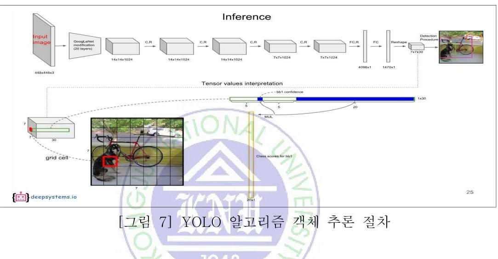

YOLO는 24 개의 합성곱 레이어(Convolutional layers)와 2 개의 완전히 연 결된 레이어(Fully Connected layers)로 이루어져 있다. 앞단에 20 개의 합 성곱 레이어는 GoogLeNet For Image Classification 모델을 기반으로 하고, 4 개의 합성곱 레이어는 더 좋은 성능을 위해 추가된 레이어다. 24 개의 합성 곱 레이어와 2 개의 완전히 연결된 레이어를 거친 후 나온 Output을 기반으로 객체검출을 진행한다. 합성곱 연산은 두 함수 f, g가운데 하나의 함수를 반전 (Reverse), 전이(Shift)시킨다. 이후, 하나의 함수와 곱한 결과를 적분한 것 이다. [그림 7] 영상정보를 가로 7 개, 세로 7 개의 Grid로 나누고, 하나의 Grid에 2 개의 경계 상자가 있고, 20 개의 객체를 검출 할 수 있다고 가정하면, 마지막의 Output Tensor가 $7 * 7 * 30$ 은 $\mathrm{S} * \mathrm{~S} *((\mathrm{~B} *(\mathrm{P}))+\mathrm{C})$ 수식에 파라미터에 $(\mathrm{S}=7, \mathrm{C}=20, \mathrm{P}=5 \mathrm{~B}=2$ ) 따라 나온 결과다.

하나의 Grid는 30개의 정보를 가지고 있다. 길이 30의 정보는 1~5위치에 데이터는 1번 경계 상자의 X좌표, Y좌표, 넓이, 높이, 물체가 있을 확률, 6~10위치의 데이터는 2번 경계 상자의 X좌표, Y좌표, 넓이, 높이, 물체가 있을 확률으로 구성되어있고, 11~30위치의 데이터는 20개 객체별 일치 점수(Class Specific Confidence Score)를 담고 있다. 첫 번째 Grid에 1번 경계 상자에 객체별 일치 점수를 계산하고 2번 경계 상자의 객체별 일치 점수를 계산하는 과정을 49번째 Grid까지 진행한다면 98개의 객체별 일치 점수를 얻을 수 있다. 이 98개의 객체별 일치 점수에 대해 각 20개의 클래스를 기준으로 비-최대 억제(Non-Maximum Suppression)을 진행한다.

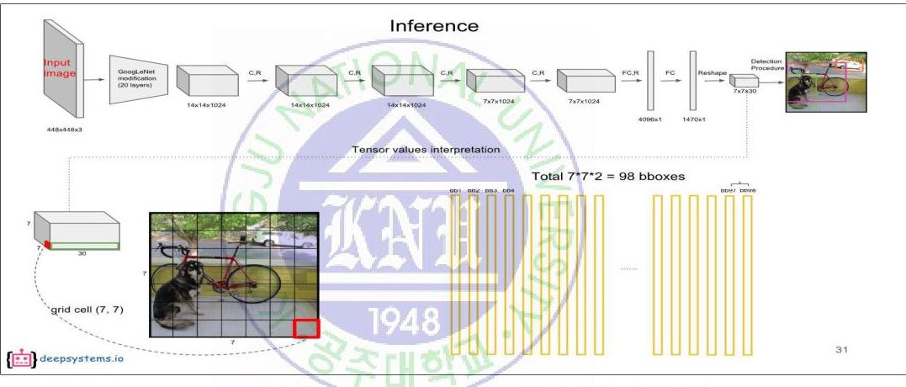

[그림 8] YOLO 알고리즘 객체 추론 결과

[그림 8]은 비-최대 억제 연산과정을 표현한다. 비-최대 억제 연산은 각 경계 상자의 객체별 일치 점수를 내림차순으로 정렬한다. 객체별 일치 점수가 가장 높은 경계 상자를 기준으로 선정하고, 그 다음으로 점수가 높은 경계 상자를 비교 경계 상자로 선정한다. 기준 경계 상자와 비교 경계 상자를 IOU(Intersection Over Union) 연산을 진행하고, IOU 연산 결과 사전에 정의된 임계 값보다 크다면 비교 모델의 점수를 0으로 변환한다. 98번의 연산이 끝나면, 기준 경계 상자를 제외하고 가장 높은 점수를 가진 경계 상자를 기준 경계 상자로 선정하고, 그 다음으로 점수가 높은 경계 상자를 비교 경계 상자로 선정한다.

상자로 선정하여, 비-최대 억제 연산을 진행한다. 이 과정을 마지막까지 반복 하면 0 으로 치환되지 않은 클래스의 개수는 2 개이다. 2 개의 클래스중 신뢰성 이 0.2 미만은 모두 0점으로 치환한다. 모든 연산을 수행하면 98 개의 클래스 별 점수가 나온다. 경계 상자의 클래스가 가장 큰 인덱스를 가지고 있으며, 클 래스중 가장 큰 점수라면 해당 객체를 찾았다고 판단한다.
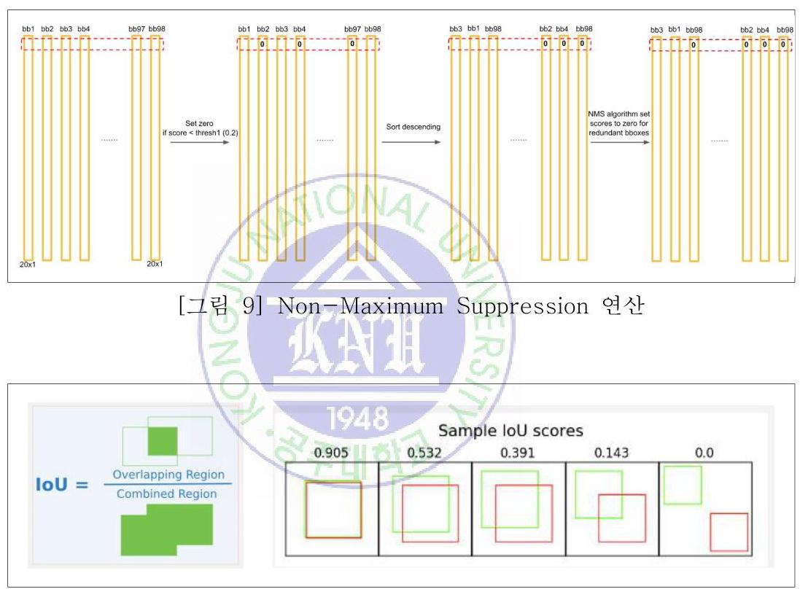
[그림 10] IOU 연산

IOU는 교집합 영역넓이 / 합집합 영역 넓이의 값을 구하는 연산이다. 경계 상자의 크기에서, 객체 검출위치와 겹치는 부분의 비율이 얼마인지 계산한다. 계산 결과값을 이용하여 비-최대 억제 연산을 수행할지 판단한다.

# III. 객체 탐지 정보 유출 보호 시스템 설계 및 구현 

## 3.1. 전체 시스템 구성도

본 논문에서는 실시간 탐지에 용이하고, 다양한 운영체제에 호환성이 좋고 비교적 정확성이 높은 YOLO 알고리즘을 이용하여 객체 탐지 정보 유출 보호 시스템(Object Detection Information Leak Security System) 시스템을 제안한다. 객체 탐지 정보 유출 보호 시스템을 구성하기위해 [그림 11]와 같 이 민감 정보 PC 스크린에 카메라를 부착하고 설치된 카메라로부터 영상 정 보를 입력받는다. ODILSS는 압력된 영상 정보를 이미지 프로세싱하여 스마 트폰 객체를 검출하고, 검출 결과에 따라 이벤트가 발생시킨다. 스마트폰 객체 검출 이벤트 발생 시 관계 센터 DB에 데이터를 삽입하여 관제 센터에서 모니 터링 할 수 있는 시스템을 구성한다.
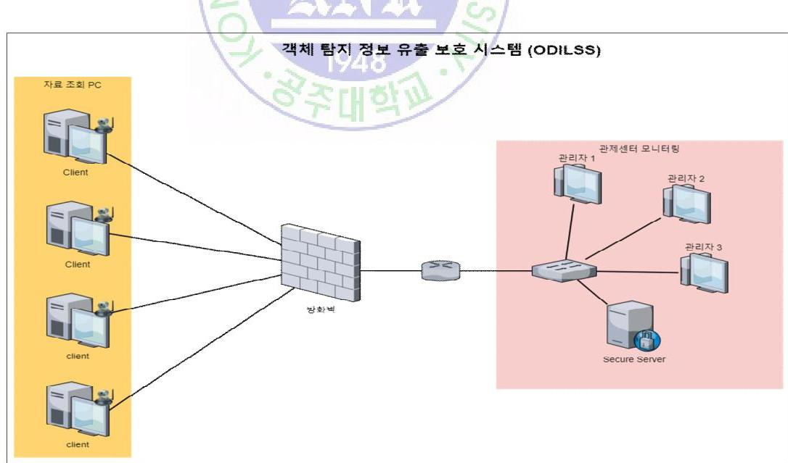
[그림 11] ODILSS 구성도

ODILSS는 카메라의 영상정보를 입력받아 전처리 과정을 거친 뒤, YOLO 알고리즘을 이용하여 실시간으로 객체 검출을 진행한다. 검출된 객체는 사전 에 준비된 카테고리와 비교 분석하여 이벤트 발생 시킨다. 이벤트 발생 시 검 출 결과에 따라, 방화벽, 스위치, 라우터 등의 네트워크 장비를 통해 관제 센 터 DB에 데이터를 삽입한다. 관제 센터의 모니터링 시스템에서 관제 센터 DB에 삽입된 데이터를 주기적으로 조회하여 민감 정보 PC의 스마트폰 객체 검출 이벤트를 모니터링 할 수 있다. 관제 센터 DB에 삽입된 데이터를 바탕 으로 관제 센터에서 각 ODILSS의 객체 검출 상태를 확인하고 상황에 맞도록 민감 정보 PC를 제어하고, 보안요원을 통해 조치를 할 수 있다.


# 3.2. 유스케이스 다이어그램 

[그림 12]는 ODILSS에서 제공하는 기능이 시스템과 상호작용하는 것을 보여주는 유스케이스 다이어그램이다.
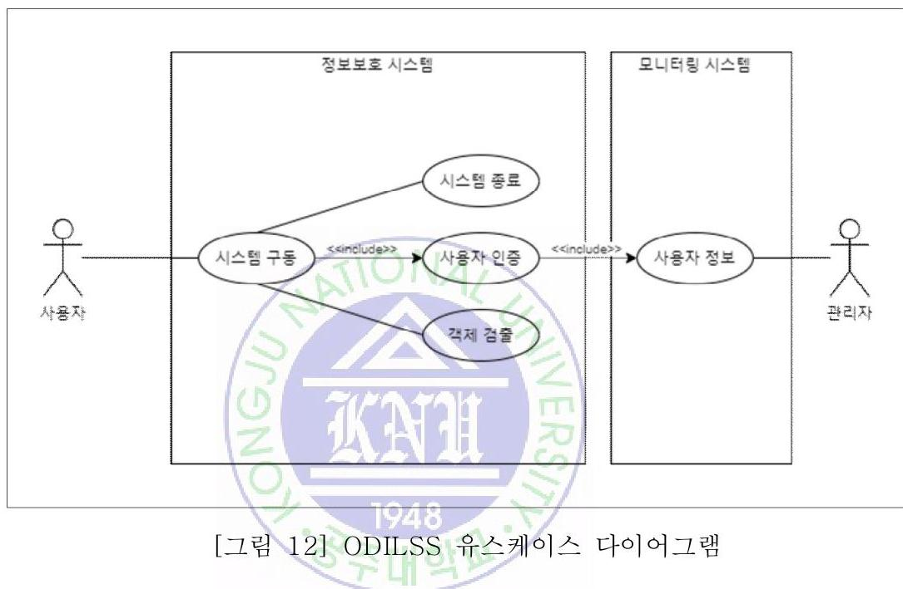

민감 정보 PC에서 카메라를 이용해 입력받은 영상정보를 입력받아 처리한 다. 객체 검출 알고리즘을 수행하면서 사전에 정의된 객체 검출 시 해당 카테 고리에 맞는 이벤트를 발생시킨다. 이벤트에 따라 관제 센터 DB에 이벤트 데 이터를 삽입한다. 관제 센터는 주기적으로 DB에 삽입되는 데이터를 모니터링 하여 스마트폰 사진 촬영을 통한 정보 유출 위험을 최소화 하는 기능을 제공 한다.

# 3.3. 시스템 프로세스 흐름도 

[그림 13]은 ODILSS의 프로세스 흐름도이다. 민감정보 PC에 연결된 카메 라로부터 영상 정보를 입력 받는다. 영상정보를 YOLO알고리즘을 통해 객체 검출을 진행하고 스마트폰 객체 검출 여부를 확인한다. 객체 검출 결과 스마 트폰 정보가 확인되면 민감정보 PC의 스크린샷, YOLO알고리즘을 진행하기 전 원본 카메라 영상정보, 민감정보 PC의 실행중인 프로세서 리스트를 획득 한다. 획득한 정보를 관제 센터 DB에 삽입한다.
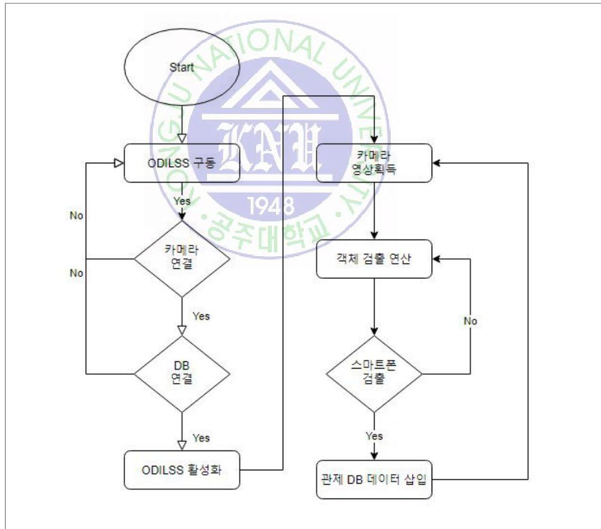
[그림 13] ODILSS 프로세스 순서도

# 3.4. 클래스 다이어그램 

[그림 14]은 영상을 분할하고 YOLO 알고리즘을 적용하여 스마트폰 객체를 검출하는 시스템의 구조를 기술한 클래스 다이어그램이다. 이미지 클래스에서 는 전처리 전 원본영상, 객체 검출 결과 영상을 포함한다.
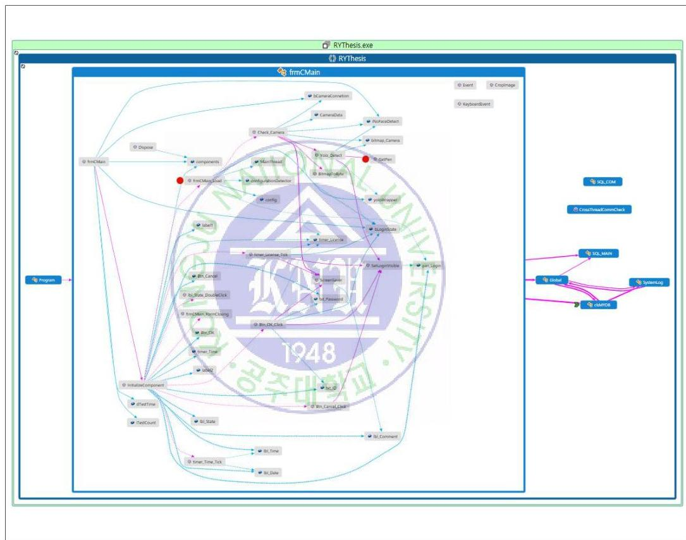
[그림 14] ODILSS 코드 맵 다이어그램

# 3.5. 객체 검출 시퀀스 다이어그램 

[그림 15]는 객체 감지 시스템을 구성하는 객체들 간에 주고받는 데이터를 시간의 순서에 따라 표현한 시퀀스 다이어그램이다. 클라이언트에서 카메라에 영상정보를 요청하고, 카메라에서 클라이언트로 요청에 의한 영상 정보를 응 답한다. 응답받은 영상 정보를 YOLO 알고리즘에 맞도록 변환하여 영상 정보 객체 검출 요청한다. YOLO에서 영상 정보 객체 검출 응답을 받고, 객체 검출 응답 정보에 따라 관제서버에 정보를 전달하여 미리 정의된 프로세스대로 클 라이언트를 제어한다.
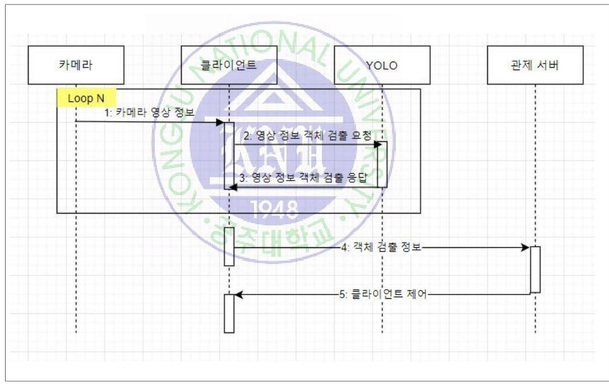
[그림 15] ODILSS 시퀀스 다이어그램

# 3.6. ODILSS 설계 

### 3.6.1. 관제 센터 DB 통신 설계

ODILSS에서 발생한 이벤트를 관제 센터 DB에 삽입하기 위한 통신 방법으 로 TCP/IP 기반의 DB Connetion을 이용한다. 다수의 ODILSS는 하나의 관 제 센터 DB에 연결하기 위해 각 시스템마다 Connetion을 구성하고, 주기적 으로 Conntion 상태를 확인하여 안전한 연결이 유지되도록 한다.
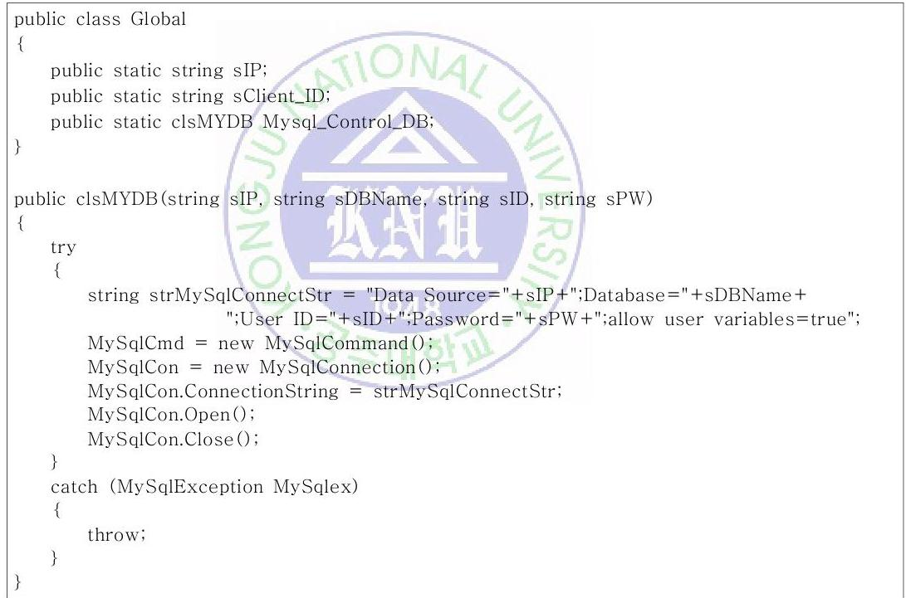
[그림 16] ODILSS DB Connetion 설정
[그림 16]과 같이 ODILSS 구동 시 접속할 관제 센터의 IP, PORT, ServiceID, ID, PW 등을 지정하고 해당 정보에 맞춰 DB Connetion을 시도 한다.

# 3.6.2. 관제 센터 DB 데이터 구조 설계

ODILSS에서 객체 검출 알고리즘 연산 후, 결과 데이터를 분석하여 관제 센터의 DB 서버에 데이터를 입력, 수정 한다.

|  테이블 명 | 용도  |
| --- | --- |
|  T_USER_MASTER | 관리자 계정  |
|  T_CLIENT_MASTER | 민감정보 PC 관리  |
|  T_EVENT_DATA | 이벤트 이력 관리  |
|  T_CLIENT_CONTROL | 민감정보 PC 제어 관리  |

[그림 17] 관제 센터 DB 테이블 목록

|  컬럼명 | 데이터 종류 | 설명  |
| --- | --- | --- |
|  테이블 명 | T_USER_MASTER |   |
|  USER_ID | VARCHAR(20) | 관리자 ID  |
|  USER_PASSWORD | VARCHAR(20) | 관리자 PW  |
|  USER_NAME | VARCHAR(20) | 관리자 이름  |
|  LOGIN_IP | VARCHAR(20) | 로그인 IP  |
|  테이블 명 | T_CLIENT_MASTER |   |
|  CLIENT_ID | VARCHAR(20) | 민감 정보 PC ID  |
|  IP | VARCHAR(20) | 민감 정보 PC IP  |
|  USE_CHECK | VARCHAR(1) | 사용 여부  |
|  테이블 명 | T_EVENT_DATA |   |
|  CLIENT_ID | VARCHAR(20) | 민감 정보 PC ID  |
|  CAMERA_IMAGE | LONGBLOB | 카메라 스냅샷  |
|  SCREEN_IMAGE | LONGBLOB | 스크린 스냅샷  |
|  PROCESS_LIST | VARCHAR(20000) | 프로세스 리스트  |
|  EVENT_TIME | DATETIME | 발생시각  |
|  EVENT_CONFIRM | VARCHAR(1) | 이벤트 확인 여부  |
|  테이블 명 | T_CLIENT_CONTROL |   |
|  CLIENT_ID | VARCHAR(20) | 민감 정보 PC ID  |
|  CONTROL_ID | VARCHAR(20) | 클라이언트 제어 값  |

[그림 18] 관제 센터 DB 테이블 스키마

# 3.6.3. DB 통신 메시지 구조 설계

ODILSS에서 관제 센터 DB로 에 삽입하는 데이터 구조와, 관제 센터에서 ODILSS 제어하는 데이터의 구조를 설계한다. 해당 데이터 구조로 ODILSS과 관제 센터는 DB의 데이터를 주기적으로 삽입, 수정, 조회 하여 통신 한다.

|  테이블 | 컬럼 | 설명  |
| --- | --- | --- |
|  T_EVENT_DATA | CLIENT_ID | 관제 센터에서 미리 정의된 ODILSS 고 유키  |
|   | CAMERA IMAGE | 카메라로부터 입력받은 영상 정보를 객체 검출 알고리즘 이후 스마트폰 검출 시, 카 메라에서 입력받은 영상 정보 원 데이터  |
|   | SCREEN IMAGE | 객체 검출 알고리즘 이후 스마트폰 검출 시, 민감 정보 PC 스크린에 출력중인 영상 정보  |
|   | PROCESS LIST | 객체 검출 알고리즘 이후 스마트폰 검출 시, 민감 정보 PC 에 동작중인 프로세스 리스트  |
|   | EVENT_TIME | 객체 검출 알고리즘 이후 스마트폰 검출 시, 이벤트가 발생한 시간  |
|   | EVENT_CONFIRM | 객체 검출 알고리즘 이후 스마트폰 검출 시, ODILSS에서 관제 센터DB로 데이터 삽입 후, 처리되었나 확인하는 플래그  |
|  T_CLIENT_CONTROL | CLIENT_ID | 관제 센터에서 미리 정의된 ODILSS 고 유키  |
|   | CONTROL_ID | 관제 센터에서 ODILSS를 제어하는 명령어 ID  |
|   | EVENT_TIME | 관제 센터에서 마지막으로 ODILSS를 제어한 시간  |

[그림 19] 관제 센터 DB 통신 데이터 구조

# 3.6.4. 시스템 구현 환경 

본 논문에서 제안한 ODILSS는 [그림 20]과 같은 PC 환경을 민감 정보 PC로 가정하고 개발 연구하였다. Windows10 운영체제, NET FrameWork 4.6.1 위에서 Maria DB를 이용하여 시스템을 구현하였다. 카메라 영상정보를 얻어오기위해 OpencvSharp 4.1.1.20191216 버전을 사용하고 YOLO 2.6.4 버전을 사용하였다.

| 구분 |  | 내용 |
| :--: | :--: | :--: |
| 하드웨어 | CPU | I5-6200U 2.30Ghz |
|  | Memory | 12GB |
|  | Graphics | GeForce 940M |
| 소프트웨어 | OS | Windows 10 Pro 64bit |
|  | 개발 IDE | Visual Studio 2017 |
|  | .Net FrameWork Ver | 4.6.1 |
|  | 개발 언어 | C\# |
|  | Database | Mariadb 10.3 64bit |

[그림 20] ODILSS 개발 환경

### 3.6.5. 카메라 통신 및 객체 탐지 설계

카메라의 영상 정보를 수집하기 위한 방법으로 [그림 21]와 같이 OpenCvSharp의 VideoCapture 클래스를 이용한다. VideoCapture 클래스를 이용하여 video객체를 생성하고. video객체의 Width, Height를 가지고 초기 화한다. video 객체는 Read 함수를 통해 행렬의 크기, 데이터 타입, 깊이의 구조로 이루어진 Mat 형식으로 카메라 영상 정보를 얻어올 수 있다.

```
VideoCapture video;
video = new VideoCapture(0);
video.FrameWidth = 640;
video.FrameHeight = 480;
bool bCameraConnetion = false;
private void Check_Camera()
{
    Bitmap bitmap_Camera;
    byte[] CameraData;
    while (true)
    {
        try
        {
            iNoFaceDetect++;
            video.Read (frame);
            if(frame.Data == IntPtr.Zero)
            {
                //frame Data is null
            }
            else
            {
                bitmap_Camera = OpenCySharp,Extensions,BitmapConverter,ToBitmap (frame);
                CameraData = BitmapToByte (bitmap_Camera);
                Yolo_Detect (CameraData);
            }
            catch (Exception err)
            {
                //throw;
            }
        }
}
```

[그림 21] ODILSS 카메라 장치 연결

ODILSS에서 VideoCapture 클래스의 Read 함수를 이용하면, 연결된 카메 라로부터 Mat 형식의 영상 정보 데이터를 얻을 수 있다. 영상 정보의 Data가 IntPtr.Zero와 같다면, 영상 정보가 비정상임을 알 수 있다. 영상 정보가 정상 적으로 얻어왔다면, YOLO에서 인식할 수 있도록 Mat형식의 영상 정보를 byte 배열 형식으로 변환하여 객체 검출 알고리즘을 실행한다.

```
YoloWrapper yoloWrapper:
yoloWrapper = new YoloWrapper("yolov3.cfg", "yolov3.weights", "voc.names");
configurationDetector = new ConfigurationDetector();
config = configurationDetector.Detect();
private void Yolo_Detect(byte[] bImage_Array)
{
    byte[] bImage_Array = BitmapToByte(bitmap_Crop);
    var items = yoloWrapper.Detect(bImage_Array);
    foreach (var item in items)
    {
        if (item.Type == "cell phone" && item.Confidence > 0.9)
        { //객체 검출 결과 "cell phone" And 일치도 90% 이상
            Global.Log().LogWrite(SystemLog._LOG_TYPE.BaseLog, "Smart Phone Detect "); //Log
            Graphics graphics = Graphics.FromImage(bitmap_Camera); //테두리 처리를 위한 형변환
            graphics.SmoothingMode = System.Drawing.Drawing2D.SmoothingMode.AntiAlias; //Mode 지정
            Pen pen = GetPen(bitmap_Camera.Width, Color.Red); //그래픽 테두리 Pen 지정
            graphics.DrawRectangle(pen, item.X + 100, item.Y, item.Width, item.Height); //해당영역 그리기
            graphics.Flush(); //그래픽 적용
            Global.ScreenShot(bitmap_Camera); //이벤트 데이터 삽입
        }
    }
}
private byte[] BitmapToByte(Bitmap bitmap)
{
    ImageConverter converter = new ImageConverter();
    return (byte[]) converter.ConvertTo(bitmap, typeof(byte[]));
}
```

[그림 22] ODILSS 객체 검출 알고리즘

[그림 22]은 ODILSS에서 YOLO를 사용하여 객체를 검출하는 과정이다. ODILSS는 연결된 카메라로부터 Mat 형태로 영상 정보를 입력받는다. 입력 받은 영상정보를 byte[] 형태로 형 변환하여 객체검출 알고리즘을 실행한다. 객체 검출 알고리즘은 yoloWrapper.Detect 함수를 실행한다. yoloWrapper 객체는 YoloWrapper 클래스를 사용하여 생성하고, 미리 학습된 yolov3.weights, yolov3.cfg, voc.names을 이용하여 객체를 초기화 한다. 클라이언트 PC에서 YOLO 알고리즘 수행 후, 수행 결과가 담긴 item 객체

반환한다. item 객체는 사전에 정의된 카테고리와 비교 분석하여 관제 센터 DB에 수행할 DML 명령어를 생성한다.

# 3.6.6. 시스템 설정 정보 설계 

민감 정보 PC에 설치되는 ODILSS는 중복되지 않는 IP주소를 Key로 사용 한다. 부가적인 정보는 관제 센터에서 사전에 정의된 정책과 정보 PC 이름, 위치 등의 정보를 통해 사용하고, 스위치, 라우터 및 방화벽 등의 네트워크 장 비로 연결된다.

### 3.6.7. 시스템과 관제 센터 DB 데이터 매핑

ODILSS는 관제 센터 DB에 연결된 객체, ODILSS 고유 키, 접속 IP정보, 입력된 영상 정보를 가지고 있는 Global 클래스를 [그림 23]와 같이 구성한 다. 관제 센터 DB에 접근 가능한 객체를 생성하기 위해 clsMYDB 클래스를 사용하고, Control_DB 객체는 관제서비 접속 정보를 사용하여 초기화한다.

```
class Global
{
    public static string sIP = "";
    public static string sClient_ID = "";
    public static clsMYDB Control_DB;
    public static VideoCapture video;
    public static Mat frame;
    public static void DB_Connect()
    {
        Control_DB = new clsMYDB("127.0.0.1", "personaldatasavedb", "root", "root12#");
    }
}
```

[그림 23] Global 클래스 설계

Global 클래스의 Connetion 객체를 초기화 하기위해 clsMYDB 클래스를 사용하고 clsMYDB 클래스는 DML 명령어를 수행하는 MysqlExecute함수와 Select관련 명령어를 수행하는 MySqlSelect 함수 외 Transaction, Commit, Rollback, Disconnect 등의 함수로 이루어져있다.

```
class clsMYDB
{
    private MySqlConnection MySqlCon;
    private MySqlCommand MySqlCmd;
    private MySqlTransaction MySqlTran;
}
public Object MySqlExecute(string prmSql, MySqlTransType prmTransType)
{
    Object rtnObj = null;
    try
    {
        MySqlSql = prmSql;
        rtnObj = MySqlCommand().ExecuteNonQuery();
    }
    catch (Exception ex)
    {
        rtnObj = false;
    }
    return rtnObj;
}
public DataSet MySqlSelect(string prmSQL, MySqlTransType prmTransType)
{
    DataSet rtnDs = new DataSet();
    MySqlDataAdapter MySqlAdt = new MySqlDataAdapter();
    try
    {
        MySqlSql = prmSQL;
        MySqlAdt = new MySqlDataAdapter(MySqlCommand());
        rtnDs = new DataSet();
        MySqlAdt.Fill(rtnDs);
        }
        catch (MySqlException ex)
        {
            throw;
        }
    return rtnDs;
}
```

[그림 24] clsMYDB 클래스 설계

# 3.6.8. 민감 정보 PC 스크린 제어 

관제 센터 DB는 ODILSS의 MySqlConnection 클래스를 이용하여 생성한 객체로 연결되어있다. ODILSS는 연결된 카메라로부터 영상 정보를 얻어오고, 얻어온 영상 정보를 객체검출 알고리즘을 수행한다. 객체 검출 결과 스마트폰 이 검출되었다면, 관제 센터 DB에 카메라 영상 정보, 스크린 영상 정보, 실행 중인 프로세서 정보, ODILSS 고유 키, 발생 시간 등의 정보를 관제 센터 DB 에 삽입한다. 관제 센터 모니터링 시스템은 DB에 입력된 데이터를 주기적으 로 조회한다. 조회된 데이터를 이용하여 ODILSS의 제어가 필요한 경우, 해당 제어 명령어를 관제 센터 DB에 삽입한다. ODILSS는 주기적으로 관제 센터 DB의 제어 테이블을 조회하고, 민감 정보 PC 스크린을 가려야 하는 데이터 가 있는 경우, ODILSS의 정보 유출 보호 화면이 최상단으로 팝업되어 스마 트폰 사진 촬영을 통한 추가적인 정보 유출을 차단한다. 이후 관제 센터는 ODILSS에서 삽입한 영상 정보, 프로세서 정보를 근거로 보안검색대에서 상 세 검문을 진행하여 정보 유출을 차단한다.
private void ScreenSaver (bool bState)
\{
this.TopMost $=$ bState;
if(bState $==$ true)
\{
this.WindowState $=$ FormWindowState.Maximized; //ODILSS 프로세스 최대화
\}
else
\{
this.WindowState $=$ FormWindowState.Maximized; //ODILSS 프로세스 최소화
\}
\}
// 1초 간격으로 T_CLIENT_CONTROL 테이블 정보를 SELECT.
DataSet ds = T_CLIENT_CONTRO 테이블 정보
if (ds.Tables[0].Rows[0] ["CONTROL_ID"].ToString() != "1")
\{
//클라이언트 화면 가리기
ScreenSaver(true);
\}
[그림 25] ODILSS 스크린 제어 명령

# 3.7. ODILSS 화면 구성 

민감 정보 PC에서 스마트폰 카메라를 통해 유출되는 민감 정보를 보호하기 위한 방법으로 ODILSS는 관제 센터 제어 명령어에 따라 민감 정보 PC의 스 크린을 제어한다. ODILSS는 항상 위 속성, 프로그램 종료 불가 권한을 부여 받는다. 관제 센터에서 스크린 제어 시, ODILSS의 화면이 최소화, 이동 불가, 시스템 종료 불가능한 상태로 설정된다. 민감 정보 PC 부팅 시, ODILSS은 자동 실행되며, 별도로 관제 센터 제어가 없을 시, 최소화 모드로 대기한다.
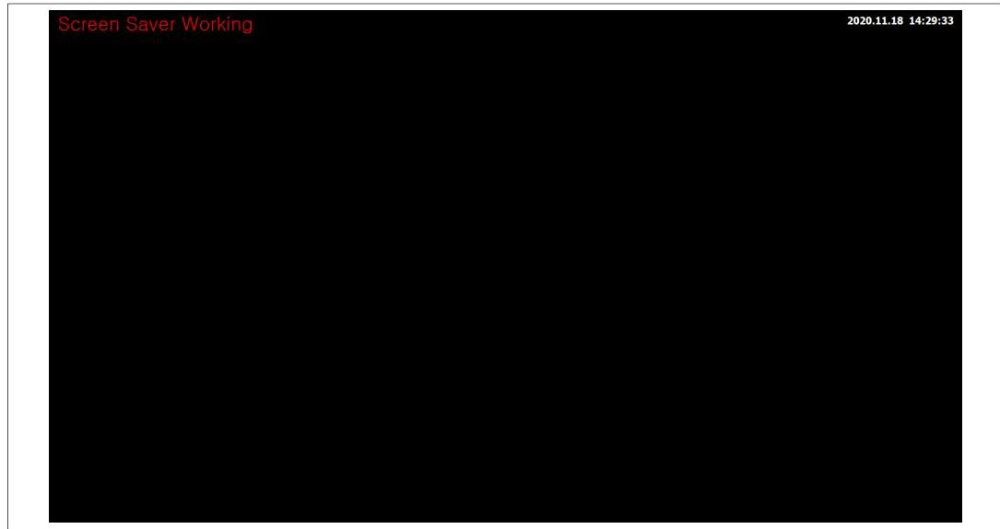
[그림 26] ODILSS 스크린 보호 모드

# 3.8. ODILSS 이미지 프로세싱 순서도 

스마트폰 객체를 검출하기 위해 [그림 27]과 같은 이미지 프로세싱 순서도 를 설계하였다. 카메라로부터 영상 정보가 입력되면 영상 정보가 정상인지 확 인한다. 영상 정보가 정상이면, 영상을 분할하기 위해 Mat 형식의 카메라 영 상 정보를 Bitmap 형식으로 변환 한다. 변환 된 Bitmap을 60 이내의 영상 정 보만 객체 검출 알고리즘을 실행하기 위해 이미지를 잘라낸다. 불필요한 위치의 영상 정보 는 이미지 프로세싱 하지 않아 연상 속도를 향상 시킨다[16]. 잘라낸 이미지를 YOLO 알 고리즘을 수행하기 위해 byte배열로 변환한다. 객체 검출 알고리즘 수행 결과 객체 가 검출된다면, 영상 정보 원본 Bitmap에 그래픽 객체를 사용하여 테두리를 그린 뒤, 그래픽 객체를 Flush 한다.
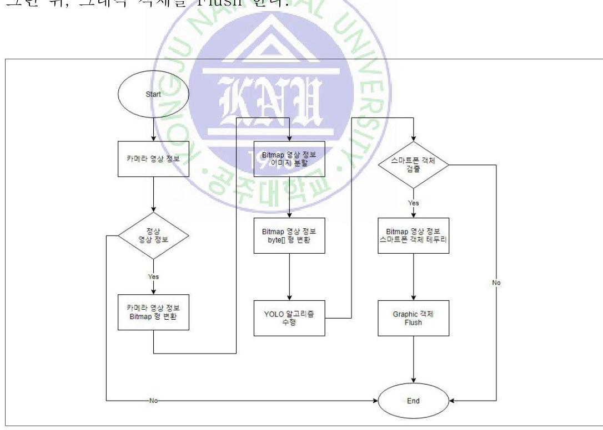
[그림 27] ODILSS 이미지프로세싱 순서도

# 3.9. 객체 검출 이벤트 설계 

객체 검출 결과를 관제 센터 DB에 삽입하기 위해 [그림 28]과 같은 함수 를 설계하였다. 객체 검출 결과 사전에 정의한 스마트폰 카테고리에 포함된 객체가 검출되면 해당 위치의 Grahpic 클래스를 사용하여 테두리를 표시하고, ScreenShot 함수를 사용하여 관제 센터 DB에 데이터를 삽입한다.

```
private void Yolo_Detect(byte[] bImage_Array)
{
    byte[] bImage_Array = BitmapToByte(bitmap_Crop);
    var items = yoloWrapper.Detect(bImage_Array);
    foreach (var item in items)
    {
        if (item.Type == "cell phone" && item.Confidence > 0.9)
        { //객체 검출 결과 "cell phone" And 열처드 999 이상
            Global.Log().LogWrite(SystemLog, LOG_TYPE.BaseLog, "Smart Phone Detect "); //Log
            Graphics graphics = Graphics.FromImage(bitmap_Camera); //테두리 처리를 위한 형변환
            graphics.SmoothingMode = System.Drawing.Drawing2D.SmoothingMode.AntiAlias; //Mode 지정
            Pen pen = GetPen(bitmap_Camera.Width, Color.Red); //그래픽 테두리 Pen 지정
            graphics.DrawRectangle(pen, item.X + 160, item.Y, item.Width, item.Height); //해당영역 그리기
            graphics.Flush() //그래픽 적용
            Global.ScreenShot(bitmap_Camera); //이벤트 데이터 삽입
        }
    }
}
public static void ScreenShot(Bitmap bYoloResult)
{
    Process[] allProc = Process.GetProcesses(); //시스템의 모든 프로세스 정보 출력
    //인감 정보 PC 스크린 정보 저장
    Bitmap bitmap_Client_Screen = new Bitmap(VirtualScreenWidth, VirtualScreenHeight);
    Graphics g = Graphics.FromImage(bitmap_Client_Screen);
    g.CopyFromScreen(0, 0, VirtualScreenWidth, VirtualScreenHeight);
    bitmap_Client_Screen.Save(sScreen_PATH, ImageFormat.Png);
    //ODILSS 객체 검출 결과 정보 저장
    bYoloResult.Save(sCamera_PATH, ImageFormat.Png);
    FileStream fs_Camera = new FileStream(PATH, OpenOrCreate, FileAccess.Read);
    byte[] CameraData = new byte[fs_Camera.Length];
    fs_Camera.Read(CameraData, 0, System.Convert.ToInt32(fs_Camera.Length));
    fs_Camera.Close();
    //관제 센터 DB에 이벤트 데이터 삽입
    MySqlExecute (INSERT_EventData_SCREEN_IMAGE(), clsMYDB.MySqlTransType.Auto);
}
```

[그림 28] ODILSS 객체 검출 이벤트 데이터 삽입

# IV. 실험 결과 

## 4.1. 스마트폰 영상 정보의 객체 검출 실험

### 4.1.1. 삼성 스마트폰 영상

실험 방법은 삼성 스마트폰이 정면으로 찍힌 영상을 사용한다. [그림 29]과 같이 객체 검출 결과 스마트폰 검출 시, 스마트폰 영역을 빨간 테두리로 표시 한다. 9 대의 스마트폰 중, 8 대의 스마트폰을 검출 했다.
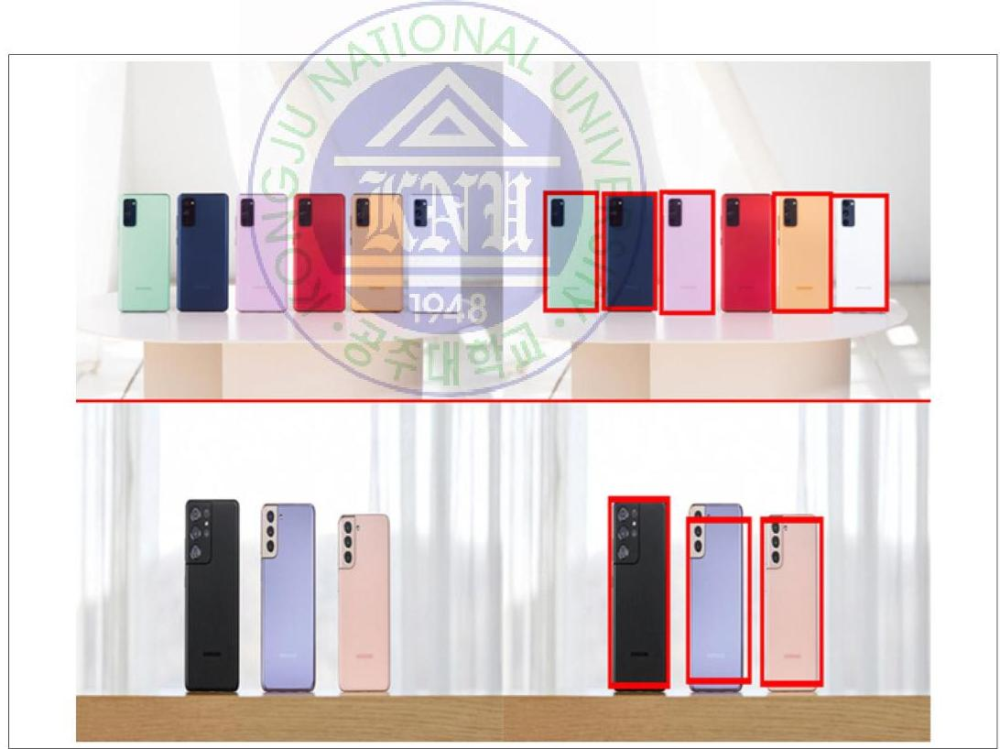
[그림 29] 삼성 스마트폰 객체 검출 결과

# 4.1.2. 애플 스마트폰 영상 

실험 방법은 애플 스마트폰이 정면으로 찍힌 영상을 사용한다. [그림 30]과 같이 객체 검출 결과 스마트폰 검출 시, 스마트폰 영역을 빨간 테두리로 표시 한다. 7 대의 스마트폰 중, 7 대의 스마트폰을 검출 했다.
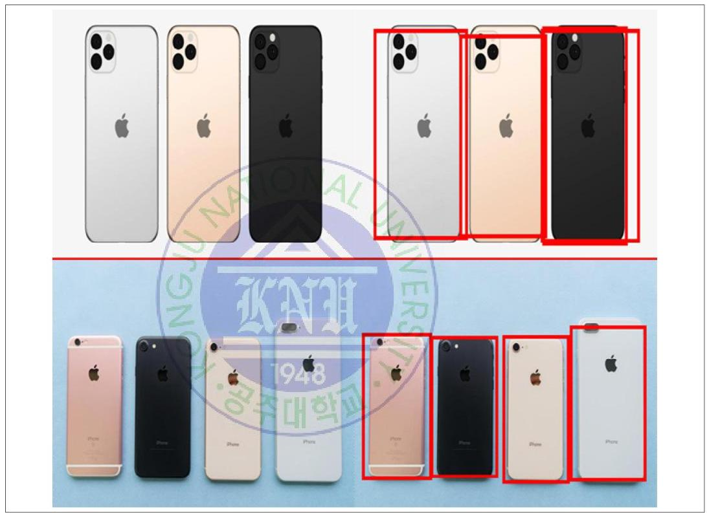
[그림 30] 애플 스마트폰 객체 검출 결과

# 4.1.3. 구글 스마트폰 영상 

실험 방법은 구글 스마트폰이 정면으로 찍힌 영상을 사용한다. [그림 31]과 같이 객체 검출 결과 스마트폰 검출 시, 스마트폰 영역을 빨간 테두리로 표시 한다. 4 대의 스마트폰 중, 4 대의 스마트폰을 검출 했다.
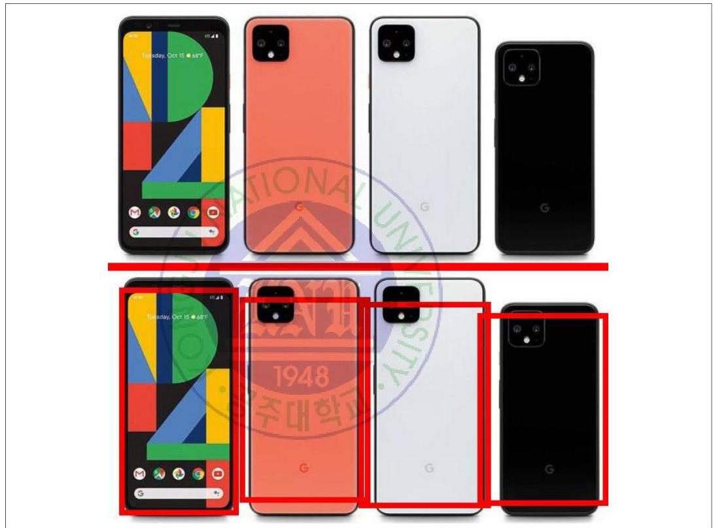
[그림 31] 구글 스마트폰 객체 검출 결과

# 4.1.4. 샤오미 스마트폰 영상 

실험 방법은 샤오미 스마트폰이 정면으로 찍힌 영상을 사용한다. [그림 32] 과 같이 객체 검출 결과 스마트폰 검출 시, 스마트폰 영역을 빨간 테두리로 표시한다. 7 대의 스마트폰 중, 5 대의 스마트폰을 검출 했다.
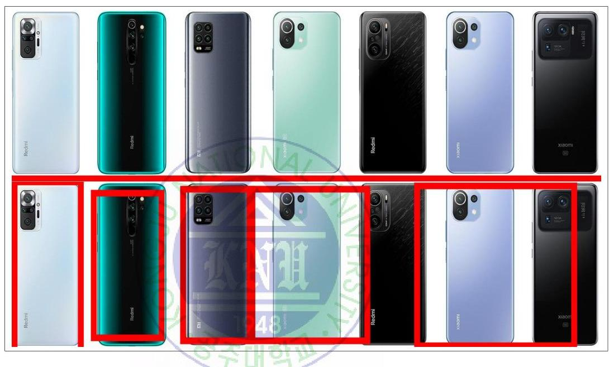
[그림 32] 샤오미 스마트폰 객체 검출 결과

# 4.1.5. 비정형 스마트폰 영상 

실험 방법은 다양한 제조사의 스마트폰이 정면으로 찍힌 영상이 아닌 사람 손에 들고있거나, 대각선으로 찍힌 영상을 이용하여 스마트폰 객체 검출을 진 행한 사진이다. [그림 33]과 같이 객체 검출 결과 스마트폰 검출 시, 스마트 폰 영역을 빨간 테두리로 표시한다. 8 대의 스마트폰 중, 3 대의 스마트폰을 검 출 했다.
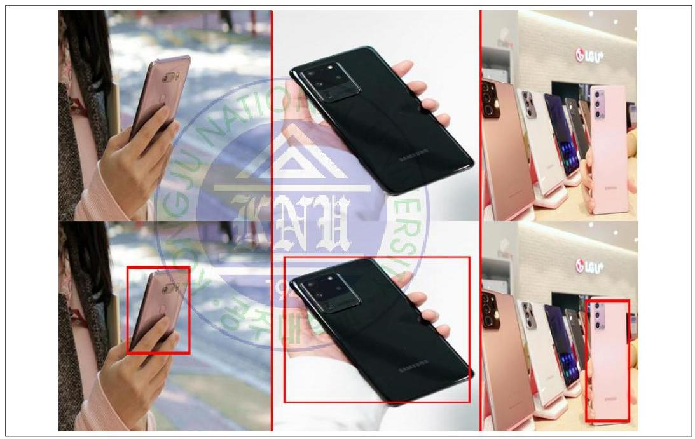
[그림 33] 비정형 스마트폰 객체 검출 결과

# 4.2. ODILSS 스마트폰 객체 검출 실험 

### 4.2.1. 실험 환경

민감 정보가 표시되는 스크린의 중앙 상단에 카메라가 설치되고, ODILSS가 설치된다. ODILSS는 설치된 카메라로부터 영상 정보를 획득한다. 획득한 영 상 정보를 이용하여 스마트폰 객체 검출 알고리즘을 진행한다.
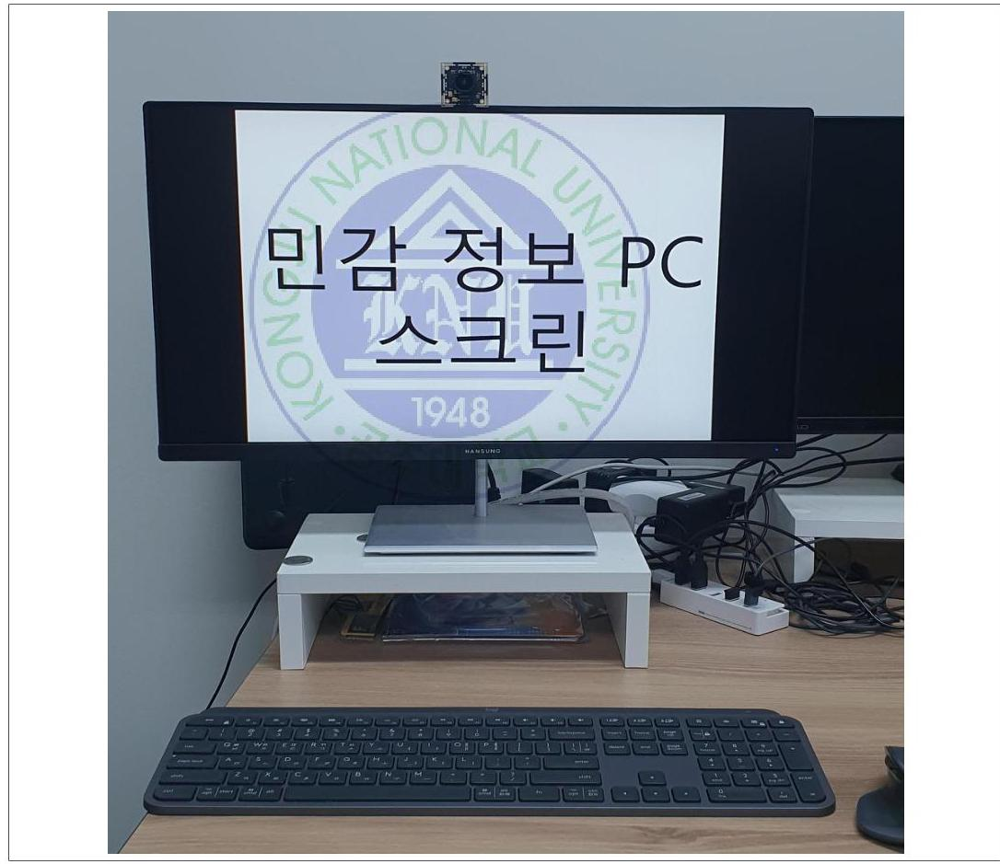
[그림 34] ODILSS 카메라 설치 위치

# 4.2.2. 관제 센터 모니터링 시스템 

관제 센터 모니터링 시스템은 관제 센터 DB와 연결된다. 관제 센터 DB의 데이터를 주기적으로 조회하여 DB Connettion 상태를 체크한다. ODILSS에 서 스마트폰 객체가 검출되면 관제 서버 DB로 이벤트 데이터를 삽입한다. 관 제 센터 모니터링 시스템은 ODILSS에서 삽입한 이벤트 데이터를 바탕으로 ODILSS의 상태를 확인 및 제어할 수 있다.
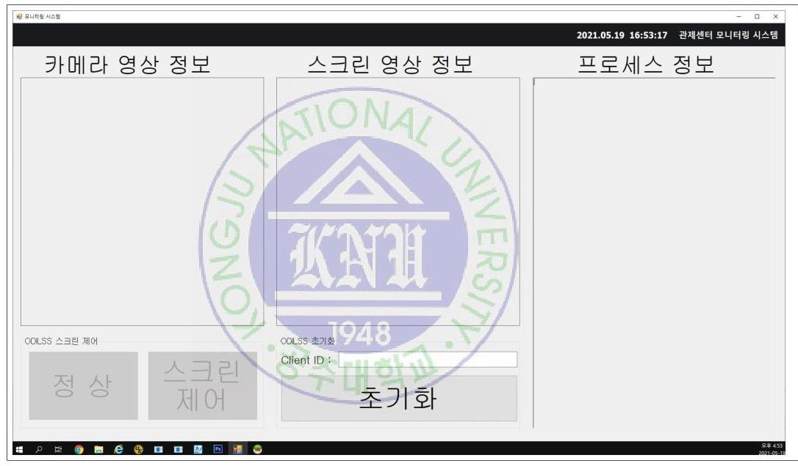
[그림 35] 관제 센터 모니터링 시스템 대기 화면

ODILSS에서 스마트폰 객체 검출 이벤트를 관제 센터 DB에 삽입하면 [그 림 36]와 같이 관제 센터 모니터링 시스템에서 이벤트가 발생한 시간, ODILSS 고유 키, 카메라 영상 정보, 스크린 영상 정보, 실행중인 프로세스 정보가 관제 센터 모니터링 시스템에 표시되고, 알림음을 재생한다. 관제 센터 보안 담당자는 해당 정보를 이용하여 ODILSS의 상태를 확인하고, 스크린을 제어할 수 있다. ODILSS의 스크린 제어 오작동 시 ODILSS 고유 키를 이용 하여 ODILSS 스크린 제어 보호 모드를 초기화 할 수 있다.
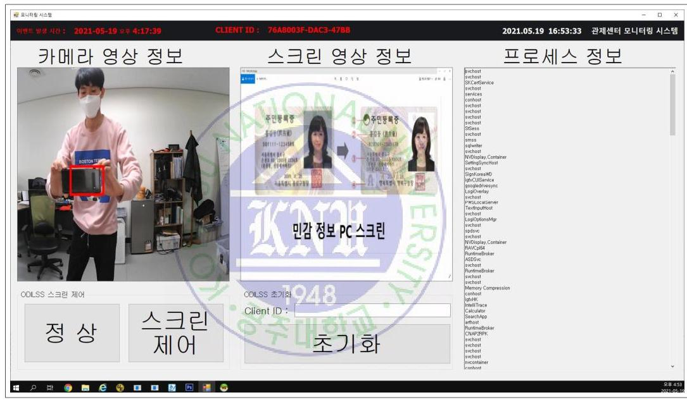
[그림 36] 관제 센터 모니터링 시스템 이벤트 발생

# 4.2.3. 스크린 보호 모드 

관제 센터 보안 담당자가 관제 센터 모니터링 시스템에 스마트폰 객체 검출 이벤트가 발생을 확인하고 정보 유출 우려가 있는 경우 ODILSS의 스크린을 제어 할 수 있다. 관제 센터 모니터링 시스템에서 스크린 제어 버튼 클릭 시 아래 [그림 37]와 같이 민감 정보가 표시되는 스크린이 가려진다. ODILSS의 스크린 보호 모드에서 ODILSS의 고유 키, 관제 센터 연락처 등의 정보를 표 시하여 오 작동시 관제 센터 연락을 통해 ODILSS의 보호 모드를 해제 할 수 있다.
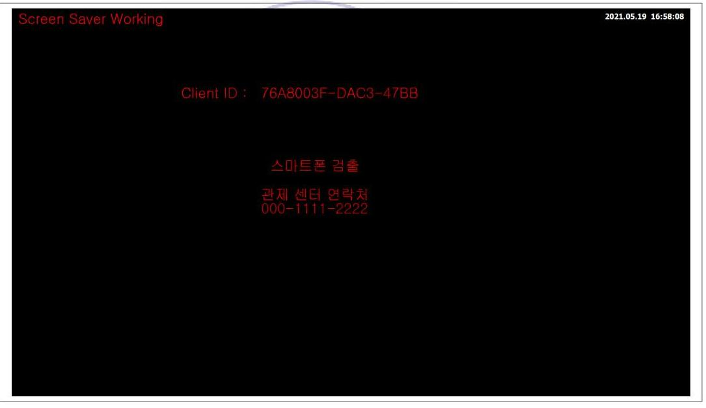
[그림 37] ODILSS 스크린 보호 모드 작동

# V. 결론 및 향후 연구 방향 

정보화시대에 진입함에 따라 스마트폰의 보급은 더욱 증가 되었다. 그에따 른 스마트폰을 통한 정보 유출 위험도 날로 증가하고 있다. 특히 스마트폰 사 진 촬영을 통한 정보 유출이 빈번하게 발생하고 있다. 정보 유출을 보호하기 위해 스마트폰 카메라 보안스티커, 스크린 보안필름 부착, MDM 솔루션 도입 등 다양한 방식을 도입하고 있다. 하지만, 정보 유출 방법 또한 점차 교묘해지 고 스마트폰 제조사, 스마트폰 운영체제, 스마트폰 표면 성분 등의 특성이 모 두 다르기 때문에, 다양한 정보 유출 보호 방식을 도입해도 사전탐지가 어려 워지고 있다. 본 논문은 스마트폰 사진 촬영을 통한 정보 유출을 보호하기 위 해 민감 정보가 표시되는 스크린에 카메라를 부착하고, 카메라로부터 입력된 영상 정보중 스크린 보안필름을 부착해도 보호할 수 없는 $60^{\circ}$ 이내의 영상 정보 만을 이미지 프로세싱하여 스마트폰 객체 검출 속도가 향상된 ODILSS를 제안 했다. ODILSS는 스마트폰 객체 검출 시, 관제 센터 DB에 해당 데이터를 삽 입하고, 관제 센터 모니터링 시스템은 추가적으로 데이터를 조회하여 관제 센 터에 알림 및 민감 정보 PC를 제어 기능을 제공하는 시스템을 연구했다.

그 결과 민감 정보 PC의 스크린을 스마트폰으로 사진 촬영 시, ODILSS는 실시간으로 스마트폰 객체를 검출한다. 객체 검출 결과 스마트폰 검출 시 이 벤트를 발생시켜 관제 센터 DB에 해당 이벤트 데이터를 삽입한다. 관제 센터 모니터링 시스템은 DB에 삽입된 데이터를 바탕으로 관리자에게 알림과 민감 정보 PC 스크린을 제어할 수 있는 기능을 제공한다. 민감 정보 PC 스크린을 제어하여 스마트폰 사진 촬영을 통한 정보 유출을 보호할 수 있는 효과를 확 인했고, 관제 센터에 입력된 데이터를 바탕으로 보안검색대에서 추가적인 검 문에 타당성을 제시했다.

본 연구에서는 실시간 객체검출에 유리한 YOLO를 사용 했다.
하지만, 영상 정보의 검출할 물체가 작다면 객체를 감지하기 어려운 YOLO

단점을 보완할 연구가 필요하다. 또한, 다양한 스마트폰 기종을 검출할 수 있 도록 기능을 개발하여야 한다. 더 나아가 스마트폰 객체 검출이 아닌 다양한 카메라들을 이용하여 스마트폰 렌즈부분을 검출 하여 시스템을 향상시키는 연 구가 필요하다.


# [참 고 문 헌] 

[1] 김동근, (2018) "Python으로 배우는 OpenCV 프로그래밍", 가메출판사, pp. $12-13$.
[2] 김명호, (2019) "컴퓨터비전 기반 건설근로자 안전모 착용 여부 인식을 위한 딥러닝 기법의 적용", 부경대학교 대학원 안전공학과, 석사학위논문.
[3] 김진희, (2018) "이미지 프로세싱을 활용한 레이오 테스트 이미지 분석 에 관한 연구", 중앙대학교 대학원 영상학과, 석사학위논문.
[4] 김태우, (2018) "YOLO v1 : You Only Look Once", https://taeu.github.io/paper/deeplearning-paper-yolo1-01/
[5] 송왕은, 정승욱, 정수환, (2015) "모바일 단말에서의 정보 유출 방지를 위한 클라우드 플랫폼 구축", pp. 2.
[6] 오일석, (2014) "컴퓨터 비전", 한빛아가데미, pp. 30-32.
[7] 윤성만, 유종수, 조정대, 김장영, 강정식, (2010) "인쇄기법을 이용한 보 안필름의 제조"
[8] 이호성, (2020) "Deep learning object detection", https://github.com/hoya012/deep_learning_object_detection/
[9] 조지훈, (2020) "객체 탐지(Object Detection) 기술", http://clipsoft.co.kr/wp/blog/객체-탐지object-detection-기술/
[10] 한국인터넷진흥원, (2020) "중소기업 정보보호 실무 가이드(1/2)", pp. 25.
[11] Hermet, (2019) "이미지 프로세싱", https://hermet.pe.kr/142
[12] LG CNS, (2020) "우리가 납이가? 우리는 남이다!"내부자 위협 대처 방안, https://blog.lgcns.com/2359
[13] SAS Korea, (2018) "딥러닝을 활용한 객체 탐지 알고리즘 이해하기", https://blogs.sas.com/content/saskorea/2018/12/21/딥러닝을-활용

한-객체-탐지-알고리즘-이해하기/
[14] SAS Korea, (2021) "딥러닝의 정의 및 중요성", https://www.sas.com/ko_kr/insights/analytics/deep-learning.html/
[15] WENDYS, (2019) "AI 인공 지능, 머신 러닝, 딥 러닝 차이점", https://wendys.tistory.com/136
[16] "[c++ opencv] 이미지서치 연산속도 향상", (2020)
https://diyver.tistory.com/128
[17] "one-stage detector vs two-stage detector", (2020)
https://jdselectron.tistory.com/101


# ABSTRACT* 

## A Study on the Information Leak Security System (ODILSS) Through Smartphone Photography

Ryeong-Ho Kim

Computer Science and Engineering
Graduate School of Kong Ju National University
Kong Ju, Korea
(Supervised by Professor Jae-Woong Kim)

In general, information leak security can be divided into areas that respond to threats from outsiders such as hacking or malicious code, and areas that respond to threats from insiders such as data leak from inside to outside. Various solutions such as firewalls, VPNs, and virtualization systems are introduced to respond to threats from outsiders, and as a result, the number of cases of information leak caused by threats from outsiders is greatly reduced. However, information leak through threats from insiders is more damaging than threats from outsiders, making it difficult to detect in advance, and the amount of damage after information leak can be much larger. In order to prevent information leak through smartphone filming, which is one of insider's information leak path, it currently uses hardware,

smartphone camera security stickers, screen security films, and software uses smartphone MDM (Mobile Device Management) solutions to limit functions such as smartphone photography and data communication. In this paper, we propose a study on the information leak protection system through smartphone shooting by installing a camera on a PC with access to sensitive information, collecting video information from cameras and designing a smartphone object detection algorithm. For this purpose, the camera is installed at the top of the center of the screen. Image frames are transmitted in real time from camera. In addition, real-time object detection is possible using YOLO, which has fast computational speed. The purpose of this paper is to develop a system for detecting smartphone objects from video information inputted from cameras. As a result, information leak can be protected by taking pictures of smartphones.

