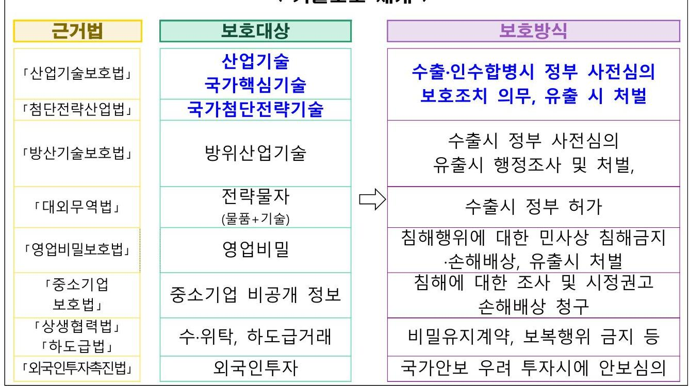
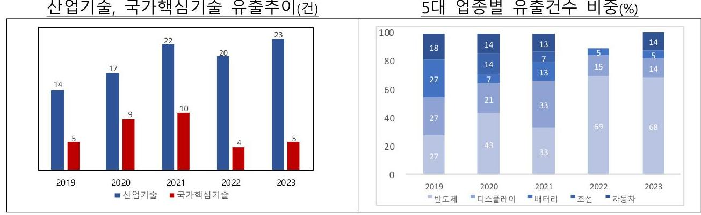
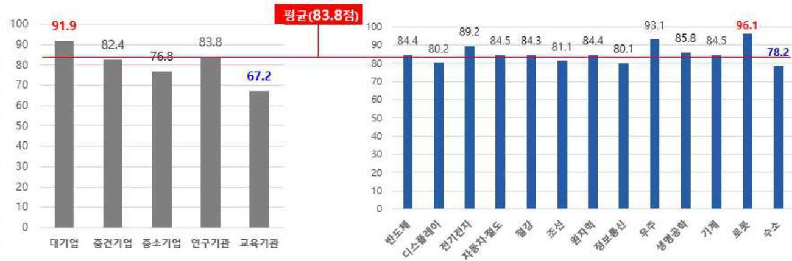
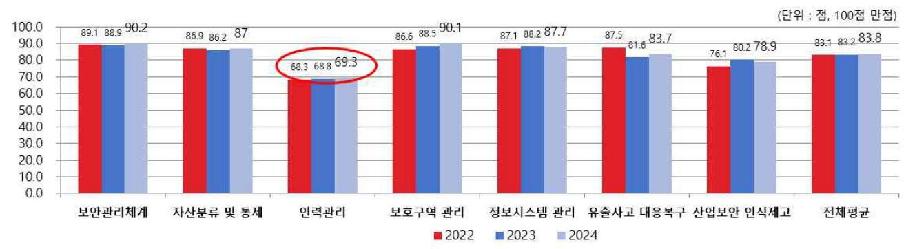
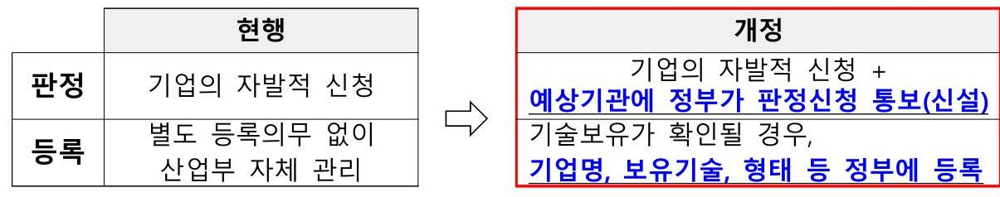
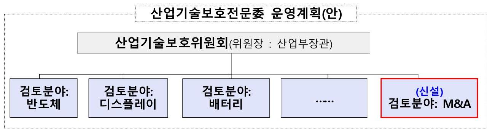
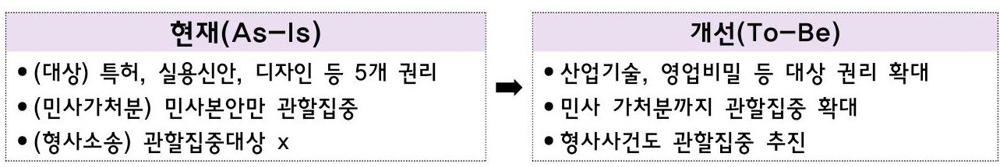
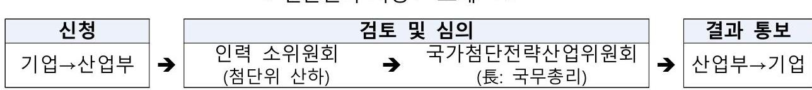

# 제5차 산업기술의 유출방지 및 보호에 관한 종합계획[25 27] 

2024. 12.

관계부처 합동

# 〈 수립배경 및 경과 > 

## 1. 종합계획 개요

$\square$ (수립근거) 「산업기술의 유출방지 및 보호에 관한 법률」
○「산업기술보호법」제5조(종합계획의 수립$\cdot$시행)에 따라 산업기술의 유출방지 및 보호를 위한 종합계획 수립

○ 同계획은 3년마다 수립, 금번은 제5차 종합계획('25 27)
$\square$ (주요내용) 국가핵심기술 등 산업기술의 유출방지$\cdot$보호에 관한 사항
○ 산업기술의 유출방지 및 보호에 관한 기본목표와 추진방향
○ 산업기술의 유출방지 및 보호에 대한 홍보와 교육에 관한 사항
○ 산업기술의 유출방지 및 보호의 기반구축에 관한 사항 등

## 2. 그간의 경과

$\square$ 民官 합동 ‘산업기술보호 종합계획TF’ 발족 및 운영('24.7월)
○ 산업부, 산업연구원, 분야별(기술$\cdot$보안$\cdot$법률) 전문가 등으로 구성 $\rightarrow$ 산업기술보호를 위한 향후 정책방향 등 논의

* 출범회의(6.11일), 1차회의(8.9일), 2차회의(8.23일), 3차회의(9.10일) 등
$\square$ 산업기술보호 정책협의회* 등을 통한 부처간 의견공유$\cdot$수렴('24.9월)
* 「산업기술보호법」 시행령 제5조 제7항에 따라 산업기술보호 정책방향 등 논의를 위해 산업부(위원장: 무역투자실장), 관계부처로 구성된 협의체
$\square$ 관계부처 협의('24.12월)
$\square$ 제58회 산업기술보호위원회 심의$\cdot$의결('24.12.27.)

# 순 서 

I. 산업기술보호 현황 ..... 1
II. 그간의 성과 및 개선 필요사항 ..... 5
III. 추진방향 ..... 14
IV. 추진계획 ..... 15
V. 추진일정 ..... 33

# I. 산업기술보호 현황 

## 1 기술보호의 중요성

## 주요국은 미래 경제 $\cdot$ 산업 경쟁력의 핵심인 첨단기술 개발에 사활

- 첨단 산업기술은 높은 부가가치와 연관 산업 파급효과로 경제$\cdot$산업 전반의 고도화에 기여할 수 있는 핵심 요소
* 게임체인저급 인공지능(AI) 기술개발$\cdot$활용에 있어 반도체는 필수적 $\rightarrow$ HBM 등 수요 폭증
- 기술 개발이 빠르게 이루어지고 높은 진입장벽으로 인해 기술을 확보한 소수의 국가$\cdot$기업이 시장 주도
* 첨단 반도체 공정에 필수적인 극자외선 노광장비(EUV)는 네덜란드 ASML이 독점 $\rightarrow$ 제한된 공급속에서 글로벌 반도체 제조기업들은 우선 공급받기 위해 경쟁

## 경제안보와 직결되는 첨단기술에 대한 철저한 보호 노력도 병행

- 첨단 산업기술은 높은 군용 전용 가능성 등으로 경제안보에 큰 영향을 미칠 수 있어 기술확보$\cdot$보호를 위해 '기술 통제' 추세 심화
- 美 양자컴퓨터, 반도체제조, 적층제조 관련 24 개 품목의 수출통제 개정안 발표('24.9)
- 日 반도체 제조에 사용되는 핵심장비 23 개 품목을 수출통제 대상에 포함('23.7)
- 中 바이오, 희토류, 항공우주, AI를 포함한 광물$\cdot$핵심기술 수출통제('23.12)
- 우려국의 기술 취득을 방지하기 위해 투자심사제도 적극 활용
* (외국인투자) 美 외국인투자심의위원회(CFIUS)의 외국인 투자심사 권한 확대 (現 지배적 투자 $\rightarrow$ 改 지배적투자 + 비지배적투자, '22년)
(해외투자) 美 재무부는 미국인이 우려국에 대해 반도체$\cdot$양자$\cdot$AI 분야 기술개발$\cdot$ 생산 관련 투자금지 또는 신고하도록 하는 행정명령 발표('23.8)
- 아울러, 국가 차원에서 첨단 산업기술에 대한 접근 방지, 안보 위협 완화 등을 위한 다양한 제도적 기반을 마련 중
* 日 민감정보 관리, 비밀특허제도 등 내용을 담은 「경제안전보장법」제정('22.5)
- 첨단$\cdot$핵심기술은 자국의 산업경쟁력과 안보를 결정짓는 핵심요소이며, 주요국은 이러한 공감대 下, 자국 특성에 맞는 보호전략 수립$\cdot$시행

# 문항

## 주요국 기술보호 동향

|  국 가 | 분 류 | 주요 내용  |
| --- | --- | --- |
|  $\begin{aligned} & \text { 미국 } \ & \text { ㅇ } \ & \text { ㅇ } \ & \text { ㅇ } \end{aligned}$ | 첨단기술 보호 | - AI, 양자 등 안보관련성이 높은 첨단기술의 수출통제 추진('24.9)
- 첨단기술 접근 제한을 위해 외국인투자('22.9) + 해외투자 제한('24.6)
- 양자컴퓨터, 반도체제조, 적층제조 관련 24개 품목을 통제대상으로 추가하는 수출통제 개정안 발표('24.9)
- 신흥 및 기반기술(6FT) 업데이트('22.6), 핵심신흥기술(CET) 업데이트('24.2)  |
|   | 투자통제 | - 지배적 투자에만 국한되었던 외국인투자심사 범위를 비지배적 투자로 외국인투자심사위원회(CFIUS)의 권한 확대('22.9)
- 비지배적 투자 범위 : 「수출통제개혁법(ECRA)」의 적용을 받는 신흥-기반 기술 등 핵심기술, 핵심 인프라 및 민감한 개인정보 등
- 우려국의 군사분야 기술역량 확보에 미국자본이 사용되는 것을 방지 하기 위해 해외투자 제한 제도 도입 추진
- 해외투자 제한 관련 대통령 행정명령(EO) 발표('23.8) $\rightarrow$ EO의 이행 규정인 재무부 행정규칙(안) 공개('24.6) $\rightarrow$ 최종 행정규칙 발표('24.10)  |
|   | 기술유출
처벌 | - 기술유출 범죄를 경제스파이 행위로 처벌
- 외국인 A가 GE사의 엔진기술을 탈취한 행위에 대해 경제스파이 죄를 적용하여 20년의 징역형 선고('23)
- 코카콜라에서 영업비밀 훔친 혐의로 화학기술자에게 징역 14년형 및 약 20만달러(약 2억6600만원) 벌금 부과('21)  |
|   | 연구보안 | - 연구 자산 보호와 보안 강화를 위해 연구자의 신원 및 자금 출처 투명성 제고 및 외국 자본과의 연구 협력 시 보안 점검 강화
- 연구보안 프로그램 가이드라인 발표('24.7)
- NSPM-33(대통령 교서) 발표('22.1)  |
|  $\begin{aligned} & \text { 중국 } \ & \text { ㅇ } \ & \text { ㅇ } \end{aligned}$ | 첨단기술 보호 | - 「대외무역법」 및 「기술수출입 관리조례」 개정('23.12) $\rightarrow$ 안보 관련성이 높은 공급망 핵심 품목 및 기술 통제
- 「반간첩법」 개정('23.7) $\rightarrow$ 기술유출자를 간첩으로 규정하고 처벌  |
|   | 첨단기술 보호 | - 희토류 및 안보 관련 기술 포함하여 수출금지제한 기술 목록 개정
- 2024년판 수출 금지-금지 제한 기술 목록 업데이트(2023년판 대비 34개 기술 항목 삭제, 4 개 항목 추가, 37 개 항목 수정)  |
|   | 투자통제 | - 외국인투자 네거티브리스트 등을 통해 투자 금지-제한 업종 발표
- 과학연구 및 기술서비스업(유전자 진단 치료기술, 지리 측량기술 등), 원자력 발전소 건설-경영 등 11 개 분야 포함('24.9)  |
|   | 기술유출
처벌 | - 「반간첩법」 개정을 통해 간첩 행위에 대한 적용범위 확대 및 행정 처벌 수위 상향('23.7)
- '23년에 개정되면서 $\triangle$ 간첩행위 범주 확대 $\triangle$ 국가안보 기관 권한 확대 $\triangle$ 사이버 안보 강화 $\triangle$ 행정처벌 수위 강화 법제화
- '16년부터 4년간 일했던 한국인이 중국 D램 반도체 업체의 기술을 빼돌린 혐의(반간첩법)로 구속('24.5)  |
|   | 연구보안 | - 「과학기술기밀보호규정」 제정을 통해 기밀의 범위, 관리주체 및 관리방안 등을 제시('18)  |

|  국 가 | 분 류 | 주요 내용  |
| --- | --- | --- |
|  $\begin{aligned} & \text { 일 본 } \ & \text { EU } \end{aligned}$ | 첨단기술 보호 | - 「외환법」하위법령 개정을 통해 반도체장비 수출통제('23.7) 및 민감 분야 투자 강화('23.3) 추진
- 「경제안보추진법」(22.5) 및 「중요경제안보정보보호 활용법」(24.5) 제정  |
|   | 첨단기술
보호 | - 반도체와 양자컴퓨팅을 추가하여 핵심기술 수출 통제범위 확대
- 주사전자현미경(SEM), GAFFET 기술, 양자컴퓨터 관련 기술 등('24.4)
- 반도체 제조 장비 23개 품목 수출통제 대상 추가('23.7)  |
|   | 투자통제 | - 「외국환 및 외국거래법」에 근거, 민감분야 투자규제 강화
- 「외환법」개정('23.3)을 통해 외환법 대상 업종 9개 추가
- 민감분야에 대해 사전신고 의무를 $1 \%$ 이상 지분 취득 시(기존 10\%)
로 강화(외환법 개정, '19.10)  |
|   | 기술유출
처벌 | - 「영업비밀보호법」에 따라 첨단기술 유출 대응 및 처벌
- '산업기술종합연구소' 소속 외국 국적 연구원이 자신이 연구 중인 '불 소화합물'에 대한 정보를 중국 민간기업에 메일로 보내 영업비밀 누 설 혐의로 체포('23.6)
- 세키스이화학공업의 스마트폰 기술에 관한 기밀정보를 외국기업에 누설한 전직 연구원을 불구속 기소하여 유죄판결('21)  |
|   | 연구보안 | - 특허출원의 비공개제도 시행('24.5)으로 국가안보 관련 기술 유출 방지
- 항공기의 위장은폐기술, 무인항공기 자율제어 기술, 발사체 관련 기술 등 군사전용이 가능한 25 개 분야 제시
- 민간의 안보에 영향을 줄 수 있는 정보를 '중요정보'로 지정하고 접근자 등을 제한할 수 있는 사전적격심사제 도입  |
|   | 첨단기술
보호 | - 「경제안보 이니셔티브」발표('24.1) $\rightarrow$ 회원국의 첨단기술 보호방안 제언
- 연구보안 강화를 위한 가이드라인 제정 등 노력 활발  |
|   |  | - (EU) 10개 EU 경제안보 핵심기술 선정, 기술 유출에 가장 민감한 분야'를 선정하여 위험평가 우선 도입('23.10)
- 첨단반도체, 인공지능, 양자, 생명공학  |
|   | 투자통제 | - (EU) 「경제안보 이니셔티브」발표('24.1)를 통해 FDI 심사강화, 해외투자 규제 수립, EU 차원의 통합된 수출 통제 등 EU의 통합된 전략적 무역 및 투자 규정 수립
- (영) 「국가안보 및 투자법(NSIA)」개정('24.5)
- 콜인(Call-in) 권한 명확화, NSIA 적용 대상 확대
- (독) AI, 반도체 분야 대중 외국인투자 규제 투자심사법 제안('23.8)  |
|   | 기술유출
처벌 | - 유럽 각국에서 기술유출 행위에 대한 처벌
- (독) 외국 정보기관에 군함 엔진 부품 기술 유출한 독일인 체포('24.4)
- (영) 외국에 기밀정보 제공한 영국 전직 의회 연구관 기소('24.4)  |
|   | 연구보안 | - (EU) 연구경제안보전략 후속 5 가지 이니셔티브 발표('24.1)
- 유럽 연구안보 전문센터를 설립하여 증거 기반의 정책결정 촉진 및 실무 조직 정립
- 연구 기관의 도구 개발 및 EU 법률해석 제공
- (독) 연구보안 강화를 위한 8 가지 연구보안 원칙 제시('24.3)
- (프) 핵심기술 연구의 보안 및 개방성에 관한 연구 발표('23.10)
- (영) 고등교육기관 및 공공연구기관이 국제연구협력시 준수 사항 관련 가이드라인 발표('23.2)  |

# 2 우리의 산업기술보호 체계 

$\square$ 다양한 법률을 통해 보호대상 기술 등을 정하고 의무부과, 행위규제, 침해금지$\cdot$처벌 등 보호방식을 마련하여 운영

## 〈기술보호 체계 〉

$\square$ 산업기술의 경우 산업기술보호법, 국가첨단전략산업법을 통해 기술을 지정하고 보호조치, 수출$\cdot$M\&A 심사, 유출시 처벌 등을 통해 보호

- (기술지정) 기술 특성 및 보호 중요성에 따라 산업기술(4.159개), 국가 핵심기술(13개 분야 76개), 첨단전략기술(4개 분야 17개)로 구분$\cdot$지정
- (보호방식) 국가핵심기술$\cdot$첨단전략기술에 대해 보호조치 의무 부과, 수출$\cdot$M\&A시 심사제도 운영, 유출시 강화된 처벌 부과
* 수출심의(건) : ('19년) $75 \rightarrow$ ('20년) $54 \rightarrow$ ('21년) $85 \rightarrow$ ('22년) $89 \rightarrow$ ('23년) 126
* M\&A심사(건) : ('19년) $0 \rightarrow$ ('20년) $2 \rightarrow$ ('21년) $3 \rightarrow$ ('22년) $1 \rightarrow$ ('23년) 2
* 해외유출 적발건수(건) : ('19년) $14 \rightarrow$ ('20년) $17 \rightarrow$ ('21년) $22 \rightarrow$ ('22년) $20 \rightarrow$ ('23년) 23

수차례의 법개정과 3년단위 종합계획 수립을 통해 기술보호 노력 강화

* 제1차 종합계획(13.2) 이후 4차례에 걸쳐 종합계획 수립$\cdot$시행

# II. 그간의 성과 및 개선 필요사항 

## 1 그간의 성과

- 산업부 내 기술보호 전담조직 신설(무역안보국, '20.5), 법정부 기술 유출 합동대응단 출범('23.11) 등 기술보호 체계 고도화
- 「국가첨단전략산업법」 시행('22.8)을 통해 보다 강화된 기술보호 체계를 마련하고, 양형기준 상향('24.3) 등으로 처벌체계 정비

## 국가핵심기술 및 핵심인력 유출 방지체계 강화

$\square$ 국내외 기술수준, 국가안보$\cdot$국민경제 영향 등을 종합적으로 검토하여 국가핵심기술* 고시 개정 및 국가첨단전략기술 지정

* 국가핵심기술 지정 : ('21년) 12개 분야 73개 $\rightarrow$ ('24년) 13개 분야 76개
* 국가첨단전략기술 지정 : <신설> $\rightarrow$ ('23년) 4개 분야 17개기술
- 기술변화에 대응하여 핵심기술을 주기적으로 개정
* ('23.4) 수소분야 신설(건설$\cdot$산업용 연료전지 기술), 자동차 분야 범위 확대(공조시스템)
('24.7) 신규지정(원자력, 기계, 철도) 4건, 해제(원자력) 3건, 기술명 명확화 등 변경(반도체, 전기전자, 조선 등 8개분야) 24 건 등
- 반도체, 배터리, 바이오, 디스플레이 등 국가첨단전략기술 지정('23.5)
$\square$ 지식재산범죄 양형기준에 '산업기술 침해행위'를 별도 유형으로 분리$\cdot$ 신설하고 국가핵심기술 유출에 대해 양형 상향*
* 기본양형 : 1년 3년 6개월 $\rightarrow 3 \sim 7$ 년 / 가중양형 : $2 \sim 6$ 년 $\rightarrow 5 \sim 12$ 년
$\square$ 핵심인력의 해외이직 등으로 인한 기술유출 방지를 위해 「국가첨단 전략산업법」을 통해 한층 강화된 인력관리 근거 마련
- 정부가 전문인력을 지정할 수 있으며, 강화된 이직관리계약*$\cdot$출입국 정보제공 등 지원 가능(「국가첨단전략산업법」시행, '22.8)
* 해외 동종업으로의 이직제한, 전략기술 비밀유지, 퇴직 후 재취업 정보제공 등

$\square$ 퇴직한 핵심인력을 특허심사관*, 산업현장교수** 등으로 채용하여 전문성 활용 기반 확대 및 해외 이직 방지

* 반도체(67명), 배터리(38명) 등 첨단산업분야 특허심사관(전문임기제) 채용
* '24년 기준 산업현장교수 832명(총 2,655명 선정, '12년부터 누적)

# 산업기술 선제적 보호 시스템 구축 

$\square$ 재직자, 신규인력 대상 산업보안 전문인력 양성*, 산업보안관리사 공인 자격 연장** 등 인력양성 기반 마련

* (재직자) 4 개 대학 총 152 명 지원 / (신규인력) 6개대학 총 334 명 지원
* 국가공인 자격 기간 5년 연장('22.1.1 26.12.31) 완료
$\square$ 국가핵심기술 보유 중소$\cdot$중견 기업 대상 보안관제서비스 등 보안인프라 구축*, 보안컨설팅** 등 지원
* 보안설비구축자금 지원: ('22년) 6개사, ('23년) 7개사, ('24년) 7개사
* ('22년) 30개사, ('23년) 30개사, ('24년) 단기 30개사, 중기 8개사 총 38개사
$\square$ 산업보안 논문학술대회, 아이디어 공모전, 산업기술 보호의 날 개최 및 기술보호 유공자 포상 수여 등을 통해 보호인식 제고
o 산업보안 정보도서관(is-portal.net) 운영을 통해 지원제도$\cdot$규정서식 안내, 정기 뉴스레터 제작 및 발송 등

## 범부처 $\cdot$ 우방국간 기술보호 협업을 통한 기술보호 실효성 제고

$\square$ 지능화$\cdot$다양화되고 있는 기술유출에 대응하여 부처간 협력 활성화와 공동대응을 위한 범부처 대응단 출범('23.11)

* ('23.11월) 대통령실 경제안보비서관 및 10 개의 기술보호 유관부처 참여로 발족
$\square$ 한$\cdot$미$\cdot$일 기술보호 네트워크('24.4), 한$\cdot$미 정보수사기관 라운드테이블(1차: '24.4, 2차: '24.11)을 통해 수출통제$\cdot$유출수사 등 협력체계 마련

# 불일 

제4차 산업기술보호 종합계획 이행실적[요약]

|  추진전략 | 이행실적 |
| :--: | :--: |
| [1] 국가핵심기술 및 핵심인력 유출 방지체계 강화 | $\checkmark$ 국가핵심기술 지정 확대 (12개분야 73개 $\rightarrow 13$ 개분야 76 개)   * 수소분야 신설, 기계철도-원자력 등 신규지정   $\checkmark$ 「국가첨단전략산업법」 시행(22.8) 및 첨단전략기술 지정   * 4개분야(반도체, 디스플레이, 배터리, 바이오) 17개 기술   $\checkmark$ 산업기술유출에 대해 양형기준 별도 분리 및 상향   * 기본양형 : 1년 3년 6개월 $\rightarrow 3 \sim 7$ 년 / 가중양형 : $2 \sim 6$ 년 $\rightarrow 5 \sim 12$ 년   $\checkmark$ 국가핵심기술 종합관리시스템 본격 운영   $\checkmark$ 퇴직인력 특허심사관*, 산업현장교수** 등 재취업 지원   * 반도체, 디스플레이, 이차전지 분야 심사관 채용   ** '24년 기준 산업현장교수 832명(총 2,655명 선정, '12년부터 누적)   $\checkmark$ 「국가첨단전략산업법」전문인력 지정 근거 마련   $\checkmark$ 포괄심의제 등 업종별(반도체, 생명공학 등) 수출심사 간소화 방안 마련(산업기술보호지침 개정) |
| [2] 산업기술 선제적 보호 시스템 구축 | $\checkmark$ 재직자 대상 산업보안 석사학위과정 지원   * 수혜인원 : 49명(22년) $\rightarrow 60$ 명(23년) $\rightarrow 60$ 명(24년)   $\checkmark$ 산업보안관리사 국가공인 자격기간 5년 연장('22 26)   $\checkmark$ 중소중견기업 대상 보안인프라 구축 서비스 지원   * 지원기관 수 : 6개사(22년) $\rightarrow 7$ 개사(23년) $\rightarrow 7$ 개사(24년)   $\checkmark$ 보안취약기관 대상 보안컨설팅 수행   * 지원기관 수 : 6개사(22년) $\rightarrow 7$ 개사(23년) $\rightarrow 7$ 개사(24년)   $\checkmark$ 스마트교육 플랫폼 구축 및 기업주도형* 교육 확대   * 자동차분야 1009명(22년) $\rightarrow$ 자동차, 전기전자, 디스플레이분야 1,374명(23년) $\rightarrow$ 자동차, 디스플레이, 조선 1,500명(24년)   $\checkmark$ 민-관회의체 '기술안보포럼' 발족 및 운영   * 22회(22년) $\rightarrow 34$ 회(23년) $\rightarrow 40$ 회(24년) |
| [3] 범부처 기술보호 협업을 통한 기술 보호 실효성 제고 | $\checkmark$ 「범정부 기술유출 합동 대응단」 출범 및 제도분과 총괄   * 기술보호 유관부처간 협력강화를 위해 대통령실 주도로 발족 ('23.11) $\rightarrow$ 산업, 국정원, 중기, 과기, 특허 등 10개 부처 참여   $\checkmark$ 한-미-일 기술보호 네트워크 출범('24.4), 한-미 수사기관 라운드테이블 개최'24.4, '24.11) 등 우방국과의 협력 강화   $\checkmark$ 산업기술보호 정책협의회 활성화   * 3차회의(23.7) $\rightarrow$ 4차회의(23.10) $\rightarrow$ 5차회의(24.2) $\rightarrow$ 6차회의 (24.5) $\rightarrow$ 7차회의(24.8) |

# 개선 필요사항

- **기술보호 제도를 보완·강화해 왔지만 기술유출은 지속 발생 중**

  - 핵심기술 신규지정 등 보호기술을 확대하고 「산업기술보호법」 개정, 「첨단전략산업법」 시행 등으로 기술보호 기반 강화
    - 국가핵심기술 보유기관 M&A 승인제 도입(20년), 징벌적 손해배상제 도입(20년)
  - 이러한 노력에도 불구, 핵심 첨단산업 대상 기술유출은 지속적으로 발생하고 있으며, 대부분 우리의 주력·첨단산업에 집중

  - 산업기술유출로 인해 추산되는 피해액은 수조원에 이를 것으로 추산
    - '19년~'23년간 산업기술유출로 인해 추산되는 피해액은 약 24.8조원(국정원)

- **보호대상 기술과 기술보유 기관을 적기에 파악하는 것이 미흡**

  - 현재의 국가핵심기술 보호제도가 새로운 기술들이 빠르게 출현하는 상황을 신속히 반영하지 못하는 상황
    - 보호필요 산업·기술을 검토하기 위한 전담인력 부재 등이 원인
    - 수출심의, 기술판정 업무를 담당하는 비상근 위원회에서 기술지정 검토까지 담당
  - 기술을 보유한 기관이 정부에 자발적으로 판정을 요청해야 보호할 수 있어 기술 보유기관을 온전히 파악하기에 한계
    - 국내에서 기술 보유기관이 국가핵심기술을 매각하거나 이전하는 경우, 추적이 어려운 것도 원인으로 작용

# $\square$ 심사의 사각지대 존재 및 심사에 따른 기업부담 가중 

- 다양해지고 교묘해지는 기술유출 수법에 능동적으로 대응하기 위해 현재의 심사체계상 허점을 보완해야 할 필요성 증대
- 클라우드 환경 등 업무환경의 변화를 반영한 기술보호 기준도 미흡
- 해외공장 건설 확대 등으로 핵심기술 수출이 증가하고 있으나, 수출심의가 장시간 소요되어 업계에 부담
* 수출 심의(건) : ('19년) $75 \rightarrow$ ('20년) $54 \rightarrow$ ('21년) $85 \rightarrow$ ('22년) $89 \rightarrow$ ('23년) 126

## $\square$ 기술유출 범죄의 처벌 강도도 낮고, 이를 위한 수사 체계도 미흡

- 기술유출 발생 시 주요국 대비 벌금이 낮고, 실질적인 처벌 비율도 저조*
* 유기(27\%), 집행유예(48\%), 무죄(24\%)('산업기술보호법」위반에 따른 판결문, '19 23년)
- 산업기술 유출 특성상 피해액, 고의성 등 입증이 어렵고, 기술유출 사건에 대한 전담 재판부도 부재하여 어려움 상당
- 기술보호 정책부처와 수사부처간 연계 미흡으로 유출 정황을 신속히 파악하고 추가적인 피해를 효과적으로 차단하기에 한계

## $\square$ 대학 $\cdot$ 중소기업, 인력관리 등은 기술보호의 약한 고리로 지적

- 대기업$\cdot$중견기업 대비 대학$\cdot$중소기업의 기술보호 실태 취약하며, 영역별로는 보안인식과 인력관리 분야가 더욱 미흡
* 실태조사 점수('24년): 대학(67.2) < 중소기업(76.8) < 중견기업(82.4) < 대기업(91.9)
* 인력(69.3) < 보안인식(78.9) < 보호구역 관리(90.1) < 보안관리(90.2)
- 기술유출 방지를 위해 '핵심인력'에 대한 관리가 중요하나 기본권 침해, 인력관리의 민감성 등의 이유로 관리에 한계
* 기술유출 사건 중 내부인(전$\cdot$현직 임직원)이 차지하는 비율이 $90 \%$ 이상(경찰청, '22년)

균형있는 '사전예방 + 사후대응 체계' 고도화가 필요한 시점
(1) 보호가 필요한 대상(기술$\cdot$기관)을 신속히 파악하고, 체계적으로 관리
(2) 기술유출 수사$\cdot$재판 전문성을 제고하고, 강화된 처벌 추진
(3) 지원 중심의 기술보호 제도를 운영하여 약한 고리 개선

# 〈참고〉 국내 산업기술 해외유출 현황 및 처리현황

$\square$ (유출현황) 최근 5년('19 23년)간 산업기술 해외 유출건수는 96건 ※ 출처: 정보수사기관 ○ (핵심기술) 이 중, 국가핵심기술 해외유출은 33건에 육박

|  구분 | '19 | '20 | '21 | '22 | '23 | 합계  |
| --- | --- | --- | --- | --- | --- | --- |
|  산업기술 | 14 | 17 | 22 | 20 | 23 | 96  |
|  국가핵심기술 | 5 | 9 | 10 | 4 | 5 | 33  |

○ (기관별) 대기업(38.5\%), 중소기업(53\%), 대학$\cdot$연구소(3\%) 등

|  구분 | '19 | '20 | '21 | '22 | '23 | 합계  |
| --- | --- | --- | --- | --- | --- | --- |
|  대기업 | 6 | 8 | 10 | 4 | 9 | 37  |
|  중소기업 | 8 | 6 | 11 | 13 | 13 | 51  |
|  기타(대학 등) | - | 3 | 1 | 3 | 1 | 8  |
|  합 계 | 14 | 17 | 22 | 20 | 23 | 96  |

○ (업종별) 반도체(39.5\%), 디스플레이(16.6\%), 전기전자(9\%), 자동차(9\%), 기계(7\%) 순으로, 우리 주력$\cdot$첨단산업에 집중 $\square$ (유출수단) 외부저장장치(42\%), 이메일(28\%), 노트북 및 출력물(8\%), 사진촬영(6\%), 클라우드(4\%) 등 順(판결문 기준, 중복포함) ※ 출처: 「산업기술보호법」위반에 따른 판결문('19 23년) $\square$ (유출경로) 현직 임직원(내부) 및 외부와의 공모 등이 $75 \%$ 이상

|  구분 | 내부 | 외부 |  | 내부+외부 | 합계  |
| --- | --- | --- | --- | --- | --- |
|   |  | 퇴직 임직원 | 他기업 |  |   |
|  국내 | 9 | 2 | 2 | 7 | 20  |
|  해외 | 4 | 1 | 3 | 5 | 13  |
|  합계 | 13 | 3 | 5 | 12 | 33  |

$\square$ (처리현황) 유기형(27\%)에 비해 집행유예(48\%) 및 무죄(24\%) 비율 高 ○ 다만, 국가핵심기술의 경우 유기형 비율은 약 $45 \%$ 로 산업기술 유출보다 높은 경향

# 〈참고〉 국가핵심기술 등 기술유출(유출의심) 주요사례 

## 1 반도체

(1) 국내 대기업 국가핵심기술자료(세정레시피, HKMG 공정기술)를 불법취득 하고 해외 경쟁사에 유출한 협력업체 부사장에 실형(1년) 선고('23.9)
(2) 반도체 장비 납품기업 前직원$\cdot$협력사 임직원이 브로커를 통해 국가핵심기술인 '초임계 반도체 세정장비' 핵심도면을 유출('20.7)하여 징역형(2-5년) 선고('23.7)
(3) 대기업 출신 임원이 컨설팅社 설립 후 국내 핵심인력을 영입하고 해외 공장 설립과정에 핵심기술자료를 무단유출$\cdot$사용한 혐의로 기소('24.9)
(4) 국내 반도체 대기업 부장출신 A씨는 해외 경쟁사로 이직하며 국가 핵심기술(18nm 이하 D램) 유출한 혐의로 기소('23.12)
(5) 국내 대기업 해외 지사에서 퇴직후 해외 경쟁사로 이직하는 과정에서 국가 핵심기술 자료를 무단 출력 및 유출한 외국인에 징역 1년 6개월 선고('24.11)

## 2 디스플레이

(1) 국내 디스플레이 기업 전$\cdot$현직원(4명)이 이직과정에서 회사가 보유한 대형 OLED 패널 양산기술을 해외 경쟁사에 유출한 혐의로 기소('24.8)
(2) 국내 협력사 사장 및 임직원 11 명은 설비사양서$\cdot$패널 도면 등 영업비밀 자료를 해외 위장기업 및 경쟁사에 무단으로 유출하여 유죄 선고('23.7)

## 3) 조선$\cdot$배터리

(1) 국내 인력이 이직하거나 기술자문을 제공하는 과정에서 국가핵심기술인 LNG 선박 기술자료가 유출된 정황 포착 및 수사중('23.7)
(2) 해외법인이 韓 내 자회사를 설립하고 국내 배터리기업 출신 임직원 10 명을 고용하여 국가핵심기술 자료를 불법 취득한 혐의로 총치('24.1)

# <참고> 국가핵심기술 보유기관 목소리 

※ 출처 : 국가핵심기술 보유기관 업종별 간담회(24.1 11), 대$\cdot$중소$\cdot$연구기관 간담회(24.10)

## 〈기술지정 $\cdot$ 관리〉

- 현재 고시에 명시된 기술범위가 너무 광범위하여 기업들이 어느 범위 까지 보호해야 하는지 불명확(자동차. 배터리)
- 실태조사 미흡사항에 대해서는 단순권고가 아닌 적극적인 사후 관리 및 조치명령이 가능해져야 기업 차원에서도 보안에 투자(생명공학)
- 보안조직 확대를 위해서는 핵심기술 관리를 위한 전담책임자 지정과 같은 사항이 법제화되어 근거가 마련되어야 가능(생명공학)
- 양산을 목적으로 하는 기업과 달리 연구중심인 연구소. 대학 등 기관특성에 맞는 실태조사 및 보호조치 항목 마련 필요(자동차)

## 〈수출심사〉

- 산업기술보호 전문위원회의 부정기적인 개최주기로 애로(자동차)
- 수출심사 시에는 기술적 검토 외 보호조치에 대한 심사위주로 운영 되어야 하나. 서로 혼재되어 효율성 저하(배터리)
- 현재 법령에는 기술심사 기간을 제외하고 있지만. 해당 부분에 대해 예측 가능성을 높이기 위해서는 상한선 명시 필요(생명공학)
- 핵심기술 자료를 클라우드 서비스에 업로드하고 활용하는 경우가 많아지고 있는 바. 이에 대한 정확한 보안가이드를 줄 필요(자동차. 배터리. 생명공학)

## 〈인센티브〉

- 실태조사 등 결과를 기반으로 우수 기업에 대한 보상체계 필요(배터리)
- 퇴직인력에 대한 관리(자료열람 모니터링. 정보제공 요청 등)를 위해서는 인센 티브가 필수적(자동차)
- 중소기업 등 보안역량이 부족한 기관 대상으로 교육. 인프라 지원 등이 병행되어야 내부 보안인식 등을 제고하는 데 효율적(생명공학)

<참고> 2024년 산업기술보호 실태조사 점검 결과

◇「산업기술보호법」 제17조에 의거, 산업기술보호 보호 및 관리현황 점검

⇒ 전반적으로 국가핵심기술 보유기관의 보안역량은 상승하는 추세이나, 기관별·보호조치 영역별 편차는 다소 큰 것으로 파악
* 보안역량 평균 : 82.7점('21) → 83.1점('22) → 83.2점('23) → 83.8점('24)

□ (기관별) 대기업(91.9점)의 보안역량은 전반적으로 우수하나, 중소기업(76.8점) 및 교육기관(67.2점)은 타 기관 대비 열악

□ (영역별) 대체적으로 전년대비 소폭 상승하였으나, 인력관리 영역(69.3점)의 경우 타 영역 대비 저조한 것으로 파악

□ (전문인력) 전체 국가핵심기술 취급인력은 약 85,631명 규모로 파악
○ 이 중, 외국인 전문인력은 약 326명으로 전체 전문인력 중 3.81%

# III. 추진방향 

## [ 비전 ]

## 첨단기술 유출예방과 신속한 대응으로 경제안보 강화

사전예방 강화
기술보호체계 고도화
보유기관 보안역량 강화

## 신속한 사후대응

신속$\cdot$효율적인 적발$\cdot$수사
유출에 대한 합리적인 처벌

## [ 추진전략 및 세부과제 ]

1. 보호대상 기술과 보유기관 관리 고도화
[1] 보호대상 기술의 적기 지정 및 검토체계 개선
[2] 국가핵심기술 보유기관 파악 및 관리 강화
2. 국가핵심기술 수출$\cdot$M\&A 심사제도 정비
[1] 심사제도 사각지대 개선
[2] 국가핵심기술 보유기관 수출심사 부담 완화
3. 핵심기술 유출 수사 및 처벌 강화
[1] 기술유출 행위에 대한 처벌 강화
[2] 기술유출 사건에 대한 수사$\cdot$재판 전문성 강화
[3] 기술유출 정황 신속 적발
4. 대학$\cdot$중소기업의 보안역량 강화 및 인력관리 고도화
[1] 핵심기술 관련 국가R\&D에 대한 보호체계 내실화
[2] 중소기업의 보안역량 강화 지원
[3] 기술유출 방지를 위한 인력관리 강화
[4] 기술보호 인식제고 및 저변 확대

# IV. 추진계획 

## 1 보호대상 기술과 보유기관 관리 고도화

## 1 보호대상 기술의 적기 지정 및 검토체계 개선

$\square$ 유망기술 및 소부장기술 등 보호해야 할 기술 적기 지정
○ 유망기술 시장의 규모, 성장 잠재성, 산업경쟁력, 국가안보 관련성 등이 높은 기술을 국가핵심기술로 신속 지정하여 선제적으로 보호

- 적층세라믹콘덴서(MLCC*) 설계 및 제조공정 기술, 합성개구레이다 (SAR**) 탑재체 제작 및 검증기술 등 지정 추진('25.上)
* 전자제품 내 안정적 전류통제를 위한 필수 부품으로 반도체, IT, 자동차 등에 활용 ** 공중에서 해양 및 지상을 관찰하는 레이다로 최근 국방 초소형 위성체계 개발 활발
○ 소부장기술 국가핵심기술 분야에 소재분야(例) 금속, 화학, 세라믹 등) 신설 및 소부장法상의 핵심전략기술을 '산업기술'에 추가하여 보호체계로 편입
○ 범용기술 국내 기술보유기관 현황, 수출 이력, 기술수준 등을 고려해 보호 가치가 낮아진 기술은 신속히 해제
$\square$ 국가핵심기술 검토체계 개선 및 기술범위 예측성 제고
○ 신규지정 필요기술에 대해서는 수시로 지정하고, 既지정된 국가 핵심기술의 변경 및 해제를 매년 검토하여 현행화
- 매년 수요조사(2Q), 전문위 검토(3Q), 보호위 의결(4Q) 추진
○ 신규지정, 기술범위 변경 등에 따른 고시 하위 세부기술범위에 대한 '기술범위 가이드라인' 개발 및 보급('25.下)
< 국가핵심기술 세부기술범위(예시) >

| 분류 |  | 국가핵심기술명 | 하위 기술 |
| :--: | :--: | :--: | :--: |
| 대분류 | 중분류 |  |  |
| 반도체 | 메모리 | 30나노 이하급 D램   3차원 적층형성 기술 | D램제조를 위한 식각$\cdot$증착$\cdot$소자기술   3차원 적층을 위한 HBM 공정기술 |

# $\square$ 기술전문성 강화를 위해 기술안보센터 지정$\cdot$운영 

- 산업기술평가원 등 기술 분석-평가 전문기관을 기술안보센터로 지정하여 국가핵심기술 지정 및 판정 관련 기술검토 수행
- 기술에 대한 국내외 산업 분석을 통한 보호 기술 발굴(Top-down)과 함께 업계 건의사항에 대한 타당성 검토(Bottom-up) 역할 수행
- 산업기술보호 전문위원회의 심의부담을 완화하고 기술 전문성 제고
- 현재 국가핵심기술 분석, 해당여부 판정, 수출$\cdot$M\&A 심사 등을 분야별 전문위에서 모두 담당하여 업무부담 과중 및 효율성 한계

## 2 국가핵심기술 보유기관 파악 및 관리 강화

## $\square$ 핵심기술 보유확인제 및 보유기관 등록제 도입

- 핵심기술 보유 예상기관에 대해 핵심기술 여부를 판정받도록 하는 기술보유 확인제 도입
- 적용 例: 국가R\&D과제의 연구범위가 국가핵심기술에 해당하는 경우, 침해신고가 있거나 인력채용을 통한 기술유출 우려가 있을 경우, 관련 특허를 보유한 경우 등
- 보유기관에 대해서는 보유기술, 형태 등 세부내용을 정부에 등록 하도록 하여 체계적으로 관리하고, 국내에서의 매각$\cdot$이전 추적
- 등록 例: (1) 대상기관의 상호, 주소지, 대표자명, (2) 해당 국가핵심기술의 분야명, 기술명, 기술보유형태, 기술보유 사업장, (3) 해당 국가핵심기술 개발과정에서 국가로 부터 지원받은 연구개발비에 대한 정보 등
- 기술유출 수사, 보유기관에 대한 지원 등과 연계
< 기술보유기관 관리방안 개선(안) >

# $\square$ 국가핵심기술 보유기관에 대한 실태조사 강화

- 보유기관의 기술보호 현황에 대한 보다 정확한 점검을 위해 관계 부처 합동 현장실태조사 확대
- 현장 실태조사: 코로나로 未실시(21년) $\rightarrow$ 6개ㄹ(22년) $\rightarrow$ 35개ㄹ(23년) $\rightarrow$ 50개ㄹ(24년)
- 현장 실태조사와 산업기술보호 교육$\cdot$컨설팅을 병행하여 효과 극대화
- 특히, 보호조치가 상대적으로 취약한 대학$\cdot$연구기관의 특성에 맞는 조사항목을 개발하고, 보안설비 구축 지원 등과 연계

## $\square$ 업종별$\cdot$기관별 특성을 고려한 보안가이드 개발 및 배포

- 핵심기술 업종별로 주요 수출방식과 유출사례 등을 분석하여 예상되는 기술유출 우려와 이에 따른 대응방안 안내
- 기존 업종별 협회를 통해 개발$\cdot$보급된 보안가이드에 대해서는 산업부(제도총괄), 민간 전문가(전문위원회) 등과 연계해 보완
- 그 간 업종별 협회 주도로 디스플레이, 배터리, 생명공학, 조선 등 분야별 보안 가이드 발간 $\rightarrow$ 실제 전문위원회 심사에 반영되지 않아 효과가 제한적

< 업종별 기술유출 우려 및 대응(안) >

|  업종 | 사업 특징 | 대응방안  |
| --- | --- | --- |
|  반도체 Aㄹ | 국내 원청기업 대상 납품 $多$ | - 원청기업과 비밀유지계약 사전확인  |
|  바이오 Bㄹ | 대행사(에이전시)를 통한 수출 $多$ | - 기술접근 가능한 대행사 직원 제한  |
|  조선 Cㄹ | 선주.선급 대상 도면 제공 $多$ | - 현지공장 인력관리 강화  |

## $\square$ 보안역량 우수기업에 대한 인센티브 도입

- 핵심기술 보호조치에 대한 실태조사 결과가 우수한 기업에게 수출 심의 절차 면제 또는 간소화(사후보고) 등 인센티브 제공
- 「산업기술보호법」개정을 통해 수출심의 간소화 등 인센티브 근거 마련
- 우수기업 선정기준 및 운영방식에 대해 관계부처 협의 후 세부방안 마련

# 2   국가핵심기술 수출 $\cdot$ M\&A 심사제도 정비 

## 1 심사제도 사각지대 개선

$\square$ 국가핵심기술 보유기관에 대한 외국인의 인수$\cdot$합병 심사 강화
○ 인수$\cdot$합병에 대한 심사 전문성 제고를 위해 M\&A 전문위원회 신설

- 지분관계, 지배력 행사여부 등 검토를 위해 변호사, 회계사, 투자 은행 종사자 등 M\&A 관련 전문가 위주로 위원 구성
- 필요시 업종별 기술분야 전문위원회 및 보안소위원회 등 검토 병행

- 해외 인수$\cdot$합병 심사시 '국가안보'외에 '산업기술 유출로 인한 국 민경제 영향'까지 검토
- 외국인의 범위 및 지배권 취득 기준(현재 $50 \%$ 이상 취득)에 대해서는 실질적 지배권 행사 여부, 타법 사례 등을 고려하여 조정 검토
* 지분 취득 비율, 심사대상 범위 등 세부사항은 시행령 개정을 통해 규정
$\square$ 부정한 국가핵심기술 수출$\cdot$M\&A에 대한 관리체계 강화
- 국가핵심기술 미신고$\cdot$미승인 수출 및 M\&A에 대해 산업부 장관이 직권으로 즉시 수출 중지 등 조치명령 가능토록 근거 마련
* (現) 정보수사기관의 장에게 조사 의뢰 $\rightarrow$ 조사결과 위원회 보고 $\rightarrow$ 위원회 심의 $\rightarrow$ 중지$\cdot$금지$\cdot$원상회복 등 조치명령

○ 과실$\cdot$부주의에 의한 무허가수출과 고의적$\cdot$반복적인 무허가수출을 구분하여 제재할 수 있도록 세부지침 마련

* 타법사례: 「대외무역법」은 무허가 수출에 대해 수출금지(15일 3년) 행정처분 조항을 두고 있으며, 가중$\cdot$감경요인을 두어 차등적으로 적용
- 미승인$\cdot$미신고, 거짓이나 부정한 방법 등으로 진행한 M\&A에 대한 조치명령을 이행하지 않은 경우 이행강제금(1일 1천만원 이하) 부과
* 例: (1)공정거래법: 1일 2천만원(최소구간), (2)금융회사지배구조법: 처분대상 주식가액 비례
- 인수$\cdot$합병 심사시 부과된 조건 및 권고사항 이행여부를 확인하고 위반시 과태료를 부과하는 체계 마련
* 美 CFIUS의 경우 외국인투자로 인해 야기되는 美 국가안보에의 위협을 완화하기 위하여 대상 거래당사자와 계약(NSA; national security agreement)을 체결
$\Rightarrow$ 조건 이행 여부를 제 3 자 모니터링 기관을 선임하여 조사한 후 CFIUS에 보고, 준수사항 완료 시에는 Clearance 발급 후 종료

# $\square$ 국가핵심기술 보유기관의 클라우드 서비스 보호기준 마련 

- 클라우드 서비스 사용 수요는 확대되고 있으나, 이에 대한 보호조치, 저장 및 접근권 부여에 대한 심사대상 여부 등 규정 미비
- 클라우드 서비스 사용으로 인한 기술유출 가능성을 최소화하기 위해 ${ }^{\text {® }}$ 클라우드 사용에 대한 보호기준을 신설하고, ${ }^{\text {® }}$ 수출 심사범위를 명확화
- (보호조치) 클라우드 서비스의 특징을 반영하여 보호조치 내용을 개발하고 수출심사 및 실태조사시 점검
< 클라우드 사용 보호조치 주요 내용(안) >
<현재>
<부재>
(일반적인 보안관리 의무에
대해서만 명시)
<변경(안)>
아래 항목을 포함한 보안관리 규정 마련
(1) 정보가 저장되는 공간 위치
(2) 저장$\cdot$활용되는 정보주체 권리
(3) 관리자$\cdot$사용자에 대한 보안전문성 관리
(4) 침해사고 등에 따른 대응절차
(5) 서비스 제공자와의 보안 협업 대책
- (수출 범위) 클라우드 서비스에 국가핵심기술을 저장하고 외국에 접속권한을 부여하는 행위를 수출로 보고 심의

# 2 국가핵심기술 보유기관 수출심사 부담 완화

## $\square$ 국가핵심기술 수출심의 절차 간소화

- 기업의 일반적인 경영활동으로 기술유출 가능성이 낮은 수출행위에 대해서는 수출 심의절차를 간소화 또는 일부 면제
- (現) 수출유형과 관계없이 보호위 심의(승인대상), 전문위 검토(신고대상)를 거쳐야함 $\rightarrow$ (改) 기술유출 우려가 적은 수출행위에 대해 간소화, 면제 등 규정 적용

< 국가핵심기술 수출승인 대상 간소화 적용예시 >

|  유형 | 최초 수출 시 |  |  |  |  |  | 다음 수출 시 |   |
| --- | --- | --- | --- | --- | --- | --- | --- | --- |
|  현행 | $\begin{gathered} \text { 신 } \ \text { 청 } \end{gathered}$ | $\rightarrow$ | $\begin{gathered} \text { 전문위 } \ \text { 검토 } \ \text { (대면심사) } \end{gathered}$ | $\rightarrow$ | $\begin{gathered} \text { 보호위 } \ \text { 심의 } \end{gathered}$ | $\rightarrow$ | $\begin{gathered} \text { 결과 } \ \text { 통지 } \end{gathered}$ | $\begin{gathered} \text { <좌 동> } \ \text { (수출 시마다 } \ \text { 개별심사) } \end{gathered}$  |
|  간소화(1) | $\begin{gathered} \text { 신 } \ \text { 청 } \end{gathered}$ | $\rightarrow$ | $\begin{gathered} \text { 전문위 } \ \text { 검토 } \ \text { (대면심사) } \end{gathered}$ | $\rightarrow$ | 생 락 | $\rightarrow$ | $\begin{gathered} \text { 결과 } \ \text { 통지 } \end{gathered}$ | $\begin{gathered} \text { <좌 동> } \ \text { <자율 수출 후 } \ \text { 사후보고> } \ \text { (심의 불필요) } \end{gathered}$  |
|  간소화(2) | $\begin{gathered} \text { 신 } \ \text { 청 } \end{gathered}$ | $\rightarrow$ | $\begin{gathered} \text { 전문위 } \ \text { 검토 } \ \text { (대면심사) } \end{gathered}$ | $\rightarrow$ | $\begin{gathered} \text { 보호위 } \ \text { 심의 } \end{gathered}$ | $\rightarrow$ | $\begin{gathered} \text { 결과 } \ \text { 통지 } \end{gathered}$ | $\begin{gathered} \text { <자율 수출 후 } \ \text { 사후보고> } \ \text { (심의 불필요) } \end{gathered}$  |
|  간소화(3) |  |  | <심사 면제(신청은 필요)> |  |  |  |  |   |

- 심의 간소화 근거를 법에 마련하고, 간소화 대상 세부 수출유형과 간소화 방식은 시행령 및 보호지침에서 구체화 < 국가핵심기술 수출 간소화 검토대상(예시) >

|  분야 | 수출유형  |
| --- | --- |
|  공통 | (1) 디스커버리제도를 활용하는 특허분쟁에서 해당 재판부 또는 중재판정부에
자료를 제출하는 경우
(2) 既수출신고 또는 승인을 받은 동일한 국가핵심기술 자료를 반복해서
수출하는 경우
(3) 해외 특허출원을 위한 출원 명세서, 보충자료(거절이유를 통보받은 경
우 의견서 포함) 등 특허권의 출원 또는 등록을 위해 필요 최소한의
기술자료 제공
(4) 100\% 자회사에서의 생산 및 자회사와의 공동연구를 위해 자료를 수출하는 경우
(5) 소부장 제품 자체와 소부장 제품 수출에 통상적으로 수반되는 정보제공
(1) 해외 위탁생산을 위해 파운드리 업체에 GDS 파일 형태로 제공하는 경우
(1) 선주, 선급에게 심사에 필요한 기술자료를 제공하는 경우
(2) 해외에 블록 위탁생산을 위해 기술자료를 제공하는 경우
(1) 완제의약품에 대한 외국정부의 인·허가를 위한 수출로서 국제공통기술문서
(CTD), 제조소총람, 제조기록서만 수출되는 경우  |

# $\square$ 수출심사에 대한 업계 예측가능성 제고

- 전문위원회 일정은 분기별로 미리 확정하고 심사 진행상황(접수-전문위 -보호위-결과통지) 등은 업계가 알 수 있도록 온라인 시스템'에 반영
- 산업보안행정지원시스템 기능 개선 및 본격 시행(24년 시범운영)
- 국가핵심기술 해당여부 판정, 수출심사 기간 단축을 위해 현재 기술검토 기간의 상한 설정
- 상한선을 '45일'로 제한하되, 1회에 한해 45일로 연장(시행령 개정)
- 다만, 제출서류 미흡, 보호조치 등 의무사항 준수를 위한 보완기간이 필요한 경우 등은 재검토 통지 후 재신청하도록 안내

## 전략물자 등과 국가핵심기술 수출간 중복심사 개선

- 국가핵심기술 수출신고 대상에 대해 전략물자 허가 의제 조항 확대
- (現) 국가핵심기술 수출승인을 얻은 경우에만 전략물자 수출허가 의제 $\rightarrow$ (改) 국가핵심기술 수출승인 + 수출신고 대상까지 전략물자 수출허가 적용
- 전략물자와 국가핵심기술간 유사$\cdot$차이점 등을 파악할 수 있도록 기술비교분석 가이드(무역안보관리원) 제작 및 업계 배포('25.上～) < 국가핵심기술 vs 전략물자 기술스펙 비교 >

|  분야 | 국가핵심기술 | 전략물자  |
| --- | --- | --- |
|  배터리 | 전기자동차用 등 중대형 고에너지밀도(파우치형
$265 \mathrm{~Wh} / \mathrm{kg}$ 이상 또는 각형은 파우치형의 $90 \%$ )
리튬이차전지 설계, 공정, 제조 및 평가기술 | 에너지밀도가 $350 \mathrm{M} / \mathrm{kg}$ 을 초과
하는 2차전지 셀 및 관련 기술  |
|  바이오 | 보툴리눔 독소제제 생산기술(균주포함) | 보툴리눔 신경독소 생산균주
보툴리눔 독소제제 생산기술  |

## $\square$ 산업기술 확인 절차 간소화

- 대상기관이 개별 법령에 따라 기술별 확인서를 취득한 경우, 산업 기술 확인을 받은 것으로 간주하여 기업의 부담 완화
- (現) 산업기술 확인을 받기위해 개별법을 통해 인증받은 확인서를 제출해야 함 $\rightarrow$ (改) 개별법을 통해 인증받은 경우, 별도 산업기술 확인절차 없이 보유한 것으로 간주

# 3 핵심기술유출 수사 및 처벌 강화 

## 1 기술유출 행위에 대한 처벌 강화

## $\square$ 핵심기술 유출에 대한 처벌범위 및 수준 상향

- 해외유출 범죄의 구성요건을 목적범에서 고의범으로 완화하여 수사 당국의 입증책임 부담 경감
* 범죄 구성요건: (現) '외국에서 사용하거나 사용되게 할 목적으로～' $\rightarrow$
(改) '외국에서 사용하거나 사용될 것을 알면서도～'
- 국가핵심기술 및 산업기술 해외유출에 대한 벌금을 대폭 상향
- 국가핵심기술 해외유출: (現) 15 억원 이하 $\rightarrow$ (改) 60 억 이하
- 산업기술 해외유출: (現) 15 억원 이하 $\rightarrow$ (改) 30 억 이하
* 例 : 미국은 기술유출 행위에 대해 개인 500 만불 이하, 법인 1,000 만불 이하의 벌금을 부과(경제스파이법)
- 유출에 대한 징벌적 손해배상 한도도 현행 3배에서 5배로 확대
* 부정경쟁방지법, 특허법 등 기술보호 관련 법령도 3배에서 5배로 상향 완료
$\square$ 기술유출로 인한 피해액 규모에 비례한 처벌 부과
- 기술유출로 인한 피해액 산정방안을 개발하고 피해액 규모에 따라 처벌할 수 있도록 양형기준에 반영
* 美는 피해액 규모(16단계로 구분)에 따라 양형에 반영
L (최저) 피해액 6천 5 백 달러 이하 징역 0 6월, (최대) 피해액 5억 5천만 달러 이상 징역 15년(법정형 상한에 따라)
- 법원이 기술가치평가기관, 발명 평가기관 등에 피해액 감정을 촉탁하는 방안 검토 (미국은 전문감정인에 의해 피해액을 감정하는 PSR제도 운용)
* 例 : 기술이전$\cdot$사업화 촉진등을 위해 기술평가기관으로 既지정된

한국산업기술진흥원 등 전문기관 활용 (「기술의 이전 및 사업화 촉진에 관한 법률」)

# $\square$ 침해행위 확대 및 외국에서의 침해행위에 대한 적용 근거 명확화 

- 기술유출을 소개$\cdot$알선$\cdot$유인(브로커), 목적 외 사용$\cdot$공개 등 행위를 유출행위로 처벌할 수 있도록 침해행위 유형 확대
- 침해행위의 목적$\cdot$고의성 여부를 떠나 행위자체로 처벌 가능하도록 변경
* (現) 부정한 이익을 얻거나, 기술 보유기관에 손해가 발생되는 것을 알면서도 OR 부정한 이익을 얻거나, 기술 보유기관에 손해를 가할 목적으로
- 산업기술 유출 및 침해행위가 국외에서 이루어진 행위라도 적용
* 타법 例: 「정보통신망 이용촉진 및 보호에 관한 법률」, 「전기통신사업법」, 「독점 규제 및 공정거래에 관한 법률」

## 2 기술유출 사건에 대한 수사$\cdot$재판 전문성 강화

## $\square$ 국내외 유관부처간 조$\cdot$수사 협력 강화

- 「沉정부 기술유출 합동 대응단」을 통해 기술보호 정책 관련 협력 방안, 수사정보 상시 공유
* 국정원, 산업, 법무, 대검, 경찰, 외교, 중기, 특허청, 관세청 등 14 개 부처 참여
- 국가적으로 파급력이 큰 기술유출 사건(例: 국가핵심기술) 발생시 기술유출 합동수사단을 구성하여 신속 대응
* 파견인원, 수사단 구성 방법 등 세부 사항은 관계부처간 실무협의를 거쳐 마련(25년)
< 기술유출 합동수사단 설치 개요(案) >
- 목적: 법집행 전반(수사-기소-재판-형 집행-범죄수익환수)에 대해 기술유출 사건 관련 정보기관과 수사기관간 상호 정보교류 및 협력
- 구성: 대검찰청을 중심으로, 국정원$\cdot$경찰$\cdot$관세청$\cdot$특허청 등 유관부처 참여
- 업무: - 유출범죄 기소$\cdot$공소 유지(대검), - 첩보 연락(국정원), - 혐의자 추적 및 검거$\cdot$조사(경찰), - 수출입 물품 압류(관세청), - 특허침해 조사(특허청) 등

- 韓-美-日 혁신기술 보호 네트워크* 등 해외 수사기관과의 공조도 강화하여 기술유출 범죄 관련 수사 및 기소 정보교환 정례화
* 기술보호 공조 강화를 위해 발족(23.8)하였으며 3국의 제도$\cdot$집행$\cdot$공조 부처가 참여
- 국가핵심기술 등 산업기술 유출에 대해 신속하고 전문성 높은 수사를 위해 특별사법경찰관 도입 검토
- 美 사례를 참고해, 기술유출 범죄에 대한 신분 위장수사 도입 검토
* 현재는 아동$\cdot$청소년 대상 디지털 성범죄에 대해서만 신분 위장수사 가능( ${ }^{(1)}$ 아동 $\cdot$ 청소년의 성보호에 관한 법률 ${ }_{2}$ ) + 성인 대상 딥페이크 등 성범죄에도 적용 검토중( ${ }^{(1)}$ 성폭력처벌특례법 ${ }_{2}$ )
- 법원의 관할집중 확대를 통한 기술유출 사건 전문성 제고
- 소송 전문성을 강화하기 위해 기존의 관할집중 대상권리에 산업 기술, 영업비밀 등을 추가
* (現) 특허법, 실용신안법, 상표법, 디자인보호법, 식물신품종보호법 등 5개 법률 $\rightarrow$ (改) 기존 + 산업기술보호법, 부정경쟁방지법, 반도체배치설계법(주가)
- 민사 본안에만 적용되었던 관할집중을 형사소송 및 민사 가처분 소송으로까지 확대
< 지식재산 소송 관할집중 확대방안 >

$\square$ 산업기술 형태를 구체화하여 수사$\cdot$재판 시 근거로 활용
- 현재 기술의 형태에 대한 구체적인 근거가 미흡하여 재판 단계에서 핵심기술의 범위를 직접적 기술로 한정해 보수적으로 판단하는 경향
- 기술 구현을 위한 직접적인 자료를 포함해 구현에 영향을 미칠 수 있는 제반 정보$\cdot$자료 등 산업기술의 형태를 구체적으로 제시
- 매뉴얼, 장비 제원, 설계도면, 소스코드, 연구자료 등 구체화

# 3 기술유출 정황 신속 적발

## $\square$ 산업기술 침해신고에 대한 실효성 확보

- 침해신고가 발생한 경우, 산업부와 정보수사기관에 신고함과 더불어, 접수된 침해신고 사실과 조치결과를 기관간 즉시 공유'하도록 개선
- 단, 국가안전보장에 우려가 있는 경우는 제공하지 않을 수 있도록 단서 마련

## $\square$ 기술유출 신고포상금 확대

- 기술보호 실효성 제고를 위해 산업기술유출 포상금 증액(5백 $\rightarrow$ 3천) 추진
- 「산업기술보호법」 시행령상 포상금의 한도는 최대 1억원이나, 실제 예산은 부족 ** '13년부터 경찰청에 신고포상금 예산을 편성하여 집행 中

|  단위:만원 | '13 | '14 | '15 | '16 | '17 | '18 | '19 | '20 | '21 | '22 | '23 | '24  |
| --- | --- | --- | --- | --- | --- | --- | --- | --- | --- | --- | --- | --- |
|  편성 | 3,000 | 1,300 | 500 | 500 | 500 | 500 | 500 | 500 | 500 | 500 | 500 | 500  |
|  집행 | - | - | - | 300 | 150 | - | - | - | - | 500 | 500 | 500  |

- 영업비밀 유출에 대한 신고포상금제 도입 추진(「부정경쟁방지법」)
- (現) 위조상품 유통 신고에 대한 포상금 제도 운영 중 $\rightarrow$ (改) 기존 + 영업비밀 유출 신고에 대한 포상금 규정 신설

## $\square$ 특허분석을 활용한 기술유출 사전예방

- 특허청 방첩기관 지정('24.4)에 따라, 특허빅데이터 분석을 통해 유출 우려를 신속히 식별하고 관계부처와 공유
- 해외 첨단기술 특허 동향, 국내 기술 보유기관의 최신 출원특허, 국가핵심기술 관련 특허의 권리이전 정보 등 분석 추진
- 특허정보와 타 방첩기관 정보를 연계하는 등 방첩기관간 협업 강화

# 4. 대학중소기업의 보안역량 강화 및 인력관리 고도화 

## 1 핵심기술 관련 국가R\&D에 대한 보호체계 내실화

$\square$ 국가핵심기술 관련 R\&D과제의 보호 및 관리지원
○ 국가R\&D과제(例: 지정공모형 과제) 기획단계에서 전담기관(산업기술 평가원 등)이 국가핵심기술 관련성 여부 사전검토

- 보안과제로 분류된 과제의 경우, 즉시 통보(전담기관 $\rightarrow$ 산업부)하고 연구종료시, 「산업기술보호법」에 따라 국가핵심기술 여부 판정
* 산업부는 국가핵심기술 관련성으로 보안과제로 지정된 경우, $\Delta$ 연구종료일, $\Delta$ 연구 분야 및 세부내용 등을 통합 관리
- 보안과제를 통해 국가핵심기술을 확보한 기업이 이를 실시하는 경우, 정부납부 기술료 감면 추진
* 「산업기술혁신촉진법」에 따른 '기술료 징수 및 관리에 관한 통합요령'

## $\square$ 국가R\&D 과제 등 연구과제에 대한 보호체계 내실화

- 잠재적 중요기술을 선제적으로 보호하기 위해 중간 보안등급(보안-민감-일반)을 신설하여 보안등급 세분화*
* 민감과제는 보안과제 대비 낮은 관리의무를 부여
- 중앙부처$\cdot$연구기관이 각각 수립 중인 보안대책을 보안지침*(범부처)과 보안대책(연구기관)으로 구분하고, 보안대책 수립기관을 확대**
* 전 부처 공통지침 수립(과기정통부) + (필요시)부처별 특성을 감안한 추가 지침(부처)
* 보안과제 수행기관 $\rightarrow$ 보안과제를 수행하지 않는 출연연, 정부R\&D 규모가 큰 대학 등으로 확대
- 외국 정부$\cdot$기관이 자료제공 요청 시에 관계부처에 요청 사실을 통보 (국가전략기술 육성 특별법)하기 위한 정보의 대상 및 절차 등을 공동 (과기$\cdot$산업) 고시로 구체화

# $\square$ 연구현장 관리역량 지원 

- (정보보고) 국가R\&D 수행 연구자의 국외 수혜정보를 부처에 보고 토록 하고 제도 안착을 위해 교육$\cdot$상담$\cdot$법률자문 등 지원
* 이해상충 방지를 위해 국가R\&D과제 수행기간 중 국외로부터 수혜를 받게될 경우 연구책임 자가 부처에 보고(RIS활용, '24.2.6. 시행) $\rightarrow$ 250명, 327건의 수혜정보 등록(24.10)
- (현장지침 확산) 보안등급 분류가이드 및 연구보안 현장지침('24년) 착근을 위한 온라인 연구보안 콘텐츠 개발$\cdot$확산

## 2 중소기업의 보안역량 강화 지원

## $\square$ 중소기업 대상 보안설비 및 컨설팅 등 지원 확대

- (설비지원) CCTV, DRM 등 보안SW$\cdot$HW 구축 자금에 대한 매칭 비율( $50 \% \rightarrow 80 \%$ ) 및 최대지원 한도 확대(25백만원 $\rightarrow 40$ 백만원)
- 보호조치에 필요한 인프라를 표준화하고, 이에 따라 대상기관의 보안 취약점을 파악하고 지원
- (컨설팅) 보안수준별 차등화된 산업기술보호 컨설팅 지원
* 단기 : 국가핵심기술 등 산업기술 보유기관, 국가R\&D 과제 수행기관 중기 : 국가핵심기술 보유 중소중견기업, 실태조사 결과 취약 대상기관 등
- (보안관제) 국가핵심기술 보유 중소기업 대상 보안관제서비스 및 IT 보안 프로그램 지원 우대 등 지원사업 확대
* 보안관제, 내부정보 유출방지, 악성코드 탐지, 랜섬웨어 탐지 등 서비스 지원

## $\square$ 협력업체 지원 확대

- (보안교육) 원청업체가 보안 교육과정을 개발하고, 협력업체에 기술보호 교육을 제공할 수 있도록 컨소시움 사업 확대
* 자동차$\cdot$조선$\cdot$디스플레이분야 교육과정 개발 및 시행(22년), 전기전자분야 개발中(25년)

○ (보안인증) 정부가 보안역량이 우수한 협력업체 대상으로 인증을 부여하고 정부와 대기업(원청업체)은 인센티브 제공 방안 마련

*例 : 정부와 원청업체가 공동으로 자금을 조성하여 협력업체 지원, 원청기업의 발주량 확대$\cdot$기술개발 지원, 특허 공동출원 등
○ (원본증명) 영업비밀 원본증명 및 기술자료 임치제도 이용 확대를 위해 제도 홍보 강화 $\rightarrow$ 기술협력 과정의 유출 우려 완화
* 「부정경쟁방지법」 제 9 조의 2 , 「상생협력법」 제 24 조의 2

# $\square$ 산업보안 기술개발 지원 

○ 산업기술 보호를 위한 보안솔루션 등 보안기술 개발 R\&D 확대

- 클라우드, AI 등의 산업 활용에 따른 보안취약 요소를 점검하고 보안 강화를 위한 R\&D 과제 기획
* 현재 보안관련 정부 기술개발은 사이버 보안 분야에 치중 경향

## $\square$ 스타트업 등 중소기업 기술 보호$\cdot$구제 강화

* 法：「중소기업기술 보호$\cdot$지원법」 $\rightarrow$ ${ }^{\text {내용 }}$ 침해행위 금지$\cdot$조사 및 시정권고, 분쟁조정 등「대$\cdot$중$\cdot$소 상생협력법」 $\rightarrow$ ${ }^{\text {내용 }}$ 수$\cdot$위탁거래 시 의무, 손해배상 책임, 벌칙 등
○ 수$\cdot$위탁, 하도급 거래관계에만 적용되던 법적 의무*를 협상 단계 까지로 확대하고 스타트업 등과 협상하는 대기업 등에 의무 부과
* (수위탁$\cdot$하도급 거래에 공통) NDA 체결, 부당한 기술요구 금지, 보복행위 금지 (수위탁에만) 기술임치 요구시 불이익 제공 금지 / (하도급에만) 서면 발급
○ 기술보호 수준(초보, 유망, 선도)에 따른 맞춤형 바우처 제공, 스타트업 전용 법률자문, 핵심기술 모방 조기경보 서비스 지원 등
* 맞춤형 바우처 : 지원 한도 및 보조율 확대, 전년대비 보호수준 향상 시 추가지원 등 법률자문 : 초기기업의 기술보호 전략수립 지원 및 분쟁대응 컨설팅 등
조기경보 시스템 : 스타트업이 보유한 핵심기술에 대한 분석으로 유사성 판단$\cdot$대응 지원
○ 국가핵심기술 보유기업 대상 맞춤형 기술보호 전략 컨설팅 제공, 현장 에서 기술유출 여부를 진단하는 유출점검 현장진단* 지원
* 이메일 수$\cdot$발신, 파일 열람, 인터넷 접속 및 다운로드 내역, 외부저장장치 연결 이력, 비인가 프로그램 사용 여부 등 분석(당일 결과 제공)

# 3 기술유출 방지를 위한 인력관리 강화 

## $\square$ 핵심인력 조사 체계 마련 및 특허분석을 통한 인력관리

- 핵심인력의 분야별(연구개발, 생산, 보안 등) 인원, 퇴직자의 국내외 이직 동향 등을 정기적으로 조사하여 핵심인력에 대한 관리체계 기반 마련
- 국가핵심기술 관련 특허에 대한 빅데이터 분석을 통해 주요 기업$\cdot$ 대학$\cdot$연구소 및 연구인력에 대한 현황 파악 강화
- 국가안전보장에 필요 시 출원단계에 있는 최신 특허 분석을 통해 첨단기술 관련 특허정보 활용 추진
* 「산업재산정보법」 제 15 조에 따라 국가의 안전보장 또는 국가의 중대한 이익과 관련된 기술 등의 유출방지 및 보호를 위해 출원중인 특허정보 이용$\cdot$제공 가능
$\square$ 첨단법上 전문인력 지정$\cdot$관리제도 본격 시행
- 희망기업 대상 전문인력을 지정하여 강화된 인력관리*, 출입국정보 제공 등 인력관리를 위한 서비스 지원
* 해외 동종업으로의 이직제한 및 그 기간, 비밀유지, 퇴직후 재취업 정보제공 등
< 전문인력 지정 프로세스 >

- 기업-전문인력간 계약 내용* 구체화, 경업금지 등 기본권 제한에 대한 합리적 보상의무 등을 명시한 표준계약서 개발$\cdot$보급(고시제정)
* 해외 동종업 이직 제한 및 기간, 비밀유지 의무, 퇴직 후 재취업 정보제공 등(법 814)
- 전문인력에 대해서 '가정/전문인력 확인제'를 통해 인증을 부여하고, 인센티브(가점, 우대 등)와 연계 방안 마련

# $\square$ 안보상 우려가 있는 외국인 연구자에 대한 비자심사 강화 

- 단기 표준입학허가서 발급 요청 유학생(D2)에 대해 허가서 내 지원자 및 대학교 총장 확인에 연구보안 관련 서약 의무화 추진 검토
* 현재 외국인 유학생의 입학 시 별도의 보안서약서 징구체계 부재(과제 참여 시에 징구)
$\Rightarrow$ 例 : 국내법 및 입학허가 기준 충족에 대한 사항과 연구보안에 대한 의무를 준수하겠다는 서약서 작성
- 중장기 전략기술 중 특정분야(例: 원자력, 우주항공) 박사과정 외국인 연구자의 비자 발급 과정에서 국가안보 우려를 검토토록 체계 마련
* 법무부, 외교부, 교육부, 과기부 등 관계부처 협의 필요
$\square$ 국내 핵심인력의 이직으로 인한 기술유출 방지 여건 마련
- (특허심사관) 국내 핵심인력을 특허심사관으로 채용할 수 있는 분야를 확대하여 전문성 활용 및 해외 이직등으로 인한 기술유출 방지
- AI, 로봇, 바이오 등 미래 첨단산업에 대한 신규채용('25년)
- (사업우대)「국가첨단전략산업법」에 따라 지정$\cdot$관리되는 전문인력에 대해 재직자 석$\cdot$박사 산업보안 학위과정 지원 우대
* 4개 대학(중앙대, 인제대, 성신여대, 단국대) 대상 총 60 명 이상 지원('24년)
- (여건개선) 산업계 핵심인력이 국내에서 역량개발, 전문성 활용 등이 가능토록 제도적 기반을 마련하고 본격 시행
- 사내 대학원 제도 시행으로 기업이 핵심인력을 교수요원으로도 활용할 수 있는 제도적 기반 마련('25.1. 첨단산업 인재혁신특별법 시행)
- 산업계 인력과 대학 연구자 간 공동R\&D 프로젝트 중심 석$\cdot$박사 과정 (기정산업학위)을 운영할 수 있도록 제도 기반 마련 추진
- 핵심인력의 성과물(발명)에 대해 기업이 정당한 보상을 제공하는 문화를 조성$\cdot$유도하기 위해「발명진흥법」하위법령 개정
* 직무발명보상 우수기업 재인증 기간 한시 연장, 우수기업 인증제도 근거 명확화

# $\square$ 산업보안 분야 국가직무능력표준(NCS) 신규 개발 

- 국가직무능력표준에 '산업보안'을 신설, 직무와 요구역량을 표준화 함으로써 기술보호 분야 전문인력 양성 및 채용 기반 마련
- NCS 上 01.사업관리(대분류) - 01.사업관리(중분류) 下 소분류에 산 업보안을 신설하고 직무(세분류)와 능력단위 개발

## $\square$ 산업보안관리사 활용도 제고 및 자격제도 개편

- (단기) 핵심기술 실무역량 강화를 위한 과목 개선* 및 문제은행 개발
* 국가핵심기술 보호조치, 침해행위-벌칙 등 실무형 문항 출제 검토 $\rightarrow$ 과목 타당성 검 토 및 공인증서 반영을 위한 한국직업능력연구원 평가 추진(25년)
- (중장기) NCS 개발과 연계하여 현재 국가공인 민간자격인 산업보안 관리사를 국가기술자격으로 전환 추진
- 전환 이후 과정평가형 제도*, 일학습병행** 제도 신설 추진
* 과정평가형: NCS로 설계된 교육훈련과정을 체계적으로 이수하고 내부외부 평가를 거쳐 취득하는 국가기술 자격
* 일학습병행: 기업이 청년 등을 ‘학습근로자'로 채용하여 일터에서 장기간 체계적으로 현장훈련 사업장 외 훈련을 제공하고 훈련을 마친 후 국가가 역량을 평가하여 자격을 부여하는 사업

# 4 기술보호 인식제고 및 저변 확대 

## $\square$ 기술보호 인식제고를 위한 입체적 홍보활동 전개

- 산업보안 논문 학술대회$\cdot$아이디어 공모전, 기술보호 관련 사업 성과 공유회 등으로 對국민 기술보호 인식제고
- 실제 수사사례 중심의 기획보도 및 홍보영상 제작 추진
- 산업기술보호 포상 훈격 상향(장관 표창 $\rightarrow$ 대통령 표창) 및 포상 확대 추진
- 학술적 연구 및 논의확산을 위해 가정)「무역$\cdot$기술 안보학회」설립 추진
* (현황) 국제경제법학회, 국제통상학회, 한국무역학회 등 $\rightarrow$ 전문 학회 不在
- 국내외 산업기술유출 사례, 기술보호 지원사업 공고 안내 등 주요 이슈를 SNS, 이메일 등을 통해 정기 제공
- 국가핵심기술 목록. 「산업기술보호법」위반 사례 등 영문판 발간

## $\square$ 지자체 및 주요 업종별 협단체와의 협력 강화

- 중소$\cdot$중견기업 등을 대상으로 정부와 지자체가 공동으로 산업기술 보호 지원사업, 제도 교육 및 홍보 등 추진
* 경기도는 「산업보안 조례」를 제정 $\rightarrow$ ㅅ산업기술 보호를 위한 계획수립, ㅅ산업보 안 사업지원, ㅅ재정지원, ㅅ보유기관 현황 조사 등 근거마련(23.12)
$\Rightarrow$ 성남시와 해당 지역소재 기업간 매칭(75:25)을 통해 기술보호 컨설팅 지원(24년)
- 협$\cdot$단체와 한국산업기술보호협회간 제도$\cdot$보안 교육, 기술보호 사업 협력 등을 위한 MOU를 체결하고 회원사 대상으로 실시
* 산업기술보호협회-한국중견기업연합회간 협력MOU 체결 및 교육 실시(23.7)
- 「가정」산업보안 실무자 협의체*를 구성$\cdot$운영하여 국가핵심기술 관련 의견수렴, 보안 가이드라인 개발, 공동연구 등 추진
* 구성(안): 업종별 협회 및 기업 실무자, 기술보호 관련 협회, 법률$\cdot$보안 전문가 등

# V. 추진일정

|  구분 | 추진과제 | 일정 | 비고  |
| --- | --- | --- | --- |
|  1. 보호대상 기술과 보유기관 관리 고도화 |  |  |   |
|   | - 유망기술 및 소부장 기술 등 보호해야 할 기술 적기 지정 | '25년 | 산업부  |
|   | - 국가핵심기술 검토체계 개선 및 기술범위 예측성 제고 | '25년 | 산업부  |
|   | - 기술전문성 강화를 위해 기술안보센터 지정$\cdot$운영 | '25년 | 산업부  |
|   | - 핵심기술 보유확인제 및 보유기관 등록제 도입 | '25년 | 산업부  |
|   | - 국가핵심기술 보유기관에 대한 실태조사 강화 | '25년 | 산업부,
국정원  |
|   | - 업종별기관별 특성을 고려한 보안가이드 개발 및 배포 | '25년 | 산업부  |
|   | - 보안역량 우수기업에 대한 인센티브 도입 | '25년 | 산업부  |
|  2. 국가핵심기술 수출$\cdot$M\&A 심사제도 정비 |  |  |   |
|   | - 핵심기술 보유기관에 대한 외국인의 인수합병 심사 강화 | '25년 | 산업부  |
|   | - 부정한 핵심기술 수출$\cdot$M\&A에 대한 관리체계 강화 | '25년 | 산업부  |
|   | - 국가핵심기술 클라우드 서비스 보호기준 마련 | '25년 | 산업부  |
|   | - 국가핵심기술 수출심의 절차 간소화 | '25년 | 산업부  |
|   | - 수출심사에 대한 업계 예측가능성 제고 | '25년 | 산업부  |
|   | - 전략물자, 국가핵심기술간 중복심사 개선 | '26년 | 산업부  |
|   | - 산업기술 확인 절차 간소화 | '25년 | 산업부  |

|  구분 | 추진과제 | 일정 | 비고  |
| --- | --- | --- | --- |
|  3. 핵심기술 유출 수사 및 처벌 강화 |  |  |   |
|   | $\cdot$ 핵심기술 유출에 대한 처벌범위 및 수준 상향 | '25년 | 산업부
산업부,
검찰,
특허청 등  |
|   | $\cdot$ 기술유출 인한 피해액 규모에 비례한 처벌 부과 | '25년 |   |
|   | $\cdot$ 침해행위 확대 및 외국에서의 적용 근거 명확화 | '25년 | 산업부  |
|   | $\cdot$ 국내외 유관부처간 조$\cdot$수사 협력강화 | '25년 | 관계부처  |
|   | $\cdot$ 법원의 관할집중 확대를 통한 기술유출 사건 전문성 제고 | '25년 | 지재위,
법무부  |
|   | $\cdot$ 산업기술 형태를 구체화하여 수사재판 근거로 활용 | '25년 | 산업부  |
|   | $\cdot$ 산업기술 침해신고에 대한 실효성 확보 | '25년 | 산업부,
국정원  |
|   | $\cdot$ 기술유출 신고포상금 확대 | '25년 | 경찰,
기재부,
특허청  |
|   | $\cdot$ 특허분석을 활용한 기술유출 사전예방 | '25년 | 산업부,
특허청,
검찰,경찰,
국정원  |
|  4. 대학$\cdot$중소기업의 보안역량 강화 및 인력관리 고도화 |  |  |   |
|   | $\cdot$ 국가핵심기술 관련 R\&D과제의 보호 및 관리지원 | '25년 | 산업부  |
|   | $\cdot$ 국가R\&D 등 연구과제에 대한 보호체계 내실화 | '25년 | 과기부  |
|   | $\cdot$ 연구현장 관리역량 지원 | '25년 | 과기부  |
|   | $\cdot$ 중소기업 대상 보안설비 및 컨설팅 등 지원 확대 | '25년 | 산업부  |
|   | $\cdot$ 협력업체 지원 확대 | '25년 | 산업부,
중기부,
특허청  |

|  구분 | 추진과제 | 일정 | 비고  |
| --- | --- | --- | --- |
|   | - 산업보안 기술개발 지원 | '25년 | 산업부  |
|   | - 스타트업 등 중소기업 기술보호$\cdot$구제 강화 | '25년 | 중기부,
특허청  |
|   | - 핵심인력 조사체계 마련 및 특허분석을 통한 인력관리 | '25년 | 산업부,
특허청  |
|   | - 첨단전략기술 전문인력 지정$\cdot$관리 | '25년 | 산업부  |
|   | - 외국인 연구자 비자심사 도입 | 중장기 | 산업부,
과기부,
교육부,
법무부  |
|   | - 국내 핵심인력의 이직으로 인한 기술유출 방지여건 마련 | '25년 | 산업부,
특허청,
교육부  |
|   | - 산업보안 분야 NCS 신규개발 | '25년 | 산업부,
고용부  |
|   | - 산업보안관리사 활용도 제고 및 자격제도 개편 | '25년 | 산업부,
고용부  |
|   | - 기술보호 인식제고를 위한 입체적 홍보활동 전개 | '25년 | 산업부,
경찰  |
|   | - 지자체 및 주요 업종별 협단체와의 협력 강화 | '25년 | 산업부,
지자체  |

