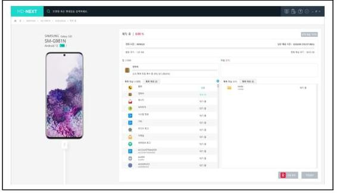
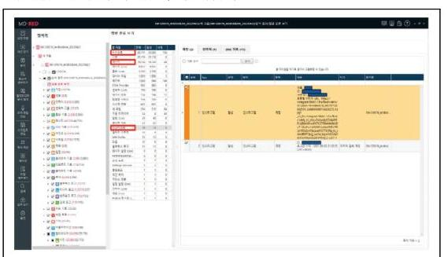
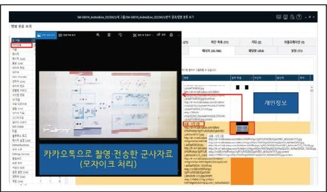

# 군사자료 정보유출의 스마트폰 포렌식 연구 

김용윤 ${ }^{*}$ 박대우 호서대학교 벤처대학원

## Smartphone Forensic of Military Data Information Leakage

Yong-youn Kim ${ }^{*}$ Dea-woo Park ${ }^{1}$ Hoseo Graduate School of Venture $\cdot{ }^{2}$ Hoseo Graduate School of Venture E-mail : dyddbstm@naver.com / prof_pdw@naver.com

## 요 약

북한이 ICBM을 발사하여 9.19 군사협의에 대한 모라트리움을 선언하였다. 국군은 국방과 안보를 위해 군사 안보를 지켜야 한다. 북한으로부터 해킹공격을 받은 국방부는 군사안보에 더욱 보안을 지켜야한다. 최근 군사 자료의 유출이 스마트폰을 통해 발생하고 있다. 장교와 부사관은 업무중에도 스마트폰 사용이 가능하다. 따라서 스마트폰에서 군사자료의 정보유출을 확인하고 책임소재를 분명히 하려면 스마트폰 포렌식이 필요하다. 본 연구에서는 S사의 갤럭시S20 기종에서 군사자료 유출에 대한 스마트폰 포렌식을 연구한다. 스마트폰 포렌식 증거자료의 확보와 Metadata 확보 및 증거자료의 채택을 위한 무결성 검증을 연구한다. 본 연구는 군사안보와 포렌식 기술발전에 기여할 것이다.

## ABSTRACT

North Korea launched an ICBM and declared Moratorium for the September 19 military talks. The Armed Forces must protect military security for national defense and security. The Ministry of National Defense, which received a hacking attack from North Korea, must protect its military security even more. Recently, the leakage of military data through smartphones is occurring through smartphones. Officers and non-commissioned officers can use smartphones while working. Therefore, smartphone forensics is required to check information leakage of military data from smartphones. In this study, forensic leaks of military data from the Galaxy S20 model of S company. Research integrity verification for securing smartphone forensic evidence, securing metadata, and adopting evidence. This study will contribute to the development of military security and forensic technology.

키워드
Smartphone, Metadata, Information leak, security incident

# 한국정보통신학회 2022년 춘계 종합학술대회 논문집 

## I. 서 론

2022년 3월 20일 북한군은 평안남도에서 서해상으로 방사포 4발을 발사했다. 이와 관련, 윤석열 대통령 당선인은 "방사포 발사는 명백한 9.19. 합의 위 반"이라고 평가했다. 북한군은 올해에만 벌써 11 번째 미 사일(ICBM, 방사포 등)을 발사(2022.3.20. 기준) 했다[1]. 일각에서는 북한의 9.19. 합의 고의 파기 가능 성에 대한 우려가 제기되고 있다[2].

대한민국 국가안보가 위협받는 상황에서 국군은 튼튼한 국방과 안보를 위해 군사안보를 더욱 지켜야 한다.

최근에는 군사자료의 유출이 스마트폰을 통해 지 속 발생하고 있다. 국방부에서는 과거부터 이런 보 안 취약점을 차단하기 위해 「군 장병 SNS 활용 가 이드라인」을 작성하여 배포했다(2012.1.31.). 그럼에 도 불구하고 스마트폰을 매개로 한 SNS 군사자료 유 출이 지속 발생하고 있다[5].

표 1. 스마트폰을 이용한 군사자료 유출 사례[5] Table 1. Cases of leaking military data using smartphones

| 년월 | 내 용 |
| :--: | :--: |
| $\begin{aligned} & 2015 . \\ & 8 \end{aligned}$ | 해병 중위가 軍 전술체계망 하면 사진 파일을 SNS로 유출 |
| $\begin{aligned} & 2016 . \\ & 11 \end{aligned}$ | 革 시설, 무기체계 위치 등이 담긴 軍 기밀문서 수십 건을 모바일 메신저로 연인 관계인 경찰관에게 전송 |
| $\begin{aligned} & 2017 . \\ & 2 \end{aligned}$ | 꼼 정보사 공작팀장이 정보사 후배(현역)를 통해 입수한 북한+주변국 정보 및 정보원 정보를 촬영, 일본에 전달 |
| $\begin{aligned} & 2017 . \\ & 12 \end{aligned}$ | 현역 간부가 타국에 파견된 정보원들의 신상정보를 스마트폰으로 촬영하여 동일 국가 정보원에게 전달 |
| $\begin{aligned} & 2020 . \\ & 4 \end{aligned}$ | 히막 목귀 병사가 생활관 동기 카카오톡 단체 채팅방에 암구호 문의, 동기 1명이 동일 채팅방에 암구호 개시 |

- 법원 판례와 인터넷 공개자료를 요약하여 정리한 내용임.

군사자료, 특히, 군사기밀은 유출되면 국방뿐만 아 니라 국가안보에도 치명적인 타격을 줄 수 있다. 그 러므로, 군사자료(군사기밀)의 외부 노출을 철저하게 차단해야 한다.

대한민국 국방부 장교와 부사관은 업무 중에도 스마트폰 사용이 가능하다. 2020.7월부터는 병사들도 군에서 스마트폰을 사용하고 있다. 병사들은 일과시간 이후에만 휴대폰인 스마트폰(Smart phone)을 사용 하도록 통제하고 있다.

하지만, 지난 2021년도 국정감사에서 공개된 자료 를 보면, 2020.1월 2021.6월간 군에서 휴대전화 사 용지침을 위반한 병사에게 내려진 징계는 무려 1 만 2,975 건에 달하는 것으로 나타났다[6]. 이중 사용수칙 (보안취약점 차단을 위한 수칙 포함) 위반이 7,587 건 (58.8\%), 보안위규가 4,215 건(32.5\%)으로 $90 \%$ 이상을 차지하여 군사보안의 허점이 여실히 드러났다.

이런 취약한 환경에서 표 1과 같이 스마트폰을 이용한 군사자료 유출 사고가 발생 시, 경위를 규명 하고 책임소재를 분명히 하기 위해서는 국방부 스마트폰 포렌식(Forensic)의 연구가 필요하다.
본 연구에서는 S사의 갤럭시S20 기종에서 국방부 군사자료 유출을 포렌식 한다. 스마트폰 포렌식 증거자료의 확보와 Metadata 확보 및 증거자료의 채택을 위한 Hash function을 사용하여, 무결성 검증을 연구한다.
본 연구는 국방 안보와 포렌식 기술발전에 기여할 것이다.

## II. 스마트폰을 통한 군사자료 유출 사례 분석

군은 업무 특성상 국방망(군 내부망, 군 인트라넷) 과 인터넷망을 물리적으로 분리하여 사용하고 있 다. 그리고 국방망에서 활용하는 군사자료를 인터넷 으로 전송하기 위해서는 보안상 문제가 없는지 검토하 는 등 별도 승인 절차를 거쳐야 한다. 그렇기 때문에 기본적으로 업무용 PC(국방망)에서 외부(인터넷망)로 군사자료를 전송할 수 없다. 또한, 이동식 저장매체 (HDD, USB 등)의 반입도 원천적으로 차단되어 있다. 반입하려면 별도 승인을 받은 후 등록하여 사용해야 한다. 이런 특수한 환경 때문에 인터넷이나 저장매체를 통한 군사자료 유출은 기본적으로 차단되어 있다고 할 수 있다.

한편, 군사자료를 다루는 군 장병(장교, 부사관, 병사) 과 군무원들은 영내에 스마트폰을 반입하여 사용할 수 있다. 물론, 국방부, 합참(합동참보본부) 등 상위 제대에서는 원천적으로 스마트폰 반입을 차단하고 있다. 하지만 군 조직의 대부분을 차지하는 하위제대 에서는 스마트폰 사용에 대한 통제가 굉장히 제한적 이다. 그렇기 때문에 스마트폰에 의한 군사자료에 대한 연구가 중요하다고 할 수 있다.

스마트폰을 이용한 군사자료(군사기밀) 유출 유형 은 3 가지 정도로 구분할 수 있다. 1. 해당 군사자료 를 촬영하여 전송(이미지, 동영상)하는 경우, 2. 군사자 료를 문자 등 직접 타이핑 하여 전송하는 경우, 3. 군사자료를 음성 등 녹음하여 전송하는 경우이다. 이 세가지의 경우를 확인하기 위한 스마트폰 포렌식 을 진행한다.

## III. 스마트폰 포렌식 준비

### 3.1 스마트폰 포렌식 Tool

스마트폰 포렌식에 사용되는 Tool은 다양하나, 이번 연구에서는 한컴위드\#E(HANCOM WITH)에서 개발한 MD-Next와 MD-Red를 사용한다.

이 제품의 주요기능은 모바일 OS $\cdot$ 파일시스템 및 맵 지원, 암호화 된 맵 데이터의 해독, 다양한 데이터 뷰어, 분석데이터 시각화 등이다.[7] MD-Next를 통해 스마트폰 에서 증거를 추출하고, MD-Red를 통해 분석한다.

3.2 포렌식 대상 스마트폰 갤럭시S20

본 연구에서 스마트폰 기기는 S사에서 생산 $\cdot$ 판매하고 있는 안드로이드 기반의 갤럭시S20 기종을 사용한다.

## IV. 군사자료 유출 스마트폰 포렌식

4.1. MD-Next 사용, 스마트폰 증거 추출(자료 채증)

그림 3. MD-Next, 스마트폰 포렌식 Tool
Fig 3. MD-Next, Smartphone Forensic Tool
먼저, 스마트폰 증거 추출을 위해 MD-Next를 실행한다. 갤럭시S20 기기의 '휴대폰 설정' 기능에서 모델명을 확인한다. MD-Next에서 해당 기기 모델명에 맞는 설정을 입력하여 증거 추출을 한다.
4.2. MD-Red 사용, 스마트폰 어플리케이션 분석 및 증 거 자료 추출

MD-Red의 경우 2 가지의 방법으로 추출된 모든 data를 분석할 수 있다. 폴더별로 data를 분석할 수도 있고, 애플리케이션마다 data를 구분하여 분석할 수도 있다. 앞에서 구분한 군사자료 유출 유형을 고려할 때, 군사자료를 문자, 메신저(카카오톡, 텔레그램), 기타 SNS(인스타그램, 페이스북) 등으로 전송했을 가능성이 높다. 그렇기 때문에 분석은 필요한 어플리케이션을 선별하여 data를 분석하는 것이 각 폴더를 일일이 분석하는 것보다 효율적이라고 할 수 있다. 이번 연구에서는 문자, 카카오톡, 인스타그램을 선별하여 data를 선별하여 분석해보았다.

그림 4. (MD-Next) 분석 data 선별
Fig 4. (MD-Next) Analysis data screening

## V. 스마트폰 포렌식 증거자료 확보

5.1. 스마트폰 포렌식 증거자료 특정

어플리케이션 분석 결과, 군사자료를 스마트폰으로 사진 촬영하여 카카오톡 애플리케이션으로 전송한 것을 식별했다.

그림 5. 스마트폰으로 촬영 $\cdot$ 전송한 군사자료 식별 Fig 5. Identification of military data filmed and transmitted with a smartphone

### 5.2. 삭제된 증거자료 획득, 복구

군사자료를 전송한 사람은 증거 인멸을 시도할 것이다. 스마트폰에서 다양한 방법(문자, 메신저 등)으로 전송된 군사자료가 해당 어플리케이션에서 삭제된 경우 다른 경로에 저장된 곳은 없는지 확인해야 한다. 휴대폰에 저장된 이미지, 동영상 등은 오리지널 자료 외에 웹네일이라는 형태로도 추가 저장된다. 사용자가 전송된 군사자료를 삭제한 경우, 폴더별 data 분석 방식으로 웹네일을 확인하여 증거자료를 획득할 수 있다.

## VI. 결 론

본 논문에서는 스마트폰 포렌식 Tool인 MD-Next와 MD-Red를 사용하였고, S사의 갤럭시S20 스마트폰을 포렌식 하였다. 스마트폰을 통해 군사자료가 유출된 상황에 특화된 포렌식 기법 적용 방안을 연구하였다. 스마트폰에 있는 모든 자료를 추출하여 분석하는 것은 비효율적이다. 스마트폰을 이용한 군사자료 유출 유형 3 가지 상황을 고려하여 선별된 어플리케이션별 data 추출 및 삭제파일 복구, 웹네일 확인 등의 방식으로 증거 자료를 추출하였다.

이 연구는 군사자료 유출 사고 발생시 경위를 규명하는 데 기여하고, 더 나아가 군사안보와 포렌식 발전에 기여 할 것이다.

## References

[1] https://www.joongang.co.kr/article/25057245\#home Apr. 15. 2022.
[2] "Issues and Tasks of North Korea's New ICBM Launch" Report, National Security Strategy Institute, Mar. 29. 2022.
[3] https://www.yna.co.kr/view/AKR20170502076600014

Apr. 21. 2022.
[4] https://www.yna.co.kr/view/AKR20170502076600014 Apr. 15. 2022.
[5] Table 1. Cases of leaking military data using smartphones
[6] http://www.ekrresnews.co.kr/news/articleView.html?idnno=53483 Apr. 15. 2022.
[7] http://www.hancomgmd.com/ko/ir/press/md-red-mobile-forensic-software-for-data-analysis/\# Apr. 15. 2022 .

