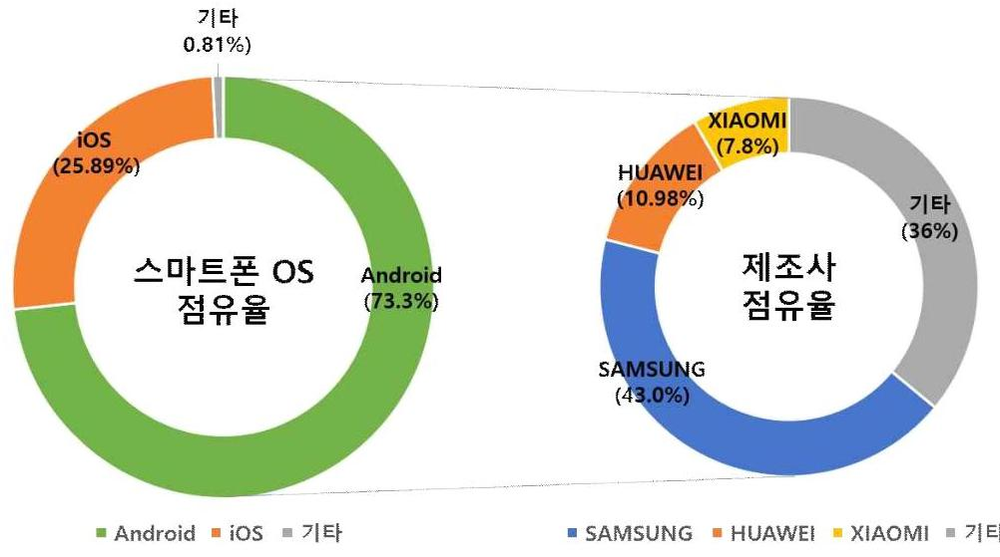
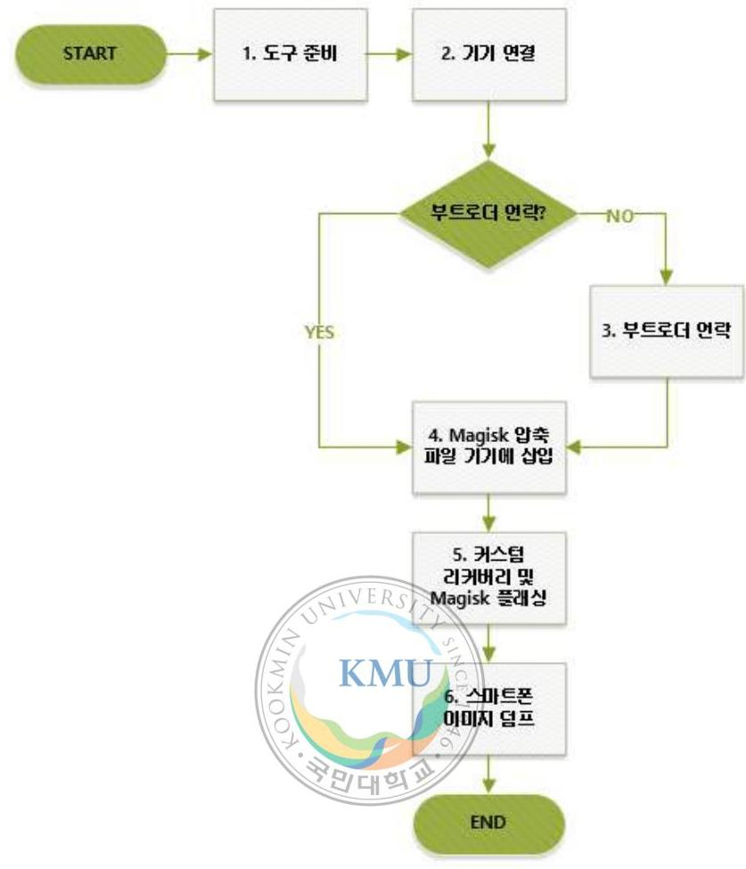
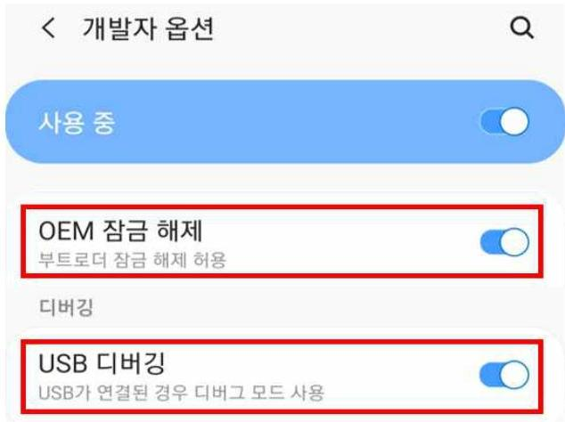
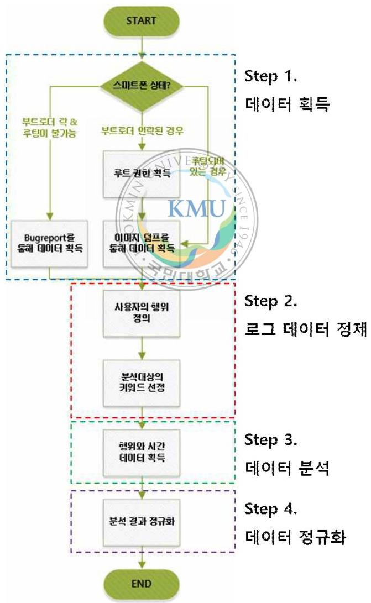
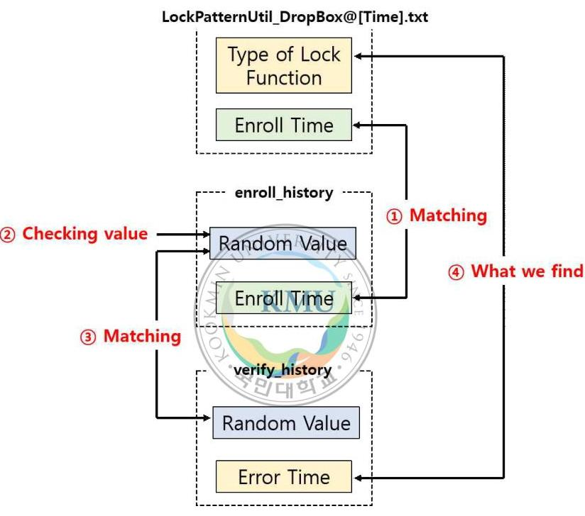
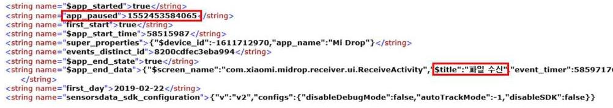
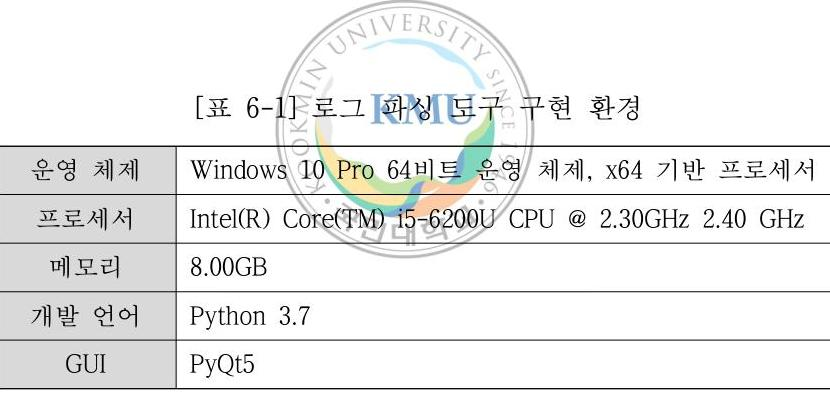
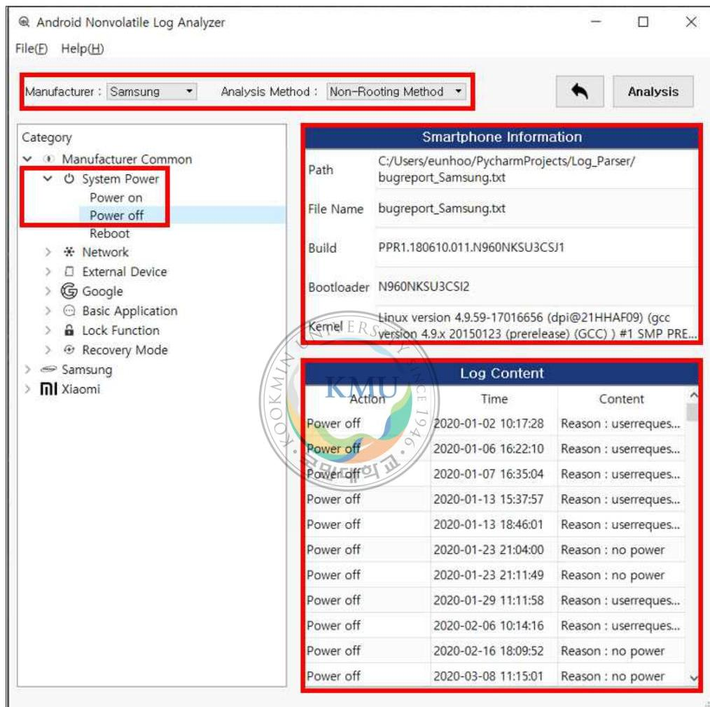

# (c)creative   commons 

C O M M O N S D E E D

저작자표시-비영리-변경금지 2.0 대한민국
이용자는 아래의 조건을 따르는 경우에 한하여 자유롭게

- 이 저작물을 복제, 배포, 전송, 전시, 공연 및 방송할 수 있습니다.

다음과 같은 조건을 따라야 합니다:

저작자표시. 귀하는 원저작자를 표시하여야 합니다.

비영리. 귀하는 이 저작물을 영리 목적으로 이용할 수 없습니다.

변경금지. 귀하는 이 저작물을 개작, 변형 또는 가공할 수 없습니다.

- 귀하는, 이 저작물의 재이용이나 배포의 경우, 이 저작물에 적용된 이용허락조건 을 명확하게 나타내어야 합니다.
- 저작권자로부터 별도의 허가를 받으면 이러한 조건들은 적용되지 않습니다.

저작권법에 따른 이용자의 권리는 위의 내용에 의하여 영향을 받지 않습니다.
이것은 이용허락규약(Legal Code)을 이해하기 쉽게 요약한 것입니다.
Disclaimer $\square$

# 석사학위논문 

데이터 획득방법에 따른
안드로이드 비휘발성 로그의
포렌식 분석 프로세스 설계 및 적용 방안

Development of Forensic Analysis Process of Android
Non-volatile Log according to Data Acquisition Method and Its Application

## 국민대학교 일반대학원

금융정보보안학과 정보융합보안전공
박 은 후
2019

# 데이터 획득방법에 따른 안드로이드 비휘발성 로그의 포렌식 분석 프로세스 설계 및 적용 방안 

Development of Forensic Analysis Process of Android Non-volatile Log according to Data Acquisition Method and Its Application

$$
\begin{aligned}
& \text { 지도교수 김 종 성 } \\
& \text { 이 논문을 석사학위 청구논문으로 제출함 } \\
& 2020 \text { 년 } 04 \text { 월 } 24 \text { 일 }
\end{aligned}
$$

## 국민대학교 일반대학원

금융정보보안학과 정보융합보안전공

$$
\begin{array}{ll}
\text { 박 } & \text { 은 } \\
2019
\end{array}
$$

# 박은후의 

## 석사학위 청구논문을 인준함

2020년 06월 17일

심사위원장 KM인. 옥 연 (11)
심사위원 (2) 2020년 06월 17일
심사위원 김 종 성 (11)

국민대학교 일반대학원

# 목 차 

표 차례 ..... iv
그림 차례 ..... vi
국문 요약 ..... vii

1. 서론 ..... 1
2. 관련 논문 ..... 4
2.1. 스마트폰 데이터 획득방법 ..... 4
2.2. 로그 데이터 분석 ..... 6
2.3. 기존 논문과 본 논문의 차별성 ..... 6
3. 안드로이드 시스템 로그 ..... 8
3.1. 휘발성 시스템 로그 및 비휘발성 시스템 로그 ..... 8
3.2. 데이터 획득방법 ..... 9
3.2.1. 버그 신고 ..... 12
3.2.1.1. ADB ..... 12
3.2.1.2. 버그 신고 ..... 13
3.2.1.3. 안드로이드 에뮬레이터(Android Emulator) ..... 15
3.2.2. 루팅 및 이미지 덤프 ..... 16

3.2.2.1. 도구 준비 ..... 17
3.2.2.2. 기기 연결 ..... 18
3.2.2.3. 부트로더 언락 ..... 19
3.2.2.4. Magisk 압축 파일 기기에 삽입 ..... 22
3.2.2.5. 커스텀 리커버리 및 Magisk 플래싱 ..... 23
3.2.2.6. 스마트폰 이미지 덤프 ..... 25
4. 비휘발성 시스템 로그 분석 프로세스 ..... 26
4.1. 데이터 획득 ..... 27
4.2. 로그 데이터 정제 ..... 28
4.3. 데이터 분석 ..... 31
4.4. 데이터 정규화 ..... 32
5. 제안한 프로세스 검증 및 포렌식 활용방안 ..... 33
5.1. 분석대상 ..... 33
5.2. 제조사 공통 로그 특징 ..... 35
5.2.1. 시스템 전원 ..... 35
5.2.2. 네트워크 ..... 38
5.2.3. 외부장치 ..... 43
5.2.4. 구글 계정 및 기능 ..... 46
5.2.5. 기본 애플리케이션 ..... 48
5.2.6. 잠금 기능 ..... 53
5.2.7 리커버리 모드 ..... 55

5.3. 제조사별 로그 특징 ..... 58
5.3.1. 삼성 ..... 58
5.3.2. 샤오미 ..... 61
5.4. 데이터 획득방법에 따른 로그 차이점 ..... 68
6. 안드로이드 로그 파싱 도구개발 ..... 70
6.1. 개요 ..... 70
6.2. 도구 설명 및 구성 ..... 70
6.3. 도구 사용 ..... 72
6.4. 도구 출력 결과 ..... 74
7. 결론 ..... 76
참고 문헌 ..... 77
영문 요약 ..... 79

# 표 목차 

[표 3-1] 데이터 획득방법 분류 ..... 10
[표 3-2] 버그 신고 유형 ..... 15
[표 3-3] ADB 및 Fastboot 관련 명령어 ..... 18
[표 4-1] 스마트폰 상태에 따른 데이터 획득방법 ..... 27
[표 4-2] 사용자 행위 목록 ..... 29
[표 4-3] 로그 분석 시 사용되는 검색 키워드 ..... 30
[표 4-4] 로그 레벨에 따른 로그 출력 명령어 ..... 31
[표 5-1] 제조사 별 분석대상 기기 정보 ..... 34
[표 5-2] 스마트폰 내장 메모리의 주요 파티션 ..... 35
[표 5-3] 삼성: 시스템 전원 관련 정보 ..... 37
[표 5-4] 샤오미: 시스템 전원 관련 정보 ..... 38
[표 5-5] 삼성: 네트워크 관련 정보 ..... 40
[표 5-6] 샤오미: 네트워크 관련 정보 ..... 43
[표 5-7] 삼성: 외부장치 관련 정보 ..... 45
[표 5-8] 샤오미: 외부장치 관련 정보 ..... 46
[표 5-9] 삼성: 구글 계정 및 기능 관련 정보 ..... 48
[표 5-10] 샤오미: 구글 계정 및 기능 관련 정보 ..... 48
[표 5-11] 기본 애플리케이션 범죄 악용 목적 및 사례 ..... 49
[표 5-12] 삼성: 기본 애플리케이션 관련 정보 ..... 51

[표 5-13] 샤오미: 기본 애플리케이션 관련 정보 ..... 52
[표 5-14] 삼성: 잠금 기능 관련 정보 ..... 55
[표 5-15] 삼성: 리커버리 모드 관련 정보 ..... 56
[표 5-16] 샤오미: 리커버리 모드 관련 정보 ..... 57
[표 5-17] 삼성 기능 특징 ..... 58
[표 5-18] 빅스비 비전 모드 ..... 60
[표 5-19] 삼성 지원 기능 관련 로그 ..... 60
[표 5-20] 샤오미 기능 특징 ..... 62
[표 5-21] 전송 가능한 파일 목록 ..... 63
[표 5-22] 주 공간과 보조 공간 비교 ..... 66
[표 5-23] 샤오미 기능 관련 로그 ..... 67
[표 5-24] 루트 권한에 따른 획득 가능 데이터 ..... 69
[표 6-1] 로그 과싱 도구 구현 환경 ..... 70
[표 6-2] 안드로이드 과싱 도구 구성요소 ..... 71
[표 6-3] 입력 데이터 종류 ..... 72

# 그림 목차 

(그림 1-1) 스마트폰 OS 및 제조사 세계 점유율 ..... 2
(그림 3-2) ADB를 이용한 버그 리포트 획득 ..... 13
(그림 3-3) 안드로이드 스마트폰의 루팅 과정 ..... 17
(그림 3-4) OEM 잠금 해제 및 USB 디버깅 기능 활성화 ..... 20
(그림 3-5) 샤오미 스마트폰 부트로더 연락 성공 화면 ..... 21
(그림 4-1) 데이터 처리 및 분석 프로세스 ..... 26
(그림 5-1) 잠금 기능 관련 프로세스 ..... 54
(그림 5-2) com.sensordata.analytics.android.sdk.SensorsDataAPI.xml (Mi Max 2) ..... 64
(그림 5-3) 999.xml (Mi Max 2) ..... 65
(그림 5-4) 유심의 개수에 따른 로그-데이터 차이 ..... 65
(그림 6-1) 개발한 비휘발성 로그 파일 과싱 도구 ..... 71
(그림 6-2) BackupAccount.xml 분석결과 ..... 74
(그림 6-3) 삼성의 버그 리포트 분석결과 ..... 75

# 국민대학교 일반대학원 

## 금융정보보안학과 정보융합보안전공

현대 사회에서 스마트폰은 일상생활에 없어서는 안 될 필수품이 되었 다. 이에 스마트폰에는 사용자의 개인정보뿐만 아니라 사용자의 행위를 식별할 수 있는 정보가 함께 저장될 가능성이 크다. 따라서 스마트폰은 포렌식 수사 과정에서 반드시 획득하고 분석해야 할 대상이다. 그 중, 스 마트폰의 비휘발성 로그는 전원의 공급 여부와 관계없이 획득할 수 있으 며, 사용자의 의도와 상관없이 스마트폰 내에 저장되는 생성증거다. 생성 증거는 법적 증거로 활용될 가능성이 크므로 이를 분석할 필요가 있다.

로그 파일은 사용자의 행위를 나타내는 데이터뿐만 아니라, 실행된 시 스템 애플리케이션에 대한 로그가 혼재되어 저장된다. 또한, 로그의 특성 상 같은 행위더라도 다양한 경로에 저장되므로 분석해야 할 데이터가 방 대하고 분석 시간이 많이 소요되어, 기존의 데이터베이스 및 휘발성 로그 분석 연구보다 분석된 바가 적다. 기존의 비휘발성 로그 논문은 루팅된

스마트폰을 대상으로 분석했기 때문에, 사용자의 데이터를 모두 획득할 수 있다는 가정하에 분석을 시행하였다. 하지만 실제로 현장에서 획득할 수 있는 스마트폰은 비 루팅인 경우가 대다수이기 때문에, 비 루팅 상태 의 스마트폰에도 활용 가능한 비휘발성 로그 분석방법이 필요하다. 이에 본 논문은 스마트폰의 상태(루팅/비 루팅)에 따른 비휘발성 로그의 포렌식 분석 프로세스를 설계하여 제안한다. 그리고 이를 적용하기 위해 안드로 이드 스마트폰 중 점유율이 높은 분석대상 제조사(삼성, 샤오미) 스마트폰 을 선정하여 포렌식 관점에서 유의미한 사용자의 행위(시스템 전원, 네트 워크, 외부장치, 구글 계정, 애플리케이션, 잠금 기능, 리커버리 모드, 제 조사 별 로그)를 기준으로 로그 분석을 수행한다. 또한, 분석결과에 대한 포렌식 활용방안을 제시하며, 적용 결과를 검증하기 위해 분석결과를 기 반으로 로그 분석 파싱 도구를 개발하였다.

주제어 : 디지털 포렌식, 스마트폰 포렌식, 데이터 분석, 로그 분석

# 1. 서론 

디지털 포렌식(Digital Forensics)은 PC나 스마트폰과 같은 디지털 기기 에서 수집 및 추출한 데이터를 분석함으로써, 범죄 관련 행위의 사실관계 를 규명하고 증명하는 과학수사 기법을 의미한다. 절차는 크게 현장 보 존, 증거수집, 데이터 분석과 보고서 작성의 4 가지 단계로 이루어지며, 분 석대상에 따라 모바일 포렌식, 컴퓨터 포렌식, 네트워크 포렌식과 클라우 드 포렌식으로 나누어진다[1]. 이 중 모바일 포렌식은 스마트폰, 태블릿과 PC 등의 모바일 기기를 분석하는 포렌식을 의미하며, 경찰청에서 보고한 디지털증거분석 현황에 따르면 2018년 기준, 모바일 기기를 분석한 건수 는 36,986 건으로 전체 포렌식 서장의 $82 \%$ 를 차지하였다[2]. 이처럼 모바일 포렌식이 디지털 포렌식 수사에서 큰 비중을 차지하는 이유는 스마트폰이 포렌식의 주요 분석대상이기 때문이다. 한국은 2018년을 기준으로 스마트 폰 보유율 1 위를 기록하고 있으며, 한국 성인의 $93 \%$ 가 스마트폰을 사용하 고 있다[3,4]. 따라서 스마트폰에는 사용자의 개인정보나 다양한 사용자 행위를 식별할 수 있는 데이터가 다수 저장될 가능성이 크므로 범죄 수사 시, 반드시 분석해야 할 대상이다.

StatCounter에 따르면, 스마트폰의 운영 체제 중 안드로이드는 2020년 2 월 기준으로 전 세계 스마트폰 운영 체제 점유율의 $73.3 \%$ 를 기록하였으 며, 한국 스마트폰 운영 체제의 $76.97 \%$ 를 차지하였다(그림 1-1)[5,6]. 이처 럼 안드로이드 운영 체제의 점유율이 높아짐에 따라 안드로이드 스마트폰 에 대한 포렌식의 중요성이 커지고 있다.

(그림 1-1) 스마트폰 OS 및 제조사 세계 점유율

기존의 안드로이드 기반 스마트폰에 관한 포렌식 연구는 주로 애플리케이션의 데이터베이스를 중심으로 이루어져 왔다. 애플리케이션 데이터베이스에는 사용자가 애플리케이션을 사용하면서 저장한 연락처, 일정 관리, 메모 등 다양한 정보가 있다[7]. 하지만 사용자가 행위를 감추기 위해 공장 초기화를 한 경우 데이터가 모두 삭제되어 사용자의 행위를 파악할 수 없다. 그 밖의 스마트폰 연구 방법인 휘발성 로그 연구는 안드로이드 하부 시스템부터 애플리케이션까지 최신 구동 내용까지 파악할 수 있다[8]. 하지만 전원이 공급되지 않거나, 일정 시간이 지나면 관련 로그가 사라져 데이터 획득 및 조사할 수 없다는 단점이 있다. 반면 비휘발성 로그는 전원이 공급되지 않아도 사라지지 않으며 공장 초기화와 같은 안티 포렌식 행위를 분석할 수 있다는 점에서 앞서 말한 두 가지 분석방법의 한계를 보완할 수 있다. 또한, 스마트폰 내의 비휘발성 시스템 로그 파일

1) 메인보드나 메모리에 남아있는 모든 데이터를 삭제하는 것

은 사용자의 의도와 관계없이 기록되므로, 수사에 기본적인 정보로 활용 될 수 있다. 또한, 자동으로 생성되는 생성증거에 해당하므로 법정의 증 거로 효력을 발휘할 가능성이 크다. 하지만 기존의 비휘발성 로그 분석은 루팅된 스마트폰에만 적용할 수 있다는 한계가 있다.

최고 관리자의 권한을 획득하는 루팅은 다른 데이터 획득방법보다 더 많은 사용자 데이터를 획득할 수 있다. 과거의 루팅 방법은 부트로더 (Bootstrap Loader)2) 연락 과정이 필수적이지 않았으며, 루팅된 부트 이미 지를 플래싱하면 비교적 쉽게 루트 권한을 획득할 수 있었다. 그리고 부 트로더를 연락하는 과정에서 사용자 데이터가 초기화되지 않고 유지되었 기 때문에 데이터 획득방법으로 많이 활용하였다. 하지만 스마트폰의 보 안에 대한 개념이 강화되면서 제조사는 사용자가 부트로더 언락을 통해 쉽게 루팅할 수 없도록 대처하였다. 이에 현재는 부트로더 언락이 필수 사항이 되었고, 부트로더를 연락하는 과정에서 사용자 데이터가 초기화된 다. 따라서 사용자 스마트폰의 부트로더가 락되어 있는 경우, 루팅은 사 용자의 데이터를 획득하는 방법으로 부착합하다. 이에 본 논문은 루팅이 불가능한 상황에서 기기를 훼손하지 않고 데이터를 무결하게 획득하는 방 법과 새로운 비휘발성 로그 분석 프로세스를 제안함으로써 기존 비휘발성 로그 분석의 한계를 보완한다.

본 논문의 구성은 다음과 같다. 2 장은 스마트폰 데이터를 획득하는 방 법 및 로그 분석과 관련된 기존 논문을 살펴보고, 본 논문과의 차별성을 서술한다. 3 장은 안드로이드 시스템 로그의 종류와 데이터 획득방법에 관 해 설명하며, 4 장은 새로운 비휘발성 로그 분석 프로세스를 데이터 획득, 정제, 분석과 정규화 단계로 나누어 설명한다. 5 장은 4 장에서 제시한 프 로세스를 검증하기 위해 점유율이 높은 삼성과 샤오미 스마트폰을 기반으

[^0]
[^0]:    2) 스마트폰이 작동할 때, 운영체제보다 먼저 작동하는 프로그램

로 수행한 사용자 행위에 대한 비휘발성 로그 분석결과를 요약하고 포렌 식 활용방안을 제시한다. 6장은 제조사별 식별된 로그를 자동으로 파싱하 는 분석 도구를 개발하며, 7 장을 결론으로 마무리한다.

# 2. 관련 논문 

스마트폰에 저장되는 수많은 사용자 관련 데이터는 기기가 손상되거나 시스템이 업데이트되면서 수정되거나 삭제될 위험이 있다. 따라서 사용자 의 스마트폰 데이터를 획득할 때는 무결성을 유지하는 것이 중요하다. 또 한, 획득한 스마트폰의 데이터에는 포렌식 관점에서 유의미한 정보만 존 재하는 것이 아니므로, 데이터를 선별 및 파악하는 것이 중요하다. 이에 본 절은 스마트폰의 데이터 획득방법 및 로그 데이터 분석과 관련된 연구 를 소개하고, 본 논문과의 차별점에 관해 설명한다.

### 2.1. 스마트폰 데이터 획득방법

데이터 백업은 사용자가 스마트폰 내의 데이터를 보호하기 위해 백업 기 능을 이용하여 PC나 클라우드에 스마트폰의 다양한 데이터를 저장하는 방 법이다. 일반적으로 백업데이터는 암호화되어 저장되므로, 이를 분석하기 위해서는 복호화가 선행되어야 한다. 'A practical approach to analyze smartphone backup data as a digital evidence[9]' 는 스마트폰에 저장된 백업 파일을 분류하였으며, 백업 프로세스를 분석하였다. 그리고 이를 삼성, LG, 화웨이, 샤오미 스마트폰에 적용하였다. 'How to Decrypt PIN-Based

Encrypted Backup Data of Samsung Smartphones[10]' 은 사용자가 삼성에 서 제공하는 Smart Switch 백업프로그램으로 스마트폰의 데이터를 백업한 경우, 암호화하는 데 사용되는 PIN의 복구 알고리즘을 개발하였다. 이 방법 은 최대 9자리 PIN을 복구할 수 있다. 'Decrypting password-based encrypted backup data for Huawei smartphones[11]' 은 화웨이 제조사에서 제공하는 KoBackup, HiSuite와 같은 백업프로그램의 프로세스를 분석하여, 암호화된 백업데이터를 해독하는 방법을 제안하였다. 이를 통해 사용자가 입력한 비밀번호를 복구했으며, 암호화된 백업데이터를 해독하는 도구를 개 발하였다. 'Data acquisition methods using backup data decryption of Sony smartphones[12]' 은 소니 스마트폰의 암호화된 백업데이터를 해독하는 방 법을 제안하였으며 실험적으로 이를 검증하였다.
'스마트폰 내부 정보 추출 방법[13]' 은 안드로이드 운영 체제 및 iOS 기반 기기에 대한 다양한 루트 권한 획득방법을 적용하고, 추출한 파티션 이미지를 파일 시스템 영역별로 분리하여 변경되는 사항을 비교 분석하였 다. 그리고 디지털 포렌식 관점에서 데이터 훼손을 최소화하며 가장 효율 적인 루팅 방법으로 소프트웨어 방식을 소개하였다. '안드로이드 스마트 폰 포렌식 분석 방법에 관한 연구[14]' 는 루팅을 통한 데이터 수집 방법 을 설명하였으며 수집한 데이터를 분석하였다. 그리고 Nand Flash 특성을 고려한 이미지 생성 방법 및 분석방법을 소개하였다. '스마트폰 데이터 획득과 증명력 확보 방안 : 안드로이드 계열과 JTAG을 중심으로[15]' 은 안드로이드 스마트폰 내에 존재하는 통화 내역, 메시지, 사진, 동영상 등 과 같은 데이터 획득방법을 비교하였다. 또한, 국내 - 외에서 사용하는 스 마트폰 포렌식 도구를 사용한 후 결과를 비교 분석하여 데이터 획득 시 발생할 수 있는 문제점과 한계에 대해 살펴보았다. 마지막으로 획득한 데 이터가 법정에서 증명력을 확보하는 방안을 제시하였다.

# 2.2. 로그 데이터 분석 

'안드로이드 스마트폰 시스템 로그 분석 연구[16]' 는 안드로이드 스 마트폰인 삼성과 LG 스마트폰의 시스템 로그를 조사 및 분석하였다. 또 한, 사용자의 행위를 선별하고 이에 관련된 로그 내용을 수집 및 정규화 하였다. 안티 포렌식 행위의 대응 방안으로 공장 초기화와 유심 교체 시 알 수 있는 로그 정보를 예로 설명하였다. '안드로이드 로그 시스템을 이용한 효율적인 사용자 행위기반 라이브 증거수집 및 분석 시스템 연구 [8]' 는 사용자 행위와 관련된 유의미한 정보를 포함한 안드로이드 로그 를 수집 및 분석하는 시스템을 제안하였다. 그리고 현장에서 활용할 수 있는 분석 기법을 제시하였다.

### 2.3. 기존 논문과 본 논문의 차별성

기존 논문은 안드로이드 스마트폰 시스템 로그 분석에 관한 연구로, 처 음으로 비휘발성 로그를 포렌식 관점에서 분석하였다는 의의가 있다. 하 지만 그 결과가 루팅된 스마트폰에만 적용된다는 한계가 있다. 현장에서 분석대상으로 수집한 스마트폰 중에서 루팅된 스마트폰의 비율이 매우 낮 으며, 대부분 스마트폰은 루팅이 되지 않은, 비 루팅 상태의 스마트폰인 경우가 많다. 따라서, 기존의 루팅 상태의 스마트폰뿐만 아니라 비 루팅 상태의 스마트폰에 대한 분석도 필요하다. 이에 본 논문은 버그 리포트 기능에 착안하여 비 루팅 스마트폰의 로그 분석을 수행한다. 버그 리포트 는 기본적으로 애플리케이션에 탑재되어있으므로, 모든 안드로이드 스마 트폰에 적용할 수 있으며 스마트폰 내에서 사용자가 임의로 생성할 수 있

으므로 이를 분석에 활용하여 포렌식 관점에서 유의미한 데이터를 얻을 수 있다. 따라서 본 논문은 기존 논문의 한계를 보완하며, 루팅된 스마트 폰뿐만 아니라, 비 루팅 상태의 스마트폰에도 적용 가능하다는 의의가 있다. 두 가지의 데이터 획득방법은 서로 다른 방법으로는 분석할 수 없는 데이터를 분석할 수 있도록 한다. 따라서 두 가지 방법을 모두 이용하는 것은 더 많은 데이터를 획득 및 분석하는 데 도움을 줄 수 있다.

기존에는 4.4.2 ~ 6.0.1의 안드로이드 버전을 기반으로 분석을 진행하였지만 본 논문은 업그레이드된 7.1.1 ~ 9.1.1의 최신 OS를 탑재한 스마트폰을 대상으로 한다. 또한, 이전부터 존재했지만, 기존 논문에서는 분석하지 않은 기능 중, 포렌식 관점에서 중요한 잠금(패스워드, PIN, 패턴), NFC와 안드로이드 버전이 업데이트되면서 새롭게 탑재된 기능(빅스비, 간편 측정, ShareMe, 듀얼 앱, 보조 공간 등)을 분석한다는 차이가 있다.

# 3. 안드로이드 시스템 로그 

안드로이드 시스템 로그는 개발자가 안드로이드를 구동하던 중에 생긴 오류와 정보 처리 과정 등을 확인하기 위해 주로 사용한다. 만약 사용자 가 애플리케이션이나 기기를 사용하는 도중에 개발자가 지정한 로그 기록 시점을 지나면, 사용자의 행위뿐만 아니라 실행된 모든 시스템 애플리케 이션에 대한 로그가 저장된다. 따라서 로그 파일에는 사용자가 인지하지 못하는 사이에 사용자의 다양한 행동이 기록될 수 있다. 또한, 사용자가 하나의 행위를 하더라도 코드에 따라 여러 가지 로그 파일에 기록될 수 있으며, 관련된 로그가 다양한 경로에 남을 수도 있고, 전혀 남지 않을 수 도 있다. 시스템 로그는 크게 비휘발성 시스템 로그와 휘발성 시스템 로 그 두 가지로 나눌 수 있다. 본 장은 두 가지 종류의 시스템 로그의 정의 와 데이터 획득방법에 관해 설명한다.

### 3.1. 휘발성 시스템 로그 및 비휘발성 시스템 로그

본 절은 휘발성 및 비휘발성 시스템 로그의 공통점 및 차이점과 데이터 획득방법의 장단점을 간략히 설명한다. 그리고 본 연구에서 로그 분석을 위해 사용한 데이터 획득방법인 '버그 리포트' 와 '루팅 및 이미지 덤 프' 에 관해 상세히 서술한다.

스마트폰의 휘발성 시스템 로그는 전원의 공급이 중단되거나 시간이 흐 르면 저장되지 않고 사라지는 데이터다. 사건 현장에서 획득한 스마트폰 의 상태가 활성화되어 있다면 비휘발성 데이터를 분석하기에 앞서, 휘발

성 데이터를 분석함으로써 초기 대응 방법으로 활용할 수 있다. 또한, 시 스템의 전원을 차단하면 수집할 수 없는 데이터를 분석할 수 있다. 하지 만 재부팅이나 부팅 이전의 로그는 추출할 수 없어 흔적을 분석할 수 없 다는 한계가 있다.

비휘발성 시스템 로그는 전원의 공급 여부와 관계없이 획득할 수 있으 며, 시간이나 날짜, 네트워크, 프로세스와 사용자 정보 등이 텍스트 파일 (.txt), 로그 파일(.log), xml 파일(.xml) 등에 가시적인 형태로 저장되므로 텍스트 뷰어 소프트웨어를 통해 내용을 확인할 수 있다. 사건 발생 후에 신속하게 획득하면, 부팅 이전의 흔적 등 휘발성 시스템 로그보다 더 많 은 사용자의 정보를 수집 및 분석할 수 있다. 또한, 시스템을 종료하지 않 고 분석함으로써 데이터의 무결성을 보존할 수 있어 분석결과에 신뢰성을 높일 수 있다는 장점이 있다. 하지만 로그가 저장되는 경로가 다양하므 로, 분석해야 할 대상이 많아 분석 시간을 많이 소요한다는 단점이 있다.

두 가지 시스템 로그 내에는 사용자의 행위뿐만 아니라 프로세스에 의 해 기록되는 데이터가 혼재되어 있으므로 유의미한 데이터만을 분류하는 작업이 필요하다는 공통점이 있다.

# 3.2. 데이터 획득방법 

포렌식 수사 과정에서 가장 먼저 수행되는 것은 용의자의 행위를 파악하 기 위해 디지털 증거를 확보하는 것이다. 이때, 스마트폰 내의 디지털 데이 터는 사건이 발생한 후에도 복제 및 변경되기 쉽다는 특징이 있다. 따라서, 디지털 데이터가 증거로 채택되기 위해서 무결성을 확보하는 것이 가장 중 요하다. 휘발성 및 비휘발성 로그 데이터를 포함한 디지털 데이터의 무결성

을 지키며 획득하는 방법은 소프트웨어와 하드웨어 기반으로 나눌 수 있으 며, 소프트웨어 기반의 획득방법은 논리적 방법과 물리적 방법으로 세분화 할 수 있다. 데이터 획득방법을 분류한 결과는 [표 3-1]과 같다.

[표 3-1] 데이터 획득방법 분류

|  획득방법 분류 |  | 설명  |
| --- | --- | --- |
|  하드웨어 기반 |  | JTAG, 메모리 분리(Chip-off)  |
|  소프트웨어 기반 | 논리적 방법 | 데이터 복사  |
|   |  | ADB3) 백업  |
|   |  | 제조사 제공 백업프로그램  |
|   |  | 버그 신고  |
|   | 물리적 방법 | 루팅 \& 이미지 덤프  |
|   |  | 커스텀 리커버리  |

하드웨어 기반의 데이터 획득방법에는 'JTAG (Joint Test Action Group)4) ${ }^{4}$ 와 'Chip-off' 방식이 있다. 'JTAG' 는 스마트폰의 데이터 를 비트 단위로 수집하는 방법으로 손상이 거의 되지 않은 스마트폰의 데 이터를 얻는 데는 효과적이지만, 데이터를 획득하는 데 시간이 비교적 많 이 소요된다는 단점이 있다. 반면, 'Chip-off' 방식은 스마트폰의 PCB (Printed Circuit Board) 기관과 플래시 메모리를 분리하고, 메모리 리더기 를 사용하여 메모리 데이터를 읽는다. 스마트폰의 메인보드가 고장 나거 나 침수되었더라도 메모리가 손상입지 않았다면 이 방법으로 데이터를 획 득할 수 있다. 하지만 메모리 칩을 분리하는 과정은 온도에 영향을 많이

[^0] [^0]: 3) Android Debug Bridge의 준말로, 안드로이드 장치와 PC가 통신할 수 있도록 하는 다목 적 명령어 도구 4) IEEE (Institute of Electrical and Electronics Engineers, 전기 전자 기술자 협회) 1149.1 에 표준으로 정해진 규격

받기 때문에, 온도 조절에 실패한 경우 메모리에 저장된 데이터와 스마트 폰 자체가 손상될 가능성이 크다는 한계가 있다.

소프트웨어 기반의 논리적 획득방법에는 '데이터 복사', 'ADB 백업', '제조사 제공 백업프로그램' 과 '버그 신고' 가 있다. '데이터 복사' 는 스마트폰과 PC를 연결하여 스마트폰의 내부 저장소에 있는 데이터를 PC로 복사해오는 방법이며, 'ADB 백업' 은 안드로이드에서 제공하는 백업 기능을 이용하는 것이다. 두 가지 방법 모두 사용 방법이 간편하고 쉽다는 공통적인 장점이 있다. 하지만 '데이터 복사' 는 스마트폰의 루팅 여부에 따라 획득할 수 있는 데이터의 종류가 제한되어 있으며, 'ADB 백업' 은 모든 대상을 백업할 수 있는 것이 아니므로 일부 데이터만 획득할 수 있다는 단점이 존재한다. '제조사 제공 백업프로그램' 은 사용자가 각 제조사에서 제공하는 백업 소프트웨어를 이용하여 연락처, 사진 등의 정보를 PC에 저장한 경우 사용할 수 있다. 암호화된 백업데이터를 복호화하면 이미지 단위로 데이터를 획득할 수 있으며, 최신 스마트폰에도 적용할 수 있다는 점에서 장점이 있다. 하지만 백업프로그램을 제공하지 않는 제조사의 스마트폰에는 적용할 수 없으며 암호화된 경우 복호화하지 않으면 데이터를 분석할 수 없다는 한계가 있다. '버그 신고' 는 루팅 여부와 관계없이 획득할 수 있다는 장점이 있지만 분석하기에 관련 없는 데이터가 다수 포함되어 양이 많아 분석이 어렵다는 단점이 있다.

소프트웨어 기반의 물리적 획득방법에는 '루팅 및 이미지 덤프' 기법과 '커스텀 리커버리' 를 이용한 방법이 있다. '루팅 및 이미지 덤프' 는 루트 권한을 확보하고 스마트폰의 전체 이미지를 덤프하는 방법으로 대부분의 사용자 데이터를 모두 분석할 수 있다는 장점이 있다. 하지만 부트로더 연락이 선행되어 있어야 사용할 수 있는 방법이라는 한계가 있다. '커스텀 리커버리' 를 이용한 방법은 커스텀 리커버리에서 제공하는

기능을 이용하여 데이터를 획득하는 것이다. 이 방법은 무결성이 확보된 데이터를 얻을 수 있다는 점에서 유의미한 방법이지만, 루팅이 선행되어 있어야 하며 최근 스마트폰의 경우는 보안을 위해 '안전 부팅'이나 '녹스 워런티(Knox Warranty)5)' 와 같은 기능들을 제공하므로 이 방법 을 적용하기 어렵다.

# 3.2.1. 버그 신고 

버그 신고는 안드로이드 내부의 메모리, 프로세스 현황과 프로그램 설 치 등의 모든 로그를 한 번에 출력할 수 있는 기능이다. 스마트폰이 루팅 되어있지 않은 상태에서도 획득할 수 있으며 안드로이드 기반 스마트폰에 모두 적용이 가능하다는 점에서 의의가 있다. 버그 리포트는 버그 신고를 통해 획득할 수 있으며 기본적으로 애플리케이션을 사용하다가 심각한 오 류가 발생한 경우 버그를 찾아 수정하기 위해 자동으로 활성화된다. 하지 만 사용자가 수동으로 생성할 수도 있다. 버그 리포트는 비휘발성 로그 분석을 수행할 때 사용된다. 본 항에서는 버그 신고를 이용하여 버그 리 포트를 획득하는 방법을 설명한다.

### 3.2.1.1. ADB

ADB를 이용한 버그 리포트를 획득하기 위해서는 먼저, PC와 스마트폰

[^0]
[^0]:    5) 삼성전자의 보안 솔루션으로 스마트폰 내에 별도의 공간인 컨테이너를 만들어 업무용 과 개인용으로 데이터를 구분하여 관리하는 기술. 이를 통해 해킹 및 정보 유출 등의 보안 위협을 차단할 수 있음

을 연결해야 하며 PC에 연결된 기기는 해당 기기 외에는 없어야 한다. 자 세한 과정은 다음과 같다. 이때, <Path>는 버그 리포트를 저장할 PC 내 경로를 의미한다. 연결 상태가 'offline' 이나 'no device' 인 경우는 'adb kill-server' 를 이용하여 서버를 강제로 종료한 후, 다시 연결을 시 도하여 올바른 연결 상태로 만들어야 한다.

1. cmd 창에 'adb devices' 를 통해 기기 연결 상태 확인

- 올바르게 연결된 경우 : 'device'
- 연결되지 않거나/응답하지 않은 경우 : 'offline'
- 연결된 기기가 없는 경우 : 'no device'

2. 'adb bugreport <Path>' 를 통해 버그 리포트 획득(그림 3-2).

# (그림 3-2) ADB를 이용한 버그 리포트 획득 

### 3.2.1.2. 버그 신고

1) 삼성

삼성은 기기 내에 별도의 버그 신고 탭을 지원하며, 기능을 사용하기 위 해서는 개발자 모드가 활성화되어 있어야 한다. 이에 대한 구체적인 과정은

다음과 같다.

1. '설정 > 휴대전화 정보 > 소프트웨어 정보 > 빌드 번호' 을 5 번 연달아 클릭하여 개발자 모드 활성화
2. '설정 > 개발자 옵션 > 버그 신고' 선택
3. 버그 신고 유형 (대화형 보고서/전체 보고서)을 선택하여 버그 리포트 획득

획득한 버그 리포트는 기기 내 'bugreports/bugreport-[yyyy-mm-dd].zip' 경로에 'bugreport-[yyyy-mm-dd].txt' 의 파일명으로 저장된다. 또한, 기기 상단에 생성된 버그 리포트 관련 알림을 눌러 블루투스나 Gmail 등의 방법 으로 외부로 공유할 수 있다. 버그 신고 유형의 특징과 단점은 [표 3-2]와 같다. 전체 보고서는 대화형 보고서보다 생성시간이 짧으며 사용 빈도가 낮 은 로그를 포함한 전반적인 로그를 저장한다. 사용하는 빈도가 낮은 로그 중 에 중요한 정보가 존재할 가능성이 있으므로 본 연구에서는 전체 보고서를 대상으로 분석하였다.
[표 3-2] 버그 신고 유형

|  | 대화형 보고서 | 전체 보고서 |
| :--: | :--: | :--: |
| 특징 | 신고 진행 상황을 추적하고 | 전반적인 정보를 저장함 |
|  | 세부정보(1)를 수정하여 저장할 수 있음 |  |
| 단점 | 생성시간이 오래 걸리고, 사용 빈도가 | 자신이 원하는 세부정보를 |
|  | 낮은 일부 부분은 생략할 수 있음 | 수정/추가할 수 없음 |

6) 파일 이름, 버그 제목, 버그 요약

2) 샤오미

샤오미 스마트폰은 별도의 버그 신고 탭을 지원하지 않는다. 그리고 보 고서의 유형이 대화형과 전체로 나뉘지 않는다. 샤오미 스마트폰의 버그 리포트를 얻는 자세한 과정은 아래와 같다.

1. '휴대전화 정보 > CPU' 를 연달아 5 번 클릭
2. 저장소, 계정과 전화 기능에 권한 부여 허가하여 버그 리포트 획득

추출된 버그 리포트는 'sdcard/M/UI/dèbug_log/bugreport-[yyyy-mm-dd].zip' 경로에 존재하며, 해당 zip 파일을 해제하면 'bugreport-[yyyy-mm-dd].txt' 의 파일명으로 저장되어 있다.

# 3.2.1.3. 안드로이드 에뮬레이터(Android Emulator) 

안드로이드 에뮬레이터를 이용한 일련의 로그 획득 과정은 다음과 같다.

1. 다이얼에서 '*\#9900\#' 을 입력하여 'SysDump' 화면에 진입
2. 'Run dumpstate/logcat' 을 선택하여 로그 파일을 생성
3. 'Copy to sdcard' 를 선택하여 로그 파일을 sdcard로 복사
4. 버그 리포트 획득

추출된 로그 파일은 '/data/log/' 경로에 'dumpState_[파일명].log' 의 파일명으로 저장된다.

# 3.2.2. 루팅 및 이미지 덤프 

안드로이드에서 펌웨어를 오픈 소스(Open source)7)로 공개하면서 사람 들은 자신의 취향에 맞게 수정한 커스텀 롬(Custom ROM)8)을 생산하기 시작했다. 그리고 이 과정에서 운영 체제의 취약점을 이용하여 최고 관리 자의 권한을 획득하는 루팅이 가능해졌다. 루팅 방법은 제조사 및 스마트 폰마다 차이가 있지만, 전반적인 과정은 같다.

본 항에서는 일반적으로 루팅하여 이미지를 획득하는 과정을 6 가지 단 계로 나눠 설명한다(그림 3-3). 먼저, 루팅에 필요한 도구를 준비한 후 스 마트폰과 PC를 연결한다. 스마트폰의 부트로더 연락 여부를 확인하여 사 전에 부트로더 연락이 되어있지 않으면 부트로더 연락 과정을 거친다. 스 마트폰의 부트로더가 연락되었다면 최신 Magisk 압축 파일을 기기 내에 삽입한다. 그리고 TWRP와 같은 커스텀 리커버리를 설치한 후 삽입한 Magisk 압축 파일을 플래싱한다. 마지막으로 스마트폰 이미지를 덤프하면 사용자 데이터를 획득할 수 있다.

[^0]
[^0]:    7) 소스 코드를 공개해 누구나 특별한 제한 없이 코드를 사용할 수 있도록 하는 것
    8) 기기의 펌웨어를 사용자의 편의에 맞게 수정해놓은 펌웨어

(그림 3-3) 안드로이드 스마트폰의 루팅 과정

# 3.2.2.1. 도구 준비 

루팅을 진행하기에 앞서 ADB와 Fastboot가 컴퓨터에 설치되어 있어야 한다. ADB는 PC와 안드로이드 연결 상태 확인, 리커버리 및 부트로더로 제시작과 특정 파일 및 디렉터리에 접근할 수 있는 다목적 명령어 도구이 다. 그리고 Fastboot는 안드로이드 기기의 플래시 메모리에 사용자가 직접

데이터를 쓰기 위한 프로토콜이다. 이 기능을 통해 부트로더 언락, 펌웨어 교체 및 공장 초기화를 하는데 활용할 수 있다. 두 가지 도구를 이용하여 루트 권한을 획득하는데 사용하는 명령어는 [표 3-3]과 같다.

[표 3-3] ADB 및 Fastboot 관련 명령어

|  ADB |   |
| --- | --- |
|  adb devices | 연결된 안드로이드 기기 목록  |
|  adb reboot | 안드로이드 기기 제시작  |
|  adb reboot recovery | 리커버리 모드로 재부팅  |
|  adb pull [Smartphone Path] [PC Path] | 스마트폰 내 경로에 있는 파일을
PC 경로로 가져오기  |
|  adb install [apk File Path] | apk파일 설치  |
|  adb shell cat /proc/partitions | 파티션 정보 확인  |
|  adb kill-server | adb 서버 강제 종료  |
|  Fastboot |   |
|  fastboot reboot | 시스템으로 재부팅  |
|  fastboot reboot-bootloader | 부트로더로 재부팅  |
|  fastboot reboot recovery | 리커버리 모드로 재부팅  |
|  fastboot boot [img File Path] | 특정 이미지 파일로 부팅  |
|  fastboot oem unlock | 부트로더 언락 (2015년 이전)  |
|  fastboot flashing unlock | 부트로더 언락 (2015년 이후)  |
|  [Smartphone Path] : 스마트폰 내 파일의 경로 |   |
|  [PC Path] : 파일을 저장할 PC 내 경로 |   |

# 3.2.2.2. 기기 연결

cmd 창에서 'adb devices' 명령어를 통해 PC와 기기의 연결이 제대로 되었는지 확인한다. 자세한 과정은 3.2.1.1.을 참고한다.

# 3.2.2.3. 부트로더 언락 

부트로더는 운영 체제 및 구성요소가 해킹되거나 비인가 프로그램을 설 치된 경우 이를 차단하는 역할을 한다. 따라서 제조사는 사용자가 승인되 지 않은 펌웨어를 사용하다가 생기는 손상을 방지하기 위해 기본적으로 부트로더를 잠근다. 부트로더 언락을 하면 새로운 운영 체제 설치나 루팅 등 사용자가 스마트폰을 변경할 수 있는 권한이 더 많아진다. 로그 파일 이 저장되는 Data 파티션의 데이터를 획득하기 위해서는 루팅이 필수적 이므로, 이를 위해서는 먼저 부트로더를 언락해야 한다.

제조사마다 차이는 존재하지만, 기본적으로 부트로더를 언락하기에 앞 서 아래와 같이 두 가지가 활성화되어 있어야 한다(그림 3-4). 이때, 개발 자 옵션은 '설정 - 휴대번호 정보 - 빌드 번호' 를 7 번 연달아 클릭하여 활성화할 수 있다.

1. 개발자 옵션에서 'OEM 잠금 해제' 활성화
2. 개발자 옵션에서 'USB 디버깅' 활성화

(그림 3-4) OEM 잠금 해제 및 USB 디버깅 기능 활성화

부트로더 진입 방법은 기기마다 약간의 차이가 있지만 보통 하드웨어를 입력하거나, Fastboot를 이용하여 진입할 수 있다. Fastboot를 이용한 방법 은 PC와 스마트폰을 연결한 상태에서 다음과 같은 2단계를 거쳐야 한다.

1. fastboot reboot bootloader
2. fastboot flashing unlock

일부 제조사는 부트로더 언락 - 리락을 할 수 있는 프로그램을 지원한 다. 예를 들어 샤오미는 정식으로 'Mi Flash' 를 제작해서 배포하고 있 다. 해당 소프트웨어를 사용하기 위해서는 스마트폰에 사용 가능한 유심 이 삽입되어 있어야 하며, 기기의 배터리는 $40 \%$ 이상이어야 한다. 샤오미 스마트폰의 언락 과정은 다음과 같다.

1. 'Mi 계정 > 계정 보안 > 스마트폰 > 기기 번호 등록' 을 통해 기기 번호 등록
2. '개발자 옵션 > Mi 언락 상태 > 계정 추가하기' 을 클릭하여 샤오미 계정 추가
3. 관리자 권한으로 Mi Flash 실행
4. 스마트폰의 전원을 종료한 후, 부트로더에 진입한 상태에서 스마트폰과 컴퓨터 연결
5. Mi Flash에 샤오미 계정으로 로그인한 후 'Unlock' 버튼 클릭
6. 화면에 나타난 부트로더 대기 시간 확인 (72시간 2달)
7. 대기 시간 이후 부트로더 언락 재시도

7-1. 성공한 경우 'Unlocked successfully' 메시지가 나타남(그림 3-5)
7-2. 실패한 경우 4 번부터 다시 반복

# Unlocked successfully 

Reboot phone

Verifying device
Unlocking
Done

Veroion: 3.3.827.31
(그림 3-5) 샤오미 스마트폰 부트로더 언락 성공 화면

# 3.2.2.4. Magisk 압축 파일 기기에 삽입 

기존에는 복구 모듈을 사용하기 위해 SuperSU9)를 통해 Xposed10)에 권한 을 부여하는 방법을 사용했다. 하지만 이 방법은 시스템 파티션의 내용을 추가 및 변경하기 때문에, 보안이 철저한 애플리케이션은 이를 감지하여 실 행할 수 없도록 한다. 이러한 문제점은 Magisk를 사용하여 해결할 수 있다.

Magisk는 Magic과 Mask의 합성어로 시스템리스(systemless)11) 모듈을 설 치하고 관리하기 위한 도구다. Magisk 안에는 su가 내장되어 있으므로 Magisk를 설치하면 자동으로 루팅이 된다. 기존의 시스템 파티션을 건들 지 않은 상태에서 부팅 파티션을 수정하여 동작하므로, 이를 이용하면 Google Pay 등의 루트 권한을 확인하는 서비스에 대해서 회피할 수 있다. 단, 루팅을 하면 삼성의 보안 시스템인 녹스 워런티(Knox Warranty)의 값 이 0에서 1로 변경되므로 삼성페이, 삼성 헬스, 금융 애플리케이션과 같 은 기능의 사용이 불가능하다.

Magisk를 설치하기 위해서는 커스텀 리커버리가 설치되어 있어야 하며, 안드로이드 버전은 5.0 이상이어야 한다. 그리고 Magisk 공식 사이트에서 apk 파일과 Magisk 설치용 zip 파일을 다운받아, apk 파일은 PC에, zip 파 일은 스마트폰의 내부에 저장해야 한다.

[^0]
[^0]:    9) 루팅 후 필수로 설치되는 앱으로, 루팅 앱의 슈퍼 유저 권한을 부여함
    10) 루팅 전용 모듈 관리 및 설치 관련된 프레임워크
    11) /system 폴더를 건드리지 않고 각종 트윅을 가능하게 하는 것

# 3.2.2.5. 커스텀 리커버리 및 Magisk 플래싱 

리커버리는 기기의 운영 체제에 문제가 발생했을 때 이를 해결하기 위 해 백업 및 복구하기 위한 기능이며, 순정 리커버리와 커스텀 리커버리로 분류된다. 순정 리커버리는 안드로이드에서 기본적으로 제공하며 재부팅, 업데이트를 위한 update.zip 파일 설치와 공장 초기화 기능만 지원한다. 반면, 커스텀 리커버리는 커스텀 롬 설치, zip 파일 플래싱, 특정 파티션 의 데이터 삭제 등 다양한 기능을 제공한다. 커스텀 리커버리의 종류는 TWRP (Team Win Recovery Project)와 CWM (ClockWorkMod) 등이 있으 며, 이들의 내부 구조에는 차이가 있지만 지원하는 기능은 대부분 같다. 따라서 본 연구에서는 커스텀 리커버리 중 TWRP를 사용한다. TWRP는 안드로이드 기반의 기기를 위한 오픈 소스 리커버리 모드다. TWRP를 플 래싱하는 방법은 아래와 같다. 이때, 기존에 맞지 않은 리커버리 이미지 를 플래싱하면 기기가 동작하지 않을 수 있으므로 기종에 맞는 이미지 파 일을 플래싱해야 한다.

1. 스마트폰의 설정에서 기종의 모델명을 확인
2. 기종에 맞는 커스텀 리커버리 파일을 다운로드하여 PC에 저장
3. 스마트폰의 부트로더 진입
4. PC와 스마트폰을 연결한 후, 'adb devices' 를 통해 연결 확인
5. 'fastboot flash recovery twrp.img' 명령어를 통해 커스텀 리커버리 이미지 파일 플래싱
6. 리커버리 모드로 재부팅하여 제대로 설치되었는지 확인

삼성 스마트폰은 삼성에서 개발한 펌웨어 변경 프로그램인 '오딘'을 이용하여 커스텀 리커버리를 플래싱할 수 있다. 하지만 오딘을 사용하면 삼 성 녹스가 깨지며 삼성페이나 삼성 보안 폴더 등 일부 서비스를 사용할 수 없다. 커스텀 리커버리가 정상적으로 설치되었다면, 최신 버전의 Magisk를 플래싱함으로써 루팅을 완료할 수 있다. 자세한 과정은 아래와 같다.

1. 커스텀 리커버리로 재부팅
2. Magisk가 설치된 경로 선택한 후 설치

2-1. 경로가 내장 메모리인 경우, install 버튼 선택
2-2. 경로가 외장 메모리인 경우, 하단의 'Select Storage' 를 선택하여 'Micro SD card' 로 변경한 뒤 install 버튼 선택
3. Magisk 설치용 파일인 Magisk.zip의 경로를 찾아 선택
4. 슬라이드를 스와이프하여 Magisk 설치 후 시스템 재부팅
zip 파일 설치가 완료되면, Magisk manager apk 파일을 설치해야 한다. PC와 스마트폰을 연결한 후, 'adb install Magisk.apk' 명령어를 통해 스 마트폰에 Magisk를 설치한다. 이후, 설치된 애플리케이션을 실행하여 녹색 체크 표시가 있는지 확인하여 정상적으로 루팅이 되었는지 확인할 수 있 다. 또한, Magisk 메뉴에서 'SafetyNet Check' 를 통해 정상적으로 Google SafetyNet을 통과하는지 확인하면 루팅 과정이 완료된다.

루팅을 하면 userdata 영역의 해시값은 달라지지만, 실질적인 사용자 데 이터에는 변화가 없으므로, 무결성을 유지할 수 있다[15]. 하지만 루팅을 하기 위한 선행 과정인 부트로더 언락 단계에서 스마트폰 내 사용자 데이

터가 초기화되므로 이 방법은 부트로더가 언락되어 있는 스마트폰에 적합 한 데이터 획득방법이다.

# 3.2.2.6. 스마트폰 이미지 덤프 

스마트폰의 이미지를 덤프하기 위한 과정은 다음과 같다. 이때, dd 명령 을 통한 userdata 획득방법은 userdata 영역에 변화를 주지만, 실질적인 사용자 데이터인 통화 내역, 전화번호부, 메시지 등이 저장된 영역에는 변화가 없으므로 로그를 추출하는데 사용할 수 있다. 화살괄호< > 내의 내용은 기기마다 다르므로 추가 확인이 필요하다.

1. PC와 스마트폰 연결
2. cmd 창에서 'adb shell/su' 명령어를 통해 스마트폰 내부에 진입
3. 'cd /dev/block/platform/<폴더>/byname' 으로 폴더에 접근한 후 'ls-l' 를 통해 블록 장치명에 해당하는 파티션 이름 확인
4. 새로운 cmd 창으로 'adb shell/su' 에 진입한 후 명령어를 통해 파티션 이미지 추출

- 'dd if=〈파티션 경로〉 of=〈추출한 이미지의 저장 경로〉'

5. adb 파일 추출 명령어를 통해 PC로 이미지 파일 추출

- 'adb pull 〈추출한 이미지의 저장 경로〉/<추출 이미지 명〉.img'

# 4. 비휘발성 시스템 로그 분석 프로세스 

본 장은 데이터 획득방법에 따른 비휘발성 로그 분석 프로세스를 제안 하며, 자세한 과정은 (그림 4-1)과 같다.

(그림 4-1) 데이터 처리 및 분석 프로세스

# 4.1. 데이터 획득 

루팅은 스마트폰 내 모든 데이터를 획득할 수 있다는 강점이 있지만, 부트로더를 언락하는 과정에서 반드시 기기가 초기화된다는 한계가 있다. 따라서 데이터를 분석 및 획득하기에 앞서 스마트폰의 상태를 파악해야 하며, 그에 따른 데이터 획득방법을 3 가지로 나눌 수 있다[표 4-1].
[표 4-1] 스마트폰 상태에 따른 데이터 획득방법

| 스마트폰 상태 | 방법 |
| :--: | :--: |
| 부트로더가 잠겨있는 경우/ 루팅이 불가한 경우 | - 버그 라포트를 이용하여 데이터 획득 |
| 부트로더 연락된 경우 | - 루트 권한 획득   - 이미지 링크를 이용하여 데이터 획득 |
| 루팅되어 있는 경우 | - 이미지 링크를 이용하여 데이터 획득 |

스마트폰 데이터 획득은 루팅 가능 상태에서 모든 파일을 수집할 수 있 는 경우와 비 루팅 상태에서 수집할 수 있는 아티팩트가 제한된 경우로 나누어 진행한다. 루팅 가능 상태는 부트로더가 언락되어 있거나, 사전에 루팅되어 있는 경우가 이에 속한다. 비 루팅 상태는 루팅이 불가능하거나 부트로더가 잠겨있는 경우다. 최근 원하는 리커버리 모드나 롬으로 변경 하기 위해, 사용자가 직접 스마트폰의 부트로더를 언락하여 사용하는 경 우가 많아지고 있다. 그 예로는 샤오미 스마트폰이 있다. 샤오미 내수용 스마트폰은 기본적으로 중국어와 영어 등 지원하는 언어의 수가 제한적인 순정 롬을 탑재하고 있다. 일부 판매자들은 내수용 스마트폰을 다양한 나

라에 수출하기 위해 순정 롬을 글로벌 롬으로 변경하여 판매하고 있다. 롬을 변경하기 위해서는 부트로더 연락 과정을 거쳐야 하므로 샤오미 스 마트폰은 처음 샀음에도 불구하고 부트로더가 연락되어 있는 경우가 존재 한다. 이처럼 사용자가 부트로더 연락 및 루팅이 되어있는 스마트폰을 사 용하고 있거나, 스마트폰의 기능을 임의로 변경하기 위해 미리 루팅을 해 놓은 경우는 이미지 덤프를 이용하여 사용자의 데이터를 온전히 획득할 수 있다. 반면, 부트로더가 잠겨있는 스마트폰은, 부트로더를 연락하는 과 정에서 사용자의 모든 데이터가 초기화되므로 사용자의 데이터를 획득하 기 위해 루팅의 방법을 사용할 수 없다. 이러한 상태의 스마트폰은 안드 로이드 내부의 모든 로그와 메모리 및 프로세스 현황, 프로그램 설치 등 의 각종 정보를 기록하는 버그 신고 기능을 사용하여 사용자의 비휘발성 로그 데이터를 얻을 수 있다.

# 4.2. 로그 데이터 정제 

로그는 포렌식 관점에서 필요한 정보뿐만 아니라 안드로이드 시스템 관 련 로그나 충전, 배터리 상태와 같이 무의미한 시스템 관련 데이터가 혼 재되어 저장되어 있다. 따라서 획득한 데이터를 분석하기에 앞서, 정제하 는 과정이 필요하다. 이러한 과정은 많은 양의 로그 중에서 분석해야 할 내용을 간추려 로그 분석 시간을 감소시키는 데 도움을 준다. 로그 데이 터 정제 과정은 크게 2 가지 단계로 이루어진다.

1 단계는 데이터를 정제하기 위해서 분석하고자 하는 사용자의 행위를 정의하는 것이다. 본 연구는 스마트폰 사용자의 다양한 행위 중 포렌식 관점에서 유의미한 행위를 선정하며, 특징에 맞게 7 가지로 분류한다. 스

마트폰을 자료 유출 등의 목적으로 악용할 경우 사용자의 흔적을 파악하 거나, 유출 경로 및 시점을 파악하기 위해 활용할 수 있는 행위를 선택하 였다. 또한, 특정 제조사에서만 제공하는 기능은 따로 구분하였다. 사용자 행위 목록에 대한 자세한 내용은 [표 4-2]와 같다.

[표 4-2] 사용자 행위 목록

|  구분 | 분류 | 사용자 행위 |   |
| --- | --- | --- | --- |
|  제조사
공통 | 시스템 전원 | 시스템 시작 | 시스템 종료  |
|   |  | 재부팅 | 비행기 모드  |
|   | 네트워크 | Wi-Fi | 핫스팟  |
|   |  | 블루투스 | NFC  |
|   | 외부장치 | 유청 | SD 카드  |
|   |  | USB 케이블 |   |
|   | 구글 계정 및
백업 | 계정 등록/상제 | 구글 백업  |
|   |  | Gmail | 구글 지도  |
|   | 기본
애플리케이션 | 문자 메시지 | 전화  |
|   |  | 카메라 | 스크린 캡처  |
|   |  | 녹음 |   |
|   | 잠금 기능 | 드래그 등록 | 비밀번호 등록  |
|   |  | 패턴 등록 | 지문 등록  |
|   |  | 사용 오류 |   |
|   | 리커버리 모드 | 사용 | Data 파티션 wipe  |
|  삼성 | 삼성 계정 | 등록 |   |
|   | 삼성
애플리케이션 | 빅스비 보이스 | 빅스비 비전  |
|   |  | 삼성 노트 | 삼성 백업  |
|   |  | 간편 측정 |   |

12) Universal Subscriber Identity Module의 준말로, 집적회로 칩을 내장한 카드

|  | Mi 계정 | 등록 |  |
| :--: | :--: | :--: | :--: |
|  | 샤오미 | 듀얼 앱 | 보조 공간 |
| 샤오미 | 애플리케이션 | ShareMe (Mi Drop) |  |
|  | 외부장치 | 듀얼 유심 |  |

2단계는 앞서 정의된 사용자 행위를 분석할 때, 분석대상의 핵심 키워 드를 선정해놓는 것이다. 검색 키워드는 [표 4-3]과 같다. 이는 방대한 로 그 데이터를 분석할 때, 핵심 데이터만을 추출하는 데 도움을 준다.
[표 4-3] 로그 분석 시 사용되는 검색 키워드

| 분류 | 키워드 | 선정 목적 |
| :--: | :--: | :--: |
| 공통 | Timestamp / Time | 해당 행위의 시각 파악 |
| 시스템   전원 | Power   Reason | 시스탬 전원 관련 행위 파악 시스탬 전원 관련 행위의 원인 파악 |
| 네트워크 | SSID / BSSID / AP | WI-FI나 핫스팟을 이용한 경우,   연결한 SSID / BSSID / AP 파악 |
|  | MAC | 블루투스 이용한 경우,   연결한 MAC 주소 파악 |
| 외부장치 | Serial Number | 유심의 일련번호 파악 |
| 구글 계정 | @gmail.com | 로그인 및 생성한 구글 계정 파악 |
| 애플리케 이션 | MT | Mobile Termination의 준말로,   수신한 SMS에 대한 정보 파악 |
|  | MO | Mobile Origination의 준말로,   발신한 SMS에 대한 정보 파악 |
| 잠금 기능 | Lock Password | 설정한 비밀번호 및 PIN에 대한 정보 파악 |
|  | Lock Pattern | 설정한 패턴에 대한 정보 파악 |
| 리커버리   모드 | Starting Recovery | 리커버리 모드 시작에 관한 정보 파악 |
|  | Starting TWRP | 커스텀 리커버리에 대한 정보 파악 |

# 4.3. 데이터 분석

데이터 분석을 하기에 앞서 로그 파일의 구조를 파악하면 파일 내 유의 미한 사용자의 행위와 시간을 효율적으로 파악할 수 있다. 안드로이드에 서 로그를 남기기 위해서는 android.util.log 클래스를 사용하여 로그 레벨 에 맞는 명령어를 사용해야 한다. 로그 레벨에 해당하는 로그 출력 명령 어는 [표 4-4]와 같다. [표 4-4] 로그 레벨에 따른 로그 출력 명령어

|  유형 | 명령어 | 설명 | 우선순위  |
| --- | --- | --- | --- |
|  V (Verbose) | Log.v | 상세한 로그 확인 (진행 상황 파악) | 가장 낮음  |
|  D (Debug) | Log.d | 디버그용 로그 확인 | $\Delta$  |
|  I (Info) | Log.i | 정보용 로그 확인 | $\nabla$  |
|  W (Warning) | Log.w | 경고용 로그 확인 |   |
|  E (Error) | Log.e | 오류용 로그 확인 | 가장 높음  |

로그 출력 명령어는 반드시 태그와 메시지를 입력해야 한다. 예를 들어 디버깅용 로그를 출력할 목적으로 log.d( "tag", "Debuggig Message") 이라고 작성했다면, 태그는 tag, 메시지는 Debugging Message가 된다. 이 러한 구조를 활용하여 로그를 분석할 때 태그는 정제 단계에서 선정한 키 워드를, 메시지는 사용자의 행위에 대한 상세 내용을 파악하는데 활용할 수 있다. 즉, 태그가 행위나 시간과 관련된 경우, 이에 대한 메시지를 분 석함으로써 사용자의 행위와 시각을 파악할 수 있다.

# 4.4. 데이터 정규화 

각 제조사는 안드로이드 운영 체제를 자체 수정하여 사용한다. 따라서, 같은 행위일지라도 제조사마다 로그 파일의 내용 표현 방식이 다를 수 있 다. 예를 들어, S10의 전원을 부팅했을 때, 'Firstbootlog.txt' 파일은 행위 에 대해 'Boot completed' 라고 적혀있지만, 'sfslog.0' 파일은 'Booting up' 으로 기록되어 있다. 또한, 같은 시간이라도 파일마다 표현 방식에 차 이가 있을 수 있다. 예를 들어, 시간의 표현 방식에는 유닉스 시간(Unix Time) ${ }^{13)}$ 와 일반 시간(Normal Time) ${ }^{14)}$ 이 있다. 따라서 분석된 로그 파일의 행위와 시간을 정규화할 필요가 있다. 같은 행위를 의미하는 것이 명확한 경우는 이를 대표할 문구를 정하고, 시간은 유닉스 시간을 한국 시각에 맞 게 UTC+9 기준으로 변환하여 일반 시간으로 표현한다.

[^0]
[^0]:    13) 1970년 1월 1일 00:00:00 협정 세계시로부터 경과 된 시간을 초로 환산한 정수 14) yyyy-mm-dd 형태로 표현된 시간

# 5. 제안한 프로세스 검증 및 포렌식 활용방안 

본 장은 4장에서 제안한 프로세스를 검증하기 위해 삼성과 샤오미 스마 트폰을 선정하였다. 그리고 포렌식 관점에서 유의미한 사용자 행위를 중심 으로 해당 스마트폰의 비휘발성 로그를 분석하며 포렌식 관점에서 활용할 수 있는 방안을 제시한다. 로그 분석결과는 제조사 공통과 제조사별로 나 누며, 데이터 획득방법에 따라 정규화한다. 로그 파일에 행위에 따른 시각 정보가 존재하면 ' $O$ ', 존재하지 않으면 '-' 로 표현한다.

## 5.1. 분석대상

시스템 로그의 종류는 안드로이드의 기본 로그, 제조사 로그와 애플리 케이션 로그로 나눌 수 있다[8]. 안드로이드의 기본 로그는 안드로이드 플 랫폼 내부에 내장된 로그로, 제조사가 별도로 수정하지 않으면 안드로이 드 기반 스마트폰이 기본적으로 모두 가지고 있는 로그를 의미한다. 제조 사 로그는 제조사가 안드로이드 기본 플랫폼 외에 추가로 탑재한 소프트 웨어의 버그를 수정할 목적으로 남기는 로그다. 애플리케이션 로그는 앞 의 2 가지 종류를 제외한 로그나 인터넷에서 설치한 애플리케이션을 사용 할 때 생성된 로그를 의미한다. 이처럼 시스템 로그는 제조사와 상관없는 로그와 제조사에 따라 달라지는 로그가 모두 존재한다. 따라서, 본 연구 에서는 제조사와 기기에 따른 로그의 차이를 파악하기 위해 다양한 제조 사의 기종을 선택하였다.

분석할 스마트폰의 제조사는 안드로이드 기반 스마트폰 중에서 국내 $\cdot$

외 점유율 상위 1 위와 3 위를 차지한 삼성과 샤오미다. 샤오미는 국내 점유 율이 삼성에 비해 낮지만, 2018년부터 국내 스마트폰 시장에 공식 진출하 여 시장의 입지를 넓혀가고 있으며, 점유율이 증가하고 있으므로 이를 분 석대상으로 포함하였다[17]. 세계 점유율 2위인 화웨이는 2018년 5월을 기 준으로 부트로더 언락 코드 발급을 중단하였으므로 루팅을 할 수 없어, 사 용자 데이터를 획득할 수 없다. 따라서 화웨이 스마트폰에 대한 로그 분석 을 진행하기 어렵다고 판단하여 분석대상에서 제외하였다.

기기의 안드로이드 버전은 2020년 2월 기준으로 사용 비율이 높은 9.0 Pie (41.22\%), 8.1 Oreo (12.21\%), 6.0 Marshmallow (10.15\%)가 설치된 기종 을 포함하였다. 제조사 별 분석대상 기기에 대한 자세한 사항은 [표 5-1] 과 같다.

[표 5-1] 제조사 별 분석대상 기기 정보

|  제조사 | 스마트폰 명 | 모뎀명 | 안드로이드
버전 | 계열 | 국내
출시일  |
| --- | --- | --- | --- | --- | --- |
|  SAMSUNG | S10 5G | SM-G977N | 9 | Galaxy S | 2019. 02  |
|   | Note 9 | SM-N960N | 9 | Galaxy Note | 2018. 08  |
|   | A30 | SM-A305N | 9 | Galaxy A | 2019. 02  |
|  XIAOMI | Mi Max 2 | Mi Max 2 | 7.1 .1 | Mi Max | 2017. 05  |
|   | Mi 8 | Mi 8 | 8.1 .0 | Mi | 2018. 06  |
|   | Pocophone f1 | Pocophone f1 | 9.1 .1 | Pocophone | 2018. 06  |

스마트폰 내부의 파티션은 제조사와 모델마다 다르게 구성된다[18]. 본 연구는 제조사 및 모델과 관계없이 항상 존재하거나, 사용자에 관한 주요 데이터가 저장되는 파티션을 대상으로 분석한다[표 5-2].

[표 5-2] 스마트폰 내장 메모리의 주요 파티션

| 파티션 명 | 기능 |
| :--: | :--: |
| Data | 사용자 및 설정 정보가 저장되는 영역,   대부분의 시스템 로그는 해당 파티션에 위치함 |
| Cache | 임시 데이터가 저장되는 영역 |
| Boot | 부팅을 위한 커널 및 램 디스크가 존재하는 영역 |
| System | 시스템을 구동하기 위한 운영 체제의 필수   소프트웨어를 설치하는 영역 |
| Misc | 기기 관리용 플래그를 저장하는 영역 |
| Recovery | 안드로이드 기기의 리커버리 모드 부팅을 위한 영역 |

# 5.2. 제조사 공통 로그 특징 

삼성과 샤오미의 제조사와 관계없이 존재하는 로그에는 시스템 전원, 네트워크, 외부장치, 구글 계정, 애플리케이션, 잠금 기능과 리커버리 모 드가 있다.

### 5.2.1. 시스템 전원

시스템 전원 관련 정보는 사용자의 행위를 추적할 때 사용되는 가장 기 본적인 정보이다. 범죄가 발생했을 것으로 추정되는 시간에 사용자가 스 마트폰의 전원을 부팅, 재부팅 및 종료했다면, 그 이후에 스마트폰에 대 한 사용자 행위를 추가로 조사할 필요가 있다. 또한, 증거인멸을 위해 공

장 초기화를 할 때 반드시 전원의 부팅 및 재부팅 단계를 거쳐야 하므로 안티 포렌식 행위를 파악할 때 시스템 전원 관련 로그는 가장 먼저 분석 해야 할 대상이다.

정상적으로 통신할 수 있는 유심이 삽입된 스마트폰은 통신사에 의해 위치 파악이 가능하지만, 비행기 모드를 활성화하면 인터넷을 포함한 모 든 무선 통신이 차단되므로 위치 추적이 불가능하다. 따라서 특정 시간에 비행기 모드가 활성화된 흔적이 발견된다면, 자신의 위치를 숨기고자 하 는 안티 포렌식 행위로 의심할 수 있으므로 이에 대한 추가적인 조사가 필요하다. 각 제조사의 시스템 시작 $\cdot$ 종료 $\cdot$ 재부팅 관련 로그는 [표 5-3, $5-4]$ 와 같다.

삼성 스마트폰의 전원이 종료된 원인은 사용자의 요청과 배터리 부족으 로 남으며, 재부팅된 원인은 사용자의 요청과 리커버리 모드로 기록된다. 대부분의 전원 관련 데이터는 루팅과 비 루팅 상태에서 모두 알 수 있으 며 남는 아티팩트가 유사하다. 하지만 비행기 모드에 대한 데이터는 차이 가 있다. 루팅된 삼성 스마트폰에서 획득한 데이터는 비행기를 활성화 및 비활성화했을 때의 행위에 대한 로그가 남는 반면에, 비 루팅 상태에서는 관련 아티팩트가 기록되지 않는다.
[표 5-3] 삼성: 시스템 전원 관련 정보

| No | 루트 권한을 획득한 경우 |  |  |  |
| :--: | :--: | :--: | :--: | :--: |
|  | 사용자   행위 | 세부 행위 | 로그 내용 | 시간 |
| 1 | 시스템   시작 | - | - 메시지 : 부팅 | 0 |

|  2 | 시스템
종료 | 사용자
요청 | - 메시지 : 시스템 종료
- 원인 : 사용자의 요청 | 0  |
| --- | --- | --- | --- | --- |
|   |  | 배터리
부족 | - 메시지 : 시스템 종료
- 원인 : 배터리 부족 | 0  |
|  3 | 재부팅 | 사용자
요청 | - 메시지 : 재부팅
- 원인 : 사용자의 요청 | 0  |
|   |  | 리커버리
모드 진입 | - 메시지 : 재부팅
- 원인 : 리커버리 모드 | 0  |
|  4 | 비행기
모드 | 활성화 | - 메시지 : 비행기 모드 = True
비행기 모드로 변경 가능 = False | 0  |
|   |  | 비활성화 | - 메시지 : 비행기 모드로 변경 가능 = True | 0  |
|  No | 루트 권한을 획득하지 못한 경우 |  |  |   |
|   | 사용자
행위 | 세부 행위 | 로그 내용 | 시간  |
|  1 | 시스템
시작 | - | - 메시지 : 불발 완료 | 0  |
|  2 | 시스템
종료 | 사용자
요청 | - 메시지 : 시스템 종료
- 원인 : 사용자의 요청 | 0  |
|   |  | 배터리
부족 | - 메시지 : 시스템 종료
- 원인 : 배터리 부족 | 0  |
|  3 | 재부팅 | 사용자
요청 | - 메시지 : 재부팅
- 원인 : 사용자의 요청 | 0  |
|   |  | 리커버리
모드 진입 | - 메시지 : 재부팅
- 원인 : 리커버리 모드 | 0  |

샤오미 스마트폰은 데이터 획득방법과 관계없이 시스템 시작과 재부팅에 관한 정보는 남지만, 비행기 모드에 대한 로그는 남지 않는다. 루팅 상태에 서 획득한 시스템 부팅 시각과 행위 메시지는 'SYSTEM_BOOT@[Unix Time].txt' 의 파일명을 통해 알 수 있다. 그리고 시스템 종료는 루팅 상태 에서 획득한 로그에서만 확인할 수 있는 정보로, 종료의 원인이 사용자 요

청인 경우는 '키패드 초기화' 라고 기록된다.
[표 5-4] 샤오미: 시스템 전원 관련 정보

| No | 루트 권한을 획득한 경우 |  |  |  |
| :--: | :--: | :--: | :--: | :--: |
|  | 사용자   행위 | 세부 행위 | 내용 | 시간 |
| 1 | 시스템   시작 | - | - 메시지 : 시스템 부팅 | 0 |
| 2 | 시스템   종료 | 사용자   요청 | - 메시지 : 시스템 종료   - 원인 : 키패드 초기화 | 0 |
| 3 | 재부팅 | 사용자   요청 | - 메시지 : 재부팅   - 원인 : 사용자의 요청 | 0 |
| No | 루트 권한을 획득하지 못한 경우 |  |  |  |
|  | 사용자   행위 | 세부 행위 | KMU   내용 | 시간 |
| 1 | 시스템   시작 | - | - 메시지 : 시스템 부팅 | 0 |
| 2 | 재부팅 | 사용자   요청 | - 메시지 : 재부팅 | 0 |
|  |  | 리커버리   모드 진입 | - 메시지 : 리커버리 시스템 서비스 시작 | 0 |

# 5.2.2. 네트워크 

네트워크는 Wi-Fi, 핫스팟, 블루투스와 NFC가 있다. 이 기능들은 특정 문서를 숨기거나, 기밀문서를 외부로 유출하는 등의 목적으로 악용될 수 있다. 기밀 유출 관련된 사건이 발생할 때, 관련 기능을 분석하여 사건 유

출 경로를 파악하는데 활용할 수 있다.
Wi-Fi와 핫스팟은 GPS를 통한 위치 파악이 어려운 실내에서 사용자의 위 치를 추적할 때 사용할 수 있다[19]. Wi-Fi와 핫스팟으로 네트워크에 연 결 $\cdot$ 연결 오류 $\cdot$ 연결 해제하면 연결 상태에 대한 메시지와 함께 네트워크 관련 정보인 SSID (Service Set IDentifier)15), BSSID (Basic Service Set IDentifier) ${ }^{16)}$, AP (Access Point) ${ }^{17)}$ 등이 저장된다. 이러한 정보를 통해 사용 자가 위치한 장소와 시각을 알 수 있다. 상대방이 핫스팟을 활성화하여 사 용자가 이에 연결하는 것은 Wi-Fi에 연결하는 것과 같으므로, Wi-Fi로 간 주한다. 사용자가 핫스팟의 기능을 활성화했을 때를 핫스팟으로 분류한다.

스마트폰의 블루투스18)와 NFC (Near Field Communication, 근거리 무선 통신)은 스마트폰, 노트북과 같은 장치와 연결하여 파일을 공유하는 데 사용할 수 있다. 블루투스는 5 버전 기준으로 최대 365 m 까지 원거리 데이 터 전송이 가능하지만, NFC는 기기를 맞대어 사용해야 하므로 근거리에 서만 사용할 수 있다는 차이가 있다. 네트워크 관련 로그의 정규화 내용 은 [표 5-5, 5-6]과 같다.

삼성의 네트워크에 대한 행위 및 시각 정보는 루팅 여부와 관계없이 남 는다. 하지만 Wi-Fi의 연결 오류 및 연결 해제, 블루투스 파일 전송과 같 은 아티팩트는 루팅 되어있는 상태에서만 획득할 수 있으며, 블루투스를 통한 사진 전송 오류는 루팅이 되어있지 않은 상태에서만 알 수 있다. 루 팅된 삼성 스마트폰에서 획득한 'WifiConfigStore.xml' 파일은 Wi-Fi로 연결한 공유기의 SSID, BSSID, AP 정보를 기록한다. Wi-Fi와 핫스팟 연결 에 실패했을 경우, 실패한 시각이 남으며 'Last Connection Time' 이 항

[^0]
[^0]:    15) 무선랜을 통해 전송되는 패킷들의 해더에 덧붙여지는 32 바이트 길이의 고유 식별자로 무선 네트워크 이름을 의미함
    16) 기본서비스영역을 식별하는 48 비트의 식별자를 의미함
    17) 컴퓨터 네트워크에서 유선 장치에 연결할 수 있게 하는 유무선 공유기
    18) 디지털 통신 기기를 위한 근거리 무선 통신 산업 표준

상 0 이다. 이를 통해 직접적인 행위 메시지가 남지 않더라도 Wi-Fi 연결 에 실패했음을 유추할 수 있다.

블루투스 기능을 켜거나 다른 기기와 연결하면 'subBuffer.log' 파일에 사용자의 기기 이름과 상대방이 지정한 기기 이름이 남으며, 해당 파일은 스마트폰이 재부팅된 후에 생성된다. 사용자의 기기 이름은 사용자가 설정 한 이름이며, 상대방 기기 이름은 기본적으로 상대방이 설정한 이름이지만 사용자가 상대방을 연락처에 저장할 경우, 해당 이름으로 변경된다. 블루투 스 파일 송 $\cdot$ 수신의 실패 원인은 상대방 혹은 사용자의 수신 거절이 있다. 이 경우, 비 루팅 상태의 스마트폰에서 획득한 로그에 '블루투스 공유' 로 남는다. NFC 관련 데이터는 재부팅한 후 '/data/nfc/debug' 에 저장되며 NFC의 기본 모드와 카드 모드는 각각 'NFC 서비스 가능' 와 'NFC 서비 스 읽기 불가능' 으로 저장된다. 그리고 모드를 변경했을 때는 'NfcService start allow cover mode' 메시지를 통해 할 수 있다. 또한, NFC 해제 시각은 파일에 누적되므로 초기화하기 전의 모든 NFC 해제 정보를 파악할 수 있다.
[표 5-5] 삼성: 네트워크 관련 정보

| No | 루트 권한을 획득한 경우 |  |  |  |
| :--: | :--: | :--: | :--: | :--: |
|  | 사용자 행위 | 세부 행위 | 내용 | 시간 |
| 1 | Wi-Fi | 연결 | - 메시지 : 네트워크 연결됨   - 정보 : SSID, BSSID, Mac 주소, 비밀번호 | 0 |
|  |  | 연결 오류 | - 마지막 연결 시각(Last Connection Time) : 0   - 정보 : SSID, BSSID, Mac 주소 | - |
|  |  | 연결 해제 | - 메시지 : 네트워크 연결 해제됨   - 정보 : AP | 0 |
|  |  | 삭제 | - 메시지 : 네트워크 삭제 시작 | 0 |

|  2 | 핫스팟 | 기능
활성화 | - 정보 : SSID, 비밀번호 | -  |
| --- | --- | --- | --- | --- |
|  3 | 블루투스 | 활성화 | - 메시지 : 블루투스 활성화 시작 | 0  |
|   |  | 다른 기기
연결 | - 정보 : MAC 주소, 기기 이름 | 0  |
|   |  | 파일
송/수신 | - | 0  |
|   |  | 연결 해제 | - 메시지 : 블루투스 활성화 종료 | 0  |
|  4 | NFC | 기본 모드 | - 메시지 : NFC 서비스 사용 가능
- 상태 : Loaded | 0  |
|   |  | 카드 모드 | - 메시지 : NFC 서비스 읽기 불가능
- 상태 : Loaded | 0  |
|   |  | 사용 해제 | - 메시지 : NFC 서비스 불가능, NFC 꺼짐 | 0  |
|  No | 루트 권한을 획득하지 못한 경우 |  |  |   |
|   | 사용자
행위 | 세부 행위 | KMU
내용 | 시간  |
|  1 | Wi-Fi | 연결 | - 메시지 : 네트워크 연결됨
- 정보 : SSID, MAC 주소 | 0  |
|  2 | 핫스팟 | 기능
활성화 | - 정보 : SSID | 0  |
|  3 | 블루투스 | 다른 기기
연결 | - 정보 : 기기 이름 | -  |
|   |  | 사용자
파일
송/수신
거절 | - 메시지 : 블루투스 공유
- 모드 : 시스템 업로드 완료 | 0  |
|   |  | 상대방
파일
송/수신
거절 | - 메시지 : 블루투스 공유
- 모드 : 시스템 다운로드 완료 | 0  |

| 4 | NFC | 기본 모드 | - 메시지 : 사용 가능 상태 | 0 |
| :--: | :--: | :--: | :--: | :--: |
|  |  | 카드 모드 | - 메시지 : 읽기 불가능 상태 | 0 |
|  |  | 사용 해제 | - 메시지 : 사용 불가능 상태, NFC 꺼짐 | 0 |

샤오미의 스마트폰은 루팅 여부와 관계없이 Wi-Fi, 핫스팟, 블루투스에 대 한 정보를 획득할 수 있는 반면에, NFC 정보는 루팅된 스마트폰에서만 얻을 수 있다. 루팅된 샤오미 스마트폰의 로그 분석결과, Wi-Fi 관련 정보는 'wpa_supplicant.conf' 와 'networkHistory.txt' 파일에 저장됨을 확인할 수 있다. 해당 파일은 연결한 모든 Wi-Fi 목록이 기록되며, 최근의 Wi-Fi 정 보가 파일의 상단에 위치한다. Wi-Fi 연결 시 인증에 실패하면 'validate internet access (인터넷 접속 유효함)' 값이 False, 성공하면 True로 남는다. 단, Wi-Fi 인증에 실패했다가 성공하면 인증 오류가 발생했을 때는 생성되었 던 파일이 사라진다. 'WifiConfigStore.xml' 파일은 기본적으로 Wi-Fi에 연 결한 SSID가 남지만, 네트워크 기억을 해제하면 해당 정보가 사라진다. 'softap.conf' 와 'dnsmasq.leases' 파일은 Hotspot을 활성화하면 생기는 설정 정보를 담고 있으며, Hotspot 해제해도 데이터가 삭제되지 않는다. 블루 투스를 통한 다른 기기 연결이나 파일 송 $\cdot$ 수신 관련 내용은 bt_config.conf 와 bt_config.bak 파일에 기록되며, 두 파일의 내용은 같다. 실험 대상 스마 트폰 중 Mi Max 2와 Pocophone f1은 NFC 기능을 지원하지 않는다. Mi 8은 NFC 기능을 사용할 수 있으며, 삼성과 다르게 카드 모드와 기본 모드로 나 누어지지 않고 활성화 및 비활성화 기능만 사용할 수 있다. 이를 수행한 결 과, NFC를 사용했을 때는 'NFC 켜짐', 사용하지 않을 때는 'NFC 꺼짐' 메시지가 남으며 연결한 기기의 이름, SSID와 BSSID를 알 수 있다.

[표 5-6] 샤오미: 네트워크 관련 정보

|  No | 루트 권한을 획득한 경우 |  |  |   |
| --- | --- | --- | --- | --- |
|   | 사용자 행위 | 세부 행위 | 내용 | 시간  |
|  1 | Wi-Fi | 연결 | - 메시지 : 인터넷 접속 유효함
- 정보 : SSID, BSSID, ID, 비밀번호 | 0  |
|   |  | 연결 오류 | - 메시지 : 인터넷 접속 유효하지 않음
- 정보 : SSID, BSSID, ID, 비밀번호 | 0  |
|  2 | 핫스팟 | 기능 활성화 | - 정보 : 기기 이름, 비밀번호 | 0  |
|  3 | 블루투스 | 활성화 | - 정보 : MAC 주소, 기기 이름 | 0  |
|   |  | 다른 기기
연결 | - 정보 : MAC 주소, 기기 이름 | 0  |
|   |  | 파일 송/수신 | - 정보 : MAC 주소, 기기 이름 | 0  |
|  4 | NFC | 사용 | - 메시지 : NFC 커짐
- 정보 : 블루투스 주소(A4:**:**:**:**) | -  |
|   |  | 사용 해제 | - 메시지 : NFC 커짐
- 정보 : 블루투스 주소(A4:**:**:**:**) | -  |
|  No | 루트 권한을 획득하지 못한 경우 |  |  |   |
|   | 사용자 행위 | 세부 행위 | 내용 | 시간  |
|  1 | Wi-Fi | 연결 | - 정보 : SSID, BSSID | 0  |
|   |  | 연결 오류 | - 정보 : SSID, BSSID | -  |
|  2 | 핫스팟 | 기능 활성화 | - 정보 : 기기 이름 | 0  |
|  3 | 블루투스 | 다른 기기
연결 | - 정보 : 기기 이름 | -  |

# 5.2.3. 외부장치

스마트폰에 삽입할 수 있는 외부장치는 유심, SD 카드와 USB 케이블이

있다. 유심은 고유한 일련번호를 가지고 있으므로 사용자를 식별하는데 활용될 수 있으며, 비인가 SD 카드나 USB 케이블의 PC 연결은 기업 기밀 을 유출하는 수단으로 악용될 수 있다.

유심은 스마트폰과 관련된 사용자의 모든 가입정보 및 주소록 등을 저 장한다. 따라서 유심만 옮기면 개인정보를 쉽게 이동시킬 수 있다. 범죄 자들은 이러한 특정을 악용하여 여러 유심을 확보함으로써 자신의 신분을 간편하게 숨길 수 있게 되었다. 이러한 이동 편리성은 범죄 수사 시 증거 품으로 유심을 제출할 때 다른 유심을 제출하는 등 명의도용의 목적으로 악용될 수 있다. 만약 압수된 스마트폰의 유심이 명의도용에 사용된 경 우, 유심에는 용의자가 아닌 다른 사용자의 정보가 존재하기 때문에 용의 자의 정보는 알 수 없다. 하지만 명의를 도용하면서 한 행위가 범죄와 관 련될 가능성이 크기 때문에 유심을 삽입하거나 교체한 시각에 대해서 파 악하는 것은 중요하다.

SD 카드는 스마트폰의 한정적인 용량을 증가시켜 다양한 정보를 저장 할 수 있으며, USB 케이블의 다양한 모드(MTP19), PTP20)를 이용한 PC 연 결은 파일이나 이미지를 전송하는데 사용할 수 있다. 이러한 기능은 다양 한 형태의 기밀문서를 스마트폰 내에 저장한 후, 외부로 유출할 수 있는 수단으로 악용될 수 있다. 따라서 유출 사건 조사의 경우, 유출 경로를 파 악하기 위해 이와 관련된 로그를 분석해야 한다. 이때, Mi 8은 SD카드를 삽입할 수 없다.

루팅된 삼성 스마트폰의 분석결과, 유심의 제거 시간뿐만 아니라, 삽입 및 제거 의 행위 관련 메시지와 시각이 기록된다. 그리고 'scdiag_simdetect_count.dat' 파일은 유심 시에는 시간 정보가 한 번 기록되며, 제거되면 연달아 두 번 반복되

[^0]
[^0]:    19) Media Transfer Protocol의 준말로 미디어 전송 프로토콜을 의미함
    20) Photo Transfer Protocol의 준말로 사진 전송 프로토콜을 의미함

어 저장되므로 시간 정보가 기록된 횟수를 통해 유심을 제거 또는 삽입했는지 알 수 있다. 또한, SD 카드의 삽입 및 제거 관련 메시지와 시각 정보를 파악할 수 있 다. 외부장치 관련 로그의 정규화 내용은 데이터 획득방법에 따라 [표 5-7, 5-8]과 같다.

[표 5-7] 삼성: 외부장치 관련 정보

|  No | 루트 권한을 획득한 경우 |  |  |   |
| --- | --- | --- | --- | --- |
|   | 사용자 행위 | 세부 행위 | 내용 | 시간  |
|  1 | 유심 | 삽입 | - 정보 : 유심 통신사, 일련번호, 전화번호, Subset Code | 0  |
|   |  | 제거 | - 정보 : 유심 통신사, 유심 일련번호, 전화번호, Subset Code | 0  |
|  2 | SD 카드 | 삽입 | - 메시지 : SD 카드 삽입 | 0  |
|   |  | 제거 | - 메시지 : SD 카드 제거 | 0  |
|  3 | USB
케이블 | MTP 모드 | - 메시지 : USB를 이용한 파일 전송
- 타입 : MTP | 0  |
|   |  | PTP 모드 | - 메시지 : USB를 이용한 이미지 전송
- 타입 : PTP | 0  |
|  No | 루트 권한을 획득하지 않은 경우 |  |  |   |
|   | 사용자 행위 | 세부 행위 | 내용 | 시간  |
|  1 | 유심 | 삽입 | - 메시지 : SIM 준비 상태
- 상태 : 준비 | 0  |

루팅된 샤오미 스마트폰에서 획득한 로그의 분석을 통해 유심을 삽입할 시, 유심의 ISMI를 인식하는 모든 과정을 알 수 있다. 반면, 비 루팅 상태 의 샤오미 스마트폰 로그 파일에는 삽입한 유심의 통신사, 일련번호와 전

화번호의 일부를 알 수 있다. 또한, SD카드 삽입, USB 케이블을 이용한 MTP・PTP 모드 사용과 관련된 정보가 저장된다.

[표 5-8] 샤오미: 외부장치 관련 정보

|  No | 루트 권한을 획득한 경우 |  |  |   |
| --- | --- | --- | --- | --- |
|   | 사용자 행위 | 세부 행위 | 내용 | 시간  |
|  1 | 유심 | 삽입 | - 유심을 인식하는 일련의 과정 | 0  |
|  No | 루트 권한을 획득하지 않은 경우 |  |  |   |
|   | 사용자 행위 | 세부 행위 | 내용 | 시간  |
|  1 | 유심 | 삽입 | - 정보 : 유심 통신사, 유심 일련번호 일부, 전화번호 일부 | -  |
|  2 | SD 카드 | 삽입 | - 메시지 : SD카드 활성화 | 0  |
|  3 | USB 케이블 | MTP 모드 | - 메시지 : MTP 모드 연결됨 | 0  |
|   |  | PTP 모드 | - 메시지 : PTP 모드 연결됨 | 0  |

# 5.2.4. 구글 계정 및 기능

구글 계정 및 관련 기능은 계정 등록, 삭제, 백업, Gmail, 구글 지도가 있다. 사건 발생 가능 시간에 사용자가 기기에 등록된 구글 계정을 삭제 했다면, 안티 포렌식 행위일 가능성이 있으므로 추가 조사가 필요하다. 또한, 사용자가 증거인멸을 위해 스마트폰 내의 데이터를 삭제했더라도, 이전에 구글 백업을 했다면 백업 파일을 통해 사용자 데이터를 획득할 수 있으므로 구글 백업에 사용한 계정정보를 파악하는 것이 중요하다. Gmail 은 메일을 통해 기업 유출 및 음란물 배포에 사용할 수 있으며, 구글 지 도는 사용자의 위치한 장소를 파악하는 데 사용될 수 있다.

중국은 공식적으로 구글의 활동을 허락하지 않기 때문에 구글 플레이스 토어, 구글 지도 등 구글 관련 애플리케이션을 설치할 수 없다. 본 논문의

분석대상 중 샤오미 스마트폰은 구글 관련 애플리케이션 다운이 불가능하 다. 따라서 본 항은 샤오미를 제외한 삼성 스마트폰만을 분석한다. 구글 계정 관련 로그를 통해 얻은 정보는 [표 5-9, 5-10]과 같다.

삼성 스마트폰의 구글 관련 로그를 분석한 결과, 구글 계정 등록과 Gmail에 사용한 계정정보는 스마트폰의 루팅 여부와 상관없이 알 수 있 다. 루팅된 삼성 스마트폰에서 획득한 로그 분석을 통해 Gmail을 사용한 시각과 구글 백업에 사용한 구글 계정 및 시각 정보를 추가로 알 수 있 다. 또한, 구글 계정 등록에 사용된 모든 계정을 파악할 수 있다. 하지만 사용하던 구글 계정을 삭제한 경우, 루팅된 스마트폰의 로그 분석으로만 구글 계정과 삭제 시각을 알 수 있다. 그리고 구글 지도를 사용했을 시, 지도에서 사용자가 지정한 위치의 위도와 경도 정보를 획득할 수 있으므 로 이를 통해 사용자가 과거에 있던 위치를 파악하는데 활용할 수 있다.

# [표 5-9] 삼성 구글 계정 및 기능 관련 정보

|  No | 루트 권한을 획득한 경우 |  |  |   |
| --- | --- | --- | --- | --- |
|   | 사용자 행위 | 세부 행위 | 내용 | 시간  |
|  1 | 구글 | 계정 등록 | - 계정 : d***@gmail.com | 0  |
|   |  | 계정 삭제 | - 계정 : d***@gmail.com | 0  |
|   |  | 백업 | - 계정 : d***@gmail.com | 0  |
|  2 | Gmail | 사용 | - 계정 : d***@gmail.com | 0  |
|  3 | 지도 | 사용 | - 정보 : 위도, 경도 | 0  |
|  No | 루트 권한을 획득하지 않은 경우 |  |  |   |
|   | 사용자 행위 | 세부 행위 | 내용 | 시간  |
|  1 | 구글 | 계정 등록 | - 계정 : d***@gmail.com | 0  |
|  2 | Gmail | 사용 | - 계정 : d***@gmail.com | -  |

루팅된 샤오미 스마트폰의 로그는 등록한 구글 계정, Gmail 시각 정보 가 남는다. 반면, 계정을 삭제 및 백업한 시각이나 계정은 저장되지 않아 알 수 없다. 루트 권한 미획득 시에는, 등록한 구글 계정, Gmail 계정과 시각 정보가 남는다.
[표 5-10] 샤오미: 구글 계정 및 기능 관련 정보

| No | 루트 권한을 획득한 경우 |  |  |  |
| :--: | :--: | :--: | :--: | :--: |
|  | 사용자 행위 | 세부 행위 | 내용 | 시간 |
| 1 | 구글 | 계정 등록 | - 계정 : d***@gmail.com | 0 |
| 2 | Gmail | 사용 | - 계정 : d***@gmail.com | 0 |
| No | 루트 권한을 획득하지 않은 경우 |  |  |  |
|  | 사용자 행위 | 세부 행위 | 내용 | 시간 |
| 1 | 구글 | 계정 등록 | - 계정 : d***@gmail.com | 0 |
| 2 | Gmail | 사용 | - 계정 : d***@gmail.com | 0 |

# 5.2.5. 기본 애플리케이션 

스마트폰 내에는 제조사에서 기본적으로 지원하는 문자 메시지, 전화, 카메라, 스크린 캡처, 녹음 등의 기본 애플리케이션이 있다. 이러한 기능 은 별도의 설치가 필요한 다른 애플리케이션과는 다르게 스마트폰에 이미 설치되어 있고, 사용 빈도가 높다. 각 애플리케이션이 범죄에 악용된 목 적과 사례는 [표 5-11]과 같다.

[표 5-11] 기본 애플리케이션 범죄 악용 목적 및 사례

|  애플리케이션 | 악용 목적 및 사례  |
| --- | --- |
|  문자 메시지 | - 악용 목적 : 음란물 및 회사의 기밀 유출 등과 관련된 대화나 파일을 주고받거나, 스미싱21)을 목적으로 악용할 수 있음
- 사례 : 2020년 4월, 신종 코로나바이러스 감염증 재난지원금 지급한다는 내용의 스미싱 사건이 발생함[20]. 여객선 세월호 침몰 사건 관련한 거짓 문자 메시지와 스미싱으로 국민에게 혼란을 부추긴 바가 있음[21]  |
|  전화 | - 악용 목적 : 보이스 피싱22) 등의 목적으로 악용할 수 있음
- 사례 : 2020년 2월, 자신을 서울중앙지방검찰청 김민수 검사 라고 거짓으로 밝힌 보이스 피싱에 속아, 수백만 원을 피해받 은 20 대 피해자가 목숨을 끊는 사건이 발생함[22]  |
|  카메라 | - 악용 목적 : 당사자의 동의 없이 신체 일부를 촬영하는 등의 불법 촬영에 악용할 수 있음
- 사례 : 2020년 3월, 성 착취 영상물을 촬영하여 이를 텔레그 램에 유포한 사건이 발생함[23]  |
|  스크린 캡처 | - 악용 목적 : 메신저의 대화 내용이나 중요 문건을 캡처하여 이를 유포하는데 악용할 수 있음
- 사례 : 2020년 4월, 온라인 수업 중에 교사의 얼굴을 캡처하 여 SNS에 올리는 사건이 발생함[24]  |
|  녹음 | - 악용 목적 : 타인 간의 대화나 시험 문제를 녹음하여 유출하 는데 악용할 수 있음
- 사례 : 2020년 4월, 토익 듣기 문제를 녹음기로 녹음한 후, 이를 학원에 유출하는 저작권법 위반 사건이 발생함[25]  |

로그 분석을 통해 획득한 스마트폰의 기본 애플리케이션 중 범죄 가능

[^0] [^0]: 21) 스미싱(Smishing)은 문자 메시지(SMS)와 피싱(Phishing)의 합성어로, 악성 앱 주소가 포 함된 휴대폰 문자를 대량으로 전송 후 이용자가 악성 앱을 설치하도록 유도하여 금융 정보 등을 탈취하는 사기 수법임 22) 보이스 피싱(Voice Phishing)은 범행 대상자에게 전화를 걸어 허위 사실을 이야기하고, 송금을 요구하거나 특정 개인정보를 수집하는 사기 수법임

시간에 사용한 애플리케이션이 있는지 확인함으로써 분석에 집중해야 할 대상을 선정하는 데 도움을 줄 수 있다. 또한, 로그 분석결과와 관련 데이 터베이스 분석결과 등의 비교를 통해 포렌식 관점에서 유의미한 결과를 도출할 수 있다. 기본 애플리케이션 관련 로그를 통해 얻은 정보는 [표 $5-12,5-13]$ 과 같다.

삼성 스마트폰의 SMS, 부재중, 스크린 캡처와 알람 관련된 데이터는 스 마트폰의 루팅 여부와 관계없이 알 수 있는 아티팩트다. 루팅된 스마트폰 에서 획득한 데이터를 통해 SMS의 수 $\cdot$ 발신에 대한 구분이 가능하다. 예 를 들어, 상태가 MO인 경우는 Mobile Origination으로 발신을, MT인 경우 는 Mobile Termination으로 수신을 의미한다. 'csdiag_callfail.count.dat' 파일에는 전화의 수 $\cdot$ 발신과 관련된 메시지가 남지 않으며, 하나의 파일 에 함께 남아 행위를 구별할 수 없다. 하지만 전화 애플리케이션을 마지 막으로 사용한 시각은 알 수 있으며, 무 스마트폰의 해당 로그 파일의 비 교를 통해 특정 시간에 서로에게 전화 수신 및 발신을 했는지 예측하는데 사용할 수 있다. 또한, 전화 관련 데이터베이스 분석결과와 비교를 통해 전화 관련 데이터를 삭제 및 변경한 흔적을 파악할 수 있다. 스크린 캡처 를 사용하면 루팅된 스마트폰을 분석하여 사진 파일이 저장된 경로와 파 일명을 알 수 있다. 부재중 통화는 루팅 하지 않은 상태에서 데이터를 획 득했을 때 얻을 수 있는 정보이며, 카메라를 마지막으로 사용한 시각 정 보를 획득할 수 있다. 범죄 가능 시각에 카메라를 사용하였다면, 갤러리 내 사진의 삭제 여부를 파악함으로써 유의미한 결과를 도출할 수 있다.

[표 5-12] 삼성: 기본 애플리케이션 관련 정보

|  No | 루트 권한을 획득한 경우 |  |  |   |
| --- | --- | --- | --- | --- |
|   | 사용자 행위 | 세부 행위 | 내용 | 시간  |
|  1 | 문자 메시지 | 수신 | - 메시지 : 최근 SMS 수신
- 상태 : MT | 0  |
|   |  | 발신 | - 메시지 : 최근 SMS 발신
- 상태 : MO | 0  |
|  2 | 전화 | 부재중 | - | 0  |
|  3 | 스크린 캡처 | 사용 | - 정보 : 사진 파일 이름, 사진 파일의 저장 경로 | -  |
|  No | 루트 권한을 획득하지 않은 경우 |  |  |   |
|   | 사용자 행위 | 세부 행위 | 내용 | 시간  |
|  1 | 문자 메시지 | 수신 | - 메시지 : 메시징 (Messaging) | 0  |
|   |  | 발신 |  | 0  |
|  2 | 전화 | 부재중 | - 메시지 : 부재중 전화 | 0  |
|  3 | 카메라 | 사용 | - 메시지 : 카메라 | 0  |
|  4 | 스크린 캡처 | 사용 | - 메시지 : 한성 캡처 | -  |

샤오미 스마트폰의 루트 권한을 획득한 경우, 로그 파일을 통해 최근 문자 메시지를 사용한 시각, 전화 발신 및 부재중 시각 정보와 카메라 정 보를 획득할 수 있다. 'ipa-sms-corpus.xml' 파일은 최근에 문자 메시지 애플리케이션을 사용한 시각을 알 수 있다. 'com.miui.yellowpage.log' 파일을 통해 마지막으로 전화 애플리케이션을 사용한 시각을 파악할 수 있다. 또한, 카메라를 사용할 때 GPS 기능 활성화 여부와 함께 최근에 카 메라 애플리케이션을 사용한 시각과 카메라 사양 정보가 남는다. 카메라 의 GPS 기능이 활성화된 경우는 사진을 획득하여, 사진을 촬영한 장소의 정보를 파악할 수 있다. 루트 권한을 획득하지 않은 경우, 로그 파일 분석 을 통해 문자 메시지의 수신과 발신의 행위를 알 수 있다. 스크린 캡처를

사용한 경우 캡처 사진이 저장된 경로를 알 수 있다. 따라서 해당 경로에 존재하는 사진을 파악하여 만약 삭제되었다면 이는 안티 포렌식 행위일 가능성이 있으므로 추가 조사가 필요하다.

[표 5-13] 샤오미: 기본 애플리케이션 관련 정보

|  No | 루트 권한을 획득한 경우 |  |  |   |
| --- | --- | --- | --- | --- |
|   | 사용자 행위 | 세부 행위 | 내용 | 시간  |
|  1 | 문자 메시지 | 수신 | - 메시지 : 최근 SMS | 0  |
|   |  | 발신 |  | 0  |
|  2 | 전화 | 발신 | - 메시지 : 전화 | 0  |
|   |  | 부재중 |  | 0  |
|  3 | 카메라 | 사용 | - 후면 카메라 : oxygen imx386
- 전면 카메라 : oxygen s5k5e8_i
- 카메라 위치 기록 : True | 0  |
|  No | 루트 권한을 획득한 경우 |  |  |   |
|   | 사용자 행위 | 세부 행위 | 내용 | 시간  |
|  1 | 문자 메시지 | 수신 | - 메시지 : 메시지 수신 (SMS Send) | 0  |
|   |  | 발신 | - 메시지 : 메시지 발신 (SMS Receive) | 0  |
|  2 | 전화 | 부재중 | - 메시지 : 부재중 전화 추가 | 0  |
|  3 | 카메라 | 사용 | - 메시지 : 카메라
- 정보 : 촬영 지속 시간 | 0  |
|  4 | 스크린 캡처 | 사용 | - 메시지 : 카메라 캡처
- 정보 : 캡처 사진 저장 경로 | 0  |
|  5 | 녹음 | 사용 | - 메시지 : 녹음 시작 / 녹음 중지 /
녹음 종료 | 0  |

# 5.2.6. 잠금 기능 

잠금 기능은 제삼자로부터 스마트폰의 개인정보를 보호하기 위한 기능 이다. 종류는 5 가지로 나눌 수 있으며 드래그, 비밀번호, 패턴, PIN과 지문 이 있다. 이때, 비밀번호는 영문과 숫자의 조합으로 이루어지며, PIN은 숫 자 4 자리 조합이라는 차이가 있다. 스마트폰의 잠금 기능이 활성화되어 있 는 경우, 반드시 해제해야 스마트폰을 이용할 수 있으므로 잠금 기능 관련 로그 분석을 통해 사용자가 스마트폰을 사용하기 위해 잠금 해제를 한 시 간을 파악할 수 있다. 잠금 기능 관련 로그는 삼성 스마트폰에만 남으며, 정규화 내용은 [표 5-14]와 같다.

루팅된 삼성 스마트폰에서 획득한 로그 파일을 분석하면 5 가지 잠금 기능을 등록 및 오류 발생 시각을 알 수 있다. 잠금 기능을 사용하면 'LockPatternUtils_DropBox@(Unix Time].txt' 파일에 잠금 기능의 종류와 등 록한 시각이 기록된다. 드래그와 패턴은 각각 행위 관련 메시지가 'Clear Lock' 과 'Save Lock Pattern' 으로 남으므로 둘을 구분할 수 있지만, 패스 워드와 PIN은 동일하게 'Save Lock Password' 로 기록되어 구분할 수 없다. 하지만 패스워드는 Quality 값이 262144, PIN은 131072라는 점을 통해 둘을 구 분할 수 있으며, 이 값들은 실험 기기와 상관없이 모두 같음을 확인하였다. 잠 금 기능의 종류와 상관없이 'verify_history' 파일에는 잠금 기능을 사용하던 중 에러가 발생한 시각이, 'enroll_history' 파일에는 처음으로 각 잠금 기능 을 등록한 시각이 기록된다. 이 로그 파일들은 공통적으로 잠금 기능 종류가 남지 않지만, 같은 잠금 기능에 대해서는 랜덤한 값(Stored Sid)이 같으므로 이 를 종합하면 각 잠금 기능들의 등록뿐만 아니라 오류 시각도 알 수 있다. 예 를 들어, 사용자가 패턴을 처음 등록하면 'LockPatternUtils_DropBox@(Unix Time].txt' 에 잠금 기능의 종류와 등록 시각이 기록된다(그림 5-1). 이 시각을

'enroll_history' 로그 파일에서 확인하여(1) 그 시각에 해당하는 랜덤한 값 을 찾는다(2). 이를 통해 해당 값이 어떤 잠금 기능을 의미하는지 파악할 수 있다. 이와 같은 랜덤한 값을 'verify_history' 파일에서 확인하면(3), 어떤 잠금 기능에 대한 오류 발생 시각인지 알 수 있다(4).

지문은 'Finger ID : ' 라는 문구와 함께 숫자가 기록되어 있으며 해 당 숫자는 지문을 등록했던 수만큼 증가한다. 예를 들어 'Finger ID : 3' 은 세 번째 지문을 등록했다는 것을 의미한다.

[표 5-14] 삼성: 잠금 기능 관련 정보

|  No | 루트 권한을 획득한 경우 |  |  |   |
| --- | --- | --- | --- | --- |
|   | 사용자 행위 | 세부 행위 | 내용 | 시간  |
|  1 | 드래그 | 등록 | - 메시지 : 잠금 해제 | 0  |
|  2 | 비밀번호 | 등록 | - 메시지 : 잠금 비밀번호 저장(Save Lock Password)
- Quality : 262144 | 0  |
|   |  | 오류 | - 정보 : 랜덤 값 | 0  |
|  3 | 패턴 | 등록 | - 메시지 : 잠금 패턴 저장 | 0  |
|   |  | 오류 | - 정보 : 랜덤 값 | 0  |
|  4 | PIN | 등록 | - 메시지 : 잠금 비밀번호 저장(Save Lock Password)
- Quality : 131072 | 0  |
|   |  | 오류 | - 정보 : 랜덤 값 | 0  |
|  5 | 지문 | 등록 | - 정보 : 지문 등록 횟수 | 0  |
|   |  | 오류 | - 정보 : 랜덤 값 | 0  |
|  No | 루트 권한을 획득하지 않은 경우 |  |  |   |
|   | 사용자 행위 | 세부 행위 | 내용 | 시간  |
|  1 | 드래그 | 등록 | - 메시지 : 안전 모드 없음 | 0  |
|  2 | 비밀번호 | 등록 | - 메시지 : 안전 모드 비밀번호 | 0  |
|  3 | 패턴 | 등록 | - 메시지 : 안전 모드 패턴 | 0  |
|  4 | PIN | 등록 | - 메시지 : 안전 모드 PIN | 0  |

# 5.2.7 리커버리 모드

리커버리 모드를 이용한 공장 초기화와 특정 파티션의 데이터 삭제는 범죄 행위를 숨기고자 하는 안티 포렌식 행위이므로 조사할 필요가 있다.

리커버리 모드 기능 관련 로그의 정규화 내용은 [표 5-15, 5-16]과 같다.
삼성 스마트폰의 경우 리커버리 모드 관련 데이터를 루팅 여부와 관련 없이 획득할 수 있다. 단, 루팅을 하지 않고 획득한 파일에는 리커버리를 사용한 시각이 누적되며, 루팅한 스마트폰에서 얻은 로그 파일은 시각뿐 만 아니라 진입한 리커버리 모드의 종류(recovery/TWRP)도 기록된다.
[표 5-15] 삼성: 리커버리 모드 관련 정보

| No | 루트 권한을 획득한 경우 |  |  |  |
| :--: | :--: | :--: | :--: | :--: |
|  | 사용자 행위 | 세부 행위 | 내용 | 시간 |
| 1 | 리커버리   모드   사용 | 순정   리커버리 | - 메시지 : 리커버리 시작 (Starting Recovery) | 0 |
|  |  | 커스텀   리커버리 | - 메시지 : TWRP 시작 (Starting TWRP) | 0 |
| 2 | 파티션   삭제 | Data   파티션 | - 메시지 : Data 파티션 삭제 완료 | 0 |
| No | 루트 권한을 획득하지 못한 경우 |  |  |  |
|  | 사용자 행위 | 세부 행위 | 내용 | 시간 |
| 1 | 리커버리   모드   사용 | 순정   리커버리 | - 메시지 : 리커버리 시작 (Starting Recovery) | 0 |
|  |  | 커스텀   리커버리 | - 메시지 : TWRP | 0 |
| 2 | 파티션   삭제 | Data   파티션 | - 메시지 : 데이터 삭제   - 대상 볼륨 : Data 파티션 | 0 |

루팅한 샤오미 스마트폰에서 얻은 '/cache/recovery' 의 경로에는 공장 초기화 관련 로그 파일이 남는다. 먼저 last_log 파일이 생성되며 두 번째부

터는 last_log.1, last_log. 2 와 같이 확장자의 숫자가 증가한다. 파일의 내용은 커스텀 리커버리를 사용하는 경우, 'Starting TWRP', 순정 리커버리는 'Starting recovery' 로 시작한다. 또한, 각 파티션의 블록 장치명, 크기, 파일 시스템이 기록되며 리커버리를 통해 한 행위가 'Wipe During Factory Reset' 나 'Factory Reset' 와 같이 남는다. 파티션을 선택하여 부분 공장 초기화를 하면 선택한 파티션이 'wipe list' 에 '/cache', '/data' 와 같이 남는다. 커스텀 리커버리로 공장 초기화를 하고 나서 다 시 순정 리커버리로 공장 초기화를 했다면 이전에 커스텀 리커버리 모드를 이용하여 공장 초기화할 때 생성된 파일이 삭제되지 않고 남아있다. 반면, 루팅을 하지 않고 획득한 파일에는 순정 리커버리를 사용한 흔적이 남는다.
[표 5-16] 사오미: 리커버리 모드 관련 정보

| No | 루트 권한을 획득한 경우 |  |  |  |
| :--: | :--: | :--: | :--: | :--: |
|  | 사용자   행위 | 세부 행위 | 내용 | 시간 |
| 1 | 리커버리   모드   사용 | 순정   리커버리 | - 메시지 : 리커버리 시작 (Starting Recovery) | 0 |
|  |  | 커스텀   리커버리 | - 메시지 : TWRP 시작 (Starting TWRP) | 0 |
| 2 | 파티션   삭제 | Data   파티션 | - 삭제 목록 : Data 파티션 |  |
| No | 루트 권한을 획득하지 못한 경우 |  |  |  |
|  | 사용자   행위 | 세부 행위 | 내용 | 시간 |
| 1 | 리커버리   모드   사용 | 순정   리커버리 | - 메시지 : 리커버리 시스템 서비스 시작 (StartRecoverySystemService) | 0 |

# 5.3. 제조사별 로그 특징

본 절은 삼성과 샤오미 제조사에서 제공하는 기능을 소개하고, 관련 로그 분석결과를 정규화하여 요약하며, 이에 대한 포랜식 활용 의의를 설명한다.

### 5.3.1. 삼성

삼성 관련 기능 및 애플리케이션은 삼성 계정, 삼성 백업, 빅스비 보이 스, 빅스비 비전, 간편 측정과 삼성 노트가 있다. 각 기능의 설명 및 특징 은 [표 5-17]과 같다. 분석대상 기기 중 간편 측정은 S10 5G에, 삼성 노트 는 Note 9에서만 지원된다.

[표 5-17] 삼성 기능 특징

|  삼성 기능 | 설명 및 특징  |
| --- | --- |
|  삼성 계정 | - 삼성에서 제공하는 다양한 기능(데이터 동기화, 백업/복원, 삼성 클라우드, 기기 찾기, 삼성페이, 삼성 패스)을 사용하 는 데 필요한 계정임  |
|  삼성 백업 | - 삼성 계정을 사용하여 데이터 백업을 할 수 있음  |
|  빅스비 보이스 | - 호출 명령어로 사용자의 음성을 등록할 수 있음  |
|   | - 음성 호출 명령어를 통해 다양한 애플리케이션을 실행 및 사용할 수 있음  |
|  빅스비 비전 | - 직접 촬영하거나 갤러리 애플리케이션에서 선택한 사진을 통해 검색, 번역 등으로 활용할 수 있음  |
|   | - 네트워크가 연결되어 있어야 사용할 수 있음  |

|  간편 측정 | - AR 기술을 이용하여 거리, 면적, 길이를 측정할 수 있음  |
| --- | --- |
|   | - S10 시리즈부터 지원한 기능임  |
|  삼성 노트 | - 갤럭시 노트 시리즈의 S 펜을 이용하여 글이나 음성이 포  |
|   | 함된 노트를 만들 수 있음  |
|   | - 갤럭시 노트만 지원하는 기능임  |

삼성 제조사에서 제공하는 기능과 관련된 로그는 루팅 여부와 관계없이 모두 남지만, 각 기능에 대해 남는 정보에 차이가 있다. 루트 권한이 있는 삼성 스마트폰에서 획득한 'app_data.xml' 로그 파일을 통해 삼성 계정으 로 등록한 이메일이나 휴대전화 정보를 알 수 있다. 하지만 비 루팅 스마트 폰의 로그 파일에는 계정을 등록할 때 사용한 휴대전화의 번호만 저장된다. 삼성 계정을 이용한 백업은 전화, 메시지, 연락처, 캘린더, 시계, 설정, 빅스 비 홈 등 대상 항목이 다양하다. 이는 루팅된 스마트폰의 로그 분석으로만 알 수 있으며 'BackupMeta.xml' 에 백업한 항목과 시각이 저장된다. 새로 운 항목을 백업할 경우 해당 파일에 갱신되며, 모든 항목을 선택하고 백업 할 시에는 전체 백업시간이라는 메시지가 남는다. 예를 들어, 통화를 백업 한 후, 알람을 백업하였다면 해당 파일에는 알람을 마지막으로 백업한 시각 만 저장된다. 빅스비 비전을 통해 사용한 선택 모드, 간편 측정의 버전 등 이 추가로 저장된다. 이때, 빅스비 비전은 마지막으로 사용한 모드가 숫자 로 남는다. 각 숫자의 의미는 [표 5-18]과 같다. 삼성에서 지원하는 기능 관련 로그의 정규화 내용은 [표 5-19]와 같다.

[표 5-18] 빅스비 비전 모드

| 숫자 | 모드 | 특징 |
| :--: | :--: | :--: |
| 2 | QR 코드 | - QR 코드를 인식하여 정보를 제공함 |
| 4 | 텍스트 :   실시간 번역 | - 이미지에서 텍스트를 자동으로 추출하여 사용자가 설정한   언어로 실시간 번역함 |
| 8 | 쇼핑 | - 상품을 인식하여 구매할 수 있는 링크를 제공하며, 가격   비교 및 삼성페이 결제도 가능함 |
| 16 | 장소 | - GPS와 AR 기술을 바탕으로 사용자가 위치한 장소의 주변   음식점이나 카페 등 정보를 제공하며, 날씨 정보도 확인할   수 있음 |
| 32 | 책 | - 책 뒷면의 ISBN23)이나 QR코드를 인식하여, 책 관련 정보를   제공함 |
| 128 | 와인 | - 와인병의 라벨을 인식하여 와인에 대한 정보를 제공함 |
| 256 | 이미지 | - 이미지 검색 플랫폼인 '핀터레스트' 에서 비슷한 이미지   를 찾아 정보를 알려줌 |
| 512 | 음식 | - 음식에 대한 영상 정보, 레시피 등의 정보를 제공함 |
| 1024 | 메이크업 | - 상품을 구매하기 전에 사용자 얼굴에 메이크업을 합성하여   제품을 테스트할 수 있도록 함 |

[표 5-19] 삼성 지원 기능 관련 로그

| No | 루트 권한을 획득한 경우 |  |  |  |
| :--: | :--: | :--: | :--: | :--: |
|  | 사용자 행위 | 세부 행위 | 내용 | 시간 |
| 1 | 삼성 계정 | 계정 등록 | - 메시지 : 계정 등록   - 계정 : +822005**** / g***@gmail.com | 0 |
|  |  | 백업 | - | 0 |
| 2 | $\begin{gathered} \text { 빅스비 } \\ \text { 보이스 } \end{gathered}$ | 사용 | - | 0 |
| 3 | 빅스비 비전 | 사용 | - 선택 모드 : <모드 숫자> | - |

23) International Standard Book Number, 국제표준 도서번호

| 4 | 간편 측정 | 사용 | - 메시지 : 간편 측정   - 버전 : 1.2.20.3 | 0 |
| :--: | :--: | :--: | :--: | :--: |
| 5 | 삼성 노트 | 사용 | - 계정 : e***@gmail.com | 0 |
| No | 루트 권한을 획득하지 않은 경우 |  |  |  |
|  | 사용자 행위 | 세부 행위 | 내용 | 시간 |
| 1 | 삼성 계정 | 계정 등록 | - 메시지 : 삼성 계정 등록   - 도시 코드 : KOR   - 등록한 휴대전화 번호 : +822005**** | 0 |
| 2 | $\begin{gathered} \text { 빅스비 } \\ \text { 보이스 } \end{gathered}$ | 사용 | - 메시지 : 빅스비 | 0 |
| 3 | 빅스비 비전 | 사용 | - 메시지 : 빅스비 비전 | 0 |
| 4 | 간편 측정 | 사용 | - 메시지 : 간편 측정 | 0 |
| 5 | 삼성 노트 | 사용 | - 메시지 : S 노트 | 0 |

# 5.3.2. 샤오미 

샤오미 관련 기능 및 애플리케이션은 Mi 계정, ShareMe, 듀얼 앱, 듀얼 심과 보조 공간이 있다. 각 기능의 특징은 [표 5-20]과 같다. ShareMe는 악의적인 목적으로 기밀문서를 공유하는데 사용할 수 있다. 듀얼 앱, 듀얼 심과 보조 공간은 범죄의 목적으로 별도의 애플리케이션, 유심, 공간을 생 성하여 사용한 후, 흔적을 삭제하는 안티 포렌식 행위로 이어질 수 있다.

[표 5-20] 샤오미 기능 특징

|  샤오미
기능 | 설명 및 특징  |
| --- | --- |
|  Mi 계정 | - 다양한 기능 (Mi Cloud, Mi Fit, 부트로더 연락, 기기 찾기)을 사용 하는데 필요한 계정임  |
|  ShareMe | - 인터넷 접속 없이 스마트폰 간 또는 스마트폰과 PC 간에 모든 종류의 파일을 전송할 수 있음
- 전송 대상 파일의 크기 제한 없음
- 블루투스의 20 배 정도의 빠른 속도로 파일 공유 가능함
- 네트워크 연결이 필요 없음  |
|  듀얼 앱 | - 한 개의 애플리케이션을 복사하여 2 개로 사용할 수 있는 기능임
- 서로 다른 계정을 생성하여 독립된 애플리케이션으로 사용할 수 있음  |
|  듀얼 심 | - 하나의 스마트폰에 두 개의 유심을 끼워 사용할 수 있는 기능임
- 하나의 스마트폰으로 두 번호를 사용하여 전화와 문자를 받고 보낼 수 있음
- 각 유심의 활성 시간을 따로 지정할 수 있음  |
|  보조 공간 | - 스마트폰 내에 또 다른 가상 스마트폰 공간을 만들 수 있는 기능임
- MIUI 8 버전부터 사용 가능함  |

ShareMe는 PC용 프로그램의 설치가 필요 없으며 '컴퓨터에 연결' 항 목을 선택하고 PC에 FTP 주소를 입력하면 FTP 클라이언트를 실행하여 스마트폰에 접속하는 방식으로 PC와 스마트폰을 연결할 수 있다. 기기와 연결할 때는 Wi-Fi Direct24)를 이용하므로 대용량의 이미지, 동영상, 음악 과 애플리케이션을 전송 및 수신할 수 있다. 샤오미 스마트폰에는 별도의 다운로드 필요 없이 기본적으로 설치되어 있지만, 샤오미 스마트폰이 아니더라

[^0] [^0]: 24) 와이파이 신호를 이용하여 직접 연결하는 방식으로, 인터넷 공유기를 거치지 않고 스마트 폰 간의 연결이 직접 되는 방식

도 ShareMe의 apk 설치를 통해 사용할 수 있다. ShareMe를 통해 전송 가능 한 파일 항목은 [표 5-21]과 같다.
[표 5-21] 전송 가능한 파일 목록

| 항목 | 상세 항목 |
| :--: | :--: |
| 폴더 | 파일, 문서, 압축 파일, 전자책, 연락처 |
| 미디어 | 비디오, 폴더 |
| apk | 선호 애플리케이션, 설치된 애플리케이션, 시스템 애플리케이션, 패키지 |
| 사진 | 사진, 앨범 |
| 음악 | 노래, 가수, 앨범, 폴더 |

듀얼 앱 기능을 사용하는 방법은 크게 2 가지다. 첫 번째, 애플리케이션의 다운 로드가 완료되면 '듀얼 앱' 버튼이 활성화되며 이를 선택하여 애플리케이션을 복제할 수 있다. 두 번째, 설정에서 다운로드한 애플리케이션을 직접 선택하여 듀얼 앱 기능을 활성화할 수도 있다. 보조 공간은 설정의 '보조 공간 켜 기' 를 통해 사용할 수 있다. 이 기능을 활성화하면 기존에 있던 주 공간 과 새로 생성되는 보조 공간으로 나뉘며, 공간마다 별도의 비밀번호나 지 문을 설정할 수 있다. 그리고 스마트폰의 첫 잠금 화면에서 해당 공간에 설정된 비밀번호나 지문을 입력하여 원하는 공간으로 곧바로 이동할 수 있다. '보조 공간 관리' 의 '데이터 이동' 을 이용하면 주 공간에 있는 앱을 보조 공간에서도 사용할 수 있다. 또한, 현재 공간으로 사진, 파일, 연락처를 가지고 오고, 현재 공간에서 데이터를 내보내는 것도 가능하다. 지문인식으로 잠금 해제를 선택하는 경우, 보조 공간에서 주 공간의 지문 삭제가 가능하다. 보조 공간과 주 공간은 하나의 유심을 공유하기 때문에 하나의 공간에서 사용한 전화나 메시지 등을 그대로 다른 공간에서 사용

할 수 있다.
샤오미 제조사에서 제공하는 기능은 루트 권한과 관계없이 파악할 수 있지 만, 획득 가능한 정보에 차이가 있다. 'com.xiaomi.account:accountservice.log' 파일에는 로그아웃을 거치는 일련의 과정과 사용자가 최근에 파일을 수신한 행 위와 시각이 기록된다(그림 5-2).

(그림 5-2) com.sensordata.analytics.android.sdk.SensorsDataAPI.xml (Mi Max 2)

ShareMe를 사용하여 파일과 사진을 수신할 경우, 루트 권한을 획득한 스마트폰 내의 'com.sensordata.analytics.sdk.SensorDataAPI.xml' 파일에 '사진 수신' 과 '파일 수신' 의 메시지를 통해 수신 행위를 알 수 있 다. 하지만 사진이나 파일을 발신하면 발신과 관련된 메시지가 남지 않는 다. 따라서 수신 관련 메시지가 존재하지 않다면 메시지를 발신했음을 알 수 있다. 반면, 사진과 파일의 저장 경로와 파일명은 루트 권한이 없을 때 알 수 있는 아티팩트다.

듀얼 앱 기능을 사용하면 루트 권한을 획득할 시에, '/data/system/users' 경 로에 '999.xml' 을 통해 듀얼 앱 관련 정보를 확인할 수 있다(그림 5-3). 해당 파일은 듀얼 앱을 사용한 메시지로 'XSpace' 가 기록되며, 듀얼 앱을 생성한 시각이 남는다. 또한 'xspace_apps_profile' 파일에는 복제한 애플리케이션의 목록이 저장된다.

(그림 5-3) 999.xml (Mi Max 2)

듀얼 유심과 관련된 정보는 루트 권한과 관계없이 동일하게 남는다. 루 팅된 스마트폰에서 획득한 로그를 확인한 결과, 듀얼 유심을 삽입하면 유 심에 대한 정보가 남지는 않지만, 하나의 유심만 삽입했을 때와 비교하면 차이가 존재하기 때문에, 듀얼 유심을 사용한 흔적을 파악할 수 있다. 하 나의 유심을 삽입했을 경우는 (그림 5-4)의 상단과 같이 Sim_State에 하나 의 유심만 준비되고 곧바로 IMSI를 읽는다. 하지만 듀얼 유심을 사용하면 두 개의 유심이 준비되어야 하므로 (그림 5-4)의 하단과 같이 READY와 IMSI를 읽는 과정이 두 번 반복된다. 이를 통해 유심을 삽입한 시각과 삽 입한 유심의 개수를 알 수 있다.

|  2019-03-22 02:40:11.353 - SimStateReceiver: receives SIM_STATE_CHANGED broadcast, state = NOT_READY | |
| --- | --- |
|  2019-03-22 02:40:11.790 - SimStateReceiver: receives SIM_STATE_CHANGED broadcast, state = READY | |
|  2019-03-22 02:40:11.551 - SimStateReceiver: receives SIM_STATE_CHANGED broadcast, state = IMSI | |
|  2019-03-22 02:52:26.649 - SimStateReceiver: receives SIM_STATE_CHANGED broadcast, state = READY | |
|  2019-03-22 02:52:26.742 - SimStateReceiver: receives SIM_STATE_CHANGED broadcast, state = IMSI | |
|  2019-03-22 02:52:25.997 - SimStateReceiver: receives SIM_STATE_CHANGED broadcast, state = READY | |
|  2019-03-22 02:52:29.171 - SimStateReceiver: receives SIM_STATE_CHANGED broadcast, state = IMSI | |
|  2019-03-22 02:52:29.560 - SimStateReceiver: receives SIM_STATE_CHANGED broadcast, state = LOADED | |

(그림 5-4) 유심의 개수에 따른 로그 데이터 차이

보조 공간을 생성·변경·삭제한 경우, 루팅된 샤오미 스마트폰의 로그를 통 해 보조 공간 및 삭제된 공간의 IMEI 값을 얻을 수 있다. 또한, 주 공간과 보조 공간의 정보도 파악할 수 있다. 이때, 두 공간은 저장되는 경로에 차이가 있다. 보조 공간을 생성하면 '/data/system/users/10', 'data/system/usagestats/10'

과 '/data/user/10' 의 경로가 추가로 만들어지며, 각각의 공간은 서로 다른 IMEI (International Mobile Equipment Identify)를 부여받는다[표 5-22]. IMEI는 각 스마트폰 내에 내장된 고유의 일련번호로 이를 통해 보조 공간이 주 공간과 는 다른 별도의 스마트폰으로 간주한다는 것을 알 수 있다. 또한, 위의 세 가 지 경로에는 의미 있는 시스템 로그 파일들이 존재하지만, 보조 공간을 삭제할 경우 모두 사라진다.
[표 5-22] 주 공간과 보조 공간 비교

|  | Main Space | Auxiliary Space |
| :--: | :--: | :--: |
| IMEI | $8679 * * * * 2300$ | $8679 * * * * 2318$ |
| Storage Path | /data/system/users/0 | /data/system/users/10 |
|  | /data/system/usagestats/0 | /data/system/usagestats/10 |
|  | /data/users/0 | /data/users/10 |

'/data/system/users' 경로에 있는 10.xml를 살펴보면 현재 스마트폰의 정보와 보조 공간 생성 시각을 알 수 있다. 그리고 보조 공간을 생성했다 는 'security space' 의 메시지가 남는다. 보조 공간을 삭제하면 10.xml 파일이 삭제되며, 다시 보조 공간을 활성화하면 같은 경로에 11.xml 파일 이 생성된다. 그리고 또다시 보조 공간을 삭제한 후 생성하면 12.xml 파 일이 생성된다. count 값을 보조 공간을 생성한 횟수라고 가정하면 파일 명은 '(9+count).xml' 이며, 이전에 보조 공간을 삭제한 횟수는 (count-1) 이다. 예를 들어, 파일명이 ' 11.xml' 이라면 count 값은 2 이므로, 두 번 째 생성된 보조 공간이고 이전에 한 번 보조 공간을 삭제했다는 사실을 알 수 있다. 보조 공간을 삭제하면 삭제 전에 존재한 파일은 찾을 수 없 지만, 보조 공간을 다시 활성화했을 때 생성되는 파일명을 통해 기존에

보조 공간 기능 사용 여부, 보조 공간을 생성한 횟수와 삭제한 횟수를 알 수 있다. 샤오미에서 지원하는 기능 관련 로그를 분석하여 정규화한 결과 는 [표 5-23]과 같다.

[표 5-23] 샤오미 기능 관련 로그

|  No | 루트 권한을 획득한 경우 |  |  |   |
| --- | --- | --- | --- | --- |
|   | 사용자 행위 | 세부 행위 | 내용 | 시간  |
|  1 | Mi 계정 | 계정 등록 | - 계정 : Mi 계정 | 0  |
|   |  | 로그아웃 | - | 0  |
|  2 | ShareMe | 활성화 | - 정보 : 기기 이름 | 0  |
|   |  | 사진 수신 | - 메시지 : 사진 수신 | 0  |
|   |  | 파일 수신 | - 메시지 : 파일 수신 | 0  |
|   |  | $\begin{aligned} & \text { 사진/파일 } \ & \text { 발신 } \end{aligned}$ | - | 0  |
|  3 | 듀얼 앱 | 활성화 | - 메시지 : XSpace | 0  |
|  4 | 듀얼 심 | 삽입 | - SIM을 인식하는 일련의 과정 | 0  |
|  5 | 보조 공간 | 공간 생성 | - 메시지 : Security Space
- 정보 : 빌드 명, IMEI MD5값 | 0  |
|   |  | 공간 변경 | - 정보 : IMEI, IMEI MD5 값 | -  |
|   |  | 공간 삭제 | - 정보 : IMEI, IMEI MD5 값 | -  |
|  No | 루트 권한을 획득한 경우 |  |  |   |
|   | 사용자 행위 | 세부 행위 | 내용 | 시간  |
|  1 | Mi 계정 | 계정 등록 | - 계정 : Mi 계정 | -  |
|  2 | ShareMe | 사진 수신 | - 메시지 : 파일 스캐닝 완료
- 정보 : 사진 저장 경로, 파일 이름 | 0  |
|   |  | 파일 수신 | - 메시지 : 파일 스캐닝 완료
- 정보 : 사진 저장 경로, 파일 이름 | 0  |
|  3 | 듀얼 앱 | 활성화 | - 메시지 : XSpace | 0  |

| 4 | 듀얼 심 | 삽입 | 메시지 : Dual Sim   정보 : IMSI 수, SIM 이름, iccID | O |
| :-- | :-- | :-- | :-- | :-- |
| 5 | 보조 공간 | 공간 변경 | 메시지 : Security Space | O |

# 5.4. 데이터 획득방법에 따른 로그 차이점 

본 절은 루트 권한 획득 혹은 루트 권한 미획득 시에만 파악할 수 있는 정보를 정리한다[표 5-24]. 이를 통해 스마트폰의 상태에 따라 획득할 수 있는 정보가 무엇인지 빠르게 파악하는데 활용할 수 있다.

| 제조사 | 루트 권한 획득 시에만   획득할 수 있는 대상 | 루트 권한 미획득 시에만   획득할 수 있는 대상 |
| :--: | :--: | :--: |
| 삼성 | - 비행기 모드 (활성화/버활성화)   - Wi-Fi (연결 해제, 오류)   - SD카드, USB 케이블   - 삼성 지도   - 지문 (등록, 오류) | - 삼성 스크린 캡처 |
| 샤오미 | - 시스템 종료   - NFC   - 리커버리 모드 (파티션 삭제) | - 재부팅 (리커버리 모드 진입)   - SD 카드, USB 케이블   - 스크린 캡처, 녹음 |

비행기 모드, Wi-Fi 연결 해제 및 오류, SD카드와 USB 케이블 연결, 삼 성 지도와 지문 등록 및 오류 관련 정보는 루팅된 삼성 스마트폰의 로그 분석을 통해서만 파악할 수 있다. 루트 권한이 없는 삼성 스마트폰은 루

트 권한이 있는 스마트폰에 비해 획득할 수 있는 데이터의 종류가 적지 만, 삼성 스크린 캡처 관련 정보는 알 수 있다. 샤오미 루트 권한 획득 시 에만 파악할 수 있는 대상으로는 시스템 종료, NFC와 파티션 삭제와 같 은 리커버리 모드 정보가 있으며, 루트 권한 미획득 시에만 획득할 수 있 는 대상으로는 리커버리 모드 진입으로 인한 재부팅, SD카드 삽입 및 해 제, USB 케이블 연결, 스크린 캡처와 녹음이 있다.

# 6. 안드로이드 로그 파싱 도구개발

## 6.1. 개요

본 연구의 안드로이드 로그 파싱 도구개발 목표는 4장에서 제안한 로그 분석 프로세스를 기반으로 수행한 5장의 삼성과 샤오미 스마트폰의 적용 결과를 검증하기 위함이다. 또한, 해당 도구 사용을 통해 삼성 및 샤오미 스마트폰의 로그 분석을 수행할 시, 포랜식 활용도를 높인다. 구현 환경은 [표 6-1]과 같다.

## 6.2. 도구 설명 및 구성

본 도구는 획득한 비휘발성 로그 파일을 입력받는다(그림 6-1). 그리고 해당 파일 내의 사용자 행위 분석 및 분석대상에 따른 키워드를 중심으로 로그 데이터를 정제한다. 마지막으로 행위 관련 내용 및 시간 데이터를 중심으로 주요 정보를 선별하여 출력한다.

[표 6-2] 안드로이드 파싱 도구 구성요소

| 분류 | 구성요소 | 기능 설명 |
| :--: | :--: | :--: |
| Menubar | File - Close | 도구를 종료할 수 있음 |
|  | Help - How to Use | 도구의 사용 방법을 알 수 있음 |

| Combo box / Button | Manufacturer | 분석대상 제조사를 선택할 수 있음 |
| :--: | :--: | :--: |
|  | Analysis Method | 분석방법을 선택할 수 있음 |
|  | Back | 'Log Content' 창의 내용을 삭제할 수 있음 |
|  | Analysis | 파일을 선택하여 분석을 시작할 수 있음 |
| 분류 | 기능 설명 |  |
| Category | 분석하고자 하는 사용자 행위를 선택할 수 있음 |  |
| Smartphone Information | 파일의 경로 및 이름, 스마트폰 빌드, 부트로더, 커널 정보를 알 수 있음 |  |
| Log Content | 로그 분석결과의 행위, 시간, 내용을 확인할 수 있음 |  |

# 6.3. 도구 사용 

입력 파일의 종류는 스마트폰의 상태에 따라 두 가지로 나눠진다[표 63]. 이때, 버그 리포트는 도구에 입력하기에 앞서 아래와 같은 인코딩 변 환 과정을 거쳐야 한다.
[표 6-3] 입력 데이터 종류

| 스마트폰 상태 | 입력 데이터 |
| :--: | :--: |
| 루팅 상태 | Data / Cache 파티션 내의 로그 파일 |
| 비 루팅 상태 | 버그 리포트 파일 |

o 메모장으로 버그 리포트 파일을 연다.

o '다른 이름으로 저장' 을 선택하고, 인코딩 방식을 'UTF-8' 로 설정하여 저장한다.

분석 과정은 다음과 같은 3 가지 단계로 구성된다.

1. 도구의 상단에서 분석대상 제조사 및 분석방법을 선택
2. 'Analysis' 버튼을 클릭하여 분석하고자 하는 파일을 지정

3-1. 분석방법으로 'Rooting Method' 를 선택한 경우

- 'Smartphone Information' 을 통해 스마트폰 내 파일의 경로 및 파일 이름 파악
- 'Log Content' 을 통해 로그 분석결과 (행위, 시간, 내용) 확인

3-2. 분석방법으로 'Non-Rooting Method' 를 선택한 경우, Category에서 분석하고자 하는 사용자 행위 클릭

- 'Smartphone Information' 을 통해 스마트폰 내 파일의 경로, 파일 이름과 빌드, 부트로더, 커널 정보 파악
- 'Log Content' 을 통해 로그 분석결과 (행위, 시간, 내용)을 확인

# 6.4. 도구 출력 결과 

'삼성 - 루팅 방법' 을 선택하여 'BackupAccount.xml' 파일을 분석한 결과에 따른 출력 결과는 다음과 같다(그림 6-2).

(그림 6-2) BackupAccount.xml 분석결과

'삼성 – 비 루팅 방법'을 선택하여 버그 리포트 내의 사용자 행위 분석결과에 따른 출력 결과는 다음과 같다(그림 6-3).

(그림 6-3) 삼성의 버그 리포트 분석결과

# 7. 결론 

비휘발성 로그는 유심, 네트워크와 공장 초기화 등 다양한 사용자 데이 터를 저장하고 있으므로 이를 분석함으로써 사용자의 행위를 파악하는 것 은 중요하다. 또한, 하나의 행위에 대한 로그는 다양한 경로에 남을 수 있 으므로 사용자가 직접 삭제하거나 변조하기 어려워 증거로써 활용하는 데 의의가 있다.

기존의 비휘발성 로그 관련 연구는 루팅된 스마트폰만을 대상으로 분석 하였다. 하지만 수집한 스마트폰은 비 루팅 스마트폰일 가능성이 크므로, 비 루팅 스마트폰에 대한 비휘발성 로그 분석 역시 필요하다. 이에 본 연 구는 데이터 획득방법에 따른 비휘발성 로그 데이터 분석의 필요성을 인 지하고, 사용자가 스마트폰으로 행할 수 있는 행위 중 범죄 수사에 활용할 수 있는 38 가지의 행위를 선별하여 분석을 진행하는 프로세스를 제안한다. 그리고 이를 검토하기 위해 안드로이드 스마트폰 중 상위 2 개 제조사(삼 성, 샤오미)를 선정하였다. 획득한 로그 파일은 사용자의 행위와 시각 정보 를 중점으로 정제 및 분석을 수행하였고, 데이터 획득방법에 따른 로그 분 석결과의 차이점을 상세 비교하기 위해 정규화하여 표로 요약하였다.

본 논문을 통해 포렌식 프로세스를 기반으로 로그 분석을 진행하면 다 양한 행위에 따른 의미 있는 데이터들을 빠르게 파악할 수 있으며, 수사 관 관점에서 분석 시간을 줄일 수 있을 것으로 기대된다.

# 참고 문헌 

[1] 곽나연, 이중정, 맹윤호, 조방소, 이상은, "메타스터디를 통한 국내 디지털 포렌식 연구 동향", 24(3), 91-107, 정보화정책, 2017.
[2] 경찰청, "경찰의 연도별 디지털 증거 분석", 2019.
[3] Pew Research Center, "Spring 2018 Global Attitudes Survey", 2018.
[4] Gallup, "2012-2019 스마트폰 사용률, 브랜드, 스마트워치, 손목시계에 대한 조사" , 2019.
[5] statcounter, "Mobile Operating System Market Share Worldwide" , 2020.
[6] statcounter, "Mobile Operating System Market Share Republic Of Korea" , 2020.
[7] ETRI, "스마트폰 포렌식 기술 동향", 2013.
[8] 홍일영, 이상진, "안드로이드 로그 시스템을 이용한 효율적인 사용자 행위기반 라이브 증거수집 및 분석 시스템 연구", 22(1), 67-80, 2012.
[9] Jaehyeok Han, Sangjin Lee, "A practical approach to analyze smartp hone backup data as a digital evidence", DFRWS USA 2016, 2016.
[10] Myungseo Park, Hangi Kim, Jongsung Kim, "How to Decrypt PIN-B ased Encrypted Backup Data of Samsung Smartphones", Digital Invest igation, Vol. 26, 63-71, 2018.
[11] Myungseo Park, Giyoon Kim, Younjai Park, Insoo Lee, Jongsung Kim, "Decrypting password-based encrypted backup data for Huawei smart phones", Digital Investigation, Vol. 28, 119-125, 2019.
[12] Uk Hur, Myungseo Park, Giyoon Kim, Younjai Park, Insoo Lee, Jongs

ung Kim, "Data acquisition methods using backup data decryption of Sony smartphones", Digital Investigation, Vol. 31, 2019.
[13] 이윤호, 이상진, "스마트폰 내부 정보 추출 방법", 23(6), 1057-1067, 2013.
[14] 오정훈, 이상진, "안드로이드 스마트폰 포렌식 분석 방법에 관한 연구", Vol. 9, 47-75, 2012.
[15] 성승윤, "스마트폰 데이터 획득과 증명력 확보 방안 : 안드로이드 계열과 JTAG을 중심으로", 석사학위논문, 2013.
[16] 조재형, "안드로이드 스마트폰 시스템 로그 분석 연구", 석사학위 논문, 2017.
[17] statcounter, "Mobile Vendor Market Share Republic Of Korea", 2020.
[18] 안철수 연구소 Tech Report, "안드로이드 OS, 숨겨진 속살을 파고들다", 2013.
[19] 김대영, 송창근, 이선우, "스마트폰의 추측항법 및 WiFi 지문을 이용한 실내 위치 추적", 정보과학회논문지, 20(2), 61-67, 2014.
[20] 아시아경제, https://www.asiae.co.kr/article/2020042411251235811
[21] 연합뉴스, https://www.yna.co.kr/view/AKR20140418139000054
[22] 중앙일보, https://news.joins.com/article/23763017
[23] 한국경제, https://www.hankyung.com/society/article/2020032459667
[24] 연합뉴스, https://www.yna.co.kr/view/AKR20200422070700004
[25] jtbc 뉴스, http://news.jtbc.joins.com/html/627/NB11947627.html

# Abstract 

Development of Forensic Analysis of Android Non-volatile Log according to Data Acquisition Method and Its Application
by Park, Eunhu

Department of Financial Information Security
Graduate School, Kookmin Unviersity,
Seoul, Korea

In modern society, smartphones have become a indispensable necessity in everyday life. Accordingly, it is highly likely that the smartphone not only stores the personal information of the user, but also information identifying the user's behavior. Therefore, the smartphone is an object that must be acquired and analyzed in the forensic investigation.

The non-volatile log of the smartphone can be obtained regardless of whether power is supplied or not, and stored in the smartphone regardless of the user's intention. This information can be used as legal evidence so it is meaningful to be analyzed. The log file stores a lot of data about user actions and executed system applications. In addition, the $\log$ is stored in various paths and the data to be analyzed is vast,

so it takes a lot of analysis time. Therefore, it is analyzed less than existing database and volatile log analysis research. Since the existing non-volatile log papers were analyzed for rooted smartphones, analysis was performed under the assumption that all user data could be obtained. However, since actual smartphones are mostly non-rooted, a non-volatile log analysis method that can be used for non-rooted smartphones is also required. Accordingly, this paper designs and proposes a forensic analysis process of non-volatile logs according to the state of the smartphone (rooting/non-rooting). To apply this, this paper selects an analysis target manufacturer (Samsung, Xiaomi) smartphone with a high market share among Android smartphones, and analysis log based on meaningful user actions (system power, network, external device, Google account, application, lock function, recovery mode, log by manufacturer) from a forensic perspective. In addition, a forensic application method is proposed for the analysis results, and a log analysis parsing tool was developed based on the analysis results to verify the application results.

