ISSN(Print) : 1976-5304, ISSN(Online) : 2713-931X
https://kdfs.jams.or.kr

> 데이터 획득방법에 따른 최신 삼성 스마트폰의 시스템 로그 분석과 포렌식
> 활용 기법
>
> 박 은 후\*, 강 수 진\*, 김 소 람\*, 김 종 성\*\*,\*\*\*
>
> 국민대학교 금융정보보안학과 (대학원생)\*, (교수)\*\*, 국민대학교
> 정보보안암호수학과(교수)\*\*\*
>
> System Log Analysis and Forensic Application Techniques
>
> of Latest Samsung Smartphones by Data Acquisition Methods Eunhu
> Park\*, Sujin Kang\*, Soram Kim\*, Jongsung Kim\*\*,\*\*\*
>
> Dept. of Financial Information Security, Kookmin University (Graduate
> Student)\*, (Professor)\*\* Dept. of Information Security, Cryptology,
> and Mathematics, Kookmin University (Professor)\*\*\*
>
> 요 약
>
> 삼성은 전 세계뿐만 아니라 국내 스마트폰 시장에서 점유율 1위를 차지하고
> 있으며 그 비율이 상승하고 있다. 또한, 지속해서 다 양한 기기를 출시하고
> 있으며, 이에 맞게 소프트웨어를 상위 버전의 안드로이드로 업그레이드하고
> 있다. 그리고 빅스비나 간편 측정 등과 같은 새로운 서비스의 종류가
> 추가되었다. 기기 버전 및 종류가 업그레이드됨에 따라 최신 스마트폰에
> 대한 분석이 이루어져야 한다. 본 논문에서는 최신 삼성 스마트폰에 대한
> 로그 분석을 진행하며, 이에 대한 데이터 획득은 루팅과 비 루팅 방식 두
> 가지를 통해 수행한다. 수집한 아티팩트는 정규화하고, 기기별 로그 내용을
> 비교하여 차이점을 서술한다. 그리고 시나리오를 제시하여 이를 해결하는
> 과정에서 시스템 로그 분석이 포렌식적으로 활용될 수 있는 방안을
> 제시한다.
>
> 주제어 : 디지털 포렌식, 로그 분석, 시스템 로그, 데이터 분석, 모바일
> 분석
>
> **ABSTRACT**
>
> Samsung has the largest share in the domestic smartphone market as
> well as the world. It continues to release a variety of devices, and
> is upgrading its software to higher versions of Android accordingly.
> In addition, it supports new features such as Bixby and simple
> measurement, so additional log analysis is required for the latest
> Samsung smartphones. This paper compares and analyzes log files of
> latest Samsung smartphone according to two data acquisition methods,
> rooting and non-rooting. And we proposes a method to forensically use
> the system log analysis in some scenarios.
>
> **Key** **Words** **:** Digital Forensics, Log Analysis, System Log,
> Data Analysis, Mobile Analysis

Ⅰ. 서 론

1.1 배경

> 삼성은 2019년 분기별 국내 스마트폰 시장의 과반수를 차지하였으며,
> 국내·외 점유율 1위를 기록하였다\[1,2\]\[표 1\]. 또 한, 대한민국 여론
> 조사 전문회사인 한국 갤럽에 의하면 2017년부터 2019년까지 한국 성인의
> 93%가 스마트폰을 사용하였 다\[3\]. 사용자는 스마트폰을 통해 SMS나
> 메시지, 스케줄 관리와 대중교통 이용 등 일상생활과 밀접하게 관련 있는
> 기능들 을 이용할 수 있다. 따라서 스마트폰은 사용자의 일상과 관련된
> 많은 데이터가 저장될 가능성이 크며, 이를 분석하는 것은 사용자의 행위를
> 파악하는 데에 중요한 역할을 한다.
>
> 스마트폰 내 시스템 로그는 사용자의 의도와 관계없이 생성되는 파일이며,
> 데이터양이 방대하다. 그러므로 사용자 가 인위적으로 자신의 흔적을
> 삭제하는, 공장 초기화와 같은 행위를 수행한 뒤 관련 증거를 삭제하고자
> 하더라도 해 당 행위가 기록된 로그 파일의 위치를 파악하기 어렵다.
> 이처럼 시스템 로그는 사용자가 직접 삭제하거나 변조할 가 능성이
> 희박하다는 점에서 사용자의 행위를 분석하는 데 사용할 수 있다.

※ 이 논문은 2020년도 정부(과학기술정보통신부)의 재원으로
정보통신기술진흥센터의 지원을 받아 작성되었습니다.(No.2017-0-00344, 최
신 모바일 기기에 대한 암호해독 및 포렌식 분석)

▪ Received 30 January 2020, Revised 22 February 2020, Accepted 30 March
2020 ▪ 제1저자(First Author) : Eunhu Park (Email :
ehoo410@kookmin.ac.kr)

▪ 교신저자(Corresponding Author) : Jongsung Kim (Email :
jskim@kookmin.ac.kr)

Journal of Digital Forensics 2020 03.: 14(1) 1

> 데이터 획득 방법에 따른 최신 삼성 스마트폰의 시스템 로그 분석과 포렌식
> 활용 기법
>
> 표 1. 2019년 국내·외 스마트폰 시장 점유율 상위 3위
>
> Table 1. Domestic and Global Top 3 Smartphone Company Market Share in
> 2019

||
||
||
||
||
||
||
||

> 본 논문은 국내에서 가장 점유율이 높은 최신 삼성 스마트폰을 대상으로
> 스마트폰 내의 로그 파일 분석의 필요성을 인지 하여 Ⅱ장에서 다양한
> 사용자 행위를 선별하였으며 두 가지 데이터 획득방법을 소개한다.
> Ⅲ장에서는 관련 아티팩트를 데이 터 획득방법에 따라 정규화한다. 그리고
> Ⅳ장에서 가상의 범죄 시나리오 분석을 통해 포렌식 관점에서의 활용방안을
> 제시하 며 Ⅴ장을 결론으로 마무리한다.

1.2. 관련 연구

> ‘안드로이드 기반 스마트폰 비휘발성 시스템 로그에 대한 분석’\[4\]에서는
> 삼성과 LG 스마트폰의 시스템 로그를 조 사 및 분석하였다. 또한, 사용자의
> 행위를 선별하고 이에 관련된 로그 내용을 수집 및 정규화하였다. 안티
> 포렌식 행 위의 대응 방안으로 공장 초기화와 유심 교체 시 알 수 있는
> 로그 정보를 예로 설명하였다.
>
> ‘화웨이 스마트폰 시스템 로그에 대한 분석’\[5\]은 화웨이 스마트폰 내의
> 시스템 로그들을 선별 및 분석하였다. 또 한, 포렌식 수사 관점에서 중요한
> 위치 및 시간 정보를 남기는 Wi-Fi와 USIM, 데이터 삭제 흔적을 볼 수 있는
> 구 글 계정과 공장 초기화 관련 로그 내용과 포렌식 의미를 자세히
> 설명하였다. 마지막으로 타사 시스템 로그와의 차이 를 표로 정리하였다.
>
> ‘샤오미 스마트폰 시스템 로그에 대한 포렌식 분석’\[6\]은 다양한
> 라인업의 샤오미 스마트폰을 선정하여 각 행위에 따른 시스템 로그들을
> 정규화하였다. 그리고 Mi Drop, 듀얼 앱과 보조 공간 등과 같이 샤오미
> 스마트폰 내에만 존 재하는 기능과 관련된 로그 파일을 분석하며, 이에
> 대한 포렌식 의미를 언급하였다. 또한, 샤오미 시스템 로그 분석 의
> 활용방안 예시로 가상 시나리오와 그에 대한 로그 파일을 분석하였다.
>
> ‘스마트폰 내부 정보 추출 방법’\[7\]은 안드로이드 운영체제 및 iOS 기반
> 기기에 대한 다양한 루트 권한 획득방법을 적용하고, 추출된 파티션
> 이미지를 파일 시스템 영역별로 분리하여 변경되는 사항을 비교
> 분석하였다. 그리고 디지털 포렌식 관점에서 데이터 훼손을 최소화하며
> 가장 효율적인 루트 권한 획득방법으로 소프트웨어 방식을 소개하였다.
>
> 기존의 연구들은 다양한 제조사에 대한 시스템 로그를 정규화하여
> 분석하였으며, 이에 대한 활용방안을 제시했다는 점 에서 의의가 있다.
> 하지만 업그레이드된 안드로이드 버전 및 기능이 탑재된 최신 스마트폰에
> 대해서 분석된 바가 없으며, 루팅1)이 된 스마트폰을 대상으로만
> 분석했다는 한계가 있다. 2020년 1월 기준, 안드로이드 버전은 9 버전으로
> 업그레 이드되었으며 빅스비나 지문인식과 같은 기능이 새롭게 탑재되었다.
> 따라서 본 논문은 기존에 존재했지만 분석하지 않은 기능 중, 포렌식
> 관점에서 중요한 잠금(패스워드, PIN, 패턴)이나 NFC 등을 포함한 추가
> 연구를 진행한다. 또한, 안드 로이드 4 버전에서는 루팅이 적용된 부트
> 이미지 플래싱을 통해 원본 데이터를 훼손하지 않고 추출할 수 있었던 것
> 에 반해, 현재는 루팅된 부트 이미지를 플래싱하려면 먼저 부트로더를
> 언락해야 하므로 사용자 데이터가 초기화되므 로 원본 데이터 훼손이
> 불가피하다. 이에 본 논문에서는 루팅된 스마트폰뿐만 아니라, 루팅되어
> 있지 않은 스마트폰 의 데이터를 분석하기 위해 루트 권한 없이 얻을 수
> 있는 데이터 중 포렌식 관점에서 유의미한 로그를 분석하여 정리 한다.

Ⅱ. 로그분석 개요

2.1 분석대상 기기 정보

> 삼성 스마트폰은 Note, S, A, M 시리즈 등으로 나뉘어 출시되었고,
> 제조사마다 큰 틀에서는 유사할 수 있으나 시리즈 및 기기 모델에 따라
> 기록되는 시스템 로그에 차이가 존재한다. 예를 들어 S10 5G는 USIM 카드
> 정보가 남지 않지만, Note 9는 USIM의 일련번호와 전화번호가 남는다.
> 따라서 로그 차이점을 살펴보기 위해 다양한 삼성 스마트폰 시리즈 및
> 기기를 선택하였다. 실험 대상 기기는 2019년 1월과 7월 기준, 국내에서
> 사용률이 높은 Galaxy S10 5G(SM-G977N), Galaxy A30(SM-A305N), Galaxy
> Note 9(SM-N960N)을 선정하였다\[8\]\[표 2\].

1\) 안드로이드의 최고 관리자의 권한을 얻는 행위

2 디지털포렌식연구 제14권 제1호 2020년 03월

> System Log Analysis and Forensic Application Techniques of Latest
> Samsung Smartphones by Data Acquisition Methods
>
> 표 2. 실험 대상 삼성 스마트폰 정보
>
> Table 2. Information of Target Samsung Smartphones

||
||
||
||
||
||

> 사용자의 행위에 따른 로그의 유형은 전원 및 USB, USIM 및 SD 카드,
> 네트워크, 삼성 애플리케이션, 구글 애플리케 이션, 기본 애플리케이션,
> 잠금 기능과 리커버리 모드로 나눈다. 빅스비는 딥러닝 기반의 인공지능
> 서비스로 보이스, 비전, 홈으로 이루어져 있다. 본 논문에서는 이 중
> 별도의 설치 과정 없이 사용할 수 있는 빅스비 보이스를 주 대상으로
> 분석한 다. 사용자의 행위에 대한 세부내용은 \[표 3\]과 같다.
>
> 표 3. 분석대상 로그 유형
>
> Table 3. Target Log Type per Category

||
||
||
||
||
||
||
||
||
||
||

> 스마트폰 데이터 획득은 루팅 상태에서 모든 파일을 수집할 수 있는 경우와
> 비 루팅 상태에서 수집할 수 있는 아티 팩트가 제한된 두 가지 상황으로
> 나누어 진행한다. 이때, 비 루팅 상태에서 획득할 수 있는 사용자 관련
> 데이터는 버 그 리포트이다. 루팅을 하면 스마트폰 내의 모든 데이터에
> 접근할 수 있는 권한을 가질 수 있지만, 루팅의 선행 과정 인 부트로더를
> 언락할 때 사용자 데이터가 삭제된다는 단점이 있다. 비 루팅 방법은
> 데이터를 획득할 때 사용자 데이 터가 삭제되지는 않지만, 스마트폰 내의
> 데이터에 접근할 수 있는 권한이 없으므로 획득할 수 있는 아티팩트에 한계
> 가 있다. 루팅된 상태로 로그를 분석하면 비 루팅된 상태에서 찾을 수 없는
> SD 카드, 네트워크를 이용한 사진 수·송 신 성공, 잠금 기능 등록 및 오류
> 등과 같은 흔적을 파악할 수 있다. 반면, 비 루팅 상태의 분석은 루팅
> 상태에서 볼 수 없는 배터리 부족으로 인한 전원종료, 블루투스를 이용한
> 사진 수·송신 실패, 연락처, 카메라 등의 로그를 발견할 수 있다. 이처럼
> 두 가지의 데이터 획득방법은 서로 다른 방법으로는 분석할 수 없는
> 데이터를 분석할 수 있도록 한 다. 따라서 두 가지 방법을 모두 이용하는
> 것은 더 많은 데이터를 획득 및 분석하는 데 도움을 준다. 또한, 비 루팅
> 상태로 진행하는 로그 분석은 스마트폰의 부트로더가 언락되어있지 않아
> 루팅이 어려운 상황에서도 USIM이나 구글 계정과 같은 사용자의 데이터를
> 파악하는 데 유용하게 활용될 수 있다.

Ⅲ. 삼성 스마트폰의 시스템 로그 분석

> 본 장에서는 삼성 스마트폰을 대상으로 다양한 사용자 행위에 따른 로그의
> 유형을 분류하고, 시스템 로그의 내용 중 포렌 식 관점에서 의미 있는
> 데이터만을 선별 및 정규화한다. 같은 행위를 담고 있는 로그 파일이라도
> 파일마다 시간 표현의 형 태가 Normal Time2)과 Unix Time3)으로 다른
> 경우가 존재한다. 따라서 시간 정보를 한국시간에 맞게 UTC+9 기준으 로
> 정규화하였으며 이를 \[Time\]으로 통일되도록 표현하였다. 분석방법은
> 루팅과 비 루팅으로 나뉘며, 각각을 ‘By

2\) 기본 날짜 및 시간 표현 방식으로 yyyy-mm-dd hh:mm:ss으로 표현됨

3\) 1970년 1월 1일 00:00:00 협정 세계시부터 경과 시간을 초로 환산하여
정수로 나타낸 것

Journal of Digital Forensics 2020 03.: 14(1) 3

> 데이터 획득 방법에 따른 최신 삼성 스마트폰의 시스템 로그 분석과 포렌식
> 활용 기법
>
> Rooting’, ‘By Non-Rooting’로 나눠 표기한다.

3.1. 분석결과 요약

> 비 루팅과 루팅 방식으로 획득한 세 가지 스마트폰의 전체 로그를 분석한
> 결과는 \[표 4\]에 요약한다. O는 행위 관련 시 각 및 행위가 남음, -는
> 남지 않음을 의미한다. ‘Not Provided’는 기기에서 해당 기능을 제공하지
> 않음을 뜻한다.
>
> 표 4. 획득방법 및 기기 종류에 따른 로그 데이터 비교
>
> Table 4. Comparison of Logs per Acquisition Methods and Device

||
||
||
||
||
||
||
||
||
||
||
||
||
||
||
||
||
||
||
||
||
||
||
||
||
||
||
||
||
||
||
||
||
||

4 디지털포렌식연구 제14권 제1호 2020년 03월

> System Log Analysis and Forensic Application Techniques of Latest
> Samsung Smartphones by Data Acquisition Methods

||
||
||
||
||
||
||
||
||
||
||
||
||
||
||
||
||
||
||
||
||
||
||
||
||
||
||
||
||
||
||
||
||
||

3.2. 전원 및 USB 연결

> 전원 및 USB는 전원을 켜거나 끄기, 재부팅, 배터리 부족으로 인한
> 전원종료, 비행기 모드, USB나 어댑터를 이용한 충전과 다양한 USB 사용
> 방식이 있다.
>
> 재부팅은 리커버리 모드에서의 재부팅과 일반 부팅 상태에서의 재부팅 두
> 가지 방식이 있으며, 각각은 재부팅된 이유(Reboot Reason)가 ‘Recovery
> Mode’와 ‘User Requested’로 기록된다\[표 5\]. 대부분의 전원 관련
> 데이터는 루팅과 비 루팅 상태에 서 모두 알 수 있으며 남는 아티팩트가
> 유사하다. 하지만 비행기 모드, 충전과 USB 사용 방식에 대한 데이터는
> 차이가 존재한 다. 루팅 상태에서 획득한 데이터는 충전을 시작한 시각과
> 충전 어댑터(USB/AC)를 알 수 있지만, 비 루팅 상태에서 획득한 아

Journal of Digital Forensics 2020 03.: 14(1) 5

> 데이터 획득 방법에 따른 최신 삼성 스마트폰의 시스템 로그 분석과 포렌식
> 활용 기법
>
> 티팩트는 데이터 획득 당시의 배터리 상태만이 기록된다. USB 연결 방식은
> 사용 용도에 따라 MTP (Media Transfer Protocol, 미디어 전송 프로토콜),
> MIDI (Musical Instrument Digital Interface)4)와 PTP (Photo Transfer
> Protocol, 사진 전송 프로토콜)로 나뉜다. USB 관련 데이터는 루팅 시에만
> 획득할 수 있으며 사용용도 및 시각을 알 수 있다.
>
> 표 5. 전원 및 USB 관련 아티팩트 Table 5. Artifacts of Power and USB

||
||
||
||
||
||
||
||
||
||
||
||
||
||

3.3. USIM 및 SD 카드

> USIM은 사용자의 개인 정보를 담고 있어 가입자를 식별할 수 있으며 SD
> 카드는 외장 메모리로, 스마트폰에 삽입하여 내부 메모리를 확장하면
> 다양한 데이터를 저장할 수 있으므로 이를 분석하는 것은 중요하다.
>
> USIM 카드의 통신사, 카드 번호, 일련번호와 삽입 시각은 루트 권한 획득
> 여부와 관계없이 획득할 수 있다\[표 6\]. 스마트 폰이 루팅 되어있다면
> USIM의 제거 시간도 알 수 있다.
> ‘0_dumpacore_3rd_com.samsung.android.contacts.txt’ 파일 은 삽입 및
> 제거의 행위와 시각이 직관적으로 기록된다. 그리고
> ‘scdiag_simdetect_count.dat’ 파일은 USIM이 삽입되면 시 간 정보가 한 번
> 기록되며, 제거되면 연달아 두 번 반복되어 저장되므로 시간 정보가 기록된
> 횟수를 통해 USIM을 제거 또는 삽입했는지 유추할 수 있다. SD 카드가
> 마운트 또는 마운트 해제되었다는 문구와 시각 정보에 대한 로그는 루팅
> 시에만 획득 가능하다.
>
> 표 6. 유심 및 SD 카드 관련 아티팩트 Table 6. Artifacts of USIM and SD
> Card

||
||
||
||
||

4\) 전자 악기끼리 디지털 신호를 주고받기 위해 각 신호를 규칙화한 규약

6 디지털포렌식연구 제14권 제1호 2020년 03월

> System Log Analysis and Forensic Application Techniques of Latest
> Samsung Smartphones by Data Acquisition Methods

||
||
||
||
||
||

3.4. 네트워크

> 네트워크는 Wi-Fi, 블루투스(Bluetooth), 핫스팟(Hotspot)과 NFC (Near
> Field Communication)으로 분류된다. NFC는 교통이나 신용 카드 등 모바일
> 결제 서비스에 사용되는 카드 모드와 데이터 주고받기 등 모든 NFC 기능을
> 사용하 는 기본 모드가 있다. 단, A30은 NFC 기능을 지원하지 않는다.
>
> 네트워크에 대한 행위 및 시각 정보는 루팅 여부와 관계없이 남는다\[표
> 7\]. 하지만 Wi-Fi와 핫스팟 연결 오류 및 연결 해제, 블루투스의 사진
> 파일 전송과 같은 아티팩트는 루팅 되어있는 상태에서만 획득할 수 있으며,
> 블루투스를 통한 사진 전송 오류는 루팅이 되어있지 않은 상태에서만 알 수
> 있다. ‘WifiConfigStore.xml’ 파일은 Wi-Fi로 연결한 공유기의 SSID
> (Service Set IDentifier)5), BSSID (Basic Service Set IDentifier)6), AP
> (Access Point)7) 정보를 기 록한다. 이 정보들은 무선 네트워크 공유기
> 간의 구분을 위해 부여되는 고유한 값으로 사용자의 위치정보를 파악하는데
> 사 용될 수 있다. Wi-Fi와 핫스팟 연결에 실패했을 경우, 실패한 시각이
> 남으며 ‘Last Connection Time’이 항상 0이다. 이 를 통해 직관적으로
> 행위에 대한 문구가 남지 않더라도 Wi-Fi와 핫스팟 연결에 실패했음을
> 유추할 수 있다. 블루투스 기능 을 켜거나 페어링, 핫스팟에 연결하면
> 사용자의 기기 이름과 상대방 기기 이름이 남는다. 사용자의 기기 이름은
> 사용자가 설정한 이름이며 상대방 기기 이름은 기본적으로 상대방이 설정한
> 이름이지만, 사용자가 상대방을 연락처에 저장할 경우, 해당 이름으로
> 변경된다. 블루투스 사진 전송 및 수신의 실패 원인은 상대방 혹은
> 사용자의 수신 거절이 있다. 이 경우, ‘블 루투스 공유’라고 공통적으로
> 남으며, 상대방이 거절했을 때는 ‘stat sys upload done’, 사용자가
> 거절하면 ‘stat sys download done’이라고 기록된다. 핫스팟의 비밀번호가
> 설정되어 있으면 Key 값은 \*, 없으면 공백이다. NFC 관련 데이 터는
> 재부팅한 후 ‘/data/nfc/debug’에 저장되며 NFC의 기본 모드는 ‘NFC
> Service Enabled’, 카드 모드는 ‘NFC Service Reader Disabled’라는 문구를
> 통해 구별할 수 있다. 또한, NFC 해제 시각은 파일에 누적되므로
> 초기화하기 전 의 모든 NFC 해체 정보를 파악할 수 있다.
>
> 표 7. 네트워크 관련 아티팩트 Table 7. Artifacts of Network

||
||
||
||
||
||
||

5\) 무선랜을 통해 전송되는 패킷들의 헤더에 덧붙여지는 32바이트 길이의
고유 식별자로 무선 네트워크 이름을 의미함

6\) 기본서비스영역을 식별하는 48 비트의 식별자를 의미함

7\) 컴퓨터 네트워크에서 유선장치에 연결할 수 있게 하는 유무선 공유기

Journal of Digital Forensics 2020 03.: 14(1) 7

> 데이터 획득 방법에 따른 최신 삼성 스마트폰의 시스템 로그 분석과 포렌식
> 활용 기법

||
||
||
||
||
||
||
||
||
||
||
||
||
||

3.5. 삼성 애플리케이션

> 삼성 관련 기능 및 애플리케이션은 삼성 계정 등록, 백업, 빅스비 보이스,
> 간편 측정과 삼성 노트가 있다. 빅스비 보이스 는 음성 호출 명령어를 통해
> 다양한 애플리케이션을 실행 및 사용할 수 있는 기능이다. 간편 측정은 AR
> 기술을 이용하여 거리, 면적, 길이 측정을 하는 기능으로 S10 시리즈부터
> 처음으로 기능이 지원되었다. 삼성 노트는 Galaxy Note 시리즈 의 S펜을
> 이용하여 글이나 음성이 포함된 노트를 만들 수 있는 기능이다. 이러한
> 삼성 관련 기능은 기본적으로 삼성 계정이 필요하다. 분석대상 기기 중
> 간편 측정은 S10 5G에, 삼성 노트는 Note 9에서만 지원된다.
>
> 삼성 계정을 등록한 시각, 등록할 때 사용한 전화번호, 빅스비 보이스와
> 간편 측정을 마지막으로 사용한 시각 정보는 스마 트폰의 루팅 여부와
> 관계없이 알 수 있다\[표 8\]. 빅스비 보이스를 사용하기 위해 등록한 삼성
> 계정과 삼성 계정으로 백업한 데이터는 루팅 되어있는 상태에서만 파악할
> 수 있는 아티팩트이며, 삼성 노트 관련 정보는 루팅이 되어있지 않을 때도
> 알 수 있다. 삼성 노트 관련 로그 파일이 저장된
> ‘/data/data/com.samsung.android.app.notes’ 경로의 ‘LoginInfo.xml’은
> 삼성 노트를 사용한 시각뿐만 아니라 삼성 계정이 함께 남는다. 삼성
> 계정을 이용한 백업은 전화, 메시지, 연락처, 캘린더, 시 계, 설정, 빅스비
> 홈 등 대상 항목이 다양하며, ‘BackupMeta.xml’에 어떠한 항목을
> 백업했는지 메시지와 시각이 저장된다.

8 디지털포렌식연구 제14권 제1호 2020년 03월

> System Log Analysis and Forensic Application Techniques of Latest
> Samsung Smartphones by Data Acquisition Methods
>
> 표 8. 삼성 애플리케이션 관련 아티팩트 Table 8. Artifacts of Samsung
> Application

||
||
||
||
||
||
||
||
||

3.6. 구글 애플리케이션

> 구글 관련 기능 및 애플리케이션은 구글 계정 등록, 동기화, Gmail, 구글
> 지도, 구글 플레이 스토어와 구글 계정 백업이 있다. 구글 계정 등록과
> Gmail에 사용한 계정정보는 스마트폰의 루팅 여부와 상관없이 알 수 있는
> 아티팩트다. 루팅 시에 는 구글 계정 동기화에 사용한 계정, Gmail을
> 사용한 시각과 구글 백업에 사용한 구글 계정 및 시각 정보를 추가로 알 수
> 있다\[표 9\]. 또한, 구글 계정 등록에 사용된 모든 계정을 볼 수 있으며
> 구글 지도와 구글 플레이 스토어를 이용한 시각 데 이터가 남는다. 단,
> 사용하던 구글 계정을 삭제하면 루팅이 되어있는 경우에만 구글 계정과
> 삭제 시각을 알 수 있다.
>
> 표 9. 구글 애플리케이션 관련 아티팩트 Table 9. Artifacts of Google
> Application

||
||
||
||
||
||
||
||
||
||
||

3.7. 기본 애플리케이션

> 기본 애플리케이션은 별도의 다운로드 필요 없이, 스마트폰에서 기본적으로
> 지원하는 애플리케이션이나 기능을 뜻한다.

Journal of Digital Forensics 2020 03.: 14(1) 9

> 데이터 획득 방법에 따른 최신 삼성 스마트폰의 시스템 로그 분석과 포렌식
> 활용 기법
>
> 기본 애플리케이션은 SMS, 전화, 연락처, 카메라, 알람, 스크린 캡처가
> 있다.
>
> SMS, 부재중, 스크린 캡처와 알람 관련된 데이터는 스마트폰의 루팅 여부와
> 관계없이 알 수 있는 아티팩트다\[표 10\]. 루팅된 스마트폰에서 획득한
> 데이터를 통해 SMS의 수·발신에 대한 구분이 가능하며 State가 MO인 경우는
> Mobile Origination으로 발신을, MT인 경우는 Mobile Termination으로
> 수신을 의미한다. 전화의 수발·신 관련된 로그 파일 에는 행위 관련된 문구
> 없이 한 파일에 남아 행위를 구별할 수 없지만, 부재중 통화와 연락처는
> 루팅 하지 않은 상태에서 데이터를 획득했을 때 구분 가능하다. 스크린
> 캡처를 사용하면 루팅된 스마트폰을 분석하여 사진 파일이 저장된 경로와
> 파 일명을 알 수 있다.
>
> 표 10. 기본 애플리케이션 관련 아티팩트 Table 10. Artifacts of Basic
> Application

||
||
||
||
||
||
||
||
||
||
||

3.8. 잠금 기능

> 잠금 기능에는 드래그, 영문과 숫자를 자유롭게 사용할 수 있는 패스워드,
> 패턴, 지문과 숫자 4자리로 이루어진 PIN이 있다. 지문 관련 아티팩트는
> 루팅 시에만 얻을 수 있는 데이터이며, 나머지는 루팅 여부와 관계없이
> 획득할 수 있다\[표 11\]. 잠금 기능을 사용하면
> ’LockPatternUtils_DropBox@\[Unix Time\].txt’ 파일에 잠금 기능의 종류와
> 등록한 시각 이 기록된다. 드래그와 패턴은 각각 행위에 대해 ’Clear
> Lock’과 ’Save Lock Pattern‘ 으로 남으므로 구분할 수 있지만, 패스워드와
> PIN은 동일하게 ‘Save Lock Password’로 기록되어 구분할 수 없다. 하지만
> 패스워드는 Quality 값이 262144, PIN은 131072라는 점을 통해 둘을 구분할
> 수 있으며 이 값들은 실험 기기와 상관없이 모두 같다. ‘verify_history’
> 파일에는 잠금 기능의 종류와 상관없이 잠금 기능을 사용하던 중 에러가
> 발생한 시각이, ‘enroll_history’에는 첫 등록을 한 시각이 기록된다. 이
> 로그 파일들은 공통적으로 잠금 기능 종류에 대한 정보는 남지 않 지만,
> 같은 잠금 기능에 대해서는 랜덤한 값(Stored Sid)이 같으므로 이를
> 종합하면 각 잠금 기능들의 등록뿐만 아니라 오류 시각도 알 수 있다. 예를
> 들어, 사용자가 패턴을 처음 등록하면 ‘LockPatternUtils_DropBox@\[Unix
> Time\].txt’ 에 잠금 기능의 종류와 등록 시각이 기록된다. 이 시각을
> ‘enroll_history’ 로그 파일에서 확인하여 그 시각에 해당하는 랜 덤한
> 값을 찾는다. 이를 통해 해당 값이 어떤 잠금 기능을 의미하는지 유추할 수
> 있다. 같은 랜덤한 값을 ‘verify_history’ 에서 확인하면, 해당 잠금
> 기능에 대한 오류 발생 시각을 유추할 수 있다. 지문은 ‘Finger ID : ’
> 라는 문구와 함께 숫자가 기록되어 있으며 해당 숫자는 지문을 등록했던
> 수만큼 증가한다. 예를 들어 숫자가 ’Finger ID : 3’은 세 번째 지문 등록
> 했다는 것을 의미한다.

10 디지털포렌식연구 제14권 제1호 2020년 03월

> System Log Analysis and Forensic Application Techniques of Latest
> Samsung Smartphones by Data Acquisition Methods
>
> 표 11. 잠금 기능 관련 아티팩트 Table 11. Artifacts of Lock Function

||
||
||
||
||
||
||
||
||
||
||

3.9. 리커버리 모드

> 리커버리 모드는 루팅이나 공장 초기화를 할 때 주로 사용한다. 리커버리는
> 순정 리커버리와 TWRP와 같은 커스텀 리커 버리로 나뉜다. 순정 리커버리는
> 기기 공장 초기화나 데이터 삭제를 할 수 있는 간단한 기능만 지원하지만,
> 커스텀 리커버 리는 커스텀 롬을 플래싱하는 등 다양한 기능들을 사용할 수
> 있다. 또한, 공장 초기화와 System, Data, Internal Storage, Cache, SD
> 카드 등의 파티션을 삭제할 수 있다. 리커버리 모드를 이용하여 공장
> 초기화를 하거나 특정 파티션 의 데이터를 삭제하는 것은 범죄로 악용될 수
> 있다.
>
> 리커버리 모드를 사용한 시각은 루팅의 여부와 관계없이 알 수 있다\[표
> 12\]. 단, 루팅을 하지 않고 획득한 파일에는 리 커버리를 이용한 시각이
> 누적되며, 루팅한 시각뿐만 아니라 리커버리의 종류(recovery/TWRP)도
> 기록된다. 데이터를 삭 제(Wipe Data)한 흔적은 루팅을 한 스마트폰에서
> 획득한 파일 분석을 통해서만 알 수 있다.
>
> 표 12. 리커버리 모드 관련 아티팩트 Table 12. Artifacts of Recovery
> Mode

||
||
||
||
||
||

Ⅳ. 삼성 스마트폰 시스템 로그의 포렌식 활용방안

> 본 장에서는 가상 범죄 시나리오를 통해 삼성 스마트폰 시스템 로그에 대해
> 포렌식 관점에서의 활용방안을 제시한다.

4.1. 시나리오 설명

> A 게임 회사의 홍 과장이 있는 기획팀과 신 과장이 있는 개발팀은 2020년
> 3월을 목표로 새로운 애플리케이션 출시를 준 비하고 있었다. 회사
> 측에서는 핵심 아이디어 및 소스 코드의 유출을 방지하기 위해 각 팀원에게
> 별도의 스마트폰을 지급하 였다. 스마트폰은 업무시간인 9시에서 18시까지
> 회사에서만 업무 용도로 사용할 것을 권고했으며, 그 외의 시간은 사용을
> 금했다. 그러던 중, 기획했던 아이디어와 유사한 제품이 2월 초에 B 게임
> 회사에서 출시되었다. 유력 용의자는 홍 씨와 신 씨로 지목되었으며, 신
> 씨는 1월 13일부터 17일까지 해외 출장 중이었다. 이에 회사는 정확한 유출
> 경로와 시점을 파악하 기 위해 팀원의 스마트폰에 대해 분석을 의뢰하였다.
> 유출된 데이터는 애플리케이션 관련 기밀문서와 주요 아이디어를 주제 로
> 대화를 나눈 KakaoTalk 캡처 사진이다.

Journal of Digital Forensics 2020 03.: 14(1) 11

> 데이터 획득 방법에 따른 최신 삼성 스마트폰의 시스템 로그 분석과 포렌식
> 활용 기법 style="width:5.68194in;height:0.11987in" />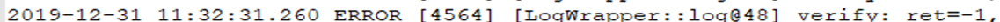 style="width:5.68194in;height:0.12986in" />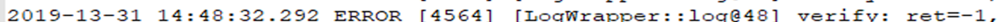 style="width:5.68194in;height:0.12986in" /> style="width:5.68194in;height:0.12986in" /> style="width:5.68194in;height:0.12986in" />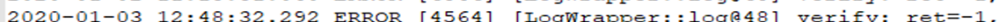 style="width:5.68194in;height:0.12986in" />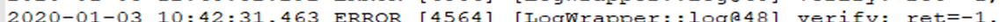 style="width:5.68194in;height:0.12986in" />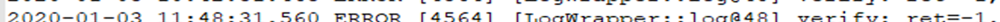 style="width:5.68194in;height:0.12986in" />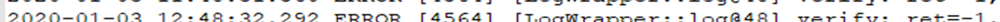 style="width:5.68194in;height:0.12986in" />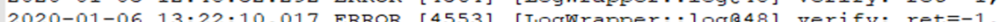 style="width:5.68194in;height:0.12986in" />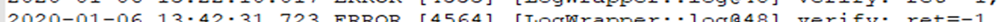 style="width:5.68194in;height:0.12986in" />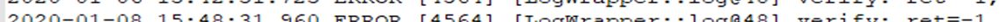 style="width:5.68194in;height:0.12986in" />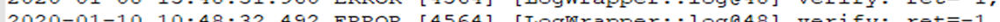 style="width:5.68194in;height:0.12986in" />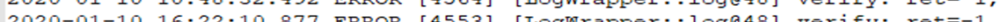 style="width:5.68194in;height:0.12986in" /> style="width:5.68194in;height:0.12986in" />

4.2. 로그를 이용한 증거분석

> 본 절에서는 로그 분석을 통해 분석한 내용을 시간 순서대로 기술한다.
> 분석대상 스마트폰은 부트로더 언락이 되어있다고 가정하며 루팅과 비 루팅
> 두 가지 방식으로 데이터를 획득하여 분석한다. 로그의 시간이 Unix Time
> 형식으로 표현되어있 는 경우는 UTC +9를 적용하여 한국 시각으로
> 변환한다. 팀원들의 스마트폰을 모두 분석한 결과, 신 씨와 홍 씨의 스마트
> 폰에서 중요 증거를 찾았다\[표 13\].
>
> 표 13. 주요 분석대상 스마트폰 정보
>
> Table 13. Information of Main Target Smartphones

||
||
||
||
||

> 4.2.1. 잠금 해제 오류
>
> ‘verify_history’ 파일은 잠금 해제의 오류가 기록되는 파일이다. 이를
> 통해, 근무 시간 외의 시간인 18시 49분 45초에 잠금 오류가 있었음을 알
> 수 있다\[그림 1\].
>
> 그림 1. 잠금 해제 오류 로그 (SM-N960N) Fig. 1. Error Log of Unlock
> (SM-N960N)
>
> 4.2.2. 블루투스 기기 페어링과 사진 송·수신
>
> 루팅 시에 획득할 수 있는 ‘bt_config.conf’와 ‘bt_config.bak’ 파일은
> 블루투스로 등록한 상대 기기의 이름, 블루투스 MAC 주소와 시각이
> 기재되어 있다. 해당 파일 분석을 통해, 2020년 1월 13일 18시 51분에 신
> 씨의 스마트폰은 Galaxy S10 5G 스마트폰을 블루투스 등록하였으며 2020년
> 1월 13일 18시 50분 31초에 홍 씨의 스마트폰은 Galaxy Note 9를
> 등록하였음을 알 수 있다\[그림 2\]. 이때, ‘Galaxy S10 5G’의 블루투스
> 주소(64:7b:ce:\*\*:\*\*:\*\*)는 홍 씨의 주소와 일치하 며, ‘Galaxy
> Note9’의 블루투스 주소(08:ae:d6:\*\*:\*\*:\*\*)는 신 씨의 주소와
> 일치한다.

12 디지털포렌식연구 제14권 제1호 2020년 03월

> System Log Analysis and Forensic Application Techniques of Latest
> Samsung Smartphones by Data Acquisition
> Methods style="width:4.75078in;height:0.21976in" /> style="width:4.75078in;height:0.21976in" /> style="width:4.75078in;height:0.21976in" /> style="width:4.75078in;height:0.21976in" /> style="width:4.75078in;height:0.21476in" />
>
> 그림 2. 블루투스 기기 등록 관련 로그 (좌 : SM-N960N, 우 : SM-G977N)
>
> Fig. 2. Log of Device Enrollment via Bluetooth (Left : SM-N960N, Right
> : SM-G977N)
>
> 루팅이 되어있지 않은 상태에서 획득한 데이터를 통해서도 신 씨의 Note
> 9에서 블루투스로 등록된 기기 목록을 알 수 있다\[그림 3\]. 이 목록에는
> 기본적으로 연결되었던 모든 기기의 MAC 주소가 입력되어 있다. 그 중,
> 사용자의 스마트폰에 상대방이 저장된 경우 사용자가 직접 저장해놓은
> 상대방의 이름으로 대체된다. 따라서 기기 목록에 있는 ‘홍과장’은 신 씨가
> 저장해놓은 홍 씨이다.
>
> 그림 3. 블루투스 기기 등록 관련 로그 (SM-N960N) Fig. 3. Log of Device
> Enrollment via Bluetooth (SM-N960N)
>
> ‘FileShare.xml’ 파일은 블루투스로 사진을 송·수신한 경우, 이에 대한
> 시간 정보가 남는다\[그림 4\]. 이를 통해 18시 52분 1초에 파일을
> 송신이나 수신했음을 알 수 있다.
>
> 그림 4. 블루투스를 이용한 사진 송·수신 시간 관련 로그 (SM-N960N)
>
> Fig. 4. Log of Time for Sending and Receiving Photos via Bluetooth
> (SM-N960N)
>
> 4.2.3. Gmail 계정 등록
>
> ‘ULR_PERSISTENT_PREFS.xml’은 이전에 등록했던 모든 Gmail 계정을
> 저장하므로, 삭제된 계정도 확인할 수 있다\[그림 5\].
> ‘g\*\*@gmail.com’와 ‘kang\*\*\*@gmail.com’은 신 씨가 사용하고 있는
> 메일 주소이지만, ‘hong\*\*\*@gmail.com’은 홍 씨의 계정이다. 이를
> 종합하면, 신 씨의 스마트폰을 이용하여 홍 씨의 Gmail 주소를 등록 및
> 사용한 후 삭제했음을 알 수 있다.

Journal of Digital Forensics 2020 03.: 14(1) 13

> 데이터 획득 방법에 따른 최신 삼성 스마트폰의 시스템 로그 분석과 포렌식
> 활용 기법 style="width:6.22665in;height:0.12986in" /> style="width:6.22665in;height:0.12986in" /> style="width:6.22665in;height:0.12986in" /> style="width:6.22665in;height:0.12986in" /> style="width:6.22665in;height:0.12986in" /> style="width:6.22665in;height:0.12986in" /> style="width:6.22665in;height:0.12986in" /> style="width:6.22665in;height:0.12986in" /> style="width:6.22665in;height:0.10489in" /> style="width:5.99678in;height:0.12986in" /> style="width:5.99678in;height:0.12986in" /> style="width:5.99678in;height:0.12986in" />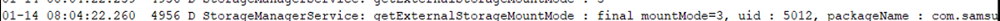 style="width:5.99678in;height:0.12986in" />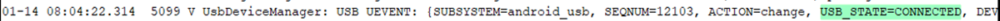 style="width:5.99678in;height:0.12986in" /> style="width:5.99678in;height:0.12986in" />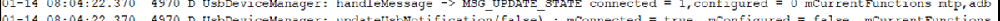 style="width:5.99678in;height:0.12986in" />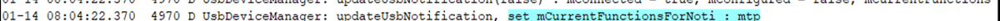 style="width:5.99678in;height:0.12986in" /> style="width:5.99678in;height:0.12986in" />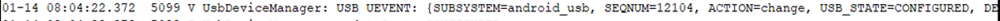 style="width:5.99678in;height:0.12986in" /> style="width:5.99678in;height:0.12986in" /> style="width:5.99678in;height:0.12986in" /> style="width:5.99678in;height:0.12986in" />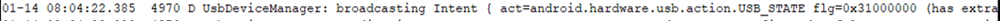 style="width:5.99678in;height:0.12986in" />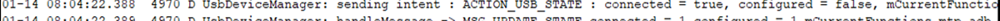 style="width:5.99678in;height:0.12986in" />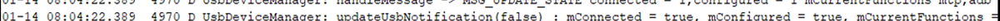 style="width:5.99678in;height:0.12986in" /> style="width:5.99678in;height:0.12986in" />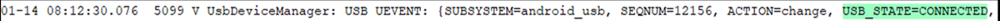 style="width:5.99678in;height:0.12986in" /> style="width:5.99678in;height:0.12986in" />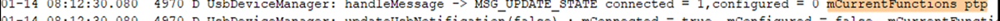 style="width:5.99678in;height:0.12986in" />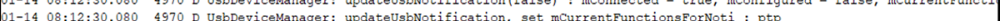 style="width:5.99678in;height:0.12986in" /> style="width:5.99678in;height:0.12986in" /> style="width:5.99678in;height:0.12986in" /> style="width:5.99678in;height:0.12486in" />
>
> 그림 5. Gmail에 등록한 주소 목록 관련 로그 (SM-N960N) Fig. 5. Log of
> E-mail List Registered in Gmail (SM-N960N)
>
> ‘hong\*\*\*@gmail.com.xml’ 파일을 통해, ‘hong\*\*\*@gmail.com’ 계정이
> 18시 57분 28초, 35초, 37초에 Gmail을 사용하기 위해 동기화됐다는 것을
> 알 수 있다\[그림 6\].
>
> 그림 6. 계정 동기화 시간 관련 로그 (SM-N960N)
>
> Fig. 6. Logs of Account Synchronization Time (SM-N960N)
>
> 4.2.4. USB 파일 및 이미지 전송
>
> 1월 14일 업무시간이 시작하기 전인, 8시 4분과 12분에 스마트폰이 USB
> 케이블로 컴퓨터에 연결된 흔적이 있다\[그림 7\]. 그리고 파일과 사진을
> 전송하기 위해 MTP와 PTP 모드를 이용하였다.
>
> 그림 7. 다양한 USB 연결 방법을 이용한 파일 및 이미지 전송 로그
> (SM-N960N)
>
> Fig. 7. Logs of Sending File and Image usin various USB connection
> methods (SM-N960N)
>
> 4.2.5. SD 카드 삽입
>
> SD 카드가 1월 15일 18시 19분 36초에 삽입(mounted)되었다는 사실은
> ‘vold-dump-##’와 ‘sflog.1’ 파일을 통해 알 수 있다\[그림 8\].

14 디지털포렌식연구 제14권 제1호 2020년 03월

> System Log Analysis and Forensic Application Techniques of Latest
> Samsung Smartphones by Data Acquisition
> Methods
>
> 그림 8. SD 카드 삽입 로그 (SM-N960N)
>
> Fig. 8. Logs of SD Card Insertion (SM-N960N)
>
> 4.2.6. USIM 제거 및 삽입
>
> Note 9의 ‘0_dumpacore_3rd_com.samsung.android.contacts.txt’ 은 USIM이
> 제거되었다는 문구인 ‘There’s no SIM’와 제거 시각이 남는다\[그림 9\].
> 이를 통해 17일 9시 11분 57초에 신 씨의 Note 9 스마트폰에서 USIM을 제거
> 했다는 것을 알 수 있다. 또한, S10 5G의 ‘SimCard.dat’ 파일은 S10 5G
> 스마트폰에 USIM이 삽입된 시각인 9시 12분 49초가 기록되어 있다.
>
> 그림 9. USIM 제거 및 삽입 로그 (SM-N960N, SM-G977N)
>
> Fig. 9. Logs of USIM Removal and Insertion (SM-N960N, SM-G977N)
>
> 루팅을 하지 않고 획득한 로그 파일은 삽입한 USIM의 통신사(SKT), USIM
> 카드 번호와 일련번호가 있다\[그림 10\]. 이를 통해 홍 씨의 스마트폰에
> 삽입한 USIM이 신 씨의 USIM이라는 것을 알 수 있다.
>
> 그림 10. USIM 삽입 로그 (SM-G977N) Fig. 10. Log of USIM Insertion
> (SM-G977N)

Journal of Digital Forensics 2020 03.: 14(1) 15

> 데이터 획득 방법에 따른 최신 삼성 스마트폰의 시스템 로그 분석과 포렌식
> 활용
> 기법
>
> 4.2.7. 스크린 캡처
>
> ‘global_screenshot_file_state.xml’은 스크린 캡처가 생성된 시간과 저장
> 경로가 기록된다\[그림 11\]. ‘Screenshot\_ \[날짜 및
> 시간\]@Gmail.jpg’와 ‘Screenshot\_\[날짜 및 시간\]@KakaoTalk.jpg’을
> 통해 2020년 1월 17일 9시 19분부터 29분 사이에 Gmail과 KakaoTalk에 대해
> 캡처 행위가 있었음을 알 수 있다.
>
> 그림 11. Gmail 및 카카오톡 스크린 캡처 로그 (SM-N960N)
>
> Fig. 11. Log of Gmail and Kakao talk Screen Capture (SM-N960N)
>
> 루팅을 하지 않을 시, ‘삼성 캡처’라는 행위와 스크린 캡처를 한 시간이
> 파일에 함께 저장된다\[그림 12\].
>
> 그림 12. 삼성 스크린 캡처 로그 (SM-N960N)
>
> Fig. 12. Log of Samsung Screen Capture (SM-N960N)
>
> 4.2.8. 결과 정리
>
> 로그 분석을 통해 신 씨의 스마트폰에 외부 접근과 이를 통한 정보 유출
> 관련 행위를 파악할 수 있다. 범죄 관련 행위는 신 씨의 해외 출장 기간인
> 1월 13일과 17일 사이에 있었으며, 근무 이외의 시각에 발생하였음을 알 수
> 있다. 해당 기간에 신 씨는 자신의 스마트폰을 사용할 수 없음에도
> 불구하고, 연결 대상 스마트폰에 홍 씨의 기기가 있었으며 등록한 Gmail
> 계정에 홍 씨의 계정이 있는 것을 보아 유력한 용의자는 홍 씨라고 할 수
> 있다.
>
> 1월 13일, 홍 씨는 신 씨의 스마트폰을 잠금 해제하다가 오류를 내었다.
> 그리고 신 씨의 스마트폰을 자신의 스마트폰과 블루투스 페어링한 후
> 사진을 송신이나 수신하였으며, Gmail 애플리케이션에 자신의 계정인
> ‘hong\*\*\*@gmail.com’을 등 록 및 동기화하고 사용하였다. 1월 14일, 홍
> 씨는 신 씨의 스마트폰에 USB 선을 연결하여 MTP와 PTP 모드를 이용하여
> 파일과 사진을 전송하였다. 1월 15일, 자신의 외장 SD 카드를 신 씨의
> 스마트폰에 삽입하였다. 1월 17일, 홍 씨는 신 씨 의 USIM을 제거하여
> 자신의 스마트폰에 삽입하였으며, 스크린 캡처를 이용하여 KakaoTalk과
> Gmail을 캡처한 흔적도 발견되었다. 이를 시간 순서대로 정리 요약하면
> \[표 14\]와 같다.
>
> 스마트폰 내에 있는 파일을 첨부할 수 있는 Gmail과 무선으로 다른
> 스마트폰과 연결할 수 있는 기능인 Bluetooth는 중요한 문서를 전송할 수
> 있는 수단이 될 수 있다. 또한, SD 카드는 스마트폰 내의 대용량의 파일을
> 저장하여 이를 반출할 수 있으며 스크린 캡처는 KakaoTalk과 같은 개인적인
> 대화를 할 수 있는 메신저나 업무적으로 주고받는 Gmail의 내용 을
> 캡처하여 정보를 유출하는데 사용될 수 있다. 로그 이외에 신 씨와 홍 씨의
> 실제 출입기록, 홍 씨의 Gmail 관련 데이터 베이스 분석, 신 씨 스마트폰
> 내의 존재하는 실제 캡처 사진의 존재 여부 확인 등 추가적인 조사를 하여
> 로그 분석의 결과 를 더 유용하게 사용할 수 있다.

16 디지털포렌식연구 제14권 제1호 2020년 03월

> System Log Analysis and Forensic Application Techniques of Latest
> Samsung Smartphones by Data Acquisition Methods
>
> 표 14. 사건 발생 타임라인
>
> Table 14. Timeline of Events Occurred

||
||
||
||
||
||
||
||
||
||
||
||
||
||
||
||
||

Ⅴ. 결 론

> 시스템 로그는 USIM이나 네트워크 사용과 공장 초기화 등 다양한 사용자
> 데이터를 저장하고 있으나, 많은 양의 로그 중 포렌식 관점에서 의미 있는
> 데이터를 선별하기 어려워 사용자가 이를 변조할 가능성이 희박하다. 이에
> 본 연구는 사용자 가 스마트폰으로 행할 수 있는 여러 가지 행위를
> 기반하여 유형을 분류하였다. 그리고 루팅이나 비 루팅과 같은 데이터 획
> 득방법을 달리하였을 때의 로그 분석결과 차이점을 상세 비교하기 위해
> 정규화하여 표로 요약하였다. 또한, 시나리오 해석 을 통해 로그의 포렌식
> 관점에서 활용될 수 있는 방안에 대해 제시하였다. 본 논문을 통해 최신
> 삼성 스마트폰을 대상으로 다양한 행위에 따른 의미 있는 데이터들을
> 빠르게 파악하여 수사관 관점에서 분석 시간을 줄일 수 있을 것으로
> 기대된다.

Journal of Digital Forensics 2020 03.: 14(1) 17

> 데이터 획득 방법에 따른 최신 삼성 스마트폰의 시스템 로그 분석과 포렌식
> 활용 기법
>
> 참 고 문 헌 (References)
>
> \[1\] Statcounter,
> “https://gs.statcounter.com/vendor-market-share/mobile/south-korea/2019”
> \[2\] Statcounter,
> “https://gs.statcounter.com/vendor-market-share/mobile/worldwide/2019”
>
> \[3\] Gallaup, “2012-2019 Survey on smartphone usage, brands, smart
> watches, wathces”, 2019.
>
> \[4\] Jaehyung Cho, Jaehyoung Lee, Soram Kim, Jaehyeong Lee, Seungjae
> Yang, Changhoon Lee, Jongsung Kim “Analysis on Non-Volatile System Log
> of Android Based Smartphone”, Jounal of Digital Forensics, 11(2), pp.
> 19-42, 2017,
>
> \[5\] Eunhu Park, Soram Kim, Jongsung Kim, “Analysis on System Log of
> Huawei Smartphone”, Journal of Digital Forensics, 12(3), pp. 9-25,
> 2018.
>
> \[6\] Eunhu Park, Soram Kim, Jongsung Kim, “Forensic Analysis of
> System Logs for Xiaomi Smartphones”, Journal of Digital Forensics,
> 13(2), pp. 45-62, 2019.
>
> \[7\] Yunho Lee, Sangjin Lee, “A Method of Internal Information
> Acquisition of Smartphones”, Journal of The Korea Institute of
> Information Security & Cryptology, 23(6), pp. 1057-1067, 2013.
>
> \[8\] Counterpoint,
> “https://www.counterpointresearch.com/top-5-smartphone-model-share-8-countries/”

18 디지털포렌식연구 제14권 제1호 2020년 03월

> System Log Analysis and Forensic Application Techniques of Latest
> Samsung Smartphones by Data Acquisition Methods
>
> 저 자 소 개
>
>  style="width:0.95949in;height:1.20035in" />박 은 후 (Eunhu Park)
> 학생회원
>
> 2018년 7월 : 국민대학교 정보보안암호수학과 졸업
>
> 2018년 8월 ~ 현재 : 국민대학교 금융정보보안학과 석사과정 관심분야 :
> 디지털 포렌식, 정보보호
>
>  style="width:0.95949in;height:1.20035in" />강 수 진 (Soojin Kang)
> 학생회원
>
> 2018년 2월 : 국민대학교 정보보안암호수학과 졸업
>
> 2020년 3월 ~ 현재 : 국민대학교 금융정보보안학과 석사과정 관심분야 :
> 디지털 포렌식, 정보보호
>
>  style="width:0.95949in;height:0.20144in" /> style="width:0.95949in;height:0.20144in" /> style="width:0.95949in;height:0.20144in" /> style="width:0.95949in;height:0.20144in" /> style="width:0.95949in;height:0.20144in" /> style="width:0.95949in;height:0.19312in" />김 소 람 (Soram Kim)
> 학생회원
>
> 2016년 2월 : 국민대학교 수학과 졸업
>
> 2018년 2월 : 국민대학교 금융정보보안학과 석사
>
> 2018년 3월 ～ 현재 : 국민대학교 금융정보보안학과 박사과정 관심분야 :
> 디지털 포렌식, 정보보호
>
>  style="width:0.95949in;height:1.20868in" />김 종 성 (Jongsung Kim)
> 종신회원
>
> 2000년 8월/2002년 8월 : 고려대학교 수학 학사/이학석사
>
> 2006년 11월 : K.U.Leuven, ESAT/SCD-COSIC 정보보호 공학박사 2007년 2월
> : 고려대학교 정보보호대학원 공학박사
>
> 2007년 3월 ~ 2009년 8월 : 고려대학교 정보보호기술연구센터 연구교수
> 2009년 9월 ~ 2013년 2월 : 경남대학교 e-비즈니스학과 조교수
>
> 2013년 3월 ~ 2017년 2월 : 국민대학교 수학과 부교수
>
> 2014년 3월 ~ 현재 : 국민대학교 일반대학원 금융정보보안학과 부교수
> 2017년 3월 ~ 현재 : 국민대학교 정보보안암호수학과 부교수
>
> 관심분야 : 정보보호, 암호 알고리즘, 디지털 포렌식

Journal of Digital Forensics 2020 03.: 14(1) 19
