# (c)creative   C O M M O N S D E E D 

## 저작자표시-비영리-변경금지 2.0 대한민국

이용자는 아래의 조건을 따르는 경우에 한하여 자유롭게

- 이 저작물을 복제, 배포, 전송, 전시, 공연 및 방송할 수 있습니다.

다음과 같은 조건을 따라야 합니다:

저작자표시. 귀하는 원저작자를 표시하여야 합니다.

비영리. 귀하는 이 저작물을 영리 목적으로 이용할 수 없습니다.

변경금지. 귀하는 이 저작물을 개작, 변형 또는 가공할 수 없습니다.

- 귀하는, 이 저작물의 재이용이나 배포의 경우, 이 저작물에 적용된 이용허락조건 을 명확하게 나타내어야 합니다.
- 저작권자로부터 별도의 허가를 받으면 이러한 조건들은 적용되지 않습니다.

저작권법에 따른 이용자의 권리는 위의 내용에 의하여 영향을 받지 않습니다.
이것은 이용허락규약(Legal Code)을 이해하기 쉽게 요약한 것입니다.
Disclaimer $\square$

碩士學位 請求論文
指導教授 金 奇 範

# 모바일 디바이스의 휘발성 데이터   획득 절차에 관한 연구 

成均館大學校 一般大學院
科學搜查 學科

李 至 璲

# 2 

0
2
1

## 李

至
璀

碩士學位 請求論文
指導教授 金 奇 範

# 모바일 디바이스의 휘발성 데이터   획득 절차에 관한 연구 

A Study on the Procedure of Live Data Acquisition in Mobile Device

成均館大學校 一般大學院
科學搜査 學科

李 至 璲

# 碩士學位 請求論文 

指導教授 金 奇 範

## 모바일 디바이스의 휘발성 데이터   획득 절차에 관한 연구

A Study on the Procedure of Live Data Acquisition in Mobile Device

이 論文을 科學搜査學 碩士學位請求論文으로 提出합니다.

$$
\begin{array}{llll}
2021 \text { 年 } & 4 \text { 月 } & \text { 日 }
\end{array}
$$

成均館大學校 一般大學院
科學搜査 學科

李 至 璲

# ㅇ論文會 李至璊의 科學搜查學   碩士學位 論文立足認定暂 

2021 年 6 月 日

審查委員長
審查委員
審查委員

# 목 차 

제1장 서 론 ..... 1
제1절 연구 배경 및 목적 ..... 1
제2절 연구의 방법과 범위 ..... 6
제2장 모바일 포렌식의 이론적 고찰 ..... 7
제1절 모바일 포렌식의 개념 및 특징 ..... 7

1. 모바일 포렌식의 개념 ..... 7
2. 모바일 포렌식의 특징 ..... 8
제2절 모바일 증거 수집 절차 ..... 13
3. 국내 모바일 증거 수집 절차 ..... 13
4. 해외 모바일 증거 수집 절차 ..... 19
제3절 모바일 데이터 획득 방법 ..... 22

1. 하드웨어 기반 데이터 획득 기법 ..... 22
2. 소프트웨어 기반 데이터 획득 기법 ..... 24
제4절 시사점 ..... 28
제3장 모바일 기기의 휘발성 데이터 분석 ..... 30
제1절 선행연구 ..... 30
3. Google Talk 메신저 ..... 30
4. Wechat 메신저 ..... 30
5. 모바일 웹브라우저 사생활 보호 모드 ..... 31
제2절 실험환경 및 방법 ..... 32
6. 실험환경 ..... 32
7. 실험방법 ..... 33
제3절 상용 도구 이용 모바일 데이터 수집 실험 ..... 35
8. 클립보드 ..... 35
9. 삭제된 카카오톡 대화 ..... 36
10. 메신저 채팅 내역 ..... 37

4. 삭제된 앱 흔적 ..... 38
5. 안티 포랜식 앱 흔적 ..... 39
제4절 모바일 기기에서 휘발성 데이터 수집 실험 ..... 41
6. 삭제된 카카오톡 대화 ..... 41
7. 메신저 채팅 내역 ..... 43
8. 삭제된 앱 흔적 ..... 45
9. 안티포랜식 앱 흔적 ..... 47
제4장 모바일 포랜식의 증거 수집 절차 개선방안 ..... 49
제1절 모바일 포랜식 증거 수집 절차 개선 ..... 49
제2절 모바일 포랜식 휘발성 데이터 획득 및 분석 도구 개발 ..... 53
제5장 결 론 ..... 55

# 표 목 차 

[표 1] MD-NEXT 획득 종류 ..... 15
[표 2] 실험에 사용된 포랜식 도구 목록 ..... 33
그 림 목 차
[그림 1] 연도별 개인 매체 보유율 (단위: \%) ..... 2
[그림 2] 연령별 스마트폰 필수 매체 인식 추이 (단위: \%) ..... 2
[그림 3] 경찰청 디지털기기 증거분석 현황 (단위: 건) ..... 3
[그림 4] 국내 수사기관 모바일 증거 수집 절차 ..... 14
[그림 5] TTA 모바일 포랜식 가이드라인 ..... 17
[그림 6] NIST 모바일 포랜식 가이드라인 ..... 21
[그림 7] PC 시스템 정보 ..... 32
[그림 8] Fridadump 화면 ..... 34
[그림 9] dump 파일 ..... 34
[그림 10] 상용도구에서의 클립보드 ..... 35
[그림 11] 카카오톡 메시지 삭제 옵션 ..... 36
[그림 12] 카카오톡 메시지 삭제 테스트 ..... 36
[그림 13] 상용도구에서 카카오톡 모든 대화 상대에게서 삭제 확인 ..... 36
[그림 14] 상용도구에서 카카오톡 나에게서만 삭제 확인 ..... 37
[그림 15] 상용도구에서 메신저 앱 변경된 암호화 키 적용 전 ..... 38
[그림 16] 상용도구에서의 삭제된 앱 분석 옵션 ..... 39

[그림 17] 상용도구에서의 안티 포랜식 앱 흔적 ..... 40
[그림 18] 휘발성 메모리 덤프 파일 ..... 41
[그림 19] 휘발성 메모리 덤프 파일 내 문자열 ..... 42
[그림 20] 카카오톡 메시지 삭제 테스트 ..... 42
[그림 21] 휘발성 메모리에서의 삭제된 카카오톡 메시지 ..... 43
[그림 22] 카카오톡 채팅 내역 ..... 44
[그림 23] 휘발성 메모리에서의 카카오톡 메시지 ..... 44
[그림 24] 텔레그램 채팅 내역 ..... 44
[그림 25] 휘발성 메모리에서의 텔레그램 메시지 ..... 45
[그림 26] 앱 삭제 시 휘발성 메모리 ..... 46
[그림 27] 휘발성 메모리에서의 삭제된 앱 흔적 ..... 47
[그림 28] 데이터 완전삭제 실행 ..... 48
[그림 29] 휘발성 메모리에서의 데이터 완전삭제 흔적 ..... 48
[그림 30] 모바일 증거 수집 절차 제안 ..... 50

# 논문요약 

## 모바일 디바이스의 휘발성 데이터 획득 절차에 관한 연구

디지털 시대의 발전으로 인하여 개인의 스마트폰 보유율이 지속적으로 증가하고 있고, 스마트폰 이용률이 증가함에 따라 범죄에 사용된 모바일 기기 증거 분석율 역시 증가하고 있다. 특히 디지털 포렌식에 대한 인식이 높아지면서 수사망을 피하 기 위한 안티 포렌식 방법도 다양해지고 있다. 그러나 모바일 포렌식은 모바일 기 기 특성상 지속적으로 새로운 기기와 OS가 등장하고 있고, 애플리케이션들의 업데 이트도 실시간으로 진행되고 있어 도구에 의존하여 수집 및 분석을 하고 있는 것이 현실이다.

국내 수사기관에서 모바일 기기 수집 시 전원을 차단한 후 현장에서 모바일 포 렌식 수집 도구를 이용하여 데이터를 수집한다. 이렇게 수집된 데이터는 비휘발성 데이터로 스마트폰에 저장된 것을 대부분 확인할 수 있다. 그러나 시스템 전원을 차단하는 순간 휘발성 증거들이 소멸된다는 단점이 있다.

본 논문에서는 모바일 기기에서 휘발성 메모리를 분석하는 방법과 절차에 대하 여 연구하였다. 첫 번째로, 카카오톡의 '나에게서만 삭제' 기능으로 메시지를 삭제할 경우 상용 도구에서도 카카오톡 DB 내 메시지가 0 으로 덮어써지기 때문에 복구가 불가능하다. 그러나 휘발성 메모리 상에서는 비활성 영역에 저장되는 것처럼 DB 형 태로 저장되는 것이 아니므로 삭제되기 전 메시지를 확인할 수 있었다.

두 번째로, 대화 내용을 기기에 저장할 때 암호화하여 저장하는 메신저 앱에 대 하여 상용 도구에서는 이를 복호화하여 보여준다. 그러나 주기적으로 변경되는 암 호화 키 업데이트로 인하여 상용 도구 사에서 키 업데이트를 적용하는 기간 동안

복호화가 불가능하다는 문제가 있다. 휘발성 메모리에는 이 복호화된 메시지가 저 장되기 때문에 상용 도구에서 복호화를 하지 못하더라도 휘발성 메모리 내부에서 평문의 대화 내용을 확인할 수 있다.

세 번째로, 모바일 기기 압수 전 사용하던 앱을 삭제할 경우 상용 도구에서 분 석하려면 미리 삭제한 앱을 알고 있어야하는데, 자주 사용하지 않는 앱을 범죄에 사용하고 삭제를 한다면 분석이 필요하다는 것을 알기 어렵다. 휘발성 메모리 상의 다른 앱에 삭제된 앱에 대한 기록이 남아있을 수 있으며, 삭제된 앱을 알게 되면 상용 도구에서 비활성 영역을 분석하기도 용이하다.

네 번째로, 안티 포렌식 앱인 데이터 완전삭제 앱은 실행할 경우 비활성 영역의 데이터가 삭제되므로 상용 도구에서는 복구가 불가능하다. 그러나 휘발성 데이터에 서는 삭제한 내용이 그대로 남아 있었다.

위와 같은 이유로 모바일 증거 수집 시 휘발성 메모리 분석이 반드시 필요하다. 따라서 본 논문에서는 휘발성 메모리 분석과 모바일 증거 수집 절차의 개선방안을 제안하였다. 또한, 모바일 기기 특성 상 수집 및 분석 자동화 도구가 필수적이므로 휘발성 메모리 분석 도구 개발의 필요성도 주장하였다.

현재 수사기관의 모바일 증거 수집 절차에 포함되지 않던 휘발성 메모리를 수집 및 분석하여 모바일 기기 증거 획득의 범위를 넓히고, 그동안 증명하기 어려웠던 행위들을 증명함으로서 모바일 기기 수사 기법이 고도화 되어 범죄 수사 발전에도 도움이 되기를 기대한다.

주제어 : 모바일 포렌식, 라이브 포렌식, 디지털 포렌식, 디지털 증거, 스마트폰 압수수색

# 제1장 서 론 

## 제1절 연구 배경 및 목적

전 세계 사용하는 휴대전화는 약 50 억 대, 그 중 약 절반 정도는 스마트폰이 차 지하고 있다. 미국 시장조사기관인 퓨 리서치(Pew Research)가 세계 27 개 국가를 대상으로 조사한 결과 우리나라에서 스마트폰을 사용하는 사람들의 비율은 $95 \%$ 로 조사 국가 중 가장 높은 수치를 나타냈다. ${ }^{1)}$

한국콘텐츠진흥원 2020년 방송매체 이용행태 조사에 따르면 개인 스마트폰 보유 율은 2016년부터 2020년까지 꾸준히 증가하였고 2020년에는 $93.1 \%$ 로 나타났다.[그 림 1]2) 연령별 스마트폰 필수 매체 인식 추이 조사에서는 10 대부터 50 대는 절반 이 상이 스마트폰이 필수 매체라고 인식하고 있으며, 모든 연령에서 2018년 대비 2020 년에 필수 매체 인식이 증가하였다.[그림 2]3) 또한, 스마트폰 기능별 중요도는 정보 검색, 정보전달이 $82.8 \%$, 커뮤니케이션이 $75.3 \%$, 미디어 콘텐츠 시청이 $64.0 \%$ 를 차 지하며, 스마트폰 하루 평균 이용 시간은 음성통화 제외 1 시간 55 분으로 나타났다.4)

[^0]
[^0]:    1) KBS NEWS, "국민 $95 \%$ 가 스마트폰 사용…보급률 1 위 국가는?", https://news.kbs.co.kr/news/view.do?ncd=4135732 (2021.06.19. 최종확인)
    2) 방송통신위원회, "2020년 방송매체 이용행태 조사", 2020, p. 74.
    3) 방송통신위원회, "2020년 방송매체 이용행태 조사", 2020, p. 86.
    4) 방송통신위원회, "2020년 방송매체 이용행태 조사", 2020, p. 115.

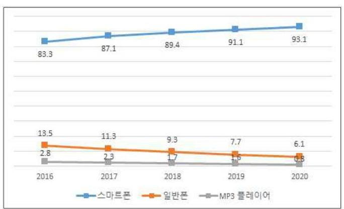
[그림 1] 연도별 개인 매체 보유율 (단위: \%)

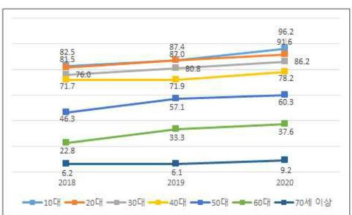
[그림 2] 연령별 스마트폰 필수 매체 인식 추이 (단위: \%)

스마트폰 이용이 증가함에 따라 모바일 기기에 대한 증거 분석 역시 증가하고 있다. 디지털 증거 분석 중 모바일 기기의 분석 비율이 압도적으로 높으며 증거분 석 수량도 PC$\cdot$노트북 등 다른 디지털기기에 비해 매년 급증하고 있다.[그림 3]5)
5) 경찰청, "2019 경찰통계연보", 2019, p.235.

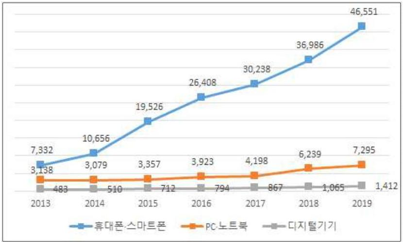
[그림 3] 경찰청 디지털기기 증거분석 현황 (단위: 건)

스마트폰의 보급 이후 개인의 인터넷$\cdot$SNS 이용 및 모바일 쇼핑 이용이 증가함 에 따라 성착취물, 인터넷 사기, 사이버 명예훼손$\cdot$모욕 등의 증거 확보를 위해 압 수$\cdot$수색이 불가피해졌다.

경찰청 사이버수사국의 사이버범죄 통계자료에 따르면 사이버범죄의 유형은 정 보통신망 침해범죄, 정보통신망 이용범죄, 불법컨텐츠범죄로 나뉜다.6) 정보통신망 침해범죄에는 해킹, 서비스거부공격(DoS), 악성프로그램 등이 있으며, 정보통신망 이용범죄에는 사이버사기, 사이버금융범죄, 개인위치정보침해, 사이버저작권침해 등 이 있다. 불법컨텐츠범죄에는 사이버음란물, 사이버도박, 사이버명예훼손$\cdot$모욕, 사이 버스토킹 등이 해당한다.

이러한 사이버범죄는 더 이상 컴퓨터에만 해당되지는 않는다. 일명 '해킹 홍신 소'는 온라인상에서 의뢰를 받고 스마트폰 해킹을 해주며, 이를 이용하여 유명 배 우, 기업인, 정치인, 방송인의 사생활을 유출하거나 일반인의 스마트폰 데이터를 가 져오는 등 정보통신망 침해범죄인 스마트폰 해킹이 기승을 부리고 있다.7) 또한, 기

[^0]
[^0]:    6) 경찰청, 사이버범죄 통계자료, https://cyber.go.kr/share/sub3_2.jsp?mid=030301 (2021.06.22. 최종확 인)

존 전화를 이용하여 피해자를 속여 금전이나 정보를 탈취하던 정보통신망 이용범죄 보이스피싱은 스마트폰에서 악성앱 등을 사용하여 한층 더 치밀하게 진화하였다. 피해자에게 통화를 걸어 악성앱 설치를 유도하고, 설치 후 감염된 단말에서 개인 정보를 수집한다. 피해자의 통화와 문자를 감시하고 수신, 발신 통화를 가로채는 등 다양한 방법을 동원해 보이스피싱 성공률을 높인다.8) 2019년 크게 이슈가 되었던 성착취 사건, 일명 n번방 사건 역시 스마트폰 앱을 이용하여 피해자를 물색하고, 성 착취물을 촬영하고, 유포하였다.9) 이와 같이 모바일 기기를 대상으로 한 사이버범죄 가 급증하여 모바일 포렌식의 중요성이 점점 더 커지고 있다.

그런데 수사 과정에서 사용하는 모바일 포렌식 획득 도구는 비휘발성 메모리만 수집하며 휘발성 메모리에 대한 획득과 분석이 이루어지지 않고 있어 문제가 되고 있다. 모든 프로그램은 RAM에 적재되어 실행된다. RAM은 휘발성 메모리이기 때 문에 PC에 전원이 종료되는 경우 RAM에 적재되었던 데이터는 모두 사라진다. 전 원이 종료되기 이전에 수사관이 RAM을 획득하면 디스크에 기록되지 않은 정보를 획득할 수 있다.

모바일 기기는 사용자가 원격으로 초기화할 수 있어 이를 방지하기 위해 데이터 차단, 전원 종료 등의 방법으로 초기화를 할 수 없는 환경을 구성하여 데이터를 수 집하고 있다. 그러나 전원을 종료하게 되면 RAM에 저장된 데이터를 수집할 수 없 다는 문제가 있다.

범죄에 스마트폰이 적극적으로 사용되고, 디지털 포렌식에 대한 인식이 높아지 면서 수사망을 피할 수 있는 안티포렌식 앱도 증가하고 있다. 스마트폰 브라우저에

[^0]
[^0]:    7) 한국경제, "75만원 주면, 어떤 폰도 탈탈"...온라인 '해킹 홍신소' 성행", https://www.hankyung.com/society/article/202001319317i (2021.06.22. 최종확인)
    8) 안랩, "진화하는 보이스피싱, 악성앱이 사용자를 노린다", https://www.ahnlab.com/kr/site/securityinfo/secunews/secuNewsView.do?seq=30254 (2021.06.22. 최종확인)
    9) 함영욱$\cdot$임종인, "사이버성폭력 범죄의 실태 분석 및 경찰의 대응방안에 관한 연구", 한국경찰연구 19(2), 2020, pp.207-208.

서 사용자 행위 흔적을 남기지 않는 시크릿모드(Secret mode) 기능이 존재하고, 앱 이나 사용자 행위, 파일 등을 숨기는 은닉 앱, 데이터 완전 삭제 앱까지 많은 수의 다양한 앱들이 우후죽순으로 생겨나고 있다. 모바일 포렌식 분석 도구 개발사에서 이러한 앱들을 대응하고 있으나 그 수가 많고, 우회할 수 있는 방안이 있어 차단에 한계가 있다. 또한, 범죄에 사용한 앱을 압수수색 전에 삭제할 경우 그 앱이 존재하 였다는 사실을 수사관이 알지 못한다면 분석할 수 없고, 특정 앱의 경우 사용자가 설정한 패스워드를 풀지 못하면 분석할 수 없는 등 수사 현장에서 다양한 어려움이 존재한다.

# 제2절 연구의 방법과 범위 

본 연구는 수사 과정에서의 모바일 증거 수집 절차를 알아보고 문제점을 파악하 여 휘발성 데이터를 확보할 수 있도록 모바일 포렌식 절차를 제안하는 데 목적이 있다. 따라서 본 연구는 모바일 포렌식의 획득 절차만을 다루고, 대표적인 모바일 기기인 스마트폰 중에서 상대적으로 접근하기 쉬운 안드로이드 기기를 대상으로 하 였다. 국내$\cdot$외 논문과 연구 보고서 등을 통한 문헌연구를 진행하며 모바일 포렌식의 개념과 현황에 대해 살펴본다. 그 후 실험을 통해 비휘발성 데이터에서 확인하기 어려운 부분을 제시하고, 휘발성 데이터에서 비휘발성 데이터로는 어려웠던 부분을 선별하여 분석하여 휘발성 데이터 분석의 필요성을 알아보고자 한다. 실험은 수사 시 자주 사용되는 모바일 분석 도구를 사용하여 비휘발성 데이터를 분석하고, 휘발 성 데이터는 프리웨어로 공개되어 있는 메모리 덤프 도구를 사용하여 휘발성 메모 리 덤프를 한 후 분석한다. 마지막으로 실험 결과를 바탕으로 모바일 포렌식 증거 수집 절차의 개선방안을 제시한다.

제 2장에서는 이론적 배경으로서 모바일 포렌식의 개념 및 특징과 증거 수집 절 차, 증거 추출 방법, 그리고 모바일 라이브 포렌식에 관한 선행 연구에 대하여 알아 본 후 현재 모바일 포렌식에 대한 시사점을 서술한다. 제 3장에서는 모바일 기기의 휘발성 메모리를 분석하여 어떠한 정보를 확보할 수 있는지 살펴보고 수사에 사용 되는 모바일 포렌식 도구의 분석 결과와 비교 분석하여 현재 절차의 문제점을 도출 한다. 제 4장에서는 휘발성 메모리 획득이 포함된 새로운 모바일 포렌식 절차와 휘 발성 메모리를 획득하기 위한 도구를 개선방안으로 제시하고, 마지막으로 제 5장에 서 결론을 내리도록 한다.

# 제2장 모바일 포렌식의 이론적 고찰 

## 제1절 모바일 포렌식의 개념 및 특징

## 1. 모바일 포렌식의 개념

모바일 포렌식은 스마트폰, 태블릿 PC, 웨어러블 기기 등 모바일 기기에서 발생 되는 다양한 범죄에 대해 법적 증거를 획득$\cdot$분석하고 분석된 결과를 토대로 범죄 수사에 사용하는 기술이다. 10) 2000년대 후반 전 세계적으로 스마트폰의 사용이 급 격하게 증가하면서부터 현재까지 모바일 포렌식에 대한 많은 연구가 진행되고 있 다. 11)

모바일 기기는 컴퓨터와 더불어 범죄 혐의 입증에 결정적인 역할을 한다. 컴퓨터는 없더라도 모바일 기기는 개인적으로 가지고 있고, 휴대성 측면에서 컴퓨터보 다 일상생활에 밀접하게 관련되어 있기 때문이다.12)

대표적인 모바일 기기에는 스마트폰이 있다. 과거 단순 통화 기능으로 사용하던 피처폰에 비해 스마트폰에는 다양한 데이터가 저장되어 있다. 스마트폰의 데이터는 크게 (1) 문자메시지, 통화내역, 전화번호부 등과 같은 통화 관련 기본 데이터, (2) 사진, 동영상, 음성 등과 같은 멀티미디어 데이터, (3) 이메일, 일정, 메모, 인터넷 기

[^0]
[^0]:    10) 여정호, "저작권 침해 예방을 위한 모바일 포렌식 및 필터링 기술에 관한 연구", 성균관대학교 석 사학위논문, 2012, p.7.
    11) 김도현, 이상진, "모바일 포렌식 동향", 정보보호학회지 26(5), 2016, p. 22.
    12) 구선미, "효과적인 압수수색 현장 대응을 위한 모바일 포렌식 방안 연구", 서울대학교 석사학위논 문, 2018, p. 12.

록, 앱 데이터 등으로 분류할 수 있다. 문자메시지나 카카오톡, 텔레그램과 같은 대 화 내역은 공범과의 공모관계를 입증하는 데에 결정적인 역할을 하고, 이외에도 음 성, 사진, 동영상, 통화내역 등 모바일 기기에서 중요한 증거를 획득하는 경우가 많 다. ${ }^{13)}$
2. 모바일 포랜식의 특징

# 가. 이동성 

모바일 포랜식의 가장 큰 특징으로는 이동성이 있다. ${ }^{14)}$ 크기가 작고 가벼우며, 배터리로 작동하도록 설계되어 있어 언제 어디서든 모바일 기기를 사용할 수 있다. 모바일 기기는 특별한 일이 없는 한 전원 종료를 잘 하지 않고, 사용자가 항상 휴 대하며 사용하기 때문에 기기에는 사용자와 관련된 다양한 정보가 저장되어 증거로 서의 가치가 높다. ${ }^{15)}$ 그러나 이러한 특징 때문에 피의자가 증거를 은닉하기 위하여 모바일 기기를 숨기거나 버리기 쉽다는 문제가 있다. 따라서 압수수색 현장에서 숨 거진 모바일 기기는 없는지, 피의자 명의의 다른 모바일 기기가 없는지 등을 확인 해야 한다. 또한 모바일 기기에서 생성된 정보에 대해서 메시지 삭제, 애플리케이션 삭제, 휴대폰 초기화 등을 통해 생성된 정보를 삭제하여 손쉽게 숨기고 증거를 인 멸하고 포랜식 분석을 어렵게 할 수 있다. ${ }^{16)}$

[^0]
[^0]:    13) 구선미, "효과적인 압수수색 현장 대응을 위한 모바일 포랜식 방안 연구", 서울대학교 석사학위논 문, 2018, pp.12-13.
    14) 윤경배$\cdot$천우성$\cdot$박대우, "압수 수색된 안드로이드와 윈도우모바일 스마트폰의 포랜식 증거 자료", 한국정보통신학회논문지 17(2), 2012, p. 325.
    15) 구선미, "효과적인 압수수색 현장 대응을 위한 모바일 포랜식 방안 연구", 서울대학교 석사학위논 문, 2018, pp.13-14.
    16) 황태진$\cdot$원동호$\cdot$이영숙, "모바일 포랜식을 이용한 메신저 증거 비교 분석 연구", 융합보안논문지 18(2), 2018, p. 26

# 나. 급변성 

모바일 기기는 스마트폰 등장 이후 급변하고 있으며, 모바일 기기의 특성, 저장 방식의 차이, 저장된 데이터 종류의 차이 등으로 인해 기존 디지털 포랜식과는 차 이가 있다. ${ }^{17)}$

4차 산업혁명 이후로 디지털 기술이 급속도로 발전하면서 인공지능, 빅데이터, 사물인터넷 등 새로운 기술들이 다량 등장하였다. 네트워크(IoT, 5G), 데이터(Cloud, 빅데이터), 인공지능 등 지능화 기술이 각 분야의 기반기술과 융합, 범용으로 영향 일 미치면서18) 모바일 기기에도 이러한 기술이 적용되었다. 이렇듯 4차 산업혁명 이후 모바일 기기의 사용자의 폭발적 증기와 단말기의 고도화로 인해 사람들의 생 활이 모바일 기기 중심으로 빠르게 변화하였으며,19) 새로운 기술의 개발 및 적용으 로 인해 점점 더 급속도로 변화하고 있다. 이러한 기술의 개발이 적용된 새로운 모 바일 기기가 출시될 때마다 많은 사람들의 관심이 집중되고, 컴퓨터에 비해 제품 교체 주기가 짧은 편이다.

모바일 기기의 저장 용량 역시 빠르게 변화하고 있는데, 최신 모바일 기기의 내 부 메모리 용량은 1TB까지 증가하였으며, MicroSD 슬롯은 최대 512 GB 의 저장 용 량을 갖춘 외장 메모리가 지원된다. 또한, GPS, Wi-Fi, 블루투스, 생체인식 기술 등 이 내장되어 있다.20) 최근 중국 모바일 브랜드 오포에서 RAM을 확장할 수 있는

[^0]
[^0]:    17) 어수용$\cdot$조우연$\cdot$이석준$\cdot$손태석, "모바일 포랜식 증거능력 확보 방안 연구", 정보보호학회논문지 26(1), 2016, p. 136
    18) 유수정, "4차 산업혁명과 인공지능", 한국멀티미디어학회지 21(4), 2017, p.1.
    19) 김상일$\cdot$김화성, "스마트폰 기반의 상황 추론을 위한 온돌로지 모델링", 한국정보과학회 학술발표논 문집, 2013, p.2.
    20) 구선미, "효과적인 압수수색 현장 대응을 위한 모바일 포랜식 방안 연구", 서울대학교 석사학위논 문, 2018, p. 14.

기능을 추가한 스마트폰을 출시한다고 밝혔다. 21

# 다. 다양성 

모바일 기기마다 기술적, 물리적 특성(크기, 무게, 프로세서 속도, 메모리 용량 등)이 다르고, 다른 유형의 확장 기능을 사용하여 추가 기능을 제공할 수 있다. 또 한 스마트폰은 앱 스토어를 통해 제공되는 다양한 애플리케이션을 지원한다. 이러 한 애플리케이션을 이용하여 많은 작업을 모바일 기기에서 할 수 있다.22) 각종 엔 터테인먼트 기능, 모바일 오피스 기능 등 거의 모든 PC 기능을 보유하고 있어 일상 에서 사용 범위가 다양하게 확장되었다.23) 스마트폰 시대가 열리면서 대부분의 사 람들이 비슷한 스마트폰을 사용하는 것처럼 보이지만, 스마트폰 내부를 들여다보면 사용자에 맞게 다양한 애플리케이션을 설치하여 사용한다. 다양한 애플리케이션은 각자의 암호화 방식이 있기 때문에 이는 모바일 포렌식 분야를 어렵게 만드는 요인 이 된다. 24)

## 라. 보안성

모바일 기기를 이용한 모바일 금융결제 서비스의 확산과 안전한 사용을 위해 모

[^0]
[^0]:    21) 지디넷, "中 오포, 스마트폰 '웬’ 확장 기능 넣는다", https://zdnet.co.kr/view/?no=20210412083945 (2021.06.22. 최종확인)
    22) 안영건$\cdot$김명호, "안드로이드 스마트폰의 데이터 수집 방법", 한국컴퓨터정보학회 학술발표논문집 19(1), 2011, p. 97.
    23) 구본민$\cdot$김주영$\cdot$이태림$\cdot$신상욱, "Android \& iOS 기반 스마트폰의 디지털 증거 수집 및 분석", 정보 보호학회논문지 21(1), 2011, p. 168.
    24) 구선미, "효과적인 압수수색 현장 대응을 위한 모바일 포렌식 방안 연구", 서울대학교 석사학위논 문, 2018, pp.14-15.

바일 기기에 저장되는 모든 정보를 보호하기 위한 기기 보안과 운영 애플리케이션 을 포함한 시스템 보안 및 네트워크 보안 등을 위한 다양한 보안기술이 요구되었 다. ${ }^{25)}$ 또한, 개인의 프라이버시와 정보보호에 관한 관심이 고조됨에 따라 최근 모바 일 기기의 최대 관심사는 보안으로, 데이터 암호화에 대한 기능을 강화하는 방안으 로 발전 중이다. 애플의 아이폰은 개인정보 보호를 위한 보안을 강조하며 홍보하고, 삼성의 갤럭시 역시 개인정보 보호 요구를 충족하기 위하여 기기의 보안성을 강화 한다. ${ }^{26)}$

다른 디지털 기기에 비해 모바일 기기는 민감한 개인정보가 많을 수 있고, 최근 에는 모바일 기기로 금융 업무, 사무도 처리하기 때문에 특히 보안에 민감하다. 그 래서 FDE(Full Disk Encryption), 앱 DB 데이터 암호화, 숨김 앱, KNOX, LOCK 기능, 안티포랜식 앱(완전삭제 앱, 암호화 앱, 원격제어 앱, 데이터 은닉 앱 등), 보 안폴더 등 여러 가지 방법으로 데이터를 암호화하고, 패스워드, 핀 코드를 강화하 고, 지문, 홍채 등 생체 인식을 이용한 기술도 발전 중이다.

삼성전자는 갤럭시 스마트폰에서 사용하는 '보안 폴더' 애플리케이션을 2017년 개발하여 출시하였는데, 이 보안 폴더는 삼성 KNOX 보안 플랫폼을 활용하여 암호 화된 비공개 보안공간을 만들고 사진, 동영상, 문서파일과 같은 데이터뿐만 아니라 메신저, 금융, 게임 등 애플리케이션까지 암호화하여 저장하고 있다. 아이폰의 경우 백업 패스워드를 별도로 설정할 수 있는데, 스마트폰 잠금을 해제하더라도 백업 패 스위드가 설정되어 있는 경우 백업 패스워드를 알아야만 상용 도구에서 데이터 획 득이 가능하다. ${ }^{27)}$ 아이폰 기본 메모 앱에도 이러한 기능이 적용되어 있어 사용자가 설정한 패스워드 없이는 사실상 데이터 수집이 불가능하다. 또한, 텔레그램 등 일부

[^0]
[^0]:    25) 정윤수, "스마트폰 사용으로 인한 사용자 프라이버시 피해 현황 분석", 중소기업융합학회논문지 4(4), 2014, p. 14
    26) 구선미, "효과적인 압수수색 현장 대응을 위한 모바일 포랜식 방안 연구", 서울대학교 석사학위논 문, 2018, p. 15
    27) 윤지수$\cdot$이경렬, "안티 포랜식 신중기법에 대한 형사법적 대응방안", 형사정책연구 32(4), 2021, p. 77 .

앱의 경우 스마트폰 제조사가 제공하는 백업 방식으로는 데이터를 획득할 수 없도 록 설정되어 있다.

이와 같은 모바일 보안 기술의 발전으로 인하여 모바일 포렌식 기법이 무력화되 어 가고 있다. 기기의 사용자가 패스워드를 모르거나 알려주지 않을 경우 데이터 획득이 점점 어려워지는 설정이다. ${ }^{28)}$
28) 구선미, "효과적인 압수수색 현장 대응을 위한 모바일 포렌식 방안 연구", 서울대학교 석사학위논 문, 2018, p. 15

# 제2절 모바일 증거 수집 절차 

## 1. 국내 모바일 증거 수집 절차

## 가. 수사기관

디지털포랜식 대상에는 다양한 모바일 기기들이 존재한다. 이러한 기기들은 별 도의 저장 공간을 가지고 있으며, 저장된 디지털 정보에는 직$\cdot$간접적으로 범죄와 관 련이 있는 정보가 존재할 가능성이 있다. 그 중 대표적인 기기는 스마트폰이다. 최 초 휴대폰의 주 기능은 음성통화였지만, 최근 다양한 기능들이 통합되고 있어 사용 자와 관련된 많은 정보가 담겨 있다. 모바일 기기는 대부분 소형화되어 물리적 충 격에 약하다. 또한, 유선 네트워크에 연결되어 있는 컴퓨터와 달리 보안에 취약한 무선으로 연결되어 있기 때문에 무선 신호로 인해 저장된 데이터에 대한 무결성이 훼손될 수 있다. 모바일 증거 수집 절차는 전원 여부를 확인하여 전원이 켜져있다 면 비행기 모드를 실행하고, 모바일 기기의 상태를 확인하고 기록한다. 그 후 외장 메모리가 있다면 획득하고, 전원을 차단한 후 상용 도구를 이용하여 현장에서 모바 일 데이터를 획득하거나 증거 운반용 봉투에 담아 기기 자체를 압수할 수 있다.[그 림 4] ${ }^{29)}$

[^0]
[^0]:    29) 황태진, "모바일 포랜식을 利用한 메신저 誤據 比較 分析 研究", 성균관대학교 석사학위논문, 2018, pp.13-14.

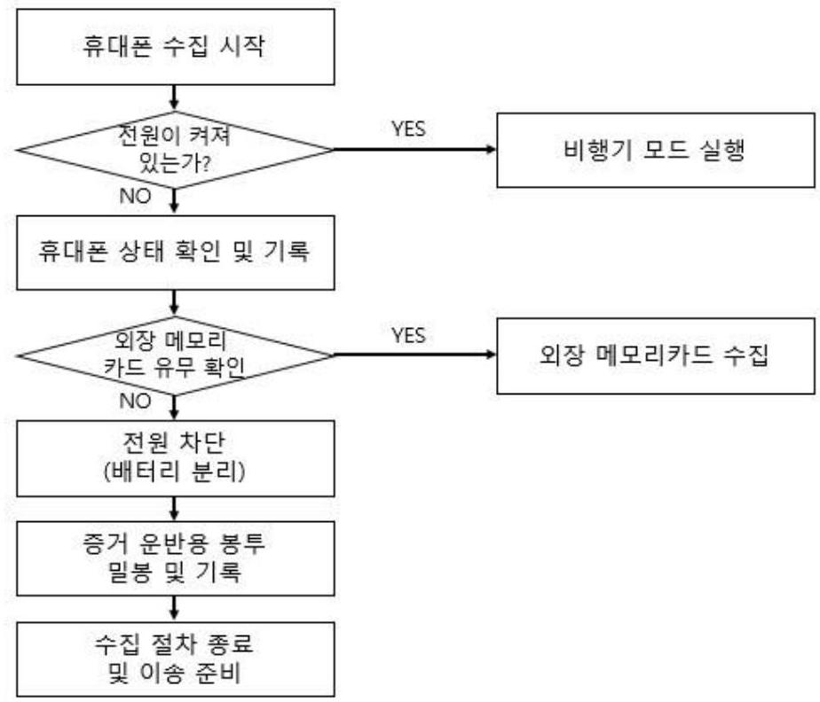
[그림 4] 국내 수사기관 모바일 증거 수집 절차

다른 디지털 기기와 달리 전원이 차단되지 않은 스마트폰은 무선 신호에 의해 데이터가 추가 및 변경될 가능성이 크다. 또한, 제조사 및 통신사에서 휴대폰 분실 시 원격으로 휴대폰을 잠금 상태로 만들거나 공장 초기화를 실시할 수 있는 기능을 제공하며 이러한 기능을 악용하여 증거를 훼손할 우려가 있기 때문에 모바일 기기 취급 시 반드시 비행기 모드로 전환 후 전원을 차단한 다음에 증거 운반용 봉투에 밀봉하도록 되어 있다. ${ }^{30)}$

수사에서 모바일 증거 수집 시 자주 사용되는 도구는 한컴위드 사의 MD-NEXT이다.31) MD-NEXT의 경우 논리(Logical), 풀 파일 시스템, 물리
30) 황태진, "모바일 포랜석을 利用한 메신저 誤據 比較 分析 研究", 성균관대학교 석사학위논문, 2018, pp.13-14.

(Physical) 획득으로 나누어져 있다. 논리(Logical) 획득은 모바일 기기의 제조사에 서 제공하는 백업 기능을 이용한 획득이다. Android는 AndroidLive, iOS는 iOSBackup이 이에 해당하며, 메시지, 연락처, 통화기록, 미디어, 앱 데이터 등을 획 득할 수 있다. 텔레그램과 같이 앱 개발사에서 스마트폰 백업 기능을 제공하지 않 도록 설정해 놓는다면 논리 획득으로는 데이터 획득이 불가능하다. 풀 파일 시스템 은 활성 영역에 있는 데이터 및 파일을 획득하는 기술이다. 아이폰의 탈옥이 풀 파 일 시스템으로 획득하는 대표적인 방법이다. 물리(Physical) 획득은 플래시 메모리 전체를 섹터 단위로 복사한다. 이러한 방법은 초창기 아이폰을 제외하고 iOS는 적 용할 수 없으며, Android 모바일 기기에만 적용이 가능하다. 물리 획득이 되어야만 비활성 영역에 해당하는 삭제된 파일까지 수집할 수 있다.[표 1]32)
[표 1] MD-NEXT 획득 종류

| 구분 |  | 논리(Logical) | 풀 파일 시스템 | 물리(Physical) |
| :--: | :--: | :--: | :--: | :--: |
| 획득 범위 |  | 파일시스템 상   파일 또는 앱 단위 | 파일시스템 상   파일 단위 | 플래시 메모리 전체를   섹터 단위로 복사 |
| 획득 방법 | Android | AndroidLive | Bootloader Pro2 | Bootloader   Bootloader Pro   Custom Image   JTAG, Chip-off 등 |
|  | iOS | iOSBackup | checkm8   Agent (Installed app)   Jailbreak   (checkra1n, unc0ver) | - |
|  |  |  | 논리   + 파일, 숨겨진 파일 | 풀 파일 시스템 데이터   + 삭제된 파일 |

[^0]
[^0]:    31) 한컴위드사의 MD-NEXT는 스마트폰, 드론, 스마트티비 등 모바일 기기의 데이터를 추출하여 분 석할 수 있도록 제공하는 포렌식 소프트웨어이다. 자세한 내용은 홈페이지 참조. (http://www.hancomgmd.com/ko/)
    32) 한컴위드 MD-NEXT 관련 자료 참조

나. 한국정보통신기술협회(TTA) 가이드라인

한국정보통신기술협회(Telecommunications Technology Association, TTA)의 '모바일 기기 포랜식 지침'은 모바일 기기의 특징과 대상 기기에 저장되어 있는 디 지털 증거를 정의하며, 이를 획득 및 분석하는 절차와 방법을 제시한다.33) TTA는 정보통신기술(ICT)의 표준 제정, 보급 및 시험인증 지원을 위해 설립된 법정 기관 이다. ${ }^{34)}$

TTA에서 제공하는 모바일 포랜식 가이드라인은 디지털 증거의 초기 대응 단계, 이송 및 보관 단계, 데이터 획득 단계, 데이터 분석 단계, 보고서 작성 단계의 5 가 지 절차로 이루어져 있다.[그림 6]

[^0]
[^0]:    33) 한국정보통신기술협회(TTA), "모바일 기기 포랜식 지침", 2020, p.1.
    34) 한국정보통신기술협회(TTA), https://www.tta.or.kr/(2021.06.22. 최종확인)

|  초기 대응 단계 | |
| --- | --- |
|  - 전원 켜질 여부 | |
|  - 증거 수집에 대한 소유자의 동의 여부 | |
|  - 비정상 상태 여부 | |
|  |
|  |
|  이송 및 보관 단계 | |
|  - 네트워크 연결 차단 | |
|  - 외부 충격, 청전기, 전자파 등의 영향으로부터 | |
|  안전한 용기에 보관 | |
|  - 관리연속성 유지를 위한 문서 작성 | |
|  |
|  |
|  데이터 획득 단계 | |
|  - 장지 정보 식별 | |
|  - 획득 방법 및 도구 선택 | |
|  - 휘발성 데이터 (물리메모리) | |
|  - 이동식 저장매체 | |
|  - 클라우드 기반 서비스 | |
|  |
|  |
|  데이터 분석 단계 | |
|  - 해시값 비교 | |
|  - 장치 종료 이전 상황 파악 | |
|  - 적절한 분석 도구 실행 | |
|  - 사용자의 행위 정보 파악 | |
|  - 세부내용 기록 | |
|  |
|  |
|  보고서 작성 단계 | |
|  - 보고서 작성 | |

[그림 5] TTA 모바일 포렌식 가이드라인

초기 대응 단계에서는 디지털 증거가 법적 효력을 가지는지 여부와 상관없이 사 건 관련 정보를 손실하지 않기 위해서는 현장을 최대한 보존하기 위한 초기 대응이 필요하다. 이 과정에서는 현장 확보, 모바일 기기의 위치 식별 및 수집, 상황에 대 한 문서화, 증거 처리에 대한 판단이 요구된다. 모바일 기기는 일반적으로 크기가 작고 개인이 직접 휴대하고 있을 경우가 많다. 이에 현장에서는 정확한 주변 관찰 을 통해 확보하거나 대상 기기를 휴대하고 있는 자(소유자, 소지자, 보관자 등)에게

양해를 구하고 상황에 대한 설명을 해야 한다. 사건과 관련된 모바일 기기를 식별 한 경우에는 상태에 따라 전원이 켜져 있는 경우와 전원이 꺼져있는 경우, 그리고 파손 또는 침수 등 비정상적인 상태로 구분하여 대응한다.35)

이송 및 보관 단계는 모바일 기기 내부의 디지털 증거를 보존하기 위해 내용이 변경되지 않도록 안전하게 관리하고 유지하기 위한 조치이다. 이 과정은 초기 대응 이후 모바일 기기를 다른 장소로 이동시키거나 일정 기간 동안 안전하게 보관되어 야 할 경우에 수행된다.36)

데이터 획득 단계는 모바일 기기(장착된 외부저장장치 포함)에서 이미징 등의 방식으로 데이터를 복제하는 과정이다. 현장에서 이 과정을 수행하면 운송 및 보관 중 배터리 소모, 손상 등으로 인한 데이터 손실을 최소화할 수 있고, 현장으로부터 장소를 이동하여 수행될 경우 필요한 환경을 추가적으로 만족시켜야 할 수 있으므 로 초기 대응에서 상황을 정확하게 식별하고 판단해야 하며 기본적으로 철저한 사 전 준비가 요구된다. 데이터 획득이 완료된 이후에는 소유자 등 참여자의 서명날인 을 받아야 한다. 모바일 기기를 소유자이 동의하에 물리적으로 수집한 경우에는 소 유자에게 다시 돌려주고 획득된 데이터를 대상으로 분석을 진행한다. 획득된 데이 터에 대해 해시값을 출력하여 참여자의 서명날인을 받아 복제원본으로서 법적 효력 (원본성)을 유지해야 한다. 소유자의 동의를 얻지 못한 경우에는 영장을 받아 압수 하여 조사해야 하며, 소유자의 생계에 피해를 주지 않도록 대체하여 사용할 수 있 는 모바일 기기를 제공한다.37)

데이터 분석 단계는 과학적인 방법으로 디지털 증거를 면밀히 살펴보고 법정에 제출할 수 있는 상태로 만드는 과정이다. 먼저 획득한 데이터를 복사하여 사본을 생성하고 디렉터리와 파일 정보를 쉽게 탐색할 수 있도록 볼륨(또는 파티션) 및 파

[^0]
[^0]:    35) 한국정보통신기술협회(TTA), "모바일 기기 포랜식 지침", 2020, p.12.
    36) 한국정보통신기술협회(TTA), "모바일 기기 포랜식 지침", 2020, p.17.
    37) 한국정보통신기술협회(TTA), "모바일 기기 포랜식 지침", 2020, p.18.

일시스템을 식별해야 한다. 국내에 출시되었던 대부분의 피처폰은 EFS를 사용하고 있으므로 EFS 가상 파일시스템을 생성하여 분석을 진행하고, 스마트폰은 운영체제 에 따라 주로 EXT나 APFS를 사용한다. 데이터 분석을 통해 사건과 직접 관련이 있는 증거를 파악할 수 있으며, 효율적인 분석을 수행하기 위해 사건과 관련된 정 보가 필요할 경우에는 사건을 담당하는 조사자에게 수단이나 단서를 제공할 수 있 다. ${ }^{38)}$

마지막 보고서 작성 단계는 사건 조사에서 수행된 모든 단계별 설명과 결론에 대해 세부적인 내용과 요약을 제공하는 과정이다. 보고서는 사실 관계를 중심으로 논리 정연하게 기술하며, 사진이나 화면을 캡처한 그림과 같은 자료를 포함시키고 쉽게 이해할 수 있는 용어를 사용하여 읽는 사람이 단계별로 수행된 내용을 명확하 게 인지할 수 있도록 문서화한다. 보고서는 객관적 사실과 구체적인 설명을 포함하 도록 하며, 작성자의 의견이 포함될 경우에는 사실과 구분될 수 있도록 작성해야 한다. ${ }^{39)}$
2. 해외 모바일 증거 수집 절차

미국 국립표준기술연구소(National Institute of Standards and Technology, NIST)는 스마트 전력망과 전자 건강기록에서부터 원자시계, 첨단 나노소재, 컴퓨터 칩 등 수많은 제품과 기술의 표준을 제공하고 있다.40) NIST에서 제공하는 'Guidelines on Mobile Device Forensics'는 모바일 포랜식 전문가가 포랜식 도구를 사용해 디지털 증거를 추출하여 수사에 활용하도록 하는 표준 절차를 제시하였

[^0]
[^0]:    38) 한국정보통신기술협회(TTA), "모바일 기기 포랜식 지침", 2020, p. 22.
    39) 한국정보통신기술협회(TTA), "모바일 기기 포랜식 지침", 2020, p. 23.
    40) NIST, https://www.nist.gov/ (2021.06.22. 최종확인)

다. 41)
NIST에서 제공하는 모바일 포랜식 가이드라인은 디지털 증거의 보존 단계, 획 득 단계, 검사 및 분석 단계, 보고 단계의 4 가지 절차로 이루어져 있다.[그림 5]

보존 단계는 기기 및 이동식 미디어에 있는 데이터의 내용을 변경하지 않고 안 전하게 유지하는 과정이다. 이는 디지털 포랜식의 첫 단계로, 전자 기반 증거의 검 색, 인식, 문서화 및 수집이 포함된다. 증거를 원래 상태로 보존하지 않으면 전체 조사가 위험해져 잠재적으로 중요한 사건 관련 정보를 잃을 수 있으므로 반드시 필 요한 절차이다.42)

획득 단계는 모바일 기기 및 관련 미디어에서 정보를 얻거나 이미징하는 과정이 다. 현장에서 획득을 수행하면 운반 및 보관 중 배터리 소모, 손상 등으로 인한 정 보 손실을 피할 수 있다는 장점이 있다.43) 이 단계가 증거 수집 절차에 해당하며, 모바일 기기 식별, 도구 선택 및 기대사항, 모바일 기기 메모리 획득, 연결 장비(메 모리 카드, 클라우드 서비스 등)의 순서로 이루어져 있다. 모바일 기기 메모리 획득 과정에는 플래시 메모리 즉, 비휘발성 메모리에 대한 내용만 존재하며 휘발성 메모 리 획득에 대한 언급은 나오지 않는다. 휘발성 메모리에 대한 내용이 가이드라인에 서 존재하기는 하지만 막상 데이터 획득 절차에는 휘발성 메모리가 포함되어 있지 않으며, Cellebrate UFED 등 외사 모바일 포랜식 도구에서도 휘발성 메모리 획득을 지원하지 않는다.

검사 및 분석 단계에서 검사 단계는 숨겨지거나 가려질 수 있는 디지털 증거를 찾아내는 과정이다. 결과는 확립된 과학 기반 방법을 적용하여 얻으며 출처와 잠재 적 중요성을 포함하여 데이터의 내용과 상태를 충분히 설명해야 한다. 분석 과정은 검사 결과에서 사건에 대한 직접적인 의미와 검증 가치를 확인한다는 점에서 검사

[^0]
[^0]:    41) 김영준$\cdot$김완주$\cdot$임계성, "무결성 향상을 위한 모바일 포랜식 모델 연구", 정보보호학회논문지 30(3), 2020, p. 419 .
    42) NIST, "Guidelines on Mobile Device Forensics", 2014, p.27.
    43) NIST, "Guidelines on Mobile Device Forensics", 2014, p.37.

와 다르다. 44)
보고 단계는 사건 조사에서 도출된 모든 단계와 결론에 대한 상세한 요약을 준 비하는 과정이다. 보고는 모든 조치 및 관찰에 대한 기록 유지, 테스트 및 검사 결 과 설명, 데이터에서 도출된 추론 설명 등에 따라 달라진다. 좋은 보고서는 견고한 문서, 설명, 사진 및 도구 생성 컨텐츠에 의존한다.45)

# Preservation 

- Securing \& Evaluating the Scene
- Documenting the Scene
- Isolation
- Packaging, Transporting, \& Storing Evidence
- On-Site Triage Processing
- Generic On-Site Decision Tree

## Acquisition

- Mobile Device Identification
- Tool Selection \& Expectations
- Mobile Device Memory Acquisition
- Tangential Equipment
- Cloud Based Services for Mobile Devices

## Examination \& Analysis

- Potential Evidence
- Applying Mobile Device Forensic Tools
- Call \& Subscriber Records

## Reporting

- Reporting
[그림 6] NIST 모바일 포렌식 가이드라인

[^0]
[^0]:    44) NIST, "Guidelines on Mobile Device Forensics", 2014, p.48.
    45) NIST, "Guidelines on Mobile Device Forensics", 2014, p.55.

# 제3절 모바일 데이터 획득 방법 

## 1. 하드웨어 기반 데이터 획득 기법

## 가. 칩 오프(Chip-Off)

메모리 칩 분리를 통한 데이터 추출 방법은 디지털기기의 보드에서 플래시 메모 리를 분리하여 데이터를 추출하는 방법이다. 스마트폰의 PCB(Printed Circuit Board)에서 플래시 메모리를 물리적으로 분해한 후 메모리에 저장된 데이터를 비트 단위로 복제하여 데이터를 획득한다.46) 메모리를 기관에서 탈착 중 손상된 핀을 복 원하는 리볼링 작업 후 전용 칩 리더기를 통해서 이미징 작업을 진행한다. 휴대폰 의 PCB에서 NAND 플래시 메모리를 분리하는 작업은 자동화 기계를 사용하며 분 리 시 약 $280^{\circ} \mathrm{C}$ 미만의 열을 가하여 메모리의 손상을 최소화하면서 분리하여야 한 다. 분리된 NAND Flash 메모리는 FlashPAK 장비를 이용해 데이터를 추출해낼 수 있다.47) 그러나 메모리칩 분해 과정에서 메모리에 저장된 데이터와 모바일 기기 자 체가 손상될 우려가 존재하며, 최근 출시된 안드로이드 스마트폰의 경우 디스크 암 호화(full disk encryption)이 기본 적용되는 추세이기 때문에 데이터를 로우 레벨로 복제하더라도 하드웨어 기반의 저장소에 보관되어 있는 복호화 키를 추출하기 어렵 다.48)

[^0]
[^0]:    46) 최재원$\cdot$김승주, "모바일 포랜식 증거 수집방안 연구: 제조사 백업 앱 기반 데이터 획득 기법", 정 보보호학회논문지 28(1), 2018, p. 97.
    47) 황태진, "모바일 포랜식을 利用한 메신저 說據 比較 分析 研究", 성균관대학교 석사학위논문, 2018, pp.13-14.
    48) 최재원$\cdot$김승주, "모바일 포랜식 증거 수집방안 연구: 제조사 백업 앱 기반 데이터 획득 기법", 정 보보호학회논문지 28(1), 2018, p. 97.

나. JTAG

JTAG(Joint Test Action Group) 인터페이스를 이용한 데이터 획득 기법은 스마 트폰의 PCB에 노출된 JTAG 인터페이스에 직접 물리적으로 연결하여 활성화된 포 트를 통해 플래시 메모리 데이터를 획득하는 방법이다.49) JTAG는 2010년 이전에 출시된 스마트폰에서 많이 사용된 데이터 추출 방식이고 그 이후 출시된 스마트폰 에는 펌웨어의 보안을 위해 secure-JTAG를 적용하여 출시되었다.50) JTAG의 작동 방식은 칩 내부에 boundary cell을 만들어 이것을 외부의 핀과 일대 일로 연결하여 Cell을 통해 프로세서의 동작을 인위적으로 조작하는 것이다. JTAG는 물리적 메모 리를 비트 단위로 접근하기 때문에 플래시 메모리에 저장되어 있는 삭제된 데이터 들도 복구할 수 있다. 또한, JTAG 방식을 이용해 하드웨어 및 소프트웨어의 손상 이 거의 없는 상태에서 데이터를 획득할 수 있다.51) JTAG 디버거는 CPU의 동작을 직접 내부에서 제어하므로 로컬버스에 문제가 있는 시스템에서도 메모리나 입출력 장치를 읽고 쓸 수 있는 기능을 이용하여 원인을 찾아낼 수도 있다.52) 하지만 최근 휴대폰들의 생명주기가 짧아지고 있고 제조사별로 JTAG 핀 맵이 다르거나 아예 핀 자체를 제거하여 출시하는 경우도 있어 다양한 휴대폰에 저장되어 있는 데이터 를 획득하기에는 어려움이 있다. 또한 secure-JTAG와 같이 추가적인 보안 기능이 적용된 경우 포트에는 물리적으로 연결이 가능하더라도 플래시 메모리에 접근이 불

[^0]
[^0]:    49) 김건우$\cdot$류재철, "JTAG을 이용한 휴대폰 포랜식 데이터 수집", 대한전자공학회 하계종합학술대회 31(1), 2008, pp.333-334.
    50) 황태진, "모바일 포랜식을 利用한 메신저 誤據 比較 分析 研究", 성균관대학교 석사학위논문, 2018, pp.13-14.
    51) 최재원$\cdot$김승주, "모바일 포랜식 증거 수집방안 연구: 제조사 백업 앱 기반 데이터 획득 기법", 정 보보호학회논문지 28(1), 2018, p.97.
    52) 이규안, "JTAG 방식을 이용한 모바일 포랜식 기법 연구", 숭실대학교 박사학위논문, 2009, p.69.

가하다는 한계가 존재한다. ${ }^{53)}$
2. 소프트웨어 기반 데이터 획득 기법

가. 논리적 획득

1) 백업 프로토콜

백업 프로토콜을 이용한 방식은 데이터를 암호화하는 과정 없이 PC로 이동시키 는 방법이며 백업은 안드로이드 및 iOS에서 모두 지원하는 기능이다. 안드로이드는 리눅스 커널 기반으로 동작하기 때문에 순정상태에서는 데이터를 이동시키기에 어 려움이 있다. 내부의 데이터에 접근하려면 안드로이드 SDK를 사용해 접근하여야 한다. 안드로이드 SDK에는 디버깅을 위한 ADB(Android Debug Bridge)가 포함되 어 있다. ADB는 안드로이드 앱에 대한 디버깅을 위해 사용되는 프로그램이다. 커 맨드라인을 통해 안드로이드에 앱을 설치, 실행, 삭제하거나 파일에 대한 복사 및 삭제 등이 가능하다. ${ }^{54)}$ 스마트폰의 백업 기능은 제조사마다 방식이 다양하며, ADB 프로토콜을 이용하여 백업을 진행할 수 있다.
iOS 운영체제에서 데이터를 추출하기 위해 사용되는 백업 프로토콜로는 iTunes 와 AppleMobileBackup이 있다. 백업된 데이터가 암호화되어 있는 경우에는 Elcomsoft Phone Password Breaker 툴을 이용해 복호화 해준다. 아이폰은 주기적 인 백업 기능을 내재하고 있으므로 백업 모드를 통해 대부분 데이터를 획득할 수

[^0]
[^0]:    53) Seung Jei Yang$\cdot$Jung Ho Choi$\cdot$Ki Bom Kim$\cdot$Taejoo Chang, "New acquisition method based on firmware update protocols for Android smartphones", Digital Investigation 14, 2015, p.S69.
    54) 안영건, "안드로이드 스마트폰 기반의 디지털 포렌식 도구개발", 숭실대학교 석사학위논문, 2011, p.8.

있다는 장점이 있다. ${ }^{55)}$
백업 방식은 관리자 권한이 없어도 백업을 진행할 수 있고, 직접적인 데이터의 훼손을 최소화할 수 있다는 장점이 있지만, 기기정보나 로그에 대한 기록은 추출이 불가능하고, 휴대폰 실행 상태에서 데이터를 수집할 시 데이터 파티션의 무결성을 훼손시킬 수 있다. 텔레그램 등 일부 앱은 백업을 지원하지 않는다는 단점이 존재 한다. ${ }^{56)}$

# 2) 컨텐트 제공자(Content Provider) 

Content Provider란 안드로이드에서 제공하는 애플리케이션 정보공유 모듈이다. 애플리케이션은 Content Provider를 통해 다른 앱에 데이터를 저장하거나 가져오는 작업을 할 수 있다. 또한 각 앱은 자신의 Content Provider를 작성하여 외부에 공개 할 수 있다. 안드로이드에 기본 설치된 앱의 경우 외부에 Native Content Provider 를 공개하고 있기 때문에 이를 이용하여 연락처, 통화기록, 메시지, 브라우저 정보, 알람 정보, 미디어 스토어 등의 데이터를 획득할 수 있다. 안드로이드 애플리케이션 이 Content Provider에 접근하기 위해서는 URI(Uniform Resource Identifier)를 통 해 접근해야 한다. URI는 Content Provider를 통해 제공되는 데이터를 가리키며 안 드로이드에 기본적으로 설치되어 있는 앱은 자신의 데이터에 접근할 수 있도록 URI를 공개한다. 디지털 포랜식 관점에서 중요한 메시지, 연락처, 통화기록, 일정 등의 데이터는 Content Provider를 활용하면 획득이 가능하다. 그러나 Content Provider 방식은 앱에서 제공하는 인터페이스를 이용하여 데이터를 획득하는 방식

[^0]
[^0]:    55) 황태진, "모바일 포랜식을 利用한 메신저 說據 比較 分析 研究", 성균관대학교 석사학위논문, 2018, pp.13-14.
    56) 황태진, "모바일 포랜식을 利用한 메신저 說據 比較 分析 研究", 성균관대학교 석사학위논문, 2018, pp.13-14.

으로 직접 데이터가 저장된 파일에 접근할 수 없어 삭제된 데이터에 대한 획득은 불가능하다. 57588

# 나. 물리적 획득 

1) 최상위 권한 획득

최상위 권한 획득은 운영체제상에서 루트 권한을 획득하여 해당 기기의 데이터 를 추출할 때 제약을 받지 않도록 기기를 설정하는 방식이다. 안드로이드에서는 루 팅, iOS에서는 탈옥이라고 한다. 루팅 기법을 사용하면 안드로이드 운영체제의 사용 자가 슈퍼 유저의 권한을 얻어 안드로이드 운영체제 내에서 지원하지 않는 기능들 을 추가하거나 기존에 지원하던 기능을 삭제할 수 있다. 안드로이드 기기는 iOS와 다르게 다른 추가 방법 없이도 구글 플레이에서 제공하는 프로그램만으로 작동시킬 수 있는 차이점이 있다. 루팅의 방법으로는 ADB 상에서 쉘 루트 권한을 획득해 시 스템에 접근하는 방식과 Recovery 부팅모드로 진입하여 원본 커널을 루팅 커널로 변경하는 방식이 있다. 루팅을 할 경우 전체 메모리를 덤프하는 방식으로 복제 이 미지를 생성할 수 있지만, 이 방법은 루팅을 하는 것이 반드시 선행되어야 하며 최 신 안드로이드 OS는 루팅을 하기 힘들어지고 있으며, 루팅이 가능한 경우에도 루팅 과정에서 메모리에 저장된 증거물의 무결성이 손상될 위험이 존재한다. 59 ) iOS 탈옥 은 운영체제 내에서 제한을 풀어 사용자가 시스템 루트에 접근할 수 있게 함으로써

[^0]
[^0]:    57) 오정훈$\cdot$이상진, "안드로이드 스마트폰 포랜식 분석 방법에 관한 연구", 디지털포랜식연구 (9), 2012, pp.49-51.
    58) 황태진, "모바일 포랜식을 利用한 메신저 說據 比較 分析 研究", 성균관대학교 석사학위논문, 2018, pp.13-14.
    59) 최재원$\cdot$김승주, "모바일 포랜식 증거 수집방안 연구: 제조사 백업 앱 기반 데이터 획득 기법", 정 보보호학회논문지 28(1), 2018, p.99.

서명되지 않은 코드를 실행할 수 있도록 하는 과정이다. 우선 Jailbreak를 실행하고 $3^{\text {rd }}$ Party 애플리케이션의 설치 과정에 따른다. FireWire, SQLite를 이용하여 메모 리 전체 복사가 가능하다는 장점이 있지만, 무결성 원칙을 벗어나기 때문에 법적 효력이 없어진다는 단점이 존재한다. 60 )
2) 부트로더(Bootloader) 취약점을 이용한 획득

Bootloader는 안드로이드 OS가 실행되기 전에 가장 먼저 실행되는 프로그램이 다.61) 부팅할 때 사용되는 Bootloader의 취약점을 이용하여 데이터를 획득하는 방식 이며, Bootloader 영역을 변경하여 데이터 획득에 필요한 프로그램을 삽입하게 되어 또로 관리자 권한을 필요로 하지 않는다. Bootloader 취약점에 기반한 데이터 획득 기법은 전체 메모리에 대한 물리적 이미정이 가능한 기법이며, 한컴위드의 MD-NEXT, Cellebrite UFED와 같은 상용 모바일 포랜식 도구에서도 제공하고 있 다. Bootloader 취약점을 이용한 획득은 스마트폰의 메모리를 변경하지 않고 비활성 영역의 데이터도 수집이 가능하다는 장점이 있다. 또한 획득 방식이 비교적 간단하 고 획득 속도가 JTAG 방식 등에 비해 빠르다.62) 그러나 신규로 스마트폰이 출시될 경우 최신 안드로이드와 최신 펌웨어 버전을 적용하여 기존에 존재하던 취약점들은 제거되는 경우가 많아 동일한 방법으로는 데이터 획득이 불가능하다. 63)

[^0]
[^0]:    60) 황태진, "모바일 포랜식을 利用한 메신저 誼據 比較 分析 研究", 성균관대학교 석사학위논문, 2018, pp.13-14.
    61) Javed Ahmad Shaheen-Mian Ali Asghar-Abid Hussain, "Android OS with its Architecture and Android Application with Dalvik Virtual Machine Review", International Journal of Multimedia and Ubiquitous Engineering 12(7), 2017, p. 27.
    62) 어수웅$\cdot$조우연$\cdot$이석준$\cdot$손태석, "모바일 포랜식 증거능력 확보 방안 연구", 정보보호학회논문지 26(1), 2016, pp.140-141.
    63) 황태진, "모바일 포랜식을 利用한 메신저 誼據 比較 分析 研究", 성균관대학교 석사학위논문, 2018, pp.13-14.

# 제4절 시사점 

기존 디지털 포랜식에서 라이브 포랜식은 기존의 디스크 포랜식으로는 획득할 수 없는 네트워크 정보, 실행 중인 프로세스, 열려있는 파일, 커널 상태 등의 정보 들을 수집 및 분석할 수 있다. 그리고 이러한 데이터의 크기가 디스크에 담긴 데이 터에 비해 상대적으로 작기 때문에 수집하는데 적은 시간이 소요된다. 또한 웹, 데 이터베이스, 메일 서버 시스템 등의 침해사고 대응 시에도 사업 연속성을 보장하기 때문에 비용적인 측면에서도 장점을 가진다.64) 라이브 포랜식의 중요성에 대한 인 식이 증대되었지만 현재 모바일 기기 수사 시 휘발성 데이터를 획득하지 않고 있 다. 모바일 기기를 수집 및 분석할 때 모바일 포랜식 도구에 의존하고 있는데 현재 휘발성 메모리를 수집 및 분석하는 모바일 포랜식 도구가 전무하기 때문이다.

NIST에서 제공하는 모바일 포랜식 가이드라인과 수사기관의 증거 수집 절차에 는 휘발성 데이터에 대한 획득 절차를 명시하지 않고 있다. 국내의 TTA 모바일 포 랜식 가이드라인에는 증거 수집 시 휘발성 데이터를 획득하도록 되어있지만 실제로 수집할 수 있는 도구가 존재하지 않기 때문에 수사기관에서도 휘발성 데이터 획득 은 제외하고 수집하고 있다. 또한, 지금까지의 모바일 기기의 RAM 용량이 작았기 때문에 의미 있는 데이터가 저장되어 있을 가능성이 낮다고 여겨져 왔다. 그러나 최근 중국에서 RAM을 확장할 수 있는 스마트폰을 개발하였고, 머지않아 스마트폰 에 대한 RAM 용량도 크게 증가할 것이라 예상된다. 이처럼 PC에 대한 라이브 포 랜식 절차는 존재하지만 모바일 기기에 대한 라이브 포랜식 절차에 대한 인식은 아 직 부족한 상태이며 라이브 포랜식의 필요성은 점점 더 증가하고 있다.

[^0]
[^0]:    64) 한지성$\cdot$이상진, "라이브 포랜식을 위한 윈도우즈 물리 메모리 분석 도구", 정보보호학회논문지 21(2), 2011, pp.71-72.

라이브 포랜식을 진행할 때 중요한 점은 획득 대상인 모바일 기기의 데이터를 최대한 보존하는 것이다. 휘발성 데이터를 획득하기 전에 모바일 기기에서 다른 행 위를 진행할 때마다 새로 실행된 프로세스가 물리 메모리에 로드되면서 기존의 메 모리 영역이 덮어 쓰여지거나 이미 실행 중인 프로세스가 페이지 파일로 페이지아 웃 되는 등의 상당한 시스템 변화가 일어난다. 즉, 라이브 포랜식은 조사자의 조사 행위를 최소화 하는 것이 매우 중요하다.65)
65) 한지성$\cdot$이상진, "라이브 포랜식을 위한 윈도우즈 물리 메모리 분석 도구", 정보보호학회논문지 21(2), 2011, p. 72

# 제3장 모바일 기기의 휘발성 데이터 분석 

## 제 1 절 선행연구

## 1. Google Talk 메신저

THING, Vrizlynn LL 외 2 명의 논문에서는 다양한 시나리오를 예상한 후, 메모 리 포랜식을 이용하여 모바일 기기를 실시간으로 분석하는 자동 시스템을 제안하였 다.66) Google Talk 메신저를 통해 모바일 기기와 PC에서 송-수신한 메시지를 추출 한 후, 메모리 덤프 파일을 분석하여 메시지를 취득하는 연구를 진행하였다. 연구를 통해 발신 메시지의 취득률은 $100 \%$, 수신 메시지는 시나리오별로 $75.6 \%$ 에서 $100 \%$ 까지 다양한 분포를 보였다. 하지만 2010년 논문으로 빠르게 발전하고 있는 현재의 스마트폰 기술에 적용하기는 다소 무리가 있으며 Google Talk의 경우 국내에서 잘 사용하지 않는 애플리케이션이라 실제 수사에 도움되기는 어렵다는 한계가 있다.

## 2. Wechat 메신저

Zhou Fan 외 3 명의 논문에서는 중국에서 가장 많이 사용하는 메신저인 Wechat

[^0]
[^0]:    66) THING, Vrizlynn LL-NG, Kian-Yong-CHANG, Ee-Chien, "Live memory forensics of mobile phones", digital investigation 7, 2010, S74-S82.

메신저를 대상으로 Wechat 어플리케이션이 사용하는 메모리 영역을 덥프하여 저장 된 메시지뿐만 아니라 이미 삭제된 메시지, 암호화된 메시지마저 평문 형태로 추출 할 수 있음을 보였다. ${ }^{67)}$ 국내에서도 각종 범죄에 Wechat 메신저가 많이 쓰이고 있 으며 삭제된 메시지나 암호화된 메시지까지 평문으로 추출할 수 있다는 점에서 큰 의미가 있다. 또한 2019년 발생된 N번방 사건 등 국내 각종 범죄에 자주 등장하는 보안 메신저의 암호화된 메시지도 추출 가능할 수 있다는 기대를 할 수 있다.

# 3. 모바일 웹브라우저 사생활 보호 모드 

박진성 외 2 명의 논문에서는 모바일 웹브라우저 4종(Chrome, Samsung Browser, Whale, Firefox)을 대상으로 모바일 웹 브라우저의 사생활 보호 모드에서 메모리 포렌식을 시도하여 사용자 행위를 유추할 수 있는 데이터를 획득하였다.68) 실험을 통해 검색 엔진에 따른 검색 사이트의 URL을 분석하여 검색어 및 방문 사 이트를 찾기 위한 키워드를 추출하였으며, 파일 다운로드 여부를 확인하고 저장된 경로를 추출하였다. 모바일 웹브라우저 사생활 보호 모드의 경우 캐시, 쿠키, 히스 토리 등이 모바일 기기에 저장되지 않아 상용 도구에서 분석이 되지 않는다는 문제 점을 해소해준다는 점에서 앞의 두 연구와 차이가 있다. 웹브라우저 사생활 보호 모드가 생겨나면서 사용자의 사생활 침해 문제는 해결이 되었으나, 범죄에 사용할 경우 그 행위 증명이 어렵다는 단점이 있다. 이 논문은 모바일 포렌식 상용 도구로 는 분석할 수 없는 부분을 휘발성 메모리에서 획득함으로서 휘발성 메모리 분석의 필요성을 제시하였다는 점에서 의미가 있다.

[^0]
[^0]:    67) F. Zhou$\cdot$Y. Yang$\cdot$Z. Ding$\cdot$G. Sun, "Dump and analysis of android volatile memory on wechat." IEEE International Conference on Communications (ICC), 2015, pp.7151-7156.
    68) 박진성$\cdot$서승희$\cdot$이창훈, "메모리 포렌식 관점에서의 모바일 브라우저 사생활 보호 모드 분석", 한국 디지털콘텐츠학회논문지 21(4), 2020, pp.781-791.

# 제2절 실험환경 및 방법 

## 1. 실험환경

모바일 휘발성 메모리를 분석하기 위해 모바일 기기는 Galaxy S4 기기를 사용 하였고, Windows 1064 비트 운영체제의 PC를 사용하였다.[그림 7]

| Windows 버전 |  |
| :--: | :--: |
| Windows 10 Home |  |
| (c) 2019 Microsoft Corporation. All rights reserved. |  |
| 시스템 |  |
| 프로세서: | Intel(R) Core(TM) i7-4500U CPU @ 1.80GHz 2.40 GHz |
| 설치된 메모리(RAM): | 8.00 GB |
| 시스템 종류: | 64 비트 운영 체제, x64 기반 프로세서 |
| 팬 및 터치: | 이 디스플레이에 사용할 수 있는 팬 또는 터치식 입력이 없습니다. |

[그림 7] PC 시스템 정보

또한, 모바일 메모리 분석을 위하여 다양한 포랜식 도구가 사용되었다. Fridump 는 Frida-tools라는 패키지에 포함되어 있는 도구로, Frida는 Python을 기반으로 동 작하며 Windows나 Linux, Mac OS 등을 지원한다. Android OS의 경우 Linux를 기반으로 하는 OS이므로 해당 도구로 분석이 가능하며, Mac OS를 기반으로 하는 iOS도 분석이 가능하다. 한컴위드 사의 모바일 데이터 수집 및 분석 도구인 MD-NEXT, MD-RED는 실제 수사에 빈번히 사용되는 모바일 포랜식 도구이다. 해 당 도구로 수집된 데이터와 Frida로 수집한 메모리 데이터를 비교하였다.[표 2]

[표 2] 실험에 사용된 포랜식 도구 목록

| 번호 | Name | Version | 기능 |
| :--: | :--: | :--: | :--: |
| 1 | Fridump | 0.1 | 메모리 덤프(PC) |
| 2 | Frida-server | 14.2 .13 | 메모리 덤프(모바일) |
| 3 | MD-NEXT | $1.89 .21$ | 모바일 데이터 수집 |
| 4 | MD-RED | 3.7 .30 | 모바일 데이터 분석 |

# 2. 실험방법 

상용 도구에서 분석하기 어려운 상황을 실험해보고 동일한 환경에서 휘발성 데 이터를 분석하였을 때의 결과를 도출하였다. 전통적인 디지털 포랜식에서 클립보드 가 대표적인 휘발성 데이터임을 착안해 모바일 기기의 클립보드, 국내에서 가장 많 이 사용되는 카카오톡, 마지막으로 안티포랜식 앱을 사용하였을 때 어떻게 분석이 되는지 실험하였다.

휘발성 데이터는 Fridump 및 Frida-server 도구를 통해 모바일 기기의 메모리를 획득한다. 먼저 Frida-server 파일을 모바일 기기에 옮긴 후 Frida-server 프로세스 를 실행한다. 그 후 PC에서 Fridump 명령어로 메모리 덤프한다. 메모리는 애플리케 이션 단위로 수집하며, 선택이 가능하다.[그림 8] 메모리 덤프 파일을 수집 후 파일 내 키워드 검색을 통해 메모리에 저장된 데이터를 확인하였다.[그림 9]

| N111 | 0x9a0fb000_dump.data |
| :--: | :--: |
| 4850 | 0x9aff000_dump.data |
| 5074 | 0x9a2fb000_dump.data |
| 52146 | 0x9a2fc000_dump.data |
| 5618 | 0x9a2fd000_dump.data |
| 5763 | 0x9a2fe000_dump.data |
| 5764 | 0x9a2fe000_dump.data |
| 7700 | 0x9a2fe000_dump.data |
| 8931 | 0x9a2ff000_dump.data |
| 7936 | 0x9a9fe000_dump.data |
| 5710 | 0x9a80b000_dump.data |
| 5475 | 0x9a80c000_dump.data |
| 4296 | [ 0x9a80c000_dump.data |
| 1994 | [그림 8] Fridadump 화면 |

[그림 9] dump 파일

# 제3절 상용 도구 이용 모바일 데이터 수집 실험 

## 1. 클립보드

클립보드는 애플리케이션 간에 전달할 데이터를 일시적으로 저장하는 역할을 한 다.69) 일반적으로 PC에서 클립보드는 휘발성 데이터로 RAM에 저장되었다가 전원 종료 시 삭제된다. 그러나 모바일 기기에서 클립보드는 종료하여도 삭제되지 않는 비휘발성 메모리에 저장되며, 클립보드 화면에서 확인이 가능하다.

또한, 모바일 기기에서 스크린샷 기능을 사용할 때 자동으로 클립보드에 저장되 는데 이는 스크린샷을 찍은 후 해당 사진을 삭제하더라도 클립보드에는 그대로 남 아있게 된다. MD-RED를 이용하여 클립보드에 저장된 데이터를 확인할 수 있다. [그림 10]

| 클립보드 | 활성 | 클립보드 | 애플 : Abfar   c1000xm1/9080098733429_59_29/   Screenshot_2021-03-31-09-14-27   pmg |  | 생성 일시 : 2021-03-31 09:34:29 |  |
| :--: | :--: | :--: | :--: | :--: | :--: | :--: |
| 클립보드 | 활성 | 클립보드 | 목록 : 스크린샷 |  | 생성 일시 : 2021-03-31 09:34:29 | 파일 검토 :   c1000xm1/90800987   33429_59_29/   Screenshot_2021-03   $-31-09-34-27$ png |
| 클립보드 | 활성 | 클립보드 | 목록 : 스크린샷 |  | 생성 일시 : 2021-03-31 09:34:29 | 파일 검토 :   c1000xm1/90800987   33429_59_29/   Screenshot_2021-03   $-31-09-34-27$ png_3   hum.jpg |

[그림 10] 상용도구에서의 클립보드
69) 여세환$\cdot$김정선, "PC와 스마트폰 사이의 데이터 전송을 위한 클립보드 공유", 한국정보과학회 학술 발표논문집 38(1D), 2011, p. 79.

# 2. 삭제된 카카오톡 대화 

카카오톡70)은 2 개의 메시지 삭제 기능을 제공한다.[그림 11] '모든 대화 상대에 게서 삭제' 기능은 메시지 발송 후 5 분 안에만 실행 가능하며, 삭제 시 해당 대화방 에 있는 모든 대화 상대에게서 메시지가 삭제된다. 그러나 "삭제된 메시지입니다." 라는 문구가 나오며 메시지가 보내졌다는 사실은 모든 대화 상대가 알 수 있다.[그 림 12] 이 경우 MD-RED 도구에서는 삭제된 메시지 복구가 가능하다.[그림 13]
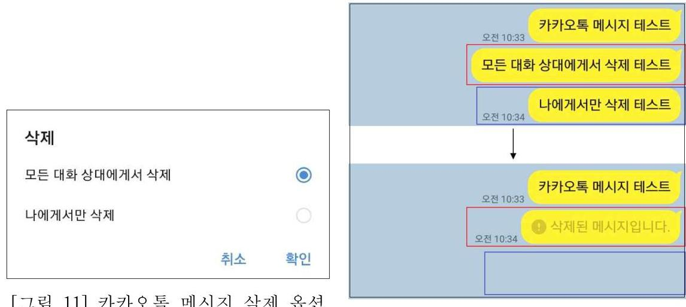
[그림 12] 카카오톡 메시지 삭제 테스트
[그림 13] 상용도구에서 카카오톡 모든 대화 상대에게서 삭제 확인

[^0]
[^0]:    70) 카카오톡은 2020년 기준 대한민국 모바일 앱 사용자 1위이며, 월간 사용자 수 3743 만 2014 명으로 대한민국 인구의 $72 \%$ 수준에 달하는 대부분의 스마트폰 사용자가 사용하는 보편적인 앱이다.(모 바일인덱스, "2019년도 총결산 대한민국 모바일 앱 사용자 순위 TOP 10")

'나에게서만 삭제' 기능은 다른 대화 상대에게는 메시지가 남아있지만 자신의 카 카오톡 대화방에서만 메시지를 삭제하는 기능이다. 해당 옵션으로 메시지를 삭제할 경우 메시지가 대화방에서 사라지며, 삭제되었다는 문구도 나오지 않으므로 해당 메시지가 있었는지 여부를 해당 스마트폰만으로는 알 수가 없다. 또한, MD-RED 도구에서도 카카오톡 DB에 저장된 메시지가 '00000000'으로 덮어버지기 때문에 확 인이 불가능하다.[그림 14] 메시지가 온 사실만 확인할 수 있으며, 이 경우 해당 대 화방에 있는 다른 사람의 카카오톡에서만 확인이 가능하다.
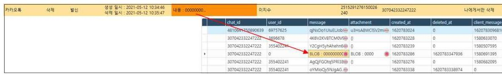
[그림 14] 상용도구에서 카카오톡 나에게서만 삭제 확인

# 3. 메신저 채팅 내역 

카카오톡, 텔레그램 비밀대화, Wire 등 일부 메신저 애플리케이션은 대화 내용을 기기에 저장할 때 암호화하여 저장한다. 모바일 포렌식 분석 도구인 MD-RED에서 는 암호화된 메시지를 복호화하여 보여주는데, 메신저 앱의 개발사에서 주기적으로 암호화 키를 변경하고 있고 모바일 포렌식 분석 도구 사에서 해당 키를 알아내어 도구 업데이트를 배포하는 데까지 시간이 소요된다는 단점이 있다.

일반적으로 스마트폰에 설치된 앱 업데이트를 자동으로 설정해 놓기 때문에 바 뀐 암호화키는 사용자 앱에 자동 적용되는데 반해, 모바일 포렌식 분석 도구에서 새로운 업데이트가 배포되면 도구 사용 시 수동으로 업데이트를 진행하여야 한다.

모바일 특성 상 도구에 의존하는 성향이 강하기 때문에 도구에서 복호화를 해주지 못하면 메시지 내용을 전혀 알 수 없다는 문제점이 있다.

따라서 메신저 앱의 암호화 키가 변경될 시 상용도구에 해당 키가 적용되지 않 거나, 상용도구 업데이트를 진행하지 않을 시 암호화된 메시지가 출력되어 내용을 확인하지 못하는 경우가 발생할 수 있다.[그림 15]

| 카카오톡 | 활성 | 할인 | 생성 일시 : 2020-05-20 11:40:27 | 내용 : us:t53419en03e794ea2c42p $=$ | Cg7pmg18679ee593d429cd6gx $=$ | 2256579406855988208 |
| :--: | :--: | :--: | :--: | :--: | :--: | :--: |

[그림 15] 상용도구에서 메신저 앱 변경된 암호화 키 적용 전 출처: 한컴위드
4. 삭제된 앱 흔적

모바일 기기 압수 전 사용하던 앱을 삭제할 경우 앱에 관련한 데이터 대부분이 활성 데이터에서 삭제가 된다. 모바일 분석 도구에서 비활성 영역을 분석하여 삭제 된 앱 데이터까지 복구가 가능하지만, 분석 실행 시 비활성 영역까지 분석할 앱을 선택해야만 분석이 가능하다. 그러나 카카오톡과 같이 자주 사용하는 앱의 경우 설 치되어 있지 않으면 삭제되었다 의심할 수 있지만, 자주 사용하지 않는 앱을 범죄 에 사용하고 해당 앱을 삭제할 경우 분석이 필요하다는 것을 수사관이 바로 알기가 어렵다.
[그림 16]은 디스코드 앱을 사용하여 대화를 한 후 삭제하고, MD-RED를 통하 여 분석을 진행할 때의 화면이다. 삭제된 디스코드 앱에 대해서 기본적으로 분석 대상에서 제외가 되어 있으며, 이 때 모든 버전 복원의 옵션을 클릭해야만 삭제된 앱에 대해서도 비활성 영역 분석이 가능하다. 우측의 설치되어있는 카카오톡 앱과 비교하였을 때 기본 옵션에서 차이가 있다. 압수 전 피의자가 고의로 범죄에 사용

한 앱을 삭제하였다면 수사관이 어떠한 앱을 사용하였는지 알기 어렵고, 분석 시 해당 범죄에 사용된 앱이 분석이 되지 않아 범죄 사실 입증이 힘들어 질 수 있다.
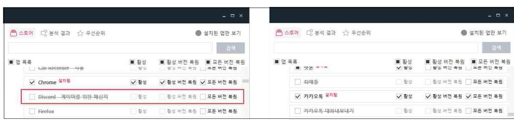
[그림 16] 상용도구에서의 삭제된 앱 분석 옵션

모든 버전 복원 옵션을 모든 앱에 대하여 선택하고 분석할 시에는 분석 시간이 굉장히 오래 소요될 뿐 아니라 의미 없는 쓰레기 값이 나올 확률도 높아진다. 또한, 본 실험에서 모든 버전 복원을 선택하고 분석하였을 때에도 디스코드 대화 내용이 복구되지 않은 점 등을 고려하면 전체 앱에 대하여 모든 버전 복원을 진행하여도 분석 시간만 길어질 뿐 의미있는 데이터가 나오지 않을 수 있다.

# 5. 안티 포랜식 앱 흔적 

디지털 포랜식이 일반 대중에게도 알려지게 되면서 디지털 포랜식을 피할 수 있 는 안티 포랜식 방법 및 프로그램이 확산되고 있다. 데이터 완전삭제 앱, 은닉 앱, 브라우저 시크릿 모드 등 다양한 모바일 안티 포랜식 방법이 존재하며 많은 범죄자 들도 자신의 범죄 행위를 숨기기 위해 이러한 안티 포랜식 앱을 사용한다.

데이터 완전삭제 앱이나 은닉 앱의 경우 많은 종류의 앱들이 존재한다. 은닉 앱 의 경우 모바일 포랜식 분석 도구로 분석이 가능하다. 단, 모바일 포랜식 분석 도구

사에서 분석을 제공하는 앱에 한한다. 그러나 데이터 완전삭제 앱의 경우 데이터를 삭제 후 비활성 영역에 있는 데이터를 대량의 의미 없는 데이터로 덮어씀으로서 복 구가 불가능하게 한다.

데이터 완전삭제 앱을 실행 후 MD-RED 도구로 분석 시 [그림 17]과 같이 안티 포랜식 앱의 존재를 알려준다. 그러나 해당 앱을 사용하여 삭제된 데이터는 비활성 영역에서도 덮어쓰기가 되어 복구할 수 없기 때문에 이러한 앱을 통해 데이터를 삭 제하였음을 유추할 수 있을 뿐, 내용 확인은 불가능하다.
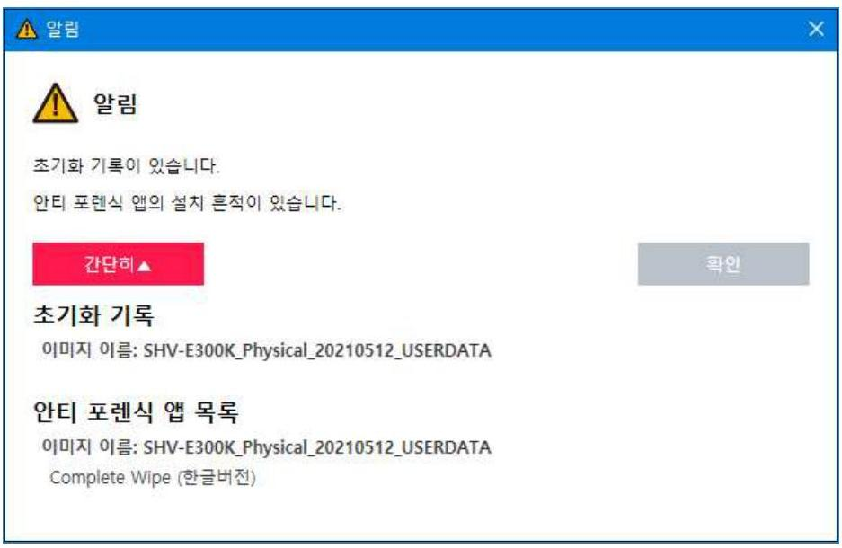
[그림 17] 상용도구에서의 안티 포랜식 앱 흔적

# 제4절 모바일 기기에서 휘발성 데이터 수집 실험 

## 1. 삭제된 카카오톡 대화

앞서 카카오톡 '나에게서만 삭제' 기능을 사용하여 메시지를 삭제하게 되면 데이 터베이스에 저장된 메시지가 삭제가 되는 것이 아니라 0 으로 덮어써지기 때문에 상 용 도구에서 복구가 어려운 것을 확인하였다. 이러한 삭제된 카카오톡 메시지에 대 하여 휘발성 메모리를 확인하기 위해 Fridump 툴을 사용하여 실험하였다.

휘발성 메모리에서 카카오톡 앱에 대한 메모리 덤프를 하면 여러 파일로 나눠져 저장된다.[그림 18] 이 때, Fridump 명령어에 -s 옵션을 추가할 경우 메모리에서 문자열만 따로 저장되기 때문에 모든 파일을 일일이 확인하지 않아도 원하는 문자 열이 메모리에 저장되어 있는지 확인할 수 있었다.[그림 19] 단, 한글은 인코딩 문 자열로 보이기 때문에 디코딩하여 확인해야 한다.

| 0x9a0fb000_dump.data | 2021-05-14 오후 5:28 | DATA 파일 | 1,032KB |
| :--: | :--: | :--: | :--: |
| 0x9a1ff000_dump.data | 2021-05-14 오후 5:28 | DATA 파일 | 1,008KB |
| 0x9a2fb000_dump.data | 2021-05-14 오후 5:28 | DATA 파일 | 4KB |
| 0x9a2fc000_dump.data | 2021-05-14 오후 5:28 | DATA 파일 | 4KB |
| 0x9a2fd000_dump.data | 2021-05-14 오후 5:28 | DATA 파일 | 4KB |
| 0x9a2fe000_dump.data | 2021-05-14 오후 5:28 | DATA 파일 | 4KB |
| 0x9a2ff000_dump.data | 2021-05-14 오후 5:28 | DATA 파일 | 4KB |
| 0x9a9fe000_dump.data | 2021-05-14 오후 5:28 | DATA 파일 | 1,032KB |
| 0x9a90b000_dump.data | 2021-05-14 오후 5:28 | DATA 파일 | 4KB |
| 0x9a80c000_dump.data | 2021-05-14 오후 5:28 | DATA 파일 | 4KB |

[그림 18] 휘발성 메모리 덤프 파일

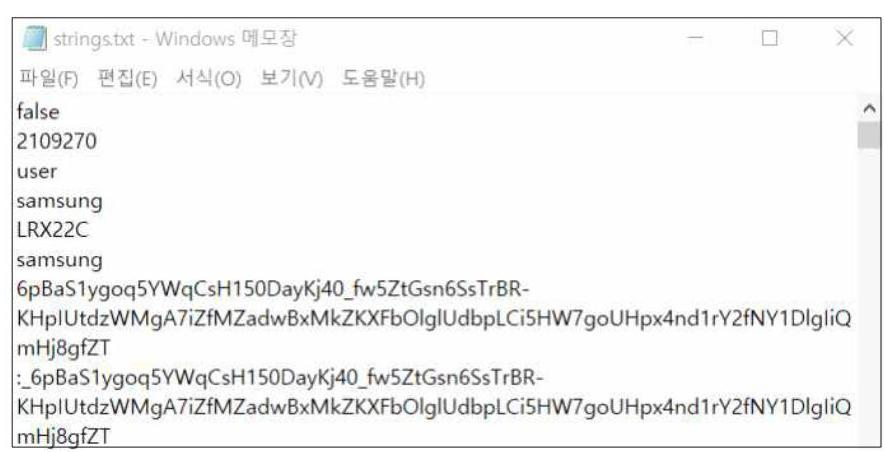
[그림 19] 휘발성 메모리 덤프 파일 내 문자열

실험 결과 휘발성 메모리의 경우 데이터베이스 형태로 저장되는 것이 아니므로 기존 메시지가 남아 있었다.[그림 21] 삭제되기 전 메시지가 RAM에 저장된 상태, 즉 삭제 후 스마트폰을 종료하거나 RAM이 다른 내용으로 덮어써질 만큼 다량의 데이터가 저장되지 않는다면 상용 도구에서 복구가 불가능한 삭제된 메시지라도 내 용을 확인할 수 있다.
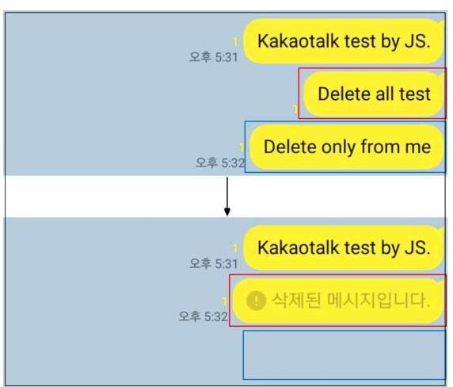
[그림 20] 카카오톡 메시지 삭제 테스트

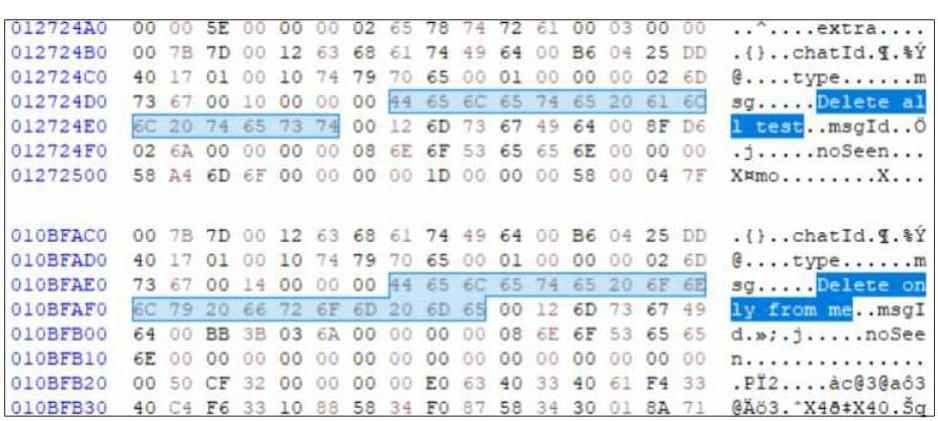
[그림 21] 휘발성 메모리에서의 삭제된 카카오톡 메시지

# 2. 메신저 채팅 내역 

암호화된 메신저 채팅 내역에 대하여 상용 도구에서 메신저의 암호화 키를 적용 하기 전이거나, 상용 도구를 업데이트 하지 않으면 암호화된 메시지가 보이지 않음 을 확인하였다.

사용자가 메신저 앱을 실행하여 채팅방에 들어가게 되면 기기에서 암호화된 메 시지를 복호화하여 사용자가 읽을 수 있도록 보여주는데, 휘발성 메모리에는 이러 한 복호화된 메시지가 저장되게 된다. 따라서 상용 도구에서 복호화를 해주지 못하 더라도 휘발성 메모리 내부에는 평문으로 대화 내용이 저장된다. 자주 사용하는 메 신저인 카카오톡의 경우에도 삭제된 메시지 뿐 아니라 일반 메시지 또한 복구가 가 능하다.[그림 22][그림 23]

[그림 22] 카카오톡 채팅 내역

| 01090770 | 00 | 00 | 00 | 00 | 80 | 1E | C9 | 33 | 40 | 06 | C9 | 33 | C0 | 07 | C9 | 33 |  |
| :--: | :--: | :--: | :--: | :--: | :--: | :--: | :--: | :--: | :--: | :--: | :--: | :--: | :--: | :--: | :--: | :--: | :--: |
| 01090780 | 00 | 00 | 00 | 00 | 00 | 00 | 00 | 00 | 00 | 00 | 00 | 00 | 00 | 00 | 00 | 00 |  |
| 01090790 | 00 | 9 F | $€$ | $€$ | 00 | 00 | 00 | 00 | 15 | 00 | 00 | 00 | 48 | 61 | 68 | 61 | . Tmo........... |
| 010907A0 | 6 F | 74 | 61 | 6C | 6B | 20 | 74 | 65 | 73 | 74 | 20 | 62 | 79 | 20 | 4A | 53 |  |
| 010907B0 | 13 | 00 | 00 | 00 | 00 | 00 | 00 | 00 | 00 | 00 | 00 | 00 | 00 | 00 | 00 | 00 |  |
| 010907C0 | B8 | 1 F | 48 | $€$ | 00 | 00 | 00 | 00 | 00 | 00 | 00 | 00 | F0 | F5 | 89 | 71 | ,.Ho........... |
| 010907D0 | 00 | 00 | 00 | 00 | 40 | 20 | C9 | 33 | 60 | 07 | C9 | 33 | F0 | 07 | C9 | 33 |  |
| 010907E0 | 00 | 00 | 00 | 00 | 00 | 00 | 00 | 00 | 00 | 00 | 00 | 00 | 00 | 00 | 00 | 00 |  |

[그림 23] 휘발성 메모리에서의 카카오톡 메시지

텔레그램 등 Peer to Peer 통신을 제공하는 보안 메신저도 해당 앱의 메모리를 덤프하고, 문자열 및 메모리 파일을 확인하면 [그림 25]과 같이 메시지 내용을 평문 으로 확인할 수 있다.[그림 24][그림 25]

[그림 24] 텔레그램 채팅 내역

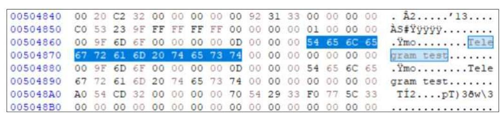
[그림 25] 휘발성 메모리에서의 텔레그램 메시지

# 3. 삭제된 앱 흔적 

상용 도구에서 삭제된 앱의 흔적을 찾기가 사실상 어렵고, 범죄에 사용된 특정 앱을 알고 있을 경우에만 상용 도구의 옵션을 이용하여 비활성 영역에 있는 데이터 에서 삭제된 앱 데이터를 찾아 복구할 수 있다. 이미 삭제된 앱의 경우 그 앱의 데 이터가 비활성 영역으로 변경되게 되는데, 휘발성 메모리 상에서도 Fridump 도구 사용 시 [그림 26]과 같이 앱이 보이지 않게 된다.

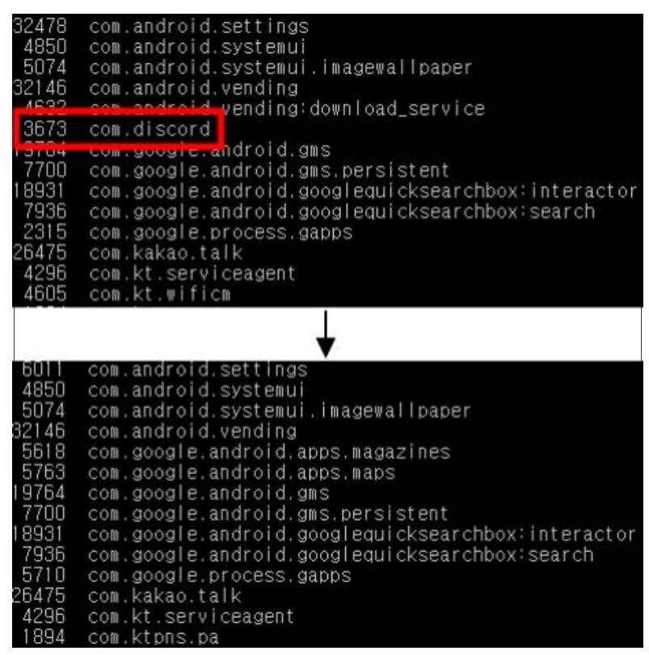
[그림 26] 앱 삭제 시 휘발성 메모리

다만, 휘발성 메모리의 다른 앱에 삭제된 앱에 대한 기록이 남아 있을 수 있다. [그림 27]을 보면 삭제된 디스코드 앱에 대하여 앱에 대한 데이터는 남아있지 않지 만 디스코드 앱이 존재하였다는 흔적을 확인할 수 있다. 이러한 흔적을 통하여 기 존 사용하던 앱을 최근에 삭제하였다는 점을 알아내어 피의자의 협의 입증에 도움 이 될 수 있을 것이다.

| 0002D540 | 74 | 61 | 6 C | 6 C | A0 | 01 | B4 | F7 | F6 | CE | 96 | 2 F | D2 | 01 | 16 | 2 D | tall . +01 |  |  |
| :--: | :--: | :--: | :--: | :--: | :--: | :--: | :--: | :--: | :--: | :--: | :--: | :--: | :--: | :--: | :--: | :--: | :--: | :--: | :--: |
| 0002D550 | 33 | 4 F | 4 A | 50 | 42 | 7 A | 69 | 53 | 79 | 2D | 6B | 6D | 48 | 64 | 6B | 2D | 30JPBziSy-kmHdk- |  |
| 0002D560 | 39 | 33 | 32 | 79 | 67 | 98 | 02 | 01 | BA | 02 | OB | 63 | 6 F | 6D | 2E | 64 | 932yg*..*..com.c |  |
| 0002D570 | 69 | 73 | 63 | 6 F | 72 | 64 | 18 | 08 | 22 | 02 | 08 | 00 | 32 | 06 | 08 | 00 | Eecor | .."...2... |
| 0002D580 | 10 | 00 | 18 | 00 | 3 A | 00 | 42 | 00 | 83 | 11 | 89 | 4 C | 07 | 2D | 01 | 23 | .....:.B.f.hL.-.\# |  |
| 0002D590 | 5B | 85 | 1 A | 63 | 6 F | 6D | 2 E | 73 | 65 | 63 | 2E | 73 | 70 | 70 | 2E | 70 |  |  |

[그림 27] 휘발성 메모리에서의 삭제된 앱 흔적

# 4. 안티포랜식 앱 흔적 

데이터 완전삭제 앱은 상용 도구에서 앱의 존재 여부만 출력되며 앱 실행 전의 비활성 영역에 대한 데이터를 복구해주지 못한다. 또한, 선행연구에서 확인하였듯이 웹 브라우저 사생활보호모드의 경우 모바일 포랜식 분석 도구로는 분석이 불가능하 다. 웹 브라우저 사생활보호모드 특성 상 플래시 메모리에 활동 기록을 저장하지 않기 때문이다. 그러나 앞서 기술했던 선행연구를 살펴보면 휘발성 메모리 상에 웹 브라우저 사생활보호모드의 활동 내역이 남아있는 것을 확인할 수 있다.

데이터 완전삭제 앱이나 은닉 앱의 경우 많은 종류의 앱들이 존재한다. 은닉 앱 의 경우 모바일 포랜식 분석 도구로 분석이 가능하다. 단, 모바일 포랜식 분석 도구 사에서 분석을 제공하는 앱에 한한다. 그러나 데이터 완전삭제 앱의 경우 데이터를 삭제 후 비활성 영역에 있는 데이터를 대량의 의미 없는 데이터로 덮어씀으로서 복 구가 불가능하게 한다. 따라서 분석 도구에서도 데이터 완전삭제 앱을 사용한 경우 복구가 되지 않을 수 있다.

그러나 데이터 완전삭제 앱을 사용하여도 삭제한 데이터가 휘발성 메모리에는 그대로 남아 있는 것을 확인할 수 있었다. 텍스트 파일을 생성 후 삭제하고, 데이터 완전삭제 앱을 이용하여 비활성 영역의 데이터를 지우도록 설정하였다.[그림 28] 그 리고 휘발성 메모리를 분석한 결과 텍스트 파일 내용까지 그대로 남아있었다.[그림 29]

[그림 28] 데이터 완전삭제 실행
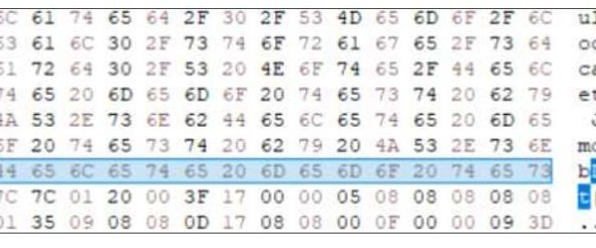
[그림 29] 휘발성 메모리에서의 데이터 완전삭제 흔적

# 제4장 모바일 포렌식의 증거 수집 절차 개선방안 

## 제1절 모바일 포렌식 증거 수집 절차 개선

현재의 모바일 증거 수집은 비휘발성 메모리에서만 이루어지고 있으며, 모바일 포렌식 도구로 비활성 영역까지 획득하기 위해서는 전원 종료가 필수적이다. 그러 나 전원을 종료할 경우 휘발성 메모리는 획득이 불가능해진다. 앞서 기술한 대로 휘발성 메모리에서만 획득할 수 있는 데이터가 존재하기 때문에 비휘발성 메모리 획득 전 휘발성 메모리를 획득하는 과정이 필요하다.

국내 수사기관의 경우 일반적으로 압수 현장에서 모바일 포렌식 수집 도구를 이 용하여 획득을 하게 된다. 비행기 모드만 실행하여 수집하는 논리 획득의 경우에는 활성 시스템의 앱 데이터만 획득이 가능하므로 삭제된 파일 등의 비활성 영역까지 수집하기 위해서는 전원을 종료하고 수집 절차를 진행하여야 한다. TTA 모바일 포 렌식 가이드라인에 따르면 데이터 획득 단계에서 휘발성 데이터 획득 절차가 존재 하고, 앞서 기술하였던 실험 결과에서도 상용 도구에서 확인이 어려운 부분을 휘발 성 메모리에서 수집할 수가 있기 때문에 모바일 증거 수집 절차에 휘발성 데이터 수집 및 분석이 반드시 필요하다. [그림 30]은 본 연구를 바탕으로 제안하는 휘발성 메모리 획득 절차를 추가한 모바일 증거 수집 절차이다.

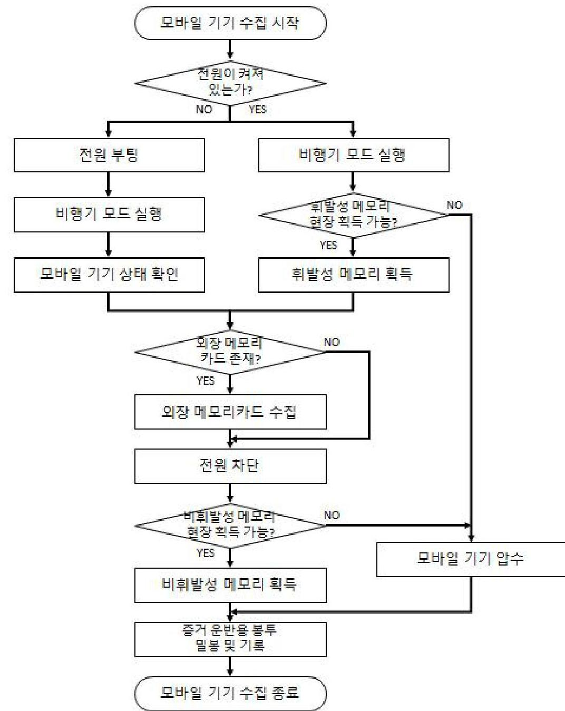
[그림 30] 모바일 증거 수집 절차 제안

모바일 기기 압수 시 전원이 켜져 있는지 여부를 먼저 확인한다. 전원이 꺼져 있는 경우 휘발성 메모리 획득을 진행할 필요가 없기 때문에 일반적인 모바일 포렌 식 수집 절차대로 진행한다. 모바일 기기가 꺼져있는 경우, 모바일 기기의 상태를 확인하기 위해 정상 부팅이 되는지 여부를 확인한다. 이 때, 전원이 켜진 후 초기화 등 원격 조작이 있을 수 있으므로 반드시 비행기 모드를 실행한다. 그 후 외장 메 모리 카드 여부를 확인하여 존재할 경우 수집한다. 마지막으로 비휘발성 메모리를 획득하기 위하여 전원을 종료하고 모바일 포렌식 도구 등을 이용하여 수집한다. 형 사소송법 제 106 조 제 3 항에 의해 디지털 증거 압수수색 시 선별 압수를 통해 복제하 여 제출받아야 하나, 선별 압수가 불가능 할 시 정보저장매체 등을 압수할 수 있기 때문에 현장에서 획득이 불가능할 시 모바일 기기 자체를 압수하여 증거 운반용 봉 투에 밀봉한다.

전원이 켜져 있는 경우 가장 먼저 비행기 모드를 실행하여 사용자 원격 조작 및 초기화를 막고, 현장에서 획득이 가능한지 여부를 파악한다. 현장에서 획득이 불가 능할 시 전원이 꺼져 있을 경우와 동일하게 모바일 기기 자체를 압수한다. 현장에 서 획득 가능할 시 가장 먼저 휘발성 메모리를 수집한다. 안드로이드 스마트폰의 경우 모바일 포렌식 도구에서 비활성 영역까지 분석이 가능하기 때문에 도구에서 분석하지 못하는 부분을 휘발성 메모리에서 보완할 수 있고, 아이폰의 경우에는 모 바일 포렌식 도구에서 활성 영역만 분석이 가능하므로 도구에서 분석이 어려운 삭 제된 내역에 대하여 휘발성 메모리에서 데이터를 획득할 수 있다. 그 후 절차는 전 원이 꺼진 경우와 동일하다. 증거 수집을 완료한 후 증거 수집 당시의 시간과 위치, 증거파일의 해시값을 기록한다. 그리고 증거 파일의 무결성 훼손을 하지 않도록 봉 인지에 봉인하고 관리하여야 한다.

위 절차에서 휘발성 메모리 획득을 제외한 절차들은 수사 시 가장 빈번하게 사 용되는 모바일 증거 수집 절차로 대부분 동일한 절차로 진행되고 있다. 증거 수집 절차에서 가장 중요한 적법성과 신뢰성을 높이기 위해 피의자 및 참여인의 서명을

받고 전자증거수집목록을 배부하는 것 또한 중요한 절차이다.
제안한 모바일 증거 수집 절차에서 휘발성 메모리 수집 시 주의할 점은 휘발성 메모리의 경우 사용자의 조작에 의해 계속해서 내용이 갱신되므로 조작을 최소화하 고 비행기 모드 실행 즉시 획득하여야 한다는 것이다. 휘발성 메모리의 용량은 비 휘발성 메모리에 비해 현저히 작고 작은 조작만으로도 기존 사용자의 행위에 대한 기록이 삭제될 수 있기 때문이다.

디지털 기기를 이용한 범죄가 점차 더 치밀해지고 범죄 행위 은닉을 위한 기술 들이 다양해진 만큼 수사기관의 증거 수집 및 분석 기술도 발전해 나가야 한다. 디 지털 포랜식이 뉴스, 인터넷 등에 자주 노출되어 디지털 포랜식을 피할 수 있는 안 티 포랜식 기술도 다양해지고 있다. 포털사이트에 모바일 안티 포랜식 관련 키워드 로 검색하면 은닉 앱, 데이터 완전삭제 앱, 모바일 사생활 보호 브라우저 등의 정보 가 쏟아진다. 이렇게 누구나 쉽게 접할 수 있는 안티 포랜식 기술을 무력화할 수 있는 기술 및 절차가 존재하지 않으면 점점 더 은닉한 범죄 행위 증명이 어려워질 것이다.

따라서 현재 수사기관의 모바일 증거 수집 절차에 포함되지 않던 휘발성 메모리 를 수집 및 분석하여 모바일 기기 증거 획득의 범위를 넓히고, 그동안 증명하기 어 려웠던 안티 포랜식 앱 등의 행위를 증명함으로서 모바일 기기 수사 기법의 고도화 를 기대할 수 있다.

# 제2절 모바일 포랜식 휘발성 데이터 획득 및 분석 도구 개발 

모바일 기기는 애플리케이션 업데이트가 매우 잦으며, 새로운 버전이 나오면 암 호화 키 등 기존 버전과 달라지는 경우가 많다. 또한 새로운 OS도 PC 포랜식에 비 해 자주 업데이트가 되기 때문에 매번 달라지는 버전에 맞게 수집 및 분석하기가 쉽지 않다. 그렇기 때문에 수사 시 모바일 포랜식 도구를 이용하여 모바일 데이터 를 수집 및 분석할 수밖에 없다.

이는 모바일 기기의 휘발성 메모리도 마찬가지이다. 휘발성 메모리는 앱 실행 시 복호화된 내용이 적재되기 때문에 암호화 키 등의 문제는 존재하지 않지만, 메 모리 덤프를 위한 절차가 존재한다. 또한, PC와 연결하여 덤프 파일을 저장하여야 하고, 메모리 덤프가 앱 단위로 이루어지기 때문에 자동으로 모든 앱의 메모리 덤 프 파일을 수집하는 자동화 프로그램이 필요하며, 덤프 파일을 분석하여 의미 있는 정보를 도출해 내는 분석 자동화 도구 역시 필요하다. 현재 모바일 포랜식 휘발성 데이터 획득 및 분석을 자동화하는 도구가 전무하므로 해당 도구를 개발하여 수사 시 적용할 수 있게 하여야 한다.

모바일 휘발성 메모리를 획득하기 위해서는 먼저 PC와의 연결이 필요하다. 그 후 모바일 기기에 메모리 덤프 관련 프로그램을 삽입 후 실행한다. PC에 모든 앱에 대한 모바일 메모리 덤프 파일을 저장하여 획득한다. 이 때, 중요한 것은 모바일 기 기 내에서 동작하는 메모리 덤프 프로그램이 덤프하기 전 최소한의 행위만을 하여 수집 직전까지의 행위가 휘발성 메모리에 최대한 많이 남도록 해야 한다. 메모리 덤프 후 분석 PC에서 메모리 덤프 파일을 분석하게 되는데, 수사관이 필요한 앱을 선별하여 분석 시간을 단축하도록 할 수 있다. 덤프된 각 앱의 휘발성 메모리를 자

동화된 프로그램으로 분석하여 휘발성 메모리 내에 의미 있는 정보가 있는지 확인 하여야 한다.

# 제5장 결 론 

개인의 스마트폰 이용률이 지속적으로 증가함에 따라 범죄에 사용된 모바일 기 기 역시 증가하고 있다. 모바일 기기의 증거 분석 비율은 PC$\cdot$노트북 등 다른 디지 털 기기에 비해 급증하는 추세이다. 스마트폰의 보급이 활성화되면서 각종 범죄에 서 스마트폰이 이용되었고 범죄 수사에서 중요한 증거가 되었다. 최근에는 범죄자 들이 수사망을 피하기 위한 안티 포랜식 방법을 사용하게 되면서 수사기법 개발이 중요해지고 있다. 모바일 포랜식은 모바일 기기 특성상 지속적으로 새로운 기기와 OS가 등장하고 있고, 애플리케이션들의 업데이트도 실시간으로 진행되고 있어 도 구에 의존하여 수집과 분석을 할 수 밖에 없다.

국내 수사기관은 모바일 기기 수집 시 기기의 전원 유무를 확인하고, 전원이 켜 져 있을 경우 원격 초기화 등을 방지하기 위하여 비행기 모드를 실행하는 방법으로 초동조치를 하고 있다. 그 후 외장 메모리 카드 유무를 확인 후 존재하다면 외장 메모리 카드를 수집한다. 그리고 전원 차단 후 현장에서 모바일 포랜식 수집 도구 를 이용하여 모바일 기기의 데이터를 수집한다. 이렇게 수집된 데이터는 비휘발성 데이터로 스마트폰에 저장된 것을 대부분 확인할 수 있다. 그러나 이러한 수집 방 법은 시스템 전원을 차단하는 순간 휘발성 증거들을 확보할 수 없다는 한계가 있 다.

휘발성 데이터는 시스템의 전원을 차단하는 순간 사라지는 데이터를 의미하며, 이러한 정보를 얻기 위해서는 시스템의 전원을 차단하기 전에 획득하여야 한다. PC 에 대해서는 이러한 휘발성 데이터를 획득하여 분석하는 라이브 포랜식이 증거 수 집 절차에 포함되어 있지만, 모바일 기기에서 라이브 포랜식에 대한 인식은 부족한

상태이다. TTA 가이드라인에서는 모바일 포랜식 가이드라인에 휘발성 메모리 획 득에 대한 절차가 존재하지만 현재 모바일 포랜식 도구에서는 관련 기능을 제공하 지 않아 수사에서 활용하지 못하고 있다.

본 연구에서는 모바일 기기의 휘발성 메모리 분석을 진행하여 분석의 필요성을 제시하였다. 첫 번째로, 카카오톡은 국내 모바일 앱 중 사용자가 가장 많은 앱으로 대부분의 스마트폰 사용자가 사용하는 메신저 애플리케이션이다. 카카오톡에서 제 공하는 메시지 삭제 기능 중 '나에게서만 삭제' 기능은 다른 대화 상대에게서는 메 시지가 남아있지만 자신의 카카오톡 채팅방에서만 메시지를 삭제하는 기능이다. 해 당 옵션으로 메시지를 삭제할 경우 메시지가 대화방에서 사라지며, 삭제되었다는 문구도 나오지 않으므로 해당 메시지가 있었는지 여부를 스마트폰 화면상으로는 알 수 없다. 또한 상용 도구에서도 카카오톡 DB 내 메시지가 0 으로 덮어써지기 때문 에 복구가 불가능하다. 그러나 휘발성 메모리 상에는 '나에게서만 삭제' 기능을 사 용하더라도 비활성 영역에 저장되는 것처럼 DB 형태로 저장되는 것이 아니므로 삭 제되기 전 메시지를 확인할 수 있었다.

두 번째로, 일부 메신저 애플리케이션은 대화 내용을 기기에 저장할 때 암호화 하여 저장하는데, 상용 도구에서는 이를 복호화하여 보여준다. 그러나 메신저 앱의 개발사에서 주기적으로 암호화 키를 변경하고 있기 때문에 상용 도구 사에서 해당 키를 알아내어 도구 업데이트를 배포하는 데까지 시간이 소요된다. 또한, 수사 기관 에서도 상용 도구를 제때 업데이트를 하지 않는다면 암호화된 메시지를 복호화하지 못하여 메시지 내용을 확인할 수 없다는 문제점이 있다. 사용자가 메신저 앱을 실 행하여 채팅방에 들어가게 되면 기기에서 암호화된 메시지를 복호화하여 사용자가 읽을 수 있도록 보여준다. 휘발성 메모리에는 이 복호화된 메시지가 저장되기 때문 에 상용 도구에서 복호화를 하지 못하더라도 휘발성 메모리 내부에서 평문의 대화 내용을 확인할 수 있다.

세 번째로, 모바일 기기 압수 전 사용하던 앱을 삭제할 경우 앱에 관련한 데이

터 대부분이 모바일 기기 활성 데이터에서 삭제된다. 상용 도구에서 비활성 영역을 분석하여 삭제된 앱 데이터까지 복구가 가능하지만, 분석 실행 시 비활성 영역까지 분석할 앱을 미리 체크해주어야지만 분석이 가능하다. 자주 사용하지 않는 앱을 범 죄에 사용하고 이를 수사관이 알지 못한 상태로 앱이 삭제가 된다면 분석이 필요하 다는 것을 바로 알기가 어렵다. 휘발성 메모리 상에도 앱이 삭제될 경우 해당 앱 데이터가 삭제되어 앱에 대한 데이터를 복구하기는 힘들다. 단, 휘발성 메모리 상의 다른 앱에 삭제된 앱에 대한 기록이 남아있을 수 있으며, 삭제된 앱을 알게 되면 상용 도구에서 비활성 영역을 분석하기도 용이하다.

네 번째로, 디지털 포랜식이 대중들에게 알려지게 되면서 디지털 포랜식을 피할 수 있는 안티 포랜식 방법이 확산되고 있다. 데이터 완전삭제, 은닉 앱, 웹 브라우 저 사생활보호모드 등이 안티 포랜식 방법에 해당한다. 은닉 앱의 경우 상용 도구 에 의해 분석이 가능하지만 데이터 완전삭제 앱은 데이터를 삭제 후 비활성 영역에 있는 데이터를 대량의 데이터로 덮어씀으로서 복구가 불가능하게 한다. 이미 비활 성 영역의 데이터가 지워진 경우 상용 도구로도 분석이 불가능하다. 그러나 데이터 완전삭제 앱을 사용하여도 삭제한 데이터가 휘발성 메모리에는 그대로 남아 있는 것을 확인할 수 있었다. 또한, 웹 브라우저 사생활보호모드에 대해서는 기존 연구에 서 비휘발성 메모리에는 브라우저 활동 기록이 저장되지 않지만 휘발성 메모리에는 남아있다는 것이 증명되었다.

앞서 기술한 대로 휘발성 메모리에서만 획득할 수 있는 데이터가 존재하기 때문 에 비휘발성 메모리 획득 전 휘발성 메모리 획득하는 과정이 반드시 필요하다. 따 라서 본 논문에서 제안하는 모바일 증거 수집 절차는 다음과 같다. 모바일 기기 압 수 시 전원이 켜져 있는지 여부를 확인하고, 전원이 꺼져있는 경우 휘발성 메모리 획득을 진행할 필요가 없기 때문에 기존 수사기관의 모바일 증거 수집 절차대로 진 행한다. 전원이 켜져 있는 경우 가장 먼저 비행기 모드를 실행하여 사용자 원격 조 작 및 초기화를 막고, 현장에서 획득이 가능한지 여부를 파악한다. 현장에서 획득이

불가능할 시 모바일 기기 자체를 압수한다. 현장에서 획득 가능할 시 가장 먼저 휘 발성 메모리를 수집한다. 그 후 외장 메모리 카드 여부를 확인하여 존재할 경우 수 집한다. 마지막으로 비휘발성 메모리를 획득하기 위하여 전원을 종료하고 모바일 포렌식 도구 등을 이용하여 수집한다. 증거 수집을 완료한 후 증거 수집 당시의 시 간과 위치, 증거 파일의 해시값을 기록하고, 증거 파일의 무결성을 훼손하지 않도록 봉인지에 봉인하여야 한다. 위 절차에서 주의할 점은 휘발성 메모리의 경우 사용자 조작에 의해 계속해서 내용이 갱신되므로 조작을 최소화하고 비행기 모드 실행 즉 시 획득하여야 한다는 점이다. 휘발성 메모리의 용량은 비휘발성 메모리에 비해 현저히 작고 작은 조작만으로도 기존 사용자의 행위에 대한 기록이 삭제될 수 있기 때문이다.

모바일 기기 특성상 수사관 및 분석관이 모든 버전의 수집$\cdot$분석 방법을 숙지하 기 어려우므로 모바일 포렌식 도구에 의존하게 된다. 이는 휘발성 메모리도 예외가 아니며, 메모리 덤프를 통한 수집에 절차가 존재한다. 따라서 휘발성 메모리를 수집 하고 분석해주는 도구가 있어야 이를 모바일 증거 수집 절차에 반영할 수 있을 것 이다. 따라서 이러한 모바일 휘발성 메모리를 자동으로 수집하고, 분석해주는 도구 개발이 필요하다.

디지털 기기를 이용한 범죄가 점차 더 치밀해지고 범죄 행위 은닉을 위한 기술 들이 다양해진 만큼 수사기관의 증거 수집 및 분석 기술도 발전해 나가야 한다. 모 바일 안티 포렌식에 관련한 정보를 쉽게 얻을 수 있는 만큼 이러한 기술을 무력화 할 수 있는 기술 및 절차가 존재하지 않으면 범죄 행위 증명이 더욱 어려워질 것이 다. 따라서 현재 수사기관의 모바일 증거 수집 절차에 포함되지 않던 휘발성 메모 리를 수집 및 분석하여 모바일 기기 증거 획득의 범위를 넓히고, 그동안 증명하기 어려웠던 행위들을 증명함으로서 모바일 기기 수사 기법이 고도화 되어 범죄 수사 발전에도 도움이 되기를 기대한다.

# 참 고 문 헌 

## 가. 학술논문

구본민$\cdot$김주영$\cdot$이태림$\cdot$신상욱, "Android \& iOS 기반 스마트폰의 디지털 증거 수집 및 분석", 정보보호학회논문지 21(1), 2011.
김건우$\cdot$류재철, "JTAG을 이용한 휴대폰 포렌식 데이터 수집", 대한전자공학회 하계 종합학술대회 31(1), 2008.
김도현$\cdot$이상진, "모바일 포렌식 동향", 정보보호학회지 26(5), 2016.
김상일$\cdot$김화성, "스마트폰 기반의 상황 추론을 위한 온톨로지 모델링", 한국정보과 학회 학술발표논문집, 2013.
김영준$\cdot$김완주$\cdot$임재성, "무결성 향상을 위한 모바일 포렌식 모델 연구", 정보보호학 회논문지, 30(3), 2020.
박진규$\cdot$이제훈$\cdot$김상욱, "디지털 포렌식을 위한 동작 중인 메모리에서의 파일 정보 수집", 한국정보처리학회 학술대회논문집 16(1), 2009.
박진성$\cdot$서승희$\cdot$이창훈, "메모리 포렌식 관점에서의 모바일 브라우저 사생활 보호 모 드 분석", 디지털콘텐츠학회논문지 21(4), 2020.
백은주$\cdot$성진원$\cdot$임경수$\cdot$이상진, "윈도우 활성 시스템상의 디지털 증거 수집 도구 설 계 및 구현", 융합보안논문지 7(2), 2007.
안영건$\cdot$김명호, "안드로이드 스마트폰의 데이터 수집 방법", 한국컴퓨터정보학회 학 술발표논문집 19(1), 2011.
어수웅$\cdot$조우연$\cdot$이석준$\cdot$손태식, "모바일 포렌식 증거능력 확보 방안 연구", 정보보호 학회논문지 26(1), 2016.

여세환$\cdot$김정선, "PC와 스마트폰 사이의 데이터 전송을 위한 클립보드 공유", 한국 정보과학회 학술발표논문집 38(1D), 2011.

오정훈$\cdot$이상진, "안드로이드 스마트폰 포랜식 분석 방법에 관한 연구", 디지털포렌 식연구 $(9), 2012$.

유수정, "4차 산업혁명과 인공지능", 한국멀티미디어학회지 21(4), 2017.
윤경배$\cdot$천우성$\cdot$박대우, "압수 수색된 안드로이드와 윈도우모바일 스마트폰의 포랜식 증거 자료", 한국정보통신학회논문지 17(2), 2012.

윤지수$\cdot$이경렬, "안티 포랜식 신종기법에 대한 형사법적 대응방안", 형사정책 32(4), 2021.

정윤수, "스마트폰 사용으로 인한 사용자 프라이버시 피해 현황 분석", 융합정보논 문지 $4(4), 2014$.

최재원$\cdot$김승주, "모바일 포랜식 증거 수집방안 연구: 제조사 백업 앱 기반 데이터 획득 기법", 정보보호학회논문지 28(1), 2018.

한지성$\cdot$이상진, "라이브 포렌식을 위한 윈도우즈 물리 메모리 분석 도구", 정보보호 학회논문지 21(2), 2011.

함영욱$\cdot$임종인, "사이버성폭력 범죄의 실태 분석 및 경찰의 대응방안에 관한 연구", 한국경찰연구 19(2), 2020.

황태진$\cdot$원동호$\cdot$이영숙, "모바일 포렌식을 이용한 메신저 증거 비교 분석 연구", 융 합보안논문지 18(2), 2018.

# 나. 학위논문 

구선미, "효과적인 압수수색 현장 대응을 위한 모바일 포랜식 방안 연구", 서울대학

교 석사학위논문, 2018.
안영건, "안드로이드 스마트폰 기반의 디지털 포렌식 도구개발", 숭실대학교 석사학 위논문, 2011.

여정호, "저작권 침해 예방을 위한 모바일 포렌식 및 필터링 기술에 관한 연구", 성 균관대학교 석사학위논문, 2012.

이규안, "JTAG 방식을 이용한 모바일 포렌식 기법 연구", 숭실대학교 박사학위논 문, 2009.

황태진, "모바일 포렌식을 利用한 메신저 證據 比較 分析 硏究", 성균관대학교 석사 학위논문, 2018.

# 다. 기관보고서 

경찰청, "2019 경찰통계연보", 2019
방송통신위원회, "2020년 방송매체 이용행태 조사", 2020.
한국정보통신기술협회(TTA), "모바일 기기 포렌식 지침", 2020.
NIST, "Guidelines on Mobile Device Forensics", 2014.

## 라. 국외 문헌

F. Zhou$\cdot$Y. Yang$\cdot$Z. Ding$\cdot$G. Sun, "Dump and analysis of android volatile memory on wechat." IEEE International Conference on Communications (ICC), 2015.

Javed Ahmad Shaheen$\cdot$Mian Ali Asghar$\cdot$Abid Hussain, "Android OS with its Architecture and Android Application with Dalvik Virtual Machine Review", International Journal of Multimedia and Ubiquitous Engineering 12(7), 2017.

Seung Jei Yang$\cdot$Jung Ho Choi$\cdot$Ki Bom Kim$\cdot$Taejoo Chang, "New acquisition method based on firmware update protocols for Android smartphones", Digital Investigation 14, 2015.

THING$\cdot$Vrizlynn LL$\cdot$NG, Kian-Yong$\cdot$CHANG, Ee-Chien, "Live memory forensics of mobile phones", digital investigation, 7, 2010.

# ABSTRACT 

## A Study on the Procedure of Live Data Acquisition in Mobile Device

Jisu Lee Department of Forensic Science Sungkyunkwan University

The retention rate of smart phone for individual is consistently increased due to the development of the digital era, and the evidence analysis rate of mobile device is also increased according to the increase of smart phone utilization rate. Especially, anti-forensic method to avoid police dragnet becomes diversified increasing the awareness on digital forensic becomes higher. However, it is reality that the collection and analysis is implemented depend on the tool in mobile forensic because new device and OS are continuously appeared due to the characteristic of mobile device and the update of applications are implemented in real-time.

Domestic investigative agency collects the data using mobile forensic collection tool at site after shut off the power when they get the mobile device. The data collected as above is non-live data, so it is possible to check most of stored data in the smart phone. However, there is disadvantage that the live

data is disappeared when shut off the system power.
The method and procedure to analyze volatile memory in mobile device is researched in this study. Firstly, it is impossible to restore when delete the message with 'delete only from me' function in KakaoTalk because the message in KakaoTalk DB is covered with 0 . However, the message could be checked before delete it in volatile area because it is not stored as DB type as stored in non-volatile area.

Secondly, commercial tool shows after decryption for the messenger app encrypt the content of conversation when storing it in the device. However, there is problem that the decryption is not possible for the period the commercial tool company is applying key update due to encryption key update changed regularly. The content of conversation with plain text can be checked inside the volatile memory though it cannot be decrypted in the commercial tool because this decrypted message is stored in the volatile memory.

Thirdly, the investigator should know the deleted app to analyze it with commercial tool when delete the app used before confiscate the mobile device. It is difficult to know the analysis is necessary when delete the app not used frequently after using it. There can be the record about the deleted app in volatile memory, and it is easy to analyze non-volatile area in commercial tool when it is possible to know deleted app.

Fourthly, it is impossible to restore with commercial tool because the data in non-volatile area is deleted when running data complete delete app which is anti-forensic app. However, the deleted content is remained in live data as it is.

For the above mentioned reasons, volatile memory analysis is necessary when collect mobile evidence. So, the improvement plan of volatile memory

analysis and mobile evidence collection procedure is suggested in this study. Also, the necessity of volatile memory analysis tool development is insisted because automatic tool for collection and analysis is necessary due to the characteristic of mobile device.

It is expected that the investigation method for mobile device becomes advance and helpful for the development of criminal investigation by widening the range of evidence acquisition and proving the activities difficult to prove by collecting and analyzing volatile memory which have not included in evidence collection procedure for mobile device by investigative agency currently.

Keywords: Mobile Forensics, Live Forensics, Digital Forensics, Digital Evidence, Smartphone Search and Seizure.

