# 모바일 메신저에서 디지털성착취물 시청행위 포렌식 방안 

## A Study on the Digital Forensic of Viewing Digital Sexual Exploitation Material in Mobile Messenger

이지수 ${ }^{1}$ ・ 이연주 ${ }^{1}$ ・ 김기범 ${ }^{11 *}$

I. 서론
II. 디지털성착취물 시청죄의 형사법적 의의
III. 메신저 운영방식과 시청행위 입증 필요성
IV. 메신저에서 디지털성착취물 시청행위 분석
V. 결론

## >) 국 문 요 약 〈

정부는 2020년 'N번방 사건'에 따른 후속입법으로 청소년성보호법에 아동-청소년성착취물(제11조 제5 항), 성폭력처벌법에 불법촬영물-복제물(제11조 제4항)에 대한 시청죄를 각각 신설하였다. 디지털성착취 물 소지는 컴퓨터-스마트폰에 파일이 저장되기 때문에 입증이 쉽지만, 시청은 저장되는 방식이 아니기 때 문에 입증이 어렵다. 그래서 수사기관은 컴퓨터-스마트폰에서 디지털성착취물 시청을 입증하기 위한 디지 털포렌식 기술이 필요한 상황이다.
이에 따라 본 연구에서는 텔레그램(Telegram), 와이어(Wire), 디스코드(Discord) 등 모바일 메신저에 서 디지털성착취물을 시청하였을 때 어떠한 흔적(Artifacts)이 남는지 실험을 하였다. 그 결과 이미지를 시청한 경우 텔레그램은 일반대화모드와 비밀대화모드에서 이미지가 존재하거나 삭제되더라도 캐시파일 형태로 시청을 입증할 수 있다는 것을 확인하였다. 다만, 비밀대화모드 일대일 대화방에서 자동삭제 타이 머 기능이 설정된 경우 이미지가 있을 때는 암호화되어 있다 하더라도 캐시파일이 존재하여 입증이 가능 하지만, 자동삭제 타이머 기능에 의해 삭제된 경우에는 입증이 불가능하였다. 와이어와 디스코드는 이미 지가 존재하거나 삭제되더라도 모두 캐시파일이 존재하여 입증이 가능하였다.
동영상 시청의 경우 텔레그램은 일반대화모드와 비밀대화모드에서 시청여부와 관계없이 동영상을 경과 하기만 하면 썸네일이 존재하여 추가조사를 통한 입증이 필요하다는 것을 확인하였다. 다만, 비밀대화모 드 일대일 대화방에서 자동삭제 타이머 기능이 설정되어 일정시간 경과로 삭제된 경우에는 입증이 불가

[^0]
[^0]:    1) 성균관대학교 일반대학원 과학수사학과

    * 교신저자

능하였다. 와이어는 동영상이 존재하거나 삭제되더라도 모두 캐시파일이 존재하여 입증이 가능하였고, 디 스코드는 동영상 전송 기능이 없어 실험에서 제외하였다. 본 연구결과가 수사현장에서 디지털성착취물 시청을 입증하여 범죄자를 형사처벌하는데 기여하기를 바란다.
(ㅇ 주제어 : 디지털포렌식, 모바일포렌식, 아동 $\cdot$ 청소년성착취물, 디지털성범죄, 텔레그램

# I. 서 론 

경찰청은 2020년 11월 'N번방' 사건과 관련하여 디지털성착취물을 제작하거나 소지한 혐의 등으로 총 2,454명을 형사 입건하고 217명을 구속하였다고 밝혔다.1) 디지털성착취물 을 시청하기 위해 'N번방'에 가입한 이용자가 약 26 만 명을 넘어설 것으로 보았고,2) 텔레 그램 'N번방' 증의 하나인 '박사방'에서는 성범죄 피해가 아동$\cdot$청소년을 포함하여 최소 26 건이 발생하였다.3) 범죄자들은 텔레그램 대화방에 암호화폐를 이용하여 입장료를 지불하고 가입하였고, 그런 후에 일명 '노예'라고 불리는 피해 여성의 자위$\cdot$자해, 성폭행 등의 동영상 을 시청하여 시민들에게 커다란 충격을 주었다.4)

이에 따라 시민들은 디지털성착취물 제작$\cdot$소지뿐만 아니라 텔레그램 'N번방'에 가입하여 디지털성착취물을 시청한 행위까지 처벌하라고 요구하였다. 경찰청은 당시 아동$\cdot$청소년의 성보호에 관한 법률(이하 "청소년성보호법"이라 칭함)에서 소지죄만 처벌규정을 두고 있어 시청을 처벌하는데 한계가 있었다. 그러자 시민들의 요구는 더욱 거세게 일어나 정부는 결 국 청소년성보호법과 성폭력범죄의 처벌 등에 관한 특례법(이하 "성폭력처벌법"이라 칭함) 에 아동$\cdot$청소년성착취물과 불법 촬영물$\cdot$복제물(이하 "디지털성착취물"이라 함)에 대한 시청 죄를 각각 도입하였다.

하지만, 디지털성착취물 시청죄를 도입하였지만 시청은 소지와 달리 어떠한 형태로 존재

[^0]
[^0]:    1) 아주경제 보도(2020.11.2.), "경찰 '디지털성범죄 2454명 입건'... 217 명 구속" https://www.ajunews.com/view/20201102134634877 (2020.12.05. 최종확인)
    2) 국회 보도자료 (2020.03.30.), "텔레그램n번방'디지털 성범죄 대책현황과 규제방안 모색"; SBS 보도(2020. 3. 23), "경찰, 'n번방 26만 명 신상' 본격적으로 뒤쫓는다", https://news.sbs.co.kr/news/endPage.do?news_id=N1005711716 (2020.12.05. 최종확인)
    3) 해당 통계는 2020. 7. 1.자 수사현황을 기준으로 설명한 것임
    4) 국민일보 보도(2020. 3. 9), "[n번방 추적기(日) 텔레그램에 강간노예들이 있다", http://news.kmib.co.kr/article/view.asp?arcid=0014327469 (2020.12.05. 최종확인)

하는 것이 아니라 그 순간을 포착해야 해서 불법행위를 입증하는데 한계가 있다. 스마트폰 에서 시청을 입증하기 위한 디지털포렌식 연구도 부족하여 법집행을 제대로 뒷받침하지 못 하고 있다. 그간 메신저와 관련하여 텔레그램 이용자의 스마트폰에 저장되는 데이터베이스 파일을 통해 이름, 접속시간, 전화번호, 메시지 등을 분석하는 연구,5) 디지털성착취물을 저 장할 경우 로컬의 하위 포맷에 맞는 디렉터리에서 해당 파일을 찾을 수 있다는 연구6), 디지 털성착취물을 공유할 경우 최초 유포된 파일과 재유포된 파일에서 차이점이 존재한다는 연 구7) 등이 있었지만 시청에 대한 연구는 제대로 이루어지지 않았다. 모바일 메신저인 디스 코드에서 메시지 내용, 시간, 발신자 계정 등의 정보를 분석하는 연구8)도 이루어졌지만 시 청행위 입증에 대한 내용은 포함하고 있지 않았다.

이에 따라 본 논문에서는 디지털성착취물이 주로 유통되는 텔레그램(Telegram), 와이어 (Wire), 디스코드(Discord) 등 3 개의 모바일 메신저를 대상으로 시청행위를 입증할 수 있 는 디지털 포렌식 기술을 연구한다. 모바일 메신저에서 이미지와 동영상을 전송하고 시청하 면 어떠한 증거가 남는지, 이미지와 동영상을 삭제해도 증거가 남는지를 실험한다. 먼저 II 장에서는 시청죄의 도입이 갖는 형사법적 의의를 탐색하고, III장에서는 모바일 메신저의 구 조와 시청행위 입증의 필요성에 대해 살펴본다. 마지막으로 IV장에서는 모바일 메신저 3종 을 대상으로 시청하였을 경우 어떠한 증거가 남는지 실험하고자 한다.

[^0]
[^0]:    5) 황태진, "모바일 포렌식을 이용한 메신저 증거 비교 분석 연구", 성균관대학교 정보통신대학원 석사학위 논문, 2018, 27 면.
    6) Gandeva Bayu Satrya, Philip Tobianto Daely, Muhammad Arif Nugroho, "Digital Forensic Analysis of Telegram Messenger on Android Devices", International Conference on Information, Communication Technology and System, 2016, p.4.
    7) 천성덕, "디지털 포렌식 분석을 통한 온라인 음란물 최초 유포자 확인 연구 - 클라우드, 카카오톡, 텔레그램을 중심 으로 -", 치안정책연구, 제33권 제2호, 2019, 109면.
    8) 신수민, "디지털포렌식 관점에서의 Slack 및 Discord 메신저 아티팩트 분석", 디지털콘텐츠학회논문지, 제21권 제4 호, 2020, 804-805면.

# II. 디지털성착취물 시청죄의 형사법적 의의 

## 1. 시청죄 도입

정부는 2020년에 아동$\cdot$청소년성착취물과 불법 촬영물$\cdot$복제물에 대한 시청죄를 신설하였 다. 청소년성보호법은 "아동$\cdot$청소년성착취물을 구입하거나 아동$\cdot$청소년성착취물임을 알면서 이를 소지$\cdot$시청한 자"(제11조 제5항)를, 성폭력처벌법은 불법적으로 "촬영물 또는 복제물9) 을 소지$\cdot$구입$\cdot$저장 또는 시청한 자"(제14조 제4항)를 처벌하도록 각각 개정하였다.

그런데 형사법에서 구성요건적 개념으로 시청에 대한 연구는 거의 없어 개념을 정의하기 가 어렵다. 제작, 배포, 제공, 전시, 상영, 알선 등의 개념은 비교적 명확하게 정의되어 있지 만 시청에 대한 이론 연구나 판례는 거의 없다. 국립국어원의 우리말 사전에 따르면 시청은 "눈으로 보고 귀로 듣는 것"이라고 한다.10) 그렇게 보면 시청죄는 아동성착취물을 눈으로 보고 귀로 듣는 행위라고 정의할 수 있다.

하지만 일각에서는 시청을 단순하게 정의할 것이 아니라 디지털성착취물에 접근하기 위해 인터넷을 검색하거나 플랫폼에 가입하는 등 적극적인 행위가 있는 경우로 한정해서 해석해 야 한다는 견해를 제시하고 있다.11) 단순한 시청을 처벌할 경우 처벌범위가 확장될 우려가 있어 일정한 제한이 필요하다는 것이다. 향후 디지털성착취물 시청죄에서 시청이라는 구성 요건적 행위가 어떠한 의미를 갖는지, 처벌의 대상과 범위는 어떻게 설정해야 하는지에 대 한 지속적인 고민이 필요하다.

## 2. 형사법적 의의

디지털성착취물 소지죄에 이어 시청죄까지 신설한 것은 정부가 불법행위에 대해 강력하게

[^0]
[^0]:    9) 촬영물 또는 복제물의 개념은 성폭력처벌법 제14조 제1항의 "카메라나 그 밖에 이와 유사한 기능을 갖춘 기계장치 를 이용하여 성적 욕망 또는 수치심을 유발할 수 있는 사람의 신체를 촬영대상자의 의사에 반하여 촬영"한 것과 같 은조 제2항의 "제1항에 따른 촬영물 또는 복제물(복제물의 복제물을 포함한다. 이하 이 조에서 같다)을 반포$\cdot$판 매$\cdot$임대$\cdot$제공 또는 공공연하게 전시$\cdot$상영(이하 "반포등"이라 한다)한 자 또는 제1항의 촬영이 촬영 당시에는 촬 영대상자의 의사에 반하지 아니한 경우(자신의 신체를 직접 촬영한 경우를 포함한다)에도 사후에 그 촬영물 또는 복제물을 촬영대상자의 의사에 반하여 반포등"을 한 것을 포함한다.
    10) 국립국어원 우리말 사전, https://opendict.korean.go.kr/main (2020.11.30. 최종확인).
    11) 김슬기, "인터넷상 아동$\cdot$청소년 이용 음란물 소지의 개념에 관한 검토 - 미국과의 비교를 중심으로 -", 과학기술법 연구 제18집 제3호, 2012, 322면.

대응하겠다는 의지를 보여준 상징적 조치라고 볼 수 있다. 한편에서는 시청이 구성요건적 행위로 타당한지, 새로운 법익침해가 있다고 볼 수 있는지 등에 대한 이유로 시청죄 도입을 우려하기도 한다. 하지만, 수요가 공급을 촉발한다고 볼 때 수요를 차단할 필요가 있고, 피 해가 영구적이기 때문에 강력한 처벌이 필요하다. 시청이 그릇된 성관념을 주입시켜 성범죄 를 유발할 수 있고, 신체적$\cdot$정신적으로 성숙하지 못한 아동$\cdot$청소년이 모방할 수 있는 기회 를 줄 수도 있다. ${ }^{12)}$ 나아가 건건한 사회풍조와 같은 사회적 법익을 보호하고, 지속적인 거 래관계에 있는 경우 제작 등 정범행위에 대해 시청이 방조범적 성격도 가지고 있다. ${ }^{13)}$

한편, 시청죄 신설은 디지털성착취물이 컴퓨터의 램(RAM)이나 하드디스크에 캐시파일 형 태로 저장되는 경우 소지죄에 해당하는지 여부에 대한 논란을 입법적으로 해소하였다. 미국 과 독일은 자동 저장되는 이미지에 대해서 소지죄를 인정할 것인지에 대해 명확한 기준이 없어 여전히 논란이 되고 있다. 미국은 이미지에 대한 캐시파일이 컴퓨터에 자동 저장되었 다면 소지죄로 처벌할 수 없다는 판례가 있고,14) 캐시파일이 저장될 수 있다는 사실을 알고 있었다면 소지죄에 해당한다는 해석도 있다. ${ }^{15)}$ 독일은 일정기간 지속성과 안정성이 보장되 는 하드디스크와 같은 저장매체에 저장되어야 소지죄가 성립한다는 견해가 일반적이지 만16), 함부르크 고등법원에서는 시청한 경우에도 이미지 파일의 사본이 캐시파일 형태로 자동 저장되기 때문에 소지죄가 성립한다고 판결하였다. ${ }^{17)}$ 이처럼 국제사회에서는 소지죄 에 대해서 많은 논란이 있지만 우리나라는 시청죄를 도입하여 알면서 시청한 경우 램(RAM) 또는 캐시파일 형태로 자동 저장되는지에 대한 인식 여부와 관계없이 최소한 시청죄로 처벌 할 수 있어 형사처벌에 대한 논란을 해소하였다.

[^0]
[^0]:    12) 고명수. "인터넷을 통한 아동$\cdot$청소년성착취물 수요(소지$\cdot$시청) 규제에 관한 연구 - 「아동$\cdot$청소년의 성보호에 관한 법률: 제11조 제5항 개정을 중심으로.", 법제 690, 2020, 24-25면; 대법원 2018.9.13. 선고 2018도9340 판결
    13) 고명수. "인터넷을 통한 아동$\cdot$청소년성착취물 수요(소지$\cdot$시청) 규제에 관한 연구 - 「아동$\cdot$청소년의 성보호에 관한 법률: 제11조 제5항 개정을 중심으로.", 법제 690, 2020, 34면 참조.
    14) United States v. Stulock, 308 F.3d 922, 925 (8th Cir. 2002).
    15) 김슬기, "인터넷상 아동$\cdot$청소년 이용 음란물 소지의 개념에 관한 검토 - 미국과의 비교를 중심으로 -", 과학기술법 연구 제18집 제3호, 316-317면.
    16) AG Saarbrüken, 29.7.2009 - 115 Ds 87/09; AG Bocholt, 23.3.2017 - 3 Ds 540 Js 100/16 - 581/16: 고명수. "인터넷을 통한 아동$\cdot$청소년성착취물 수요(소지$\cdot$시청) 규제에 관한 연구 - 「아동$\cdot$청소년의 성보호에 관한 법률: 제11조 제5항 개정을 중심으로.", 법제 690, 2020, 30면에서 재인용
    17) OLG Hamburg, 15.02.2010 - 2 - 27/09(REV), 2 - 27/09 - 1 Ss 86/09: VGH Baden-WIiRTTEMBEG, 20.06.2012 - DL 13 S 155/12: 고명수. "인터넷을 통한 아동$\cdot$청소년성착취물 수요(소지$\cdot$시청) 규제에 관한 연 구 - 「아동$\cdot$청소년의 성보호에 관한 법률: 제11조 제5항 개정을 중심으로.", 법제 690, 2020, 30-31면에서 재 인용; 해당 데이터를 수동으로 저장하려는 의도가 없었거나 캐시시스템에 의한 자동 저장양식에 대해 인식하지 못 하였더라도 캐시시스템에 의해 자동 저장되면 해당 데이터에 언제든지 접근할 수 있다는 점에 주목한 것이다.

# III. 메신저 운영방식과 시청행위 입증 필요성 

## 1. 디지털성착취물 유통 수단인 메신저 등장

모바일 메신저는 스마트폰 이용자가 증가하고, 휴대전화번호나 이메일 주소로 인증을 할 수 있으며 종단 간(End to End) 암호화 기능이 있어 많은 범죄에서 활용되고 있다. ${ }^{18119)}$ 최근에 딥페이크(Deepfake) 기술과 다양한 앱들이 등장하면서 디지털성착취물 유통의 주 요 수단이 되고 있다.20) 종전에는 주로 다크웹에서 많이 거래가 되었지만 이제는 모바일 메 신저로 그 무대(無臺)를 옮기고 있다. 미국의 플레이펜 사건(Playpen Case)21)이나 우리나 라의 웰컴투비디오(Welcome To Video) 사건22)은 다크웹에서 운영되었으나 최근 'N번방' 사건의 수사결과를 볼 때 모바일 메신저가 이미 디지털성착취물의 주요한 유통수단으로 자 리 잡은 것으로 보인다.

다크웹은 강력한 암호화 기능이 있어 추적될 가능성이 낮지만, 주로 PC에서 사용하고 동 영상 처리에 많은 시간이 소요되기 때문에 많은 한계를 보인다. 반면 모바일 메신저는 모바 일 환경에 최적화되어 있어 접근성이 뛰어나고, 동영상 처리도 빠르며 종단간 암호화 기능 이 있어 향후에 다크웹을 대체할 가능성이 있다.

## 2. 모바일 메신저의 종류와 운영방식

## 가. 텔레그램(Telegram)

18) 이훈재, "스마트폰 신종범죄의 유형 및 경찰 대응방안에 관한 연구", 한국경찰연구, 제11권 제4호, 2012, 320-321면: 황태진, "모바일 포렌식을 이용한 메신저 증거 비교 분석 연구", 융합보안논문지, 제11권 제2호, 2018, 1-23면.
19) J. Gregorio, B. Alarcos, A. Gardel, "Forensic analysis of Telegram Messenger Desktop on MacOS", International Journal of Research in Engineering and Science, Vol.6, No.8, 2018, p.39.
20) 김정혜, "텔레그램 'n번방'등 온라인 매개 성폭력 사건들을 통해 본 이 시대 성폭력의 특성", 한국여성정책연구원, 제53호, 2020, 3면.
21) ACLU Foundation, Electronic Frontier Foundation, National Association of Criminal Defense Lawyers (NACDL), "Challenging Government Hacking in Criminal Cases" chapter II, 2017.3, pp.1-183; 전지홍, "디 지털 증거의 역외 압수수색에 관한 최신 쟁점: 미국의 사례 및 법제 중심으로", 형사소송 이론과 실무 제10권 제 1호, 2018, 116면.
22) 서울중앙지방법원 2019. 5. 2. 선고 2018 ㅇ2855 판결; 서울고등법원 2020. 7. 6. 선고 2020도1 결정(인도심 사청구)

텔레그램은 2013년 파벨 두로프(Pavel Durov)와 니콜라이 두로프(Nikolai Durov) 형제 가 개발한 모바일 메신저이다. ${ }^{23)}$ 우리나라에는 2014년 카카오톡에 대한 감청논란을 계기 로 텔레그램 '망명'이 일어나면서 알려지기 시작하였고, 정치권 등에서 사용하면서 대중에 게 일반화되었다. 안드로이드, iOS, WindowsOS, Web 등 다양한 플랫폼에서 사용할 수 있고, 광고없이 무료로 서비스하고 있다.24) 클라우드에서 작동하기 때문에 다수의 기기에서 동시에 접속할 수 있고, 이미지, 동영상을 무제한으로 전송할 수 있다. 종단 간 암호화 기능 과 일정 시간이 경과되면 자동으로 삭제되는 자동 삭제 타이머 기능이 있고,25) 그룹대화는 최대 20,000명까지 할 수 있다. 인증은 휴대전화 번호를 입력한 후 인증코드를 수신하여 앱에서 입력하는 방식으로 이루어진다.

대화방은 보안성에 따라 일반대화모드와 비밀대화모드로 구분할 수 있다. 일반대화모드는 일대일 대화방과 그룹 대화방을 모두 지원하고, 비밀대화모드는 일대일 대화방만 지원한 다.26) 'N번방' 사건에서 그룹 대화방을 사용하여 디지털성착취물을 유포한 것은 일반대화 모드를 사용한 것이다. 대화내용은 종단 간 암호화 기능을 사용하고, 서버가 아닌 디바이스 에 저장한다. 비밀대화모드에서 자동 삭제 기능을 설정할 경우 일정 시간이 경과하면 자동 으로 대화내용이 삭제된다. 대화방에서 일방이 대화내용을 삭제할 경우 상대방의 디바이스 에 있는 대화내용까지 삭제도 가능하다.27) 따라서 텔레그램의 대화내용은 취약점을 이용하 지 않는 이상 전기통신감청 방식으로 확보하는 것이 사실상 불가능하다. ${ }^{28)}$

이처럼 텔레그램은 운영방식이 복잡하고, 증거를 확보하는 것도 어렵다. 나아가 그 어떠 한 이유로도 전 세계 법집행기관에게 이용자 정보를 제공하지 않아 수사를 힘들게 한다. 경 찰청에서 'N번방' 사건을 수사할 때에도 텔레그램에서 이용자 정보를 제공하지 않아 수사가

[^0]
[^0]:    23) Aditya Candra, Yusuf Kurniawan, Kyung-Hyune Rhee, "Security Analysis Testing for Secure Instant Messaging in Android with Study Case: Telegram", 2016 IEEE 6th International Conference on System Engineering and Technology, 2016, 92면; Tomiı11 Suı11inka, Josef Kokel, "Security Analysis Telegram IM", ROOTS: Reversing and Offensive-oriented Trends Symposium Vienna Austria, 2017.9, p.4.
    24) 텔레그램 홈페이지(http://www.telegram.pe.kr)의 FAQ 내용을 요약한 것임 (2020.6.3. 최종 확인)
    25) 박다온, 이관희, "온라인 아동 성착취물(CSEM)의 실태와 대응 방향에 관한 소고", 경찰학논총 15(3), 2020, 192면
    26) Arash Dargahi Nobari, Negar Reshadatmand, Mahmood Neshati, "Analysis of Telegram, An Instant Messaging Service", CIKM '17: Proceedings of the 2017 ACM on Conference on Information and Knowledge Management, 2017, p. 2035.
    27) 황태진, "모바일 포렌식을 이용한 메신저 증거 비교 분석 연구", 성균관대학교 정보통신대학원 석사학위 논문, 2018, 23면.
    28) Jeeun Lee, Rakyong Choi, Sungsook Kim, Kwangjo Kim, "Security Analysis of End-to-End Encryption in Telegram", 2017 Symposium on Cryptography and Information Security, 2017, pp.1-6.

상당히 지체되기도 하였다.

# 나. 와이어(Wire) 

경찰청에서 텔레그램을 집중적으로 단속하자 범죄자들이 옮겨간 메신저가 와이어이다.29) 와이어는 2014년 Wire Swiss GmbH에서 출시한 암호화 커뮤니케이션 및 협업 메신저로 안드로이드, iOS, WindowsOS, Linux, Web 등에서 사용할 수 있다. 본사는 스위스에 있 고, 서버는 유럽에 있으며 개인정보에 대해서는 스위스와 유럽연합의 데이터 보호법 (General Data Protection Regulation, GDPR)의 적용을 받는다. 가입은 이메일 주소를 사용하여 휴대전화번호를 이용하는 텔레그램에 비해 이용자를 특정하는 것이 더욱 어렵다.

대화방은 비밀방 없이 모두 일반방으로 운영되고 일대일 대화방과 그룹 대화방으로 나눌 수 있다. 특정 대화방에는 링크를 받아야만 참여할 수 있다.30) 메시지 자동 삭제 타이머 기 능이 있어 일정 시간이 경과하면 대화 내용을 삭제할 수 있다.31) 이 역시 종단 간 암호화 기능을 사용하고, 암호화가 백그라운드에서 구동하기 때문에 사용자가 임의로 비활성화 시 킬 수 없다.

## 다. 디스코드(Discord)

디스코드는 2015년 Jason Citron가 게임 내 메신저로 개발한 어플리케이션으로 게임을 할 때 실시간으로 다중 음성채팅을 지원할 수 있는 메신저이다.32) 온라인 게임 이용자가 많 이 사용하기 때문에 청소년들이 디지털성착취물에 접근하고 공유하는 통로로 활용될 가능 성이 상대적으로 높다.33)

[^0]
[^0]:    29) 한국경제 보도 (2020.03.27.), "잇따른 n번방 모방범…16세 '태평양' 잡혔다", https://www.hankyung.com/society/article/202003263683i (2020.08.13. 최종확인)
    30) 한겨레 보도 (2020.04.01.), "[단독] 경찰, 텔레그램 등 보안 메신저별 전담 경찰청 두고 수사", http://www.hani.co.kr/arti/society/society_general/935050.html (2020.08.13. 최종확인)
    31) Platum 보도 (2020.08.14.), "동기-비동기 커뮤니케이션 트렌드와 주요 기업용 메신저", https://platum.kr/archives/146172 (2020.08.17. 최종확인)
    32) 연합뉴스 보도 (2020.04.07.), "해외 메신저라 검거 안 된다?…디스코드 국제공조로 수사 확대, 연합뉴스", https://www.yna.co.kr/view/AKR20200407102400060 (2020.08.13. 최종확인)
    33) 서울경제 보도 (2020.04.12.), "2.5억명 쓰는 게임메신저 '디스코드'...성인인증 없어 중고생도 음란물 '클릭'", https://www.sedaily.com/NewsView/1Z1G3I6NGZ (2020.08.17. 최종확인)

디스코드는 안드로이드, iOS, WindowsOS 등의 플랫폼에서 사용할 수 있다. 대화내용은 종단간 암호화 기능을 사용하고, 서비스는 무료로 제공한다. 대화방은 일대일 대화방과 그 룹 대화방으로 구분할 수 있다. 대화방법은 일반 메신저와 동일하게 텍스트나 파일 전송을 하는 방법뿐만 아니라 음성채팅도 할 수 있다. 텍스트 채팅 서버는 미국 동부의 데이터 센 터에 소재하고, 음성채팅 서버는 미국, 브라질, 유럽, 아시아, 호주, 남아프리카공화국 등 다 수의 국가에 분산되어 있다. 누구나 대화방을 개설할 수 있으나 타인이 개설한 대화방에는 링크가 있어야만 접근할 수 있다. 성인인증 절차가 없기 때문에 연령제한 채널이라 하더라 도 클릭만으로 접속할 수 있다. 와이어와 동일하게 이메일 주소로 가입하기 때문에 용의자 가 허위의 정보로 이메일을 생성한 경우 추적하는 것이 상대적으로 어렵다.

# 3. 시청행위 입증 필요성 

모바일 메신저는 기본적으로 이용자를 추적하는 것이 어렵다. 메신저의 제조$\cdot$운영사가 해 외기업일 경우에는 가입자 정보를 제공받는 것이 더욱 어려워 수사의 단서를 찾기도 쉽지 않다. 종단간 암호화 기능으로 전기통신감청도 어렵다. 초대받지 못할 경우 대화방에 들어 갈 수 없고, 비트코인, 이더리움 등 암호화폐로 가입비를 지불할 경우 금융추적도 여의치 않다. 범죄자를 특정하였다 하더라도 스마트폰을 확보해야 증거를 찾을 수 있고, 이때 비밀 번호도 해제할 수 있어야 한다.

여기에서 끝나는 것이 아니다. 디지털성착취물 소지는 이미지와 영상이 저장되어 있는지 를 확인하면 증명할 수 있지만 시청은 저장되는 것이 아니기 때문에 그 순간을 포착하지 않 으면 입증이 어렵다. 그래서 디지털성착취물을 시청한 증거를 찾기 위한 디지털포렌식 기술 이 필요하다.

사실 확정 측면에서 모바일 메신저에 이미지와 영상이 있다고 해서 시청했다고 볼 수 없 다. 소지하였다고 하여 시청하였다고 볼 수 없다. 디지털성착취물이 특정 시간 대에 등장할 경우 해당 영상의 앞부분까지만 시청하였다고 진술하거나 해당 부분을 상영할 때 다른 업무 를 하였다고 부인할 수 있다. 대화방에서 이미 삭제되어 볼 수 없었다고 진술할 수도 있다. 피의자가 자백을 하거나 참고인이 자백에 부합하는 진술을 하는 경우에도 이에 따른 증거를 확보해야 하는 것은 당연하다.

법적 측면에서 볼 때 시청죄는 소지죄와 달리 시청할 때마다 새로운 불법행위를 구성하기

때문에 열람 횟수를 확인해야 한다. 소지죄는 다른 저장장치나 폴더에 추가로 복사하지 않 는 이상 한 번의 불법행위로 끝나지만, 시청죄는 디지털성착취물을 시청할 때마다 하나의 불법행위를 구성하기 때문이다. 소지죄와 실체적 경합 관계에 있기 때문에 개별적으로 증명 해야 한다.

# IV. 메신저에서 디지털성착취물 시청행위 분석 

## 1. 실험방법

모바일 메신저에서 시청행위 분석은 안드로이드 기반의 스마트폰인 삼성전자의 Galaxy S4와 Windows 10 운영체제가 설치된 PC를 사용하였다. 스마트폰에서 애플리케이션의 데 이터를 추출하기 위해 루팅의 방법으로 관리자(root) 권한을 획득한 다음에 텔레그램 (v.5.1.1), 와이어(v.3.52.927), 디스코드(v.32.3)를 설치하였다. Windows 운영체제에서 안 드로이드 기기의 데이터에 접근할 때에는 Android Debug Bridge(ADB) v.1.0.41을 사용 하였고, 데이터베이스 파일에 접근하기 위해서는 DB Browser for SQLite 3.11.2 프로그 램을 활용하였다. 실험대상으로 디지털성착취물을 사용할 수 없기 때문에 콘텐츠만 다를 뿐 기술적으로 차이가 없는 일반 이미지와 동영상을 활용하였다.

모바일 메신저는 텔레그램, 와이어, 디스코드를 선정하였다. 이미지와 동영상을 전송한 후 에 시청한 경우와 시청한 후에 삭제한 경우로 나누어서 송$\cdot$수신 스마트폰을 모두 분석하였 다. 이미지는 클릭한 경우나 클릭하지 않고 이미지를 경과하는 경우에도 시청으로 볼 수 있 다. 동영상은 클릭하여 로딩이 된 다음에 재생 버튼을 눌러야만 시청으로 볼 수 있어서 일 부분 또는 전체를 시청하는 방식으로 실험하였다.

텔레그램은 일반대화모드의 일대일 대화방과 그룹 대화방, 비밀대화모드의 일대일 대화방 을 각각 1 개씩 만들었고 비밀대화모드는 자동 삭제 타이머 설정 여부를 나누어서 실험하였 다. 와이어는 비밀대화모드가 없어 일반대화모드에서 일대일 대화방과 그룹 대화방을 대상 으로 자동 삭제 타이머 설정 여부에 따라 분석하였다. 디스코드는 비밀대화모드, 자동 삭제 타이머, 동영상 전송 기능이 없어 일반대화모드인 일대일 대화방과 그룹 대화방에서 실험을 하였다.

# 2. 실험결과 

## 가. 텔레그램

## (1) 데이터베이스 분석

텔레그램 분석을 위해서는 데이터베이스에 대한 이해가 필요하다. 텔레그램에서 생성되는 주요 데이터는/data/data/org.telegram.messenger /files 경로의 cache4.db 데이터베 이스 파일에 평문으로 저장된다. ${ }^{34)}$ 대화방에서 이미지, 동영상 등 미디어파일, 연락처, 위 치정보 등을 공유할 수 있고, 공유된 파일 및 정보는 데이터베이스 파일에 저장되며, 데이 터베이스 파일 이외의 별도 경로에 실제 파일로도 저장된다. 대화방에서 전송한 디지털성착 취물을 분석하기 위해서는 데이터베이스 파일에 기록된 파일의 저장경로를 확인해야 한 다. 35)

메신저를 실행하여 대화를 주고받은 후 메신저 데이터베이스 파일과 저널링 파일을 추출 하였다. SQLite DB 뷰어 프로그램으로 데이터베이스 파일을 실행하여 〈그림 1 〉과 같이 데 이터베이스에 저장된 내용을 발견하였다. date 컬럼에는 Unix Timestamp에 해당하는 숫 자가 기재되어 있고, 해당 숫자를 대한민국 표준시 기준으로 변환하였더니 2020년 5월 14 일 13시 53 분 17 초로 확인되었다. 위 시간은 실제 대화를 나누었던 시간과 일치하였다. data 컬럼에는 대화 내용이 BLOB(Binary large object)36) 형태로 저장되고, 〈그림 2 〉와 같이 대화 내용이 평문으로 저장되는 것을 확인하였다.

[^0]
[^0]:    34) Gandeva Bayu Satrya, Philip Tobianto Daely, Muhammad Arif Nugroho, "Digital Forensic Analysis of Telegram Messenger on Android Devices", International Conference on Information, Communication Technology and System, 2016, p.4.
    35) 황태진, "모바일 포렌식을 이용한 메신저 증거 비교 분석 연구", 성균관대학교 정보통신대학원 석사학위 논문, 2018, 25 면.
    36) 한국정보통신기술협회(TTA) 정보통신용어사전에 따르면 BLOB은 데이터베이스에서 정의되지 않은 타입을 저장한 이진 데이터로 이미지, 비디오, 사운드 등 멀티미디어 객체들을 저장하는데 사용된다고 정의하고 있다.

|  테이블(T): | $\square$ messages |  |  |  |  |   |
| --- | --- | --- | --- | --- | --- | --- |
|   | mid | uid | read_state | send_state | date | data  |
|   |  |  |  |  |  |   |
|  1 | -210024 | 283381947773 | 3 | 0 | 1589433704 | BLOB  |
|  2 | -210023 | 283381947773 | 3 | 0 | 1589433696 | BLOB  |
|  3 | -210022 | 283381947773 | 3 | 0 | 1589433466 | BLOB  |
|  4 | -210021 | 283381947773 | 3 | 0 | 1589433305 | BLOB  |
|  5 | -210020 | 283381947773 | 3 | 0 | 1589433278 | BLOB  |
|  6 | -210015 | 283381947773 | 3 | 0 | 1589432000 | BLOB  |
|  7 | -210014 | 283381947773 | 3 | 0 | 1589431997 | BLOB  |
|  8 | -210013 | 283381947773 | 3 | 0 | 1589431878 | BLOB  |
|  9 | -210012 | 283381947773 | 3 | 0 | 1589431861 | BLOB  |

〈그림 1〉 텔레그램 DB messages 테이블

|  01 | 03 | 00 | 00 | a2 | cb | fc | ff | 00 | 00 | 00 | 00 | .UUU.... | eEuy....  |
| --- | --- | --- | --- | --- | --- | --- | --- | --- | --- | --- | --- | --- | --- |
|  6d | bc | b1 | 9d | af | ad | a5 | 3b | bd | ce | bc | 5e | fösMm\% $\pm$ | $\checkmark ; 1 \div 14$  |
|  6c | 2e | 2e | 2e | 20 | 49 | 20 | 64 | 6f | 6e | e2 | 80 | .Well... | I donå  |
|  6e | 6f | 77 | 00 | 20 | 63 | ed | 3d | 15 | c4 | b5 | 1c | t | know.  |
|  00 | 00 | 00 | 00 |  |  |  |  |  |  |  |  |  |   |

〈그림 2〉 텔레그램 data 파일 내용 확인

# (2) 이미지 시청

텔레그램에서 새로운 이미지가 전송되어 대화방에 들어가거나 들어간 상태에서 새로운 이 미지가 수신되면 열람하지 않았다는 표시가 사라진다. 이때 디지털성착취물이라는 사실을 알고 열람했을 수도 있고, 모르고 열람했을 수도 있기 때문에 진술 등 추가적인 조사를 통 해서 확인할 필요가 있다.

대화방에 이미지 파일을 전송할 경우 〈그림 3〉과 같이 데이터베이스에 대화 내용이 아닌 파일 경로가 저장된다. 해당 경로에 접근하면 〈그림 4〉와 〈그림 5〉와 같이 캐시 파일이 남 아있다. 이미지를 주고 받은 시간과 데이터베이스에 저장된 메시지 시간은 동일하나, 캐시 파

일이 생성된 시간은 사용자가 대화방에 접근하여 이미지를 확인하였을 때로 설정된다. 또한, 일반대화모드에서는 메시지를 삭제하더라도 캐시 파일이 해당 경로에 그대로 남아 있다.

| 00d0 | 45 | 21 | 9 f | 00 | lb | b6 | bf | 77 | 01 | 6 d | 00 | 00 | cd | c6 | 7 f | bc | E! | ..\% | w.m. | . 1  |
| --- | --- | --- | --- | --- | --- | --- | --- | --- | --- | --- | --- | --- | --- | --- | --- | --- | --- | --- | --- | --- |
|  00e0 | 43 | fb | 6 b | 06 | 00 | 00 | 00 | 00 | b8 | 7 e | 04 | 00 | b4 | 00 | 00 | 00 | Cúk. |  |  |   |
|  00f0 | 40 | 01 | 00 | 00 | 62 | 2 b | 00 | 00 | lb | b6 | bf | 77 | 01 | 78 | 00 | 00 |  |  |  |   |
|  0100 | cd | c6 | 7 f | bc | 43 | fb | 6b | 06 | 00 | 00 | 00 | 00 | ba | 7 e | 04 | 00 |  |  |  |   |
|  0110 | c2 | 01 | 00 | 00 | 20 | 03 | 00 | 00 | 2d | a0 | 00 | 00 | lb | b6 | bf | 77 |  |  |  |   |
|  0120 | 01 | 79 | 00 | 00 | cd | c6 | 7 f | bc | 43 | fb | 6b | 06 | 00 | 00 | 00 | 00 |  |  |  |   |
|  0130 | b9 | 7 e | 04 | 00 | d0 | 02 | 00 | 00 | 00 | 05 | 00 | 00 | 6 e | fc | 00 | 00 |  |  |  |   |
|  0140 | 01 | 00 | 00 | 00 | 55 | 2 f | 73 | 74 | 6f | 72 | 61 | 67 | 65 | 2 f | 65 | 6d |  |  |  |   |
|  0150 | 75 | 6 c | 61 | 74 | 65 | 64 | 2 f | 30 | 2 f | 41 | 6 e | 64 | 72 | 6 f | 69 | 64 |  |  |  |   |
|  0160 | 2 f | 64 | 61 | 74 | 61 | 2 f | 6 f | 72 | 67 | 2 e | 74 | 65 | 6 c | 65 | 67 | 72 |  |  |  |   |
|  0170 | 61 | 6 d | 2 e | 6d | 65 | 73 | 73 | 65 | 6 e | 67 | 65 | 72 | 2 f | 63 | 61 | 63 |  |  |  |   |
|  0180 | 68 | 65 | 2 f | 2d | 32 | 31 | 34 | 37 | 34 | 38 | 33 | 36 | 34 | 38 | 5 f | 2d |  |  |  |   |
|  0190 | 32 | 31 | 30 | 30 | 32 | 35 | 2 e | 6a | 70 | 67 | 00 | 00 |  |  |  |  |  |  |  |   |

〈그림 3〉 텔레그램 DB 내 미디어파일 캐시 기록

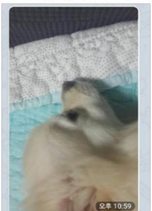

〈그림 4〉텔레그램 대화방에서 전송한 이미지

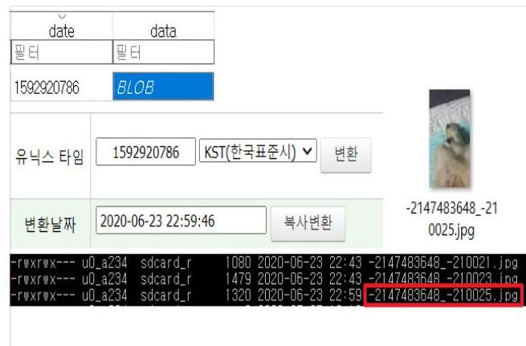

〈그림 5〉텔레그램 DB와 이미지 캐시 파일

일반대화모드에서 〈그림 6〉 및 〈그림 7〉과 같이 이미지파일이 삭제되어 없더라도 캐시 파일이 남아있는 것을 확인할 수 있다. 사진은 클릭하지 않더라도 대화방에 전송된 화면을 보는 것만으로도 시청이라고 볼 수 있기 때문에 시청행위의 증거로 사용할 수도 있다.

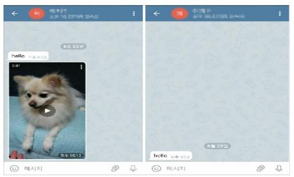
〈그림 6〉 텔레그램 대화방에서 이미지 삭제
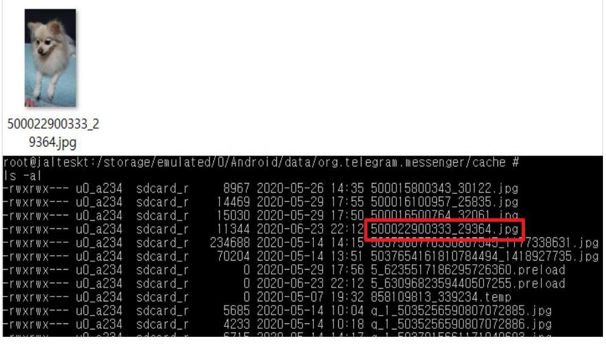

〈그림 7〉 텔레그램 대화방 내 삭제된 이미지의 캐시 파일

비밀대화모드에서도 자동삭제 타이머를 설정하지 않으면 일반대화모드와 동일하게 저장 되나, 자동삭제 타이머를 설정하면 삭제 전까지 〈그림 8〉과 같이 암호화된 캐시 파일 형태 로 저장되고, 삭제되는 순간 캐시 파일은 물론, 데이터베이스까지 삭제되어 확인할 수 없다.

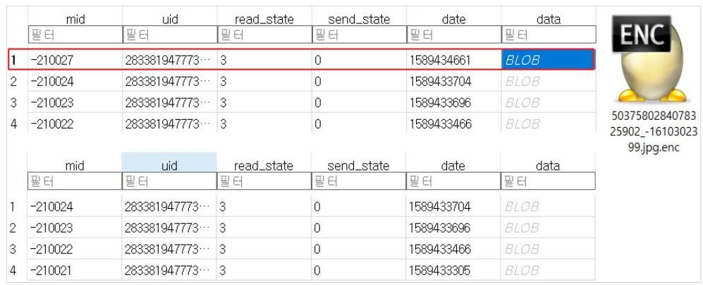

〈그림 8〉 텔레그램 비밀대화모드 이미지파일 저장 방법

# (3) 동영상 시청 

동영상 파일 역시 이미지 파일과 동일한 방식으로 데이터베이스에 저장된다. 동영상의 캐 시 파일은 〈그림 9〉의 좌측 사진과 같이 썸네일(이미지 파일)로 생성된다. 짧은 동영상 파 일의 경우 〈그림 9〉의 우측 사진처럼 간헐적으로 동영상 파일이 캐시 파일로 저장되기도 한다. 대화방이 삭제되더라도 캐시 파일은 그대로 남아있다. 이미지 파일과 마찬가지로 비 밀대화모드에서 자동삭제 타이머를 설정할 경우 암호화된 썸네일(이미지 파일)만 생성되고, 타이머가 종료되어 미디어가 지워질 경우 데이터베이스와 캐시 파일은 모두 삭제되어 확인 할 수 없었다.
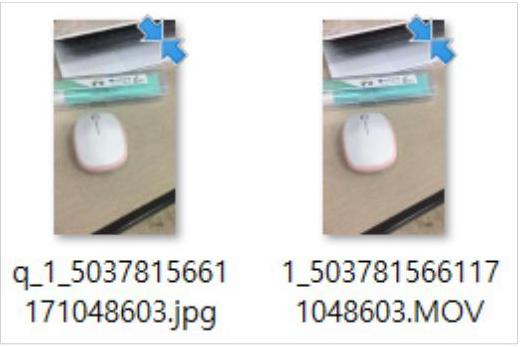

〈그림 9〉 텔레그램 동영상파일 캐시

# 나. 와이어 

## (1) 이미지 시청

와이어는 텔레그램과 달리 데이터베이스 형태로 대화 내용을 저장하지 않는다. 와이어에 서 주고받은 대화 내용은 그 어떠한 DB 파일에도 저장되어 있지 않았다. 하지만 이미지 파 일은/data/data/com.wire/cache/image_manager_disk_ cache 디렉토리에 확장자가 '. 0 '인 캐시 파일 형태로 저장되어 있었다. '. 0 ' 파일은 WindowsOS에서 열 수 없는 확장자 이나, 〈그림 10〉과 같이 파일 헤더부분에서 JPG파일의 시그니처 값을 확인할 수 있었다. 확장자를 . 0 에서 헤더부분의 파일 시그니처와 동일한 .jpg로 변경하였더니 〈그림 11〉 및〈그림 12〉와 같이 대화방에서 주고받은 그림 파일이 도출되었다.
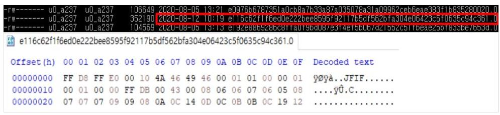

〈그림 10〉 Wire 캐시파일 헤더

와이어에서 자동 삭제 타이머를 설정하거나 메시지를 삭제하면 〈그림 13〉과 〈그림 14〉와 같이 대화방에서는 삭제되지만 캐시 파일은 그대로 존재한다. 메시지를 수동으로 삭제한 경 우에는 상대방의 대화방에 삭제한 흔적과 수신된 시간 정보가 남지만, 자동삭제 타이머를 설정한 경우 삭제되면 대화방에 흔적이 남지 않는다. '자동삭제 타이머 테스트' 텍스트 후 자동삭제 기능을 이용하여 이미지를 보냈으나 〈그림 13〉에서와 같이 삭제된 후에는 어떠한 표시도 남지 않았다. 와이어는 메시지를 데이터베이스 형태로 저장하지 않아 메시지 복원이 어려우므로 자동삭제 기능을 통해 대화방 내에 이미지를 송수신한 기록이 전혀 남지 않는다 면 캐시 파일이 생성된 시각으로 미디어 파일을 송수신했다는 것을 증명해야 한다.
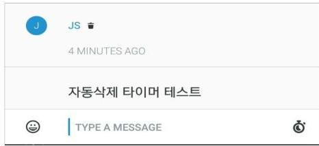

〈그림 13〉 Wire 대화방에서 이미지 파일 삭제
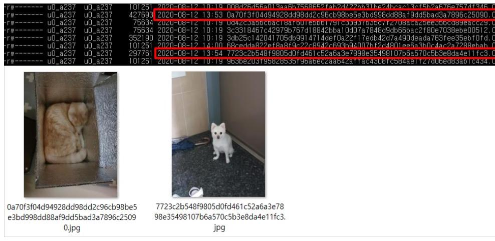

〈그림 14〉 Wire 대화방 내 삭제된 이미지 파일 캐시

단, 와이어의 경우 이미지 캐시 파일이 반드시 처음 이미지를 시청한 시간에만 생성되는 것은 아니다. 대화방에 일정 시간 이후 재접속할 경우 기존에 남아있는 대화방의 이미지와

동영상의 캐시 파일이 재생성 된다. 이를 통해 사용자가 대화방에 접속한 시간과 대화방에 서 삭제된 미디어 파일 등을 특정할 수 있다.

# (2) 동영상 시청 

동영상 파일은 재생을 하면 /data/media/0/Android/data/com.wire/cache 디렉토리 에 mp 4 파일 형태로 저장된다. 〈그림 15〉와 〈그림 16〉과 같이 동영상 캐시 파일도 이미지 캐시 파일과 동일한 경로와 확장자로 씸네일이 저장된다. 씸네일은 동영상을 재생하지 않더 라도 대화방에 접속 시 동영상이 온 것을 확인하는 것 만으로도 생성될 수 있다. 그러나 와 이어는 동영상을 시청할 경우 〈그림 17〉과 같이 동영상 캐시 파일이 저장된다. 동영상 재 생을 위해서는 반드시 대화방에서 동영상 재생 버튼을 누른 후 로딩바가 모두 진행된 후부 터 재생할 수 있다. 로딩바가 모두 진행된 후에는 동영상 캐시 파일이 저장되게 되므로 이 캐시 파일로 동영상을 시청하였다는 사실을 증명할 수 있다.
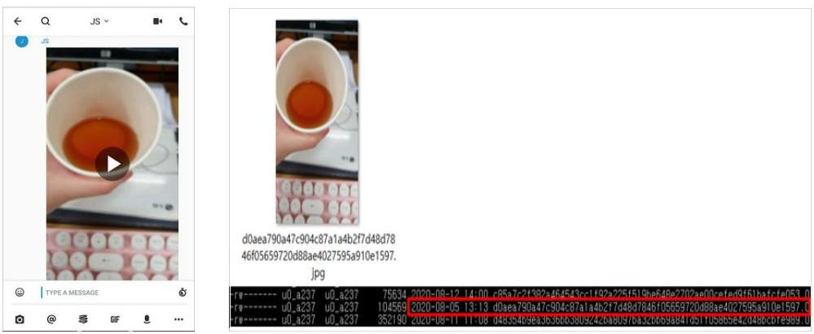

〈그림 16〉 Wire 동영상파일 썸네일

<그림 15〉 Wire 대화방에서 전송한 동영상 파일

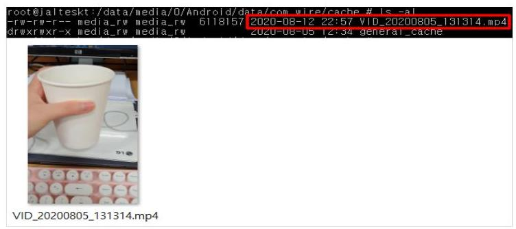
〈그림 17〉 Wire 동영상 캐시 파일

# 다. 디스코드 

## (1) 이미지 시청

디스코드는 대화내용이 데이터베이스가 아닌 일반 텍스트 형태로 파일에 저장이 된다.37) 이미지 캐시 파일은 /data/data/com.discord/cache/app_images_ cache_small/ v2.ols100.1/[랜덤숫자] 디렉토리 하위에 cnt 파일로 저장된다. cnt 파일은 Windows 환경 에서 실행할 수 없지만 〈그림 18〉과 〈그림 19〉와 같이 파일의 시그니처를 확인해 보면 webp 파일의 시그니처를 가지고 있다는 것을 알 수 있다. webp 파일은 〈그림 20〉과 같이 Chrome HTML Document 파일로 Chrome 웹 브라우저를 통해 실행할 수 있다. 따라서 cnt 확장자를 webp 확장자로 변경하여 이미지 캐시 파일을 확인하였다.
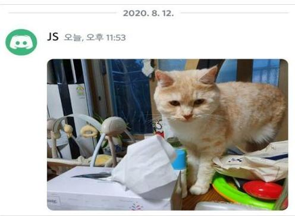
〈그림 18〉 Discord 대화방에서 전송한 이미지 파일

[^0]
[^0]:    37) 신수민, "디지털 포렌식 관점에서의 Slack 및 Discord 메신저 아티팩트 분석", 디지털콘텐츠학회논문지 제21권 제 4호, 2020, 804면.

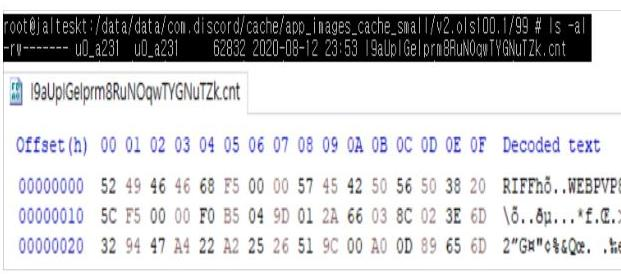

〈그림 19〉 Discord 이미지 캐시 파일 헥사값
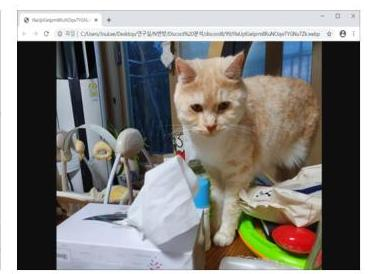

〈그림 20〉Discord 이미지 캐시 파일

디스코드는 자동 삭제 타이머 기능은 제공하지 않고, 메시지 수동 삭제만 가능하다. 보낸 이미지 파일을 삭제하면 〈그림 21〉과 같이 대화방에는 그 어떠한 흔적도 남아있지 않지만〈그림 22〉와 같이 캐시 파일은 남아있는 것을 확인할 수 있다.
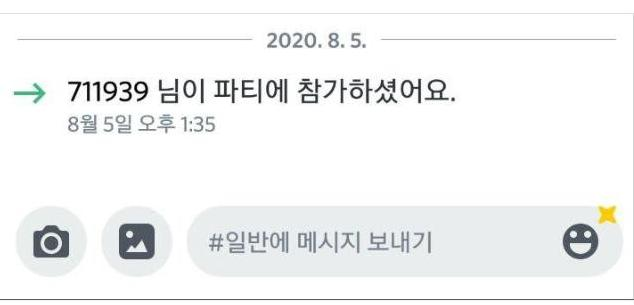

〈그림 21〉Discord 대화방에서 이미지 파일 삭제

〈그림 22〉Discord 대화방 내 삭제된 이미지 캐시

# (2) 동영상 시청 

디스코드는 동영상 파일 전송 기능을 제공하지 않는다.

## 3. 연구결과 및 한계

실험결과 이미지 시청의 경우 텔레그램은 일반대화모드와 비밀대화모드에서 이미지가 존 재하거나 삭제되더라도 캐시파일 형태로 시청을 입증할 수 있다는 것을 확인하였다. 다만, 비밀대화모드 일대일 대화방에서 자동삭제 타이머 기능이 설정된 경우 이미지가 있을 때는 암호화되어 있다 하더라도 캐시파일이 존재하여 입증이 가능하고, 자동삭제 타이머 기능에 의해 삭제된 경우에는 입증이 불가능하였다. 와이어와 디스코드는 이미지가 존재하거나 삭 제되더라도 모두 캐시파일이 존재하여 입증이 가능하였다. 디스코드는 텔레그램과 와이어와 동일하게 대화방에 접속하여 이미지를 송수신하면 캐시 파일로 저장 된다. 해당 캐시는 대 화방에서 이미지가 삭제된다고 하더라도 삭제되지 않고 그대로 남아있는 것을 확인하였다.

동영상 시청의 경우 텔레그램은 일반대화모드와 비밀대화모드에서 시청여부와 관계없이 동영상을 경과하기만 하면 썸네일이 존재하여 추가조사를 통한 입증이 필요하다는 것을 확 인하였다. ${ }^{38)}$ 다만, 비밀대화모드 일대일 대화방에서 자동삭제 타이머 기능이 설정되어 일정 시간 경과로 삭제된 경우에는 입증이 불가능하였다. 와이어는 동영상이 존재하거나 삭제되 더라도 모두 캐시파일이 존재하여 입증이 가능하였다. 단순히 시청만 하더라도 mp4 파일 이 그대로 캐시에 저장되기 때문에 비교적 쉽게 시청행위를 입증할 수 있다. 다만, 대화 기 록이 저장된 파일을 발견하지 못해 대화방에서 이미지나 동영상이 삭제될 경우 캐시 파일이 생성된 시간인 대화방에 접속하여 미디어 파일을 확인한 시간만 파악할 수 있고, 정확한 이 미지 및 동영상 송수신 시각은 특정하기가 어렵다. 디스코드는 동영상 전송 기능이 없어 실 험에서 제외하였다. 연구결과는 이미지 시청에 대해서는〈표 1〉, 동영상 시청에 대해서는〈표 2〉에서 정리하였다.

[^0]
[^0]:    38) 간헐적으로 동영상이 캐시 파일로 저장되는 경우가 있어 이에 대한 후속연구가 필요하다.

〈표 3〉 모바일 메신저 별 이미지 시청 행위에 대한 실험결과

| 종류 | 모드 | 대화방 | 이미지 존재 | 이미지 삭제 |
| :--: | :--: | :--: | :--: | :--: |
| 텔레그램 | 일반   대화 | 일대일 | 캐시파일로 입증가능 | 캐시파일로 입증가능 |
|  |  | 그룹 | * | * |
|  | 비일   대화 | 일대   일 | 자동삭제   타이머 미설정 | * | * |
|  |  |  | 자동삭제   타이머 설정 | 캐시파일이 암호화되어 있지만   존재만으로 입증가능 | 입증불가 |
| 와이어 | 일반   대화 | 일대일 |  | 캐시파일로 입증가능 | 캐시파일로 입증가능 |
|  |  | 그룹 | * | * |  |
| 디스코드 | 일반   대화 | 일대일 | * | * |  |

〈표 4〉 모바일 메신저 별 동영상 시청 행위에 대한 실험결과

| 종류 | 모드 | 대화방 | 동영상 존재 | 동영상 삭제 |
| :--: | :--: | :--: | :--: | :--: |
| 텔레그램 | 일반   대화 | 일대일 | 시청여부와 관계없이 동영상을 경과하기만 하면 썸네일 존재, 추가조사로 입증필요 | 시청여부와 관계없이 동영상을 경과하기만 하면 썸네일 존재, 추가조사로 입증필요 |
|  |  | 그룹 | * | * |
|  | 비일   대화 | 일대   일 | 자동삭제   타이머 미설정 | * | * |
|  |  |  | 자동삭제   타이머 설정 | * | 입증불가 |
| 와이어 | 일반   대화 | 일대일 |  | 캐시파일로 입증가능 | 캐시파일로 입증가능 |
|  |  | 그룹 | * | * |  |
| 디스코드 | 일반   대화 | 일대일 |  | - | - |
|  |  | 그룹 | - | - |  |

다만, 본 연구는 수많은 모바일 메신저 중에서 3개만을 선정하여 하였고, 그것도 특정 버 전을 중심으로 수행하였다는 한계를 지니고 있다. 어플리케이션의 데이터 파일에 접근하기 위해 루팅이 가능한 Galaxy S4 기기에 한정하여 실험을 하였다.39) 나아가 이미지와 동영 상을 시청한 경우나 시청하지 않고 수신만 한 경우에 동일한 증거가 남아 일부 시청행위를
39) 모바일포렌식 도구를 활용하면 관련 데이터 파일에 접근할 수 있기 때문에 다양한 기기를 대상으로 실험할 수 있 을 것이다.

명확하게 입증하지 못한 한계도 보이고 있다.

# V. 결 론 

이상에서 모바일 메신저에서 디지털성착취물 시청행위 입증을 위한 디지털포렌식 기술에 대해서 살펴보았다. 제 2 장에서는 디지털성착취물 시청죄가 갖는 형사법적 의의를 살펴보았 다. 제3장에서는 모바일 메신저의 운영방식을 살펴보고 시청행위 입증이 왜 중요한지 검토 하였다. 제 4 장에서는 텔레그램, 와이어, 디스코드를 대상으로 디지털성착취물을 시청했을 경우에 어떠한 증거가 남는지 실험하였다.

그 결과 이미지 시청의 경우 텔레그램은 일반대화모드와 비밀대화모드에서 이미지가 존재 하거나 삭제되더라도 캐시파일 형태로 시청을 입증할 수 있다는 것을 확인하였다. 다만, 비 밀대화모드 일대일 대화방에서 자동삭제 타이머 기능이 설정된 경우 이미지가 있을 때는 암 호화되어 있다 하더라도 캐시파일이 존재하여 입증이 가능하고, 자동삭제 타이머 기능에 의 해 삭제된 경우에는 입증이 불가능하였다. 와이어와 디스코드는 이미지가 존재하거나 삭제 되더라도 모두 캐시파일이 존재하여 입증이 가능하였다. 동영상 시청의 경우 텔레그램은 일 반대화모드와 비밀대화모드에서 시청여부와 관계없이 동영상을 경과하기만 하면 썸네일이 존재하여 추가조사를 통한 입증이 필요하다는 것을 확인하였다. 다만, 비밀대화모드 일대일 대화방에서 자동삭제 타이머 기능이 설정되어 일정시간 경과로 삭제된 경우에는 입증이 불 가능하였다. 와이어는 동영상이 존재하거나 삭제되더라도 모두 캐시파일이 존재하여 입증이 가능하였고, 디스코드는 동영상 전송 기능이 없어 실험에서 제외하였다.

이번 연구는 안드로이드 기기인 Galaxy S4 스마트폰에서 진행하였지만, 향후 다양한 플 랫폼 기기로 확대하여 관련연구를 지속적으로 수행할 필요가 있다. 이미지와 동영상에 대한 시청행위가 명확히 입증되지 못한 경우에 대해서도 후속 연구가 필요하다. 이를 통해 수사 현장에서 디지털성착취물 시청행위를 입증하여 범죄자를 처벌하는데 기여하기를 바란다.

〈 논문접수 2020. 10. 30. 심사개시 2020. 11. 14. 게재확정 2020. 12. 17. >

# 참고문헌 

## I. 국내문헌

고명수. "인터넷을 통한 아동$\cdot$청소년성착취물 수요(소지$\cdot$시청) 규제에 관한 연구 - 「아 동$\cdot$청소년의 성보호에 관한 법률」제 11 조 제 5 항 개정을 중심으로.", 법제 690, 2020.

김기범, "해시함수의 형사법적 고찰", 형사정책연구, 제29권 제2호, 2018.
김슬기, "인터넷상 아동$\cdot$청소년 이용 음란물 소지의 개념에 관한 검토 - 미국과의 비교를 중심으로 -", 과학기술법연구 제 18 집 제 3 호, 2012.

김정혜, "텔레그램 'n번방'등 온라인 매개 성폭력 사건들을 통해 본 이 시대 성폭력의 특 성", 한국여성정책연구원, 제53호, 2020.

박다온, 이관희, "온라인 아동 성착취물(CSEM)의 실태와 대응 방향에 관한 소고", 경찰학 논총 15(3), 2020.

신수민, "디지털 포렌식 관점에서의 Slack 및 Discord 메신저 아티팩트 분석", 디지털콘 텐츠학회논문지, 제 21 권 제 4 호, 2020.

이훈재, "스마트폰 신종범죄의 유형 및 경찰 대응방안에 관한 연구", 한국경찰연구, 제 11 권 제 4 호, 2012.

전치홍, "디지털 증거의 역외 압수수색에 관한 최신 쟁점: 미국의 사례 및 법제 중심으 로", 형사소송 이론과 실무 제 10 권 제 1 호, 2018.

천성덕, "디지털 포렌식 분석을 통한 온라인 음란물 최초 유포자 확인 연구 - 클라우드, 카카오톡, 텔레그램을 중심으로 -", 치안정책연구, 제33권 제2호, 2019.

황태진, "모바일 포렌식을 이용한 메신저 증거 비교 분석 연구", 성균관대학교 정보통신 대학원 석사학위 논문, 2018.

## II. 해외

ACLU Foundation, Electronic Frontier Foundation, National Association of Criminal Defense Lawyers (NACDL), "Challenging Government Hacking in Criminal Cases" Chapter II, 2017.

Aditya Candra, Yusuf Kurniawan, Kyung-Hyune Rhee, "Security Analysis Testing for Secure Instant Messaging in Android with Study Case: Telegram", 2016 IEEE 6th International Conference on System Engineering and Technology, 2016.

Arash Dargahi Nobari, Negar Reshadatmand, Mahmood Neshati, "Analysis of Telegram, An Instant Messaging Service", CIKM '17: Proceedings of the 2017 ACM on Conference on Information and Knowledge Management, 2017.

Gandeva Bayu Satrya, Philip Tobianto Daely, Muhammad Arif Nugroho, "Digital Forensic Analysis of Telegram Messenger on Android Devices", International Conference on Information, Communication Technology and System, 2016.
J. Gregorio, B. Alarcos, A. Gardel, "Forensic analysis of Telegram Messenger Desktop on MacOS", International Journal of Research in Engineering and Science, Vol.6, No.8, 2018.

Jeeun Lee, Rakyong Choi, Sungsook Kim, Kwangjo Kim, "Security Analysis of End-to-End Encryption in Telegram", 2017 Symposium on Cryptography and Information Security, 2017.

Tomáš Sušánka, Josef Kokeš, "Security Analysis Telegram IM", ROOTS: Reversing and Offensive-oriented Trends Symposium Vienna Austria, 2017.

# A Study on the Digital Forensic of Viewing Digital Sexual Exploitation Material in Mobile Messenger 

Lee, Ji $\mathrm{Su}^{11}$ Lee, Yeon $\mathrm{Ju}^{11} \cdot$ Kim, Gi Bum ${ }^{11^{*}}$

As follow-up legislation to the "Nth room" case in 2020, the government established a crime of viewing illegal photographs and replicas under the Child and Youth Sexual Harassment Act (Article 11 (5)) and the Sexual Violence Punishment Act (Article 11 (4)). The possession of Digital Sexual Exploitation Material is easy to prove because files are stored on computers and smartphones, but the fact had viewed them is difficult to prove if the files do not existed. Therefore, Investigative Agencies needed digital forensic technology to prove it.

Accordingly, in this study, we experimented with what traces of Digital Sexual Exploitation Material were left whenever viewed Digital Sexual Exploitation Material on mobile messengers such as Telegram, Wire, and Discord. As a result, images existed in the general conversation mode and the secret conversation mode of Telegram when viewing the image. Eeven if the image was deleted in Telegram, the viewing behavior could be verified because the image exists in the form of a cache file. However, if the automatic delete timer function was set in the one-to-one chat room in the secret conversation mode, the cache file could still exist even if the image was encrypted, but if it was deleted by the automatic delete timer function, it can't be verified. Wires and Discord were both verified by the presence of cache files, even if images were present or deleted.

In the case of video viewing, Telegram confirmed that a thumbnail exists whenever the video has been sent regardless of whether it is watched in general conversation mode or secret conversation mode, which requires further investigation. However, it was impossible to prove if the automatic delete timer function was set in the one-to-one chat room of the secret conversation mode and deleted after a certain time. Wire could be verified because even if the video existed or was deleted, all cache files still existed, and Discord does not leave any cache files because it did not

[^0]
[^0]:    1) Department of Forensic(Graduate School) in Sungkyunkwan University

    * Corresponding Author

have the video transmission function.
We hope that the results of this study will prove the fact for having viewed of Digital Sexual Exploitation Material at the scene of investigation and contribute to punish criminals.

Keywords： Digital Forensics, Mobile Forensics, Child Sexual Exploitation Material, Digital Sexual Crime Material, Telegram

