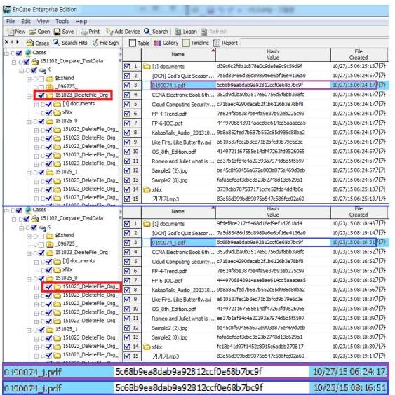

# 모바일 포렌식 증거능력 확보 방안 연구 

어 수 옹, ${ }^{1 *}$ 조 우 연, ${ }^{1}$ 이 석 준, ${ }^{1}$ 손 태 식 ${ }^{2 \dagger}$ ${ }^{1}$ 아주대학교 컴퓨터공학과, ${ }^{2}$ 아주대학교 사이버보안학과

## Ensuring the Admissibility of Mobile Forensic Evidence in Digital Investigation

Soowoong Eo, ${ }^{1 *}$ Wooyeon Jo, ${ }^{1}$ Seokjun Lee, ${ }^{1}$ Taeshik Shon ${ }^{2 \dagger}$ ${ }^{1}$ Department of Computer Engineering, Ajou University ${ }^{2}$ Department of Cyber Security, Ajou University

요 약

모바일 포렌식은 스마트폰의 대중화와 다양한 모바일 기기의 증가로 인해 그 중요성 및 필요성이 급격히 증가하 고 있다. 하지만 그 방안 및 절차는 아직 모바일 포렌식의 특성에 충분히 맞게 적용되고 있지 않다. 이에 따라 본 논문에서는 현재 모바일 포렌식이 직면한 문제점을 파악하기 위해 법$\cdot$제도$\cdot$기술적 관점에서의 분석을 수행하였으며 이를 통해 모바일 기기에 대해서는 현재 디지털 포렌식 수사과정에서 큰 이슈가 되고 있는 선별압수에 있어서 제약 사항이 있음을 확인하였다. 또한 모바일 포렌식에서 디지털 증거 수집 방안에 대한 분석 및 실사용 도구의 우결성 연구를 진행함으로써 현재 기술의 적합성 검증 및 추후 발생될 문제점에 대해 분석하였으며 결과적으로 모바일 포렌 식에서 수집된 데이터가 증거능력을 확보할 수 있는 방안을 위해 전반적인 고려사항을 제시하였다.

## ABSTRACT

Because of the evolution of mobile devices such as smartphone, the necessity of mobile forensics is increasing. In spite of this necessity, the mobile forensics does not fully reflect the characteristic of the mobile device. For this reason, this paper analyzes the legal, institutional, and technical considerations for figuring out facing problems of mobile forensics. Trough this analysis, this study discuss the limits of screening seizure on the mobile device. Also, analyzes and verify the mobile forensic data acquisition methods and tools for ensuring the admissibility of mobile forensic evidence in digital investigation.
Keywords: Digital Forensics, Mobile Forensics, Evidence Acquisition, Searches and seizures

## I. 서 론

ICT 기술의 급격한 진보와 그러한 기술들의 사회 전반으로 융복합화는 다양한 모바일 기기를 출현시키 고 있으며, 사용자들에게 더욱 중요하고 민감한 정보 를 생산하고 활용하게 만들고 있다. 이러한 변화 속 에 사람들은 보다 더 편리한 서비스들을 제공받고 사

[^0]융할 수 있게 되었지만 반면에 이러한 모바일 기기를 악용하거나 대상으로 하는 범죄나 기술들이 함께 증 가하고 있어서 기존의 컴퓨터나 서버, 혹은 그 저장 매체가 아닌 스마트폰이나 태블릿 PC와 같은 모바 일 기기에 대한 모바일 포렌식의 필요성이 강조되고 있다.

디지털 포렌식에서 수사현장의 디지털 증거를 확 보하는 방안 및 절차는 디지털 증거물이 법적 효력을 가질 수 있는지의 여부를 결정하기 때문에 엄격하고 체계적으로 다뤄져야하는 부분이다. 따라서 이 과정 에서부터 수사기관, 포렌식 전문가 등 포렌식 수사의

[^0]:    Received(12. 03. 2015). Modified(01. 22. 2016). Accepted(01. 26. 2016)
    + 주저자. infinitus@ajou.ac.kr
    $\ddagger$ 교신저자. tsshon@ajou.ac.kr(Corresponding author)

담당자는 법률에 기반을 두어 정해진 절차를 따라 디 지털 증거물 확보를 하게 된다[1]. 모바일 포랜식은 이러한 디지털 포랜식의 한 종류로써 모바일 기기에 특화된 디지털 포랜식을 의미한다. 이에 디지털 포랜 식의 단순한 하위개념으로 인식될 수도 있지만 모바 일 기기의 특성에 기반으로 하기 때문에 그에 따른 차이점이 존재한다. 따라서 항시 휴대하고 다니며 네 트위크에 연결되어 있는 모바일 기기의 특성, 저장방 식의 차이, 저장된 데이터 종류의 차이 등으로 인해 기존 디지털 포랜식의 방식 및 절차를 모바일 기기에 그대로 적용하기에는 한계가 있다. 이에 따라 스마트 폰의 등장이후 급변하는 모바일 기기의 특성에 맞게 모바일 포랜식을 지속적으로 발전시킬 필요성이 있 다. 이러한 추세에 따라 대검찰청의 국가 디지털 포 랜식 센터(National Digital Forensic Center, NDFC)의 주요 업무에도 모바일 포랜식은 다른 컴 퓨터 포랜식과 데이터베이스 포랜식 등과 차별화되어 구별 지어져 있다. 이와 같이 경찰청 디지털 포랜식 센터에서도 컴퓨터 포랜식팀과 모바일 포랜식팀을 별 개로 운영하고 있다.

모바일 포랜식을 포함한 모든 디지털 포랜식에서 는 디지털 증거의 증거능력을 법정에서 입증하기 위 해 디지털 증거를 수집하고 분석하는 도구의 신뢰성 을 확보하는 일이 필수적이다. 따라서 도구의 신뢰성 을 입증하는 방안이나 공식적으로 검증하는 기관의 필요성은 갈수록 증가하고 있다. 이에 미국 국립표준 기술연구소 NIST에서는 미 사법연구원의 지원을 받 아 컴퓨터 포랜식 도구 시험 프로그램인 CFTT(the Computer Forensics Tool Testing) 프로젝트 를 운영하고 있으며 디지털 포랜식에서 많이 사용되 는 EnCase, FTK Imager, Tableau Imager 등 의 도구들을 검증 및 평가하고 있다. 또한 모바일 기 기에 대한 도구들에 대해서도 그 가이드라인과 실제 제품들의 검증 및 평가가 진행되었으며 그 결과를 CFTT 웹사이트를 통해 공개하였다[2]. 이러한 결 과들은 테스트 방법, 테스트 결과 등을 모두 인터넷 에 공개하고 있어 우리나라의 사건에서 그대로 적용 할 수도 있지만 이 검증과 평가는 미국의 환경과 법 률이 기준이므로 우리나라는 우리나라에 맞는 평가나 검증, 가이드라인 등이 필요할 것이다. 이에 우리나 라에서도 2007년부터 TTA에서 디지털 증거에 대한 표준들인 '컴퓨터 포랜식을 위한 디지털 데이터 수집 도구 검증[3], '컴퓨터 포랜식을 위한 디지털 데이터 수집도구 요구사항[4]'을 제시하였으며 '이동 전화

포랜식 가이드라인[5]'와 같이 이동전화에 대한 포랜 식 가이드라인을 제시하기는 했지만 해당 표준의 게 재정일은 2007년도로 스마트폰과 같은 최신 모바일 디바이스가 고려되었다고 보기는 힘들다. 도구에 대 한 검증은 기술적인 고려사항의 하나이며, 기술적인 고려사항과 함께 고려되어야할 부분은 법-제도적인 고려사항이다. 도구의 신뢰성이 입증되었다고 하더라 도 디지털 증거가 획득되고 법정에 제출되는 순간까 지의 모든 절차가 적법한 절차에 의해 진행되어야 하 며 한 순간이라도 법적 절차를 무시하고 진행되었다 면 법정에서의 증거능력을 상실하게 될 수 있다. 또 한 이러한 고려사항들이 현재는 일반적인 디지털 포 랜식에 초점이 맞춰져있어 모바일 기기에 특성에 맞 는 모바일 포랜식 관찰에서의 고려사항들에 대한 연 구 및 분석이 필요하다. 따라서 본 논문에서는 스마 트폰과 같은 모바일 기기를 중점으로 모바일 포랜식 에서의 법-제도적 이슈와 획득/검증 과정에서의 기술 적인 이슈를 분석하고 획득 방법과 실사용 도구들을 실험을 통해 검증한다.

본 논문의 구성은 다음과 같다. 2장에서는 모바일 포랜식의 관련연구에 대해 분석을 하며, 3장에서는 모바일 포랜식에서의 법제도적인 고려사항을 분석하 며 4장은 증거 획득/검증방안 및 기술적인 고려사항 을 분석하고 5장에서는 이에 대한 검증을 하기위한 실험 및 분석 수행한다. 마지막으로 6장에서는 결론 을 맺는다.

## II. 관련 연구

모바일 포랜식은 모바일 기기들과 그 기술들의 발 전, 대중화로 인해 디지털 포랜식 분야에서 핵심적인 부분으로 자리 잡고 있으며, 국내에서는 2006년 처 음 PDA에 대한 디지털 증거를 분석하기 시작한 것 을 시작으로[6] 그 수요나 연구에 대한 중요성이 증 가하고 있다.

모바일 포랜식에 대한 연구에서 휴대가능한 모바 일 기기를 대상으로 한다는 점 그리고 증거능력의 확 보, 무결성 입증 등 큰 틀에서의 연구 방향은 동일하 지만 스마트폰의 출현 전과 후에 세부적인 방법에서 변화가 있다. 스마트폰이 아직 대중화되지 않은 시기 에는 SIM카드를 사용하지 않는 CDMA 휴대폰인 피처폰을 중심으로 데이터 획득, 분석에 대해 연구가 진행되었으며 획득하여 분석 대상으로 삼은 데이터들 은 SMS운자, 전화번호부, 통화기록 같은 데이터들

이 중점적이었다[7][8]. 데이터 추출 방식도 피처폰 에서 가능했던 JTAG방식이나 메모리 칩을 분리하 는 방식을 주요 연구 대상으로 하고 있었다[9][10].

하지만 스마트폰이 대중화되고 그 성능이 피처폰 파는 상이하게 발전함에 따라 모바일 포렌식 분야는 스마트폰이나 태블릿 PC와 같은 스마트 기기를 중 심으로 연구가 진행되고 있다. 획득과 분석의 대상으 로 삼는 데이터는 기존 피처폰에서도 분석되었던 운 자, 통화기록 등을 기본으로 하며 웹 히스토리, 위치 정보, 이메일 및 이미지, 파일 등의 저장된 데이터를 기본으로 스마트폰 어플리케이션 관련 사용 데이터가 주요 분석 대상이다[10][11]. 또한 스마트 폰에서 사용되는 안드로이드, iOS 와 같은 모바일 운영체제 의 분석을 기반으로 한 파일 포렌식 기술이 주를 이 룬다. 이에 따라 ETRI의 "스마트폰 포렌식 기술 동 향"[10]에서는 JTAG방식과 메모리 칩 분리 방식 외에 Android와 iOS 운영체제를 기반으로 데이터 를 수집 및 분석하는 방안에 대해서 기술하고 있으며 NIST에서 2014년 발간한 "Guidelines on Mobile Device Forensics"[11]에서도 안드로이 드와 iOS 기기에 대한 고려사항도 언급하고 있다.

특정 모바일 OS에 기반한 모바일 포렌식 관련 연 구들 중에서는 전 세계 모바일 OS 시장 점유율의 $80 \%$ 이상[12]을 차지하고 있는 안드로이드에 대한 연구가 가장 활발하게 진행되고 있다. 이에 안드로이 드에서 YAFFS2나 EXT4 파일시스템을 기반으로 전반적인 포렌식 분석 방법에 대한 연구가 있었으며 [13][14], 안드로이드 OS 기반으로 논리적, 물리적 데이터 추출 방법에 대해서도 연구되었다[15]. 안드 로이드 어플리케이션과 윈도우즈 어플리케이션을 ADB(Android Debug Bridge)를 통해 연계하여 논리적 분석 기반의 안드로이드 포렌식 도구와[16] 안드로이드 기기를 대상으로 포렌식 수사에 도움을 주기 위한 안드로이드 모니터링 시스템[17] 등의 도 구들이 제시된 바 있다. 또한 안드로이드에서 디지털 증거를 획득하는 절차에 대해 디지털 포렌식 관점에 서 안드로이드에서의 디지털 증거를 획득하는 절차에 대한 연구도 진행되었다[18].

디지털 포렌식 수사의 압수수색에서는 기술적인 사항뿐만 아니라 법제도적인 사항으로 인해 증거능력 의 확보여부가 결정되게 되는데 기존의 실체를 갖는 증거들과 달리 디지털 증거에 관해서는 논란의 여지 가 많다. 이에 따라 디지털 증거 압수수색과 관련하 여 법제도적인 부분이나 실무적인 부분에 입각하여

그 문제점이나 개선방안들에 대해서도 지속적이며 활 발히 논의되고 있다[18][19][20][21]. 하지만 모바 일 포렌식과 관련해서는 일부 언급이 있을 뿐 기존 디지털 포렌식과의 차이점으로 인해 생기는 추가적인 법제도적인 사항에 대한 연구는 아직 미미하다. 모바 일 기기가 일상생활에 깊이 스며들었기 때문에 이를 통한 증거확보 및 범죄수사가 큰 역할을 하는 경우가 많아지고 있으므로 이에 대한 기술적인 부분의 연구 와 법률적인 부분의 연구가 모두 필요한 시점이며, 모바일 기기의 특성으로 인해 발생하는 차이점 및 한 계점을 분석하여 모바일 기기에서 효율적으로 증거를 수집하고 증거 능력을 확보하는 연구가 필요하다.

## III. 모바일 포렌식 법 제도적 고려사항

디지털 증거를 획득함에 있어 법적 사항을 철저히 고려하는 것은 획득한 증거에 대해 증거능력 확보여 부를 결정하기 때문에 이러한 부분이 확실하게 고려 되어야 한다. 따라서 본 장에서는 모바일 포렌식에서 법률적인 고려사항을 짚어보고 각 고려사항별로 모바 일 기기에서의 한계점을 서술한다.

## 3.1 프라이버시의 관점

디지털 증거의 압수수색 절차에서 비례의 원칙을 철저히 준수하여야 한다. 비례의 원칙이란 과잉금지 의 원칙이라고도 하며 "국민의 모든 자유와 권리는 국가안전보장$\cdot$질서 유지 또는 공공복리를 위하여 필 요한 경우에 한하여 법률로써 제한할 수 있으며, 제 한하는 경우에도 자유와 권리의 본질적인 내용을 침 해할 수 없다."라고 규정하고 있는 대한민국 헌법 제 37 조 제2항이 그 근간이 되었다. 디지털 증거의 압 수수색 절차상에서 일반적, 포괄적, 탐색적 압수수색 으로 인해 헌법상의 기본권이 과도하게 침해되거나 제한되는 현상을 불러올 수 있으며 이는 과잉 압수수 색 문제를 일으켜 증거능력을 상실할 가능성이 존재 하기 때문에 법률적인 사항을 명확히 고려해야한다. 디지털 증거 수집 및 분석 규정 제 12조(과잉금지 원칙 준수)에서는 "디지털 증거를 압수수색$\cdot$검증할 때에는 수사에 필요한 최소한의 범위에서 실시하여야 하고, 모든 과정에서 적법절차를 엄격히 준수하여야 한다."고 규정하고 있고, 제 13조(디지털 포렌식 수 사관에 의한 압수수색$\cdot$검증)에서는 "디지털 증거의 압수수색$\cdot$검증은 디지털 포렌식 수사관 또는 대검찰

청에서 실시한 디지털 증거 압수수색 실무교육을 받 은 수사관이 하여야 한다. 다만, 긴급을 요하는 등 부득이한 사유가 있는 경우에는 다른 수사관이 이를 대신할 수 있으며, 이 경우 디지털수사담당관 등에게 그 사실을 통보하고 협조를 구해야 한다."고 규정하 고 있다.

모바일 기기는 개인이 항시 소지하고 다니며 사용 하기 때문에 다른 어떤 기기보다 개인의 사생활과 연 관이 많게 된다. 따라서 모바일 기기에서 디지털 증 거를 획득할 때에는 그 어떤 기기보다도 개인의 사생 활, 프라이버시와 관련된 부분이 기본권 침해로 이어 져 민감하게 작용되게 되므로 압수수색에서의 비례의 원칙을 최대한 지킬 필요가 있다. 하지만 모든 사건 에 대해서 이를 동일하게 적용시키는 것보다 사건의 경중에 따라 적절히 적용하는 것이 필요할 것이며, 이에 대한 기준은 해당 사건을 수사함으로써 얻을 수 있는 공익과 개인의 기본권 침해에서 오는 피해를 적 합하게 저울질 해봐야 할 것이다. 예를 들어 단순, 경미한 사건의 경우에는 혐의입증을 통해 얻을 수 있 는 공익보다는 개인의 사생활이 침해되어 피해를 얻 을 가능성이 크게 되므로, 피압수자의 동의하에 혐의 와 관련이 있을 부분을 최소한도로 분석하는 것이 바 랑직 할 것이다. 이와는 다르게 강력 범죄나 테러, 안보관련 사건과 같은 경우에는 개인의 기본권 침해 에서 오는 피해보다도 해당 사건의 정황이나 증거를 입증하여 더 큰 피해를 줄이게 될 가능성이 크므로 더욱 면밀한 압수수색과 분석이 필요할 것이다.

### 3.2 압수범위의 관점

디지털 증거를 수집하는 방법에 있어서 '원칙적 선 별압수, 예외적인 매체압수'를 지켜야한다. 우리나라 형사소송법 제 106 조 제 3 항에서는 '원칙적 선별압수, 예외적인 매체압수'를 규정하고 있다. 이는 원칙적으 로 범죄와의 관련성이 있는 부분만을 현장에서 선별 하여 출력 또는 복제하여 압수하고, 예외적으로 출력 또는 복제가 불가능하거나 압수의 목적을 달성하기에 현저히 곤란하다고 인정되는 때에는 매체 자체를 압 수하도록 하고 있다. 하지만 이에 대한 해석 차이와 실무 상황과의 괴리 등으로 인해 많은 논란이 있다 [22]. 이와 관련이 깊은 관례에서는 사건과 관련된 디지털 증거물을 선별하지 않고 전체를 그대로 복제 하였고, 해당 사건이 아닌 다른 사건의 증거자료로 다시 해당 디지털 증거를 사용한 점, 그리고 피압수

자의 참여기회를 충분히 보장하지 않은 점에서 문제 가 발생하였는데 대법원 전원합의체는 압수수색 시에 는 영장 발부된 혐의 관련 부분만을 수집할 수 있고, 다른 부분은 피압수자의 참여기회를 보장하지 않으면 압수할 수 없다고 결정했다. 이 절차를 어기면 압수 된 증거물 전체를 재판에서 사용할 수 없다는 결정이 다[23].

위와 같은 법률적인 사항은 획득한 디지털 증거의 증거능력을 결정지을 수 있기 때문에 확고히 고려되 어야하지만 실무적인 수사 현실과의 괴리가 생기게 된다. 디지털 증거에 대해 압수수색의 범위를 정하거 나 선별압수를 하는 것은 결국 혐의 관련성의 범위를 어느 정도로 인정할 것인가에 달려있는데 이는 사건 의 형태나 상황에 따라 명확하게 결정하기 힘들기 때 문이다. 이와 같은 상황에서 대검찰청은 태스크포스 를 구성하여 압수수색 절차 개선 방안을 마련하고 있 지만[24] 모바일 포맷식에서의 특성은 앞으로도 추 가적으로 고려되어야 할 것이다.

모바일 기기는 기존의 컴퓨터, 저장매체, 서버 등 과 다르게 모바일 기기에 내장되어 있는 플래시 메모 리에 데이터를 저장하며 단순히 파일 단위로만 저장 하는 것이 아니라 운영체제에서 사용하거나 특정 어 플리케이션에서 사용하는 데이터 레코드 단위로도 저 장되어 있다. 이로 인해 내부 데이터를 모두 분석하 기 위해서는 플래시 메모리에 있는 데이터를 모두 복 제(덥프)한 이후에 분석 도구를 통해서 분석하여야만 한다. 이때, 플래시 메모리의 모든 데이터를 이미징 하는 과정만 하더라도 많은 시간이 소요될 가능성이 있다. 스마트폰과 같은 모바일 기기에 관한 하드웨어 적, 소프트웨어적인 기술이 날로 발전하고 있어 최근 스마트폰의 경우에는 내장 플래시 메모리 용량이 128 GB 까지 지원하는 것이 일반적이며 압수수색 시 사용하던 스마트폰과 같은 모바일 기기가 여러 개일 수도 있기 때문이다. 그리고 모바일 기기는 사용자가 휴대하며 매순간 사용하기 때문에 매순간 사용기록과 데이터가 생성되기 때문에 이를 분석하기 위해서는 많은 시간이 소요되게 된다. 게다가 분석 도구에서 분석이 되지 않은 어플리케이션에 대해서는 분석 도 구를 제공하는 업체에서 별개로 추가적인 분석 및 기 능을 추가해야만 데이터를 볼 수 있기 때문에 현장에 서 바로 선별해서 혐의성이 인정된 데이터만을 압수 하기에는 한계가 있다. 또한 데이터 삭제나 데이터 암호화, 조작, 은닉과 같이 "포맷식 도구, 수사 및 수사관의 분석을 방해하기 위한 행위"인 안티 포맷식

행위가 있을 가능성도 있기 때문에 플래시 메모리 내 의 비할당 영역을 포함한 전체 데이터를 면밀히 분석 할 필요가 있다. 만약 증거 인명이나 삭제 혹은 안티 포렌식과 같은 행위가 없는 것이 확실하고 스마트폰 에서 바로 그 증거를 확인할 수 있다면 신뢰성이 입 증된 도구를 통해 전체 데이터를 획득 후 해당 데이 터만을 현장에서 선별하는 것이 가능할 것이다. 하지 만 디지털증거의 증거능력을 명확히 확립하기 위해서 는 전체 데이터 영역의 획득이 선행되어야 한다는 점, 해당 데이터의 원본성을 입증하기 위한 전체 영 역의 사본을 획득해야한 다는 점과 그 후 분석을 하 지 않는다면 삭제된 데이터나 안티 포렌식 행위가 있 었는지 알 수 없고, 그 외에 존재할 수 있는 증거들 을 놓칠 가능성이 있기 때문에 면밀한 절차에 따라 분석을 하는 것이 바람직하다. 이와 같이 스마트폰과 같은 모바일 기기는 기존의 디지털 기기와는 다른 특 성으로 인해 현장에서의 분석 및 선별압수에는 제약 이 많은 것이 현실이다. 더구나 모바일 기기의 환경 에서는 데이터를 획득하기 위해 파티션 전체를 이미 정한 뒤에 그 이미지 파일을 통해 분석을 해야 되기 때문에 획득 순간부터 선별압수의 개념을 적용시키는 것이 불가능하다. 그리고 획득한 이미지 파일에서 현 의와 관련된 데이터만을 선별한다고 하더라도 법정에 서 증거를 입증함에 있어 재현성을 지켜야하므로 선 별된 데이터만으로는 해당 데이터가 모바일 기기에서 획득된 원본 데이터와 같음을 증명하는 것이 불가능 하다. 따라서 두 개의 사본을 획득하여 하나의 사본은 원본으로 취급 획득과 동시에 봉인하고, 다른 하나의 사본을 통한 분석이 완료된 후 법정에서 재현을 할 때 봉인된 사본을 통한 재현과정이 필요할 것이다.

## 3.3 증거능력의 관점

디지털 증거가 법정에서 그 증거능력을 입증받기 위해서는 디지털 증거의 압수수색 순간부터 법정에서 증거로 제출하는 순간까지의 모든 상황과 과정에서 무결성, 동일성, 신뢰성이 지켜져야 한다. 판례에서 도 "압수물인 디지털 저장매체로부터 출력한 문건을 증거로 사용하기 위해서는 디지털 저장매체 원본에 저장된 내용과 출력한 물건의 동일성이 인정되어야 하고, 이를 위해서는 디지털 저장매체 원본이 압수부 터 문건 출력 시 까지 변경되지 않았음이 담보되어야 하며, 압수된 디지털 저장매체로부터 출력한 문건을 진술증거로 사용하는 경우, 그 기재 내용의 진실성에

관하여는 전문법칙이 적용되므로 형사소송법 제 313 조 제 1 항에 따라 공판준비나 공판기일에서의 그 작 성자 또는 진술자의 진술에 의하여 그 성립의 진정함 이 증명된 때 한하여 이를 증거로 사용할 수 있다." 고 판시하고 있다[21][22].

무결성과 동일성의 측면에서는 디지털 증거가 획 득, 증거제출까지의 모든 과정에서 변경되지 않았음 과 해당 디지털 증거가 피압수자의 모바일 기기에서 획득된 데이터임을 입증해야 하는데 이를 위해 일반 적으로 쓰이는 방식은 해시값을 비교하는 방법이다. 해시값을 산출해 내기위한 해시함수는 동일한 입력값 에 대해서는 항상 같은 결과값을 산출해내지만 입력 된 값이 단 한 비트라도 변경되었을 시에는 그 결과 값이 완전히 달라진다. 따라서 디지털 증거의 무결성 을 입증하기 위해 획득한 데이터에 대해 해시값을 계 산해내고 해당 압수품에서 획득된 데이터가 맞음을 피압수자의 서명을 받아 기록을 남기고 현장 상황을 촬영하며, 또한 획득한 데이터를 저장매체에 저장하 여 밀봉 후 운송하여 수사기관에서 분석이 끝난 뒤에 법정에서 이를 증거로 제출할 때 처음에 계산하였던 해시값과 동일함을 보임으로써 획득한 디지털 증거의 무결성과 동일성을 입증하게 된다.

신뢰성은 디지털 증거를 검증된 도구를 통해 획득 했는지, 어떠한 절차와 과정을 통해 디지털 증거를 관리하였는지를 통해 입증하게 되므로 압수수색과 증 거 제출의 과정에서 검증된 도구와 투명한 절차에 따 라 디지털 증거를 획득, 관리하여야만 한다. 여기서 신뢰성이 없는 도구를 통해 데이터를 획득하였다면 그 외에 절차 및 과정의 투명성이 지켜졌다고 하더라 도 그 증거능력을 상실할 가능성을 갖게 된다. 또한 신뢰성이 입증된 도구를 사용하였어도 절차 및 과정 에서 오류가 있다면 증거능력 상실의 가능성이 있다. 따라서 디지털 증거를 다루는 데에 있어서는 도구의 신뢰성과 절차적 투명성 모두 항상 지켜져야 한다. 스마트폰과 같은 모바일 기기에서 이런 무결성, 동일 성, 신뢰성을 입증하는 것은 일반적인 컴퓨터와 같은 디지털 기기에서 이를 입증하는 것과는 차이점과 한 계점이 있다. 기존의 디지털 포렌식에서는 컴퓨터에 연결되어있던 하드디스크와 같은 저장매체를 분리하 면 되었지만 스마트폰과 같은 대부분의 모바일 기기 에서는 데이터의 저장매체가 플래시 메모리로써 기기 의 기판에 부착되어 있으므로 따로 분리해내기가 힘 들다. 물론 기판에 부착된 플래시 메모리를 따로 분 리하는 Chip-off 방식이 있긴 하지만 분리과정에서

플래시 메모리의 물리적 손상으로 인해 데이터가 영 구히 손실될 수 있는 위험성이 있으므로 다른 대안이 없는 상황에서만 사용하는 제한적인 방법이다. 게다가 일반적으로 모바일 기기는 랑시 네트워크에 연결 되어 있기 때문에 켜져 있는 상황에서라면 지속적으 로 데이터가 업데이트되거나 변경되는 부분들이 많 다. 심지어 네트워크의 연결이 차단되었다고 하더라 도 전원을 껐다가 키게 되면 파티션의 마운트 등의 정보 등으로 일부 데이터가 변경되거나 업데이트되기 때문에 전체 데이터에 대한 해시값은 매번 달라진다. 따라서 어떤 것을 원본으로 취급할 것인가에 대한 운 제가 생기게 된다. 따라서 모바일 기기에서 디지털 증거를 압수수색하고 법정에 제출하는 모든 과정에서 기존 디지털 포렌식에서 사용되는 방법 및 절차를 그 대로 사용하는 것에는 한계가 있다.

모바일 기기에서 획득한 디지털 증거의 증거능력 을 입증하기 위해 고려되어야할 법-제도적인 고려사 항은 압수수색의 방법과 절차 그리고 그 범위에 초점 이 맞춰져 있다. 하지만 기존의 법-제도에서는 컴퓨터나 저장매체와 같은 일반적인 IT기기가 중점적이 며 스마트폰과 같은 최신 모바일 기기의 특성이 충분 히 반영이 되어있지 않으므로 기존의 틀을 지키되 모 바일 기기의 특성을 적용시킬 필요가 있다.

## IV. 모바일 포렌식 기술적 고려사항

스마트폰이나 태블릿 PC와 같은 스마트 모바일 기기는 제조사에 따라 기기, 소프트웨어가 다양하고 특히 안드로이드의 경우 오픈소스 소프트웨어이기 때 문에 같은 안드로이드를 사용한다고 하더라도 제조사 마다 이를 변경하여 적용하기 때문에 그 특성이 조금 썩 다르다. 이로 인해 안드로이드 기기에서 디지털 증거를 획득하고 분석하는 방법은 그 제조사별, 모델 별로 다양성과 복잡성이 존재한다. 이에 본 장에서는 모바일 기기에 대한 기존의 디지털 증거 수집 방안을 나열하고 이에 대한 한계점을 분석하며 효율적인 디 지털 증거 수집 방안을 제시하며 실제로 사용되는 도 구의 타당성을 분석한다.

## 4.1 디지털 증거 획득 방안에서의 고려사항

### 4.1.1 H/W 이용 방식

### 4.1.1.1 JTAG 방식

JTAG (Joint Test Action Group) 이용한 방 식은 PCB (Printed Circuit Board)의 JTAG 포트에 연결하여 JTAG 에뮬레이터를 통해 플래시 메모리의 모든 영역의 데이터를 딛프하는 기법이다. 기존에는 임베디드 장비 등의 JTAG 포트를 지원하 는 기기들을 대상으로 범용적으로 이루어져 왔으며 [25], 모바일 기기의 등장 이후에도 마찬가지로 JTAG를 지원하는 모바일 기기들을 대상으로 수사 에 쓰여진 바 있다. 또한 논리적으로 내부 데이터에 접근하지 않아 데이터 획득에 있어 무결성을 확보하 며 획득을 할 수 있는 방법이지만 획득 속도가 느리 고 최신 스마트 기기들의 경우 이러한 JTAG 방식 의 사용이 어려운 경우가 많다.

### 4.1.1.2 플래시 메모리 Chip-off 방식

플래시 메모리 Chip-off 방식은 직접 메모리 접 근하는 방법으로 기기에 내장되어 있는 플래시 메모 리를 직접 물리적으로 추출하고 메모리 리더기를 통 해 데이터를 획득하는 방식이다. 원본 데이터 획득에 있어 가장 확실한 방법이지만 방법의 복잡성 및 난이 도가 가장 높고 획득 중에 첩이 손상되어 데이터가 영구히 손실될 수 있는 위험성, 기존 상태로 되돌리 기 어렵다는 점 등의 제약사항으로 인해 메모리를 제 외한 기기의 손상과 같은 불가피한 상황에서만 사용 한다. 플래시 메모리 Chip-off 방식은 피처폰을 사 용하던 시점부터 디지털 포렌식에서 사용되어져 왔으 나 당시에도 모바일 기기가 동작 가능한 상태를 유지 하지는 못해 한정적으로 사용되었었다[26].

### 4.1.2 S/W 이용 방식

### 4.1.2.1 부트로더 변경 방식

부트로더 변경 방식은 스마트폰이 부팅을 하는데 사용되는 부트로더를 변경하여 데이터를 획득하는 방 식이다. 부트로더 영역을 변경하여 데이터 획득에 필 요한 프로그램을 삽입하게 되어 따로 관리자권한을 필요로 하지 않는다. 부트로더 변경은 USB케이블과

획득 장비의 연결을 통해 이루어지며, 데이터의 획득 에서 스마트폰의 메모리를 변경하지 않고, 비할당 영 역의 데이터도 수집이 가능하다는 장점이 있다[10]. 또한 획득 방식이 비교적 간단하고 획득 속도가 JTAG 방식 등에 비해 빠르지만, 모바일 기기가 정 상 동작하는 상태에서만 획득이 가능하며, 기기별, 제조사별로 획득 방식에 차이점이 존재한다.

### 4.1.2.2 커스텀 리커버리 사용 방식

해당 방식은 순정 리커버리 대신 설치하여 커스텀 리커버리의 'Install Zip' 기능을 통해 특정 코드나 프로그램을 기기에 설치하여 관리자 권한을 획득하 고, ADB shell에서 dd 명령어를 통해 데이터를 획 득하는 방식이다. 비할당 영역의 데이터도 모두 수집 이 가능하지만 디지털 포렌식을 위해 개발된 방법이 아니라 단순히 관리자권한을 획득하기 위해 개발된 방법이므로 디지털 증거 획득 방식으로는 적합하지 않다. 하지만 본 논문에서는 관리자 권한을 획득하는 것이 유저영역에 미치는 영향을 분석해보기 위해 해 당 방법을 통해서도 데이터 획득과 검증 실험을 수행 하였다.

### 4.1.2.3 커널 체인지 방식(포렌식 업체 A사 사용방식)

커널 체인지 방식에는 관리자 권한을 획득한 커스 텀 롬을 사용한 공개된 방식과 실제 포렌식 수사에서 사용되고 있는 포렌식 업체의 방식이 있다. 근본적으 로 데이터 획득이 가능하도록 커널을 바꾸는 것에서 는 동일하지만 업체 사용 방식에서는 일반적인 커스 텀 롬과 달리 획득에 필요한 부분만을 바꾼 커스텀 롬을 사용하여, 커널 체인지 시간이 단축되며 시스템 영역에서의 변경사항도 최소화한다는 것이 업체의 설 명이다.

해당 업체의 방식은 추가로 다른 장비가 필요하지 않고 PC용 소프트웨어만으로 획득이 가능하며, 다른 방식에 비해 획득속도가 빠르다. 또한 JTAG나 무 트로더 방식이 불가능한 최신 스마트폰 기기에 대해 서도 획득이 가능하지만 삼성 스마트폰의 경우에는 해당 방식을 사용하면 삼성 KNOX의 워런티가 깨지 거나 커널 영역의 변경으로 인해 전체 해시값이 변화 가 생길 가능성이 있다. 따라서 이에 대한 검증이 필 요하다.

### 4.1.2.4 펌웨어 업데이트 프로토콜 방식

펌웨어 업데이트 프로토콜 방식은 리버스맨지니어 링 방법을 이용하여 무트로더의 플래시 메모리 읽기 명령어를 알아내고 해당 명령어 코드를 통해 플래시 메모리에 직접 접근하여 데이터를 획득하는 방식으로 제조사의 펌웨어 업데이트 프로토콜을 이용한 방식이 다. 업데이트 프로토콜 방식은 관리자권한의 획득 없 이 데이터 획득이 가능하며 비교적 기기별 제약이 적 다는 장점이 있지만, 삼성 기기의 경우 읽기 명령어 를 삭제하고 출시하기 때문에 해당 방식의 적용이 원 천적으로 불가능하다[27].

Table 1.은 위에서 소개된 모바일 환경에서의 디지털 증거 획득 방식을 정리한 것이다. 각각의 방 식은 저마다의 제약 사항과 위험성을 내포하고 있 다. 따라서 모바일 기기를 대상으로 하는 디지털 포 렌식에서 증거능력을 갖춘 디지털 증거를 획득하려 면 이러한 제약 사항들을 고려해야만 한다.

증거 획득 방안에서 고려해야할 첫 번째는 $\mathrm{H} / \mathrm{W}$ 방식인지 아닌지에 대한 구분이다. $\mathrm{H} / \mathrm{W}$ 를 이용하 는 방식인 JTAG는 반드시 모바일 기기가 해당하는 포트를 제공하며, JTAG방식을 사용하기 위한 애플 레이터를 필요로 한다. Chip-off 방식은 기기에 따 른 제약은 적으나 물리적인 추출을 위한 도구가 필 요하고, 무엇보다 추출에 숙련된 전문 인력을 필요 로 한다. 두 번째 고려사항은 제조사와 기기에 따른 한계이다. JTAG나 펌웨어 업데이트 프로토콜과 같 이 기기에 따라 제약이 있다면 대상 모바일 기기가 적용 가능한지 알아보는 것이 선행되어야 한다. 세 번째는 변경 영역의 존재 유무와 범위이다. 무결성 이 지켜지기 위해서는 유저 데이터 영역에 변화가 있어서는 안 되므로 변경 영역이 존재하는지와 존재 한다면 유저 데이터 영역과 겹쳐지는지를 확인해야 한다. 만약 유저 데이터 영역과 겹친다면 그 범위는 얼마나 되는지 범위를 특정지어 무결성을 유지할 수 있는지가 반드시 확인되어야 한다.

### 4.2 검증 기술의 고려사항 및 한계점

### 4.2.1 디지털 증거 획득 기술 검증 방법

디지털 증거가 법정에서 증거능력을 발휘해 법적 효력을 인정받기 위해서는 이전에 언급한 대로 점차 가 적법해야 하고, 진정성이 요구되며, 전문증거로서

Table 1. Digital evidence acquisition methods comparison from mobile devices

|  | Acquisition methods | Acqui   sition   path | Possibility of data corruption | Modified area | Acquisit ion time | Limitation | Rooting |
| :--: | :--: | :--: | :--: | :--: | :--: | :--: | :--: |
| H/W | JTAG | PIN | - | - | Slow | JTAG possible device only | X |
|  | Chip-off | Direct | High | - | Slow | Data corruption risk | X |
| S/W | Bootloader | USB | Low | Bootloader area | Normal | Impossible for latest device | X |
|  | Custom Recovery | USB | Normal | Recovery | Normal | Device-specific custom Recovery required. Verification needed. | 0 |
|  | Kernel change (Axxx Co.) | USB | Low | Kernel area | Fast | Device-specific custom ROM required. Verification needed | 0 |
|  | Firmware update protocol | USB | - | - | Fast | Impossible for Samsung devices | X |

전문법칙을 적용받아야 한다. 이 중 진정성의 경우 디지털 증거의 획득 기술의 검증이 필수적이다. 이러 한 디지털 증거의 진정성을 확보하기 위해 이루어지 고 있는 검증 방안으로는 변조 탐지 코드(MDC, Manipulation Detection Code)사용 방식이나 메시지 인증 코드(MAC, Message Authentication Code) 사용 방식 그리고 공개키 기반 구조(PKI, Public Key Infrastructure)를 이용한 공증방식 등이 있다.

변조 탐지 코드(MDC) 사용 방식은 CRC(Cyclic Redundancy Check) 값과 저장매체 전체의 MD5 해시값과 같은 값들을 이용하여 원본 정보를 기반으로 생성된 이미지 정보의 동일 여부를 판단한 다. 하지만 해시값만의 비교는 수사관 한 사람을 전 적으로 신용한 상태에서 이루어질 수 있는 것으로 위 조에 취약하다 할 수 있다[28].

메시지 인증 코드(MAC) 사용 방식은 비밀 키를 사용한 해시 알고리즘을 이용해 원본과 이미지로부터 MAC 값을 획득한다. 이후 증거를 인계받은 디지털 증거 관리 담당자는 해당 비밀 키를 모르기 때문에 정확한 MAC 값을 계산해낼 수 없으므로 증거 수집 담당자가 위-변조 여부를 탐지할 수 있다. 수집과 관 리가 분리되어 단순 MD5 해시 비교에 비해 더 높

은 위조 방지가 이루어진다.
공개키 기반 구조(PKI)를 이용한 방법은 공개키 기반 구조를 가진 온라인상의 공증시스템 구축을 필 요로 한다. 디지털 증거 수집 담당자가 디지털 증거 의 MDC를 포함한 정보에 전자서명을 첨부해 공개 키 기반 공증 요청을 하면, 공증시스템이 그 전자서 명과 시점(Time stamp)을 확인하고 데이터베이스 에 저장하는 방식이다. 제 3기관을 활용하여 수사기 관 전체의 신뢰성뿐만 아니라 디지털 증거 자체의 증 거능력을 의심할 수 없게 만들 수 있는 방안이나 그 인프라의 구축에 많은 자원이 필요하다.

이외에도 위에 언급된 방법들을 혼용하거나 접충 하여 개선한 방안들이 디지털 증거의 신뢰성을 높이 고 증거능력을 투명하게 검증하기 위해 제안되고 있 는 실정이다[29].

## 4.2.2 검증 방안에서의 한계점

증거 획득 기술의 검증 방안으로는 이전에 언급된 획득한 증거의 이미지를 기준으로 해시값 등을 계산 하여 비교하는 방법과 증거 획득 기술이 포함된 프로 그램이나 소스코드를 제 3기관이 검증하는 방법이 있을 수 있다. 하지만 프로그램이나 소스코드를 직접

Table 2. Experiment target device list

|  Manufacturer | Device name | Model name | Storage | OS version  |
| --- | --- | --- | --- | --- |
|  Samsung | Galaxy S2 | SHW-M250S | 16 GB | 4.1.2 JellyBean  |
|  Samsung | Galaxy Note2 | SHV-E250S | 32 GB | 4.4.2 Kitkat  |
|  Pantech | Vega R3 | IM-A850K | 16 GB | 4.4.2 Kitkat  |
|  Samsung | Galaxy S5 | SM-G900K | 32 GB | 5.1.1 Lollipop  |
|  Samsung | Galaxy S5 LTE-A | SM-G906K | 32 GB | 5.1.1 Lollipop  |
|  Samsung | Galaxy S6 | SM-G920L | 32 GB | 5.1.1 Lollipop  |
|  Samsung | Galaxy Note Edge | SM-N915L | 32 GB | 5.1.1 Lollipop  |
|  Samsung | Galaxy Note4 | SM-N916K | 32 GB | 5.1.1 Lollipop  |
|  Samsung | Galaxy Note5 | SM-N920S | 32 GB | 5.1.1 Lollipop  |
|  Samsung | Galaxy Win | SHV-E500S | 8 GB | 4.2.2 JellyBean  |
|  Samsung | Galaxy S5 (Japan) | SC-04F | 32 GB | 5.1.1 Lollipop  |

검증하기에는 기업의 지적재산권 보호를 위해 기밀에 해당하는 기술들을 공개하도록 강요할 수 없다. 따라 서 대부분의 검증 기술은 위에서도 언급된 바와 같이 획득한 증거인 이미지 데이터를 기준으로 한다. 이 방법은 이미지 획득이 선행된 이후에야 값을 추출한 뒤 비교하여 검증할 수 있기 때문에 추출과 비교 이 전에 획득이 이루어져야한다. 하지만 개인정보 보호 에 대한 인식과 보안 기술이 개선되어감에 따라 디지 털 증거 획득 기술에 대한 검증은 더욱 어려워지고 있는 실정이다.

실제로 안드로이드에서는 4.3(API level 18) API부터는 KeyChain 보호를 위해 추출로부터 안 전을 확보하기 위한 기술로 Secure Element, TPM, TrustZone 등을 제공하기 시작했다. 안드 로이드 공식 개발자 페이지에 따르면 OS 커널조차 도 보호되는 키에 접근할 수 없다[30]. 비록 이 기 술이 획득될 사용자 데이터 영역 모두를 보호하기 위 해 제공되는 것이 아닐지라도 데이터 획득을 불가능 하게 하기 위함이 목적이기 때문에 비슷한 보안 기술 들이 사용자 데이터 영역 보안을 위해 도입되는 것은 시간문제이다. 이외에도 삼성의 모바일 보안 솔루션 인 KNOX는 유저 데이터와 어플리케이션을 암호화 하여 별도의 컨테이너에 저장해 개인정보를 보호한다 [31]. 경쟁 기술로는 블랙베리의 밸런스와 LG전자 의 Gate가 있다. 이와 같이 획득이 불가능할 경우 원본과의 비교가 불가능하므로 그에 대한 검증이 이 루어질 수 없다.

## V. 모바일 포렌식 디지털 증거 획득 방법 검증 및 분석

### 5.1 실험 대상 및 계획

본 절에서는 실제로 국내 수사기관이 주로 사용하 는 도구를 사용하여 실험을 진행하였다. 실험에 사용 된 대상 기기와 도구의 목록은 Table 2.와 Table 3.과 같다. 도구의 신뢰성을 검증하기 위해 획득한 데이터의 무결성을 검증하는 것을 중점적으로 진행하 였다. 검증 방법은 전체적인 실험방법은 Table 4.와 같이 JTAG가 가능한 기기는 JTAG 방식을 사용하 여 원본데이터라 가정하고 도구에서 추출한 데이터하 의 전체 해시값을 비교하였으며, JTAG가 불가능한 방식에 대해서는 해당 방식을 여러 번 사용하여 데이 터를 획득하고 획득한 데이터들의 해시값을 확인하였 다. 관리자 권한 획득이 유저데이터에 미치는 영향을 파악하기 위해 진행한 커스텀 롬, 커스텀 리커버리 사용 방식에 있어서는 해당 방식의 특성상 전체 해시 값은 매번 달라지므로 파일단위 해시값을 비교하였 다. 그리고 최신 스마트폰의 경우에는 JTAG방식이 나 무트로더 방식의 사용이 모두 불가능하기 때문에 국내 포렌식 업체 A사에서 사용하는 커널 체인지 방 식을 통해 해당 방식의 검증을 수행하였다. 특히 해 당 커널 체인지 방식은 최신 스마트폰에 대한 데이터 획득에 주로 사용되는 방법이고 앞으로도 주로 사용 되어질 방법이기 때문에 JTAG나 무트로더 방식보

Table 3. Experiment target mobile forensic solution list

| Tools | Manufacturer | Functionality | Form |
| :--: | :--: | :--: | :--: |
| MD-Smart | Axxx Co. | Support various data extraction methods for smartphone(USB, JTAG, USIM, etc) Data extraction report etc. | S/W \& H/W |
| MD-GBox | Axxx Co. | Data extraction device for the mainboard of smartphone and mobile phone.   Write protection and MD5, SHA1 Hash function for the data integrity | H/W |
| MD-Extractor | Axxx Co. | Data extraction software (using kernel change) / MD5, SHA1 Hash function for the data integrity | S/W |

Table 4. Experimental methods

| Experimental methods | Description | Target devices |
| :--: | :--: | :--: |
| JTAG and Bootloader | JTAG\&Bootloader extraction and hash value comparison | Galaxy S2, Vega R3 |
| Custom Recovery and dd command | After saving the test data set in pure state, Data extraction and hash value comparison | Galaxy Note2 |
| Custom ROM and dd command | Hash value comparison for each file | Galaxy Note2 |
| Kernel Change (Axxx Co.) | Repeat extraction and hash value comparison | Galaxy win, Galaxy S5, Galaxy S5 LTE-A, Galaxy S5(Japan), Galaxy S6, Galaxy Note4, Galaxy Note5, Galaxy Note Edge |

다도 많은 실험을 수행하였으며 그 실험 대상도 점유 율이 높고 가장 최근에 출시된 스마트폰으로 진행하 였다.

또한 관리자 권한을 획득하는 과정에서 내부 데이 터에 영향이 없는지를 확인해보기 위해 공개된 커스 텀 리커버리나 커스텀 폼을 이용한 데이터 획득 및 파일별 무결성 검증 실험도 추가하였다. 이 중 커스 텀 리커버리를 사용한 방식에서는 순정상태의 스마트 폰에 다양한 형식의 테스트 데이터 셋을 저장하고 커 스텀 리커버리를 이용하여 관리자 권한 획득 후 dd 커맨드를 이용해 전체 파티션 이미지를 덥프하여 획 득/분석한 후 미리 저장해놓은 데이터가 동일하게 추 출되었는지 실험해 보았다.

### 5.2 실험 수행 내용 및 결과

### 5.2.1 JTAG 방식

JTAG방식이 가능한 시료로는 삼성 갤럭시S2와

팬택 베가 R3을 사용하였으며, JTAG방식을 통해 우선 데이터를 획득하고 실제 현장에서 사용하는 부 트로더 방식의 데이터 획득 도구를 통해 데이터를 획득하고 이에 대한 해시값 비교를 실시하였다. 추 가적으로 각각의 방식이 항상 동일한 결과를 산출하 는지를 테스트하기 위해 번갈아가며 이를 시행하였 다. 실험 결과는 Table 5., Table 6.과 같으며 실 험 절차는 다음과 같다.
(1) 스마트폰의 전원 종료 및 분해
(2) PCB JTAG 포트를 에뮬레이터와 연결
(3) 데이터 획득 및 MD5 해시값 계산
(4) 다운로드 모드 진입
(5) USB케이블을 통해 MD-GBox에 연결
(6) 데이터 획득 및 MD5 해시값 계산
(7) 스마트폰 배터리 제거 및 장비 연결 해제
(8) 스마트폰 배터리 재장착
(9) (1) (9)과정 반복
(10) 각 결과의 MD5 해시값을 비교

Table 5. Galaxy S2 data acquisition result

|  Cnt | method | MD5 Hash value  |
| --- | --- | --- |
|  1 | JTAG | 3BF0DF8AF0817DB3AF
538F579004F60B  |
|  2 | Bootloader | 3BF0DF8AF0817DB3AF
538F579004F60B  |
|  3 | JTAG | 3BF0DF8AF0817DB3AF
538F579004F60B  |
|  4 | Bootloader | 3BF0DF8AF0817DB3AF
538F579004F60B  |
|  5 | JTAG | 3BF0DF8AF0817DB3AF
538F579004F60B  |

Table 6. Vega R3 data acquisition result

|  Cnt | method | MD5 Hash value  |
| --- | --- | --- |
|  1 | Bootloader | B34497163FB1538FD52
FCEDC57839F5F  |
|  2 | JTAG | B34497163FB1538FD52
FCEDC57839F5F  |
|  3 | Bootloader | B34497163FB1538FD52
FCEDC57839F5F  |
|  4 | JTAG | B34497163FB1538FD52
FCEDC57839F5F  |
|  5 | Bootloader | B34497163FB1538FD52
FCEDC57839F5F  |

실험을 통해 모든 획득 결과의 해시값이 동일함을 확인할 수 있었으며, JTAG 방식과 무트로더 방식 을 번갈아가며 반복 획득하더라도 변화가 없음을 확 인할 수 있었다.

## 5.2.2 무트로더 방식

JTAG 방식이 불가능한 것은 아니지만 제조사의 협조를 구해야만 JTAG 방식으로 데이터를 추출할 수 있거나 JTAG방식이 불가능한 기기에 대해서는 무트로더 방식을 여러 번 수행하여 항상 동일한 값이 산출되는지를 확인함으로써 데이터 무결성이 확보되 는지 Table 7.와 같이 확인해보았다. 확인에 사용된 기기는 KNOX기능을 지원하는 삼성 갤럭시 노트2 이다. 상세 실험 절차는 다음과 같다. (1) 스마트폰의 전원 종료 (2) 다운로드 모드 진입 (3) USB케이블을 통해 MD-GBox에 연결 (3) 데이터 획득 및 MD5 해시값 계산 (4) 스마트폰 배터리 제거 및 장비 연결 해제 (5) 스마트폰 배터리 재장착 (6) (2) $\sim(5)$ 과정 반복 (7) 각 결과의 MD5 해시값을 비교

무트로더 방식을 이용한 데이터 추출도구를 이용 해본 결과 JTAG와 비교하여도 같은 값을 산출해냈 고, JTAG 방식의 확인이 어려운 기기에 대해서 만 복 획득을 하였을 때도 매번 같은 값을 산출해냈다. 즉 획득 때마다 일정한 값을 산출해내므로 이를 통해 획득과정에서의 원본성 및 무결성을 입증할 수 있었 다. 특히 KNOX 기능이 탑재된 기기에 대해서는 다 운로드 모드에서 확인할 수 있는 KNOX Warranty Bit는 0 으로써 변동이 없음을 확인할 수 있었지만, 실제 스마트폰을 구동하여 KNOX를 사용하려고 할 때에는 KNOX를 사용할 수 없는 기 기라는 경고문구가 나타남을 확인할 수 있었다. 이는 KNOX가 단순히 Warranty Bit 뿐만 아니라 여러 가지 요인을 통해 기기 내부의 변경을 감지하는 것이 라 추측해 볼 수 있었다.

## 5.2.3 공개된 커스텀 롬 사용 방식

일반적으로 인터넷에 공개되어있는 관리자 권한 획득 방식 중 관리자 권한을 이미 획득한 커스텀 롬 을 설치하는 방식으로 데이터 획득 실험을 하였다. 데이터를 dd 커맨드를 사용하여 데이터를 획득하는 방식을 테스트해보았다. 여기서 관리자 권한을 획득 한 이유는 안드로이드 ADB상에서 dd 커맨드를 사 용하기 위해서는 관리자 권한이 필요하기 때문이다. 해당 실험에 사용된 커스텀 롬은 인터넷에 공개된 여 러 커스텀 롬 중에 실험 기기에 적용이 되는 커스텀

Table 7. Galaxy Note2 data acquisition result

|  Cnt | method | MD5 Hash value  |
| --- | --- | --- |
|  1 | Boot
-loader | B34497163FB1538FD52FC
EDC57839F5F  |
|  2 |  | B34497163FB1538FD52FC
EDC57839F5F  |
|  3 |  | B34497163FB1538FD52FC
EDC57839F5F  |
|  4 |  | B34497163FB1538FD52FC
EDC57839F5F  |
|  5 |  | B34497163FB1538FD52FC
EDC57839F5F  |

Fig. 1. Data extraction and hash value comparison for test data set

|  No | - File Path | - File Name | - File Typ | - Hash Value  |
| --- | --- | --- | --- | --- |
|   | 1 Case 1WKW151023_DelFP-3-Malware Forensic.pdf |  | pdf | 0a17b72e394919c6c132a615019c6faa  |
|   | 2 Case 1WKW151025_0W FP-3-Malware Forensic.pdf |  | pdf | 0a17b72e394919c6c132a615019c6faa  |
|   | 3 Case 1WKW151025_0W FP-3-Malware Forensic.pdf |  | pdf | 0a17b72e394919c6c132a615019c6faa  |
|   | 4 Case 1WKW151025_0W FP-3-Malware Forensic.pdf |  | pdf | 0a17b72e394919c6c132a615019c6faa  |
|   | 5 Case 1WKW151025_0W FP-3-Malware Forensic.pdf |  | pdf | 0a17b72e394919c6c132a615019c6faa  |
|  |   |   |   |   |
|  No | - File Path | - File Name | - File Typ | - Hash Value  |
|   | 1 Case 1WKW151023_Del [OCN] God's Quiz Season2 E04.110701.Lovesick.mp4 |  | mp4 | 7a5d83486d36d8989a6e6bf16e4136a0  |
|   | 2 Case 1WKW151025_0W [OCN] God's Quiz Season2 E04.110701.Lovesick.mp4 |  | mp4 | 7a5d83486d36d8989a6e6bf16e4136a0  |
|   | 3 Case 1WKW151025_0W [OCN] God's Quiz Season2 E04.110701.Lovesick.mp4 |  | mp4 | 7a5d83486d36d8989a6e6bf16e4136a0  |
|   | 4 Case 1WKW151025_0W [OCN] God's Quiz Season2 E04.110701.Lovesick.mp4 |  | mp4 | 7a5d83486d36d8989a6e6bf16e4136a0  |
|   | 5 Case 1WKW151025_0W [OCN] God's Quiz Season2 E04.110701.Lovesick.mp4 |  | mp4 | 7a5d83486d36d8989a6e6bf16e4136a0  |

몸을 사용하였으며, 사용된 커스텀 몸의 정보는 다음 과 같다.

- 빌드 번호: NI2
- 안드로이드 버전: 4.4.2 Kitkat
- 변형 내용: 관리자 권한 획득, Deodex화, Busybox 설치, KNOX관련 파일 삭제

해당 방식은 따로 데이터 획득을 위해 사용되는 방식이 아닌 관리자 권한 획득이 주목적인 방식이기 때문에 데이터 획득을 위해선 스마트폰이 켜져 있는 상태에서 ADB shell상에서 dd 커맨드를 사용하여 데이터 획득을 하였기 때문 연속적으로 두 번 획득한 전체 이미지 값의 해시값은 Table 8. 과 같이 일치 하지 않았다. 하지만 여기서 획득한 이미지 파일을 UFS Explorer와 EnCase4를 사용하여 데이터를 분석하고 데이터를 추출하여본 결과 단일 파일간의 해시값은 모두 동일한 것을 Fig.1. 과 같이 확인할 수 있었다.

Table 8. Custom ROM data acquisition result

|  Cnt | method | MD5 Hash value  |
| --- | --- | --- |
|  1 | Custom
ROM | 0c114b1a45e18b9570a44d9
b8c1885cd  |
|  2 |  | 63624ef4d4a521f476af19ad
b93e7e76  |

### 5.2.4 공개된 커스텀 리커버리 사용 방식

일반적으로 인터넷에 공개되어 있는 커스텀 리커 버리를 이용하여 관리자권한을 획득하고 dd 커맨드 를 이용하여 전체 데이터를 획득하는 방식을 수행해 보았다. 추가적으로 순정상태에서 스마트폰에 저장한 테스트 데이터 셋이 관리자권한을 획득한 이후 전체

이미지를 획득하고 분석한 이후에도 같은지를 비교하 여 커스텀 리커버리를 통해 관리자 권한을 획득하는 방식도 사용자 데이터를 훼손하지 않는지에 대한 실 험을 진행하였다. 실험환경 및 대상은 다음과 같다.

- 실험 기기: 삼성 갤럭시노트2(SHV-E250S)
- 커스텀 리커버리: Philz Touch Recovery
- 사용 S/W: Odin, SuperSU, EnCase4

테스트 데이터 셋은 일반적으로 많이 사용되는 파 일 포맷(jpg, mp3, pdf, avi 등)으로 구성하였으 며, 순정상태의 스마트폰 유저영역의 여러 경로에 저 장하였다. 저장된 경로는 다음과 같다.

- root/151023_DeleteFile_Org_0
- root/DCIM/151023_DeleteFile_Org_1
- root/Document/151023_DeleteFile_Org_2
- root/Download/151023_DeleteFile_Org_3
- root/Movie/151023_DeleteFile_Org_4

스마트폰의 관리자 권한 획득은 Philz Touch Recovery의 Install ZIP 기능을 이용하여 SuperSU를 설치하는 방식으로 하였다.

위 방법대로 실험을 진행한 결과 순정상태에서 유 저영역에 저장하였던 모든 파일이 관리자권한 획득 이후에 데이터를 추출하여도 모두 같은 해시값을 가 징을 확인할 수 있었다. Fig.2.는 전체 파일 55 개, 파일 종류 6 가지 중 일부 파일을 캡처한 것이다. 모 든 삽입된 데이터가 딩프의 횟수, 관리자권한획득 여부에 관계없이 원본과 동일한 해시값을 나타내고 있다.

Fig. 2. Hash value comparison using EnCase4

### 5.2.5 커널 체인지 방식(포렌식 업체 A사 도구 방식)

업체에서 사용하는 방식이 데이터 획득에서의 무 결성을 유지하는지 검증하기 위해 해당 방식에 대한 실험을 수행하였다. 해당 방식이 데이터 영역의 번 경 없이 항상 같은 값을 획득해내는지 검증하기 위 해 유저데이터 영역의 파티션 부분 이미지를 덤프하 여 전체 해시값을 비교해보았으며, 점유율이 높은 기기, 최신기기에서도 동일하게 동작하는지 확인하 기 위해 약 10여대에 이르는 기기들을 대상으로 각 10회 이상, 총 100회 이상의 테스트를 진행하였으며, 가장 최근에 출시된 갤럭시S6와 갤럭시노트5를 대상 으로 한 실험도 수행하였다. 해당 도구와 그 방식을 검증하기 위해 실시한 실험 절차는 다음과 같다.

(1) 스마트폰의 전원 종료
(2) 다운로드 모드 진입
(3) 획득 프로그램이 설치된 PC와 연결
(4) 데이터 획득 및 MD5 해시값 계산
(5) 배터리 분리 후 다시 장착
(6) (2) ~ (5)과정 반복

Table 9.에서부터 Table 13.은 여러 종류의 기 기에 대한 실험 중 가장 최근에 출시되고 점유율이 높은 대표적인 실험 결과이다. 커널 체인지 방식을 사용하는 업체의 도구를 통해 각 기기별로 실험을 수행하였을 때 실험에 사용한 모든 기기에 대해 데

이터 획득 마다 전체 데이터 값을 항상 동일하게 산 출해냄을 확인할 수 있었으며 갤럭시노트5와 같은 가장 최근에 출시된 기기에 대해서도 동일하게 적용 됨을 확인할 수 있었다. 전체 획득 방식에 대한 비교 는 Table 14.에서 확인할 수 있다.

Table 9. Galaxy S5 (SM-G900K) extraction result

|  Cnt | MD5 Hash value  |
| --- | --- |
|  1 | 4DB4CP7223705F0257B06CA04DEC2B2F  |
|  2 | 4DB4CP7223705F0257B06CA04DEC2B2F  |
|  3 | 4DB4CP7223705F0257B06CA04DEC2B2F  |
|  4 | 4DB4CP7223705F0257B06CA04DEC2B2F  |
|  5 | 4DB4CP7223705F0257B06CA04DEC2B2F  |
|  6 | 4DB4CP7223705F0257B06CA04DEC2B2F  |
|  7 | 4DB4CP7223705F0257B06CA04DEC2B2F  |
|  8 | 4DB4CP7223705F0257B06CA04DEC2B2F  |
|  9 | 4DB4CP7223705F0257B06CA04DEC2B2F  |
|  10 | 4DB4CP7223705F0257B06CA04DEC2B2F  |

Table 10. Galaxy S6 (SM-G920L) extraction result

|  Cnt | MD5 Hash value  |
| --- | --- |
|  1 | 8222C6BAP6429A76374A8A1B495D8D4E  |
|  2 | 8222C6BAP6429A76374A8A1B495D8D4E  |
|  3 | 8222C6BAP6429A76374A8A1B495D8D4E  |
|  4 | 8222C6BAP6429A76374A8A1B495D8D4E  |
|  5 | 8222C6BAP6429A76374A8A1B495D8D4E  |
|  6 | 8222C6BAP6429A76374A8A1B495D8D4E  |
|  7 | 8222C6BAP6429A76374A8A1B495D8D4E  |
|  8 | 8222C6BAP6429A76374A8A1B495D8D4E  |
|  9 | 8222C6BAP6429A76374A8A1B495D8D4E  |
|  10 | 8222C6BAP6429A76374A8A1B495D8D4E  |

Table 11. Galaxy Note4 (SM-N916K) extraction result

|  Cnt | MD5 Hash value  |
| --- | --- |
|  1 | DBA87ED7F0E8104BABE64B05E839674C  |
|  2 | DBA87ED7F0E8104BABE64B05E839674C  |
|  3 | DBA87ED7F0E8104BABE64B05E839674C  |
|  4 | DBA87ED7F0E8104BABE64B05E839674C  |
|  5 | DBA87ED7F0E8104BABE64B05E839674C  |
|  6 | DBA87ED7F0E8104BABE64B05E839674C  |
|  7 | DBA87ED7F0E8104BABE64B05E839674C  |
|  8 | DBA87ED7F0E8104BABE64B05E839674C  |
|  9 | DBA87ED7F0E8104BABE64B05E839674C  |
|  10 | DBA87ED7F0E8104BABE64B05E839674C  |

Table 12. Galaxy Note5 (SM-N920S) extraction result

|  Cnt | MD5 Hash value  |
| --- | --- |
|  1 | 06C50B468825E222D22787612DBA00C0  |
|  2 | 06C50B468825E222D22787612DBA00C0  |
|  3 | 06C50B468825E222D22787612DBA00C0  |
|  4 | 06C50B468825E222D22787612DBA00C0  |
|  5 | 06C50B468825E222D22787612DBA00C0  |
|  6 | 06C50B468825E222D22787612DBA00C0  |
|  7 | 06C50B468825E222D22787612DBA00C0  |
|  8 | 06C50B468825E222D22787612DBA00C0  |
|  9 | 06C50B468825E222D22787612DBA00C0  |
|  10 | 06C50B468825E222D22787612DBA00C0  |

Table 13. Galaxy Note Edge (SM-N915L) extraction result

|  Cnt | MD5 Hash value  |
| --- | --- |
|  1 | 5F2CCE1246A8A9710DA0D170D4767309  |
|  2 | 5F2CCE1246A8A9710DA0D170D4767309  |
|  3 | 5F2CCE1246A8A9710DA0D170D4767309  |
|  4 | 5F2CCE1246A8A9710DA0D170D4767309  |
|  5 | 5F2CCE1246A8A9710DA0D170D4767309  |
|  6 | 5F2CCE1246A8A9710DA0D170D4767309  |
|  7 | 5F2CCE1246A8A9710DA0D170D4767309  |
|  8 | 5F2CCE1246A8A9710DA0D170D4767309  |
|  9 | 5F2CCE1246A8A9710DA0D170D4767309  |
|  10 | 5F2CCE1246A8A9710DA0D170D4767309  |

Table 14. Total acquisition methods comparison

|  Extraction
methods | speed | Hash
value
(All) | Hash
value
(File)  |
| --- | --- | --- | --- |
|  JTAG | Slow | Same | Same  |
|  Bootloader | Normal | Same | Same  |
|  Custom
ROM | Normal | Different | Same  |
|  Custom
Recovery | Normal | Different | Same  |
|  Kernel
Change
(Axxx Co.) | Fast | Same | Same  |

### 5.3 검증 및 분석과정의 고려사항

디지털 증거 획득 방식을 검증하는데 있어 가장 중요한 것은 해당 방식으로 획득한 데이터가 항상 동

일한지, 즉 해시값을 통해 무결성을 보장해야 하는 부분이다. 하지만 이러한 디지털 증거 획득의 대전제 는 모바일 기기에서 적법한 절차와 조사 인원을 통해 획득한 최초의 데이터를 일반적으로 원본데이터로서 서 취급해야한다는 다양한 제약 사항들을 가지게 된 다. 특히 스마트폰은 항상 네트워크에 연결되어있고, 네트워크가 끊겨있다고 하더라도 매순간 일부데이터 가 업데이트 및 변경되기 때문에 전체 데이터의 해시 값은 매순간 변하게 된다. 스마트폰의 전원을 끈 상 태에서 다시 정상적으로 부팅을 하게 되면 여러 가지 정보 업데이트, 마운트 정보 등으로 인해 전체 데이 터 해시값이 변할 수밖에 없는 상황이 되며 저장매체 가 스마트폰 기관에 부착되어 있어 분리가 힘들기 때 문에 저장매체 자체를 원본 데이터로 취급할 수가 없 다. 따라서 압수수색 시 최초로 획득한 유저데이터 파티션의 전체 영역을 원본으로 취급하는 것은 타당 하며 이때, 이를 원본데이터로 취급할 수 있는지에 대한 검증이 필요하다. 스마트폰의 구조나 기술적인 측면에서도 정상적인 부팅을 하지 않으면 내부 데이 터는 전혀 변화하지 않기 때문에 정상 부팅을 하지 않은 채 다운로드 모드를 이용하여 JTAG나 부트로 더, 커널 체인지 방식 등을 통해 여러 번 데이터를 획득하였을 때, 항상 같은 값을 산출해 낸다면 해당 방식이 타당함을 입증할 수 있다. 따라서 위와 같은 검증을 수행하였으며 다운로드 모드에서 획득을 할 수 없는 일반적으로 공개된 커스텀 폼이나 커스텀 리 커버리를 이용한 방식을 제외하고는 모두 전체 데이 터의 해시값이 일치함을 확인할 수 있었다.

추가적으로 인터넷상에 공개된 커스텀 폼과 커스 텀 리커버리를 이용하여 관리자 권한을 획득하고 ADB shell에서 dd 커맨드를 통해 데이터를 획득 하는 방식을 분석해보았다. 이 두 방식은 스마트폰이 켜져 있는 상태에서 획득을 수행해야 했기 때문에 전 체 데이터 영역의 해시값이 달라지는 것은 불가피한 사항이었지만, 과연 관리자 권한을 획득하기 위해 시 스텀 영역을 변경한 부분이 실제 데이터에는 어떤 영 향을 끼치는지 확인하기위해 파일단위 해시값 비교를 수행해보았으며, 이를 통해 파일단위로는 변동사항이 없음을 확인할 수 있었다.

스마트폰과 같은 모바일 기기의 성능과 소프트해 어가 점차 강화됨에 따라 모바일 기기에서의 데이터 획득 방식도 점차 변화하고 있다. 기존에 사용되던 방법은 점차 사용이 불가능하게 변화하고 있으며, 현 재 사용가능한 방법이라고 하더라도 추후 어떻게 바

뮈게 될지 예측이 불가능한 실정이다. 따라서 변화하 는 모바일 기기에 특성에 맞게 모바일 포렌식에서 적 법점차 내에서 합당하게 사용할 수 있는 방안에 대한 지속적인 연구가 필요할 것이며, 특히 삼성 KNOX 와 같이 암호화와 관련된 솔루션이 출시되고 강화되 고 있어 데이터 암호화에 따른 대응책도 연구되어야 할 것이다. 디지털 증거는 다른 증거들에 비해 변경 이 쉽고 원본을 물체로 규정하기 힘들어 증거능력을 입증하기위한 확실한 검증 방법이 필요하다. 현재까 지는 일반적으로 압수가 된 전체 데이터의 해시값을 비교하여 그 원본성 및 무결성을 입증하였다. 하지만 스마트폰과 같은 모바일 기기는 압수된 전체 데이터 의 해시값 만으로는 그 증거능력을 입증하기에는 한 계가 있다.

첫째, 어떤 데이터를 원본 데이터로써 취급할 것 인가이다. 모바일 기기는 데이터가 지속적으로 바뀌 며 기존 컴퓨터와 다르게 저장매체를 분리하는 것이 어렵기 때문에 3장 2절의 압수범위에서 언급했듯이 모바일 기기에서는 어떤 데이터를 원본으로 취급할 것인가에 대해서 문제가 발생할 여지가 있다. 따라서 검증된 도구를 사용하여 첫 번째로 획득된 데이터를 원본으로 취급하고 이 원본 데이터를 제 3 의 기관에 서 보관하여 향후 법정에서 디지털 증거의 원본성을 입증할 때 해당 기관에 보관된 원본 데이터와의 비교 로써 입증하는 방식이 있을 것이다. 물론 원본 데이 터의 비교는 단순 전체 데이터의 비교뿐만 아니라 사 건 혐의와 관련된 파일단위의 비교도 시행되어야 할 것이다.

둘째, 데이터 획득이 날이 갈수록 어려워지는 점 이다. 점차 스마트폰 내부 데이터를 암호화하거나, 기존의 획득에 사용된 방법이 적용이 안 되는 경우가 많아 이에 대한 대책이 필요한 상황이다. 최신 스마 트폰의 경우에는 기존에 널리 쓰이던 JTAG방식, 무트로더 방식이 적용이 안 되는 경우가 대부분이며, 현재로써는 관리자 권한을 획득한 커스텀 몸을 통해 논리적으로 데이터를 획득하는 커널 체인지 방식이 점차 많이 쓰이고 있다. 이 방식이 무결성이 입증됨 은 위 실험에서 검증해보았지만, 앞으로 또 다른 방 식을 통해 디지털 증거를 획득해야하는 경우에는 그 에 맞는 또 다른 검증이 추가적으로 필요할 것이다. 또한 삼성 KNOX와 같이 내부 데이터를 암호화하는 경우가 많아지게 되므로 암호화된 데이터를 어떻게 획득할 것인지에 대해서도 추가적인 연구가 필요할 것이며, 암호화에 관련된 사항은 제조사와 수사기관

의 이해관계나 입장 차이가 충돌하는 부분이기 때문 에 제조사와의 지속적인 협의가 필요할 것이다.

## VI. 걸 론

본 논문에서는 현재의 모바일 포렌식에서 직면하 고 있는 한계점들에 대해 분석, 실사용 도구 및 방법 의 적합성 검증을 수행하였으며, 이를 통해 모바일 포렌식에서 디지털 증거의 증거능력을 확보하기 위해 법-제도-기술적으로 고려해야할 사항들에 대한 분석 을 하였다. 모바일 기기에서 디지털 증거를 획득하고 이를 법정에서 증거로써 사용하고 입증하기 위해서는 압수수색부터 획득, 분석, 이송, 검증과 같은 모든 과정에서 디지털 데이터의 증거능력을 확보해야하는 데, 여기서 법-제도적 사항과 기술적인 사항 모두를 고려해야만 한다. 법-제도적 부분에서도 특히 무결성 과 동일성을 입증하는 부분과 선별압수의 원칙을 지 키는 부분은 모바일 기기에 특성에 맞게 적용될 필요 가 있다. 기술적인 부분에서는 사용되는 기술의 타당 성, 도구의 신뢰성을 입증하는 것이 필수적인데 본 논문에서는 각 방식들의 기술 타당성을 확보하고 실 사용 도구에 대한 검증을 하였다. 모바일 기기는 다 른 어떤 기기보다 변화양상이 급진적이며 새로운 기 기가 출시될 때마다 이를 획득하기 위한 방법이 새로 추가되어야하는 경우가 많다. 현재 상황에서도 모바 일 기기들이 삼성의 KNOX와 같이 내부의 데이터를 암호화하고 획득을 힘들게 하는 경우가 많아짐에 따 라 이에 대한 대응책을 빠르게 수집하고 연구할 필요 가 있다. 또한 해외에서 입증되었고 많이 사용되는 도구를 사용함으로써 그 도구의 신뢰성을 입증하는 것이 아니라 우리나라의 법-제도적인 상황에 맞게 우 리나라에서 자체적으로 포렌식 도구를 검증하여 이를 입증하기 위해 미국의 CFTT와 같은 프로그램 혹은 기관을 설립할 필요가 있을 것이다.

## References

[1] Kyung-Bae Yoon, Woo-Sung Chun, and Dea-Woo Park, "Forensic Evidence of Search and Seized Android and Windows Mobile Smart Phone," Journal of Korea Institute of Information and Communication Engineering, 17(2), pp. 323-331, Feb. 2013

[2] Jun-Won Yang, "A Study on the Digital Forensics and Legal Issues," Korean criminological review, pp. 205-245, Jun. 2006
[3] TTA, "Digital Data Acquisition Tool Assessment for Computer Forensics," TTAK.KO-12.0075, Dec. 2008.
[4] TTA, "Digital Data Acquisition Tool Requirements for Computer Forensics," TTAS.KO-12.0057, Dec. 2007.
[5] TTA, "Guidelines on Cellular Phone Forensics," TTAS.KO-12.0059, Dec. 2007.
[6] Kyu-ahn Lee, "Problems and Solutions for Mobile Forensics," The Korea Institute of Electronic Communication Sciences, 6(2), Nov. 2012
[7] KyungMin Lee, "A Study on the Data Acquisition and Analysis of CDMA Cell Phone for Mobile Phone Forensics," Master's Thesis, Dongguk University, Dec. 2006
[8] Jinwon Sung, Kwonyoup Kim, and Sangjin Lee, "Domestic Mobile Phone Forensic Technology Trends," REVIEW OF KIISC, 18(1), pp. 62-69, Feb. 2008
[9] DongGuk Kim, SeongYong Jang, WonYoung Lee, YongHo Kim, and Changhyun Park, "An Effective Control Method for Improving Integrity of Mobile Phone Forensics," Jonornal of The Korea Institute of information Security \& Cryptology, 19(5), pp. 151-166, Oct. 2009
[10] W.Y. Choi and S.K. Un, "A Trend of Smartphone Forensic Technology," ETRI Electronics and Telecommunications Trends, 2013
[11] Ayers, Rick, Sam Brothers, and Wayne Jansen, "Guidelines on mobile device forensics," NIST Special Publication 800:101. 2013.
[12] IDC, http://www.idc.com/prodserv/sm artphone-os-market-share.jsp
[13] JungHoon Oh, "A Study for Android

Smartphone Forensic Analysis," Master's Thesis, Korea University, Dec. 2012.
[14] Dohyun Kim, Jungheum Park, Keun-gi Lee, and Sangjin Lee, "Forensic analysis of android phone using ext4 file system journal log," Future Information Technology, Application, and Service, vol. 164, pp. 435-446. Jun. 2012.
[15] Andrew Hoog, Android forensics: investigation, analysis and mobile security for Google Android. Elsevier, Jul. 2011.
[16] Ik-Su Kim, Young-Geon An, Jeong-Hyun Yi, Seung-Jei Yang, and Myung-Ho Kim, "Implementation of an Android Smart phone Forensic Tool Based on Logical Analysis," Journal of The Korea Society of Computer and Information, 16(4), pp. 137-148, Apr. 2011
[17] Justin Grover, "Android forensics: Automated data collection and reporting from a mobile device," Digital Investigation vol. 10 pp. S12-S20. Aug. 2013.
[18] Sang-Hyon Yun and Phil-Joo Moon, "Design of the Acquisition Process of Digital Evidence in Android Smartphone," The Korea Institute of Electronic Communication Sciences 7(1), pp. 480-484, Jun, 2013
[19] Sangbok Lee, "Some Proposals for Improvement of Digital Forensics," Sogang Law Review 10(2), pp. 139-178, 2008
[20] Yong-Ho Kim and Daesung Lee, "The problem point and improvement program of the scene search and seizure of digital evidence at practical affairs," Journal of The Korea Institute of Information and Communication Engineering, 17(11), pp. 2595-2601, Nov. 2013
[21] GwangHoon Cho, "Improvement of the Issues in Search and Confiscation of Digital Evidence," Seoul Law Review,

Law Research Institute, The University of Seoul, 21(3), pp. 699-738, Feb. 2014
[22] Supreme Court Decision 2012Do16001 delivered on Jun 13, 2013
[23] Supreme Court Decision 2011Mo1839 delivered on Jul 16, 2013
[24] Kyungmi Lee, Prosecutors struggle 'digital information search and seizure' ruling put restrictions apply after practice, http://www.hani.co.kr/ arti/PRINT/707154.html
[25] M.F. Breeuwsma, "Forensic imaging of embedded systems using JTAG (boundary-scan)," Digital Investigation vol. 3, no. 1, pp. 32-42, Mar. 2006.
[26] Eoghan Casey, Digital Evidence and Computer Crime: Forensic Science, Computers, and the Internet, Third Edition, Academic Pres, 2011.
[27] Seung Jei Yang, Jung Ho Choi, Ki Bom Kim, and Taejoo Chang, "New acquisition method based on firmware update protocols for Android smartphones," Digital Investigation vol. 14, pp. S68-S76, Aug. 2015.
[28] Sangsu Jo and Yongtae Shin, "An Improvement on Integrity Assurance Processes for Digital Evidence," Journal of KIISE : Information Networking 39(2), pp. 184-191, Apr. 2012
[29] Jae Bong Kim, "Admissibility of Digital Evidence and Identification," Hanyang University, The Institute for Legal Studies, 31(1), pp 171-195, 2014
[30] Android Developer page, http://developer.android.com/in
tl/ko/about/versions/android-4.3.html\# HardwareKeyChain
[31] Samsung KNOX, https://www.samsungknox.com/ko

# 〈저자 소개〉 

어 수 응 (Soowoong Eo) 학생회원
2014년 7월: 아주대학교 정보컴퓨터공학부 학사
2014년 8월 1 현재: 아주대학교 대학원 컴퓨터공학과 석사과정
〈관심분야〉 디지털 포랜식, 모바일 포랜식

조 우 언(Wooyeon Jo) 학생회원
2015년 2월: 아주대학교 정보컴퓨터공학과 학사
2015년 3월 현재: 아주대학교 대학원 컴퓨터공학과 석사과정
〈관심분야〉 디지털 포랜식, 모바일 포랜식

이 석 준 (Seokjun Lee) 학생회원
2011년 2월: 아주대학교 정보및컴퓨터공학부 공학사
2011년 3월 현재: 아주대학교 대학원 컴퓨터공학과 석박사통합과정
〈관심분야〉 제어시스템 보안, 비정상행위탐지, 디지털 포랜식

손 태 식 (Taeshik Shon) 중신회원
2000년 2월: 아주대학교 정보컴퓨터공학부 공학사
2002년 2월: 아주대학교 정보통신전문대학원 공학석사
2005년 8월: 고려대학교 정보보호학과 공학박사
2004년 2월 2005년 2월: Research Scholar, University of Minnesota
2005년 8월 2011년 2월: 삼성전자 통신/DMC 연구소 책임연구원
2011년 3월 현재: 아주대학교 정보통신대학 사이버보안학과 부교수
〈관심분야〉 산업제어시스템 보안, 비정상행위탐지, 디지털 포랜식

