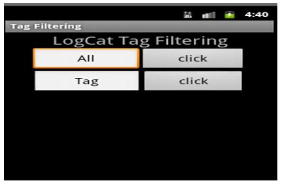

# 모바일 포렌식을 위한 안드로이드폰 로그캣 필터링 연구 

박기홍*, 장혜숙* **군산대학교 컴퓨터정보공학과
e-mail: \{spacepark,hs5486\}@kunsan.ac.kr

## A study of Android phone LogCat Filtering for Mobile Forensic

Ki-Hong Park*, Hae-Sook Jang* *Dept of Computer Information Engineering, Kunsan National University

- 요 약 ・

안드로이드 기기 보급률 증가에 따라 컴퓨터 포렌식 분야에서는 안드로이드 기기에 대한 증거수집 및 분석의 필요성이 강하게 제기되고 있지만, 아직까지 연구는 미진한 상태이다. 또한 컴퓨터 포렌식 도구들에 의지하여 증거를 수집하고 분석하는 실정이 다. 하지만 개인의 모든 정보가 거의 들어 있다고 해도 과언이 아닌 스마트폰의 정보유출은 우리의 일상에서 쉽고 빈번하게 발 생할 수 있는데, 포렌식 분석 툴을 이용하여 증거를 수집하거나 분석하기란 쉽지 않은 일이다. 본 논문에서는 포렌식 분석 툴을 이용하지 않고 개인의 정보 유출 유무를 판단하여 대응할 수 있는 방법을 제시한다.

키워드: 안드로이드(android), 컴퓨터 포렌식(computer forensic), 로그캣(logcat)

## I. 서론

스마트폰은 컴퓨터 기능과 핸드폰기능을 합친 것이다. PC와 유 사한 수준의 강력한 성능으로 다양한 서비스를 제공하는 스마트폰 의 판매량은 시장조사 업체 SA(Strategy Analytics)의 발표에 의 하면 2010년 2 분기 현재 3억 3천만대 수준이다. 이동통신 기술이 발전함에 따라 스마트폰 사용자수는 계속 증가하면서, 스마트폰 정보 유출의 문제점도 같이 증가 하고 있는 상황이다. 악의적 사용 자에 의해서 저작권 위반, 불법 거래 등 스마트폰을 이용한 범죄가 발생하고 있어 보안대책이 필요하다[1]. 본 논문에서는 스마트폰 의 정보가 유출되어 범죄로 이어지기 전에 사전 예방할 수 있도록 스마트폰 사용자가 분석도구 없이도 스마트폰에서 본인의 정보가 유출되었는지의 유무를 알 수 있고, 정보 유출시 에는 빠른 대책을 강구 할 수 있도록 하기위한 컴퓨터 포렌식 스마트폰 정보 유출을 방지 할 수 있는 방안을 제시하고자 한다.

## II. 관련 연구

## 1. 관련연구

## 1.1 디지털 포렌식

포렌식이란 증거를 수집, 보존, 처리하는 과정에서 법정에서 중 거를 사용하기 위해 증거가치가 상실되지 않도록 하는 일련의 과정 을 말한다[2]. 이동중에도 컴퓨터로 검색하고 메일을 보낼 수 있으 며, 영화도 볼 수 있는 모바일 기기들이 일상생활의 동반자가 되었

는데, 이러한 기기를 이용한 범죄 또한 증가하고 있다. 컴퓨터에 저장되어있는 정보가 법정에 증거로 제출되는 경우가 많아질 수밖에 없는데, 이와 관련된 분야를 컴퓨터 포렌식 이라고 한다. 초창기 컴퓨터 포렌식은 법집행기관에서 컴퓨터 중심으로 압수, 수색이 이 루어지고, 압수된 컴퓨터로부터 잠재적 증거를 발견하는 것에 중 점을 두었다. 1998년부터 디지털 증거 자체에 주목하기 시작하여 명칭도 ‘컴퓨터 포렌식’ 용어에서 디지털 포렌식으로 바뀌었다[3].

## 1.2 로그 정보

컴퓨터 관련 사이버 범죄가 일어났을 경우, 침입자의 흔적을 찾 고자 할 때, 우리가 가장 먼저 취하는 행동은 침입자의 흔적 (Digital Evidence)을 찾는 행 위이다[4]. 이러한 행위에 가장 잘 사용되는 정보가 컴퓨터 서버 내에 남아 있는 로그(Log) 정보라 할 수 있다. 이러한 이유로 로그정보는 불법적인 범죄자를 수사하 기 위한 최소한의 흔적이 될 수 있고, 재판에서는 범죄자를 구속하 기 위한 법적인 증거 자료가 될 수 있다. 특히 초고속 인터넷에서 의 웹(Web)을 이용한 중요한 정보와 금융 업무환경에서 로그 기 록이 존재하고, 로그 기록에서 시간이 적용된 로그 히스토리가 반 드시 존재한다. 컴퓨터 시스템에 불법적으로 침입한 공지[5]는 흔 적을 남기게 되는데 이러한 흔적이 저장되어 지는 곳을 로그 정보 파일이라 할 수 있다. 이러한 로그 정보 파일에는 시스템에 대한 스캔 행위, exploit 툴을 이용한 공격, 특정 사용자 계정으로의 접 속, root 권한의 획득, 트로이 목마 설치, 자료 유출 및 삭제 등 공격자의 행위[6]들이 기록되어 진다.

## III. 본론

### 1.1 Filtering System

로그갯 필터링 관리 시스템은 최근 사용자가 증가 하고 있는 자 바기반의 개방형 모바일 운영체제인 안드로이드를 사용하여 구현 하였다. JDK(Java Development Kit)는 1.6.0_31을 사용하였고, 안드로이드 SDK는 2.3.3을 사용하였으며, 이끌림스에 안드로이 드 플러그인을 설치하여 개발하고 실행하였다. 구조화된 문서를 지원하여 데이터 처리를 쉽게 해주는 스크립트언어인 XML을 사 용하였다. PC의 안드로이드 SDK를 사용하여 개발하고, 실제 안 드로이드 폰에 설치하여 테스트하였다.

### 1.2 필터링 시스템 설계

그림 1. 로그갯 대그 필터링 시스템
Fig. 1.LogCat Tag filtering system

LogCat Tag Filtering System은 그림 1과 같이 설계하였다. 안 드로이드 폰 사용자가 휴대폰을 분실 후 찾았을 때나 다른 누군가가 휴대폰을 사용한 것 같은 의심이 들 때 LogCat Tag Filtering System을 실행하여 LogCat 정보를 확인하여 자신의 휴대폰 정보 유출 여부를 확인할 수 있게 된다. 그림 1의 All button을 클릭하게 되면 그림2와 같이 안드로이드 폰 장비에서 발생한 사소한 일들까지 로그로 남아있음을 확인할 수 있다.

| Tag | Text |
| :-- | :-- |
| instaild | bex3ort -- NESTN '/resten/ann/latio3N6.ash' -- |
| dalvibva | bex3ot: load 251ms, verifevent 1322ms |
| instaild | bex3ort -- ENE '/resten/ann/latio3N6.ash' /success/ -- |
| bachusNamen... | uvent/connected skynvsa. android. inostan/bed. latin uvent-ando: |
| bachusNviser... | handling new be3ver 'shared artef' |
| LocalTransport | finiobBachus() |
| dalvibva | @_EVELECIT freed 1000, 516 free 27600/50000, external 7160, |
| InstClient | cement time failed: tww.net.3ocketEcreation: address faal: |
| InstClient | cement time failed: tww.net.3ocketEcreation: address faal: |

그림 2. 전체 Tag 검색
Fig. 2. Search the entire Tag

그림 2는 전체 Tag를 검색한 경우이다. 전체 Tag를 검색하게 되면 너무 많은 로그정보가 검색되어 정보유출 확인이 불편할 수 가 있다.

| Tag | Text |
| :-- | :-- |
| BedioScanner... | start scanning volume internal |
| BedioScanner | scannm time: 300ms |
| BedioScanner | scam time: 200ms |
| BedioScanner | scosternn time: 0ms |
| BedioScanner | total time: 1162ms |
| BedioScanner... | done scanning volume internal |
| BedioScanner... | start scanning volume external |
| BedioScanner | scunefeedThaumailFiles... android.database.edite.3QliteCurs |
| BedioScanner | /scunefeedThaumailFiles... android.database.edite.3QliteCus |

그림 3. 필터적용 Tag 검색
Fig. 3. Apply Filter Tag Search

그림 3의 Tag 위생에 Media Scanner를 입력하고 button을 클 릭하면 그림 3과 같이 Media Scanner Tag들만 검색되어 진다. 휴대폰에 있는 정보 중 중요하거나 유출 의심이 가는 정보만을 Tag로 LogCat을 필터링하여 쉽게 유출확인이 가능하게 된다.

## IV. 결론

스마트폰 사용자는 폭발적으로 증가하고 있고, 스마트폰을 이용 한 범죄 또한 다양해지고 있어서 컴퓨터포랜식 분야에서의 안드 로이드 증거수집 및 분석의 필요성이 강하게 제기되고 있다. 하지 만 컴퓨터 포랜식 도구들에 의지하여 증거를 수집하고 분석하는 실정이다. 개인의 모든 정보가 거의 들어있다고 해도 과언이 아닌 스마트폰의 정보유출은 우리의 일상에서 쉽고 빈번하게 발생할 수 있는데, 포랜식 분석 툴을 이용하여 증거를 수집하거나 분석하기란 쉽지 않은 일이다. 본 논문에서는 포랜식 분석 툴을 이용하지 않고 개인의 정보 유출 유무를 판단하여 대응할 수 있는 안드로이 드 폰 로그갯 필터링을 연구하였다. 휴대폰에서 개인의 정보 유출 이 의심될 때 마다 간단하게 Log Cat Tag를 필터링하여 정보유출 확인이 가능하게 된다. 향후 연구는 안드로이드 폰 뿐만 아니라 여 러 기종의 정보 유출 확인이 가능한 필터링 시스템을 연구 하고자 한다.

## 참고문헌

[1] LeeGyuAn, ParkDaeWoo, ShinYongtae, "a forensic investigation to secure the integrity of the data link management methods in the field," Journal of the Korea Society of Computer and Information, 2006
[2] Prosecutor's Office, "maintaining the integrity of digital evidence procedures and facilities for the study," Prosecutor's Office, if Personal Web Media
[3] Takhuiseong two, "Digital Forensic Research Workshop jeonge report, if 46 to 48
[4] Luoma. V., Forensics and electronic discovery: The new management challenge, Computer \& Security, 25(2), 91-96, 2006

[5] ParkDaeWoo, SeoJeongMan. "TCP / IP security methods for attacks," Journal of the Korea Society of Computer and Information Science, Volume 10, Issue 5, pp217-226, 2005.11.30
[6] ParkDaewoo, ImSeungRin. "Hacker attacks prevention system for the intelligent study of linkage", the Korea Society of Computer and Information, Volume 11, Issue 2, pp44-50, 2006.5.31.

