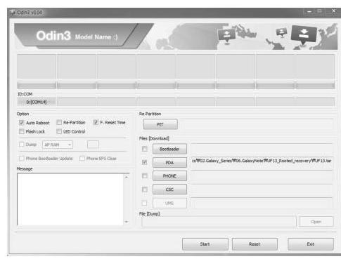
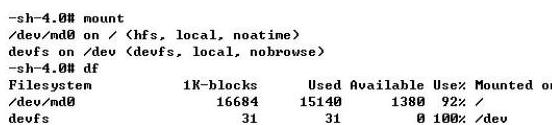
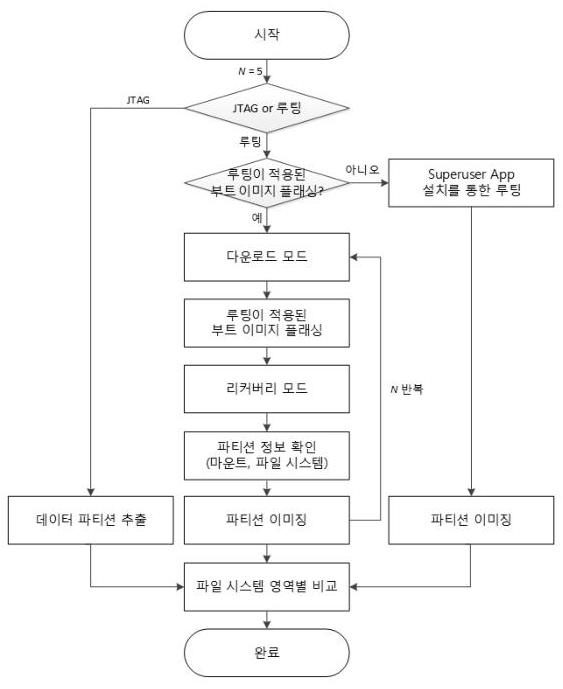
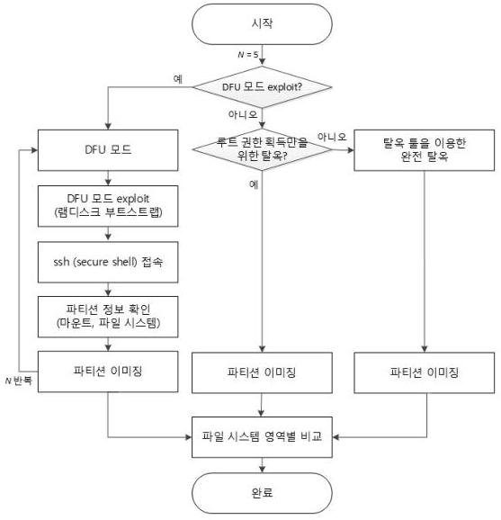
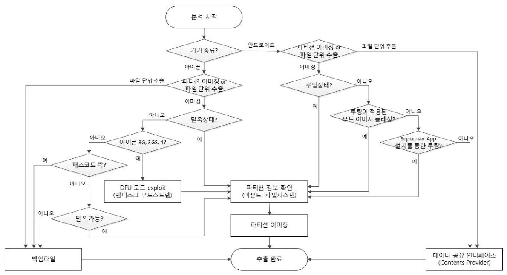
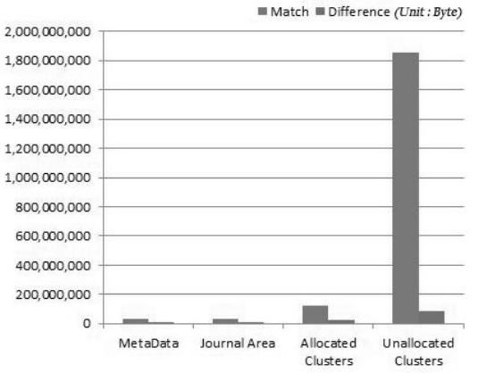
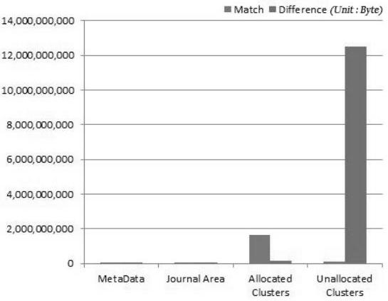
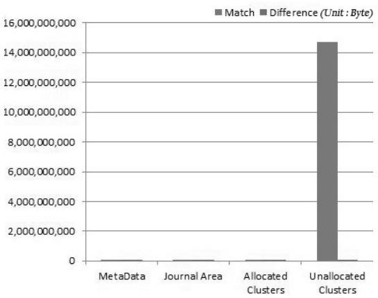

# 스마트폰 내부 정보 추출 방법* 

이 윤 호,* 이 상 진 ${ }^{\ddagger}$<br>고려대학교 정보보호연구원

## A Method of Internal Information Acquisition of Smartphones*

Yunho Lee, ${ }^{*}$ Sangjin Lee ${ }^{\ddagger}$<br>Center for Information Security Technologies, Korea University

## 요 약

최근 모바일 시장에는 스마트폰의 점유율이 점차 높아지고 다양한 운영체제를 기반으로 하는 스마트 기기와 애플리 케이션이 출시되고 있다. 이러한 현실에서 디지털 포렌식 조사에 있어서 스마트 기기 분석의 중요성이 많이 대두되고 있으며, 사용자 행위를 분석하기 위해 기기에서 사용자 데이터를 추출할 때 데이터의 훼손을 최소화하는 것이 가장 중 요하다.

본 논문에서는 안드로이드 운영체제 및 iOS 기반 기기에 다양한 루트 권한 획득방법을 적용한 후 추출된 데이터 이미지를 대상으로 파일시스템 영역별 변경되는 부분을 비교 분석하고, 결과적으로 디지털 포렌식 관점에서 가장 효 융적인 루트 권한 획득방법을 제안한다.

## ABSTRACT

The market share of smartphones has been increasing more and more at the recent mobile market and smart devices and applications that are based on a variety of operating systems has been released. Given this reality, the importance of smart devices analysis is coming to the fore and the most important thing is to minimize data corruption when extracting data from the device in order to analyze user behavior.

In this paper, we compare and analyze the area-specific changes that are the file system of collected image after obtaining root privileges on the Android OS and iOS based devices, and then propose the most efficient method to obtain root privileges.
Keywords: Digital Forensics, Smartphone Forensics, Android Forensics, iOS Forensics, Data Acquisition

## I. 서 론

최근 모바일 시장에는 스마트폰의 점유율이 점차 높아지고 다양한 운영체제를 기반으로 하는 스마트 기 기와 애플리케이션이 출시되고 있다. 이러한 현실에서

[^0]스마트 기기를 이용하여 개인 PC 및 각종 디바이스와 연동한 범죄도 크게 증가하고 있는 추세이므로 디지털 포렌식 조사에 있어서 스마트 기기 분석의 중요성이 많이 대두되고 있다.

또한, 안드로이드 운영체제나 iOS 등을 기반으로 하는 스마트 기기는 다양한 기능을 제공해 주기 때문 에 그에 따라 연락처, 통화내역, 메시지뿐만 아니라 인터넷 접속기록, 일정, 메일, 사진, SNS와 같은 애 플리케이션 파일 등 많은 사용정보를 생성하게 된다.

Matthew J. Decker[1]는 진정한 포렌식 수사 과정에 있어서 포렌식 전문가가 디지털 기기에 저장된 데이터를 변경 및 훼손시켜서는 안 되며 반복적으로


[^0]:    접수일(2013년 5월 7일), 수정일(1차: 2013년 8월 13일, 2차: 2013년 9월 9일), 계재확정일(2013년 9월 11일)
    * 본 연구는 2013년도 정부(미래창조과학부)의 재원으로 한 국연구재단-공공복지안전사업의 지원을 받아 수행되었습 니다. [2012M3A2A1051106]
    + 주저자, yuno21@korea.ac.kr
    $\ddagger$ 교신저자, sangjin@korea.ac.kr(Corresponding author)

디지털 증거 이미지를 획득함에 있어서도 동일한 해시 값을 유지해야 한다고 알고 있지만, 라이브 포랜식이 나 모바일 포랜식과 같이 활성 상태에서 디지털 증거 데이터를 수집하는 경우에는 데이터의 무결성을 유지 하는 것이 현실적으로 어렵다고 말하고 있다. 이러한 경우 포랜식 전문가가 적절한 포랜식 도구와 기술을 사용했다고 하는 신뢰성만 보장된다면 최소한의 원본 데이터 손상은 인정받을 수 있다고 주장하고 있다.

이와 같이 모바일 포랜식 관점에서는 스마트 기기 내 사용자 데이터에 대한 훼손을 최소화하면서 데이터 를 추출하여 분석하는 것이 중요하다.

스마트 기기 데이터를 파일단위로 분석하기 위해서 는 파일단위로 데이터를 추출하거나, 파일 시스템 단 위분석을 위해서 JTAG(Joint Test Action Group) 핀 연결과 같은 하드웨어적 접근방식과 운영 체제에서 루트 권한을 얻어 사용자 데이터 파티션 이 미지를 추출하는 소프트웨어적 방식을 사용한다. 그러 나 파일단위 분석과 같은 방법은 할당 영역에 정상적 으로 존재하는 파일 이외 비할당 영역에 존재하는 삭 제되거나 플래시 메모리 페이지의 데이터가 수정되면 서 생성될 수 있는 잉여 데이터에 대한 분석에는 한계 가 있다[2].

본 논문에서는 스마트 기기 내 플래시 메모리의 데 이터 파티션 이미지 추출을 JTAG 연결과 같은 방식 이 아닌 소프트웨어적 접근방식으로 적용이 가능한 루 트 권한 획득방법들을 소개한다. 그리고, 실제 안드로 이드 OS 및 iOS 기반 기기를 대상으로 루트 권한을 획득한 후 추출한 데이터 파티션 이미지를 파일 시스 템 영역별로 분리해 변화되는 부분들을 비교한다. 마 지막으로 실험결과 분석을 통해 포랜식 관점에서 데이 터 파티션 이미지 획득을 위해 필요한 루트 권한 획득 방법 중 데이터 훼손을 최소화하면서 효율적인 방법을 제안한다.

## II. 관련연구

Andrew Hoog[3.4]는 안드로이드 운영체제 기반 기기에서 데이터를 물리적, 논리적으로 추출하는 방법 과 데이터 분석에 대해 소개하였고, J. Lessard[5] 는 루팅된 안드로이드 기기를 대상으로 상용 도구를 통해 추출한 SD카드 이미지에 대한 다양한 분석방법 을 설명하였다.

Timothy Vidas[6]는 루팅이 가능한 펌웨어를 플 래싱 한 후 안드로이드 기기를 리커버리 모드로 루팅

하여 플래시 메모리를 획득하는 방법을 제안하였다.
S. Chen[7]은 Live CD/DVD/USB 포랜식의 개념과 유사한 Live SD라는 방법을 소개하였다. 이 방법 역시 안드로이드 기기를 리커버리 모드로 루팅 후 데이터를 추출하였으나, 모든 기기에 적용할 수 있 는 방법은 아니다.
M. Bader[8]는 아이폰 3GS폰을 대상으로 추출 된 백업과일에 대한 분석기법을 설명하였고, J. Zdziarski[9]는 iOS 기반 기기 포랜식 기법들을 종 합적으로 소개하고, 탈옥된 기기에서 NetCat을 이용 해 파티션 이미지를 추출하는 방법을 설명하였다.

위와 같이 기존의 연구들은 루트 권한 획득이 전제 되는 추출 및 분석방법이 주로 연구되었으나, 루팅이 나 탈옥으로 인해 실제 파티션 영역에서 어떠한 변화 가 발생하는지에 대해서는 언급하지 않았다.

## III. 스마트폰 내부 정보 추출 방법

### 3.1 Android

### 3.1.1 물리적 추출 방법

물리적 추출 방법에는 기기의 플래시 메모리를 분 리하여 메모리 리더기를 통해 데이터를 추출하는 Chip-off 방식과 JTAG 핀을 연결하여 애플레이터 를 통해 메모리를 읽는 명령을 전송함으로써 기기의 저장매체를 복사하는 방식으로 완벽히 동일한 사본을 얻을 수 있다[10]. 이와 같이 물리적 추출 방법은 플 래시 메모리 내에 존재하는 비할당 영역과 파일의 메 타데이터 등을 포함한 모든 페이지 영역을 획득할 수 있는 장점을 가지고 있지만, 추출하는데 1 Gb 당 1 시 간 정도의 많은 시간이 소요되며 대부분 기기를 출시 할 때 JTAG 핀을 차단하거나 해당 핀탭을 알아내기 어렵게 만들기 때문에 보편적으로 사용할 수는 없다.

### 3.1.2 논리적 추출 방법

논리적 추출 방법에는 애플리케이션 데이터 공유 인터페이스(Contents Provider)를 통해 연락처, 통화내역, SMS, MMS, 일정, 인터넷 접속기록 등을 레코드 단위로 추출하는 방법과 루트 권한을 획득한 후 파일 단위 또는 파티션 이미지를 추출하는 방법이 있다.

따라서 기기로부터 데이터를 소프트웨어적으로 추

출하기 위해서는 루트 권한 획득이 필수적이다.
안드로이드 운영체제는 기본적으로 사용자에게 루 트 권한을 부여하지 않고, 각 애플리케이션 영역은 샛 드박스(SandBox) 형태로 존재하기 때문에 외부로부터 접근이 불가능하며, 루트 권한을 가지지 않은 상태 에서 접근할 수 있는 데이터 영역에는 한계가 있다. 따라서 기기로부터 데이터를 소프트웨어적으로 추출 하기 위해서 루트 권한 획득은 필수적인 요소이다. 안 드로이드 운영체제의 취약점을 이용하여 루트 권한을 획득하는 것을 루팅이라고 한다[4].

루팅의 종류에는 루트 권한을 일시적으로 획득할 수 있는 임시 루팅(Temporary Rooting)과 지속적 으로 획득할 수 있는 완전 루팅(Permanent Rooting) 방법이 있다. 임시 루팅은 ADB(Android Debug Bridge) 및 커널의 취약점을 공격하여 기기 가 재무팅되기 전까지 관리자 권한을 유지한다. 하지 만, 이와 같은 취약점을 이용한 루팅은 현재 안드로이 드 버전 2.2.1까지만 적용된다[11].

완전 루팅은 루팅이 적용된 부트 이미지를 기기의 원본 부트 이미지와 교체함으로써 수행할 수 있으며, 루팅이 적용된 부트 이미지를 제작하는 방법은 크게 두 가지 방법으로 나뉠 수 있다. 첫 번째, 커널 영역에 'su' 및 'busybox' 바이너리, 'Superuser.apk' 등을 삽입하는 방법이다[12]. 하지만 이러한 방법은 시스 템 파티션에 Superuser라는 애플리케이션이 설치되 면서 사용자 데이터가 존재하는 데이터 파티션에 영향 을 미친다. 두 번째, 부트 이미지 랜디스크 영역의 코 드(default.prop. init.rc 등)를 일부 수정함으로써 루트 권한을 획득할 수 있는 방법이다[6]. 수정된 부 트 이미지는 Fig.1과 같은 프로그램을 사용하거나 fastboot 프로토콜을 통해서 플래싱이 가능하다. fastboot은 호스트 컴퓨터에서 USB 연결을 통해 플


Fig.1. Program for Flashing Boot Image

래시 파일시스템을 수정하는 데 주로 사용되어지는 진 단 프로토콜이다[13]. 상당수의 안드로이드 폰이 fastboot 모드를 지원하고 있으며, HTC 계열, 국내 의 랜택 계열, LG 특정 모델 등이 있다. Fig.2.와 같 은 명령어(fastboot flash boot or recovery (kernel_filename))를 통해 루팅이 적용된 부트 이 미지 플래싱이 가능하다.

```
H:/Fastboot Flash boot boot_origin.bin
bashring 'beepo1' <f5360 KB7...
0909F f 1.024-3
bashring 'beepo1'
0909F f 1.201-3
finished. total time: 9.726s
```

Fig.2. Flashing Using Fastboot Protocol

이 부트 이미지를 통해 루팅을 수행하고 리커버리 모드로 부팅이 되면 Fig.3과 같이 시스템 파티션 등 만 마운트 되고, 데이터 파티션은 마운트가 되지 않기 때문에 포랜식 관점에서 원본 데이터의 훼손 없이 파 티션 이미지를 획득할 수 있는 방법이다.

```
m mount
mount
rootfs / rootfs rw,relatine 0 0
tmpfs /dev tmpfs rw,relatine, mode=111 0 0
devpts /dev/pts devpts rw,relatine, mode=600 0 0
proc /proc proc rw,relatine 0 0
sysfs /sys sysfs rw,relatine 0 0
tmpfs /tmp tmpfs rw,relatine, mode=755 0 0
/dev/block/nmcblk0p24 /system ext4 rw,nodev, noatine
/dev/block/nmcblk0p26 /cache ext4 rw,nodev, noatine.
```

Fig.3. Mount Information (Galaxy Note)

이와 같은 방법을 통해 루팅된 기기의 경우, 안드로 이드 기기와 애플레이터를 관리하는 프로그램인 ADB 를 통해 pull 명령어를 이용해서 파일 단위로 데이터 를 추출할 수 있고 dd 명령어 또는 NetCat을 이용해 서 파티션 이미지를 추출할 수 있다.

### 3.2 iOS

일반적인 스마트 기기는 각 기기마다 PC와 데이터 를 주고 받기위한 동기화 프로그램을 제공하며, 아이 폰은 아이튠즈(iTunes)라는 프로그램을 이용하여 연 락처, 통화기록, 메모, 메시지, 애플리케이션 정보 등 을 동기화 시킬 뿐만 아니라, 백업 기능을 이용하여 별 도의 공간에 저장시킨다. 이러한 기본적인 백업 기능

을 이용하여 파일 단위로 데이터 추출 및 분석이 가능 하다[8]. 이런 파일 단위 데이터 추출은 정상적으로 존재하는 파일 이외 비합당 영역에 대한 삭제된 파일 분석에는 한계가 있기 때문에 탈옥을 이용하여 루트 권한을 획득한 다음 데이터 파티션 이미지를 추출한다. 하지만 현재 iOS 4 버전부터 모든 사용자 데이터가 암호화 되어 저장되기 때문에 기기에서 이미지를 추출 하여 분석하기 위해서는 복호화가 선행되어야 한다.

탈옥의 종류도 크게 두 가지로 나뉠 수 있다. 첫 번 째, 임시 탈옥(Tethered Jailbreak)은 아이폰의 DFU(Device Firmware Upgrade) 모드 exploits을 통해 랜디스크 부트스트랩 및 커널패치 등을 수 행한다. 탈옥상태에서는 내부 터미널을 이용하여 ssh(secure shell) 접속이 가능하며 dd 명령어를 통한 이미징 또는 NetCat을 통해 사용자 데이터 파 티션 이미지를 획득할 수 있다. 이와 같은 방법으로 탈옥을 수행하고 웹 접속을 통해 마운트 정보를 확인 해 보면 Fig.4.와 같이 시스템 파티션 등만 마운트 되 고, 데이터 파티션(/dev/disk0s1s2)은 마운트가 되 지 않기 때문에 포렌식 관점에서 원본 데이터의 훼손 없이 파티션 이미지를 획득할 수 있는 방법이다.


Fig.4. Mount Information (iPhone 4)

두 번째, 완전 탈옥(Untethered Jailbreak)은 아이폰 개발자 커뮤니티에서 쉽게 찾아 볼 수 있는 redsn0w[14], Absinthe[15], evasi0n[16] 등과 같은 탈옥 툴을 사용하는 것이다. 일반적으로 완전 탈 옥을 수행하게 되면 특정 애플리케이션(Cydia[17] 등)이 설치되고 시스템 파티션에 존재하는 애플리케이 션과 라이브러리 파일들이 데이터 파티션 폴더로 이동 하게 되므로 할당 영역과 비할당 영역의 많은 부분이 변경된다. 하지만 이러한 애플리케이션 설치 및 이동 과 같은 과정 없이 루트 권한만 획득할 수 있는 방법 도 존재한다.

이와 같이 탈옥의 종류는 다양하며, 아이폰 종류 (3G, 3GS, 4, 4S, 5)와 iOS 버전에 따라 탈옥 사용 가능 여부가 판별된다. 첫 번째 임시 탈옥과 두 번째 특정 애플리케이션 설치 및 이동 없이 완전 탈옥할 수 있는 방법은 현재 아이폰 4 까지만 적용된다.

## IV. 루트 권한 획득에 따른 데이터 훼손

실험은 안드로이드 OS 4.0.3(ICS) 기반 갤럭시 노트(SHV-E160S)와 iOS 5.1 기반 아이폰 4(A1332) 기기를 대상으로 수행하였고, 루트 권한 획득 후 일반 모드에서는 두 기기 모두 전화 및 네트 워크 기능이 비활성화 되는 비행기 모드(Airplane Mode)를 유지하여 파티션 이미지를 추출하였다.

### 4.1 Android

첫 번째, 본 실험에서는 비교 데이터 셋을 만들기 위해 앞서 설명했던 JTAG 핀 연결을 통한 물리적 추 출 방법으로 갤럭시 노트 데이터 파티션 이미지를 추 출하였다.

두 번째, 루팅을 위한 부트 이미지는 랜디스크 영역 의 일부 수정을 통해 생성하였다. 이렇게 생성한 이미 지를 다운로드 모드에서 Fig.1.과 같은 프로그램을 통해 루트 이미지 플래싱을 수행하고 리커버리 모드로 루팅이 되면 NetCat을 통해 dd 명령어를 이용하여 데이터 파티션(/dev/block/mmcblk0p25, 총 용량 $2 \mathrm{~GB}(2,153,011,560))$ 이미지를 추출하였다. Table 1.은 갤럭시 노트 플래시 메모리에 할당된 파티션 정


Fig.5. Data Acquisition Process of Android-based Devices

Table 1. Partition Information (Galaxy Note)

| Path | Name | File <br> System | Mount point |
| :-- | :--: | :--: | :--: |
| /dev/block/ <br> mmcblk0p21 | efs | ext4 | /efs |
| /dev/block/ <br> mmcblk0p24 | system | ext4 | /system |
| /dev/block/ <br> mmcblk0p25 | data | ext4 | /data |
| /dev/block/ <br> mmcblk0p26 | cache | ext4 | /cache |
| /dev/block/ <br> mmcblk0p29 | sdcard | vfat | /mnt/sdcard |

보를 정리한 것이다. 본 실험에서는 동일한 방식으로 총 5 번의 루팅과 이미지 추출을 수행하고 추출된 이미 지의 전체 해시 값을 비교하였다.

세 번째, 해당 기기에 Superuser 애플리케이션 설치를 통한 루팅 방법으로 루트 권한을 획득하여 데 이터 파티션 이미지를 추출한 다음, JTAG 핀 연결을 통해 추출한 파티션 이미지와 비교분석하였다.

### 4.2 iOS

첫 번째, 아이폰은 3GS 이후 모델부터 JTAG 핀 앱이 존재하지 않아 물리적 추출 방법은 적용할 수 없 기 때문에 비교 데이터 셋 이미지는 Fig.6.과 같은 방 법으로 추출하였다. 임시 탈옥인 DFU 모드에서의 랜


Fig.6. Data Acquisition Process of iOS-based Devices

디스크 부트스트랩 방식으로 부팅 전 커널패치로 루트 권한을 획득한 후, 내부 터미널을 통한 랜 접속을 이 용하여 데이터 파티션(/dev/disk0s1s2, 총 용량 13.5GB $(14,520,253,992)$ ) 이미지를 추출하였고, 이러한 과정을 반복 수행 시 데이터 파티션 영역에 번 경되는 부분이 존재하는지를 확인하기 위해 해당 기기 의 전원을 끄고 다시 DFU 모드로 재부팅을 한 후 동 일한 방법으로 루트 권한을 획득하고 이미지를 추출하 였다. 본 실험에서는 총 5 번의 탈옥과 추출을 수행하 고 추출된 이미지의 전체 해시 값을 비교하였다.

두 번째, 탈옥 툴을 이용하여 완전 탈옥을 수행한 다음 NetCat으로 추출한 파티션 이미지를 첫 번째 방식으로 이미징한 파일과 비교분석하였다. 본 실험에 서는 특정 애플리케이션 설치 및 이동이 수행되는 탈 옥 방법과 수행되지 않는 방법을 사용하여 각각 추출 한 이미지에서 변경되는 부분을 확인하였다.

## V. 실험 결과

### 5.1 Android

우선 물리적 추출 방법인 JTAG 핀 연결을 통해 데이터 파티션 2GB를 추출한 결과, 시간은 1 시간 53 분 정도가 소요되었고 이미지 전체 해시 값은 'F9394A20EF843EA704F9A48222F8E861'이었 다.

두 번째, 루팅이 적용된 부트 이미지 플래싱 방법을 통해 데이터 파티션 이미지를 추출한 후 비교 데이터 셋 해시 값과 비교하였을 때 Table 2. 와 같이 동일하 다는 것을 확인하였고, 이 과정을 5 번 반복 수행하여 이미지를 추출하였을 경우에도 매번 해시 값이 동일하 다는 것을 확인할 수 있었다. 추출 소요 시간은 평균 5 분 이내였다.

Table 2. Compare The Hash Value of The Data Partition Image

|  |  |
| :-- | :-- |
| Count | MD5 |
| 1 | F9394A20EF843EA704F9A48222F8E861 |
| 2 | F9394A20EF843EA704F9A48222F8E861 |
| 3 | F9394A20EF843EA704F9A48222F8E861 |
| 4 | F9394A20EF843EA704F9A48222F8E861 |
| 5 | F9394A20EF843EA704F9A48222F8E861 |

세 번째, Superuser 애플리케이션 설치를 통한 루팅 방법으로 추출한 데이터 파티션 이미지 해시 값

Table 3. Compare Hash Values by Block

| Filename | Before (MD5) | After (MD5) |
| :--: | :--: | :--: |
| Block <br> Descriptors | F4D016E07CBBA29D <br> C8753BDDC909410A | 09793ED73DC1C28474 <br> 5346EF83CE5E1C |
| Group <br> Descriptors | 640D1CD246E1CFA7 <br> 8FE3C49256E949DA | FAA04A364733D902E <br> A220009D94BE370 |
| Extent <br> Blocks | 56B1AFF51BB2AAA6 <br> BC8B4E695BD3F9AB | 56B1AFF51BB2AAA6 <br> BC8B4E695BD3F9AB |
| Volume <br> Bitmap | 405D75BC5F651D48F <br> C4F72109F2EB041 | 129654B068479D7 |
| Inode Bitmap | FA70FC23F1FC5FBA <br> 1FBECB23410C89DE | AA06568DC4E06CBB <br> A1F94B71F6851AB3 |
| Inode Table | 49F8476B4DD36880B <br> D95162B430E63E3 | 0D7048504312F7099E7 <br> 4B6DEF6A7FAEF |
| Journal Area | 0140ECDD2F718F1A <br> 27B693631290C70C | 8829F22523825171361 <br> E33437EA80F6E |
| Allocated <br> Clusters | 0C8DF6AAC1F06189 <br> 19AEE8F9403F2BE5 | 45B6D0912B1704719F <br> F62EFA2D43A023 |
| Unallocated <br> Clusters | 3575BA8D0C4C69AD <br> 76950117BFECE795 | F095992DB7D7D90EE <br> 22338CE19E443C2 |

은 'E1F2ACABD618994CF70DCB22EF61EC84' 로 비교 데이터 셋과 다름을 확인하였고, 추출한 이미 지를 ext4 파일시스템 블록별로 분리한 다음 비교 데 이터 셋 블록별 해시 값과 비교하였다. 결과 Table 3.과 같이 Extent Blocks을 제외한 모든 블록들이 변화되는 것을 확인할 수 있었다.

Table 4.와 같이 전체 2GB의 데이터 파티션에서 메타데이터 영역 9.58 KB , 저널 영역 3.54 MB , 할당 영역 22.39 MB , 비할당 영역 81.39 MB 를 포함한

Table 4. Byte-by-Byte Comparison

| Filename | Match | Difference |
| :--: | :--: | :--: |
| Block <br> Descriptors | 24.537 | 39 |
| Group <br> Descriptors | 24.556 | 20 |
| Extent Blocks | 569.344 | - |
| Volume Bitmap | 69.185 | 447 |
| Inode Bitmap | 69.595 | 37 |
| Inode Table | $33.622 .979$ | 9.277 |
| Journal Area | $29.866 .732$ | $3.54 \mathrm{MB}$ <br> $(3.720 .468)$ |
| Allocated <br> Clusters | $121.541 .702$ | $22.39 \mathrm{MB}$ <br> $(23.479 .586)$ |
| Unallocated <br> Clusters | $1.854 .665 .0$ <br> 24 | $81.39 \mathrm{MB}$ <br> $(85.348 .032)$ |
| Total | $2.040 .453 .6$ <br> 54 | $107.34 \mathrm{MB}$ <br> $(112.557 .906)$ |

107.34MB가 변경된 것을 확인할 수 있었다. 여기서 비트맵 메타데이터 영역은 1 바이트, 그 외 영역은 4 바 이트 단위의 바이트 스캐닝 방법을 이용하였다.

앞서 설명한 한전 루팅 방법은 커널 영역에 'su' 및 'busybox' 바이너리, 'Superuser.apk' 등을 삽입하 는 방법이다. 이러한 방법은 시스템 파티션에 Superuser라는 애플리케이션이 설치되면서 사용자 데이터가 존재하는 데이터 파티션에 Table 5.와 같이 Superuser 애플리케이션 관련 dex, db 파일 등이 생성되었고 기기의 일반 모드 부팅으로 인하여 Table 6. 과 같이 시스템 파일이나 각종 로그 파일 등이 변경 되는 것을 확인할 수 있었다. 결과적으로, 생성 및 변 경된 파일 23.479.586바이트 사이즈는 Table 4.의 할당 영역에서 변경된 사이즈와 동일하다.

Table 5. Generated File Information

| 분류 | 사이즈 (bytes) | 파일 개수 |
| :--: | :--: | :--: |
| cache 파일 | 5.05 MB (5.304.194) | 6 |
| 설치 파일 (apk, dex) | 10.1 MB (10.603.675) | 5 |
| 시스템 파일 (txt) | 41.2 KB (42.195) | 8 |
| DB 파일 | 200 KB (205.600) | 3 |
| Total | 15.4 MB (16.155.664) | 22 |

Table 6. Changed File Information

| 분류 | 사이즈 (bytes) | 파일 개수 |
| :--: | :--: | :--: |
| cache 파일 | 130.9 KB (134.042) | 17 |
| 시스템 파일 (txt) | 3.06 MB (3.216.255) | 11 |
| DB 파일 | 3.3 MB (3.543.040) | 19 |
| App 파일 (log, xml 등) | 420.4 KB (430.585) | 20 |
| Total | 6.9 MB (7.323.922) | 67 |

## 5.2 iOS

첫 번째, DFU 모드에서 램디스크 부트스트랩 방 식으로 부팅 전 커널 패치를 통한 루트 권한 획득방법 으로 데이터 파티션 13.5 GB 를 추출한 결과, 시간은 평균 1 시간 18 분 정도 소요되었다. 이 과정을 5 번 반 복 수행하여 이미지를 추출하였을 경우 Table 7. 과 같이 매번 해시 값이 동일하다는 것을 확인할 수 있었 고, 여기서 얻은 이미지를 비교 데이터 셋으로 사용하 였다.

두 번째, 탈옥 툴을 이용하여 루트 권한을 획득하는 방법으로 추출한 데이터 파티션 이미지 해시 값은 'E5002BF3A9D0B971F5B60320305780DF'로

비교 데이터 셋과 다름을 확인하였고, 추출한 이미지 를 HFS+ 파일시스템 블록별로 분리한 다음 비교 데 이터 셋 블록별 해시 값과 비교하였다. 결과 Table 8. 과 같이 journal_info_block을 제외한 모든 블록 들이 변화되는 것을 확인할 수 있었다.

Table 7. Compare The Hash Value of The Data Partition Image

|  Count | MD5  |
| --- | --- |
|  1 | 2405CA04AB255C0EC822260568024492  |
|  2 | 2405CA04AB255C0EC822260568024492  |
|  3 | 2405CA04AB255C0EC822260568024492  |
|  4 | 2405CA04AB255C0EC822260568024492  |
|  5 | 2405CA04AB255C0EC822260568024492  |

Table 8. Compare Hash Values by Block

|  Filename | Before (MD5) | After (MD5)  |
| --- | --- | --- |
|  \$Attributes | BD0DFAA849E831A2 | 99AD04PD7EFE8BCE  |
|   | 2FF414E4DE6492A8 | EE24528AB2BA4004  |
|  \$Bitmap | 0A980B89238765E2E6 | 9271BA299F1B5ED62  |
|   | FB345A1D4BC0D1 | 06E58E0AFA7913D  |
|  \$Catalog | 5FD72F78E5B28848C | 8B4A0BF101E3226E2  |
|   | A38C67DE3BFD6B0 | 4BDE4F9981D992F  |
|  \$Extents | EC8FF3099B0455D4B | E5639C3666B7294596  |
|  Overflow | A985AFF70CC429C | C0BD91B830F50E  |
|  \$Volume | 4D5D543D3CE6F93F | 50D74C3FC22F214CD  |
|  Header | C2BA91D35F31A0D2 | 58439B07894496F  |
|  journal | D9AB1CF042A035D0 | A7507E722A98445DE  |
|   | C37E9F4E5C5AE3D6 | 8C3E1F44686F0D8  |
|  journal_info_b | C6AC16326A3D8C2B | C6AC16326A3D8C2B  |
|  lock | EEF429BABD2A03A7 | EEF429BABD2A03A7  |
|  Allocated | 47CC4371B3DF896F0 | F730A7F9C248C2F4B  |
|  Clusters | DCE1EB1A3979A99 | D85C535795156BF  |
|  Unallocated | C8C282B629C065361 | 740B5FDDD61EE52D  |
|  Clusters | AF0485C538B3A59 | 01CBE9DCDBE861BA  |

Table 9.와 같이 전체 13.5 GB 의 사용자 데이터 파티션에서 저널 영역 4.66 MB , 할당 영역 166.54 M B, 비할당 영역 11.64 GB 등을 포함한 11.81 GB 가 변경된 것을 확인할 수 있었다. 앞서 설명하였듯이 일 만적인 완전 탈옥 방법은 시스템 파티션에 존재하는 시 스탭 애플리케이션들과 일부 라이브러리 파일들을 사용 자 데이터 파티션의/stash 폴더로 이동하는 작업을 수행하게 된다. 해당 폴더에 추가된 용량은 1,175 폴 더에 5,316 파일 157.3 MB (164,890,833)이었다.

Table 9. Byte-by-Byte Comparison

|  Filename | Match | Difference  |
| --- | --- | --- |
|  \$Attributes | $10,816,721$ | 717,615  |
|  \$Bitmap | 226,294 | 3,082  |
|  \$Catalog | $22,085,061$ | 983,611  |
|  \$Extents | $5,242,751$ | 129  |
|  Overflow |  |   |
|  \$Volume | 8,171 | 21  |
|  Header |  |   |
|  journal | $3,497,857$ | $\begin{gathered} 4.66 \mathrm{MB} \ (4,890,751) \end{gathered}$  |
|  journal_info_bl | 8,192 | -  |
|  ock |  |   |
|  Allocated | $1,668,859,779$ | $\begin{gathered} 166.54 \mathrm{MB} \ (174,634,661) \end{gathered}$  |
|  Clusters | 127,254,244 | $\begin{gathered} 11.64 \mathrm{MB} \ (12,501,025,052) \end{gathered}$  |
|  Total | $1,837,999,070$ | $\begin{gathered} 11.81 \mathrm{MB} \ (12,682,254,922) \end{gathered}$  |

Table 10.과 같이 시스템 파일이나 각종 로그 파 일 등 $9.29 \mathrm{MB}(9,743,828)$ 가 변경되는 것을 확인 할 수 있었다. 결과적으로, 생성된 파일 및 변경된 파 일 $174,634,661$ 바이트 사이즈는 Table 9. 의 할당 영역에서 변경된 사이즈와 동일하다.

Table 10. Changed File Information

|  분류 | 사이즈 (Bytes) | 파일 개수  |
| --- | --- | --- |
|  cache 파일 | $8.06 \mathrm{MB}(8,454,152)$ | 103  |
|  시스템 파일 (plist 등) | $702.9 \mathrm{~KB}(719,825)$ | 70  |
|  DB 파일 | $504 \mathrm{~KB}(516,096)$ | 3  |
|  App 파일 (log 등) | $52.49 \mathrm{~KB}(53,755)$ | 6  |
|  Total | $9.29 \mathrm{MB}(9,743,828)$ | 182  |

세 번째, 특정 애플리케이션 설치와 시스템 애플리 케이션 파일들의 이동 없이 루트 권한을 획득한 후 추 출한 이미지를 비교한 결과 Table 11. 과 같이 전체 13.5 GB 의 사용자 데이터 파티션에서 저널 영역 531.84 KB , 할당 영역 9.03 MB , 비할당 영역 8.35 MB 등을 포함한 17.95 MB 가 변경된 것을 확인 할 수 있었고, Table 12. 와 같이 시스템 파일이나 각 종 로그 파일 등이 변경되는 것을 확인할 수 있었다. 결과적으로, 변경된 파일 $9,476,701$ 바이트 사이즈는 Table 11. 의 할당 영역에서 변경된 사이즈와 동일한 것을 확인하였다.

Table 11. Byte-by-Byte Comparison

| Filename | Match | Difference |
| :--: | :--: | :--: |
| \$Attributes | 11,527,912 | 6,424 |
| \$Bitmap | 229,318 | 58 |
| \$Catalog | 23,040,296 | 28,376 |
| \$Extents Overflow | 5,242,722 | 158 |
| \$Volume Header | 8,174 | 18 |
| .journal | 7,843,996 | 531.84 KB <br> $(544,612)$ |
| .journal_info_block | 8,192 | - |
| Allocated <br> Clusters | $1,834,017,739$ | $9.03 \mathrm{MB}$ <br> $(9,476,701)$ |
| Unallocated <br> Clusters | $12,619,513,686$ | $8.35 \mathrm{MB}$ <br> $(8,765,610)$ |
| Total | $14,501,432,035$ | $17.95 \mathrm{MB}$ <br> $(18,821,957)$ |

Table 12. Changed File Information

| 분류 | 사이즈 (Bytes) | 파일 개수 |
| :--: | :--: | :--: |
| cache 파일 | $130.9 \mathrm{~KB}(3,282)$ | 5 |
| 시스템 파일 (log 등) | $3.06 \mathrm{MB}(8,459,413)$ | 11 |
| DB 파일 | $3.3 \mathrm{MB}(1,000,872)$ | 9 |
| App 파일 (plist 등) | $420.4 \mathrm{~KB}(13,134)$ | 21 |
| Total | $9.03 \mathrm{MB}(9,476,701)$ | 46 |

## VI. 걸 론

디지털 포렌식 관점에서는 Fig.7.과 같이 스마트 기기 내 사용자 데이터 파티션에 대한 훼손을 최소화 하면서 데이터를 획득하는 것이 중요하다. 안드로이드 기반 기기에서 파일 단위 추출일 경우, 애플리케이션 데이터 공유 인터페이스(Contents Provider)를 통 해 추출이 가능하고 파티션 이미지 추출일 경우에는 루팅이 적용된 부트 이미지 플래싱 적용가능 여부를 판별하여 플래싱 프로그램을 사용하거나 fastboot 프 로토콜을 통해 플래싱을 수행한다. 이와 같은 방식이 원본 데이터의 훼손 없이 추출할 수 있는 방법이지만 적용이 불가능한 기기일 경우에는 Superuser 애플 리케이션 설치를 통한 루트 권한 획득 방법을 적용하 게 된다. iOS 기반 기기에서 파일 단위 추출일 경우 는 아이튠즈(iTunes) 프로그램의 백업기능을 이용하 여 추출이 가능하고 파티션 이미지 추출일 경우에는 DFU 모드에서 랜디스크 부트스트랩 방식으로 부팅 전 커널패치를 통해 루트 권한 획득 가능여부를 판별 하여 임시 탈옥을 수행한다. 이와 같은 방식이 원본 데이터의 훼손 없이 추출할 수 있는 방법이지만 아이 폰 4 이후의 모델과 같이 적용이 불가능한 기기일 경우 에는 완전 탈옥을 적용하게 된다.

본 논문에서는 스마트 기기의 데이터 이미지 추출 을 JTAG 핀 연결과 같은 하드웨어적 방식이 아닌 소


Fig.7. Data Acquisition Process for Android and iOS-based Devices

프트웨어적 방식으로 적용이 가능한 루트 권한 획득방 법들을 소개하였고, 실제 안드로이드 운영체제 기반 갤럭시 노트와 iOS 기반 아이폰 4 기기를 대상으로 루트 권한을 획득한 후 추출한 데이터 파티션 이미지 를 파일 시스템 영역별로 비교분석하였다.

안드로이드 운영체제 기반 기기에서는 램디스크 일 부 수정을 통해 루팅을 수행하고 리커버리 모드에서 이미지를 추출하는 방법이 원본 데이터의 훼손 없이 획득할 수 있는 가장 효율적인 방법이고, 그 외 애플 리케이션 설치를 통한 루트 권한 획득은 Fig.8. 과 같 이 전체 영역의 $5.2 \%$ 정도가 변경되는 것을 실험을 통해 확인하였다.
iOS 기반 기기의 경우에는 DFU 모드에서 램디스 크 부트스트랩 방식으로 부팅 전 커널쾌치를 통해 루 트 권한을 획득한 후 이미지를 추출하는 방법이 데이 터의 훼손 없이 획득할 수 있는 방법이다. 그리고, 일 반적인 툴을 이용한 탈옥 방법 중에서 애플리케이션 설치 및 이동이 수행되는 방법은 Fig.9. 와 같이 $87.3 \%$, 다른 작업 없이 루트 권한만을 획득하는 방법 은 Fig. 10. 과 같이 $0.1 \%$ 정도의 데이터 변경을 확인


Fig.8. Partition Image Comparison (Galaxy Note)

하였다. 결과적으로 완전 탈옥을 수행해야 한다면 특 정 애플리케이션 설치 등의 작업 없이 루트 권한만을 획득할 수 있는 방법이 데이터의 변경을 최소화 할 수 있다. Table 13. 은 다양한 루트 권한 획득방법을 적 용한 후 비교 분석한 결과와 각각의 장단점을 정리한 것이다.

Table 13. Results of Comparative Analysis and Pros and Cons

| 디바이스 | OS 버전 | 데이터 파티션 | 용량 <br> (GB) | 추출 <br> 시간(분) | 데이터 변경 (\%) |  |  |
| :--: | :--: | :--: | :--: | :--: | :--: | :--: | :--: |
| 갤럭시 노트 <br> (SHV-E160S) | 4.0 .3 | /dev/block/ <br> mmcblk0p25 | 2 G | 약 5 분 | 루팅이 적용된 <br> 루트 이미지 플래싱 |  | 완전 루팅 <br> (App 설치) |
|  |  |  |  |  | $0 \%$ |  | $5.2 \%$ |
| 아이폰 4 <br> (A1332) | 5.1 | /dev/ <br> disk0s1s2 | 13.5 G | 약 78 분 | 임시 탈옥 <br> (램디스크 <br> 부트스트랩) | 완전 탈옥 <br> (루트 권한만 획득) | 완전 탈옥 <br> (App 설치) |
|  |  |  |  |  | $0 \%$ | $0.1 \%$ | $87.3 \%$ |


| 디바이스 | 장단점 |  |  |  |
| :--: | :--: | :--: | :--: | :--: |
| 갤럭시 노트 <br> (SHV-E160S) | 루팅이 적용된 <br> 루트 이미지 플래싱 |  | 완전 루팅 <br> (App 설치) |  |
|  | - 원본 데이터 훼손 없이 추출 가능 <br> - 하드웨어 방식(JTAG)보다 빠른 이미지 추출 <br> - 비할당 영역에 존재하는 삭제된 파일 복구율 향상 <br> - 각 디바이스 및 버전별 정식 펌웨어 이미지 필요 |  | - 데이터 파티션에 App 관련 파일 생성 <br> - 루팅으로 인한 데이터 및 비할당 영역 변경 <br> - 각 디바이스 및 버전별 정식 펌웨어 이미지 불필요 |  |
| 아이폰 4 <br> (A1332) | 임시 탈옥 <br> (램디스크 부트스트랩) |  | 완전 탈옥 <br> (루트 권한만 획득) | 완전 탈옥 <br> (App 설치) |
|  | - 원본 데이터 훼손 없이 추출 가능 <br> - 비할당 영역에 존재하는 삭제된 파일 <br> - 복구율 향상 <br> - 아이폰 3G, 3GS, 4만 적용가능 <br> - 이미지 추출 후 분석을 위해서는 <br> - 데이터 복호화 필요 |  | - 최소한의 데이터 및 비할당 <br> - 영역 변경 <br> - ssh 접속방법 필요 | - 각 모델 및 OS버전에 적용 가능 <br> - 데이터 파티션에 App 관련 <br> - 파일 생성 <br> - 데이터 및 비할당 영역 변경 |



Fig.9. Partition Image Comparison (iPhone 4)


Fig.10. Partition Image Comparison (iPhone 4)

현재 안드로이드 기반 기기에서 루팅이 적용된 부트 이미지 플래싱 방법은 삼성 갤럭시 계열의 대부분기기 에 적용이 가능하고, HTC 및 팬택 계열, LG 특징 기 기도 fastboot 프로토콜을 통해 적용이 가능하다.

향후 각 제조사 및 모델별 다양한 스마트 기기를 대 상으로 데이터의 훼손을 최소화하면서 획득할 수 있는 추가적인 연구가 필요하다.

## References

[1] Matthew J. Decker, "Dispelling Common Myths of "Live Digital Forensics," Digital Forensics Certification Board, White Papers, Sep. 2011.
[2] Jungheum Park, "Forensic analysis techniques for fragmented flash memory pa-
ges in smartphones," Digital Investigation 9, pp. 109-118, 2012
[3] Andrew Hoog, "Android Forensics," Mobile Forensics World 2009, May. 2009
[4] Andrew Hoog, "Android Forensics: Investigation, Analysis and Mobile Security for Google Android," Elsevier, June, 2011
[5] Jeff Lessard, "Android Forensics : Simplifying Cell Phone Examinations," Small Scale Digital Device Forensics Journal, Vol. 4, No. 1, pp.1-12, Sep. 2010
[6] Timothy Vidas, "Toward a general collection methodology for Android devices," Digital Investigation 8, Supplement, pp.14-24, 2011
[7] S. Chen and C. Yang, "Design and Implementation of Live SD Acquisition Tool in Android Smart Phone," Fifth International Conference on Genetic and Evolutionary Computing, pp.157-162,Sep, 2011
[8] Mona Bader, "iPhone 3GS Forensics: Logical analysis using Apple iTunes Backup Utility," Small Scale Digital Device Forensic Journal Vol. 4, No.1, Sep. 2010
[9] Jonathan Zdziarski, "iPhone Forensics," O'Reilly Media, Sebastopol, Sep. 2008
[10] K. Kim, D. Hong, and J. Ryu, "Forensic Data Acquisition from Cell Phones using JTAG Interface," in Proc. Security and Management, pp.410-414, 2008
[11] Junghoon Oh, "A Study for Android Smartphone Forensic Analysis," Master's Thesis of Graduate School of Information Security, Korea University, 2011
[12] Android Developers Community, "http://forum.xda-developers.com"
[13] Fastboot, http://en.wikipedia.org/wiki/Android_software_development\#Fastboot
[14] redsn0w, "http://blog.iphone-dev.org/tag

ged/redsn0w
[15] Absinthe, "http://absinthejailbreak.com /about-absinthe-jailbreak/
[16] evasi0n, "http://www.evasi0n.com/
[17] Cydia, "http://en.wikipedia.org/wiki/C ydia"


이 윤 호 (Yunho Lee) 학생회원
2001년 2월: 부정대학교 공과대학 전자계산학과 학사
2011년 3월 현재: 고려대학교 정보보호대학원 석사과정
〈관심분야〉 디지털 포렌식, 모바일 포렌식, 클라우드 포렌식


이 상 진 (Sangjin Lee) 종신회원
1987년 2월: 고려대학교 수학과 학사
1989년 2월: 고려대학교 수학과 석사
1994년 8월: 고려대학교 수학과 박사
1989년 10월 1999년 2월: ETRI 선임 연구원
1999년 3월 2001년 8월: 고려대학교 자연과학대학 조교수
2001년 9월 현재: 고려대학교 정보보호대학원 교수
2008년 3월 현재: 고려대학교 디지털포렌식연구센터 센터장
〈관심분야〉디지털 포렌식, 심층 암호, 해쉬 함수

