# (c)creative   C O M M O N S D E E D 

## 저작자표시-비영리-변경금지 2.0 대한민국

이용자는 아래의 조건을 따르는 경우에 한하여 자유롭게

- 이 저작물을 복제, 배포, 전송, 전시, 공연 및 방송할 수 있습니다.

다음과 같은 조건을 따라야 합니다:

저작자표시. 귀하는 원저작자를 표시하여야 합니다.

비영리. 귀하는 이 저작물을 영리 목적으로 이용할 수 없습니다.

변경금지. 귀하는 이 저작물을 개작, 변형 또는 가공할 수 없습니다.

- 귀하는, 이 저작물의 재이용이나 배포의 경우, 이 저작물에 적용된 이용허락조건 을 명확하게 나타내어야 합니다.
- 저작권자로부터 별도의 허가를 받으면 이러한 조건들은 적용되지 않습니다.

저작권법에 따른 이용자의 권리는 위의 내용에 의하여 영향을 받지 않습니다.
이것은 이용허락규약(Legal Code)을 이해하기 쉽게 요약한 것입니다.
Disclaimer $\square$

# 석 사 학 위 논 문 

2014년 7월 4일

# 고 영 채 교수지도   석 사 학 위 논 문 

## 안드로이드 스마트폰   논리적 포랜식 기법

이 논문을 공학 석사학위 논문으로 제출함

2014년 7월 4일

## 고려대학교 공학대학원

전자 컴퓨터 공학과
노 호 승

# 盧昊昇의 工學 碩士學位論文審査㫮完了㫮. 

2014年 6 月

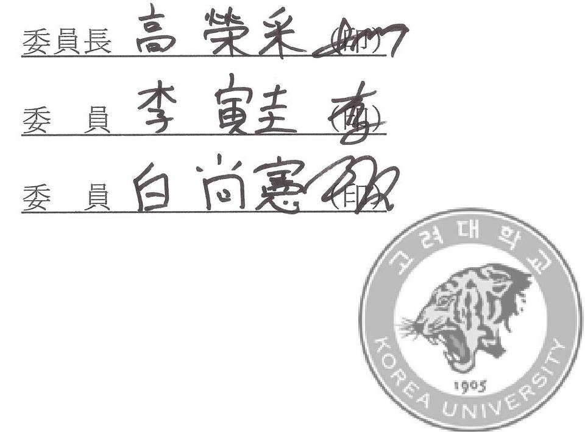

# ABSTRACT 

## 안드로이드 스마트폰 논리적 포렌식 기법

노 호 승 고려대학교 공학대학원 전자 컴퓨터 공학과 지도교수 고영채

현재 스마트폰 시장은 급속도로 팽창하는 중이다. 그 중에서도 안드로이 드 스마트폰의 성장은 더욱 더 두드러진다. 오픈 소스의 장점을 기반으로 여러 제조사들의 다양한 기기 출시와 꾸준한 안드로이드 운영체제의 업데 이트는 사용자들에게는 장점으로 다가가지만, 디지털 포렌식 관점에서는 어 려움으로 작용한다. 논리적 포렌식은 대부분 루팅을 전제로 하는데, 다양한 기종과 지속적인 업데이트는 루팅을 어렵게 하기 때문이다. 또한 지금까지 연구된 안드로이드 스마트폰의 포렌식은 대부분 해외에서 출시된 모델을 기준으로 하고 있다.

본 논문에서는 국내의 스마트폰 제조사 3사의 여러 안드로이드 스마트폰 과 안드로이드 운영체제 버전의 루트 권환 획득 방법과 물리적 이미지를 획득하는 방법을 구현해 본다.

# 목 차 

1. 서 론 ..... 1
1.1 연구의 배경 ..... 1
1.2 연구의 목적 및 범위 ..... 4
2. 관련 기술 및 동향 ..... 8
2.1 안드로이드 운영체제 ..... 8
2.2 논리적 포랜식 기법 ..... 12
2.2.1. ADB(Android Debug Bridge) ..... 12
2.2.2. 루팅(Rooting) ..... 12
2.2.3 콘텐츠 프로바이더(Content Provider) ..... 13
2.3 물리적 포랜식 기법 ..... 14
2.3.1. 메모리 칩 분리 방법 ..... 14
2.3.2. JTAG을 이용한 방법 ..... 15
2.4 기존의 연구 ..... 16
3. 논리적 포랜식 기법 구현 ..... 17
3.1 착안점 및 구현 ..... 17
3.2 동작과정 ..... 21
3.3 이미지 분석 ..... 21
- i -

4. 테스트 및 테스트 결과 ..... 28
4.1 테스트 환경 ..... 28
4.2 테스트 ..... 29
4.2.1 삼성 갤럭시 계열의 폰 ..... 29
4.2.2 팬택과 LG 안드로이드 스마트폰 ..... 31
4.3 테스트 결과 ..... 32
5. 결론 및 향후 연구과제 ..... 34
참고문헌 ..... 35

# 그 림 목 차 

[그림1] 2013년 제조사별 국내 휴대폰 판매 시장 점유율 ..... 4
[그림2] 안드로이드의 코드네임별 시장 점유율 ..... 5
[그림3] 안드로이드의 시스템 구조도 ..... 8
[그림4] 메모리 리더기 ..... 15
[그림5] 갤럭시 S의 JTAG ..... 15
[그림6] 루팅이 적용된 커널 이미지 제작 과정 ..... 18
[그림7] 갤럭시 S3의 펌웨어 압축 해제 ..... 19
[그림8] 램디스크 영역 ..... 19
[그림9] 램디스크 구조 ..... 20
[그림10] 삼성 계열 커널 플래싱 프로그램 ..... 21
[그림11] fastboot로 커널 설치 ..... 22
[그림12] 4.1.2 이상 버전의 LG기기의 루트 권한 획득 ..... 22
[그림13] LG 커널 플래싱 프로그램 ..... 23
[그림14] 갤럭시 S2(SHW-M250L)의 파티션 정보 ..... 24
[그림15] 갤럭시 S2(SHW-M250L)의 물리적 이미지 획득 ..... 24
[그림16] 갤럭시 S2의 획득이미지 ..... 25
[그림17] Autopsy 를 이용한 이미지 분석 결과 ..... 25
[그림18] 카카오톡의 DB ..... 26
[그림19] Kakotalk.db 친구 목록 분석 ..... 27
[그림20] 갤럭시 S2(SHW-M250L)의 다운로드 모드 진입 장비 ..... 29

[그림21] 갤럭시 S2(SHW-M250L)의 루팅 커널이 업로드 된 상태 $\cdot$ $\cdot$ $\cdot$ 30 [그림22] 팬택 배가R3(IM-A850K)의 fastboot 모드 $\qquad$ 31

# 표 목 차 

[표1] 운영체제 별 출하량 및 점유율 ..... 2
[표2] 운영체제 별 스마트폰 사용자수와 점유율 ..... 3
[표3] 안드로이드 버전별 점유율 ..... 6
[표4] 상용화 된 안드로이드 스마트폰 포랜식 도구 ..... 7
[표5] Application Framework를 구성하는 주요 컴포넌트 ..... 9
[표6] Libraries를 구성하는 주요 컴포넌트 ..... 10
[표7] Android Runtime을 구성하는 주요 컴포넌트 ..... 11
[표8] 테스트 용 안드로이드 스마트폰과 안드로이드 버전 ..... 28
[표9] 안드로이드 스마트폰 데이터 파티션 물리적 이미지 획득 및 해시값32

# 1. 서 론 

## 1.1 연구의 배경

휴대폰 시장은 단순히 통화기능과 문자기능만을 지원하던 피처폰 (Feature phone) ${ }^{11}$ 에서 손안의 PC라고 불리는 스마트폰으로 빠르게 전환 되고 있다. 하나의 전자기기로서 사용자 개인에 대해서 가장 많이 알고 있는 것은 스마트폰일 것이다. 대부분의 사람들은 잠을 자기 전 까지 스 마트폰을 가장 가까이 두고 사용한다. 스마트폰에는 문자 메시지, 이메일, 사진, 동영상 등의 다양한 정보를 저장할 수 있으며, 인터넷 접속이나 SNS 등의 애플리케이션 사용으로 많은 개인 정보를 생성하게 된다. 이처 럼 스마트폰은 사용자들에게 편의성을 제공하는 반면, 보안에 취약해 범 죄에 악용될 소지도 있으며, 범죄 행위의 증거물로 채택 될 수도 있다. 스 마트폰 등의 휴대가 가능한 전자기기에서 디지털 증거나 데이터를 복구하 여 법적 증거자료를 수집하는 것을 모바일 포랜식이라고 한다[1].

모바일 포랜식의 중심에 있는 스마트폰의 핵심기능인 운영체제는 현재 안드로이드, iOS, 윈도우 모바일, 블랙베리 등 크게 4 가지로 나눌 수 있 다. 스마트폰 운영체제에 대한 IDC 보고서를 보면 2013년 기준으로 세계 스마트 폰 시장에서 안드로이드의 출하량과 점유율은 [표1]에서와 같이 $78.6 \%$ 를 점유하며 1 위를 차지했다. 안드로이드는 2012년 $69 \%$ 였던 점유

[^0]
[^0]:    1) 스마트보다 성능이 낮고 상대적으로 가격이 낮은 휴대 전화를 말한다. 스마트폰이 범용 OS를 채택 해 다양한 프로그램을 구동할 수 있는 반면 피처폰은 전용OS를 사용하기에 구동할 수 있는 프로그램도 제한적이다. 스마트폰이 가지고 있는 다양한 기능(feature)의 일부만을 구축할 수 밖에 없다는 단점이 있으나 그만큼 값이 저렴하다는 장점이 있다. 스마트폰이 바(BAR) 상태인데 비해 피처폰은 바형태외에 폴더형이나 슬라이드형도 많다. 스마트폰이 나오기전의 대부분이 휴대폰이 피처폰에
    한다. (출처:한국경제신문)

율이 2013년 $78.6 \%$ 까지 올랐고, iOS나 BlackBerry는 점유율이 하락했다 [12]. 여기서 주목해야 할 점은 안드로이드는 점유율이 이미 과반을 넘은 상태에서도 꾸준히 증가하는 추세라는 것이다.
[표1] 운영체제 별 출하량 및 점유율

| Operating System | 2013   Shipment   Volumes | 2013 Market   Share | 2012   Shipment   Volumes | 2012 Market   Share | Year-Over-   Year Change |
| :-- | :--: | :--: | :--: | :--: | :--: |
| Android | 793.6 | $78.6 \%$ | 500.1 | $69.0 \%$ | $58.7 \%$ |
| iOS | 153.4 | $15.2 \%$ | 135.9 | $18.7 \%$ | $12.9 \%$ |
| Windows Phone | 33.4 | $3.3 \%$ | 17.5 | $2.4 \%$ | $90.9 \%$ |
| BlackBerry | 19.2 | $1.9 \%$ | 32.5 | $4.5 \%$ | $-40.9 \%$ |
| Others | 10.0 | $1.0 \%$ | 39.3 | $5.4 \%$ | $-74.6 \%$ |
| Total | $\mathbf{1 0 0 9 . 6}$ | $\mathbf{1 0 0 . 0 \%}$ | $\mathbf{7 2 5 . 3}$ | $\mathbf{1 0 0 . 0 \%}$ | $\mathbf{3 9 . 2 \%}$ |

출처: Idc(2014.02), http://www.idc.com

안드로이드의 국내 점유율을 살펴보면, 미국의 시장조사기관인 스트래 티지 애널리틱스(Strategy Analytics)는 세계 88개국을 대상으로 운영체제 (OS)별 스마트폰 사용자수(IB:Installed Base)2)와 점유율을 조사한 결과 [표2]와 같이 한국의 안드로이드 스마트 폰 사용자 점유율이 $93.4 \%$ 로 세 계에서 가장 높았다고 밝혔다[13].

국내 안드로이드 스마트폰의 점유율은 세계 평균과 비교해서도 10\% 이 상 높았다.

[^0]
[^0]:    2) 특정 기간에 제품이 얼마나 딸렸는가를 집계하는 판매량(공급량, Shipment)과 달리 10ㅇㅣㅣ 제품이 몇 대인가를 나타내는 수치. (출처:Strategy Analytics)

[표2] 운영체제 별 스마트폰 사용자수와 점유율

| 국가 | 안드로이드 | iOS | 블랙베리 | 윈도 | 실비안 |
| :-- | :--: | :--: | :--: | :--: | :--: |
| 한국 | $\mathbf{9 3 . 4 0 \%}$ | $\mathbf{5 . 1 0 \%}$ | $0.10 \%$ | $0.90 \%$ | $0.00 \%$ |
| 아르헨티나 | $\mathbf{8 2 . 0 0 \%}$ | $\mathbf{4 . 0 0 \%}$ | $5.90 \%$ | $3.80 \%$ | $3.50 \%$ |
| 중국 | $\mathbf{8 1 . 8 0 \%}$ | $\mathbf{8 . 6 0 \%}$ | $0.10 \%$ | $1.90 \%$ | $6.70 \%$ |
| 인도 | $\mathbf{7 8 . 4 0 \%}$ | $\mathbf{4 . 3 0 \%}$ | $3.30 \%$ | $3.80 \%$ | $9.00 \%$ |
| 이라크 | $\mathbf{7 7 . 9 0 \%}$ | $\mathbf{4 . 3 0 \%}$ | $1.90 \%$ | $2.60 \%$ | $12.10 \%$ |
| 미국 | $\mathbf{5 6 . 0 0 \%}$ | $\mathbf{3 6 . 8 0 \%}$ | $3.80 \%$ | $3.20 \%$ | $0.10 \%$ |
| 싱가포르 | $\mathbf{5 4 . 2 0 \%}$ | $\mathbf{3 5 . 4 0 \%}$ | $3.50 \%$ | $3.70 \%$ | $2.60 \%$ |
| 호주 | $\mathbf{5 3 . 0 0 \%}$ | $\mathbf{3 4 . 9 0 \%}$ | $1.40 \%$ | $4.10 \%$ | $5.60 \%$ |
| 캐나다 | $\mathbf{4 8 . 0 0 \%}$ | $\mathbf{3 2 . 2 0 \%}$ | $15.00 \%$ | $3.70 \%$ | $0.80 \%$ |
| 홍콩 | $\mathbf{6 0 . 3 0 \%}$ | $\mathbf{3 1 . 2 0 \%}$ | $1.90 \%$ | $3.50 \%$ | $2.60 \%$ |
| 일본 | $\mathbf{5 9 . 0 0 \%}$ | $\mathbf{2 1 . 6 0 \%}$ | $0.40 \%$ | $0.90 \%$ | $12.40 \%$ |
| 베네수엘라 | $\mathbf{3 5 . 5 0 \%}$ | $\mathbf{8 . 4 0 \%}$ | $49.30 \%$ | $1.90 \%$ | $3.10 \%$ |
| 핀란드 | $\mathbf{3 9 . 2 0 \%}$ | $\mathbf{1 9 . 2 0 \%}$ | $2.60 \%$ | $24.50 \%$ | $13.80 \%$ |
| 나이지리아 | $\mathbf{3 9 . 1 0 \%}$ | $\mathbf{5 . 9 0 \%}$ | $20.40 \%$ | $3.00 \%$ | $29.50 \%$ |

출처:Strategy Analytics(2014.1), http://www.strategyanalytics.com

세계적인 출하량이나 국내 사용자별 점유율에 비춰봤을 때, 앞으로도 꾸준하게 유지될 것으로 보이는 안드로이드 스마트폰의 강세속에 안드로 이드 포렌식 기법 연구는 지속적으로 진행되어야 할 문제이다.

# 1.2 연구의 목적 및 범위 

안드로이드는 오프 소스를 기반으로 매우 다양한 제조사에서 다양한 버 전의 기종들이 출시되고 있다. 국내의 제조사 별 휴대폰 점유율은 [그림1] 과 같다.
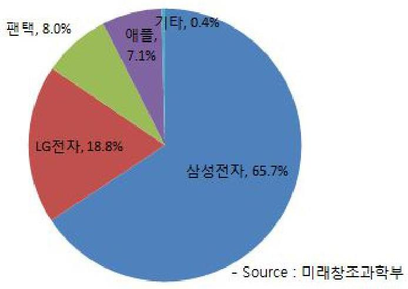
[그림1] 2013년 제조사별 국내 휴대폰 판매 시장 점유율 출처: http://www.mobizen.pe.kr/

주로 단일 기종으로 출시되는 아이폰과 달리 안드로이드 스마트폰은 안 드로이드 버전이나 CPU, 디스플레이 크기 등을 기준으로 각 제조사에서 여러 가지 버전으로 출시하고 있다. 거기다 국내에서는 같은 가중의 모델 도 각 통신사마다 다르게 출시되는 상황이다. 이런 기종을 다양한

식의 어려움을 가중시킨다.
기종의 다양함뿐만 아니라 안드로이드의 버전의 다양함도 포렌식의 어 려움을 가중시키는 원인이다. 안드로이드는 2008년 9월 23일 안드로이드 1.0 애플파이(API Level 1)의 발표이후 현재의 4.4 킷캣(API Level 19)까 지 지속적으로 업데이트 되고 있다. 현재의 안드로이드의 점유율을 살펴 보면 [그림2]와 같다.
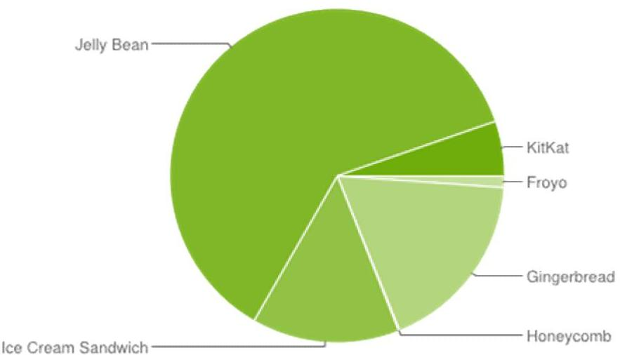
[그림2] 안드로이드의 코드네임별 시장 점유율 출처:Android Developers(2014.4) , http://developer.android.com.

위 [그림2]를 보면 젤리번이 절반이상의 점유율은 가지고 있지만 아직 도 다양한 버전에 사용자가 분포되어 있는 것을 볼 수 있다. 자세한 버전 별 점유율을 살펴보면 [표3]과 같다. 프로요 이전의 점유율은 2013년 8월 기준 $1 \%$ 정도이고, 구글 마켓에서 집계가 불가능한 상태이다[101 131
[표3]을 보면 같은 코드네임 내에서도 버전의 차이가 있는 것을 확인해

수 있다. 같은 기종이라도 안드로이드 운영체제 버전의 업데이트로 인해 전체적인 포랜식 접근 방법의 차이가 생기게 된다. 예를 들어 SHW-M250L 이라는 모델명의 같은 기종이라도 안드로이드 버전이 하나 는 진저브래드이거나, 다른 하나는 아이스크림 샌드위치라면 같은 방법으 로 접근이 어렵다. 이런 버전 차이로 인해 포랜식이 적용되어야 하는 스 마트폰 마다 접근 방식이 달라야 했기 때문에 포괄적인 포랜식을 적용하 기에 어려움이 있었다.
[표3] 안드로이드 버전별 점유율

| 버전 | 코드네임 | API $^{3)}$ | 점유율 |
| :--: | :--: | :--: | :--: |
| 2.2 | 프로요 | 8 | $1.1 \%$ |
| $2.3 .3-2.3 .7$ | 진저브래드 | 10 | $17.8 \%$ |
| 3.2 | 허니콤 | 13 | $0.1 \%$ |
| $4.0 .3-4.0 .4$ | 아이스크림 샌드위치 | 15 | $14.3 \%$ |
| 4.1.X | 젤리빈 | 16 | $34.4 \%$ |
| 4.2.X |  | 17 | $18.1 \%$ |
| 4.3 |  | 18 | $8.9 \%$ |
| 4.4 | 컷캣 | 19 | $5.3 \%$ |

출처: Android Developers(2014.4), http://developer.android.com.

그리고 지금까지 연구된 대부분의 안드로이드 포랜식 기법들은 해외에 서 사용되는 모델 중심이어서, 국내의 안드로이드 스마트폰에 맞게 연구 된 것이 많지 않았다. 현재 상용화 된 대표적인 안드로이드 스마트폰 포

[^0]
[^0]:    3) API(Application Programming Interface):프로그램 또는 애플리케이션이 운영 체제에 어떤 처리를 위해서 호출할 수 있는 서브루틴 또는 함수의 집합이다. 명령어의 집합으로 애플리케이션을 보충해 에서 오퍼레이팅 시스템의 기본적인 기능을 사용할 필요가 있을 때에 여기에서 명령어를 호출함에 (출처:NEW 경제용어사전)

랜식 프로그램은 [표4]와 같다[1].

[표4] 상용화 된 안드로이드 스마트폰 포랜식 도구

|  이름 | 제공형태 | 플랫폼  |
| --- | --- | --- |
|  Cellebrite Mobile Forencics | SW/HW | Windows  |
|  Secure View3 Software Kit | SW | Windows  |
|  Paraven Device Forensics | SW/HW | Windows  |
|  SAFT Mobile Forensics | SW/HW | Windows  |
|  MicroSystemation XRY/XAMN | SW/HW | Windows  |
|  Oxygen Forensic Suite | SW | Windows  |
|  viaForensics viaExtract | SW | Virtual Machine  |

본 논문에서는 국내에서 많이 사용되는 안드로이드 스마트폰과 안드로 이드 운영체제의 버전들을 중심으로 물리적 이미지를 획득하는 방법을 제 안하겠다. 물리적 이미지의 획득이 포랜식에서 중요한 이유는 삭제된 데 이터의 복구 작업이 가능하기 때문이다.

본 논문의 구성은 다음과 같다. 2장에서는 안드로이드 운영체제와 기존 의 포랜식 방법에 대해 살펴본다. 3장에서는 국내 모델을 기준으로 루트 권한 획득과 물리적 이미지 획득 방법을 구현하고 획득된 이미지를 분석 해 본다. 4장에서는 3장에서 제안한 기법을 테스트 하고, 테스트 한 결과 에 대해 논의한다. 마지막으로 5장에서는 결론 및 향후 과제를 얘기함으 로써 마무리 짓는다.

# 2. 관련 기술 및 동향 

## 2.1 안드로이드 운영체제

안드로이드는 구글과 오픈 핸드셋 얼라이언스(OHA ; Open Handset Alliance)4)에서 개발한 모바일 운영체제이다. 기존의 윈도우 모바일이나 IOS 와 차별화 되는 것은 소스 코드를 모두 공개해서, 누구나 활용할 수 있도록 개방되어 있다는 것이다. 기존에는 각각의 휴대폰 제조업체마다 운영체제와 애플리케이션을 제작하였어야 했으나, 안드로이드의 오픈 소 스 정책으로 누구라도 이를 자유롭게 이용할 수 있게 되었다.

[그림3] 안드로이드의 시스템 구조도
출처:Android Developers, http://developer.android.com
4) OHA(Open Handset Alliance) : 79 개의 기업 및 단체가 모바일 장치의 개발을 표준을 선언한 중 맹이다. 가입 단체로는 대한민국의 삼성전자, LG전자와 팬택, 해외의 구글/HTC, 델, 빌보드, 오픈 라 모빌리티, 퀄컴, 텍사스 인스트루먼츠, T-모바일, 엔비디아, 윈드 리버시스템스등 10개국 11111111111111111111111111111111111111111111111111111111111111111111111111111111111111111111111111111111111111111111111111111111111111111111111111111111111111111111111111111111111111111111111111111111

안드로이드의 구조는 [그림3]과 같이 많은 컴포넌트로 구성되어 있다. 그리고 이들 컴포넌트는 5 개의 레이어(Layer)로 분류되어 있다.

Application에는 이메일, SMS/MMS, 캘린더, 주소록, 브라우저 등의 안 드로이드 Application들이 이 레이어의 컴포넌트가 된다.

Application Framework는 안드로이드 Application에서 이용되는 API를 규정하고 있는 레이어이다. 이 레이어의 주요 컴포넌트는 [표4] 이다.
[표5] Application Framework를 구성하는 주요 컴포넌트

| 컴포넌트 | 기능 |
| :--: | :--: |
| Activity Manager | 응용프로그램의 생명주기(Life Cycle) 관리 |
| Window Manager | 윈도우 관리 |
| Content Providers | 응용프로그램 간의 데이터 공유 관리 |
| View System | 사용자 인터페이스 관리 |
| Notification manager | 상태 바의 통지(Alert) 표시 관리 |
| Package Manager | 설치 관리 |
| Telephony Manager | 통화 기능 관리 |
| Resource Manager | 리소스 관리 |
| Location Manager | 위치 정보 관리 |
| XMPP Service | 메시징 서비스 관리 |

출처: 후루가와 히데카즈, 예제로 배우는 핵심 안드로이드 프로그래밍 SDK2.1, 정보문화사

Libraries는 많은 Application으로부터 범용적으로 이용되는 기능을 통 합한 것이며, Application에서는 Application Framework를 연결해서 이를 이용한다. 이 레이어의 주요 컴포넌트는 [표5]이다.
[표6] Libraries를 구성하는 주요 컴포넌트

| 컴포넌트 | 기능 |
| :--: | :--: |
| Surface Manager | 복수 응용프로그램 간의 2D/3D 그래픽을 합성하는 라이브러리 |
| Media Framework | 비디오 형식의 재생과 기록에 대한 라이브러리 |
| SQLite | 관계형 데이터베이스의 라이브러리 |
| OpenGL/ES | 3D 그래픽 엔진 |
| FreeType | 비트맵과 벡터 폰트의 렌더링을 실행하는 라이브러리 |
| WebKit | 브라우저 표시를 실행하기 위한 HTML 렌더링 엔진 |
| SSL | SSL 라이브러리 |
| Iibc | 표준적인 C 언어 라이브러리 |

출처: 후루가와 히데카즈, 예제로 배우는 핵심 안드로이드 프로그래밍
SDK2.1, 정보문화사

Android Runtime은 안드로이드 자바 가상머신의 레이어이다. 이 레이 어의 주요 컴포넌트는 [표6]이다
[표7] Android Runtime을 구성하는 주요 컴포넌트

| 컴포넌트 | 기능 |
| :--: | :--: |
| Core Libraries | 자바 언어에 준거한 코어 라이브러리 기능 |
| Dalvik 가상머신 | .dex 형태의 바이트 코드를 실행하는 가상머신 |

출처: 후루가와 히데카즈, 예제로 배우는 핵심 안드로이드 프로그래밍 SDK2.1, 정보문화사

마지막으로 안드로이드 시스템의 가장 하위에는 Linux Kernel 이 있다. 안드로이드는 리눅스 커널 2.x기반하여 메모리, 프로세스, 디바이스 드라 이버, 보안등의 서비스를 제공한다[4].

위와 같은 안드로이드의 구조에서 주의 깊게 살펴볼 것은 SQLite이다. 안드로이드 스마트폰은 생성되는 데이터들을 /data/data/com.android. $<$ SoftwareName $>$ /databases 라는 형식으로 SQLite에 저장한다. SMS와 통화기록, 연락처 목록 등 포랜식과 관련된 정보들이 생성되어 SQLite 데 이터베이스에 저장된다는 것이다. SQLite의 분석은 포랜식 관점에서 굉장 히 중요하다.

# 2.2 논리적 포렌식 기법 

### 2.2.1. ADB(Android Debug Bridge)

ADB(Android Debug Bridge)는 안드로이드 스마트폰과 에뮬레이터를 관리하기 위한 개발자용 디버깅 프로그램이다. 스마트폰을 PC와 연결시 키기 위해서는 먼저 해당 스마트폰의 USB 드라이버를 설치해야 한다. 포 렌식 관점에서는 안드로이드 단말기를 USB 케이블로 컴퓨터에 연결하여 데이터를 수집할 때 ADB가 이용된다.

ADB의 기능으로는 단말기 연결 확인, Shell 접속, 데이터 추출 및 삼 입, 응용프로그램 실행이 있다. 데이터 추출 및 삽입의 경우, 권한에 인해 접근할 수 없는 영역에 대한 추출 및 삽입을 할 수 없다.

ADB를 이용하여 안드로이드 스마트폰에 명령을 실행시키기 위해서는 안 드로이드 스마트폰의 USB Debugging 기능이 활성화되어 있어야만 한다.

### 2.2.2. 루팅(Rooting)

논리적인 방법으로 안드로이드 메모리의 데이터 획득을 시도할 경우 안 드로이드의 보안 메커니즘으로 인하여 데이터에 대한 접근이 일부분만 가 능하다. 각각의 애플리케이션 영역은 샌드박스(SandBox)5) 형태로 존재하 고 있고, 안드로이드는 기본적으로 사용자에게 루트(root)권한을 주지 않 는다. 루트 권한을 가지지 않은 상태에서 접근할 수 있는 데이터 영역에

[^0]
[^0]:    5) 샌드박스(SandBox):외부로부터 들어온 신뢰할 수 없는 프로그램을 보호된 영역에서 전송된 서 দ 행이 부정하게 조작되는 것을 방지하기 위한 보안 소프트웨어 기술 (출처: 위작권 기술 부서사항)

는 한계가 있기 때문에 논리적인 방식으로 전체적인 데이터를 추출하기 위해서는 루트 권한 획득이 필요하다. 안드로이드 운영체제의 취약점을 이용하여 루트 권한을 획득하는 것을 루팅(Rooting)이라고 한다. 스마트폰 에 적용된 안드로이드 버전이나 제조사에 따라 루팅(Rooting)의 방법은 달리 적용된다. 루팅 방법은 여러가지가 존재한다. 첫번째로 안드로이드 버전 2.2 이전까지는 운영체제의 취약점을 공격하는 'exploit'을 통해 루 트 권한의 획득이 가능했다. 하지만 2.3 버전 이후로 운영체제 취약점의 보완이 이루어져 이 방법으로 더 이상 작업이 불가능하다[2].

두 번째로는 루팅이 적용된 커널 이미지로 루트 권한을 획득하는 방법 이다. 이 방법은 커널 이미지 제작 방법에 따라 데이터 영역에 훼손이 생 길 수 있다[3].

# 2.2.3 콘텐츠 프로바이더(Content Provider) 

콘텐츠 프로바이더는 안드로이드 운영체제에서 제공하는 데이터 공유 인터페이스로써, 애플리케이션들이 서로의 데이터베이스의 데이터를 접근 할 수 있는 방법이다. 애플리케이션들은 주로 데이터베이스에 데이터를 저장하는데 안드로이드의 보안 정책상 각 애플리케이션들이 서로에 데이 터베이스에 접근하는 것은 불가능하다. 그래서 데이터를 제공해야 하는 애플리케이션은 콘텐츠 프로바이더의 URI(Uniform Resource Identifier)를 공개하고, 이를 통해 다른 애플리케이션이 데이터에 접근할 수 있다. 하지 만, 콘텐츠 프로바이더는 레코드 단위로 추출하는 방법이므로 삭제된 레 코드는 획득하지 못한다. 또한, 각 제조사마다 콘텐츠 프로바이더를 변경 해서 출시할 경우, 해당 콘텐츠 프로바이더를 알아내지 못하면 데이터를

획득 할 수 없다. 콘텐츠 프로바이더로 접근이 가능한 데이터는 전화번호 부, 통화기록, 문자, 일정 등이다[3].

# 2.3 물리적 포렌식 기법 

물리적 포렌식 기법은 스마트폰의 PCB(Printed Circuit Board)에서 플 래시 메모리를 분리하여 데이터를 추출하는 방식과 JTAG(Joint Test Action Group)6)을 연결하여 내부 메모리를 복사하는 방식이 있다. 물리적 추출 방법은 플래시 메모리 내에 존재하는 모든 영역을 획득할 수 있다 [3].

### 2.3.1. 메모리 칩 분리 방법

스마트폰의 PCB 내의 메모리를 분리하여 [그림4]와 같이 메모리 리더 기를 통해 데이터를 획득하는 방법이다. 스마트폰이 침수나 화재 파손등 을 이유로 직접 접근하기 어려운 경우에 주로 사용된다. 메모리 자체를 리더기로 읽어들이는 방식이기 때문에 전체적인 물리적 이미지 획득이 가 능하다.

[^0]
[^0]:    6) JTAG(Joint Test Action Group):임베디드 시스템 개발 시에 사용하는 디버밍 장비이다. (제이텍으로 발음)은 임베디드 시스템을 개발하기 위해 통합한 회로로 사용되는 IEEE 7248-1000 반적인 이름이지만, 보통 디버거를 가리킨다. (출처:위키백과)

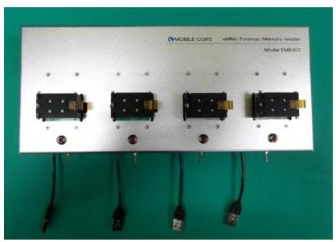
[그림4] 메모리 리더기

# 2.3.2. JTAG을 이용한 방법 

JTAG은 PCB의 JTAG 포트에 직접 연결하거나 표준 24 핀 인터페이스 로 연결할 수도 있다. 이렇게 연결된 후에는 내부 플래시 메모리에 전체 적인 접근이 가능하여 물리적 이미지의 획득이 가능하다. 하지만 최근 스 마트폰은 출시될 때 제조업체는 핀 구성도나 이와 관련된 정보를 공개하 지 않고, 아예 JTAG 포트를 차단하는 경우도 있다. 이런 이유로 JTAG를 광범위하게 적용하기에는 어려움이 있다. [그림5]는 삼성 갤럭시 S를 JTAG 장비에 연결한 것이다.
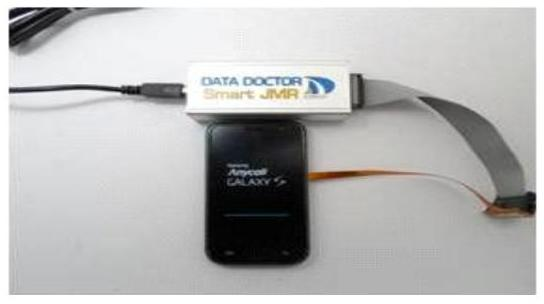
[그림5] 갤럭시 S의 JTAG

# 2.4 기존의 연구 

Andrew Hoog는 안드로이드 운영체제의 전반적인 구조와 루팅된 안드 로이드 기반 기기에서 데이터를 수집하는 방식에 대해 설명하였다. 물리 적인 방법과 논리적인 방법, 데이터 분석 과정에 대해 종합적으로 정리하 였다[5][6].

Jeff Lessard는 안드로이드 스마트폰의 외장 메모리를 USB 케이블로 연 결하여 분석용 PC에 이미지를 획득하는 방법과, 루팅 프로그램 실행 후 내장 메모리의 물리적 이미지를 획득하여 분석하는 기법을 연구하였다[7].

Stefan Maus등은 루팅된 안드로이드 스마트폰에서 위치정보를 나타내 는 데이터베이스나 애플리케이션의 데이터를 추출하여, 사용자의 위치를 분석하는 방법론을 제시하였다[8].

Timothy Vidas등은 리커버리 모드에서 루팅이 가능한 이미지를 메모리 에 플래싱 한 후 adb를 이용하여 메모리를 획득하는 방법을 제안하였다.[9]

이윤호는 루트권한의 획득 방법과 루트 권한의 획득 방법에 따라 데이 터 영역에 변경이 일어나는 것을 증명하였다[3].

지금까지 주로 연구된 것은 해외에서 출시된 안드로이드 스마트폰을 이 용한 접근 방법이었다. 국내에서 출시되어 사용된 모델에 대한 접근은 많 지 않았다. 더욱이 제조사에서 스마트폰을 판매하는 나라나 통신사에 따 라 모델의 변경이 가해져 루트 권한 획득하는 방식에 차이점이 생기는 경 우가 많았다. 본 논문에서는 국내 모델을 중심으로 루트 권한 획득의 방 법들과 물리적 이미지 획득 과정을 구현해 보겠다.

# 3. 논리적 포랜식 기법 구현 

## 3.1 착안점 및 구현

논리적인 포랜식 기법들은 물리적 이미지 접근을 위해서 루팅을 필요로 했다. 루팅은 스마트폰 기종이나 안드로이드의 버전 업데이트에 따라 방 법을 다르게 사용해야 했다. 이런 불편함을 줄이고자 제조사의 안드로이 드 커널에서 루트 권한의 획득이 가능한 커널을 제작하고, 또한 일부 제 조사의 안드로이드 취약점을 이용해 일부 모델에 대해 루트 권한 획득하 는 방법을 시도해 본 후, 물리적 이미지의 획득을 구현해 보겠다.

커널 제작에는 현재 두 가지 방법이 있다. 첫 번째는 커널 영역에 'su' 및 'busybox' 바이너리, 'Superuser.apk' 등을 삽입하는 방법이다. 두 번째 는 커널 이미지 랜디스크 영역의 코드(default.prop, init.rc 등)를 일부 수 정함으로써 루트 권한을 획득할 수 있는 방법이다. 본 논문에서는 두 번 째 방법으로 커널을 제작하려고 한다. 이 방법을 택한 이유는 루트 권한 획득 과정에서 데이터 영역에 변형이 없다는 것이 확인되어 포랜식에 적 합하기 때문이다. 첫 번째 방법의 경우 데이터 영역에 변형이 있다는 것 이 증명되었다. 국내의 안드로이드 스마트폰을 제조하는 3사는 제조사별 로 다른 펌웨어 압축 파일 포맷을 사용한다. 하지만 압축을 해제하게 되 면 부트로더, 커널, 랜디스크 등을 저장하고 있는 파일을 추출할 수 있다. [그림6]과 같은 방법으로 커널 이미지의 제작이 가능하다[3].

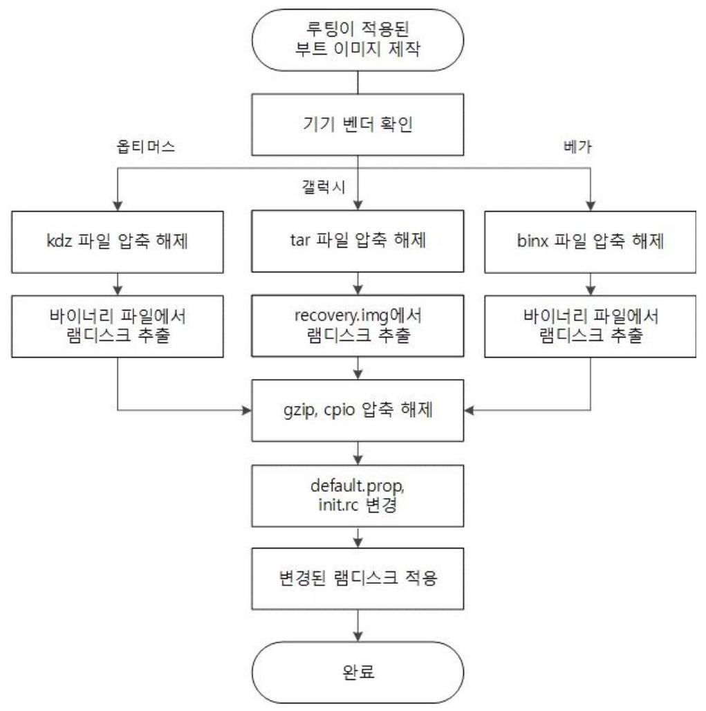
[그림6] 루팅이 적용된 커널 이미지 제작 과정
출처: 이윤호, "스마트 기기의사용자 데이터 추출에 관한 연구", 고려대 정보보호대학원 석사 학위 논문, 2013년

예를 들어 삼성 갤럭시 S3의 펌웨어의 압축을 해제하면 [그림7]과 같은 이미지 파일들이 보인다.

|  boot | 2013-10-08 오후 | 디스크 이미지 파일 | 5.463 KB  |
| --- | --- | --- | --- |
|  cache | 2013-10-08 오후 | 디스크 이미지 파일 | 32.137 KB  |
|  hidden | 2013-10-08 오후 | 디스크 이미지 파일 | 14.405 KB  |
|  modem.bin | 2013-10-08 오후 | BIN 파일 | 19.304 KB  |
|  recovery | 2013-10-08 오후 | 디스크 이미지 파일 | 6.151 KB  |
|  sboot.bin | 2013-10-08 오후 | BIN 파일 | 867 KB  |
|  system | 2013-10-08 오후 | 디스크 이미지 파일 | 1.528.686  |

[그림7] 갤럭시 S3의 펌웨어 압축 해제

위 그림의 recovery.img 파일에서 램디스크의 추출이 가능하다. Recovery.img 안에는 [그림8]과 같은 1F 8B 08로 시작하는 gzip으로 램디스크 영역이 압축이 되어 있다.

|  通 recovery.img |  |  |  |  |  |  |  |  |  |  |  |  |  |  |  |  |  |  |  |  |  |  |  |  |  |  |  |  |  |  |  |  |  |  |  |  |  |  |  |  |  |  |  |  |  |  |  |  |  |  |  |  |  |  |  |  |  |  |  |  |  |  |  |  |  |  |  |  |  |  |  |  |  |  |  |  |  |  |  |  |  |  |  |  |  |  |  |  |  |  |  |  |  |  |  |  |  |  |  |  | 

램디스크의 압축을 해제하면 [그림9]와 같은 램디스크의 구조가 나온다. 제조사마다 램디스크 영역에 약간의 차이는 있으나 여기서 중요한 파일은 default.prop와 init.rc 이다.
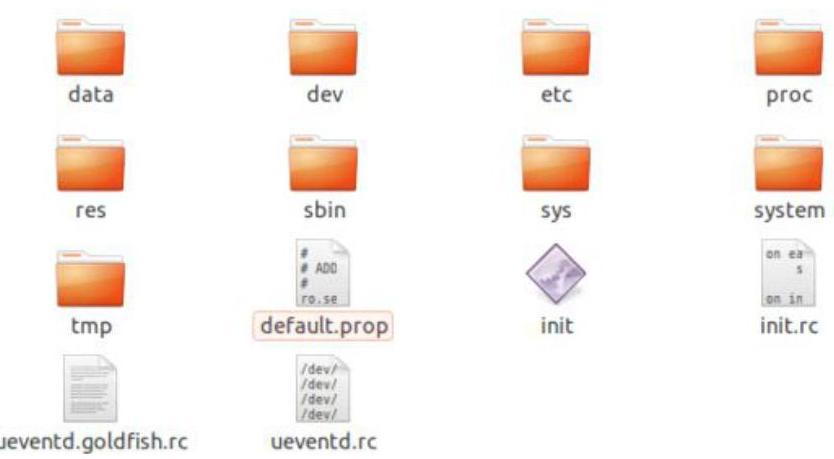
[그림9] 램디스크 구조

파일 편집기에서 default.prop을 열어 ro.secure $=1$ 값을 ro.secure $=0$ 으 로 수정하고 ro.debuggable $=0$ 값을 ro.debuggable $=1$ 로 수정한다. 또 init.rc의 on property:persist.service.adb.enable=1 start adbd 명령어로 루 트 권한의 획득이 가능해진다. 변경된 램디스크를 다시 압축하여 커널로 제작을 하게되면 루트 권한을 얻을 수 있는 커널 제작이 완료된다[11].

# 3.2 동작과정 

갤럭시 계열에 삼성 안드로이드 스마트폰을 부팅시키지 않은 상태에서 다운로드 모드로 들어가 부트영역에 루트 권한 획득이 가능하도록 제작한 커널 이미지를 설치한다. 커널이 설치되면 루트 권한이 생성되어 데이터 영역에 물리적 이미지에 접근이 가능해진다. 물리적 이미지 획득이 완료 된 후 부트 영역에 원래의 커널을 설치해 주면 초기의 상태로 돌아간다. 부팅을 하지 않고도 물리적 이미지 획득이 가능하고, 해시값(Hash valu e)7)이 변하지 않기 때문에 포렌식에 적합하다. 커널 설치는 [그림10]과 같 이 프로그램을 이용하거나 adb 명령어를 통해 가능하다.
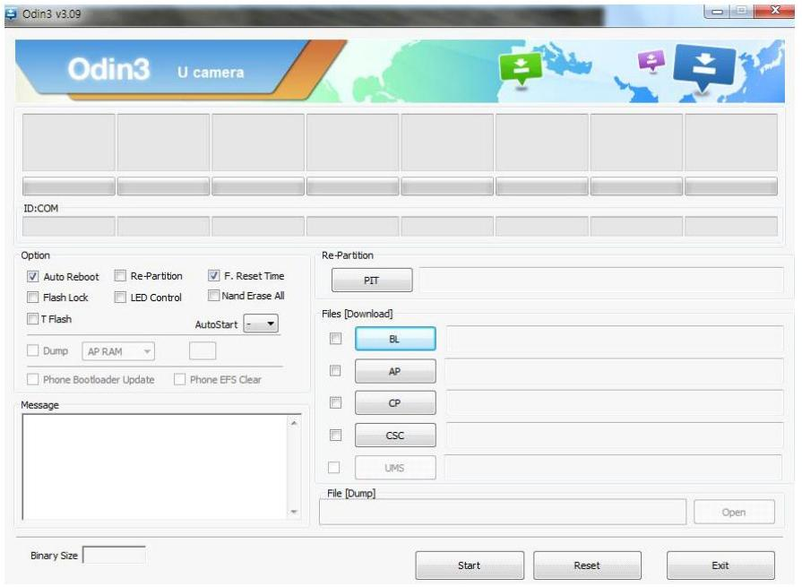
[그림10] 삼성 계열 커널 플래싱 프로그램

[^0]
[^0]:    7) 해시값(Hash value): 복사된 디지털 증거의 동일성을 입증하기 위해 파일/특성을 축약함 수치로 일반적으로 수사과정에서 '디지털 증거의 지문'으로 통한다. (출처: 한국경제신문)

팬택 계열의 안드로이드 스마트폰은 fastboot 모드로 진입하여 커널 이 미지를 설치할 수 있다. [그림11]과 같이 명령어를 사용하여 커널을 설치 후 물리적 이미지 획득을 할 수 있다.

# ㄱ:@fastboot>fastboot flash recovery recovery. ing   ending 'recovery' <5360 KB>... OKAY   writing 'recovery'... OKAY 

[그림11] fastboot로 커널 설치

LG 계열의 폰들은 일부 기종에서 default.prop의 ro.debuggable 값이 1 로 되어 있는 경우가 있다. 이 경우 간단하게 루트 권한을 획득 할 수 있 는데, adb kill-server 명령어로 실행중인 다른 adb 데몬을 중단 시킨 후 adb root 명령어로 루트 권한을 획득 할 수 있다. 또한 최근 출시된 4.1.2 이상 버전의 폰들은 adb 명령어로 루트 권한을 획득 할 수 있다. [그림 12]와 같이 명령어를 실행하면 루트 권한이 획득 되는 것을 알 수 있다 [11].
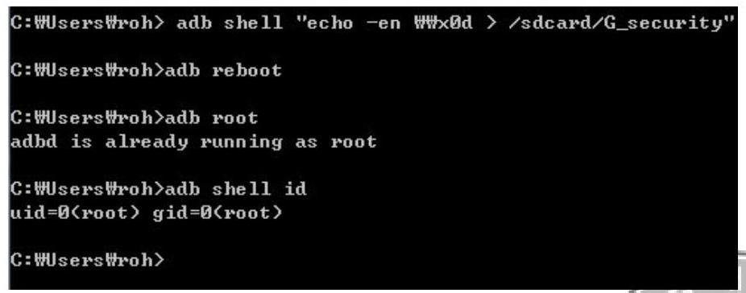
[그림12] 4.1.2 이상 버전의 LG기기의 루트 권한 획득

LG 계열의 안드로이드 스마트 폰도 [그림13]과 같이 커널 플래싱 프로그램

[그림13] LG 커널 플래싱 프로그램

국내의 대표적인 제조사들의 안드로이드 스마트폰의 루트 권한을 획득하는 방법을 알아보았다. 이렇게 루트 권한이 획득 된 이후에는 adb 명령어를 통해 물리적 이미지를 획득할 수 있다. 일단 adb shell 명령어 중 cat/proc/partitions 라는 명령어로 파티션을 확인한다. 다음 [그림14]는 갤럭시 S2(SHW-M250L)의 파티션 정보를 나타낸 것이다.

| major minor |  |  |  |
| :--: | :--: | :--: | :--: |
| 179 | 0 | 15388672 | mncblk0 |
| 179 | 1 | 20480 | mncblk0p1 |
| 179 | 2 | 1280 | mncblk0p2 |
| 179 | 3 | 1280 | mncblk0p3 |
| 179 | 4 | 8192 | mncblk0p4 |
| 179 | 5 | 8192 | mncblk0p5 |
| 179 | 6 | 8192 | mncblk0p6 |
| 179 | 7 | 102400 | mncblk0p7 |
| 259 | 0 | 16384 | mncblk0p8 |
| 259 | 1 | 524288 | mncblk0p9 |
| 259 | 2 | 2097152 | mncblk0p10 |
| 259 | 3 | 12591104 | mncblk0p11 |
| 179 | 16 | 512 | mncblk0boot1 |

[그림14] 갤럭시 S2(SHW-M250L)의 파티션 정보

물리적 이미지를 획득하고자 하는 파티션의 위치를 확인한 후 adb shell 상태에서 다음과 같이 \#dd if=<파티션경로> of=<저장위치> $\mathrm{bs}=4096$ 명령어를 입력하면 물리적 이미지의 획득이 된다[9].
[그림15]는 dd 명령어를 사용하여 갤럭시 S2(SHW-M250L)의 데이터 파티션의 물리적 이미지의 획득을 시도한 것이다.
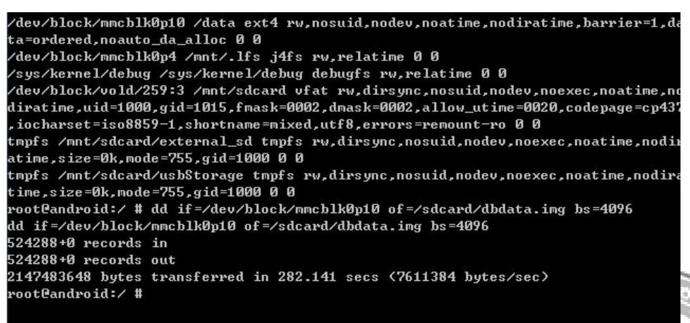
[그림15] 갤럭시 S2(SHW-M250L) 의 물리적 이미지 획득

[그림16]은 획득된 물리적 이미지이다. [그림14]의 파티션 정보에서 보 았던 것과 같이 2097152 KB 사이즈의 이미지가 생성되었다.
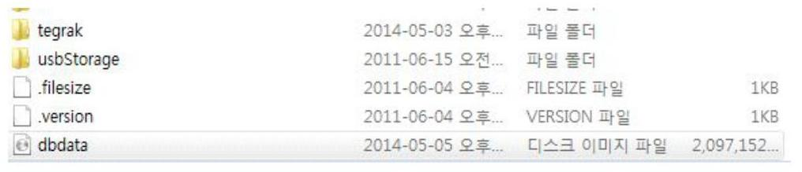
[그림16] 갤럭시 S2의 획득이미지

# 3.3 이미지 분석 

획득된 이미지들은 어떻게 활용 되는지 확인해보려고 한다. 획득된 물 리적 이미지는 Encase 나 FTK 와 같은 통합 포랜식 툴로 분석이 가능하 다. [그림17]은 autopsy 라는 오픈 소스 포랜식 툴로 [그림16]의 dbdata.img 를 분석한 결과이다
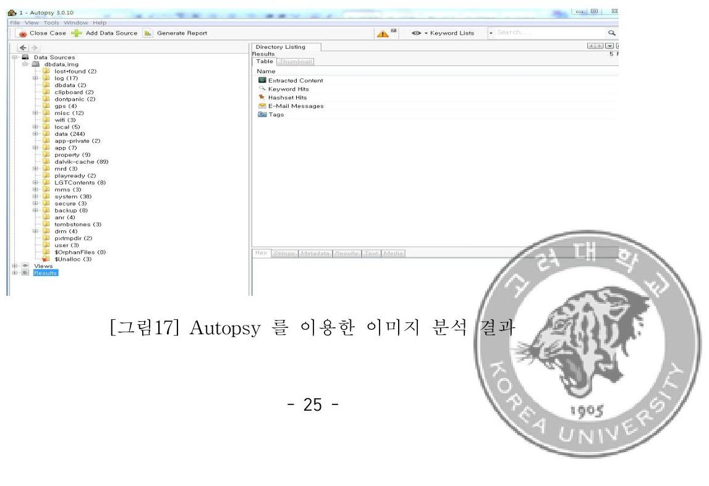

/data 폴더에 많은 애플리케이션의 데이터들이 SQLite 형태의 데이터 베이스로 저장이 된다. [그림18]은 국내에서 많이 쓰이는 SNS 카카오톡 의 db에 접근한 것이다.
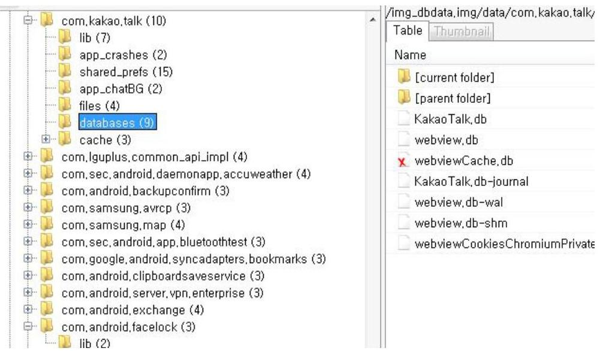
[그림18] 카카오톡의 DB

Kakao Talk.db 에는 많은 정보들이 저장된다. 대화 목록이나 친구 목 록 등 포렌식에 있어 유용한 정보들의 획득이 가능하다. [그림19]는 Kakao talk.db의 친구 목록을 SQLite Database Browser 라는 오픈 소스 프로그램으로 분석한 것이다.

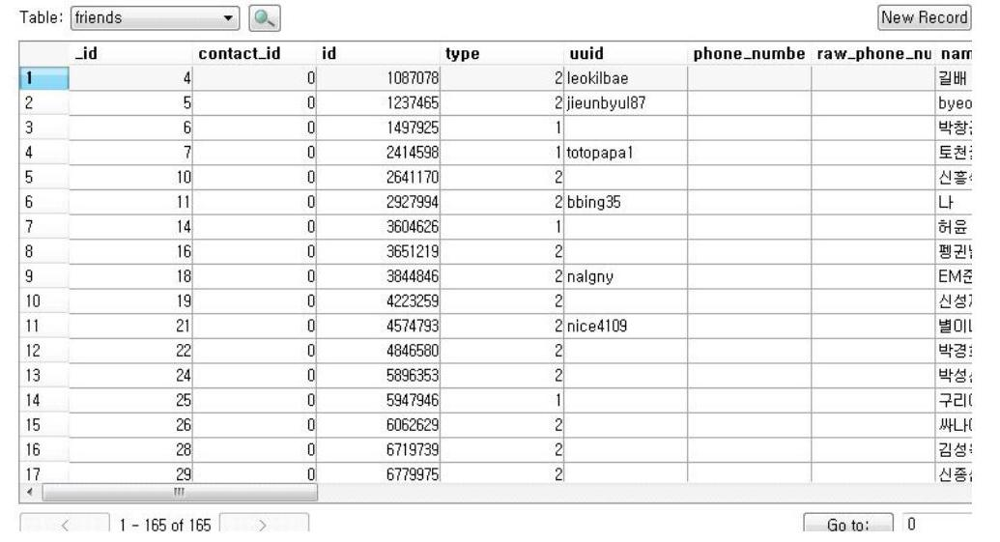
[그림19] Kakotalk.db 친구 목록 분석

물리적 이미지가 획득이 되면 [그림19] 결과와 같이 다양한 포렌식 데 이터의 분석이 원활하게 이루어질 수 있다.

# 4. 테스트 및 테스트 결과 

## 4.1 테스트 환경

테스트에 쓰인 스마트폰의 제조사와 안드로이드 버전은 [표7]과 같다.
[표8] 테스트 용 안드로이드 스마트폰과 안드로이드 버전

| 대상단말 | 안드로이드 버전 |
| :--: | :--: |
| 삼성 갤럭시 S2(SHW-M250S) | 진저브래드(2.3.5) |
| 삼성 갤럭시 S2(SHW-M250L) | 아이스크림 샌드위치(4.0.4) |
| 삼성 갤럭시 S2LTE(SHV-E120S) | 진저브래드(2.3.6) |
| 삼성 갤럭시노트2(SHV-E250S) | 젤리빈(4.1.2) |
| 삼성 갤럭시 S3(SHV-E210S) | 젤리빈(4.1.2) |
| 삼성 갤럭시 S3(SHV-E210S) | 젤리빈(4.3) |
| 팬택 배가 R3(IM-A850K) | 아이스크림 샌드위치(4.0.4) |
| LG 옵티머스 G(LG-F180S) | 젤리빈(4.1.2) |

국내의 대표적인 제조사의 모델들을 선정하였고, 안드로이드의 버전은 상위 점유율 3 가지 버전을 선정하였다.

# 4.2 테스트 

### 4.2.1 삼성 갤럭시 계열의 폰

삼성 갤럭시 S2(SHW-M250L)의 다운로드 모드에 진입한다. 전원을 꺼 둔 상태에서 볼륨 버튼 상+홈 버튼+전원 버튼을 동시에 누르면 [그림20] 과 같이 다운로드 모드로 접근할 수 있다.
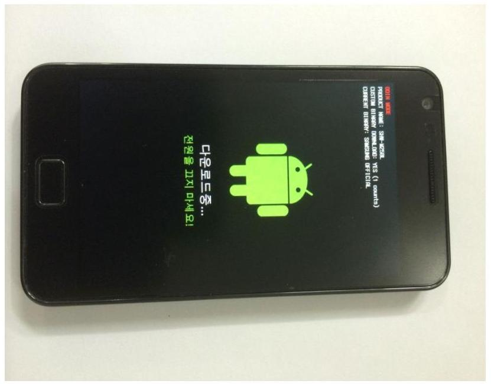
[그림20] 갤럭시 S2(SHW-M250L)의 다운로드 모드 진입 상태

다운로드 모드에서 루트 권한 획득이 가능한 커널을 설치한다. 위에서 설명한 프로그램을 통해 커널을 업로드 할 수 있다. [그림21] 루터 커널 이 업로드된 상태를 나타낸 것이다.

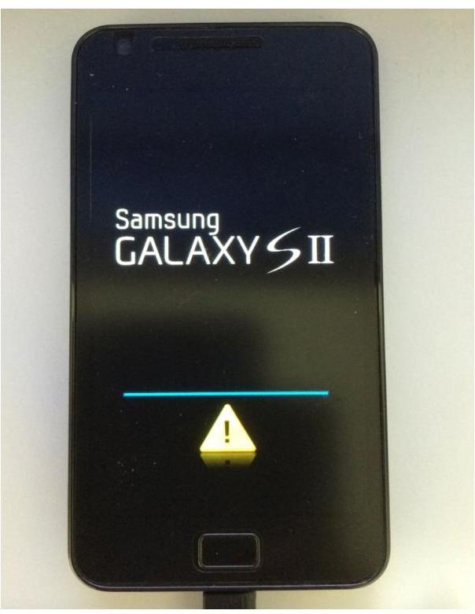
[그림21] 갤럭시 S2(SHW-M250L)의 루팅 커널이 업로드 된 상태

루팅 커널이 설치 된 후 데이터 파티션(/dev/block/mmcblk0p10, 총 용 량 2 GB )의 획득을 완료 하였다. 각각 같은 방법으로 통신사와 안드로이 드 버전이 다른 갤럭시 계열의 안드로이드 스마트폰들의 데이터 영역에 획득을 시도하였다. 또다른 갤럭시S2(SHW-M250S)의 데이터 파티션 (/dev/block/mmcblk0p10, 총 용량 2GB)의 획득을 완료 하였다. 갤럭시 S2 LTE(SHV-E120)의 데이터 파티션(/dev/block/mmcblk0p25, 총 용량 2GB), 갤럭시 노트2의 데이터 파티션(/dev/block/mmcblk0p16, 총 용량 24.5GB)의 획득을 완료하였다. 같은 모델이지만 안드로이드 버전이 다른 갤럭시S3(SHV-E210S)의 데이터 파티션 (/dev/block/mmcblk0p12, 총 용 량 11 GB )의 획득을 완료하였다.

# 4.2.2 팬텍과 LG 안드로이드 스마트폰 

팬텍의 안드로이드 스마트폰들은 fastboot 모드에서 명령어를 통해 루 팅 커널을 설치 한 후 물리적 이미지 획득이 가능하다. [그림22]은 팬텍 베가 R3의 Fastboot 모드 진입 상태이다.
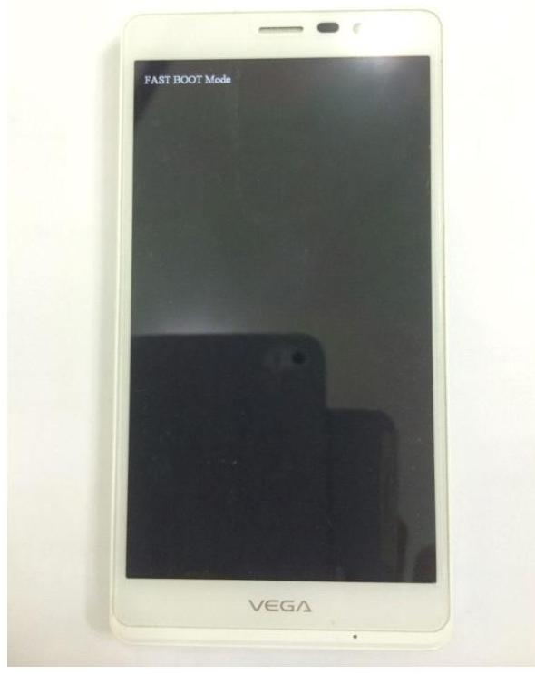
[그림22] 팬텍 베가R3(IM-A850K)의 fastboot 모드

Fastboot 모드에서 루팅 커널을 업로드 후 데이터 파티션 (/dev/block /mmcblk0p26, 총 용량 11GB)의 획득을 완료하였다.

LG의 안드로이드 스마트폰 중 옵티머스 G(LG-F180S)의 모델을 위해 서 본 것과 같이 adb 명령어로 무트 권한을 획득 한 후 데이터 파티션 (/dev/block /mmcblk0p25, 총 용량 25.4GB)의 획득을 완료하였다.

# 4.3 테스트 결과 

무트 권환 획득 이후 데이터 파티션의 물리적 이미지 획득에 대한 결과 는 [표8]과 같다.
[표9] 안드로이드 스마트폰 데이터 파티션 물리적 이미지 획득 및 해시값

| 대상단말 | 데이터 파티션 | 해시값 |
| :-- | :-- | :-- |
| 삼성 갤럭시 S2   (SHW-M250S) | /dev/block/mmcblk0p10   용량 2GB | d27a978ce2391c12ac32   5af50085de5b |
| 삼성 갤럭시 S2   (SHW-M250L) | /dev/block/mmcblk0p10   용량 2GB | a0bc8b4a0fdb1a2849ae   73f5b6519407 |
| 삼성 갤럭시 S2 LTE   (SHV-E120S) | /dev/block/mmcblk0p25   용량 2GB | 57c091c6573902424662   6188a0c18d2d |
| 삼성 갤럭시 노트2   (SHV-E250S) | /dev/block/mmcblk0p16   용량 24.5GB | e535c501aefb845eb060   6e706f1a44a3 |
| 삼성 갤럭시 S3   (SHV-E210S) | /dev/block/mmcblk0p12   용량 11GB | 371de8f02ba894efb7740   b0f6a5e542f |
| 삼성 갤럭시 S3   (SHV-E210S) | /dev/block/mmcblk0p12   용량 11GB | ce52678d71e850b3fd33   9e1a2b1485fb |
| 팬택 베가 R3   (IM-A850K) | /dev/block/mmcblk0p26   용량 11GB | 0329f18fdef9f626150b9   805fe228de4 |
| LG 옵티머스 G   (LG-F180S) | /dev/block/mmcblk0p25   용량 25.4GB | 015f9d58cc6639802c911   f90311c1987 |

테스트 결과 커널 제작과 adb 명령어를 통해 현재 국내에서 출저되어 사용 중인 안드로이드 스마트폰의 무트 권환 획득이 가능한 경을 확인 할 수 있었다.

앞으로 새로운 안드로이드 폰과 안드로이드 운영체제가 출시되더라도 위와 같은 방법으로 커널을 제작하여 공유하게 되면 포렌식 과정의 복잡 함이 한결 줄어들 것으로 예상된다.

# 5. 결론 및 향후 연구과제 

국내의 안드로이드 스마트폰의 점유율은 이미 $90 \%$ 이상을 차지하고 있 다. 이런 상황에서 안드로이드 스마트폰 포랜식에 대한 필요성은 계속해서 증가할 수 밖에 없다. 오픈 소스를 기반으로 국내외의 다양한 제조사에서 새로운 안드로이드 폰들을 개발해서 출시하고, 안드로이드 버전의 업데이 트는 꾸준하게 진행되고 있다. 새로운 폰, 새로운 버전의 안드로이드가 출 시될 때마다 안드로이드 스마트폰 포랜식의 범위는 계속해서 넓어질 수 밖에 없다. 이런 상황은 모바일 포랜식의 어려움을 가중시키는 부분이다.

해외에서 개발되어 출시된 상용 포랜식 툴들은 대부분 자국에서 사용중 인 모델들을 기준으로 출시되는 경우가 많았다. 그리고 현재 국내에서 개 발되어 출시된 상용 포랜식 툴은 전무하다. 국내 실정에 맞는 포랜식 툴 과 포랜식 방법이 없기 때문에 대부분 해외의 포랜식 툴에 의지하는 상황 이다[1]. 논리적인 포랜식 방법으로 물리적 메모리 획득을 시도하려면 루 팅을 해야만 했다. 하지만 출시되는 기기마다 다른 방식의 루팅 방법이 필요해서 포괄적인 포랜식 접근이 어려웠다. 국내에서 주로 사용되는 다 양한 모델에 대한 포괄적인 논리적 포랜식 기법이 필요한 상황이다. 본 논문에서는 국내에 출시된 여러 가지 기종들을 대상으로 루트권환 획득과 물리적 이미지 획득을 시도하였다. 시도 결과 다양한 모델에 적용이 가능 한 것을 확인하였다.

향후 본 연구를 기반으로 좀 더 다양한 안드로이드 스마트폰과 안드로 이드 버전에 적용되는 포랜식 연구가 진행되어야 하고, 물리적으로 획득 된 이미지의 정밀한 분석 방법의 개발이 필요하다.

# 참 고 문 헌 

[1] 문필주, "모바일 포랜식 도구 동향", 정보통신산업진흥원 주간기술동 향 1635호, 2014
[2] 오정훈, "안드로이드 스마트폰 포랜식 분석 방법에 관한 연구", 고려대 정보보호대학원 석사 학위 논문, 2012
[3] 이윤호, "스마트 기기의 사용자 데이터 추출에 관한 연구", 고려대 정 보보호대학원 석사 학위 논문, 2013
[4] 후루가와 히데카즈, "예제로 배우는 핵심 안드로이드 프로그래밍 SDK2.1", 정보문화사
[5] Andrew Hoog, "Android Forensics", Mobile Forensics World 2009, May. 2009
[6] Andrew Hoog, "Android Forensics: Investigation, Analysis and Mobile Security for Google Android", Syngress, 1 edition, June, 2011
[7] Jeff Lessard, "Android Forensics : Simplifying Cell Phone Examinations", Small Scale Digital Device Forensics Journal, Vol. 4, No. 1, pp.1-12, Sep. 2010
[8] Stefan Maus, Hans Höofken, Marko Schuba, "Forensic Analysis of Geo data in Android Smartphones", International Conference on Cybercrime, Security and Digital Forensics, 2011

[9] Timothy Vidas, Chengye Zhang, Nicolas Christin, "Toward a general collection methodology for Android devices", Digital Investigation 8, 2011.
[10] Android Developers , http://developer.android.com.
[11] Android Developers Community, "http://forum.xda-developers.com"
[12] Idc, http://www.idc.com
[13] Strategy Analytics, http://www.strategyanalytics.com

