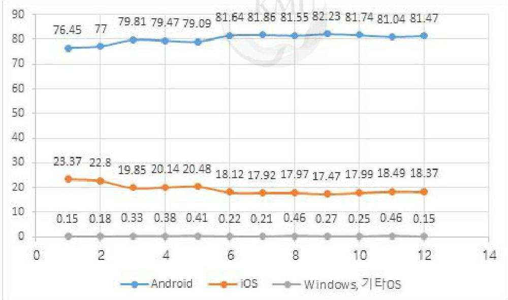
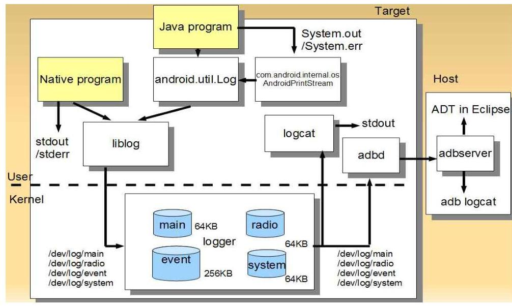
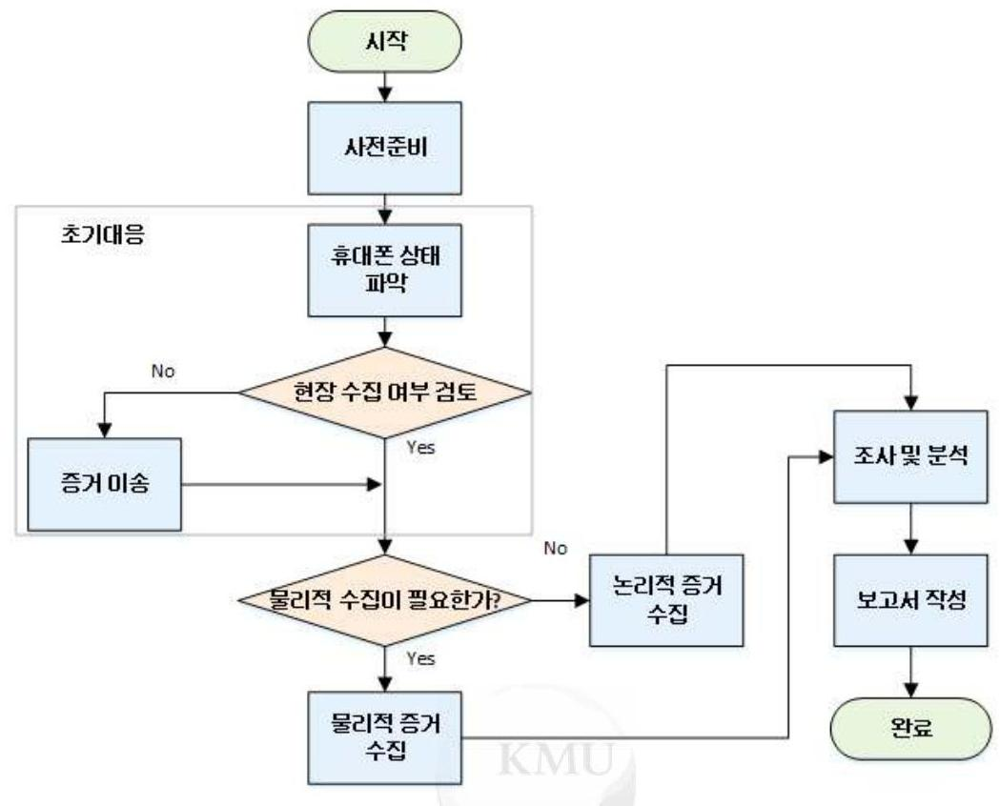
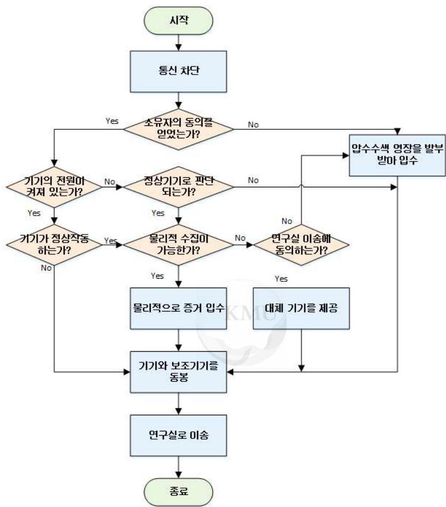
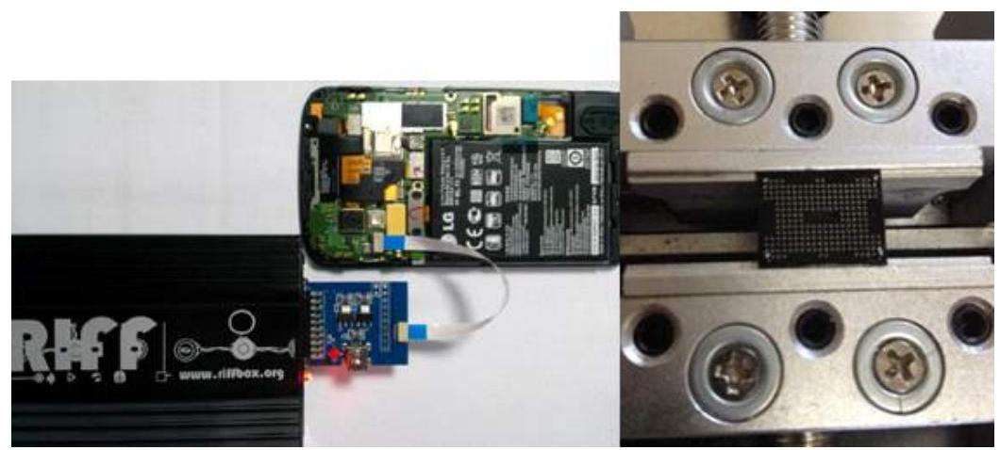
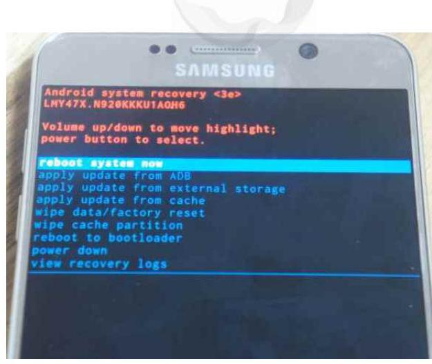
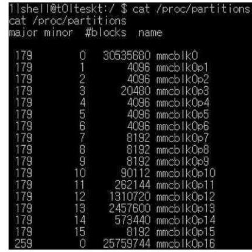
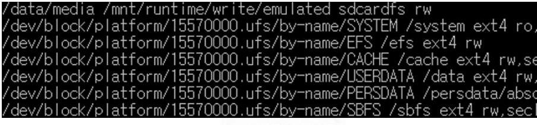
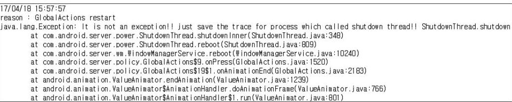
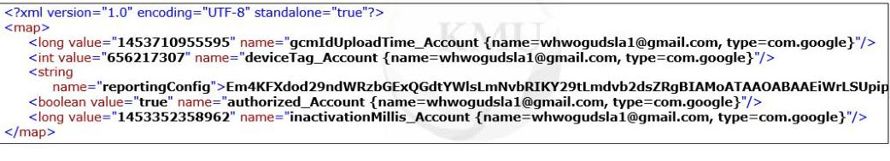

# (c)creative <br> C O M M O N S D E E D 

## 저작자표시-비영리-변경금지 2.0 대한민국

이용자는 아래의 조건을 따르는 경우에 한하여 자유롭게

- 이 저작물을 복제, 배포, 전송, 전시, 공연 및 방송할 수 있습니다.

다음과 같은 조건을 따라야 합니다:


저작자표시. 귀하는 원저작자를 표시하여야 합니다.

비영리. 귀하는 이 저작물을 영리 목적으로 이용할 수 없습니다.

변경금지. 귀하는 이 저작물을 개작, 변형 또는 가공할 수 없습니다.

- 귀하는, 이 저작물의 재이용이나 배포의 경우, 이 저작물에 적용된 이용허락조건 을 명확하게 나타내어야 합니다.
- 저작권자로부터 별도의 허가를 받으면 이러한 조건들은 적용되지 않습니다.

저작권법에 따른 이용자의 권리는 위의 내용에 의하여 영향을 받지 않습니다.
이것은 이용허락규약(Legal Code)을 이해하기 쉽게 요약한 것입니다.
Disclaimer $\square$

# 석사학위논문 

## 안드로이드 스마트폰

## 시스템 로그 분석 연구

A Study on System Log of Android Smartphone

## 국민대학교 일반대학원

금융정보보안학과 금융보안전공
조 재 형

2016

# 안드로이드 스마트폰 시스템 로그 분석 연구

A Study on System Log of Android Smartphone

지도교수 김 종 성

이 논문을 석사학위 청구논문으로 제출함

2017년 4월 25일

국민대학교 일반대학원

금융정보보안학과 금융보안전공

조 재 형

2016

# 조재형의 

## 석사학위 청구논문을 인준함

2017년 6월 30일

심사위원장
엽
용
진
(11)

심사위원
김
종
성
(11)

심사위원
이
옥
연
(1)

국민대학교 일반대학원

# 목 차 

그림 목차 ..... iii
표 목차 ..... iv
국문 요약 ..... vi

1. 서론 ..... 1
1.1 연구 배경 및 관련 연구 ..... 1
1.2 연구 범위 및 내용 ..... 6
2. 모바일 포렌식 ..... 8
2.1 모바일 포렌식 절차 ..... 8
2.2 안드로이드 기기 데이터 획득 방법 ..... 19
3. 안드로이드 펌웨어 정보 ..... 29
3.1 안드로이드 펌웨어 ..... 29
3.2 조사대상 기기 정보 ..... 32

4. 시스템 로그 분석 ..... 37
4.1 시스템 로그 분류 ..... 37
4.2 시스템 로그 정규화 ..... 44
4.3 안티 포렌식 행위에 대한 의의 ..... 66
5. 결론 및 향후 연구 ..... 69
참고 문헌 ..... 61
영문 요약 ..... 62

# 그림 목차 

(그림 1-1) 2016년 대한민국 스마트폰 OS 점유율 ..... 2
(그림 1-2) 안드로이드 로그 시스템 ..... 5
(그림 2-1) 모바일 포렌식 절차 ..... 9
(그림 2-2) 초기대응 절차 ..... 13
(그림 2-3) JTAG 방식(좌) Chip-off 방식(우) ..... 23
(그림 2-4) 리커버리 모드 부팅 화면 ..... 27
(그림 3-1) 안드로이드 펌웨어 구성 ..... 29
(그림 3-2) Galaxy note2의 파티션 정보 ..... 30
(그림 3-3) mount 명령어를 통한 파티션 확인 ..... 31
(그림 3-4) 블록 장치명과 파티션 확인 ..... 32
(그림 4-1) 공장초기화 관련 흔적 ..... 38
(그림 4-2) 전원 종료 관련 흔적 ..... 39
(그림 4-3) Wi-fi 관련 로그 ..... 40
(그림 4-4) 이전 유심과 현재 유심의 정보 ..... 41
(그림 4-5) 구글 이메일 애플리케이션 관련 로그 ..... 42
(그림 4-6) 애플리케이션 사용 기록 로그 ..... 43
(그림 4-7) Galaxy S3(위), J5(아래)의 dnsmasq.leases ..... 44
(그림 4-8) 리커버리 로그에 남는 공장초기화 흔적 ..... 57
(그림 4-9) SimCard.dat에 남는 유심 교체 흔적 ..... 58

# 표 목차 

[표 1-1] 안드로이드 데이터베이스 체크리스트 ..... 3
[표 1-2] 동적 로그 추출 명령어 ..... 6
[표 2-1] Acquisition Level*에 따른 증거 분석 방법 * : Micro read부터 manual extraction까지 5 1의 값 ..... 17
[표 2-2] 모바일 포렌식 절차 ..... 18
[표 2-3] 데이터 획득 방식 비교 ..... 19
[표 2-4] 데이터 추출방법 장 $\cdot$ 단점 비교 ..... 28
[표 3-5] 조사 대상 기기 정보 ..... 32
[표 3-6] 조사 대상 기기의 블록 장치 ..... 33
[표 3-7] 부팅 상태에 따른 마운트 파티션 ..... 35
[표 4-1] 리커버리 시스템 로그 정규화 ..... 45
[표 4-2] 전원 관련 시스템 로그 정규화 ..... 45
[표 4-3] 네트워크 관련 시스템 로그 정규화 (삼성) ..... 47
[표 4-4] 네트워크 관련 시스템 로그 정규화 (LG) ..... 48
[표 4-5] 유심 관련 시스템 로그 정규화 (삼성) ..... 49
[표 4-6] 유심 관련 시스템 로그 정규화 (LG) ..... 60
[표 4-7] 구글 계정 관련 시스템 로그 정규화 ..... 61
[표 4-8] 애플리케이션 관련 시스템 로그 정규화 ..... 62
[표 4-9] 기타 시스템 로그 정규화 (삼성) ..... 63
[표 4-10] 기타 시스템 로그 정규화 (LG) ..... 64

[표 4-11] 행위 별 시스템 로그 존재 여부 ..... 65
[표 5-1] 시스템 로그 분석 대상 경로 ..... 60

# 국문 요약 

## 안드로이드 스마트폰 시스템 로그 분석 연구

## 조재형

## 국민대학교 일반대학원 <br> 금융정보보안학과 금융보안전공

현대 생활환경에서 스마트폰은 사용자의 행위와 가장 밀접한 데이터를 저장하고 있는 장치라고 할 수 있다. 이와 같은 이유로 스마트폰은 디지 털 포렌식 수사에 가장 중요한 대상으로 연구되고 있다. 하지만 안티 포 렌식 행위의 발달로 전문가가 아닌 일반인들도 비교적 쉽게 안티 포렌식 을 스마트폰에 적용할 수 있으며, 이전에 연구된 기술로는 이와 같은 행 위에 대응하기 어렵다.

본 논문에서는 현재까지 연구가 미흡한 안드로이드 스마트폰의 시스템 로그를 분석하여, 디지털 포렌식 수사로 활용하기 위한 작업을 수행한다. 첫 번째로, 안드로이드 스마트폰 메모리에 저장되어 있는 시스템 로그를 수집하고 포렌식 관점에서 의미 있는 데이터를 선별한다. 두 번째로는 선 별한 시스템 로그를 증거로 활용하기 위하여 정규화 하는 작업을 수행하 며, 마지막으로 정규화한 데이터를 안티 포렌식 행위에 대한 대응 방안으 로 제시한다.

선별된 스마트폰을 대상으로 데이터를 수집 및 분석한 결과, 안드로이 드 스마트폰 시스템 로그에는 전원, 네트워크, USIM과 같은 포렌식 관점 에서 중요한 시스템 로그를 획득 가능했다. 또한 스마트폰에서 대표적인 안티 포렌식 행위인 공장초기화 및 USIM 교체에 대한 증거를 발견하여 정리했다.

주제어 : 디지털 포렌식, 안드로이드, 스마트폰, 시스템 로그, 안티 포렌식

# 1. 서론 

## 1.1 연구 배경 및 관련 연구

디지털 포렌식 (digital forensics) 이란 포렌식1)의 한 분야로 전자적 중 거물을 사법기관에 제출하기 위해 데이터의 복구, 수집 및 분석, 증거에 대한 보고서 작성 등을 하는 작업을 의미한다. 그 중에서 모바일 포렌식 (mobile forensics)은 디지털 포렌식 기술의 대상을 스마트폰, 테블릿 PC, PCA 등의 모바일 기기로 확장된 방식을 말한다.

모바일 기기의 정보는 법정 증거로서 많이 활용되고 있다. PDA의 삭제 된 정보를 복구해 뇌물수수 사건의 무죄를 입증하거나, 스마트폰이나 테 블릿 PC의 인터넷 아티펙트 조사를 통해 이메일과 검색 내역 등을 복구 하여 증거로 활용하며, 스마트폰이나 디지털 카메라 등의 사진 파일을 조 사하여 사진 파일에 남겨진 시간, 위치정보를 이용하기도 한다.

모바일 포렌식에서 가장 많이 사용되는 기기는 스마트폰이다. 스마트폰 은 현대 생활에서 사용자와 가장 밀접한 정보를 가장 많이 담고 있는 디 지털 기기로 볼 수 있다. 구글이 발표한 "Mobile Apps in APAC 2016" 에 따르면 한국 시장에서 스마트폰 사용률은 $91 \%$ 로 나타났으며, 이는 데 스크톱 PC와 노트북 사용률인 $73 \%$ 보다 훨씬 높게 나타났다[1].

스마트폰의 운영체제로는 노키아의 심비안, 구글의 안드로이드, 애플의 iOS, RIM의 블랙베리, 마이크로소프트의 윈도우 모바일 등이 있다. 하지만

[^0]
[^0]:    1) 법의학이라고도 하며 법적으로 허용 가능한 증거 및 절차를 법적 기준에 맞춰 수사하 는 형법 및 민법에 과학을 적용한 수사 방법이다. 국내에서는 과학수사로 널리 알려져 있다.

대부분의 스마트폰 사용자들은 안드로이드와 iOS를 선택하고 있으며 해당하는 점유율은 2016년 12월 기준으로 각각 71.93%, 18.95%로 대부분의 사용자들은 운영체제로 안드로이드와 iOS를 사용하고 있다는 것을 알 수 있다[2].

한국에서 가장 많이 사용되고 있는 스마트폰 운영체제는 안드로이드로 2016년 12월 기준 81.47%의 점유율을 기록하고 있다(그림 1-1). 안드로이드 운영체제를 사용하는 스마트폰의 대표적인 국내 제조사로 삼성과 LG가 있으며 국외 제조사로는 구글, 샤오미, 화웨이 등이 존재한다. 국내의 사용들은 자국 기기에 대한 충성도가 높기 때문에 대다수가 삼성과 LG의 스마트폰을 사용하고 있으며, 세계의 스마트폰 운영체제 점유율보다 더 높은 수치의 안드로이드 점유율을 기록하고 있다[3].



(그림 1-1) 2016년 대한민국 스마트폰 OS 점유율

현재까지 모바일 포렌식의 주요 대상으로 연구 된 데이터는 크게 전화 번호부, 문자 메시지 등의 정보를 담고 있는 애플리케이션 데이터베이스 파일과 스마트폰의 동작에 대한 내용을 일시적으로 저장하는 휘발성 로그 로 나눌 수 있다.

애플리케이션 데이터베이스는 사용자의 행위에 연관된 데이터를 대부분 저장하고 있기 때문에 모바일 포렌식의 주요 대상으로 연구되어왔다. 사 용자의 통화 기록, 이메일 기록, 검색 기록과 같은 데이터는 전통적으로 수사에 도움이 되는 정보이며, 지도나 달력, 가계부와 같은 데이터는 사 용자의 행위를 예상할 수 있게 해주는 정보로 활용되었다. 이와 같은 정 보는 카카오톡, 라인과 같은 메신저 애플리케이션이나 페이스북, 인스타 그램 등의 소셜 네트워크 서비스 애플리케이션과 같은 경우를 제외하고 대부분 구글 기본 애플리케이션을 사용한다. 따라서 기존의 연구들은 구 글 기본 애플리케이션의 경로 및 해당 데이터베이스 파일의 경로를 대상 으로 조사했으며, 포렌식 조사를 위한 체크리스트는 아래의 [표 1-1]과 같 다[4].

[표 1-1] 안드로이드 데이터베이스 체크리스트

|  분석대상 | 경로  |
| --- | --- |
|  DeviceInfo
기기정보 | /data/com.android.vending/shared_prefs/vending_preference.xml  |
|   | /data/com.android.vending/shared_prefs/finsky.xml  |
|   | /data/com.android.phone/shared_prefs/com.android.phone_preferencecs.xml  |
|   | /data/.mac.info  |
|   | /data/com.sktelecom.minit/shared_prefs/com.sktelecom.minit_preferences.xml  |
|   | /efs/bluetooth/bt_addr  |
|  Contact
주소록 | /dbdata/databases/com.android.providers.contacts/contacts2.db  |
|   | /data/com.android.providers.contacts/database/contact2.db  |

|  SMS/MMS
기본 문자
정보 | /dbdata/databases/com.sec.mms/mms.db  |
| --- | --- |
|   | /data/com.android.providers.telephony/databases/mmssms.db  |
|   | /data/com.sec.android.mms.kor.providers/databases/NEW_mmssms.db  |
|   | /data/com.sec.mms/databases/mms.db  |
|  Email
이메일
정보 | /dbdata/databases/com.android.email/EmailProvider.db  |
|   | /dbdata/databases/com.android.email/EmailProviderBody.db  |
|   | /data/com.google.android.email/databases/EmailProvider.db  |
|   | /data/com.google.android.email/databases/EmailProviderbody.db  |
|   | /data/com.android.email/databases/EmailProvider.db  |
|   | /data/com.android.email/databases/EmailProviderBody.db  |
|  Calendar
일정정보 | /data/data/com.android.calendar/database/calendar.db  |
|  $\vdots$ | $\vdots$  |

이와 같은 애플리케이션 데이터베이스 분석 이외에 연구된 분야는 스마 트폰의 휘발성 로그 데이터에 대한 분석(이하 동적 로그 분석)이다. 휘발 성 로그 데이터는 비록 긴 시간의 데이터는 저장하지 못하지만, 스마트폰 의 가장 최근 정보를 담고 있다는 장점이 있다[5].

안드로이드의 휘발성 로그 시스템은 아래의 네 가지로 구성된다.

- 커널 드라이버와 로그 메시지를 저장하기 위한 커널 버퍼
- 로그 엔트리를 생성하고 로그 메시지에 접근하기 위한 C, C++, JAVA 클래스
- 로그 메시지를 보기 위한 독립된 프로그램 (logcat ${ }^{2}$ )
- 이클립스나 DDMS3)를 통한 호스트 기기에서의 필터링 기능

[^0] [^0]: 2) 디버깅에 사용되며 로그 정보를 출력해주는 역할을 한다. 3) Dalvik Debuging Monitoring Service의 약자. 실행중인 안드로이드 기기의 로그나 프로 레스 등의 캡처 기능을 제공한다.


(그림 1-2) 안드로이드 로그 시스템
(그림 1-3)과 같이 안드로이드 리눅스 커널 내에는 각각 시스템의 다른 부분을 기록하는 main, radio, event, system 총 네 가지 종류의 로그가 있다. main 로그는 메인 애플리케이션 로그로서 android.util.Log 클래스를 이용하여 기록하고 텍스트 형태로 저장된다. radio 로그는 네트워크 접속 및 접속 대상에 대한 정보를 기록하며 또한 텍스트 형태로 저장된다. eve nt 로그는 시스템 이벤트 정보를 android.util.EventLog 클래스를 이용하며 기록하며 바이너리 형태로 저장된다. 마지막으로 system 로그는 안드로이 드 low-level 시스템의 메시지와 디버깅을 위한 로그로 android.util.Slog 클 래스를 이용하여 기록되고 텍스트 형태로 기록된다.

안드로이드 동적 로그 분석은 adb 프로토콜4)을 이용하여 파일로 저장 하는 방법과 logcat 도구를 이용하여 분석하는 방법으로 나눌 수 있다. ad

[^0]
[^0]:    4) Android Debug Bridge의 약자. 연결된 안드로이드 디바이스와 통신할 수 있는 커맨드 라인 도구.

b 프로토콜을 이용하면 각 로그를 파일 형식으로 추출할 수 있다. adb 프 로토콜을 이용한 로그 추출 방법은 아래의 [표 1-2]와 같다.

[표 1-2] 동적 로그 추출 명령어

| 추출대상 | 명령어 |
| :--: | :-- |
| main | adb loagcat -b main -d > main.txt |
| radio | adb loagcat -b radio -d > radio.txt |
| event | adb loagcat -b event -d > event.txt |
| system | adb loagcat -b system -d > system.txt |

이외에도 파일 이름을 지정할 수 있는 -f 옵션이나, 버퍼의 사이즈를 기 록하는 -p 옵션 등 다양한 옵션을 지정하여 세부적인 내용을 파일로 가져 올 수 있다.

또 다른 방법으로 이클립스나, 안드로이드 스튜디오 등의 logcat을 지원 하는 응용 프로그램이나 전용 로그 분석 도구인 mLogcat, LogFilter 등을 이용하는 방법이 있다. 파일로 가져오는 방법에 비하여 동시에 네 종류의 로그를 확인할 수 있다는 장점이 있으며, 필터링 기능을 통해 원하는 로 그의 분석도 제공한다.

# 1.2 연구 범위 및 내용 

기존에 연구된 애플리케이션 데이터베이스 분석이나, 동적 로그 분석은 단점이 존재한다. 용의자가 공장초기화를 할 경우 파티션을 와이핑 (wipin g)5)하며, 기존의 데이터를 모두 삭제하기 때문에 애플리케이션 데이터베

[^0]
[^0]:    5) 저장 공간의 모든 데이터를 일정한 방식으로 채우는 행위. 본문에서는 모든 저장 공간 은 0 으로 채우는 zero-fill을 의미

이스 분석으로 증거를 획득할 수 없게 된다. 또한 용의자가 공장초기화를 진행한 사실조차 알 수 없으므로 증거인멸 행위를 했다고 주장할 수조차 없다. 동적 로그 분석의 경우 저장되는 로그가 2 시간 정도 지나면(기기마 다 약간의 차이가 존재) 그 이전의 행위에 대하여 알 수 없게 되는 단점 이 있다. 용의자의 스마트폰을 범죄 행위 2 시간 이내에 조사하는 것은 현 실적이지 않다. 예를 들어, 압수수색 영장 발부 및 분석을 위하여 기기를 옮기는 도중에 시간이 지나 새로운 데이터가 기록될 가능성이 매우 높으 며, 또한 휘발성 데이터이므로 기기의 전원이 종료되면 범죄 행위 당시의 로그 데이터가 모두 사라지게 된다.

본 논문에서는 앞서 살펴본 기존 연구들의 단점을 보완하기 위해 현재 까지 연구가 부족했던 안드로이드 스마트폰의 비휘발성 로그(이하 시스템 로그)에 대한 분석을 진행한다. 시스템 로그는 안드로이드 각각의 파티션 에 분포하고 있으며, 각 파티션에 저장되는 시스템 로그의 종류 또한 다 양하다. 따라서 사용자의 행위와 직 $\cdot$ 간접적으로 연관된 시스템 로그를 분류하는 것이 필요하며, 빠른 분석을 위해 [표 1-1]과 같은 안드로이드 시스템 로그 체크리스트 작성이 필요하다.

본 논문의 구성은 다음과 같다. 2 장은 안드로이드 스마트폰 증거 추출 의 적법한 절차 및 방법에 대하여 설명한다. 3 장에서는 본 논문의 조사 대상 기기의 상태에 따른 정보를 조사하며, 4장에서는 사용자의 행위와 연관된 시스템 로그의 체크리스트를 작성하며, 안티 포렌식 행위에 대한 대응방안으로 제시한다. 마지막으로 5 장에서 결론 및 향후 연구로 끝마친 다.

# 2. 모바일 포렌식 

현대의 모바일 기기는 과거 PC에서보다 더욱 사용자의 행위와 관련된 사진 및 영상, 인터넷 사용기록, 연락처, 통화 및 SMS 내역, 소셜 네트워 크 서비스 등의 다양한 정보를 저장하고 있다. 따라서 법정에서 모바일 기기의 데이터를 증거로 채택하고 있으며, 증거로 활용하기 위한 적법한 수집 절차 및 방법에 대한 지식이 필요하다. 본 장에서는 모바일 기기의 증거 획득을 위한 국내 - 외 표준에 대하여 서술하고, 안드로이드 스마트 폰의 데이터 수집 방법을 설명한다.

## 2.1 모바일 포렌식 절차

이동전화 포렌식 (이하 모바일 포렌식)은 적법한 절차 및 방법으로 모바 일 기기내의 디지털 증거물을 수집, 분석, 보관 등을 하는 기술이다. 모바 일 기기의 사용률이 점차 증가함에 따라 모바일 기기의 증거에 대한 중요 성 또한 높아지고 있다. 이에 따라 모바일 기기 증거 수집 절차에 대한 다양한 국내 - 외 표준 및 논문이 작성되었다.

일반적으로 모바일 포렌식은 컴퓨터 포렌식의 절차와 방법을 모바일 기 기로 확장시킨 것이며, 지속적으로 다양한 모바일 기기가 제작 및 출시되 고 있기 때문에 이에 적합한 절차 및 방법 또한 제안되고 있다.

모바일 기기의 개인정보나 수집 방법에 대한 법은 국가별로 다양하다. 따라서 본 장에서는 모바일 포렌식의 국내 - 외 표준을 나누어 설명하며 수집, 분석 등의 세부적인 내용을 기술한다.

# 2.1.1 국내 절차 

모바일 포렌식에 대한 국내 표준은 2007년 한국정보통신기술협회 (TTA : Telecommunications Technology Association)에서 발표한 "이동 전화 포 렌식 가이드라인[6]" 가 있다. 하지만 표준 발표시기에는 국내에 스마트폰 이 대중화되지 않았기 때문에 현재의 스마트폰 분석에는 적합하지 않은 부분이 있다. 이와 같은 이유로 국내의 수사 기관은 자체적으로 각 기관 에 적합한 예규 및 가이드라인을 사용하고 있으며, 국내의 연구 논문도 모바일 포렌식의 절차보다 모바일 기기에서 증거 확보 능력을 위주로 연 구되고 있다.
[6]에서 정의하는 모바일 포렌식은 2017년 현재 대중적으로 사용되고 있는 스마트폰이 아닌 구형 피쳐폰6) (feature phone)에 관한 내용이며, 기 술적인 부분에서 현재와 많은 차이가 있다. 하지만 국내 수사에 적합한 수집, 분석, 보관하는 절차와 방법에 대한 가이드라인을 제시하고 있으며, 이는 각 기관에서 모바일 포렌식을 위한 기초가 된다.
[6]는 모바일 기기로의 포렌식에 대한 절차를 크게 사전 준비, 초기 대 응, 증거 수집, 포장 운송 및 보관, 조사 및 분석, 보고서 작성의 총 6 단 계로 구분 지었다.

[^0]
[^0]:    6) 스마트폰이 출시되기 이전의 휴대 전화. 멍청한 전화 (dump phone)이라고도 불린다.


(그림 2-1) 모바일 포렌식 절차

# 2.1.1.1 사전 준비 

사전 준비 단계는 모바일 포렌식을 위한 제반 사항에 대한 준비단계이 다. 디지털 포렌식의 사전 준비와 다르지 않으며 도구에 대한 준비 및 조 사관에 대한 교육이 이루어져야 한다. 또한 모바일 기기는 현대인에게 생 활필수품이기 때문에 조사를 위해 압수할 경우, 소유자에게 대체하여 사 용할 수 있는 별도의 기기를 제공할 수 있도록 준비해야 한다.

# 2.1.1.2 초기 대응 

초기 대응 단계는 사건 현장을 보존하고 기록해야 한다. 또한 현장에서 모바일 기기를 입수했을 때에도 역시 기기에 대한 정보를 확인하고 기록 하여야 한다.

모바일 기기는 일반적으로 개인이 휴대하므로 현장에서 입수하는 경우 이외에 용의자 및 피해자가 휴대한 상태일 수도 있다. 이러한 경우 소유 자의 입회 하에 모바일 기기의 증거를 획득하고, 소유자의 기명날인 혹은 서명을 받아야 한다. 또한 수집된 증거물의 해시 값을 통하여 소유자의 서명을 받아 복제원본으로써 효력을 유지해야 한다. 소유자의 동의를 얻 지 못한 경우에는 압수수색 영장을 통하여 기기 압수 후에 조사한다.

압수한 기기를 조사할 때 기기의 상태에 따라서 초기 대응 방법이 달라 진다. 기기의 상태는 정상 작동, 전원이 꺼져 있는 경우, 비정상적인 경우 로 나뉜다. 또한 각각 상태에 따라 소유자의 동의를 얻은 경우와 얻지 못 한 경우로 나눌 수 있다.

○ 기기가 정상 작동하며 동의를 얻은 경우의 절차는 아래와 같다.

1) 배터리 확인
2) 잠금 모드 확인
3) 통신 차단
4) 날짜, 시간 등의 기본상태 기록
5) 현장에서의 수집 가능여부 파악
6) 현장에서 수집 가능한 경우 수집된 증거의 해시 값에 대한 소유자의 서명을 받고 수집 후 소유자에게 돌려준다. 현장 수집이 불가능한 경 우 연구실 이동을 위한 소유자의 동의를 요청한다.

○ 기기가 정상 작동하며 동의를 얻지 못한 경우의 절차는 아래와 같 다.

1) 압수수색 영장을 통해 모바일 기기 압수
2) 배터리 상태 확인
3) 잠금 모드 확인
4) 날짜, 시간 등의 기본상태 기록
5) 통신 차단
6) 연구실로 이송

○ 기기의 전원이 꺼져 있고 동의를 얻은 경우의 절차는 아래와 같다.

1) 기기의 정상, 비정상 여부 확인 후 소유자에게 확인
2) 통신 차단
3) 정상으로 판단되는 경우 전원을 켜서 실제 이상여부 확인 후 기록
4) 작동에 이상이 있는 경우 배터리 분리
5) 연구실로 이송

○ 기기의 전원이 꺼져있고 동의를 얻지 못한 경우의 절차는 아래와 같 다

1) 압수수색 영장을 통해 모바일 기기 압수
2) 날짜, 시간 등의 기본상태 기록
3) 통신 차단
4) 연구실로 이송

○ 기기가 비정상(파손, 파괴되거나 외관상 문제가 없지만 작동하지 않 는 상태)일 경우

1) 모바일 기기의 상태를 기록
2) 파손방지 처리와 함께 봉인
3) 연구실로 이송


(그림 2-2) 초기대웅 절차

# 2.1.1.3 증거 수집 

증거 수집 방법은 크기 물리적 방법과 논리적 방법으로 구분할 수 있

다. 물리적 방법은 기기의 플래시 메모리를 분리하여 전용 리더기를 통해 증거를 수집하는 방법이며, 논리적 방법은 기기의 파일 전송 프로토콜을 이용하여 직접 받는 방법 등이 있다. 증거 수집 전에 기록해야 하는 사항 은 다음과 같다.

- 수집을 수행하는 도구와 버전
- 기기의 날짜와 실제 시간
- 추가 외부 메모리의 여부


# 2.1.1.4 포장 운송 및 보관 

모바일 기기를 입수하여 연구실로 운송하기 전에 현장에서 입수한 당시 와 다르지 않다는 것을 증명하기 위해 포장 작업을 해야 한다. 기기에 따 라 물리적 충격에 취약할 수 있으므로 정해진 증거 가방에 넣어야 하며 이때 각 기기와 보조기기에 꼬리표를 부착해야 한다. 포장, 운송, 보관에 대한 절차는 아래와 같다.

1) 가방에 기기를 넣고 봉인한 후 꼬리표 부착
2) 압수한 사람은 서명을 하고 날짜를 기록해 절차 연속성7) 유지
3) 기기에 따른 유의사항*을 따라 운송
※ 보관, 운송 시 유의사항

- 물리적인 충격에 약한 장비는 전용 운송용기를 제작하여 보관
- 전자파 차단 기능이 있는 가방 사용
- 배터리가 방전되지 않게 유의(충전하며 운송)

7) 관리 연속성이라고도 하며, 증거가 생겨난 이래 그것을 보관한 주체들의 연속적 승계 및 관리의 단절이 있었음을 판단하는 것이다. 기록의 진본성을 판정하는데 중요한 기 준으로 사용된다.

- 충격, 부러짐, 극한의 온도 등을 피하여 운송
- 데이터 휘발성이 큰 경우 즉시 분석실로 옮겨서 분석(절차 연속성은 유지 되어야함)
- 보관 시 적절한 온도 유지


# 2.1.1.5 조사 및 분석 

조사 및 분석 단계는 입수한 디지털 증거를 법정에서 제출할 수 있는 상태로 가공하는 단계이다. 조사 및 분석 절차는 아래와 같으며 증거 수 집 기술에 대한 자세한 사항은 2.2 장 모바일 데이터 획득 방법에서 설명 한다.

1) 분석 대상 기기의 원본과 복제본의 해시 값을 비교 확인
2) 휘발성 정보 획득이 가능한 경우 획득
3) 증거 파일을 복사 및 복제하고 종류에 따른 분석 도구 사용
4) 사건에 관련된 정보 획득
5) 분석자, 분석 과정, 분석 결과 등의 세부 사항 기록

### 2.1.1.6 보고서 작성

결과보고서는 직접 조사 한 분석관이 이해할 수 있는 용어를 사용하여 정확하고 간결하게 작성한다. 또한 보고서 작성자는 보고서에 서명하고 그에 대한 책임을 진다. 결과보고서의 내용은 추정이 들어가 있으면 안 되며 사실만을 기록한다. 분석 및 처리과정을 사진 등으로 기록한다. 분 석에 사용된 도구에 대한 사항을 기록한다. 결과보고서는 수정이 불가능

한 문서자료 형태로 부분을 작성하여, 재판 종결이나 공소시효 만료까지 증거 보관실에 보관해야 한다. 결과보고서에는 아래와 같은 내용이 포함 되어야 한다.

- 보고서 번호, 사건 번호 및 제출물 번호
- 사건 조사자, 제출자 신분
- 수령 날짜 및 보고서의 날짜
- 조사 대상 기기의 세부사항
- 조사관의 서명
- 조사에 사용된 장비와 환경
- 조사 각 단계에 대한 설명
- 증거의 디지털 복제본, 절차 연속성 문서
- 추출한 증거의 자세한 설명
- 보고서 결론


# 2.1.2 국제 절차 

국내 표준과는 다르게 국제 표준문서의 경우 최초 2006년에 발표되었고 지속적인 개정으로 현재 모바일 기기에 적합하게 보완 및 수정된 [7]가 있다. 현재 최신 개정판은 2014년 5월에 발표되었으며, 법적인 요소보다 기술적인 요소에 치중하여 모바일 포렌식의 가이드라인을 제시하고 있다.
[7] 이외에도 [8]이나 다양한 문서가 존재하지만 절차의 세분화 정도의 차이가 존재하며, 모바일 포렌식의 핵심적인 내용에는 큰 차이가 없다. 본 논문에서는 [7]을 기준으로 모바일 포렌식에 대하여 설명한다.
[7]의 내용으로는 크게 이 문서의 목적과 범위에 대한 부분, 모바일 기

기에 대한 특성 및 상세한 사항, 모바일 포렌식 도구에 대한 자세한 사항, 모바일 포렌식 절차로 나눌 수 있다.

스마트폰의 특성 부분은 기기의 프로세서, 메모리, 디스플레이 등의 항 목으로 나눈 하드웨어 특성과 운영체제, email, web 등의 항목으로 나눈 소프트웨어 특성을 정리한 모바일 기기 특성으로 시작해서 이외에 메모 리, USIM ${ }^{\circledR}$, 통신 특성에 대하여 설명한다.

모바일 포렌식 도구는 지원하는 증거 획득 능력에 따라서 micro read, chip-off, hex dumping/JTAG ${ }^{9}$ ), logical extraction, manual extraction 으로 나누어 표준 발표 당시 상용화된 도구에 대한 표를 만들어 모바일 기기 분석 시 적절한 도구를 사용할 수 있도록 가이드라인을 제시했다. 지원하 는 능력에 대한 사항은 아래와 같다.
[표 2-1] Acquisition Level*에 따른 증거 분석 방법

* : Micro read부터 manual extraction까지 5-1의 값

| 방법 | 설명 |
| :--: | :--: |
| Micro read | 전자 현미경을 이용하여 NAND, NOR 집에서 게이트의 물리적 관 찰을 기록하는 방법. 현재 micro read를 이용하여 분석할 수 있는 상용화된 도구는 없다. |
| Chip-off | 모바일 기기의 플래시 메모리를 분리하여 전용 리더기를 이용하는 방법. |
| Hex dumping $I$ JTAG | 모바일 기기에 디버깅 장치를 연결하여 사용하는 방법. 도구가 캡 처된 데이터를 디코딩하는 능력이 있어야 한다. |
| Logical <br> Extraction | 모바일 장치와 워크스테이션의 유선 또는 무선 연결을 통하여 데 이터를 획득. 장치간 연결의 프로토콜로 데이터가 수정될 수 있다. |
| Manual <br> Extraction | 모바일 기기를 화면이나 키보드를 통해 직접 조작하여 정보를 얻 는 방법. 조작할 때 반드시 카메라로 촬영해야 한다. |

[^0]
[^0]:    8) 범용 사용자 식별 모듈(Unisersal Subscriber Identity Module). 가입자 정보 판독, 인증벡 터 생성, 네트워크 인증 등의 기능을 제공한다.
    9) Joint Test Action Group. 임베디드 시스템 개발 시에 사용하는 디버깅 규격

[7]에서는 모바일 포렌식 절차를 크게 preservation (보존), acquisition (획득), examination and analysis (분석), reporting (보고서 작성) 총 4단계 로 구성했다. 각 절차에 대한 설명은 아래의 [표 2-2]와 같다.

[표 2-2] 모바일 포렌식 절차

|  단계 | 설명  |
| --- | --- |
|  보존 | 증거물의 획득부터 증거획득이나 연구실로 이송 전까지의 절차에
대하여 설명하고 있다. 무결성 훼손을 최대한 방지하기 위한 네트
워크 단절에 대한 내용이 주를 이룬다.  |
|  획득 | 증거물의 반드시 기록해야 하는 항목을 정의한다. 또한 상황에 따
라 적절한 도구를 선택할 수 있도록 피쳐폰, iOS, 안드로이드 기기
에 따른 고려사항을 설명한다.  |
|  분석 | 수집된 증거의 분석을 위해 항목을 정의한다. 시간 정보, 은닉 정
보 등의 기능을 제공하는 도구를 사용하여 분석을 진행한다.  |
|  보고서 작성 | 분석 결과에 대한 결과 보고서 작성에 대한 내용을 설명한다. 반드
시 들어가야 하는 항목을 정의한다.  |

국제 모바일 포렌식 표준은 다양한 국가의 각기 다른 법률에 대하여 정 의하지 않는다. 국내 표준과 마찬가지로 법정에서 증거로 활용하기 위하 여 수사하는 국가 및 기업에 따라 적절한 예규 및 절차를 해당 국가의 법 률을 위반하지 않게 제정해야 한다. 예를 들어, 한국의 포렌식 판례의 경 우 대부분 encase ${ }^{10)}$ 를 이용하여 증거를 입증했기 때문에, 증거로 인정받 기 위해여 encase를 사용해야 경우가 많다. 일반적으로 포렌식 업체는 자 체적으로 개발한 도구를 사용하여 증거 분석 후 encase를 통하여 증거를 제 출하는 경우가 많다.

[^0] [^0]: 10) 가이던스 사에서 제작한 포렌식 종합 도구.

# 2.2 안드로이드 기기 데이터 획득 방법

포렌식에서 데이터를 획득하는 방법으로 크게 저장매체 복사, 저장매체 복제, 저장매체 이미징 세 가지로 구분할 수 있다. 저장매체 복사는 논리 적인 파일, 디렉터리를 사본 저장매체에 복사하는 방법이며, 저장매체 복 제와 저장매체 이미징의 경우 원본의 저장매체의 물리적인 섹터까지 복 제, 파일형태로 저장하는 방법이다. 각 데이터 획득방식은 아래 [표 2-3] 과 같은 특징을 가진다.

[표 2-3] 데이터 획득 방식 비교

|   | 저장매체 복사 | 저장매체 복제 | 저장매체 이미징  |
| --- | --- | --- | --- |
|  획득 대상 | 파일, 디렉터리 | 원본의 모든
물리적 섹터 | 원본의 모든
물리적 섹터  |
|  획득 결과 | 파일, 디렉터리 | 사본 저장매체 | 이미지 파일  |
|  동작 방식 | 원본 읽기 /
사본 쓰기 | 비트스트림 복제 | 비트스트림 이미징  |
|  데이터
손실 여부 | 데이터 손실 발생 | 모든 원본
데이터 복구 | 모든 원본
데이터 복구  |
|  데이터
복구 여부 | 복구 불가능 | 삭제된 데이터
복구 가능 | 삭제된 데이터
복구 가능  |

데이터 획득 방식 중에서 가장 많이 쓰이는 방법은 저장매체 이미징이 다. 그 이유는 저장매체 복사의 경우 슬랙 공간과 비할당 영역의 경우 조 사를 할 수 없으며, 저장매체 복제의 경우 사본 저장매체의 용량이 원본 저장매체의 용량보다 커야하며 획득 결과로 나온 데이터의 크기가 저장매 체 이미징보다 더 크기 때문이다. 저장매체 이미징은 저장매체 복제와 같 이 모든 물리적 섹터를 획득하지만, 원본 비트스트림 데이터를 압축하여

이미지 크기를 줄이거나, 암호화하여 데이터를 보호할 수 있다.
데이터 획득할 때 가장 큰 이슈는 무결성 훼손여부이다. 하지만 모바일 데이터 획득의 경우 일반 PC에서 데이터를 획득하는 경우보다 무결성의 훼손을 방지하기 어렵다. PC의 경우 보조기억장치 (HDD, SDD)를 분리하 면 그 이후에는 데이터가 변하지 않으며, 본래의 PC로 다시 연결만 하면 정상적으로 이용할 수 있다. 하지만 모바일 기기의 플래시 메모리는 기기 로부터 분리할 경우 재조립은 불가능에 가깝다. 이와 같은 이유로 본 논 문에서는 무결성 훼손을 최소화하며, 기기를 정상적으로 작동하기 위해 데이터를 획득하는 방법으로 임시 루팅 방법을 이용하여 실험을 진행했 다.

# 2.2.1 물리적 획득 방법 

모바일 기기의 데이터 물리적 획득 방법은 JTAG, chip-off 두 가지 방 식이 있다. 논리적인 방법에 비하여 무결성 훼손의 여지가 적지만, 기기 를 분해한다는 단점이 존재한다.

### 2.2.1.1 JTAG

JTAG는 2010년 이전 출시된 스마트폰에서 많이 사용된 데이터 추출 방 법이다. 이 방법은 스마트폰의 케이스를 분해 후 케이블을 연결하여 전용 도구를 통해 스마트폰의 데이터를 추출하는 방식이다[9]. 기기의 종류에 따라 최대 8 개의 케이블을 연결해야하며 이 때문에 올바른 케이블을 연결

하는 방법에 대한 연구가 다수 진행되었다. 케이블을 연결하는 방법은 8 ! $=40320$ 이나 되므로 케이블을 연결했을 때 전력량의 차이나, 해당 기기 전용 케이블을 제작하여 사용하는 방법을 사용해 분석한다.

안드로이드, iOS 모두 JTAG 통해 데이터를 추출하는 것이 가능했지만 제조사에서 본인들이 제작한 펌웨어를 숨기기 위해 안드로이드는 갤럭시 S3, iOS는 아이폰 4부터 secure-JTAG를 적용하여 기기를 출시했다. Secure-JTAG는 소프트웨어적인 방법과 하드웨어적인 방법11)이 존재하며, 스마트폰의 경우 하드웨어적인 방법을 적용하였다. 하지만 과거의 스마트 폰은 여전히 JTAG를 통해 데이터 추출이 가능하며, 현재는 중국의 샤오 미나 화웨이의 스마트폰, iptime과 같은 장비의 디버깅에 사용되고 있다.

JTAG의 장점은 다음과 같다.

- 시스템이 부팅하기 직전의 상태에서 데이터를 수집하기 때문에 무결 성의 훼손을 최소화할 수 있다.
- 자주 사용하는 스마트폰의 경우 전용 케이블이 존재하여 데이터의 추 출이 비교적 쉽다.
- 플래시메모리 전체 혹은 일부만 선택적으로 추출하는 것이 가능하다. JTAG의 단점은 다음과 같다.
- 원본에 대한 무결성 훼손 가능성이 있다. 데이터 수집과정에서 JTAG 연결선이 분리되거나 디버깅 모드로 진입하는 시점을 놓쳐 정상 부팅 하게 되는 경우 기기의 무결성을 훼손하게 된다.
- JTAG 포트를 제거하여 출시하는 스마트폰의 출시. 대부분의 신형 스 마트폰은 JTAG 포트가 제거되어 있다.
- 데이터 수집에 소요되는 시간이 크다.

11) JTAG 연결 단자를 기기의 보드 속에 숨기는 방법으로 현재 출시되는 스마트폰은 모 두 적용되어 있다.

# 2.2.1.2 Chip-off 

Chip-off 방식은 말 그대로 스마트폰에서 플래시 메모리 칩을 분리하여 데이터를 추출하는 방법이다[10]. 이 방법은 스마트폰은 플래시 메모리를 보드로부터 분리한 이후에 다시 결합하는 것은 사실상 불가능하기 때문 에, 기기가 파손되어 정상적으로 작동하지 않는 경우 이외에 사용할 수 없다. 만약 정상적으로 작동하는 기기에 Chip-off 방법을 통하여 데이터 를 추출하게 될 경우 스마트폰의 본 소유주에게 새로운 스마트폰을 지급 해야 한다.

Chip-off는 물리적으로 메모리 칩을 분리하고, 리볼링12) 작업 후 전용 칩 리더기를 통해서 이미징 작업을 진행한다. 스마트폰이 부팅되지 않은 상태에서 메모리를 직접 읽는 방식이기 때문에 암호화가 적용된 메모리에 서 증거 분석을 하지 못한다.

Chip-off의 장점은 다음과 같다.

- 원본에 대한 무결성 유지.
- 모든 기기에서 사용 가능

Chip-off의 단점은 다음과 같다..

- 기기 사용 불가능
- 플래시 메모리 전체 영역만 수집 가능. 실제로 수사 가능한 범위가 좁더라도 전체를 수집하여야 한다.

현재는 JTAG 방식은 사용되지 않으며, chip-off 방식만 사용되고 있 다. JTAG 방법과 chip-off 방법을 통한 데이터 추출 방법은 (그림 2-3)

[^0]
[^0]:    12) 플래시 메모리의 손상된 핀을 복원하는 작업. 스마트폰으로부터 플래시 메모리를 분리 할 때 핀이 손상될 가능성이 높기 때문에 진행하게 된다.

과 같다.

(그림 2-3) JTAG 방식(좌) Chip-off 방식(우)

# 2.2.2 논리적 획득 방법 

논리적 데이터 추출 방법은 물리적 방법과 비교하여 기기를 손상하지 않는다는 장점이 있다. 대표적인 획득 방법은 content provider13)를 이용 한 방법, 백업 프로토콜을 이용한 방법, 루팅 커널 플래싱을 이용한 방법, 펌웨어 프로토콜을 이용한 방법으로 나눌 수 있다.

### 2.2.2.1 Content provider

Content provider는 논리적 획득 방법에서 가장 기초적인 방법이다. 애

[^0]
[^0]:    13) 안드로이드 컴포넌트의 한 종류. 다른 애플리케이션의 데이터베이스 공유를 요청하고 허용하는 기능을 한다. (예를 들어, 카카오톡에서의 주소록 요청)

플리케이션 간의 데이터 공유 인터페이스인 content provider를 이용하여 데이터를 획득하는 방식으로, 데이터를 획득하기 위한 애플리케이션의 제 작이 필요하다[11].

안드로이드 애플리케이션은 샌드박스14) 메커니즘을 적용하고 있다. 일 반적으로 애플리케이션은 다른 애플리케이션의 정보를 요청할 수 없으며, 요청하기 위해서는 content provider를 제공하는 URI (Uniform Resource Identifier)를 통해 정보를 요청하게 된다. 구글 기본 애플리케이션의 URI 는 공개되어 있으며, 따라서 주소록, SMS, 통화기록과 같은 정보를 애플 리케이션의 설치만으로 획득할 수 있다.

Content provider의 장점은 다음과 같다.

- 데이터 수집을 위한 애플리케이션만으로 정보를 획득할 수 있다.

Content provider의 단점은 다음과 같다.

- 데이터 파티션에 애플리케이션을 설치해야하기 때문에 사용자 파티션 의 무결성을 훼손하게 된다.
- 수집 가능한 데이터가 제한적이다. 대부분의 사용자 애플리케이션은 URI를 공개하지 않거나 content provider를 허용하지 않으며, 국내 제 조사의 애플리케이션은 자체적으로 커스터마이징한 URI를 사용한다.
- 삭제된 데이터 복구 불가.


# 2.2.2.2 백업 프로토콜 

스마트폰의 백업 기능은 제조사 별로 다양하게 존재하며, adb 프로토콜 을 통해 백업을 진행할 수 있다. 사용자 영역의 데이터를 암호화하거나

[^0]
[^0]:    14) 외부로부터 들어온 프로그램이 보호된 영역에서 동작해 시스템이 부정하게 조작되는 것을 방지하는 방법.

하지 않고 PC로 저장하는 방법이며, 이 때문에 스마트폰의 정보를 획득하 기 위해 PC를 조사해야 하는 경우도 생길 수 있다. 관리자 권한이 없이도 PC로의 백업을 통해 데이터를 획득할 수 있으며, 암호화 하지 않았을 경 우 수월한 분석을 진행할 수 있다[11].

스마트폰의 소유자가 미리 백업을 했을 경우 PC에서 증거 데이터가 발 견되기도 하며, 수색대상에 PC가 포함될 때 반드시 백업 데이터를 찾아봐 야 한다.

스마트폰 백업 프로토콜의 장점은 다음과 같다.

- 관리자 권한 없이 데이터 획득
- 직접적인 데이터 훼손 최소화

스마트폰 백업 프로토콜의 단점은 다음과 같다.

- 애플리케이션 데이터만 추출가능 (기기정보, 로그는 추출 불가능)
- 일부 애플리케이션은 백업을 지원하지 않음 (ex. 카카오톡)
- 데이터 파티션 무결성 훼손 (기기의 실행 상태에서 데이터 수집)


# 2.2.2.3 펌웨어 프로토콜 

펌웨어 프로토콜을 이용한 방법은 가장 최근 발표된 방법이다[12]. 스마 트폰의 AP ${ }^{15)}$ 에 직접 명령어를 전달해 데이터를 획득하는 방식이며, 이와 같은 이유로 AP 프로토콜이라고도 한다. 제조사별로 펌웨어를 관리하기 위한 비공개 명령어가 존재하며, 역공학을 통해 명령어를 추출하여 부트 로더 로딩 단계에서 데이터를 추출한다.

[^0]
[^0]:    15) Application Processor의 약자. 컴퓨터의 CPU와 비슷한 역할을 한다. 다만 설계에 따라 통신이나 USB와 같은 기능을 하나의 칩에 포함시키기도 하기 때문에 CPU라 부르지 않는다.

펌웨어 프로토콜의 장점은 다음과 같다.

- 원본에 대한 무결성 유지
- 범용적으로 사용가능
- 데이터 추출방식이 가장 빠름

펌웨어 프로토콜의 단점은 다음과 같다.

- AP의 종류가 많고, 제품별로 명령어가 다른 경우가 존재
- 선별수집 불가능


# 2.2.2.4 루팅 커널 플래싱 

루팅(rooting) ${ }^{16)}$ 방법은 완전 루팅과 임시 루팅으로 나눌 수 있다. 루팅 커널을 플래싱하는 방법은 크게 다르지 않지만 임시 루팅은 완전 루팅과 비교하여 상대적으로 적은 파티션이 파운트되기 때문에 무결성 훼손 정도 의 차이가 생긴다. 따라서 본 논문에서는 데이터 훼손을 최소화하며 지속 적으로 선별 수집이 가능한 임시 루팅을 통한 데이터 추출을 설명한다.

임시 루팅은 recovery 이미지 파일을 boot 이미지인 것처럼 속여서 스 마트폰을 부팅할 때 리커버리 모드로 진입하게 하는 방법이다. 스마트폰 을 임시 루팅하기 위해서는 해당 스마트폰의 다른 버전의 펌웨어를 사용 해도 문제가 없지만, 임시 루팅 전으로 되돌리기 위해서는 원본 펌웨어를 보유하고 있어야 한다. 임시 루팅을 위한 순서는 다음과 같다.

1) 루팅 커널 제작
1-1) 펌웨어에서 recovery 이미지 추출
[^0]
[^0]:    16) 안드로이드 운영 체제 상에서 관리자 권한(root 권한)을 획득하는 행위.

1-2) recovery 이미지에서 램 디스크 ${ }^{17)}$ 영역 추출
1-3) 램 디스크 영역 압축 해제 (gzip 형태)
1-4) 램 디스크 영역의 파일 내용 수정
1-5) 램 디스크 영역 재압축
1-6) 수정된 램 디스크 영역을 recovery 커널 이미지에 삽입
2) 루팅 커널 적용
2-1) 수정한 커널 이미지를 스마트 폰에 플래싱
2-2) 루팅 커널 이미지 플래싱 성공여부 테스트
3) 데이터 수집
3-1) 전체 혹은 선별 추출
3-2) 데이터 확인
4) 기기 복구
4-1) 기기 원상 복구

(그림 2-4) 리커버리 모드 부팅 화면
17) 디스크가 아닌 RAM을 활용하여 디스크 드라이브를 구현하는 방식.

임시 루팅은 스마트폰 전원을 켤 경우 (그림 2-4)와 같이 리커버리 모 드로 부팅이 되기 때문에 기기를 정상적으로 다시 사용하기 위해서 4) 기 기 복구 단계의 작업이 필요하다.

루팅 커널 플래싱의 장점은 다음과 같다.

- 빠른 데이터 수집 (JTAG, 펌웨어 프로토콜에 비하여 약 5 배 정도)
- 선별 수집 가능
- 물리메모리 수집 가능
- 사용자 영역 데이터 무결성 유지

루팅 커널 플래싱의 단점은 다음과 같다.

- 일부 파티션의 무결성 훼손
- 원본 펌웨어가 없을 경우 원상 복구 불가능

본 절에서는 안드로이드 스마트폰의 데이터 추출 방법에 대하여 설명했 다. 각 추출 방법에 대한 개략적인 장 $\cdot$ 단점은 아래 [표 2-4]와 같다. [표 2-4] 데이터 추출방법 장 $\cdot$ 단점 비교

|  추출 방법 | 무결성 유지 | 데이터 수집 능력 | 데이터 수집 속도 | 기기복구  |
| --- | --- | --- | --- | --- |
|  JTAG | 훼손 가능성 존재 | 선별 수집 가능 | 느림 | 불가능  |
|  Chip-off | 무결성 유지 | 전체 영역만 가능 | 보통 | 불가능  |
|  Content Provider | 무결성 훼손 | 일부 데이터만 가능 | 빠름 | 가능  |
|  백업 프로토콜 | 일부 훼손 | 일부 데이터만 가능 | 빠름 | 가능  |
|  펌웨어 프로토콜 | 무결성 유지 | 전체 영역만 가능 | 보통 | 가능  |
|  루팅 커널 플래싱 | 일부 훼손 | 선별 수집 가능 | 빠름 | 일부 불가능  |

# 3. 안드로이드 펌웨어 정보 

## 3.1 안드로이드 펌웨어

안드로이드 펌웨어는 제조사 - 기기마다 약간의 차이를 보이지만 일반적으로 아래의 (그림 3-1)과 같이 이미지 파일들을 저장하고 있다.
system.img
sboot.bin
recovery.img
modem.bin
hidden.img
cache.img
boot.img
2,753,092,144
$1,148,160$
$8,247,568$
$48,808,704$
$14,180,816$
$64,021,024$
$7,569,680$
(그림 3-1) 안드로이드 펌웨어 구성

유저들의 데이터를 가장 많이 저장하고 있는 data 파티션은 다운로드용 펌웨어에 포함되어 있지 않으며, 따라서 펌웨어를 모두 스마트폰에 플래 싱해도 기기 내의 유저 데이터는 대부분 사라지지 않는다. 안드로이드 기 본 파티션은 boot, recovery, cache, system, data(userdata), sdcard 파티션 으로 나눌 수 있으며, 각각에 해당하는 정보는 아래와 같다.

- boot : 안드로이드 기기의 일반 부팅 모드를 위한 바이너리 이미지
- recovery : 안드로이드 기기의 리커버리 모드 부팅을 위한 바이너리 이미지

- cache : 임시 파일이 저장되는 공간. 스토어에서 다운로드한 apk와 같은 파일을 저장한다.
- system : 시스템을 구성하는 운영체제에 관련된 모든 파일이 저장되 는 공간
- data : 장치에 설치된 애플리케이션과 데이터베이스 파일, 사용자 설 정 등의 대부분의 정보를 저장하는 공간. 시스템 로그도 대부분 data 파티션에 속함
- sdcard : 외부 저장장치를 사용할 경우 마운트 되는 파티션

안드로이드 기기에 사용되는 플래시 메모리18) 종류는 현재 eMMC19), UFS20) 두 가지로 나눌 수 있다. 안드로이드 플래시 메모리는 각각의 블 록 장치들을 eMMC의 경우 mmcblk0p*, UFS의 경우 sda* 형태의 파일로 관리한다. 번호로 되어있는 파티션은 블록 장치명과 연결되어 있으며, 연 결된 정보를 확인한 이후에 원하는 정보를 선별수집 해야 한다.

현재 안드로이드 스마트폰의 파티션 정보는 cat proc/partitions 명령어 를 통해 확인할 수 있다 (그림 3-2). 블록 장치명을 직접 확인할 수는 없 지만 플래시 메모리 전체를 나타내는 mmcblk0를 제외하고 가장 큰 파티 션인 mmcblk0p16이 data 파티션이라는 것을 유추할 수 있다.

현재 마운트 된 파티션의 정보는 mount 명령어를 통해 확인할 수 있다. mount 명령어는 현재 기기에 마운트 된 파티션, 블록 장치명, 파일시스 템, 읽기 쓰기 모드 등의 정보를 보여준다(그림 3-3).

[^0]
[^0]:    18) 안드로이드 기기에서는 상대적으로 NOR 플래시 메모리보다 가격이 저렴한 NAND 플 래시 메모리를 사용하고 있다.
    19) embedded Multi-Media Card의 약자. SSD보다 저렴하며 전력소모가 적다.
    20) Universal Flash Storage의 약자. eMMC와 비교하여 전력소모가 더 적으며 전송속도 또 한 빠르다. 현재 삼성의 스마트폰에만 탑제되어 있다.


(그림 3-2) Galaxy note2의 파티션 정보

(그림 3-3) mount 명령어를 통한 파티션 확인

파티션에 연결된 블록 장치명을 확실하게 확인할 수 있는 방법은 /dev/block/platform/dw_mmc/by-name 경로에서 ls -l 명령어를 사용하는 방법이다. 제조사 $\cdot$ 기기마다 경로에는 약간의 차이가 있지만 해당 명령어 를 통해 모든 파티션과 연결된 블록 장치명을 확인할 수 있다(그림 3-4).

|  rwxrwxrwx root | root | 2015-01-03 00:45 BOTA0 -> /dev/block/sda0  |
| --- | --- | --- |
|  rwxrwxrwx root | root | 2015-01-03 00:45 BOTA0 -> /dev/block/sda1  |
|  rwxrwxrwx root | root | 2015-01-03 00:45 BOTA1 -> /dev/block/sda2  |
|  rwxrwxrwx root | root | 2015-01-03 00:45 GADNE -> /dev/block/sda16  |
|  rwxrwxrwx root | root | 2015-01-03 00:45 DNT -> /dev/block/sda10  |
|  rwxrwxrwx root | root | 2015-01-03 00:45 EFS -> /dev/block/sda3  |
|  rwxrwxrwx root | root | 2015-01-03 00:45 HIDDEN -> /dev/block/sda17  |
|  rwxrwxrwx root | root | 2015-01-03 00:45 OTA -> /dev/block/sda7  |
|  rwxrwxrwx root | root | 2015-01-03 00:45 PARAM -> /dev/block/sda4  |
|  rwxrwxrwx root | root | 2015-01-03 00:45 PERSDATA -> /dev/block/sda13  |
|  rwxrwxrwx root | root | 2015-01-03 00:45 PERSISTENT -> /dev/block/sda11  |
|  rwxrwxrwx root | root | 2015-01-03 00:45 RADIO -> /dev/block/sda8  |
|  rwxrwxrwx root | root | 2015-01-03 00:45 RECOVERY -> /dev/block/sda6  |
|  rwxrwxrwx root | root | 2015-01-03 00:45 SEFS -> /dev/block/sda14  |
|  rwxrwxrwx root | root | 2015-01-03 00:45 STEADY -> /dev/block/sda12  |
|  rwxrwxrwx root | root | 2015-01-03 00:45 SYSTEM -> /dev/block/sda15  |
|  rwxrwxrwx root | root | 2015-01-03 00:45 TOMBSTONES -> /dev/block/sda9  |
|  rwxrwxrwx root | root | 2015-01-03 00:45 LEERDATA -> /dev/block/sda18  |

(그림 3-4) 블록 장치명과 파티션 확인

# 3.2 조사대상 기기 정보

조사대상 기기는 국내에서 많이 사용되는 삼성, LG의 기기를 선별하여 분석을 진행했다. 조사 대상 기기의 자세한 사항은 아래 [표 3-5]와 같다. 대상 기기의 OS 버전은 구글에서 2017년 2월 발표 기준으로 각각 $21.9 \%$, $32.9 \%, 30.7 \%$ 의 점유율을 기록한 KitKat (4.4), Lollipop (5.x), Marshmallow (6.x)을 선정했다. 또한 많은 사용자를 점유하고 있는 삼성, LG의 시리즈 모델을 대상으로 했다. [표 3-5] 조사 대상 기기 정보

|   | LG | SAMSUNG |  |  |  |   |
| --- | --- | --- | --- | --- | --- | --- |
|  기기명 | G2 | Galaxy
Note2 | Galaxy
S3 | Galaxy
S4 | Galaxy
J5 | Galaxy
S6  |
|  모델명 | LG-F320 | SHV-E250 | SHV-E210 | SHV-E300 | SM-J500N0 | SM-G920  |
|  OS 버전 | 4.4 .2 | 4.4 .4 | 4.4 .4 | 5.0 .1 | 5.1 .1 | 6.0 .1  |
|  빌드번호 | KOT491.F | KOT49H.E2 | KTU84P.E2 | LRX22C.E3 | LMY48B.J5 | MMB29K.G  |

|   | 320L22h | 50SKSUKNI
2 | 10SKSUKOL
2 | 00LKLUGP
E2 | 00N0KOU1
APB1 | 920LKLU3D
PE5  |
| --- | --- | --- | --- | --- | --- | --- |
|  국내
출시일 | 2013. 8 | 2012. 9 | 2012. 5 | 2013. 4 | 2015. 7 | 2015. 4  |
|  국내
판매량 | 100 만 + | 337 만 + | 214 만 + | 232 만 + | 20 만 + | 130 만 +  |

# 3.2.1 조사대상 기기 파티션 정보

안드로이드 스마트폰은 제조사 $\cdot$ 모델마다 다양한 파티션으로 나누어 OS를 관리한다. 시스템 로그는 파일로 관리되기 때문에 바이너리 파티션 이 아닌 ext4나 FAT와 같은 파일시스템이 적용된 파티션을 선별하여 조 사 범위를 압축할 수 있다. 조사대상 기기들의 파티션과 조사대상 파티션 은 아래 [표 3-6]과 같다. 파일 시스템이 적용된 파티션은 [표 3-6]에 음 영표시 하였으며, 해당부분을 종합하여 조사 대상 파티션을 fota21), system, cache, data 파티션으로 축약할 수 있다. [표 3-6] 조사 대상 기기의 블록 장치

|  블록
장치
번호 | G2 | Galaxy
Note2 | Galaxy S3 | Galaxy S4 | Galaxy J5 | Galaxy S6  |
| --- | --- | --- | --- | --- | --- | --- |
|  1 | modem | bota0 | bota0 | bota0 | apnhlos | bota0  |
|  2 | sbl1 | bota1 | bota1 | bota1 | modem | bota1  |
|  3 | dbi | efs | efs | efs | sbl1 | efs  |
|  4 | ddr | m9kefs1 | param | m9kefs1 | ddr | param  |
|  5 | aboot | m9kefs2 | boot | m9kefs2 | aboot | boot  |
|  6 | rpm | m9kefs3 | recovery | m9kefs3 | rpm | recovery  |

21) Firmware Over The Air의 약자. 스마트폰을 PC에 연결하거나 서비스센터를 방문하지 않고 Wi-Fi 또는 3G와 같은 환경에서 펌웨어를 업그레이드하는 기술.

| 7 | boot | param | radio | carrier | qsee | ota |
| :--: | :--: | :--: | :--: | :--: | :--: | :--: |
| 8 | tz | boot | cache | param | qhee | radio |
| 9 | pad | recovery | system | boot | fsg | tombstones |
| 10 | modemst1 | modem | hidden | recovery | sec | dnt |
| 11 | modemst2 | tombstones | ota | ota | pad | persistent |
| 12 | pad1 | cache | userdata | cdma | param | steady |
| 13 | misc | system | - | radio | efs | persdata |
| 14 | persist | preload | - | tombstones | modemst1 | sbfs |
| 15 | recovey | ota | - | tdata | modemst2 | system |
| 16 | fsg | data | - | hidden | boot | cache |
| 17 | fsc | - | - | persdata | recovery | hidden |
| 18 | ssd | - | - | reserved2 | fota | userdata |
| 19 | pad2 | - | - | cache | backup | - |
| 20 | encrypt | - | - | system | fsc | - |
| 21 | drm | - | - | userdata | ssd | - |
| 22 | sns | - | - | - | persist | - |
| 23 | ve | - | - | - | persistent | - |
| 24 | laf | - | - | - | persdata | - |
| 25 | fota | - | - | - | system | - |
| 26 | mpt | - | - | - | cache | - |
| 27 | carrier | - | - | - | hidden | - |
| 28 | eri | - | - | - | userdata | - |
| 29 | blus | - | - | - | - | - |
| 30 | dbibak | - | - | - | - | - |
| 31 | rpmbak | - | - | - | - | - |
| 32 | tzbak | - | - | - | - | - |
| 33 | rct | - | - | - | - | - |
| 34 | system | - | - | - | - | - |
| 35 | cache | - | - | - | - | - |
| 36 | tombstones | - | - | - | - | - |
| 37 | spare | - | - | - | - | - |
| 38 | userdata | - | - | - | - | - |
| 39 | grow | - | - | - | - | - |

# 3.2.2 부팅상태에 따라 마운트 되는 파티션 정보 

안드로이드 스마트폰 기기의 부팅 모드는 일반 부팅모드와 리커버리 모 드로 나눌 수 있다. 일반 부팅모드는 사용자가 기기를 사용하기 위해 정 상적으로 전원을 켤 경우 나타나는 화면이며, 리커버리 모드는 [그림 2-4]

와 같이 공장초기화나 cache 파티션 wiping, 리커버리 로그 확인을 위해 사용된다.

리커버리 모드 진입은 제조사 - 모델 별로 차이가 있으나 일반적으로 동 시에 누를 가능성이 적은 볼륨 상 or 하 버튼, 전원 버튼, 홈 버튼으로 지 정되어 있다.
[표 3-7] 부팅 상태에 따른 마운트 파티션

| 기기명 | 일반 부팅 상태에서 마운트되는 파티션 | 리커버리 모드 상태에서 마운트되는 파티션 |
| :--: | :--: | :--: |
| G2 | modem <br> persist <br> drm <br> mpt <br> system <br> cache <br> userdata | system <br> userdata |
| Galaxy Note2 | efs <br> firmware <br> tombstones <br> cache <br> system <br> data | system |
| Galaxy S3 | efs <br> cache <br> system <br> preload <br> data | system |
| Galaxy S4 | efs <br> firmware <br> preload <br> cache <br> system <br> data | system |
| Galaxy J5 | efs <br> persist <br> persdata <br> system | system |

|  | cache <br> preload <br> userdata |   |
| --- | --- | --- |
|  Galaxy S6 | system <br> efs <br> cache <br> data <br> persdata <br> sbfs | system  |

[표 3-7]과 같이 리커버리 모드일 때 보다 일반 모드 부팅일 때 사용하 는 기능이 더 많기 때문에 상대적으로 일반 모드 부팅일 때 더 많은 파티 션이 마운트 된다. 따라서 데이터 수집을 할 경우 리커버리 모드에서 하 는 것이 무결성 유지 측면에서 더 유리하다. 또한 일반 부팅을 할 경우 사용자의 데이터가 대부분 저장되어 있는 data 파티션이 쓰기 가능한 상 태로 마운트 되므로 증거로서의 효력 측면에서도 리커버리 모드에서 데이 터 수집을 하는 것이 증거로서 입증 받기 위해 더 옳은 방법이라고 할 수 있다.

# 4. 시스템 로그 분석 

안드로이드 시스템 로그는 구글에서 제공하는 오픈소스로 생성하는 파 일과, 스마트폰 제조사에서 제작한 코드로 생성하는 파일로 구분할 수 있 다. 구글 오픈소스로 생성된 시스템 로그는 안드로이드 OS 버전에 따라 차이가 발생할 수 있으며, 제조사 코드의 경우 제품에 따라 차이가 발생 한다.

본 장에서는 수집한 시스템 로그들을 포렌식 관점에서 지닌 의미에 따 라 분류하며, 분석의 편의를 위해 각기 다른 형식으로 저장되어 있는 시 스템 로그를 정규화한다.

## 4.1 시스템 로그 분류

원활한 데이터 수집을 위해 포렌식적으로 의미 있는 시스템 로그를 분 리해야 한다. 조사 대상 기기의 시스템로그 분석 결과 포렌식 관점에서 가치가 있는 시스템 로그는 리커버리 모드 진입, 전원 온/오프, 멀티미디 어 파일 등으로 분류할 수 있다.

### 4.1.1 리커버리 모드 로그

리커버리 모드의 시스템 로그는 사용자가 리커버리 모드에서 한 행위에 대한 정보를 담고 있다. 사용자가 리커버리 모드를 통해 남기는 정보 가

운데 증거로서 중요한 가치가 있는 정보는 공장초기화에 대한 내용이다. 공장초기화는 가장 흔하게 사용되는 안티포렌식 행위로 스마트폰의 data 파티션과 cache 파티션을 wiping하는 기능이다. 증거물로 제출된 스마트 폰이 공장초기화 되어 있을 경우, 증거인멸에 대한 정황상 증거로 활용할 수 있다.

공장초기화에 대한 리커버리 모드의 로그는 모든 조사 대상 기기에서 저장하고 있으며, 리커버리 모드에서 한 행위에 대한 정보를 last_log.* 파 일로 관리한다(그림 4-1).

```
-- Wiping data...
Formatting /data...
Formatting /data...
Creating filesystem with parameters:
    Size: 26377961472
    Block size: 4096
    Blocks per group: 32768
    Inodes per group: 8176
    Inode size: 256
    Journal blocks: 32768
    Label:
    FLEX_BG size: 16
    Blocks: 6439932
    Block groups: 197
    Reserved block group size: 0
Labeling /data/ as u:object_r:system_data_file:s0
Created filesystem with 11/1610872 inodes and 133864/6439932 blocks
warning: wipe_block_device: Wipe via secure discard failed, used discard instead
```

(그림 4-1) 공장초기화 관련 흔적

# 4.1.2 전원 관련 로그 

전원 관련 로그는 사용자가 스마트폰의 전원을 켜거나 끌 경우 기록되 는 로그다. 삼성 스마트폰의 경우 모든 제품에서 스마트폰의 부팅과 전원

종료에 대한 로그를 저장했으며, LG 스마트폰의 경우 부팅에 관련된 로 그만 저장되었다.

전원 부팅 관련 로그의 경우 파티션이 마운트 되는 시간을 기록하게 되 며, 각 파티션이 마운트 되는 시간은 미세한 오차가 존재한다. 하지만 오 차가 초 보다 작은 단위로 나타나기 때문에 실질적으로 스마트폰 부팅 시 간을 분석하는 것은 무리가 없다.

전원 종료 관련 로그의 경우 marshmallow 버전을 사용하는 galaxy S6의 경우를 제외하고 모두 동일하게 저장된다. 전원 종료 로그는 power_off_r eset_reason.txt 파일에 저장되며, 시간, 이유, java 코드의 형식으로 저장 된다. 전원 종료의 이유(reason)는 null, GlobalActions restart, no power, OTA로 저장되며, S6의 경우 USIM 상태에 따라 SIM is removed/added. 가 추가되어 있다. 각 reason의 의미는 정상적인 종료를 했을 경우 null, 재시 작을 했을 경우 GlobalActions restart, 배터리 부족으로 종료 되었을 경우 no power, OTA를 통해 소프트웨어 업그레이드를 했을 경우 OTA가 기록 된다.

(그림 4-2) 전원 종료 관련 흔적

# 4.1.3 네트워크 통신 관련 로그 

네트워크 관련 로그는 사용자가 wi-fi, bluetooth, hotspot 등의 네트워크 서비스를 사용한 정보를 저장하고 있다. Wi-fi 관련 로그를 통해 당시 스 마트폰 사용자의 위치를 추적하는데 도움을 받을 수 있으며, bluetooth 정 보는 사용자가 다른 기기로 파일을 주고받은 흔적을 제공한다.
4.1.1, 4.1.2의 로그들과는 달리 네트워크 관련 로그는 여러 경로에 저장 되며, 각기 저장하고 있는 정보 또한 약간의 차이가 있다. 하지만 대부분 연결한 장치의 이름, MAC 주소 등을 저장하고 있으며 wi-fi의 경우 접속 한 id와 password가 암호화되지 않은 상태로 저장된다.

```
network \(=\)
    ssid="KMU"
    key_mgmt =PPA-EAP IEEE8021X
    eap=PEAP
    identity="20062833"
    password="wogud123"
    priority=3
    frequency=5240
    proactive_key_caching=1
    autoj oin \(=1\)
    usable_internet=0
    skip_internet_check=0
\}
```

(그림 4-3) Wi-fi 관련 로그

# 4.1.4 USIM 관련 로그 

USIM 관련 로그는 사용자가 증거로 제출한 USIM 칩을 다른 칩으로 교 체하여 제출했을 때 증거로 활용할 수 있다. USIM 교체의 경우, 스마트폰 의 사용자가 증거로 활용될 데이터가 많이 남아있는 기기를 본인의 소유 가 아니라고 주장하기 위해 사용되는 안티포렌식 행위이며, 조사 대상 기 기 중에서 일부분 USIM 교체에 대한 정보를 저장하고 있었다.

현재 USIM의 상태에 대한 시스템 로그는 모든 기기에 저장되며, ABSEN T, IMSI, LOADED 세 가지 상태로 구분한다. ABSENT의 경우 USIM이 현 재 기기에 없을 경우 나타나며, $\operatorname{IMSI}^{22)}$ 는 스마트폰에 전화번호를 사용할 수 있도록 등록하는 과정에 기록된다. LOADED는 유심의 정보가 스마트 폰에 로드될 때 기록된다. 하지만 스마트폰을 재시작 할 경우에도 LOADE D가 기록되며, 유심 교체를 판단하기 위한 정보로 활용되기는 어렵다.

실험 대상 기기 중 galaxy J5는 이전 유심과 현재 유심의 정보를 저장 하고 있으며, 이는 바로 이전에 사용된 유심의 정보를 알 수 있다(그림 4-4). 또한 galaxy S6의 경우 USIM 교체에 대한 로그가 기록된다.

```
PreviousSimCountrybo-kr
PreviousSimOperator=45006
PreviousSimOperatorName=LGU+
PreviousSimSerialNumber=696208751201******
PreviousSimPhoneNumber=+62108644****.
CurrentSimCountrybo-kr
CurrentSimOperator=45005
CurrentSimOperatorName=
CurrentSimSerialNumber=6962051402406******
CurrentSimPhoneNumber=0104256****.
SimChangeTime=1470188361785
SimChangeOperation=2
```

(그림 4-4) 이전 유심과 현재 유심의 정보

[^0]
[^0]:    22) International Mobile Subscriber Identity의 약자. 이동통신 가입자를 식별하는 ID

# 4.1.5 구글 계정 로그 

안드로이드 사용자는 구글 계정을 이용해 플레이스토어나 기타 기본 애 플리케이션을 사용한다. 안드로이드 스마트폰에는 구글 기본 애플리케이 션이 다수 설치되어 있으며, 사용자가 사용한 경우 해당 애플리케이션 패 키지 경로에 사용자의 행위에 대한 로그가 기록된다.

구글 계정 관련 활동내역을 분석하는 주요 대상은 이메일, 클라우드 서 비스 등이 있다. 이메일 로그를 분석할 경우 사용한 시간과 보낸 계정의 주소가 나오게 되며, 보낸 기기와 내용까지 인코딩하여 저장하고 있다(그 림 $4-5$ ).

(그림 4-5) 구글 이메일 애플리케이션 관련 로그

### 4.1.6 애플리케이션 관련 로그

애플리케이션 관련 로그는 ANR (Application Not Response)이나 패키지 사용기록과 같은 내용을 저장하고 있다. 애플리케이션 사용에 관련된 로 그는 직접적인 증거로 활용하기는 어렵지만, 사용자가 스마트폰을 통해 해당시간에 사용한 애플리케이션의 정보를 알 수 있다. 예를 들어, 이메 일 애플리케이션에 대한 정보가 남았을 경우 해당 시간에 이메일을 사용

했다는 것을 알 수 있고, 이메일 데이터베이스나 로그를 통해 증거를 획 득할 수 있다. 결론적으로 애플리케이션 관련 로그는 다른 증거와 종합하 여 사용하는 시스템 로그다.
<7xml version="1.0" encoding="UTF-8" standalone="true"?>
<usage-history>
<pkg name="com.google.android.youtube">
<comp name="com.google.android.youtube.app.honeycomb.Shell\$HomeActivity" ir="1452488058093"/>
<comp name="com.google.android.apps.youtube.app.honeycomb.phone.NewVersionAvailableActivity" ir="1452488063247"/>
<comp name="com.google.android.apps.youtube.app.WatchWhileActivity" ir="1452488223761"/>
</pkg>
(그림 4-6) 애플리케이션 사용 기록 로그

# 4.1.7 기타 시스템 로그 

이 외에 기타 시스템 로그는 조사 대상 기기 중 일부에서 발견되거나, 포렌식 수사에서 직접적인 증거로 활용되기는 어려운 항목을 분류했다. 항목으로는 SD 카드, 통화, 카메라로 분류했다.

SD 카드는 안드로이드 스마트폰의 플래시 메모리, 유심 카드와 함께 포 렌식의 대상이 되는 저장 장치이다. 조사 대상 기기 중에서는 삼성의 스 마트폰에만 로그가 기록되었으며, SD 카드가 가장 최근에 마운트된 시간 을 기록한다.

통화 관련 로그는 문자메시지와 함께 가장 전통적인 이동전화 포렌식의 수사 대상이다. 시스템 로그의 경우 스마트폰 내에서 통화기록을 삭제할 경우에도 데이터를 유지하고 있기 때문에 사용자가 임의로 삭제했을 경우 에도 증거를 획득할 수 있다.

카메라 관련 로그는 조사 대상 기기 중에서 LG의 스마트폰에서만 기록

되었으며, 기본 카메라 애플리케이션으로 사진이나 동영상을 촬영한 기록 이 남아있다.

# 4.2 시스템 로그 정규화 

시스템 로그는 애플리케이션 데이터베이스 파일이 SQLite23) 형식으로 관리되는 것과 달리 정형화된 형식이 존재하지 않는다. 또한 (그림 4-7)과 같이 같은 이름의 파일이라도 저장하는 방식이 다른 경우가 존재하며, 따 라서 원활한 분석을 위해 같은 형식으로 정규화하는 작업이 필요하다.

1472373183 14:09:14:19:58:63 192.168.43.146 android-6924e2f5ceab1d2 01:14:09:14:19:58:63 1472373074 14:41:51:74:84:63 192.168.43.4 soakui-iPhone 01:45:41:51:74:84:63 1472372972 39:05:40:19:17:05 192.168.43.233 android-b3c49b3df2c7baae 01:39:05:40:19:17:05

1469414964 98:45:17:91:54:22 192.168.43.7 android-16a75f8888cea82f 01:98:45:17:91:54:22 duid 00:01:00:01:1e:1a:2a:53:1e:87:51:55:38:96
(그림 4-7) Galaxy S3(위), J5(아래)의 dnsmasq.leases

따라서 본 장에서는 증거 분석의 편의를 위해 시스템 로그를 행위, 경 로, 시간, 세부 행위, 내용으로 나누어 정규화한다.

[^0]
[^0]:    23) 서버가 아닌 응용프로그램이 관리하는 데이터베이스.

# 4.2.1 네트워크 시스템 로그 정규화 

리커버리 관련 시스템 로그는 리커버리 모드 진입 시마다 생성된다. 또 한 수십 수백 KB 크기의 로그 파일에서 증거로 활용할만한 데이터는 매 우 작은 양이기 때문에, 필요한 부분만 빠르게 찾을 수 있도록 해야 한다.
[표 4-1] 리커버리 시스템 로그 정규화

| 행위 | 경로 | 시간 | 세부 행위 | 내용 |
| :--: | :--: | :--: | :--: | :--: |
| Recovery | /data/log/recover_1 og.txt | yyyy-mm-dd <br> hh:mm:ss | Starting Recovery | - |
|  | /data/log/recovery_ <br> kernel_log.txt | yyyy-mm-dd <br> hh:mm:ss | Starting Recovery | - |
|  | /cache/recovery/las <br> t_log | yyyy-mm-dd <br> hh:mm:ss | Starting Recovery | - |
|  | /cache/recovery/las t_recovery | yyyy-mm-dd <br> hh:mm:ss | Starting Recovery | - |
|  | /cache/recovery/las t_kernel | yyyy-mm-dd <br> hh:mm:ss | Starting Recovery | - |
|  | /cache/recovery/lo <br> g.* | yyyy-mm-dd <br> hh:mm:ss | Starting Recovery | Wiping data |

### 4.2.2 전원 관련 로그 정규화

전원 관련 시스템 로그는 다른 시스템 로그와 비교하여 비교적으로 필 요 없는 부분이 적다. 자바 코드 부분을 제외한 부분을 정리하여 증거로 활용할 수 있다.

[표 4-2] 전원 관련 시스템 로그 정규화

| 행위 | 경로 | 시간 | 세부 행위 | 내용 |
| :--: | :--: | :--: | :--: | :--: |
| 전원 종료 | /data/log/power_off_reset _reason.txt | yyyy-mm-dd <br> hh:mm:ss | Power OFF | reason : null |
|  | /data/log/power_off_reset _reason_backup.txt | yyyy-mm-dd <br> hh:mm:ss | Power OFF | reason : null |
| 재부팅 | /data/log/power_off_reset _reason.txt | yyyy-mm-dd <br> hh:mm:ss | Power Restart | ```reason GlobalActions Restart``` |
|  | /data/log/power_off_reset _reason_backup.txt | yyyy-mm-dd <br> hh:mm:ss | Power Restart | ```reason GlobalActions Restart``` |
| 부팅 | /data/data/com.wssyncmld m/app_log/dm_booting*.lo g | $\begin{aligned} & \text { mm-dd } \\ & \text { hh:mm:ss } \end{aligned}$ | Booting Time | - |
|  | /data/system/heating_log | $\begin{aligned} & \text { mm-dd } \\ & \text { hh:mm:ss } \end{aligned}$ | Booting Time | - |
|  | /data/log/rtc.log | yyyy-mm-dd <br> hh:mm:ss | Booting Time | - |
| 배터리 | /data/log/power_off_reset | yyyy-mm-dd <br> hh:mm:ss | - | reason : <br> no power |
|  | /data/log/power_off_reset _reason_backup.txt | yyyy-mm-dd <br> hh:mm:ss | - | reason : <br> no power |
| OTA | /data/log/power_off_reset | yyyy-mm-dd <br> hh:mm:ss | - | reason : OTA |
|  | /data/log/power_off_reset _reason_backup.txt | yyyy-mm-dd <br> hh:mm:ss | - | reason : OTA |
| 유심 <br> 추가/제거 | /data/log/power_off_reset <br> _reason.txt | yyyy-mm-dd <br> hh:mm:ss | USIM changed | reason : SIM is removed/added. |

# 4.1.3 네트워크 통신 관련 로그 정규화 

네트워크 통신 관련 시스템 로그는 대부분 xml 형식으로 기록된다. 연

결한 장치의 SSID나 아이디 비밀번호 등의 AP를 특정하기 위한 정보만을 수집하여 증거로 활용한다. 또한 삼성의 스마트폰과 LG의 스마트폰이 저 장하는 로그의 경로와 내용의 차이가 심하기 때문에 따로 정리해야 한다.
[표 4-3] 네트워크 관련 시스템 로그 정규화 (삼성)

| 행위 | 경로 | 시간 | 세부 행위 | 내용 |
| :--: | :--: | :--: | :--: | :--: |
| Wi-Fi | /data/misc/wifi/ne <br> tworkHistory.txt | - | Wi-Fi SSID | SSID : iptime_extender |
|  | /data/misc/wifi/wp <br> a_supplicant.conf | - | Wi-Fi SSID | ```SSID : cryptography_lab (2.4GHz)" password= "****"``` |
|  | /data/misc/wifi/wp <br> a_supplicant.bak. <br> conf | - | Wi-Fi SSID | ```SSID = cryptography_lab (2.4GHz)" password= "****"``` |
|  | /data/misc/wifi/wp <br> a_supplicant.bak2 .conf | - | Wi-Fi SSID | ```SSID = cryptography_lab (2.4GHz)" password="****"``` |
|  | /data/system/netst ats/dev.[UnixTime ]-[UnixTime] | $\begin{aligned} & \text { yyyy-mm-dd } \\ & \text { hh:mm:ss - } \\ & \text { yyyy-mm-dd } \\ & \text { hh:mm:ss } \end{aligned}$ | Wi-Fi <br> connected | connected_AP_Name:"KM U(info)" |
| Airplain mode | /data/misc/bluedr oiddump/subBuffe r.log | hh:mm:ss | Airplane <br> Mode ON | - |
| Hotspot | /data/misc/dhcp/d nsmasq.leases | yyyy-mm-dd <br> hh:mm:ss | Hotspot <br> Connected | MAC address : <br> 14:89:fd:f9:**,** <br> IPaddress:192.168.****.*** <br> Devicename:android-*** |
| Bluetooth | /data/misc/bluedr oid/bt_config.xml | yyyy-mm-dd <br> hh:mm:ss | Device enrollment | Connected_Device_Name: <br> MiBluetoothSpeaker |
|  | /data/misc/bluedr oid/bt_config.new | yyyy-mm-dd <br> hh:mm:ss | Device enrollment | Connected_Device_Name: <br> MiBluetoothSpeaker |

[표 4-4] 네트워크 관련 시스템 로그 정규화 (LG)

| 행위 | 경로 | 시간 | 세부 행위 | 내용 |
| :--: | :--: | :--: | :--: | :--: |
| Wi-Fi | /data/data/com.lge.qre mote/shared_prefs/ir_ remote_settings.xml | - | $\begin{aligned} & \text { W i - F i } \\ & \text { SSID } \end{aligned}$ | connected_bss_id <br> 50:60:28:15:**:** <br> connected_ss_id:KMU |
|  | /data/system/netstats/ uid_tag.[UnixTime]-[U nixTime] | yyyy-mm-dd <br> hh:mm | Wi-Fi <br> Connected | ssid : KMU |
|  | /data/misc/wifi/wpa_su pplicant.conf | - | $\begin{aligned} & \hline \text { W i - F i } \\ & \text { SSID } \end{aligned}$ | ssid : KMU |
|  | /data/misc/wifi/WifiCo nnectionFailList | yyyy-mm-dd <br> hh:mm | Wi-Fi <br> Connection <br> n <br> Fail List | ssid : iptime <br> error_type:3 <br> date_info:2016-07-3000 <br> :43 <br> bssid:00:26:66:b7:**:** |
|  | /data/misc/wifi/WifiCo nnectionSuccessList* | yyyy-mm-dd <br> hh:mm | Wi-Fi <br> Connection <br> n <br> Success <br> List | ssid : KMU <br> date_info:2016-08-0518 <br> :29 <br> error_type:0 <br> bssid:50:60:28:15:**:** |
| Bluetooth | /data/misc/bluedroid/b t_config.old | - | Bluetooth <br> Connection <br> n Info | Name : Galaxy S6 <br> edge <br> DevClass:5898764 <br> DevType:1 |
|  | /data/data/com.android <br> d.settings/shared_pref <br> s/bluetooth_settings.x <br> ml | yyyy-mm-dd <br> hh:mm | Bluetooth <br> Connection <br> n <br> Time | last_discovering_time <br> : 1472389594779 <br> discoverable_end_times <br> tamp:1472389540957 <br> last_selected_device_ti <br> me:1472389594519 |
|  | /data/data/com.android <br> d.bluetooth/shared_pr <br> efs/OPPMGR.xml | - | Delivered <br> File Info | file <br> storage/emulated/0/Do <br> wnload/Gmail_Mobile.p |

|  |  |  |  | df |
| :--: | :--: | :--: | :--: | :--: |
| Hotspot | /data/misc/dhcp/dnsm <br> asq.leases | yyyy-mm-dd <br> hh:mm | Hotspot <br> Connected | MAC address : <br> dc:41:5f:74:**:** |
|  |  |  |  | IPaddress:192.168.***.* <br> ** <br> Devicename: ${ }^{* * *}$-iPhon <br> e |

# 4.1.4 USIM 관련 로그 정규화 

USIM의 경우도 네트워크 관련 시스템 로그와 마찬가지로 삼성, LG에서 저장하는 시스템 로그의 경로와 내용에 차이가 있다. 현재 유심의 정보를 알려주는 시스템 로그는 두 제조사 모두에 존재하지만 이전 유심의 정보 까지 알려주는 로그는 삼성의 일부 기기에만 제공된다.
[표 4-5] 유심 관련 시스템 로그 정규화 (삼성)

| 행위 | 경로 | 시간 | 세부 행위 | 내용 |
| :--: | :--: | :--: | :--: | :--: |
| PinLock | /data/system <br> /usagestats/ <br> usage-histor <br> y.xml | yyyy-mm-dd <br> hh:mm | SimPinLock <br> Settings | - |
| 유심 카 <br> 드 정보 <br> 및 교체 <br> 시간 | /data/system <br> /SimCard.da <br> t | yyyy-mm-dd <br> hh:mm:ss | SimChanged | PreviousSimCountrylso=kr <br> PreviousSimOperator=45006 <br> PreviousSimOperatorName=LGU+ <br> PreviousSimSerialNumber=898206 <br> $751201^{* * * * * * * *}$ <br> PreviousSimPhoneNumber $=+8210$ |

|  |  |  |  | $6844^{* * * *}$ <br> CurrentSimCountrylso=kr <br> CurrentSimOperator=45005 <br> CurrentSimOperatorName= <br> CurrentSimSerialNumber=8982051 <br> $402408^{* * * * * *}$ <br> CurrentSimPhoneNumber=010425 <br> $6^{* * * *}$ <br> SimChangeTime=1470186361765 <br> SimChangeOperation=2 |
| :--: | :--: | :--: | :--: | :--: |
| 유심 카 드 교체 | /data/log/ra dio_SIM_Re moved.log | $\begin{aligned} & \text { mm-dd } \\ & \text { hh:mm:ss } \end{aligned}$ | SIM_STATE _CHANGED | - |
| 삽입/제 거 | /data/log/set upwizard.ttx t | yyyy-mm-dd <br> hh:mm:ss | SIM_STATE <br> _CHANGED | ABSENT |

[표 4-6] 유심 관련 시스템 로그 정규화 (LG)

| 행위 | 경로 | 시간 | 세부 행위 | 내용 |
| :--: | :--: | :--: | :--: | :--: |
| 삽입 | /data/data/com.android <br> d.providers.partnerbo <br> okmarks/files/flex.dat | yyyy-mm-dd <br> hh:mm:ss | USIM STATE | SIM_STATE:LOADED |
| 유심 <br> 카드정보 | /data/data/com.lge.ime <br> /shared_prefs/siminfo. <br> xml | - | USIM Info | $\begin{aligned} & \text { spn : LGU+ } \\ & \text { imsi:450061039***** } \\ & \text { mcc:450 } \end{aligned}$ |

# 4.1.5 구글 계정 관련 로그 정규화 

구글 관련 시스템 로그는 안드로이드 OS 버전에 따라 제조사가 얼마나 많은 구글 기본 애플리케이션을 설치하였는지에 따라 차이가 생기며, 버 전 업그레이드 및 패치에 따라 크게 변경될 수 있다. 본 논문에서 획득 및 분석한 시스템 로그는 해당하는 버전의 시스템 로그만 포함할 가능성 이 높다.
[표 4-7] 구글 계정 관련 시스템 로그 정규화

| 행위 | 경로 | 시간 | 세부 행위 | 내용 |
| :--: | :--: | :--: | :--: | :--: |
| 등록 | /data/data/com.android.v ending/shared_prefs/fins ky.xml | yyyy-mm-dd <br> hh:mm:ss | Create New <br> Account | id: j***@gmail.co <br> m |
| 동기화 | /data/data/com.google.a ndroid.gms/shared_prefs /com.google.android.gm s.auth.authzen.cryptault h.SyncManager.proximit y_features.xml | yyyy-mm-dd <br> hh:mm:ss | Last Synchron ization | account : $\mathrm{n}^{* *} @ \mathrm{~g}$ mail.com |
|  | /data/data/com.google.a ndroid.apps.books/share d_prefs/SyncAccounts.x ml | yyyy-mm-dd <br> hh:mm:ss | Last Synchron ization | account : gn*** @gmail.com |
| 로그인 | /data/data/com.google.a ndroid.apps.docs/shared <br> _prefs/com.google.andro <br> id.apps.docs_preference <br> s.xml | yyyy-mm-dd <br> hh:mm:ss | Google Login | id : wi***5@gma il.com |
| Gmail | /data/data/com.google.a | yyyy-mm-dd | Mail Send | id : wi***@gmai |

|  | ndroid.gms/shared_prefs <br> /ULR_PERSISTENT_PRE <br> FS.xml | hh:mm:ss |  | 1.com |
| :-- | :-- | :-- | :-- | :-- |
|  | /data/data/com.google.a <br> ndroid.gms/shared_prefs <br> /unifiedemail.xml | yyyy-mm-dd <br> hh:mm:ss | Mail Send | - |
|  | /data/data/com.google.a <br> ndroid.youtube/shared_p <br> refs/google_conversion. <br> xml | yyyy-mm-dd <br> hh:mm:ss | Last Retry Ti <br> me | - |

# 4.1.6 애플리케이션 관련 로그 정규화 

애플리케이션 로그의 경우 그 시대의 유행에 맞는 애플리케이션을 빠르 게 검색하는 것이 필요하다. 2017년 현재 많이 사용되고 있는 메신저 애 플리케이션으로 카카오톡, 라인 등의 앱과 소셜 네트워크 서비스 애플리 케이션인 페이스북, 인스타그램 등 사용자가 많이 사용하는 앱을 검색하 는 것이 중요하다. 또한 사건에 따라 이메일 및 이메일 기능을 지원하는 검색 엔진들의 애플리케이션 이용기록 또한 검색할 수 있어야한다.
[표 4-8] 애플리케이션 관련 시스템 로그 정규화

| 행위 | 경로 | 시간 | 세부 행위 | 내용 |
| :--: | :--: | :--: | :--: | :--: |
| ANR | /data/anr/trace.txt | yyyy-mm-dd <br> hh:mm:ss | Application not <br> responding | - |
|  | /data/anr/trace.txt. <br> bugreport | yyyy-mm-dd <br> hh:mm:ss | Bugreport time | - |

|  | /data/system/dropb <br> ox/data_app_nativ <br> e@[UnixTime].txt | yyyy-mm-dd <br> hh:mm:ss | Crashed | crashed_application_pa <br> kage:com.kakao.talk |
| :--: | :-- | :-- | :-- | :-- |
| 최근 <br> 작업 | /data/system/recen <br> t_tasks/[task_id]_t <br> ask.xml | yyyy-mm-dd <br> hh:mm:ss <br> yyyy-mm-dd <br> hh:mm:ss | Recent Task | package:net.daum.andr <br> oid.map/.MapMainActiv <br> ity |
| 최근에 <br> 사용한 <br> 패키지 | /data/system/pack <br> age-usage.list | yyyy-mm-dd <br> hh:mm:ss | Recent Task | package:com.google.an <br> droid.youtube |
|  | /data/system/usage <br> -날짜 | yyyy-mm-dd | Recent Task | com.android.settings <br> com.android.settings.S <br> ubSettings |

# 4.1.7 기타 시스템 로그 정규화 

기타 시스템 로그의 경우 대부분 제조사가 커스터마이징한 OS의 애플 리케이션들이 기록하는 경우가 많다. 따라서 다른 제조사의 시스템 로그 를 한번에 정리하기는 어려우며, 기기마다 다르게 적용되는 경우가 빈번 히 일어날 수 있다.
[표 4-9] 기타 시스템 로그 정규화 (삼성)

| 행위 | 경로 | 시간 | 세부 행위 | 내용 |
| :--: | :--: | :--: | :--: | :--: |
| MMS | /data/data/com.android. <br> mms/shared_prefs/com. <br> android.mms_contact.xm <br> 1 | - | MMS | name <br> number:01024215*** |
| CallDrop | /data/log/CallDroplnfoLo <br> g.txt | yyyy-mm-dd <br> hh:mm:ss | Call Drop | - |
| Mount | /data/data/com.skt.A00Z | yyyy-mm-dd | SD Card |  |

|  | 00040/share_prefs/MEDI <br> A_MOUNTED_Time.xml | hh:mm:ss | Mounted |  |
| :-- | :-- | :-- | :-- | :-- |

[표 4-10] 기타 시스템 로그 정규화 (LG)

| 행위 | 경로 | 시간 | 세부 행위 | 내용 |
| :--: | :--: | :--: | :--: | :--: |
| 동영상/ <br> 사진 | /data/data/com.lg <br> e.camera/shared_ <br> prefs/Main_Came <br> raAppConfig.xml | yyyy-mm-dd <br> hh:mm:ss | Video \& <br> Camera <br> Info | thumbnail_path_camera : s <br> torage/emulated/0/DCIM/Ca <br> mera/20160805_134848.jpg |
| Data <br> backup | /data/data/com.lg <br> e.bnr/shared_pref <br> s/BNR_common.x <br> ml | yyyy-mm-dd <br> hh:mm | Data <br> Backup <br> Info | password_hint:5 <br> last_backup_location:SD_CA <br> RD <br> back_up_count:2 <br> password:AB874467A7D1FF <br> 5FC71A4ADE87DC0E098B4 <br> 58AAE <br> last_external_backup_time: <br> 20160805135748 |

앞서 조사한 시스템 로그는 안드로이드 스마트폰 전체나 동일 제조사의 경우 같은 시스템 로그를 저장하는 것처럼 표현되었으나, 실질적으로 저 장하고 있는 시스템 로그는 그렇지 않다. 아래의 [표 4-11]은 조사 대상기 기에서 획득할 수 있는 시스템 로그를 정리한다.

[표 4-11] 행위 별 시스템 로그 존재 여부

| 시스템 로그 분류 |  | G2 | Galaxy <br> Note2 | Galaxy <br> S3 | Galaxy <br> S4 | Galaxy <br> J5 | Galaxy <br> S6 |
| :--: | :--: | :--: | :--: | :--: | :--: | :--: | :--: |
| 전원 | 정상종료 | - | 0 | 0 | 0 | 0 | 0 |
|  | 재부팅 | - | 0 | 0 | 0 | 0 | 0 |
|  | 부팅 | 0 | 0 | 0 | 0 | 0 | 0 |
|  | 배터리 부족 | - | 0 | 0 | 0 | 0 | 0 |
|  | OTA | - | 0 | 0 | 0 | 0 | 0 |
|  | 유심 | - | - | - | - | - | 0 |
| 네트워크 | Wi-Fi | 0 | 0 | 0 | 0 | 0 | 0 |
|  | Bluetooth | 0 | 0 | 0 | 0 | 0 | 0 |
|  | Hotspot | 0 | 0 | 0 | 0 | 0 | 0 |
|  | Airplain mode | - | - | - | 0 | 0 | - |
| 유심 | SIM Changed | 0 | - | - | - | 0 | 0 |
|  | SIM Information | 0 | - | - | - | 0 | 0 |
|  | PinLock | 0 | - | 0 | 0 | - | 0 |
|  | Insert/remove | 0 | 0 | 0 | 0 | - | 0 |
| 애플리케이션 | ANR | 0 | 0 | 0 | 0 | 0 | 0 |
|  | 최근 작업 | - | - | - | 0 | 0 | 0 |
|  | 최근 사용 패키지 | - | 0 | 0 | 0 | 0 | 0 |
| 백업 | 데이터 백업 | - | - | - | - | 0 | - |
| 구글계정 | 등록 | 0 | 0 | 0 | 0 | 0 | 0 |
|  | 동기화 | 0 | 0 | 0 | 0 | 0 | 0 |
|  | 로그인 | 0 | 0 | 0 | 0 | 0 | 0 |
|  | 제시도 | 0 | - | - | - | - | - |
|  | 메일 | 0 | 0 | 0 | 0 | 0 | 0 |
| 리커버리 모드 | 건입 | 0 | 0 | 0 | 0 | 0 | 0 |
| 전화/SMS | 전화 | - | 0 | 0 | 0 | 0 | 0 |
|  | 문자 | - | - | - | 0 | 0 | 0 |
| SD Card | 마운트 | - | 0 | 0 | 0 | - | - |
| 카메라 | 사진\& 비디오 | - | - | - | - | 0 | - |

# 4.3 안티 포렌식 행위에 대한 의의 

현재 스마트폰에 가장 빈번하게 이뤄지고 있는 안티 포렌식 행위로는 공장초기화와 유심교체가 있다. 이와 같은 안티 포렌식 행위는 기존 연구 되었던 애플리케이션 데이터베이스 분석이나 동적 로그 분석 기술로 입증 하기 어려웠으며, 증거물로 사용할 수 있는 스마트폰의 소유자를 확정하 지 못해 증거로 채택되기 어려웠다. 본 논문에서는 실험을 통해 두 안티 포렌식 행위에 대한 증거를 모든 기기 또는 일부 기기에서 획득했다.

### 4.3.1 공장초기화에 대한 증거

공장초기화는 스마트폰 내부의 데이터를 모두 지워 증거를 인멸하는 안 티 포렌식 행위이다. 공장초기화가 진행된 스마트폰에서 데이터로 된 증 거를 찾을 수는 없지만 공장초기화를 진행했다는 사실만으로 정황상 증거 로 활용될 수 있다.

공장초기화의 실험은 조사 대상 기기 모두 같은 결과가 나타났다. 공장 초기화를 진행할 경우 스마트폰의 data 파티션의 모든 데이터를 wiping 하며, cache 파티션의 일부분을 wiping 한다. 하지만 cache 파티션의 recovery 폴더내의 리커버리 모드 진입 관련 로그를 삭제하지 않기 때문 에 리커버리 모드 진입과 공장초기화에 대한 시스템 로그는 그대로 존재 한다. 아래 (그림 4-8)을 보면 공장초기화 기능이 data, cache 파티션을 wiping 하지만 시스템 로그 파일을 다시 복구하는 것을 알 수 있다.

-- Wiping data...
Formatting /data...
Formatting /data...
I:MDFPP Feature is not enabled!
Creating filesystem with parameters:
Size: 11802755072
Block size: 4096
Blocks per group: 32768
Inodes per group: 8192
Inode size: 256
Journal blocks: 32768
Label:
FLEX_BG size: 16
Blocks: 2881532
Block groups: 88
Reserved block group size: 0
Labeling /data/ as u:object_r: system_data_file:s0
Created filesystem with 11/720896 inodes and 78022/2881532 blocks
warning: wipe_block_device: Wipe via secure discard failed, used discard instead
Wipe(discard) takes 3 secs and 486771 usecs.
complited format with ext4
stat() of /dev/block/mmcblk0p3 succeeded on try 1
stat() of /dev/block/mmcblk0p8 succeeded on try 1
Formatting /cache...
Formatting /cache...
I:MDFPP Feature is not enabled!
Creating filesystem with parameters:
Size: 1073741824
Block size: 4096
Blocks per group: 32768
Inodes per group: 8192
Inode size: 256
Journal blocks: 4096
Label:
FLEX_BG size: 16
Blocks: 262144
Block groups: 8
Reserved block group size: 0
Labeling /cache/ as u:object_r: cache_file:s0
Created filesystem with 11/65536 inodes and 8220/262144 blocks
warning: wipe_block_device: Wipe via secure discard failed, used discard instead
Wipe(discard) takes 0 secs and 49685 usecs.
complited format with ext4
stat() of /dev/block/mmcblk0p8 succeeded on try 1
void copy_log_file(const char*, const char*, int) : : create recovery log file '/cache/recovery/log'
void copy_log_file(const char*, const char*, int) : : create recovery log file '/cache/recovery/last_log'
void copy_log_file(const char*, const char*, int) : : create recovery log file '/cache/recovery/last_install'
Data wipe complete.
void copy_log_file(const char*, const char*, int) : : create recovery log file '/cache/recovery/log'
void copy_log_file(const char*, const char*, int) : : create recovery log file '/cache/recovery/last_log'
void copy_log_file(const char*, const char*, int) : : create recovery log file '/cache/recovery/last_install'
key press -> key (116), visible(1)
void copy_log_file(const char*, const char*, int) : : create recovery log file '/cache/recovery/log'
stat() of /dev/block/mmcblk0p8 succeeded on try 1
void copy_log_file(const char*, const char*, int) : : create recovery log file '/cache/recovery/last_log'
(그림 4-8) 리커버리 로그에 남는 공장초기화 흔적

# 4.3.2 유심 교체에 대한 증거 

유심교체는 스마트폰의 소유자가 다른 유심으로 교체한 스마트폰을 증

거로 제출한 뒤 본인의 것임을 부인하는 안티 포렌식 행위이다. 스마트폰 에 대한 지식이 충분하지 않은 사용자도 추가적인 유심 구매만으로 쉽게 적용할 수 있는 방법이며, 때문에 법정에서 많이 이뤄지고 있는 방식이기 도하다.

본 논문에서 실험 결과 유심 교체에 대한 정보는 조사 대상 기기 중 일 부 기기에서 획득할 수 있었다. 획득 가능한 기기는 galaxy J5와 galaxy S6며 나머지 기기에서는 현재 유심에 대한 정보만 기록하기 때문에 이전 의 유심 정보를 알아낼 수 없다. 하지만 비교적 신형 기기에서 유심 교체 에 대한 흔적을 나타내는 로그가 획득되었으므로 다른 신형기기에 대한 추가적인 조사가 필요하다.(그림 4-9)는 galaxy J5의 SimCard.dat 파일의 일부분이며 이전 유심의 정보와 현재 유심의 정보를 기록하고 있다.

```
PreviousSimCountryIso=kr
PreviousSimOperator=45006
PreviousSimOperatorName=LGU+
PreviousSimSerialNumber=898206751201*******
PreviousSimPhoneNumber=+821068******
CurrentSimCountryIso=kr
CurrentSimOperator=45005
CurrentSimOperatorName=
CurrentSimSerialNumber=89820514024*******
CurrentSimPhoneNumber=01042******
SimChangeTime=1470186361765
SimChangeOperation=2
```

(그림 4-9) SimCard.dat에 남는 유심 교체 흔적

# 5. 결론 및 향후 연구 

기존에 리눅스 기반 시스템에서 시스템 로그는 시스템에 이상징후가 발 생했을 때 시스템 관리자가 문제해결을 위해 확인하는 파일로 사용되었 다. 또한 안드로이드 포렌식 분야에서 데이터베이스 파일 분석이 주요가 되고 있으며, 데이터베이스 파일 자체의 저널로그가 존재해 시스템 로그 에 대한 분석은 비교적 중요도가 낮게 평가되었다. 스마트폰에 존재하는 파일 양 자체가 방대하며, 부팅만으로도 변경되는 파일이 다수 존재하기 때문에 시스템 로그 분석은 수사에 허용되는 시간에 비해 기대가치가 낮 아 보였던 것도 사실이다.

하지만 실험 결과, 안드로이드 스마트폰의 시스템 로그는 사용자가 데 이터를 변경, 삭제 했을 경우에도 증거로 활용할 수 있는 데이터가 다수 존재했다. 또한 스마트폰에서 가장 많이 사용되는 안티포렌식 행위인 공 장초기화, 유심 교체와 관련된 로그가 발견되었다.

대부분의 시스템 로그는 data 파티션과 cache 파티션에 저장되어 있었 으며, 각 파티션에 저장되는 경로에서의 유사성도 발견되었다. 특히 스마 트폰의 data 파티션은 메타데이터의 수정이 다른 파티션에 비해 더 어렵 다는 장점이 있다. 로그의 저장 경로나 기록 방식은 OS 버전보다 제조 사 - 모델에 따라 차이가 있었으며, 시스템로그의 신속하고 정확한 조사를 위해 정규화하는 작업을 진행했다. 또한 정규화한 시스템 로그와 본 논문 의 조사 대상 기기를 호환하는 도구를 제작하였으며, 도구는 조사 대상 기기 이외에도 일부 시스템 로그를 분석할 수 있다.

조사 대상 기기를 기준으로 시스템 로그 획득 시 반드시 분석해야할 경

로는 아래 [표 5-1]과 같다.
[표 5-1] 시스템 로그 분석 대상 경로

| 조사 대상 파티션 | 삼성 | LG |
| :--: | :--: | :--: |
| data | $\log$ <br> misc <br> system <br> data | anr <br> dontpanic <br> misc <br> system |
| cache | recovery | recovery <br> fota |

본 논문에서는 임시 루팅을 통한 데이터 획득 및 시스템 로그에 대한 분석을 진행했다. 하지만 최신 기종의 스마트폰의 경우 루팅하는 것 자체 에 대한 어려움이 있으며, 루팅이 가능한 기종일지라도 용의자가 잠금 화 면 해제에 대한 정보(ex. 지문, PIN 번호, 패턴 등)를 제공하는 않는 경우 사실상 루팅하는 것은 불가능하다. 따라서 스마트폰이 잠금되어 있는 상 태에서의 증거 획득 능력이 필요하다.

또한 현재 대부분의 스마트폰은 $\mathrm{FDE}^{24)}, \mathrm{FBE}^{25)}$ 등의 암호화가 되어있 다. 데이터가 암호화 되어 있을 경우 증거 획득에 어려움이 생긴다. 예를 들어, 스마트폰을 정상 작동하여 데이터 획득이 불가능한 경우(기기 파손 으로 chip-off 방법을 사용해야 하는 경우)에는 플래시 메모리를 획득하여 내부의 데이터를 모두 이미징하더라도 암호화된 데이터를 복호화 하는 기 술이 현재로서는 전무하다. 따라서 암호화된 스마트폰의 데이터를 복호화 하는 기술 또한 연구되어야 한다.

[^0]
[^0]:    24) Full Disk Encryption의 약자. 저장매체 전체를 암호화하여 정당한 사용자 이외에는 접 근할 수 없게 하는 방법.
    25) File Based Encrpytion의 약자. 속도 및 발열 문제 등으로 최신 스마트폰 OS에서 적용 하고 있는 암호화 방법. 중요한 파일만을 암호화 하여 FDE의 단점 보완.

# 참고 문헌 

[1] Google, "Mobile Apps in APAC: 2016 Report" , 2016
[2] statcounter, 2016
[3] KISA, "2016년도 하반기 국내 인터넷 이용환경 현황조사 결과", 201 6
[4] ETRI, "스마트폰 포렌식 기술 동향", 2013
[5] Graeme H, Lynne R. "Investigating evidence of mobile phone usage by drivers in road traffic accidents" , Digital Investigation, 2015
[6] TTA, "이동 전화 포렌식 가이드라인", 2007
[7] NIST, "Guidelines on Mobile Device Forensics", 2014
[8] ISO/IEC, "Information technology - security techniques - incident inv estigation principles and processes", 2015
[9] ITL 사이버보안 연구보고서, "JTAG를 이용한 스마트폰 플래시 메모 리 덤프", 2015
[10] 정보보호학회논문지, "모바일 포렌식 증거능력 확보 방안 연구", 2016
[11] 디지털 포렌식 연구, "안드로이드 스마트폰 포렌식 분석 방법에 관 한 연구" , 2012
[12] Yang S, J. Jung H, C. Kim K, B. Chang T, J. "New acquisition met hod based on firmware update protocol for Android smartphone", Digital Invenstigation 2015

# Abstract 

## A Study on System Log of Android Smart Phone

by Cho, JaeHyung

Department of Financial Information Security
Graduate School, Kookmin Unviersity,
Seoul, Korea

In modern living environment, smartphones are digital devices that contain the most information related to users. Therefore, various researches continues in term of digital forensics since the launch of smartphone. However, due to development of anti-forensic technologies, non-experts can relatively easily perform anti-forensics on smartphone, and it is difficult to correspond with previous studies.

In this paper, analyze the system log which lacking in research on the current android smartphone. First, we gather massive amounts of system log inside android smartphone and select only meaningful information from the forensic perspective. Second, as evidence, normalize the system log to include only significant data quickly and easily. Finally, the nomarlized data is presented as a countermeasure against anti-forensics such as factory reset and USIM replacement.

From the result of the paper, we could obtain significant system logs form the perspective of forensics such as power, network, and USIM. In addition, evidence of anti-forensic behavior such as factory reset and USIM replacment.

