# (c)creative <br> C O M M O N S D E E D 

## 저작자표시-비영리-변경금지 2.0 대한민국

이용자는 아래의 조건을 따르는 경우에 한하여 자유롭게

- 이 저작물을 복제, 배포, 전송, 전시, 공연 및 방송할 수 있습니다.

다음과 같은 조건을 따라야 합니다:


저작자표시. 귀하는 원저작자를 표시하여야 합니다.

비영리. 귀하는 이 저작물을 영리 목적으로 이용할 수 없습니다.

변경금지. 귀하는 이 저작물을 개작, 변형 또는 가공할 수 없습니다.

- 귀하는, 이 저작물의 재이용이나 배포의 경우, 이 저작물에 적용된 이용허락조건 을 명확하게 나타내어야 합니다.
- 저작권자로부터 별도의 허가를 받으면 이러한 조건들은 적용되지 않습니다.

저작권법에 따른 이용자의 권리는 위의 내용에 의하여 영향을 받지 않습니다.
이것은 이용허락규약(Legal Code)을 이해하기 쉽게 요약한 것입니다.
Disclaimer $\square$

# 碩士學位論文 

## 안드로이드 스마트폰 썸네일의 <br> 디지털 포렌식 조사 기법 연구


2017 年 12 月 日

이 상 진 교 수 지 도
석 사 학 위 논 문

# 안드로이드 스마트폰 썸네일의 디지털 포렌식 조사 기법 연구 

이 논문을 공학 석사학위 논문으로 제출함.

2017 년 12 월

고 려 대 학 교
정 보 보 호 대 학 원
정 보 보 호 학 과
윤 대 호


# 윤대호의 공학 석사학위논문 <br> 심사를 완료함 

2017년 12 월

위원장
이 상 진
원
위 원
김 휘 강
원
위 원
윤 지 원
원

# Abstract 

IT 기술의 발전에 따라 스마트폰은 통화가 주 목적이었던 기존 피처폰의 수준 을 넘어 문서 편집, 사진 촬영, 내비게이션에 이르기까지 다양한 기능을 수행하게 되어 현대인에게 있어서 필수품이 되었다. 다양한 기능을 수행함에 따라 스마트 폰이 범죄에 활용되기도 하고 범죄 혐의를 입증하는데 있어서 기여를 하기도 한 다. 그 중에서도 안드로이드 운영체제를 사용하는 스마트폰은 국내 사용자의 대 다수가 이용하고 있다.

안드로이드 스마트폰에서도 썸네일은 그래픽 파일을 탐색하면서 알아보기 쉽도 록 도와주는 역할을 하는 기본적인 기능 외에도 원본 그래픽 파일에 대한 정보를 자신의 Metadata에 저장함으로써 이를 분석하면 그래픽 파일에 대한 사용자의 행위를 분석할 수 있게 된다. 따라서 그래픽 파일을 분석하는데 있어서 썸네일에 대한 분석은 반드시 병행되어야 하는 과정 중의 하나이다.

이에 윈도우 운영체제에서의 썸네일은 다양한 연구가 진행되어 실제 범죄수사 에 있어서 썸네일을 분석하여 활용하고 있는 실정이나 스마트폰의 썸네일에 대한 연구는 기초적인 수준이며 범죄 수사에 있어서도 활발하게 쓰이지 않고 있다. 특 히 안드로이드 운영체제는 제조사별로도 다양한 버전을 제조사별 특징을 살려 활 용하고 계속 업그레이드되고 있으나 이에 대한 연구는 그 속도를 따라가지 못하 고 있는 것이 현실이다.

본 논문에서는 안드로이드 스마트폰에서 생성되는 썸네일에 대하여 국내에서 주로 사용되는 삼성 및 LG 스마트폰을 중심으로 분석하였다. 썸네일은 사용자가 다운로드 받아서 사용하는 애플리케이션이 아닌 최초 출고단계에서 설치되어 생 성되는 썸네일을 중심으로 분석하였으며 썸네일의 종류별로 내부 구조나 특성을 분석하였다. 또한 스마트폰으로부터 분석을 위해 추출하는 방법을 논리적 방식과 물리적 방식으로 구분하였고 썸네일의 특성을 활용하여 카밍하는 기법을 알고리 즘으로 제시하였으며 이를 실제로 구현한 도구를 제작하여 그 효용성을 입증하였 다. 마지막으로 분석한 내용을 바탕으로 범죄수사간 디지털 포렌식 관점에서 어 떻게 활용할 것인지 분석 방법을 제시하였다.

# 목 차 

제 1 장 서 론 ..... 1
제 2 장 배경지식 및 관련연구 ..... 4
2.1. 배경지식 ..... 4
가. 썸네일 ..... 4
나. 안드로이드 데이터베이스 ..... 5
2.2. 관련연구 ..... 8
가. PC OS 썸네일 ..... 8
나. 안드로이드 썸네일 ..... 11
다. iOS 썸네일 ..... 13
라. 그래픽 파일 카빙 기법 ..... 13
제 3 장 썸네일의 특성 ..... 15
3.1. ThumbCache ..... 15
가. 구성 ..... 15
나. . 0 / . 1 ThumbCache ..... 18
다. idx Cache ..... 23
라. 특성 ..... 25
3.2. .thumbnails ..... 31
가. 구성 ..... 31
나. .thumbdata ..... 31
다. JPG 썸네일 ..... 33
라. 특성 ..... 33
3.3. .face ..... 35
가. 구성 ..... 35
나. 특성

제 4 장 썸네일 추출 방법 ..... 37
4.1. 썸네일 추출 알고리즘 ..... 37
4.2. 논리적 추출 ..... 38
4.3. 물리적 추출 ..... 39
4.4. 단편화된 썸네일 복원 ..... 42
4.5. Thumbnail Carver ..... 44
제 5 장 썸네일의 포렌식 분석 ..... 48
5.1. 원본 연계성 분석 ..... 48
5.2. 원본 생성시간 분석 ..... 51
5.3. 특정 그래픽 파일의 존재 분석 ..... 42
제 6 장 결 론 ..... 56
참고문헌 ..... 57

# 그림 목차 

그림 1. 스마트폰 운영체제 이용률 ..... 2
그림 2. Windows 썸네일의 시각화 알고리즘(상) 및 도구(하) ..... 9
그림 3. Windows 운영체제에서 단편화된 썸네일 복구 알고리즘 ..... 10
그림 4. 블록 크기(4KB)로 추출된 썸네일 비교 ..... 18
그림 5. 썸캐시의 구조 ..... 19
그림 6. 썸캐시 및 썸네일의 구조 ..... 19
그림 7. Metadata를 활용하여 다음 썸네일을 추적하는 방법 ..... 20
그림 8. LG 스마트폰의 썸네일에 기록된 원본 그래픽 파일 경로 ..... 22
그림 9. idx 캐시의 구조 ..... 23
그림 10. 최초 갤러리 애플리케이션 실행 모습 ..... 28
그림 11. .thumbdata 썸캐시의 구조 ..... 32
그림 12. 원본 그래픽 파일과 .face 썸네일 비교 ..... 35
그림 13. 썸네일 추출 알고리즘 ..... 38
그림 14. 단편화된 썸네일 복원 절차 ..... 43
그림 15. Thumbnail Carver ..... 45
그림 16. 단편화된 썸네일 복원 결과 ..... 46
그림 17. CSV 파일로 추출된 메타데이터 ..... 46
그림 18. 썸네일을 활용한 그래픽 파일 조사 절차 ..... 49
그림 19. 원본 그래픽 파일과 데이터베이스, 썸네일의 상관관계 ..... 50
그림 20. Keepsafe로 암호화된 그래픽 파일(좌)과 추출된 썸네일(우) ..... 55

# 표 목차 

표 1. 이동전화 휴대폰 단말기 유형별 가입자 수 ..... 1
표 2. 경찰청 디지털 증거분석 현황 ..... 2
표 3. External.db의 테이블 및 속성 ..... 6
표 4. 썸네일 관련 External.db의 주요 테이블 및 속성 ..... 7
표 5. 썸네일 관련 es0.db의 주요 테이블 및 속성 ..... 8
표 6. 제조사별 썸캐시 저장 경로 ..... 15
표 7. 썸캐시의 구성 ..... 16
표 8. 기종별 썸네일 해상도 ..... 17
표 9. 썸캐시 및 썸네일의 구조 및 설명 ..... 19
표 10. 기종별 버전별 Metadata 형식 ..... 21
표 11. idx 캐시의 구조 및 설명 ..... 23
표 12. 썸캐시 실험 내용 ..... 25
표 13. 썸캐시 실험 결과 ..... 26
표 14. .thumbdata 썸캐시의 구조 및 설명 ..... 32
표 15. 썸네일 및 데이터베이스 추출 경로 ..... 39
표 16. 썸네일 추출 알고리즘 ..... 41
표 17. Thumbnail Carver를 이용한 썸네일 추출 결과 ..... 47
표 18. 그래픽 파일 은닉 애플리케이션별 썸네일 추출 가능 여부 ..... 54

# 제 1 장 서 론

IT 기술의 발전으로 인하여 국내 스마트폰 가입자 수가 해마다 증가하여 2016 년 11월 기준 국내 이동통신 휴대폰 단말기 가입자 54,824,614명 중 스마트폰 가 입자가 46,242,210명으로 전체 대비 $81.4 \%$ 를 차지하여 국민 5 명 중 4 명은 스마트 폰을 사용하고 있는 것으로 확인되었다[1]. 점유율의 추이에 있어서도 점차 피처 폰 사용자는 줄어들고 있는 반면 스마트폰 사용자는 늘어나고 있어 이동통신 단 말기 중에서 스마트폰의 비중은 점차 늘어날 것으로 전망된다.

|  구분 | 2014. 12. | 2015.12 | 2016.3 | 2016.6 | 2016.9 | 2016.11  |
| --- | --- | --- | --- | --- | --- | --- |
|  스마트폰 | $\begin{gathered} 40,698,151 \ (77.0 \%) \end{gathered}$ | $\begin{gathered} 43,667,799 \ (81.4 \%) \end{gathered}$ | $\begin{gathered} 44,482,411 \ (82.4 \%) \end{gathered}$ | $\begin{gathered} 45,205,258 \ (83.3 \%) \end{gathered}$ | $\begin{gathered} 46,071,605 \ (84.5 \%) \end{gathered}$ | $\begin{gathered} 46,242,210 \ (84.3 \%) \end{gathered}$  |
|  피처폰 | $\begin{gathered} 12,146,461 \ (23.0 \%) \end{gathered}$ | $\begin{gathered} 9,992,859 \ (18.6 \%) \end{gathered}$ | $\begin{gathered} 9,517,336 \ (17.6 \%) \end{gathered}$ | $\begin{gathered} 9,065,683 \ (16.7 \%) \end{gathered}$ | $\begin{gathered} 8,421,249 \ (15.5 \%) \end{gathered}$ | $\begin{gathered} 8,582,404 \ (15.7 \%) \end{gathered}$  |
|  합 계 | 52,844,612 | 53,660,658 | 53,999,737 | 54,270,941 | 54,492,854 | 54,824,614  |

표 1. 이동전화 휴대폰 단말기 유형별 가입자 수[1]

또한 스마트폰은 수많은 기능을 탑재하며 사용자가 다양한 기능을 사용할 수 있도록 발전되었다. 통화를 하고 문자를 주고받는 것이 주목적이었던 피처폰과 달리 사진을 찍고, 인터넷 검색 및 쇼핑을 하고 게임을 하는 등 다양한 용도로 사용되고 있다.

이러한 스마트폰의 고기능성과 간편한 휴대성으로 인하여 사용자의 각종 개인 정보 및 기록이 스마트폰에 남게 되었고, PC의 용도가 게임 및 문서작업용 등의 일부 제한적인 용도로 사용되게 되었다. 그 결과 범죄수사에 있어서 스마트폰이 차지하는 비중이 늘어나게 되었고 경찰청 통계에 따르면 2015년 디지털 증거분석 현황에서 전체 24,295건 대비 스마트폰 등 모바일 기기의 분석이 19,526건으로 전 체 대비 $83.20 \%$ 를 차지하였다[2].

|  구분 | 소계 | 컴퓨터기기
(PC, 노트북 등) | 디지털기기
(CCTV, 네비) | 모바일기기
(스마트폰, 휴대폰) | 파일/기타
(해킹, 암호, DB 등)  |
| --- | --- | --- | --- | --- | --- |
|  '09년 | 5,493 | 3,820 | 187 | 658 | 828  |
|  '10년 | 6,247 | 3,864 | 276 | 1,611 | 496  |
|  '11년 | 7,388 | 3,356 | 479 | 3,352 | 201  |
|  '12년 | 10,426 | 3,830 | 393 | 5,870 | 333  |
|  '13년 | 11,200 | 3,138 | 483 | 7,332 | 247  |
|  '14년 | 14,899 | 3,079 | 510 | 10,656 | 654  |
|  '15년 | 24,295 | 3,357 | 712 | 19,526 | 700  |
|  전년대비 | $63.1 \%$ | $9.0 \%$ | $39.6 \%$ | $83.2 \%$ | $7.0 \%$  |

표 2. 경찰청 디지털 증거분석 현황[2]

또한 KISA에서 조사한 2016년 상반기 인터넷 이용환경 현황조사 결과에 따르 면 스마트폰 OS 중에서 안드로이드가 차지하는 비중이 $72.80 \%$, iOS $27.05 \%$, 기 타 OS $0.15 \%$ 로, 안드로이드가 아직 국내 스마트폰 시장의 $70 \%$ 이상을 차지하고 있는 것으로 확인되었다[3]. 따라서 범죄수사에 있어서 스마트폰, 그 중에서도 안 드로이드 OS를 분석하는 것은 매우 중요하다.

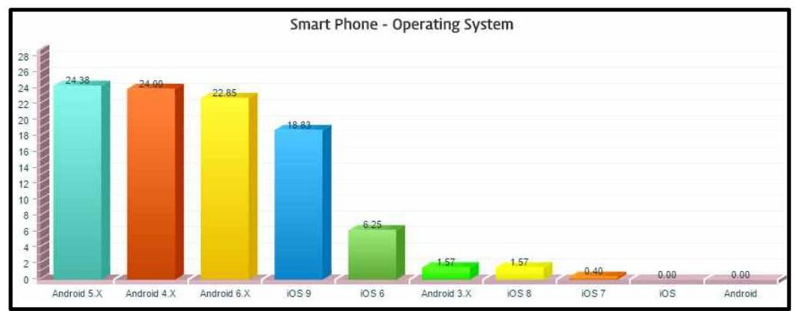

그림 2. 스마트폰 운영체제 이용률[3]

한편, 각종 범죄 수사에 있어서 사진, 이미지 등의 그래픽 파일은 범죄혐의를 직 $\cdot$ 간접적으로 입증할 수 있는 중요한 증거가 되기도 한다. 예를 들어 성적 목 적 사진촬영이나 아동포르노 소지 등에 대한 죄는 범죄행위에 해당하는 특정한 모습의 그래픽 파일을 사용자가 소지하고 있는 것만으로도 처벌이 가능하며 성폭 력, 사기, 도박 등의 다양한 범죄혐의를 수사하는데 있어서도 활용되고 있다.

그러나 중요한 증거가 될 수 있는 만큼 그래픽 파일이 사용자에 의해 삭제되거 나 조작되는 경우가 많은데 안드로이드 스마트폰에서는 Ext4 파일시스템을 사용 하여 사용자가 파일을 삭제할 경우 복구가 어렵다는 문제점이 있다[4]. 이런 경우 에 대비하여 Ext4 파일시스템에서 삭제된 파일을 복구하기 위한 다양한 연구가 진행되어 왔지만 이 경우 파일은 복구할 수 있더라도 그로부터 Metadata를 복구 할 수 없는 경우도 있다는 한계점이 있다.

따라서 본 논문에서는 안드로이드 스마트폰 내에서 생성되는 썸네일에 대하여 종류와 특징을 살펴보고 분석하였다. 또한, 포랜식 분석간 썸네일을 추출하는 방 법과 단편화된 썸네일을 재조합하는 알고리즘을 연구하여 삭제된 썸네일을 카빙 하는 방법과 이를 구현한 도구를 제시하고 디지털 포랜식 분석간 썸네일을 활용 할 수 있는 방법을 제시하였다.

본 논문은 다음과 같이 구성된다. 2 장에서는 썸네일에 대한 기본적인 배경지식 과 안드로이드 스마트폰의 썸네일에 대해 진행된 연구를 설명하고, 3장에서는 안 드로이드 운영체제가 생성하는 썸네일의 종류를 크게 3 가지로 나눈 후 종류별로 구조 및 특성을 살펴본다. 4장에서는 3장에서 살펴본 썸네일의 특성을 토대로 추 출하는 알고리즘을 제시하고 삭제된 썸네일을 추출하는 방법과 이를 구현한 도구 를 소개한다. 5장에서는 썸네일을 디지털 포랜식 관점에서 어떻게 활용할 수 있 는지를 다룬다. 6장에서는 결론을 정리하고 향후 연구계획을 밝힌다.

# 제 2 장 배경지식 및 관련연구 

본 절에서는 썸네일과 썸캐시의 개념 그리고 이와 관련된 데이터베이스에 대하 여 알아보고 안드로이드 운영체제에서 생성되는 썸네일에 대한 기존 연구와 그 한계점에 대하여 알아본다.

## 2.1. 배경지식

## 가. 썸네일(Thumbnail)

썸네일은 JPEG이나 GIF, PNG와 같은 그래픽 파일 혹은 AVI, MKV와 같은 동영상 파일에서 일부 장면을 원본보다 작은 크기의 또 다른 그래픽 파일로 만들 어 사용자가 빠른 속도로 인식할 수 있도록 도와준다. 썸캐시는 이러한 썸네일을 구조적으로 모아놓은 하나의 집합체이다. 저사양 기기나 OS에서는 썸네일의 로 딩속도를 빠르게 만들기 위해 저해상도의 썸네일을 사용하지만 고사양 기기나 OS에서는 로딩 속도에서 큰 문제가 없기 때문에 고해상도의 썸네일을 사용하기 도 한다. 또한 썸네일은 PC, 스마트폰, DSLR 등 내장되어 있는 OS에서 기종을 가리지 않고 사용자의 편의를 위해 제공된다.

썸네일은 프로그램마다 자신의 성능을 높이기 위해 저마다의 썸네일을 사용하 는데, 사진 촬영 프로그램의 경우 사진 내에 썸네일을 저장해 두기도 하며 이미 지 뷰어 애플리케이션의 경우 자체적으로 별도의 공간에 썸네일을 생성하여 저장 하기도 한다. 특히 스마트폰과 같이 애플리케이션의 종류가 다양하고 애플리케이 션별로 저마다의 특성을 가지고 있는 경우 애플리케이션마다 썸네일을 생성할 수 도 있다.

EXIF와 같은 형식으로 내부적으로 Metadata를 상세히 저장해두는 원본 사진 파일과는 달리 썸네일은 목적 자체가 빠른 로드가 목적이기 때문에 최소한의 Metadata만을 기록한 채 원본과 동일한 그래픽이 저해상도 상태로 저장된다. 그럼에도 불구하고 그 최소한의 Metadata만으로도 다양한 정보를 수집하고 분석하

여 범죄수사에 활용할 수 있다.
썸네일은 사용자가 임의로 생성하는 것이 아니라 애플리케이션에 의해 자동적 으로 생성되는 것이기 때문에 아티팩트로서 분석할 의의가 있을 뿐만 아니라 해 당 스마트폰에 해당 썸네일의 원본에 해당하는 그래픽 파일이 존재했다는 것을 증명할 수 있는 근거가 된다.

# 나. 안드로이드 데이터베이스 

안드로이드 역시 운영체제의 한 종류이기 때문에 운영체제에서 다양한 종류의 파일을 관리하기 위해 데이터베이스를 사용하고 있다. 안드로이드 운영체제에서 사용되는 데이터베이스는 일반적으로 SQLite 형식을 사용하여, 그래픽 파일과 그 에 연관된 썸네일에 대한 정보를 기록하고 있다.

External.db는 안드로이드 스마트폰 내에/data/com.android.providers.image/da tabases/에 저장되어 있는 SQLite 형식의 데이터베이스로, 사용자가 루팅 없이 조작 가능한 sdcard 영역 내에서 사용자에 의해 생성되는 그래픽 파일이나 사운 드 파일, 동영상 등 멀티미디어 파일에 대한 정보를 기록해 두고 있다[5]. Extern al.db 파일에 저장되어 있는 테이블과 속성들은 <표 3>과 같다.

이 중에서 그래픽 파일과 썸네일을 분석하는데 필요한 테이블은 files, thumbnails, faces이다. 각각의 테이블들은 본 논문에서 다룰 썸네일들과 그 썸네 일들의 원본 그래픽 파일간의 연관 관계를 분석하고 이로부터 원본성을 유추할 수 있는 주요한 데이터베이스이다. 이 3 개의 테이블로부터 참고해야 할 주요 속 성은 <표 4>와 같으며, 이를 디지털 포랜식 관점에서 해석하는 방법은 제5장에 서 다루겠다.

표 3. External.db의 테이블 및 속성

| Table | Attribute |
| :--: | :--: |
| album_art | RecNo, album_id, _data |
| albums | RecNo, album_id, album_key, album |
| android_metadata | RecNo, locale |
| artists | RecNo, artist_id, artist_key, artist |
| audio_generes | RecNo, _id, name |
| audio_playlists_map | RecNo, _id, audio_id, playlist_id, play_order |
| audio_playlists_map <br> _personal_cache | RecNo, _id, audio_id, playlist_id, play_order, _data |
| backup(Samsung only) | RecNo, _id, _data, date_modified, face_count |
| faces(Samsung only) | RecNo, _id, image_id, person_id, recommended_id, group_id, pos_left, pos_top, pos_right, pos_bottom, face_data, auto_group, similarity, data, usable |
| files | RecNo, _id, _data, _size, format, parent, date_added, date_modified, mime_type, title, description, _display_name, picasa_id, orientation, latitude, longitude, datetaken, mini_thumb_magic, bucket_id, bucket_display_name, isprivate, title_key, artist_id, album_id, composer, track, year, is_ringtone, is_music, is_alarm, is_notification, is_podcast, album_artist, duration, bookmark, artist, album, resolution, tags, category, language, mini_thumb_data, name, Image_type, old_id, storage_id, is_drm, width, height, is_sound, year_name, genre_name, recently_played, most_played, recently_added_remove_flag, is_favorite, resumePos, isPlayed, face_count, scan_pri, weather_ID, recordingtype, group_id, city_ID, spherical_mosaic, is_3D, label_id, is_memo, addr, languagecode, is_secretbox, sampling_rate, bit_depth, is_360_video, pic_rating, is_3dtour, is_magicshot, sef_file_type, reusable, recorded_number, title_bucket, title_label, recording_mode, is_ringtone_theme, is_notification_theme, is_alarm_theme, type3dvideo, video_view_mode, video_codec_info, audio_codec_info |
| folders(LG only) | RecNo, folder_id, folder_path, folder_key, folder, folder_index |
| gallery_album | RecNo, _id, bucket_id, Image_type, datetaken, bucket_display_name, _data, is_favorate |
| log | RecNo, time, message |
| thumbnails | RecNo, _id, _data, image_id, kind, width, height |
| videothumbnails | RecNo, _id, _data, video_id, kind, width, height |

표 4. 썸네일 관련 External.db의 주요 테이블 및 속성

| Table | Attribute | Description |
| :--: | :--: | :--: |
| faces <br> (Samsung only) | image_id | - Unique id of original graphic file |
|  | face_data | - File name of .face thumbnail |
|  | data | - Path of original graphic file |
| files | _id | - Unique id of original graphic file (Same with image_id of faces) |
|  | _data | - Path of original graphic file (Same with data of faces) |
|  | date_added | - Time when original graphic file was added in smartphone |
|  | date_modified | - Time when original graphic file was modified lastly |
|  | latitude | - Latitude where the picture was taken |
|  | longitude | - Longitude where the picture was taken |
|  | datetaken | - Time when original graphic file has made |
|  | mini_thumb_magic | - Index of .thumbnails thumbcache |
| thumbnails | _data | - Path of original graphic file (Same with data of faces) |
|  | image_id | - Unique id of original graphic file (Same with image_id of faces) |

es0.db는 Google Plus라는 구글에서 제공하는 소셜 네트워크 서비스 애플리케 이션에서 생성하는 데이터베이스로서, /data/data/com.google.android.apps.plus/da tabases/ 폴더 내에 저장되어 있다. 이 데이터베이스에는 사용자의 설정에 따라 사용자의 연락처, 계정, 그래픽 파일 등에 대한 정보가 저장되어 있는데 여기서 a ll_photos라는 테이블에 스마트폰에 저장되어 있는 모든 그래픽 파일에 대한 정 보가 저장되어 있다[6]. es0.db의 all_photos 테이블로부터 얻을 수 있는 정보는 <표 5>와 같으며, 이를 디지털 포렌식 관점에서 해석하는 방법은 제5장에서 다 루겠다.

표 5. 썸네일 관련 es0.db의 주요 테이블 및 속성

| Table | Attribute | Description |
| :-- | :-- | :-- |
|  | local_file_path | Path of original graphic file |
|  | local_content_uri | Include the image_id of graphic file |
|  | fingerprint | SHA1 of original graphic file |
|  | timestamp | Time when original graphic file has made |
|  | signature | Include the time when original <br> graphic file was created in smartphone |

# 2.2. 관련연구 

## 가. PC OS 썸네일

썸네일에 대한 연구는 PC의 OS에서 제공하는 썸네일을 디지털 포랜식 관점에 서 연구하면서 시작되었다. 컴퓨터 포랜식에 있어서 썸네일은 OS에 전적으로 종 속되기 때문에 OS에 대한 포랜식 분석을 진행하는 과정을 거치면서 OS에서 생 성하는 썸네일의 특성을 분석하였기 때문에 OS별로 썸네일에 대한 포랜식 분석 이 진행되었다.
Quick, Tassone 등[25]에 의해 Windows 95부터 Windows 8까지 썸네일에 대 하여 썸네일의 저장 방식, 저장경로 등을 종합적으로 정리하고 이를 볼 수 있는 도구를 제공하였다. 또한 썸네일을 수집 및 분석하는 방법에 대하여 분석 절차를 제시하였으며 썸네일을 시각화하여 표현할 수 있는 도구의 알고리즘과 실제 구현 모습을 <그림 2>와 같이 제시하였다.

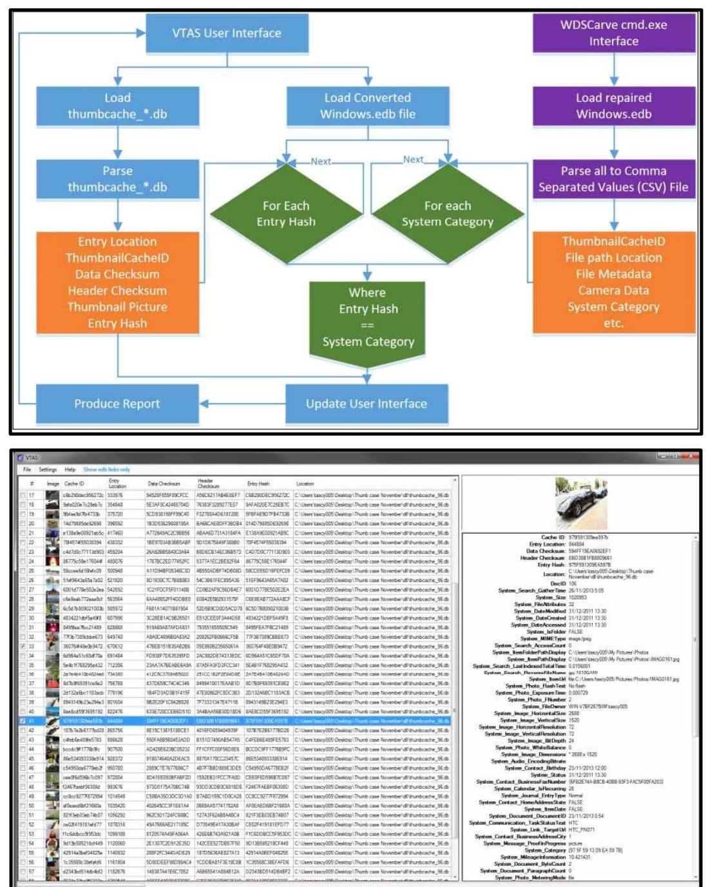

그림 3. Windows 썸네일의 시각화 알고리즘(상) 및 도구(하)[25]

Matt[31]는 자신의 블로그를 통해 Windows Vista 버전에서 삭제된 썸네일 캐 시를 복구하는 방법과 이를 구현한 도구를 제시하였다. Hurlbut[27]는 FTK 도구 를 이용하여 Windows ME부터 Windows XP 버전까지 썸네일을 분석할 수 있 는 방법을 제시하였다.
한편 Parsonage[28]는 Windows 7 운영체제에서 사용자의 다양한 사제 행

따른 썸네일의 변화를 함께 분석하고 연구하였으며 Morris[29]는 Windows 7 뿐 만 아니라 Ubuntu Linux와 Kubuntu Linux 운영체제에서 썸네일의 구조, 특성, 카빙, 단편화 복구 방법<그림 3> 등에 대하여 종합적으로 분석 및 제시하였다.
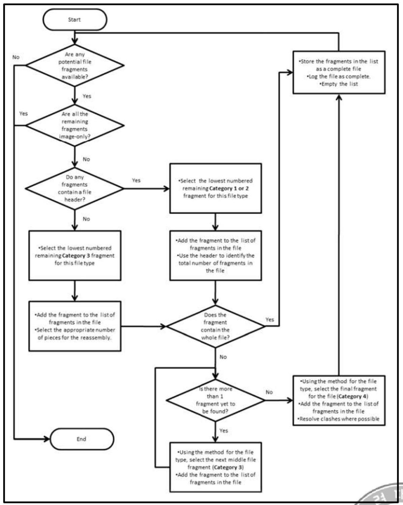

그림 4. Windows 운영체제에서 단편화된 썸네일 복구 알고리즘[29]

이후 2015년 Windows 10이 개발되었지만 기존의 Windows 7의 썸네일과 큰 차이가 없어 기존의 연구가 그대로 적용이 되고 있다[30].

PC OS에 사용되는 썸네일은 그래픽 파일마다 $32 \times 32,256 \times 256,1024 \times 1024$ 와 같이 각기 다른 해상도로, 해상도별로 db 파일에 저장이 된다. 해상도가 크면 클 수록 좋은 해상도로 원본 그래픽 파일의 모습을 확인할 수 있다. 안드로이드 썸 네일도 운영체제에 종속하는 점이라던지 db 파일과 같은 단일 파일에 썸네일을 누적하여 저장하는 점 등 PC OS에서 생성하는 방식을 사용하는 부분이 많이 적 용되고 있다.

# 나. 안드로이드 썸네일 

안드로이드 운영체제에서의 썸네일을 연구하는데 있어서 운영체제 또는 애플리 케이션이 생성하는 각종 캐시 파일이나 데이터베이스에 대한 연구가 반드시 선행 되어야 한다. 안드로이드 운영체제 내의 기본적인 캐시 파일이나 데이터베이스에 대한 연구는 Andrew Hoog에 의해 선행되어 저서[5]로 발간되었다. Andrew Hoog의 저서에 의해 안드로이드 운영체제가 생성하는 캐시 파일이나 데이터베이 스가 어떠한 내용을 저장하고 있는지 확인할 수 있으나[5], 썸네일에 대하여 포랜 식적으로 큰 의미를 부여하지 않고 있다.

Maegan Katz 등에 의해 작성된 연구 보고서[9]에서는 원본 그래픽 파일이 삭 제되었더라도 .thumbnails 썸네일을 통해 원본 그래픽 파일이 있었다는 것을 알 수 있다고 말하고 있다[9]. 그러나 후술하겠지만 .thumbnails 썸네일 자체는 별다 른 메타 데이터가 없으며 이 썸네일 만으로는 원본 그래픽 파일이 있었다는 것 빼고는 실용적으로 도움이 될만한 정보를 얻을 수 없다는 단점이 있다. 또한 다 른 썸네일의 종류에 대해서는 연구되지 않았다.

Catherine Stamm은 자신의 블로그[10]에, Igor Mikhaylov는 자신의 기사[11]에 썸캐시를 통해 원본 그래픽 파일의 존재를 확인할 수 있다고 말하고 있다 [10][11]. 그러나 앞서 언급한 Maegan Katz의 연구와 마찬가지로 기존에 연구되 지 않았던 새로운 썸캐시라는 아티팩트에 대하여 설명하고 있으면서도 구체적으 로 그 구조를 분석하고 활용할 수 있는 방향에 대해서는 언급하지 않

11

썸네일 자체에 대하여 디지털 포랜식 관점에서 깊이 있게 분석한 연구는 2015 년 Ming Di Leom 등의 연구[7]가 있다. Ming Di Leom은 안드로이드 4.1.2 버전 에서 썸네일의 내부 구조와 추출 방법을 개략적으로 분석하고 사용자의 행위에 따라 썸네일의 생성 원리를 실험을 통해 확인하였다. 그리고 썸네일이 원본 그래 픽 파일보다 크기가 작기 때문에 1 블록 단위 $(4 \mathrm{~KB})$ 로 카밍이 된다고 하더라도 원 본 그래픽 파일보다 식별이 용이하다고 정리하였다[7]. 그러나 이 연구에서 썸네 일의 내부 구조를 구체적으로 분석하지 못하였으며, 썸네일을 추출하는 과정에서 일반적인 그래픽 파일과 썸네일을 구분하지 않는 한계가 있었다. 또한 디지털 포 랜식 관점에서 썸네일을 단순히 특정 그래픽 파일이 존재했다는 수준으로만 분석 한 한계가 있었다. 그리고 분석 대상이 되었던 스마트폰이 삼성 넥서스 $\mathrm{S}(\mathrm{GT}-\mathrm{I} 9020 \mathrm{~T})$ 와 안드로이드 4.1.2 버전 각 1 개씩만을 대상으로 하고 있어 다양 한 기종 및 버전에 대한 분석이 되어 있지 않다.

국내에서는 이미지[8]가 스마트폰에 존재하는 사진파일에 대하여 그 출처를 확 인하기 위해 썸네일의 정보를 활용하는 연구를 진행하였다. 이 연구에서 저자는 썸네일의 정보와 안드로이드 운영체제가 생성하는 캐시 파일 및 데이터베이스 파 일을 연계하여 사진파일이 해당 스마트폰에서 생성되었는지를 확인하였다. 또한 DQT(Define Quantization Table)과 센서 패턴 노이즈를 함께 검증하여 사진 파 일의 출처를 연구하였다[8]. 그러나 이 연구에서는 검출된 사진파일을 중심으로 그에 대한 출처에 중점을 두고 있으며 썸네일을 통해 원본성을 확인하는데 중점 을 두고 있어 썸네일의 특성 및 그 활용 방안에 대한 전반적인 연구가 진행되지 않는 한계점이 있다. 또한 DQT나 센서 패턴 노이즈를 통해 A라는 특정 기종의 스마트폰을 특정할 수 있을 수는 있으나 B라는 사람이 사용하는 A 기종의 스마 트폰에서 촬영된 것이라고 단정지을 수 있을 만한 정보는 없어 연구에 한계점이 분명하다.

# 다. iOS 썸네일 

iOS에서 사용하는 썸네일은 안드로이드 썸네일과는 달리 그 구조가 일반적으 로 노출되지 않았으며 관련된 학계의 연구도 없다. 또한 원본 그래픽 파일이 삭 제되면 해당 파일과 연계된 썸네일 역시 삭제되는 특징을 가지고 있어서 iOS에 서 썸네일을 디지털 포랜식 관점에서 분석하여도 크게 의미있는 결과를 얻을 수 없다[22].
iOS의 썸네일은 /var/mobile/media/PhotoData/Thumbnails 경로에 .ithmb라는 확장자로 저장이 되는데 해상도 별로 서로 다른 .ithmb 파일 내에 그래픽 파일 별로 썸네일이 저장된다. .ithmb 파일 내부에는 시간정보와 같은 디지털 포랜식 관점에서 분석에 중요한 메타데이터가 없으며 썸네일만을 추출할 수 있는 iThmb Converter[23]나 CompuClever ITHMB Viewer[24] 등의 프로그램들이 공 개되어 있어 본 논문에서는 iOS의 썸네일에 대한 내용은 배제하고 안드로이드 썸네일에 대해서만 알아본다.

## 라. 그래픽 파일 카빙 기법

그래픽 파일을 카빙하는 기법 중에 가장 기초적인 방법은 Foremost[13], Richard and Roussev[14]에 의해 제안된 방법으로, 그래픽 파일의 고유한 Signature인 Header와 Footer를 기준으로 그 사이에 있는 데이터를 모두 추출하 는 방법이다. 이 방법은 가장 간단하며 구현하기 용이하며 범용성을 가지고 있지 만 그래픽 파일이 단편화되었을 경우 사용할 수 없다는 단점이 있다.

Garfinkel[15]은 2 개로 단편화된 파일에 대하여 카빙하는 기법을 다루었으나 Brute force 방식을 사용하고 있어 굉장히 시간도 오래 걸리고 비효율적인 단점 이 있다. Karresand와 Shahmehri[16]의 연구에서는 특정한 Restart marker가 있 는 JPEG 파일을 카빙하는 기법을 연구하였으나 JPEG 파일 중에 Restart marker가 있는 경우는 매우 드물며 본 연구에서 다루는 썸네일은 Restart marker가 별도로 존재하지 않는다.

결국 그래픽 파일은 Header와 Footer를 기본적으로 활용하면서 Restart

marker와 같은 특별한 그래픽 파일의 특성이 있어야 카빙하여 복구하는 것이 용 이하며 그 외에 정보가 없을 경우 카빙하는데 어려움이 있다. 이러한 제한사항을 극복하기 위하여 데이터 블록 단위 유사성을 비교하는 연구도 진행되었다.

Memon and Pal[17], Pal et al.[18]은 JPEG 파일에서 Row와 Row간의 RGB 값의 단순 차이만 계산하여 데이터 블록간의 유사성을 비교하는 SoD(Sum of Difference)를 제시하고 APF(Adroit Photo Forensic)이라는 도구를 개발하였으나 심하게 단편화된 경우 성능이 떨어지며 해상도 등 그래픽 파일의 특성에 따라 오 작동율이 높다는 단점이 있었다.

Sharma[19]는 SoD를 보완하여 ED(Euclidean Distance)라는 개념을 제시하였 는데, 이 방법은 단순 RGB 각각의 차이를 계산하는 SoD 방식에서 RGB를 3차원 상의 직선상 거리를 구하는 것과 같이 실질적인 색 차이를 계산하는 방식으로 유 사성을 비교하는 방법을 제시하였다. 또한 Yanbin Tang et al.[20]은 SoD와 ED 를 모두 보완할 수 있는 CED(Coherence Euclidean Distance)라는 개념을 제시하 여 그래픽 파일의 특성의 영향을 최소화하면서 데이터 블록간의 유사성을 비교하 는 방법을 제시하였다.

그러나 위와 같은 유사성 비교 방법들 역시 데이터 블록이 정확히 그래픽 파일 의 블록인지 판단할 수 있는 연구가 보다 정확하게 선행되어야 하고 그래픽 파일 의 끝을 정확하게 판단하기 위한 Metadata가 제공되지 않으면 굉장히 비효율적 인 시간이 소요될 수 있다는 한계점이 있다.

# 제 3 장 썸네일의 특성 

본 장에서는 안드로이드 운영체제에서 생성되는 썸네일 중 가장 일반적으로 생 성되는 3 가지 썸네일에 대하여 그 구조 및 특징을 살펴본다. 안드로이드의 특성 상 제조사별로 각종 애플리케이션을 특성 있게 운영할 수 있음을 고려하여 <표 5 >와 같은 기종 및 운영체제 버전별로 실험하였다. 본 논문에서 별도로 언급되지 않았을 경우 기종 및 운영체제 버전과 무관하게 공통된 결과가 도출되었다.

### 3.1. ThumbCache

썸캐시는 사용자가 갤러리 애플리케이션을 통해 본 그래픽 파일의 썸네일을 하 나의 단일화된 파일에 연속적으로 저장해 둔 것을 말한다. 썸캐시가 저장되는 경 로는 제조사별로 상이하며 <표 6>과 같다.

표 6. 제조사별 썸캐시 저장 경로

| Manufacturer | Path |
| :--: | :-- |
| SAMSUNG | /sdcard/Android/data/com.sec.android.gallery3d/cache/ |
| LG | /sdcard/Android/data/com.android.gallery3d/cache/ |

## 가. 구성

썸캐시는 제조사별로, 기종별로 해상도에 따라 구성하고 있는 썸캐시의 종류가 상이하다. 그러나 하나의 썸캐시별로 기본적으로 [Content].0, [Content].1, [Content].idx 3 개의 파일로 구성되어 있다. 제조사별, 기종별, 운영체제 버전별 썸캐시의 구성은 <표 7>과 같다[26].

표 7. 썸캐시의 구성

| Model |  | OS Version | Content |
| :--: | :--: | :--: | :--: |
| $\begin{gathered} \mathrm{S} \\ \mathrm{~A} \\ \mathrm{M} \\ \mathrm{G} \\ \mathrm{~S} \\ \mathrm{U} \\ \mathrm{~N} \\ \mathrm{G} \end{gathered}$ | $\begin{gathered} \text { SM-G930 } \\ \text { (Galaxy S7) } \end{gathered}$ | 6.0.1 | - imgcache <br> - micro <br> - mini |
|  | $\begin{gathered} \text { SM-N920 } \\ \text { (Galaxy Note5) } \end{gathered}$ | 6.0.1 |  |
|  | SHV-E330 <br> (Galaxy S4) | 5.0.1 | - imgcache <br> - imgcacheMicro <br> - imgcacheMini |
|  |  | 4.4.2 |  |
|  | SM-N900 <br> (Galaxy Note3) | 4.4.2 |  |
| LG | $\begin{gathered} \text { LG-F460 } \\ \text { (LG G3) } \end{gathered}$ | 6.0.1 | - imgcache <br> - imgcache_screen <br> - smallimgcache |
|  | LG-F320 <br> (LG G2) | 5.0.1 | - imgcache |
|  |  | 4.4.2 |  |
|  | LG-F240 <br> (LG GPro) | 4.4.2 |  |

<표 7>에 명시된 썸캐시 외에도 attributecache도 존재하고 있으나 이 썸캐시 는 다른 썸캐시들의 Metadata만을 저장하고 있으며 썸캐시에 이미 동일한 내용 이 기록되어 있으므로 본 논문에서는 다루지 않는다.

Content의 종류별로 썸네일의 해상도는 각기 상이하며 삼성 스마트폰을 기준 으로 imgcache $\rightarrow$ micro $\rightarrow$ mini 순으로 낮은 해상도를 가진다. 썸네일의 해상도 는 개발자에 따라 BitmapFactory와 같은 유틸리티 클래스에서 해상도의 축소비 율이나 해상도를 결정할 수 있다[21]. 기종별로 화면에 표시할 수 있는 디스플레 이가 상이하기 때문에 같은 종류의 썸네일이라고 하더라도 서로 다른 해상도를 가지는데 기종별, 종류별 썸네일의 해상도는 <표 8>과 같다[26].

표 8. 기종별 썸네일 해상도

| Model |  | Identifier |  |  |
| :--: | :--: | :--: | :--: | :--: |
|  |  | 0x31 | 0x32 | 0x33 |
| $\begin{aligned} & \text { S } \\ & \text { A } \\ & \text { M } \\ & \text { G } \\ & \text { S } \\ & \text { U } \\ & \text { N } \\ & \text { G } \end{aligned}$ | SM-N920 <br> (Galaxy Note5) | $960 \times 540$ | $474 \times 267$ | $175 \times 98$ |
|  | SHV-E330 <br> (Galaxy S4) | $640 \times 360$ | $480 \times 270$ | $72 \times 72$ |
|  | SM-N900 <br> (Galaxy Note3) | $640 \times 360$ | $320 \times 240$ | $120 \times 120$ |
| LG | LG-F460 <br> (LG G3) | $640 \times 454$ | $219 \times 219$ | $1920 \times 1080$ |
|  | LG-F320 <br> (LG G2) | $640 \times 360$ | $144 \times 144$ | $1920 \times 1080$ |
|  | LG-F240 <br> (LG GPro) | $640 \times 360$ | $200 \times 200$ | $1920 \times 1080$ |

<표 8>에서 Identifier는 썸캐시 내에서 썸네일의 해상도를 구분하는 식별자로 서 역할을 하며 $0 \times 31,0 \times 32,0 \times 33$ 으로 구분된다. 가장 작은 크기의 해상도는 $72 \times 72$ 로 작은 편이지만 가장 큰 썸네일의 경우 최저 $640 \times 360$, 최대 $1920 \times 1080$ 으 로 육안상 원본 그래픽이 어떠한 형태인지 인지하기에 전혀 문제가 없다. 중간 크기의 썸네일 역시 최저 $320 \times 240$, 최대 $640 \times 360$ 으로, 크지 않는 용량으로도 원 본 그래픽 파일의 모습을 짐작하는데 있어서 문제가 없다. <그림 4>는 원본 그 래픽 파일과 그에 따른 썸네일 별로 블록 단위(4KB) 추출되었을 경우 그래픽 파 일로서 어느 정도 식별이 되는지 보여준다. <그림 4>와 같이 해상도가 작을수록 적은 용량만 추출되더라도 원래 그 그림이 어떠한 그림이었는지 판단하기에 용이 하다[7].


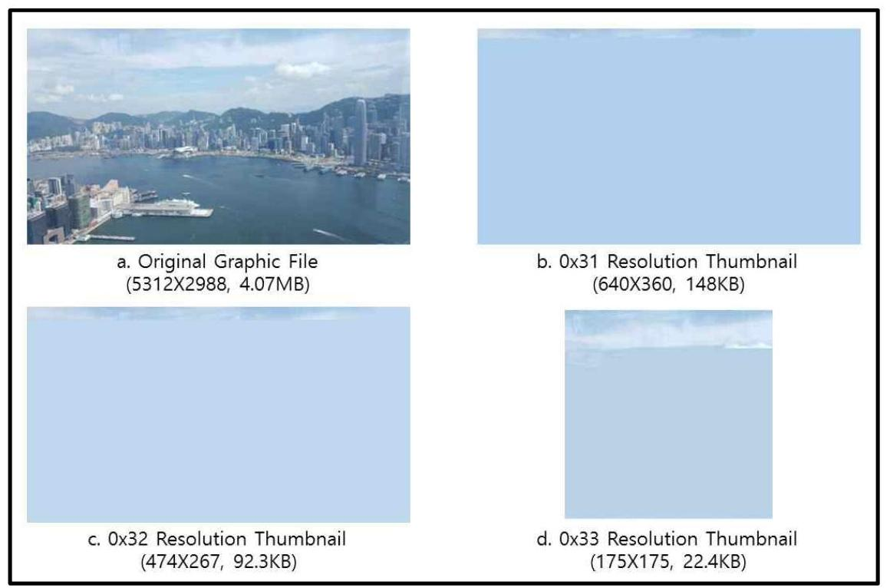

그림 5. 블록 크기 $(4 \mathrm{~KB})$ 로 추출된 썸네일 비교

# 나. .0 / .1 ThumbCache 

[Content]. 0 또는 [Content]. 1 의 썸캐시는 다수의 썸네일을 하나의 파일에 저장 해 두고 있다. 내부적으로 썸캐시의 Header Signature(0x10 8524 BD)가 있고 이어서 썸네일이 연속적으로 추가되며, 각각의 썸네일별로 Metadata를 저장하는 부분과 실제 그래픽 파일로서의 썸네일로 구분된다. 썸캐시의 구조는 <그림 5> 과 같다.

| ThumbCache Header | Thumbnail 1 |  | Thumbnail 2 |  |  |
| :--: | :--: | :--: | :--: | :--: | :--: |
|  | Thumbnail Metadata | Thumbnail Content | Thumbnail Metadata | Thumbnail Content | ・・ |

그림 6. 썸캐시의 구조

세부적으로 썸캐시와 썸네일의 구조를 보면 <그림 6>, <표 9>와

$$
-18-
$$


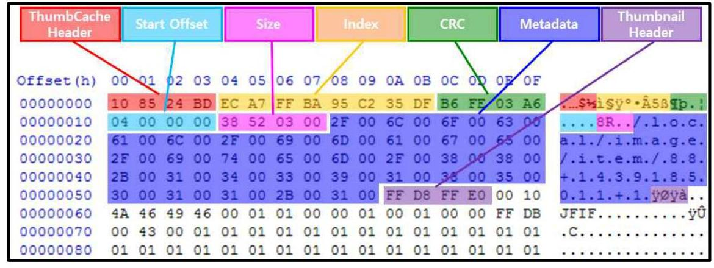

그림 7. 썸캐시 및 썸네일의 구조

표 9. 썸캐시 및 썸네일의 구조 및 설명

|  Name |  | Offset | Size | Description  |
| --- | --- | --- | --- | --- |
|  ThumbCache Header |  | $0 \times 0 \sim 0 \times 3$ | 4byte | - 0x10 8524 BD  |
|  Thumbnail
Metadata | Index | $0 \times 4 \sim 0 \times B$ | 8byte | - Index of Thumbnail  |
|   | CRC | $0 \times C \sim 0 \times F$ | 4byte | - CRC of Thumbnail  |
|   | Start Offset | $0 \times 10 \sim 0 \times 13$ | 4byte | - Start Logical Offset of Thumbnail in ThumbCache  |
|   | Size | $0 \times 14 \sim 0 \times 17$ | 4byte | - Size of Thumbnail  |
|   | Metadata | $0 \times 18 \sim$ | variable | - Image id,
Resolution Identifier,
Created Time of Original
Graphic File  |
|  Thumbnail Content | Header | $\cdot$ | 4byte | - 0xFF D8 FF E0  |
|   | Footer | $\cdot$ | 2byte | - 0xFF D9  |

썸캐시의 Header는 썸캐시 파일의 가장 앞부분에 위치하며 0x10 8524 BD로 고정된 값을 가진다. 다른 썸네일의 경우 일반적으로 블록의 가장 앞부분에 별도 의 다른 Header가 아닌 JPEG의 Header인 0xFF D8 FF E0를 가지고 있기 때문에 일반 그래픽 파일과 구분하기가 힘든 반면, 썸캐시는 별도로 고유의 Header을

보유하고 있기 때문에 카밍할 때 발견하기 용이하다.
썸네일의 Metadata로 먼저 8바이트의 크기로 Index값이 위치한다. 이 값은 원 본 그래픽 파일이 동일한 경우 동일한 Index값을 가지며, 뒤에 다루게 될 .idx 캐 시에서 함께 기록되어 동일한 그래픽 파일의 썸네일인지 검색 및 식별하는데 활 용될 수 있다. CRC는 4바이트의 크기로 썸네일의 CRC 값을 가지며, 동일한 원 본 그래픽 파일에 대하여 다른 해상도의 썸네일은 다른 CRC 값을 가진다.

Start Offset은 썸캐시 내에서 썸네일의 논리적 위치를 나타내는 값이다. 썸캐 시라는 단일 파일 내에 축적되어 저장되는 특성상 Start Offset은 썸캐시가 삭제 된 상황에서 썸캐시 내의 썸네일 위치를 확인하는데 있어서 중요한 역할을 한다. Size는 썸네일의 크기로서, Start Offset에 Size를 더하면 다음 썸네일의 Index 위치가 나온다. 이를 통하여 썸캐시로부터 썸네일을 추출할 수 있음은 물론이고 삭제된 썸네일을 복구하는데 있어서 Start Offset과 함께 중요한 변수로 활용할 수 있다.

| 00000000 | 10 | 85 | 24 | BD | EC | A7 | FF | BA | 95 | C2 | 35 | DF | B6 | FE | 03 | A6 |
| :--: | :--: | :--: | :--: | :--: | :--: | :--: | :--: | :--: | :--: | :--: | :--: | :--: | :--: | :--: | :--: | :--: |
| 00000010 | 04 | 00 | 00 | 00 | 38 | 52 | 03 | 00 | 17 | 00 | 6 C | 00 | 6 F | 00 | 63 | 00 |
| 00000020 | 61 | 00 | 6 C | 00 | 2 F | 00 | 69 | 00 | 6D | 00 | 01 | 00 | 67 | 00 | 65 | 00 |
| 00000030 | 2 F | 00 | 69 | 00 | 74 | 00 | 65 | 00 | 6D | 00 | 2 F | 01 | 18 | 00 | 38 | 00 |
| 00000040 | 2B | 00 | 31 | 00 | 34 | 00 | 33 | 00 | 39 | 00 | 31 | 00 | 35 | 00 | 35 | 00 |
| 00000050 | 30 | 00 | 31 | 00 | 31 | 00 | 2B | 00 | 31 | 00 | FF | D8 | FF | 00 | 10 |  |
| 00000060 | 4 A | 46 | 49 | 46 | 00 | 01 | 01 | 00 | 00 | 01 | 00 | 01 | 00 | 00 | FF | DB |
| 00000070 | 00 | 43 | 00 | 01 | 01 | 01 | 01 | 01 | 01 | 01 | 01 | 01 | 01 | 01 | 01 |  |
| 00000080 | 01 | 01 | 01 | 01 | 01 | 01 | 01 | 01 | 01 | 01 | 01 | 01 | 01 | 01 | 01 |  |
|  |  |  |  |  |  |  |  |  |  |  |  |  |  |  |  | Move Size(0x35238) |
| 00035210 | 2D | E1 | D3 | 5D | A0 | 69 | DE | 4B | 49 | 43 | 49 | 2 F | CC | 50 | 4 E |  |
| 00035220 | 7A | A6 | 93 | 4A | 2A | 5E | EC | 67 | 67 | 7B | 6E | D2 | DB | 95 | 3 D |  |
| 00035230 | 9B | 77 | D1 | BB | 63 | 6A | B1 | BD | 97 | 35 | EC | EE | EC | 9 E | 4 | 49 |
| 00035240 | 37 | BA | D5 | 25 | B6 | 9B | 6A | ED | 36 | FF | 00 | 2 F | D9 | 00 | 00 | 00 |
| 00035250 | 90 | AB | D8 | 1E | 78 | F3 | C1 | 22 | A3 | 38 | A0 | F9 | 30 | 32 | 03 | 00 |
| 00035260 | 17 | C9 | 04 | 00 | 2 F | 00 | 6 C | 00 | 6 F | 00 | 63 | 00 | 61 | 00 | 6 C | 00 |
| 00035270 | 2 F | 00 | 69 | 00 | 6D | 00 | 61 | 00 | 67 | 00 | 65 | 00 | 2 F | 00 | 69 | 00 |
| 00035280 | 74 | 00 | 65 | 00 | 6D | 00 | 2 F | 00 | 39 | 00 | 30 | 00 | 2B | 00 | 31 | 00 |
| Metadata Offset(0x18) + Size(0x35238) <br> = End of Thumbnail(0xFF D9 00 00 00) and Next Thumbnail's Start Offset(0x35250) |  |  |  |  |  |  |  |  |  |  |  |  |  |  |  |  |

그림 8. Metadata를 활용하여 다음 썸네일을 추적하는 방법

Metadata는 기종별, 안드로이드 버전별로 포맷이 조금씩 다르며 그것 $\underbrace{0.4}_{0}$ $0>$ 과 같다[26].

표 10. 기종별$\cdot$버전별 Metadata 형식

| Model |  | OS Version | Content |
| :--: | :--: | :--: | :--: |
| $\begin{gathered} \mathrm{S} \\ \mathrm{~A} \\ \mathrm{M} \\ \mathrm{G} \\ \mathrm{~S} \\ \mathrm{U} \\ \mathrm{~N} \\ \mathrm{G} \end{gathered}$ | $\begin{gathered} \text { SM-G930 } \\ \text { (Galaxy S7) } \end{gathered}$ | 6.0.1 | /local/image/item/Image id + Unix Time+ Identifier |
|  | $\begin{gathered} \text { SM-N920 } \\ \text { (Galaxy Note5) } \end{gathered}$ | 6.0.1 |  |
|  | SHV-E330 <br> (Galaxy S4) | 5.0.1 | /local/image/item/Image id + Identifier |
|  |  | 4.4.2 |  |
|  | SM-N900 <br> (Galaxy Note3) | 4.4.2 |  |
| LG | $\begin{gathered} \text { LG-F460 } \\ \text { (LG G3) } \end{gathered}$ | 6.0.1 | /local/image/item/Image id + Identifier+/\%File Path\% /\%File Name+ Unix Time |
|  | LG-F320 <br> (LG G2) | 5.0.1 |  |
|  |  | 4.4.2 |  |
|  | LG-F240 <br> (LG GPro) | 4.4.2 |  |

Metadata의 맨 앞부분에는 '/local/image/item/'이라는 구문이 유니코드 형식으 로 붙어 있으며, 만약 썸네일의 원본 파일이 동영상 파일일 경우 '/local/video/ite $\mathrm{m} /$ '로 저장된다.

모든 기종에 공통적으로 Image id가 등장하는데 여기서 Image id는 External.d b 파일의 files 테이블에 등장하는 '_id' 값과 동일하다[5]. External.db에서 '_id' 값은 사용자에 의해 생성되는 멀티미디어 파일에 대하여 순차적으로 생성되는 일 련번호이다. 즉, 기기가 출고된 이후 스마트폰에 축차적으로 _id값이 변경되기 때 문에 모든 그래픽 파일 혹은 동영상 파일은 고유의 값을 가진다. 모든 그래픽 파 일이 고유의 _id 값을 가지기 때문에 차후 디지털 포렌식 분석간 썸네일로부터 원본 그래픽 파일을 찾아갈 수 있는 근거가 된다.

Identifier는 앞서 언급한 바와 같이 썸캐시별로 상이한 해상도를 구분할 수 있 도록 하기 위한 값으로, 일반적으로 $0 \times 31,0 \times 32,0 \times 33$ 의 값을 가지며, Metadata만 을 저장혹 있는 attributecache 캐시의 경우 $0 \times 34$ 값을 가진다.

삼성 스마트폰 안드로이드 6.0.1 이후의 버전과 LG 스마트폰 안드로이드 4.4.2 이후 버전의 경우 Unix Time이 10 진수의 형식으로 기록되어 있는데 이 값은 범 네일이 생성된 시각이 아닌 원본 그래픽 파일이 해당 스마트폰에 생성된 시각을 의미한다. 만약 해당 스마트폰에서 촬영된 사진일 경우 촬영된 시각이며, 인터넷 브라우저를 통해 다운로드 받은 파일이라면 스마트폰에 다운로드된 시각을 의미 한다. 이 데이터는 External.db 파일의 'datetaken' 항목의 값과 일치하며, 범네일 의 원본 그래픽 파일이 스마트폰에서 생성된 것인지 외부로부터 받은 파일인지 분석하는데 활용될 수 있다.

그 외에 특이하게 LG 스마트폰의 경우 원본 그래픽 파일의 실제 경로 및 파일 명이 저장된다. 삼성 스마트폰의 경우 External.db 파일과 연계하여 원본 그래픽 파일의 위치를 찾아야하는 반면 LG 스마트폰의 경우 <그림 8>과 같이 이미 범 네일 상에 원본 그래픽 파일의 위치와 파일명을 기록하고 있기 때문에 범네일만 으로도 원본 그래픽 파일을 추적하는 것이 용이하다.

|  Offset(h) | 00 | 01 | 02 | 03 | 04 | 05 | 06 | 07 | 08 | 09 | 0A | 0B | 0C | 0D | 0E | 0F |   |
| --- | --- | --- | --- | --- | --- | --- | --- | --- | --- | --- | --- | --- | --- | --- | --- | --- | --- | --- |
|  00000000 | 10 | 85 | 24 | BD | 82 | B8 | 21 | 3D | 5E | AF | 2B | 6F | 70 | 14 | AE | 7B | ...\$M. | $1=$ " +op.\%  |
|  00000010 | 04 | 00 | 00 | 00 | CS | 1A | 00 | 00 | 2F | 00 | 6C | 00 | 6F | 00 | 63 | 00 |  |   |
|  00000020 | 61 | 00 | 6C | 00 | 2F | 00 | 69 | 00 | 6D | 00 | 61 | 00 | 67 | 00 | 65 | 00 | a.1./.1.m.a.g.e. |   |
|  00000030 | 2F | 00 | 69 | 00 | 74 | 00 | 65 | 00 | 6D | 00 | 2F | 00 | 31 | 00 | 39 | 00 | /.1.t.e.m./.1.9. |   |
|  00000040 | 32 | 00 | 34 | 00 | 39 | 00 | 2B | 00 | 32 | 00 | 2B | 00 | 2F | 00 | 73 | 00 | 2.4.9.+.2.+./.e. |   |
|  00000050 | 74 | 00 | 6F | 00 | 72 | 00 | 61 | 00 | 67 | 00 | 65 | 00 | 2F | 00 | 65 | 00 | t.o.y.a.g.e./.e. |   |
|  00000060 | 78 | 00 | 74 | 00 | 65 | 00 | 72 | 00 | 6E | 00 | 61 | 00 | 6C | 00 | 5F | 00 | x.t.e.r.n.a.l. |   |
|  00000070 | 55 | 00 | 44 | 00 | 2F | 00 | 44 | 00 | 43 | 00 | 49 | 00 | 4D | 00 | 2F | 00 | 9.D./.D.C.I.H./. |   |
|  00000080 | 45 | 00 | 51 | 00 | 6D | 00 | 65 | 00 | 72 | 00 | 61 | 00 | 1F | 00 | 3E | 00 | 0.a.m.e.c.a./.2. |   |
|  00000090 | 30 | 00 | 31 | 00 | 36 | 00 | 30 | 00 | 36 | 00 | 31 | 00 | 35 | 00 | 5F | 00 | 0.1.6.0.6.1.0. |   |
|  000000A0 | 31 | 00 | 35 | 00 | 34 | 00 | 39 | 00 | 34 | 00 | 37 | 00 | 2E | 00 | 6A | 00 | 1.5.4.9.4.7...3. |   |
|  000000B0 | 70 | 00 | 67 | 00 | 2B | 00 | 31 | 00 | 34 | 00 | 36 | 00 | 35 | 00 | 39 | 00 | p.g.+.1.4.6.5.9. |   |
|  000000C0 | 37 | 00 | 33 | 00 | 33 | 00 | 38 | 00 | 37 | 00 | 33 | 00 | 34 | 00 | 36 | 00 | 7.3.3.8.7.3.4.6. |   |
|  000000D0 | FF | D8 | FF | E0 | 00 | 10 | 4A | 46 | 49 | 46 | 00 | 01 | 01 | 00 | 00 | 01 | yaya...JFIF. |   |
|  000000E0 | 00 | 01 | 00 | 00 | FF | DB | 00 | 43 | 00 | 03 | 02 | 02 | 03 | 02 | 02 | 03 |  |   |
|  000000F0 | 03 | 03 | 03 | 04 | 03 | 03 | 04 | 05 | 08 | 05 | 05 | 04 | 04 | 05 | 0A | 07 |  |   |

그림 9. LG 스마트폰의 범네일에 기록된 원본 그래픽 파일 경로

# 다. idx Cache 

idx 캐시는 . 0 또는 . 1 씸캐시와 씸캐시에 저장되는 씸네일에 대한 정보를 기록 하고 있다. idx 캐시의 구조는 <그림 9>, <표 11>과 같다.
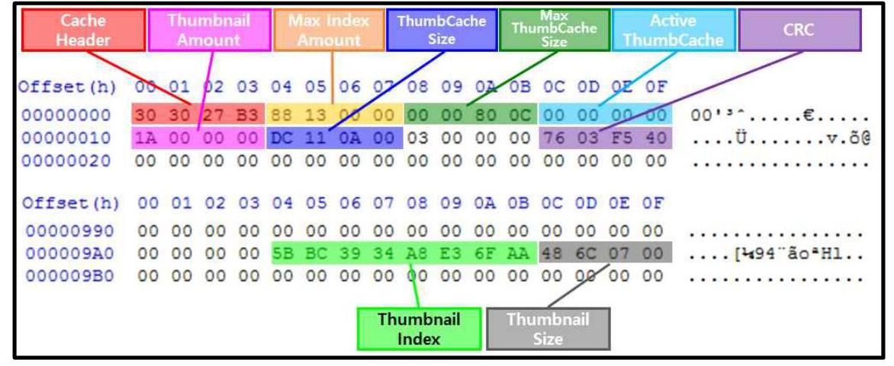

그림 10. idx 캐시의 구조

표 11. idx 캐시의 구조 및 설명

| Name |  | Offset | Size | Description |
| :--: | :--: | :--: | :--: | :--: |
| Cache Header |  | $0 \times 0 \sim 0 \times 3$ | 4byte | - 0x30 3027 B3 |
| Meta data | Max Index <br> Amount | $0 \times 4 \sim 0 \times 7$ | 4byte | - Maximal Amount of Index in Single ThumbCache |
|  | Max ThumbCache Size | $0 \times 8 \sim 0 \times B$ | 4byte | - Maximal Size of Sigle ThumbCache |
|  | Active <br> ThumbCache | $0 \times C \sim 0 \times F$ | 4byte | - Current Referenced ThumbCache |
|  | Thumbnail <br> Amount | $0 \times 10 \sim 0 \times 13$ | 4byte | - Amount of Thumbnails in Active ThumbCache |
|  | ThumbCache <br> Size | $0 \times 14 \sim 0 \times 17$ | 4byte | - Size of Activate ThumbCache |
|  | CRC | $0 \times 1 \mathrm{C} \sim 0 \times 1 \mathrm{~F}$ | 4byte | - CRC of idx Cache |
| Index | Thumbnail Index | $\cdot$ | 8byte | - Index of Thumbnail |
|  | Thumbnail Size | $\cdot$ | 4byte | - Size of Thumbnail |

idx 캐시의 Header는 0x30 3027 B3의 고정값을 가지며 이 값을 통하여 idx Header를 찾을 수 있다. Header 이후의 28바이트는 해당 해상도의 썸캐시에 대 한 전반적인 Metadata 정보를 기록하고 있다.

먼저 Max Index Amount는 하나의 idx 캐시 파일 안에 기록할 수 있는 Index 의 개수이다. 이 개수를 초과하게 되면 .0 썸캐시는 .1 썸캐시로, .1 썸캐시는 .0 썸캐시로 기록이 변경되며, idx 캐시는 초기화되고 새롭게 쓰여진다. 썸캐시의 용 량에 여유가 있다고 하더라도 Max Index Amount에 도달하게 되면 현재 기록 중인 썸캐시는 기록이 중지되고 다른 썸캐시에 기록이 시작된다. Max ThumbCache Size는 하나의 썸캐시가 가질 수 있는 최고 용량으로, idx 캐시에 서 기록할 수 있는 Index의 개수에 여유가 있더라도 썸캐시의 용량이 최고 용량 에 도달하게 되면 .0 썸캐시는 .1 썸캐시로, .1 썸캐시는 .0 썸캐시로 기록이 변경 되며, idx는 초기화되고 새롭게 쓰여진다.

Active ThumbCache는 현재 기록되고 있는 썸캐시를 의미한다. 0x0이면 .0 썸 캐시가, 0x1이면 .1 썸캐시가 각각 사용 중임을 의미한다. Thumbnail Amount는 현재 사용 중인 썸캐시에 저장되어 있는 썸네일의 개수를 의미한다. 이 값을 통 하여 현재 활성화된 썸캐시로부터 몇 개의 썸네일을 추출할 수 있는지 알 수 있 다. ThumbCache Size는 현재 활성화되어 있는 썸캐시의 용량을 의미하며, CRC 는 idx 캐시의 CRC값을 말한다.

Metadata 이후로는 고정된 idx 캐시의 용량 속에서 랜덤한 위치에 기록되는데, 여기서 Index값을 10 진수로 변환한 후 Max Index Amount로 나눈 나머지 값에 해당하는 순번에 기록된다. 즉, 썸네일의 Index값은 Max Index Amount를 Modular로 하는 원소들의 값을 나머지로 가지는 난수값이다. 따라서 용량이 고 정된 idx 캐시 속에서 Index값에 따라 위치가 띄엄띄엄 저장되는 구조를 가지며 idx 캐시에서의 Index 및 Size와 썸캐시 내에서의 Index 및 Size는 항상 같은 값 이다.

# 라. 특성 

썸캐시를 연구하는데 있어서 해당 썸캐시가 사용자의 행위에 따라서 어떻게 변 경되는지는 썸캐시로부터 사용자의 행위를 역추적하는데 있어서 매우 중요하다. 다른 썸네일들과는 다르게 썸캐시는 갤러리 애플리케이션에 단독으로 종속되어 있기 때문에 단일 애플리케이션에서 썸캐시가 어떻게 변경되는지 살펴보기 용이 하다. 본 논문에서는 썸캐시의 특성을 파악하기 위해 SM-N920(삼성 갤럭시 노 트5), SHV-330(삼성 갤럭시 S4), LG F400(LG G3) 3개 기종을 대상으로 실험을 진행하였다. 실험에서는 실험대상 스마트폰을 공장초기화한 후 <표 12>와 같은 행위만을 실행하였으며 그 결과는 <표 13>과 같다[26].

표 12. 썸캐시 실험 내용

| No. | User Action |  |
| :--: | :--: | :--: |
| \#1. Create | $1-1$ | - Take 10 pictures |
|  | $1-2$ | - Take 1 picture and preview the picture |
|  | $1-3$ | - Download 3 graphic files from internet |
| \#2. Execute | $2-1$ | - Execute gallery app |
|  | $2-2$ | - Enter 'Camera' folder |
|  | $2-3$ | - Reduce previewed thumbnails |
|  | $2-4$ | - Preview 200 graphic files |
|  | $2-5$ | - Open 1 graphic file |
|  | $2-6$ | - Open 5 graphic files |
|  | $2-7$ | - Edit 1 graphic file and save |
|  | $2-8$ | - Use slideshow function |
|  | $2-9$ | - Open graphic file from external sdcard |
|  | $2-10$ | - Copy graphic file to another folder |
|  | $2-11$ | - Move graphic file to another folder |
| \#3. Delete | $3-1$ | - Delete 1 Graphic file in gallery app |
|  | $3-2$ | - Delete 1 foler including graphic files in gallery app |
|  | $3-3$ | - Delete 1 graphic file using file explorer app |
|  | $3-4$ | - Delete previewed graphic file using camera app |

표 13. 범캐시 실험 결과

| No. | | SAMSUNG | | LG |
| :--: | :--: | :--: | :--: | :--: |
|  |  | SM-N920 <br> (Galaxy Note5) | SHV-330 <br> (Galaxy S4) | LG F400 <br> (LG G3) |
|  |  | 6.0.1 | 4.4.2 | 4.4.2 |
| \#1. Create | $1-1$ | $\times$ | 0 | $\times$ |
|  | $1-2$ | 0 | 0 | 0 |
|  | $1-3$ | $\times$ | $\times$ | $\times$ |
|  | $2-1$ | 0 | 0 | 0 |
|  | $2-2$ | $\begin{gathered} 0 \\ \text { (0x32 Thumbnail) } \end{gathered}$ | $\begin{gathered} 0 \\ \text { (0x32 Thumbnail) } \end{gathered}$ | $\begin{gathered} 0 \\ \text { (0x32 Thumbnail) } \end{gathered}$ |
|  | $2-3$ | $\begin{gathered} 0 \\ \text { (0x33 Thumbnail) } \end{gathered}$ | $\begin{gathered} 0 \\ \text { (0x33 Thumbnail) } \end{gathered}$ | No change |
| \#2. Execute | $2-4$ | 0 | 0 | 0 |
|  | $2-5$ | 3 thumbnails were created | 7 thumbnails were created | 1 thumbnail was created |
|  | $2-6$ | 4 thumbnails were added | 2 thumbnails were added | 4 thumbnails were added |
|  | $2-7$ | $\begin{gathered} 0 \\ \text { (Edited file) } \end{gathered}$ | $\begin{gathered} 0 \\ \text { (Edited file) } \end{gathered}$ | $\begin{gathered} 0 \\ \text { (Edited file) } \end{gathered}$ |
|  | $2-8$ | $\times$ | $\times$ | $\times$ |
|  | $2-9$ | 0 | 0 | 0 |
|  | $2-10$ | 0 | 0 | 0 |
|  | $2-11$ | 0 | 0 | 0 |
| \#3. Delete | $3-1$ | No change | No change | No change |
|  | $3-2$ | No change | No change | No change |
|  | $3-3$ | No change | No change | No change |
|  | $3-4$ | No change | No change | No change |

# 1) 생성 실험 

그래픽 파일을 생성하는 실험 결과, 실험 \#1-1에서 알 수 있듯이 기본 카메라 애플리케이션으로 사진을 촬영하더라도 모든 스마트폰에서 썸네일이 생성되지는 않았다. 삼성 갤럭시 S4의 경우 사진 촬영 후 갤러리 애플리케이션을 실행하지 않더라도 썸네일이 생성되었는데 이때 생성되는 썸네일은 그래픽 파일이 들어있 는 폴더별로 갤러리 애플리케이션을 최초 실행했을 때 폴더별로 보여지는 최초 그래픽 파일에 대한 썸네일이었다. 즉, 갤럭시 S4는 갤러리 애플리케이션의 실행 에 대비하여 자동적으로 썸네일을 생성한다. 갤럭시 S4와 같이 썸네일이 생성되 는 경우에는 촬영 후 삭제하더라도 썸네일이 남아있어 추적이 가능하겠지만 그 외에는 썸네일이 생성되지 않으므로 카메라 애플리케이션으로 사진을 촬영한 후 갤러리 애플리케이션이 아닌 방법으로 사진을 삭제한 경우 그래픽 파일을 카빙하 는 방법 외에는 어떠한 사진이 촬영되었는지 확인할 수 없다.

실험 \#1-2를 통해 사진을 촬영한 후 바로 카메라 애플리케이션에서 제공하는 미리보기 화면을 통해 미리보기 기능을 실행할 경우 모든 스마트폰에서 썸네일이 생성되었다. 실험 \#1-1의 결과와 연계해서 살펴보면 스마트폰에서 사진을 촬영하 는 것만으로는 갤럭시 S4와 같이 일부 기종을 제외하고는 썸네일이 생성되지 않 지만, 한번이라도 사용자가 사진파일을 확인하는 경우 썸네일이 생성된다는 것을 알 수 있다.

실험 \#1-3과 같이 인터넷으로부터 직접 임의의 그래픽 파일을 다운로드 하는 경우, 다운로드하는 것만으로는 썸네일이 생성되지 않았다. 즉, 그래픽 파일을 다 운로드한 후 직접 사용자가 갤러리 애플리케이션으로 확인하지 않는 이상 원본 그래픽 파일이 삭제되는 경우 다운로드 받은 그래픽 파일이 어떠한 그래픽 파일 이었는지 확인할 수 없다.

## 2) 실행 실험

실험 \#2-1과 같이 그래픽 파일이 저장되어 있는 상태에서 갤러리 애플리케이 션을 실행할 경우 <그림 10>과 같이 최초 보이는 폴더별 최신 그래픽 파일에 대 한 썸네일이 생성되었다. 이때의 썸네일은 스마트폰별로 0x32 크기의 해상도로 생성되었다[26].

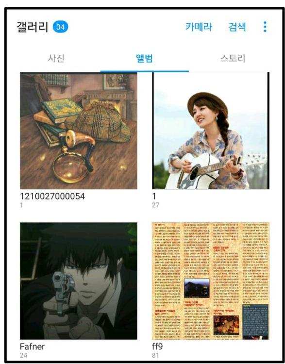

그림 11. 최초 갤러리 애플리케이션 실행 모습

실험 \#2-2, 2-3, 2-4를 통해 폴더 안을 보게 되면 갤러리 애플리케이션 내에서 설정된 해상도 별로 썸네일이 생성된다. 이때 폴더 내의 모든 썸네일이 생성되는 것은 아니며, 현재 폴더별로 대표로 화면에 보이는 그래픽 파일과 그 아래에 있 는 일부 그래픽 파일에 대하여 썸네일이 생성되었다. 즉, 사용자가 직접 눈으로 보지 않은 그래픽 파일에 대한 썸네일도 생성되기 때문에 $0 \times 32,0 \times 33$ 해상도의 썸네일이 존재한다는 것만으로 사용자가 특정 썸네일에 해당되는 원본 그래픽 파 일의 존재 여부를 인식하고 있었다고 볼 수는 없다. 한편 반대로 생각하면, $0 \times 31$, $0 \times 32,0 \times 33$ 등 어떠한 해상도들 중 단 하나라도 스마트폰에서 추출이 된다면 해 당 썸네일에 대응되는 원본 그래픽 파일은 사용자의 스마트폰에 반드시 저장되어 있었다는 것을 의미하기도 한다.

실험 \#2-5, 2-6와 같이 실제로 그래픽 파일을 터치하여 그래픽 파일을 직접 사 용자가 눈으로 확인하는 경우 $0 \times 31$ 해상도의 썸네일이 생성되었다. 이때 생성되 는 썸네일은 사용자가 직접 눈으로 확인한 그래픽 파일 뿐만 아니라 앞뒤 그래픽 파일을 넘겨보는 것에 대비하여 일정한 수의 썸네일도 함께 생성되었다. 그러나 이 경우 갤러리 애플리케이션 화면 안에 전후의 그래픽 파일을 육안으로 확인할

수 있기 때문에 사용자는 생성된 그래픽 파일 전체에 대하여 모른다고 부인할 수 는 없다. 즉, 특정 그래픽 파일의 존재 여부를 사용자가 인지하고 있었는지 여부 를 확인하기 위해서는 0x31 해상도의 썸네일에 대한 분석이 가장 중요하다.

실험 \#2-7에서와 같이 갤러리 애플리케이션에서 제공하는 그래픽 파일 편집 기능을 이용하여 그래픽 파일을 편집할 경우 갤러리 애플리케이션 내부적으로 파 일이 생성되고 생성된 결과를 바로 사용자가 확인하기 때문에 수정되어 생성된 그래픽 파일에 대한 썸네일이 생성되었다. 반면 실험 \#2-8과 같이 갤러리 애플리 케이션에서 제공하는 슬라이드쇼 기능을 사용하여 모든 그래픽 파일을 보았을 경 우에는 사용자가 그래픽 파일을 직접 육안으로 모두 확인할 수 있음에도 불구하 고 썸네일이 생성되지 않았다.

실험 \#2-9와 같이 스마트폰의 기본 내장 저장공간이 아닌 외장 SD카드로부터 그래픽 파일을 확인하는 경우 당연히 썸네일이 생성되었지만 삼성 스마트폰의 경 우 해당 썸네일이 외장 SD카드로부터 생성된 것인지 내장 저장공간에서 생성된 것인지를 썸네일만으로는 구분할 수 없었다. 반면 LG 스마트폰의 경우 썸네일 Metadata 상에 썸네일의 원본 그래픽 파일의 경로를 확인할 수 있기 때문에 그 출처를 확인할 수 있다. 삼성 스마트폰은 썸네일만으로는 썸네일의 출처 경로를 알 수 없기 때문에 반드시 External.db와 같은 다른 데이터베이스와 대조하여 확 인해야 한다.

실험 \#2-10, 2-11과 같이 갤러리 애플리케이션 내에서 그래픽 파일을 다른 폴 더로 복사 또는 이동시키는 경우 새로 복사 혹은 이동된 위치의 그래픽 파일에 대한 썸네일이 생성되며 다른 그래픽 파일로 인식하기 때문에 다른 Image id가 부여되고 이때 기록되는 Unix Time은 복사 혹은 이동된 시각을 가리킨다.

정리하자면, 스마트폰 내에 존재하는 그래픽 파일에 대하여 원본 상태의 모습 을 확인하기 위해서는 $0 \times 32,0 \times 33$ 해상도의 썸네일만 분석하더라도 확인이 가능 하다. 따라서 사용자가 갤러리 애플리케이션을 실행하고 해당 폴더를 확인하면서 어느 정도 조작을 하게 되면 썸네일이 남아 있으므로 사용자가 원본 그래픽 파일 을 삭제하더라도 남아있는 썸네일을 통해 어떠한 그래픽 파일이었는지 확인할 수 있다. 그러나 사용자가 특정 썸네일의 존재 자체를 인식하고 있었는지 확인할 필 요가 있을 경우에는 0x31 해상도의 썸네일을 분석해야 함을 알 수 있다.

# 3) 삭제 실험 

실험 \#3과 같이 다양한 방법을 통해 그래픽 파일을 삭제하는 실험을 하였으나 썸네일이 삭제되는 경우는 없었다. 즉, 사용자가 증거인멸을 목적으로 원본 그래 픽 파일을 삭제한다고 하더라도 썸네일이 생성되어 있는 상태라면 썸네일을 통하 여 원본 그래픽 파일이 어떠한 모습이었는지 확인할 수 있다는 것이다.

이는 스마트폰 내에서 그래픽 파일이 중요한 증거로 활용될 때 원본 그래픽 파 일에 대체하여 사용할 수 있다. 예를 들어 도촬이나 아동음란물 소지 혐의, 또는 어떤 범죄행위에 대한 증거인멸 또는 도주우려에 대해 확인하는 과정에서 사용자 에 의해 의도적으로 삭제된 행위는 증거인멸 또는 도주우려가 있는 것으로 볼 수 있으며 특히 스마트폰에서 사진 파일에 대하여 삭제를 시도하는 등 그래픽 파일 과 관련된 증거인멸 행위를 식별하는데 있어서 썸네일의 분석은 필수이다.

# 3.2. .thumbnails 

.thumbnails는 sdcard 영역 내의 사진파일을 저장하는 Default 폴더인 DCIM 폴더 내에 하위 폴더로 생성되는 폴더의 이름으로 내부에 썸네일을 저장하고 있 다. .thumbnail 폴더 및 썸네일이 저장되는 경로는 제조사 공통적으로 '/sdcard/DCIM/.thumbnails/이다. 이 폴더는 기본적으로 숨김으로 설정되어 있기 때문에 파일 탐색기 상에서 숨긴 폴더나 파일을 볼 수 있도록 설정해야 확인할 수 있다.

## 가. 구성

.thumbnail 폴더 내의 썸네일은 크게 2종류로 구분된다. .thumbnail 폴더 내에 는 '.thumbdataX-Y' 썸캐시와 각각의 썸캐시에 생성되어 있는 썸네일과 동일한 원본 그래픽 파일에 대한 JPG 썸네일이 파일 단위로 생성되어 있다. .thumbdata 썸캐시는 썸네일들이 특정 비어 있는 공간을 간격으로 두고 연속적으로 저장되어 있는 캐시 형태를 가지고 있으며 JPG 썸네일은 일반적인 썸네일과 동일한 Header와 Footer를 가지고 있다.

## 나. .thumbdata

.thumbdata 썸캐시는 '.thumbdata'에 이이서 난수가 붙는 형태로 파일 이름이 생성된다. 썸캐시 내부에는 그래픽 파일과 혼동되지 않도록 첫 블록은 비어있는 상태이고 이후 기종별 상이한 위치부터 썸네일이 저장되기 시작한다. 저장되는 썸네일의 구조는 <그림 11>, <표 14>와 같다.

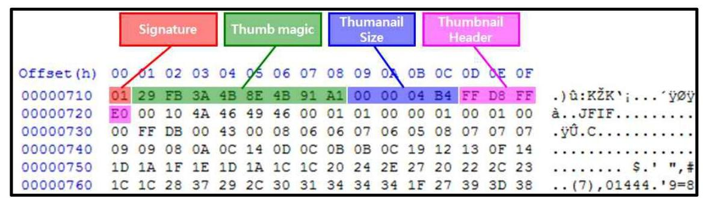

그림 12. .thumbdata 범캐시의 구조

표 14. thumbdata 범캐시의 구조 및 설명

|  Name | Offset | Size | Description  |
| --- | --- | --- | --- |
|  Signature | $0 \times 0$ | 1byte | - Start signature of thumbnail(0x01)  |
|  Thumb magic | $0 \times 1 \sim 0 \times 8$ | 8bytes | - Thumb magic value  |
|  Thumbnail size | $0 \times 9 \sim 0 \times C$ | 4bytes | - Size of thumbnail  |
|  Thumbnail header | $0 \times D \sim 0 \times 10$ | 4bytes | - Header of thumbnail  |

.thumbdata 범캐시 내에서 썸네일의 시작되는 것은 0x01이라는 Signature로부 터 식별할 수 있다. 8바이트의 Thumb Magic은 External.db 파일의 files 테이블 에서 mini_thumb_magic 속성에 기록되는 값으로, mini_thumb_magic에 정수로 기록되어 있는 값을 16 진수로 변환한 후 빅엔디안 방식으로 변경하면 정확하게 일치한다. 그리고 4바이트의 크기로 Thumbnail Size가 있어 바로 이어서 나오는 Thumbnail Header의 시작 위치로부터 Thumbnail Size만큼 블록을 선택하면 정 확하게 Thumbnail Footer가 종료하는 위치까지 확인할 수 있다.

다만 .thumbdata 범캐시의 경우 썸네일의 크기 외에는 어떠한 시간정보나 Metadata도 얻을 수 없어 썸네일과 같은 형태의 원본 그래픽 파일이 존재했었다 는 것 외에는 얻을 수 있는 정보가 없다.

# 다. JPG 썸네일 

.thumbdata 썸캐시 내에 저장되어 있는 썸네일들은 일반적으로 $96 \times 96$ 해상도 의 작은 그래픽 파일 형태로 저장되어 있다. 그러나 .thumbdata 썸캐시 안에 저 장된 모든 썸네일들은 .thumbnails 폴더 내에 각각 JPG 확장자의 개별 파일로 저장되어 있으며 해상도는 .thumbdata 썸캐시보다 더 큰 해상도로 저장되어 있 다.

JPG 썸네일의 내부 구조는 일반적인 그래픽 파일과 동일하기 때문에 그와 구 별되는 특징을 찾을 수 없다. JPG 썸네일의 파일명인 13 자리의 10 진수 숫자는 썸네일이 스마트폰에 생성된 시각을 Unix Time으로 표시한 것이다. 그러나 뒤에 서도 다루겠지만 .thumbnails 썸네일이 생성되는 것에는 일정한 패턴이 존재하지 않아 이 시각을 토대로 어떠한 정보를 유추해 내기에는 한계가 존재한다.

## 라. 특성

갤러리 애플리케이션에 종속되어 갤러리 애플리케이션에서의 행위에 따라 썸네 일이 생성되는 썸캐시와는 다르게 .thumbnails 썸네일의 경우 카메라, 갤러리, SNS 등 다양한 애플리케이션에 종속되어 작용되기 때문에 언제 생성되는지에 대한 규칙을 발견하기 힘들다. 또한 .thumbdata 썸캐시의 경우 사용자가 임의로 삭제를 하더라도 재생성될 경우 항상 일정한 용량을 유지하는데 그 원리에 대한 것 역시 명확하게 밝혀진 바가 없어 사용자의 행위와 연계하여 분석하는데 한계 가 있다.

다만 .thumbnails 썸네일을 삭제하거나 원본 그래픽 파일을 삭제했을 경우 몇 가지 특징을 살펴볼 수 있다.

먼저 썸네일에 해당하는 원본 그래픽 파일을 삭제하더라도 .thumbdata 썸캐시 나 JPG 썸네일이 삭제되지는 않는다. 따라서 사용자가 원본 그래픽 파일을 삭제 하더라도 특정 그래픽 파일이 스마트폰 내에 존재했음을 확인할 수 있다.

또한 .thumbnails 폴더 내의 썸네일을 삭제하는 경우 삭제한 썸네일의 원본 그 래픽 파일에 대해서는 다시 썸네일을 생성하지 않는다. 이후 생성된

에 대하여 썸네일이 생성되는데 이 썸네일을 통하여 사용자가 언제 .thumbnails 폴더를 삭제했는지를 추정할 수 있으며 이는 사용자의 증거인멸 행위의 시기를 추정할 수 있는 근거가 된다.

썸네일 자체만으로는 원본 그래픽 파일을 유추하는데 제한이 있지만 External.db 파일 내의 'thumbnails' 필드를 통해 원본 그래픽 파일을 추적할 수 있다. External.db의 'thumbnails' 필드에는 실제 저장되어 있는 .thumbnails 내의 JPG 썸네일의 리스트와 그에 상응하는 원본 그래픽 파일의 image id가 기록되어 있다. 또한 .thumbdata에 기록되어 있는 Thumb magic 값과 External.db 파일에 기록된 mini_thumb_magic 속성 값을 비교해도 확인할 수 있다. 따라서 .thumbnails 썸네일과 External.db를 연계하면 원본 그래픽 파일이 어디에 저장되 어 있었는지 추적할 수 있다.

# 3.3. .face 

.face 썸네일은 <그림 12>과 같이 그래픽 파일로부터 사람의 얼굴을 식별하여 얼굴 부분만 잘라 별도로 저장해 두는 썸네일이다. 카메라 및 갤러리 애플리케이션 뿐만 아니라 페이스북 애플리케이션과 같이 얼굴 인식에 기반을 둔 애플리케이션의 조작에 따라 생성되는 썸네일로 '/sdcard/.face/' 폴더 내에 저장된다. 이 썸네일 역시 폴더 자체가 기본적으로 숨김 설정되어 있기 때문에 숨긴 폴더나 파일도 볼 수 있도록 설정한 후에 확인할 수 있다.
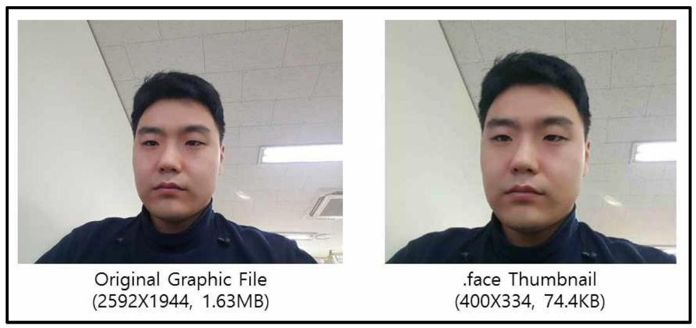

그림 13. 원본 그래픽 파일과 .face 썸네일 비교

## 가. 구성

.face 썸네일은 확장자 없이 일련번호를 파일명으로 가지고 있으며, 이때 내부 구조는 일반적인 썸네일의 Header와 Footer를 갖는 등 특별한 특징은 없어 파일의 구조만 본다면 일반적인 그래픽 파일이나 썸네일과 구별할 수 없다.

## 나. 특성

.face 썸네일이 생성되는 원리는 .face 썸네일 자체가 워낙 다양한 애플리케이 션과 연동이 되어 있다 보니 그 원리를 찾는 것이 쉽지 않다. 다만 삭제와 관련 하여 일반적인 특징을 찾을 수 있는데, .thumbnails에서 살펴본 바와 같이 한번 삭제된 .face 썸네일에 해당하는 원본 그래픽 파일에 대하여 다시 .face 썸네일을 다시 생성하지 않는다. 즉, 원본 그래픽 파일의 최초 생성단계에서만 .face 썸네 일이 생성된 후에는 재생성되지 않는다.

또한 일련번호가 지속적으로 External.db에 기록되어 유지되고 있기 때문에 .face 썸네일을 삭제한다고 해서 일련번호가 초기화되지 않고 마지막으로 기록된 일련번호에 이어서 계속 기록된다. 또한 .face 썸네일이 생성되어 있는 원본 그래 픽 파일을 사용자가 임의로 삭제한다고 하더라도 .face 썸네일이 삭제되지는 않 는다.
.face 썸네일 자체만으로는 직접 시간정보나 원본 그래픽 파일의 저장경로를 유추할 수 없지만 다른 썸네일과 마찬가지로 .face 썸네일의 모습을 가지는 원본 그래픽 파일이 있었음을 추측할 수 있게 한다.
.face 썸네일의 파일명으로 사용되는 일련번호는 External.db 내의 'faces' 필드 상의 face_data와 같은 값을 가진다. External.db 내의 faces 필드에는 어떠한 그 래픽 파일로부터 추출한 썸네일인지 그 위치와 그래픽 파일로부터 추출된 구체적 픽셀값, 그래픽 파일의 Image id 값을 가지고 있어 원본 그래픽 파일이 무엇이었 는지 역추적할 수 있다.

# 제 4 장 썸네일 추출 방법 

썸네일을 분석하기 위해서는 추출하는 과정이 굉장히 중요하다. 특히 썸네일을 온전하게 추출함으로써 원본 그래픽 파일이 복구가 되지 않았다고 하더라도 어떠 한 그래픽 파일이 있었는지 그 모습과 생성시각 등을 확인할 수 있다. 본 장에서 는 3 장에서 다룬 썸네일의 구조 및 특성을 활용하여 썸네일을 추출하기 위한 알 고리즘을 제시하고 단편화된 썸네일을 복원하는 방법을 함께 제시하며 삭제된 썸 네일을 복원할 수 있도록 개발한 도구인 Thumbnail Carver를 소개한다.

## 4.1. 썸네일 추출 알고리즘

스마트폰으로부터 썸네일을 추출하는 과정은 크게 논리적 추출과 물리적 추출 로 구분된다. 논리적 추출은 스마트폰 내의 내부 구조를 정상적으로 읽어올 수 있는 상태에서 내부 구조를 따라 썸네일을 추출하는 방법으로 썸네일 역시 스마 트폰 내에 삭제되지 않고 온전하게 남아있는 상태이기 때문에 가장 이상적인 추 출 방식이다. 물리적 추출은 스마트폰 내의 구조가 복구 불가능할 정도로 손상되 어 있거나 스마트폰 내에서 썸네일이 사용자에 의해 삭제되어 있어 썸네일의 특 정을 이용하여 카빙을 해야 하는 경우이다.

논리적 추출 방식은 현재 널리 사용되고 있는 EnCase나 FTK 등의 도구를 사 용하여 추출할 수 있으나 물리적 추출 방식은 썸네일의 특징이 파악된 상태에서 그 특징을 통하여 추출해야 하기 때문에 추출하기 어렵다. 따라서 본 논문에서는 물리적 추출 방식인 카빙에 초점을 맞추어 작성하였으며 추출하는 알고리즘은 $<$ 그림 13>과 같다.

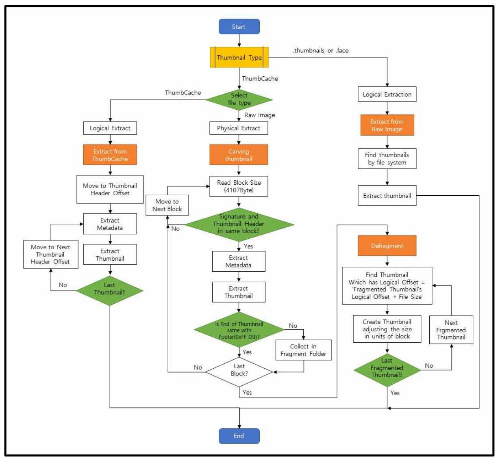

그림 14. 썸네일 추출 알고리즘

# 4.2. 논리적 추출 

논리적 추출 방식은 앞서 설명한 바와 같이 스마트폰의 내부 구조가 온전하게 보전되어 있고 썸네일 역시 사용자에 의해 삭제되지 않아 내부 구조를 통해서 복 원이 가능한 경우 사용하는 방식이다.

조사관은 스마트폰으로부터 썸네일 분석을 위해 <표 15>의 위치에 저장되어 있는 썸네일 및 데이터베이스 파일을 추출한다. 추출된 썸네일 중에서 뎀개서는 단편화되어 있지 않은 단일 파일 상태이기 때문에 별도의 재조합 없이 썸네일

Header와 Footer 정보를 이용하여 썸네일을 추출하고 썸캐시 내에 저장되어 있 는 Metadata를 추출한다.

표 15. 썸네일 및 데이터베이스 추출 경로

| Name |  | Path |
| :--: | :--: | :--: |
| Thumbnail | ThumbCache | $\cdot$ /sdcard/Android/data/com.sec.android.gallery3d/ cache/(Samsung) <br> $\cdot$ /sdcard/Android/data/com.android.gallery3d/cache/ (LG) |
|  | .thumbnails | $\cdot$ /sdcard/.thumbnails/ |
|  | .face | $\cdot$ /sdcard/.face/(Samsung only) |
| Database | External.db | $\cdot$ /data/com.android.providers.media/databases/ |
|  | es0.db | $\cdot$ /data/com.google.android.apps.plus/databases/ |

# 4.3. 물리적 추출 

물리적 추출 방식은 이상적인 논리적 추출 방식과는 달리 스마트폰의 내부 구 조가 온전하지 않아 내부 구조만으로는 썸네일을 추출할 수 없는 상태에서 썸네 일의 특징만을 가지고 추출해야 하는 경우에 사용하는 방식이다. .thumbnails 썸 네일이나 .face 썸네일의 경우 썸네일이 개별 파일 형식으로 저장되어 있기 때문 에 일반적인 그래픽 파일의 카빙과 같은 방식으로 사용할 수 있지만 그래픽 파일 의 카빙 자체가 그래픽 파일의 Header와 Footer를 사용한 방식으로 일반 그래픽 파일과 썸네일을 별도로 구분할 수 있는 방법이 없다. 따라서 물리적 추출 방식 으로 .thumbnails 썸네일과 .face 썸네일을 추출하는 것은 크게 의미가 없다.

반면 썸캐시의 경우 단일 파일 안에 여러 썸네일이 축차적으로 저장되어 있기 때문에 그 특징을 잘 활용하면 단편화되어 분할되어 있는 썸네일도 추출할적 적 원할 수 있다.

먼저 썸캐시의 특징을 살펴보면 썸캐시는 썸캐시 자체를 식별할 수 있도록 Header(0x10 8524 BD)가 있으며, 썸캐시 내에서 썸네일을 식별할 수 있도록 Metadata 부분에 '/1.o.c.a.1.(0x2F 006 C 006 F 00630061006 C 00 )'이 Signature로 사용할 수 있게 되어 있다. 또한 위 Signature와 썸네일의 Header인 0xFF D8 FF E0의 사이에는 썸네일로부터 얻을 수 있는 Metadata가 저장되어 있어 이를 통해 단편화된 썸네일을 추출하고 시간정보 등을 추출할 수 있다.

다른 썸네일들은 단일 파일 형식을 취하고 있기 때문에 블록의 맨 처음에는 항 상 그래픽 파일의 Header가 위치한다. 따라서 일반 그래픽 파일과 구분이 어렵다 는 단점이 있다. 그러나 썸캐시에서의 썸네일은 썸캐시 안에서 블록 중간에 썸네 일의 Header가 등장하기 때문에 다른 일반적인 그래픽 파일과 구분할 수 있다는 장점이 있다. 물론 블록의 시작 위치에 썸네일의 Header가 등장할 수 있지만 그 위치에 썸네일의 Header가 등장할 확률은 $1 / 1024$ 로 매우 낮은 확률이다.

썸캐시의 물리적 추출을 위하여 스마트폰을 이미정한 Raw Image의 시작부터 블록 단위로 위에서 언급한 Signature '/1.o.c.a.1.(0x2F 006 C 006 F 00630061 006 C 00 )'를 검색한다. 이 Signature는 썸캐시에서도 사용되기도 하지만 다른 파 일에서도 사용될 수 있기 때문에 반드시 Signature를 검색한 이후 썸네일의 Header를 함께 찾아야 한다. Signature와 썸네일의 Header가 함께 존재하는 파 일은 오로지 썸캐시 밖에 없기 때문에 다른 파일과 혼동을 일으키지 않고 정확하 게 썸캐시의 썸네일만을 추출할 수 있다.

여기서 발생할 수 있는 문제는 Signature가 블록과 블록 사이에 걸쳐서 존재할 경우이다. 이러한 문제를 해결하기 위해 최초 Signature를 검색하는 블록의 단위 를 Default로 설정되어 있는 4,096바이트가 아니라 4,107바이트로 설정한다. 4,107 바이트는 블록 크기인 4096 바이트에 Signature의 길이인 12 바이트를 더하고 오차 조정을 위해 1 바이트를 뺀 크기이다.

4,107바이트의 블록에서 Signature를 찾아내면 다음에 Header가 존재하는지 찾 기 위해 1 MB 크기로 블록을 읽어온 후 Metadata 영역 상에 기록되어 있는 Thumbnail Size만큼 썸네일을 읽어들여 저장하고 Metadata 역시 별도로 저장한 다. 만약 Header로부터 Thumbnail Size만큼 이동한 위치에 썸네일의 Footer(0x FF D9)가 없다면 이 썸네일은 단편화되어 있는 썸네일이기 때문에 별도로 분류 하여 차후 복원하는데 사용한다.

썸네일의 Metadata 중에서 추출하는 정보로는 Image id, Identifier,

time, Thumbnail size, Logical offset, physical offset이며, LG 계열 스마트폰은 원본 그래픽 파일의 위치가 Metadata 상에서 기록되어 있기 때문에 함께 추출한 다.

썸네일을 추출하는 과정에서 썸캐시가 단편화되어 있는 경우 일반적으로 파일 단위로 저장되는 썸네일과 달리 썸캐시에는 썸네일의 앞에 이전 썸네일의 뒷부분 이 남아있다. 이 부분이 차후 단편화된 썸캐시로부터 썸네일을 추출하는데 활용 할 수 있는 부분이다.
<표 16>은 지금까지 설명한 알고리즘을 슈도코드로 표현한 것이다.
표 16. 썸네일 추출 알고리즘

```
Algorithm
01 : for k in range(Image_Size):
02: Go to Block head
03: Read 4107 bytes
04: if there is no Header:
05: Block_Count += 1
06: Go to next Block
07: else:
08: for i in range(Header_Count):
09: Go to Header offset
10: Read 1MB
11: Get Metadata
12: Go to Thumbnail_Header offset
13: Save Thumbnail
14: if Footer does not exist:
15: Set Fragment_Flag to "On"
16: else:
17: Set Fragment_Flag to "Off"
18: Write Metadata to CSV
19: Block_Count += 1
20: Go to next Block
```

# 4.4. 단편화된 썸네일 복원 

단편화된 그래픽 파일을 복구하는 것은 매우 어렵다. 특히 일반적으로 그래픽 파일을 카빙하는 기법은 섹터 혹은 클러스터, 블록의 시작 부분으로부터 Header 를 검색하고 이어서 등장하는 Footer까지 카빙하는 것이 기본이다. 물론 단편화 되지 않은 그래픽 파일의 경우 이대로 카빙한다면 원본 그래픽 파일이 그대로 복 구가 되겠지만 사용자의 행위가 많아질수록 단편화가 많아지는 파일시스템들의 특성상 이 방식으로 완전히 복구가 되지 않는 경우가 더 많다. 이 경우 카빙하기 위한 방법으로 2 장에서 다룬 바와 같이 다양한 연구가 진행되어 왔지만 여러 제 한사항이 있었으며 썸네일의 특성과는 맞지 않는 부분이 많아 적용하는데 문제가 있었다. 특히 .thumbnail이나 .face 썸네일은 카빙 방식으로 복원할 경우 일반 그 래픽 파일과 전혀 구분할 수 없다는 문제가 있으며 그로 인해 그림의 외형 빼고 는 어떠한 정보도 얻을 수 없다. 그러나 썸캐시 내에 존재하는 썸네일의 경우 보 다 간단한 원리로부터 단편화된 썸네일을 복원할 수 있다.

여기서 가장 기본적으로 전제되는 전제조건은 파일시스템 자체적인 특성으로 Ext4 파일시스템에서 파일의 단편화를 최대한 억제한다는 것이다[12]. 이러한 파 일시스템의 특성으로 인하여 썸캐시는 가급적 최대한 연속된 블록에 저장되며, 그 속에 저장되어 있는 썸네일의 경우에도 대부분 단편화되지 않거나 단편화 된 다고 하더라도 썸네일의 크기가 일반적으로 1 MB 를 넘지 않기 때문에 2 개로 단 편화되는 경우가 많다. 이러한 조건과 썸캐시가 가지는 고유한 특성을 활용하면 단편화된 썸네일을 복원할 수 있다.

일반적으로 그래픽 파일은 파일의 Metadata가 없으면 파일의 크기를 알 수 없 다. 따라서 카빙하는 과정에서 크기에 맞게 카빙하는 것이 아니라 Footer라는 Signature를 따라가야만 하는 문제가 있다. 그러나 썸캐시 내에 저장되어 있는 썸네일은 Metadata로부터 각각의 썸네일의 크기를 정확하게 얻을 수 있다. 앞서 언급한 바와 같이 썸네일의 Header로부터 썸네일의 크기만큼 정확하게 계산한 위치에 썸네일의 Footer가 없으면 단편화된 썸네일로 판단하고 별도로 분류하였 다.

또 한가지 주목할 점은 썸캐시 내에서 각각의 썸네일의 논리적 위치 역시 썸네 일의 Metadata에 포함되어 있다는 점이다. 썸네일의 논리적 위치에서 썸네일의

크기를 더하면 다음 썸네일의 논리적 위치가 나온다. 즉, 썸네일의 Metadata를 분석함으로써 썸캐시 내에서 썸네일의 순번을 알 수 있다는 것이다. 이를 통해 단편화된 썸네일이 있다고 하더라도 자신의 다음 썸네일이 무엇인지는 단편화된 썸네일과 추출된 썸네일들의 논리적 위치를 분석함으로써 알 수 있다는 것이다.

이 방법으로 <그림 14>와 같이 단편화된 썸네일 A와 썸네일 중 A 썸네일의 다음 논리적 위치에 해당하는 썸네일 B를 찾고 난 후 썸네일 A가 2 개로 단편화 되어 있다고 가정할 경우 썸네일 A는 썸네일 A로부터 Header 부분을 가지고 있 는 썸네일 A-1과 썸네일 B의 앞부분에서 Footer 부분을 가지고 있는 썸네일 A-2로 구분할 수 있다. 여기서 썸네일 A-1이 어느 정도의 블록을 차지하고 썸네 일 A-2가 어느 정도의 블록을 차지하고 있는지는 알 수 없다. 하지만 그 블록의 크기는 썸네일의 크기로부터 계산할 수 있다.
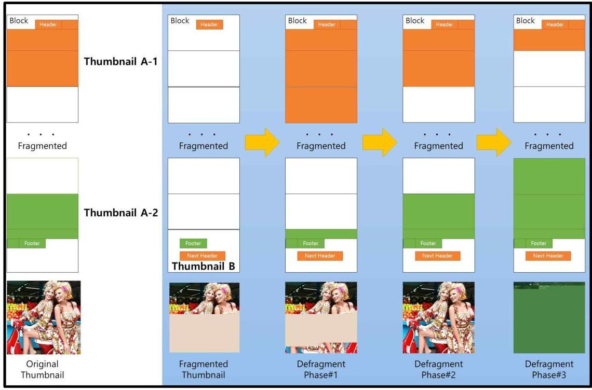

그림 15. 단편화된 썸네일 복원 절차

예를 들어 썸네일의 크기가 12,000 바이트이고 썸네일 A-1이 해당 블록에서 300 번째 위치에 기록되어 있다면 썸네일 A-2의 마지막 바이트는 자신이 속해있 는 블록에서 3,508 번째 위치에 기록되어 있을 것이다. 그렇다면 썸네일 A-1의 복 해 있는 블록과 A-2가 속해있는 블록 사이에는 총 2 개의 블록이 위치하고 있

것이다. 여기서 썸네일 A-1과 A-2가 각각 얼마만큼의 블록을 차지하고 있는지 알 수 없으므로 각각 가질 수 있는 블록 경우의 수를 임의로 부여하고 이를 하나 로 합쳐 JPG 파일로 만들 수 있으며 이를 수사관이 육안으로 확인할 경우 어떠 한 JPG 파일이 정상적인 썸네일이 되는지 확인할 수 있다.

다시 <그림 14>를 통해서 보면 단편화된 썸네일로부터 Thumbnail A-1, A-2 를 찾아낸 후 블록 크기를 조정해 가다보면 Fragmented Thumbnail, Defragment Phase\#1, \#2, \#3의 결과를 볼 수 있고, 추출된 4 개의 썸네일 중에서 조사관이 육 안으로 확인해 보면 Defragment Phase \#2의 JPG 파일이 정상적인 썸네일임을 확인할 수 있다.

썸네일의 크기가 크면 클수록 생성되는 JPG 파일이 많아지지만 그 중에서 정 상적인 모습의 그래픽 파일은 오로지 하나일 것이다. 그리고 그것이 바로 정상적 으로 복원된 썸네일이 된다. 물론 이 방법은 그 원리의 한계로 인하여 완전 자동 화가 불가능하고 사람이 직접 육안으로 확인해야 하는 과정을 거쳐야 하는 문제 가 있지만 다른 카빙 기법도 마찬가지로 통계적인 방법을 사용한다고 하더라도 결국은 정상적으로 카빙되었는지 조사관이 직접 확인하는 방법을 반드시 거쳐야 하므로 피할 수 없는 과정이라고 보아야 할 것이다.

# 4.5. Thumbnail Carver 

본 장에서 설명한 알고리즘을 적용하여 논리적으로 추출된 썸캐시 또는 스마트 폰 그대로 이미징되어 있는 Raw Image로부터 썸캐시에 저장되어 있는 썸네일과 그 Metadata를 추출하는 도구인 Thumbnail Carver를 <그림 15>과 같이 개발하 였다.

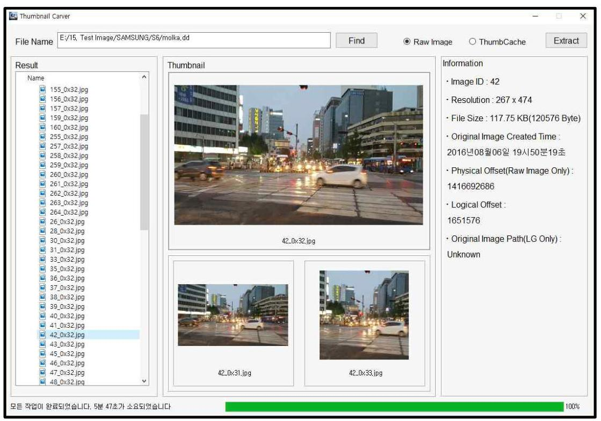

그림 16. Thumbnail Carver

이 도구에서는 Raw Image와 ThumbCache를 선택하여 썸네일을 추출할 수 있 으며 동일 Image id를 가지는 썸네일에 대하여 다른 해상도의 썸네일도 화면에 표시하여 조사관이 쉽게 인지할 수 있도록 하였으며 우측 프레임에는 해당 썸네 일이 가지는 Metadata 정보를 표시하였다.

또한 단편화된 썸네일을 복원한 결과는 <그림 16>과 같이 각각 복원된 JPG 파일을 리스트 형식으로 조사관에게 보여주고 조사관이 복원된 JPG 파일을 육안 으로 확인할 수 있도록 하였고, 동일 Image_id에 대하여 다른 해상도의 썸네일이 복원된 결과도 함께 보여주도록 하여 쉽게 대조할 수 있도록 하였다. 그리고 썸 네일을 추출하면서 함께 추출된 메타이터는 <그림 17>와 같이 CSV 파일로 자 동 추출되도록 하여 추출 이후 개별적으로 파일을 분석하는데 용이하도록 하였 다.


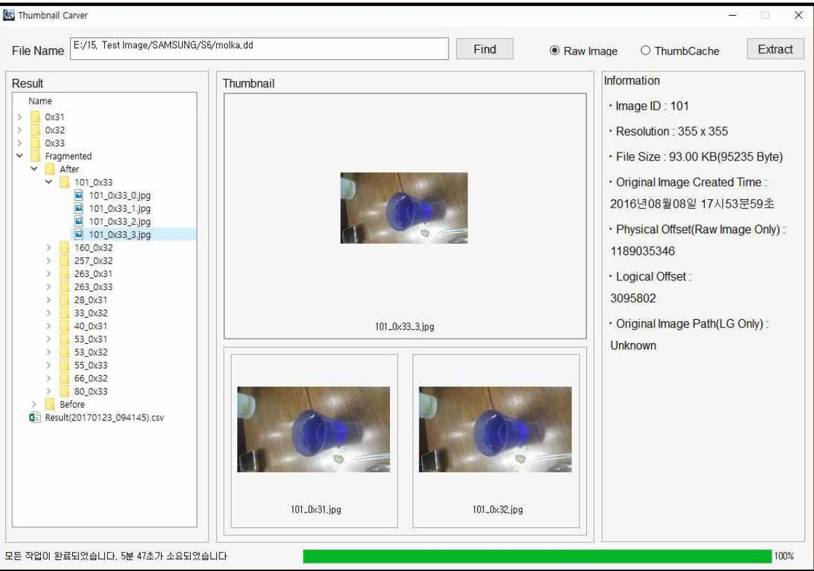

그림 17. 단편화된 썸네일 복원 결과

|  A | B | C | D | E | F | G | H | I  |
| --- | --- | --- | --- | --- | --- | --- | --- | --- |
|  Count | Image ID Identifier | Resolution | File Size | Created Time | Original P. Physical Offset | Logical Off Fragment |  |   |
|  0 | 58.0x33 | 175×98 | 16.99 KB(17401 Byte) | 2016년08월07일 16시(02분07초 | Unknown | 688011781 | 145839 | 0  |
|  1 | 43.0x33 | 175×98 | 16.40 KB(16794 Byte) | 2016년08월06일 19시50분31초 | Unknown | 688028268 | 163326 | 0  |
|  2 | 75.0x33 | 98×175 | 1024.00 KB(1048576 Byte) | 2016년08월07일 20시23분03초 | Unknown | 688046148 | 180206 | 1  |
|  3 | 26.0x32 | 267×474 | 73.50 KB(75262 Byte) | 2016년08월06일 17시47분09초 | Unknown | 701366362 | 4 | 0  |
|  4 | 53.0x32 | 474×267 | 92.32 KB(94535 Byte) | 2016년08월06일 23시44분49초 | Unknown | 701441710 | 75352 | 1  |
|  5 | 263.0x32 | 267×474 | 79.34 KB(81244 Byte) | 2016년08월09일 22시18분31초 | Unknown | 942544261 | 7652653 | 0  |
|  6 | 258.0x32 | 267×474 | 68.73 KB(70382 Byte) | 2016년08월09일 21시48분33초 | Unknown | 942625593 | 7733985 | 0  |
|  7 | 262.0x32 | 267×474 | 81.07 KB(83020 Byte) | 2016년08월09일 22시18분29초 | Unknown | 942696063 | 7804455 | 0  |
|  8 | 261.0x32 | 267×474 | 51.95 KB(53192 Byte) | 2016년08월09일 22시02분21초 | Unknown | 942779171 | 7887563 | 0  |
|  9 | 260.0x32 | 267×474 | 50.99 KB(52216 Byte) | 2016년08월09일 22시02분18초 | Unknown | 942832451 | 7940843 | 0  |
|  10 | 259.0x32 | 267×474 | 67.99 KB(69623 Byte) | 2016년08월09일 21시48분34초 | Unknown | 942884755 | 7993147 | 0  |
|  11 | 255.0x32 | 474×267 | 69.99 KB(71673 Byte) | 2016년08월09일 21시47분25초 | Unknown | 942954466 | 8062858 | 0  |
|  12 | 264.0x32 | 267×474 | 100.03 KB(102427 Byte) | 2016년08월10일 10시19분13초 | Unknown | 943096000 | 8204392 | 0  |
|  13 | 52.0x33 | 306×306 | 79.49 KB(81400 Byte) | 2016년08월06일 23시31분33초 | Unknown | 1149256628 | 4211550 | 0  |
|  14 | 261.0x33 | 355×355 | 54.68 KB(55991 Byte) | 2016년08월09일 22시02분21초 | Unknown | 1149338116 | 4293036 | 0  |
|  15 | 262.0x33 | 355×355 | 79.74 KB(81658 Byte) | 2016년08월09일 22시18분29초 | Unknown | 1149394195 | 4349115 | 0  |
|  16 | 263.0x33 | 355×355 | 77.60 KB(79467 Byte) | 2016년08월09일 22시18분31초 | Unknown | 1149475941 | 4430861 | 0  |
|  17 | 259.0x33 | 355×355 | 72.33 KB(74068 Byte) | 2016년08월09일 21시48분34초 | Unknown | 1149555496 | 4510416 | 0  |
|  18 | 260.0x33 | 355×355 | 48.84 KB(50010 Byte) | 2016년08월09일 22시02분18초 | Unknown | 1149629652 | 4584572 | 0  |
|  19 | 256.0x33 | 270×270 | 43.91 KB(44967 Byte) | 2016년08월09일 21시47분30초 | Unknown | 1149679750 | 4634670 | 0  |
|  20 | 264.0x33 | 355×355 | 96.08 KB(98389 Byte) | 2016년08월10일 10시19분13초 | Unknown | 1149724805 | 4679725 | 0  |
|  21 | 159.0x33 | 302×302 | 71.79 KB(73512 Byte) | 2016년08월09일 19시02분23초 | Unknown | 1149823282 | 4778202 | 0  |
|  22 | 257.0x33 | 270×270 | 47.87 KB(49019 Byte) | 2016년08월09일 21시48분23초 | Unknown | 1149896882 | 4851802 | 0  |
|  23 | 255.0x33 | 270×270 | 45.26 KB(46349 Byte) | 2016년08월09일 21시47분25초 | Unknown | 1149945989 | 4900909 | 0  |
|  24 | 258.0x33 | 355×355 | 73.18 KB(74938 Byte) | 2016년08월09일 21시48분33초 | Unknown | 1149992426 | 4947346 | 0  |

그림 18. CSV 파일로 추출된 메타데이터


도구의 실효성과 정확성을 검증하기 위하여 <표 17>과 같이 10 개의 스마트폰 의 Raw Image를 대상으로 실험하여 썸네일을 추출하였다. 도구를 평가하기 위 하여 사전에 정상적인 상태에서 썸캐시를 추출한 후 썸캐시로부터 추출되는 썸네 일의 개수와 도구의 Raw Image 카빙 방식을 선택하여 추출되는 썸네일을 비교 하여 그 정확도를 분석하였다.

도구를 구동한 결과, <표 17>과 같이 평균적으로 전체 썸네일 23,192 개 중 22,103 개를 추출하는 등 $95.3 \%$ 의 썸네일을 추출하였으며, 전체 썸네일 중 단편화 된 501 개의 썸네일에 대하여 복원하는 알고리즘을 적용한 결과 497 개( $99.2 \%$ )가 썸네일의 정상적인 모습이 식별되는 수준으로 복원됨을 확인할 수 있었다.

전체 썸네일 중 추출되지 않은 썸네일은 3 개 이상으로 단편화되어 있거나 Signature가 블록의 가장 시작 부분에 위치하여 Signature 이전 부분으로부터 얻 을 수 있는 Metadata를 얻지 못하여 카빙하지 못하는 것으로 기술적인 제한이 있었으나, 사용자가 썸캐시를 임의로 삭제한다고 하더라도 거의 대부분을 복구하 는데 문제가 없었으며 설사 특정 썸네일이 복구가 불가능하다고 하더라도 다른 해상도에서는 해당 Image id에 해당하는 썸네일이 복구되어 해당 그래픽 파일이 어떠한 모습이었는지를 확인하는데 충분하였다.

표 17. Thumbnail Carver를 이용한 썸네일 추출 결과

|  Model |  | Ver. | Origin Thumbnail |  |  |  | Extracted Thumbnail |  |  |   |
| --- | --- | --- | --- | --- | --- | --- | --- | --- | --- | --- |
|   |  |  | Total | 0x31 | 0x32 | 0x33 | Total | 0x31 | 0x32 | 0x33  |
|  SAM
SUNG | SM-G920 | 5.0.1 | 599 | 155 | 407 | 37 | 593 | 152 | 404 | 37  |
|   | SM-G920 | 6.0.1 | 217 | 73 | 76 | 68 | 212 | 70 | 74 | 68  |
|   | SM-G925 | 5.0.1 | 2,055 | 597 | 1,458 | 0 | 2,055 | 597 | 1,458 | 0  |
|   | SM-G900 | 4.4.2 | 109 | 12 | 58 | 39 | 108 | 12 | 57 | 39  |
|   | SM-E300 | 4.4.2 | 7,377 | 2,509 | 2,686 | 2,182 | 6,578 | 2,031 | 2,365 | 2,182  |
|   | SM-N915 | 5.0.1 | 5,778 | 2,193 | 2,038 | 1,547 | 5,674 | 2,193 | 2,038 | 1,443  |
|   | SM-N910 | 6.0.1 | 3,846 | 1,133 | 1,062 | 1,645 | 3,672 | 1,133 | 894 | 1,645  |
|   | SM-N910 | 5.0.1 | 3,165 | 960 | 1,090 | 1,115 | 3,165 | 960 | 1,090 | 1,115  |
|   | SM-N900 | 4.4.2 | 24 | 0 | 24 | 0 | 24 | 0 | 24 | 0  |
|  LG | LG F400 | 4.4.2 | 22 | 2 | 18 | 2 | 22 | 2 | 18 | 2  |
|  Total |  |  | 23,192 | 7,634 | 8,923 | 6,635 | 22,103 | 7,150 | 8,422 | 6,531  |
|  Recovery rate |  |  |  |  |  |  | $95.3 \%$ | $93.7 \%$ | 94.4\% | $93.4 \%$  |

# 제 5 장 썸네일의 포렌식 분석 

본 장에서는 지금까지 다룬 내용을 토대로 디지털 포렌식 관점에서 썸네일을 범죄수사에서 어떻게 활용할 수 있는지 활용방법을 제시한다.

## 5.1. 원본 연계성 분석

그래픽 파일을 이용하여 범죄혐의를 입증하는데 있어서 중요한 것 중 하나는 썸네일에 대한 원본 그래픽 파일이 무엇인지 찾아내어 그 원본성을 입증하는 것 이다. 예를 들어 지하철에서 여성의 치마 속을 촬영한 도촬범의 범죄행위를 입증 하는데 있어서 중요한 것은 여성의 치마 속이 촬영되어 있는 사진과 그 사진이 도촬범의 스마트폰에서 생성된 것을 입증하는 것이다. 조사관이 스마트폰으로부 터 여성의 치마 속이 촬영되어 있는 썸네일을 발견한다고 하더라도 그 썸네일의 원본 그래픽 파일이 인터넷에서 다운로드한 것인지, 범죄자가 직접 자신의 스마 트폰으로 촬영한 것인지 입증하지 않으면 범죄자가 자신이 촬영한 사진이 아니라 고 부인할 때 증명할 방법이 없다.

도촬범이 체포되기 직전 자신이 도촬한 사진을 안티포렌식 애플리케이션을 사 용하여 삭제한 경우 수사기관에서는 사진 자체를 완전하게 복구하는 것이 제한될 것이다. 썸네일을 복구하려 시도하였으나 도촬범에 의해 썸네일들도 삭제되어 있 을 가능성이 있다. 그러나 썸캐시를 이용하면 삭제된 썸네일을 복구할 수 있을 뿐만 아니라 썸네일을 복구하게 되면 썸네일에 저장되어 있는 Metadata를 통하 여 해당 썸네일이 어떠한 그래픽 파일의 썸네일인지 확인할 수 있으며 나아가 그 그래픽 파일이 사용자의 스마트폰에서 생성된 것인지, 외부에서 저장된 것인지, 언제 생성된 것인지 등을 입증할 수 있다.

이러한 사건을 조사하는 과정은 일반적으로 <그림 18>과 같은 절차를 거치게 될 것이다. 조사관이 스마트폰을 통해 자신이 찾고자 하는 그래픽 파일이 있는지 를 검색하고 만약 검색되지 않을시 썸네일 및 관련 데이터베이스를 추출 및 분석 하여 피의자에 의해 그래픽 파일이 임의로 삭제되었는지, 삭제되었다면 언제 삭

제되었는지 등에 대하여 분석할 수 있다.
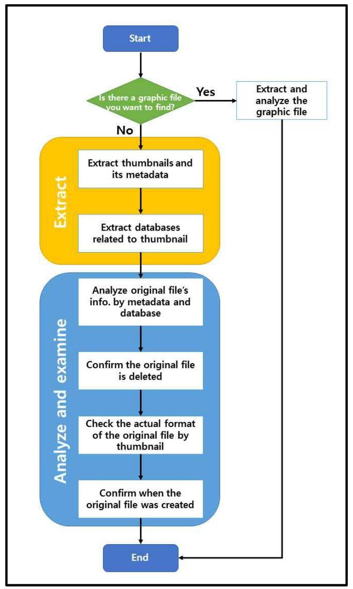

그림 19. 썸네일을 활용한 그래픽 파일 조사 절차

구체적으로 먼저 썸네일과 그래픽 파일의 원본성을 입증하기 위해 썸네일의 M etadata로부터 필요한 정보는 Image id, Created time, Path이다. <그림 19>와 같이 Image id를 External.db, es0.db와 연결하여 원본 그래픽 파일의 경로를 확 인할 수 있다. 만약 해당 경로가 스마트폰에서 사진을 촬영할 경우 저장되는 경 로인/sdcard/DCIM/Camera이고, 그 파일의 형식이 스마트폰에서 사진에 촬영될

경우 생성되는 고유한 양식을 따르고 있을 경우 도촬범의 스마트폰에서 촬영된 사진이라는 것을 추정할 수 있다.


그림 20. 원본 그래픽 파일과 데이터베이스, 썸네일의 상관관계

물론 인터넷에서 다운로드 받은 그래픽 파일의 파일명을 수정하여 위 경로에 저장하였다고 주장하는 경우도 있을 수 있다. 이 경우 추가적으로 확인할 수 있 는 것은 External.db와 es0.db, 썸네일에 기록되어 있는 시간정보이다.

앞서 언급한 바와 같이 썸네일의 Created time은 원본 그래픽 파일이 스마트폰 에 생성된 시각이다. 이 시각은 External.db의 files 테이블에서 data_modified, es 0.db의 all_photos 테이블에서 signature 속성에 기록된 시각과 일치한다. 이때 같 은 레코드의 datetaken(External.db의 files 테이블), timestamp(es0.db의 all_photo s 테이블) 값들이 Created time과 일치한다면 해당 그래픽 파일은 해당 스마트폰 에서 생성된 것이라는 것을 입증할 수 있다.

특히 External.db나 es0.db 같은 경우 사용자가 루팅을 통해 루트권한을 획득 해야만 하며, 루팅을 통하여 수정할 수 있게 된다고 하더라도 이것을 조작하는 데에는 상당한 데이터베이스에 대한 전문지식이 필요하기 때문에 사실상 위 데이 터베이스를 조작하는 것은 제한될 것이다.

한편, 해당 스마트폰에서 직접 촬영된 것임을 증명하기 위해서 DQT(Defme Q

uantization Table), 센서 패턴 노이즈를 활용하여 대조 및 증명하는 방법도 있으 나[8] 이 방법은 촬영에 사용된 스마트폰의 기종을 특정하는 데에만 효과적일 뿐 어느 특정 사용자의 특정 스마트폰에서 촬영되었다는 것을 특정하기에는 기술적 으로 한계가 있어 이 부분에 대해서는 앞서 언급한 바와 같이 여러 데이터파일들 과 썸네일의 메타데이터, 그래픽 파일의 메타데이터 등을 종합해서 판단해야 할 것이다.

# 5.2. 원본 생성시간 분석 

디지털 증거를 조사하는데 있어서 가장 중요한 정보 중 하나는 바로 시간정보 이다. 언제 디지털 증거가 생성되었으며 언제 스마트폰에 저장되었고 어떠한 조 작이 있었는지는 범죄 혐의 자체의 입증 뿐만 아니라 범죄자의 증거인멸 혐의를 포착할 수 있는 단서가 되기도 한다. 따라서 그래픽 파일의 생성, 조작, 삭제 등 일련의 과정에 대한 생애주기를 분석하는 것은 범죄수사에 있어서 중요하다.

먼저 썸네일의 생성과 관련하여 썸네일 Metadata에 원본 그래픽 파일이 생성 된 시각이 기록되어 있어 다른 데이터베이스의 정보 없이도 특정 그래픽 파일이 언제 생성되었는지 알 수 있다. .thumbnails 썸네일과 .face 썸네일도 External.db 나 es0.db 파일과 연계할 경우 그래픽 파일의 생성 시각을 확인할 수 있다. 원본 그래픽 파일의 경우 삭제되면 Metadata에 대한 정보를 역추적하기가 쉽지 않아 언제 생성되었는지 파악하기 어려운데 반해 썸네일의 경우 썸캐시나 데이터베이 스를 통해 생성 시각을 역추적할 수 있어 수사에 있어서 효과적으로 활용할 수 있다.

만약 사용자가 그래픽 파일을 다른 애플리케이션을 이용하여 수정할 경우 그래 픽 파일의 수정 시각이 변경되고 이 경우 썸캐시와 시간이 달라지게 되어 사용자 에 의해 그래픽 파일이 조작되었을 것이라는 것을 추정할 수 있다. 데이터베이스 와 연계하여 분석할 경우 썸네일에 해당하는 원본 그래픽 파일의 수정시각과 썸 네일의 생성시각을 비교하면 원본 그래픽 파일이 조작되었는지 여부를 확인할 수 있다.

사용자에 의해 그래픽 파일이 삭제되고 각종 데이터베이스가 삭제되기

단위: $\mathrm{cm} \mathrm{~m}$

래픽 파일에 대한 정보를 얻을 수 있는 것이 없다고 하더라도 썸네일의 Metadata에 남아 있는 시간만으로 원본 그래픽 파일의 생성 시각을 추정할 수 있다. 물론 사용자가 언제 원본 그래픽 파일을 삭제하였는지 그 시점을 정확하게 확인하는 것은 불가능하지만 원본 그래픽 파일이 삭제되었더라도 썸네일을 복원 함으로써 원본 그래픽 파일의 실제 모습을 확인할 수 있으므로 썸네일로는 존재 하지만 원본 그래픽 파일이 없는 경우 사용자에 의해 의도적으로 삭제되었다는 것을 알 수 있다.

즉 썸네일을 다른 여러 데이터와 종합하여 분석할 경우 원본 그래픽 파일이나 썸네일의 생성, 조작, 삭제 등의 생애주기에 대하여 분석할 수 있어 범죄 수사에 서 유용하게 사용할 수 있다.

# 5.3. 특정 그래픽 파일의 존재 분석 

성폭행 장면을 몰래 촬영한 사진이나 동영상, 기밀 유출, 아동포르노 등의 범죄 수사에 있어서 해당 사진이나 동영상 등의 존재 여부는 범죄혐의를 입증하는데 결정적으로 기여한다. 따라서 범죄가 될 수 있는 장면이 촬영되어 있는 그래픽 파일이 사용자의 스마트폰에 존재했다는 것을 증명하는 것이 굉장히 중요한데, 만약 사용자가 해당 그래픽 파일을 삭제하였을 경우 카빙을 통해 그래픽 파일을 복원하지 않는 이상 조사관의 입장에서 이를 입증하기 어려워진다.

그러나 썸네일의 경우 사용자가 직접 생성하는 것이 아니라 사용자의 행위에 따라 운영체제가 애플리케이션에 의해 자동적으로 생성하는 것으로, 일반적인 사 용자는 해당 썸네일들이 생성되는 것 자체를 알기가 쉽지 않다. 따라서 사용자의 스마트폰에서 그래픽 파일은 삭제되더라도 썸네일은 스마트폰에 그대로 남아있을 가능성이 크다. 설령 사용자가 스마트폰에서 썸네일을 삭제한다고 하더라도 썸캐 시 안에 저장되어 있는 썸네일의 경우 앞서 설명한 알고리즘 및 도구를 사용할 경우 복원이 가능하며 그 Metadata 역시 복원이 가능하다.

또한 지하철 도촹과 같이 현장에서 스마트폰 이미지를 생성하고 분석한 후에 증거를 찾는 과정이 현실적으로 불가능한 경우에는 현장에서 용의자의 스마트폰 에서 썸네일만 바로 추출하여 확인할 수도 있다. 정확한 원본정보 확인을 위해서

는 데이터베이스를 추출해야 하지만 범행 현장에서 당장 용의자의 행위를 입증하 기 위해서는 복잡한 과정을 거치는 데이터베이스 추출은 현실적으로 힘들다. 반 면 특정 그래픽 파일이 존재했는지 여부만 확인하여 긴급체포 혹은 현행범 체포 를 하는 등의 조치를 취하는 수준까지는/sdcard/Andorid/data/ 폴더 내에 존재 하는 썸캐시만 추출해도 특정 그래픽 파일이 존재했는지 여부를 알 수 있다.

특히 썸네일은 데이터베이스와 달리 바로 어느 PC에 꽂든지 별도의 복잡한 절 차 없이 썸네일 관련 파일들을 추출할 수 있기 때문에 현장에서 수사관이 활용하 기에 용이할 것이다. 증거를 인멸하기 위해 용의자가 특정파일을 삭제하는 경우 일반적으로 카메라 애플리케이션이나 갤러리 애플리케이션을 이용하게 되는데 이 경우 썸네일이 반드시 생성되기 때문에 특정 카메라 파일이 있다는 것을 알 수 있다.

혹여 용의자가 셔터음이 나지 않는 무음 카메라 애플리케이션을 사용했다고 하 더라도 결국 삭제하는 과정은 일반적으로 갤러리 애플리케이션을 사용하기 때문 에 촬영 방법을 불문하고 삭제 방법에 따라 썸네일은 용의자의 스마트폰에 생성 되어 있을 것이다. Keepsafe와 같이 그래픽 파일을 암호화하여 은닉할 수 있는 애플리케이션이나 삼성 갤럭시 계열 스마트폰에서 제공하는 프라이빗 모드에서도 암호화의 대상은 원본 그래픽 파일만 해당이 되며 썸네일은 암호화하지 않는 등 용의자의 다양한 안티포랜식 행위에 대해서도 썸네일을 분석하면 대응할 수 있는 장점이 있다. <표 18>은 그래픽 파일 은닉 애플리케이션별로 원본 그래픽 파일 의 썸네일 추출이 가능한지 여부에 대하여 정리한 것이며 <그림 20>은 Keepsafe 애플리케이션으로 암호화한 사진(좌)의 섬네일을 Thumbnail Extractor 를 이용하여 추출한 모습이다. 은닉 애플리케이션을 사용한다고 하더라도 모든 애플리케이션에서 원본 그래픽 파일에 해당하는 썸네일은 암호화하지 않는 것을 알 수 있다.

표 18. 그래픽 파일 은닉 애플리케이션별 썸네일 추출 가능 여부

| App. | Icon | Thumbnail Extract Available |
| :--: | :--: | :--: |
| 마이프라이버시 |  | ○ |
| Keepsafe |  | ○ |
| 개인 갤러리 |  | ○ |
| 사진 및 비디오 숨기기 |  | ○ |
| Gallery Lock |  | ○ |
| Vault -개인 갤러리 |  | ○ |
| 사진 잠금(스마트 갤러리) |  | ○ |
| 자물쇠 AppLock |  | ○ |
| 포토 로커(PhotoLocker) |  | ○ |
| 전문가 숨기기 |  | ○ |

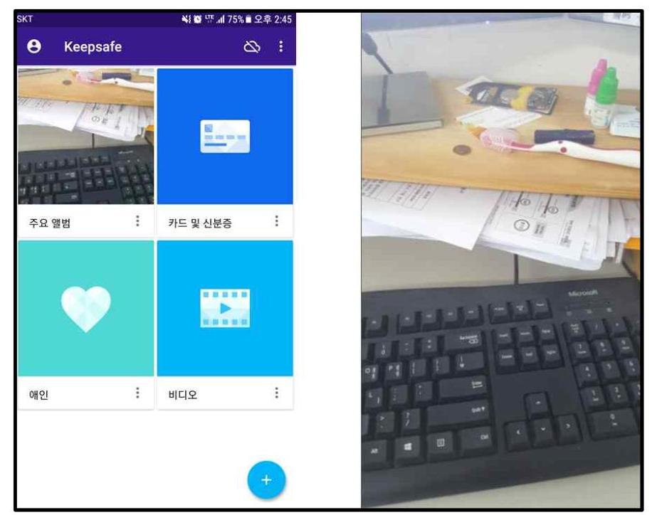

그림 31. Keepsafe로 암호화된 그래픽 파일(좌)과 추출된 썸네일(우)

따라서 추출되거나 복원된 썸네일을 통해 썸네일의 모습과 동일한 모습을 가지 는 원본 그래픽 파일이 사용자의 스마트폰에 저장되어 있는 것이 입증되며, 이를 사용자의 범죄행위를 입증하거나 증거를 은닉하기 위해 삭제했다는 증거로 활용 할 수 있다.

# 제 6 장 결 론 

범죄를 수사하는데 있어서 스마트폰의 역할은 매우 중요하며 스마트폰 관련 기 술과 애플리케이션의 기능이 확장될수록 그 역할은 더욱 커질 것이다. 기존의 무 겁고 휴대가 불편한 디지털 카메라를 대체하고 그와 유사한 수준의 성능을 가진 카메라를 기본 탑재하고 있는 스마트폰의 특성상 스마트폰으로부터 그래픽 파일 을 분석하는 것은 매우 중요해지고 있다.

이러한 현실 속에서 안드로이드 스마트폰으로부터 그래픽 파일을 분석하는데 있어서 원본 그래픽 파일의 카빙에만 초점이 맞춰져서는 안 되며 본 논문에서 다 룬 썸네일과 함께 분석되어야 할 것이다. 또한 원본 그래픽 파일의 복구가 불가 능한 경우에 분석하는 것으로 한정되는 것이 아니라 그래픽 파일을 분석하는데 있어서 추출해야 하는 하나의 아티팩트 개념으로 다루어져 분석시마다 자동적으 로 추출하여 활용되어야 할 것이다.

또한 2016년 5월 29일 형사소송법이 개정1)되면서 전문증거로서 당사자가 부인 할 경우 증거능력을 인정받을 수 없었던 디지털 증거가 과학적 분석결과에 기초 한 디지털포랜식 자료, 감정 등 객관적 방법으로 성립의 진정함이 성립되는 때에 는 증거능력을 인정받을 수 있게 되면서 '객관적 방법'을 입증하기 위한 노력이 더욱 필요한 시점이기도 하다. 따라서 포랜식 수사관들은 당사자가 부인한다고 하더라도 이를 입증할 수 있도록 시스템 관련 아티팩트에 대하여 꾸준히 연구할 필요가 있으며 그래픽 파일에 관한 연구에서는 썸네일에 대한 연구가 철저히 이 루어져야 할 것이다.

본 논문에서는 그래픽 파일을 분석하는데 필요한 안드로이드 스마트폰에서의 썸네일의 종류와 구조, 특징을 분석하고 이를 추출할 수 있는 알고리즘과 이를 구현한 도구를 소개하였다. 본 논문에서 다룬 썸네일 외에도 각종 애플리케이션 에서 저마다의 썸네일을 생성하고 사용되고 있다. 또한 썸네일도 애플리케이션이 나 운영체제에 종속되는 만큼 수시로 업데이트 되는 상황에 따라 그 형태를 다르 게 분석하게 될 수도 있다. 따라서 썸네일에 대한 분석은 이번으로 끝나는 것이 아니라 다양한 애플리케이션과 다양한 버전에서의 썸네일에 대해 분석하고 이를 범죄 수사에 있어서 활용할 수 있도록 노력할 예정이다.

1) 형사소송법 제 313 조 제 2 항

# 참고문헌 

[1] Ministry of Science, ICT and Future Planning, Internet, http://msi p.go.kr/cms/www/mdFile32.jsp?path=/cms/www/m_con/stats/__icsFiles/a fieldfile/2016/12/30/11\ 55C\ 9B\ 94\ 25B4\ 25B4\  EC\ 84\ 25A0\ 25ED\ 586\ 5B5\ 25C\ 8B\ 25A0\ 55C\ 2584\  59C\%25EB\%25B9\%2584\%25EC\%258A\%25A4\%2520\%25EA\%25B0\%2580\% 25EC\%259E\%2585\%25EC\%259E\%2590\%2520\%25ED\%2598\%2584\%25ED\% $2599 \% 25$ A9.pdf
[2] Korean National Police Agency, "Police Statistical Yearbook 2015", p. 218, 2016
[3] Korea HTML5, Internet, http://www.koreahtm15.kr/jsp/infoSquare/bro wserUseStatsKor.jsp?type_code_LIST=USST0002\&os_code=all\&search_ty pe $=$ D\&search_date $=201606$
[4] Kevin, D. Fairbanks, "An analysis of Ext4 for digital forensics", Digital Investigation, Vol. 9, pp. 118-130, 2012
[5] Andrew Hoog, "Android Forensics - Investigation, Analysis and Mobile Security for Google Android", Syngress, p. 351, 2011
[6] Rohit Tamma, Donnie Tindall, "Learning Andoid Forensic", Packt Publishing, pp. 211-216, April 2015
[7] Ming Di Leom, Christian Javier D'Orazio, Gaye Deegan and Kim-Kwang Raymond Choo, "Forensic Collection and Analysis of Thumbnails in Android", 2015 IEEE Trustcom/BigDataSE/ISPA, pp. 1055-1066, Aug. 2015

[8] Miji Lee, Sangjoon Park, "Identification of source of JPEG file from Smartphone According to The Multiple step of Verification", 2016 WDFS Winter Workshop, pp. 81-90, Dec. 2016
[9] Maegan Katz, David Leberfinger, Olivia Hatalsky, "Android Forensic", The Senator Patrick Leahy Center for Digital Investigation, Champlain College, April 2013
[10] Catherine Stamm, Internet, http://matstac4n6.blogspot.kr/2013_04 _01_archive.html
[11] Igor Mikhaylov, Internet, https://www.digitalforensicscorp.com/bl og/do-not-miss-new-thumbnail-databases-in-android-os/
[12] A. Mathor, M. Cao, S. Bhattacharya, A. Dilger, A. Tomas and L. Vivier, "The new ext4 filesystem : current status and future plans", 2007 Linux Symposium Volume Two, pp. 21-33, Jun. 2007
[13] Foremost, Internet, http://foremost.sourceforge.net/
[14] Richard III GG, Roussev V, "Scalpel : a frugal, high performance fi le carver", DFRWS, 2005
[15] Garfinkel SL, "Carving contiguous and fragmented files with fast object validation", Digital investiation, pp. 2-12, 2007
[16] Karresand M, Shahmehri N, "Reassembly of fragmented jpeg images containing restart markers", 2008 European conference on computer network defense, 2008
[17] Memon N, Pal A, "Automated reassembly of file fragmented images using greedy algorithms", Image Process IEEE Trans, pp. 385-393, 2006

[18] Pal A, Shanmugasundaram K, Memon N, "Automated reassembly of fragmented images", 2003 IEEE international conference on acoustics, speech, and signal processing4, 2003
[19] Sharma G, "Digital color imaging handbook", CRC Press, 2002
[20] Yanbin Tang, Junbin Fang et al., "Recorvery of heavily fragmented JPEG files", DFRWS USA 2016, pp. 108-117, 2016
[21] http://www.androidpub.com/
[22] Alex Golding, Internet, http://dig-forensics.blogspot.kr/2013/05/ios -ithmbs.html
[23] iThmb Converter, Internet, http://www.ithmbconverter.com/
[24] CompuClever ITHMB Viewer, Internet, http://https://www.microsoft. com/ko-kr/store/p/compuclever-ithmb-viewer/9wzdncrdm8hg
[25] D. Quick, C. Tassone, \& K.-K.R. Choo, "Forensic analysis of wind ows thumbcache files," in 20th Americas Conf. Inform. Syst., Asso ciation for Inform. Syst., 2014
[26] Daeho Yun, Sang Jin Lee. "Study for Android Smartphone's Gallery Thumbnail Forensic Analysis", KIPS Transactions on Computer and Communication Systems, 2017
[27] D. Hurlbut 2005, Thumbs DB files forensic issues, Internet, https:// repo.zenk-security.com/Techniques\%20d.attaques\%20\%20.\%20\%20F ailles/THUMBS\%20DB\%20FILES\%20FORENSIC\%20ISSUES.pdf
[28] H. Parsonage, 2012, Under my thumbs - revisiting windows thumb nail databases and some new revelations about the forensic implicat ions, Internet, http://computerforensics.parsonage.co.uk/downloads/Un derMyThumbs.pdf

[29] S.L.A. Morris, "An investigation into the identification, reconstruction, and evidential value of thumbnail cache file fragments in unallocated spa ce," Ph.D. thesis, Cranfield Univ., Shrivenham, Oxfordshire, UK, 2013
[30] Patrick Leahy Center for Digital Investigation, "Windows 10 Forensi cs", 2015
[31] Matt 2012, Analyzing thumbcache, Internet, http://escforensics.blogs pot.com/2012/11/analyzing-thumbcache.html

