# 안드로이드 스마트폰을 위한 앤티-포렌식 도구 개발 

## 문필주*

The Development of Anti-Forensic Tools for Android Smartphones

Phil-Joo Moon ${ }^{*}$

## 요 약

스마트폰은 실생활에 매우 유용하게 사용되면서도, 스마트폰을 이용한 범죄에 많이 노출되고 있다. 또한 앤 티-포렌식 도구들을 사용하여 스마트폰 메모리의 데이터를 고의로 삭제하는 경우도 발생하고 있다. 본 논문에 서는 안드로이드 스마트폰 상에서 사용되는 앤티-포렌식 도구를 구현하고, 상용 포렌식 툴인 Oxygen Forensic Suite를 사용하여 구현한 앤티-포렌식 도구가 제공하는 기능들의 활용성을 검증하는 시험을 한다.

## ABSTRACT

Smartphone is very useful for use in the real world, but it has been exposed to a lot of crime by smartphone. Also, it occurs attempting to delete a data of smartphone memory by anti-forensic tools. In this paper, we implement an anti-forensic tool used in the Android. In addition, tests to validate the availability of the anti-forensic tool by the Oxygen Forensic Suite that is a commercial forensic tool.

키워드 Digital Forensics, Anti-Forensics, Smart Phone, Android 디지털 포렌식, 앤티-포렌식, 스마트폰, 안드로이드

## I . 서 론

2009년 스마트폰 도입 이후 사용자가 급증하고 있 다. 특히, 스마트폰뱅킹 사용자는 2009년 12월 서비스 가 시작된 이후, 도입된 지 4년 6개월 만에 등록 고객 수가 4천 만 명을 넘어서 가파르게 증가하는 모습이 다[http://www.yonhapnews.co.kr].

컴퓨팅 능력 향상, 전송속도의 고속화, 다양한 부가 기능 및 애플리케이션의 개발을 통해 대용량 디지털 멀티미디어 정보의 전달과 이용이 빈번하게 이루어지 면서, 이동하면서 업무와 실생활에 사용하는 시간이

많아짐에 따라 관련된 정보를 전달하고, 편리한 생활 을 하는 반면에 이를 이용한 많은 범죄에도 노출되고 있다. 스마트폰에 금융정보 등이 포함되어 있어 도난 및 분실 시 금융정보는 물론 개인정보 유출 등 제 2 의 범죄로 이어질 수 있다.

스마트폰 사용의 증가로 인하여 개인 정보들이 범 죄자들에게 노출되어지고 있고, 많은 범죄에 이용되어 지고 있는 것이 현실이다. 또한 스마트폰에 저장된 자 료들로부터 증거들을 수집 및 분석하여 수사에 활용 할 수 있는데 이러한 자료가 디지털 증거로 사용되기 위해서는 원본성과 무결성이 입증되어야 한다.

[^0]
[^0]:    * 교신저자(corresponding author) : 평택대학교 정보통신학과(pjmoon@ptu.ac.kr) 접수일자 : 2014. 10. 04

    심사(수정)일자 : 2014. 12. 15

않에서 언급한 바와 같이 스마트폰에 저장된 자료들로부터 디지털 증거들을 수집하여 분석된 자료가 증거로 보장되기 위하여 원본성과 무결성을 입증하여 수사에 활용하는 과정을 디지털 포렌식(Digital Forensics)라고 하며[1-2], 이와는 반대로 디지털 증거 들을 수집 및 분석하는 과정을 방해하거나 수집, 분석 된 자료의 원본성과 무결성을 저해하는 과정을 디지 털 앤티-포렌식(Digital Anti-Forensics)라고 한다[3].

디지털 앤티-포렌식 기술들은 데이터 파괴, 데이터 은닉, 데이터 조작, 데이터의 출처 제거 등 네 가지 분야로 분류된다[4]. 데이터 파괴는 데이터를 사용하 지 못하게 하거나 조사를 진행하지 못하게 한다. 데이 터 은닉은 디지털 증거를 조사관에 보이지 않게 한다. 증거를 보이지 않도록 하는 암호화나 스테가노그래피 (Steganography) 등의 방법을 사용하며, 스테가노그 래피의 경우에는 텍스트 메시지나 이미지 파일을 이 미지 파일, 비디오 파일, 오디오 파일 등에 숨겨 데이 터를 은닉하는 기능을 제공한다. 데이터 조작은 거짓 된 정보를 제공하게 한다. 이 정보로 인해 올바른 포 렌식 과정에서 벗어나도록 잘못된 정보나 우회 정보 를 제공한다. 데이터의 출처 제거는 증거의 출처를 제 거함으로써 증거로 사용될 정보의 생성을 원칙적으로 막을 수 있다[5].

스마트폰을 교체하거나 분실 위험이 상존하는 상황 에서 범죄에 노출될 가능성이 매우 높기 때문에 스마 트폰에 저장되어있는 공인 인증서나 사진, 문자메시지 기록 등 중요한 데이터를 완벽하게 삭제해야할 필요 성이 발생한다[6-7]. 이러한 경우에 앤티-포렌식 도구 를 사용하여 완벽하게 삭제할 수 있다면 개인정보를 범죄의 노출로부터 예방할 수 있다.

본 논문에서는 안드로이드 운영체제를 위한 앤티포렌식 도구를 설계하고, 구현하고자 한다. 또한, 대표 적인 상용 포렌식 도구인 Oxygen Forensic Suite를 사용하여 구현한 앤티-포렌식 도구가 제공하는 기능 들의 활용성을 검증하기 위한 실험을 진행하였다.

## II. 앤티-포렌식 도구의 설계

본 장에서는 안드로이드 플랫폼을 위한 앤티-포랜 식 도구의 제공 기능을 설계하였다.

앤티-포렌식 도구의 다양한 기능들 중에서 핵심 기 능이라고 할 수 있는 데이터 파괴, 데이터 은닉, 데이 터 변조 등을 구현하였으며, 표 1 에 제공 기능들에 대 한 세부사항들을 요약해 나타냈다.

표 1. 앤티-포렌식 도구의 기능 명세
Table 1. Function specification of anti-forensic tool

| Classification | Technology | Applicable Objects |
| :--: | :--: | :--: |
| Destroying   Data | File Wiping | File |
| Hiding Data | Encryption | File |
| Counterfeiting   Data | Spoofing | Call Log,   Calling Date,   Called Date,   SMS Messages |

데이터 파괴 기능은 선택한 파일에 랜덤 데이터를 다 시 쓰는 형태로 파일을 완벽하게 삭제한다. 이를 위해 1 번, 3 번, 5 번 반복 쓰기의 기능을 제공한다. 특성상 안드 로이드 스마트폰이 무팅된 상태이어야 적용이 가능하다.

데이터 은닉 기능은 적용된 앤티-포렌식 기법에 따 라 암호화나 스테가노그래피로 분류되며, 본 논문에서 는 파일의 암호화 기능만 제공한다. 원본 파일은 암호 화가 적용된 후에 암호화 파일 형태로 변경되며 암호 화할 때 사용했던 패스워드는 복호화 시에 사용된다.

데이터 변조 기능은 통화 기록과 문자 메시지의 내 용을 변조한다. 통화 기록의 날짜와 시간, 수신, 송신, 부재중 통화의 여부를 변조할 수 있으며, 문자 메시지 의 발생 날짜와 시간, 내용 등을 변조할 수 있다.

그림 1은 앤티-포렌식 도구의 기능블록 구성을 나 타낸 것이다.
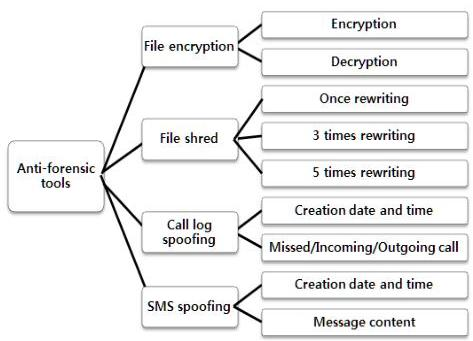

그림 1. 앤티-포렌식 도구의 구성도
Fig. 1 Anti-Forensic Tool's block diagram

## III. 앤티-포렌식 도구의 구현 및 활용성 실험

본 장에서는 안드로이드 스마트폰을 위한 앤티-포 렌식 도구의 구현된 내용들을 서술한다. 또한, 구현한 앤티-포렌식 도구가 제공하는 기능들에 대한 활용성 을 검증하기 위하여 대표적인 상용 포렌식 도구인 Oxygen Forensic Suite를 사용한다. Oxygen Forensic Suite는 스마트폰을 위한 포렌식 소프트웨어 로 스마트폰 데이터의 추출뿐만 아니라 추출한 데이 터를 분석하여 보고서를 제공한다. 실험에 사용한 모 바일 기기는 안드로이드 운영체제(OS 버전 4.1.2)를 사용하고 있는 LG의 LU8200 Optimus LTE 폰이다.

### 3.1 앤티-포렌식 도구의 구현

구현한 앤티-포렌식 도구의 기능은 파일의 암호화, 복호화, 파일 분쇄, 통화기록과 문자메시지 기록의 변 조 메뉴로 구성되며, 그림 2는 구현한 앤티-포렌식 도구의 실행 초기 화면을 나타낸다.
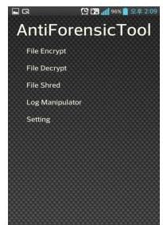

그림 2. 앤티-포렌식 도구의 메뉴 화면
Fig. 2 Anti-Forensic Tool's menu screen

### 3.2 파일 암호화

파일의 암호화(Encryption)는 정당한 권한이 없는 경 우 파일의 데이터를 볼 수 없도록 데이터를 숨기는 방 법이다. 암호화 알고리즘은 256 비트의 AES를 사용하였 으며, 그림 3은 test.txt 파일의 암호화 화면을 나타낸 다. 초기 화면에서 File Encrypt 메뉴를 선택하면 그림 3 의 (a)와 같이/storage/sdcard0/work 디렉토리의 파 일 리스트가 나타난다. 이중에 test.txt 파일을 선택하면 그림 3 의 (c)와 같이 파일을 암호화할 때 필요한 패스 워드를 입력하는 화면이 나타난다. 그림 3 의 (b)는 test.txt 파일의 내용이 간단한 텍스트임을 보여준다.

(a) 파일 목록
(b) 파일 내용
(c) 암호 설정
(a) File list
(b) File contents
(c) Password det

그림 3. 파일의 암호화 화면
Fig. 3 File encryption screen
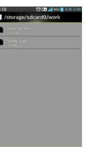

그림 4. 파일의 암호화 완료 화면
Fig. 4 File encryption complete screen
그림 4는 암호화후의 화면을 나타낸다. test.txt 파 일은 암호화되어 그림 4 와 같이 test.txt.enc 파일로 변경되었음을 알 수 있다. test.txt.enc 파일은 암호화 되어 파일 안의 내용을 볼 수 없다. 그림 5는 암호화 된 파일을 복호화하는 화면을 나타낸다.
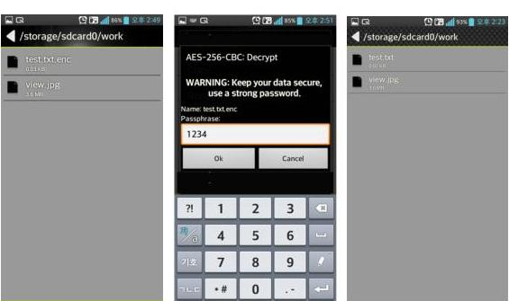
(a) 복호화 이전
(b) 복호화 암호 설정
(c) 복호화 이후
(a) before decryption
(b) decryption
(c) after decryption password set

그림 5. 파일의 복호화 화면
Fig. 5 File decryption screen

초기 화면에서 File Decrypt 메뉴를 선택하면 그림 5 의 (a)와 같이/storage/sdcard0/work 디렉토리의 파 일 리스트가 나타난다. 이중에 test.txt.enc 파일을 선 택하면 그림 5 의 (b)와 같이 복호화 화면이 나타나며 암호화 시 입력했던 패스워드를 다시 입력해야 된다. 복호화가 끝나면 그림 5 의 (c)와 같이 원래의 text.txt 파일이 생성된다.

## 3.3 파일 분쇄

파일 분쇄(File Shredding)는 데이터가 증거로 사 용되지 않도록 완벽하게 파괴하는 방법으로, 파일 분 쇄 기능을 사용한 후의 데이터는 복구가 불가능하다.

그림 6은 파일 분쇄 화면을 나타낸다. 초기 화면에 서 File Shred 메뉴를 선택하면 그림 6 의 (a)와 같이 /storage/sdcard0/work 폴더의 파일 리스트가 나타난 다. 이중에 파일 분쇄를 할 파일을 선택한다. 그림 6 의 (b)와 같이 view.jpg 파일을 선택하면 분쇄의 반복 횟수( 1 번, 3 번, 5 번)를 설정하는 화면이 나타난다. 원 하는 횟수를 선택한 후 Shred 버튼을 누르면 파일 분 쇄가 실행된다. 파일 분쇄가 끝난 후의 화면을 보면 그림 6 의 (c)와 같이 파일이 삭제됨을 알 수 있다.
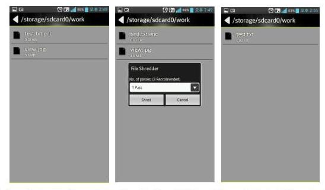
(a) 파일 분쇄 이전
b) 분쇄 옵션
(c) 파일 분쇄 이후
(a) before shredding
(b) shredding
(c) after shredding option

그림 6. 파일 분쇄 화면
Fig. 6 File shredding screen
삭제한 파일은/storage/sdcard0/work 폴더에 존재 했었다. 그림 7과 같이 Oxygen Forensic Suite를 실 행하여 이 폴더를 확인해 보니 파일이 완벽하게 삭제 되어 있음을 알 수 있었으며 이를 통하여 구현한 엔 티-포렌식 툴에서 파일 분쇄 기능이 제대로 동작하고 있음을 알 수 있다.
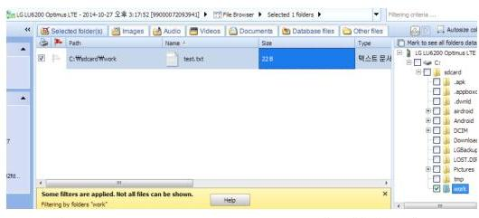

그림 7. Oxygen Forensic Suite의 파일 리스트 Fig. 7 Oxygen Forensic Suite's file list

### 3.4 정보 변조

정보 변조는 현재 사용 중인 스마트폰의 정보를 변 조하여 다른 사용자들에게 거짓 정보를 나타내는 것 을 말한다. 그림 8은 통화기록과 문자 메시지의 정보 변조 화면을 나타낸다. Call Log는 통화 기록을 나타 내고, SMS Message는 문자 메시지 기록을 나타낸다. Select Contact에서 원하는 전화번호를 선택한 후 Search 버튼을 누르면 검색 기록이 나타나게 된다.
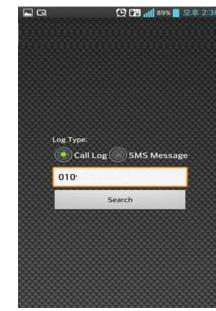

그림 8. 정보 변조 메인 화면
Fig. 8 Information spoofing main screen
그림 9는 통화 기록 변조 화면을 나타낸다. 전화를 받은 것인지, 전화를 건 것인지, 부재중 전화인지 등을 변조할 수 있으며, 통화 시간, 날짜도 변조할 수 있다.

그림 9의 (a)에서는 통화 기록이 2014년 9월 19일 오후 3 시 49 분인 것으로 나와 있다. 또한 부재중 전화 (Missed)인 것으로 되어있다. (b)는 (a)에서 Time 버 튼을 누른 후의 화면을 나타낸 것으로 원하는 시간을 설정할 수 있다. (c)는 (a)에서 Date 버튼을 누른 후의 화면으로, 특정 일자를 설정할 수 있다.

모두 수정한 후에는 (a)에서 Modify 버튼을 눌러야 수정된 통화기록이 저장된다. (d)는 수정한 내용이 반 영원 통화 기록을 나타낸다.

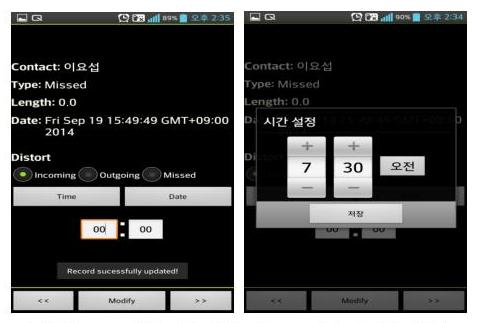
(a) 변조 이전 통화기록
(b) 시간 설정
(a) before spoofing call log
(b) time set
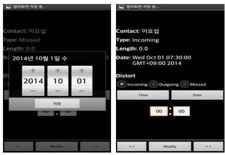
(c) 날짜 설정
(d) 변조 이후 통화기록
(c) date set
(d) after spoofing call log

그림 9. 통화 기록 변조 화면
Fig. 9 Call log spoofing screen
그림 10은 통화 기록 변조 전과 변조 후의 로그 파 일을 Oxygen Forensic Suite 로 추출하여 분석한 내 용으로 (a)는 원래 통화 날짜와 시간을 나타내고 (b) 는 변조된 통화 날짜와 시간이 나타남을 확인할 수 있었다.

그림 11은 문자 메시지의 변조 화면을 나타낸 것으 로, 문자 메시지의 송수신 날짜와 시간뿐만 아니라 내 용도 변조할 수 있다.
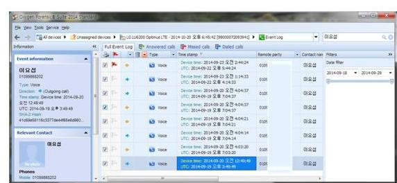
(a) 통화 기록 변조 이전
(a) before call log spoofing
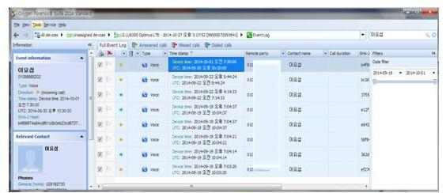
(b) 통화 기록 변조 이후
(b) after call log spoofing

그림 10. 통화 기록 변조 이전과 이후의 분석 화면
Fig. 10 Previous and next analysis screen of call log spoofing

그림 11의 (a)에서는 문자 메시지의 발생 시간이 2011년 11월 21일 오후 3시 24 분으로 나와 있다. (b) 에서는 문자 메시지의 발생 일자를 설정할 수 있으며, (c)에서는 문자 메시지의 발생 시간을 설정할 수 있 다. (d)에서는 문자 메시지의 내용을 수정할 수 있다.
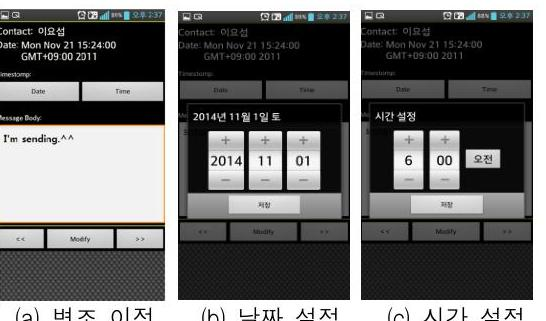
(a) 변조 이전
(b) 날짜 설정
(c) 시간 설정
(a) before spoofing
(b) date set
(c) time set
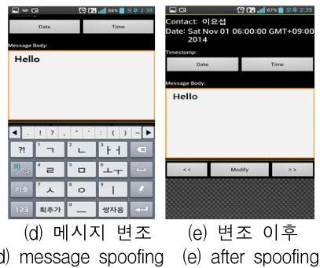
(d) 메시지 변조
(e) 변조 이후
(d) message spoofing
(e) after spoofing

그림 11. 문자 메시지의 변조 화면
Fig. 11 SMS message spoofing screen
모두 수정한 후에는 Modify 버튼을 눌러야 수정된

내용이 문자 메시지 로그 파일에 저장된다. (e)는 수 정한 내용이 반영된 문자 메시지 기록을 나타낸다.

그림 12는 문자 메시지의 변조 전과 변조 후의 로 그 파일을 Oxygen Forensic Suite 로 추출하여 분석 한 내용으로, (a)는 원래 문자 메시지의 발생 일자, 시 간과 내용을 나타내고 (b)는 변조된 문자 메시지의 발생 일자, 시간, 내용이 나타남을 확인할 수 있었다.
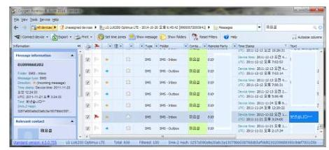
(a) 문자 메시지 변조 이전
(a) before SMS message spoofing
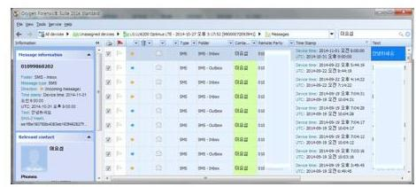
(b) 문자 메시지 변조 이후
(b) after SMS message spoofing

그림 12. 문자 메시지 변조 이전/이후 분석 화면
Fig. 12 Analysis screen of SMS message spoofing

## IV. 걸 론

본 논문에서는 현재 사용 중인 안드로이드 스마트 폰을 대상으로 구현한 앤티-포랜식 도구를 활용하여 파일 분쇄 기능을 통해 데이터를 완전히 삭제하거나 파일 암호화 기능을 통해 데이터를 숨기고, 데이터 변 조 기능을 통해 통화기록이나 문자 메시지의 내용을 변조하는 것이 가능함을 나타내었다.

구현한 앤티-포랜식 도구의 활용성을 검증하기 위 하여 상용 포랜식 도구인 Oxygen Forensic Suite 을 사용하여 실험을 실시한 결과 파일 분쇄 및 데이터 변 조에서 앤티-포랜식 기능이 원활하게 수행됨을 확인 할 수 있었다. 향후 연구방향은 데이터 은닉 분야에 스테가노그래피(Steganography) 기능을 추가로 개발

할 예정이다.

감사의 글
이 논문은 2013학년도 평택대학교 학술연구비의 지 원에 의하여 연구되었음.

## References

[1] B. Carrier, "Defining digital forensic examination and analysis tools," Int. J. of Digital Evidence, vol. 1, issue 4, 2002, pp. 1-10.
[2] M. Reith, C. Carr, and G. Gunsch, "An examination of digital forensic models," Int. J. of Digital Evidence. vol. 1, issue 3, Aug. 2010, pp. 1-12.
[3] H. Berghel, "Hiding Data, Forensics, and Anti-Forensics," Communications of the ACM, vol. 50, no. 4, 2007, pp. 15-20.
[4] R. Harris, "Arriving at an anti-forensics consensus: Examining how to define and control the anti-forensics problem," The $6^{\text {th }}$ Annual Digital Forensic Research Workshop, Lafayette, IN, Aug. 2006, pp. 44-49.
[5] P. Moon, "On the Availability of Anti-Forensic Tools for Android Smartphones," J. of the Korea Institute of Electronic Communication Sciences, vol. 8, no. 6, 2013, pp. 855-861.
[6] G. Lee, "A Study on Influence of Korea-EU FTA Ratification upon Legal Service and Forensic Investigation," J. of the Korea Institute of Electronic Communication Sciences, vol. 6, no. 5, 2011, pp. 684-688.
[7] G. Lee, "A Study on Casino Embezzlement Incident Analysis and Forensic Investigation Technology," J. of the Korea Institute of Electronic Communication Sciences, vol. 6, no. 1, 2011, pp. 105-110.

# 저자 소개 

## 문필주(Phil-Joo Moon)

1988년 숭실대학교 전자계산학과 졸업(공학사)
1991년 숭실대학교 대학원 컴퓨터 학과 졸업(공학석사)
1998년 숭실대학교 대학원 컴퓨터학과 졸업 (공학 박사)
1988년 2001년 ETRI 책임연구원(팀장)
2001년 현재 평택대학교 정보통신학과 교수
※ 관심분야 : 액세스망기술, 인터네트워킹, 모바일 애플리케이션, 네트워크보안, 모바일 포랜식

.

