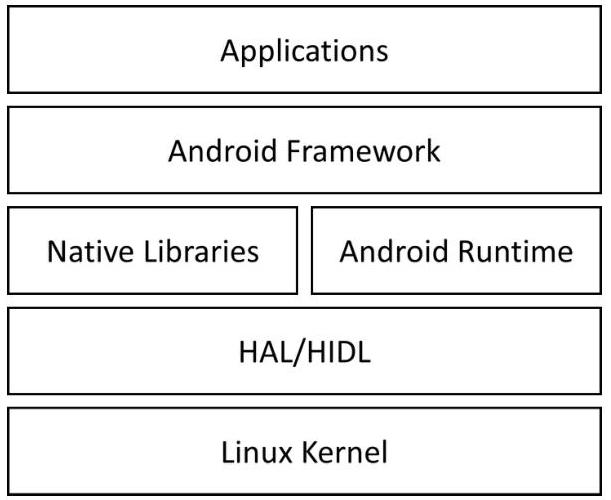
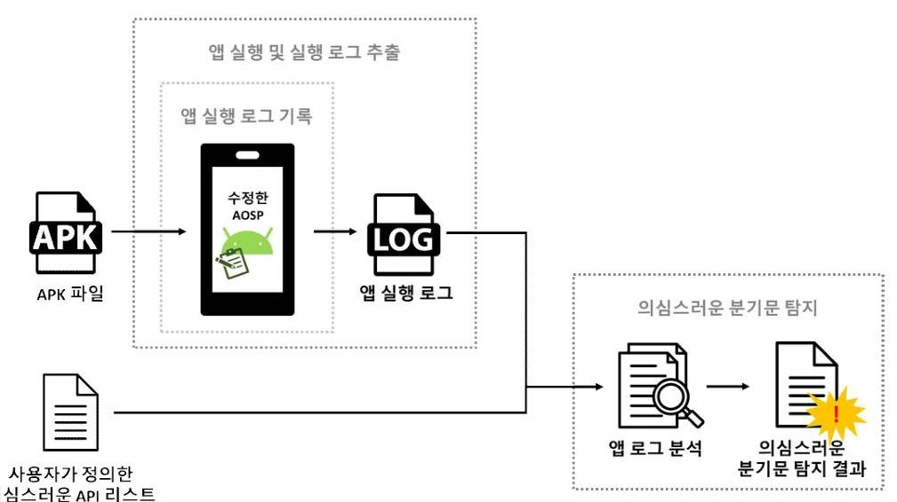
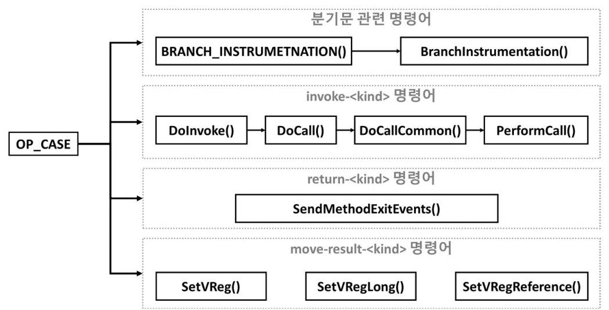
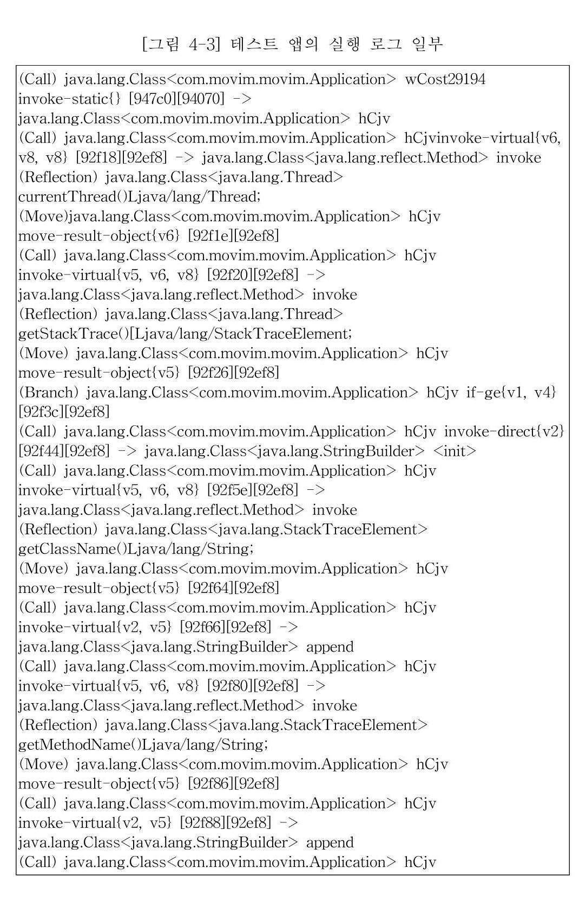

# (c)creative <br> commons 

C O M M O N S D E E D

저작자표시-비영리-변경금지 2.0 대한민국
이용자는 아래의 조건을 따르는 경우에 한하여 자유롭게

- 이 저작물을 복제, 배포, 전송, 전시, 공연 및 방송할 수 있습니다.

다음과 같은 조건을 따라야 합니다:

저작자표시. 귀하는 원저작자를 표시하여야 합니다.

비영리. 귀하는 이 저작물을 영리 목적으로 이용할 수 없습니다.

변경금지. 귀하는 이 저작물을 개작, 변형 또는 가공할 수 없습니다.

- 귀하는, 이 저작물의 재이용이나 배포의 경우, 이 저작물에 적용된 이용허락조건 을 명확하게 나타내어야 합니다.
- 저작권자로부터 별도의 허가를 받으면 이러한 조건들은 적용되지 않습니다.

저작권법에 따른 이용자의 권리는 위의 내용에 의하여 영향을 받지 않습니다.
이것은 이용허락규약(Legal Code)을 이해하기 쉽게 요약한 것입니다.
Disclaimer $\square$

석사학위 논문

안드로이드 앱 실행 로그 기반
의심스러운 분기문 탐지 도구

Detecting Suspicious Branch using App Execution Log

2022년 12월

숭실대학교 대학원

컴퓨터학과

이 수 민

.

석사학위 논문

안드로이드 앱 실행 로그 기반
의심스러운 분기문 탐지 도구

Detecting Suspicious Branch using App Execution Log

2022년 12월

숭실대학교 대학원

컴퓨터학과

이 수 민

석사학위 논문

안드로이드 앱 실행 로그 기반
의심스러운 분기문 탐지 도구

지도교수 홍 지 만

이 논문을 석사학위 논문으로 제출함

2022년 12월

# 숭실대학교 대학원 

컴퓨터학과

이 수 민

이 수 민 의 석 사 학 위 논 문 을 인 준 함

| 심 사 | 위 | 원 | 장 | 김 철 홍 | 인 |
| :-- | :-- | :-- | :-- | :-- | :-- |
| 심 사 | 위 | 원 | 홍 지 만 | 인 |  |
| 심 사 | 위 | 원 | 김 봉 재 | 인 |  |

2022년 12월

# 숭실대학교 대학원

# 감사의 글 

2년이란 짧다면 짧고 길다면 긴 시간 동안 주위의 많은 분의 도움으로 석사 생활을 무사히 마무리할 수 있었습니다. 이 기회를 빌려 저에게 도 움을 주신 분들에게 감사의 마음을 전하고자 합니다.

먼저 석사과정 동안 부족한 부분을 지도해주신 홍지만 교수님께 감사 드립니다. 지도해주신 대로 앞으로도 바른길로 나아가도록 노력하겠습니 다. 또한, 논문 심사를 위해 시간을 내어 조언해주신 김철홍 교수님과 김 봉재 교수님께도 감사드립니다.

석사과정 중 많은 시간을 함께한 연구실 선후배분들에게도 감사의 말 씀을 드립니다. 연구실 생활에 적응하는 데 도움을 준 이주석, 김규호, 이승연 선배님들께 감사드립니다. 가장 오랜 시간 함께하며 의지하였던 동기 김아정, 김재섭에게 감사드립니다. 그리고 앞으로 연구실을 이끌어 줄 박민호 후배님에게도 감사드립니다. 마지막으로, 항상 저를 응원하고 지지해준 가족과 친구들에게 감사의 마음을 전합니다. 다른 연구실이었 지만 2년 동안 같이 석사 생활을 하며, 기뻤던 순간을 함께 축하하고 힘 들었던 순간에 많이 의지하였던 안수진 언니에게 이 자리를 빌려 감사의 마음을 전합니다.

이제 2년간의 석사 생활을 마무리하고 새로운 시작을 하려고 합니다. 저에게 도움을 주신 분들에게 감사하는 마음을 잊지 않고, 저도 다른 분 들에게 도움을 베푸는 사람이 되겠습니다.

감사합니다.

# 목 차 

국문초록 ..... v
영문초록 ..... vi
제 1 장 서 론 ..... 1
1.1 연구 배경 ..... 1
1.2 연구 목적 및 내용 ..... 2
1.3 논문 구성 ..... 3
제 2 장 관련 연구 ..... 4
2.1 로직 발 탐지 ..... 4
2.2 의심스러운 분기문 탐지 ..... 5
2.3 로직 발과 의심스러운 분기문 탐지 도구 비교 ..... 6
2.4 안드로이드 플랫폼 ..... 8
2.4.1 안드로이드 오픈 소스 프로젝트 ..... 8
2.4.2 안드로이드 런타임 ..... 8
제 3 장 안드로이드 앱 실행 로그 기반 의심스러운 분기문 탐지 ..... 10
3.1 의심스러운 분기문 정의 ..... 11
3.2 앱 실행 로그 기록 ..... 12
3.3 앱 실행 및 실행 로그 추출 ..... 18
3.4 의심스러운 분기문 탐지 ..... 21

제 4 장 실 험 ..... 23
4.1 실험 환경 ..... 23
4.2 실험 결과 ..... 23
제 5 장 결 론 ..... 33
참고문헌 ..... 35

# 표 목 차 

[표 2-1] 기존 도구의 탐지 방법 ..... 6
[표 2-2] 기존 도구와 제안한 도구의 코드 난독화 기법에 따른 의심스러 운 분기문 탐지 가능 여부 ..... 7
[표 3-1] TrigDB에 존재하는 트리거 종류 ..... 11
[표 3-2] 분기문 관련 달빅 바이트 코드 명령어 ..... 13
[표 3-3] 메소드 호출 관련 달빅 바이트 코드 명령어 ..... 14
[표 3-4] 태그별 기록 데이터 종류 ..... 15
[표 3-5] 앱 실행 및 앱 종료, 실행 로그 추출 알고리즘 ..... 18
[표 3-6] 앱 실행 및 종료에 사용된 adb 명령어 ..... 18
[표 3-7] Monkey 이벤트 종류 ..... 19
[표 3-8] adb logcat의 명령어 옵션 종류 ..... 20
[표 3-9] 앱 실행 로그 기반 의심스러운 분기문 탐지 알고리즘 ..... 22
[표 4-1] Google Pixel 4a 사양 ..... 23
[표 4-2] APK에 존재하는 트리거 코드 ..... 29
[표 4-3] APK별 의심스러운 분기문 탐지 결과 ..... 31
[표 4-4] 앱 실행 시간과 Monkey 이벤트 발생 횟수별 탐지 성능 비교 ..... 32

# 그 림 목 차 

[그림 2-1] AOSP 구성 요소 ..... 8
[그림 3-1] 제안하는 도구의 동작 흐름 ..... 10
[그림 3-2] android-10.0.0_r47 버전 AOSP의 달빅 바이트 코드 명령어 처리 흐름 ..... 16
[그림 4-1] 리플렉션이 사용된 의심스러운 분기문의 소스 코드 ..... 24
[그림 4-2] 앱을 실행하는 동안 발생된 Monkey 이벤트 로그 ..... 24
[그림 4-3] 테스트 앱의 실행 로그 일부 ..... 26
[그림 4-4] 의심스러운 분기문과 관련 메소드 호출 ..... 27
[그림 4-5] 테스트 앱에 정의된 hCjv 메소드 내부 콜스택 ..... 27

# 국문초록 

## 안드로이드 앱 실행 로그 기반 <br> 의심스러운 분기문 탐지 도구

이 수 민
컴퓨터학과
숭실대학교 대학원

로직 밤은 악성 행위를 트리거하는 분기문에서만 악성 행위를 수행하 기 때문에 효율적으로 로직 밤을 탐지하기 위해서는 트리거가 되는 분기 문을 찾는 것이 필수적이다. 기존의 트리거 및 의심스러운 분기문 탐지 도구는 정적 분석을 기반으로 악성 행위를 트리거하는 분기문을 찾기 때 문에 리플렉션이 사용되면 해당 분기문을 제대로 찾지 못한다. 따라서, 본 논문에서는 앱에 리플렉션이 사용되어도 의심스러운 분기문을 탐지할 수 있는 안드로이드 앱 실행 로그 기반 의심스러운 분기문 탐지 도구를 제안한다. 제안한 도구는 리플렉션으로 호출된 메소드를 포함하여 앱이 실행되고 있는 동안 호출된 메소드와 분기문의 정보를 확인할 수 있으 며, 분기문과 관련된 메소드 호출을 파악하여 의심스러운 분기문을 탐지 한다. 실험을 통해, 제안한 도구로 리플렉션 사용과 관계없이 의심스러운 분기문을 탐지할 수 있음을 보인다.

# ABSTRACT 

## Detecting Suspicious Branch using App Execution Log

## LEE SU-MIN <br> Department of Computer Science and Engineering <br> Graduate School of Soongsil University

Since logic bomb performs malicious actions only in branches that trigger malicious actions, it is essential to find trigger branch statements in order to efficiently detect logic bomb. Existing trigger and suspicious branch detection tools find branches that trigger malicious behavior based on static analysis, so when reflection is used, they fail to find the branch statement properly. Therefore, in this thesis, we propose an Android app execution log-based suspicious branch detection tool that can detect suspicious branches even when reflection is used in the app. The proposed tool can check information on branches and methods called including methods called by reflection, while the app is running. And it detects suspicious branches by identifying method calls related to branch statements. Through experiments, we show that the proposed tool can detect suspicious branches regardless of the use of reflection.

# 제 1 장 서 론 

## 1.1 연구 배경

구글의 안드로이드는 2012년 3월에 $23.81 \%$ 로 전세계 모바일 운영체제 시장에서 가장 높은 점유율을 차지하였으며, 꾸준히 시장 점유율이 확대 되어 2016년 이후로는 매년 $70 \%$ 이상의 시장 점유율을 차지하고 있다 [20]. 안드로이드 운영체제가 높은 시장 점유율을 차지하고 있는 만큼 안 드로이드 플랫폼을 대상으로 하는 악성 앱이 끊임없이 등장하고 있다 [10].

안드로이드 앱 스토어인 구글 플레이 스토어(Google Play Store)에서 는 구글 플레이 프로텍트(Google Play Protect)[11]를 제공해 자체적으로 앱과 디바이스에 위험한 동작이 있는지 검사하여 설치된 앱이 안전한지 확인한다. 또한, 반복적으로 정책을 위반하는 개발자 계정을 단속하고, 잠재적으로 유해한 앱(Potentially Harmful Applications)이나 부적절한 콘텐츠를 포함한 앱 등을 차단하기 위해 머신 러닝 모델이나 정적 및 동 적 분석을 통해 지속적으로 의심스러운 앱을 발견하고 구글 플레이 스토 어에서 삭제하고 있다[8]. 이처럼 구글은 안드로이드 사용자를 보호하기 위해 다양한 노력을 하고 있지만, 안드로이드 악성 앱은 난독화나 분석 회피 기법 등을 사용해 구글 플레이 프로텍트와 같은 악성 앱 분석 환경 에서 자신의 악성 행위를 숨겨 악성 앱 탐지를 어렵게 하고 있다.

분석 회피 기법 중 로직 밤(Logic bomb)은 특정 조건을 만족한 경우 에만 악성 행위를 수행하는 악성 코드로, 악성 행위를 유발하는 분기문 에서 사용된 조건식을 트리거(Trigger)라고 한다. 로직 밤을 탐지하기 위해 안드로이드 앱 내에 존재하는 수많은 분기문을 모두 분석하는 것은 시간과 비용적인 측면에서 효율적이지 않다. 따라서, 앱에 존재하는 분기

문 중에서 트리거일 수 있는 의심스러운 분기문을 찾아 분석할 분기문의 개수를 줄인다면 트리거를 탐지하기 위한 시간과 비용을 줄일 수 있다.

로직 밤과 의심스러운 분기문을 탐지하기 위해 다양한 연구가 진행되 고 있다. 기존 연구[1-5]는 정적 분석을 기반으로 분석 지점을 결정하기 때문에 리플렉션 등과 같이 런타임에 동적으로 결정되는 정보가 앱에 포 함되면 의심스러운 분기문을 제대로 탐지하지 못한다. 리플렉션 (Reflection)은 런타임에 클래스와 메소드 등의 동작을 검사하거나 수정 할 수 있는 자바 API로, 실제로 호출되는 클래스나 메소드 등이 런타임 에 결정된다. 이러한 리플렉션의 특징은 시스템을 개발하는 데 있어 유 연성을 제공하지만, 악성 앱에 악용되어 악성 행위를 숨기는 데 사용될 수 있다.

# 1.2 연구 목적 및 내용 

본 논문에서는 안드로이드 앱에 리플렉션이 사용되어도 앱의 실행 로 그를 바탕으로 의심스러운 분기문을 탐지할 수 있는 도구를 제안한다. 제안한 도구는 앱이 실행되는 동안 실행된 분기문의 정보와 사용자 정의 메소드와 자바 API, 리플렉션으로 호출된 메소드 등 호출된 메소드의 정 보를 로그에 기록한다. 실행 로그에는 실행된 달빅 바이트 코드 명령어 (Dalvik Bytecode)를 호출한 메소드의 정보와 달빅 바이트 코드 명령어 를 통해 호출된 메소드의 정보, 달빅 바이트 코드 명령어 정보가 기록된 다. 분기문과 메소드 호출 간의 관계를 파악하기 위해 달빅 바이트 코드 의 레지스터 정보를 사용한다. 그리고 사용자가 작성한 의심스러운 API 리스트 종류를 확인하고, 실행 로그에 기록된 정보를 분석하여 분기문과 관련된 메소드 호출을 파악하여 의심스러운 API 리스트에 존재하는 API가 분기문에 사용된 경우 해당 분기문을 의심스러운 분기문으로 탐

지한다. 실험을 통해 제안한 도구가 리플렉션이 사용된 앱에서도 의심스 러운 분기문을 탐지할 수 있음을 보이고, 트리거가 존재하는 12 개의 실 제 악성 앱에 존재하는 의심스러운 분기문을 탐지한다.

# 1.3 논문 구성 

본 논문의 구성은 다음과 같다. 2 장에서는 기존에 로직 밤 및 의심스 러운 분기문 탐지 관련 연구와 안드로이드 플랫폼에 대해 설명한다. 3장 에서는 의심스러운 분기문의 정의와 제안한 도구의 설계 및 구현 방법에 대해 설명한다. 4장에서는 리플렉션이 사용된 앱을 대상으로 실험하여 제안한 도구의 유효성을 보이고 트리거가 포함된 실제 악성 앱 데이터셋 에서 의심스러운 분기문 탐지 성능을 확인한다. 마지막으로 5장에서 결 론을 맺는다.

# 제 2 장 관련 연구 

## 2.1 로직 밤 탐지

로직 밤과 악성 행위 회피 기술을 탐지하기 위해 다양한 연구가 진행 되고 있다. Frantantonio 등은 [1]에서 안드로이드 앱에 존재하는 로직 밤을 자동으로 식별하는 정적 분석 도구인 TriggerScope를 제안하였다. 정적 심볼릭 실행(Static Symbolic Execution)을 사용해 SMS과 시간, 위치와 관련된 클래스나 시스템 API를 식별하여 제어 흐름 그래프를 생 성한다. 그리고 제어 흐름 그래프를 통해 조건간 제어 의존성을 분석하 여, 의심스러운 행위를 하는 조건문을 찾아 해당 조건문이 민감한 기능 을 실행하는지 확인하여 로직 밤을 탐지한다. 그러나, TriggerScope는 SMS와 시간, 위치 관련된 트리거만 탐지할 수 있다.
[2]에서 Bello 등은 분기문에서 악성 행위를 회피하는 악성 앱에서 해 당 분기문의 내부 코드(Guarded Code)를 실행되게 하는 시스템인 ARES를 제안하였다. ARES는 악성 행위 회피에 사용되는 분기문을 탐 지하기 위해 주어진 악성 앱과 조건 리스트를 가지고, 데이터 흐름 분석 을 통해 악성 행위 회피 가능성이 있는 분기문을 찾는다. 이때 의존성 분석을 위해 사용되는 WALA는 정적 분석을 기반으로 하기 때문에 리 플렉션이나 다이나믹 코드 로딩(Dynamic Code Loading)이 사용되었을 때 한계를 갖는다.
[3]에서 Zhao 등은 안드로이드 앱에서 입력값 유효성 검증(Input Validation)을 통해 의심스러운 행위를 탐지하는 정적 분석 도구인 InputScope를 제안하였다. InputScope는 정적 오염 분석(Static Taint Analysis)을 통해 특정 시스템 API로 입력받은 값이 분기문에서 문자열 비교에 사용되는지 확인한다. 만약 입력값이 문자열 비교에 사용된다면,

백워드 슬라이싱(Backward Slicing)을 통해 문자열 비교를 하는 데 사용 된 문자열을 찾아, 사용자 입력값이 해당 메소드 내 분기문에서 비교에 사용된 횟수와 사용자 입력값으로 분기문의 조건을 만족시켰을 때 내부 코드에서 분기문이 몇 번이나 수행되는지 확인하여 의심스러운 행위를 탐지한다. 지정된 시스템 API를 사용하지 않은 입력이나 분기문에 대해 서는 의심스러운 행위를 탐지할 수 없는 한계를 갖는다.

# 2.2 의심스러운 분기문 탐지 

악성 행위를 트리거하는 분기문을 찾기 위해 다양한 연구가 진행되고 있다. [4]에서 Samhi 등은 정적 분석과 이상 탐지(Anomaly Detection)를 통해 안드로이드 앱에 존재하는 의심스러우면서 숨겨진 민감한 작업 (SHSOs, Suspicious Hidden Sensitive Operations)을 탐지하는 Difuzer 를 제안하였다. Difuzer는 바이트 코드 구현(Bytecode Implementation)과 프로시저 간 정적 오염 추적(Taint Tracking)을 통해 분석할 분기문 후 보를 선택해 트리거를 추출한다. 추출한 트리거를 만족했을 때 수행하는 내부 코드에서 민감한 메소드의 호출 횟수와 조건에 사용된 파라미터 사 용 여부 그리고 분기 간 동작 차이 등 9 가지 특징을 추출해 SVM(Support Vector Machine)을 통해 비정상적인 트리거를 탐지한다.
[5]에서 Xiaorui 등은 정적 분석과 머신 러닝을 기반으로 숨겨진 민감 한 작업(HSOs, Hidden Suspicious Operations)을 탐지하는 HSOMINER 를 제안하였다. HSOMINER는 서로 다른 패키지에서 진입점을 탐색해 각 진입점에서부터 시작해 도달할 수 있는 모든 경로를 포함하는 제어 흐름 그래프를 생성한다. 안드로이드 컴포넌트의 라이프사이클과 컴포넌 트 간의 통신, 비동기 태스크 정보를 가지고 있는 제어 흐름 그래프를 바탕으로 잠재적으로 의심스러운 분기문을 찾는다. 그리고 해당 분기문

구조를 확인해 분기문에서 두 경로 사이의 행동 차이와 조건문과 경로와 의 관계, 조건문과 이벤트 간의 관계와 관련된 7 개의 특징을 찾고, SVM 을 통해 조건문에서 HSO가 존재하는지 찾는다.

# 2.3 로직 밤과 의심스러운 분기문 탐지 도구 비교 

기존 도구의 로직 밤 및 의심스러운 분기문 탐지 방법은 [표 2-1]과 같다. 기존 도구는 정적 분석을 수행해 특정 API나 입력값을 바탕으로 제어 흐름 그래프를 생성하고 심볼릭 실행이나 오염 분석을 통해 트리거 가 될 수 있는 의심스러운 분기문 지점을 찾는다. 그리고 데이터와 분기 문 간의 의존성 분석을 통해 해당 분기문이 로직 밤을 트리거하는 분기 문인지 판단한다. 머신 러닝을 통해 의심스러운 분기문을 찾는 도구는 다른 도구와 달리 기존에 알려지지 않은 분기문을 탐지할 수 있다.
[표 2-1] 기존 도구의 탐지 방법

| 도구 | 접근 방법 | 사용 기법 |
| :--: | :--: | :--: |
| TriggerScope | 정적 | 심볼릭 실행, 제어 흐름 그래프, 제어 의존성 분석 |
| ARES | 정적, 동적 | 데이터 흐름 분석, 조건문-데이터의 의존성 분석 |
| InputScope | 정적 | 오염 분석, 입력값 문자열 비교, 백워드슬라이싱 |
| Difuzer | 정적 | 바이트코드 구현, 오염 추적, SVM |
| HSOMINER | 동적 | 제어 흐름 그래프, 데이터 의존성 분석, SVM |

로직 밤과 의심스러운 분기문을 탐지하는 기존 도구들과 제안한 도구 의 차이를 비교한 표는 [표 2-2]와 같으며, 접근 방법과 코드 난독화 기 법 중 식별자 변환(Renaming)과 암호화(Encryption), 리플렉션이 앱에 사용되었을 때 의심스러운 분기문의 탐지 가능 여부를 나타낸다. 기존 도구들은 정적 분석을 기반으로 의심스러운 분기문을 탐지하기 때문에 리플렉션 등과 같은 런타임에 결정되는 정보가 포함되어 있으면 의심스 러운 분기문을 제대로 탐지하지 못한다. 제안한 도구는 앱의 실행 로그 를 바탕으로 의심스러운 분기문을 탐지하기 때문에 식별자 변환, 암호화 가 사용되더라도 호출된 메소드 흐름을 쉽게 파악할 수 있으며, 리플렉 션으로 호출된 메소드도 확인할 수 있기 때문에 리플렉션이 사용된 앱에 서도 의심스러운 분기문을 탐지할 수 있다.
[표 2-2] 기존 도구와 제안한 도구의 코드 난독화 기법에 따른 의심스러운 분기문 탐지 가능 여부

| 도구 | 접근 방법 | 코드 난독화 기법에 따른 <br> 의심스러운 분기문 탐지 가능 여부 |  |  |
| :--: | :--: | :--: | :--: | :--: |
|  |  | 식별자 변환 | 암호화 | 리플렉션 |
| TriggerScope | 정적 | 0 | 0 | X |
| ARES | 정적, 동적 | 0 | 0 | X |
| InputScope | 정적 | X | 0 | X |
| Difuzer | 정적 | 0 | 0 | X |
| HSOMINER | 정적 | 0 | 0 | X |
| 제안한 도구 | 동적 | 0 | 0 | 0 |

# 2.4 안드로이드 플랫폼 

### 2.4.1 안드로이드 오픈 소스 프로젝트

안드로이드 오픈 소스 프로젝트(AOSP, Android Open Source Project)[12]는 구글에서 관리하는 모바일 디바이스를 위한 오픈 소스 운 영체제이다. AOSP의 구성 요소는 [그림 2-1]과 같으며, 개발자는 각 구 성 요소를 수정하여 운영체제를 커스텀할 수 있다. 또한, 구글은 AOSP 를 탑재한 디바이스의 호환성을 보장하기 위해 최신 버전의 안드로이드 와 호환되기 위해 충족해야 하는 요구사항을 나타내는 호환성 정의 문서 (CDD, Compatibility Definition Document)[13]를 제공한다.

[그림 2-1] AOSP 구성 요소

### 2.4.2 안드로이드 런타임

안드로이드 앱의 설치 파일인 APK는 앱에 작성된 자바 코드를 달빅 바이트 코드로 변환한 classes.dex 파일과 앱의 필수 정보를 포함하고 있는 AndroidManifest.xml, 앱 실행에 필요한 리소스 파일 등으로 구성 되어 있다. classes.dex 파일은 안드로이드 런타임(ART, Android Runtime)[14]에서 앱을 실행하는 데 사용된다.

안드로이드 런타임은 Ahead-of-Time(AOT) 컴파일러와 Just-In-Time(JIT) 컴파일러를 혼합하여 사용하는 안드로이드 런타임 환경이다. 안드로이드 런타임는 앱을 처음 설치할 때 어떠한 코드도 컴 파일하지 않고 인터프리터로 실행하고, 앱 설치 이후 자주 실행되는 메 소드에 대해 프로파일링 정보를 수집한다. 메소드가 일정 횟수 이상 실 행되면 랏 메소드(Hot method)로 분류되어 JIT 컴파일러로 컴파일되고 네이티브 코드는 JIT 코드 캐시에 저장된다. 안드로이드 런타임는 앱을 더 빠르게 실행하기 위해, 디바이스가 유휴 상태이거나 충전 중일 때 JIT 컴파일된 메소드의 네이티브 코드를 메모리에 직접 로드하여 AOT 컴파일러로 컴파일한다.

# 제 3 장 안드로이드 앱 실행 로그 기반 

## 의심스러운 분기문 탐지

제안한 도구는 앱을 실행하는 동안 기록된 분기문과 호출되는 메소드 정보를 분석해 의심스러운 분기문을 탐지한다. 제안한 도구의 전반적인 동작 흐름은 [그림 3-1]과 같으며, 제안한 도구는 의심스러운 분기문을 탐지하기 위해 앱의 실행 로그에 분기문과 메소드 정보를 기록하는 모듈 과 안드로이드 디바이스에서 자동으로 앱을 실행하고 실행 로그를 추출 하는 모듈, 사용자가 작성한 의심스러운 API 리스트를 바탕으로 추출한 실행 로그를 분석하여 의심스러운 분기문을 탐지하는 모듈로 구성된다. 의심스러운 API 리스트에는 사용자가 특정 메소드가 분기문에 사용됐는 지 확인하고자 하는 자바 API의 메소드명을 작성한다.

[그림 3-1] 제안하는 도구의 동작 흐름

# 3.1 의심스러운 분기문 정의

의심스러운 분기문의 특징을 확인하기 위해 Samhi 등이 수집한 트리 거가 포함된 실제 안드로이드 악성 앱 데이터셋인 TrigDB[6]의 66 개 앱 을 분석하였다. [표 3-1]은 TrigDB에서 사용된 메소드의 종류와 트리거 에 사용된 횟수를 보여준다. TrigDB에는 SMS와 Time과 관련된 트리거 가 존재하며 악성 행위를 수행하기 전에 SMS와 관련된 트리거에는 String 클래스의 startsWith(), contains(), matches()와 같은 문자열 확인 메소드가 사용되며, Time과 관련된 트리거에는 현재 시간을 확인하는 System 클래스의 currentTimeMillis()나 시간 비교를 위해 String 클래 스의 toString()과 matches()가 사용되는 것을 확인하였다. [표 3-1] TrigDB에 존재하는 트리거 종류

|  트리거 종류 | 트리거에 사용된 메소드 | 사용 횟수  |
| --- | --- | --- |
|  SMS | String.contains() | 29  |
|   | String.startsWith() | 16  |
|   | String.equals() | 2  |
|  SMS/Time | String.matches() | 3  |
|  Time | System.currentTimeMillis() | 13  |
|   | localSharedPreferences.getInt() | 2  |

TrigDB를 분석한 결과, 트리거가 되는 분기문는 특정 메소드 호출과 관련된 것을 확인하였다. 이와 같이 본 논문에서는 의심스러운 분기문을 특정 메소드 호출이 조건식에 사용되는 분기문으로 정의하며, 상수값 비 교 등 메소드 호출이 사용되지 않은 분기문은 의심스러운 분기문으로 판 단하지 않는다.

# 3.2 앱 실행 로그 기록 

안드로이드 런타임의 컴파일 옵션은 기본적으로 인터프리터 방식과 JIT 컴파일 방식이 활성화되어 있다. JIT 컴파일된 코드는 네이티브 코 드로 저장되어 있으며, 자주 사용되는 메소드의 경우 AOT 컴파일러를 통해 컴파일되기 때문에 JIT 컴파일 옵션을 비활성화하면 인터프리터로 만 안드로이드 앱을 실행할 수 있다. 앱을 인터프리터로만 실행한다면 현재 실행 중인 메소드의 DEX 파일에 존재하는 달빅 바이트 코드를 확 인할 수 있다. 따라서, 제안한 도구는 AOSP를 수정하여 JIT 컴파일 옵 션을 비활성화한다.

안드로이드 런타임는 달빅 가상 머신(Dalvik Virtual Machine)과 같은 레지스터 기반 가상 머신이다. 달빅 바이트 코드는 연산, 메소드 호출, 메소드 반환 값 및 분기문 등을 나타내는 총 256 개의 명령어가 있으며, 각 명령어는 opcode와 인자로 사용되는 레지스터, 오프셋으로 구성되어 있다.

분기문과 관련한 달빅 바이트 코드 명령어 중 if와 관련된 명령어는 두 레지스터의 값을 비교하거나, 주어진 레지스터 값과 0을 비교하여 결 과에 따라 특정 명령어의 위치로 분기하는 명령어이다. switch와 관련된 달빅 바이트 코드 명령어는 특정 정수 범위(packed-switch)나 정렬된 값 (sparse-switch)을 사용해 제공된 레지스터와 비교하여 새 명령어로 이 동하거나 일치하는 항목이 없으면 그 다음 명령어로 이동하는 명령어이 다. goto와 관련된 달빅 바이트 코드 명령어는 지정된 명령어로 무조건 적으로 점프하는 명령어로, while문과 for문과 같은 반복문에서 사용된 다. 분기문과 관련된 달빅 바이트 코드 명령어의 opcode와 사용되는 레 지스터 표현 방식은 [표 3-2]와 같다.

[표 3-2] 분기문 관련 달빅 바이트 코드 명령어

| 종류 | 달빅 바이트 코드 명령어 |  |
| :--: | :--: | :--: |
|  | opcode | 레지스터 |
| if | if-eq | vA, vB |
|  | if-ne |
|  | if-1t |
|  | if-ge |
|  | if-gt |
|  | if-le |
|  | if-eqz |
|  | if-nez |
|  | if-1tz |
|  | if-gez |
|  | if-gtz |
|  | if-lez |
| switch | packed-switch | vAA |
|  | sparse-switch |
| goto | goto | - |
|  | goto/16 |  |
|  | goto/32 |  |

메소드 호출과 관련된 달빅 바이트 코드 명령어는 invoke-<kind>, return-<kind>, move-result-<kind> 명령어가 있다. invoke-<kind> 명 령어는 메소드를 호출하는 명령어로 호출되는 메소드의 종류(static, private, constructor, final 등)에 따라 사용하는 opcode가 달라진다.

return-<kind> 명령어는 주어진 레지스터에 메소드의 리턴값을 저장하 는 명령어이다. move-result-<kind> 명령어는 가장 최근 invoke-<kind> 명령어로 호출된 메소드의 결과를 주어진 레지스터로 저 장하는 명령어이다. 메소드 호출과 관련된 달빅 바이트 코드 명령어의 opcode와 사용되는 레지스터 표현 방식은 [표 3-3]과 같다.
[표 3-3] 메소드 호출 관련 달빅 바이트 코드 명령어

| 종류 | 달빅 바이트 코드 명령어 |  |
| :--: | :--: | :--: |
|  | opcode | 레지스터 |
| invoke | invoke-virtual | $\{\mathrm{vC}, \mathrm{vD}, \mathrm{vE}, \mathrm{vF}, \mathrm{vG}\}$ |
|  | invoke-super |  |
|  | invoke-direct |  |
|  | invoke-static |  |
|  | invoke-static |  |
|  | invoke-interface |  |
|  | invoke-virtual/range | $\{$ vCCCC .. vNNNN\} |
|  | invoke-super/range |  |
|  | invoke-direct/range |  |
|  | invoke-static/range |  |
|  | invoke-interface/range |  |
| return | return-void | - |
|  | return | vAA |
|  | return-wide |  |
|  | return-object |  |
| move- <br> result | move-result |  |
|  | move-result-wide |  |
|  | move-result-object |  |

앱 실행 로그에는 태그에 따라 기록되는 정보는 [표 3-4]와 같다. 분기 문과 관련된 정보는 Branch 태그를 이용하여 로그에 기록하고, 호출된 메소드와 관련된 정보는 달빅 바이트 코드 명령어의 종류에 따라 Invoke와 Return, Move 태그로 분류하여 기록한다. 리플렉션을 통해 호 출된 메소드는 Reflection 태그를 사용해 기록한다. 분석하는 앱의 실행 정보만을 기록하기 위해 제안한 도구는 디바이스에 설치된 앱에 대해서 만 분기문과 메소드 관련 정보를 로그에 기록한다.
[표 3-4] 태그별 기록 데이터 종류

| 기록 태그 | 기록 데이터 종류 | 설명 |
| :--: | :--: | :--: |
| Branch, Call, Move, Return | caller_class | 호출하는 메소드의 클래스 |
|  | caller_method | 호출하는 메소드의 메소드명 |
|  | opcode | 달빅 바이트 코드 명령어의 opcode |
|  | registers | 달빅 바이트 코드 명령어에 사용된 레지스터 |
|  | cur_instruction_addr | 현재 실행 중인 명령어 주소 |
|  | caller_method_addr | 호출하는 메소드 주소 |
| Call | called_class | 호출되는 메소드의 클래스 |
|  | called_method | 호출되는 메소드의 메소드 명 |
| Reflection | reflective_method_class | 리플렉션으로 호출되는 메소드의 클래스 |
|  | reflective_method | 리플렉션으로 호출되는 메소드의 메소드명 |

caller와 callee의 class와 method는 현재 실행중인 메소드의 정보를 가 지고 있는 ShadowFrame 객체의 내부 메소드인 GetMethod()를 통해 메 소드 정보를 확인할 수 있는 ArtMethod 객체를 얻어 GetDeclaringClass(), GetName()을 사용해 확인한다. opcode와 사용된 레지스터는 DEX 파일 내에서 현재 실행중인 명령어를 보여주는 DumpString()을 사용해 확인한다. 현재 명령어 실행 주소와 호출하는 메소드의 주소는 ArtMethod 객체에서 클래스 메소드의 바이트 코드 오 프셋 주소를 나타내는 GetCodeItemOffset()과 메소드의 바이트 코드를 나타내는 배열에서 현재 실행되고 있는 명령어의 인덱스를 나타내는 dex_pc를 사용해 확인한다. 관련 정보 기록 시 분석하고자 하는 앱에 대 한 실행 정보만을 기록하기 위해 현재 안드로이드 디바이스에 설치된 앱 에 대해서만 분기문과 호출되는 메소드 관련 정보를 기록하도록 한다. 인터프리터를 사용하여 안드로이드 앱을 실행하면 기록하고자 하는 달빅 바이트 코드 명령어는 [그림 3-2]과 같은 과정을 통해 실행된다.

[그림 3-2] android-10.0.0_r47 버전 AOSP의 달빅 바이트 코드 명령어 처리 흐름

AOSP의 인터프리터는 ExecuteSwitchImplCpp()에서 현재 실행 중인 달빅 바이트 코드 명령어를 확인하고 opcode에 따라 핸들러 메소드를 호출한다. 분기문을 나타내는 if와 switch, goto 관련 명령어는 핸들러 메소드 내에서 BRANCH_INSTRUMENTATION 매크로를 호출한다. 해 당 매크로는 BranchInstrumentation()을 호출하기 때문에 BranchInstrumentation() 에서 호출하는 메소드의 클래스와 메소드명, 분 기문의 종류, 달빅 바이트 코드 명령어에 사용된 레지스터 등을 확인해 로그에 기록할 수 있다.

메소드를 호출하는 invoke-<kind> 명령어는 DoInvoke()를 통해 호출 된 메소드의 정보를 확인한다. DoInvoke()는 DoCall()를 통해 호출할 메 소드의 인자를 확인하고, DoCall()은 DoCallCommon()을 통해 호출된 메 소드의 실행 방식과 메소드의 접근 제어 키워드, 인자 타입 등 메소드 정보를 확인한다. 그리고 PerformCall()을 통해 메소드를 실행한다. 따라 서, DoCallCommon()에서 호출하는 메소드와 호출되는 메소드와 관련 정보를 확인하고 로그에 기록할 수 있다.
return-<kind> 및 move-result-<kind> 명령어는 각 명령어의 핸들러 메소드에서 달빅 바이트 코드 명령어를 실행한다. 따라서, 각 명령어에 호출하는 메소드의 클래스와 메소드명, 달빅 바이트 코드 명령어에 사용 된 레지스터 등을 기록하는 매크로를 추가하여 return-<kind>과 move-result-<kind> 명령어에 관련 정보를 로그에 기록한다.

리플렉션을 사용해 런타임 동안 메소드를 호출하기 위해서는 java.lang.reflect.Method 클래스의 invoke()를 사용한다. AOSP에서 해당 메소드는 자바 네이티브 인터페이스(JNI, Java Native Interface)인 Method_invoke()로 처리된다. Method_invoke()는 invokeMethod()를 통 해 런타임에 실행할 메소드의 정보를 얻는다. 따라서, invokeMethod()에

서 호출된 메소드의 클래스와 메소드명을 확인하고 로그에 기록할 수 있 다.

# 3.3 앱 실행 및 실행 로그 추출 

제안한 도구가 앱을 실행하고 실행 로그를 추출하는 알고리즘은 [표 3-5]와 같다. 앱을 자동으로 설치하고 실행하기 위해 AndroGuard[8]를 사용해 APK의 패키지명과 액티비티명을 추출한다. 그리고 Android Debug Bridge(adb) 명령줄 도구[15]를 사용해 추출한 정보를 바탕으로 앱을 자동으로 설치하고 실행한 후 종료한다. 앱 설치와 실행, 종료, 삭 제에 사용된 adb 명령어는 [표 3-6]와 같다.
[표 3-5] 앱 실행 및 앱 종료, 실행 로그 추출 알고리즘

## 의사코드 1

1: Package, Activity $\leftarrow$ androguard.misc.AnalyzeAPK(APK)
2: Reset previous execution log
3: Install APK on the device
4: Run APK with Monkey
5: Stop and Uninstall APK
6: App Execution Log $\leftarrow$ Extract current execution log
[표 3-6] 앱 실행 및 종료에 사용된 adb 명령어

| adb 명령어 | 설명 |
| :--: | :--: |
| adb install [APK 경로] | APK 설치 |
| adb shell am start [패키지명/액티비티 경로명] | 지정된 액티비티 실행 |
| adb shell force-stop [패키지명] | 패키지명과 관련된 모든 <br> 실행 강제 종료 |
| adb uninstall [패키지명] | APK 삭제 |

앱을 실행하는 동안 코드 커버리지를 높이기 위해 안드로이드에서 제 공하는 Monkey[16]를 사용한다. Monkey는 시스템 레벨 이벤트나 클릭, 터치와 같은 사용자 이벤트를 발생시키는 프로그램으로, 다양한 안드로 이드 앱 동적 분석 연구에서 사용되고 있다[2, 7]. Monkey로 이벤트 발 생시킬 때 분석하는 동안 모든 앱에 동일한 이벤트를 발생시키기 위해 -s 옵션을 사용하고, --throttle 옵션을 사용해 이벤트 사이에 딜레이를 주어 하나의 이벤트가 완전히 끝난 후 다음 이벤트가 발생되도록 한다. 그리고 앱이 비정상 종료되어도 해당 앱에 대한 Monkey 이벤트가 제대 로 종료되지 않아 다른 앱을 실행할 때 영향을 주는 경우를 막기 위해 --ignore-crashes 옵션을 사용해 앱이 비정상 종료되거나 예외로 인해 중지되어도 주어진 횟수만큼 이벤트를 발생시키도록 한다. -v 옵션을 사 용해 앱이 실행되는 동안 발생한 이벤트를 확인한다. Monkey를 사용해 발생시킬 수 있는 이벤트의 종류는 [표 3-7]과 같다. 옵션을 통해 각각 의 이벤트를 발생시킬 확률을 지정할 수 있으며, -v 옵션을 사용했을 때 발생된 이벤트의 확률을 확인할 수 있다.
[표 3-7] Monkey 이벤트 종류

| 이벤트 번호 | 이벤트명 | 설명 |
| :--: | :--: | :--: |
| 0 | Touch | 화면 탭 |
| 1 | Motion | 화면 드래그 |
| 2 | Pinch, Zoom | 화면 확대, 축소 |
| 3 | Trackball | 트랙볼 |
| 4 | Rotation | 90도, 180도, 270도 회전 |
| 5 | Permission | 권한 |
| 6 | Navigation | 디바이스의 상하좌우 방향키 입력 |

| 7 | Major Navigation | 상하좌우 방향키, 돌아가기,
방향키 가운데 키 등 |
| :--: | :--: | :--: |
| 8 | System Keys | 홈, 돌아가기, 통화 시작,
통화 종료, 볼륨 조절 등 |
| 9 | App Switch | 패키지 안의 다른
액티비티로 변환 |
| 10 | Flip | 키보드 플립 |
| 11 | Any Event | 키 누르기, 기기에 덜
사용되는 다른 버튼 등 |

앱의 실행 로그를 초기화하고 추출하기 위해 adb logcat[17]을 사용한 다. adb logcat은 디바이스에서 발생한 오류나 앱에서 작성한 로그 메시 지 등 시스템 메시지 로그를 덤프하는 명령어로, 앱이 실행되는 동안 기 록된 로그를 확인할 수 있다. 로그를 초기화하고 기록하기 위해 사용한 adb logcat의 명령어 옵션은 [표 3-8]과 같다. adb logcat에서 로그는 버 퍼로 관리되기 때문에, 기록된 로그가 버퍼 사이즈를 넘는 경우 로그를 제대로 확인할 수 없는 경우가 발생한다. 이를 방지하기 위해 -G 옵션 을 사용해 버퍼 사이즈를 늘려 모든 실행 로그가 기록되도록 한다.
[표 3-8] adb logcat의 명령어 옵션 종류

| 명령어 옵션 | 설명 |
| :--: | :--: |
| -b all | 모든 로그 버퍼 확인 |
| -c | 전체 로그를 지우고 종료 |
| -d | 로그를 화면에 덤프하고 종료 |
| -G [버퍼 크기] | 로그 버퍼의 크기를 설정 |

# 3.4 의심스러운 분기문 탐지 

의심스러운 분기문을 탐지하기 위해 앱 실행 로그를 분석하여 메소드 호출 관계와 메소드 호출 결과가 저장되는 레지스터를 파악한다. invoke-<kind> 명령어를 호출하는 메소드마다 호출된 메소드 정보를 관 리하는 콜스택을 생성하여 메소드 호출 정보를 관리하며, 호출되는 순서 대로 호출된 메소드를 콜스택에 추가한다. 콜스택에 호출된 메소드별 저 장된 정보는 호출되는 메소드의 클래스와 메소드명, 달빅 바이트 코드 명령어의 opcode와 사용된 레지스터, 해당 달빅 바이트 코드 명령어를 호출한 주소(현재 실행 중인 명령어 주소)가 있다. 리플렉션으로 호출된 메소드 정보는 실행 로그에 invoke-<kind> 명령어로 java.lang.reflect.Method의 invoke()를 호출한 다음 줄에서 확인할 수 있 다. 동일한 메소드가 반복해서 호출되는 경우를 처리하기 위해, 호출된 메소드의 정보에 메소드 호출 횟수를 추가한다.

메소드 호출과 관련된 invoke-<kind>, return-<kind> 및 move-result<kind> 명령에는 2 가지 규칙이 있다. move-result<kind> 명령어의 바로 앞에는 반드시 invoke-<kind> 명령어가 와야 하며, move-result<kind> 명령어 바로 앞에는 일치하는 return-<kind> 명령 어가 와야 한다[18]. 따라서, move-result<kind>와 return-<kind> 명령 어는 해당 달빅 바이트 코드 명령어를 호출하는 메소드를 확인하여 해당 콜스택에서 마지막으로 호출된 메소드에 달빅 바이트 코드 명령어의 레 지스터를 저장한다.

제안한 도구가 실행 로그를 분석하면서 Branch 태그를 발견했을 때 의심스러운 분기문을 탐지하는 알고리즘은 [표 3-9]와 같다. 호출하는 메소드의 콜스택(Call_Stack ${ }_{\text {target }}$ )에서 각 호출된 메소드의 move-result<kind>로 저장된 레지스터가 분기문에 사용된 레지스터

$\left(\right.$ regs $_{\text {branch }}$ )와 동일한지 확인한다. 같은 레지스터를 가진 메소드 중 의심 스러운 API 리스트(Suspicious API List)에 있는 메소드가 존재한다면, 해당 분기문을 의심스러운 분기문으로 판단한다.
[표 3-9] 앱 실행 로그 기반 의심스러운 분기문 탐지 알고리즘

# 의사코드 2 

procedure detect_suspicious_branch(Suspicious_API_List,
1:
Call_Stack ${ }_{\text {target }}$ regs $_{\text {branch }}$ )
2: for call in Call_Stack ${ }_{\text {target }}$ do
3: if regs branch in call.move_inst_regisger then
4: related_calls $\leftarrow$ append call
5: else
6: break
7: end for
8:
9: for suspicious_api in Suspicious_API_List do
10: if suspicious_api in related_calls then
11: suspicious_branch_list $\leftarrow$
12: \{ Call_Stack ${ }_{\text {target }}$ cur_instruciton_addr, related_calls \}
13: end for
14: return suspicious_branch_list
15: end procedure

# 제 4 장 실 험 

## 4.1 실험 환경

제안한 도구가 의심스러운 분기문을 제대로 탐지하는지 확인하기 위해 테스트 디바이스로 Google Pixel 4a를 사용하였으며, 사양은 [표 4-1]과 같다. 테스트 디바이스에 AOSP의 android-10.0.0_r47 버전을 빌드하여 실험을 진행한다.
[표 4-1] Google Pixel 4a 사양

| 구분 | 설명 |
| :--: | :--: |
| CPU | Octa-core (2x2.2 GHz Kryo 470 Gold <br> \& 6x1.8 GHz Kryo 470 Silver) |
| 메모리 | 6 GB LPDDR4x RAM |
| 저장소 | 128 GB (UFS 2.1) |
| USB | USB Type-C 3.1 |
| 운영체제 | Android $(13,12,11,10)$ |

## 4.2 실험 결과

제안한 도구로 리플렉션이 사용된 앱에서 의심스러운 분기문의 탐지 유효성을 보여주기 위해 상용 난독화 도구인 DexProtector[19]를 통해 난독화된 앱을 사용한다. 이 앱에서는 [그림 4-1]과 같이 분기문의 조건 으로 리플렉션을 통해 호출되는 메소드를 사용한다. 3 행과 7-8행에서 런 타임에 호출할 메소드는 java.lang.reflect.Method 클래스의 invoke()를 사용하여 결정된다. 따라서 소스 코드 분석만으로 9 행의 if 문이 의심스러 운 분기문인지 판별하는 것은 어렵다.

[그림 4-1] 리플렉션이 사용된 의심스러운 분기문의 소스 코드

```
private static final int hCjv() {
    private static transient Object[] kf;
    Object[] objArr = (Object[])((Method) kf[8]).invoke();
                                    (Method) kf[7]).invoke(null, null), null);
    int length = objArr.length;
    for (int i = 1; i < length; i++) {
        StringBuilder sb = new StringBuilder();
        sb.append(((Method) kf[10]).invoke(objArr[i], null));
        sb.append(((Method) kf[11]).invoke(objArr[i], null));
        if (sb.toString().hashCode() == -1325905640) {
            return i;
        }
    }
    return 0;
}
```

제안한 도구를 통해 앱을 30초 동안 실행하고 실행하는 동안 Monkey 를 사용해 1 초 간격으로 15 개의 이벤트를 발생시켰다. 발생된 이벤트의 비율과 종류는 [그림 4-2]에 나타난 것과 같이 Touch, App Switch 등이 있다.
[그림 4-2] 앱을 실행하는 동안 발생된 Monkey 이벤트 로그

Monkey: seed $=1$ count $=15$
...
// Event percentages:
// $0: 15.0 \%$
$/ / 1: 10.0 \%$
$/ / 2: 2.0 \%$
$/ / 3: 15.0 \%$
$/ / 4:-0.0 \%$
$/ / 5:-0.0 \%$
$/ / 6: 25.0 \%$
$/ / 7: 15.0 \%$
$/ / 8: 2.0 \%$

```
// 9: 2.0%
// 10: 1.0%
// 11: 13.0%
|Switch:
#Intent;action=android.intent.action.MAIN;category=android.intent.category.LAU
NCHER:launchFlags=0x10200000;component=com.movim.movim/.MainActivity;
end
    // Allowing start of Intent { act=android.intent.action.MAIN
cat=[android.intent.category.LAUNCHER]
cmp=com.movim.movim/.MainActivity } in package com.movim.movim
|Sending Touch (ACTION_DOWN): 0:(127.0,2009.0)
|Sending Touch (ACTION_UP): 0:(122.13759,1993.722)
|Sending Touch (ACTION_DOWN): 0:(313.0,1853.0)
|Sending Touch (ACTION_UP): 0:(303.5691,1873.8319)
|Sending Touch (ACTION_DOWN): 0:(194.0,919.0)
Events injected: 15
|Sending rotation degree=0, persist=false
|Dropped: keys=0 pointers=0 trackballs=0 flips=0 rotations=0
## Network stats: elapsed time=7329ms (0ms mobile, 0ms wifi, 7329ms not
connected)
// Monkey finished
```

[그림 4-1]에 해당하는 실행 로그는 [그림 4-3]와 같다. 실행 로그에서 hCjv 메소드가 호출한 메소드를 분석한 결과, 3행과 7-8행에서 java.lang.reflect.Method 클래스의 invoke()를 통해 호출된 메소드는 각 각 java.lang.Thread 클래스의 currentThread(), getStackTrace()와 java.lang.StackTraceElement 클래스의 getClassName()과 getMethodName()임을 확인할 수 있었다. getMethodName()을 의심스러 운 API 리스트에 추가했을 때 [그림 4-4]과 같이 의심스러운 분기문을 탐지하고 해당 분기문과 관련된 메소드 호출을 보여준다. 실행 로그를 분석하는 동안 메소드 호출 관련 정보를 담고 있는 쫄스택은 [그림 4-5] 와 같다.

[그림 4-3] 테스트 앱의 실행 로그 일부


```
invoke-virtual{v2} [92f8e][92ef8] -> java.lang.Class<java.lang.StringBuilder>
toString
(Move) java.lang.Class<com.movim.movim.Application> hCjv
move-result-object{v5} [92f94][92ef8]
(Call) java.lang.Class<com.movim.movim.Application> hCjv
invoke-virtual{v5} [92f96][92ef8] -> java.lang.Class<java.lang.String>
hashCode
(Move) java.lang.Class<com.movim.movim.Application> hCjv
move-result{v5} [92f9e][92ef8]
(Branch) java.lang.Class<com.movim.movim.Application> hCjv if-ne{v5, v0}
[92f9e][92ef8]
(Branch) java.lang.Class<com.movim.movim.Application> hCjv goto()
[92fa8][92ef8]
(Branch) java.lang.Class<com.movim.movim.Application> hCjv if-ge{v1, v4}
[92f3c][92ef8]
```

[그림 4-4] 의심스러운 분기문과 관련 메소드 호출

```
--- movim_dexprotector_pixel4a_log.txt --> target_suspicious_apis :
['getMethodName']
= Suspicious branch =
- suspicious branch addr : [92f9e], method :
java.lang.Class<com.movim.movim.Application> hCjv [92ef8] -
java.lang.Class<java.lang.String> hashCode [92f96]
java.lang.Class<java.lang.StringBuilder> toString [92f8e]
java.lang.Class<java.lang.StackTraceElement> getMethodName [92f80]
java.lang.Class<java.lang.StackTraceElement> getClassName [92f5e]
```

[그림 4-5] 테스트 앱에 정의된 hCjv 메소드 내부 쿨스택

```
    "java.lang.Class<com.movim.movim.Application> hCjv [92ef8]": [
    {
        "called_method": "java.lang.Class<java.lang.StringBuilder> <init>",
        "call_count": 4,
        "addr": "[92f44]",
        "parameters": "v2"
    },
    {
        "called_method": "java.lang.Class<java.lang.StackTraceElement>
    getClassName",
        "call_count": 4,
```

```
        "addr": "[92f5e]",
        "parameters": "v5, v6, v8",
        "moved_reg": "v5"
    },
    {
        "called_method": "java.lang.Class<java.lang.StringBuilder> append",
        "call_count": 4,
        "addr": "[92f66]",
        "parameters": "v2, v5"
    },
    {
        "called_method": "java.lang.Class<java.lang.StackTraceElement>
getMethodName",
    "call_count": 4,
    "addr": "[92f80]",
    "parameters": "v5, v6, v8",
    "moved_reg": "v5"
    },
    {
        "called_method": "java.lang.Class<java.lang.StringBuilder> append",
        "call_count": 4,
        "addr": "[92f88]",
        "parameters": "v2, v5"
    },
    {
        "called_method": "java.lang.Class<java.lang.StringBuilder> toString",
        "call_count": 4,
        "addr": "[92f8e]",
        "parameters": "v2",
        "moved_reg": "v5"
    },
    {
        "called_method": "java.lang.Class<java.lang.String> hashCode",
        "call_count": 3,
        "addr": "[92f96]",
        "parameters": "v5",
        "moved_reg": "v5"
    },
    "loop"
]
```

제안한 도구의 의심스러운 분기문 탐지 성능을 확인하기 위해 TrigDB 의 시간 관련 트리거가 존재하는 12 개의 앱을 대상으로 실험을 진행하였 다. 각 앱에 존재하는 트리거는 [표 4-2]와 같으며, 트리거에 공통적으로 사용된 currentTimeMillis()와 match(), getInt()를 의심스러운 API 리스 트에 추가하여 앱 실행 로그 분석을 진행하였다.
[표 4-2] APK에 존재하는 트리거 코드

| 번호 | APK 명 | 트리거 코드 |
| :--: | :--: | :--: |
| 1 | cn.highgfan.bkshooter. apk | $\begin{aligned} & \text { long } \mathrm{j}= \\ & \text { this.V.getSharedPreferences("AppSettings", } \\ & \text { 0).getLong("PushAd_CreateTime", 0L); } \\ & \text { if (System.currentTimeMillis() }- \mathrm{j}>600000 \text { ) } \end{aligned}$ |
| 2 | com.aichess.jibuqi.apk | $\begin{aligned} & \text { long } \mathrm{j}= \\ & \text { this.V.getSharedPreferences("AppSettings", } \\ & \text { 0).getLong("PushAd_CreateTime", 0L); } \\ & \text { if (System.currentTimeMillis() }- \mathrm{j}>600000 \text { ) } \end{aligned}$ |
| 3 | com.allen.cc.apk | if (!AdManager.isAdFinish() || <br> ((AdManager.getAdTimestamp() + a < <br> System.currentTimeMillis() \&\& <br> !AdManager.isTestmode()) || <br> (AdManager.getAdTimestamp() + b < <br> System.currentTimeMillis() \&\& <br> AdManager.isTestmode())) |
| 4 | com.allen.mp.apk | cur = System.currentTimeMillis(); <br> last = getSharedPreferences("sstimestamp", <br> 0).getLong("start", 0L); <br> if (cur - last $<14400000$ ) |
| 5 | com.AmazingBullshit. <br> HolyFuckingBible.apk | if (type.matches("endoftheworld") \&\& <br> nowMMDDYYYY.toString().matches("05212011")) |
| 6 | com.cardgame.durak.a pk | now = System.currentTimeMillis(); <br> timeforComplete $=$ getWaitStartTime(context) + <br> (AdsExtras.getOverappStartDelaySeconds() * |

|  |  | 1000); <br> if (now $>=$ timeForComplete) |
| :--: | :--: | :--: |
| 7 | com.kxwp.bizhi10_pap er.apk | long $j=$ <br> this.V.getSharedPreferences("AppSettings", <br> 0).getLong("PushAd_CreateTime", 0L); <br> if (System.currentTimeMillis() - j > 600000) |
| 8 | com.lhn.apps.ShuiguoP airUp2.apk | long $j=$ <br> this.U.getSharedPreferences("AppSettings", <br> 0).getLong("PushAd_CreateTime", 0L); <br> if (System.currentTimeMillis() - j > 600000) |
| 9 | com.ps.wordsearch.vie w.apk | if (!AdManager.isAdFinish() || <br> ((AdManager.getAdTimestamp() + a <br> System.currentTimeMillis() \&\& <br> !AdManager.isTestmode()) || <br> (AdManager.getAdTimestamp() + b <br> System.currentTimeMillis() \&\& <br> AdManager.isTestmode())) |
| 10 | com.wangyh.live3dpag e.mengxiaoqinqin.apk | long $j=$ <br> this.V.getSharedPreferences("AppSettings", <br> 0).getLong("PushAd_CreateTime", 0L); <br> if (System.currentTimeMillis() - j > 600000) |
| 11 | org.mrchops.android.di gihud.apk | hour = localSharedPreferences.getInt("hour", 88); <br> t.hour = Time.hour; <br> if (hour $<=21$ \&\& t.hour - hour $>=2$ ) <br> t.monthDay = Time.monthDay; <br> day = localSharedPreferences.getInt("day", 88); <br> if (t.monthDay != day) |
| 12 | say.zzm.calling.apk | long j2 = <br> this.f366a.getSharedPreferences("AppSettings", <br> 0).getLong("PushAd_CreateTime", 0L); <br> if (System.currentTimeMillis() - j2 > 600000) |

앱을 30초 동안 실행하고 실행하는 동안 Monkey를 사용해 1 초 간격 으로 15 개의 이벤트를 발생시켰을 때, 12 개 앱의 실행 로그의 의심스러 운 분기문 탐지 결과는 [표 4-3]에 나타난 것과 같이 총 7 개 앱에서 70 개의 의심스러운 분기문을 탐지하였다. 의심스러운 분기문을 탐지하지 못한 앱의 실행 로그를 분석한 결과, 앱 버전 문제로 인해 앱이 제대로 실행되지 않아 로그가 기록되지 않은 것을 확인하였다. 그리고 의심스러 운 API 리스트 내 메소드가 분기문에 사용되었더라도 해당 메소드를 저 장하는 레지스터가 분기문에 직접 사용되지 않고, 다른 값과 연산된 결 과가 분기문에 사용되는 경우를 분기문에 사용된 레지스터와 메소드 호 출과 관련된 레지스터가 달라 의심스러운 분기문으로 탐지하지 못하였 다. [표 4-3] APK별 의심스러운 분기문 탐지 결과

| 번호 | APK 명 | 탐지한
의심스러운
분기문 개수 | 트리거 탐지
여부 |
| :--: | :--: | :--: | :--: |
| 1 | cn.highgfan.bkshooter.apk | 2 | X |
| 2 | com.aichess.jibuqi.apk | - | X |
| 3 | com.allen.cc.apk | 8 | X |
| 4 | com.allen.mp.apk | - | X |
| 5 | com.AmazingBullshit.HolyFuckingBible.apk | - | X |
| 6 | com.cardgame.durak.apk | 7 | X |
| 7 | com.kxwp.bizhi10_paper.apk | - | X |
| 8 | com.lhn.apps.ShuiguoPairUp2.apk | 2 | X |
| 9 | com.ps.wordsearch.view.apk | 1 | X |
| 10 | com.wangyh.live3dpage.mengxiaoqinqin.apk | - | X |
| 11 | org.mrchops.android.digihud.apk | 41 | X |
| 12 | say.zzm.calling.apk | 9 | X |

탐지한 의심스러운 분기문 70개를 대상으로 실제 앱에 사용된 트리거 인지 분석한 결과, 탐지한 의심스러운 분기문 중 실제 트리거가 존재하 지 않음을 확인하였다. 제안한 도구는 앱을 실제로 실행한 결과를 바탕 으로 의심스러운 분기문을 탐지하기 때문에 앱을 실행하는 동안 트리거 에 해당하는 분기문이 실행되지 않으면 로그에 기록되지 않기 때문에 탐 지하지 못함을 확인하였다.
[표 4-4] 앱 실행 시간과 Monkey 이벤트 발생 횟수별 탐지 성능 비교

| 앱 실행 시간 <br> (초) | Monkey 이벤트 <br> 발생 횟수 | 평균 로그 파일 <br> 사이즈 (MB) | 탐지한 <br> 앱 수 | 탐지한 의심스러운 <br> 분기문 개수 |
| :--: | :--: | :--: | :--: | :--: |
| 30 | 0 | 8.81 | 7 | 36 |
|  | 15 | 8.33 | 7 | 70 |
|  | 30 | 10.01 | 6 | 69 |
| 60 | 15 | 10.89 | 7 | 70 |
|  | 30 | 12.91 | 6 | 69 |
|  | 60 | 15.13 | 6 | 71 |
| 90 | 15 | 14.42 | 7 | 70 |
|  | 30 | 15.95 | 6 | 69 |
|  | 60 | 16.17 | 6 | 71 |
|  | 90 | 25.13 | 6 | 74 |

의심스러운 분기문을 탐지할 때 앱의 실행 시간과 Monkey 이벤트 발 생 횟수가 탐지 결과에 미치는 영향을 확인한 결과는 [표 4-4]와 같다. 앱을 실행시키는 동안 Monkey를 사용해 이벤트를 발생시켰을 때 의심 스러운 분기문은 더 탐지할 수 있었다. Monkey 이벤트를 발생시킬수록 새로운 액티비티를 실행할 가능성이 커지기 때문에 추가적인 의심스러운 분기문 탐지를 위해 앱의 실행 시간과 Monkey 이벤트 발생 횟수를 증 가시켰지만, 탐지한 의심스러운 분기문의 개수는 유사한 것으로 확인되 었다.

# 제 5 장 결 론 

본 논문에서는 안드로이드 앱 실행 로그를 기반으로 리플렉션이 사용 되더라도 의심스러운 분기문을 탐지할 수 있는 도구를 제안하였다. 기존 트리거 및 의심스러운 분기문 탐지 도구들은 정적 분석을 기반으로 특정 API나 입력값을 바탕으로 제어 흐름 그래프를 생성하고 심볼릭 실행이 나 오염 분석을 통해 트리거와 의심스러운 분기문의 지점을 탐지하였다. 기존 도구는 정적 분석을 바탕으로 트리거와 의심스러운 분기문을 탐지 하기 때문에 리플렉션과 같은 런타임에 결정되는 정보가 앱에 포함되어 있으면 트리거나 의심스러운 분기문을 제대로 탐지하지 못하는 한계가 있다. 제안한 도구는 앱을 실제로 실행한 기록을 바탕으로 의심스러운 분기문을 탐지하여 리플렉션 등과 같은 런타임에 결정되는 정보가 포함 되더라도 의심스러운 분기문을 탐지할 수 있다.

제안하는 도구는 앱이 실행되는 동안 호출된 분기문과 메소드 정보(사 용자 정의 메소드, 자바 API, 리플렉션을 통해 호출된 메소드)를 로그에 기록한다. 이를 위해 AOSP를 수정하여 인터프리터를 통해서만 앱을 실 행하게 한다. 그리고 인터프리터에서 처리되는 달빅 바이트 코드 명령어 와 해당 명령어를 호출하는 메소드 정보를 로그에 기록한다. 앱을 실행 하는 동안 최대한 많은 분기문을 트리거하기 위해, 다양한 사용자 이벤 트를 발생시켜 코드 커버리지를 높였다. 실행 로그에 기록된 정보를 분 석하여, 분기문에 사용된 레지스터와 관련된 메소드 호출을 파악하여 의 심스러운 분기문을 탐지한다.

실험을 통해 제안한 도구가 리플렉션으로 호출된 메소드가 분기문에서 사용되어도 의심스러운 분기문으로 탐지할 수 있음을 확인할 수 있었다. 그리고 TrigDB에서 시간과 관련된 트리거를 포함한 실제 안드로이드 악

성 앱 12 개를 대상으로 실험한 결과, 총 7 개 앱에서 70 개의 의심스러운 분기문을 탐지하였다. 의심스러운 분기문을 탐지하지 못한 앱은 앱의 버 전 문제로 인해 앱이 제대로 실행되지 않거나 의심스러운 API가 사용되 었더라도 해당 메소드를 저장하는 레지스터가 분기문에 직접 사용되지 않아 제대로 탐지하지 못함을 확인하였다. 탐지한 의심스러운 분기문 중 에서는 실제 악성 앱에 사용된 트리거가 존재하지 않았으며, 이는 제안 한 도구는 앱을 실제로 실행한 결과를 바탕으로 의심스러운 분기문을 탐 지하여 트리거에 해당하는 분기문이 실행되지 않으면 로그에 기록되지 않기 때문에 탐지하는 것을 확인하였다.

# 참고문헌 

[1] Fratantonio, Yanick and Bianchi, Antonio and Robertson, William and Kirda, Engin and Kruegel, Christopher and Vigna, Giovanni. Triggerscope: Towards detecting logic bombs in android applications. In Proc. of 2016 IEEE symposium on security and privacy (SP), pp. 377-396, 2016.
[2] Bello, Luciano and Pistoia, Marco. Ares: triggering payload of evasive android malware. In Proc. of 2018 IEEE/ACM 5th International Conference on Mobile Software Engineering and Systems (MOBILESoft), pp. 2-12, 2018.
[3] Zhao, Qingchuan and Zuo, Chaoshun and Dolan-Gavitt, Brendan and Pellegrino, Giancarlo and Lin, Zhiqiang. Automatic uncovering of hidden behaviors from input validation in mobile apps. In Proc. of 2020 IEEE Symposium on Security and Privacy (SP), pp. 1106-1120, 2020.
[4] Samhi, Jordan and Li, Li and Bissyandé Tegawendé F and Klein, Jacques. Difuzer: uncovering suspicious hidden sensitive operations in Android apps. In Proc. of of the 44th International Conference on Software Engineering, pp. 723-735, 2022.
[5] Pan, Xiaorui and Wang, Xueqiang and Duan, Yue and Wang, XiaoFeng and Yin, Heng. Dark Hazard: Learning-based, Large-Scale Discovery of Hidden Sensitive Operations in Android Apps. In Proc. of Network and Distributed System Security Symposium 2017 (NDSS

'17). Vol. 17, pp. 10-14722, 2017.
[6] Samhi, Jordan and Bartel, Alexandre. On The (In)Effectiveness of Static Logic Bomb Detection for Android Apps. IEEE Transactions on Dependable and Secure Computing, Vol. 19, pp. 3822-3836, 2022.
[7] Tam, Kimberly and Fattori, Aristide and Khan, Salahuddin and Cavallaro, Lorenzo. Copperdroid: Automatic Reconstruction of Android Malware Behaviors. In Proc. of Network and Distributed System Security Symposium 2015 (NDSS). San Diego, CA, pp. 1-15, 2015.
[8] Andrew Ahn. How we fought bad apps and malicious developers in 2018.
https://android-developers.googleblog.com/2019/02/how-we-fought-bad -apps-and-malicious.html
[9] AndroGuard. 2022. https://androguard.readthedocs.io/en/latest/
[10] AV-atlas. Total Amount of Malware and PUA under Android. 2022. https://portal.av-atlas.org/malware/statistics
[11] Google. Google Play Protect. 2022. https://developers.google.com/android/play-protect
[12] Google. Android Open Source Project. 2022. https://source.android.com/
[13] Google. Android Compatibility Definition Document. 2022. https://source.android.com/docs/compatibility/cdd
[14] Google. Android Runtime(ART) and Dalvik. 2022. https://source.android.com/docs/core/runtime
[15] Google. Android Debug Bridge (adb). 2022. https://developer.android.com/studio/command-line/adb

[16] Google. UI/Application Exerciser Monkey. 2022. https://developer.android.com/studio/test/other-testing-tools/monkey
[17] Google. Logcat Command-Line Tool. 2022. https://developer.android.com/studio/command-line/logcat
[18] Google. Structural Bytecode Constraints. 2022. https://source.android.com/docs/core/runtime/constraints
[19] Licel. DexProtector. 2022. https://licelus.com/products/dexprotector
[20] StatCounter. 2022. Mobile Operating System Market Share Worldwide.
https://gs.statcounter.com/os-market-share/mobile/worldwide/\#monthly -201201-202209

