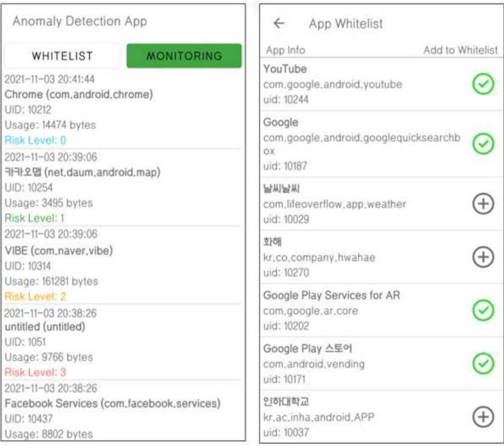
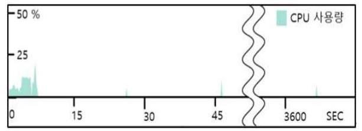
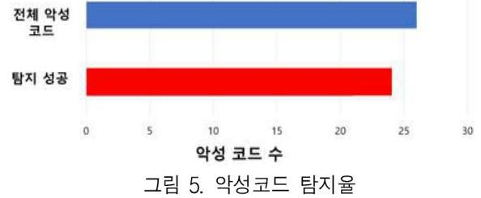

# 안드로이드에서 외부유출 탐지 앱 구현 

부성준, 강석진, 신지우, 정진만,

## Implementation of Extrusion Detection Application in Android

Sungjun Boo, Seokjin Kang, Jiwoo Shin, and Jinman Jung

## 요 약

전세계적으로 많은 스마트폰 사용자수와 인터넷의 발달로 인한 스마트폰의 보안의 중요성이 증가하였다. 스 마트폰 운영체제 중 안드로이드 운영체제는 가장 높은 점유율로 인해 안드로이드 대상 악성코드 수와 종류가 크게 증가하였다. 이에 본 논문에서는 안드로이드 환경에서 사용자 이벤트 기반 외부 유출 위험 악성코드 탐 지 알고리즘을 제안한다. 제안된 탐지 방안으로 악성코드에 대해 실험해본 결과 26 개 중 24 개를 탐지하였다. 안드로이드 스튜디오 프로그램의 profiler 기능을 사용하여 CPU 사용률 측면에서 평가한 결과, 모니터링 시작 이후 약 $0.25 \%$ 의 사용률을 보여 효과적으로 동작함을 확인하였다. 제안된 탐지방안을 이용하면 적은 오버헤드 를 통해 효율적으로 스마트폰의 의도하지 않은 트래픽을 사용자에게 알려 외부유출을 방지할 수 있다.

## I . Introduction

전 세계적인 안드로이드 기반 스마트폰의 사용율 은 약 $72 \%$ 다[1]. 현재 스마트폰의 이용율은 증가하 고 있고 이전보다 더 많은 개인정보를 담게 되었고 이에 따라 보안 이슈 역시 대두되고 있다. 본 논문 에서는 기존의 방법과 다른 악성 코드 탐지 방법과 정확도를 높이는 방법을 이용한 애플리케이션을 구 현한다.

## II. Background

안드로이드에서 대표적인 악성코드 대응 방법은 동적분석 기반 탐지 방법이 있다. 시그니처 패턴 기 반 탐지 방법은 시그니처를 관리할 수 있는 저장소

가 필요하고 변종 앱에 대한 탐지가 어렵다. 동적분 석 기반 탐지 방법은 가능한 프로그램 실행 패스를 모두 분석할 수 없다.[2] 따라서 기존 방법과는 다 른 송신 트래픽을 이용한 효율적인 방법을 제시한 다.

## III. Malware detection algorithm

본 논문의 알고리즘은 '사용자 이벤트 기반 스마 트폰 이상 탐지 기법'[4]과 '안드로이드에서 외부유 출 탐지를 위한 응용 수준 모니터링 기법'[5]을 응 용하여 외부 유출과 사용자의 의도적이지 않은 송 신 트래픽을 발생시키는 악성 애플리케이션을 탐지 하기 위한 알고리즘을 제안하고 이를 안드로이드에 적용하여 구현하는 것을 목표로 한다.

[^0]
[^0]:    * 인하대학교 컴퓨터공학과, Computer Engineering, Inha University
    booroogi@inha.edu, loj9665@inha.edu, jiwoo2221@naver.com, jmjung@inha.ac.kr


그림 1. 외부유출 탐지 앱
애플리케이션의 송신 트래픽이 감지되었을 때, 앱 내의 화이트리스트 정보와 디바이스 화면 상태 정보, 터치 이벤트 발생 여부 정보를 이용하여 위험 도를 0-3으로 구분하고 사용자에게 보여준다. 화이 트리스트는 디바이스에 설치된 네트워크를 사용하 는 애플리케이션 중에서 사용자가 직접 등록하거나 해제할 수 있다. 알고리즘의 의사코드와 실행화면은 그림 2,3 과 같다.

## IV. Experiment

사용자 이벤트와 송신 트래픽을 통한 안드로이드 악성코드 탐지 애플리케이션을 실행하여 CPU 사용 량을 측정한 결과 다음 그래프와 같았다. 실험 결과

기존 CPU 사용률에 비해 추가적으로 약 $0.25 \%$ CPU 사용이 발생하였다. 이는 트래픽을 탐지하는 메소드를 20초 간격으로 실행하기 때문에 약간의 오버헤드가 발생한 것으로 판단된다.

26 개의 악성코드에 대해 12,400 초 동안 실험해본 결과 24 개의 악성코드를 탐지하였다. 탐지되지 않은 2 개의 악성코드는 실험 시간 내에 송신 트래픽을 발생시키지 않아 탐지되지 않은 것으로 보인다.

```
Function assessRisk()
    While (MonitoringisOn)
        for all Traffic in outgoingTraffic
            If(checkWhitelist)
                return risk 0
            If(checkScreenOn)
                If(checkTouchEvent)
                    return risk 1
            else
                return risk 2
    else
        return risk 3
```

그림 2. 알고리즘 의사코드


그림 3. 실행화면



그림 4. CPU 사용률

## 악성 코드 감지



## V. Conclusion

본 논문에서는 제한된 자원의 모바일 안드로이드 환경에서 사용자 이벤트와 송신 트래픽을 이용하여 악성코드를 탐지할 수 있는 알고리즘을 제안하였다. 제안된 안드로이드 외부유출 탐지 기법을 구현하여 실험한 결과 높은 CPU 효율성과 악성 코드 탐지율 을 보여주었다.

## 참 고 문 헌

[1] "Mobile Operating System Market Share Worldwide, " Statcounter, last modified Nov 1 2021, accessed Nov 5 2021, https://gs. tatcounter.com/os-market-share/mobile/worldwide/\#m onthly-202010-202110
[2] 김의탁, 류근호, "안드로이드 환경에서의 효과적 인 악성코드 탐지 메커니즘", 한국콘텐츠학회논 문지2018 no. 4 (2018): 305-313, doi:10.5392
[3] 박지연, "스마트폰을 위한 사용자 이벤트기반의 이상 행동 탐지 기법," (석사학위, 서울대학교 전기-컴퓨터 공학부 대학원, 2013)
[4] 김서연 외, "Application level Monitoring Mechanism for Extrusion detection in Android," 한국컴퓨터종합학술대회 논문집 (2019): $1132-1134$
[5] "Android-Anomaly-Detection," Github, last modified Nov 5, 2021, accessed Nov 5, 2021, https://github.com/boorooksus/Android-Anomaly-Dete ction.git

