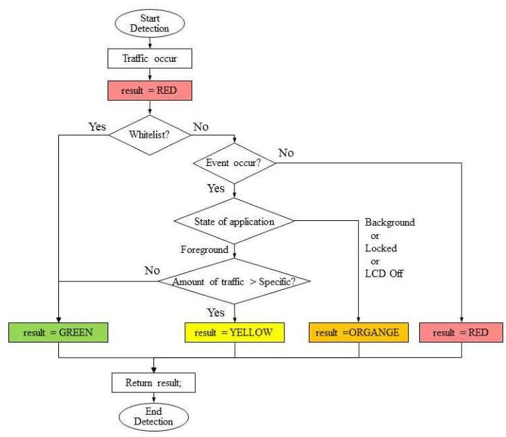

# 안드로이드에서 외부유출 탐지를 위한 응용 수준 모니터링 

## 기법

김서연 ${ }^{11}$ 박지수 ${ }^{1}$ 권순홍 ${ }^{1}$ 최준희 ${ }^{1}$ 정재혁 ${ }^{1}$ 정진만 ${ }^{1}$ 한남대학교 ${ }^{1}$ sykim.hn@gmail.com, jisuve.6@gmail.com, ksh7512@naver.com, ice15849@naver.com, jhjeong.esw@gmail.com, jmjung@hnu.kr

## Application level Monitoring Mechanism for Extrusion detection in

## Android

Seoyeon Kim ${ }^{01}$ Jisu Park ${ }^{1}$ Soon Hong Kwon ${ }^{1}$ Jun Hee Choi ${ }^{1}$ Jaehyeok Jeong ${ }^{1}$ Jinman Jung ${ }^{1}$ Hannam University

## 요 약

본 논문에서는 안드로이드 응용 수준에서 외부유출 탐지가 가능한 모니터링 기법을 제안한다. 기존 기 법들은 악성 트래픽 탐지를 위해 수신하는 트래픽의 시그니쳐나 수신 트래픽에 의해 유발하는 이상행위를 분석하는데 반해 제안 기법은 스마트폰의 상태정보를 활용하여 송신 트래픽 발생시에만 외부 유출을 탐지 한다. 특히 플랫폼 수준의 수정이나 추가적인 Third-party의 지원없이 안드로이드 응용 수준에서 쉽게 모 니터링할 수 있는 설계 및 구현 이슈와 해결방법을 제시한다. 제안 기법은 송신 트래픽과 스마트폰 상태 정보를 모니터링하여 사용자에게 위험도 등급을 알려준다. 이를 위해 프라이버시 보호 정책상 UID별 자원 정보 접근이 제약된 안드로이드 응용 수준에서 외부유출 탐지를 위한 기법을 소개한다. 루팅이나 시스템 수준의 수정없이 응용 수준에서 송신 트래픽 발생시에만 탐지하므로 송신 트래픽 유발이 적은 스마트폰 환경에서 더욱 효율적이다.

## 1. Introduction

안드로이드 기반의 스마트폰 사용이 증가하면서 악성 트래픽 발생률도 높아지고 있다. 하지만 안드로이드 프 라이버시 보호 및 관리정책으로 인해 루팅이나 시스템 수준의 수정 없이는 외부로 유출되는 트래픽을 탐지하는 데 어려움이 따른다. 기존 기법들은 수신 트래픽의 특성 을 시그니쳐로 만들어 분석하는 방법이나 수신 트래픽에 의해 유발될 수 있는 이상행위들을 분석하는 방법으로 주로 수신 트래픽을 대상으로 분석하여 상대적으로 오버 헤드가 크다 [1]. 제안 기법은 안드로이드와 같은 배터 리 기반의 모바일 환경에서 효율적으로 악성 트래픽을 탐지하기 위한 기법을 제안한다. 특히 기존 연구와 다른 점은 플랫폼 수준의 수정이나 추가적인 Third-party의 지원 없이 안드로이드 응용 수준에서 쉽게 모니터링 할 수 있는 설계 및 구현 이슈와 해결방법을 제시한다.
악성 트래픽 탐지를 위해 사용자 이벤트 발생 여부 정 보는 매우 중요하다. 대부분의 트래픽 전송은 사용자의 이벤트 발생으로부터 기인될 수 있기 때문에 이벤트 발 생 없이 전송되는 트래픽을 비정상 외부유출로 판별하는 기준으로 사용될 수 있다. 또는 스마트폰 상태가 잠겨있 거나 스크린이 OFF되어 있는 경우에 트래픽이 전송되는 경우에도 의도되지 않는 트래픽이라고 간주될 수 있다. 본 논문에서는 사용자 이벤트 발생이 없거나 스마트폰 이 사용되지 않는 상황에서 트래픽이 전송되는 경우를

외부 유출로 판별하는 방법을 제시한다. 응용 수준에서 송신트래픽을 대상으로 모니터링하여 외부유출을 탐지하 므로 송신 트래픽 유발이 적은 스마트폰 환경에서 더욱 효율적이다. 송신 트래픽 발생시 스마트폰 상태 정보에 따라 위험등급을 4 가지로 분류하였다.
본 논문의 구성은 다음과 같다. 2 장에서 관련 연구에 대해 알아보고, 3장에서는 안드로이드에서 응용 수준의 외부유출 탐지 기법을 제안하며 4장에서 결론을 맺는다.

## 2. Related Works

기존 악성 트래픽을 탐지 기법으로는 통계 기반 탐지, 클러스터링을 통한 탐지 기법, 악성코드 활성화 기법 등 이 있다[2-4]. 또한, 기계학습을 통해 악성 트래픽을 탐 지하는 기법들이 증가하고 있다[5-6]. [2]는 통계 기반 탐지 기법으로 일정한 간격의 데이터를 확인하는 시계열 모델 중 하나인 자기회귀 이동평균 모델을 통해 악성코 드 탐지 기법을 제안하였다. [3]은 계층적 클러스터링 기반으로 k-평균 알고리즘을 통해 유해 트래픽을 분류하 는 방법이다. [4]는 악성코드 활성화 기법에서 추가적으 로 탐지율 향상을 위해 의심스러운 행위와 관련 클래스 를 식별하고 탐지시간 단축을 위해 특정 라이브러리를 분석에서 제외시켜 행위 선정 패턴을 개선하였다. [5]는 암호화된 페이로드를 갖는 트래픽을 인지하기 위해 기계 학습을 사용하여 페이로드만 추출한 이미지를 가지고 악

성 트래픽을 탐지하는 모델이다. [6]은 어플리케이션 동 작 패턴 속성 데이터를 기계학습 알고리즘에 적용하여 악성 어플리케이션을 탐지하였다. 기존 기법들은 대부분 수신 트래픽의 특성 또는 행위를 분석하는 기법으로 송 신트래픽을 대상으로 하는 제안 기법과는 다르다.

## 3. Application level Extrusion detection in Android

3.1 알고리즘 개요

본 논문에서는 안드로이드와 같은 배터리 기반의 모바 일 환경에서 효율적으로 외부유출을 탐지하기 위한 모니 터링 알고리즘을 제시한다. 특히 플랫폼 수준의 수정이 나 추가적인 Third-party의 지원없이 안드로이드 응용 수준에서 쉽게 모니터링할 수 있는 설계 및 구현 이슈와 해결방법을 제시한다. 외부유출 탐지를 위한 제안 알고 리즘은 그림 1과 같다.
어플리케이션들의 트래픽 발생 시 이벤트 발생 여부, 스마트폰 잠금 여부 등의 스마트폰 상태 정보에 따라 위 험도를 구분하였다. 위험도는 가장 안전한 GREEN부터 YELLOW, ORANGE, 그리고 가장 위험한 RED로 분류하 였다. 송신 트래픽이 발생하면 알고리즘이 시작되고 초 기값을 먼저 RED로 간주한다. 구글 팰린더 등 잘 알려 진 어플리케이션에 대해서는 화이트리스트로 관리하고 송신트래픽을 발생시킨 어플리케이션 UID가 화이트리스 트에 존재할 경우 위험등급을 GREEN으로 설정한다. 대 부분의 트래픽 전송은 사용자의 이벤트 발생으로부터 기 인될 수 있기 때문에 이벤트 발생 없이 전송되는 트래픽 을 비정상 외부유출로 판별하는 기준으로 사용될 수 있 다. 따라서 어플리케이션 UID별 이벤트 발생 정보를 관 리하고 송신트래픽을 발생시킨 어플리케이션 UID가 최근 특정 시간 안에 이벤트가 발생하였는지 확인하고 이벤트 가 없을 경우 RED로 지정한다. 이벤트 없이 주기적으로 또는 간헐적으로 트래픽을 발생시키지만 잘 알려진 어플 리케이션들은 화이트리스트에 포함되어 관리한다. 또한 화이트리스트에 포함되어있지 않은 어플리케이션에 대해 스마트폰이 잠금 상태이거나 화면이 꺼져있는 상황에서 트래픽이 발생하면 사용자에게 ORANGE 위험도를 알리 고, 통계정보를 활용하여 위험도를 YELLOW로 하여 외 부 유출의 위험성을 사용자에게 알릴 수 있다.
따라서 위의 알고리즘을 응용 수준에서 외부유출 탐지 를 구현하기 위해 안드로이드에서 UID별 이벤트 발생 정 보와 트래픽 발생 UID를 정보를 확인하는 방법이 핵심이 며 다음 절에서 소개한다.

### 3.2 UID별 이벤트 발생 정보

외부유출 탐지를 위해 사용자 이벤트 발생 여부 정보 는 매우 중요하다. 대부분의 트래픽 전송은 사용자의 이 벤트 발생으로부터 기인될 수 있기 때문에 이벤트 발생 없이 전송되는 트래픽을 비정상 외부유출로 판별하는 기 준으로 사용될 수 있다.
하지만 안드로이드 기반 응용 수준에서 다른 어플리케 이션들로부터 발생한 이벤트 정보를 얻는 것은 Privacy 정책 상 기본적으로 지원되지 않는다.
다른 어플리케이션의 이벤트 발생 여부 정보를 위해 최

그림 1 악성 트래픽 탐지 알고리즘
상위 오버레이 뷰를 실행시키는 방법이 사용될 수 있다. TYPE_PHONE 유형의 작은 오버레이 뷰를 생성하고 FLAG_NOT_FOCUSABLE 로 설정하여 포커스를 가지지 않도록 실행시키면 해당 뷰를 통해 이벤트 발생 정보를 얻을 수 있다.
이벤트를 발생한 UID를 위해 현재 Foreground UID 정 보를 확인해야 한다. 안드로이드에서는 스마트폰의 최상 위 Foreground에서 실행되는 앱의 UID를 가져오기 위해 'ActivityManager' 클래스를 이용할 수 있다. 'RunningTaskInfo' 메소드를 이용하여 가장 최상위 Foreground에 있는 어플리케이션을 식별하고 그 어플리 케이션의 UID를 제공한다. 하지만 API 21 (Android 5.0) 인 Lollipop 부터는 이 기능이 제한되었다.
또한 ActivityManager 클래스에서 제공하는 'getRunningAppProcess' 메소드를 통해 최상위 Foreground에서 실행중인 UID를 알 수 있다. 이 메소드 를 통해 현재 실행중인 어플리케이션 리스트에서 패키지 명과 'IMPORTANCE_FOREGROUND' 상태값 비교를 할 수 있어 현재 foreground 실행 여부를 확인할 수 있다. 하지만 이 메소드 역시 API 23 (Android 6.0)인 Marshmallow부터 기능이 제한되어 다른 어플리케이션의 foreground 여부의 정보는 제공하지 않는다.
API 23 이후 안드로이드에서는 foreground UID를 얻기 위해 시스템 권한인 'PACKAGE_USAGE_STATS'을 허용 해야 하며 'UsageStatsManager' 클래스를 사용해야 한다. 이 클래스의 'queryEvents' 메소드를 통해 시간 간격을 정 할 수 있고, 특정 시간 전부터 현재까지의 시간동안 Foregr ound로 이동된 프로세스의 패키지 명을 받아올 수 있다. 'PackageManager' 클래스에서 'getApplicationInfo' 메소 드를 이용하여 패키지명의 UID를 확인할 수 있다.

### 3.3 트래픽 발생 UID 정보

안드로이드에서는 다른 어플리케이션들의 트래픽 전송 량 정보를 얻기 위해 그 어플리케이션의 UID 통해

'TrafficStats' 클래스에서 제공하는 'getUidTxBytes', 'getUidRxBytes' 메소드를 이용할 수 있다. 하지만 API 24 (Android 7.0)부터 이 메소드들은 Privacy 이슈로 사용이 제한되어 호출하는 어플리케이션의 UID인 경우만 정보를 얻을 수 있고 다른 어플리케이션의 UID로 접근할 경우 -1 을 반환한다.
이후 다른 어플리케이션 별 트래픽 정보는 READ_PHONE_STATE, PACKAGE_USAGE_STATS 권한 등 추가적인 권한을 허용한 후에 'NetworkStats' 클래스를 호출하여 얻을 수 있다.
'NetworkStatsManager' 클래스에서 제공하는 'queryDetailsForUid' 메소드와 'Networkstats.Bucket' 클 래스의 'getRxBytes', 'getTxBytes' 메소드를 사용한다. 'queryDetailsForUid'는 얻고자 하는 트래픽 정보와 관련 한 네트워크 타입과 UID를 지정하고 시작 시간(startTime) 과 종료 시간(endTime)을 설정하여 그 시간 구간의 트래픽 정보를 요청할 수 있다. NetworkStats 클래스는 버킷 (Buckets)이라 불리는 최소 단위로 요청된 질의 결과에 대 해 응답되며, 사용자가 요청한 시간 구간에 포함되는 버킷 단위로 'Bucket.getRxBytes' 과 'Bucket.getTxBytes' 메소 드를 통해 트래픽 정보를 바이트 단위로 얻는다. 따라서, 현재 시간의 버킷을 포함하는 정보를 얻기 위해서는 현재 시간보다 충분히 큰 시간을 종료시간에 지정하여 가능하 며, 이를 통해 실시간으로 UID별 트래픽 사용량을 얻을 수 있다. 현재 시간을 지정하면 현재 시간에 포함되는 버킷이 완료 될 때까지 지연시간이 발생할 수 있다. 추가적으로 'Networkstats'에서 지원하는 네트워크 타입에 따라 WiFi, Mobile data, Hotspot 및 Tethering의 송수신 정보도 수집 가능하다.

## 4. Conclusion

본 논문에서는 안드로이드와 같은 배터리 기반의 모바 일 환경에서 효율적으로 외부유출을 탐지하기 위한 모니 터링 설계 및 구현 이슈를 제시하였다. 안드로이드 응용 수준에서 외부유출 탐지하기 위해 안드로이드에서 UID별 이벤트 발생 정보와 트래픽 발생 UID 정보를 확인하는 방법을 소개하였다. 플랫폼 수준의 수정이나 추가적인 Third-party의 지원없이 안드로이드 응용 수준에서 쉽게 구현 가능하다. 응용 수준에서 송신트래픽을 대상으로 모니터링하여 외부유출을 탐지하므로 송신 트래픽 유발 이 적은 스마트폰 환경에서 더욱 효율적이다.

## 사사

이 논문은 2018년도 정부(교육부)의 재원으로 한국연구 재단의 지원을 받아 수행된 기초연구사업임(No. 2016R1D1A3B03931258).

## 참 고 문 헌

[1] 최우진, 전광일, 장준혁,(2012).스마트 폰 기반 침입 탐지 기법 연구 동향.한국정보과학회 학술발표논문 집,39(1A),101-103.
[2] 김환희, 최미정,(2015). 자기회귀 이동평균 모델을

이용한 안드로이드 악성코드 탐지 기법. 한국통신학회 학술대회논문집, pp145-146.
[3] 신동혁, 최형기, (2015). 클러스터링을 이용한 유해 트래픽 탐지. 한국정보과학회 학술발표논문집, pp912-914
[4] 곽재상, (2015). 안드로이드 악성코드 탐지율 향상 을 위한 안드로이드 악성코드 활성화 기법. 한국정보과 학회 학술발표논문집, pp897-899.
[5] 지세현, 박지태, 백의준, 김명섭,(2018). 안전한 네 트워크 구축을 위한 컨볼루션 신경망 기반 악성트래픽 탐지. 한국통신학회 학술대회논문집, pp861-862.
[6] 차두진, 최린,(2014). 기계학습 알고리즘을 이용한 안드로이드 악성코드 탐지. 한국정보과학회 학술발표논 문집, pp668-670.

