# (c)creative   commons 

C O M M O N S D E E D

## 저작자표시 2.0 대한민국

이용자는 아래의 조건을 따르는 경우에 한하여 자유롭게

- 이 저작물을 복제, 배포, 전송, 전시, 공연 및 방송할 수 있습니다.
- 이차적 저작물을 작성할 수 있습니다.
- 이 저작물을 영리 목적으로 이용할 수 있습니다.

다음과 같은 조건을 따라야 합니다:

저작자표시. 귀하는 원저작자를 표시하여야 합니다.

- 귀하는, 이 저작물의 재이용이나 배포의 경우, 이 저작물에 적용된 이용허락조건 을 명확하게 나타내어야 합니다.
- 저작권자로부터 별도의 허가를 받으면 이러한 조건들은 적용되지 않습니다.

저작권법에 따른 이용자의 권리는 위의 내용에 의하여 영향을 받지 않습니다.
이것은 이용허락규약(Legal Code)을 이해하기 쉽게 요약한 것입니다.
Disclaimer $\square$

공학 석사학위 논문

# 포렌식 도구 기반 스마트폰 

디지털 증거 수집 및 분석 절차

## 아 주 대 학 교 정보통신대학원

사이버보안전공
안재혁

# 포렌식 도구 기반 스마트폰 디지털 증거 수집 및 분석 절차

지도교수 손태식

이 논문을 공학 석사학위 논문으로 제출함.

2020년 2월

이 주 대 학 교 정보통신대학원

사이버보안 전공

안재혁

# 안제혁의 공학 석사학위 논문을 인준함. 

$$
\begin{aligned}
& \text { 심사위원장 손 태 식 인 } \\
& \text { 심 사 위 원 홍 만 표 인 } \\
& \text { 심 사 위 원 곽 진 인 }
\end{aligned}
$$

아 주 대 학 교 정보통신대학원
2019년 12월

# 감 사 의 글 

먼저 저를 믿어 주시고 기도와 사랑으로 아낌없이 지원해주신 아버지, 어머니에게 사랑한다는 말과 함께 감사의 마음을 이 자리를 빌어 전하 고 싶습니다.

그리고 저를 이끌어 주시고 지도해주신 손태식 교수님께 감사드립니 다. 교수님의 조언과 격려가 없었다면 이 글은 세상에 나오지 못했을 것입니다. 홍만표 교수님, 곽진 교수님, 예홍진 교수님, 김강석 교수님 을 비롯한 사이버보안학과 교수님들께 감사의 마음을 전해드리고 싶습 니다.

또한 글을 쓰는 동안 정신적으로 힘이 되어주었던 홍여정 누나, 이준 건 형, 박보성 형, 저성은 누나, 구현소 누나, 서기환 형에게 감사합니 다. 그리고 제 선택을 늘 응원해주는 박정원 형, 예상우 형, 박민석 형, 이혜성, 배도협, 최형욱에게 감사합니다. 또한 항상 격려를 아끼지 않으 시는 김지명 사부님에게도 감사의 말씀을 전합니다.

제가 사랑하는 모든 분들께 다시 한번 감사의 마음을 전합니다.

# 국 문 요 약 

최근 5 G를 비롯한 무선통신 기술의 발달, 미디어 파일 등 대용량 파일 처리 및 저장 기술의 발달, 스마트폰의 대중화로 급증한 모바일 데이터 덕분에 현대인은 데이터 홍수의 시대에 살고 있다고 해도 과언이 아니 다. 스마트폰의 보급은 우리의 일상생활을 매우 편리하게 만들었다. 반 도체 소형화 기술의 발달로 손 안에 든 컴퓨터로 불리며 수많은 데이터 들을 집약적으로 저장하기 시작한 것이 불과 10 년도 채 되지 않았다.

현재 스마트폰은 개인의 건강, 위치, 재정, 업무, 인간관계 등을 지원 하며 동시에 개인의 민감정보와 활동 내역을 모두 포함하고 있는 기기 로 거듭났다. 그러나 이 편리성으로 인해 스마트폰이 범죄의 계획, 공 모, 또는 실행에 악용되는 사례가 급증하면서, 범죄 사건의 해결을 위 해 디지털 포렌식 관점에서 스마트폰 내부의 디지털 증거를 수집하고 분석하는 연구의 중요성은 날이 갈수록 커지고 있다. 본 논문에서는 디 지털 포렌식의 뜻과 일반원칙, 디지털 증거의 정의와 그 특성에 대해 먼저 다루고, 그리고 모바일 포렌식의 특징과 기존 포렌식 절차, 스마

트폰의 특성으로 인한 포렌식 작업 수행의 어려움을 서술하였다.

이 같은 문제에 대응하기 위하여 가장 대중적인 스마트폰 기종에 적 절한 상용 포렌식 도구를 선정 및 적용해 기존 절차를 검증하고, 효과 적으로 iPhone에서 디지털 증거를 수집하고 안드로이드폰에서 디지털 증거를 수집하는 절차를 제안하였다. 또한 스마트폰과 PC를 오가며 활 발히 사용되고 있는 모바일 메신저를 선정하여 삭제된 데이터를 추출 및 복구하는 절차를 제시하였다. 또한 스마트폰에서 사용되는 모바일 앱, 동영상 애플리케이션을 선정하여, 검색 및 웹 방문기록을 추출하는 기법 및 절차를 제시 후 결론과 향후 연구과제를 기술하였다.

# 목 차 

제 1 장. 서 론 ..... 1
제 2 장. 연구 배경 및 관련 연구 ..... 6
제 1 절. 디지털 포렌식 개요 ..... 6
제 1 항. 디지털 포렌식의 정의 ..... 6
제 2 항. 디지털 포렌식의 일반원칙 ..... 8
제 2 절. 디지털 증거 개요 ..... 9
제 1 항. 디지털 증거에 대한 정의 ..... 9
제 2 항. 디지털 증거의 특성 ..... 10
제 3 절. 모바일 포렌식 ..... 12
제 1 항. 모바일 포렌식의 정의 ..... 12
제 2 항. 모바일 포렌식의 특징 및 어려움 ..... 12
제 3 항. 모바일 포렌식 절차 ..... 16

제 4 항. 추출 방법에 따른 모바일 포렌식 도구의 분류 ..... 19
제 5 항. 스마트폰에서 수집되는 디지털 증거의 분류 ..... 22
제 3 장. iPhone 디지털 증거 수집 절차 제안 ..... 25
제 1 절. iPhone 데이터 수집 개요 및 도구 선정 ..... 25
제 2 절. iPhone 기본 정보 추출 단계 ..... 26
제 3 절. iPhone 미디어 파일 추출 단계 ..... 31
제 4 절. iPhone 백업 파일 및 데이터 추출 단계 ..... 35
제 5 절. iPhone 데이터 물리적(파일시스템) 추출 ..... 40
제 4 장. 안드로이드폰 디지털증거 수집절차 제안 ..... 44
제 1 절. 안드로이드폰 데이터 수집 도구 선정 과정 ..... 44
제 2 절. 안드로이드폰 스마트폰 루팅 ..... 45
제 3 절. 안드로이드폰 기본 정보 식별 ..... 46
제 4 절. 안드로이드폰 삭제 데이터 추출 ..... 50
제 5 절. 안드로이드폰 전체 데이터 추출 ..... 52

제 5 장. 스마트폰 디지털 증거 분석 기법 제안 ..... 55
제 1 절. 메신저 삭제 데이터 복구 기법 및 절차 ..... 55
제 2 절. 구글 계정 연동 데이터 추출 및 분석 ..... 60
제 6 장. 결 론 ..... 67
제 1 절. 연구 결과 ..... 68
제 2 절. 향후 과제 ..... 70
참고문헌 ..... 71
ABSTRACT ..... 75

# 그림 $\cdot$ 사진 목차 

<그림 1 > 모바일 데이터 사용량 내역 및 전망 ..... 1
<그림 2 > 디지털 포렌식 수사 절차 모델 ..... 17
<그림 3> 모바일 포렌식 절차의 기본 구조 ..... 18
<그림 4> 데이터 추출 방법에 따른 모바일 포렌식 도구 분류 ..... 20
<그림 5> Elcomsoft iOS Forensic Toolkit - Toolkit.exe ..... 28
<그림 6> iPhone 기본 정보 추출 결과 ..... 29
<그림 7> ideviceinfo.xml 파일 ..... 30
<그림 8> applications.txt 파일 ..... 30
<그림 9> iPhone 미디어 파일 추출 결과 ..... 31
<그림 10> 미디어 파일 저장 경로 ..... 32
<그림 11> 추출 이미지 파일 메타데이터 ..... 34
<그림 12> iPhone 백업 파일 추출 및 암호화 ..... 35

<그림 13> 생성된 iPhone 백업 데이터 파일 ..... 36
<그림 14> iPhone 백업 데이터 파일 복호화 ..... 37
<그림 15> 추출한 iPhone 백업 파일 데이터 조사 ..... 38
<그림 16> Safari 웹 브라우징 히스토리 ..... 38
<그림 17> Wi-fi 연결 내역, 비밀번호, 위치 정보 데이터 추출 ..... 39
<그림 18> 미디어 파일, Wi-fi 접속 내역을 통한 위치 정보 수집 ..... 39
<그림 19> Cydia Impactor를 통한 iPhone jailbreak app 설치 ..... 41
<그림 20> jailbreak 앱 unc0ver가 iPhone에 설치된 모습 ..... 41
<그림 21> iPhone 디지털 증거 수집 절차 제안 순서도 ..... 43
<그림 22> 모바일 포렌식 도구 데이터 수집 성공률 ..... 44
<그림 23> MOBILedit Forensic Express 실행 화면 ..... 46
<그림 24> 안드로이드폰 Forensic Connector ..... 47
<그림 25> 안드로이드폰 데이터 추출 옵션 ..... 48
<그림 26> 안드로이드폰 기기 기본 정보 추출 결과 보고서 ..... 49

<그림 27> 안드로이드폰 내부 삭제 파일 목록 ..... 51
<그림 28> 안드로이드폰 내 삭제된 전화기록 목록 ..... 51
<그림 29> 안드로이드폰 내부 전체 데이터 추출 결과 ..... 53
<그림 30> 파일 시스템 내부 이미지 파일 저장 경로 및 해시 ..... 54
<그림 31> Mreaper Lite.exe 실행 후 기종에 맞는 운영체제 선택 ..... 56
<그림 32> 복구 메신저 선택 ..... 57
<그림 33> 텔레그램 메신저 복구 작업 ..... 57
<그림 34> 텔레그램 삭제 메시지 목록 ..... 58
<그림 35> 텔레그램 삭제 메시지 복구 결과 ..... 59
<그림 36> GoogleTokenExtractor.exe ..... 62
<그림 37> 토큰 인증 방식을 통한 구글 계정 접근 ..... 63
<그림 38> 구글 계정 연동 데이터 추출 결과 ..... 64
<그림 39> 구글 검색 히스토리 추출 결과 ..... 64
<그림 40> 구글 검색을 통해 접속한 웹사이트 방문 히스토리 ..... 65

<그림 41> Youtube 검색어 추출 ..... 65
<사진 1> Elcomsoft 하드웨어 USB key ..... 27

# 표 목 차 

<표 1> 2019년 스마트폰 가입자 증가 추이 및 현황 ..... 2
<표 2> 디지털 포렌식에 대한 포렌식 연구자들의 정의 ..... 7
<표 3> 디지털 포렌식의 일반 원칙 ..... 8
<표 4> 디지털 증거에 대한 정의 ..... 10
<표 5> 디지털 증거의 특성 ..... 11
<표 6> 모바일 포렌식의 어려움 ..... 15
<표 7> iPhone 디지털 증거 수집 실험 환경 ..... 27
<표 8> 사진, 이미지 파일 저장 경로 ..... 33
<표 9> 안드로이드폰 데이터 수집 절차 검증 환경 ..... 45
<표 10> 텔레그램 메신저 복구 실험 환경 및 도구 ..... 56
<표 11> 구글 계정 연동 데이터 추출 실험 환경 ..... 61

# 제 1 장. 서 론 

모바일 기기의 급격한 대중화와 5G 통신시스템을 비롯한 무선통신기술의 발 달로, 모바일 기기의 활용성과 데이터는 기하급수적으로 늘어날 것으로 전망 되고 있다. 통계자료에 따르면 2023년 전세계 모바일 데이터 사용량은 2017 년 대비 8 배 늘어난 110 엑사바이트에 달할 것으로 예상된다. 또한 멀티미디 어 처리 기술의 발달, 동영상 기반 컨텐츠 및 스트리밍 시장의 발전으 로 2023년경 동영상 데이터는 모바일 데이터 중 $75 \%$ 를 차지할 것으로 예상된다 ${ }^{1}$.
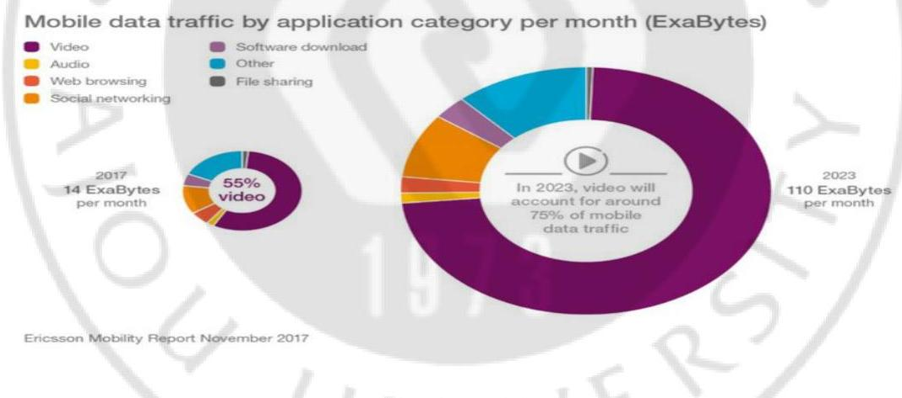
<그림 1> 모바일 데이터 사용량 내역 및 전망

[^0]
[^0]:    1 "2023년 모바일 데이터 사용량 75\% '동영상' 몫… 에릭슨", The Gear, 2017년 12월 4일 수정, 2019년 11월 17일 접속.
    http://www.thegear.kr/news/articleView.html?idxno=15490

이런 모바일 데이터의 증가는 막대한 스마트폰 생산 및 수요와 무관하지 않 다. 스마트폰은 1 년에 15 억 대 이상 출하되며, 인간이 하루 중에서 가장 오랜 시간 사용하는 디지털 기기가 되었기 때문이다 ${ }^{2}$. 스마트폰 가입자는 통계청에 서 발행한 아래 자료 ${ }^{3}$ 와 같이 지속적으로 증가하고 있다.

| 구분 |  | 2019년 7월 | 2019년 8월 | 2019년 9월 |
| :--: | :--: | :--: | :--: | :--: |
| 스마트폰 | SKT | 23,450,811 | 23,482,962 | 23,518,409 |
|  | KT | 15,377,382 | 15,417,950 | 15,464,598 |
|  | LGU+ | 11,691,153 | 11,747,546 | 11,807,283 |
| 할 게 |  | 50,519,346 | 50,648,458 | 50,790,290 |

<표 1> 2019년 스마트폰 가입자 증가 추이 및 현황

스마트폰은 안드로이드, iOS 등 범용 OS를 탑재한 휴대폰으로 피처폰 과는 구분된다. 자료에 따르면 2019년 9월 기준 스마트폰 가입자 수는

[^0]
[^0]:    ${ }^{2}$ 노명선 외 5 인. 『디지털포렌식 이론』. 서울:미디어북, 2018., p37.
    ${ }^{3}$ 통계청, "(2019년 9월 기준) 무선통신서비스 가입회선 통계", 2019년 10월.

50,790,290명으로 우리나라의 인구가 2019년 기준 5170만 명 ${ }^{4}$ 임을 고 려할 때, 평균적으로 1 명당 1 개 꼴로 스마트폰을 사용하고 있는 셈이다.

이 같은 추세에 따라 스마트폰이 범죄 행위에 직$\cdot$간접적으로 사용되 는 경우 또한 증가하고 있다. 특히 스마트폰 내 메신저 프로그램, 미디 어 파일이 범죄에 빈번하게 개입되는데, 이는 현대인들의 모바일 메신 저 프로그램의 잦은 사용과 모바일 기기 메모리 용량의 급격한 증가 때 문이다. 최근의 통계에 따르면 현대인들은 하루에 평균적으로 2.6시간 을 모바일 메신저 프로그램을 사용하는데 쓰며 ${ }^{5}$, 넓어진 저장용량을 바 탕으로 모바일 메신저를 통해 텍스트보다 사진, 이미지와 같은 미디어 파일들을 더 활발히 공유 ${ }^{6}$ 하는 것으로 나타났다. 이에 따라 범죄 사건 해결 측면에 있어 스마트폰 내부의 데이터를 수집하고 분석한 데이터가

[^0]
[^0]:    ${ }^{4}$ 통계청, "주요 인구지표(성비, 인구성장률, 인구구조, 부양비 등) / 전국", 2019년 3 월.

    5 "소셜 미디어 이용 행태 및 의존도", DMC 미디어, 2014년 8월 31일 수정, 2019년 11월 17일 접속, https://www.slideshare.net/eomsoyoung/dmc-38547102

    6 "모바일 메신저서 '텍스트’보다 ‘이미지" 공유 더 활발해", dongA.com 비즈N, 2019 년 5월 31일 수정 2019년 11월 17일 접속,
    https://bizn.donga.com/3/all/20190531/95791215/2

피의자의 위법 행위를 증명하는 결정적인 디지털 증거로 작용하는 경우 가 늘어나고 있다.

예컨대 '정준영 동영상 사건'의 경우 단체 카카오톡 대화방의 잔존 데 이터가 피의자들의 '디지털 성범죄' 혐의에 대한 결정적인 증거로 작용 하였다7. 이렇듯 범죄 사건에서 모바일 데이터를 수집, 분석 및 복원하 는 포렌식 수사의 중요성과 소요는 지속적으로 증가하고 있다. 국내 군, 경찰, 검찰 수사 기관의 디지털 증거물 분석 건수를 보면 2011년을 전 후하여 모든 디지털 증거 분석 건수 중 모바일 포렌식 분석이 과반수 이상을 차지하였고, 2015년에는 그 비중이 $75 \%$ 까지 이르렀다 ${ }^{8}$.

이처럼 스마트폰 포렌식 분석을 요하는 범죄 사건들의 비중은 높아지 고 있고, 이에 대한 체계적인 절차 마련이 필요하다. 그러나 컴퓨터를 대상으로 한 포렌식 분석 절차가 확립되어 있는 것에 비해, 상대적으로 그 역사가 짧은 스마트폰 포렌식 분석 절차에 대해서는 명문화되고 체

[^0]
[^0]:    7 "[종합]승리 단톡방 '집단강간' 정황, 정준영 안 나가서 싹 걸렸다", 서울경제, 2019 년 4월 12일 수정, 2019년 11월 17일 접속, https://m.sedaily.com/NewsView/1VHU2MLWKZ\#_enliple

    8 노명선., op.cit. pp. 37

계화된 규정이 부족한 상황이다. 이에 따라 본 논문에서는 스마트폰 포 렌식 절차 중 증거 수집 및 분석 단계에 초점을 맞추어 다음과 같은 연 구를 진행하였다.

- 최신 해외 스마트폰 포렌식 도구를 최신 iOS 스마트폰에 적용하여, 그 과정을 토대로 효과적인 iPhone 내부 디지털 증거 수집 절차를 도 출하였다.
- 최신 해외 스마트폰 포렌식 도구를 안드로이드 OS 스마트폰에 적 용하여, 그 과정을 토대로 효과적인 안드로이드 OS 스마트폰 내부 디 지털 증거 수집 절차를 도출하였다.
- 최신 국내 스마트폰 포렌식 도구를 안드로이드 OS 스마트폰에 적 용하여, 높은 보안성을 이유로 주목받고 있는 Telegram 메신저 대화 내용을 스마트폰으로부터 추출, 복원하여 분석하는 기법 및 절차를 정 리하였다.
- 최신 해외 포렌식 도구를 활용하여 구글계정에 접속한 상태에서 발생한 모든 검색 활동, 웹 브라우징 기록, 유튜브 동영상 시청 기록들 을 추출, 분석하는 기법 및 절차를 제시하였다.

# 제 2 장. 연구 배경 및 관련 연구 

## 제 1 절. 디지털 포렌식 개요

## 제 1 항. 디지털 포렌식의 정의

디지털 포렌식은 전자매체에 존재하는 디지털 증거를 자료로 삼아 과 거 어떤 행위의 사실 관계를 역으로 규명하고 증명하는 절차라 할 수 있다. 즉 사법기관에 증거로서 제출하기 위해 과거의 데이터를 수집, 분석 및 보고서를 작성하는 일련의 작업을 의미한다. 우리나라에서는 형사소송법 제 313 조 제 2 항에 '디지털 포렌식'이라는 용어가 법적으로 사용되고 있다. 전통적으로 포렌식이라는 개념은 법의학 분야에서 주로 사용되었다. 즉 지문, 모발, DNA 감식, 변사체 검시 등의 분야에 사용 되었다. 그러나 최근 다양한 정보기기 활용의 확산으로 물리적 형태의 증거 뿐만 아니라 정보기기에 저장된 디지털 증거를 다루는 분야에도 포렌식이라는 용어가 적용되고 있다. ${ }^{9}$

[^0]
[^0]:    ${ }^{9}$ 노명선., op.cit. pp. 19

아래는 학자들이 내린 디지털 포렌식의 정의를 정리한 표이다.

| 구 분 | 정 의 |
| :--: | :--: |
| G.Palmer   (2001) | 범죄로 밝혀진 사건에 대한 재연을 돕기 위한 디지털 매체로부 터 파생된 디지털 증거의 보존, 수집, 검증, 식별, 분석, 해석, 문서화에 대한 과학적으로 도출되고 검증된 방법의 사용 ${ }^{10}$ |
| B.Carrier   (2002) | 컴퓨터 범죄와 관련하여 디지털 기기에서 찾은 자료 복구 및 수 사를 포괄하는 법과학 분야 ${ }^{11}$ |
| K.Zatyko   (2007) | 정식 수색 기관, 연계보관성, 수학을 통한 검증, 검증된 툴의 사 용, 반복가능성, 보고를 통해 디지털 증거와 관련하여 컴퓨터 공 학과 수사 절차를 법적인 목적에 사용하는 것 ${ }^{12}$ |

<표 2> 디지털 포렌식에 대한 포렌식 연구자들의 정의

[^0]
[^0]:    ${ }^{10}$ Gary Palmer, "A Roadmap for Digital Forensic Research," Digital Forensics Research Workshop (DFRWS), 2001. Technical report DTR-T0010-01, Utica, New York.
    ${ }^{11}$ Carrier, B (2001). "Defining digital forensic examination and analysis tools". International Journal of Digital Evidence. 1: 2003.

    12 노명선., op.cit.

# 제 2 항. 디지털 포렌식의 일반 원칙 

디지털 포렌식에 있어, 디지털 증거가 증거능력을 갖게 하기 위해서 는 포렌식 작업 수행자가 디지털 포렌식이 갖는 특성을 이해하고 있어 야 한다. 이 특성을 가리켜 '디지털 포렌식의 일반 원칙'이라고 한다 ${ }^{13}$.

| 원 칙 | 내 용 |
| :--: | :--: |
| 정당성 | 디지털 포렌식 과정에서 획득된 증거는 적법한 절차를 거쳐서 정당하게 획득된 것이어야 한다. |
| 무결성 | 디지털 포렌식의 증거가 법정에 제출되기까지 변경이나 훼손 없 이 보호되어야 한다. |
| 연계보관성 | 디지털 포렌식에서 증거가 획득되고 난 뒤, 이송, 분석, 보관, 법 정 제출의 일련의 과정 및 각 과정마다의 담당자가 명확하여야 한다. |
| 재현성 | 동일한 조건과 동일한 상황 아래에서의 디지털 포렌식 분석 결 과는 항상 같은 결과가 나와야 한다. |
| 신속성 | 디지털 포렌식의 전 과정은 지체없이 신속하게 진행되어야 한다. |

<표 3> 디지털 포렌식의 일반 원칙

[^0]
[^0]:    ${ }^{13}$ 노명선., op.cit. pp.24-25

# 제 2 절. 디지털 증거 개요 

## 제 1 항. 디지털 증거에 대한 정의

앞서 디지털 포렌식의 정의에서 언급된 디지털 증거는 컴퓨터 또는 그와 유사한 기기에 의해 전자적으로 생성되고 저장되며 전송되는 일체 의 증거라 할 수 있다. 이는 저장 매체의 다양성과 저장 기술의 발달로 전자적 증거, 컴퓨터 증거, 전자기록 등으로도 혼용되고 있다. 그러나 '전자적 증거'는 디지털화 되어있지 않은 존재 형식의 증거도 포함하는 개념이므로, 본 연구에서는 디지털 기기로부터 생성된 '디지털 증거'에 초점을 맞추었다. ${ }^{14}$

이 디지털 증거는 디지털 기기 안에서 수집하고 문서화된 보고서, 즉 디지털 포렌식 절차를 수행한 결과물을 최종적으로 법정에 제출하여 범 죄사실의 증명을 용이하게 하기 위해 필요하다. ${ }^{15}$ 아래는 학자들이 내린 디지털 증거에 대한 정의를 정리한 것이다.

[^0]
[^0]:    14 노명선., op.cit. pp. 19
    15 박대우, "스마트폰 포렌식 증거수집 절차 및 분석에 대한 연구" 석사학위, 호서대학 교 벤처전문대학원, 2012.

| 구 분 | 정 의 |
| :--: | :--: |
| W.Jerry   Chisum(1999) | 범죄가 어떻게 일어났는지에 대한 의견을 입증 또는 반박할 수 있거나, 범죄의 핵심 요소들을 이끌어낼 수 있는 정보로 컴퓨터를 사용하여 저장되거나 전송되는 데이터 |
| E.Casey   (2000) | 범죄를 입증하거나 범죄와 피해자 또는 범죄자 사이의 연결 고리를 제공할 수 있는 모든 디지털 데이터 |
| SWDGE $^{16}$ | 디지털 형태로 저장 또는 전송되는 증거가치 있는 정보 |
| IOCE $^{17}$ | 법정에서 신뢰할 수 있는 저장되거나 전송되는 이진수 형태 의 정보 |

<표 4> 디지털 증거에 대한 정의

제 2 항. 디지털 증거의 특성

이러한 디지털 증거는 디지털 기기 내 문서, 사전, 동영상 등 다양한 형태로 존재하며, 기존의 물리적 증거물과는 다른 특성을 갖고 있다.

[^0]
[^0]:    ${ }^{16}$ Scientific Working Group on Digital Evidence : http://www.swgde.org
    ${ }^{17}$ International Organization on Computer Evidence : http://www.ioce.org

| 구 분 | 내 용 |
| :--: | :--: |
| 매제독립성 | '유제물'이 아닌 디지털 증거는 매제와 독립된 정보 내용이 증거로 되는 특성을 지니고 있다. 어떠한 정보든 내용이 같 다면 어느 매제에 저장되어 있든지 동일한 가치를 지닌다. |
| 비가독성 | 디지털 저장매체에 저장된 데이터 그 자체는 사람의 지각으 로 바로 인식할 수 없고, 반드시 변환절차를 거쳐 하면 또는 지면으로 출력되었을 때 비로소 가독성을 가진다. |
| 변경 취약성 | 디지털 증거는 단 하나의 명령만으로도 삭제될 수 있다. 또 한 특정 파일을 열어보는 것만으로도 파일 속성이 변경되어, 디지털 증거로서 무결성이 침해될 위험에 노출될 수 있다. |
| 대용량성 | 하나의 디지털 기기에 혐의와 관련성이 없는 정보를 포함한 방대한 양의 디지털 정보가 저장되어 있어 압수수색 및 디지 털 증거의 범위 설정에 대한 문제가 발생할 소지가 있다. |
| 전문성 | 디지털 기기 내 자료를 수집하고 분석하는 일에 전문적인 기 술이 사용되므로, 디지털 증거의 압수분석 등에 있어 포렌식 전문가의 도움이 필수적이다. |
| 연결성 | 현재 디지털 기기들은 고립되어 있지 않고 인터넷을 비롯한 각종 네트워크를 통하여 서로 연결되어 있고, 디지털 증거는 공간의 벽을 넘어 전송된다. |

<표 5> 디지털 증거의 특성

# 제 3 절. 모바일 포렌식 

## 제 1 항. 모바일 포렌식의 정의

모바일 포렌식은 휴대폰, PDA, 디지털 카메라, 디지털 시계 등 휴대 용 기기 내부의 정보를 수집하여 분석하는 디지털 포렌식 분야 중 하나 이다. 모바일 포렌식은 요즘 수사기관으로부터 가장 큰 관심을 받고 있 는 스마트폰 포렌식을 포함하고 있다. 스마트폰 포렌식은 기존의 모바 일 포렌식이 주로 피처폰을 대상으로 통화 내역, 문자 수 발신 내역, 카 메라 등 이동전화 기본정보를 추출$\cdot$복원하여 증거로 이용하는 것에 더 하여, GPS 정보, 소셜미디어 및 메신저를 비롯한 애플리케이션 정보, 메모, 인터넷 사용 등 다양한 디지털 정보를 수집하여 증거로 제시한 다. ${ }^{18}$

## 제 2 항. 모바일 포렌식의 특징 및 어려움

이 디지털 증거에 대한 타당한 포렌식 조사의 주요 원칙은 당연하게 도 증거가 될수 있는 디지털 정보가 임의로 조작되어서는 안 된다는 것

[^0]
[^0]:    ${ }^{18}$ 노명선., op.cit. pp. 37

이다. 그러나 모바일 포렌식이 갖는 특징 중 하나는 이 원칙을 지키는 일이 어렵다는 점이다. 어떤 포렌식 도구는 모바일 장치와의 통신을 필 요로 하기 때문에 증거 수집 과정 동안 표준 쓰기 방지(장치에서 중요 한 데이터의 수정 또는 삭제를 방지하는 물리적 메커니즘)가 동작하지 않는다. 또 다른 증거 수집 방법은 포렌식 수사를 위한 데이터 추출에 앞서 칩을 제거하거나 모바일 장치에 부트로더, 또는 애플리케이션을 설치 과정을 포함할 수도 있다. 이렇듯 장치 환경설정의 변경 없이 조 사나 데이터 수집이 불가능한 경우 그 변경과 과정은 반드시 검증하고 문서화되어야 한다. 적절한 방법론과 가이드라인을 따르는 것은 대부분 의 중요한 데이터를 추출하는 모바일 포렌식에서 중요한 사항이다. 증 거 수집에서 검사 중에 적절한 절차를 따르지 않는 것은 증거가 분실되 거나 훼손되는 것으로 이어질 수 있으며 디지털 포렌식의 일반 원칙이 위배되어 해당 증거가 법정에서 받아들여지지 않을 수 있다. 그리고 모 바일 포렌식은 기존의 컴퓨터 대상 포렌식보다 기기의 개별성, 소프트 웨어의 다양성이 높다는 특징을 가진다. 또한 모바일 기기에 저장되는 데이터가 모델마다 메모리의 다른 위치에 저장되는 경우가 존재하여, 내장 메모리에서 데이터를 추출하는 것을 어렵게 하고 있다. 즉 모바일

기기에서 디지털 증거를 획득하고 분석하는 포렌식 작업에 있어 그 제 조사별, 모델별로 다양성이 존재한다는 것이다. ${ }^{19}$ 모바일 포렌식 작업 수행 중 가장 큰 어려움 중 하나는 데이터가 무선 네트워크를 통해 복 수의 장치에서 접근, 저장, 동기화될 수 있다는 점이다. 이는 높은 동기 화 서비스를 제공하는 Apple 社의 모바일 기기들(iPhone, iPad 등)에서 특히 두드러진다. 모바일 데이터는 빠르게 변형되거나 때로는 원격으로 삭제될 위험에 노출되어 있기 때문에, 데이터를 보존하기 위해 많은 노 력이 필요하다. 이는 컴퓨터 포렌식과는 확연히 다른 부분이다. 이러한 특징 때문에 포렌식 수사관들은 모바일 장치로부터 디지털 증거를 수집 하는 데 어려움을 겪는다. 아래는 기존 컴퓨터 대상 디지털 포렌식과는 큰 차이점을 갖는 모바일 포렌식의 어려움을 정리한 것이다 ${ }^{20}$.

[^0]
[^0]:    ${ }^{19}$ 어수웅 외, "모바일 포렌식 증거능력 확보 방안 연구", 한국정보보호학회 논문지, 제26권 제 1 호, 135-152쪽, 2016년 2월.
    ${ }^{20}$ 사티시 봄미세티, 로히트 타마, 헤더 마하릭, 『모바일 포렌식』, 김대혁 역 (에이콘 출판주식회사, 2015), 32.

| 구 분 | 내 용 |
| :--: | :--: |
| 다양성 | 포렌식 수사관들은 크기, 하드웨어, 기능, 운영체제가 다른 여러 종류의 모바일 모델을 매번 마주한다. 모바일 기기는 짧은 제품 개발 주기로 새로운 모델이 매우 빈번하게 출시된다. |
| 보안 기능 | 오늘날 모바일 플랫폼은 하드웨어부터 소프트웨어까지 내장된 암 호 메커니즘과 보안 기능으로 사용자의 데이터와 프라이버시를 보호한다. 이 기능은 데이터를 얻고 조사하는 데 걸림돌이 된다. |
| 동적 속성 | 디지털 증거는 의도적 또는 비의도적으로 쉽게 변경될 수 있다. 예를 들어 폰의 애플리케이션을 탐색하는 것은 해당 애플리케이 션에 저장된 데이터를 변경시킬 수 있다. |
| 암호 복구 | 모바일 기기가 비밀번호(4 4자리 PIN 코드 등)로 보호받고 있음 경우 포렌식 수사관은 기기 내부 자료를 손상시키지 않고 기기에 접근해야 한다. |
| 통신 차폐 | 모바일 기기의 장치 간 무선 통신은 장치의 데이터를 변경시킬 수 있어 장치 압수 이후 가능한 통신의 가능성을 모두 제거해야 한다. |
| 도구 부족 | 기존 사용하던 모바일 포렌식 도구가 대상 기기를 지원하지 않거 나 특정 기능을 제공하지 않을 수 있기에 여러 도구의 조합이 필 요하다. 특정 기기를 위한 올바른 도구를 선택하는 것은 쉽지 않 다. |

<표 6> 모바일 포렌식의 어려움

# 제 3 항. 모바일 포렌식 절차 

모바일 기기에 대한 증거 수집 및 분석은 큰 틀에서 모바일 포렌식 절차 중 하나라고 할 수 있다. 모바일 포렌식 절차는 국내에서 통일하 여 사용되는 표준화된 모델은 없지만 검찰 ${ }^{21}$ 검찰 ${ }^{22}$ 수사기관의 예규, 훈령에서 그 절차를 규정하고 있으며, 디지털 포렌식 절차 모델에서 파생되었다. 포렌식에서 절차는 범죄현장에서 증거수집 및 처리, 분석, 보고의 각 과정에서 성공적인 포렌식 작업을 위한 매우 중요한 요소이 다. 법정에서 가장 쉽게 공격받는 요소는 포렌식을 수행하거나 증언하 는 사람의 자격(credential)과 방법론, 그리고 절차의 문제이기 때문이 다. 그러나 모바일 포렌식의 경우에는 컴퓨터를 대상으로 한 포렌식 절차에 비해 문서화된 부분(또는 규정으로 공개된 부분)이 상대적으로 미비하다는 문제가 있다.

아래의 <그림 2>은 DFRWS(Digital Forensic Research Workshop)

[^0]
[^0]:    ${ }^{21}$ 디지털 증거수집 및 분석규정[시행 2008. 12. 17.][대검찰청예규 제438호, 2008. 12. 17., 일부개정]
    ${ }^{22}$ 디지털 증거 수집 및 처리 등에 관한 규칙[시행 2015. 6. 1.][경찰청훈령 제766호, 2015. 5. 22., 제정]

에서 제시된 디지털 포렌식 수사를 위한 절차 모델을 보여준다.
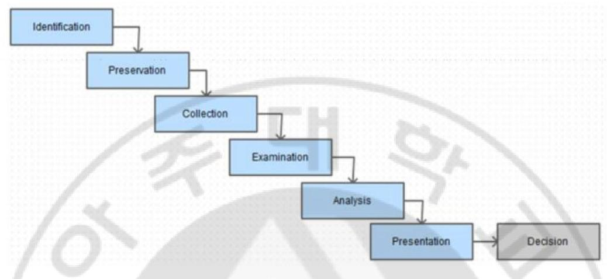
<그림 2> 디지털 포렌식 수사 절차 모델
국내의 모바일 포렌식 절차 표준화를 제안한 문서로는 ${ }^{\pi}$ 이동전화 포 렌식 가이드라인 ${ }_{4}(2007$ )이 있지만, 피셔폰을 대상으로 설명했기에 현재 스마트폰을 대상으로 한 포렌식에는 적용하기 어렵다. 또한 절차와 관 련된 내용보다는 기기에서 수집한 데이터의 증거능력 확보와 관련된 내 용이 대부분이라는 한계가 있다.

모바일 포렌식 절차 또한 전체적으로는 위 모델을 따른다. 그러나 모바일 포렌식 절차는 각 단계의 양상이 다르게 나타난다. 다음 <그림 3>은 모바일 포렌식 절차 중에서 Identification, Preservation 단계에 서의 세부 절차, 고려사항을 잘 보여준다.

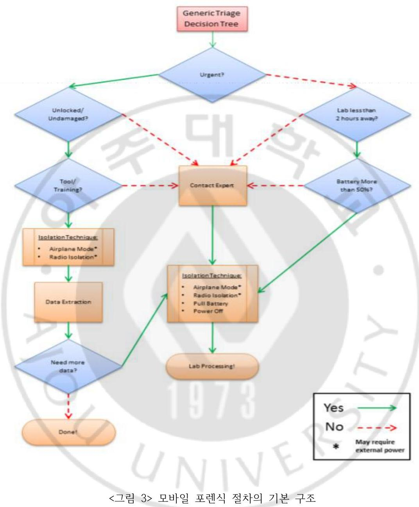

위 그림과 같이 모바일 기기. 특히 스마트폰은 네트워크에 연결되어 스마트폰 내부의 증거가 변경될 수 있으므로 Collection 단계 이전에

장치를 통신 매체로부터 격리시키는 것이 중요하다. 스마트폰의 격리 (Isolation)는 패러데이 백(Faraday bag)을 사용하면 가능한데 이는 스 마트폰으로 송$\cdot$수신되는 무선 신호를 차단한다. 그러나 이것도 통신을 완벽히 차단시켜주지는 못한다. 따라서 위 그림에 제시된 것처럼 스마 트폰을 비행기 모드(Airplane mode)로 설정하고, 무선 주파수 차폐 주 머니에 넣는 네트워크 격리가 권장된다(Radio isolation). 스마트폰이 통신 네트워크로부터 격리되면, 본격적인 증거 수집 및 조사, 분석 단 계가 시작된다. 수사관은 디지털 증거를 수집하기 위해 소프트웨어, 또 는 하드웨어 기반 모바일 포렌식 도구를 사용한다. 정확성을 보장하기 위해 여러 도구를 사용해 데이터를 수출하고 그 결과를 비교할 필요가 있으며, 수집한 디지털 증거는 해시 값 계산 및 비교 등으로 검증이 완 료된 상태로 문서화되어 보고되어야 한다.

# 제 4 항. 추출 방법에 따른 모바일 포렌식 도구의 분류 

모든 모바일 포렌식 도구는 데이터를 추출하는 방법에 따라 5 가지의 레벨로 분류될 수 있다.

# Micro   Read   Chip-Off   Hex   Dumping/JTAG   Logical Extraction   Manual Extraction 

<그림 4> 데이터 추출 방법에 따른 모바일 포렌식 도구 분류
그림에서 제시된 수동 추출(Manual Extraction) 방식은 스마트폰의 키 패드나 터치 스크린을 사용해 기기에 있는 데이터를 단순히 스크롤 하거나 데이터를 보는 것을 포함한다. 발견 정보는 사진으로 찍어 문서 화된다. 추출 과정은 빠르고 편리하며 거의 모든 기기에서 사용될 수 있다. 이 방법을 사용하는 중 UI(User Interface)에 익숙하지 않아 데이 터를 빠뜨리는 실수를 범할 위험이 있다. 이 레벨에서는 삭제된 정보를 복구하고 모든 데이터를 수집하는 것이 불가능하다.

논리적 추출(Logical Extraction) 방식은 본 논문에서 주로 다루게 될 데이터 추출 방법으로 모바일 기기를 포렌식 워크스테이션(또는 PC)에 USB 케이블, RJ-45 케이블, 블루투스 등으로 연결하여 데이터를 추출

하는 작업을 의미한다. 연결이 되면 컴퓨터가 명령을 기기로 보내고 기 기의 프로세서가 해석한다. 이후 요청된 데이터가 장치의 메모리로부터 포렌식 워크스테이션으로 전송되어 수사관이 데이터를 검토할 수 있는 방식이다. 대부분의 포렌식 도구가 논리적 추출을 수행한다. 논리적 추 출은 모바일 기기에 존재하는 파일만 복구하며, 할당되지 않은 공간에 존재하는 데이터는 복구되지 않는다.

헥스 덤프(Hex Dumping)는 물리적 추출이라고도 불리며 기기를 포렌 식 워크스테이션에 연결해 서명되지 않은 코드나 부트로더를 기기에 넣 어 기기의 메모리 덤프를 컴퓨터에 전송하는 방식이다. 이 결과로 추출 되는 미가공 이미지는 이진수 형태이기 때문에 차후 기술적인 분석이 필요하다. JTAG(Joint Test Action Group) 방식은 PCB(Printed Circuit Board)의 JTAG 포트에 연결하여 JTAG 에뮬레이터를 통해 플래시 메모 리의 모든 영역의 데이터를 덤프하는 방식이다. 논리적으로 내부 데이 터에 접근하지 않아 데이터 획득에 있어 무결성을 확보하며 증거 획득 을 할 수 있는 방법이지만 획득 속도가 느리고 최신 모바일 기기의 경 우 이러한 JTAG 방식 사용이 어려운 경우가 많다. 칩 오프는 기기의 메모리 칩에서 직접 데이터를 수집하는 것으로, 스마트폰에서 칩을 물

리적으로 제거하고 스마트폰에 저장된 데이터를 추출하기 위해 칩 리더 기나 다른 스마트폰을 사용한다. 이 방식은 기기 자체 또는 메모리 칩 에 손상을 줄 수 있으며, 기기 몸체가 손상되었지만 메모리 칩은 온전 한 경우에 선택될 수 있다. 마이크로 칩 읽기(Micro read)는 메모리 칩 상의 데이터를 수동으로 보고 해석하는 방식이다. 수사관은 전자 현미 경을 사용해 칩의 물리 게이트를 분석하고 게이트 상태를 0과 1로 해 석하여 내부 ASCII 문자를 판단해낸다. 이 방식은 거의 수행되지 않으 며 다른 모든 레벨의 추출 방식이 사용된 이후에만 적용된다.

# 제 5 항. 스마트폰에서 수집되는 디지털 증거의 분류 

상기 포렌식 도구들을 통해 스마트폰 내장 메모리, SIM 카드, 외장 저장소 카드 등에서 수집된 데이터들은 그 종류가 매우 다양하며 잠재 적인 디지털 증거가 된다. 이 디지털 증거들은 다음과 같이 분류할 수 있다.

- 주소록 : 이름, 전화번호, 이메일 주소, 연동된 SNS 계정 주소를 포함한다.
- 통화 기록 : 수신, 발신, 부재중 전화, 통화 시간을 담고 있다.

- SMS, MMS : 송$\cdot$수신한 텍스트 메시지, 첨부된 사진 및 비디오와 같은 미디어 파일을 담고 있다.
- 사진 : 스마트폰 카메라로 찍은 사진, 인터넷에서 다운로드한 사 진, 다른 기기로부터 전송 받은 사진을 담고 있다.
- 비디오 : 스마트폰 카메라로 찍은 비디오, 인터넷에서 다운로드한 비디오, 다른 기기로부터 전송 받은 비디오를 담고 있다.
- 음악 : 인터넷이나 다른 장치에서 전송 받은 음악 파일을 담고 있 다.
- 문서 : 기기의 애플리케이션이나 다른 기기, 인터넷에서 전송 받 은 문서를 담고 있다.
- 네트워크 통신 : GPS 위치 정보를 담고 있다.
- 소셜 네트웍킹 데이터 : Facebook, Instagram과 같은 SNS 애플 리케이션이 저장한 데이터를 담고 있다.

- 삭제된 데이터 : 스마트폰에서 삭제된 정보를 담고 있다. ${ }^{23}$

이 데이터들은 범죄 사건에 있어 피압수자, 즉 스마트폰 소유자와 관련된 방대한 정보를 담고 있다. 이 잠재적 디지털 증거들을 통해 수사관은 피압수자의 시간에 따른 이동 경로, 일정, 관심사, 지인 등 을 확인할 수 있으며 나아가 성격, 취향, 범죄 동기 및 수단까지 추 론해낼 수 있다. 그러나 이러한 잠재적 디지털 증거들이 사건의 단면 만을 보여주는 단순한 데이터에 그치지 않고 법정에 완전한 디지털 증거로서 제시되기 위해서는, 체계적인 절차와 신뢰받는 방식 및 도 구를 사용하여 상기한 디지털 포렌식의 일반원칙을 만족시키는 노력 아 수반되어야 한다.

[^0]
[^0]:    ${ }^{23}$ 사티시 봄미세티., op.cit. pp.49-50

# 제 3 장. iPhone 디지털 증거 수집 절차 제안 

## 제 1 절. iPhone 데이터 수집 개요 및 도구 선정

국내 모바일 시장에서 Apple 사의 iOS는 국내에서 약 $21 \%$ 의 점유율을 차지하고 있으며, 이는 안드로이드 OS의 점유율에 이은 2위다. ${ }^{24}$ 또 한 Apple 사는 개인정보보호와 보안성을 최우선으로 고려한 iPhone 설계를 표방하고 있으며, 이러한 회사의 방침은 종종 수사기관의 iPhone 내 디지털 증거 수집을 어렵게 하고 있다. iPhone은 iOS 운영 체제가 폐쇄적이며 날이 갈수록 다양하고 높은 수준의 암호화 수단 (Face ID, 보안코드 등)을 제공하기에, iPhone 기기 내 잠재적으로 디지 털 증거가 될 수 있는 데이터를 수집하고 분석하는 일의 어려움과 중요 성은 증가하고 있다.

이 문제의 해결에 기여하기 위해 본 논문은 iPhone을 대상으로

[^0]
[^0]:    24 "Mobile App : iOS vs. Android 5월 이용행태 비교 분석", koreanclick.com, 2019 년 6월 27일 수정, 2019년 11월 19일 접속,
    http://www.koreanclick.com/insights/newsletter_view.html?code=topic\&id=532 \&page $=1$

iPhone에 특화된 모바일 포렌식 도구를 적용, 실험, 검증하여, iPhone 디지털 증거 수집 절차 모델을 제안하고자 한다. 본 연구에서는 도구 선정 시 美 국립표준기술연구소(NIST)의 CFTT Program에서의 검증 여부, 국내 수사기관에서의 검증 여부를 고려하여 Elcomsoft 社의 iOS Mobile Forensic Bundle을 선정하였다. 이 도구를 최신 iOS 버전(ver. 13.1.3) iPhone에 적용하여, 본 연구에서는 미디어 파일의 메타데이터, 설치된 애플리케이션 정보, Wi-fi 접속 내역, GPS 정보 등 포렌식 수사 관점에서 가치 있는 데이터들을 우선적으로 수집하는 세부 절차를 고찰 하였다.

# 제 2 절. iPhone 기본 정보 추출 단계 

수사관은 디지털 증거 수집에 있어 가장 첫 번째로 포렌식 분석 대상 으로 지정된 스마트폰의 OS 및 버전, 모델명, 시리얼 넘버, $\operatorname{IMEI}$ (iPhone의 경우 device ID)를 확인해야 한다. 이를 확인하기 위해 입수한 iPhone은 비행기 모드로 설정하여 네트워크를 격리시켰다.

이 절차 모델을 검증하기 위해 본 연구에서 사용한 PC와 iPhone, 모 바일 포렌식 도구는 아래의 <표 7>와 같다.

| 구분 | 사용기종 | 운영체제 | 적용도구 |
| :--: | :--: | :--: | :--: |
| PC | Intel(R) | Windows 10 | Elcomsoft |
|  | Celeron(R) | Home | Mobile |
|  | N4000 CPU | (64 bit) | Forensic |
| iPhone | iPhone XR | iOS 13.1.3 | Bundle |

<표 7> iPhone 디지털 증거 수집 실험 환경

본 실험에서는 iPhone의 보안코드를 획득한 후 실험을 진행하였다.
iPhone 식별 단계의 세부절차는 다음과 같다.

1. Elcomsoft iOS Forensic Toolkit 프로그램에 포함되어 있는

Hardware USB Key를 실험용 PC에 연결한다.

<사진 1> Elcomsoft 하드웨어 USB key

2. 입수한 iPhone을 Lightening Cable로 PC와 연결한다.
3. 조사관의 PC에 Elcomsoft 사의 iOS Forensic Toolkit을 설치 후, toolkit.exe를 실행한다.
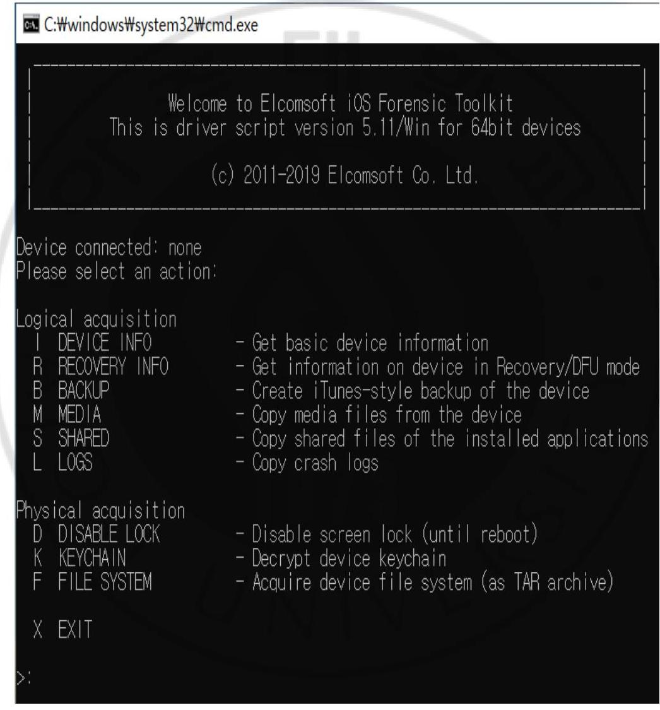
<그림 5> Elcomsoft iOS Forensic Toolkit - Toolkit.exe

4. "I" 명령어를 입력하여 iPhone의 기본정보를 추출한다.
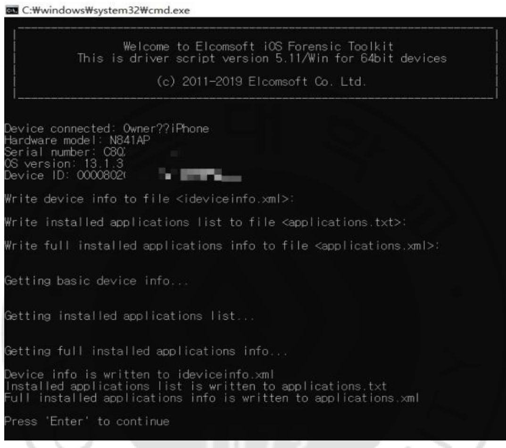
<그림 6> iPhone 기본 정보 추출 결과
이처럼 연결된 iPhone 하드웨어 모델, Serial Number, OS 버전, Device ID를 화면에서 바로 확인 가능하다. iPhone 세부 정보는 생성된 "ideviceinfo.xml" 파일, "applications.txt", "applications.xml" 파일 에 기록된다.

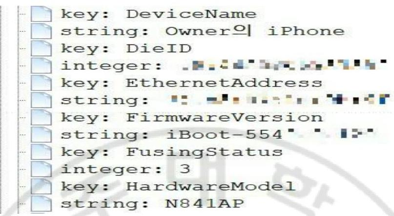
<그림 7> ideviceinfo.xml 파일
ideviceinfo.xml 에서는 위 그림처럼 iPhone의 MAC 주소, 하드웨어
모델, 펌웨어 버전 등을 확인할 수 있다. applications.txt에서는
iPhone에 설치된 애플리케이션과 그 버전을 확인할 수 있다.

[^0]<그림 8> applications.txt 파일

[^0]:    ㄱ applications - 메모장
    파일(行-편집(E) 서식(O) 보기(V) 도움말
    com.ivillab.KakaoTalk, "2019.10.1.2", "카카오톡"
    com.apple.findmy, "1", "나의 찾기"
    com.apple.FontInstallViewService, "1", "FontInstallViewService"
    net.whatsapp.WhatsApp, "2.19.100.28", "WhatsApp
    com.apple.gamecenter.GameCenterUIService, "865.3.1.2", "Game Center UI 서비스" com.apple.Numbers, "6724", "Numbers"
    com.apple.iMovie, "4846.8.66", "iMovie"
    com.apple.Health, "1.0", "건강"
    com.apple.HealthPrivacyService, "1.0", "HealthPrivacyService"
    com.apple.Home.HomeUIService, "367.0.11", "Home"
    com.apple.InCallService, "1.0", "InCallService"
    com.apple.Magnifier, "1", "확대기"
    com.apple.MailCompositionService, "3594.19", "MailCompositionService"
    com.burbn.instagram, "178418958", "Instagram"
    com.apple.mobilesms.compose, "1.0", "MessagesViewService"
    com.apple.mobilephone, "36", "전화"
    com.apple.MobileSMS, "1.0", "메시지"
    com.apple.mobilesafari, "604.1", "Safari"
    com.apple.mobileslideshow, "43", "사전"
    com.apple.mobiletimer, "1.0", "시계"
    ph.telegra.Telegraph, "15659", "텔레그램"

# 제 3 절. iPhone 미디어 파일 추출 단계 

iOS Forensic Toolkit.exe 프로그램에서 "M" 명령어를 입력하여 연 결된 iPhone의 미디어 파일(사진, 이미지, 비디오, 녹음, 음악 파일)들 과 그에 관련된 메타데이터, 미디어 파일 편집 정보를 포함한 데이터베 이스 파일을 추출한다. 이는 Apple 社의 AFC(Apple File Connection) 백업 프로토콜을 이용한 논리적 추출로, 원본 파일은 수정되지 않고 파 일 사본이 생성되어 추출되는 것이다(iPhone은 기본 설정으로 Wi-fi에 연결되어 있고 화면 잠금 상태일 때 자동 기기 백업이 실행된다).
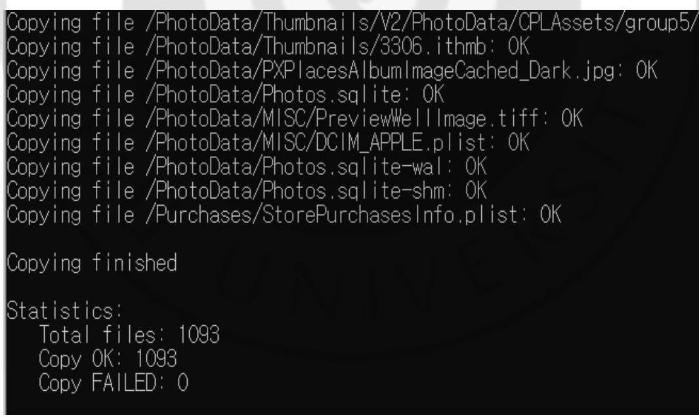
<그림 9> iPhone 미디어 파일 추출 결과

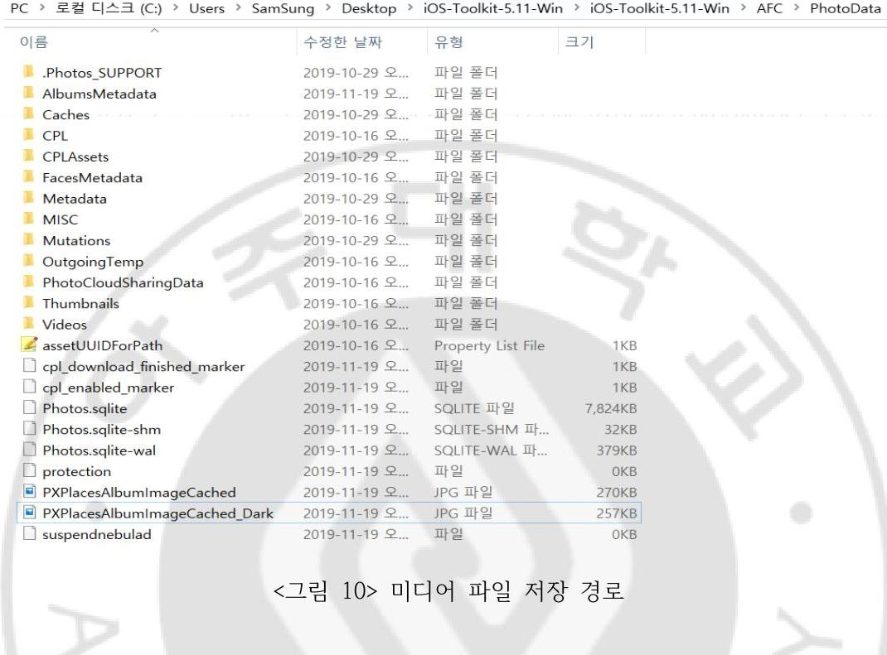

<그림 10> 미디어 파일 저장 경로

이때 추출되는 사진 및 이미지 파일들은 Photodata 폴더 내 CPLAssets, Metadata, Mutations, Thumbnails 폴더에 저장된다. 이같 은 미디어 파일 추출 선행의 장점은 입수한 iPhone의 Passcode(접근 암호)를 알 수 없는 상태(잠겨 있는 상태)에서도 컴퓨터의 수사관이 기 기 내부의 미디어 파일을 확인할 수 있다는 점이다. iPhone의 또한 백 업 파일이 암호화되어 있어도 이 명령어를 통해 기기의 Camera Roll에 접근하여 미디어 파일을 획득할 수 있다.

그러나 이 방법에 있어 iPhone의 passcode를 알 수 없는 경우, 피 압수자가 iPhone과 iTunes가 설치된 컴퓨터를 연결하여 PC 내에 생성 된 lockdown record(pairing record) 파일을 수사관이 획득해야 한다 는 전제가 존재한다. 그러므로 이 경우 PC 압수가 선행되어야 하며, passcode를 알고 있는 경우에는 바로 미디어 추출이 가능하다.

다음은 추출된 사진, 이미지 파일들이 저장되는 경로와 파일 형태이 다.

| 파일 형태 | 저장 경로 |
| :--: | :--: |
| .HEIC | Win $\backslash$ AFC $\backslash$ PhotoData $\backslash$ CPLAssets |
| .JPG | Win $\backslash$ AFC $\backslash$ PhotoData $\backslash$ Thumbnails $\backslash$ VZ $\backslash$ DCIM $\backslash 100$ APPLE |
| .THM | Win $\backslash$ AFC $\backslash$ PhotoData $\backslash$ Metadata $\backslash$ PhotoData $\backslash$ CPLAssets |
| .MOV | Win $\backslash$ AFC $\backslash$ PhotoData $\backslash$ Mutations $\backslash$ PhotoData $\backslash$ CPLAssets |
| .MP4 | Win $\backslash$ AFC $\backslash$ PhotoData $\backslash$ Thumbnails $\backslash$ VZ $\backslash$ DCIM $\backslash 100$ APPLE |

<표 8> 사진, 이미지 파일 저장 경로

이렇게 추출한 파일들은 대개 EXIF 정보가 내재되어 있다. 본 연구

에서는 Kuso Exif Viewer 프로그램으로 추출한 이미지 파일의 EXIF 정 보를 확인하며 사진의 GPS 정보, 촬영 및 수정 시간 등 사진에 대한 메타데이터를 확인하였다.

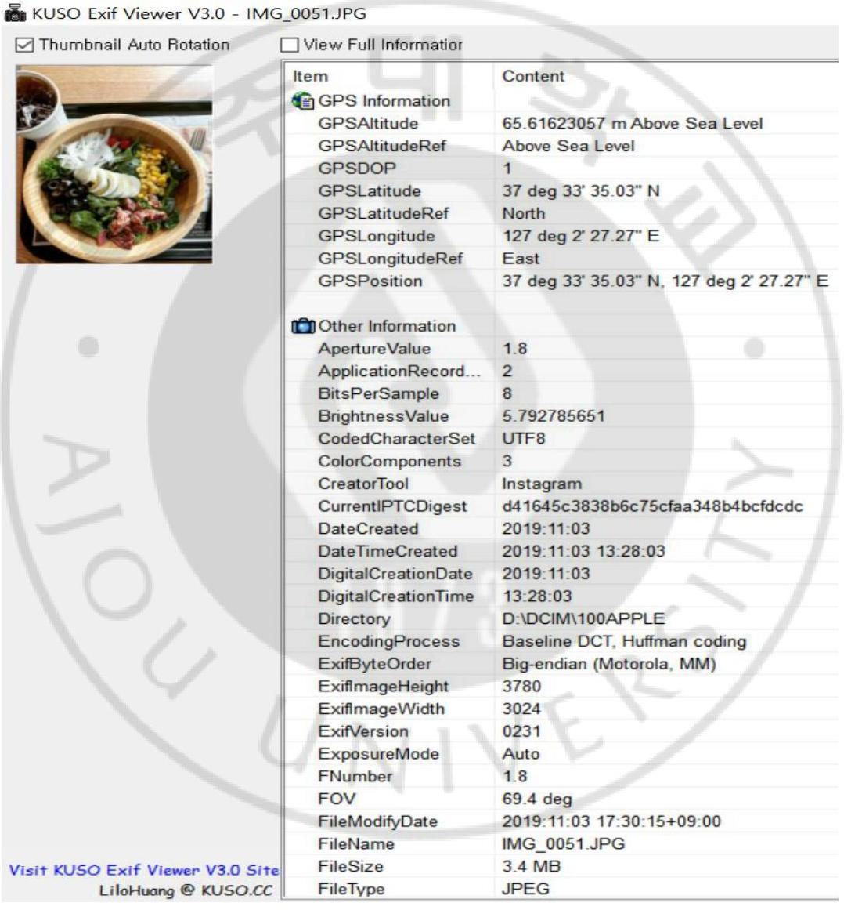
<그림 11> 추출 이미지 파일 메타데이터

# 제 4 절. iPhone 백업 파일 및 데이터 추출 단계 

iOS Forensic Toolkit.exe 프로그램 화면에서 "B" 명령어를 입력하여 연결된 iPhone의 백업 데이터를 추출한다. 이때 데이터는 status.plist, manifest.plist, info.plist, manifest.db 파일 등에 기록되며, iPhone의 백업이 암호화하지 않았다면 프로그램상 임시로 백업 암호를 "123"으 로 자동으로 설정한다. 이 방식은 논리적 추출에 해당하며, iTunes의 동기화 시스템을 이용하는 것이기에 이 방식을 이용하기 전 수사관의 PC에 iTunes 프로그램을 설치하는 작업이 선행되어야 한다.

## C:\#windows\#system32\#cmd.exe

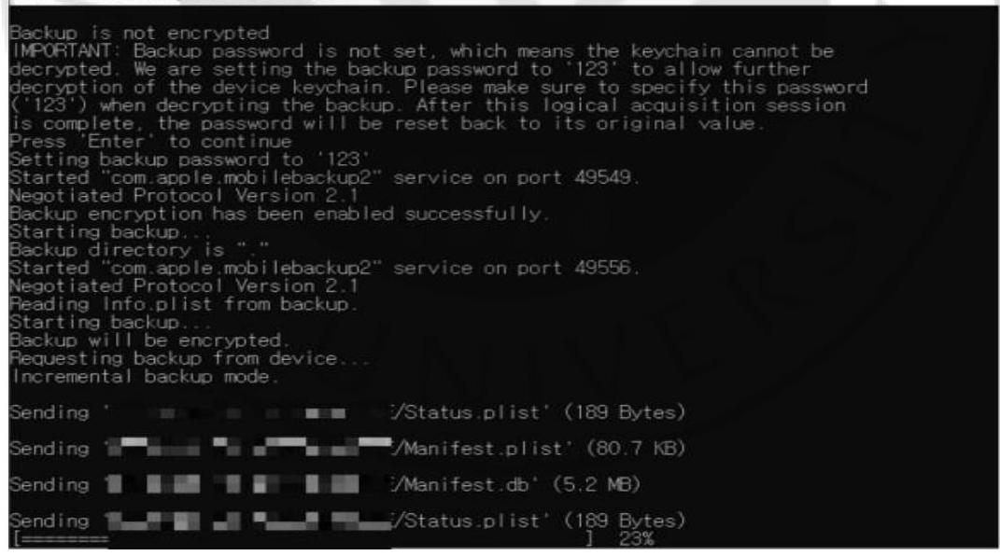
<그림 12> iPhone 백업 파일 추출 및 암호화

$\checkmark \mathrm{I}-\mathrm{P}(3)$
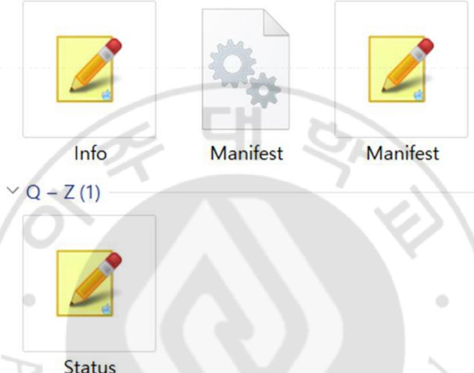

<그림 13> 생성된 iPhone 백업 데이터 파일
아후 Elcomsoft Mobile Forensic Bundle에 포함되어 있는 Elcomsoft Phone Viewer 프로그램을 실행 후, 생성된 iOS 백업 파일 manifest.plist를 불러온다. 이 파일은 설치된 애플리케이션에 대한 정 보, 연락처, 일정표 등을 포함한다. 이 암호화된 백업 파일을 상기 임의 설정된 암호("123")를 입력해 아래와 같이 프로그램상 복호화하는 절차 를 거친다.

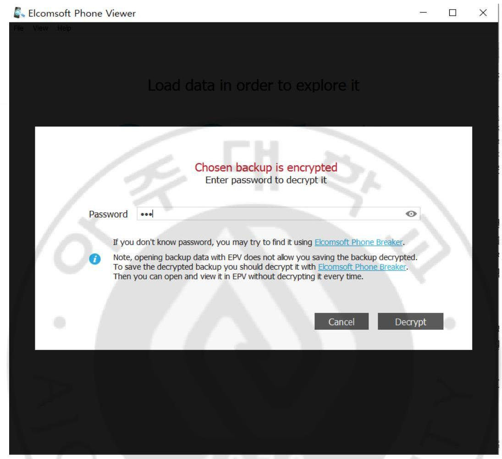
<그림 14> iPhone 백업 데이터 파일 복호화
복호화가 완료되면 논리적으로 추출한 iPhone 백업 데이터가 프로그 램을 통해 조사관이 분석하기 용이한 형태로 나타난다. 이 데이터는 iPhone 기본 모바일 웹 브라우저인 Safari를 통해 브라우징한 웹 히스 토리 및 검색 기록, 통화기록, 문자메시지, 사용자의 Wi-fi 연결, Web 연결, 위치 정보 및 건강(이동) 정보까지 포함하고 있다.

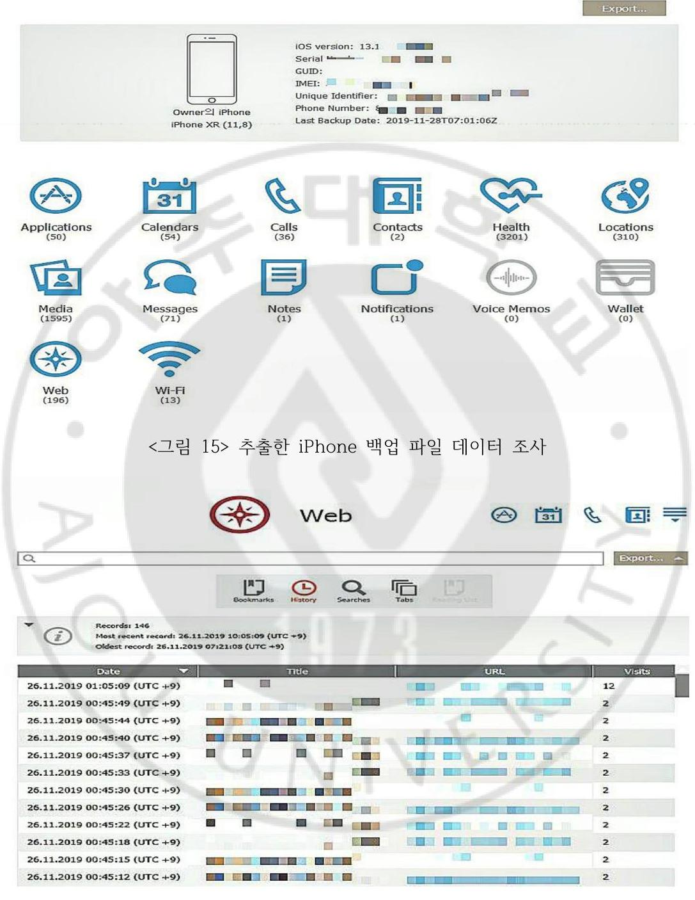

<그림 16> Safari 웹 브라우징 히스토리

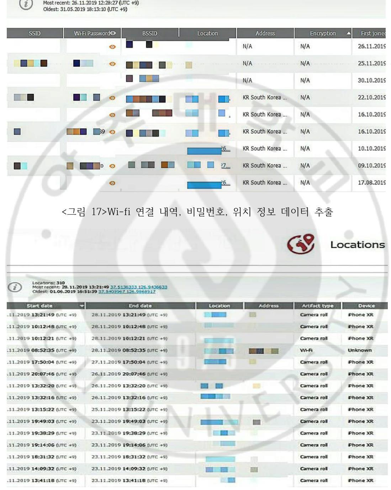

<그림 18> 미디어 파일. Wi-fi 접속 내역을 통한 위치 정보 수집

# 제 5 절. iPhone 데이터 물리적(파일시스템) 추출 

이 단계를 진행하기 앞서 먼저 기기의 iOS가 Jailbreak(탈옥)이 가능 한 버전인지 확인한다. 탈옥은 안드로이드에서 루팅 권한(슈퍼 유저 권 한)을 얻는 것과 유사하다. 탈옥이 적용될 수 있는 iOS 버전이라면 탈 옥 툴을 사용한다. 본 실험에서는 PC에 Cyndia Impactor 프로그램을 설치, 연결된 iPhone에 unc0ver 탈옥 툴의 iOS App을 내려받는 방식 으로 탈옥을 시도하였으나, 최신 iOS(ver. 13.1.3)의 스마트폰에서는 탈 옥이 불가능함을 확인하였다.

현 시점에서 Apple ㄹ는 허용(signed)한 최신 OS버전 2 3개에 한해 OS 다운그레이드를 가능케 함으로써, 탈옥 가능한 낮은 버전으로 iOS 를 낮추는 작업을 막고 있다. iOS 업데이트 속도에 발맞춘 탈옥 툴 개 발도 미비한 상황이다. 현실적으로 탈옥이 가능한 iOS 버전으로의 다운 그레이드는 피압수자의 PC에 탈옥 가능한 구 버전 iOS의 SHSH Blobs(iOS 복원 및 업데이트를 제어하는 디지털 서명 데이터)가 저장되 어 있어 그것을 입수했을 때에만 가능하다. 아래 그림은 iPhone에서 탈옥 가능 여부를 검증하는 실험 과정을 나타낸다.

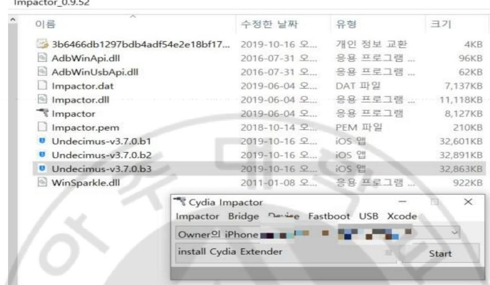
<그림 19> Cydia Impactor를 통한 iPhone jailbreak app 설치
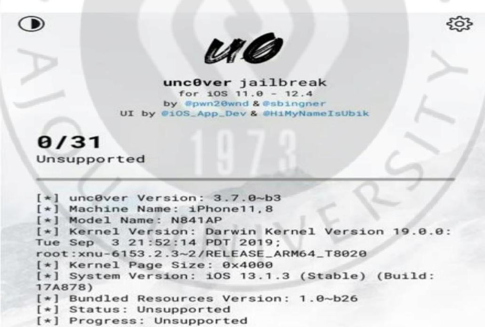
<그림 20> jailbreak 앱 unc0ver가 iPhone에 설치된 모습

수사관이 舊 iOS, 舊 iPhone 모델 대상으로 탈옥에 성공하였을 경우, 루트 권한을 가지게 된다. 그러므로 iOS Forensic toolkit.exe 프로그램 을 활용하여 아래와 같은 일련의 절차를 거쳐 파일 시스템 이미지 전체 를 추출하여 파티션에 기록된 iPhone 데이터를 획득할 수 있게 된다.

1. 프로그램상 화면에서 "D" 명령어를 통해 기기의 자동 잠금을 무 력화시켜 추출 과정 동안 iPhone의 자동 잠금을 막는다.
2. "K" 명령어를 통해 키 체인(암호화된 사용자의 웹사이트 암호 및 계정 정보 저장소) 데이터베이스를 추출한다.
3. "F" 명령어를 통해 파일 시스템 이미지 전체를 추출하여, 애플리 케이션 데이터, 임시 파일, 저장한 이메일, 시스템 로그 등의 데이 터를 획득한다.

이렇게 추출된 키 체인은 Elcomsoft Phone Breaker 프로그램을 통 해 복호화하여 수사관은 기기 저장 암호를 평문으로 확인할 수 있다. 또한 Facebook, Whatsapp, Skype, Signal, Telegram 등 메신저 애플 리케이션 내에서 행해진 대화 기록 데이터 또한 수집 가능하다.

위 내용을 포함하는 본 연구의 절차 모델 제안을 순서도로 나타내면 아래 그림과 같다.

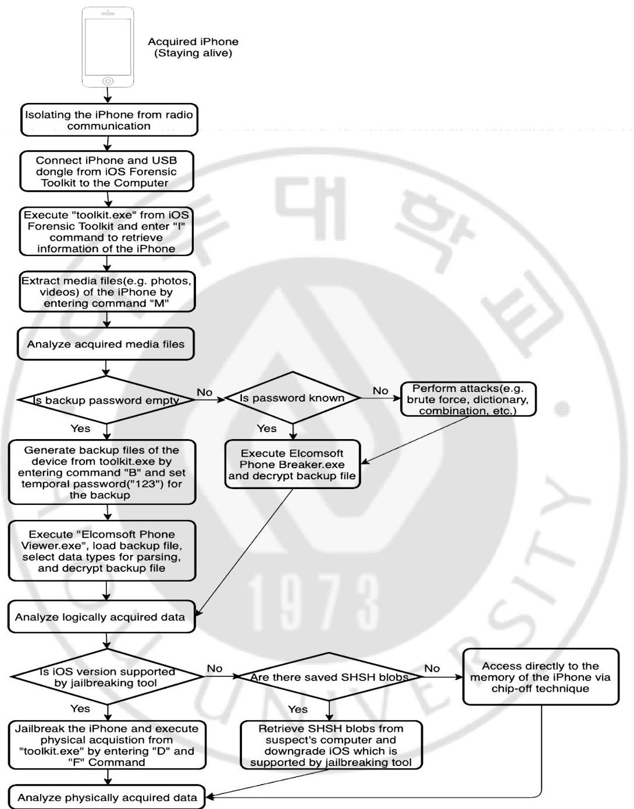
<그림 21> iPhone 디지털 증거 수집 절차 제안 순서도

# 제 4 장. 안드로이드폰 디지털증거 수집절차 제안 

## 제 1 절. 안드로이드폰 데이터 수집 도구 선정 과정

안드로이드 OS의 가장 큰 특징은 오픈소스라는 점으로, 이 운영체제 를 탑재한 스마트폰이 매우 다양한 만큼 안드로이드 폰의 데이터를 수 집하는 포렌식 도구 또한 다양하다. 본 연구에서는 미 국립표준기술연 구소(NIST)의 CFTT 프로그램 도구 검증에서 가장 높은 데이터 수집 성공률 ${ }^{25}$ 을 보인 MOBILedit Forensic Express 프로그램을 선정하였다.
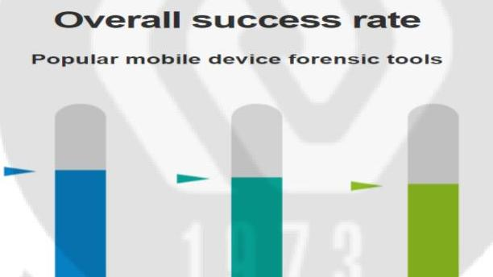
<그림 22> 모바일 포렌식 도구 데이터 수집 성공률

[^0]
[^0]:    25 "Mobile device Forensic tool test results performed by NIST", Compelson, 2019년 11월 20일 접속. https://www.mobiledit.com/nist-report

# 제 2 절. 안드로이드 스마트폰 루팅 

안드로이드 OS 기반 스마트폰에서 루팅은 최상위 권한을 얻음으로써, 해당 기기 제조사 측에서 설정한 제약을 해제하는 행위를 뜻하며, iPhone의 탈옥과 유사한 개념이다. 루팅된 스마트폰에서는 그렇지 않 은 스마트폰보다 더 많은 양질의 정보를 획득할 수 있다. 본 연구에서 는 루팅 후 데이터 수집을 진행하였다.

루팅 지원 도구에는 여러 가지가 있지만, 본 연구에서는 선정한 삼성 전자 스마트폰과 호환성이 높은 Odin3 프로그램을 사용하였다. 실험에 사용한 스마트폰, 포렌식 도구, 루팅 도구는 다음과 같다.

| 구분 | 사용 기종 | 운영체제 | 포렌식 도구 | 루팅 도구 |
| :--: | :--: | :--: | :--: | :--: |
| PC | Intel(R)   Celeron(R)   N4000 CPU | Windows 10   Home(64 bit) | MOBILedit   Forensic   Express | Odin3-v3.10.6 |
| 스마트폰 | Samsung   Galaxy Note 5 | Android 7.0   (Nougat) |  |  |

<표 9> 안드로이드폰 데이터 수집 절차 검증 환경

# 제 3 절. 안드로이드폰 기본 정보 식별 

본 연구에서는 안드로이드 스마트폰 화면 잠금의 PIN 번호를 획득한 상태에서 실험을 진행하였다. 안드로이드폰 기본 정보 식별 절차는 다 음과 같다.

1. 수사관 PC에 설치된 MOBILedit Forensic Express.exe 프로그
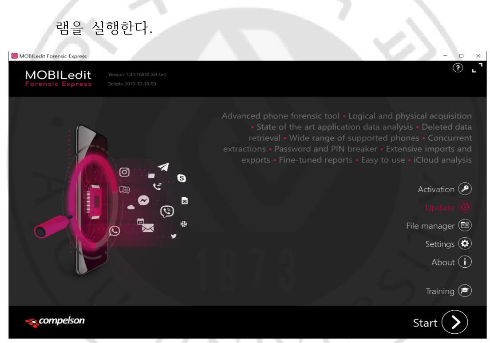
<그림 23> MOBILedit Forensic Express 실행 화면
2. 입수한 스마트폰을 수사관의 PC에 연결한다.
3. 스마트폰 설정을 USB 디버깅 허용 상태로 조정한다.

4. 기기에 Forensic Connector app를 설치한다. 프로그램 화면에 서 제공되는 링크로 스마트폰에 앱(.apk 파일)을 내려받는다.
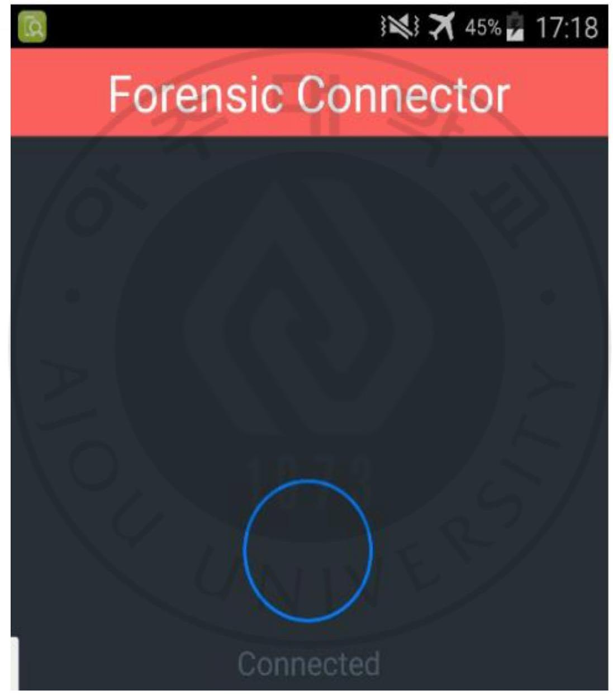
<그림 24> 안드로이드폰 Forensic Connector

5. 스마트폰의 모델명은 프로그램 실행 후 바로 인식되나, 스마트폰 의 더 많은 정보를 얻기 위해 프로그램에서 'Device info only' 를 클릭하고, 기기 정보를 추후 쉽게 확인하기 위해 pdf 형태 추출로 지정한다. 이후 Export를 클릭하면 .pdf 확장자의 조사 결과 보고서가 생성된다.
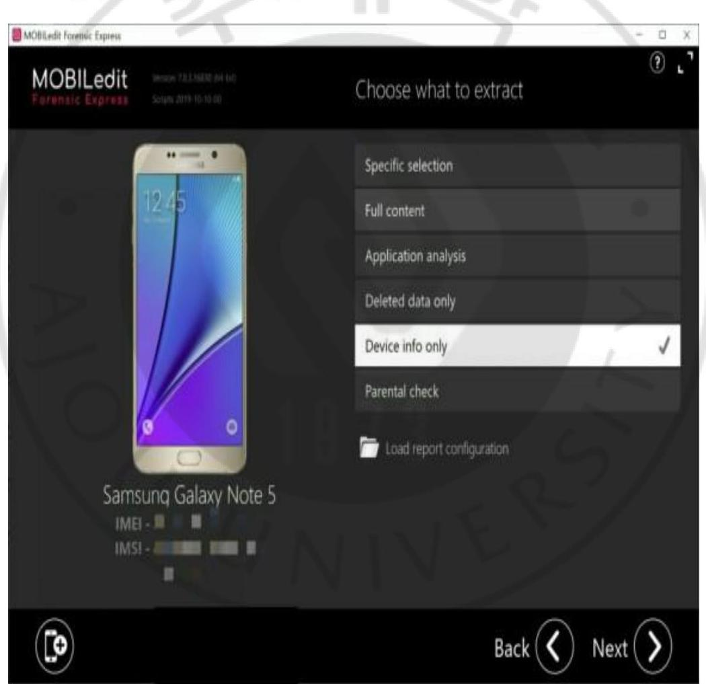
<그림 25> 안드로이드폰 데이터 추출 옵션

# Android Phone Case \#2 

## Case Evidence Number: Evidence \#2

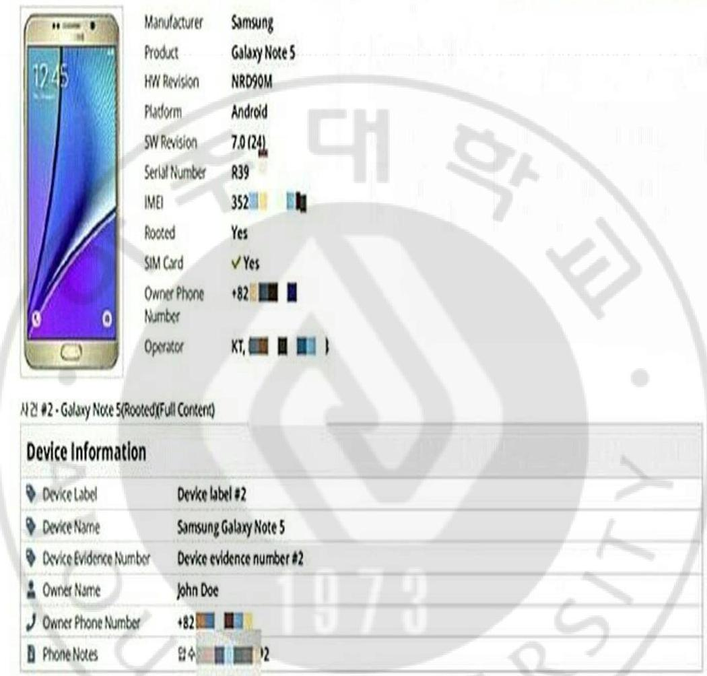

<그림 26> 안드로이드폰 기기 기본 정보 추출 결과 보고서
실험 결과 이 포렌식 도구를 활용해 스마트폰의 운영체제 버전.
Serial Number, IMEI, 전화번호와 같은 기본 정보를 .pdf 보고서 형태 로 용이하게 확인할 수 있었다.

# 제 4 절. 안드로이드폰 삭제 데이터 추출 

포렌식 수사를 진행하는 조사관의 관점에서 가장 관심 있게 보아야 할 것은 스마트폰 내 삭제된 파일이라 할 수 있다. 압수수색 절차상 피 압수자가 압수를 사전에 고지받기에, 피압수자는 압박을 느끼고 본인에 게 불리한 파일을 삭제하였을 가능성이 있다. 따라서 본 연구에서 제시 하는 절차 모델에서는 스마트폰 기본 정보 식별 이후 바로 삭제 데이터 확인을 진행한다. 이것은 MOBILedit Forensic Express 프로그램 기능 중 하나를 적용하여 이루어진다. 절차는 다음과 같다.

1. MOBILedit Forensic Express 프로그램에서 'deleted data only' 을 선택한다.
2. 보고 문서파일 형식, 사건 세부 사항, 추출 데이터 저장 경로를 선택 후 추출한다.

이 작업을 통해 조사관은 삭제된 파일의 목록들, 삭제된 전화 기록, 삭제된 메시지 등을 또한 .pdf 형태의 보고서로 쉽게 확인할 수 있다.

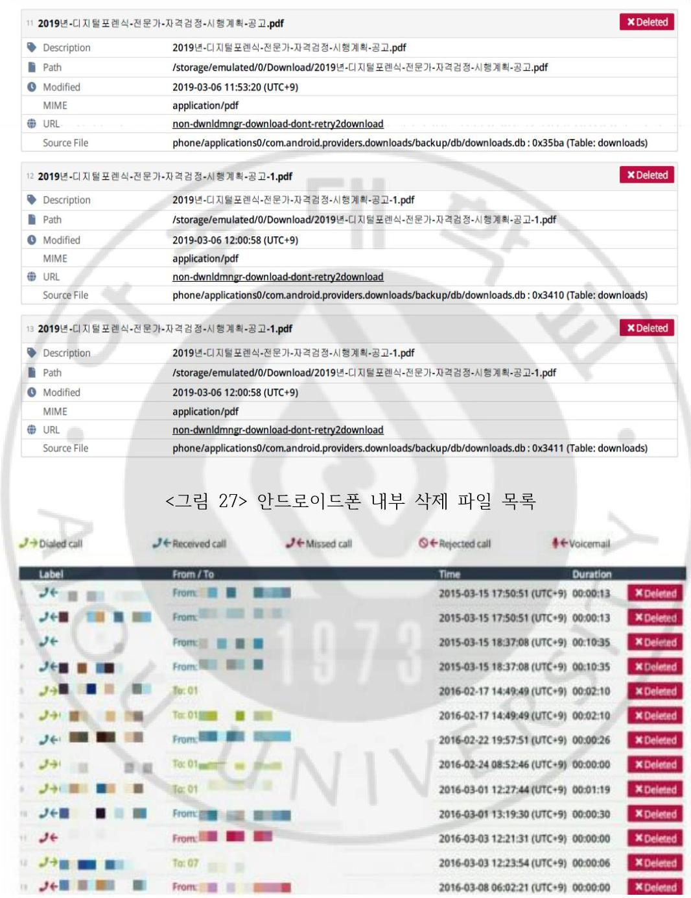

<그림 28> 안드로이드폰 내 삭제된 전화기록 목록

# 제 5 절. 안드로이드폰 전체 데이터 추출 

안드로이드 스마트폰의 가능한 모든 데이터를 추출하여 PC에서 조사 관이 분석할 수 있도록 만드는 단계다. MOBILedit Forensic Express 프로그램은 추출한 데이터를 종류별로 분류하여 .pdf, .html, .xls 파일 형태로 정리해주기에 조사관이 분석하기에 용이하다. 데이터 추출 결과 를 전체적으로 개괄하는 보고서는 report.pdf에서 확인 가능하며 추출 절차는 다음과 같다.

1. 입수한 스마트폰을 PC와 연결하고, Full content 추출을 선택한 다.
2. 보고서 형식, 세부사항, 수집데이터 저장 경로를 선택 후 추출한 다. 이 프로그램을 통해 추출된 데이터들은 파일 시스템 단위의 정보를 포함하며 애플리케이션별로 분류되어 .xlsx 파일에 기록 된다.

본 연구에서 실험 대상이 된 안드로이드폰은 루팅 절차를 거쳤기 때문 에, 파일 시스템 추출(물리적 추출)이 가능하다.

nents (D:) > Samsung Galaxy Note 5 Experiment Results > Samsung Galaxy
backup files
$\square$ excel files
$\square$ html files
mobiledit export files
pdf files
$\square$ loq full
$\square$ loq short
mobiledit backup
mobiledit export
$\square$ Report
report confiquration.cfq
Report index
Report lonq
$\square$ xlsxReport
$\square$ xlsxReport Applications Foodie
$\square$ xlsxReport Applications Google Play 서비스
$\square$ xlsxReport Applications Instaqram
$\square$ xlsxReport Applications OneDrive
$\square$ xlsxReport Applications Samsung Pay
$\square$ xlsxReport Applications TouchWiz 홈
$\square$ xlsxReport Applications WhatsApp
$\square$ xlsxReport Applications 갤러리
$\square$ xlsxReport Applications 시스템 UI
$\square$ xlsxReport Applications 원스토어
$\square$ xlsxReport Applications 전화0
$\square$ xlsxReport Applications 카카오톡
$\square$ xlsxReport Contacts
$\square$ xlsxReport Deleted Data
$\square$ xlsxReport Filesystems

위 파일들 중 xlsxReport Filesystems 엑셀 파일을 열면 추출된 파 일 각각에 부여된 해시(SHA-256) 또한 확인할 수 있다. 이는 수집 절 차 완료 후 증거 분석 및 보고 절차에서 유용할 것으로 판단된다.

| File/Type File/Path | File/Size File/3ha256hash |  |
| :--: | :--: | :--: |
| filesystem phone/misc/account_icons/_10.png | 9314 FC2D493729C793735856A3EEC9661164825A99A752F487C38299DF2977A7E793 |  |
| filesystem phone/misc/account_icons/_12.png | 9314 FC2D493729C793735856A3EEC9661164825A99A752F487C38299DF2977A7E793 |  |
| filesystem phone/misc/account_icons/_16.png | 15714 A44AE6685E2F36270057F9CB79616588BA71CA9C25200249506178E6047A2CDA |  |
| filesystem phone/misc/account_icons/_18.png | 5034 FBCE802D14E871394A3508D82FE88CFC77CDA16281CD2284833F0401FO8E9D77 |  |
| filesystem phone/misc/account_icons/_20.png | 5034 FBCE802D14E871394A3508D82FE88CFC77CDA16281CD2284833F0401FO8E9D77 |  |
| filesystem phone/misc/mig_attachments/_3930.png | 37859 BDA1FF1254712AAF979EE88687A718673262C1588BD02C6CCB4236FA475ABD8B |  |
| filesystem phone/misc/mig_attachments/_3936.sml | 431 31FFBAF132FBE1FF089F74755A7E577E62A8B2183D59C58F3C126BE0DC922EAF |  |
| filesystem phone/misc/mig_attachments/_3938.png | 149598 9E2EAFE94C9F28DAEE996DFCE2839C92F5EBE418DF389D449EE37113452201ED |  |
| filesystem phone/misc/mig_attachments/_3940.png | 219116 525889FABA45FE3FFFBEAF8F308815F61A40752C74FA0BCE0F6FBA4D538FB32E |  |
| filesystem phone/misc/mig_attachments/_3942.png | 243681 7252D5BB79693491FB5F01886AACTAA1E0BA30C92D9D1D8A5E4B3661B57F71D1 |  |
| filesystem phone/misc/mig_attachments/_3945.sml | 263 CA1AE1B088DA164500A7A3D059A01BD15C936F759987645A178CB4CAA376D6B4 |  |
| filesystem phone/misc/mig_attachments/_3947.png | 149598 9E2EAFE94C9F28DAEE996DFCE2839C92F5EBE418DF389D449EE37113452201ED |  |
| filesystem phone/misc/mig_attachments/_3950.sml | 263 CA1AE1B088DA164500A7A3D059A01BD15C936F759987645A178CB4CAA376D6B4 |  |
| filesystem phone/misc/mig_attachments/_3952.png | 149598 9E2EAFE94C9F28DAEE996DFCE2839C92F5EBE418DF389D449EE37113452201ED |  |
| filesystem phone/misc/mig_attachments/_3958.png | 37756 90A66F70EAC6131FCA1DOAF8FC280A6ES0488DB91F7503DD7FBA704CE38FB026 |  |
| filesystem phone/misc/mig_attachments/_3961.png | 37621 93E13558092FBC5C4BA962727F280FC2E86FE5A766882AE6809D6A253F38F354 |  |
| filesystem phone/misc/mig_attachments/_3971.sml | 120 03894565FBEFC6EC574CD59898CC0E78467CB5C8D77AC0B4850443DA7605C39D |  |
| filesystem phone/misc/mig_attachments/_3973.vcf | 254 8D682850A5276866F47BE3B1A8691E6F79BAFA5EFC99DC68FF6696AED3D83ED0 |  |
| filesystem phone/misc/mig_attachments/_3976.sml | 262 A99FDADBC692FF74AC73B03EB354F98AD27A606D80AE98A8790B6948DAFF614A |  |
| filesystem phone/misc/mig_attachments/_3978.png | 65843 4D66C136740AA86DBAB68E8DE3EB82657C66AD8E1D7D6E88C23726594987BD32 |  |
| filesystem phone/misc/mig_attachments/_3981.sml | 263 7C8685409A919DC331E8FB6209225835C693763CA89218AAA889B8F21212914F |  |
| filesystem phone/misc/mig_attachments/_3983.png | 212327 861B311FB86AF9A02CD1E3640E33A5666D2EB339388E9D81358637253DED6018 |  |
| filesystem phone/misc/mig_attachments/_3986.sml | 259 B7AA2130D40778E57C3A7D985B3C8E25F4D62502B6719D7F67EB067BAA59A379 |  |
| filesystem phone/misc/mig_attachments/_3988.png | 125753 F2DE6A5CADFB4185EF6F3ED5B2C4B57880B619EF84BCF45A3208412DFBACEB3F |  |
|  |  |  |  |
|  |  |  |  |

<그림 30> 파일 시스템 내부 이미지 파일 저장 경로 및 해시

# 제 5 장. 스마트폰 디지털 증거 분석 기법 제안 

## 제 1 절. 메신저 삭제 데이터 복구 기법 및 절차

기존의 문자메시지 대신 스마트폰 메신저 애플리케이션을 통한 메시 지 및 미디어 파일 교환이 보편화되면서, 메신저상의 데이터들을 분석 하는 일의 중요성은 나날이 증가하고 있다.

모바일 메신저에 비밀 대화방, 대화 삭제 기능이 추가되고 암호화 메 커니즘이 적용되면서, 피압수자의 스마트폰 메신저에서 삭제된 데이터 를 복구하는 작업 또한 모바일 포렌식 분야에서 중요한 이슈가 되었다. 피압수자가 삭제한 데이터가 복구, 증거화되어 사건의 결정적인 단서로 작용하는 사례가 나타나고 있기 때문이다.

우리나라에서는 모바일 메신저로 카카오톡 앱이 가장 많이 사용되지 만, 본 연구에서는 최근 우수한 보안성을 이유로 다양한 단체에서 사용 되고 있는 텔레그램 메신저에서 삭제된 메시지를 복구하였다. 사용된 도구와 절차는 아래와 같다.

|  | 사용기종 | 운영체제 | 적용도구 |
| :--: | :--: | :--: | :--: |
| PC | Intel(R)   Celeron(R) N4000   CPU | Windows 10   Home   (64 bit) | Mreaper Lite.exe   (v1.3.34) |
| 스마트폰 | Samsung   Galaxy Note 5 | Android 7.0   (Nougat) |  |

<표 10> 텔레그램 메신저 복구 실험 환경 및 도구

1. 입수한 스마트폰을 비행기 모드로 설정하여 네트워크 연결을 차 단시키고, PC에 설치된 Mreaper Lite.exe를 실행한다.
2. 입수한 스마트폰 기종에 맞는 운영체제를 선택한다.

# $\mathrm{REAPER}$ 

## ANDROID

안드로이드폰 복구 시작

IOS
아이폰 복구 시작

## DATA

결과 불러오기

## 이 전

## 다 음

<그림 31> Mreaper Lite.exe 실행 후 기종에 맞는 운영체제 선택

3. 복구하고자 하는 메신저 종류(텔레그램)를 선택한다.
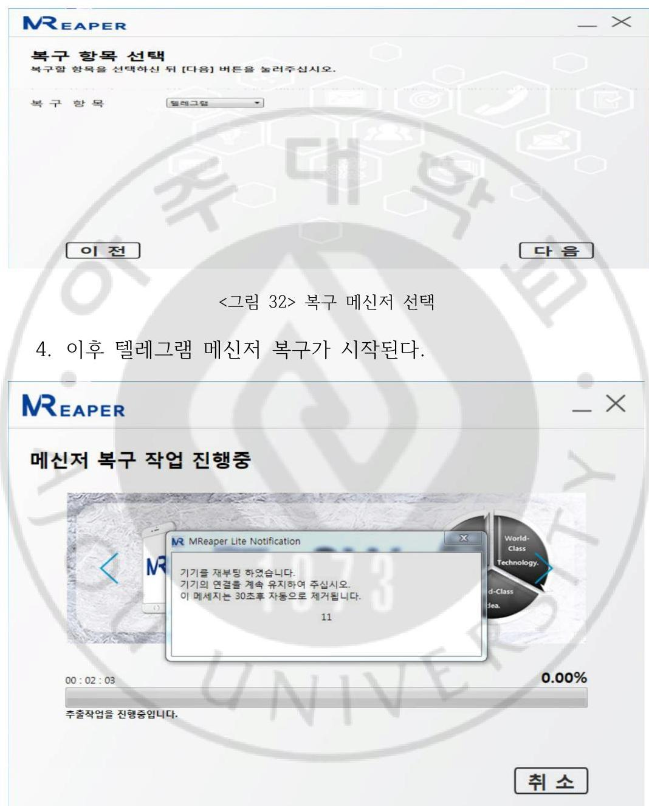
<그림 33> 텔레그램 메신저 복구 작업

이렇게 추출된 데이터는 기본 설치 경로인 C:\MReaper Lite\saved에 저장되며, 엑셀 파일 형태로 저장된다. 삭제된 파일들은 복구 전 "***" 표시로 나타나고 결제 이후 가려진 부분을 확인할 수 있다.
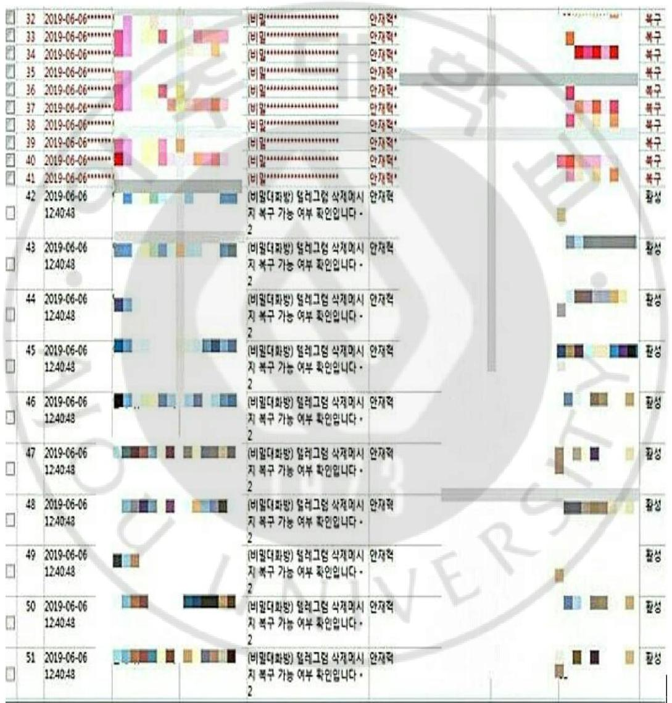
<그림 34> 텔레그램 삭제 메시지 목록

텔레그램의 기능 중 하나인 비밀대화방에서의 메시지 또한 아래의 그 림과 같이 복구 가능한 것을 확인하였다.
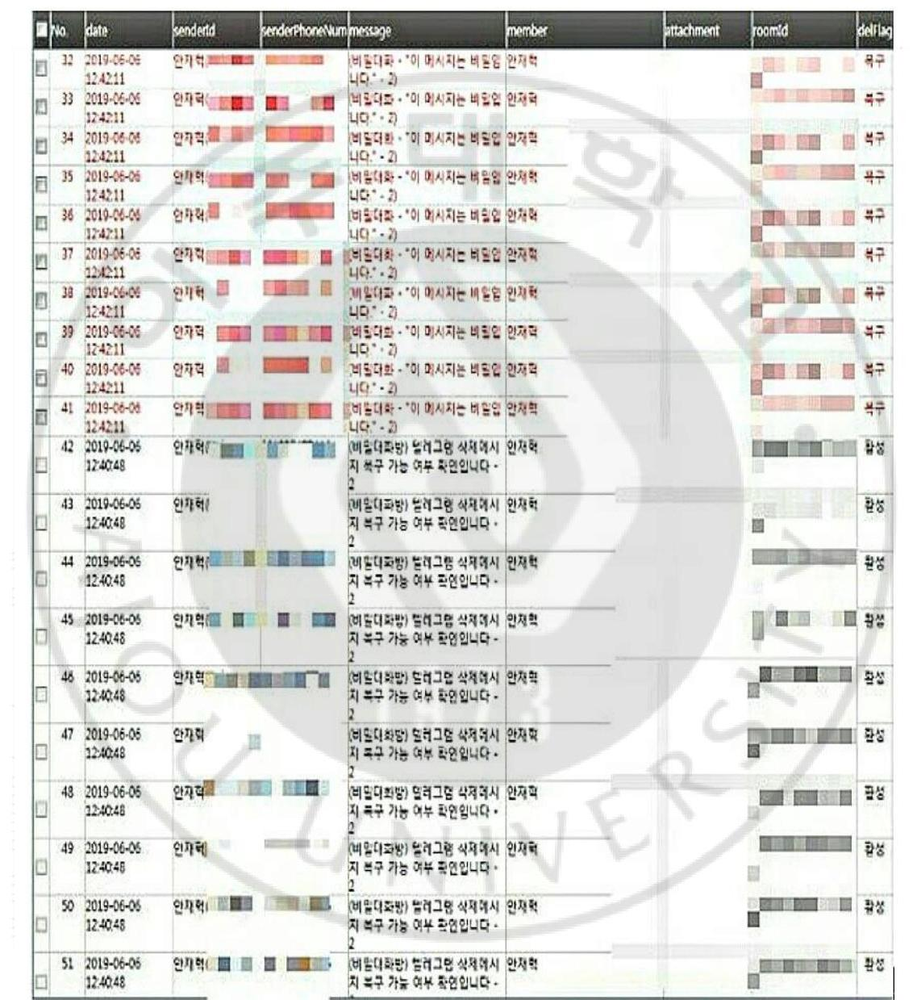
<그림 35> 텔레그램 삭제 메시지 복구 결과

# 제 2 절. 구글 계정 연동 데이터 추출 및 분석 

현 시점에서 대부분의 사람들이 구글 계정을 갖고 있으며, 구글 계정 에 로그인된 상태에서 구글을 이용해 검색을 하는 경우가 많다. 피압수 자의 검색어 목록은 고스란히 구글 검색 데이터베이스에 남게 되고, 이 는 포렌식 수사에서 유용한 데이터로 활용될 수 있다.

또한 구글이 최대 영상 플랫폼인 Youtube를 인수한 이후로, 유튜브 계정은 구글 계정과 연동되어 개설된다. 피압수자가 구글과 유튜브에서 찾고자 입력했던 검색어와 실제 시청한 유튜브 영상이 무엇인지 안다면 피압수자의 관심사, 취향, 시간 소비 및 행동 패턴 등을 파악하는 데 도움이 된다.

본 연구에서는 Elcomsoft Cloud eXplorer 프로그램을 활용하여, 구 글 계정 로그인 상태에서 크롬 브라우저로 검색한 구글 및 유튜브 플랫 폼 검색 기록, 웹 히스토리, 시청 영상 목록을 추출하였다. 이 프로그램 을 활용하기 위해서는 피압수자의 PC 압수가 선행되어야 하며, 스마트 폰 뿐만 아니라 PC 환경에서 검색한 목록들도 추출된다는 특징을 갖고 있다.

실험 도구와 추출 목록, 절차는 다음과 같다.

|  | 구글 | 유튜브 | 적용 도구 |
| :--: | :--: | :--: | :--: |
| 추출 정보 | 구글 검색 히스토리 | 유튜브 검색 히스토리 | Elcomsoft   Cloud   eXplorer |
|  | Visited Tree 히스토리 |  |  |
|  | 구글 캘린더 기록 | 유튜브 시청 히스토리 |  |
|  | 저장된 비밀번호 |  |  |
| Google account | ******@gmail.com | ******@gmail.com |  |

<표 11> 구글 계정 연동 데이터 추출 실험 환경

1. 조사관은 조사에 앞서 압수된 PC에 Elcomsoft Cloud eXplorer 패키지 프로그램을 설치해야 한다. 이 프로그램 폴더 내에 있는 GoogleTokenExtractor.exe를 실행시킨다.
2. GoogleTokenExtractor 프로그램은 실행 즉시, PC에 저장된

Google Chrome 계정정보를 찾고, 크롬 브라우저를 사용한다면 PC에 설치되어 있을 Chrome 데이터베이스에서 구글 ID(토큰)를 획득한다.

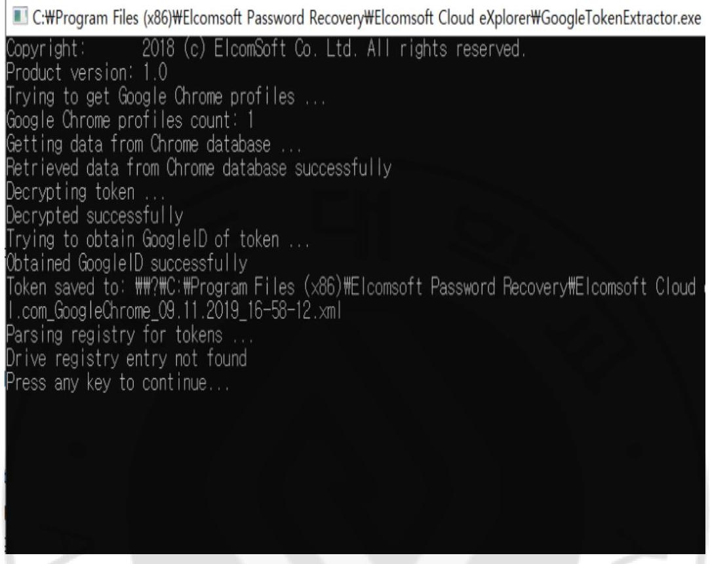
<그림 36> GoogleTokenExtractor.exe
3. 위 그림처럼 .xml 형태 파일에 저장된 토큰은 구글 계정에 접근 하는 로그인 수단으로 활용될 수 있다. Elcomsoft Cloud eXplorer 프로그램 실행 후, File에서 Add Google Snapshot으 로 들어간다.
4. 인증 방식은 구글 계정 적접 접속을 통한 인증 방식과 토큰 인 증 방식이 있으며, 본 연구에서는 피압수자의 구글 계정 비밀번

호를 알아내지 않고도 접속할 수 있는 토큰 인증 방식을 택하였 다.
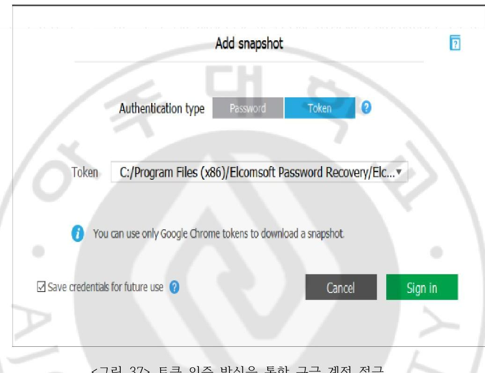
<그림 37> 토큰 인증 방식을 통한 구글 계정 접근
5. 위 그림처럼 토큰을 통해 인증되면, 아래와 같이 피압수자의 구 글 계정 생성 이래 로그인된 상태에서 PC, 스마트폰, 대블릿 등 의 기기에 접속해 브라우징한 웹 히스토리, 검색어 목록, Wi-fi 접속 기록, 구글을 모두 확인할 수 있다. 특히 이 기록들은 HTML 파일 형태의 보고서로 추출하여 피압수자의 검색어와 접 속한 웹 사이트 URL를 한 눈에 확인할 수 있다.

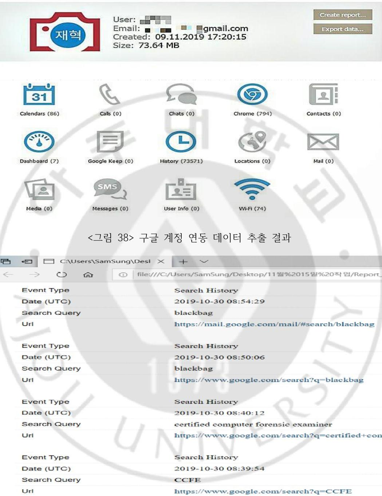
<그림 29> 구글 검색 히스토리 추출 결과

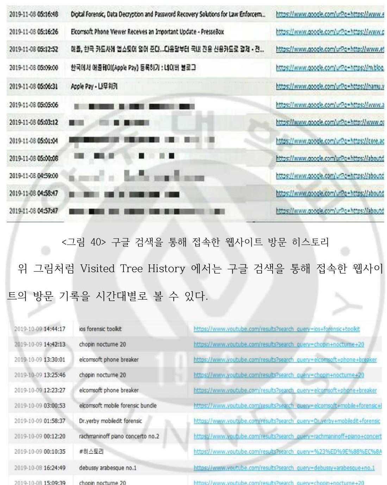

<그림 41> Youtube 검색어 추출

통계에 따르면 국내 PC$\cdot$모바일 인터넷 이용자의 약 $60 \%$ 가 유튜브에서 정보를 검색한다. 유튜브의 영향력이 동영상 콘텐츠 소비 영역에서 검색 영역까지 확대된 것이다. ${ }^{26}$ 또한 모바일 인터넷을 사용하는 시간은 하루 평균 166.5 분으로 조사되었고, 이 중 75.7 분을 모바일 동영상을 시청하는 데 사용하는데 그 중에서도 가장 많이 사용되는 모바일 플랫폼은 $89.4 \%$ 를 차지한 유튜브였다. ${ }^{27}$ 향후 5 G 기술을 비롯한 모바일 통신기술과 동영상 플랫폼 및 컨텐츠 시장의 발전에 힘입어, 위 사진과 같이 모바일 웹 데이터, 특히 동영상과 같은 미디어 파일 관련 데이터가 포렌식 수사 과정에서 갖는 가치는 점점 높아질 것으로 판단된다.

[^0]
[^0]:    26 "나스미디어 "인터넷 이용자의 $60 \%$, 유튜브 정보 검색 채널로 활용"", PAX경제 TV, 2019년 3월 14일 수정, 2019년 11월 21일 접속, https://www.paxetv.com/news/articleView.html?idxno=69443
    27 "나스미디어 조사 결과를 통해 알아본 '2019 인터넷 이용 행태'", KT블로그, 2019 년 3월 15일 수정, 2019년 11월 21일 접속, https://blog.kt.com/1318

# 제 6 장. 결 론 

오늘날의 스마트폰은 넓은 저장 용량을 기반으로 방대한 양의 문서 파일, 사진$\cdot$이미지 파일, 동영상 파일 등을 저장하고 있으며, 스마트폰 포텐식 도구로 그 파일들 대부분을 추출해낼 수 있다. 스마트폰은 양적으로나 질적으로나 피압수자가 지닐 수 있는 여타 물건들과 확연히 다르다. 스마트폰이 등장하기 이전 피압수자에 대한 수색은 물리적 실체를 갖고 있는 물체에 국한되는 양상을 띠었고, 피처폰에서 획득할 수 있는 정보는 통화기록, 메시지 기록 등 매우 제한적이었다. ${ }^{28}$ 그러나 스마트폰이 등장하면서, 포텐식 수사 관점에서 범용 컴퓨터나 다른 디지털 기기에서 추출할 수 있는 데이터들보다 더욱 유용한 정보들을 수집할 수 있게 되었다. 스마트폰이 가지는 정보의 개인 종속성은 범죄수사에 직접적인 도움을 줄 수 있을 정도로 크기에 종종 민감하고 결정적인 증거를 이끌어내는데 기여하고 있다.

[^0]
[^0]:    28 ""속옷만 입었는데 수색당한 느낌" 탈탈 터는 휴대전화 압색". 국민일보. 2019년 11월 20일 수정. 2019년 11월 21일 접속.
    http://news.kmib.co.kr/article/view.asp?arcid=0924108759\&code=11131900\&cp $=\mathrm{nv}$

스마트폰 포렌식의 짧은 역사와 부족한 도구, 기존의 컴퓨터를 대상으로 한 포렌식 절차와 맞지 않아 발생하는 어려움으로 인해, 이에 효과적으로 대응하는 체계화된 증거 수집$\cdot$분석 절차 및 규정을 마련할 필요성이 있다. 현 시점에서 모바일 포렌식 분야는 빠르게 성장하여 포렌식 증거분석 견수의 과반수 이상을 차지하게 되었으나, 체계적인 포렌식 증거 수집 절차 마련과 증거 분석 기법 발전에 대한 연구는 아직 미비하다. 현 시점에서 관련 규정은 각 수사기관마다 조금씩 상이하며 컴퓨터 포렌식을 대상으로 한 규정에 머물러 있는 경우가 많다. 그러므로 이를 위해 법률 집행 기관, 수사 기관, 관련 학계의 공조 연구가 필요하다고 판단된다.

# 제 1 절. 연구 결과 

본 논문에서는 iOS 기반 iPhone 을 대상으로 상용 모바일 포렌식 도구를 적용하여 검증하고 디지털 증거 수집 및 조사를 진행함으로써, 효과적인 포렌식 증거 수집 절차 모델을 제안하였다. 포렌식 수사 관점에서 가치 있는 미디어 파일들을 먼저 추출하는 방식으로, 백업 파일이 암호화되어 있을 시에도 적용 가능했다. 이후 논리적 백업 파일 추출 과정까지 검증하였으나, 입수한 iPhone 이 최신 iOS 버전으로

탈옥이 불가능해 물리적 파일 시스템 추출에는 한계가 있었음을 확인하였다.

또한 Android OS 기반 Samsung Galaxy 시리즈 스마트폰을 대상으로 상용 모바일 포렌식 도구를 적용, 검증하며 디지털 증거 수집 절차를 제안하였다. 안드로이드 스마트폰에 루팅을 적용하여 슈퍼 유저 권한을 획득 후, 삭제 데이터를 우선적으로 추출하는 방식으로 문서 파일, 통화 기록이 삭제된 흔적을 발견하였다. 이후 안드로이드폰 내부 데이터 전체를 추출하는 과정을 거쳤고, 삭제된 파일들에 대한 메타데이터는 확보할 수 있었으나 이것들을 복구하는 데에는 적용한 도구로는 한계가 있었음을 확인하였다.

그리고 스마트폰 사용자들이 빈번하게 이용하는 모바일 메신저, 모바일 앱 및 동영상 플랫폼에 초점을 맞춰 이것들로부터 끌어낼 수 있는 디지털 증거를 추출하고 분석하는 기법 및 절차를 제안하였다. 높은 보안성으로 인기를 끌고 있는 텔레그램 메신저의 비밀 대화방에서 삭제된 메시지들을 국내 모바일 포렌식 도구를 통해 추출하고 복원하였고, 구글계정과 연동된 구글, 유튜브 검색 기록을 추출하고 분석하였다. 이 결과들은 추후 실제 모바일 포렌식 수사를 진행하는

데에 있어 실용적이고 효과적인 절차이자 기법으로 활용될 것으로 판단된다.

# 제 2 절. 향후 과제 

본 연구가 직면한 가장 큰 과제는 디지털 증거 수집 과정에서의 무결성을 입증할 방안을 마련해야 한다는 점이다. 실험에서 사용한 iPhone, 안드로이드폰 모두 선정한 모바일 포렌식 도구를 사용하여 파일 시스템 단위의 추출을 진행하기 위해 스마트폰에 애플리케이션을 설치해야 했다. 그러나 이는 엄밀히 말하면 처음 입수된 스마트폰 상태에 변화를 가하는 것이며, 일시적이더라도 수사관의 PC 와 네트워크상의 통신이 필요한 과정이기에, 증거 무결성 보장 이슈에서 자유롭지는 못하다. 따라서 앞으로 업데이트되거나 개발되는 포렌식 도구들을 지속적으로 검증하고 확인하여, 증거의 무결성을 더욱 높일 수 있는 방안을 마련해야 할 것이다.

# 참 고 문 헌 

[1] "2023 년 모바일 데이터 사용량 75\% '동영상' 몫… 에릭슨". The Gear, 2017 년 12 월 4 일 수정, 2019 년 11 월 17 일 접속, http://www.thegear.kr/news/articleView.html?idxno=15490
[2] "나스미디어 "인터넷 이용자의 $60 \%$, 유튜브 정보 검색 채널로 활용"", PAX경제 TV, 2019 년 3 월 14 일 수정, 2019 년 11 월 21 일 접속, https://www.paxetv.com/news/articleView.html?idxno=69443
[3] "나스미디어 조사 결과를 통해 알아본 '2019 인터넷 이용 행태'", KT 블로그, 2019 년 3 월 15 일 수정, 2019 년 11 월 21 일 접속, https://blog.kt.com/131
[4] 노명선 외 5 인, 『디지털포렌식 이론』, 서울:미디어북, 19-37 쪽, 2018.
[5] 디지털 증거 수집 및 분석 규정[시행 2008. 12. 17.] [대검찰청예규 제 438 호, 2008. 12. 17., 일부개정]

[6] 디지털 증거 수집 및 처리 등에 관한 규칙[시행 2015. 6. 1.]
[경찰청훈령 제 766 호, 2015. 5. 22., 제정]
[7] "모바일 메신저서 '텍스트'보다 '이미지' 공유 더 활발해", dongA.com 비즈 N, 2019 년 5 월 31 일 수정, 2019 년 11 월 17 일 접속
https://bizn.donga.com/3/all/20190531/95791215/2
[8] 박대우, "스마트폰 포렌식 증거수집 절차 및 분석에 대한 연구" 석사학위, 호서대학교 벤처전문대학원, 2012.
[9] 사티시 봄미세티, 로히트 타마, 헤더 마하릭, 『모바일 포렌식』, 김대혁 역 , 에이콘출판주식회사, 32-50 쪽, 2015.
[10] "소셜 미디어 이용 행태 및 의존도", DMC 미디어, 2014년 8월 31 일 수정, 2019 년 11 월 17 일 접속,
https://www.slideshare.net/eomsoyoung/dmc-38547102
[11] ""속옷만 입었는데 수색당한 느낌" 탈탈 터는 휴대전화 압색", 국민일보, 2019 년 11 월 20 일 수정, 2019 년 11 월 21 일 접속,

http://news.kmib.co.kr/article/view.asp?arcid=0924108759\&code= $11131900 \& c p=n v$
[12] 어수웅 외, "모바일 포렌식 증거능력 확보 방안 연구", 한국정보보호학회 논문지, 제 26 권 제 1 호, 135-152 쪽, 2016 년 2 월.
[13] "[종합]승리 단톡방 '집단강간' 정황, 정준영 안 나가서 싹 걸렸다", 서울경제, 2019년 4월 12일 수정, 2019년 11월 17일 접속, https://m.sedaily.com/NewsView/1VHU2MLWKZ\#_enliple
[14] 통계청, "(2019년 9월 기준) 무선통신서비스 가입회선 통계", 2019 년 10 월.
[15] 통계청, "주요 인구지표(성비, 인구성장률, 인구구조, 부양비 등) / 전국", 2019년 3월.
[16] Carrier, B (2001), "Defining digital forensic examination and analysis tools", International Journal of Digital Evidence, 1: 2003.
[17] Gary Palmer, "A Roadmap for Digital Forensic Research,"
Digital Forensics Research Workshop (DFRWS), 2001. Technical report DTR-T0010-01, Utica, New York.

[18] http://www.swgde.org
[19] http://www.ioce.org
[20] "Mobile App : iOS vs. Android 5 월 이용행태 비교 분석",
koreanclick.com, 2019 년 6 월 27 일 수정, 2019 년 11 월 19 일 접속,
http://www.koreanclick.com/insights/newsletter_view.html?code= topic\&id=532\&page $=1$

# ABSTRACT 

Smartphone digital evidence collection and analysis
procedures based on forensic tool

JAEHYUK AN

Department of information and communication engineering, The
Graduate School of Information and Communication Technology,
Ajou University
(Supervised by Prof. Taeshik Shon, Ph.D.)

In recent times due to the development of wireless communication technologies, advances in large file

processing and storing technology, and popularization of smartphones, it is quite safe to say that people in modern age are living in the middle of a 'data flood', owing to skyrocketed mobile data.

Massive supply of smartphones made our livings way more comfortable. It's been less than 10 years since massive amounts of data were being stored intensively due to the miniaturization technology of semi-conductors, so-called "computer in a hand". Nowadays smartphones are transformed into a device that support individual health, location, finance, work, and relationship and simultaneously contain sensitive information and the activity logs of a person.

However, because of this convenience, smartphones are now being widely used on planning, plotting, or committing crimes, and it's becoming more and more important to research about collecting and analyzing digital evidence in smartphones to solve criminal cases from a viewpoint of digital forensics.

In this thesis, meaning of digital forensics and broad principles of it, and the definition of digital evidence and features of it are handled first, then features of mobile forensics, original forensic investigation procedures, and difficulties of forensic works due to the character of smartphones are described in sequence.

And to cope with this problem, this study has verified the original procedures of mobile forensics by deploying

adequate commercial mobile forensic tools to the most popular smartphone models. And this thesis has suggested effective procedures of acquiring digital evidence from iPhone and Android phone.

In addition, this study has selected one of the most widely used mobile messengers, and suggested exportation and recovery schemes towards deleted data. And it has described the techniques of how to extract search queries and web histories from mobile webs and video-based platform application that has be chosen, followed by conclusions and further research tasks.

