# (c)creative <br> commons 

C O M M O N S D E E D

## 저작자표시-변경금지 2.0 대한민국

이용자는 아래의 조건을 따르는 경우에 한하여 자유롭게

- 이 저작물을 복제, 배포, 전송, 전시, 공연 및 방송할 수 있습니다.
- 이 저작물을 영리 목적으로 이용할 수 있습니다.

다음과 같은 조건을 따라야 합니다:

저작자표시. 귀하는 원저작자를 표시하여야 합니다.

변경금지. 귀하는 이 저작물을 개작, 변형 또는 가공할 수 없습니다.

- 귀하는, 이 저작물의 재이용이나 배포의 경우, 이 저작물에 적용된 이용허락조건 을 명확하게 나타내어야 합니다.
- 저작권자로부터 별도의 허가를 받으면 이러한 조건들은 적용되지 않습니다.

저작권법에 따른 이용자의 권리는 위의 내용에 의하여 영향을 받지 않습니다.
이것은 이용허락규약(Legal Code)을 이해하기 쉽게 요약한 것입니다.
Disclaimer $\square$

碩士學位 請求論文
指導教授 金 奇 範

ADB 이용 안드로이드 앱 제어 기반
아티팩트 획득 모델 연구

成均館大學校 一般大學院
科學搜查學科

金 秀 莹

額
士
學
位
請
求
論
文
A
D
B
이
용
한
드
모
이
드
엡
제
어
기
반
아
티
펙
트
최
득
오
텔
연
구
2
0
2
4
金
秀
塑

碩士學位 請求論文
指導教授 金 奇 範

# ADB 이용 안드로이드 앱 제어 기반 <br> 아티팩트 획득 모델 연구 <br> A Study on Artifact Acquisition Model <br> Based on Android Application Control Using ADB 

成均館大學校 一般大學院
科學搜查學科

金 秀 瑩

碩士學位 請求論文
指導教授 金 奇 範

# ADB 이용 안드로이드 앱 제어 기반 <br> 아티팩트 획득 모델 연구 

A Study on Artifact Acquisition Model
Based on Android Application Control Using ADB

이 論文을 工學 碩士學位請求論文으로 提出합니다.

$$
\begin{array}{ll}
2023 \text { 年 } & 10 \text { 月 }
\end{array}
$$

成均館大學校 一般大學院
科學搜查學科

金 秀 瑩

# 2023 年 12 月 日 

## 審査委員長

審査委員
審査委員

# 목차 

제1장 서론 ..... 1
제1절 연구배경 및 필요성 ..... 1

1. 연구배경 ..... 1
2. 연구의 필요성 ..... 3
제2절 연구범위와 방법 ..... 5
3. 연구범위 ..... 5
4. 연구방법 ..... 6
제2장 안드로이드 앱의 아티팩트 개념 및 선행 연구 ..... 7
제1절 안드로이드 앱의 아티팩트 ..... 7
5. 앱의 아티팩트 개념 ..... 7
6. 앱의 구현 형태 ..... 8
7. 앱의 화면 요소 ..... 9
제2절 안드로이드 앱의 개발$\cdot$분석 도구 ..... 10
8. 에뮬레이터 (Emulator) ..... 10
9. ADB (Android Debug Bridge) ..... 11
제3절 안드로이드 앱의 아티팩트 선행 연구 ..... 14
10. 서드파티 앱의 아티팩트 ..... 14
11. 앱 업데이트 패치 ..... 15
12. 가상 환경에서의 포렌식 ..... 17
13. 자동 아티팩트 획득 및 분석 ..... 18

5. 시사점 ..... 20
제3장 안드로이드 앱 제어 기반 아티팩트 획득 실험 ..... 21
제1절 연구 설계 ..... 21
제2절 아티팩트 획득 모델의 구현 ..... 22
6. 획득 모델의 원리 ..... 22
7. 획득 모델의 구동 환경 ..... 25
8. 획득 모델의 구현 ..... 27
제3절 아티팩트 획득 실험 ..... 28
9. 실험의 대상 ..... 28
10. 실험의 절차 ..... 30
11. 실험의 결과 ..... 31
제4절 아티팩트 획득 모델의 성능평가 비교 ..... 44
12. 수동 방식 ..... 44
13. 상용도구 ..... 45
제5절 시사점 및 한계 ..... 47
14. 시사점 ..... 47
15. 한계 ..... 49
제4장 안드로이드 앱 제어 기반 획득 모델 활용방안 ..... 51
제1절 안드로이드 앱 제어 기반 획득 모델의 발전 방향 ..... 51
16. 앱 제어 시나리오 설계 ..... 51
17. 아티팩트 문자열 검출 ..... 52
18. 설정 시간의 단축 ..... 52

4. 분석 대상의 확대 ..... 53
제2절 안드로이드 앱 제어 기반 획득 모델의 활용 방안 ..... 54
5. 상용도구 관점 ..... 54
6. 수사 관점 ..... 54
7. 연구 관점 ..... 55
제5장 결론 ..... 57
참고문헌 ..... 60
ABSTRACT ..... 63

# 표목차 

[표 1] 안드로이드 앱의 기본 UI 항목 ..... 9
[표 2] 실험에서 설계한 앱 제어 행위 ..... 21
[표 3] 실험에서 활용한 아티팩트 분석 프로그램 ..... 22
[표 4] 아티팩트 획득 모델의 버전 정보 ..... 26
[표 5] 아티팩트 획득 실험 대상 앱 목록 ..... 29
[표 6] 수동 방식과 모델 간의 실험 시간 비교 ..... 44
[표 7] 상용도구 이용한 앱 분석 가능 여부 ..... 46
[표 8] 아티팩트 획득 실험 분석 요약 ..... 48
[표 9] 아티팩트 획득 실험에 소요된 설정 관련 시간 ..... 50

# 그림목차 

[그림 1] ADB 명령어를 이용한 액티비티 목록 결과 ..... 13
[그림 2] ADB 명령어로 식별한 레이아웃 구조 ..... 13
[그림 3] 아티팩트 획득 기법의 순서 ..... 23
[그림 4] 아티팩트 획득 모델의 구조 ..... 24
[그림 5] X 앱의 패키지명으로/data 폴더 대상 검색한 파일 목록 ..... 25
[그림 6] JDK, SDK 설치 및 환경변수 등록 명령어 ..... 27
[그림 7] SDK의 도구 설치 명령어 ..... 27
[그림 8] 아티팩트 획득 모델 웹사이트 형태 ..... 27
[그림 9] Better앱에서 획득한 앱 실행 아티팩트 ..... 31
[그림 10] Better앱에서 획득한 로그인 OAuthToken 정보 ..... 31
[그림 11] Better앱에서 획득한 게시물 관련 아티팩트 ..... 32
[그림 12] Threads 앱에서 획득한 실행 및 제어 아티팩트 ..... 33
[그림 13] Threads 앱에서 획득한 로그인과 게시물 관련 아티팩트 ..... 33
[그림 14] Mastodon 앱에서 획득한 로그인 관련 아티팩트 ..... 34
[그림 15] Mastodon 앱에서 획득한 게시물 관련 아티팩트 ..... 34
[그림 16] Youtube 앱에서 획득한 로그인과 실행 시간 아티팩트 ..... 35
[그림 17] Youtube 앱에서 획득한 게시물 아티팩트 ..... 35
[그림 18] X 앱에서 획득한 설치 및 실행 아티팩트 ..... 36
[그림 19] X 앱에서 획득한 계정 아티팩트 ..... 36

[그림 20] TikTok 앱을 실행하였을 때 표시된 화면 ..... 37
[그림 21] TikTok앱 실행 관련 에러 메시지 ..... 37
[그림 22] TikTok앱에서 획득한 게시물 아티팩트의 구조 ..... 38
[그림 23] Molly 앱의 암호화된 데이터베이스 내용 ..... 39
[그림 24] Molly 앱의 암호화 관련 파일인 MasterKeys.xml의 내용 ..... 39
[그림 25] LibreTube 앱에서 획득한 게시물 조회 아티팩트 ..... 40
[그림 26] 시티즌코난 사칭앱 제어 에러 메시지 ..... 41
[그림 27] 시티즌코난 사칭앱 화면상 표출되는 형태 ..... 41
[그림 28] 시티즌코난 사칭앱에서 획득한 실행 아티팩트 ..... 42
[그림 29] 시티즌코난 사칭앱의 통화 가로채기 관련 데이터베이스 구조 ..... 42
[그림 30] NH 농협은행 사칭앱 실행 에러 메시지 ..... 43
[그림 31] NH 농협은행 사칭앱 제어 이후 생성된 파일 내용 ..... 43

# 논문요약 

## ADB 이용 안드로이드 앱 제어 기반

## 아티팩트 획득 모델 연구

수사기관은 주로 모바일포렌식 프로그램을 이용해 안드로이드 앱을 분석하지만, 상용도구는 모든 앱의 서비스를 제공하지 않는다. 일부 앱은 상용도구 이외의 기법으로 포렌식이 필요하고, 앱의 출시나 업데이트에 따라 기존의 방법으로 분석이 불가능할 수 있다. 본 연구는 안드로이드 앱을 자동으로 제어해서 아티팩트를 쌓아 분석하는 '아티팩트 획득 모델’을 제안한다. 신규로 출시한 앱, 업데이트가 빈번하게 진행되는 앱, APK 파일로 배포되는 앱, 보이스피싱에서 사용된 악성앱 등 총 10 개 앱을 대상으로 실험을 진행하였다. 안드로이드 앱 아티팩트와 관련하여 국내외 논문과 보고서를 살펴보고, 모델을 설계$\cdot$구축해 아티팩트 획득 실험을 진행하였다.

제 2 장은 안드로이드 앱 아티팩트의 개념과 개발$\cdot$분석 도구, 화면 구성 요소를 살펴보고, 문헌 연구를 통해 동향을 파악하였다. 제 3 장은 에뮬레이터 탐색과 제어 등을 내용으로 하는 '아티팩트 획득 모델’을 구현하고, Better, Threads, Youtube, TikTok 등 총 10 개 앱을 대상으로 아티팩트 획득 실험을 진행하였다. 그 결과 5 6 개의 앱은 제어 행위에 따른 전체 아티팩트를 탐지하였지만, 나머지는 ABI 버전, Service 설계, 암호화 등으로 일부 행위만을 도출하였다. 제 4 장은 '아티팩트

획득 모델'의 발전 방향을 탐색하였고, 구체적으로 앱 제어 시나리오를 통한 자동화 구현, 보고서의 아티펙트 데이터 서술, 기본 설정 시간 단축, 스마트폰 등 분석 대상의 확대가 있다. 모델은 상용도구의 동적 아티펙트 탐지 도구, 수사 과정의 포렌식 보조 수단, 연구 목적의 앱 데이터 획득$\cdot$분석 방안 등으로 활용될 수 있다.
'아티펙트 획득 모델'은 자동 제어를 통해 사람의 노동력을 줄이고, 작업 시간의 효율성과 앱 데이터 선별의 정확성을 높일 수 있었다. GMD SOFT 와 Cellebrite 제 품으로 동일한 앱을 대상으로 분석해 성능을 평가하였고, APK 배포나 보이스피싱 악성앱은 모델의 기법만이 아티펙트를 탐지할 수 있었다. 그러나 모델은 사람이 앱 을 제어하는 방식의 완전 자동화가 불가능하였고, 보고서를 통한 분석 기능이 제한 적이었다. 운영체제 부팅 등으로 작업이 지체되었고, 화면이 표출되지 않는 앱은 부 분적인 실험이 진행되었다.

모바일포렌식의 선행 연구나 상용도구는 특정 앱을 선정하여 아티펙트를 분석한 다. 사용자는 선호에 따라 다양한 앱을 이용하고 있기 때문에 새로운 유형의 앱 포 렌식에 대한 대비가 필요하다. '아티펙트 획득 모델’을 상용도구 없이 다양한 유형 의 앱을 선제적으로 대응할 기법으로 제안한다. 향후에도 앱의 동적 아티펙트를 자 동으로 쌓아 분석하는 기법의 연구가 계속되기를 고대한다.

주제어 : 모바일 포렌식, 디지털 포렌식, 아티펙트, ADB, 에뮬레이터

# 제 1 장 서론 

## 제 1 절 연구배경 및 필요성

## 1. 연구배경

안드로이드는 2023 년 12 월 기준으로 모바일 점유율이 $70.48 \%$ 를 기록하였고, 많은 사람이 운영체제를 이용하고 있다. ${ }^{1)}$ 일부 사용자는 스마트폰에 설치한 애플리 케이션(이하 앱)을 악용해 각종 범죄를 저지르기도 한다. 경찰, 검찰 등은 스마트폰 의 데이터를 과학적으로 수집$\cdot$분석해 범죄를 밝혀내는 모바일포렌식 수사를 진행 한다. 한국인터넷진흥원(KISA)의 모바일 동향 보고서에 따르면, 모바일포렌식은 데이터 수집, 분석 대상 데이터 식별 및 추출, 데이터 분석의 단계로 구분된다고 한 다. ${ }^{2)}$ 이용자는 다양한 앱으로 이메일, 메신저, 웹 서핑, 메모, 동영상 감상 등을 하 므로, 앱 데이터를 획득해 분석하는 것이 중요하다.

수사기관은 개별 앱의 아티팩트 분석을 진행하기에 시간이나 인력 등이 많이 소요되기 때문에 스마트폰 분석할 때 모바일포렌식 회사가 제공하는 상용도구를 활용한다. 상용도구는 GMD SOFT 의 MD-NEXT, MD-RED 와 Cellebrite 의 UFED 4PC, Physical Analyzer 가 있고, 범죄 수사나 기업 감사 등의 목적으로

[^0]
[^0]:    1) Statcounter, Mobile Operating System Market Share Worldwide, https://gs.statcounter.com/os-market-share/mobile/worldwide (2024.01.05. 최종확인)
    2) 한국인터넷진흥원(KISA), "모바일 포렌식 연구 및 조사의 동향과 발전방향", 3면, 2021

쓰인다. 개발사의 상용도구는 모든 앱이 아니라 사용도가 높은 앱 위주로 지원하고 있고, MD-RED(3.10.22.2492)는 2,206 개 앱의 서비스를 제공한다. 상용도구는 업데이트를 통해서 서비스가 가능한 앱을 확장하고 있고, 관련 정보는 Release Note 로 확인할 수 있으며 약 8 30 개 정도로 추가로 지원하고 있다. ${ }^{314)}$

개발사는 업데이트를 통해서 지원하는 앱의 개수를 확대하고 있지만, 상업성이 없으면 적극적으로 투자하지 않는다. 수사기관이 상용도구를 이용해서 일부 앱의 포렌식을 진행할 때 서비스가 제공되지 않아서 분석하기가 어려울 수 있다. 개발사도 안드로이드의 앱이 다양한 경로로 배포되며 개수가 많기에 모든 앱에 대한 분석 기능을 제공하기가 어렵다. 안드로이드 앱은 일반적으로 구글의 플레이 스토어, 삼성의 갤럭시 스토어, 이동통신사 3 사에 운영하는 원스토어 등의 앱 마켓을 통해서 배포되고 있다. 2023 년 6 월 기준으로 구글 플레이 스토어에서 사용할 수 있는 앱의 개수는 약 259 만 개 정도에 이른다. ${ }^{5}$ 대다수의 앱 개발사는 경쟁력 강화를 위해 초기 배포 이후에도 소비자의 반응을 파악하면서 정기적으로 업데이트된 버전을 제공하기도 한다. 전체 앱 개수는 모든 앱과 버전의 개수를 곱한 것으로 추산하기가 어렵다. 일부 제작 회사는 공식적인 마켓을 거치지 않고 앱 설치가 가능한 APK 파일형태로 배포한다. 일부 보이스피싱 범죄 조직은 악성앱을 제작해 피해자들이 설치하도록 하고, 개인정보 탈취, 원격제어, 전화

[^0]
[^0]:    3) GMDSOFT, 2023 Q2 MD-Series Release Note Highlights! - GMDSOFT, https://www.gmdsoft.com/blog/2023-q2-md-series-release-note-highlights/ (2024.01.05. 최종확인)
    4) Cellebrite, Release Notes version 7.49: Physical Analyzer, Logical Analyzer, UFED Cloud, and Cellebrite Reader, https://cellebrite.my.site.com/Community/s/article/Release-Notes-version-7-49-Physical-Analyzer-Logical-Analyzer-UFED-Cloud-and-CellebriteReader (2024.01.05. 최종확인)
    5) Statista, Google Play Store: number of apps 2023, https://www.statista.com/statistics/266210/number-of-available-applications-in-the-google-play-store/ (2024.01.05. 최종확인)

가로채기 등을 한다. 범죄조직이 경찰청이 배포했던 '폴-안티스파이앱'을 사칭한 악성앱을 제작해 166 명으로부터 61 억을 탈취한 사건도 있었다. ${ }^{6)}$

수사기관은 디지털포렌식 결과가 법정에서 증거능력을 인정받기 위해 동일성, 무결성, 신뢰성을 입증해야 하고 형사소송절차를 준수해야 한다. 대법원 판례는 정보저장매체의 출력 문건이 증거로 사용되기 위해서 동일성과 무결성이 인정되어야 하고, 원본과 '하드카피' 또는 '이미징'한 매체의 해쉬 (hash) 값이 동일하다는 취지의 확인서면을 법원에 제출하는 방법 등으로 증명할 것을 판시하였다. ${ }^{7)}$

# 2. 연구의 필요성 

수사기관은 상용도구를 이용해 포렌식을 진행하지만, 모든 앱의 서비스를 제공 받지 못하기에 독자적인 방법으로 아티팩트를 획득 $\cdot$ 분석할 수 있어야 한다. 수사 관이 스마트폰에서 이용자의 행위를 추적하려면 앱 아티팩트를 분석해야 한다. 안 드로이드 운영체제는 앱 단위로 접근할 수 있는 형태로 파일을 관리하며, 개별 앱 은 저장소의/data 하위에 패키지명으로 폴더를 생성해 독립적인 경로를 이용한다. ${ }^{8)}$ 이용자가 지인에게 메시지를 보냈다는 이력을 확인하기 위해서 메신저 앱 관련 아 티팩트를 찾아봐야 하며, 선행 연구를 통해 패키지명이나 파일 경로 등을 파악하고 있어야 한다.

[^0]
[^0]:    6) SBS NEWS, 가짜 경찰청 앱으로 수십억 '꿀꺽'…속수무책으로 당했다. https://news.sbs.co.kr/news/endPage.do?news_id=N1007124897\&plink=TIT\&cooper=SB SNEWS (2024.01.05. 최종확인)
    7) 대법원 2013. 7. 26 선고 2013도2511 판결
    8) Android Developers, 앱별 파일에 액세스. https://developer.android.com/training/data-storage/app-specific?hl=ko (2024.01.05. 최 종확인)

수사관이 모든 앱을 대상으로 데이터를 획득$\cdot$분석하는 것은 쉽지 않고, 주기적 으로 신규 출시나 업데이트가 진행되어 아티팩트가 변동될 수 있기에 다시 작업할 수 있다. 업데이트 이후에 기존에 사용한 분석 기법이 적용되지 않아 Downgrade 방식으로 포렌식을 진행하지만, 앱의 구조를 변경하기에 동일성이나 무결성 입증에 위협이 될 수도 있다. APK 로 배포된 앱이나 범죄에 사용된 악성앱은 개발자에 의 해 직접 유포되기에 상용도구는 앱을 확보하기 힘들어 서비스를 지원하지 않을 수 도 있다. 본 연구에서 상용도구를 이용해 앱 포렌식 실험을 진행하였다. 실험 결과, 일부 신규 출시 앱이나 APK 로 배포된 앱은 데이터를 획득하였어도 아티팩트 분석 을 할 수 없었다.

상용도구의 의존성에서 탈피해 출시, 업데이트, APK 배포, 악성앱 등을 대상으로 아티팩트를 획득하고 분석하는 연구가 필요하다. 경찰청도 2023 년 5 월 '모바일포렌식 아티팩트 분석기법 연구사업'을 추진하며, 상용도구를 이용하지 않고 Android 와 iOS 앱의 아티팩트를 수집하고 분석할 것을 요청했다. ${ }^{9}$ 여러 앱의 아티팩트를 수집하는 것만으로도 힘들기 때문에 획득 쪽에 집중하고, 연구의 효율성을 위해 자동 기법을 고려할 필요가 있다. 지능적인 방식으로 아티팩트를 획득할 수 있는 모델에 대한 연구를 진행하고, ADB 명령어를 이용해 안드로이드 앱을 제어하고 데이터를 추출해 본다. 사람이 수작업으로 터치나 키 입력을 하는 것에 착안하였고, 화면 분석을 통해서 기계적인 조작을 입력하는 방식으로 설계한다. 스마트폰은 시각적인 표시로 이용자에게 피드백을 주고 있기 때문에 앱에서 표출되는 화면의 구성요소를 분석해 효율적으로 제어하고자 한다.

[^0]
[^0]:    9) NTIS, NTIS 국가R\&D통합공고, https://www.ntis.go.kr/rndgate/eg/un/ra/view.do?roRndUid=1139047 (2024.01.05, 최종확 인)

# 제 2 절 연구범위와 방법 

## 1. 연구범위

모바일포렌식 분야 중에서 안드로이드 앱을 대상으로 연구하고, iOS 앱의 아티 팩트는 제외하겠다. 실험 대상은 에뮬레이터와 안드로이드 태블릿 기기이지만, 에뮬 레이터를 중점으로 진행하겠다. 에뮬레이터는 스마트폰을 필요하지 않고, ADB 명령 어로 빠르게 모델을 구축해 기능을 테스트할 수 있다. 일부 앱은 Anti-Debugging 기법으로 에뮬레이터나 루팅 여부를 탐지해 작동하지 않는 경우도 있지만, 연구범 위에서 제외하겠다.

실험 대상 앱은 신규 출시, 업데이트, APK 배포, 악성앱 등 아티팩트의 변동에 상용도구가 즉각적으로 대응하기 어려운 4 가지 유형을 정의하여, Better, Threads, Youtube, TikTok 등 총 10 개를 선정하겠다. 대부분의 앱은 소프트웨어 개발사의 서드 파티(Third Party) 앱이고, 1 개는 하드웨어 제조사의 퍼스트 파티(First Party) 앱이다.

연구의 주된 방향은 모델을 구축해 로그인, 게시물 조회 등의 앱 제어 행위를 도출하는 설계에 집중하며, 앱의 개별적 특징을 중점으로 세부적인 아티팩트를 분 석해 표준화하는 방식으로는 진행하지 않겠다. 특정 앱의 아티팩트를 집중적으로 분석하는 것은 연구 시점 당시에는 효용이 높으나, 업데이트되어 많은 시간이 흐르 면 가치를 잃어버릴 수 있다. '아티팩트 획득 모델'은 ADB, 에뮬레이터 기능을 활 용해 설계되었고, 빠르게 앱을 제어하고 데이터를 획득할 수 있는 방법론에 중점을 두겠다.

# 2. 연구방법 

연구 방법은 문헌 연구와 실험 설계를 활용하겠다. 먼저 문헌 연구는 서드파티 앱의 아티팩트, 업데이트 패치, 가상 환경에서의 포랜식, 자동화 방식으로 나누어 국내외 논문-보고서를 살펴본다. 개별 연구의 성과와 한계점을 분석해 시사점을 도 출하겠다. 실험은 아티팩트 획득 모델 이용 방식과 성능 평가 목적으로 설계된 비 교 연구로 실시하겠다. 첫 번째 실험은 '아티팩트 획득 모델’을 에뮬레이터 탐색과 제어를 내용으로 설계 $\cdot$ 구현해 진행하겠다. 두 번째 실험은 수동으로 앱 제어와 데 이터 추출을 시도해 소요되는 시간을 측정하고, 모델과의 시간상의 효율성을 판단 해 보겠다. 세 번째 실험은 GMD SOFT 와 Cellebrite 제품을 이용해 동일한 10 개 의 앱을 실행한 안드로이드 태블릿 기기의 분석 실험을 진행하겠다. 앱의 변동에 따른 상용도구 분석 가능 여부를 파악하기 위해 실시하며, 상용도구를 평가하는 목 적은 아니다.

제 2 장은 안드로이드 앱의 아티팩트의 개념과 앱의 구현 형태, 화면 요소를 살 펴보고, 에뮬레이터와 ADB 를 탐색하겠다. 주제와 관련된 국내외 문헌을 조사하고, 연구의 성과와 한계를 도출해 보겠다. 제 3 장은 아티팩트 획득 모델을 설계$\cdot$구현하 고, 4 가지 유형의 10 개 앱을 대상으로 3 가지 실험을 실시하겠다. 실험 이후에 시 사점을 도출하고, 성과와 한계를 파악해 보겠다. 제 4 장은 실험의 한계를 고려하여 발전 방향을 탐색하고, 상용도구, 수사, 연구 관점의 활용 방안을 논의하겠다.

# 제 2 장 안드로이드 앱의 아티팩트 개념 및 선행 연구 

## 제 1 절 안드로이드 앱의 아티팩트

1. 앱의 아티팩트 개념

디지털포랜식에서 아티팩트(Artifact)는 전자장치를 사용해 생성된 데이터를 말한다. ${ }^{10)}$ 모바일포랜식의 아티팩트는 스마트폰을 이용한 이후에 생성된 흔적이며, 이용 행위를 입증하는 데 주요한 역할을 한다. 분석관은 아티팩트를 통해 사용자의 행위를 파악하고 포랜식 보고서를 작성한다. 분석 결과는 법정에서 증거로 사용될 수 있다.

모바일포랜식의 아티팩트는 앱의 종류에 따라 생성되는 형태가 다르다. 앱의 기능이나 특징을 고려해 아티팩트 유형을 정의하고 분석해야 한다. 이도원 등(2022)은 KakaoTalk, Telegram, Naver, Google Drive 등 국내에서 많이 사용하는 앱 24 개를 선정하고, 아티팩트 데이터를 정규화하고 데이터베이스를 설계하였다. ${ }^{11)}$

[^0]
[^0]:    10) Vikram S. Harichandran, Daniel Walnycky, Ibrahim Baggili, Frank Breitinger, "CuFA: A more formal definition for digital forensic artifacts", Digital Investigation 18, p.126, 2016
    11) 이도원, 이상진, 박정흠, "모바일 앱 아티팩트 데이터베이스 구축 및 관리 방안", 디지털포랜식연 구 $3,55-57$ 면, 2022

대부분 앱은 주기적으로 서비스와 기능을 수정해 새로운 버전의 업데이트를 배포하고, 특정 시점마다 아티팩트가 변동되기도 한다. 변경되는 이유는 앱 개발사가 구현 내용이나 라이브러리, 안드로이드 SDK 를 수정하기 때문이다. 앱 아티팩트는 신규 출시나 업데이트 등으로 변동될 가능성이 있어 주기적으로 확인해야 한다. 모든 앱의 출시나 업데이트 이력을 확인해서 대응하는 것은 시간과 비용이 많이 소요되기 때문에 상용도구는 사용 빈도가 높은 유형을 선별해 서비스한다.

# 2. 앱의 구현 형태 

안드로이드 운영체제는 리눅스 커널 중 하나의 배포판이고, 사용자들은 주로 앱을 이용해 스마트폰을 조작한다. 안드로이드 앱은 Activity, Service, Broadcast Receiver, Content Provider 로 구성된다. Activity 는 앱을 사용할 때 보여지는 화면이고, 사용자는 Activity 를 통해서 제어한다. 앱의 개발자는 Intent 를 통해서 Activity 를 비동기 방식으로 불러오고, URI 정보를 통해서 요청 작업의 내용을 설정한다. ${ }^{12)}$ 카메라 앱의 개발자는 사용자가 사진을 찍고 공유 버튼을 누를 때 원하는 SNS 앱을 선택하도록 구현하며, Intent 옵션을 이용해 어떤 SNS 앱으로 공유할지, 어떤 사진을 공유할 수 있을지 등을 설정할 수 있다.

안드로이드는 AndroidManifest.xml 파일에 앱의 중요한 정보를 관리하고, 앱을 실행할 때 파일을 읽어와 구성요소가 유효한지를 확인한다. 파일에는 Activity 목록과 앱에서 필요한 권한, API 레벨, 앱에서 사용하는 하드웨어와 소프트웨어

[^0]
[^0]:    12) Android Developers, 애플리케이션 기본 항목, https://developer.android.com/guide/components/fundamentals?hl=ko (2024.01.05. 최종확인)

기능 등이 작성되어 있다. AndroidManifest.xml 은 앱 배포할 때 데이터를 압축하여 파일 내용을 불러오기가 어렵지만, ADB 명령어로 동적으로 정보를 불러올 수 있다.

# 3. 앱의 화면 요소 

안드로이드 앱의 화면은 Layout 기반으로 개발되고, Layout 은 Activity 등에서 보이는 UI(User Interface) 요소로 구현된다. 화면의 UI 요소는 사용자가 앱과의 상호작용할 수 있는 역할을 수행한다. Button, TextView, ScrollView, ImageView, EditText 등이 많이 사용되며, 사용자가 UI 요소로 확인, 취소 등을 실행하거나, 글을 작성할 수 있다. [표 1] 예를 들어, 회원 가입 화면의 Layout 에서 아이디나 비밀번호를 입력하는 항목은 보통 EditText 로 구현되며, 회원 가입 버튼은 Button 형태로 표시된다.

| 연번 | 이름 | 설명 |
| :--: | :-- | :-- |
| 1 | android.widget.Button | 터치 등으로 특정 액션 실행하게 하는 요소 |
| 2 | android.widget.TextView | 글자 형태로 내용을 표현하는 요소 |
| 3 | android.widget.ScrollView | 텍스트를 축약한 요소로 스크롤로 내용을 전환할 수 있음 |
| 4 | android.widget.ImageView | 그래픽 형태를 표현하는 요소 |
| 5 | android.widget.EditText | 키보드 입력으로 글자를 작성할 수 있는 요소 |

[표 1] 안드로이드 앱의 기본 UI 항목

안드로이드 SDK 는 Button, TextView 이외에도 여러 UI 요소를 제공하고 있지만, 개발자는 많이 쓰이는 요소의 기능을 확장해서 Layout 을 구성한다. UI 의

요소는 앱 개발 도중 디버깅 기법으로 파악할 수 있지만, ADB 명령어로도 Layout 을 읽어와 식별할 수 있다. '아티팩트 획득 모델'은 ADB 로 화면의 UI 요소를 식별하고, 터치, 스크롤, 키보드 입력 등으로 앱을 제어할 수 있도록 설계된다.

# 제 2 절 안드로이드 앱의 개발 $\cdot$ 분석 도구 

## 1. 에뮬레이터 (Emulator)

에뮬레이터는 안드로이드 스마트폰을 테스트하기 위해 사용하는 가상환경으로, 앱 개발이나 QA 등에서 활용하는 도구이다. 개발자는 에뮬레이터를 이용해 다양한 화면 크기나 여러 API 에서 앱의 동작을 확인할 수 있다. 하드웨어 장치를 구비하지 않아도 스마트폰 환경과 유사하게 카메라, 센서, GPS 등을 다뤄볼 수도 있다. ${ }^{13)}$

에뮬레이터는 스마트폰과는 다르게 명령어를 이용해서 환경을 구축할 수 있고, 자동화된 방법으로 생성, 실행, 제어, 삭제 등을 할 수 있다. 에뮬레이터를 사용하는 이유는 다양한 해상도나 버전 환경에서 테스트할 수 있고, 빠른 실험을 통해서 모델의 유효성을 검증할 수 있기 때문이다. 스마트폰은 초기화 등 기본 설정에 많은 시간이 소요되지만, 에뮬레이터는 10 분 안에 루팅 환경을 구축할 수 있다. 스마트폰에서도 에뮬레이터를 제어한 ADB 명령어가 부분적으로 호환이 가능하기 때문에 대상을 확장해 실험할 수 있다.

[^0]
[^0]:    13) Android Developers, Android Emulator에서 앱 실행, https://developer.android.com/studio/run/emulator?hl=ko (2024.01.05. 최종확인)

에뮬레이터의 버전은 SDK 와 ABI 등에 따라 결정된다. SDK (Software Development Kit)는 안드로이드 앱을 개발하기 위한 도구를 의미하며, 버전에 따라 제공되는 API 가 다르다. 안드로이드 SDK 는 2016 년 10 월에 최초로 출시되었고, 일정 시기마다 새로운 버전이 배포된다. ABI(Application Binary Interface)는 안드로이드의 CPU 아키텍처에 따른 바이너리 혹은 라이브러리의 규약을 정의한 것이다. 안드로이드의 ABI 로는 armeabi-v7a, arm64-v8a, x86, x86_64 등이 있으며, 앱 배포 시에 CPU 아키텍처마다 별도의 APK 를 추출할 수 있다.

# 2. ADB (Android Debug Bridge) 

ADB 는 안드로이드 운영체제의 디버깅을 위해 제작된 도구이고, 스마트폰과 에뮬레이터를 모두 조작할 수 있다. ADB 는 스마트폰의 정보 확인, 앱 설치, 파일 복사, 재부팅 등을 명령할 수 있다. ${ }^{14)}$ 모바일포랜식은 Logical Extraction ${ }^{15)}$ 방법으로 ADB 를 통해서 데이터 추출, 이미징 등을 하며, 명령어를 활용해 작업의 효율을 높일 수 있다. ADB 는 스마트폰을 USB 로 연결하여 사용할 수 있지만, TCP, Bluetooth 프로토콜을 적용해 무선 상태도 활용이 가능하다. ADB 의 명령어로 앱

[^0]
[^0]:    14) Android Developers, Android 디버그 브리지(adb), https://developer.android.com/studio/command-line/adb?hl=ko (2024.01.05. 최종확인)
    15) 모바일 포랜식의 데이터 추출을 5 단계로 정의하였고, 이는 Manual Extraction, Logical Extraction, Physical Extraction, Chip-Off, Micro Read로 나눠진다. 이 중 Logical Extraction 은 USB Serial 통신이나 Bluetooth 프로토콜을 이용하여 데이터를 획득하는 방법이며, ADB가 사용되기도 한다: Ayers, R. , Brothers, S. and Jansen, W., "Guidelines on Mobile Device Forensics", Special Publication (NIST SP) 800-101, National Institute of Standards and Technology, p.17, 2014

설치, 실행과 종료, Activity 목록 확인, UI 분석을 통한 화면 분석, 스크린 터치나 키보드 등을 할 수 있으며, 자세한 방식을 살펴보겠다.

먼저 앱 설치는 공식 스토어를 이용하는 방법과 APK 파일로 진행하는 방식으로 구분할 수 있다. 공식 스토어 방식은 Intent 옵션에 앱의 패키지 이름을 추가해 설치할 수 있다. 'adb shell am start -a android.intent.action.VIEW -d market://details?id=com.twitter.android' 등으로 입력해 X 앱의 설치 화면으로 전환된다. APK(Android Application Package)는 안드로이드 스마트폰에서 앱을 설치할 수 있는 파일의 확장자명이다. APK 를 통한 설치는 사전에 필요한 파일을 확보해야 한다. 개발사가 직접 파일을 배포하며, 이용자는 Github, F-Droid 등 웹사이트에서 다운받을 수 있다. 'adb install -r application.apk'으로 명령해 application.apk 파일명을 가진 앱을 설치할 수 있다. 안드로이드 SDK 나 ABI 버전 등이 맞지 않아서 앱 설치가 실패할 수도 있다.

두 번째, 앱 실행이나 종료도 ADB 명령어에 앱 패키지명을 추가해 진행할 수 있다. Youtube 의 실행은 'adb shell am start -n com.google.android.youtube'을, 앱의 종료는 'adb shell am force-stop com.google.android.youtube'을 명령하면 된다.

세 번째, Activity 의 정보는 ADB 의 dumpsys 를 통해서 불러올 수 있다. 목록은 'adb shell dumpsys package com.google.android.youtube | grep -i activity'로 명령하여 확인이 가능하다.

/com.google.android.apps.youtube.app.application.Shell_UploadActivity filter 948bdd3 /com.google.android.apps.youtube.app.application.Shell_UploadActivity filter 2014d10 /com.google.android.apps.youtube.app.extensions.upload.UploadActivity filter b9894e6 /com.google.android.apps.youtube.app.application.Shell_UploadActivity filter 948bdd3 /com.google.android.apps.youtube.app.application.Shell_UploadActivity filter 2014d10 /com.google.android.apps.youtube.app.extensions.upload.UploadActivity filter b9894e6
[그림 1] ADB 명령어를 이용한 액티비티 목록 결과

네 번째, 화면의 Layout 의 요소는 uiautomator dump 를 사용해 XML 형식으로 검출된다. 화면의 UI 덤프 파일은 'adb shell uiautomator dump'를 입력해 생성할 수 있고, 파일로 앱의 'What's happening?' 등 EditText 의 위치를 확인할 수 있다.

node index="0" text="" resource-id="com.twitter.android:id/tweet_composer_1 checkable="false" checked="false" clickable="true" enabled="true" focusable selected="false" bounds="[0,95][320,208]">
<node index="0" text="" resource-id="com.twitter.android:id/self_thread_ checkable="false" checked="false" clickable="false" enabled="true" focus selected="false" bounds="[0,95][320,208]">
<node index="0" text="All Followers" resource-id="com.twitter. andro content-desc="Audience selector" checkable="false" checked="false" 1 long-clickable="false" password="false" selected="false" bounds="[51] <node index="1" text="" resource-id="com.twitter.android:id/tweet_b1 checkable="false" checked="false" clickable="false" enabled="true" selected="false" bounds="[58,133][320,170]">
<node index="0" text="what's happening?" resource-id="com.twit content-desc="" checkable="false" checked="false" clickable="tn password="false" selected="false" bounds="[58,133][308,170]" />
[그림 2] ADB 명령어로 식별한 레이아웃 구조

마지막으로 ADB 명령어의 input 기능을 사용해 터치나 스와이프, 키 입력이 가능하다. 터치는 원하는 좌풍값을 찾아서 'adb shell input tap 100 100'을 입력하면 되고, 스와이프는 'adb shell input swipe 230400300500 '를 실행하면 된다. 글자 입력은 'adb shell input text ANDROID'로 명령한다. SNS 앱에서 글

작성을 자동으로 진행하고자 할 때는, 화면의 EditText 를 찾아 위치 정보인 bounds 값으로 좌표를 식별하고 원하는 문자열을 입력한다.

# 제 3 절 안드로이드 앱의 아티팩트 선행 연구 

## 1. 서드파티 앱의 아티팩트

류정현등(2017)은 시나리오 기반으로 XRY 을 사용해 iOS 의 서드파티 앱의 정보를 수집$\cdot$분석하였고, 디지털포렌식 수사 기법에서의 서드파티 앱 분석의 중요성과 방향성을 시사하였다. ${ }^{16)}$ 탈옥 상태가 아닌 iPhone 6 에서 인스타그램을 실행한 뒤 로그인, 사진 편집, 해시태그 추가, 사진 게시, 팔로우, 코멘트 작성, 사진 삭제 등의 행위를 하였고, 게시물 기록, 날짜와 시간 정보, 계정 등을 확인하였다. 연구 방법론이 상용도구로만 진행했기 때문에 앱의 서비스가 제한되면 분석할 수 없는 한계가 있다.

박진성(2021)은 안드로이드와 iOS 의 서드파티 앱 아티팩트를 시스템 데이터에 한정해 분류 기준을 정립하고, 스마트폰의 종류, 제조사, 버전 등이 다르더라도 적용할 수 있는 범용적인 분석을 시도하였다. ${ }^{17)}$ 모바일 아티팩트에 대한 43 개의 선행 연구를 기반으로 483 개의 데이터를 선별하였고, 행위 기준으로 12 개 분류 기준을 정립해 272 개의 아티팩트를 도출하였다. 범죄 시나리오를 기반으로 MD-

[^0]
[^0]:    16) 류정현, 박종혁, "모바일 포렌식 연구를 위한 서드 파티 어플리케이션 분석", 한국정보처리학회 학술대회논문집 24(1), 338-339면, 2017
    17) 박진성, "모바일 OS 아티팩트 분석 및 검증 연구", 서울과학기술대학교 석사학위논문, 39-41면, $1-92,2021$

NEXT, Cellebrite UFED, ADB 를 사용해 데이터 수집과 분석을 진행하였고, 스마트폰을 이용한 행위와 앱, 이벤트 정보 등을 확인하였다. 분석 대상이 시스템 아티팩트에 한정하였기에, 개별 앱의 특징을 포함하지 못했다.

Xiaolu Zhang 등(2021)은 모바일포렌식의 데이터 획득과 분석의 절차를 가이드라인으로 제안하였고, 수사, 감사 등 통합적인 관점을 고려해 숙련되지 않은 조사관이 효율적으로 분석하는 방법론을 설계하였다. ${ }^{18)}$ 분석 방법론은 앱 폴더 존재 여부, 포렌식 템플릿 여부 등에 따라 절차를 나누고, Web cache, JSON, SQLite, XML 등 파일의 확장자마다 방식을 제시하고 있다. 실험에서 iSmartAlarm, Nest, Arlo, Blink, Yi, Wink 를 분석하였고, 앱에서 저장하는 데이터의 경로와 형태를 서술하였다. 가이드라인은 체계화된 방식으로 통합적인 포렌식 분석 방향을 제시하고 있지만, 앱의 일반적인 경로만을 대상으로 한정하였기 때문에 데이터 위치가 변동되더라도 적용할 수 있을지 의문이다.

# 2. 앱 업데이트 패치 

김형환등(2014)은 주기적으로 앱 정보를 수집하고, 업데이트에 의한 아티팩트 변경을 확인할 수 있는 시스템을 개발하였다. ${ }^{19)}$ 시스템은 개별 앱의 packages.list, packges.xml 등으로 업데이트 여부를 확인하고, APK 파일과 데이터를 추출한 후 자동으로 분석해 관리자에게 이메일을 전송하도록 구축하였다. 일정 기간마다

[^0]
[^0]:    18) Xiaolu Zhang, Charles Zhechao Liu, Kim-Kwang Raymond Choo, Jesus A. Alvarado, "A design science approach to developing an integrated mobile app forensic framework", Computers \& Security 105, p.4, 2021
    19) 김형환, 김도현, 박정종, 이상진, "안드로이드 스마트 기기 내의 애플리케이션 업데이트 정보 자 동 추출 시스템", 정보보호학회논문지 24(2), 349-350면, 2014

정적인 데이터를 추출하는 방식이기 때문에 앱의 업데이트 이후에 조작을 통해 실질적 쌓이는 아티팩트에 대한 분석이 부족하다.

김민규등(2015)은 클라우드 서비스 기반 앱을 대상으로 업데이트 이후의 아티팩트 변경을 탐지하고자 자동으로 데이터를 수집$\cdot$분석하는 시스템을 개발하였다. ${ }^{20)}$ 시스템은 Google Drive, Dropbox, Evernote, N 드라이브를 포함하는 9 종의 앱을 대상으로 15 일 간격으로 프로그램을 다운받은 후 파일의 해쉬값을 비교해 업데이트를 확인하고, snapshot 비교를 통해 변경 사항을 식별해 자동으로 보고서를 작성한다. 분석 대상이 클라우드 앱만 한정하였기 때문에 범용적인 앱으로 적용하는데 한계가 있다.

Ahmed Raza 등(2022)은 업데이트에 따른 텔레그램 메신저의 아티팩트의 변경 사항을 비교할 목적으로, 가상환경을 구축해 앱을 분석하였다. ${ }^{21)}$ 실험은 텔레그램 앱의 v3.15 과 v7.7.2 를 대상으로 각각의 파일 구조, 설치 정보, 연락처, 채팅 메시지, 소스 코드를 비교 분석하였다. 버전 업데이트를 기준으로 앱 아티팩트의 변경 사항을 도출하였으나, 업데이트마다 환경을 구축해 실험을 진행하기에는 어렵다.

Hehao Li 등(2022)은 소스 등의 정적 분석으로 앱의 업데이트에 따른 패치를 자동 분석하는 시스템을 개발하였다. ${ }^{22)}$ 오픈소스 기반의 36 개의 앱 중에서

[^0]
[^0]:    20) 김민규, 정두원, 이상진, "클라우드 아티팩트 자동 수집 및 분석 시스템", 정보보호학회논문지 25(6), 1,379면, 2015
    21) Ahmed Raza, Muhammad Bilal Hassan, "Digital Forensic Analysis of Telegram Messenger App in Android Virtual Environment", Mobile and Forensics 4(1), pp.33-34, 2022
    22) Hehao Li, Yizhuo Wang, Yiwei Zhang, Juanru Li, and Dawu Gu, "PEDroid: Automatically Extracting Patches from Android App Updates (Artifact)", European Conference on Object-Oriented Programming (ECOOP) 222(21), pp.5-7, 2022

28 개의 버전 패치를 식별하였고, 화웨이, 삼성 등 6 개의 제조사 스마트폰의 선탑재된 앱 187 종에서 568 개의 업데이트를 탐지하였다. 정적인 데이터를 대상으로 하였기에, 앱 조작에 따른 동적인 아티팩트를 식별하기 어렵다.

# 3. 가상 환경에서의 포렌식 

Aman Sharma 등 (2019)은 에뮬레이터의 일종인 GenyMotion 을 이용해 포렌식 분석 방법을 제안했고, 여러 SDK 환경에서 실험을 진행해 실효성을 입증하였다. ${ }^{23)}$ 안드로이드 버전을 다양화하여 4.1 Jelly Bean, 4.4 Kitkat, 5.0 Lollypop, 6.0 Marshmallow 로 나눠서 dd 형식으로 이미지 덤프를 하였다. 삭제된 JPEG 와 PDF 파일을 불러와 해쉬값을 계산하는 실험을 진행하였고, 상용도구인 MOBILedit 으로 교차검증해서 정확한 값을 계산하는 것을 확인했다. 실험 도구로서 에뮬레이터의 활용성을 잘 보여주었지만, 실험 결과가 단순해서 파일이 아닌 앱의 아티팩트에 대한 정보가 부족하다.

남우환(2019)은 윈도우에서 구동할 수 있는 에뮬레이터의 획득 가능한 아티팩트를 탐색하였고, 실무상 포렌식 기법을 제안하였다. ${ }^{24)}$ BlueStacks, Nox, Memu 를 대상으로 포렌식 항목을 도출하였고, eBook 화면 캡처 등의 사례를 설명하며 기법의 유효성을 검증하였다. 에뮬레이터에 대한 포렌식 방법론이 안드로이드보다는 실행 환경인 윈도우 아티팩트 위주로 설계되었다는 한계가 있다.

[^0]
[^0]:    23) Aman Sharma, Animesh Kumar Agrawal, Bhupendra Kumar \& Pallavi Khatri, "Forensic Analysis of a Virtual Android Phone", Communications in Computer and Information Science 839, pp. 291-295, 2019
    24) 남우환, "안드로이드 에뮬레이터에 대한 포렌식 기법", 디지털포렌식연구 13(4), 306-307면, 2019

Cosimo Anglano 등(2020)은 안드로이드 에뮬레이터를 이용해 Google Gmail, Microsoft Skype, Facebook Messenger 를 설치해 GUI 분석과 제어 등으로 아티팩트의 생성, 변경, 삭제를 탐지하는 도구를 제안하였다. ${ }^{25)}$ 앱을 제어하는 방식을 미리 설정하고, 시점마다 snapshot 형태로 저장해 데이터 비교를 통해서 아티팩트의 변경 사항을 도출하였다. 통화, 대화, 미디어 등의 분류 기준으로 어떠한 파일이 변경되었는지를 파악할 수 있었다. 실험은 미리 정의된 제어 방식으로 진행되기 때문에 앱의 화면이나 기능이 변경되었을 때 다시 제어 방식을 설계해야 하는 한계가 있다.

박정수(2021)는 효율적인 안드로이드 악성코드의 분석을 목적으로 ODROID 환경에서 탐지 시스템을 개발하였다. ${ }^{26)}$ 전문 업체로부터 5,000 개의 악성앱을 제공받아 4,868 개를 분석하였고, 97.36\%의 검출률을 보였다. 에뮬레이터를 통한 분석이 유효하다는 것은 확인할 수 있으나, 포렌식보다는 위협 탐지에 가까워 다소 거리가 있다.

# 4. 자동 아티팩트 획득 및 분석 

윤상혁등(2020)은 범죄 유형별로 디스크 이미지에서 증거를 자동으로 선별하는 시스템을 구축하였다. ${ }^{27)}$ 자동 선별 시스템은 범죄 유형, 데이터 선별, 데이터 추출

[^0]
[^0]:    25) Cosimo Anglano, Massimo Canonico, Marco Guazzone, "The Android Forensics Automator (AnForA): A tool for the Automated Forensic Analysis of Android Applications", Computers \& Security 88, pp.4-10, 2020
    26) 박정수, "컨테이너 기반 플랫폼을 활용한 안드로이드 악성코드 분석 및 공유방안에 관한 연구", 숭실대학교 대학원 박사학위논문, 30-33면, 2021
    27) 윤상혁, 이상진, "디지털증거 자동선별 시스템에 관한 연구", 디지털포렌식연구 14(3), 245-247 면, 2020

옵션에 맞게 분석하고, 프로그램의 옵션 정보로 자동으로 데이터를 정제해 제공한다. 범죄 유형에 맞춰서 데이터를 선별한다는 점에서는 유용하지만, 분석 결과가 기존 상용도구와 차별화가 부족하다.

Tyler Balon 등(2021)은 이미징 파일로부터 자동으로 파일과 레지스트리 관련 아티펙트를 검출할 수 있는 Autopsy 서드파티 모듈을 개발하였다. ${ }^{28)}$ 시스템은 다수의 사용자가 아티펙트 정보를 입력하고, 공유된 데이터를 기반으로 식별해 보고서를 생성하도록 구현하였다. 실험은 표본 추출과 무작위 추출로 진행하였고, 파일과 관련된 아티펙트를 탐색하였다. 모듈은 다수의 사용자가 입력한 데이터를 기반으로 분류하는 방식이기 때문에 아티펙트 정보를 미리 축적해야 식별이 가능하다.

Chao-Chun Cheng(2020)은 스마트폰에서 증거를 자동으로 추출하는 도구로 EviHunter 시스템을 제안하였다. ${ }^{29)}$ 시스템은 앱 데이터를 획득해 SQLite, SharedPreferences, 일반 파일을 식별하고, 증거 데이터베이스를 구축하도록 구현되었다. 실험은 8,690 개의 앱을 대상으로 각각 3 분의 시간제한을 두어 진행하였다. 실험 결과에서 674 개의 SQLite, 1,758 개의 SharedPrefrences, 785 개의 일반 파일을 식별하는 것을 확인하였다. 퍼징 기법을 도입하였기에 단순한 형태의 GUI 를 클릭이나 스와이프하는 방식으로만 실험이 진행되었다.

[^0]
[^0]:    28) Tyler Balon, Krikor Herlopian, Ibrahim Baggili, Cinthya Grajeda-Mendez, "Forensic Artifact Finder (ForensicAF): An Approach \& Tool for Leveraging Crowd-Sourced Curated Forensic Artifacts", International Conference on Availability, Reliability and Security 43, pp.3-5, 2021
    29) Chao-Chun Cheng, "EviHunter: Identifying digital forensic artifacts in android devices via static and dynamic program analysis", Iowa State University, pp.12-24, 2020

# 5. 시사점 

지금까지 서드파티 앱의 아티팩트, 앱 업데이트 패치, 가상 환경에서의 포렌식, 자동 아티팩트 획득$\cdot$분석으로 나누어 선행연구를 살펴보았다. 문헌 연구를 통해 3 가지의 특징을 확인하였다. 첫 번째, 분석 대상 앱은 연구 목적에 부합하거나 사용률이 높은 유형으로 선별되고 있다. 연구자는 앱을 선택해 실험하지만, 실사용자는 개인의 수요에 따라 제각각 앱을 설치해 이용한다. 조사관이 분석 수요가 없는 앱을 대상으로 포렌식하는 경우에 어려움을 겪을 수 있다. 두 번째, 업데이트 패치 식별은 정적 데이터를 기반으로 탐지하는 경향이 있었다. 정적 데이터로 식별하는 것은 효율적이고 기계적인 절차로 진행될 수 있지만, 앱의 기능이나 특징으로 쌓이는 동적인 데이터가 유실될 우려가 있다. 세 번째, 자동화된 기법은 아티팩트 분석에 집중되었다. 선행 연구는 데이터의 변경 사항을 탐지해 보고서를 생성하는 형태로 진행되었지만, 아티팩트 획득도 자동 기법의 도입이 필요하고 효과성을 향상할 수 있는 영역이다. 앱 데이터의 경로 탐색, 클릭이나 스와이프, 파일 추출 등은 ADB 명령어로 처리해 효율성을 높일 수 있다.

안드로이드 앱은 스토어, APK 파일 형태로 배포되고, 출시나 업데이트가 진행되고 있어 개수가 증가하고 있다. 선행 연구는 시간과 비용의 문제로 인해 모든 앱을 실험할 수 없고, 스토어에 출시되었거나 운영체제에 설치되어 있는 것을 중점으로 분석한다. APK 로 배포된 앱은 아티팩트 분석이 필요하지만, 설치파일 보급 문제와 적은 분석 수요로 인해 연구되지 않는다. 일부 범죄조직은 APK 파일 형태로 악성앱을 배포하여, 피해자들에게 위협을 주고 있다. 포렌식 연구는 사용자의 수가 많은 앱 이외에도 다양한 유형을 실험하고, 동적 아티팩트나 데이터 획득의 효율성 등을 고려해 발전할 필요가 있다.

# 제 3 장 안드로이드 앱 제어 기반 아티팩트 획득 실험

## 제 1 절 연구 설계

본 장은 아티팩트를 획득하기 위한 모델을 구축하고, 4 가지 유형의 앱을 정의해 실험을 진행한다. 모델은 ADB 와 에뮬레이터를 이용해 가상의 환경에서 앱을 제어해서 아티팩트를 쌓고, 데이터를 획득·분석하도록 구현하였다. 실험은 상용도구가 신속하게 서비스하기 어려운 (1) 신규로 출시한 앱, (2) 업데이트가 빈번하게 진행되는 앱, (3) APK 파일로 배포되는 앱, (4) 보이스피싱에서 사용된 악성앱 등 4 가지 유형 총 10 개를 대상으로 하였다. 앱 제어 행위는 실행, 로그인, 검색, 게시물 작성, 게시물 조회 등 5 가지 행위로 설계하였고, 다양한 앱에 적용할 수 있도록 보편적인 기준으로 설정되었다.

|  연번 | 분류 | 행위 | 행위시 요구되는 데이터  |
| --- | --- | --- | --- |
|  1 | 앱 | 앱 실행 | Activity 정보  |
|  2 | 계정 | 로그인 | 아이디, 비밀번호  |
|  3 |  | 검색 | 키워드  |
|  4 | 게시물 | 게시물 작성 | 제목, 내용 등  |
|  5 |  | 게시물 조회 | 추천, 검색에 따른 결과  |

[표 2] 실험에서 설계한 앱 제어 행위

모바일포렌식 방법에서 아티팩트 획득과 분석에 대해서 다룬다. 아티팩트 획득은 앱을 제어하고 데이터를 추출하기까지의 과정으로 정의한다. 분석은 2 회에 걸쳐 획득한 데이터를 비교해 5 가지로 구분한 제어 관련 아티팩트를 탐지하는 영역으로 정의한다. 실험은 획득 방법을 중점으로 진행하고, 분석은 DB Browser, HxD Editor 등으로 제어 행위를 추출하는 간소화 방식으로 다룬다.

|  연번 | 프로그램명 | 버전 | 용도  |
| --- | --- | --- | --- |
|  1 | HxD | 2.5 .0 .0 | 파일 데이터 분석  |
|  2 | DB Browser for SQLite | 3.12 .2 | 데이터베이스 조회  |
|  3 | ADB Logcat | $1.0 .41 / 28.0 .2-$ debian | 디버깅 메시지 탐색  |
|  4 | Visual Studio Code | 1.84 .2 | 파일 내용 조회  |

[표 3] 실험에서 활용한 아티팩트 분석 프로그램

# 제 2 절 아티팩트 획득 모델의 구현

1. 획득 모델의 원리 '아티팩트 획득 모델'(이하 획득 모델)은 원격 서버에서 에뮬레이터를 실행해 지정한 앱에 임의의 조작을 한 뒤 데이터를 추출$\cdot$분석하도록 구현하였다. 실험에서 앱 데이터를 쌓고 획득하는데 활용된다. 모델은 ADB 와 에뮬레이터를 이용한 '아티팩트 획득 기법'(이하 획득 기법)으로 설계하였다. '획득 기법'은 사람이

스마트폰을 터치해 앱을 실행하는 방식과 유사한 형태로 설계하였고, 화면을 읽어와 임의의 터치나 키보드 등으로 제어하는 방식이다. [그림 3]
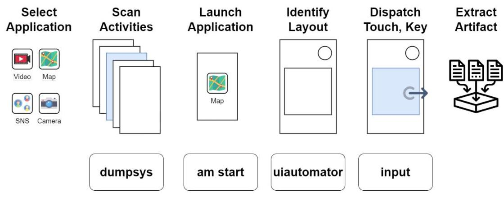
[그림 3] 아티팩트 획득 기법의 순서
'획득 기법'은 먼저 실험 대상을 선정하고 앱의 Activity 정보를 파악한다. 앱을 실행해 각각의 Layout 의 UI 요소를 검출하고, 임의의 제어를 진행해 아티팩트를 획득한다. '획득 기법'은 안드로이드 앱의 동작 원리와 화면의 구성요소를 기반으로 설계되었고, 아티팩트 획득 시 노동을 최소화해서 효율을 높인다. 무작위 방식으로 제어를 진행하기 때문에 로그인, 계정 인증 등 입력이 필요한 경우에는 수작업을 실시할 수 있다.
'획득 모델'은 '획득 기법'을 확장해 에뮬레이터 초기화, 서버 구성, 제어, 아티팩트 분석의 순서로 설계하였다. [그림 4] 먼저 에뮬레이터 초기화 단계는 에뮬레이터를 생성한 후 비교 데이터를 획득하는 과정이며, 생성, 루팅, 가상 데이터 설정, 비교 데이터 추출, 에뮬레이터 중지 순으로 진행한다. 에뮬레이터는

Magisk 25.2 버전 앱을 사용해 무팅 환경으로 구축하고, 시스템 권한을 획득해 앱 데이터를 쉽게 추출하고자 한다.
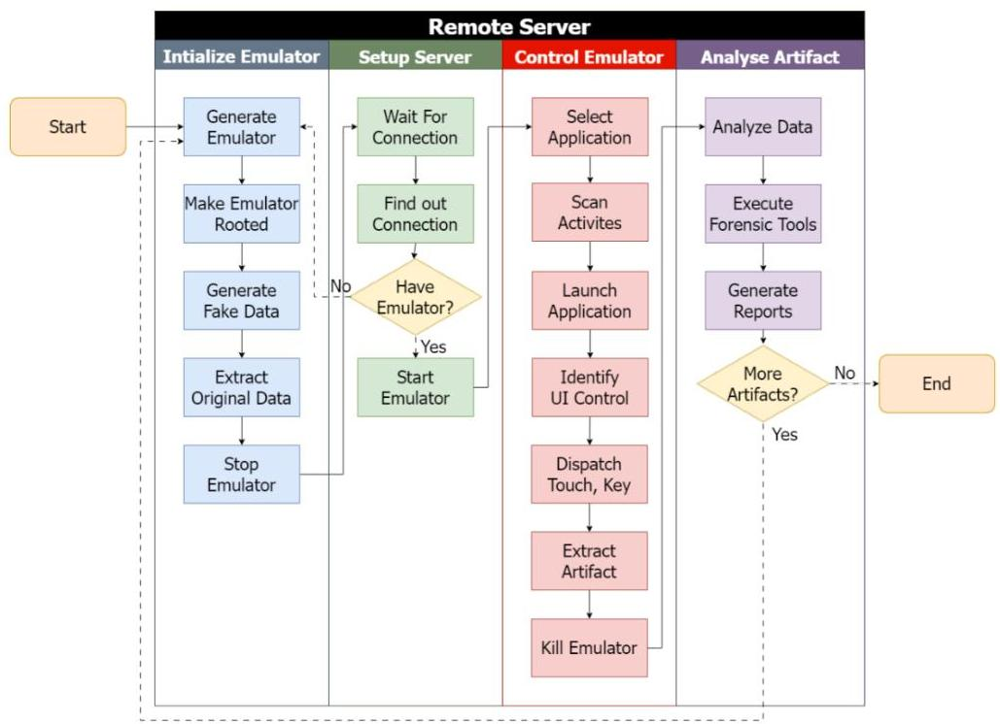
[그림 4] 아티팩트 획득 모델의 구조

서버 구성 단계는 외부 사용자가 접속할 수 있도록 Web 와 VNC 서버 환경을 구성한다. 외부로부터의 연결 시도를 기다리다가 접속이 탐지되면 에뮬레이터 유휴 상태를 확인하고 실행한다. 에뮬레이터 제어 단계는 아티팩트 획득 기법을 기반으로 앱을 실행하고 제어한 뒤에 아티팩트를 획득하고, 모든 작업이 완료된 후에 에뮬레이터를 삭제한다. 아티팩트 분석 단계는 데이터 분석, 포렌식 도구 실행, 보고서 생성의 절차를 거친다. 보고서에는 분석 대상 앱의 정보, 분석 날짜와 시간, 획득한 아티팩트의 폴더와 파일의 개수, 폴더 구조, 아티팩트 변경 내역 등을

표기한다. 추가적인 아티팩트 획득과 분석이 필요한 경우에 초기 단계로 돌아가고, 필요하지 않다면 모델을 종료한다.

아티팩트 획득은 앱 데이터 생성 시점을 기준으로 전후 2 번 실시한다. 제어 이전 초기화 단계에서 획득한 것은 '비교 데이터', 제어 단계에서 획득한 것은 '실험 데이터'로 명명하고, 각각 데이터의 변경 이력을 추적하는 방식으로 아티팩트를 분석한다. 안드로이드는/data 폴더 하위에는 앱 패키지명으로 폴더를 생성해 필요한 리소스를 관리하고 있다. 획득 대상이 되는 데이터는/data 폴더 하위의 3 수준까지 폴더 중에서 패키지명이 검색된 경로의 모든 파일이다. X 앱에서도 com.twitter.android 폴더명으로 앱과 관련된 파일을 저장하고 있다.

```
generic_xB6_64_arm64:/ # ls -d /data/*/*/* | grep com.twitter.android
/data/app/--24uykZn7gg0Zt8q7hXVTag==/com.twitter.android-cR9kkmu-E8jjBNyAsB15vw==
/data/data/com.twitter.android/cache
/data/data/com.twitter.android/code_cache
/data/data/com.twitter.android/databases
/data/data/com.twitter.android/files
/data/data/com.twitter.android/no_backup
/data/data/com.twitter.android/shared_prefs
/data/user/0/com.twitter.android
/data/user_de/0/com.twitter.android
```

[그림 5] X 앱의 패키지명으로 /data 폴더 대상 검색한 파일 목록
2. 획득 모델의 구동 환경
'획득 모델'은 원격 리눅스 서버 환경에서 에뮬레이터를 실행한 후 제어하는 방식으로 설계하였고, 리눅스 환경은 CLI 기반의 자동화 효율성 향상, 다양한 도구 지원, 웹서비스 배포의 안정성을 목적으로 선정하였다. 서버의 운영체제는 Ubuntu 22.04 를 기반으로 배포되는 Caine OS 를 사용하였고, 오픈소스 기반의 포렌식 도구를 제공한다.

'획득 모델'은 내부적으로 Flask 기반의 Web 서버와 VNC ${ }^{30)}$ 서버로 구성되어 있고, 사용자는 별도의 개발 환경 구축 없이 원격에서 접속할 수 있도록 구현하였다. 에뮬레이터 실행과 아티팩트 획득, 분석 등의 작업을 구현하기 위해 ADB 와 Python 을 사용하였다. 에뮬레이터는 Android 11 버전이고, 구글 플레이스토어를 활용하고자 google_apis_playstore 을 사용하였다. ${ }^{31)}$ ABI 는 스마트폰에서 armeabi-v7a 를 많이 사용하지만 에뮬레이터의 속도를 빠르게 하기 위해 x86_64 를 사용하였다. 다만 ABI 버전에 따라 앱 설치에 실패하는 경우도 있어, ADB 명령어에 'adb shell install --abi armeabi-v7a app.apk' 등으로 옵션을 추가하여 우회할 것이다.

|  연번 | 시스템 | 항목 | 상세 정보  |
| --- | --- | --- | --- |
|  1 | Server | OS | Caine OS (Ubuntu 22.04)  |
|  2 |  | Processor | Intel(R) Core(TM) i7-8750H CPU  |
|  3 | Android
Emulator | System OS | 30 (Android 11)  |
|  4 |  | System Image | google_apis_playstore  |
|  5 |  | ABI | x86_64  |
|  6 | Tools | ADB | 1.0.41 / 28.0.2-debian  |
|  7 |  | Python | 3.10 .8  |

[표 4] 아티팩트 획득 모델의 버전 정보

[^0] [^0]: 30) VNC(Virtual Network Computing)는 원격으로 다른 컴퓨터의 화면을 제어하는 네트워크 프로 토콜을 의미하며, 하드웨어 자원을 많이 할당하지 않아도 되기에 라즈베리파이나 챗슨나노, 안드 로이드 등의 기기를 제어할 때 사용한다. 31) 2023년 10월 5일에 안드로이드 14 버전이 출시되었지만, 업데이트 비율이 높지 않아 일부 앱 은 호환성에 문제가 있을 수 있다. 시중에 배포된 대부분 앱은 11 버전을 지원하고 있어서, 실 험 대상 SDK 버전으로 지정하였다.

'획득 모델'은 운영체제 이외에도 SDK 와 도구를 설치해야 구동할 수 있다. x84_64 ABI 를 사용하기 위한 환경 구축, Android SDK 11 과 JDK, AVD 등 관련 도구 설치, 환경 변수 등록 과정이 필요하다.
sudo apt-get install openjdk-11-jdk
wget https://dl.google.com/android/repository/commandlinetools-linux-912
3335_latest.zip
unzip commandlinetools-linux-*.zip
chmod 755 cmdline-tools/bin/*
sudo mkdir -p /opt/android-sdk/cmdline-tools/
[그림 6] JDK, SDK 설치 및 환경변수 등록 명령어
sudo chown \$USER:\$USER \$ANDROID_HOME -R
yes | sdkmanager --licenses
sdkmanager "platform-tools" "platforms:android-30" "emulator"
sdkmanager --install "system-images:android-30:google_apis_playstore:x86_64"
[그림 7] SDK 의 도구 설치 명령어
3. 획득 모델의 구현
'획득 모델'은 웹페이지 형태로 구현되었고, 에뮬레이터 탐색, 에뮬레이터 제어, 분석 보고서 생성을 수행하는 3 가지의 페이지로 구성되어 있다. [그림 8]
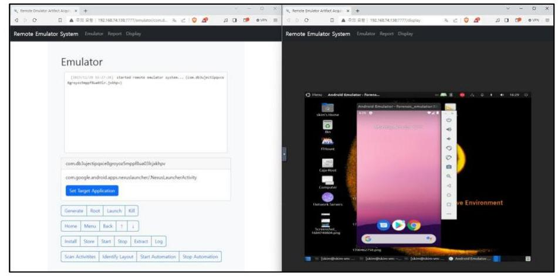
[그림 8] 아티팩트 획득 모델 웹사이트 형태

에뮬레이터 탐색 페이지는 실시간으로 에뮬레이터의 화면을 살펴볼 수 있고, 사용자가 필요한 순간에 터치와 키 입력을 수행할 수도 있다. 에뮬레이터 제어 페이지는 에뮬레이터 생성과 루팅 등의 제어, 실행과 중지 등의 제어, 앱 데이터와 로그 파일 등의 아티팩트 획득을 진행할 수 있다. 분석 보고서 생성 페이지는 사용자가 획득한 비교 데이터와 실험 데이터를 업로드하고, 서버에서 데이터를 분석해 폴더 구조, SHA-1 해쉬값을 이용한 폴더 변경 사항 등을 요약하고 PDF 형태로 보고서를 생성한다.

# 제 3 절 아티팩트 획득 실험 

1. 실험의 대상

아티팩트 획득 실험은 ‘획득 모델’을 활용해 총 10 개 앱을 대상으로 진행한다. 모델의 실현 가능성, 앱 데이터 획득의 효율성 등을 확인하고, 동적 아티팩트 변동 사항에 대응할 수 있는 도구로 발전 가능성을 판단하고자 한다.

실험 대상은 (1) 신규로 출시한 앱, (2) 업데이트가 빈번하게 진행되는 앱, (3) APK 파일로 배포되는 앱, (4) 보이스피싱에서 사용된 악성앱을 기준으로 채택하였다. 4 가지 유형의 앱은 아티팩트의 변동에 대응해 분석이 진행되지 않을 수 있고, 개발자 등이 공식 앱스토어 이외의 경로로 배포해서 APK 를 확보하기도 어렵다. 앱 분석에 대한 수요가 많지 않아 상용도구에서 지원하지 않는 경우가 많다.

실험 대상 앱은 유형별 특징을 고려해 총 10 개의 앱을 선정하였다. [표 5] 신규 출시 앱은 2023년 5월 LG유플러스에서 출시한 'Better'와 2023년 7월 메타에서 출시한 'Threads', 2022 년 4 월 출시한 'Mastodon'이다. 3 가지 앱은 사용자가 게시글을 올려서 공유하는 SNS 형태이다. 업데이트가 자주 진행되는 앱은 'Youtube', 'X', 'TikTok'을 선정하였다. APKPure 사이트에서 제공하는 업데이트 이력을 확인해 짧은 기간 안에 새로운 버전의 출시 횟수가 많은 앱을 선택하였다. APK 파일로 배포되는 앱은 시그널 계열의 메신저앱인 'Molly', 유튜브 앱의 개인 정보 누출 방지 등의 목적으로 대안으로 제작된 'LibreTube' 앱이다. 앱 마켓이 아니라 Github 등의 웹사이트를 통해서 APK 파일 형태로 배포되고 있다. 보이스피싱에서 사용된 악성앱은 '시티즌코난 사칭앱'과 'NH 농협은행 사칭앱'으로 선정하였다. ${ }^{32)}$ APK 파일은 피싱 탐지 전문회사인 인피니그루로부터 제공받았다.

|  연변 | 유형 | 앱 이름 | 패키지명 | 앱 버전  |
| --- | --- | --- | --- | --- |
|  1 | 신규 출시 | Better | com.lifeplatform.better | 1.1 .8  |
|  2 |  | Threads | com.instagram.barcelona | 309.0.0.39.109  |
|  3 |  | Mastodon | org.joinmastodon.android | 2.2 .4  |
|  4 | 빈번한
업데이트
제공 | Youtube | com.google.android.youtube | 18.45 .41  |
|  5 |  | X | com.twitter.android | $\begin{gathered} 10.16 .0- \ \text { release. } 0 \end{gathered}$  |
|  6 |  | TikTok | com.ss.android.ugc.trill | 32.2 .4  |
|  7 | APK 배포 | Molly | im.molly.app | $6.38 .2-1$  |
|  8 |  | LibreTube | com.github.libretube | 0.19 .0  |
|  9 | 악성앱 | 시티즌코난
사칭앱 | com.db3ujectipqxce8groyoz 5mppf8ua03lr.jxkhpv | 6.2 .69  |
|  10 |  | NH 농협은행
사칭앱 | adpjvrhh.qdliew.sptuu | 8.5  |

[표 5] 아티팩트 획득 실험 대상 앱 목록

[^0] [^0]: 32) 앱 이름은 각각 '시티즌코난' 과 'NH 농협은행' 이었으나 스토어 상에 출시된 앱을 사칭하 여 제작 및 배포된 앱이다. 본 연구는 '시티즌코난 사칭앱', 'NH 농협은행 사칭앱' 으로 언 급한다.

# 2. 실험의 절차 

실험 절차는 '획득 모델’을 이용해 (1) 에뮬레이터 초기화, (2) 비교 데이터 획득, (3) 에뮬레이터 제어, (4) 실험 데이터 획득, (5) 분석 보고서 생성, (6) 아티팩트 분석의 순서로 진행하였다. 에뮬레이터 초기화 단계의 앱은 유형에 따라서 스토어와 APK 로 나눠서 설치했다. 신규 앱과 업데이트 주기가 짧은 앱은 구글 플레이스토어에서 다운받아 진행하였고, APK 로 배포되는 앱은 파일을 확보해 개별적으로 설치하였다. 에뮬레이터 제어 단계는 앱을 실행해서 로그인, 권한 허용 등 필요한 작업을 완료하고, 이후에 ADB 명령어를 이용해 자동 제어를 진행하였다. 전체 Activity 를 식별해 실행하거나, 버튼 등의 객체를 탐지하여 터치하는 방식 등으로 제어하였다. 분석은 앱 제어 5 가지 행위의 흔적을 추적하는 기법으로 진행하였다. '획득 모델'에서 생성된 분석 보고서를 통해 폴더 구조나 SHA1 해쉬값을 통한 폴더 비교 등을 파악하고, 파일을 선별해 간이 도구로 내용을 살펴보면서 진행하였다.

아티팩트 획득 실험 이외에도 수동 방식과 상용도구 방식을 실시하였고, '획득 모델'의 성능 평가의 목적으로 진행하였다. 아티팩트 획득 실험과 수동방식은 상호 결과 비교를 위해서 실험 시간을 측정하였고, 산정 시점은 비교 데이터 획득 시점부터 실험 데이터 획득 시점까지이다. 실험에서 운영체제 부팅에서 앱 설치까지의 과정은 아티팩트와 관련성이 없고, 작업 시간은 하드웨어나 네트워크 환경에 따라 변동 가능성이 있어 제외하였다. 상용도구는 GMD SOFT 와 Cellebrite 회사의 제품을 이용해 동일한 10 개의 앱을 분석 실험을 진행하였고, 앱의 변동에 따른 상용도구의 서비스 지원 여부를 확인하고자 한다.

# 3. 실험의 결과 

(1) Better
'Better' 은 사진을 추가한 기록을 작성하고, 해쉬태그나 키워드로 게시물을 조회할 수 있는 SNS 앱이다. 실험은 초기에 앱을 실행해 카카오 계정으로 수동으로 로그인하고, Activity 와 UI 를 식별한 자동 제어를 진행하였다. 제어 이후 생성된 파일은 589 개이지만, 445 개는 cache/WebView/Default 경로의 파일이었다. 웹뷰 기반으로 아티팩트가 생성된 것을 확인하였고, 파일을 중점으로 아티팩트를 탐색하였다.

앱 실행 아티팩트는 data/data/com.lifeplatform.better/cache/sentry/7a8862ff 557576800a68944b07cf10a83d91c207/session.json 파일에서 시간 정보를 통해 확인할 수 있다. 아이디, 닉네임 등 사용자 계정 정보는 탐색하지 못했지만, 카카오 계정의 OAuthToken 정보는 data/com.lifeplatform.better/shared_prefs/ FlutterSharedPreferences.xml 파일에서 찾았다.

```
data > com.lifeplatform.better > cache > sentry > 7a8862ff557576800a68944b07cf10a83d91c207 > () session.json > ㅁ:
1 {"sid":"a2c282ea-b824-4ad0-96bf-87d49da6714d","did":"e1461e47-bfeb-48da-a27c-c747abf29ab8",
    "init":true,"started":"2023-11-21T15:37:39.7012","status":"ok","errors":0,
    "timestamp":"2023-11-21T15:37:39.7012","attrs":{"release":"com.lifeplatform.better01.1.8+124",
    "environment":"production"}}
```

[그림 9] Better 앱에서 획득한 앱 실행 아티팩트

```
data > com.lifeplatform.better > shared_prefs > \ FlutterSharedPreferences.xml
    <7xml version='1.0' encoding='utf-8' standalone='yes' 7>
    <map>
    <string name="flutter.com.kakao.token.
    OAuthToken">jfXSVg3Q071SP94X0NY0oePVbSjCvctHhNwwlViM79U51xwn1bPPtkSHiGDf/
    7RvHyJ7TnGtD7TeDt2wklfPIu0nk3ldG+1xUQzhJ1Hjta/WZ6xykwiezftUjBDcyjYqstY7j/
```

[그림 10] Better 앱에서 획득한 로그인 OAuthToken 정보

게시물 흔적은 data/data/com.lifeplatform.better/cache 경로에서 작성할 때 올린 이미지를 찾았고, 조회와 검색 이력은 data/data/com.lifeplatform.better /app_webview/Default/Local Storage/leveldb/000004.log 에서 확인하였다.
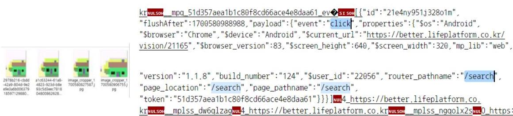
[그림 11] Better 앱에서 획득한 게시물 관련 아티팩트
(2) Threads
'Threads'는 500 자 이내의 텍스트 형태로 게시물을 작성하고, 다른 사용자의 글을 검색, 조회, 구독할 수 있는 SNS 앱이다. 'Better'와 동일하게 앱 실행 이후 계정 로그인하는 것을 수동으로 설정하였다. 자동 제어 이후 총 1,621 개의 파일을 확보하였고, 이 중 892 개의 파일은 so 확장자를 가진 파일이었다. 안드로이드에서 NDK 개발 시 라이브러리로 활용하는 정적인 파일로, 사용자 행위에 따른 아티팩트와 관련은 없다. 115 개의 파일은 data/data/com.instagram.barcelona/app errorreporting 경로에 저장되어 있고, 앱 실행 에러 정보를 저장하는 파일로 보아 아티팩트로 볼 수 없다.

앱 실행에 대한 흔적으로 time_in_app_48317314325.db 파일에서 사용자의 행위 시간이 기록된 이력을 확인하였다. [그림 12] 로그인과 게시물 관련 흔적으로

cache/cold_start/48317314325 파일에서 찾을 수 있고, 로그인 계정, 검색 이력, 게시물 조회와 작성 등을 모두 확인하였다. [그림 13]
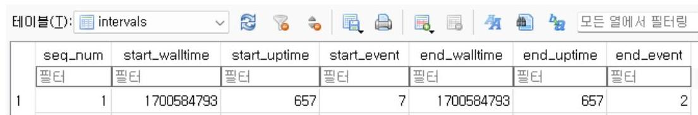
[그림 12] Threads 앱에서 획득한 실행 및 제어 아티팩트

48317314325 > [ ] feed_items > () 0 > () text_post_app_thread > [ ] posts > () 0 > () caption > () user > ㅁ usernar "user_id":48317314325,"user": "pk":48317314325,"pk_id":"48317314325","full_name":"김수영", "is_private":false,"has_onboarded_to_text_post_app":true,"strong_id_":"48317314325", "fbid_v2":"17841448309759664","username":"devskie","is_verified":false,
$\underline{d}=a 1 b b 5 f$ " "transparency_product_enabled":false\}, "type":1,"text":"hello", "did_report_as_spam":false,"created_at":1700584864,"created_at_utc":1700584864, "content_type":"comment","status":"Active","bit_flags":0,"share_enabled":false,
[그림 13] Threads 앱에서 획득한 로그인과 게시물 관련 아티팩트
(3) Mastodon
'Mastodon' 앱은 탈중앙화 방식의 SNS 로 개발된 앱으로, 2016 년 3 월부터 서비스를 제공했지만 안드로이드 앱은 2022 년 4 월 13 일에 출시되었다. 앱 제어 행위는 앱 실행, 로그인, 검색, 게시물 작성, 게시물 조회를 진행하였고, 서버 URL 설정과 로그인은 수동으로 설정하였다.

사용자 계정 관련 아티팩트로 files/accounts.json 파일에서 계정 아이디, 이름을 확인할 수 있다. [그림 14] 게시물 정보는 databases/mastodon.social_ 111477017549962286.db 에서 확인하였고, home_timeline 테이블에서 시간에

따른 게시물 작성과 열람 이력, recent_searches 테이블에서 검색 이력을 탐지하였다. [그림 15]
data > org.joinmastodon.android > files > (1 accounts.json > [ ] accounts > ( ) 0 > ( ) b > display_name
1 \{"accounts":[("a":["access_token":"GsWQBf1s53LUtRWxH6vk-3fEiLAHvdpd110iRDz4qKR", "created_at":1701007585,"scope":"read write follow push","token_type":"Bearer"},"b": \{"acct": "devskim", "avatar": "https://mastodon.social/avatars/original/missing.png", "avatar_static": "https://mastodon.social/avatars/original/missing.png","bot":false, "created_at":"2023-11-26T00:00:00Z","discoverable":false,"display_name":"公车" "emojis":[],
[그림 14] Mastodon 앱에서 획득한 로그인 관련 아티팩트
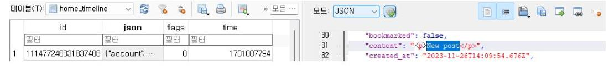
[그림 15] Mastodon 앱에서 획득한 게시물 관련 아티팩트
(4) Youtube
'Youtube'는 동영상 컨텐츠를 공유하는 플랫폼으로, 운영체제에 기본으로 설치된 앱으로 앱스토에서 최신 버전으로 업데이트하였다. 자동으로 구글 계정이 연동되기에 앱 실행 이후에 별도로 로그인하지 않았다. 앱 제어 행위 결과로 총 962 개의 파일을 생성하였다. 파일은 대부분 Cache 였고, 108 개는 data/data/com.google.android.youtube/cache/glidediskcache/volleyCache, 206 개는 data/data/com.google.android.youtube/cache/accounts/2/media/cache, 48 개는 data/data/com.google.android.youtube/cache/WebView/Default/HTTP Cache 에서 확인되었다. 54 개 파일만이 앱 제어 이후에 변동되었고, 대부분이 -

shm, -wal, .db 등이 포함된 데이터베이스와 pb, xml 확장자를 가진 텍스트 데이터였다.

앱 실행과 사용자 계정 흔적은 gnp_fcm_database 파일의 gnp_accounts 테이블에서 계정 이메일 주소와 시간으로 확인하였다. [그림 16] 검색, 게시물 조회, 댓글 작성 등은 cache/volleyCache/448651329.0 파일에서 확인하였다. [그림 17]
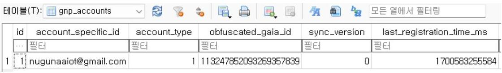
[그림 16] Youtube 앱에서 획득한 로그인과 실행 시간 아티팩트
user > 0 > com.google.android.youtube > cache > volleyCache > 448651329.0
1
[user] D@3[w] [w] [w] w] w] w] w] w] WSEARCH_RESULTS_he11d.
@https://i.ytimg.com/vi/YQHsXMglC9A/sddefault.jpg 448651329.6:07 6:6 minutes, 7
seconds$[\sim$ 448651329.0
\Adele - Hello (Official Music Video) \Adele - 3.18 views - 8 years
agobed: [w] [w] w] [w] w] w] w] w] w] w] w] w] w] w] w] w] w] w] w] w] w] w] w] w] w] w] w] w] w] w] w] w] w] w] w] w] w] w] w] w] w] w] w] w] w] w] w] w] w] w] w] w] w] w] w] w] w] w] w] w] w] w] w] w] w] w] w] w] w] w] w] w] w] w] w] w] w] w] w] w] w] w] w] w] w] w] w] w] w] w] w] w] w] w] w] w] w] w] w] w] w] w] w] w

앱 설치와 실행의 흔적은 data/user/0/com.twitter.android/databases/984049 026 -scribe.db 파일의 scribe 테이블에서 상세 이력을 확인할 수 있다. [그림 18] 984049026-66.db 파일은 제어 행위와 관련된 아티팩트 정보를 포함하고 있었다. user 테이블은 사용자 계정 정보, statuses 테이블은 게시물 조회 이력, retweets 테이블은 게시물 리트윗 이력을 저장하고 있었다. 검색 이력은 984049026-search.db 파일의 search_queries 테이블에서 확인하였다. [그림 19]
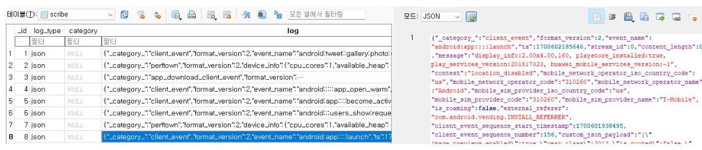
[그림 18] X 앱에서 획득한 설치 및 실행 아티팩트

|  |  | user_id | username |  | name |  | image_url |
| :--: | :--: | :--: | :--: | :--: | :--: | :--: | :--: |
|  |  |  |  |  |  |  |  |
| 1 | 1 | 984049026 | rume:13 |  | 김수영 |  | https://pbs.twimg.com/profile_im |
| 2 | 2 | 1554453846 | 13792001 | oeknya | 학나 |  | https://pbs.twimg.com/profile_im |
| 3 | 3 | 89373526 | ggholic |  | 경기도 |  | https://pbs.twimg.com/profile_im |

[그림 19] X 앱에서 획득한 계정 아티팩트
(6) TikTok
'TikTok'은 최대 60 초 안의 짧은 영상 콘텐츠를 공유하는 SNS 앱으로, 글로벌과 아시아용으로 나누어지며 각각의 패키지명은 'com.zhiliaoapp.musically',

'com.ss.android.ugc.trill'로 다르다. 실험은 아시아용으로 배포되는 앱을 대상으로 진행하였다.
'TikTok' 앱은 arm64-v8a, armeabi-v7a 아키텍처만 지원하고 있고, 에뮬레이터 ABI 버전이 맞지 않는다. 앱 설치는 ApkPure 사이트를 통해서 파일을 확보하고, 'adb shell install --abi armeabi-v7a TikTok_32.2.4_Apkpure.apk'로 우회해서 진행하였다. 로고와 로딩 이미지만이 실행 이후 화면에 표시되었고, 앱 제어를 진행할 수 없어 아티팩트 축적과 획득이 불가능하였다. Logcat 을 통해 'No implementation found for int com.bytedance $\cdots$ ' 라는 에러 메시지를 확인하였고, ABI 버전을 지원하지 않아 문제가 되었다. 앱 제어 행위는 제한적인 형태로 '앱 실행'만을 진행하였다.
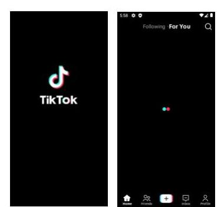
[그림 20] TikTok 앱을 실행하였을 때 표시된 화면

[^0][그림 21] TikTok 앱 실행 관련 에러 메시지

획득한 앱 데이터 파일은 총 1,236 개이고, 일부 파일은 data/data/com.ss.and
roid.ugc.trill/files/npth/CrashLogJava, data/data/com.ss.android.ugc.trill/files/


[^0]:    11-22 06:04:12.734 13561 E droid.ugc.tril: No implementation found for int com.byteda nce.common.jato.jit.JitBlock.initJitBlockInternal(int, boolean) (tried Java_com_bytedance_c ommon_jato_jit_JitBlock_initJitBlockInternal and Java_com_bytedance_common_jato_jit_JitBloc k_initJitBlockInternal__I2)

npth/killHistory, data/data/com.ss.android.ugc.trill/files/npth/ProcessTrack 등 저장되어 있고, 에러와 관련된 정보를 기록하고 있다. 에러가 발생했음에도 앱의 데이터베이스는 정상적으로 생성되었고, databases/TIKTOK.db 파일의 app_open 테이블에서 앱 실행 시간을 확인할 수 있었다. 게시물 아티팩트는 제어하지 않아 정보를 확인할 수 없었지만, databases/aweme.db 파일의 local_draft 테이블로 앱에서 아티팩트를 어떠한 방식으로 관리하는지 확인하였다.

| ㅁㅁ(0) ㅂ (2) |  |  |
| :--: | :--: | :--: |
| > and | android_m | CREATE TABLE android_m |
| $\checkmark$ local_draft |  | CREATE TABLE 'local_draft' (' |
| video_path | TEXT | "video_path" TEXT NOT NULL U |
| aveme | TEXT | "aveme" TEXT NOT NULL |
| music_path | TEXT | "music_path" TEXT |
| volce_path | TEXT | "volce_path" TEXT |
| video_volume | INTEGER | "video_volume" INTEGER NOT N |
| music_volume | INTEGER | "music_volume" INTEGER NOT $\dagger$ |
| filter | INTEGER | "filter" INTEGER NOT NULL |
| music | TEXT | "music" TEXT |
| music_start | INTEGER | "music_start" INTEGER NOT NUL |
| time | LONG | "time" LONG NOT NULL |

[그림 22] TikTok 앱에서 획득한 게시물 아티팩트의 구조
(7) Molly
'Molly'는 Github, F-Droid 등으로 배포하는 메신저 앱으로, 보안 목적으로 제작되었다. 'Signal Messenger'의 포크 버전으로 통신이 가능하지만, 앱의 디자인이 다르다. Gihub 에서 APK 파일을 다운받아 설치하였고, 수동으로 'Signal Messenger'의 계정을 연동해서 로그인했다.

앱에서 추출한 폴더의 개수는 총 26 개이고, 총 444 개의 파일이 생성되었다. 이 중 app_emoji 폴더 하위의 파일은 172 개, app_stickers 폴더 하위의 파일은 156 개이며, 메신저에 사용하는 이미지 데이터이다.

앱 실행 시간 아티펙트는 databases/com.google.android.datatransport.events 파일의 global_log_event_state 테이블에서 확인되었지만, 다른 행위는 암호화로 인해 탐색하기 어려웠다. 사용자 행위 아티펙트는 signal.db, signal-key-value.db, signal-logs.db 파일로 저장된 것으로 추정하였다. 파일은 DB Browser for SQLite 프로그램으로 불러올 수 없었고, HxD 로 열어보니 난독화되어 있었다. 'Molly'앱이나 'Signal Messenger' 앱이 보안 메신저로 사용되고 있기에 중요한 데이터베이스 파일은 암호화해서 관리하고 있었다. 암호화와 관련된 정보는 shared_prefs/MasterKeys.xml 파일에 기재되어 있었고, 데이터를 복호화 작업을 해야만 아티펙트 해석이 가능할 것으로 판단된다.

# ㅁ signal.db 

```
Offset(h) 00 01 02 03 04 05 06 07 08 09 0A 0B 0C 0D 0E 0F Decoded text
00000000 8B 4F 4E 16 6E B4 FF 94 66 E2 13 13 9C 93 65 5E <ON.n'Y"f4..m"e^
00000010 70 08 4C 7E 43 A7 38 63 C9 E9 11 34 38 15 DE FC p.L-C$8cE6.48.bu
00000020 91 D0 B6 84 45 E5 C3 19 34 1C 4C 8F 26 8D 55 13 'D$_E4A.4.L.4.U.
```

[그림 23] Molly 앱의 암호화된 데이터베이스 내용

```
data > im.molly.app > shared_prefs > 1 MasterKeys.xml
    <?xml version='1.0' encoding='utf-8' standalone='yes' ?>
    <map>
        <boolean name="passphrase_initialized" value="true" />
        <string name="master_secret">2wjG2ueu5N6P2Bs3L1mVHFI0+rN4yrqjLNzpcs1vnhhv8I5sHTfQhLREKQa
        +P0H3BUjUozcFbeGfbEva0wce5ase+k4D4AWA9ZZWtUI7EAg></string>
        <string
        name="asymmetric_master_secret_curve25519_private">gT7GpsdLGuU4h2gPTu5g8IeIK9ZAcNrtho2YN+/
        wv8BctU24rvzT8NAaQCALXLbu18ZTVCy9NwUaxPNPo9WRVjY99kHYx6nuCNLxrufJNfBhIkEGoLqersP63X5kIQms</
        string>
        <boolean name="keystore_initialized" value="false" />
        <string name="encryption_iv">B9LZI4cuoI5kb3g6</string>
        <string name="asymmetric_master_secret_curve25519_public">K3hYbj/rovU/
        d3hgI9pzWm4hTq3QK9RW1j+LQ14F3iCh8hafEWSNVFFocDX3xaCeZ0IOPUBTSiLtrz2i/TcQUtIXtIRgE/
        CvgApa911eQUypcrmJkNpyhr7paIZU1r9a</string>
    </map>
```

[그림 24] Molly 앱의 암호화 관련 파일인 MasterKeys.xml 의 내용

(8) LibreTube
'LibreTube'은 'Youtube' 앱의 개인정보 정책에 반해 대안으로 제작된 앱으로, 동영상 콘텐츠를 공유하는 SNS 앱이다. 앱 스토어로는 설치할 수 없고, Github, F-Droid 등을 통해 배포된다. 로그인은 기능상 제공하지 않아 진행하지 않았고, CDN 도메인은 수동으로 선택하였다. 앱 제어 행위는 로그인과 게시물 작성을 제외하고, 앱 실행, 검색, 게시물 조회 등의 3 가지만을 진행하였다.

앱 제어 이후에 총 22 개의 파일이 생성되었으며, 16 개는 -shm, -wal, Database, workdb, Database.lck 등의 데이터베이스이다. 나머지 6 개의 파일은 preferences.xml, UpdateTime.dat, trace.pb 등으로 앱 설정과 관련된 정보를 저장하고 있다.

제어에 따른 아티팩트는 data/user/0/com.github.libretube/databases/Libre TubeDatabase 파일에서 확인되었다. 검색 정보는 searchHistoryItem 테이블, 게시물 조회는 watchHistoryItem 테이블에서 확인하였다.
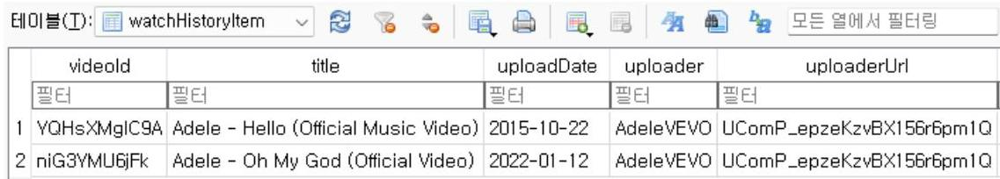
[그림 25] LibreTube 앱에서 획득한 게시물 조회 아티팩트
(9) 시티즌코난 사칭앱
'시티즌코난 사칭앱'은 보이스피싱에 이용된 악성앱을 탐지하는 앱을 사칭해 동 일한 이름으로 제작되었다. '시티즌코난'은 Activity 를 활성화해 터치 등이 가능하지

만, '시티즌코난 사칭앱'은 Service ${ }^{33)}$ 기반으로 구현되었다. 앱 제어 행위는 화면이 표출되지 않아서 '앱 실행'만 실행하였다. Activity 는 MainActivity 와 PhoneCall Activity 등 2 개를 탐지하였지만, 'No activities found to run'으로 앱을 실행할 수 없었다. [그림 26] 앱은 화면 없이 접근성 제어와 시스템 권한의 알림을 주거나 상 단바에 글자를 표시하였다. [그림 27]

[^0][그림 26] 시티즌코난 사칭앱 제어 에러 메시지

|  |  |  |  |  |  |  |  |  |  |  |  |  |  |  |  |  |  |  |  |  |  |
| :--: | :--: | :--: | :--: | :--: | :--: | :--: | :--: | :--: | :--: | :--: | :--: | :--: | :--: | :--: | :--: | :--: | :--: | :--: | :--: | :--: |
|  |  |  |  |  |  |  |  |  |  |  |  |  |  |  |  |  |  |  |  |  |  |
|  |  |  |  |  |  |  |  |  |  |  |  |  |  |  |  |  |  |  |  |  |  |
| DOWNLOADED APPS |  |  |  |  |  |  |  |  |  |  |  |  |  |  |  |  |  |  |  |  |  |
|  |  |  |  |  |  |  |  |  |  |  |  |  |  |  |  |  |  |  |  |  |  |
|  |  |  |  |  |  |  |  |  |  |  |  |  |  |  |  |  |  |  |  |  |  |
|  |  |  |  |  |  |  |  |  |  |  |  |  |  |  |  |  |  |  |  |  |  |
|  |  |  |  |  |  |  |  |  |  |  |  |  |  |  |  |  |  |  |  |  |  |


[^1]
[^0]:    [2023/11/21 13:24:26] bash arg: -p bash arg: com.db3ujectipqxce@groyor5mppf@ua03lr.jekhpv bash arg: 1 arg s: [-p, com.db3ujectipqxce@groyor5mppf@ua03lr.jekhpv, 1] arg: "-p" arg: "com.db3ujectipqxce@groyor5mppf@ua03l r.jekhpv" arg: "1" data="com.db3ujectipqxce@groyor5mppf@ua03lr.jekhpv" ** No activities found to run, monkey aborted.
    [2023/11/21 13:24:39] start scanning....
    [2023/11/21 13:24:40] found 2 activities
    [2023/11/21 13:24:42] [start] (1/2) com.db3ujectipqxce@groyor5mppf@ua03lr.jekhpv/.MainActivity
    [2023/11/21 13:24:51] [start] (2/2) com.db3ujectipqxce@groyor5mppf@ua03lr.jekhpv/.my.phone.ui.calling.Phone CallActivity
    [2023/11/21 13:25:02] finish scanning....
    [그림 26] 시티즌코난 사칭앱 제어 에러 메시지

   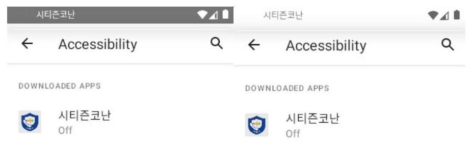
    [그림 27] 시티즌코난 사칭앱 화면상 표출되는 형태

    앱 실행의 아티팩트는 databases/db.db 파일의 new_log 테이블에서 확인하였고, 시간 순서대로 호출되는 메소드를 기록하고 있었다. PhoneCallMana

[^1]:    33) Service는 UI 형태를 제공하지 않고 작업을 수행할 수 있는 형태로, 안드로이드 애플리케이션 구성 요소 중 하나이다. 즉 화면에 표출이 되지 않더라도 백그라운드 상태에서 네트워크 통신을 하거나 음악을 재생하는 등의 작업을 진행할 수 있다.

ger, CALL_STATE_IDLE 등의 로그를 남기는 것으로 통화 가로채기를 시도하는 것을 추정한다. black 과 forward 테이블에서 통화 가로채기 관련하여 id, 번호, 응답 여부를 데이터베이스로 관리하고 있었다.
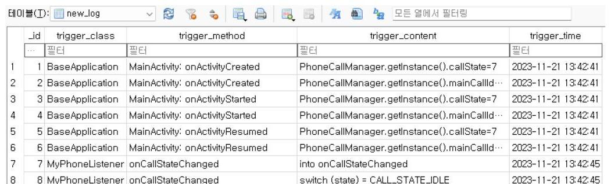
[그림 28] 시티즌코난 사칭엡에서 획득한 실행 아티팩트

| $\checkmark$ | black |  | CREATE TABLE black (_id integer primary key at |  |
| :--: | :--: | :--: | :--: | :--: |
|  | $\square$ id | integer | "id" integer |  |
|  | $\square$ number | varchar(255) | "number" varchar(255) |  |
|  | $\square$ is_apply | integer | "is_apply" integer |  |
| $\checkmark$ | forward |  | CREATE TABLE forward (_id integer primary key |  |
|  | $\square$ id | integer | "id" integer |  |
|  | $\square$ number | varchar(255) | "number" varchar(255) |  |
|  | $\square$ is_apply | integer | "is_apply" integer |  |
|  | $\square$ ars | integer | "ars" integer DEFAULT 0 |  |

[그림 29] 시티즌코난 사칭엡의 통화 가로채기 관련 데이터베이스 구조
(10) NH 농협은행 사칭엡
'NH 농협은행 사칭엡'은 금융기관의 엡을 사칭하여 제작되었고, 엡 패키지명이 'adpjvrhh.qdliew.sptuu'인 난독화된 문자열이기에 기관이 배포한 것은 아니다. 엡 의 화면이 표출되지 않았고, 제어 행위는 '엡 실행'만을 진행하였다. Activity 는 1 개를 탐지하였지만, 실행 도중 오류가 발생해 화면이 표시되지 않았다. Logcat 에서

'androidx.core.app.CoreComponentFactory' 라는 클래스가 내부적으로 찾을 수 없다는 메시지를 확인하였고, ABI 버전인 x86_64 에 맞는 라이브러리가 제공되지 않아서 에러가 발생하였다.

11-20 15:38:03.744 19198 19198 E LoadedApk: java. lang. ClassNotFoundException: Didn't find class "androidx.core.app.CoreComponentFactory" on path: DexPathList[[zip file "/data/app/--wbZ4r15YBBh 8aMWFwykj8Q==/adpjvrhh.qd1iew.sptuu-W1Iz6Lc65qDzfnSHyfH0Vw==/base.apk"], nativeLibraryDirectories =[/data/app/--wbZ4r15YBBh8aMWFwykj8Q==/adpjvrhh.qd1iew.sptuu-W1Iz6Lc65qDzfnSHyfH0Vw==/lib/x86_64 , /system/lib64, /system_ext/lib64]]
[그림 30] NH 농협은행 사칭앱 실행 에러 메시지

앱 실행 이후 obfs/0.obfedex 파일만 생성되었다. 파일의 내용은 HxD 로 파악 하기가 어려웠고, 암호화되거나 특이한 구조로 되어 있음을 확인하였다. 안랩의 모 바일 악성 앱 분석 보고서에서 언급한 Kaishi 악성코드는 복호화한 형태로 추출할 때 0.obfedex 파일을 사용했다고 한다. ${ }^{34)}$ 제어 이후 파일이 1 개만 생성되었으며 내용을 읽어올 수 없기 때문에 앱 실행에 대한 흔적을 찾기 어려웠다. arm 버전인 에뮬레이터를 구동하거나 실물 스마트폰을 대상으로 실험을 진행해야만 아티팩트를 확보할 수 있다.

| Offset(h) | 00 | 01 | 02 | 03 | 04 | 05 | 06 | 07 | 08 | 09 | 0A | 0B | 0C | 0D | 0E | 0F | Decoded text |
| :--: | :--: | :--: | :--: | :--: | :--: | :--: | :--: | :--: | :--: | :--: | :--: | :--: | :--: | :--: | :--: | :--: | :--: |
| 00000000 | 64 | 65 | 78 | 0A | 30 | 33 | 35 | 00 | 7F | 1F | A3 | 64 | 2F | 3D | F3 | EC | dex.035...\&d/=ó |  |
| 00000010 | DA | CE | A3 | 74 | 65 | 00 | B5 | 68 | 93 | CE | 18 | F2 | 85 | 5C | E5 | 06 | OI\&te.uh"I. $\Delta .1$ |  |
| 00000020 | 4C | SE | 29 | 00 | 70 | 00 | 00 | 00 | 78 | 56 | 34 | 12 | 00 | 00 | 00 | 00 | LZ).p...eV4. |  |
| 00000030 | 00 | 00 | 00 | 00 | 70 | 8D | 29 | 00 | 53 | 43 | 00 | 00 | 70 | 00 | 00 | 00 | ...p.).SC..p |  |
| 00000040 | F9 | 0E | 00 | 00 | BC | 0D | 01 | 00 | 24 | 11 | 00 | 00 | A0 | 49 | 01 | 00 | Q...44...5... I.. |  |
| 00000050 | 79 | 3F | 00 | 00 | 50 | 17 | 02 | 00 | B9 | 4E | 00 | 00 | 18 | 13 | 04 | 00 | y?.P...4N. |  |
| 00000060 | CD | 0B | 00 | 00 | E0 | 88 | 06 | 00 | CC | 8B | 21 | 00 | 80 | 02 | 08 | 00 | I...a'..Iv!.€... |  |

[그림 31] NH 농협은행 사칭앱 제어 이후 생성된 파일 내용

[^0]
[^0]:    34) AhnLab, "모바일 악성 앱 분석 보고서", 12면, 2021

# 제 4 절 아티팩트 획득 모델의 성능평가 비교

## 1. 수동 방식

수동 방식은 '획득 모델' 없이 직접 에뮬레이터를 이용해 앱을 제어하고 데이터를 획득하는 실험이고, 모델의 시간 효율성을 판단하고자 진행했다. '획득 모델'은 아티팩트 획득 실험을 진행하며 앱마다 진행 시간을 측정하였고, 평균적으로 1 개의 앱을 제어하고 데이터를 획득하는 데 5 분 49 초가 소요되었다. 수동 방식은 Android Studio 를 이용해 에뮬레이터로 앱을 구동하고, Device Explorer 를 통해 데이터를 다운받는 방식으로 진행하였다. ${ }^{35)}$

|  연번 | 앱 이름 | 수동 방식 실험 시간 | 모델 실험 시간  |
| --- | --- | --- | --- |
|  1 | Better | 14 분 46 초 | 8 분 18 초  |
|  2 | Threads | 20 분 7 초 | 8 분 21 초  |
|  3 | Mastodon | 9 분 23 초 | 6 분 2 초  |
|  4 | Youtube | 21 분 41 초 | 6 분 58 초  |
|  5 | X | 10 분 10 초 | 5 분 5 초  |
|  6 | TikTok | 12 분 8 초 | 5 분 54 초  |
|  7 | Molly | 11 분 10 초 | 8 분 23 초  |
|  8 | LibreTube | 11 분 54 초 | 5 분 24 초  |
|  9 | 시티즌코난 사칭앱 | 5 분 34 초 | 1 분 59 초  |
|  10 | NH 농협은행 사칭앱 | 6 분 12 초 | 1 분 25 초  |
|  11 | 평균값 | 12 분 8 초 | 5 분 49 초  |

[표 6] 수동 방식과 모델 간의 실험 시간 비교

[^0] [^0]: 35) Android Developers, Device Explorer에서 기기 내 파일 보기, https://developer.android.com/studio/debug/device-file-explorer?hl=ko (2024.01.05. 최종 확인)

수동방식은 평균적으로 1 개의 앱을 실험하는데 12 분 8 초가 소요되었고, 모델보다 약 2.08 배 정도로 시간이 더 걸렸다. 수동 방식의 앱 제어는 자동 터치가 제공되지 않아 모든 화면을 탐색하기 어려웠고, 데이터의 획득은 앱 데이터의 경로를 식별하기가 힘들었다. 모델 방식은 ADB 명령어로/data 하위의 앱 패키지명과 동일한 폴더를 선별하고, 기계적으로 압축해서 획득하였다. 수동 방식은 Device Explorer 로 직접 폴더를 선택해야 했고, 압축 없이 다운받아서 시간이 오래 걸렸다. 사람의 수작업으로 진행하기 때문에 실수로 중요한 파일을 누락할 가능성도 있다.

# 2. 상용도구 

GMD SOFT 와 Cellebrite 제품을 이용해 아티팩트 획득 실험에서 분석한 앱을 대상으로 실험하였다. 상용도구가 앱 출시나 업데이트 이후에 즉각적으로 반영하는 지 확인하기 위한 목적으로 실시했다. GMD SOFT 의 제품은 1.92.12.1974 버전의 MD-NEXT 와 3.10.22.2492 버전의 MD-RED 로 진행하였다. Cellebrite 의 제품 은 7.66.0.139 버전의 UFED 4PC 와 8.8.100.46 버전의 Cellebrite Reader 를 사 용하였다. 대상 기기는 Samsung 의 SM-P610 이고, SDK 버전은 12 이다.

실험 대상 앱은 아티팩트 획득 실험과 동일한 10 개이다. 실험은 앱을 설치하여 제어 행위를 조작한 뒤 분석 여부를 확인하는 것으로 진행하였다. 분석 여부는 제 품의 앱 지원 목록, 보고서에 기재된 앱 정보 등을 종합해 판단하였다. X 앱은 트위 터로 기재되어 있더라도 동일한 앱으로 판단하였다. 실험 결과는 상용도구의 업데 이트에 따라서 최신 버전의 분석 결과와 달라질 수 있다. 실험은 기능의 평가가 아 니라 포렌식 연구 목적으로 진행되었다.

상용도구의 실험 결과, 전체 10 개의 앱 중에서 3 6 개는 아티팩트를 탐지해서 분석에 성공했지만, 나머지 앱은 데이터는 획득하였으나 사용자 흔적을 도출하지는 못했다. [표 7] A 제품은 신규 앱 유형에서 비교적 먼저 출시한 'Better'와 'Mastodon'은 분석할 수 없었지만, 'Threads'는 사용자의 흔적을 찾을 수 있었다. 앱 출시 시점이 이르더라도 서비스가 제공되지 않는 것을 확인할 수 있다. A 제품에서 잦은 업데이트를 제공하는 앱의 유형인 'Youtube'와 'X'는 아티팩트를 도출할 수 있었으나 'TikTok'는 분석할 수 없었다. 업데이트에 따라 분석 기능이 제한될 수 있음을 확인하였다. APK 파일로 배포되는 앱과 보이스피싱 범죄 등에서 사용된 악성앱 유형은 A, B 제품 모두 분석할 수 없었다. 앱 스토어로 출시되는 형태가 아니고 분석 수요가 없을 수 있기 때문에 상용도구에서 지원해 줄 가능성이 희박하다. 그러나 상용도구에서 서비스를 제공하지 않아도, Full-file system 방식으로 데이터를 획득할 수 있어 파일을 살펴보며 분석할 수 있다.

|  연번 | 앱 유형 | 앱 이름 | A 제품 분석 여부 | B 제품 분석 여부  |
| --- | --- | --- | --- | --- |
|  1 | 신규 출시 | Better | X | O  |
|  2 |  | Threads | O | O  |
|  3 |  | Mastodon | X | O  |
|  4 | 빈번한
업데이트 제공 | Youtube | O | O  |
|  5 |  | X | O | O  |
|  6 |  | TikTok | X | O  |
|  7 | APK 배포 | Molly | X | X  |
|  8 |  | LibreTube | X | X  |
|  9 | 악성앱 | 시티즌코난 사칭앱 | X | X  |
|  10 |  | NH 농협은행 사칭앱 | X | X  |

[표 7] 상용도구 이용한 앱 분석 가능 여부 ${ }^{36)}$

[^0] [^0]: 36) 실험은 획득 모델과 상용도구의 비교 목적으로 진행됐기 때문에 제품의 명칭은 가명 처리하였다.

# 제 5 절 시사점 및 한계 

## 1. 시사점

지금까지 ADB 명령어를 이용해 자동으로 앱 제어해서 아티팩트를 쌓고, 데이터를 획득$\cdot$분석하는 모델을 구축하였다. '획득 모델'은 자동 기법으로 사람의 노동력을 줄일 수 있는 효용이 있다. 모델은 비교 $\cdot$ 실험 데이터의 비교로 보고서를 생성하였고, 모든 앱의 분석 보고서는 Github ${ }^{37)}$ 로 확인할 수 있다. 보고서로 제어 이후 파일의 변동 내역을 파악하고, 앱 정보 등의 정적 파일을 제외한 아티팩트 관련 항목만 선별이 가능하다. 보고서 항목으로 이용자의 행위를 도출할 수 없기 때문에 아티팩트로 사용자의 행위를 도출할 수 있도록 분석이 필요하다.
'획득 모델'을 이용해 총 10 개 앱을 대상으로 아티팩트 획득 실험을 진행하고, '앱 실행', '로그인' 등 앱 제어 행위의 흔적을 탐색하였다. 'Better', 'Threads', 'Mastodon', 'Youtube', 'X', 'LibreTube' 등은 제어에 따른 아티팩트를 탐지하였다. [표 8] 다만 일부 앱은 제어를 진행하지 못하거나 아티팩트를 확인할 수 없었다. 'TikTok 앱'과 'NH 농협은행 사칭앱'은 ABI 버전이 상이해서 ADB 명령어 옵션으로 우회하여 앱 설치하였으나, 라이브러리를 불러올 수 없어 에러가 발생하였다. 'TikTok'앱은 실행 관련 아티팩트 탐색이 가능하였으나, 'NH 농협은행 사칭앱'은 1 개의 파일만 생성될 뿐 사용 흔적을 찾을 수 없었다. 'Molly'앱은 아티팩트가 저장되어 있을 것으로 추정되는 데이터베이스 파일이 발견되었으나, 앱의 특성상 암호화되어 탐색이 불가능하였다. '시티즌코난 사칭앱'은 Service

[^0]
[^0]:    37) Github, SwimingKim/ForensicExperimentReport, https://github.com/SwimingKim/ForensicExperimentReport (2024.01.05. 최종확인)

기반으로 앱 화면이 표출되지 않아서 '앱 실행'만 진행했지만, 데이터베이스 파일로 관련 아티팩트를 찾을 수 있었다. 아티팩트 획득 실험은 앱 제어 기법의 실현 가능성을 확인했지만, 일부 앱은 ABI 버전이나 Service 등으로 인해서 탐지가 불가능하였다.

|  연번 | 앱 이름 | 변동파일 | 앱 제어 행위 |  |  |  |   |
| --- | --- | --- | --- | --- | --- | --- | --- |
|   |  |  | 실행 | 로그인 | 검색 | 작성 | 조회  |
|  1 | Better | 589 | 0 | 0 | 0 | 0 | 0  |
|  2 | Threads | 1,621 | 0 | 0 | 0 | 0 | 0  |
|  3 | Mastodon | 252 | 0 | 0 | 0 | 0 | 0  |
|  4 | Youtube | 1,016 | 0 | 0 | 0 | 0 | 0  |
|  5 | X | 376 | 0 | 0 | 0 | 0 | 0  |
|  6 | TikTok | 1,236 | 0 | $\cdot$ | $\cdot$ | $\cdot$ | $\cdot$  |
|  7 | Molly | 444 | 0 | $\triangle$ | $\triangle$ | $\triangle$ | $\triangle$  |
|  8 | LibreTube | 22 | 0 | $\cdot$ | 0 | $\cdot$ | 0  |
|  9 | 시티즌코난 사칭앱 | 38 | 0 | $\cdot$ | $\cdot$ | $\cdot$ | $\cdot$  |
|  10 | NH 농협은행 사칭앱 | 1 | X | $\cdot$ | $\cdot$ | $\cdot$ | $\cdot$  |

[표 8] 아티팩트 획득 실험 분석 요약 ${ }^{38)}$

수동과 상용도구 방식의 실험을 진행하였고, '획득 모델'과의 성능 평가를 위한 비교 목적으로 실시되었다. 수동 방식 실험은 앱 자동 제어와 데이터 식별 $\cdot$ 획득이 어려워 작업 시간이 많이 소요되었다. '획득 모델'이 수동 방식보다는 노동력의 투입 최소화, 시간상 효율성, 데이터 선별의 정확성 등에서 우위가 있다고 판단된다. 상용도구 방식은 모바일포렌식 프로그램을 이용해 동일한 10 개의 앱을 대상으로

[^0] [^0]: 38) 앱 제어에 따른 아티팩트 탐지 수준으로 표기했다. 제어와 아티팩트 탐지 모두 성공한 경우 동그 라미(O), 제어하였으나 아티팩트를 탐지하지 못한 경우 세모( $\triangle$ ), 제어를 진행하지 못한 경우 엑스(X)로 표기하였다. 검( $\cdot$ )은 제어 행위를 앱 기능상 실행할 수 없는 경우이다.

분석 실험을 하였다. 상용도구는 출시나 업데이트 상황에 따라 분석 기능이 제한될 수 있고, APK 로 배포되는 앱은 서비스에 제약이 있는 것을 확인하였다. 상용도구가 모든 앱을 대상으로 서비스할 수 없고, '획득 모델'은 상용도구의 의존도에 탈피해 간이 도구로서의 가능성이 있다.

# 2. 한계 

'획득 모델'을 이용한 아티팩트 획득 실험은 4 가지의 한계가 있다. 첫째, 아티팩트 획득 실험은 자동 제어 기반을 설계하였으나, 일부 수동으로 에뮬레이터를 조작하였다. 수동 조작은 앱 제어 도중 su 권한을 요청하는 팝업이나 로그인, 키워드 입력 등 사람의 개입이 필요한 상황에 진행했다. 자동 제어는 클릭이 가능한 객체를 탐지해 기계적으로 터치를 입력하였고, 앱의 모든 기능을 탐색하지 못하였다.

둘째, 아티팩트 분석은 실험 설계에 따라 제한적으로 진행되었고, 사용자의 행위를 도출하기는 어렵다. 앱의 공통적인 특성을 고려해 5 가지 앱 제어 행위를 설계하였고, 미리 정의한 행위에 따른 아티팩트를 도출하는 방식으로 분석하였다. '획득 모델'의 분석 보고서는 아티팩트 내용을 확인하기 힘들고, 데이터를 표준화하기도 어려웠다. 'Molly' 앱은 내부적으로 데이터를 암호화하기 때문에 복호화해야만 아티팩트를 탐지할 수 있다.

셋째, 실험 시간은 획득 과정 이외에 서버 운영체제 부팅 시간, 에뮬레이터 생성과 초기 설정, 앱 설치 등으로 많이 소요되었다. 실험 시간은 앱마다 편차가 있었으나 평균적으로 5 분 49 초 정도 소요되었다. 아티팩트 획득과 관련 없는 기본 설정 시간은 모든 앱 평균값으로 최소 4 분 36 초에서 최대 11 분 19 초 정도

소요되었다. 앱 설치는 앱스토어와 APK 방식에서 시간 차이가 크게 발생했다. 앱스토어 방식은 구글 로그인을 필요하며, 대기나 응답 시간이 있기에 약 7 분 정도로 걸렸다.

|  연번 | 항목 | 평균 소요 시간  |
| --- | --- | --- |
|  1 | 서버 운영체제 부팅 시간 | 1 분 35 초  |
|  2 | 애플레이터 실행 시간 | 1 분 32 초  |
|  3 | 애플레이터 우팅 시간 | 1 분 21 초  |
|  4 | 앱 설치 시간 | 6 분 51 초(스토어), 8 초(APK)  |
|  5 | 합산 시간 | 4 분 36 초 - 11 분 19 초  |

[표 9] 아티팩트 획득 실험에 소요된 설정 관련 시간

마지막으로 화면이 표출되지 않는 앱을 분석하기에 한계가 있다. '획득 모델'은 Activity 단위로 보이는 화면을 읽어오고, 버튼 등의 컴포넌트를 조작해 동적 데이터를 쌓는 것을 전제로 하고 있다. 'TikTok'앱과 'NH 농협은행 사칭앱', '시티즌 코난 사칭앱'은 화면이 표출되지 않았고, '앱 실행'만으로 실험을 진행하였다. 전자의 2 가지 앱은 ABI 버전이 달랐고, 내부 라이브러리의 에러가 발생해 Activity 는 탐지하였지만 정상적으로 실행되지 않았다. '시티즌 코난 사칭앱'은 Activity 가 없는 Service 형태의 앱이기 때문에 화면 제어를 진행할 수 없었다.

# 제 4 장 안드로이드 앱 제어 기반 획득 모델 활용방안 

## 제 1 절 안드로이드 앱 제어 기반 획득 모델의 발전 방향

1. 앱 제어 시나리오 설계
'획득 모델'은 무작위 기법으로 조작하는 것이 아니라 시나리오를 설계해 기계적인 제어 가능하도록 개선해야 한다. 아티팩트 획득 실험은 로그인이나 글 작성 등을 완전히 자동화할 수준의 제어는 불가능하였다. 모델 설계 단계에서 인지하였고, VNC 프로토콜을 활용해 개입이 필요한 시점에는 키 입력이나 터치가 가능하도록 구현하였다. 기존의 자동화 방식은 연구의 목적을 달성할 수 없기 때문에 사전에 앱 제어에 대한 시나리오를 작성해 실행할 수 있도록 발전할 필요가 있다. 앱 제어 설계는 의사 코드와 행위 녹화 방법의 형태로 구현할 수 있다. 의사 코드를 이용하는 방식은 빠르게 제어 방식을 설계해 실행할 수 있지만, 시나리오 작성 방식에 대해 학습이 필요하다. 반면 특정 행위를 녹화하는 방식은 누구나 쉽게 앱 제어 시나리오를 설계할 수 있지만, 컴포넌트 위치가 변경되어 설계대로 제어가 진행되지 않을 수 있다. 2 가지 방식을 종합하면, 앱 제어 행위를 녹화하여 자동으로 의사 코드를 작성하도록 개선할 수 있다. 의사코드의 정확성과 행위녹화의 편리성 등의 장점을 채택하고, 기계적인 방식으로 제어가 가능해 자동 방식을 구현할 수 있다.

2. 아티팩트 문자열 검출
'획득 모델'은 아티팩트 데이터를 문자열로 검출해 보고서에 서술하여, 빠르게 사용자의 행위를 추적할 수 있도록 발전해야 한다. 분석 보고서는 비교$\cdot$실험 데이터의 폴더 구조나 파일의 비교를 통해 생성되었다. 기존의 보고서는 아티팩트 관련 파일을 선별하기에는 유리하지만, 어떤 행위로 인해 어떠한 데이터가 쌓는지를 설명하기가 불분명하다. 사용자 행위와 아티팩트 형태와의 연관 관계를 정립할 필요가 있다. 아티팩트의 문자열 검출은 데이터를 쉽게 읽고 이해할 수 있는 장점이 있다. 기존 모델은 DB Browser 나 HxD 등의 도구를 이용해야 데이터를 해석할 수 있지만, 문자열 검출은 보고서를 읽는 것만으로도 아티팩트 내용을 쉽게 살펴볼 수 있다. 또한 검색 기능을 통해서 키워드 위주로 데이터를 탐색할 수 있다. 사용자 계정 관련 아티팩트를 추적하는 경우에는 '@'이나 'nickname' 등을 검색해 효율적으로 데이터를 살펴볼 수 있다.
3. 설정 시간의 단축
'획득 모델'은 기본 설정 작업으로 작업이 지체되었기 때문에 기능개선을 통해 시간 효율을 향상해야 한다. 발전 방향은 운영체제 부팅, 에뮬레이터 생성과 루팅, 앱 설치 등으로 나누어 서술한다. 먼저 운영체제 부팅 시간은 실험 때마다 전원을 껐다가 켠다면 단축하기가 어렵지만, 상설 서버 운영체제를 가동한다면 시간이 낭비될 일이 없다. 정기적으로 재부팅이 필요한 상황은 crontab 등을 통한 작업 스케줄링으로 특정 이벤트나 시간마다 자동으로 진행할 수 있고, 하드웨어 모델을 향상해 부팅 속도를 빠르게 하여 시간을 단축할 수 있다. 두 번째 에뮬레이터 생성과 루팅은 n 개 이상의 에뮬레이터 큐를 설정해서 관리하는 방식으로 시간을

단축할 수 있다. 기존 모델은 1 개의 에뮬레이터를 생성하는 형태였기에, 작업이 완료되기까지 기다려야 한다. n 개 이상의 큐 형태는 매번 에뮬레이터를 생성하지 않아 대기 시간을 단축할 수 있지만, 서버 운영체제는 하드웨어가 향상되어야 정상적으로 구동될 수 있다. 세 번째 앱 설치 시간은 스토어 방식과 APK 방식에 따라 다르다. 앱 스토어 방식은 구글 계정 로그인을 자동으로 진행하도록 개선해 소요 시간을 줄일 수 있다. APK 방식은 짧은 시간 안에 진행되기에 단축할 필요가 없다.

# 4. 분석 대상의 확대 

분석 대상을 스마트폰, 다양한 SDK, ABI 버전의 에뮬레이터 등으로 확대하여 앱 실행의 장애 요소를 해결해야 한다. 아티팩트 획득 실험은 SDK 가 30 이고 ABI 가 x86_64 인 에뮬레이터를 대상으로 진행하였다. 안드로이드는 다양한 SDK와 ABI로 배포되고 있으며, 플랫폼의 파편화로 인해서 버전에 따라 앱의 실행 여부가 달라질 수 있다. 실험 대상이었던 'NH 농협은행 사칭앱'은 ABI 호환 문제로 정상적으로 실행되지 않았다. 아티팩트는 동일한 앱을 실험해도 SDK 나 ABI 버전에 따라 달라질 수 있기 때문에 다양한 버전에서 테스트를 진행할 필요가 있다. 테스트는 동일한 앱을 여러 버전의 에뮬레이터에서 구동하는 방식으로 진행되야 하며, '앱 제어 시나리오 설계'와 같이 구현해 효율성을 높일 수 있다. 앱의 기능에 따라 시나리오를 설계하고, 여러 버전의 에뮬레이터에 동일한 제어를 기계적으로 수행하도록 발전할 수 있다. '획득 모델’이 스마트폰을 호환할 수 있도록 기능을 확장할 필요가 있다. 실험은 다양한 기능적 테스트와 빠른 결과를 위해 에뮬레이터에서 진행되었지만, Anti-Debugging 으로 스마트폰이 아니면 실행하지

않는 앱도 있어 대비해야 한다. 스마트폰은 동일한 ADB 명령어로 조작할 수는 없지만, 옵션을 변경해 유사한 방식으로 제어할 수 있다.

# 제 2 절 안드로이드 앱 제어 기반 획득 모델의 활용 방안 

## 1. 상용도구 관점

'획득 모델'은 동적 아티팩트의 변동을 자동으로 탐지하여, 상용도구와의 분석 서비스를 보완하는 용도로 활용될 수 있다. 상용도구는 전문적인 개발사가 지원하고 있어 모바일포렌식의 효용성은 높지만, 앱 출시나 업데이트를 즉각적으로 대응하기가 힘들다. 제 3 장에서 GMD SOFT 와 Cellebrite 제품으로 앱 분석 실험을 진행하였고, 총 10 개의 앱 중에서 3 6 개만이 제어에 따른 아티팩트를 탐색할 수 있었다. 상용도구는 ‘획득 모델’을 앱의 업데이트 주기를 자동으로 확인해 아티팩트 변동을 식별하는 용도로 활용할 수 있다. 상용도구의 분석 방식은 앱이 출시되거나 업데이트가 진행될 때 적용되지 않는 경우가 있고, 수작업을 통해서 확인해야만 서비스 가능 여부의 판단이 가능하다. '획득 모델'와 유사한 방법론을 도입해 주기적으로 실험을 진행하고, 기존 데이터와 비교해서 아티팩트가 변동되는지를 확인할 수 있다.

## 2. 수사 관점

'획득 모델'은 상용도구가 지원하지 않는 앱의 아티팩트를 간이형태로 분석하여, 수사상 포렌식의 보조수단으로 발전할 수 있다. 수사관은 상용도구가 특정 앱에

대한 분석을 지원하지 않더라도, 프로그램의 교차 검증, 관련 전문가와의 협업, 개발사에 수사 협조 요청 등을 통해서 모든 수단과 방법을 동원해 포랜식을 진행한다. '획득 모델'은 상용도구가 지원하지 않는 앱을 대상으로 빠르게 아티팩트를 획득$\cdot$분석하는 용도로 확장할 수 있다. 경찰청에서 국가 R\&D 과제로 모바일포랜식 아티팩트 분석기법 연구 사업을 추진하는 것이 증거라고 할 수 있다. 경찰청도 다양한 앱의 아티팩트를 도구 이외의 방법으로 수집과 분석할 수 있는 기법이 필요한 것을 인지하고 있다.
'획득 모델'은 범죄자 혹은 범죄 조직이 직접 개발$\cdot$배포한 앱의 아티팩트를 분석하는 용도로도 활용이 가능하다. 아티팩트 획득 실험은 보이스피싱에서 사용한 악성앱을 실험했지만, 다른 유형도 분석할 수 있다. 범죄자들이 보안 목적으로 제작한 SNS 앱, 성적 음란물을 생성하는 딥페이크 앱, 좀비폰으로 만드는 악성앱 등에도 적용할 수 있다. 앱은 상용도구에서 지원하기가 희박할 수 있기 때문에 '획득 모델'을 확장해 빠르게 환경을 구축하여 아티팩트를 획득$\cdot$분석을 진행할 수 있다. 다만 '획득 모델'에서 산출하는 데이터는 상용도구와 같이 사용자의 행위를 도출할 수 있는 형태가 아니고, 컴퓨터 처리가 필요한 파일이다. 즉각적으로 사용자 행위를 추적할 수 없고, 획득한 데이터를 선별하여 추가로 분석해야 한다.

# 3. 연구 관점 

'획득 모델'은 선제적으로 다양한 앱의 아티팩트를 획득$\cdot$분석하는 수단으로 활용될 수 있다. 실험에서 정의한 앱 유형 중 신규로 출시된 앱, 빈번한 업데이트가 제공되는 앱, 범죄 등에 사용된 악성앱 등은 모두 모바일포랜식에서 관심 있게

다뤄지고 있다. 실험의 분류 기준 이외에도 앱의 카테고리 유형은 다양하고, 사용자가 여러 가지 앱을 사용하고 있어 아티펙트 연구가 필요하다.

안드로이드 앱 포랜식 연구는 수작업으로 앱을 제어하고, 데이터를 추출해 분석하고 있다. 수작업 방식은 포랜식에 필요한 부분이지만 많은 시간이 소요될 수 있기 때문에, '획득 모델’을 이용해 효용성을 높일 수 있다. 제 3 장의 수동 방식으로 자동 터치와 앱 데이터 식별 등이 어렵고, 시간도 약 2 배 이상 걸린다는 것을 확인하였다. 다만 '획득 모델'은 Activity 상의 Layout 탐지와 제어에 초점을 맞추었고, Service 기반의 앱 유형에 적용하기는 힘들다. '획득 모델'의 활용도를 높이기 위해 Service, Content Provider 등을 고려한 유형도 확장해야 한다.

# 제 5 장 결론 

모바일포랜식 작업은 상용도구를 이용해 분석을 진행하고 있다. 상용도구는 모든 앱에 대한 서비스를 지원하지 않고, 일부는 앱 출시나 업데이트 등에 따라 Downgrade 방식으로 분석한다. 본 연구는 '아티팩트 획득 모델’을 설계$\cdot$구현하고, 신규 출시, 업데이트, APK 배포, 보이스피싱 악성앱 등의 안드로이드 앱을 대상으로 실험하였다. 모델은 원격 서버 환경에서 에뮬레이터를 구동하고, ADB 명령어를 이용해서 앱을 제어하며 패키지명으로 데이터를 식별해 획득하였다.

제 2 장은 안드로이드 앱 아티팩트의 개념과 문헌 연구를 하였다. 안드로이드 앱의 아티팩트는 스마트폰을 이용한 이후 생성된 데이터를 의미하며, 앱은 Activity 를 통해 제어되며 Layout 으로 화면이 구현된다. 개발$\cdot$분석 도구는 에뮬레이터와 ADB 가 있고, 명령어로 앱 설치, 실행, 제어 등을 할 수 있다. 국내외 문헌에서 연구 목적에 따라 앱을 선별해 실험하고, 아티팩트의 분석에 자동 기법을 도입하는 경향을 확인했다. 제 3 장은 '아티팩트 획득 모델’을 화면 분석 방식으로 설계하였고, 구현된 모델의 효과성을 확인하였다. 모델은 웹앱으로 개발되었고, 개발 환경 구축 없이 사이트로 아티팩트의 획득과 분석이 가능하도록 구현하였다. 실험은 아티팩트 변동에 대응이 어려울 것으로 예상되는 유형을 4 가지로 정의하고, 앱의 특징으로 고려해 총 10 개를 선정하여 진행하였다. 모델과의 성능 비교 목적으로 수동방식과 상용도구를 이용한 형태의 실험을 진행하였다. 수동 방식은 모델의 노동력 투입 최소화, 시간상 효율성, 데이터 선별의 정확성을 확인할 수

있었다. 상용도구 실험은 GMD SOFT 와 Cellebrite 제품으로 포렌식을 진행하였고, 일부 앱은 분석할 수 없었다. 제 4 장은 '아티펙트 획득 모델'의 작업 효율 향상을 목적으로 4 가지 발전 방향을 제시하였다. 구체적으로 앱 제어 시나리오의 설계를 통해 기계적인 제어로 완전 자동화를 구현하고, 분석 보고서에 아티펙트 데이터를 문자열 형태로 작성하여 사용자의 행위를 추적할 수 있어야 한다. 기본 설정의 작업 시간을 최소화하고, 스마트폰이나 다양한 버전의 에뮬레이터 등 대상 기기를 확대하여 효율성을 향상해야 한다. 모델은 상용도구의 기능을 보완해 동적 아티펙트의 변경 탐지, 수사상 포렌식의 보조 수단, 연구의 앱 데이터 획득$\cdot$분석 도구 등으로 활용될 수 있다.
'아티펙트 획득 모델'은 자동으로 앱 제어와 데이터의 선별$\cdot$획득$\cdot$분석이 가능해 사람의 노동력을 최소화할 수 있다. 수동 방식과 상용도구를 이용한 실험을 통해 모델의 효용성을 확인하였다. 수동 방식은 앱을 제어하며 데이터를 선별해 획득하는 것이 어려웠고, 1 개 앱당 평균 시간이 2 배 정도 길어서 '아티펙트 획득 모델'의 시간상의 효율성을 확인하였다. 상용도구는 APK 배포나 보이스피싱 범죄 악성앱의 아티펙트를 탐지하지 못했지만, 모델을 통해 제어 관련 흔적을 도출했다는 점에서 의미가 있다. 다만 '아티펙트 획득 모델'은 사람이 글을 작성하는 것과 같이 완전 자동화 방식으로 제어할 수 없고, 보고서는 파일의 변경 내역만 탐지해 분석 기능이 제한적이었다. 운영체제 부팅, 에뮬레이터 실행$\cdot$루팅 등의 설정으로 작업이 지체되었고, Service 기반으로 개발되어 앱 화면이 표출되지 않는 경우는 대응이 어려운 한계가 있다.

현대인이 스마트폰을 다양하게 활용하고 있기 때문에 안드로이드 포렌식 요청과 작업량은 증가할 것으로 예상된다. 포렌식은 상용도구를 이용해 효율적으로 진행할

수 있으나, 일부 앱은 서비스가 제공되지 않아 대비가 필요하다. 향후 '아티팩트 획득 모델'화 같이 선제적으로 다양한 앱에 대응하는 기법 연구가 계속 이루어지길 바란다.

# 참고문헌 

$\square$ 국내 문헌
○ 논문
김민규, 정두원, 이상진, "클라우드 아티팩트 자동 수집 및 분석 시스템", 정보보 호학회논문지 25(6), 2015

김형환, 김도현, 박정흠, 이상진, "안드로이드 스마트 기기 내의 애플리케이션 업데 이트 정보 자동 추출 시스템", 정보보호학회논문지 24(2), 2014

남우환, "안드로이드 에뮬레이터에 대한 포랜식 기법", 디지털포랜식연구 13(4), 2019

류정현, 박종혁, "모바일 포랜식 연구를 위한 서드 파티 어플리케이션 분석", 한국 정보처리학회 학술대회논문집 24(1), 2017

박정수, "컨테이너 기반 플랫폼을 활용한 안드로이드 악성코드 분석 및 공유방안에 관한 연구", 숭실대학교 대학원 박사학위논문, 2021

박진성, "모바일 OS 아티팩트 분석 및 검증 연구", 서울과학기술대학교 석사학위 논문, 2021

윤상혁, 이상진, "디지털증거 자동선별 시스템에 관한 연구", 디지털포랜식연구 $14(3), 2020$

이도원, 이상진, 박정흠, "모바일 앱 아티팩트 데이터베이스 구축 및 관리 방안", 디지털포랜식연구 3, 2022

# $\bigcirc$ 보고서 등 

한국인터넷진흥원(KISA), "모바일 포렌식 연구 및 조사의 동향과 발전방향", 2021

AhnLab, "모바일 악성 앱 분석 보고서", 2021

## $\bigcirc$ 판례

대법원 2013. 7. 26 선고 2013도2511 판결

## $\square$ 해외 문헌

## $\bigcirc$ 논문

Aman Sharma, Animesh Kumar Agrawal, Bhupendra Kumar \& Pallavi Khatri, "Forensic Analysis of a Virtual Android Phone", Communications in Computer and Information Science 839, 2019

Ahmed Raza, Muhammad Bilal Hassan, "Digital Forensic Analysis of Telegram Messenger App in Android Virtual Environment" , Mobile and Forensics 4(1), 2022

Chao-Chun Cheng, "EviHunter: Identifying digital forensic artifacts in android devices via static and dynamic program analysis", Iowa State University doctor of philosophy, 2020

Cosimo Anglano, Massimo Canonico, Marco Guazzone, "The Android Forensics Automator (AnForA): A tool for the Automated Forensic Analysis of Android Applications" , Computers \& Security 88, 2020

Hehao Li, Yizhuo Wang, Yiwei Zhang, Juanru Li, and Dawu Gu, "PEDroid: Automatically Extracting Patches from Android App Updates (Artifact)" , European Conference on Object-Oriented Programming (ECOOP) 222(21), 2022

Tyler Balon, Krikor Herlopian, Ibrahim Baggili, Cinthya Grajeda-Mendez, "Forensic Artifact Finder (ForensicAF): An Approach \& Tool for Leveraging Crowd-Sourced Curated Forensic Artifacts" , International Conference on Availability, Reliability and Security 43, 2021

Vikram S. Harichandran, Daniel Walnycky, Ibrahim Baggili, Frank Breitinger, "CuFA: A more formal definition for digital forensic artifacts" , Digital Investigation 18, 2016

Xiaolu Zhang, Charles Zhechao Liu, Kim-Kwang Raymond Choo, Jesus A. Alvarado, "A design science approach to developing an integrated mobile app forensic framework" , Computers \& Security 105, 2021

# $\bigcirc$ 보고서 등 

Ayers, R. , Brothers, S. and Jansen, W., "Guidelines on Mobile Device Forensics" , Special Publication (NIST SP) 800-101, National Institute of Standards and Technology, 2014

# A Study on Artifact Acquisition Model Based on Android Application Control Using ADB 

Suyoung Kim<br>Department of Forensic Sciences<br>Sungkyunkwan University

Investigative agencies mainly use mobile forensics programs to analyze Android apps, but commercial tools don't support services for all apps. Some apps may require forensic techniques except commercial tools and can' t be analyzed using conventional methods depending on the release or update of the app. This study proposed an 'Artifact Acquisition Model' that automatically accumulates and analyzes artifact by controls Android apps. We conducted experiments on a total of 10 apps, including newly released apps, frequently updated apps, apps distributed as APK files, and malicious apps used in voice phishing. We examined domestic and international papers and reports related to Android app artifacts and conducted experiments for artifact acquisition by designing and constructing a model.

In Chapter 2, we examined the concepts of Android app artifacts, development $\cdot$ analysis tools, and screen components, and identified trends through a literature review. In Chapter 3, we implemented the 'Artifact Acquisition Model', which includes emulator exploration and app control, and conducts artifact acquisition experiments on a total of 10 apps, including Better, Threads, Youtube, TikTok, and others. As a result, 5-6 apps detected the entire artifacts based on control behaviors, while the others yielded only partial behaviors due to factors such as ABI version, service design, encryption, etc. In Chapter 4, we explored the development direction of the 'Artifact Acquisition Model', focusing on specific areas such as the automated implementation through app control scenarios, articulation of artifact data in reports, time reduction in default settings, and expansion of the analysis target such as smartphones. The model can be utilized as a dynamic artifact detection tool for commercial tools, a forensic auxiliary tool in the investigative process, and a method for acquiring and analyzing app data for research purposes.
'Artifact Acquisition Model' could reduce human labor through automated control and improve the efficiency of work time and the accuracy of app data selection. GMD SOFT and Cellebrite products were used to analyze the same apps evaluating the model's performance, and it was confirmed that only the model technique was able to detect artifacts in apps distributed as APK files or used in voice phishing. However, the model didn't support fully automated control of apps in a manner like human interaction and had limited analysis

capabilities through the report. The model experienced delays in operations such as operating system booting and conducted partial experiments on apps where the screen was not displayed.

Previous studies and commercial tools in mobile forensics typically analyze artifacts by selecting specific apps. There is a need for measures to adapt to new types of apps. It is essential to prepare for new types of app forensics, because users are taking advantaging of a variety of apps according to their preferences. We propose the 'Artifact Acquisition Model' as a technique to proactively address various types of apps without using commercial tools. We hope that research on techniques for automatically accumulating and analyzing dynamic artifacts of apps will continue in the future.

Keywords : Mobile Forensics, Digital Forensics, Artifact, ADB, Emulator

