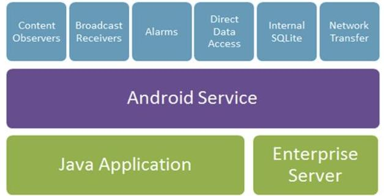
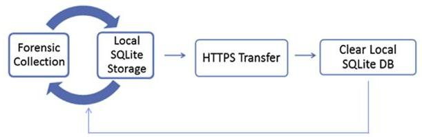
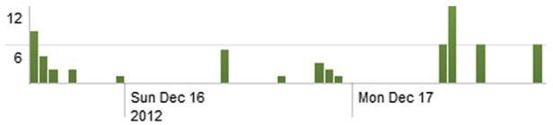
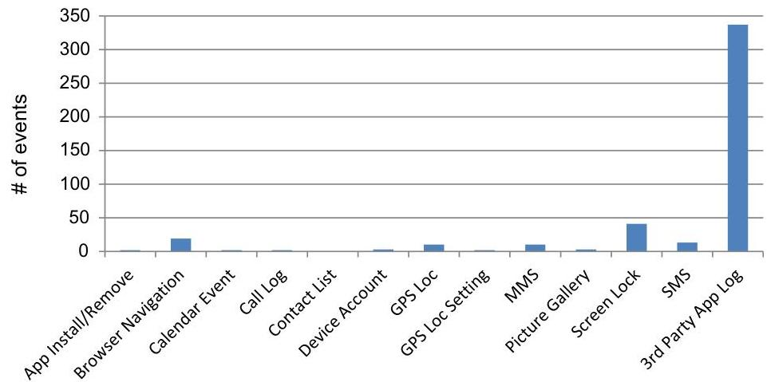

# Android forensics: Automated data collection and reporting from a mobile device 

Justin Grover ${ }^{\mathrm{a}, \mathrm{b}, *}$ ${ }^{a}$ The MITRE Corporation, 7515 Colshire Dr., McLean, VA, United States ${ }^{\mathrm{b}}$ Rochester Institute of Technology, 1 Lomb Memorial Dr., Rochester, NY, United States

## A B S T R A C T

Keywords:
Android
Mobile device
Enterprise user monitoring
Insider threat
Internal investigation

In this research, a prototype enterprise monitoring system for Android smartphones was developed to continuously collect many data sets of interest to incident responders, security auditors, proactive security monitors, and forensic investigators. Many of the data sets covered were not found in other available enterprise monitoring tools. The prototype system neither requires root privileges nor the exploiting of the Android architecture for proper operation, thereby increasing interoperability among Android devices and avoiding a spyware classification for the system. An anti-forensics analysis on the system was performed to identify and further strengthen areas vulnerable to tampering. The contributions of this research include the release of the first open-source Android enterprise monitoring solution of its kind, a comprehensive guide of data sets available for collection without elevated privileges, and the introduction of a novel design strategy implementing various Android application components useful for monitoring on the Android platform. (c) 2013 The MITRE Corporation. Published by Elsevier Ltd. All rights reserved.

## 1. Introduction

In the United States (U.S.), 121.3 million people-roughly one third of the population-owned a smartphone as of October 2012 (comScore, 2012; USA Census Bureau, 2010). The major players in the smartphone market included Google, Apple, Research In Motion (RIM), and Microsoft. Google's Android platform showed significant gains, up to $53.6 \%$ of the market, while RIM continued its decline to $7.8 \%$ (comScore, 2012). As Google's prevalence in the smartphone market grows, so will the pressure for organizations to move from existing mobile options to Android. These organizations include U.S. government agencies, some of which are considering transitioning from RIM to new smartphone systems (Marks, 2012; Rauf, 2012). Some organizations have begun offering personnel the ability to use personal devices (including Android smartphones) on corporate networks

[^0]under Bring Your Own Device (BYOD) policies (Citrix, 2011). BYOD is forecasted to spawn a $\$ 181.39$ billion industry by 2017 (MarketsandMarkets, 2012).

Given the mobile device trends in government and industry, the challenge of securing smartphones on an enterprise has emerged. Most vendors do not design smartphones primarily for businesses but instead for consumers who will utilize their phones as personal devices. RIM is an exception, as corporate customers can deploy a BlackBerry Enterprise Server for device management. Unlike RIM, Android device vendors do not ship with built-in mobile device management (MDM) systems. Third-party MDM is a quickly evolving vendor space that addresses the security gaps left by the smartphone industry. Within the next five years, $65 \%$ of all enterprises are expected to adopt an MDM system (Pettey, 2012). BYOD increases the need for MDM systems due to the inherent risks involved with allowing untrusted devices on an enterprise; organizations need strict enforcement of mobile device security policies to mitigate the BYOD risks.

[^0]:    * The MITRE Corporation, 7515 Colshire Dr., McLean, VA, United States. E-mail address: jgrover@mitre.org.

Research on several leading MDM products revealed a general lack of features that perform automated collections of forensic data from Android devices at the enterprise level. The availability of this data would aid common security practices found within organizations including incident response, security auditing, proactive security monitoring, and forensic investigations. According to the 2010/2011 Computer Security Institute Computer Crime and Security Survey, $61.5 \%$ of respondents from various companies reported that internal audits were performed within their organizations as a security mechanism. Additionally, $44 \%$ reported that data-loss prevention and usercontent monitoring programs were in place (Richardson, 2010). These statistics show that many organizations are aware of insider threat enterprise risks and have taken steps to mitigate them; however, given the lack of technology to monitor Android smartphones, many actions performed on these devices are not audited. The lack of monitoring options, coupled with the significant influence this data can have on internal investigations, led to the proposal and development of a prototype solution named DroidWatch, which is the subject of this paper.

This paper focuses on the design and implementation of an Android application ("app") that automates the collection of useful data for internal investigations, including policy violations, intellectual property theft, misuse, embezzlement, sabotage, and espionage. Data was collected from a Samsung Galaxy S II Epic 4G Touch Android smartphone running Gingerbread 2.3.6. It was then sent to a remote Ubuntu server running PHP, MySQL, Apache, and Splunk. Capabilities such as anti-virus, root detection, and protections against the app's termination or uninstallation are necessary for system and enterprise security, but are out of scope for this research. All data collected by the implemented app will occur with user consent by means of a banner ("user consent banner") similar to those commonly found on corporate or government networks. Data will not be obtained with root privileges or exploitation of the Android architecture.

The remainder of this paper is organized as follows. Section 2 describes background topics involving Android development, security, and privacy. Related work is found in Section 3, followed by design and implementation details of DroidWatch in Section 4. Future work and the conclusion are presented in Sections 5 and 6, respectively.

## 2. Background

The following subsections discuss basic app development terminology (Section 2.1), the Android app security model (Section 2.2), implications of rooting a device (Section 2.3), handling of mobile devices in current investigations (Section 2.4), and privacy concerns (Section 2.5).

### 2.1. Android app development terminology

Android app components are building blocks from the Android framework that help define the behavior of an application (Google. (n.d.). Application fundamentals). The following app components are implemented within DroidWatch: activities, services, content providers, broadcast
receivers, content observers, and alarms. Each component, described below, serves a distinct and useful purpose.

Activities are individual screens that implement a user interface. They display information, prompt user interaction, and start other activities within apps (Google. (n.d.). Application fundamentals). In DroidWatch, activities are rarely used; most of the work happens in the background so as to not impact the overall user experience.

Services are long-running background operations requiring no user interaction. Other app components, such as activities, can launch services and have them persist even when other apps and services are running (Google. (n.d.). Application fundamentals). DroidWatch relies on a service that constantly runs to spawn data collections and transfers.

Content providers are app components that manage the access and sharing of application data. Apps interface with content providers through predefined uniform resource identifiers (URIs) (Google. (n.d.). Application fundamentals). DroidWatch uses content providers in two ways: (1) reading data stored within other apps; and (2) reading and writing data stored within the DroidWatch app.

Broadcast receivers are app components that handle and respond to broadcast system events on an Android device (Google. (n.d.). Application fundamentals). They are implemented into DroidWatch to detect events such as incoming Short Message Service (SMS) messages and app installs.

Content observers are components that, when associated with content providers, receive notifications when a targeted data set's underlying database content is modified (Google. (n.d.). ContentObserver). DroidWatch uses these to detect real-time changes to data.

Alarms are scheduled operations, similar to cron jobs, configured in DroidWatch to periodically query content providers and pull in new data. They are reliable, but only run at designated times.

### 2.2. Android app security

Google's security model for Android apps involves the declaration of permissions within an app's AndroidManifest.xml file (further referred to as "AndroidManifest"). By default, an app with no requested permissions cannot "perform any operations that would adversely impact other applications, the operating system, or the user" (Google. (n.d.). Permissions). This means that an app cannot access the private data of other apps, use network services, write to the internal/external memory, or perform other basic functions. A newly downloaded app must present its declared permissions to the user for acceptance prior to installation.

### 2.3. Rooting

Rooting enables users to perform higher privileged functions on a device than are ordinarily possible under regular user mode. It can be used for legitimate or illegitimate purposes. Users may want to circumvent security restrictions or tamper with data collected through an app like DroidWatch. Root access can also be used legitimately

by forensic investigators to extract data from a device; however, it should be avoided whenever possible. The process typically exploits a security flaw in a specific device or operating system and may lead to further security vulnerabilities. Rooting also alters portions of a device (an action contradictory to forensic practices); nonetheless, rooting may be unavoidable depending on the circumstances and types of data needed (Vidas et al., 2011). While root access may increase the number of features for an app like DroidWatch, the consequences can undermine the system's security, decrease interoperability, and put the smartphone provider's warranty at risk.

### 2.4. Smartphone investigations

Law enforcement and government agencies are the primary players in mobile security, as they are authorized to investigate crimes and secure sensitive government information. Corporations are also very interested in mobile security to protect themselves from commercial espionage, financial theft, and intellectual property theft. Private interests involving divorce settlements, custody battles, estate disputes, etc. also gain from advances in the field (Hoog, 2011).

Consequently, the types of investigations that would benefit from the monitoring of smartphones are law enforcement investigations, internal investigations, and private investigations. This research focuses on internal investigations performed by personnel, contracted or otherwise, within an organization (e.g., incident responders, security auditors, etc.) to investigate potential policy violations, intellectual property theft, misuse, embezzlement, sabotage, espionage, and other inquiries or allegations. Internal investigators are not required to conform to the strict forensic acquisition and preservation procedures of law enforcement investigations but typically try to adhere to commonly practiced forensic techniques and rules.

To obtain valuable smartphone data for internal investigations, physical access to a device has traditionally been required. An exception to this is EnCase Enterprise, which as of October 2012, performs remote forensic imaging of Android devices over a network. Some MDMs can also perform limited monitoring (specific products are covered in Section 3.1), but not enough to effectively address the needs of investigators. Assuming that a mobile device is physically retrieved, investigators can use a variety of tools to take logical or physical snapshots of a device's current state. Andrew Hoog, in (Hoog, 2011), lists many of the tools available to capture information from Android smartphones. Some of the tools are handheld hardware devices and others are software products; however, all work through a universal serial bus (USB) connection and require physical access to the smartphone to function. In addition, many of the tools require root access (Valle, 2013).

### 2.5. Privacy concerns

DroidWatch displays a user consent banner during a phone's boot process to inform users of privacy expectations and to garner their consent (more details on the consent banner's implementation can be found in Section
4.1.2). This helps the app avoid a spyware classification and may deter system misuse.

Table 1 lists several applicable mobile device privacy cases. The acceptable use of consent banners to inform users of monitoring policies in DroidWatch can be derived from the U.S. Court of Appeals ruling in U.S. v. Ziegler (US Court of Appeals, 2007). Arguments for potential BYOD implications can be made from the ruling in the City of Ontario v. Quon U.S. Supreme Court case (US Supreme Court, 2010). As a result, an organization may feel it has the right to install monitoring apps like DroidWatch on all enterprise smartphones, including those that are personally owned, since the phones are operating on their privately-controlled network. The Carrier IQ case, although still pending as of the time of this writing, serves as example of the legal troubles that can come from monitoring user data on a smartphone without user consent (Davis, 2012).

## 3. Related work

The following subsections discuss several efforts that complement or have otherwise influenced this research. Commercial products and academic efforts are discussed in Sections 3.1 and 3.2, respectively.

### 3.1. Commercial products

Third-party MDM products increase the overall security of an enterprise with mobile devices; however, most MDMs do not include in-depth user monitoring capabilities. Some leading MDM offerings, such as Zenprise, AirWatch, and MobileIron, offer limited monitoring capabilities (e.g., GPS tracking and SMS monitoring), but fail to collect other available data sets that are helpful to internal investigations. Of the researched MDM products, Juniper's Junos Pulse Mobile Security Suite (v.3.0R3) offered the most user monitoring capabilities and was evaluated as part of this research. Findings showed that the product collected roughly $50 \%$ of the data sets covered in DroidWatch; however, the data must be stored and hosted by Junipercontrolled systems. This may preclude an organization's requirement to store its audit data internally.

Other commercially available products, such as personal "spy" apps (e.g., Mobistealth, StealthGenie, FlexiSpy, and Mobile Spy), collect many of the same data sets as DroidWatch, but have limiting factors such as requirements for elevated privileges and a lack of enterprise storage and analysis capabilities. They are also often classified as spyware because they collect personal information without knowledge of the user (Juniper Networks, 2012).

Table 1
Mobile device privacy cases.

| Case | Ruling |
| :-- | :-- |
| U.S. v Ziegler (2007) | An organization has the right to monitor   its own equipment if its users are aware   of the policy. |
| City of Ontario v. Quon   (2010) | Audits can be performed on a   company-provided device even if incurred   surcharges are paid by an employee.   N/A (Pending) |

Remote enterprise forensic collection tools also seek to increase enterprise security. Google Rapid Response (GRR) allows forensic investigators and incident responders to forensically acquire evidence from a large number of machines over a network (Cohen et al., 2011). Commercial solutions similar to GRR are EnCase Enterprise, AccessData Enterprise, F-Response Enterprise Edition, and Mandiant Intelligent Response. EnCase Enterprise supports Android, while the others currently do not. The aforementioned remote forensic tools differ from DroidWatch because they do not continuously collect and store data. Instead, they take one-time snapshots of data when instructed by an operator. DroidWatch code could be used to extend the capabilities of these tools.

### 3.2. Academic research

Several scholarly efforts have shaped this research effort. One system, proposed by Lee et al., uses an Android app located on a Secure Digital Card (SDCard) to extract data quickly from a smartphone onto the same SDCard using the Android Application Programming Interface (API) (Lee et al., 2009). This logical approach to collecting data is similar to DroidWatch, except their system does not monitor a device continuously. The work does, however, highlight various data sets that can be obtained without root privileges. AFLogical, released as an open-source product by viaForensics, takes a similar approach. It also uses a specialized SDCard and expands on the number of retrieved data sets (Hoog, 2010). Follow-on work by Yang et al. proposed the substitution of cloud computing for SDCards; however, their research also requires physical access to a device and does not collect data continuously (Yang and Lai, 2012).

Related work by Villan et al. described a native Android app that performs real-time monitoring, similar to virtual network computing (VNC), on a smartphone without the use of root privileges (Villan and Esteve, 2011). The research involved streaming a user's screen to a remote location for usability purposes (i.e., for use at corporate help desks), but this ability to watch a user's screen could be implemented as a future feature in DroidWatch.

Research presented by Shields et al. introduced a forensic acquisition and monitoring system named Proactive Object Fingerprinting and Storage (PROOFS), the first system to perform true forensic acquisitions over a network in a continuous, proactive manner using a novel object fingerprinting approach (Shields et al., 2011). While PROOFS does not operate on Android smartphones, it does highlight the criteria requirements for a monitoring tool to be considered forensically sound. Future work on DroidWatch includes the incorporation of some of these criteria.

Previous anti-forensics work on the Android platform was instrumental in evaluating how DroidWatch could be compromised or thwarted. Several general anti-forensic concepts were ported to Android by Distefano et al. and served as a guide during an anti-forensic assessment of the DroidWatch app (Section 4.3) (Distefano et al., 2010). Research by Azadegan et al. presented an additional anti-forensics concept and was also included in the aforementioned DroidWatch assessment (Azadegan et al., 2012).

## 4. DroidWatch

DroidWatch is an automated system prototype composed of an Android application and an enterprise server. After obtaining user consent, DroidWatch continuously collects, stores, and transfers forensically valuable Android data to a remote Web server without root privileges. The following subsections discuss design and implementation details, analysis and evaluation results, and potential anti-forensic opportunities in the app.

### 4.1. Design and implementation

### 4.1.1. System architecture

DroidWatch's system architecture is described in Fig. 1. Each descending layer represents a higher level of abstraction. Various collection, storage, and transfer components are handled by a service that facilitates actions within the app and the remote enterprise server. The individual components labeled within the diagram are explained throughout the design subsections.

### 4.1.2. User consent to monitoring

The DroidWatch app is dependent upon a user consent banner that appears when the app is started during the phone's boot process or launched manually through the Android app menu. Upon acceptance of its terms and conditions, which are configurable prior to the app's installation in the strings.xml file, a long-running service is launched to perform data collection, storage, and transfers. The option to reject the user consent terms is also presented for the purposes of this research, although organizations may wish to omit this option in real deployments. Rejecting or closing the user consent banner causes the DroidWatch service not to run. The banner is implemented using an activity that is registered in the AndroidManifest to receive the BOOT_COMPLETED broadcast to ensure its display during the boot process.

### 4.1.3. Design strategy

To simplify the development process of an app that performs monitoring through continuous or periodic data collections, a general design strategy for prioritizing the three app components useful for monitoring was created. The strategy was applied throughout the development of DroidWatch, as presented below in Fig. 2.

Fig. 1. DroidWatch system architecture.

## Broadcast Receiver $\rightarrow$ Content Observer $\rightarrow$ Alarm

Fig. 2. Design strategy.

The strategy is based on the relative ease of implementation, ability to handle real-time notifications, and proneness to false positive and duplication issues. First, data sets should be analyzed to determine if they generate system broadcasts. If they do, broadcast receivers should be considered as the app component for collections. If broadcasts are not available, consider content observers for implementation. Alarms should be used if broadcasts and content observers are unavailable or ineffective for the targeted data collections.

### 4.1.4. Local storage

All collected data is stored temporarily in a local SQLite database on the phone and is configured to be accessible to the DroidWatch app only. Standard Structured Query Language (SQL) database functions are handled by a custom DroidWatch content provider. This allows each DroidWatch collection to perform in a thread-safe and structured manner.

A scheduled alarm periodically transfers the local SQLite database file over hypertext transfer protocol secure (HTTPS) POST to the enterprise server for processing. The transfer process is designed to run in the background with minimal impact to a user's experience, helped by the relatively small size of the database file (average of 75 kilobytes).

### 4.1.5. Enterprise server

The enterprise server prototype, to which the collected data flows, is an Ubuntu virtual machine on a local, private network running Apache, PHP, MySQL, and Splunk. Apache was configured with a self-signed secure socket layer (SSL) certificate and included as an asset file within the DroidWatch app. This allows data to be transferred over an HTTPS connection. PHP code handles the SQLite file uploads and extracts events into a MySQL database. Splunk periodically pulls data from the MySQL database and makes the events available in its interface for analysis and reporting.

### 4.1.6. Data process flow

The data process flow within the DroidWatch app is depicted in Fig. 3. Data collection is a continuous process, while transfers are attempted every 2 h (this value is configurable). Upon a successful transfer to the enterprise server, events dated prior to the transfer are wiped from the local phone database, which minimizes the size of that database. File transfers that fail are logged and do not result in the wiping of any events.

### 4.1.7. Data sets

Table 2 lists the data sets collected by DroidWatch. These data sets were chosen based on available content providers, needs for internal investigations, and the level of accessibility (i.e., no root required). Each data set can be configured through droidwatch.properties, an asset

Fig. 3. Data process flow diagram.
file included within the app's source code that allows for the adjustment of collection intervals (i.e., how long the system waits between collections). Organizations can choose to omit the collection of a data set by setting its corresponding interval value to zero. Fifteen unique data sets could be accessed; two data sets-emails and account passwords-were explored, but not used (as explained below).

Mechanisms to access the email app are not part of the standard Android Software Development Kit (SDK) (CommonsWare, 2010). Furthermore, the email app is restricted by a signatureOrSystem permission, which prohibits third-party apps from accessing its private data (Android Open Source Project, 2008). Account passwords are protected by similar protections; the calling app must declare the AUTHENTICATE_ACCOUNTS permission in the AndroidManifest and have its user ID match that of the requested account (Google. (n.d.). AccountManager).

Some data sets used multiple app components to perform collections. For example, Multimedia Message Service (MMS) messages are detected using a broadcast receiver and an alarm; the component used depends on the message direction.

### 4.2. Analysis and evaluation

This section describes the results of DroidWatch experimentation and applies its capabilities to situations where they can aid internal investigations. The scripted

Table 2
Collected data sets.

| Data set | App component used |  |  |
| :--: | :--: | :--: | :--: |
|  | Broadcast receiver | Content observer | Alarm |
| App install/removal | $\checkmark$ |  |  |
| Browser navigation |  |  | $\checkmark$ |
| Browser search |  |  | $\checkmark$ |
| Calendar event |  |  | $\checkmark$ |
| Call log |  | $\checkmark$ |  |
| Contact list |  | $\checkmark$ |  |
| Device account ${ }^{a}$ |  |  |  |
| Device ID |  |  | $\checkmark$ |
| GPS location |  |  | $\checkmark$ |
| GPS location setting | $\checkmark$ |  |  |
| MMS | $\checkmark$ |  | $\checkmark$ |
| Picture gallery |  | $\checkmark$ |  |
| Screen lock status | $\checkmark$ |  |  |
| SMS | $\checkmark$ | $\checkmark$ |  |
| Third-party app log |  |  | $\checkmark$ |

[^0]
[^0]:    ${ }^{a}$ Device account information is collected directly through the Android API upon DroidWatch service starts.

experiments were based on available data sets and the author's prior work experience. All results were derived from a single device and user. Note that while Splunk was used in this research because of its cost (free for up to 500 megabytes per day), other products can perform similar functions.

Fig. 4 illustrates the number of logged events extracted from Splunk over the span of a single day, broken down by data set. The sample contained 442 logs generated by one device and highlights the relatively small quantity of recorded events. Log totals per day will differ based on usage habits; a device that is more heavily used will see increases in log totals. No negative impacts to the user experience or increased battery consumption levels were observed throughout the experimentation.

### 4.2.1. General usage trends

A search for "Screen Unlocked" in Splunk displays a timeline of user-performed actions that indicate active phone usage (e.g., PIN code, gesture, or password entries). The results, which span several days, can be seen in Fig. 5. This data can also be used to determine phone activity at a certain time, discover masquerading users (i.e., users other than the originally assigned user), or develop usage patterns for employees.

### 4.2.2. Suspicious contacts and communications

Contact names or phone numbers that pose a risk to an organization may be discovered through searches or incorporated into Splunk triggers (available in Splunk Enterprise). These may be numbers external to an organization's phonebook or previously identified known-bad individuals.

Recorded SMS and MMS content can also be searched for suspicious activity. An incoming SMS in DroidWatch can serve as a third-party time source since the timestamp is carved out of the raw SMS format. The embedded time within the SMS structure does not rely on the phone's clock (Casey, 2009). Some issues encountered during the analysis of this data were:

**Fig. 5.** Detected screen unlock actions (Splunk).

- Messages sent to multiple contacts only listed a single recipient in the logs.
- Timezones were missing from incoming SMS.
- MMS message text was not available.

When a picture is taken using a phone's camera and immediately sent over MMS, the activity may warrant further investigation depending on the circumstances. Fig. 6 shows a search revealing the logs of a picture taken on Saturday, December 22, 2012, at 3:20 p.m. that was subsequently attached to an outgoing MMS message. If it is found (possibly through GPS tracking) that the user was alone in the office, more analysis may be required to determine whether a data leakage occurred.

### 4.2.3. Location monitoring

Last known locations recorded by DroidWatch include the device ID, latitude, longitude, and capture time. The approach that DroidWatch uses to collect locations conserves battery life, but results in the sparse logging of recorded locations. Only four locations over a seven-day period were reported. Even though the GPS provider setting was enabled, last known locations are not stored on a device unless the GPS is actively used (i.e., the Google Maps app is opened to display the current position). Furthermore, a phone's last known location value is cleared upon device reboots, causing a stored set of coordinates to be lost before being recorded.

Changes made to the location provider setting are also available for tracking. This data would be potentially useful if the phone's physical location data becomes more reliable. It would allow for a device's location to be identified when its GPS setting is turned off manually.

**Fig. 4.** Events logged over 24 h.

Fig. 6. Photo and MMS search results (Splunk).
Recorded calendar events are also beneficial to investigators. Searches performed for a user's appointments can assist with alibi checking, surveillance planning, or identifying travel plans.

### 4.2.4. Internet history

DroidWatch collects and makes available the events performed within the built-in Android Web browser. An Internet history event includes the action taken (e.g., browse or search), the search term or URL, the event time, and the attributed device ID. This information can be used to identify suspicious browser usage on an enterprise, such as uploads of intellectual property to external websites. Browser searches may also be parsed to better extrapolate a user's possible intentions behind the detected actions.

### 4.2.5. Malicious apps

An audit for installed apps may reveal that a device has malware or other apps of concern. This would warrant additional concerns and security measures during an internal investigation. Provided DroidWatch result fields include the app's name, action taken, and install/removal date.

Third-party app logs are also collected by DroidWatch. Several filtering mechanisms limit logs to only those generated by apps not built-in to the phone. While the filtering was not perfect, the total quantity of collected app logs was reduced to a more manageable average of 337 logs per day (down from over 10,000).

### 4.3. Anti-forensics

The upcoming sections are anti-forensics categories drawn from previous work conducted in the Android antiforensics field and are used to assess the DroidWatch app for anti-forensic vulnerabilities. The categories are destroying evidence (Section 4.3.1), hiding evidence (Section 4.3.2), altering evidence sources (Section 4.3.3), counterfeiting evidence (Section 4.3.4), and detecting forensics tools (Section 4.3.5) (Distefano et al., 2010; Azadegan et al., 2012).

Note that DroidWatch, in its current form, is fully susceptible to root attacks, app uninstalls, and process terminations. External protections offered by MDMs, such as root detection and the enforcement of app installation policies, are relied upon to ensure data integrity within DroidWatch.

### 4.3.1. Destroying evidence

Data sets collected through broadcast receivers and content observers are not likely susceptible to evidence destruction methods, since a copy of each event is recorded in DroidWatch's private storage as the event happens. Data sets retrieved through alarms, however, are susceptible to destruction tactics, since it may be possible to remove
evidence (e.g., outgoing MMS messages, third-party app logs, calendar events, browser navigations, browser searches, and last known GPS locations) before the next scheduled collection.

One related concern for DroidWatch is that apps can register for custom intent-filter priorities upon installation. An app that uses the maximum intent-filter priority value, $2^{31}-1$, has the ability to intercept and drop a broadcast before another app receives it. DroidWatch uses the default intent-filter priority value, due to its status as a research prototype.

### 4.3.2. Hiding evidence

Data sets collected through scheduled alarms are among those affected by data hiding tactics. A user wanting to hide a few recent outgoing MMS messages could use manual transfer methods to divert them from the DroidWatch collection process.

The aforementioned ability for apps to register custom intent-filter priorities can similarly enable apps to hide data through the interception and rerouting of broadcasts. For example, GoSMS, a legitimate third-party SMS app, registers for the maximum possible intent-filter priority to divert incoming SMS messages and eliminate the duplication of system notifications (Kovacevic, 2011).

### 4.3.3. Altering evidence sources

Altering evidence sources, according to (Distefano et al., 2010), involves modifying a data set to thwart a collection process. This is another area of concern for DroidWatch. Data collected by alarms are susceptible because the processes rely on certain values in a data set to be present. For example, when scanning for new outgoing messages through the MMS content provider, the "msg_box" field indicates the message's direction-with " 2 " representing a sent/outgoing MMS. If this field's value is altered to " 5 ," the message is ignored during the collection process.

### 4.3.4. Counterfeiting evidence

Counterfeiting evidence on mobile devices involves adding fictitious data to existing data sets to confuse or evade investigators. DroidWatch collections are vulnerable to this, because no checks are performed to differentiate fake entries from real ones.

Adding massive amounts of fictitious data over a short time span may also result in a denial of service attack, another concern for DroidWatch. Should enough data be injected into a phone, the app may cease to function properly.

### 4.3.5. Detecting forensics tools

It was determined that the detection of forensics tools research performed by (Azadegan et al., 2012) was not directly applicable to DroidWatch. They focused on listening for initial connection signatures of some wellknown forensics tools on Android phones. DroidWatch performs monitoring, unlike traditional forensics tools, and has no initial connection signatures or requirement for physical access to a device.

The idea of detecting signatures, however, can be applied to DroidWatch's scheduled transfers. If the pattern of data transfers to the enterprise server is determined, an

automated tool could disable networking on a device before the transfer occurs, therefore causing a denial of service on the system.

## 5. Future work

Future research on DroidWatch includes work on the app and the enterprise server. The upcoming sections cover proposed improvements to collect additional data sets (Section 5.1) and implement anti-tampering mechanisms (Section 5.2).

Aside from the future improvements to DroidWatch, integration of DroidWatch into an MDM solution would be very valuable for the Android security community. Current MDM systems lack user monitoring features that could aid internal investigations. An overall enterprise security system that provides a combination of solid policy enforcement, remote device management, and comprehensive user monitoring on Android devices would help mitigate security concerns among the government and industry organizations considering Android smartphone deployments.

### 5.1. Additional data sets

Android forensics is an evolving field that changes with each new operating system release. As new data sets and features become available, their value to an investigation must be assessed for possible inclusion into a monitoring system. Future DroidWatch incorporations include the following data sets: USB debug settings, phone restarts, voicemail logs, and additional app and kernel logs from dumpsys, dumpstate, and dmesg.

### 5.2. Anti-tampering mechanisms

Data collected and stored on a phone currently relies on the Android built-in security model (Section 2.2) to prevent users and apps from tampering. Some proposed capabilities to harden DroidWatch include:

- Encryption of database events (with checksum)
- High intent-filter priority values
- Keep-alive logging
- Event-based collections and transfers
- Database hashing

Encrypting events in the DroidWatch database is a mechanism to deter users from viewing or tampering with previously collected events. Each event can be paired with a checksum and encrypted using a public key infrastructure (with a private key stored on the enterprise server). Registering for maximum intent-filter priority values in the AndroidManifest may help prevent apps from suppressing system broadcasts, although further research is needed to determine what happens when two apps register with the same priority value. Periodic logging of "keep-alive" messages to the DroidWatch database would highlight service disruptions. Tampering may be evident if gaps in time are present between logs. Event-based triggers may provide a more random transfer pattern and may prevent time-based
thwarting attempts against the scheduled operations; however, further research on the effectiveness of this capability is required. The final anti-tampering capability listed is the hashing of transferred databases. Comparing hash values is a solid way to discover evidence tampering, assuming that the originating device is not compromised.

## 6. Conclusion

The system introduced in this research serves as a prototype for the Android community to design and implement continuous Android monitoring in enterprise environments without root privileges. DroidWatch is the first open-source system of its kind; however, it requires further development to broaden and improve its capabilities. Anti-tampering mechanisms will also need to be implemented to increase security. As noted, the data sets collected are useful for many types of internal investigations for a variety of reasons. This research contributes a novel development design strategy, which can be used to prioritize Android app components for monitoring. Finally, this work serves as a guide for accessing data sets available through the default Android API.

## Acknowledgments

The author would like to thank his thesis committee members (Bill Stackpole, Dr. Tae Oh, and Dr. Yin Pan), his MITRE colleagues (notably Mark Guido), and Monica Grover for their input and edits.

## References

Android Open Source Project. Android/platform/packages/apps/Email.gitl. https://android.googlesource.com/platform/packages/apps/Email.git/ +/android-2.3.6_r1/AndroidManifest.xml; 2008.
Azadegan S, Yu W, Sistani M, Acharya S. Novel anti-forensics approaches for smart phones. In Hawaii International Conference on System Sciences (pp. 5424-5431). Maui, HI: IEEE; 2012, January 4.
Casey E. Top 7 ways investigators catch criminals using mobile device forensics. http://computer-forensics.sans.org/blog/2009/07/01/top-7-ways-investigators-catch-criminals-using-mobile-device-forensics; 2009, July 1.
Citrix. IT organizations embrace bring-your-own devices. http://www. citrix.com/site/resources/dynamic/additional/Citrix_BYO_Indos_report. pdf; 2011, July 22.
Cohen MI, Bilby D, Caronni G. Distributed forensics and incident response in the enterprise. In: Digital forensics research workshop 2011. New Orleans, LA: Elsevier; 2011S101-10; August 2011.
CommonsWare. Access Android emails through content provider. http:// stackoverflow.com/questions/3811608/access-android-emails-through-content-provider; 2010, September 28.
comScore, Inc. comScore reports October 2012 U.S. mobile subscriber market share. http://www.comscore.com/Insights/Press_Releases/ 2012/11/comScore_Reports_October_2012_U.S._Mobile_Subscriber_ Market_Share; 2012, November 30.
Davis W. Carrier RJ loses preliminary round in privacy lawsuit. http://www. mediapost.com/publications/article/175096/carrier-iq-loses-preliminary-round-in-privacy-laws.html\#axzz2FMwgPIJ6; 2012, May 21.
Distefano A, Me G, Pace F. Android anti-forensics through a local paradigm. In Digital forensics research workshop 2010 (pp. 595-5103). Portland, OR: Elsevier; August 2010.
Google. (n.d.). Application fundamentals. http://developer.android.com/ guide/components/fundamentals.html.
Google. (n.d.). ContentObserver. http://developer.android.com/reference/ android/database/ContentObserver.html.
Google. (n.d.). Permissions. http://developer.android.com/guide/topics/ security/permissions.html.
Google. (n.d.). AccountManager. http://developer.android.com/reference/ android/accounts/AccountManager.html.

Hoog A. Android forensics: investigation, analysis and mobile security for Google Android. Waltham, MA: Syngress; 2011.
Hoog A. Open source Android digital forensics application. http:// computer-forensics.sans.org/blog/2010/03/01/open-source-android-digital-forensics-application; 2010, March 1.
Juniper Networks. MTC mobile signatures. http://www.juniper.net/us/en/ security/mobile-threat-center/\#ANDROID:A.Mobistealth; 2012, June 28.
Kovacevic N. SMS broadcastreceiver not called when GO SMS Pro installed. http://stackoverflow.com/questions/6561297/sms-broadcastreceiver-not-called-when-go-sms-pro-installed; 2011, July 15.
Lee X, Yang C, Chen S, Wu J. Design and implementation of forensic system in Android smart phone. http://crypto.nknu.edu.tw/publications/ 2010JWIS_Android.pdf; July 2010.
MarketsandMarkets. Bring-your-own-device (BYOD), consumerization of IT (Co-IT) and enterprise mobility market - Global advancements, business models, market forecasts \& analysis (2012-2017). http://www. marketsandmarkets.com/AnalystBriefing/byod-enterprise-mobilitymarket.asp; 2012, September 21.
Marks J. ICE drops BlackBerry in favor of iPhone. http://www.nextgov. com/mobile/2012/10/ice-dumps-blackberry-favor-iphone/58905/; 2012, October 19.
Pettey C. Gartner says two-thirds of enterprises will adopt a mobile device management solution for corporate liable users through 2017. http://www.gartner.com/it/page.jsp?id=2213115; 2012, October 25.
Rauf DS. More feds ditch BlackBerrys. http://www.politico.com/news/ stories/0212/73369.html; 2012, February 28.
Richardson R. 2010/2011 CSI computer crime and security survey. http:// gocsi.com/survey; 2010, December 2.
Shields C, Frieder O, Maloof M. A system for the proactive, continuous, and efficient collection of digital forensic evidence. In Digital forensics
research workshop 2011 (pp. 53-511). New Orleans, LA: Elsevier; August 2011.
U.S. Census Bureau. USA quickfacts. http://quickfacts.census.gov/qfd/ states/00000.html; 2010.
U.S. Court of Appeals, 9th Circuit. U.S. v. Ziegler. http://www.ca9.uscourts. gov/datastore/opinions/2007/06/20/0530177o.pdf; 2007, June 20.
U.S. Supreme Court. City of Ontario, California, et al. v. Quon et al. http:// www.supremecourt.gov/opinions/09pdf/08-1332.pdf; 2010, June 17.
Valle S. Android forensics \& security testing. http://opensecuritytraining. info/AndroidForensics.html; 2013, January 7.
Vidas T, Zhang C, Christin N. Towards a general collection methodology for Android devices. In: Digital forensics research workshop 2011, New Orleans, LA 2011514-24; August 2011.
Villar AG, Esteve JJ. Remote control of mobile devices in Android platform. http://openaccess.uoc.edu/webapps/o2/handle/10609/8131; 2011, June 19.
Yang C-H, Lai Y-T. Design and implementation of forensic systems for Android devices based on Cloud computing. Applied Mathematics \& Information Sciences Jan. 2012:2435-75.

Justin Grover has 5 years of experience in the digital forensics field, working as a cyber security engineer for The MITRE Corporation. He holds a master's degree in computing security \& information assurance from the Rochester Institute of Technology and a bachelor's degree in computer science from the State University of New York (SUNY) at Geneseo. While working for MITRE, Mr. Grover has consulted dually as an insider threat analyst and developer within a security operations center for a large government organization, supporting over 100 internal investigations. His recent focus includes research on Android device forensics under MITRE's innovation program.

