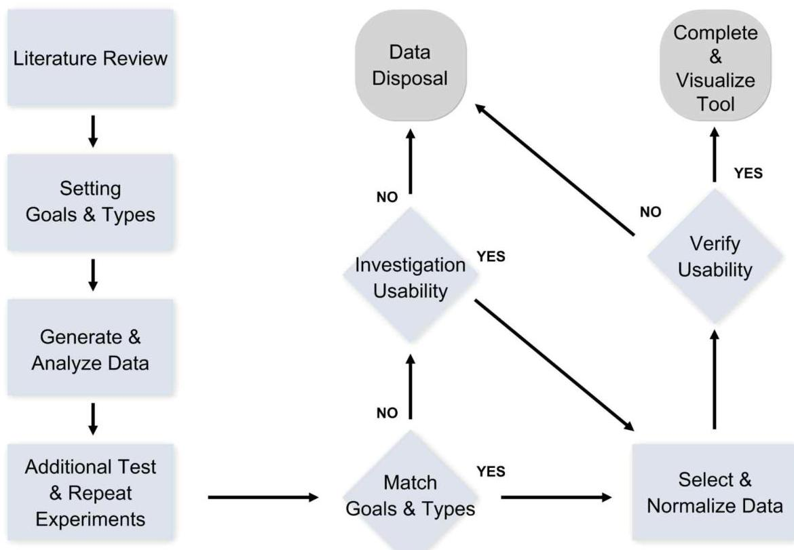
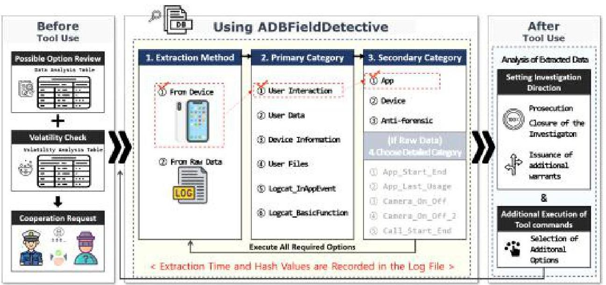
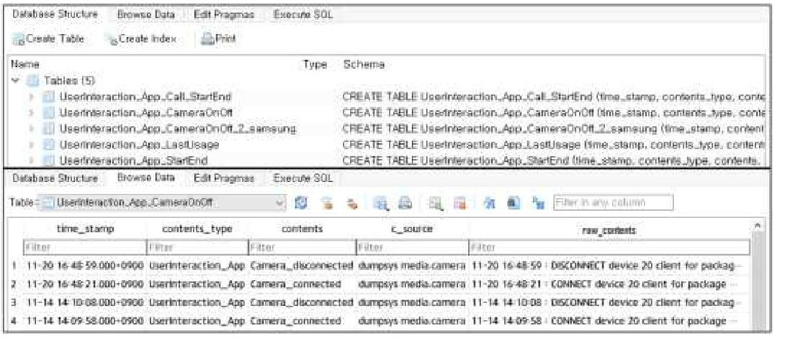
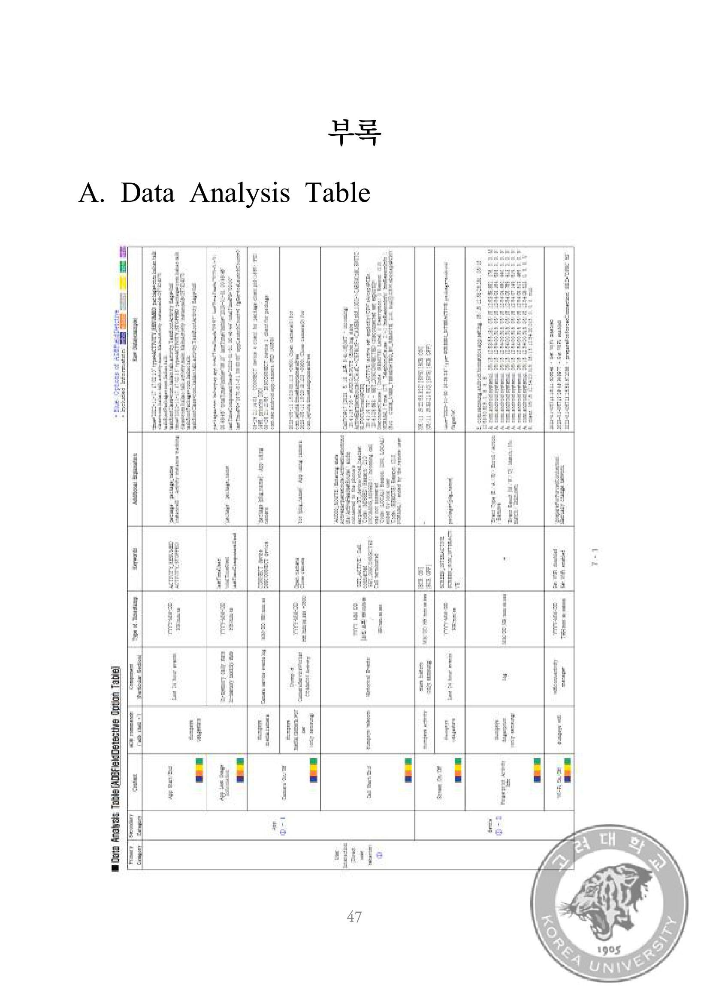

# (c)creative <br> commons 

C O M M O N S D E E D

저작자표시-비영리-변경금지 2.0 대한민국
이용자는 아래의 조건을 따르는 경우에 한하여 자유롭게

- 이 저작물을 복제, 배포, 전송, 전시, 공연 및 방송할 수 있습니다.

다음과 같은 조건을 따라야 합니다:

저작자표시. 귀하는 원저작자를 표시하여야 합니다.

비영리. 귀하는 이 저작물을 영리 목적으로 이용할 수 없습니다.

변경금지. 귀하는 이 저작물을 개작, 변형 또는 가공할 수 없습니다.

- 귀하는, 이 저작물의 재이용이나 배포의 경우, 이 저작물에 적용된 이용허락조건 을 명확하게 나타내어야 합니다.
- 저작권자로부터 별도의 허가를 받으면 이러한 조건들은 적용되지 않습니다.

저작권법에 따른 이용자의 권리는 위의 내용에 의하여 영향을 받지 않습니다.
이것은 이용허락규약(Legal Code)을 이해하기 쉽게 요약한 것입니다.
Disclaimer $\square$

# 석 사 학 위 논 문 

Android 진단 로그 포렌식 분석 및 정규화 방안 연구


고 려 대 학 교 정 보 보 호 대 학 원
정 보 보 호 학 과
권 혀 철

# 박 정 흠 교 수 지 도 <br> 석 사 학 위 논 문 

## Android 진단 로그 포렌식 분석 및 정규화 방안 연구

이 논문을 공학 석사학위 논문으로 제출함

2024년 2월

고 려 대 학 교 정 보 보 호 대 학 원
정 보 보 호 학 과
권 혁 철 (인)


권혁철의 공학 석사학위논문 심사를 완료함

2023년 12월

| 위원장 | 박 정 흠 | (인) |
| :-- | :-- | :-- |
| 위 원 | 이 상 진 | (인) |
| 위 원 | 신 영 주 | (인) |


# Android 진단 로그 포렌식 분석 및 정규화 방안 연구 

권 혁 철<br>정 보 보 호 학 과<br>지도교수: 박 정 흠

## 초록

모바일 기기의 보안성이 강화되면서 디지털포렌식 분야에서 기기 내 데이터를 수집하는데 어려움이 가중되고 있다. 이를 극복하기 위한 방법으로 모바일 기기나 운영체제에서 공식적으로 제공하는 도구가 많이 활용되고 있는데, 안드로이드 운영체제의 경우 대표적으로 Android Debug Bridge(이하 ADB)가 있다. ADB는 개발자를 위해서 제공된 디버깅용 도구이며, 관리자 권한 없이 셸에 접근하여 쉽게 안드로이드 로그 정보를 획득할 수 있게 해준다. 하지만, ADB로 추출된 로그는 내용이 장황하고 방대하여 실제 디지털포렌식 수사에서 활용하기가 쉽지 않다. 따라서, 본 연구에서는 ADB로 추출된 로그 중 디지털포렌식 수사에 활용 가능한 로그를 선별 및 분석하고, 이를 효율적으로 사용 가능토록 데이터를 정규화할 수 있는 방안을 제시한다.

주제어: 디지털포렌식, 모바일포렌식, 안드로이드, ADB, 진단 로그

# Research on Method for Analyzing and Normalizing Android Diagnostic Logs for Digital Forensics 

by Hyeokcheol Gwon<br>Department of Cybersecurity<br>under the supervision of Professor Jungheum Park


#### Abstract

As the security of mobile devices has been strengthened, challenges in collecting data from the devices in the field of digital forensics have intensified. To overcome these challenges, many tools officially provided by mobile devices or operating systems are being utilized. Notably, the Android operating system offers the Android Debug Bridge (ADB). ADB, designed for developers, is a debugging tool that allows easy access to the shell without administrative privileges, facilitating the acquisition of Android log information. However, logs extracted via ADB tend to be verbose and voluminous, making them challenging to use in actual digital forensic investigations. Therefore, this study aims to select and analyze logs from ADB that can be beneficial for digital forensic investigations and proposes a method to normalize the data for efficient use.


Keywords: Digital forensics, Mobile forensics, Android, ADB, Diagnostic $\log$

부모님, 고려대학교와 DFRC, 함께한 동기들, 그리고 지리산에 감사드립니다.

# 서문 

본 연구의 내용은 2023년 한국디지털포렌식학회 하계 학술대회('23.6월)에서 발표하였고, 2023년 9월 한국디지털포렌식학회지(17-3호)에 게제된 논문을 보안$\cdot$ 발전시켰다.

본 연구은 과학기술정보통신부-경찰청이 공동 지원한 '폴리스랩2.0 사업(www.kipot. or.kr)'의 지원을 받아 수행된 연구결과이다.[안티-포렌식 기술 대응을 위한 데이터 획득 및 분석 기술 연구 / 과제번호: 210121M07]

# 목차 

## $<$ 제목 차례 $>$

초록 ..... i
Abstract ..... ii
서문 ..... iv
목차 ..... v
표 목차 ..... vii
그림 목차 ..... ix

1. 서론 ..... 1
2. 배경지식 및 관련연구 ..... 3
2.1 배경지식 ..... 3
2.2 선행연구 ..... 6
3. 연구 방법론 ..... 8
4. Android 진단 로그 정규화 ..... 13
4.1 User Interaction(사용자의 직접적 행위 로그) ..... 13
4.1.1 App ..... 13
4.1.2 Device ..... 16
4.1.3 Anti-forenics ..... 18
4.2 User Data(직접적 행위 이외의 로그) ..... 19
4.2.1 Call ..... 19
4.2.2 Message ..... 20

4.2.3 Wi-Fi ..... 20
4.2.4 Bluetooth ..... 22
4.2.5 Account ..... 20
4.2.6 Location ..... 23
4.2.7 App Package ..... 24
4.3 Device Info(기기 일반 정보) ..... 26
4.4 User Files(파일 및 미디어 자료) ..... 27
4.5 Logcat_InAppEvent(앱 내부 로그) ..... 28
4.6 Logcat_BasicFunction(기본 기능 로그) ..... 30
5. 도구(ADBFieldDetective) 개발 ..... 32
6. 사례 분석 ..... 35
7. Discussion ..... 42
8. 결론 ..... 45
참고문헌 ..... 46
부록 ..... 47
A. Data Analysis Table ..... 47
B. Volatility Analysis Table ..... 54

# 표 목차 

## <표 차례>

Table 1. Key ADB Commands for Data Extraction ..... 4
Table 2. Mobile Phones and Dumpsys Service Counts in Study ..... 5
Table 3. Types and Contents of Logcat Ring Buffers ..... 5
Table 4. Ring Buffer Sizes of Mobile Phones Used in the Study ..... 5
Table 5. Data Type Criteria ..... 9
Table 6. Data Classification and Commands for Android Diagnostic Logs in This Study ..... 10
Table 7. Various Time Value Formats and Normalization Approaches ..... 11
Table 8. Example of Data Analysis Table ..... 11
Table 9. Example of Volatility Analysis Table ..... 12
Table 10. Example of Data Normalization ..... 12
Table 11. User Interaction - App ..... 14
Table 12. User Interaction - Device ..... 16
Table 13. User Interaction - Anti-forensics ..... 18
Table 14. User Data - Call ..... 19
Table 15. User Data - Message ..... 20
Table 16. User Data - Wi-Fi ..... 21
Table 17. User Data - Bluetooth ..... 22
Table 18. User Data - Account ..... 23
Table 19. User Data - Location ..... 23

Table 20. User Data - App Package ..... 25
Table 21. Device Info ..... 27
Table 22. Logcat_InAppEvent - Call ..... 28
Table 23. Possible Options for Logcat InAppEvent ..... 29
Table 24. Logcat_BasicFunction - Location ..... 30
Table 25. Possible Options for Logcat BasicFunction ..... 31
Table 26. Example of Extracted File Log.txt ..... 34
Table 27. Assessment of Tool Options Based on Estimated User Behavior ..... 36
Table 28. Data Extraction Results for Taking Photos and Videos ..... 36
Table 29. Data Extraction Results for Taking Photos and Videos (Logcat) ..... 37
Table 30. Data Extraction Results for Location Movement ..... 37
Table 31. Data Extraction Results for Account ..... 38
Table 32. Data Extraction Results for App Usage History ..... 38
Table 33. Data Extraction Results for Anti-forensics ..... 39
Table 34. Assessment of Tool Options Based on Estimated User Behavior ..... 40
Table 35. Examples of Categories Applicable to Each Case ..... 41
Table 36. Comparison of Data Formats in Android 12 and Android 13 Versions ..... 42
Table 37. Comparison of Data Formats Between Different Applications ..... 43

# 그림 목차 

## <그림 차례>

Figure 1. Reserach Process ..... 8
Figure 2. Procedure for Using ADBFieldDetective ..... 32
Figure 3. Example of UserInteraction - App Option ..... 34

# 1. 서론 

최신 스마트폰은 사용자의 개인정보를 보호하고 유출을 방지하기 위해 기본적으로 FDE(Full Disk Encryption), FBE(File Based Encryption) 방식의 암호화를 제공하고 있으며, 생체인증과 각종 자체 보안 기술들을 통해 사용자 데이터에 대한 보안성을 강화하고 있다. 이에 따라 최신 스마트폰의 디지털포렌식 수사에서 사용자에 대한 데이터를 획득하기가 더욱 어려워지고 있다.

이를 극복하기 위해 현행 디지털포렌식 수사는 스마트폰 제조사 및 OS에서 공식적으로 제공하는 개발자 도구, 백업 도구, 기기의 취약점 등을 활용하고 있다. 하지만, 이러한 방법들은 주로 사용자 데이터 획득에 초점을 맞추고 있으며, 기기에서 생성되는 로그를 분석하는 것에는 큰 노력을 들이지 않고 있다. 따라서, 본 연구에서는 안드로이드 운영체제에서 공식적으로 제공하고 있는 도구인 ADB를 통해 관리자 권한 없이 시스템 로그에 기록된 수많은 정보를 쉽게 수집하는 방법을 제안한다. 스마트폰 이용자의 수많은 사용 흔적이 로그에 저장되기 때문에 ADB를 잘 활용한다면 디지털포렌식 수사에 큰 도움이 될 수 있다.

ADB를 통해 추출한 로그 데이터는 휘발성이 있어 데이터가 오랜 기간 유지되지 않는다. 아무리 유용한 데이터라도 금방 사라진다면 수사에 활용하기가 쉽지 않다. 그럼에도 불구하고 경찰청 통계자료[1]에 따르면 2020-2021년 2년간 '범죄 발생 시점부터 1 일 안에 범인이 검거될 확률'은 약 $25 \%$ 이다. 따라서, ADB 추출 로그 데이터의 휘발성에 대한 구체적인 정보를 잘 활용한다면 다양한 사건에서 디지털포렌식 수사에 활용이 가능하다. 우리는 이번 연구를 통해 피조사자의 행위를 입증할 수 있는 많은 로그 데이터를 식별하였으며, 로그 별 휘발성 분석 결과를 함께 제시한다. 또한, 사례 분석을 통해 실제/디지털포렌식

수사로의 적용 가능성을 확인하였다.
본론에서는 구체적인 방법론 및 결과를 제시한다. 2 장에서는 본 연구를 위한 배경지식과 도움이 되었던 선행연구들을 살펴보고, 3장에서는 연구 방법론을 소개한다. 이를 바탕으로 4장에서는 이번 연구에 대한 세부적인 결과를 제시하며, 이를 바탕으로 5장에서 도구개발 현황을 소개한다. 마지막으로 6장에서 사례 분석을 통해 그 활용성을 보일 것이다. 결론에서 연구의 제한사항과 향후 연구 방향을 밝히며 논문을 마친다.

# 2. 배경지식 및 관련 연구 

본 연구에서 핵심은 ADB를 통한 로그 데이터 추출 및 분석이다. 따라서, 본 절에서 ADB 및 안드로이드 로그에 대한 배경지식을 소개하고, 관련 선행연구를 밝힌다.

## 2.1 배경지식

### 2.1.1 Android Debug Bridge(ADB)

ADB는 안드로이드에서 공식적으로 제공하는 다목적 도구이다. ADB는 셸에 접근하여 앱 설치/삭제, 디버깅 등 다양한 기능을 지원하고 있다. 본 논문에서는 이 중에서 데이터를 추출하는 일부 명령어만을 사용한다. ADB를 사용하기 위해서는 스마트폰의 "개발자 모드" 옵션에서 "USB-Debugging"이 사용 가능하도록 허용하여야 하고, PC와 스마트폰을 연결해야 한다. 연결 방법은 USB를 통해 물리적으로 연결하며, 네트워크에 접속된 경우에는 Wi-Fi 연결도 가능하다[2].

안드로이드에는 다양한 종류의 로그가 있으며, ADB를 통해 다양한 로그에 쉽게 접근할 수 있다. 본 연구에서는 주로 "dumpsys" 및 "backup", "logcat" 명령어를 분석하였으며, "bugreport"로 추출한 데이터도 함께 참고하였다. ADB가 제공하는 주요 데이터 추출 명령어는 아래 <Table $1>$ 과 같다[2].


Table 1. Key ADB Commands for Data Extraction

| Command | Description |
| :-- | :-- |
| adb shell dumpsys | Dumps detailed information about the status of system services. |
| adb bugreport | Collects system information from an Android device and saves it to a file. |
| adb logcat | Provides a real-time stream of system log messages generated by the Android device. |
| adb shell pm | Manages packages on an Android device. |
| adb backup | Creates a backup of an Android device's data and applications. |

# 2.1.2 Dumpsys 

dumpsys는 Android 기기에서 실행되는 도구로, 시스템 서비스에 관한 정보를 제공한다. ADB를 사용해 명령줄에서 dumpsys를 호출하여 연결된 기기에서 실행되는 모든 시스템 서비스의 진단로그 출력을 가져올 수 있다.[2] <Table 2>는 이번 실험에 사용된 각종 기기들의 목록과 각 기기별 지원가능한 dumpsys 서비스의 개수를 나타낸 표이다. 표에서 보는 바와 같이 최신 기종 및 안드로이드 버전일수록 더 많은 dumpsys 서비스가 지원됨을 알 수 있다.

Table 2. Mobile Phones and Dumpsys Service Counts in Study

| Manufacturer | Device | Model Name | OS Version | Release Date | Dumpsys Count |
| :--: | :--: | :--: | :--: | :--: | :--: |
| Samsung | Galaxy S23 | SM-S911N | 13 | 2023. 2. | 368 |
|  | Galaxy S21 | SM-G996N | 13 | 2021. 1. | 304 |
|  | Galaxy Note10 | SM-N971N | 12 | 2019. 8. | 294 |
| Xiaomi | Redmi Note12 | 23021RAAEG | 13 | 2023. 3. | 316 |
|  | Redmi Note11 | 2201117TY | 12 | 2021.10. | 260 |
| Google | Pixel 6 | GX7AS | 13 | 2021.10. | 268 |

### 2.1.3 Logcat

Logcat은 안드로이드에서 사용하는 로깅시스템 도구이며, 개발자들아 다버강 목적으로 활용할 수 있도록 수 많은 정보를 로그 메시지 형태로 출력해준다. 다만,

실시간 디버깅 목적으로 만들어져 있기 때문에 휘발성이 상당히 크다. Logcat은 데이터를 저장하기 위해 Ring buffer라는 구조를 활용하고 있고, 이 buffer는 'main, event, crash, radio, system' 로 구성되어 있다. 각 ring buffer별 포함하는 내용은 $<$ Table $3>$ 과 같다.[2]

Table 3. Types and Contents of Logcat Ring Buffers

| Ring buffer | Contents |
| :--: | :-- |
| Main | Views the main log buffer (default), which doesn't contain system and crash log <br> messages. |
| Event | Views the interpreted binary system event buffer messages. |
| Crash | Views the crash log buffer (default). |
| Radio | Views the buffer that contains radio/telephony related messages. |
| System | Views the system log buffer (default). |

Ring buffer는 제조사 및 휴대전화 모델별로 조금씩 다른 고정된 크기를 가지고 있으며, buffer의 크기가 가득 차게 되면 과거 데이터를 새로운 데이터를 덮어쓰도록 만들어져 있다. 즉, 'First In, First Out'으로, 새로운 로그가 쌓일수록 과거에 로그순으로 지워진다. Ring buffer의 크기는 휴대전화 기종 및 제조사마다 차이가 있으며, <Table 4>는 본 연구에서 활용된 휴대전화의 기기별 Ring Buffer의 크기를 나타낸다. 기본적으로 앱에서 발생시키는 로그는 'main' buffer에 기록된다.

Table 4. Ring Buffer Sizes of Mobile Phones Used in the Study

|  |  | Ring Buffer |  |  |  |  |  |
| :--: | :--: | :--: | :--: | :--: | :--: | :--: | :--: |
| Manufacturer | Device | Main | System | Radio | Events | Crash |  |
|  | Galaxy S23 | 5 MiB | 2 MiB | 512 KiB | 512 KiB | 4 MiB |  |
| Samsung | Galaxy S21 | 5 MiB | 2 MiB | 512 KiB | 512 KiB | 4 MiB |  |
|  | Galaxy Note10 | 5 MiB | 2 MiB | 512 MiB | 512 KiB | 256 KiB |  |
| Xiaomi | Redmi Note12 | 256 KiB | 4 MiB | 4 MiB | 256 KiB | 1 MiB |  |
|  | Redmi Note11 | 256 KiB | 4 MiB | 4 MiB | 256 KiB | 1 MiB |  |
| Google | Pixel 6 | 256 KiB | 256 KiB | 256 KiB | 256 KiB | 256 KiB |  |

# 2.2 선행연구 

박은후 외 3명[3]은 당시 안드로이드 최신버전(안드로이드 9)의 삼성 스마트폰 기기를 대상으로 로그를 분석하고 포렌식 활용방안을 제시하였다. 특히, 안드로이드 시스템 로그를 통해 획득할 수 있는 많은 아티팩트를 제시했으며, 관리자 권한 유무에 따라 추출되는 데이터를 비교하여 포렌식적 활용방안을 제시하였다. 이 논문은 삼성 스마트폰만을 대상으로 하였고, 연구되었던 로그 중 상당 부분이 안드로이드 버전 업그레이드로 인해 변화되었다.

김승규 외 2명[4]은 불법 촬영 범죄 대응을 위한 현장용 디지털포렌식 도구를 제안하였다. 본 연구는 국내 형사소송법에 근거하여 법적인 절차를 고려하여 실제 수사 현장에서 사용 가능한 도구를 만드는데 중점을 두었다. 다만, 해당 논문에서는 다양한 로그 데이터 중 logcat에 대해서만 분석 및 활용하였다.

Lukas Bortnik 외 1명[5]은 안드로이드 dumpsys 로그를 중점적으로 분석하여, 자동차 사고조사 시 운전자의 의도적 행위를 식별하는 방안을 제시하였다. 특히, 스마트폰 사용자의 행위에 초점을 맞추어 dumpsys 로그를 정규화하였고, 사용자의 행위를 타임라인에 따라 구성하는 방안을 소개하였다. 이 논문은 안드로이드 8 버전 기기를 중심으로 연구하였고, 현재의 데이터와는 많은 차이가 있다. 또한, 자동차 사고조사라는 특정 상황을 가정하여 연구를 진행하였다.

Mattia Epifani[6]는 안드로이드의 다양한 ADB 명령어를 통해 데이터를 추출하고 분류하는 연구를 진행하였다. ADB를 통해 접근할 수 있는 안드로이드 로그가 장황하고 방대함을 고려하여 유용한 명령어만을 실행하여 로그 데이터를 얻을 수 있도록 "android_triage bash script" 도구를 개발하여 배포하였다. 이 도구는 실용적이긴 하지만 각 로그에 대한 분석을 제공해주지는 않았다.

Chris Chao-Chun Cheng[7]은 안드로이드 로깅 시스템(logcat)에서 데이터를 자동으로 추출하고 이를 디지털 증거로 활용하는 방안을 소개하였다. 본 연구에서 개발한 도구는 먼저 Java String Analyzer (JSA)를 변형하여 다양한 앱의 APK를 분석한 후 App Log Evidence Database (ALED)를 생성한다. 이후/ 실제 앱에서

생성된 로그 데이터를 ALED에 저장된 패턴과 Deterministic Finite Automaton (DFA)을 이용하여 비교 분석함으로써 관련 로그 데이터 정보를 추출한다. 이 연구는 logcat 데이터 분석과 추출을 자동화했다는 의의가 있지만, 안드로이드 8 버전을 중심으로 이루어져 현재 데이터 형식에는 직접 적용하기 어렵고, APK를 통한 분석은 실제 목표로 하는 세부적인 데이터를 추출하기에는 한계가 있다.

앞선 연구들은 안드로이드 로그를 특정 목적을 위해 일부만 활용하는 등 로그 활용을 위한 제한적인 방법을 제시하였다. 당시의 최신 스마트폰의 운영체제인 안드로이드 9 버전 이하를 기준으로 연구 결과를 제시하였기 때문에 현재 최신 버전인 안드로이드 13 버전의 로그와는 많은 차이가 있다. 또한, 앞서 관련 연구에서는 루팅 상태에서 데이터를 추출하거나, 데이터 분석에 초점을 맞추어 로그 추출을 위한 구체적인 방법을 제시하지 않았다. 안드로이드 로그를 추출하는 방법에는 ADB, 삼성 휴대전화의 System Dump Mode(*\#9900\#), 기타 공개된 도구[8] 등이 있는데, 본 연구에서 활용한 ADB는 안드로이드 공식 도구로써 루팅 여부나 기기 종류에 상관없이 사용할 수 있다는 장점이 있으며, 다양한 종류의 로그를 쉽게 추출할 수 있도록 하여 자동화 도구 개발에도 용이하다.

# 3. 연구 방법론 



Figure 1. Research Process

본 연구에 사용된 기기는 앞서 설명하였듯이 <Table 2>와 같다. 현재 대다수가 사용중인 최신 안드로이드 기종(안드로이드 13, 12)을 대상으로 선정하였다.

세부연구 수행방법은 <Figure $1>$ 와 같다. 우선, 그동안 ADB를 활용한 데이터 추출에 대한 많은 연구들을 참고하였다. 다만, 데이터 형태의 많은 변화가 있었기

때문에 가장 최신 연구들을 우선적으로 참고하였다. 먼저, 데이터 추출 목표를 "디지털포렌식 수사에 유용한 데이터"로 삼고, 기존 선행연구들의 분석을 통해 추출 가능성이 있는 데이터를 예측하여 "데이터 유형"을 <Table 5>과 같이 선정하였다.

Table 5. Data Type Criteria

|  Data Types | Contents  |
| --- | --- |
|  User Interaction | Immediate interacion of the user with device  |
|  User Data | Accumulated data from user actions(Exculuding User Interaction)  |
|  Device Information | Basic device information  |
|  User File | Files and media stored by the user  |

ADB로 추출 가능한 데이터는 대부분 로그 형태의 데이터이며, 일부는 "adb backup" 명령어로 획득가능한 파일 및 미디어 자료이다. 이번 연구의 주 분석 대상은 로그 데이터이며, 장황하고 방대한 로그 데이터를 정규화시켜서 디지털증거로 활용할 수 있는 방안을 제시하고자 하였다.
"데이터 유형" 선정시 가장 중점적으로 고려한 부분은 "User Interaction"이다. 즉, 안드로이드 로그 데이터는 휴대전화 사용자의 직접적 행위를 특정할 수 있는 많은 정보들이 기록되어 있었고, 이를 중심으로 데이터 분류를 하였다. 예를들어, "스크린 화면 켬/끔, USB연결"과 같은 정보들이 시간 값과 함께 로그로 남아있기 때문에 해당 시간에 사용자의 행위를 정확히 특정할 수 있다. 이어서, "User Interaction" 외에 사용자에 의해 발생한 나머지 각종 로그 데이터를 "User Data"로 분류하였다. 한편, 휴대전화의 OS버전 등 기본적인 기기 정보를 대상으로 "Device Info"로 분류하였으며, "adb backup"기능을 통해 추출 가능한 파일 및 미디어 파일은 "User File"으로 구분하였다.

위 "데이터 추출 목표"와 "데이터 유형"을 기준으로 삼고, 실험 대상 휴대 전화를 통해 예상 가능한 모든 행위를 수행하면서 이에따라 발생하는 데이터의 패턴을 분석 \& 반복 추출하며 검증하였다. 데이터 유형과 목표에 맞지 않는 데이터는 폐기하였고, 의미있는 데이터를 선정 후 데이터 유형에 따라 분류하였다. 이때, 디지털증거로 활용하기 위해 '데이터가 일관성 있게 추출되는자', '시간 정보를 획득할 수 있는지'를 함께 고려하였다.

"데이터 유형"에 따라 분류된 데이터들을 더욱 효율적으로 활용하기 위해 유사한 기능들끼리 함께 묶어서 2 차로 분류하였다. 따라서, 최초의 데이터 유형을 "Primary Category"로 두고, 이후 유사한 데이터 유형들끼리 묶어서 "Secondary Category"로 분류 하였다. 한편, 위에서 설명한 최초의 연구는 dumpsys 데이터를 기준으로 진행하였기 때문에, 이후 logcat으로 추출된 데이터를 별도로 위와 동일한 절차와 방법으로 분류하였다. Logcat은 실시간 디버깅 목적으로 만들어진 로그이기 때문에 dumpsys보다 휘발성이 훨씬 강한 반면, 더욱 장황하고 다양한 데이터를 제공해준다. 특히, 디지털포렌식 수사 관점에서는 dumpsys에서 제공해주지 못하는 앱 실행 이후 "앱 내부에서 발생하는 사용자 행위" 및 "휴대전화 기본 기능과 관련된 사용자 행위" 로그를 제공해주기 때문에, 사용자의 행위를 구체화하고 특정하는데 도움을 주는 데이터를 선별할 수 있었다. 결과적으로 안드로이드 진단 로그(dumpsys, logcat) 데이터의 선별 결과를 통합하여 <Table 6>과 같이 "Primary Category"와 "Secondary Category"를 활용하여 분류하였으며, 이에 해당하는 명령어를 함께 정리하였다.

Table 6. Data Classification and Commands for Android Diagnostic Logs in This Study

| Primary Category | Secondary Category | Commands('adb shell +') |
| :--: | :--: | :--: |
| User <br> Interaction | App, Device, <br> Anti-forensics | dumpsys usagestats, dumpsys media.camera, dumpsys media.camera.worker, dumpsys telecom, dumpsys activity, dumpsys fingerprint, dumpsys wifi, dumpsys bluetooth_manager, dumpsys telecom, dumpsys batterystats, dumpsys activity b, getprop, dumpsys sdhms, uptime |
| User Data | Call, Message, Wi-Fi, Bluetooth, Account, Location, App | dumpsys telecom, content query -uri content://sms or mms, content query -uri content://cal_log/calls, dumpsys sem_wifi, dumpsys wifi, dumpsys bluetooth_manager, dumpsys sec_location, dumpsys account, dumpsys location, dumpsys sdhms, dumpsys activity, dumpsys diskstats, dumpsys dbinfo |
| Device <br> Infromation | Hardware Info, Os Info, Package Info, Network Info, Screen Info | getprop, date, pm list packages -f -u, settings, dumpsys wifi |
| User Files | Documents, Videos, Audios, Images, Others | adb backup |
| Logcat <br> InAppEvent | Call, Message, Image, Video, File | adb logcat |
| Logcat <br> BasicFunction | Location, Flash, Sound Mode, Airplane Mode, Mobile Data, Mobile Hotspot, Quick Share, Nearby Share |  |

이어서, <Table 7>과 같이 선별된 데이터는 시간 값을 정규화하였다. ADB

로그는 매우 다양한 시간값의 형태를 가지고 있는데, 도구 구현시 ISO8601 기준으로 통일시켜서 그 활용성을 높였다. 다만, 일부 연도값을 포함하지 않는 데이터는 연도 값을 제외한 후 형식을 통일하였다.

Table 7. Various Time Value Formats and Normalization Approaches

```
YYYY-MM-DDTHH:mm:ss.ssssss, YYYY-MM-DDTHH:mm:ss.sss,
    YYYY-MM-DD HH:mm:ss.sss, YYYY-MM-DDTHH:mm:ss,
    YYYY-MM-DD HH:mm:ss, YYYY-MM-DD HH:mm,
            YYYY-MM-DDTHH:mmZ, YYYY-MM-DD
    YYYY.MM.DD. (AM/PM) HH:mm:ss, MM-DD HH:mm:ss,
            MM-DD HH:mm:ss.sss, MM/DD HH:mm:ss.sss,
            Unix Timestamp(millisec), Unix Timestamp(sec),
            +(HH)h(mm)m(ss)s(sss)ms
    (Elapsed time since reference time)
```

위의 과정을 통해 선별된 데이터는 분석 및 분류를 거쳐서 모두 <부록 $\mathrm{A}>$ 와 같이 Data Analysis Table로 정리 하였다, 해당 내용은 Github(https://github.com/simddang/ ADBFieldDetective) 에 모두 공개하였다. Data Analysis Table의 예시는 <Table $8>$ 와 같다. 선별 분류된 데이터를 좀 더 체계적으로 활용하기 위해 Contents에는 예시처럼 해당 데이터에 포함 가능성이 있는 6 하 원칙 정보를 "ㅆㅔㅔㅣㅣㅣㅣㅣㅣㅣㅣㅣㅣㅣㅣㅣㅣㅣㅣㅣㅣㅣㅣㅣㅣㅣㅣㅣㅣㅣㅣㅣㅣㅣㅣㅣㅣㅣㅣㅣㅣㅣㅣㅣㅣㅣㅣㅣㅣㅣㅣㅣㅣㅣㅣㅣㅣㅣㅣㅣㅣㅣㅣㅣㅣㅣㅣㅣㅣㅣ

체계적으로 정리 하였다. 마찬가지로 해당 내용도 Github(https://github.com/simddang/ ADBField Detective) 에 모두 공개하였다.

Table 9. Example of Volatility Analysis Table

| Primary <br> Category | Secondary <br> Category | Content | ADB <br> Commands <br> ('adb shell +') | Component | Storage <br> Duration | Storage <br> Capacity <br> Limit | Reboot <br> Resistance | Remarks |
| :-- | :--: | :--: | :--: | :--: | :--: | :--: | :--: | :--: |
| User Data | Call | Call <br> Start/End | dumpsys <br> telecom | Historical <br> Events | - | 20 records | X | - |

위와 같이 선별된 데이터는 도구화시 각각의 데이터가 타임라인에 따라 정렬되도록 하면서 그 활용성을 높이기 위해 "time_stamp", "content_type", "content", "source", "raw data" 등 5 가지 형태로 요약하여 정규화하였다. 데이터의 구체적인 형태의 예시는 아래 $<$ Table $10>$ 와 같다.

Table 10. Example of Data Normalization

| Time_stamp | Content_type | Content | Source | Raw data |
| :--: | :--: | :--: | :--: | :--: |
| 2023-03-02T | UserInteraction_ | charging_ | dumpsys | +1s086ms (6) 100 status=full plug=usb volt=4047 |
| 18:42:19.086000 | Device | on(usb) | batterystats | bishare_event=0x0 online=4 current_event=0x44 <br> misc_event=0x10000 +plugged |

위의 연구를 바탕으로 로그데이터를 효율적으로 추출하여 디지털포렌식 수사에 활용할 수 있는 도구인 ADBFieldDetective를 제작하였으며, 이후 별도의 장에서 세부내용을 다루겠다.

# 4. Android 진단 로그 정규화 

이번 절에서는 앞서 연구 방법론에서 제시했던 ADB로 추출한 실제 로그를 세부적으로 설명한다. Primary Category의 User Interaction, User Data는 dumpsys 명령어를 분석 및 정규화한 결과이고, Device Info는 ADB로 추출 가능한 기기 기본 정보를 보여준다. 또한, User File은 "adb backup" 명령어를 통해 추출한 미디어 및 파일 자료이다. 마지막으로, Logcat 데이터를 활용하여 앱 실행 후의 내부 데이터를 보여주는 Logact_InAppEvent와 휴대전화의 기본 기능에서 사용자 행위를 보여주는 Logcat_BasicFunction을 설명한다.

### 4.1 User Interaction(사용자의 직접적 행위 로그)

휴대전화에는 사용자가 조작할 때 발생하는 많은 행위 정보가 기록된다. 휴대전화를 켜고, 화면을 터치하고, 앱을 실행하고, 데이터를 삭제하는 등 사용자의 직접적인 행위가 시간대별로 확인 가능하다면 범죄혐의를 규명해야 하는 상황에서 효과적으로 활용될 수 있다. User Interaction에서는 3 가지의 Secondary Category와 해당되는 내용을 제시한다.

### 4.1.1 App

$<$ Table 11>의 내용을 세부적으로 살펴보면, 사용자의 직접적인 행위로 나타나는 로그 중 앱 사용 시 발생하는 데이터를 App 항목으로 분류하였다. App 항목에선는

App Start/End, App Last Usage Info, Camera On/Off, Call Start/End 등 4가지 정보로 사용자의 직접적인 행위를 확인할 수 있다.

Table 11. User Interaction - App

| Content | ADB <br> Commands ('adb shell +') | Component | Type of <br> Timestamp | Keywords | Additional Explanation | Raw Data (example) |
| :--: | :--: | :--: | :--: | :--: | :--: | :--: |
| App <br> Start/End | dumpsys usagestats | Last 24 hour events | YYYY-MM-DD <br> HH:mm:ss | ACTIVITY_RESUMED <br> ACTIVITY_STOPPED | 'package': package_name 'instanceld': Activity tracking | (omitted) |
| App Last Usage Information |  | In-memory daily stats <br> In-memory monthly stats | YYYY-MM-DD <br> HH:mm:ss | lastTimeUsed, totalTimeUsed <br> lastTimeComponent Used | 'package': package_name |  |
| Camera On/Off | dumpsys media.camera | Camera service events log | MM-DD <br> HH:mm:ss | CONNECT device <br> DISCONNECT device | 'package [pkg_name]': App using camera |  |
| Call <br> Start/End | dumpsys telecom | Historical Events: | YYYY. MM. <br> DD. <br> \{오전/오후\} <br> HH:mm:ss <br> HH:mm:ss.sss | 'SET_ACTIVE': Call connected 'SET_DISCONNECTED ' : Call terminated | 'AUDIO_ROUTE(Earpiec e/Bluetooth/Headset)': Phone's audio <br> 'MISSED': Unanswered call 'LOCAL': Ended locally 'REMOTE': Ended by remote |  |

"App Start/End"는 dumpsys 명령어의 usagestats를 통해 획득한 데이터에서 확인할 수 있다. 좀 더 구체적으로 "Last 24 hour events"라는 구성요소에 해당 데이터가 존재한다. 해당 행위를 식별하기 위한 키워드는 로그 상에서 "ACTIVITY_RESUMED", "ACTIVITY_STOPPED"로 찾을 수 있다[9].

실제 해당 로그 데이터는 "time='2022-11-17 17:02:10' type=ACTIVITY_RESUMED package=com.kakao.talk class=com.kakao.talk.activity.main.MainActivity instanceId= 257324370 (...생략...) "과 같은 형태로 추출되고 있는데, "package"를 통해 어떤 앱이 실행되고 종료되었는지 확인할 수 있다. 또한, 로그마다 해당 패키지의 고유한 동작을 나타내는 "instanceId"가 함께 기록되어있다. 즉, 하나의 앱을 사용하더라도 다양한 "instanceId"를 가진 여러 동작이 실행되고, 이에 해당되는 각각의 로그가 기록된다. 모든 데이터는 위와 같은 방식으로 정리하였다. 이후 데이터부터는 설명이 필요한 부분만 언급한다.

다음으로, "App Last Usage Information"은 사용자가 마지막으로 앱을 사용하고 종료한 시점이 로그로 남는다. 특정 앱을 마지막으로 시작한 시점과 사용시간을 확인할 수 있다.
"Camera On/Off"는 카메라가 켜지고 꺼지는 순간 기록되는 로그이다. 앱 종류와 상관없이 앱을 통해 카메라가 켜지고 꺼질 때 기록되며 어떤 앱을 통해 실행되었는지 기록에 남는다.
"Call Start/End"는 전화 통화와 관련된 정보를 확인할 수 있다. 여기서는 사용자가 처음 전화를 걸기 시작한 시간(또는 받은 시간), 통화 연결 성공 시간, 스피커 종류(블루투스, 스피커폰, 이어폰 등), 통화가 종료된 사유 등을 알 수 있어 수사에 유용하게 활용될 수 있다.

# 4.1.2 Device 

Table 12. User Interaction - Device

| Content | ADB <br> Commands ('adb shell +') | Component | Type of <br> Timestamp | Keywords | Additional Explanation |
| :--: | :--: | :--: | :--: | :--: | :--: |
| Screen On/Off | dumpsys usagestats | Last 24 hour events | YYYY-MM-DD <br> HH:mm:ss | SCREEN_INTERACTIVE <br> SCREEN_NON_INTERACTIVE | package=[pkg_name] |
| Fingerprint Registration/ Deletion, Authentication Success/Failure | dumpsys <br> fingerprint <br> (only <br> samsung) | log | MM/DD <br> HH:mm:ss.sss | - | 'Event Type (E / A / R)': Enroll / <br> Action / Remove <br> 'Event Result (M / N / U)': <br> Match / No match / Unknown |
| Wi-Fi On/Off | dumpsys wifi | wificonnectivity manager | YYYY-MM-DD <br> THH:mm:ss.ss <br> ssss | Set WiFi disabled <br> Set WiFi enabled | 'prepareForForcedConnection': <br> Manually change network |
| Bluetooth <br> On/Off | dumpsys bluetooth_ <br> manager | Log | MM-DD <br> HH:mm:ss.sss | USER_TURN_ON <br> BLE_STOPPED | - |
|  |  | Enable log | MM-DD <br> HH:mm:ss | Enabled, Disabled | 'com.android.systemui or com.android.settings' : Log based on user's direct request |
|  | dumpsys telecom | CallsManagerBluetoothDevic eManager | YYYY-MM-DD <br> THH:mm:ss.ss <br> ssss | Device connected <br> Device disconnected | 'address: (BT_MAC_Address)' |
| Charger <br> Connection/ <br> Disconnection | dumpsys batterystats | BatteryHistory | $+(H H) h(m m) m$ <br> (ss)s(sss)ms | status=charging <br> status=discharing | 'plug=ac': AC charging <br> 'plug=usb': USB charging <br> 'plug=wireless': Wireless charging |
| USB <br> Connection/ Disconnection | dumpsys activity b | Historical broadcasts summary [foreground] | YYYY-MM-DD <br> HH:mm:ss.sss sss | USB_PORT_CHANGED | 'connected=[true/fale]': USB connection/disconnection <br> 'currentMode=utf': MTP mode <br> (Additional research needed) <br> \#extras: Bundle[(data)]': Varies by device availability. |

위 <Table 12>의 "Device"에서는 사용자가 기기에 접근하면서 기록된 행위 정보들을 확인할 수 있다. 먼저, "Screen On/Off" 정보는 사용자가 스크린을 켜거나 스크린을 끈 경우 또는 시간이 지나서 스크린이 꺼지면 정보가 기록된다. 문자나 앱을 통해 사용자가 화면을 켜지 않더라도 알람이 오는 경우는 해당 항목에 기록되지 않으므로 사용자가 직접적으로 스마트폰을 조작했다는 단서가 될 수 있다.
"Fingerprint" 항목은 삼성 스마트폰에서만 로그 기록이 남았다. 해당 로그는 최대 21 줄만 기록에 남고, 이후에는 과거 로그부터 삭제된다. 따라서, 지문

등록/삭제 로그는 최초에만 기록되었다가 인증시도 기록이 쌓이면 사라진다. 또한, 해당 로그는 지문인증 완료나 실패 시에만 기록되므로 지문인증 화면이 뜨더라도 사용자가 직접 인증을 하지 않으면 기록에 남지 않는다. 각종 앱에서 지문인증을 하는 경우도 동일하게 로그가 남는다.
"Wi-Fi On/Off"는 실제 네트워크 연결 여부와 상관없이 와이파이 버튼을 누르고 끌 때 생성된다. 따라서 사용자가 직접적으로 네트워크 연결을 시도했거나 종료했다는 기록으로 간주할 수 있다. 또한, "EVENT_ MANUAL_CONNECT" 또는 "preparedForForcedConnection" 키워드를 통해 사용자가 직접 다른 Wi-Fi 네트워크로 전환을 시도한 로그가 남는다.
"Bluetooth On/Off"는 dumpsys의 bluetooth_manager 옵션과 telecom 옵션의 명령어에서 데이터를 추출한다. 전자는 사용자가 직접 bluetooth 버튼을 On/Off한 동작 로그를 보여주고, 후자는 실제 기기에 연결된 시점이 로그로 남는다.
"Charger Connection/Disconnection" 부분은 사용자가 어떤 충전기(AC, Wireless, USB)로 충전을 시작했는지 알 수 있고, 충전을 종료한 시점이 기록에 남는다. MTP(Media Transfer Protocol) 방식으로 데이터를 가져오기 위해 USB를 연결하면 자동으로 충전이 시작되기 때문에 그 기록이 함께 남는다. 다만, 배터리가 완충되면 로그가 초기화되면서 기준 시간이 변경되고 과거 로그는 확인이 불가하다.
"USB Connection/Disconnection"은 dumpsys의 "activity b" 명령어를 통해 데이터를 추출하고, "USB_PORT_CHANGED"라는 키워드로 식별할 수 있다. 삼성 스마트폰의 경우 USB의 연결 상태가 변동되었다는 정보만 식별할 수 있었으며 연결/해제 여부는 명확히 확인되지 않았다. 반면, Redmi Note11는 연결/해제 기록까지 별도 항목에서 모두 확인이 가능하다.

# 4.1.3 Anti-forenics 

Table 13. User Interaction - Anti-forensics

| Content | ADB <br> Commands ('adb shell +') | Component | Type of <br> Timestamp | Keywords | Additional Explanation |
| :--: | :--: | :--: | :--: | :--: | :--: |
| Factory <br> Reset, <br> Reboot | getprop | persist.sys.boot.rea son.history <br> ro.boot.bootreason <br> sys.boot.reason <br> sys.boot.reason.last | Unix <br> Timestamp(sec) | reboot,factory_reset reboot,userrequested | 'userrequested': User- requested manual reboot <br> 'reboot,ota': Automatic reboot due to update or other reasons 'cold': No record |
| App <br> Deletion <br> Information | dumpsys <br> activity b | Historical broadcasts summary [background] | YYYY-MM-DD <br> HH:mm:ss.ssss <br> ss | PACKAGE_ <br> REMOVED | 'dat=package:[pkg_name]' |
| Reboot Record | dumpsys <br> sdhms <br> (only samsung) | CONFIG LIST | YYYY-MM-DD <br> THH:mm:ss | BOOT_COMPLETED | - |
| Last Boot Time | uptime | -s | YYYY-MM-DD <br> THH:mm:ss | - | - |

위 <Table13>에서는 사용자의 안티포렌식 행위를 확인할 수 있다. 다만, 의도성을 확인하는 것은 다른 로그 및 상황과 함께 판단되어야 한다.
"Factory Reset, Reboot" 항목은 getprop 명령어를 통해 데이터를 추출한다. 해당 명령어는 안드로이드의 다양한 시스템 정보를 포함하고 있는데, 따라서 세부 옵션을 통해 구체적인 명령어를 특정해야 한다. 특히, "persist.sys.boot.reason.history" 옵션은 공장 초기화 정보를 포함하는데, 해당 명령어도 재부팅이 2 번 이상 반복되면 재부팅 정보만 기록에 남는다.
"App Deletion Information" 항목은 앱을 삭제한 기록이 남으며, "PACKAGE_REMOVED" 키워드를 통해서 확인할 수 있다.
"Reboot Record" 항목은 사용자가 휴대전화를 재부팅시킨 기록을 저장한다. 해당 데이터는 휴대전화를 공장 초기화하기전까지 모든 기록을 저장하고 있기 때문에 과거의 재부팅 기록도 알 수 있다. 다만, dumpsys sdhms는 삼성 휴대전화에서만 작동하기 때문에 타 기종에서는 해당 정보를 확인할 수 없다.
"Last Boot Time" 정보는 단순히 마지막 부팅시간을 출력 해준다.

# 4.2 User Data(사용자 직접적 행위 이외의 로그) 

사용자의 직접적 행위(User Interaction) 기록 이외에 사용자의 행위 결과로 발생한 모든 데이터들은 User Data 항목으로 분류하였다.

### 4.2.1 Call

Table 14. User Data - Call

| Content | ADB <br> Commands ('adb shell +') | Component | Type of <br> Timestamp | Keywords | Additional Explanation |
| :--: | :--: | :--: | :--: | :--: | :--: |
| Call <br> Start/End | dumpsys telecom | Analytics: | Unix <br> Timestamp (millisec) | Call <br> TC@(number) | 'startTime: \{start_ts\}: Call start time('0' if connection fails) <br> 'endTime: \{end_ts\}: Call end time <br> 'direction: \{OUT/IN\}: Call direction <br> 'Reason: ( $(200 / 210)$ ': $200 \rightarrow$ Owner ended / $210 \rightarrow$ Other ended |
| Call Start/ <br> Duration | content query <br> --uri content:// <br> call_log/calls | - | Unix <br> Timestamp (millisec) | ROW: \{number\} | 'type: \{call_type\}: Call type (1-5: incoming, outgoing, missed, voicemail, reject) <br> 'duration: \{num\}: Call duration in seconds |

위 <Table 14>의 "Call Start/End"으로 통화가 연결된 시간 및 종료된 시간을 알 수 있다. "User Interaction"의 "App" 옵션과 차이점은 발신/수신 전화 시 최초 전화 연결을 시도한 시간을 정확히 특정할 수 없다는 것이다. 즉, 통화의 시작시간은 전화벨이 울린 후 전화 연결이 성공한 시점을 의미한다. "startTime"이 " 0 "으로 기록되면 사용자가 통화를 시도했으나, 연결이 안 된 경우이다. 시간 값은 13자리의 milliseconds로 나타나는 유닉스 타임스탬프로 표현된다.
"Call Start/Duration"은 "adb shell content query --uri content://call_log/calls" 명령어를 통해 추출한 데이터로, 안드로이드 Content Provider를 통해 데이터를 조회하는 방식이다. 따라서, UI상에서 사용자가 데이터를 지우면 해당 데이터도 함께 사라진다.

# 4.2.2 Message 

Table 15. User Data - Message

| Content | ADB <br> Commands ('adb shell +') | Component | Type of <br> Timestamp | Keywords | Additional Explanation | Raw Data(example) |
| :--: | :--: | :--: | :--: | :--: | :--: | :--: |
| SMS | content query | sms | Unix <br> Timestamp <br> (millisec) | - | 'type=(1/2)': <br> Received/Sent | address=0108\#40\#\#\#\#, date=16775803 82325, body=[\#\#\#\#\#\#]고객님의 상품(571 4570621\#\#)이 배송되었습니다. $\rightarrow$ 인수자 (위탁): 문앞, type=1 <br> \#Selected excerpts from the original |
| MMS | -uri content:// | mms | Unix <br> Timestamp <br> (sec) | - | 'msg_box=(1/2)': Received/Sent <br> 'sub': encoded strings <br> 'm_size': bytes | date=1684413598, msg_box=2, read=1, sub= <P\#\#\#/l\#\#/l\#\#\# <br> \#Selected excerpts from the original |

위 <Table 15>에서는 SMS, MMS 메시지 정보를 확인할 수 있다. 마찬가지로 두 가지 정보도 안드로이드 Content Provider를 통해 추출하는 데이터이며, 사용자가 UI 상에서 메시지를 직접 삭제하면 데이터가 모두 삭제된다. MMS의 경우 문자열이 인코딩되어 있으며, 첨부된 파일은 해당 명령어로 추출할 수 없다.

### 4.2.3 Wi-Fi

<Table 16>에서는 사용자가 직접 접속했거나 접속 없이 스캔 되었던 많은 네트워크의 정보를 수집할 수 있다. 대부분 dumpsys의 wifi 명령어를 통해 수집된 정보이다.

Table 16. User Data - Wi-Fi

| Content | ADB <br> Commands ('adb shell +') | Component | Type of <br> Timestamp | Keywords | Additional Explanation |
| :--: | :--: | :--: | :--: | :--: | :--: |
| Wi-Fi <br> Connection <br> Completion |  | WifiClient <br> Modelmpl |  | NETWORK_CONNECTION _EVENT | 'reasonCode: \{num\}: Disconnection reason (1 Network issue / 3 User termination) |
| Disconnect ion |  | (Mutiple exist) |  | NETWORK_DISCONNECT ION_EVENT |  |
| Wi-Fi <br> Connection <br> Record | dumpsys wifi | WifiMetrics | MM-DD <br> HH:mm:ss. <br> sss | SSID="\{network_name\}" BSSID=(##:##:##:##:##) | 'durationMillis': The duration of the connection in milliseconds |
|  |  |  |  | BSSID=(##:##:##:##:##) | 'wifiState=(WIFI_DISCONNECTED/ <br> WIFI_ASSOCIATED) |
| Past <br> Connected <br> Wi-Fi <br> Information |  | WifiConfigManager <br> - Configured networks Begin | Unix <br> Timestamp <br> (millisec) | SSID: "\{network name\}" lastConnected: \{timestamp\} | 'numRebootsSinceLastUse:' The number of reboots since the last use |
| Recent <br> Scanned <br> SSID/BSSID |  | WifiNetworkScore Cache (only android12) |  | ${ }^{2}\left\{\right.$ SSID $\left.{ }^{2}\right\}$ BSSID\} | - |
| Last <br> Scanned <br> Wi-Fi | dumpsys <br> sem_wifi <br> (only samsung) | scanpool: |  | SSID: \{network_name\} BSSID: $\{$ ##:##:##:**:**:##\} | 'timestamp:' microseconds since initial scanner detection |

"Wi-Fi Connection Completion/Disconnection"은 와이파이 연결/해제 기록이다. "reason Code" 값을 통해 어떤 사유로 와이파이가 종료되었는지 알 수 있다.
"Wi-Fi Connection Record"는 SSID 및 BSSID와 네트워크에 연결되었던 시간 값을 함께 가지고 있다.
"Past Connected Wi-Fi Information"은 과거에 연결했던 무선 네트워크의 SSID를 확인할 수 있다. 최근에 연결했던 네트워크의 경우, 마지막 연결 시간을 확인할 수 있다. 또한, 모든 네트워크는 'numRebootSinceLastUse' 로그를 통해 마지막으로 해당 네트워크 연결 후에 몇 회나 부팅했는지 확인이 가능하다.
"Recent Scanned SSID/BSSID"는 안드로이드 12 버전에서만 확인되는 로그로, 최근에 스캔되었던 무선 네트워크 정보의 SSID와 BSSID를 확인할 수 있다. 해당 데이터는 네트워크에 접속하지 않았더라도 남아있기 때문에 휴대전화 사용자가 무선네트워크 인근에 있었다는 것을 간접적으로 알수 있다.

마지막으로 "Last Scanned Wi-Fi"는 시간 값과 함께 주변에서 스캔

와이파이 정보를 함께 제공한다. 다만, 삼성 기기에서만 가능하며, dumpsys의 sem_wifi 명령어에서 데이터를 추출할 수 있다.

# 4.2.4 Bluetooth 

Table 17. User Data - Bluetooth

| Content | ADB <br> Commands ('adb shell +') | Component | Type of <br> Timestamp | Keywords | Additional Explanation |
| :--: | :--: | :--: | :--: | :--: | :--: |
| Connected Bluetooth Device Information | dumpsys bluetooth_ manager | AdapterPro pertiesBonded devices, Restored devices | - | Bonded devices <br> Restored devices | '[BR/EDR]': Bluetooth mode for continuous connections '[ DUAL ]': Devices supporting both key Blue tooth modes(LE mode and BR/EDR mode) |
| Bluetooth History | dumpsys bluetooth_ manager | Log | MM-DD <br> HH:mm:ss.sss | - | ```'message: (USER_TURN_ON/USER_TURN_OFF)' 'BTCS-(create/destroy)' 'HFIF-(connect_audio/disconnect_audio)' # All logs do not specifically determine the phone's call connection status. # If BT is turned on, the BTCS logs are recorded even if not connected to a device.``` |
| Bluetooth <br> Connected/ <br> Disconnected | dumpsys sec_location (only Samsung) | bt <br> connection <br> event | YYYY-MM-DDT <br> HH:mm:ss.sss | connected <br> (True/false at) <br> device <br> (**.**.##:##:**.**/##) | 'remove all - BT disabled': <br> Bluetooth function off |

위 <Table 17>에서는 블루투스 연결 기록뿐만 아니라 연결된 기기의 블루투스 MAC 주소 등 세부 정보를 확인할 수 있다. 먼저, "Connected Bluetooth Device"는 시간 정보를 확인할 수는 없지만 현재 페어링 되어 있는 기기와 과거 연결된 적 있는 기기 정보를 함께 가지고 있다. 특히, 블루투스 MAC 주소를 확인할 수 있어서 연결된 기기를 특정할 수 있다.
"Bluetooth History"는 시간 값과 함께 On/Off 정보를 확인할 수 있고, 블루투스를 연결한 채로 통화 한 기록, 블루투스 오디오가 연결되었거나 수동으로 종료된 내용을 확인할 수 있다.
"Bluetooth Connected/Disconnected"는 휴대전화의 bluetooth 기능을 지고 끄는

것이 아니라, 기기의 연결 정보를 나타낸다. 기기가 연결되고, 해제될 때 마다 기록되며, 기기의 블루투스 MAC 주소의 일부가 출력되기 때문에 다른 데이터와 함께 확인하면 어떤 기기가 연결되었었는지 특정할 수 있다.

# 4.2.5 Account 

Table 18. User Data - Account

| Content | ADB <br> Commands ('adb shell +') | Component | Type of <br> Timestamp | Keywords | Additional Explanation |
| :--: | :--: | :--: | :--: | :--: | :--: |
| Logged <br> Account <br> Information <br> (Partial) | dumpsys account | User <br> UserInfo- <br> Accounts: | - | Accounts | Account \{name=\#h\#32\#\#@gmail.com, ype=com.google\} <br> Account \{name=\#h\#32\#\#@g:gmail.com, type=com.samsung.android.mobileservice\} <br> Account \{name=\#h\#\#\#\#32\#\#, type=com.nhn.android.naveraccount\} |

위 <Table 18>에서는 기기에 저장된 계정정보를 확인할 수 있다. 휴대전화 앱에 저장된 계정 아이디가 남아있으며, 브라우저 상에서 저장된 계정정보는 남지 않는다. 실제 수사 간 해당 계정정보와 앱 사용기록이 함께 확인된다면, 이후 수사의 방향을 설정하는 데 도움이 될 수 있다.

### 4.2.6 Location

Table 19. User Data - Location

| Content | ADB <br> Commands ('adb shell +') | Component | Type of <br> Timestamp | Keywords | Additional Explanation |
| :--: | :--: | :--: | :--: | :--: | :--: |
| Last <br> Location <br> Information | dumpsys location | Location <br> Provider | +(DD)d(HH)h(mm) m(ss)s(sss)ms (Elapsed time since reference time) | last location = Location | 'hAcc': Altitude error(smaller value = more accurate altitude) <br> 'vAcc': Location error(smaller value = more precise location) <br> 'et': Fix time estimate(smaller value = faster fix acquisition) |
| Nearby <br> Network <br> Router <br> Information | dumpsys wifi | wifi connectivity manager | YYYY-MM-DDT <br> HH:mm:ss. <br> sss | Networks filtered out due to low signal strength | '(SSID):(MAC address)((frequency))- (RSSI)' |

위 <Table 19>의 "Location" 항목은 2가지 유형의 데이터를 포함하고 있다.

최근 안드로이드의 보안 강화 조치로 인해 ADB를 통해 추출할 수 있는 장소 정보는 매우 제한적이다. 다만, 본 연구에서는 간접적으로 위치정보를 알 수 있는 데이터를 보인다.

먼저, "Last Location Information"은 안드로이드의 위치 제공자(Location Provider)를 통해 수신된 마지막 위치정보를 기록하고 있다. 해당 로그는 Passive, Fused, Network, GPS 등 4 가지의 위치 제공자로부터 저장된 정보를 제공한다.
"Nearby Network Router Information"은 사용자가 와이파이 기능을 켜두고 이동할 때 발생하는 로그이다. 와이파이를 켜두면 기기가 주변에서 연결 가능한 네트워크를 계속해서 탐색하기 때문에 그 기록이 남게 된다. 도시지역에서는 좁은 공간에 수많은 네트워크가 혼재되어 있기 때문에 자신의 네트워크를 식별하기 위한 쉬운 이름을 주로 사용한다. 즉, 손님이 오는 가게라면 손님들이 쉽게 와이파이 신호를 찾을 수 있도록 가게와 연관된 이름을 사용하는 곳이 많다. 따라서, 이를 잘 활용하면 특정 시간에 사용자의 대략적인 위치를 추정할 수 있다. 또한, SSID/ BSSID가 함께 남기 때문에 필요하다면 정확한 네트워크도 특정이 가능하다. 하지만, 1024 줄의 데이터만 저장되며 과거 기록부터 삭제된다.

# 4.2.7 App Package 

<Table 20>의 "App Package" 항목에서는 앱 사용과 관련된 정보들을 확인할 수 있다. 다만, 본 연구에서 사용한 dumpsys 로그를 통해서는 앱 실행 이후 앱 내부에서 이루어지는 사용자의 행위 및 정보를 확인하는 것은 제한적이다. 따라서 본 항목을 통해 앱 사용과 관련된 간접적인 정보만을 보인다.

Table 20. User Data - App Package

| Content | ADB <br> Commands ('adb shell +') | Component | Type of <br> Timestamp | Keywords | Additional Explanation |
| :--: | :--: | :--: | :--: | :--: | :--: |
| Package <br> Process End <br> Time | dumpsys activity | activity <br> exit-info | YYYY-MM-DD <br> HH:mm.ss.sss | Application <br> Exit Info | package: com.google.android.apps.youtube.music <br> Historical Process Exit for uid=10449 <br> ApplicationExitInfo \#0; <br> timestamp=2022-12-20 23:01:00.707 |
| Package Capacity | dumpsys diskstats | log | - | - | Package Name: com.korail.talk <br> Package Size=26105344 bytes <br> Data Size=13758464 bytes <br> Cache Size=8835072 bytes <br> Total Size=48698880 bytes <br> \# Normalized data format |
| Last Access Record of Database | dumpsys dbinfo | Applications <br> Database <br> Info: | YYYY-MM-DD <br> T <br> HH:mmZ | Database files in (path of db file) | KakaoTalk2.db 15183872b <br> ctime=2023-02-08T06:36:03Z <br> mtime=2023-02-08T06:36:03Z <br> atime $=2022-05-17$ T07:05:15Z |
| Executed <br> Database List |  | Applications <br> Database <br> Info: | YYYY-MM-DD <br> HH:mm.ss.sss | Most recently executed operations | Most recently executed operations: <br> 9: [2022-12-20 20:57:38.073] <br> [Pid:(2730)]executeForCursorWindow took 0ms succeeded, sgl="SELECT profileId, packageName, lastUpdated, version, theme, size FROM shortcut_and_widget_previews". path=/data/user/0/com.sec.android.app.launcher/data bases/widgetpreviews.db |
| Package <br> Usage <br> Summary <br> Information | dumpsys <br> sdhms | Process <br> usage <br> summary | MM-DD <br> HH:mm:ss | Maximum percentage | Approx. 1.5-hour data in 10-min segments. |
| App <br> Foreground <br> Duration <br> (Battery <br> Usage Order) | (only <br> samsung) | Batterystats <br> Collector | $(\mathrm{HH}) \mathrm{h}(\mathrm{mm}) \mathrm{m}$ <br> (ss)s | Daily <br> Summary | 48-hour data divided into two sections, each displaying top 5 usage packages |

"Package Process End Time"은 스마트폰에 패키지별로 최대 15개씩의 프로세스 종료 시각이 기록되어있다. 재부팅에도 지워지지 않으며 과거 기록부터 삭제되기 때문에 많이 사용하지 않는 패키지의 경우 오랜 기간의 데이터를 확인할 수도 있다. 사용자가 직접 실행하거나 종료한 정보 외에도 시스템과 각종 앱의 개별 활동들이 프로세스 단위로 모두 기록되기 때문에 필요한 데이터를 추가로 선별해야 한다.
"Package Capacity"는 각 패키지가 차지하고 있는 용량을 보여준다. 앱 자체 용량, 데이터, 캐시 용량을 모두 개별로 확인할 수 있기 때문에 어떤 앱이 데이터를 많이 저장하고 있는지 확인할 수 있다.
"Last Access Record of Database"는 각 앱의 데이터베이스에 접근하거나

사용한 시간이 기록되어 있다. 안드로이드의 많은 앱이 기본적으로 SQLite3 데이터베이스를 사용하고 있기 때문에 각 앱의 데이터베이스에 접근한 시간을 확인하면 앱 실행 여부 등을 유추할 수 있다.
"Executed database list"에서는 어떤 데이터베이스 작업이 실행되었는지, 어떤 SQL 질의문이 사용되었는지, 데이터베이스 경로 등의 정보를 확인할 수 있으며, 이는 사용자 활동 분석에 활용될 수 있다. 또한 해당 dumpsys의 dbinfo 옵션은 데이터베이스의 Secure, WAL 모드를 사용 중인지 여부도 확인이 가능하다.
"Package Usage Summary Information"은 최근 약 1시간 30 분 정도의 프로세스 사용량을 확인할 수 있다. 해당 정보는 약 10 분 정도의 단위로 구분되어 제시되는데, 해당 단위 동안 어떤 앱에서 프로세스를 가장 많이 사용했는지 확인할 수 있도록 사용량의 \%를 나타낸다.
"App Foreground Duration"은 디스플레이에서 특정 시간 베터리 소모가 가장 많았던 패키지에 대한 정보를 확인할 수 있다. 즉, 해당 정보를 통해서 최근에 사용자가 어떤 앱을 주로 사용했는지 확인할 수 있어서 유용하다.

# 4.3 Device Info(기기 일반 정보) 

아래 <Table 21>의 "Device Info"는 대부분 getprop과 settings 명령어로 획득하였다. 해당 정보는 사용자에 의해서 변경 가능성이 낮은 정보들이며, 수사 간 참고 자료로 활용될 수 있다.
"Screen Information"은 특이하게 dumpsys의 wifi 옵션에서 추출된 정보이며, Device Info에 분류하였다. 이 데이터는 와이파이 기능이 켜져 있으면 와이파이 관련 로그가 기록되면서 당시 스크린의 On/Off 상태 정보가 함께 기록된다.

Table 21. Device Info

| Secondary Category | Content | ADB Commands ('adb shell +') | Component | Raw Data |
| :--: | :--: | :--: | :--: | :--: |
| Hardware Information | Manufacturer | getprop | ro.product.manufacturer | samsung |
|  | Model Name |  | ro.product.model | SM-N971N |
|  | Serial Number |  | ro.serialno | R3CN102Z8PL |
| OS Information | Software Country |  | ro.csc.country_code | Korea |
|  | Android Version |  | ro.build.version.release | 12 |
|  | USB Settings |  | persist.sys.usb.config | mtp,conn_gadget,adb |
|  | Firmware Version |  | gms.version.baseband | N971NKOU2HWB1 |
|  | Encryption Method |  | ro.crypto.type | file |
|  | Bootloader Version |  | ro.boot.bootloader | N971NKSU2HWB1 |
|  | Security Patch Date |  | ro.build.version.security_patch | 2023-02-01 |
|  | UTC Time Zone |  | persist.sys.timezone | 'Asia/Seoul' |
|  | Mobile Phone Time | date | $+^{\prime \prime} \mathrm{Y}-\% \mathrm{~m}-\% \mathrm{~d}-\% \mathrm{~A}^{\prime \prime}$ | 2023-02-27 19:08:14 |
| Package Information | List of All Installed Packages | pm list package -f -u | - | package:/data/app/ 1ToCTjkmvcU <br> ONc_JFNMIGA==/com.samsung.a <br> ndroid.vicamerasettings- |
| Network Information | WiFi Name | settings | get global device_name | Galaxy Note10 5G |
|  | Bluetooth Name, MAC Address |  | get secure bluetooth_name, bluetooth_address | Galaxy Note10 5G <br> 74:9E:F5:7F:##:## |
| Screen Information | Screen activation status | dumpsys wifi | WifiClientModelmpl | rec[0]: time=11-21 19:26:24.292 <br> processed=ConnectableState <br> org=DisconnectedState <br> dest==null> <br> what=CMD_RESET_SIM_NETWO <br> RKS screen=off 20 |

# 4.4 User Files(파일 및 미디어 자료) 

"User Files"는 'adb backup' 명령어를 통해 추출한 데이터에서 다양한 종류의 파일과 멀티미디어 자료를 획득하는 항목이다. 앞선 3 가지의 Primary Category는 대부분 안드로이드 로그데이터로 구성되어 있지만, 이 항목에서는 사용자가 이용한 파일들을 분류하였다. 다만, backup 명령어는 각 앱의 데이터베이스 파일이나 시스템 파일 등 권한이 강화된 곳에 대한 접근은 제한된다. 따라서, 사용자가 직접 이용하고 저장한 파일들만을 추출할 수 있어서 MTP 방식의 데이터 추출과 유사하다. 각 추출된 파일은 Documents, Videos, Audios, Images Others로 분류하였다.

# 4.5 Logcat_InAppEvent(앱 내부 로그) 

Dumpsys 데이터는 수 많은 사용자 행위를 특정할 수 있는 로그를 가지고 있지만, 앱 실행 이후에 나타나는 사용자 행위를 특정할 수 없다. 반면, Logcat에서는 앱 실행 후 앱 내부에서 발생하는 각종 이벤트가 로그로 기록되기 때문에 일부 사용자 행위들을 특정할 수 있다. 다만, 매우 방대하고 장황한 로그를 가지고 있기 때문에, 그 범위를 특정하지 않으면 연구하기가 매우 까다롭다. 따라서 본 연구에서는 제조사별 휴대전화의 기본앱(전화, 문자, 사진 등)을 분석 대상으로 하였다.

Table 22. Logcat_InAppEvent - Call

| Content | Component (Log level) | Keywords <br> (Tag: keywords) | Raw Data(example) |
| :--: | :--: | :--: | :--: |
| Delete Call History | I | (Samsung) SCS@AiSearch: delete, logs.call | (Samsung) 2024-01-05 11:25:00.005 32752-6230 SCS@AiSearch user 0 com.samsung.android.scs I (IndexManager) [DELETE] indexName=[logs.call], \#ids= 6 |
|  |  | (Xiaomi) CallLogProvider: delete, com.google.android.dialer | (Xiaomi) 2023-06-13 19:04:42.421 17927-17953 CallLogProvider android.process.acore I CallLog delete: CPID=18670, CallingPackage $=$ com.google.android.dialer User=0 |
|  |  | (Google) <br> DialerLogcatLoggingBindings: <br> DELETED_ CALL_LOG | (Google) 2023-10-08 11:12:03.817 12678-12678 <br> DialerLogcatLoggingBindings com. google.android.dialer I com.android.dialer.logging.logcat.LogcatLoggingBindings.log Impression:41 Impression: USER_DELETED_CALL_LOG_ITEM |
| Delete <br> Phone <br> Number | I | (Samsung) SCS@AiSearch: delete,com.samsung.android. contacts | (Samsung) 2024-01-05 11:06:49.991 32752-502 SCS@AiSearch user 0 com.samsung.android.scs I (IndexManager) [DELETE] indexName=[com.samsung.android.contacts], \#ids= 3 |
|  |  | (Xiaomi) ContactsProvider: delete, com.google.android.contacts | (Xiaomi) 2023-06-13 19:17:55.622 17927-20405 ContactsProvider android.process.acore I Contacts delete: CPID=22078, CallingPackage = com.google.android.contacts User=0 |
|  |  | (Google) <br> DialerDialerDatabaseHelper: <br> Finished removing deleted <br> and corrupted contacts. | (Google) 2023-10-08 11:32:58.165 12678-12761 <br> DialerDialerDatabaseHelper com.google. android.dialer I com.android.dialer.database.DialerDatabaseHelper.updateSmartDialDatab ase:844 Finished removing deleted and corrupted contacts. |

<Table 22>은 Secondary Category 중 하나인 "Call" 데이터를 정리한 것이다. "Call" 항목은 각 제조사별 휴대전화의 기본 전화앱을 대상으로 하였다. 대상으로한 로그는 "통화 기록 삭제", "전화번호 삭제" 이다.

먼저, "Delete call history"를 먼저 보면, 삼성 휴대전화의 경우 전화기록을 삭제하였을때, "2024-01-05 11:25:00.005 32752-6230 SCS@AiSearch user 0 com.samsung.android.scs I (IndexManager) [DELETE] indexName=[logs.call], \#ids= 6"

와 같은 로그가 기록에 남았다. 각 로그를 식별하기 위한 Tag와 Keywords선정하여 "Tag: Keywords" 형식으로 표시하였다. 즉, "통화 기록 삭제" 로그를 확인시 "SCS@AiSearch: delete, logs.call"로 확인 가능하다. 해당 로그를 통해 휴대전화에서 사용자가 통화 기록을 삭제한 한 것을 확인할 수 있다. 표에서 보는 것 처럼, 같은 행위를 하더라도 제조사별로 상이한 로그가 기록되며, 따라서 이를 식별할 수 있는 TAG와 Keyword도 모두 다르다. 위와 같이 동일한 방법으로, 데이터를 모두 분석하였으며 logcat을 통해 "앱 실행 후 사용자 행위"로 식별가능한 데이터는 $<$ Table $23>$ 같다. 세부적인 데이터는 <부록 A>와 같이 Data Analysis Table로 작성하여 github(https://github.com/simddang/ADBFieldDetective)에 공개하였다.

Table 23. Possible Options for Logcat InAppEvent

|  Secondary Category | Content | Component <br> (Log level) | Keywords <br> (Tag: keywords)  |
| --- | --- | --- | --- |
|  SMS
(MMS) | Delete Message | I, D | (Samsung) TP/BinIm(BinFt): move(\#) <br> (Xiaomi) Bugle: sms(mms), deletedCount: 1 <br> (Google) Bugle: sms(mms), deletedCount: 1  |
|   | Permanently Delete Message (Remove from Trash/Bin) | D | (Samsung) TP/BinIm(BinFt): delete(\#) = Bundle <br> (Xiaomi) No trash/bin function <br> (Google) No trash/bin function  |
|  Image | Take a Photo | I | (Samsung) CameraGenericEventHandler: onPictureSaved <br> (Xiaomi) CAM_Camera2Module: onPictureTakenFinished <br> (Google) CAM_A: ShotId-\#, starting  |
|   | Delete Photo | I, D | (Samsung) MediaProvider: Deleted,com.sec.android.gallery3d <br> (Xiaomi) MediaProvider: Deleted <br> (Google) MediaProvider: trashed, jpg  |
|   | PermanentlyDelete Photo (Remove from Trash/Bin) | I, W | (Samsung) Gallery: deleted from local db, deleteAnim <br> (Xiaomi) MiuiGallery2_DocumentFile: delete, globalTrash, success, jpg <br> (Google) MediaProvider: Deleted  |
|  Video | Start Recording | I | (Samsung) VideoPresenter: onRecordingEvent, STARTED <br> (Xiaomi) CAM_VideoModule: startVideoRecording <br> (Google) ECOSession: created  |
|   | Stop Recording | I | (Samsung) RecordingManager: RECORDING -> STOPPING <br> (Xiaomi) CAM_VideoModule: onShutterButtonClick: stop <br> (Google) ECOSession: destroyed  |
|   | Delete Video | I, D | (Samsung) MediaProvider: Deleted, gallery3d <br> (Xiaomi) MediaScannerConnection: globalTrash <br> (Google) MediaProvider: moving, trashed  |
|   | Permanently Delete Video (Remove from Trash/Bin) | I, W | (Samsung) Gallery: deleted from local db, deleteAnim <br> (Xiaomi) MiuiGallery2_DocumentFile: delete, globalTrash, success, mp4 <br> (Google) MediaProvider: Deleted  |
|  File | Delete File | I, D | (Samsung) MyFiles: DOCUMENTS, MpDbDeleteExecutor, deleted <br> (Xiaomi) MediaProvider: Deleted 0000001 <br> (Google) MediaProvider: Moving, trashed  |
|   | Permanently Delete File (Remove from Trash/Bin) | I | (Samsung) MyFiles: OperationHistoryLogger, Document2 <br> (Xiaomi) No trash/bin function <br> (Google) MediaProvider: Deleted  |

# 4.6 Logcat_BasicFunction(기본 기능 로그) 

Table 24. Logcat_BasicFunction - Location

| Content | Component <br> (Log level) | Keywords <br> (Tag: keywords) | Raw Data(example) |
| :--: | :--: | :--: | :--: |
| Location <br> On | I | (common) <br> LocationHistory: <br> ENABLED | 2023-06-13 17:51:24.451 20428-30564 LocationHistory <br> com.google.android.gms I [IntentOperation] Device settings <br> changed to ENABLED. Scheduling periodic tasks. [CONTEXT <br> service_id=314 ] |
| Location <br> Off | I | (common) <br> LocationHistory: <br> DISABLED | 2023-06-13 18:43:20.412 20428-5956 LocationHistory <br> com.google.android.gms I [IntentOperation] Device settings <br> changed to DISABLED. Cancelling periodic tasks. [CONTEXT <br> service_id=314 ] |

이번에는 휴대전화 사용자가 조작할 수 있는 기본 기능들에 대한 로그를 제시한다. 그 대상은 최신 휴대전화에서 공통적으로 가지고 있는 기능인 "Location, Flash, Sound Mode, Airplane Mode, Mobile Data, HotSpot, Nearbyshare" 등이며, 기본적으로 On/Off의 기록이 로그로 남는다. 해당 기능들은 dumpsys에서는 추출되지 않는 데이터이기 때문에 사용자의 행위를 더욱 세부적으로 추적할 수 있다. <Table $24>$ 는 휴대전화에서 "위치정보"기능을 켜거나 켰을 때 발생하는 로그이다. 사용자가 직접 해당 버튼을 눌러서 켜거나 끌 수 있고, 해당 기록을 Raw Data와 같은 형태로 식별할 수 있다. 즉, "LocationHistory: ENABLED/DISABLED" 태그와 키워드를 통해 사용자의 행위를 식별할 수 있다. <Table $25>$ 은 logcat을 통해 식별할 수 있는 안드로이드 휴대전화 기본 기능과 관련된 사용자 행위 로그를 정규화한 것이다. 해당하는 세부내용은 마찬가지로 $<$ 부록 $\mathrm{A}>$ 와 같이 Data Analysis Table에 정리하여 github(https://github.com/simddang/ADBFieldDetective)에 공개하였다.

Table 25. Possible Options for Logcat BasicFunction

| Secondary <br> Category | Content | Component <br> (Log level) | Keywords <br> (Tag: keywords) |
| :--: | :--: | :--: | :--: |
| Flash | On | I | (common) CameraProviderManager: torch status is now <br> AVAILABLE_ON |
|  | Off | I | (common) CameraProviderManager: torch status is now <br> AVAILABLE_OFF |
| Sound <br> Mode | Sound Mode | I | (common) vol.Events: changed normal |
|  | Vibrate Mode | I | (common) vol.Events: changed vibrate |
|  | Silent Mode | I | (common) vol.Events: changed silent |
| Airplane <br> Mode | On | D | (common) BluetoothManagerService: isAirplaneModeOn()=true |
|  | Off | D | (common) BluetoothManagerService: isAirplaneModeOn()=false |
| Mobile Data | On | D | (common) ConnectivityService: <br> EVENT_NETWORK_INFO_CHANGED, going from <br> CONNECTING to CONNECTED |
|  | Off | D | (common) ConnectivityService: <br> EVENT_NETWORK_INFO_CHANGED, going from <br> CONNECTED to DISCONNECTED |
| Mobile <br> HotSpot | On | I | (common) WifiService: startTetheredHotspot |
|  | Off | I | (common) WifiService: stopSoftAp |
| Quick <br> Share <br> (Only <br> Samsung) | On | I | ShareLive: updateVisibilitySetting value $=$ <br> EVERYONE/CONTACT_ONLY |
|  | Off | I | ShareLive: updateVisibilitySetting value $=$ OFF |
|  | Send | I, V | ShareLive: observeShareStatus, sentSize <br> ShareLive:QuickShare: status, Sent file |
|  | Recevice | I | ShareLive: ReceivingStatus $\{$ RequestId |
| Nearby <br> Share | On | I | (common) NearbySharing: Advertising has started |
|  | Off | I | (common) NearbySharing: Advertising has stopped |
|  | Send | I | (common) NearbySharing: start to send a File |
|  | Receive | I | (common) NearbySharing: Facet event for receive |

# 5. 도구(ADBFieldDetective) 개발 



Figure 2. Procedure for Using ADBFieldDetective
앞선 연구 결과를 바탕으로 이를 활용하기 위한 'ADBFieldDetective' 도구를 제작하였다. 도구 제작시 python 3.9를 활용하였고, pure-python-adb(ppadb)모듈을 활용하여 각 옵션별 adb명령어를 실행하도록 하였다. 이때, Data Analysis Table의 Primary Category와 Secondary Category를 각 옵션으로 선택할 수 있게 제작하였고, 그 결과는 SQliteDB 형태로 출력된다.(User files 옵션은 각 파일로 출력)
<Figure 1>은 ADBFieldDetective의 활용 절차를 소개한 그림이다. 먼저, 도구 사용전 단계를 살펴보자. 우선, 사건의 유형에 따라 어떤 데이터를 추출할지 판단한다. Data Anlaysis Table과 Volatility Analysis Table을 통해 해당 사건과 현 시점에서 어떤 데이터를 추출할지 판단한다. 본 도구는 사용자 UI상에 접근하지 않고 필요한 데이터만을 추출하도록 설계하였기 때문에 사용자의 개인정보

최소화하고 수사관의 노력도 어느정도 줄일 수 있다. 또한, 사용자의 UI상에 접근하지 않기 때문에 비밀번호 해제를 해주지 않는 피의자를 설득하기에도 용이한 측면이 있다.

도구를 실행하면, '1.Extraction Method'에서 어떤 방식의 데이터 추출을 할지 선택 해야한다. 이어서, '2.Primary Category'에서 필요한 옵션을 선택한 다음, 선택한 옵션에 따라 나타나는 '3.Secondary Category'의 옵션을 선택하면 해당하는 데이터가 SQLite DB형태(User File 옵션의 경우 실제 파일)로 출력된다. 만약, '1.Extraction Method'에서 'From LawData' 옵션을 선택하였으면, '3.Secondary Category' 이후에 추가적으로 '4.Detailed Category'를 선택한 후 추출하고자 하는 파일의 경로(txt파일)를 입력하게 된다. 필요한 옵션을 모두 출력할 때까지 전체 과정을 반복하며, 추출이 완료되면 도구 사용을 종료한다.

최초 '1.Extraction Method'에서 'From Device'을 선택하였으면, SQLite DB에 저장되는 정규화된 데이터와는 별개로 선택한 옵션이 실행될 때 마다 해당하는 dumpsys 및 logcat 명령어의 Raw Data 파일이 생성되면서 시간값과 해쉬값이 별도의 로그로 기록된다. 이후에 추출한 파일들은 별도로 'From RawData'를 통해 별도로 검증 할 수 있다.

마지막으로, 필요한 모든 옵션을 실행한 후(After Tool Use)에는 생성된 데이터를 분석하며, 분석 결과에 따라 사건을 기소하거나 종결하는 등 이후 수사 방향을 설정할 수 있다. 혹시 분석 간에 ADBFieldDetective로 추출 가능한 부족한 내용이 확인된다면 추가적으로 도구를 실행하여 필요한 옵션을 실행한다.
$<$ Figure 3>은 'From Device $\rightarrow$ User Interaction $\rightarrow$ App' 옵션을 실행하였을 때, 추출되는 SqliteDB를 보여주는 그림이다. Secondary Category 옵션을 선택하면 하위에 해당하는 각종 명령어들이 실행되면서 데이터가 추출되는데, App에 해당하는 4 가지 명령어(dumpsys usagestats, media.camera, media.camera.worker, telecom)가 실행되면서 5 가지의 서로 다른 유형의 데이터가 추출된다. 각 유형별로 1 개의 table이 생성되는데, 그림에서는 'Camera On/Off' table의 데이터와 예시를 보여준다. 각 옵션별로 실행되는 명령어와 데이터 유형은 Data Analysis Table를



Figure 3. Example of UserInteraction - App Option

통해 확인이 가능하다. 추출되는 각 데이터는 "time_stamp, contents_type, contents, contents_source, raw_contents" 5 가지 형태로 추출되기 때문에 목적에 맞게 필터링 및 활용이 가능하다. 위에서 언급하였듯이 Secondary Category에서 선택한 옵션에 해당하는 명령어가 실행될 때, 각 명령어의 Raw Data가 텍스트 파일 형태로 별도 폴더에 저장되며, 저장된 시간, 파일이름, 해쉬값이 별도의 $\log$ 파일 (Extracted_file_log.txt)에 기록된다. 한번 텍스트 파일로 추출된 데이터는 이후에도 ADBFieldDetective의 "From Raw Data" 옵션을 통해 추가적인 세부내용 추출 및 분석이 가능 하다. <Table $26>$ 은 App 옵션 실행 후 기록된 로그의 예시이다.

Table 26. Example of Extracted File Log.txt
2023-11-21 16:58:59 - usagestats_2023_1121_165859.txt - 6b121d175dc...(Omitted)
2023-11-21 16:58:59 - media.camera_2023_1121_165859.txt - 2adb12743b3...(Omitted)
2023-11-21 16:58:59 - media.camera.worker_2023_1121_165859.txt - 7e16b5f2901...(Omitted)
2023-11-21 16:58:59 - telecom_2023_1121_165859.txt - 1e033360ba3...(Omitted)

# 6. 사례 분석 

본 절에서는 가능성 있는 범죄 상황을 가정하여 연구의 활용성을 보였다. 사례 분석에는 최신 휴대전화인 갤럭시 S21(안드로이드 13) 사용하여 데이터를 추출하고 분석하였다.

## 6.1 상황(몰카범 현장 적발 상황)

2023년 11월 30일 11:00경, 여성 A씨는 "아까부터 누군가가 나를 따라오고 있으며, 몰래 사진 촬영을 하는 것 같다"며 경찰에 신고하였다. 이에, 출동한 경찰이 현장에서 B씨를 현행범으로 검거하였으며, B씨의 스마트폰을 압수하였다. B씨는 경찰에 체포되기 직전 급히 스마트폰을 조작하였다. 이와 관련, B씨는 "나는 미행한 적이 없으며, 사진도 찍지 않았다. 술에 취해 계속 농구장에 앉아 있었다"며 본인의 죄를 부인하였다.

## 6.2 실험 환경 및 가정

B씨는 경찰에게 스마트폰 암호 해제를 협조하였으며, 사건 시간에 와이파이를 옵션을 켠 상태로 스마트폰을 사용하였다.

A씨는 15:58 분경 스타벅스에서 나왔고, 16:00시경 셀렉토커피에 들러 친구를 만났다. 스타벅스에서부터 이상함을 눈치채던 A씨가 이를 신고를 하였고, B씨는 16:15분경 고려대학교 이공대캠퍼스 농구장에서 경찰에 의해 체포되었다.

# 6.3 데이터 추출 및 분석 

먼저, 현장에서 B씨의 휴대전화를 압수한 경찰은 "Data Analysis Table"과 "Volatility Analysis Table"을 통해, 추출가능한 옵션을 판단하였다. 본 도구는 사용자 환경에 접근하지 않고, 로그 위주로 데이터를 선별적으로 추출한다는 이점이 있어서 용의자에게 비밀번호 해제를 협조하기에 유리하였다. 본 사건의 정황을 고려하여, ADBFieldDetective 실행에 필요한 옵션을 <Table 27>과 같이 선정하였다.

Table 27. Assessment of Tool Options Based on Estimated User Behavior

| Estimated User Behavior | Tool Execution Option Assessment (Primary- Secondary Category) |
| :--: | :--: |
| Taking Photos, Videos | (1)User Interaction - (1)App / (2)User Data - (7)App Package / (4)User Files (5) Logcat - (3)Image, (4)Video, |
| Moving to a Different Location (2)User Data - (6)Location |  |
| Account \& Running Apps | (1)User Interaction - (1)App / (2)User Data - (5)Account, (7)App Package |
| Sending Messages | (2)User Data - (2)Message |
| Anti-forensic Behavior | (1)User Interaction - (3)Anti-Forensic / (5)Logcat - (2)Message, (3)Image, (4)Video, (5)File |

이어서, 추정된 사용자 행위에 다라서 도구의 옵션을 실행하였고, 아래와 같이 그 내용을 분석하였다. 아래에서 제시하는 모든 데이터는 도구 실행 후 DB로 추출된 데이터 중에 이번 사건을 해결하는데 도움이 되는 핵심 데이터만을 표로 정리한 것이다.

### 6.3.1 사진, 비디오 촬영 및 파일 확인

Table 28. Data Extraction Results for Taking Photos and Videos

| Timestamp | contents_type | contents | source | raw_contents (example) |
| :--: | :--: | :--: | :--: | :--: |
| $\begin{aligned} & \text { 2023-11-30T15:58:49.97 } \\ & 5000+09: 00 \end{aligned}$ | UserInteraction_App | Camera_connected | dumpsys <br> media.camera. worker |  |
| $\begin{aligned} & \text { 2023-11-30T15:58:57.04 } \\ & 6000+09: 00 \end{aligned}$ | UserInteraction_App | Camera_disconnected | dumpsys <br> media.camera. worker |  |
| $\begin{aligned} & \text { 2023-11-30T16:00:26.45 } \\ & 0000+09: 00 \end{aligned}$ | UserInteraction_App | Camera_connected | dumpsys <br> media.camera. worker | (Timestamp), <br> Open/Cose camera(20) for com.sec.android.app.camera |
| $\begin{aligned} & \text { 2023-11-30T16:00:45.62 } \\ & 7000+09: 00 \end{aligned}$ | UserInteraction_App | Camera_disconnected | dumpsys <br> media.camera. worker |  |
| $\begin{aligned} & \text { 2023-11-30T16:02:07.50 } \\ & 4000+09: 00 \end{aligned}$ | UserInteraction_App | Camera_connected | dumpsys <br> media.camera. worker |  |
| $\begin{aligned} & \text { 2023-11-30T16:02:23.12 } \\ & 3000+09: 00 \end{aligned}$ | UserInteraction_App | Camera_disconnected | dumpsys <br> media.camera. worker |  |

<Table 28>과 같이 UserInteraction-App 옵션을 통해 카메라 실행 내역을 확인하였다. 데이터를 확인하면 3 차례( $15: 58: 49 \sim 15: 58: 57,16: 00: 26 \sim 16: 00: 45$, 16:02:07 16:02:23) 카메라가 실행되고 종료되는 것을 확인할 수 있다. 이처럼 dumpsys 데이터는 카메라의 실행 여부는 확인할 수 있으나, 실제 사진 촬영이 이루어졌는지 여부는 확인할 수 없다.

Table 29. Data Extraction Results for Taking Photos and Videos (Logcat)

|  Timestamp | contents_type | contents | source | raw_contents (example)  |
| --- | --- | --- | --- | --- |
|  11-30T15:58:55.530 | Logcat_Image | Photo_Taken | logcat | (Timestamp), 1692016920 I  |
|  11-30T16:02:20.546 | Logcat_Image | Photo_Taken | logcat | CameraGenericEventHandler: onPictureSaved : end  |
|  11-30T16:02:22.209 | Logcat_Image | Photo_Taken | logcat |   |
|  11-30T16:00:29.212 | Logcat_Video | Video_Recording_Started | logcat | (Timestamp), 1692016920 I  |
|  11-30T16:00:41.870 | Logcat_Video | Video_Recording_Stopped | logcat | VideoPresenter: onRecordingEvent : STARTED / STOPPING  |

한편, <Table 29>처럼 이번 연구를 통해 분석한 logcat데이터는 앱 실행 후의 사용자의 일부 행위를 특정할 수 있는 로그가 남아 있다. 즉, 15:58:55 16:02:22초간 총 3 개의 사진과 1 개의 동영상이 촬영된 것을 특정할 수 있었다. 다만, User File 옵션을 통해 파일을 추출을 시도하였으나, 파일을 확보하지는 못하였다. 사용자가 UI에서 파일을 삭제하면 도구에서도 추출할 수 없다.

# 6.3.2 장소 이동 확인

Table 30. Data Extraction Results for Location Movement

|  Timestamp | contents_type | contents | source | raw_contents  |
| --- | --- | --- | --- | --- |
|  2023-11-30T | UserData_Location | nearby_network_SSID: |  |   |
|  15:59:46.956813+09:00 |  | KT_starbucks_Secure, |  |   |
|   |  | KT_starbucks, ..., (Omitted) |  |   |
|  2023-11-30T | UserData_Location | nearby_network_SSID: | dumpsys | wifi Omitted  |
|  16:02:36.967921+09:00 |  | selecto_anam2..., (Omitted) |  |   |
|  2023-11-30T | UserData_Location | nearby_network_SSID: |  |   |
|  16:03:07.056080+09:00 |  | 얘기등생활도서관..., (Omitted) |  |   |

<Table 30>은 Wi-Fi 스캐너를 통해 수집된 데이터를 가져온 결과를 보여준다. B씨는 사건 시간 휴대전화의 Wi-Fi 기능을 켠채로 휴대전화를 사용 및 이동하였다.

따라서, Wi-Fi Scanner에 기록된 공유기들의 SSID를 분석하여, B씨가 A씨와 같은 동선으로 이동하였는지를 확인할 수 있었다. A씨는 사건 시간 "스타벅스 $\rightarrow$ 셀렉토커피 $\rightarrow$ 애기능생활도서관"으로 이동하였다고 진술하였다. 로그를 분석한 결과, B씨가 해당 시점에 A씨와 동일한 동선으로 이동하였던 것이 확인되었다. 해당 정보는 간접적으로만 B씨의 동선을 확인한 것이기 때문에 더욱 정확한 증거를 위해서는 인근 CCTV나 자동차 블랙박스 등을 통해 추가적인 확인이 필요하다.

# 6.3.3 계정 \& 앱 실행내역 확인 

Table 31. Data Extraction Results for Account

| Timestamp | contents_type | contents | source | raw_contents |
| :--: | :--: | :--: | :--: | :--: |
| - | UserData_Account | account=k\#c3\#\#\#@(korea.ac.kr, App=com.google | dumpsys account | Omitted |
|  | UserData_Account | account=k\#ck\#c3\#\#\#, <br> App=com.nhn.android.naveraccount | dumpsys account |  |

$<$ Table 13>과 같이 UserData-Account 옵션을 통해 휴대전화에 저장된 계정 기록을 가져왔다. 이를 통해, 저장된 네이버 계정(k\#ck\#c3\#\#\#)을 확인하였다.

Table 32. Data Extraction Results for App Usage History

| Timestamp | contents_type | contents | source | raw_contents |
| :--: | :--: | :--: | :--: | :--: |
| 2023-11-30T | UserInteractionResumed(com.nhn.android.ndrive, |  | dumpsys class=com.nhn.android.ndrive.ui.SplashActivity |  |
| 15:59:10+09:00 | _App | instanceof(89201461) | usagestats ... type=ACTIVITY_RESUMED ... (Omitted) |  |
| 2023-11-30T | UserInteractionResumed(com.nhn.android.ndrive, |  | dumpsys class=com.naver.android.ndrive.ui.transfer. |  |
| 16:03:11+09:00 | _App | instanceof(214749195) | usagestats upload.pick.UploadMediaPickActivity ... (Omitted) |  |
| 2023-11-30T | UserInteractionStopped(com.nhn.android.ndrive, |  | dumpsys class=com.nhn.android.ndrive.ui.SplashActivity |  |
| 16:03:12+09:00 | _App | instanceof(234876221) | usagestats ... type=ACTIVITY_STOPPED ... (Omitted) |  |
| 2023-11-30T | UserInteractionResumed(com.samsung.android. |  | dumpsys class=com.samsung.android.messaging.ui.view. |  |
| 16:03:13+09:00 | _App | messaging,instanceId=261422437) | main.WithActivity ... <br> type=ACTIVITY_RESUMED ... (Omitted) |  |
| 2023-11-30T | UserInteractionStopped(com.samsung.android. |  | dumpsys class=com.samsung.android.messaging.ui.view. |  |
| 16:04:08+09:00 | _App | messaging,instanceId=261422437) | main.WithActivity ... <br> type=ACTIVITY_STOPPED ... (Omitted) |  |
| 2023-11-30T | UserInteractionResumed(com.sec.android.gallery |  | dumpsys class=com.samsung.android.gallery.app.activity. |  |
| 16:04:14+09:00 | _App | 3d,instanceId=201399503) | usagestats | GalleryActivity <br> type=ACTIVITY_RESUMED (Omitted) |
| 2023-11-30T | UserInteractionStopped(com.sec.android.gallery |  | dumpsys class=com.samsung.android.gallery.app.activity. |  |
| 16:04:31+09:00 | _App | 3d,instanceId=201399503) | usagestats | GalleryActivity <br> type=ACTIVITY_STOPPED (Omitted) |

UserInteraction-APP 옵션을 통해 <Table 32>과 같이 앱 실행내역을 가져왔다. "Resumed"를 통해 앱(해당되는 인스턴스)가 실행되는 것을 알 수 있고, "Stopped"를 통해 종료된 것을 확인할 수 있다. 데이터(중복 데이터 생략)를 보면, ndrive가 15:59:10 16:03:12간 여러차례 실행 및 종료된 것을 확인할 수 있다. 특히, 16:03.11에 실행된 이벤트의 raw contents 항목을 보면, "class=com.naver.android. ndrive.ui.transfer.upload.pick.UploadMediaPickActivity"을 보아 클라우드에 업로드 행위가 이루어진 것을 간접적으로 추정할 수 있다.

# 6.3.4 보낸 메시지 확인 

UserData-Message 옵션을 통해 추출되는 데이터를 확인하였지만, 관련해서 확인되는 메시지는 없었다. 해당 옵션은 Android Content Provider를 통해 추출하는 데이터이며, 사용자가 메시지를 삭제하였으면 데이터를 가져올 수 없다.

### 6.3.5 안티포렌식 행위 확인

Table 33. Data Extraction Results for Anti-forensics

| Timestamp | contents_type | contents | source | raw_contents |
| :--: | :--: | :--: | :--: | :--: |
| $\begin{aligned} & 11-30 \mathrm{~T} \\ & 16: 04: 00.249 \end{aligned}$ | Logcat_Message | Message(mms)_Deleted: 4 | logcat | 11-30 16:04:00.249 2326 2905 D TP/BinFt: move(4) = Bundle[84=35, 85=36, 86=37, 87=38]] |
| $\begin{aligned} & 11-30 \mathrm{~T} \\ & 16: 04: 06.723 \end{aligned}$ | Logcat_Message | Message(mms)_Permanently _Deleted: 4 | logcat | 11-30 16:04:06.723 2326 2698 D TP/BinFt: delete(4) = Bundle[84=35, 85=36, 86=37, 87=38]] |
| $\begin{aligned} & 11-30 \mathrm{~T} \\ & 16: 04: 21.528 \end{aligned}$ | Logcat_Message | Image_deleted: 3 | logcat | 11-30 16:04:21.528 4096 4127 I MediaProvider: Deleted 0301000 items on external due to com.sec.android.gallery3d |
| $\begin{aligned} & 11-30 \mathrm{~T} \\ & 16: 04: 21.528 \end{aligned}$ | Logcat_Message | Videos_deleted: 1 | logcat | 11-30 16:04:21.528 4096 4127 I MediaProvider: Deleted 0301000 items on external due to com.sec.android.gallery3d |
| $\begin{aligned} & 11-30 \mathrm{~T} \\ & 16: 04: 29.404 \end{aligned}$ | Logcat_Message | Permanently_deleted (Photo or Video) | logcat | 11-30 16:04:29.404 21559 9576 I Gallery : [1063: TrashEmptyHelper] deleted from local db [2] |
| $\begin{aligned} & 11-30 \mathrm{~T} \\ & 16: 04: 29.410 \end{aligned}$ | Logcat_Message | Permanently_deleted (Photo or Video) | logcat | 11-30 16:04:29.410 21559 9576 I Gallery : [1065: TrashEmptyHelper] deleted from local db [0] |
| $\begin{aligned} & 11-30 \mathrm{~T} \\ & 16: 04: 29.416 \end{aligned}$ | Logcat_Message | Permanently_deleted (Photo or Video) | logcat | 11-30 16:04:29.416 21559 9576 I Gallery : [1067: TrashEmptyHelper] deleted from local db [0] |
| $\begin{aligned} & 11-30 \mathrm{~T} \\ & 16: 04: 29.433 \end{aligned}$ | Logcat_Message | Permanently_deleted (Photo or Video) | logcat | 11-30 16:04:29.433 21559 9576 I Gallery : [1069: TrashEmptyHelper] deleted from local db [4] |

앞서 분석된 내용을 고려하였을 때, 사용자의 카메라 및 메시지 기능을 사용한 것은 추정되지만 추출되는 데이터가 없는 상황이다. 따라서, 안티포렌식 행위를 확인하여 사용자가 의도적으로 지운 데이터가 있는지 확인하였다. <Table 33>을 보면, 사용자가 4 건의 MMS 메시지를 삭제하였고, 이어서 4 건의 메시지를 영구 삭제하였다. 또한, 이미지 파일 3 개와 비디오 파일 1 개를 영구 삭제한 것을 볼 수 있다.

# 6.3.5 분석 결과 

Table 34. Assessment of Tool Options Based on Estimated User Behavior

| 15:58:49 Camera app launched | 16:02:23 Camera app close |
| :-- | :-- |
| 15:58:55 Photo taken | 16:02:36 Left Selecto coffee |
| 15:58:57 Camera app closed | 16:03:07 Left 애기능생활도서관 |
| 15:59:10 NDrive launched("Repeated on/off and | 16:03:13 NDrive upload |
| upload cycles post this time (omitted)) | 16:03:13 NDrive closed |
| 15:59:46 Left Starbucks | 16:03:13 Messaging app launched |
| 16:00:26 Camera app launched | 16:04:00 4 MMS deleted |
| 16:00:29 Video recording started | 16:04:06 4 MMS permanently deleted |
| 16:00:41 Video recording ended | 16:04:08 Messaging app closed |
| 16:00:45 Camera app close | 16:04:14 Gallery app launched |
| 16:02:07 Camera app launched | 16:04:21 3 photos, 1 video deleted |
| 15:02:20 Photo taken | 16:04:29 4 photos/videos permanently del |
| 15:02:22 Photo taken | 16:04:31 Gallery app closed |

위 실험 결과를 정리하면 <Table 34>과 같다. 로그를 통해 사용자의 행위들을 특정하였으며, 특히, 진하게 표시한 부분은 logcat 데이터를 통해서만 확인할 수 있는 정보이다.

이로써, 휴대전화 사용자가 사진 및 비디오 촬영 후, 메시지앱을 사용한 내역이 확인되었다. 또한, 메시지와 사진 파일을 영구 삭제하는 등 안티포렌식 행위를 한 것이 식별되었다. 용의자가 사진파일을 삭제하였고, 현재 상황에서는 용의자의 범죄 혐의를 명확히 규정할 수 없다. 따라서, 향후 수사방향으로 메시지를 받은 수신자를 찾기 위해 통신영장 발부하거나, 확인된 네이버 클라우드 계정에 대한 압수수쟁이

가능할 것이다.
본 연구에서는 ‘몰카범 현장 적발 상황’ 1건의 사례에 대해서만 분석 결과를 제시하였지만, 앞선 연구에서 제시된 여러 가지 데이터를 활용하면 모바일 기기를 통해 사용자의 행위를 확인해야 하는 다양한 디지털포렌식 수사에 적용이 가능하다. 아래 $<$ Table $35>$ 은 이에 대한 추가적인 예시이다.

Table 35. Examples of Categories Applicable to Each Case

| Incident Description | Analysis Focus | Applicable Category Examples |
| :--: | :--: | :--: |
| Incidence of Traffic Accidents Due to Driver's Mobile Phone Usage | Use of Mobile Phone During the Time of Traffic Accident | User Interaction: App(App start/End, App Last Usage Information, Call Start/End), Device(Screen On/Off, Fingerprint Authentication, Charger Connection/Disconnection) <br> User Data: Call(Call Start/End, Call Start/Duration), Message, App Package(Package Process End Time) |
| Attempt to Steal Corporate Confidential Documents | Status of Confidential Document Theft or Attempted Theft | User Interaction: App(App start/End, App Last Usage Information, Camera On/Off, Call Start/End), Device(Wi-Fi On/Off, USB Connection /Disconnection), Anti-forensics(Factory Reset, App Deletion Information) <br> User Data: Call(Call Start/End, Call Start/Duration), Message, App Package(Package Process End Time) <br> User Files: Documents, Video, Images <br> Logcat_BasicFunction: QuickShare, NearbyShare |

# 7. Discussion 

## 7.1 OS버전에 따른 로그 형태의 상이성

안드로이드의 dumpsys 및 logcat은 안드로이드 버전에 따라 그 형태가 달라졌고, 그에 따라 확인할 수 있는 데이터도 상이했다. 예를들어, 불과 1년 사이에 발표된 2021.10월에 공개된 Android12와 2022.8월에 공개된 Android13도 데이터의 형태나 내용이 조금씩 상이했다.

Table 36. Comparison of Data Formats in Android 12 and Android 13 Versions

| Commands | Android12 <br> ('21.10 Released) | Android13 <br> ('22.8 Released) |
| :--: | :--: | :--: |
| adb dumpsys activity exit-info | package: com.google.android.apps.restore <br> (... omitted) <br> user=0 <br> process=com.google.android.apps.restore <br> (... omitted) <br> status $=0$ <br> importance $=400$ <br> (... omitted) <br> trace $=$ null | package: com.google.android.apps.restore <br> Historical Process Exit for uid=10227 <br> ApplicationExitInfo \#0: <br> timestamp=2023-11-27 (... omitted) user=0 <br> process=com.google.(...omitted) status=0 <br> importance $=400$ (... omitted) trace $=$ null |
| adb dumpsys <br> wifi | WifiNetworkScoreCache (android/1000) <br> All score curves: <br> Network scores for latest ScanResults: <br> *ailab-ex*58:86:94:##:##:##: -128 <br> **12:09:a5:##:##:##: -128 <br> *DFRC_5G*70:5d:cc:##:##:##: -128 <br> (...omitted) | (Not existed) |

<Table 36>을 보면, 'adb dumpsys exit-info' 명령어에서 데이터를 출력하는 형태가 서로 다른 것을 볼 수 있다. 또한, Android12에서

wifi"명령어를 통해 확인가능한 "WifiNetworkScoreCache" 항목을 Android13에서는 확인할 수 없다. 이처럼, 안드로이드 버전이 업그레이드 될수록 데이터 형태가 계속 변화하고 있다.

한편, dumpsys의 경우에도 안드로이드 버전이 업그레이드 될수록 실행할 수 있는 명령어의 숫자가 많아지고 있다. 예를들어, Android8(Samsung S9)의 경우 225개[5], Android12(Samsung note10)의 경우 294개, Android13(samsung s23)은 368개 서비스를 제공해준다. 다만, 개인정보에 대한 보안이 강화되면서 추출할 수 있는 데이터의 형태가 계속 변화하고 있다는 한계가 있다. 같은 안드로이드 버전이라도, 모바일 기기의 종류에 따라서 추출할 수 있는 로그 데이터도 조금씩 상이하기 때문에 세부적인 연구가 계속해서 필요하다.

본 연구에서는 Android 12, 13버전을 중심으로 한정된 기기(6대)를 대상으로 연구가 진행되었다. 따라서, 새로운 모바일 기기의 출시 및 안드로이드 버전 상향에 따라 현재의 연구 결과도 계속해서 업데이트가 되어야한다. 본 도구는 github에 공개하여 다양한 사람들의 의견을 지속적으로 수렴하고, 안드로이드 버전의 변화나 새로운 기기가 출시되면 지속적인 업데이트를 진행할 예정이다.

# 7.2 Logcat 데이터의 한계 

Logcat과 관련된 여러가지 분석결과를 제시하였고, 이를 잘 활용한다면 휴대전화 사용자의 행위를 특정하는데 결정적으로 활용할 수 있다. 그러나, Logcat를 세부적으로 분석한 결과, 디지털 증거로서 활용하는데 제한이 되는 제한사항들을 확인하였다. 첫째는, 동일한 유형의 행위를 하더라도 다른 종류의 앱에서 이루어진 사용자 행위는 다른 로그가 남는다.

Table 37. Comparison of Data Formats Between Different Applications

| Behavior | Samsung Gallery App | Samsung File App |
| :--: | :--: | :--: |
| Delete Image | 2023-06-13 18:49:47.979 4018-23318 MediaProvider com...ndroid.providers.media.module I Deleted 0200000 items on external due to com.sec.android.gallery3d | 2023-11-27 19:45:32.506 3992-7961 MediaProvider com...ndroid.providers.media.module I Deleted 0000000 items on external due to com.sec.android.app.myfiles |

예를들어, <Table 37>을 보면, 사진 파일을 삼성 갤러리 앱에서 삭제할 때와 삼성 파일관리자 앱에서 삭제할 때 로그의 형태가 서로 다르다. 갤러리 앱에서 사진을 삭제하면 "Deleted 0200000 " 처럼 사진 2 장이 삭제되었다는 것을 확인할 수 있지만, 파일관리자 앱에서는 "Deleted 00000000 "와 같이 사진 삭제 유무만 기록되고 몇 장이 삭제되었는지는 해당 로그에서는 확인할 수 없다. 즉, 같은 행위를 하더라도 실행하는 앱이 다르면 다른 로그가 남게 되기 때문에 모든 로그에 대해서 사용자 행위를 정확히 추적하는 것은 쉽지 않다. 결국은 동일한 행위를 하더라도 수많은 경우의 수가 존재하게 된다. 본 논문에서 제시한 logcat 데이터들은 제조사에서 기본앱으로 설치되어 있으며 대부분의 사용자들이 쉽게 접근할 수 있는 앱을 대상으로 하였다. 따라서, 본 도구를 통해서 사용자 행위 로그가 발견된다면 사용자가 해당 행위를 한 것이라고 판단할 수 있으나, 발견되지 않았다고 해서 사용자의 행위가 없다고 확정할 수 없다는 한계가 존재한다.

다음으로, logcat은 휘발성이 매우 강하다. 앱과 관련된 사용자 행위는 main ring buffer에 기록되는데, 기기 및 제조사별로 크기가 다르다. 삼성 휴대전화의 경우 대부분 5 MB 크기의 main ring buffer를 가지고 있으며, 사용시간에 따라 추출시간 기준 20-40분까지의 데이터를 보유하였다. 그러나, Xiaomi 휴대전화와 Google 휴대전화의 경우 256 KB 의 크기를 가지고 있었고, 추출시간 기준 1-2 분 정도의 데이터만 유지하였다. 이 정도의 보유시간은 현실적으로 현장 수사에서 매우 제한적으로 활용할 수 있는 수준이다. 하지만, 향후 제조사의 정책 변경이나 안드로이드 버전 변화에 따라 ring buffer의 크기가 변화할 수 있고 디지털포렌식의 목표가 관련 디지털증거를 최대한 많이 추출하는 것에 있는 만큼 그 의미가 있고 할 수 있다.

# 8. 결론 

지금까지 ADB 추출 데이터를 활용한 디지털포렌식 수사 가능성을 연구하였다. 방대한 로그 데이터를 체계적으로 분류하는 관점을 제시하였고, 각각 데이터의 정규화 방안을 보였다. 마지막으로 도구 제작과 사례 분석을 통해 본 연구가 디지털포렌식 수사에서 유용하게 활용될 수 있음을 확인하였다.

본 연구에서 제시한 ADB 명령어를 활용한 디지털 증거 수집 방안을 활용하면 사용자 환경(UI)에 접근하지 않고도 필요한 로그 정보만을 추출할 수 있으며, 향후 휴대전화의 보안성이 강화되는 상황에서도 디지털포렌식 수사에 적용할 수 있다.

그러나, 연구를 통해 확인한 결과 ADB로 획득할 수 있는 데이터의 한계가 비교적 명확했으며, 데이터의 휘발성을 항상 고려해야 하는 점은 여전히 큰 제약사항이다. 본 연구에서는 이러한 한계를 충분히 인지하고 ADB의 특성을 고려한 데이터 분류 방법과 정규화 방안을 제시하였다. 앞으로 디지털포렌식 수사 방법을 개선하는 데 제안된 접근 방식을 활용할 수 있을 것으로 기대한다.

향후 연구에서는 본 연구 결과를 바탕으로 IOS의 로그에 대한 연구와 자동화 기법을 적용한 분석 방법을 연구할 예정이다. 이러한 연구가 향후 디지털포렌식 수사 분야에서 모바일 기기의 강화된 보안 조치로 인한 어려움을 극복하는 데 기여하기를 바란다.

# 참고문헌 

[1] KOSIS, Available: https://kosis.kr/statHtml/stat Html.do?orgId=132\&tblId= DT_13204_3104, 2023. 5. 25. Confirmed
[2] Android Developers, Available: https://developer. android.com/, 2023. 5. 25. Confirmed.
[3] Eunhu Park, Sujin Kang, Soram Kim and Jongsung Kim, "System Log Analysis and Forensic Application Techniques of Latest Samsung Smartphones by Data Acquisition Methods", Journal of Digital Forensics 14(1), pp.1-20, 2022.
[4] Seung-Kyu Kim, Mu-Seok Kim and Gu-Min Kang, "A Study on the Development of Mobile Forensic Tool for the Response to Hidden Camera Crime", Journal of Digital Forensics 14(3), pp.290-304, 2020.
[5] Lukas Bortnik and Arturs Lavrenovs, "Android Dumpsys Analysis to Indicate Driver Distraction", Digital Forensics and Cyber Crime 351, pp.139-163, 2021.
[6] Epifani, Android Triage bash script, Available: https://github.com/RealityNet /android_triage, 2023. 5. 25. confirmed.
[7] Chris Chao-Chun Cheng, Chen Shi, Neil Zhenqiang Gong, Yong Guan, "LogExtractor: Extracting digital evidence from android log messages via string and taint analysis", Forensic Science International: Digital Investigation 37, 2021.
[8] D. Ciao, matlog, Available: https://github.com/pluscubed/matlog, 2023. 5. 25. confirmed.
[9] Yeji Kang, Donghyun Kim, Sunkyoung Lee, Jungheum Park and Sangjin Lee, "Analysis on Android UsageStats for Digital Investigation", Journal of Digital Forensics 15(4), pp.1-12, 2021.



# A. Data Analysis Table

|  Data Analysis Table (ASDFtestDetective Option Table) | |
| --- | --- |
|  |

|  Data Analysis Table (ASDFtestDetective Option Table) | |
| --- | --- |
|  |

|  Data Analysis Table (ASDFtestDetective Option Table) | |
| --- | --- |
|  |

|  Data Analysis Table (ASDFtestDetective Option Table) | |
| --- | --- |
|  |

|  Data Analysis Table (ASDFtestDetective Option Table) | |
| --- | --- |
|  |

|  Data Analysis Table (ASDFtestDetective Option Table) | |
| --- | --- |
|  |

|  Data Analysis Table (ASDFtestDetective Option Table) | |
| --- | --- |
|  |

|  Data Analysis Table (ASDFtestDetective Option Table) | |
| --- | --- |
|  |

|  Data Analysis Table (ASDFtestDetective Option Table) | |
| --- | --- |
|  |

|  Data Analysis Table (ASDFtestDetective Option Table) | |
| --- | --- |
|  |

|  Data Analysis Table (ASDFtestDetective Option Table) | |
| --- | --- |
|  |

|  Data Analysis Table (ASDFtestDetective Option Table) | |
| --- | --- |
|  |

|  Data Analysis Table (ASDFtestDetective Option Table) | |
| --- | --- |
|  |

|  Data Analysis Table (ASDFtestDetective Option Table) | |
| --- | --- |
|  |

|  Data Analysis Table (ASDFtestDetective Option Table) | |
| --- | --- |
|  |

|  Data Analysis Table (ASDFtestDetective Option Table) | |
| --- | --- |
|  |

|  Data Analysis Table (ASDFtestDetective Option Table) | |
| --- | --- |
|  |

|  Data Analysis Table (ASDFtestDetective Option Table) | |
| --- | --- |
|  |

|  Data Analysis Table (ASDFtestDetective Option Table) | |
| --- | --- |
|  |

|  Data Analysis Table (ASDFtestDetective Option Table) | |
| --- | --- |
|  |

|  Data Analysis Table (ASDFtestDetective Option Table) | |
| --- | --- |
|  |

|  Data Analysis Table (ASDFtestDetective Option Table) | |
| --- | --- |
|  |

|  Data Analysis Table (ASDFtestDetective Option Table) | |
| --- | --- |
|  |

|  Data Analysis Table (ASDFtestDetective Option Table) | |
| --- | --- |
|  |

|  Data Analysis Table (ASDFtestDetective Option Table) | |
| --- | --- |
|  |

|  Data Analysis Table (ASDFtestDetective Option Table) | |
| --- | --- |
|  |

|  Data Analysis Table (ASDFtestDetective Option Table) | |
| --- | --- |
|  |

|  Data Analysis Table (ASDFtestDetective Option Table) | |
| --- | --- |
|  |

|  Data Analysis Table (ASDFtestDetective Option Table) | |
| --- | --- |
|  |

|  Data Analysis Table (ASDFtestDetective Option Table) | |
| --- | --- |
|  |

|  Data Analysis Table (ASDFtestDetective Option Table) | |


|  Project
Category | Modularity
Category | Context | ADB Assesment
Code (Note 1) | Designated
Department (Method) | Type of Transitions | Elements | Additional Information | See Description  |
| --- | --- | --- | --- | --- | --- | --- | --- | --- |
|   |  |  |  |  |  |  |  | 17-12-12-12-12-401-402a(b)(3)(A) Current state, BP, DO, (average)
State, Policy, and
17-12-12-12-12-401-402a(b)(3)(A) Current state, Turning Bulb, DPP, (average)
BULB (STOPED)
17-12-12-12-12-401-402a(b)(3)(A) Current state, Turning Bulb, DPP, (average)
BULB (STOPED)  |
|   |  |  |  |  |  |  |  | 17-12-12-12-12-401-402a(b)(3)(A) Current state, Turning Bulb, DPP, (average)
BULB (STOPED)  |
|   |  |  |  |  |  |  |  | 17-12-12-12-12-401-402a(b)(3)(A) Current state, Turning Bulb, DPP, (average)
BULB (STOPED)  |
|   |  |  |  |  |  |  |  | 17-12-12-12-12-401-402a(b)(3)(A) Current state, Turning Bulb, DPP, (average)
BULB (STOPED)  |
|   |  |  |  |  |  |  |  | 17-12-12-12-12-401-402a(b)(3)(A) Current state, Turning Bulb, DPP, (average)
BULB (STOPED)  |
|   |  |  |  |  |  |  |  | 17-12-12-12-12-401-402a(b)(3)(A) Current state, Turning Bulb, DPP, (average)
BULB (STOPED)  |
|   |  |  |  |  |  |  |  | 17-12-12-12-12-401-402a(b)(3)(A) Current state, Turning Bulb, DPP, (average)
BULB (STOPED)  |
|   |  |  |  |  |  |  |  | 17-12-12-12-12-401-402a(b)(3)(A) Current state, Turning Bulb, DPP, (average)
BULB (STOPED)  |
|   |  |  |  |  |  |  |  | 17-12-12-12-12-401-402a(b)(3)(A) Current state, Turning Bulb, DPP, (average)
BULB (STOPED)  |
|   |  |  |  |  |  |  |  | 17-12-12-12-12-401-402a(b)(3)(A) Current state, Turning Bulb, DPP, (average)
BULB (STOPED)  |
|   |  |  |  |  |  |  |  | 17-12-12-12-12-401-402a(b)(3)(A) Current state, Turning Bulb, DPP, (average)
BULB (STOPED)  |
|   |  |  |  |  |  |  |  | 17-12-12-12-12-401-402a(b)(3)(A) Current state, Turning Bulb, DPP, (average)
BULB (STOPED)  |
|   |  |  |  |  |  |  |  | 17-12-12-12-12-401-402a(b)(3)(A) Current state, Turning Bulb, DPP, (average)
BULB (STOPED)  |
|   |  |  |  |  |  |  |  | 17-12-12-12-12-401-402a(b)(3)(A) Current state, Turning Bulb, DPP, (average)
BULB (STOPED)  |
|   |  |  |  |  |  |  |  | 17-12-12-12-12-401-402a(b)(3)(A) Current state, Turning Bulb, DPP, (average)
BULB (STOPED)  |
|   |  |  |  |  |  |  |  | 17-12-12-12-12-401-402a(b)(3)(A) Current state, Turning Bulb, DPP, (average)
BULB (STOPED)  |
|   |  |  |  |  |  |  |  | 17-12-12-12-12-401-402a(b)(3)(A) Current state, Turning Bulb, DPP, (average)
BULB (STOPED)  |
|   |  |  |  |  |  |  |  | 17-12-12-12-12-401-402a(b)(3)(A) Current state, Turning Bulb, DPP, (average)
BULB (STOPED)  |
|   |  |  |  |  |  |  |  | 17-12-12-12-12-401-402a(b)(3)(A) Current state, Turning Bulb, DPP, (average)
BULB (STOPED)  |
|   |  |  |  |  |  |  |  | 17-12-12-12-12-401-402a(b)(3)(A) Current state, Turning Bulb, DPP, (average)
BULB (STOPED)  |
|   |  |  |  |  |  |  |  | 17-12-12-12-12-401-402a(b)(3)(A) Current state, Turning Bulb, DPP, (average)
BULB (STOPED)  |
|   |  |  |  |  |  |  |  | 17-12-12-12-12-401-402a(b)(3)(A) Current state, Turning Bulb, DPP, (average)
BULB (STOPED)  |
|   |  |  |  |  |  |  |  | 17-12-12-12-12-401-402a(b)(3)(A) Current state, Turning Bulb, DPP, (average)
BULB (STOPED)  |
|   |  |  |  |  |  |  |  | 17-12-12-12-12-401-402a(b)(3)(A) Current state, Turning Bulb, DPP, (average)
BULB (STOPED)  |
|   |  |  |  |  |  |  |  | 17-12-12-12-12-401-402a(b)(3)(A) Current state, Turning Bulb, DPP, (average)
BULB (STOPED)  |
|   |  |  |  |  |  |  |  | 17-12-12-12-12-401-402a(b)(3)(A) Current state, Turning Bulb, DPP, (average)
BULB (STOPED)  |
|   |  |  |  |  |  |  |  | 17-12-12-12-12-401-402a(b)(3)(A) Current state, Turning Bulb, DPP, (average)
BULB (STOPED)  |
|   |  |  |  |  |  |  |  | 17-12-12-12-12-401-402a(b)(3)(A) Current state, Turning Bulb, DPP, (average)
BULB (STOPED)  |
|   |  |  |  |  |  |  |  | 17-12-12-12-12-401-402a(b)(3)(A) Current state, Turning Bulb, DPP, (average)
BULB (STOPED)  |
|   |  |  |  |  |  |  |  | 17-12-12-12-12-401-402a(b)(3)(A) Current state, Turning Bulb, DPP, (average)
BULB (STOPED)  |
|   |  |  |  |  |  |  |  | 17-12-12-12-12-401-402a(b)(3)(A) Current state, Turning Bulb, DPP, (average)
BULB (STOPED)  |
|   |  |  |  |  |  |  |  | 17-12-12-12-12-401-402a(b)(3)(A) Current state, Turning Bulb, DPP, (average)


|  Project
Type | Description | Project | Coated | ADB Assesment
(141) 19-01-11 | Delight and
Restricted Matrices | Type of Transitions | Elements | Additional Application | See Maintenance  |
| --- | --- | --- | --- | --- | --- | --- | --- | --- | --- |
|   |  |  |  |  |  |  |  |  | 140-20: Board 1-01 (1310-9-01) processed covering/247 circumscribing
signs/210 service/glitter, items/247 circumscribing
signs/210 service/glitter, items/247 circumscribing
signs/210 service/glitter, items/247 circumscribing
signs/210 service/glitter, items/247 circumscribing
signs/210 service/glitter, items/247 circumscribing
signs/210 service/glitter, items/247 circumscribing
signs/210 service/glitter, items/247 circumscribing
signs/210 service/glitter, items/247 circumscribing
signs/210 service/glitter, items/247 circumscribing
signs/210 service/glitter, items/247 circumscribing
signs/210 service/glitter, items/247 circumscribing
signs/210 service/glitter, items/247 circumscribing
signs/210 service/glitter, items/247 circumscribing
signs/210 service/glitter, items/247 circumscribing
signs/210 service/glitter, items/247 circumscribing
signs/210 service/glitter, items/247 circumscribing
signs/210 service/glitter, items/247 circumscribing
signs/210 service/glitter, items/247 circumscribing
signs/210 service/glitter, items/247 circumscribing
signs/210 service/glitter, items/247 circumscribing
signs/210 service/glitter, items/247 circumscribing
signs/210 service/glitter, items/247 circumscribing
signs/210 service/glitter, items/247 circumscribing
signs/210 service/glitter, items/247 circumscribing
signs/210 service/glitter, items/247 circumscribing
signs/210 service/glitter, items/247 circumscribing
signs/210 service/glitter, items/247 circumscribing
signs/210 service/glitter, items/247 circumscribing
signs/210 service/glitter, items/247 circumscribing
signs/210 service/glitter, items/247 circumscribing
signs/210 service/glitter, items/247 circumscribing


|  |   |   |   |   |   |   |   |   |   |   |   |   |   |   |   |   |   |   |   |   |   |   |   |   |   |   |   |   |   |   |   |   |   |   |   |   |   |   |   |   |   |   |   |   |   |   |   |   |   |   |   |   |   |   |   |   |   |   |   |   |   |   |   |   |   |   |   |   |   |   |   |   |   |   |   |   |   |   |   |   |   |   |   |   |   |   |   |   |   |   |   |   |   |   |   |   |   |   |   |   |   |

|  Project |  |  |  |  |  |  |  |  |  |  |  |  |  |  |  |  |  |  |  |  |  |  |  |  |  |  |  |  |  |  |  |  |  |  |  |  |  |  |  |  |  |  |  |  |  |  |  |  |  |  |  |  |  |  |  |  |  |  |  |  |  |  |  |  |  |  |  |  |  |  |  |  |  |  |  |  |  |  |  |  |  |  |  |  |  |  |  |  |  |  |  |  |  |  |  |  |  |  |  |  | 

|  |   |   |   |   |   |   |   |   |   |   |   |   |   |   |   |   |   |   |   |   |   |   |   |   |   |   |   |   |   |   |   |   |   |   |   |   |   |   |   |   |   |   |   |   |   |   |   |   |   |   |   |   |   |   |   |   |   |   |   |   |   |   |   |   |   |   |   |   |   |   |   |   |   |   |   |   |   |   |   |   |   |   |   |   |   |   |   |   |   |   |   |   |   |   |   |   |   |   |   |   |   |

|  |   |   |   |   |   |   |   |   |   |   |   |   |   |   |   |   |   |   |   |   |   |   |   |   |   |   |   |   |   |   |   |   |   |   |   |   |   |   |   |   |   |   |   |   |   |   |   |   |   |   |   |   |   |   |   |   |   |   |   |   |   |   |   |   |   |   |   |   |   |   |   |   |   |   |   |   |   |   |   |   |   |   |   |   |   |   |   |   |   |   |   |   |   |   |   |   |   |   |   |   |   |

# B. Volatility Analysis Table

|  Property
Category | Secondary
Category | Student | ASB- crossroads
with class 1-2 | Designated
Stallenger Activity | Storage Duration | Storage Capacity Load | Salient Selections | Remarks  |
| --- | --- | --- | --- | --- | --- | --- | --- | --- |
|   |  | Age Start Date |  | Last On-Line events |  |  |  |   |
|   |  | Age Last Usage Destination |  |  |  |  |  | Approximate 12 hours
approximate 12 days  |
|   |  |  |  |  |  |  |  |   |
|   |  |  |  |  |  |  |  |   |
|   |  |  |  |  |  |  |  |   |
|   |  |  |  |  |  |  |  |   |
|   |  |  |  |  |  |  |  |   |
|   |  |  |  |  |  |  |  |   |
|   |  |  |  |  |  |  |  |   |
|   |  |  |  |  |  |  |  |   |
|   |  |  |  |  |  |  |  |   |
|   |  |  |  |  |  |  |  |   |
|   |  |  |  |  |  |  |  |   |
|   |  |  |  |  |  |  |  |   |
|   |  |  |  |  |  |  |  |   |
|   |  |  |  |  |  |  |  |   |
|   |  |  |  |  |  |  |  |   |
|   |  |  |  |  |  |  |  |   |
|   |  |  |  |  |  |  |  |   |
|   |  |  |  |  |  |  |  |   |
|   |  |  |  |  |  |  |  |   |
|   |  |  |  |  |  |  |  |   |
|   |  |  |  |  |  |  |  |   |
|   |  |  |  |  |  |  |  |   |
|   |  |  |  |  |  |  |  |   |
|   |  |  |  |  |  |  |  |   |
|   |  |  |  |  |  |  |  |   |
|   |  |  |  |  |  |  |  |   |
|   |  |  |  |  |  |  |  |   |
|   |  |  |  |  |  |  |  |   |
|   |  |  |  |  |  |  |  |   |
|   |  |  |  |  |  |  |  |   |
|   |  |  |  |  |  |  |  |   |
|   |

|  |   |   |   |   |   |   |   |   |   |
| --- | --- | --- | --- | --- | --- | --- | --- | --- | --- |
|   |  |  |  |  |  |  |  |  | 3 - 2  |
|  |   |   |   |   |   |   |   |   |   |
|   |  |  |  |  |  |  |  |  | 42  |
|   |  |  |  |  |  |  |  |  | 42  |
|   |  |  |  |  |  |  |  |  | 42  |
|   |  |  |  |  |  |  |  |  | 42  |
|   |  |  |  |  |  |  |  |  | 42  |
|   |  |  |  |  |  |  |  |  | 42  |
|   |  |  |  |  |  |  |  |  | 42  |
|   |  |  |  |  |  |  |  |  | 42  |
|   |  |  |  |  |  |  |  |  | 42  |
|   |  |  |  |  |  |  |  |  | 42  |
|   |  |  |  |  |  |  |  |  | 42  |
|   |  |  |  |  |  |  |  |  | 42  |
|   |  |  |  |  |  |  |  |  | 42  |
|   |  |  |  |  |  |  |  |  | 42  |
|   |  |  |  |  |  |  |  |  | 42  |
|   |  |  |  |  |  |  |  |  | 42  |
|   |  |  |  |  |  |  |  |  | 42  |
|   |  |  |  |  |  |  |  |  | 42  |
|   |  |  |  |  |  |  |  |  | 42  |
|   |  |  |  |  |  |  |  |  | 42  |
|   |  |  |  |  |  |  |  |  | 42  |
|   |  |  |  |  |  |  |  |  | 42  |
|   |  |  |  |  |  |  |  |  | 42  |
|   |  |  |  |  |  |  |  |  | 42  |
|   |  |  |  |  |  |  |  |  | 42  |
|   |  |  |  |  |  |  |  |  | 42  |
|   |  |  |  |  |  |  |  |  | 42  |
|   |  |  |  |  |  |  |  |  | 42  |
|   |  |  |  |  |  |  |  |  | 42  |
|   |  |  |  |  |  |  |  |  | 42  |
|   |  |  |  |  |  |  |  |  | 42  |
|

Volatility Analysis Table/Colored (A/D/F/w/dDetective Volatility Table)

|  Device |  |  |  |  |  |  |  |  | Storage Duration | Storage Capacity Load | Extent Surcharge | Remarks  |
| --- | --- | --- | --- | --- | --- | --- | --- | --- | --- | --- | --- | --- |
|   |  |  |  |  |  |  |  |  |  |  |  |   |
|  Relaxing Tablet 10.1 |  |  |  |  |  |  |  |  |  |  |  |   |
|  Relaxing Tablet 10.1 |  |  |  |  |  |  |  |  |  |  |  |   |
|  Relaxing Tablet 10.1 |  |  |  |  |  |  |  |  |  |  |  |   |
|  Relaxing Tablet 10.1 |  |  |  |  |  |  |  |  |  |  |  |   |
|  Relaxing Tablet 10.1 |  |  |  |  |  |  |  |  |  |  |  |   |
|  Stored Device 10.1 |  |  |  |  |  |  |  |  |  |  |  |   |
|  Stored Device 10.1 |  |  |  |  |  |  |  |  |  |  |  |   |
|  Stored Device 10.1 |  |  |  |  |  |  |  |  |  |  |  |   |
|  Stored Device 10.1 |  |  |  |  |  |  |  |  |  |  |  |   |
|  Stored Device 10.1 |  |  |  |  |  |  |  |  |  |  |  |   |
|  Stored Device 10.1 |  |  |  |  |  |  |  |  |  |  |  |   |
|  Stored Device 10.1 |  |  |  |  |  |  |  |  |  |  |  |   |
|  Stored Device 10.1 |  |  |  |  |  |  |  |  |  |  |  |   |
|  Stored Device 10.1 |  |  |  |  |  |  |  |  |  |  |  |   |
|  Stored Device 10.1 |  |  |  |  |  |  |  |  |  |  |  |   |
|  Stored Device 10.1 |  |  |  |  |  |  |  |  |  |  |  |   |
|  Stored Device 10.1 |  |  |  |  |  |  |  |  |  |  |  |   |
|  Stored Device 10.1 |  |  |  |  |  |  |  |  |  |  |  |   |
|  Stored Device 10.1 |  |  |  |  |  |  |  |  |  |  |  |   |
|  Stored Device 10.1 |  |  |  |  |  |  |  |  |  |  |  |   |
|  Stored Device 10.1 |  |  |  |  |  |  |  |  |  |  |  |   |
|  Stored Device 10.1 |  |  |  |  |  |  |  |  |  |  |  |   |
|  Stored Device 10.1 |  |  |  |  |  |  |  |  |  |  |  |   |
|  Stored Device 10.1 |  |  |  |  |  |  |  |  |  |  |  |   |
|  Stored Device 10.1 |  |  |  |  |  |  |  |  |  |  |  |   |
|  Stored Device 10.1 |  |  |  |  |  |  |  |  |  |  |  |   |
|  Stored Device 10.1 |  |  |  |  |  |  |  |  |  |  |  |   |
|  Stored Device 10.1 |  |  |  |  |  |  |  |  |  |  |  |   |
|  Stored Device 10.1 |  |  |  |  |  |  |  |  |  |  |  |   |
|  Stored Device 10.1 |  |  |  |  |  |  |  |  |  |  |  |   |
|  Stored Device 10.1 |  |  |  |  |  |  |  |  |  |  |  |   |
|  Stored Device 10.1 |  |  |  |  |  |  |  |  |  |  |  |   |
|  Stored Device 10.1 |  |  |  |  |  |  |  |  |  |  |  |   |
|  Stored Device 10.1 |  |  |  |  |  |  |  |  |  |  |  |   |
|  Stored Device 10.1 |  |  |  |  |  |  |  |  |  |  |  |   |
|  Stored Device 10.1 |  |  |  |  |  |  |  |  |  |  |  |   |


