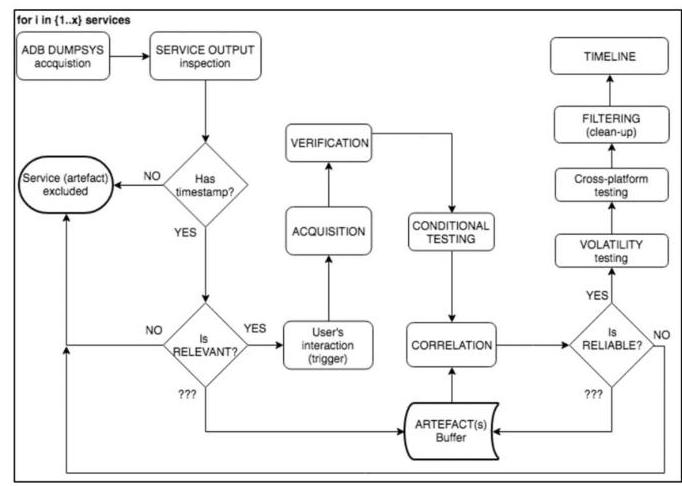
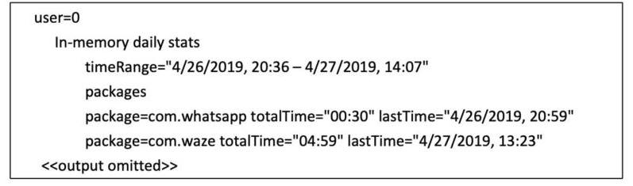
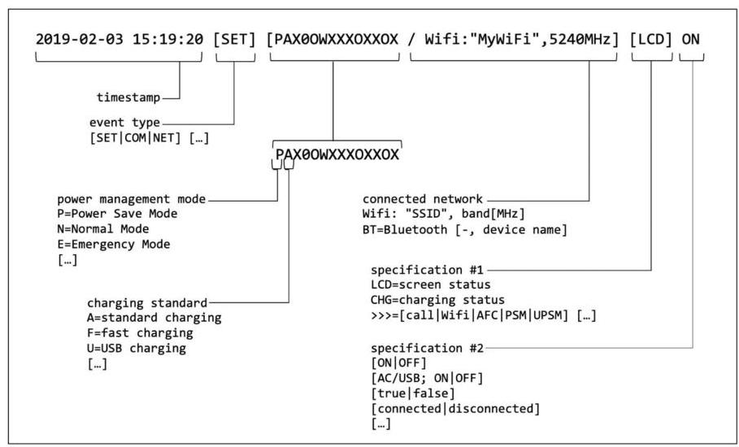

# Android Dumpsys Analysis to Indicate Driver Distraction 

Lukas Bortnik ${ }^{1}$, Arturs Lavrenovs ${ }^{1}$<br>${ }^{1}$ NATO Cooperative Cyber Defence Centre of Excellence, Filtri Tee 12, 10132 Tallinn, Estonia<br>\{lukas.bortnik, arturs.lavrenovs\}@ccdcoe.org


#### Abstract

Police officers investigating car accidents have to consider the driver's interaction with a mobile device as a possible cause. The most common activities such as calling or texting can be identified directly via the user interface or from the traffic metadata acquired from the Internet Service Provider (ISP). However, 'offline activities', such as a simple home button touch to wake up the screen, are invisible to the ISP and leave no trace at the user interface. A possible way to detect this type of activity could be analysis of system level data. However, security countermeasures may limit the scope of the acquired artefacts. This paper introduces a non-intrusive analysis method which will extend the range of known techniques to determine a possible cause of driver distraction. All Android dumpsys services are examined to identify the scope of evidence providers which can assist investigators in identifying the driver's intentional interaction with the smartphone. The study demonstrates that it is possible to identify a driver's activities without access to their personal content. The paper proposes a minimum set of requirements to construct a timeline of events which can clarify the accident circumstances. The analysis includes online activities such as interaction with social media, calling, texting, and offline activities such as user authentication, browsing the media, taking pictures, etc. The applicability of the method are demonstrated in a synthetic case study.


Keywords: digital evidence, mobile forensics, car accident, driver's distraction, Android dumpsys

## 1 Introduction

The scope of digital evidence is growing in parallel with minor improvements and newly added functionalities in mobile devices. In general, newly introduced operating system (OS) upgrades are targeted to improve the security and ergonomics of the mobile devices. While security upgrades challenge the investigator's ability to acquire detailed digital evidence, the opposite is the case when enhancing the usability of the system: an improved user environment requires integrating new hardware and software components, which results in new streams of evidence ready to be investigated by forensic practitioners.

In comparison to traditional host-based digital forensic techniques, mobile forensic solutions must consider a range of different mobile-device specific requirements. Firstly, mobile device data is highly volatile. Some evidence will simply not survive

until the police arrive at the accident. Some can be intentionally or unintentionally and irreversibly destroyed by the user. Secondly, evidence acquisition is another challenge. Taking into consideration the usual methods of accident investigation, it is unclear how, if at all, the data from the mobile devices can be acquired. Depending on the brand, model, operating system, version and patch level, the scope to successfully acquire data varies significantly. The data available through the user interface (UI) might reveal the most common activities such as telephony or texting, but offline activities such as waking the screen would remain undetected. Even though data from lower architecture layers may deliver further clarity, current mobile phone forensic analysis solutions are simply not designed to reflect specific accident-related cases. For instance, login activities or an attempt to reply to an incoming message can easily lead to driver distraction, but whether this type of activity can be detected by current state-of-the-art solutions is questionable.

Android Operating System (AOS) devices are equipped with an interactive interface to observe user and system activities. Users and developers can inspect application and system behaviour through built-in functionalities such as a circular buffer $\log ($ logcat), the dumpsys tool or bugreports. These functionalities allow access to the portion of the data which is normally not visible from the standard UI. Although the ability to 'abuse' mobile phone diagnostic data for forensic purposes has been known for almost a decade, analysis of Android dumpsys diagnostic data seems to have been overlooked. In comparison to traditional smartphone digital forensic techniques, which are primarily focused on content analysis, the analysis of diagnostic data has received only limited research attention [1] [2]. A significant gap has been identified in terms of acquisition, analysis and the interpretation of the artefacts of android dumpsys analytical data.

Hence, the primary motivation for this study is to inspect the current state of Android dumpsys diagnostic data, identify artefacts which reflect specific driver activities, inspect their relevance and volatility, and demonstrate the applicability of the proposed method in a real-life investigation.

Besides the ability to avoid analysis of the user's personal data, the study explains how to extend the scope of prospective evidence providers and how to identify drivers' activities without the need to collect the data from ISPs. The study also demonstrates the possibility of determining those driver activities which are outside the analysis capabilities of currently available digital forensic solutions. The outcome of the study extends the perception of prospective digital forensic evidence, clarifying the circumstances leading to car accidents; and allow investigators to conduct more time- and costeffective investigation.

The remainder of this paper is structured as follows: Section 2 reviews related work. Section 3 overviews the methodology and limitations of current work. Section 4 focuses on core Android dumpsys services, which are the most relevant to determine driver activities. Section 5 demonstrates the effectiveness of the proposed approach in a synthetic case study. The conclusions and future work are discussed in Sections 6 and 7.

# 2 Related Work 

The detection of driver distraction has received substantial attention in academia over the last decade. A significant portion of research has focused on how to detect driver distraction based on sensorial data, collected either from a smartphone or vehicle systems. The majority of the solutions propose to collect the data via custom applications or additional hardware installed in the vehicle. Mantouka et al. [3] attempted to identify driving styles (including distracted driving) based on data from gyroscope, accelerometer and GPS records. In addition to the previous, Papadimitriou et al. [4] added data from a magnetometer. The data collected is temporarily stored within the device itself and eventually uploaded to the cloud-based back-end and analysed. Concerning privacy, Mansor et al. [5] proposed a mechanism for secure vehicular data storage and cloud synchronization using a custom protocol, which complies with forensically sound evidence collection requirements.

Another perspective leverages a vehicle's built-in system. Khandakar et al. [6] demonstrated a portable solution to collect vehicular data from a 3-DOF accelerometer and ECU over the OBD-II port. This data is then sent to a mobile device for further analyses and to conduct autonomous decisions such as reducing speed. Khan et. al [7] presented the effect of smartphone activities on driving performance recorded in a vehicular lifelog, which could help to detect distracted driving.

A substantial amount of research has been dedicated to solutions that can differentiate between use of a phone by a driver or a passenger. Park et al. [8] studied typical driver activities, e.g. opening vehicle doors; Torres et al. [9] focused on reading text messages; Yang et al. [10] proposed advantages that could be gained from using a vehicle's speakers; Hald et al. [11], Liu et al. [12] and Manini and Sabatini [13] made strides in terms of differentiating between driver and passenger activities based on sensorial data from wearables. Lu et al. [14] analysed sensorial data to detect current driving activity and vehicle type (car, motorbike, bicycle or travelling on foot). These, and other detection techniques, were implemented in mobile applications which should discourage drivers from dangerous interactions with mobile phones [15].

Mobile phone diagnostic data has been used relatively little in research into driver distraction. Horsman and Conniss [1] analysed two major mobile operating systems, showing the most promising sources of digital evidence that could help investigators to indicate driver distraction. The study focused on artefacts that can reveal human interaction with a mobile device acquired from two primary internal evidence providers: Android's circular buffer log and iPhone's CurrentPowerlog.powerlogsystem file. The study provides several options how to identify the most probable activities such as interacting with social media, texting and calling, either directly from the mobile device or using hands-free equipment. Researchers described possible challenges to acquiring and analysing the logcat dump. Apart from the now obsolete operating system versions (AOS 4.3 (JellyBean) and 4.4 (KitKat)), the main drawback of the proposed solution was the extremely high volatility of the evidence. If the first responders did not react within a few minutes of the accident, the content of the buffer log might be overwritten and the evidence permanently lost. Similarly, the vast majority of the circular buffer

log content would become unavailable after the device was rebooted. In addition, authors did not consider the dumpsys diagnostic data, which may indicate human interaction the best.

The dumpsys output data is not completely unknown to researchers either. However, recent research has been oriented mostly towards malware detection and malware classification techniques. Ferrante et al. [16] proposed a malware detection method, which, among other aspects, processes CPU and memory usage data acquired via dumpsys to identify which sub-parts of the executed application are malicious. Memory consumption data, application permissions, battery usage and network statistics collected via dumpsys were proposed by Lashkari et al. [17] as an additional type of feature to develop more comprehensive Android malware detection framework. Trivedi et al. [18] found that dumpsys package data helps with the correct application of a UID to application name resolution in a technique that identifies applications accessing malicious URLs.

Despite the fact that dumpsys offers powerful analytical options, it has not been utilised as a feature by many known malware datasets [19]. Dumpsys diagnostic data has also been found to be useful in other areas. Shoaib et al. [20] used dumpsys data to analyse how the recognition of human activity impacts resource consumption in smart devices. Dumpsys CPU statistics were included into the examination datasets to identify UI performance regressions in Android applications [21] and to identify the impact of logger-augumented mobile banking application on power consumption [22]. However, these implementations have only limited forensic value in terms of indicating driver distraction.

# 3 Analysis Background and Methodology 

### 3.1 Introduction to Android Dumpsys

The primary purpose of the dumpsys tool is to allow developers to inspect diagnostic data generated by system services ${ }^{1}$ such as process statistics, CPU consumption, network usage and battery behaviour. As with any other operating system, much of the analytical data generated by system services, installed applications or telemetry functions is not designed for digital forensic purposes. The same applies for Android devices and their system services. The primary drawback is that only a limited number of sub-ject-relevant system events are time-stamped. Moreover, system services do not necessarily generate diagnostic events with a unified timestamp format. The time value might be expressed in epoch time, it may follow system time, or it may be expressed as a differential value, e.g. the number of seconds since the application was pushed to the backstack until the dumpsys tool was executed. The time resolution of each set of events may also vary from milliseconds to minutes. Even if some diagnostic data does survive a system reboot, particular content was shown to be eventually overwritten, either due to user interaction or just after regular system runtime. The lifetime of the events kept

[^0]
[^0]:    1 Authors in [23] use the term 'service' as a dumpsys option to specify the output from particular dumpsys plugins.

by particular system services may also vary from seconds to months, regardless of whether or not the device is rebooted.

One of the main advantages of dumpsys data acquisition is that the command can operate under user level privileges. Meaning, the acquisition process does not require elevation to the root-level access, but rather the standard ADB shell. If the minimal set of requirements ${ }^{2}$ is met, full diagnostic output can be acquired by the ADB shell dumpsys command without setting any additional arguments. Diagnostic information will be extracted from all supported services. The scope of the supported system services and the format of diagnostic data differ based on the installed platform. For instance, the primary tested model Samsung Galaxy S9, SM-G960F/DSA running on Android 8.0 supports 225 different services, while Samsung Galaxy S3 (AOS 7.0) supports 189 services and Samsung Galaxy S5 (AOS 5.0) altogether 196 services. Dumping all services may, however, produce quite verbose output in which not all events are valuable for forensic purposes.

# 3.2 Evidence Identification 

The diagnostic data from a single service may contain either data from a related service or the aggregated data from multiple services. Since the output is highly verbose, the initial objective is to limit the scope of targeted services and exclude irrelevant diagnostic content. As the dumpsys services do not generate diagnostic data in a unified structure, the examination requires separate per-service data acquisition. Each dumpsys service is triggered and the output is manually examined. Since the intention is to construct a timeline dataset, the first filtering criterion requires the presence of time information. Should the service generate information (an event) without a timestamp, the service (the artefact) is excluded from further observation (see Fig. 1).

The next criterion inspects subject-relevant content which would reflect the driver's intentional interaction. The diagnostic data is categorised based on relevance to the investigation subject. As case-relevant data is essentially an event which reflects direct or indirect driver interaction; for instance, waking up the screen, unlocking the device, charging, changing settings, opening an application and switching between applications. Irrelevant content can be considered the portion of the diagnostic data which is not generated as a response to the driver's intentional interaction or that does not correspond to driver activity; for instance, an event which reports the volume of currently consumed memory or CPU is irrelevant.

[^0]
[^0]:    2 Steps to enable the ADB shell varies depending on the installed AOS [41].



Fig. 1. Analyses process
Lastly, events which are not certainly irrelevant nor definitely attributed to the driver's intentional activity are examined and correlated in the context of all other events; for example, a diagnostic output from WiFiController could be irrelevant, but it tracks and logs activities such as screen on/off or user login, and so might be relevant.

The next stage requires empirical examination to identify under what conditions each individual event is or is not generated. To exclude a portion of uncertainty, the observation also considers whether the event can be generated without any user interaction. The scope of the tests is customised for each artefact being explored. For instance, telephony activities are examined separately for a phone call which is conducted through the built-in earpiece, through the Bluetooth-connected car speaker or through a wired external handset. The behaviour is then observed for situations when the phone call is accepted, rejected or ignored. The full set of the conducted tests is outside the scope of this paper.

The output of this stage results in a set of triggers which can be responsible for generating each individual event. Following the principle of evidence reliability, each event is repeatedly invoked by the set of discovered triggers. Should the event be generated after a defined set of triggers is executed, the event is considered to be reliable. Any deviation from the expected output marks the event as unreliable and the event is excluded from the final timeline dataset.

Another examination criterion is the volatility of the event. The primary volatility test shows whether the event survives system reboot. If it does, the next stage is to determine the condition under which the event persists. The events might be erased after a particular buffer has been reached or if the user triggers a certain activity (e.g. the application is closed). The buffer might be defined by the maximum size of the log, by the number of events being stored within one log, or by the expiration time.

A preliminary examination returned a list of services in which the diagnostic data can be sufficient to indicate the driver's interaction with the mobile device. The list

consists of 8 out of 225 supported services: activity, bluetooth_manager, mount, statusbar, telecom, customfrequencymanagerservice, wifi, and usagestat. A brief summary from the examination of each individual service is described in section 4.

# 3.3 Post-acquisition Stage 

The post-acquisition stage filters unnecessary content and unifies the event structure to build the timeline. First, the timestamp format across all accepted events is converted to the unified format. However, if multiple same-source events are generated within the same minute (which often is the case), all of them will have the same timestamp. Consequently, the analyst may unintentionally break the relationship between individual events which might result in misinterpretation of the user's activities. To maintain the integrity of the timeline, the order of the generated events has to be preserved. For the purpose of this analysis, events which are not timestamped with at least one-second resolution were tagged by an $O R D E R$ number which maintains the order of events in which they initially were generated.

All extracted events are delimited into three fields: DATE; TIME and MESSAGE body. To enhance the usability and simplify further filtering, each individual event is enriched with additional fields: SOURCE, CLASS, EVENT_TYPE and DESCRIPTION. The SOURCE tag equates to the origin; that is to say, the name of the service which generates the event, e.g. wifi or telecom. The CLASS defines the specific application's class. For instance, the wifi service generates diagnostic output from but not limited to the following classes: WifiStateMachine, AutoWifiController, WifiController and WifiConnectivityMonitor. EVENT_TYPE and DESCRIPTION tags were constructed based on observation, researched theory and the contextual meaning. EVENT_TYPE refers to the group of same type events, regardless of which service or class generates a particular event. A good example is a login activity event type which refers to the user's login and logout events. The login activity event type aggregates the events from wifi, mount and statusbar services (see Table 1).

Table 1. Event types produced from individual dumpsys services

| EVENT_TYPE | SOURCE (dumpsys service) |
| :-- | :-- |
| app activity | usagestats, CustomFreqencyManagerService |
| BT activity | bluetooth_manager, CustomFreqencyManagerService |
| call activity | telecom, statusbar, CustomFreqencyManagerService |
| charging activity | CustomFreqencyManagerService |
| login activity | wifi, mount, statusbar |
| screen activity | wifi, CustomFreqencyManagerService |
| task activity | activity, |
| wifi activity | CustomFreqencyManagerService |

The 'DESCRIPTION' field clarifies the meaning of the message body and the activity type with greater granularity. For instance, the screen activity distinguishes screen on and screen off events, and the call activity recognises call started/ended. Events for which their meaning is unclear were tagged as unknown (-) (see Table 2).

Table 2. Event type descriptions

| EVENT TYPE | DESCRIPTION |
| :-- | :-- |
| app activity | app launched; app moved to background; app moved to fore- <br> ground; lastTime executed; (-) |
| BT activity | BT AUDIO connected; BT device connected; BT device disconnected; <br> BT entered AUDIO; BT entered NORMAL; BT paired device; call an- <br> swered; audio route; (-) |
| call activity | call ended; call started; (-) |
| charging activity | charging OFF, charging ON |
| login activity | UI locked; UI unlocked; login detected; pwtype requested; pwtype <br> confirmed; unlock requested; unlock confirmed; |
| screen activity | screen OFF; screen ON |
| task activity | app exited |
| wifi activity | WiFi OFF; WiFi ON |

Consequently, each case-relevant event extracted from dumpsys diagnostic output appears in the timeline in a unified structure (see Fig. 2).

| DATE: | $04 / 27 / 19 ;$ |
| :-- | :-- |
| TIME: | $13: 17: 11.253$ |
| ORDER: | $(-)$ |
| SOURCE: | wifi; |
| CLASS: | WiFiConnectivityMonitor; |
| EVENT_TYPE: | screen activity; |
| DESCRIPTION: | screen OFF; |
| MESSAGE: | processed=DefaultState org=NotConnectedState |
|  | dest=<null> what=135177(0x21009) (75938.065) |
|  | EVENT_SCREEN_OFF 00 |

Fig. 2. An example of event with unified structure

# 3.4 Limitations 

The primary limitation is the rapid development of the Android operating system and the application packages, which might invalidate certain results over the period of analysis. Significant changes have already been introduced in AOS 9 and 10. A considerable limitation is the scope of explored devices and installed operating systems. The research results might be limited to device-specific hardware and installed versions of the OS. Lastly, neither official resources [23] [24] nor Android project source code [25] revealed sufficient documentation to support the research results. The research outcomes are therefore highly depended on empirical examination supported by limited documentation.

# 4 Core Dumpsys Services to Indicate Driver Distraction 

### 4.1 Application Activities

Activity manager is the Android built-in class available from API level 1 which interacts and provides the diagnostic data about running processes, services and their activities. The Activity command supports extended operation switches to limit the observation to a specific package, service or broadcast delivery.

For the purpose of this research, the analysis of the Activity manager output was limited to the Recent Tasks section. The data in the Recent Tasks dump provides granular information about tasks that the user has most recently started or visited [26]. Authors in [27] define a task as 'a collection of activities that users interact with when performing a certain job'. All activities are arranged into a stack. If the user opens a new activity within the application, older activities are sent to the back-stack. Once the user exits the activity, the activity from the top of the back-stack will be retained with the configuration it contained before being sent to the back-stack. Task configuration holds details such as finger touch position, scroll position or even bar colours. Each record in the stack holds the time when the task had been last active (lastActiveTime). ${ }^{3}$

Tasks are accompanied by Intent [28] [29]. By default, Intent's structure consists of primary attributes as Action and Data. Action and Data are paired to define a specific action, e.g. 'ACTION_VIEW content://contacts /people/1'. The secondary attributes such as category, component and type define expected action more specifically. For instance, the category.Launcher (cat) orders the application to start on top of all currently running applications. Component (cmp) defines an explicit name of the component to be executed, e.g. to start user login interface in Revolut app would be defined as com.revolut.revolut/com.revolut.ui.login.pin.LoginActivity. Further explanation of these attributes is beyond the scope of this paper.

Once the task is resumed, the combination of individual definitions (act, cat, cmp) and others orders the system to resume the exact configuration as the application had before it was pushed to the background. Meaning, retained tasks give the investigator the ability to recover identical situations which the user had faced in the past.

The activities within the Recent Task dump are listed from the most recent at the top of the list. The number of tasks running in the background relies on hardware configuration. If the user runs many background tasks at the same time, the system might start destroying them in order to recover memory. Even though the Recent tasks memory is reboot-resilient, the evidence can be irreversibly destroyed if the user (or the investigator) closes all running applications. The back-stack will be freed without the ability to recover any past activities. While examining the test device, it was possible to recover 32 tasks from last 22 hours of user activities.

[^0]
[^0]:    3 The Recent task dump also allows to attribute past activities to a specific user (Effective $U A D$ ).

# 4.2 Application Usage Statistics 

Application use statistics can be acquired from dumpsys UsageStats service, available for developers from API level 21. The statistics are collected for a package for a specific time range [30]. Data is stored separately for packages which are in the foreground or background of UI, or for packages which are idle for a specific time interval. The output can be divided into the following three categories:

1. In-memory statistics;
2. Event type collector statistics; and
3. Package idle statistics.

The In-memory statistics (stats) are aggregated into certain periods - day, week, month and year. However, regardless of the length of the aggregation period, the aggregated output of in-memory stats does not have to contain statistics through the whole aggregation interval. In fact, the data is collected within a system-defined time range (timeRange). For instance, In-memory daily stats may be limited to application use statistics over the last several hours, 'weekly stats' to last several days, etc. While the start time of timeRange is system-defined, the end time equals the time of dumpsys acquisition.

Each aggregation period contains usage statistics for each individual package which was executed on the system over the defined timeRange. The totalTime is measured over the same period of time. The investigator may conclude that during the time interval (timeRange), the user had been using a particular application (package) for a specific amount of time (totalTime). The lastTime refers to the time of the last user interaction (see Fig. 3).


Fig. 3. Usagestats - An example of In-memory daily stats output
Furthermore, each time the application is called, the Event type collector denotes that the activity moved to the foreground or to the background and the time, application name and associated activity type are recorded. If the user pushes the application to the background, UsageEvents.Event object will generate a MOVE_TO_BACKGROUND event. If the user calls the application to the foreground, the UsageEvents.Event object

will generate MOVE_TO_FOREGROUND event. ${ }^{4}$ If the application consists of multiple activities, a separate event will be generated for each individual activity [31] (see Fig. 4).

| <<output omitted>> |  |
| :--: | :--: |
| time="4/27/2019, 22:58" | type=MOVE_TO_BACKGROUND package=com.google.android.gm class=com.google.android.gm.ui.MailActivityGmail |
| time="4/27/2019, 22:59" | type=MOVE_TO_FOREGROUND package=com.google.android.gm class=com.google.android.gm.ComposeActivityGmail |
| <<output omitted>> |  |

Fig. 4. Usagestats - An example of Event type collector statistics
UsageEvents.Event object also reports the class which refers to a specific activity within the application. For instance, if a driver attempts to compose a new email, a new set of events with updated class definition will be generated ( + ComposeActivityGmail) (see Fig. 4).

Although In-memory statistics and Event type collector events are logged only with a 1-minute resolution ${ }^{5}$, the investigator may still define the last execution time more precisely. An additional indication about the driver's interaction with the mobile device can be derived from Package idle stats which count the time since the application was last used. In comparison to the previous Usagestats categories, Package idle stats do not keep the history of the application usage, but only the most recent record per application. If the application or its internal activity is either executed or pushed to the background or to the foreground of the UI, the lastUsedElapsed counter will be restarted. While the lastUsedElapsed counter counts the time since the application was last used, the lastUsedScreenOn counter counts the time during which the screen is on (see Fig. 5).

```
<<output omitted>>
package=com.facebook.orca lastUsedElapsed=+1h10m45s946ms lastUsedScreenOn=+7m0s774ms idle=n
package=com.whatsapp lastUsedElapsed=+4m2s943ms lastUsedScreenOn=+1m0s491ms idle=n
<<output omitted>>
```

Fig. 5. Usagestats - An example of Package idle statistics

# 4.3 WiFi Analytics and Screen Activities 

ADB dumpsys offers several options to inspect WiFi behaviour, connectivity, configuration and statistics. The tested device supported five dumpsys services: wifi, wifip2p,

[^0]
[^0]:    4 As of API level Q (29), the 'MOVE_TO_' event types were deprecated and replaced by constants ACTIVITY_PAUSED and ACTIVITY_RESUMED [31].
    5 As of API level 28, events are generated with 1 second resolution.

wifi_policy, wificond and wifiscanner. Due to extensive output, further explanation will be limited to wifi service, which may best clarify the driver's activities.

Firstly, one may wonder why there is a need to inspect WiFi behaviour if the driver is most likely not connected to any WiFi network while driving the car. It is because selected classes keep tracking system activities and therefore the driver's behaviour. ${ }^{6}$ For instance, any time a driver switches the screen on or off, the screen state change is reported. Screen state changes can be observed through multiple classes, primarily: WifiController, WifiStateMachine, WifiConnectivityMonitor and AutoWifiController. The change of screen state can be recognised in the body of the message instantly (as 'screen on' or 'EVENT_SCREEN_ON') or it may require further decoding, as is the case for the WifiController class.

Individual classes report system changes the WiFiManager, which acts as a primary API for managing all aspects of WiFi connectivity [32]. Reported events contain socalled msg.what codes which serve primary API to identify the type of received message. Messages are constructed as a sum of the Message.what BASE message address and the class's specific state address. Message.what BASE message address is declared as a public static final integer [33], e.g. WifiController's BASE message address is 0x00026000 (155648). The class's specific state addresses are defined in each individual class's source code. For instance, WifiController declares the screen on state as BASE +2 and screen off as BASE +3 [34] thus reporting the change of the screen state as $m s g$. what $=155650$ for screen on and 155651 for screen off (see Fig. 6). The same principle is applied for all supported classes which use 'msg.what' codes.

```
<<output omitted>>
rec[2]: time=04-27 13:23:11.811 processed=DefaultState org=DeviceActiveState dest=<null>
    what=155651(0x26003)
rec[3]: time=04-27 13:23:15.650 processed=DefaultState org=DeviceActiveState dest=<null>
    what=155650(0x26002)
<<output omitted>>
```

Fig. 6. Wifi - WifiController screen activity
The primary drawback, however, is that the vast majority of dumpsys wifi service diagnostic content does not survive system reboot. The lifespan of each individual class also varies. While testing, the WifiController and WifiStateMachine classes held diagnostic data from the last 2 hours, AutoWifiController for approximately 10 hours, and WifiConnectivityMonitor and WifiConnectivityManager for up to 36 hours.

# 4.4 Login Activities 

The user's login activities can be perceived as the artefact which would indicate the driver's activity the best, but retrieving it is a considerable challenge. Android dumpsys

[^0]
[^0]:    6 The statement does not apply if the device is set to airplane mode.

output holds only fragmented and, in most cases, indirect evidence of user login activities, if anything. While logout activity can be indirectly attributed to screen off events, this is not necessarily true of login activity. Given that the screen may be woken up without any user interaction, screen on events by themselves are insufficient to indicate that the driver logged in. Nevertheless, the investigation revealed several options for how to detect login activities indirectly.

A driver's login activity can be determined from WiFiManager statistics, the WifiController class specifically. Applying the decoding approach described in the previous section, the investigator may identify login activities tagged as what $=155660(0 \times 2600 \mathrm{c})$ messages. The value is constructed as a sum of WifiController's base message address '0x00026000 (155648)' and USER PRESENT state address (12). Regardless of whether the WiFi module is enabled or not, and regardless of what authentication method is used, WifiController reliably reported all user logins (see Fig. 7).

```
<<output omitted>>
rec[173]: time=05-04 20:42:27.884 processed=DefaultState org=StaDisabledWithScanState
    dest=<null> what=155660(0x2600c)
rec[176]: time=05-04 20:43:46.186 processed=DefaultState org=StaDisabledWithScanState
    dest=<null> what=155651(0x26003
<<output omitted>>
```

Fig. 7. Wifi - User's login activity
Another indirect source of the prospective login artefacts is the Android disk encryption subroutine. Each time the user changes or provides credentials to unlock the UI, the cryptfs connector is initiated which is accordingly reflected in system events. Cryptfs connector activities (if FDE is present) can be obtained from dumpsys mount service. The main benefit is that behaviour is reliable and the log may trace login events over several hours. The tested device held logins from the last 7 hours. However, if the user uses fingerprint or face recognition, the log is not generated. Lastly, cryptfs events are not reboot resilient.

A partial solution to this problem can be retrieved from statusbar manager service logs. Android processes can call a routine in another process using a binder to identify the method to invoke and pass the arguments between processes [35] [36] [37]. The same mechanism is used to maintain binder tokens which are shared between Notification and StatusBar managers. Depending on the installed version of the OS, Android processes may communicate with others via native binder object - the IBinder - or via proxy - the BinderProxy.java [38].

Token activities can be acquired by the adb shell dumpsys statusbar command. Among other triggers, each time the user logs into the device, statusbar manager generates the what $=$ CLEAR event. If the user or the system itself locks the user interface out, a secondary event what $=$ HOME RECENT is generated. The events are ordered by time, with the most recent at the bottom of the list. The list holds up to 100 events. The primary drawback of this artefact is that the associated timestamps do not hold the date,

just the time with millisecond resolution. The second downside is that the artefact is not reboot resilient. Regardless of what security measure is applied (PIN, pattern, fingerprint or face recognition), the events are reliably recorded.

# 4.5 Telephony Activities 

Android dumpsys telecom service generates a list of recently conducted phone calls. Each call log contains call direction, the startTime and the endTime of the phone call. For each direction, the callTerminationReason is defined by DisconnectCause attributes, the Code and the Reason. These attributes show whether the phone call was missed, rejected, or ended by a caller or by the counterpart. Depending on used technology, telecom shows individual audio states. 'Each state is a combination of one of the four audio routes (earpiece, wired headset, Bluetooth, and speakerphone) and audio focus status (active or quiescent)' [39]. Whenever the driver conducts a phone call via the external handsfree kit and switches back to the earpiece or phone speaker, the telecom audio_route is switched and logged (see Fig. 8).

```
<<output omitted>>
20:27:12.723 - SET_RINGING (successful incoming call) :(...)
20:27:12.924 - START_RINGER:( ...
    20:27:12.926 - SKIP_VIBRATION (hasVibrator=true, ...
    20:27:13.003 - AUDIO_ROUTE (Leaving state QuiescentBluetoothRoute) :(...
    20:27:13.003 - AUDIO_ROUTE (Entering state RingingBluetoothRoute) :(...
    20:27:16.623 - UNMUTE: BPSI.aC->CARSM.pM_MUTE_OFF@mBI
    20:27:16.649 - STOP_RINGER: BPSI.aC@mBI
    20:27:16.674 - REQUEST_ACCEPT: BPSI.aC@mBI
    20:27:16.958 - AUDIO_ROUTE (Leaving state RingingBluetoothRoute): ...
    20:27:16.959 - AUDIO_ROUTE (Entering state ActiveBluetoothRoute): ...
    20:27:16.993 - SET_ACTIVE (active set explicitly):CSW.sA@mBQ
    20:27:17.048 - CAPABILITY_CHANGE ...
    20:27:32.378 - SET_DISCONNECTED (disconnected set explicitly> DisconnectCause
    20:27:32.509 - DESTROYED:CSW.rC@m+E
<<output omitted>>
```

Fig. 8. Telecom - Switching audio routes
Yet another benefit is that telecom service preserves the phone log entries even if the user deletes the $\log$ from her user interface. The downside it that telecom $\log$ is not reboot resilient.

### 4.6 Bluetooth

Bluetooth manager has been available in Android source code since API 18. The most valuable artefacts reside in the base64-encoded BTSnoop file format log summary. BTSnoop log resembles the snoop format of Host Controller Interface (HCI) packets ${ }^{7}$ [40]. Depending on the installed platform, BTSnoop log summary may contain an extended clear text log. If a driver conducts a phone call via a Bluetooth paired device,

[^0]
[^0]:    7 https://tools.ietf.org/html/rfc1761

either incoming or outgoing, a unique event HFSM-enter AUDIO is generated. The event itself does not signal an answered call, but rather entering the ringing state. With incoming calls, if the call is answered, the service will generate ' $H S F M$ processAnswerCall' event. If the call is outgoing, the BT manager generates the HFSMprocessDialCall record. When the call is finished, the mobile device quits the AUDIO states which is signalled by HFSM-enter Connected message (see Fig. 9).

```
<<output omitted>>
05-04 20:27:12.808--HFSM-setAudioParams(prev) - 0,1
    05-04 20:27:12.811--btif_hf.cc -- connect_audio([0] e0:ae:5e:f6:7c:XX)
    05-04 20:27:13.003--HFSM-msg 6, but mVoiceRecognitionDevice is null
    05-04 20:27:13.468--HFSM-setAudioParams - 0,1
    05-04 20:27:13.471--HFAM-clear pathChangeTone (false, false)
    05-04 20:27:13.507--HFSM-enter AUDIO (1/1) : F6:7
    05-04 20:27:16.575--HFSM-processAnswerCall : F6:7
    05-04 20:27:32.495--btm_sco.cc -- Send SCO Disc Req to 6
    05-04 20:27:32.522--btm_sco.cc -- Recv SCO Disc Comp 22 on 5 from 6
    05-04 20:27:32.530--HFSM-enter Connected (1/1)
<<output omitted>>
```

Fig. 9. Bluetooth manager - received phone call
If the call is conducted over cross-platform VoIP applications such as WhatsApp, the service records the events accordingly. The log integrity is not affected by system reboot, and log lifetime exceeds several months; the tested device held the log from the last 5 months.

# 4.7 SSRM Service (CustomFrequencyManagerService) 

Android dumpsys CustomFrequencyManagerService (SSRM service) is the last of the documented services which may clarify the circumstances of the accident. ${ }^{8}$ SSRM service has been identified only on Samsung devices. Despite this, if the investigated model is a Samsung, the investigator should include the output from the SSRM service in the range of observed artefacts.

The content of the SSRM service can be acquired by adb shell dumpsys CustomFrequencyManagerService. The output can be divided into two main sections:

1. Application (process) statistics and Recent Battery Level Changes; and
2. SSRM memory dump.

Both sections hold battery statistics data, mainly about total operational time, the period of the time over which the device was charged, and the amount of data transferred while connected to WiFi or GSM networks. Device battery statistics are recorded separately for applications in the foreground and background when the state of the screen is on

[^0]
[^0]:    8 As of API level 28, the data previously available under CustomFrequencyManagerService service are available under sdbms service. CustomFrequencyManagerService remains present but without any forensic value.

and off, while the phone is connected to a paired Bluetooth device, and while using different power modes.

Apart from the per-app statistics, the Recent Battery Level Changes section keeps an overall battery statistic which is summarised for both states separately when the screen is on and off. Each time the state of the screen changes, the Start Time and the End Time of a new state is recorded, and Duration of the state is calculated. Whenever the device's battery is charged, the OnBatteryTime value equals 0 ms . The primary drawback resides in the reliability of the artefact. In testing, the Recent Battery Level Changes did not contain screen on/off events each time as they were triggered. However, should the event be already present in the log, it can be considered as reliable information.

The content of the SSRM memory dump is dumped as a base64-encoded data stream delimited by SSRM MEMORY DUMP* header and trailer. Decoded data stream resolves in a gzip-compressed data structure. The decompressed event log consists of fixed header and the SSRM service log body. Each event is tagged by a timestamp, followed by an event type tag and the log message. The decompressed SSRM service log body holds a fixed number of 8,002 events. Since the detailed description of the SSRM service log is beyond the scope of this paper, further explanation will be limited to a brief description of two of the twelve recognised event types, [SET] and [PKG]. An example of the SSRM service log limited to [SET] and [PKG] events is in Fig. 10.

| <output omitted>> |  |
| :--: | :--: |
| 2019-02-08 23:08:44 [SET] | [NDX0XRXXXOXXOX] [LCD] OFF |
| 2019-02-08 23:10:24 [SET] | [NDX0XRXXXOOXOX / BT: Volvo] [BT] CONNECTED |
| 2019-02-08 23:10:51 [PKG] | com.samsung.android.incallui |
| 2019-02-08 23:10:51 [SET] | [NDX0ORXXXOOXOX / BT: Volvo] [LCD] ON |
| 2019-02-08 23:11:04 [PKG] | com.facebook.katana |
| 2019-02-08 23:11:10 [SET] | [NDX0XRXXXOOXOX / BT: Volvo] [LCD] OFF |
| 2019-02-08 23:14:33 [PKG] | com.samsung.android.incallui |
| 2019-02-08 23:14:33 [SET] | [NDX0ORXXXOOXOX / BT: Volvo] [LCD] ON |
| 2019-02-08 23:14:34 [SET] | [NDX0OROXXOOXOX / BT: Volvo] > [Call] CallStateOffHook : true |
| 2019-02-08 23:15:05 [SET] | [NDX0XROXXOOXOX / BT: Volvo] [LCD] OFF |
| <output omitted>> |  |

Fig. 10. An example of SSRM service log
A [PKG] event types refer to application execution or activity. The body of the message refers to the name of the package which was executed. In comparison to the UsageStats artefacts, [PKG] events do not allow us to differentiate between activities within the same application. In addition, [PKG] messages may appear in the log even if the driver does not interact with the application. For instance, when a driver ignores an incoming phone call, once the ringing state is over the SSRM service will generate a [PKG] event which refers to the application on the top of the UI. Should the Facebook app be the last used application, the service will generate [PKG] com.facebook.katana event which can be misinterpreted as driver interaction. These and other discrepancies can be clarified.

A [SET] event type primarily reports power management changes. The SSRM service distinguishes two power-related functions, the power mode and the battery status.

Depending on the version of AOS, the investigator may recognize Normal Mode [N], Power Saving Mode [P]; Ultra Power Saving Mode [U] and the Emergency Mode [E]. ${ }^{9}$ It also distinguishes battery status - charged or discharged. If the device is charged, the service tracks the charging methods standard $A C$ charging [Ac], USB charging [Usb], Wireless charging method [W] or Fast Charging [F]. The information is combined in the first two bits at the beginning of the [SET] event bit string. ${ }^{10}$ While the 1st bit represents the power mode - [SET] [Nxxxxx...] - the 2nd reports battery status - [SET] [xAxxxxx...]. For instance, a device which is set to Power Saving Mode [P] and charged by standard charger [Ac] will generate [SET] [PAxxxxx...] events. Similarly, a device which is set to Normal Mode and discharged [D], generates the [NDxxxxx...] events (see an example in Fig. 11).


Fig. 11. SSRM [SET] - An example of decoded SET event
Each time the power mode is changed, a single or a combination of SET events is generated. Similarly, each time the device is connected or disconnected from the power source; the charging status change is logged.

A similar approach is applied for screen changes. Each time the screen is changed to on or off, the SET [LCD] ON, respectively SET [LCD] OFF event is generated. Consequently the 4th bit of the SET event bit string is switched to value 0 if the screen is on, or switched back to value X if the screen is off. The [LCD] ON|OFF events are reliably generated regardless of the trigger, be it user interaction, a received phone call or notification of a fully charged battery.

[^0]
[^0]:    9 A slightly different terminology can be identified in devices running AOS 7.0+.
    10 The official terminology or definitions may differ.

SSRM memory dump [SET] event content is not limited to power mode and charging status. It tracks any network-related changes such as connectivity to Bluetooth devices or WiFi networks. It tracks details such as SSIDs, Bluetooth friendly names, connection status, whether Bluetooth is enabled or if the device is also connected to an external device. A summary of decoded attributes is presented in Fig. 11.

The log lifetime depends on device activity, the primary tested device held the events from the last 5 days. Neither intentional reboot, nor several hours long power outage affected the integrity of the log.

# 5 Synthetic Case Study and Results 

The case study demonstrated a simulated car accident which occurred after the driver's interaction with a mobile device. The test was conducted on a Samsung Galaxy S9, SM$G 960 F / D S A$, AOS 8 , connected by Bluetooth to the car's entertainment system. The evidence acquisition was limited to 8 out of 225 supported services which were described in the previous section. The timeline search was focused on a 20 -minute time window when the accident was reported. All simulated activities were conducted in accordance with testing script and executed by a co-driver. The script contained the following activities:

1. mobile device connected to the car's stereo system;
2. driver uses Chrome app to search for a new destination and uses Google maps app for navigation;
3. driver receives phone call, responds via handsfree kit and switches to device's earpiece;
4. driver is texting via Messenger; and
5. driver is taking pictures.

Since, the full analysis results exceed the scope of this paper, the applicability of this technique is demonstrated only on a limited number of examples.

# 5.1 Results 

The analysis can be approached from multiple angles. The first option can be to focus on the driver's login and screen activities to identify whether a driver even attempted to log in. In the current case, multiple login activities were reported by WifiController (wifi), BinderProxy (statusbar) and Crypt Connector (mount) classes. Each login activity was followed by Screen On activity, which copies natural behaviour while logging into the device. Screen activities were proven reliably reported by all examined wifi classes (see Fig. 12).

| Time | CLASS | DESCRIPTION | MESSAGE |
| :--: | :--: | :--: | :--: |
| 13:45:47.285 | WifiController | screen ON | processed=DefaultState org=DeviceActiveState dest=null> what=1556584 |
| 13:45:47.286 | AutoWifiControl1 | screen ON | processed=DefaultState org=InitialState dest=null> what=12(8xc) CMD. |
| 13:45:58.236 | BinderProxy | UI locked | pkg=com.android.systemui userId=0 what=HOME RECIBt token=android.os. 0 |
| 13:45:53.420 | CryptConnector | unlock requested | SND $==$ (168 cryptfs setpu_for_ext [scrubbed]) |
| 13:45:53.421 | CryptConnector | unlock confirmed | HCV $==$ (380 168 0) |
| 13:45:53.862 | BinderProxy | UI unlocked | pkg=com.android.systemui userId=0 what=CLEAR token=android.os.BinderP |
| 13:45:53.918 | WifiController | login detected | processed=DeviceActiveState org=DeviceActiveState dest=null> what=10 |
| 13:48:47.623 | AutoWifiControl1 | screen OFF | processed=DefaultState org=InitialState dest=null> what=12(8xc) CMD. |

Fig. 12. Driver's login activity
The second option is to observe UsageStats - Event type collector events which cannot be generated without user interaction. Within an observed timeframe, it was possible to detect all driver activity defined in a test script, including:

- home button touch, (com.android.launcher);
- run Galaxy Finder to search for an application;
- run Waze app and set up the navigation;
- USB connectivity (car's charger);
- switching between executed applications Chrome app, Google maps, Messenger, Waze and Contacts;
- browsing contacts, dialling, conducting a phone call;
- switch to PiP mode; and
- taking a camera picture.

An example of driver activities extracted from Usage statistics is in the figure below.

| Time | ORDER | SOURCE | MESSAGE |
| :--: | :--: | :--: | :--: |
| 13:29:00.000 | 2053 | usagestats | type=MOVE_TO_FOREGROUND package=com.samsung.android.app.galax |
| 13:29:00.000 | 2054 | usagestats | type=MOVE_TO_BACKGROUND package=com.samsung.android.app.galax |
| 13:29:00.000 | 2055 | usagestats | type=MOVE_TO_FOREGROUND package=com.sec.android.app.launcher |
| 13:30:00.000 | 2056 | usagestats | type=MOVE_TO_BACKGROUND package=com.sec.android.app.launcher |
| 13:30:00.000 | 2057 | usagestats | type=MOVE_TO_FOREGROUND package=com.android.chrome class=org. |
| 13:30:00.000 | 2058 | usagestats | type=MOVE_TO_BACKGROUND package=com.android.chrome class=org. |
| 13:30:00.000 | 2059 | usagestats | type=MOVE_TO_FOREGROUND package=com.google.android.apps.maps |

Fig. 13. An example of Usagestats diagnostic output
Even the output from UsageStats could be sufficient to conclude that the driver did interact with the mobile device. When the driver conducted a phone call, the mobile device was already connected to the car's entertainment system. Therefore, the ring tone was routed through the car's audio system, which was signalled by both bluetooth_manager (at 13:22:37.839) and telecom services (at 13:22:38.012) (follow Fig. 14).

| Time | CLASS | DESCRIPTION | MESSAGE |
| :--: | :--: | :--: | :--: |
| 13:22:36.000 | phone log | call started | "CallTC@15 (Apr 27? |
| 13:22:37.839 | BT logs | BT entered AUDIO | -HFSM-enter AUDIO (1/1) : F6:7 |
| 13:22:38.011 | phone log | audio route | AUDIO_ROUTE (Leaving state QuiescentBluetoothRoute) |
| 13:22:38.012 | phone log | audio route | AUDIO_ROUTE (Entering state RingingBluetoothRoute) |
| 13:22:39.470 | AutoWifiControll | screen ON | processed=DefaultState org=InitialState dest==null |
| 13:22:40.667 | BT logs | Call answered | -HFSM-processAnswerCall : F6:7 |
| 13:22:40.920 | phone log | audio route | Q, Q, AUDIO_ROUTE (Leaving state RingingBluetoothRoute):0 |
| 13:22:40.928 | phone log | audio route | AUDIO_ROUTE (Entering state ActiveBluetoothRoute):0 |
| 13:22:41.207 | BT logs | BT AUDIO disconnected | -HFSM-enter Connected (1/1) |

Fig. 14. A phone call conducted via BT handsfree device
Then the driver accepted an incoming call which was again signalled by both services, by bluetooth_manager at 13:22:40.667 and by telecom at 13:22:40.928. At 13:22:41.207 bluetooth_manager reported the change of state to HFSM-enter Connected (1/1) which signals a return to the 'normal' state without interactive connection to the Bluetooth-connected device (see Fig. 15). The device stayed connected to the car's entertainment system, but the call was not streamed via the audio system. Also, telecom service reported another change of state from BluetoothRoute to EarpieceRoute at 13:22:41:211 From this moment, the rest of the call was conducted via the phone's earpiece. Once the phone call was finished, the display switched on (13:23:15.649) and the UI was locked.

| Time | CLASS | DESCRIPTION | MESSAGE |
| :-- | :-- | :-- | :-- |
| $13: 22: 41.207$ | BT logs | BT AUDIO disconnected | --HFSM-enter Connected (1/1) |
| $13: 22: 41.211$ | phone log | audio route | AUDIO_ROUTE (Leaving state ActiveBluetoothRoute):BNM.ON--ON |
| $13: 22: 41.211$ | phone log | audio route | AUDIO_ROUTE (Entering state ActiveEarpieceRoute):BNM.ON--ON |
| $13: 23: 11.811$ | AutoWifiControll | screen OFF | processed=DefaultState org=InitialState dest=null> what=12 |
| $13: 23: 15.576$ | phone log | call ended | DESTROYED:CSW. $<$ (GB)A |
| $13: 23: 15.649$ | AutoWifiControll | screen ON | processed=DefaultState org=InitialState dest=null> what=12 |
| $13: 23: 19.270$ | BinderProxy | UI locked | pkg=com.android.systemui userId=0 what=HOME RECENT token=on |
| $13: 23: 23.149$ | AutoWifiControll | screen OFF | processed=DefaultState org=InitialState dest=null> what=12 |

Fig. 15. A phone call conducted via BT handsfree device
Similar results can also be retrieved from the SSRM service. The analyst can determine Bluetooth connectivity to car's audio system and the call, which is accompanied by screen activities. Analysts may also detect that the phone was set to Power saving mode, charged through the USB and connected to Volvo Car's entertainment system (see Fig. 16).

| Time | CLASS | DESCRIPTION | MESSAGE |
| :-- | :-- | :-- | :-- |
| $13: 22: 38.000$ | SSRM | app launched | [PKG] com.samsung.android.incallui |
| $13: 22: 39.000$ | SSRM | screen ON | [SET] [PUX00RXXX00XOX / BT:My Volvo Car] [LCD] ON |
| $13: 22: 41.000$ | SSRM | - | [SET] [PUX00R0XX00XOX / BT:My Volvo Car] >>> [Call] |
| $13: 23: 11.000$ | SSRM | screen OFF | [SET] [PUX0XR0XX00XOX / BT:My Volvo Car] [LCD] OFF |
| $13: 23: 15.000$ | SSRM | - | [SET] [PUX0XRXXX00XOX / BT:My Volvo Car] >>> [Call] |
| $13: 23: 15.000$ | SSRM | screen ON | [SET] [PUX00RXXX00XOX / BT:My Volvo Car] [LCD] ON |
| $13: 23: 19.000$ | SSRM | app launched | [PKG] com.waze |
| $13: 23: 23.000$ | SSRM | screen OFF | [SET] [PUX0XRXXX00XOX / BT:My Volvo Car] [LCD] OFF |

Fig. 16. A phone call conducted via BT handsfree device
In addition to the driver's behavioural activities, the investigator can determine other circumstances which might be relevant. For instance, analysts may detect the time when the mobile phone was connected or disconnected from the wireless network (wifi, SSRM), the time when the driver entered the car and started engine (SSRM, Bluetooth_manager) or even the approximate driving path (wifi). They may also detect whether the mobile device was charged (UsageStats, SSRM) or whether the system was rebooted (Bluetooth_manager, SSRM). Recent Tasks may also hold information about user activity (Intent). If the observed task is still in the stack, the investigator may obtain its content. Since in the current case the applications had not been closed but rather pushed to the background of UI, the content of the tasks could be restored (see Fig. 17).

| Time | MESSAGE |
| :--: | :--: |
| 13:48:47.838 | * Recent \#5: TaskRecordIdaacBa3d@ \#432 A=com.samsung.android.incallui U=@ StackId=1 sz=03 mFullscreen=true mLastNonFullscreenBounds=null mLastDeXBounds=null intent= (act=android.intent.action. 7NQN flg=0x10848888 cmp=com.samsung.android.incallui/com.android.incallui.3xCall Activity) hasBeenVisible=true mResizeMode=RESIZE_MODE_RESIZEABLE_VIA_SDK_VERSI0N mSuppor toPictureInPicture=false isResizeable=true firstActiveTime=1556362127030 lastActiveTime=1556 362127030 lastActiveElapsedTime $=393685219$ (inactive for 1891s) |
| 14:04:11.385 | * Recent \#4: TaskRecord(e1e2ff8d@ \#424 A=com.google.android.apps.maps U=@ StackId=1 sz=1) mFullscreen=true mLastNonFullscreenBounds=null mLastDeXBounds=null intent= (act=android.intent.action.VIEW cat=landroid.intent.category.BROWSABLE) dat=https://maps.google.com/maps?go ctroom=4mechroddrms\&u=1ient=es-android-samsung-gs-rev1\&um=1\&ie=UTF-8\&sa=4\&ved=2ahUKEwj5n5vR jP0hAH4vxosRHa_XAJ3Q_AUoAXoECAsQAQ flg=0x14888888 cmp=com.google.android.apps.maps/com.goog! |

Fig. 17. Restored Recent Task Intent

# 6 Conclusion 

The goal of the study was to analyse the scope of the prospective digital evidence which resides in diagnostic data acquired from the adb dumpsys tool. As was demonstrated, dumpsys analysis does not require anything other than standard user-level access with the developer's options enabled, and it allows the investigator access to system-level data. The results from the analysis and synthetic case study proved the applicability of this technique in a real-life car accident investigation. The analysts have several options to determine user interaction with a mobile device, including their logins, texting, calling, interaction with social media or browsing offline content. Analysts can also identify telephony activities and distinguish their operating modes, such as conducting the phone call via the phone's earpiece or external handsfree appliance. Dumpsys diagnostic data allows the recovery of deleted phone call entries or attempts to delete other artefacts, which could lead to conviction. Since evidence acquisition does not rely on specialised digital forensics equipment, it may be conducted outside digital forensics laboratories.

Like any other operating system, the range and structure of the events described may be invalidated by newly implemented upgrades. The logic of the described services is such that the structure of the events can be re-designed, re-placed or may be completely removed. Despite these facts, the core services, such as, activity, Bluetooth_manager, usagestats and wifi have been identified across a selection of different mobile device brands, types and operating system versions, from AOS 5 to AOS 10. Even if a portion of the events may still become unavailable, the results and the method described in this work can serve as a valid starting point to conduct further research and customized development on a wider selection of brands and operating systems.

The outcome of the study can assist digital forensic practitioners to reveal additional evidence while investigating any type of crime or supporting the intelligence operations. Discovered artefacts may clarify the scope of used applications, services, paired accounts, paired devices, connected networks, visited locations, etc. It enables differentiation between whether a certain activity was initiated by a system or a user. The demonstrated method can assist investigators to verify a suspect's alibi, build communication networks or even verify whether a device's security has been breached. It can

also provide a vital framework for targeted preparation, automated evidence collection and further evidence visualisation.

# 7 Future Work 

One of the biggest challenges identified in the study is to determine login activities. A significantly more believable artefact of the user's login activity can be extracted from the Android buffer log through logcat. However, the main drawback of a buffer log is its volatility, and future research should be focused either on less volatile evidence or methods to extend the artefact's lifetime.

As the scope of the analysed artefacts retrieved from Android dumpsys has not as yet been exhausted, further analyses should be extended to a number of additional topics. Activity manager has been found to be one of the most verbose plugins, responsible for almost $25 \%$ of dumpsys output. However, this analysis covered only 1 of 14 sections holding the information about user- and system-initiated activities. Correlation between Recent Tasks, Broadcast Activities and Pending Items activities might extend understanding of past user behaviour. The same applies to other services, mainly wifi and bluetooth_manager, which have not been explored in depth. Knowing how msg. what messages are constructed, additional research may deliver further evidence providers, which reflect human activities.

Since the structure of particular events from core services, such as activity, bluetooth_manager, usagestats and wifi has been changed with new AOS, demonstrated artefacts will require systematic verification. A significant challenge will be to keep track of newly implemented services. While the tested device (Samsung S9, AOS 8) offered 225 services, the same device upgraded to AOS 10 provides access to 303 services. Finally, automating post-acquisition analysis to build a structured timeline, be it JSON, CSV or other formats, would allow both effective examination and the correlation of results with external evidence providers across multiple cases.

## 8 Acknowledgments

I would like to thank Matthew Sorells for fruitful discussions and highly valuable feedback.

# References 

1. Lynne, C., Graeme, G.: Investigating evidence of mobile phone usage by drivers in road traffic accidents. Digital Investigation 12, S30-S37 (2015).
2. Tamma, R., Skulkin, O., Mahalik, H., Bommisetty, S.: Practical Mobile Forensics, A handson guide to mastering mobile forensics for the iOS, Android, and the Windows Phone platform. 3rd edn. Pack Publishing Ltd., Birmingham (2018).
3. Mantouka, E.G., Barmpounakis E.N., Vlahogianni E.I.: Identifying driving safety profiles from smartphone data using unsupervised learning. Safety Science 119, 84-90 (2019).
4. Papadimitriou, E., Argyropoulou, A., Tselentis D.I., Yannis G.: Analysis of driver behaviour through smartphone data: The case of mobile phone use while driving. Safety Science 119, 91-97 (2019).
5. Mansor, H., Markantonakis, K., Akram, R.N., Mayes, K., Gurulian, I.: Log your car: The non-invasive vehicle forensics. In: 2016 IEEE Trustcom/BigDataSE/ISPA, pp. 974-982. IEEE, Tianjin (2016).
6. Khandakar, A., Chowdhury, M.E., Ahmed, R., Dhib, A., Mohammed, M., Al-Emadi, N.A.M.A., Michelson, D.: Portable System for Monitoring and Controlling Driver Behavior and the Use of a Mobile Phone While Driving. Sensors 19(7), 1563 (2019).
7. Khan, I., Khusro, S., Alam, I.: Smartphone Distractions and its Effect on Driving Performance using Vehicular Lifelog Dataset. In: 2019 International Conference on Electrical, Communication, and Computer Engineering (ICECCE), pp. 1-6. IEEE, Swat (2019).
8. Park, H., Ahn, D., Park, T., Shin, K.G.: Automatic Identification of Driver's Smartphone Exploiting Common Vehicle-Riding Actions. IEEE Transactions on Mobile Computing 17(2), 265-278 (2018).
9. Torres, R., Ohashi O., Pessin, G.: A Machine-Learning Approach to Distinguish Passengers and Drivers Reading While Driving. Sensors 19(14), 3174 (2019).
10. Yang, J., Sidhom, S., Chandrasekaran, G., Vu, T., Liu, H., Cecan, N., Chen, Y., Gruteser, M., Martin, R.P.: Detecting Driver Phone Use Leveraging Car Speakers. IEEE Transactions on Mobile Computing 11(9), 1426-1440 (2012).
11. Cano, T.A., Junker, D.H., Mårtensson, M., Skov, M.B., Raptis, D.: Using Smartwatch Inertial Sensors to Recognize and Distinguish Between Car Drivers and Passengers. In: 10th International Conference on Automotive User Interfaces and Interactive Vehicular Applications (AutomotiveUI '18), pp. 74-84. (2018).
12. Liu, L., Karatas, C., Li, H., Tan, S., Gruteser, M., Yang, J., Chen, Y., Martin, R.P.: Toward Detection of Unsafe Driving with Wearables. In: Proceedings of the 2015 Workshop on Wearable Systems and Applications (WearSys '15), pp. 27-32. (2015).
13. Mannini, A., Sabatini A.M.: Machine Learning Methods for Classifying Human Physical Activity from On-Body Accelerometers. Sensors 10(2), 1154-1175 (2010).
14. Lu, D.-N., Nguyen, D.-N., Nguyen, T.-H., Nguyen, H.-N.: Vehicle Mode and Driving Activity Detection Based on Analyzing Sensor Data of Smartphones. Sensors 18(4), 1036 (2018).
15. Oviedo-Trespalacios, O., King, M., Vaezipour, A., Truelove, V.: Can our phones keep us safe? A content analysis of smartphone applications to prevent mobile phone distracted driving. Transportation Research Part F: Traffic Psychology and Behaviour 60, 657-668 (2019).
16. Ferrante, A., Medvet, E., Mercaldo, F., Milosevic, J., Visaggio, C.A.: Spotting the Malicious Moment: Characterizing Malware Behavior Using Dynamic Features. In: 11th International Conference on Availability, Reliability and Security (ARES), pp. 372-381. IEEE, Salzburg (2016).

17. Lashkari, A.H., Kadir, A.F.A., Taheri, L., Ghorbani, A.A.: Toward Developing a Systematic Approach to Generate Benchmark Android Malware Datasets and Classification. In: 2018 International Carnahan Conference on Security Technology (ICCST), pp. 1-7. IEEE, Montreal (2018).
18. Trivedi N., Das M.L.: MalDetec: A Non-root Approach for Dynamic Malware Detection in Android. In: Shyamasundar R., Singh V., Vaidya J. (eds) Information Systems Security, ICISS 2017. LNCS, vol. 10717, pp. 231-240. Springer, Cham (2017).
19. Taheri, L., Kadir, A.F.A., Lashkari, A.H.: Extensible android malware detection and family classification using network-flows and API-calls. In: 2019 International Carnahan Conference on Security Technology (ICCST), pp. 1-8. IEEE, Chennai (2019).
20. Shoaib, M., Incel, O.D., Scolten, H., Havinga, P.: Resource consumption analysis of online activity recognition on mobile phones and smartwatches. In: 2017 IEEE 36th International Performance Computing and Communications Conference (IPCCC), pp. 1-6. IEEE, San Diego (2017).
21. Gómez, M., Rouvoy, R., Adams, B., Seinturier, L.: Mining Test Repositories for Automatic Detection of UI Performance Regressions in Android Apps. In: 2016 IEEE/ACM 13th Working Conference on Mining Software Repositories (MSR), pp. 13-24. IEEE, Austin (2016).
22. Basara, O.E., Alptekina, G., Volakaa, H.C., Isbilenb, M., Incela, O.D.: Resource Usage Analysis of a Mobile Banking Application using Sensor-and-Touchscreen-Based Continuous Authentication. Procedia Computer Science 155, 185-192 (2019).
23. Dumpsys, https://developer.android.com/studio/command-line/dumpsys, last accessed 2019/01/25.
24. Logcat command-line tool, https://developer.android.com/studio/command-line/logcat\#alternativeBuffers, last accessed 2018/12/30.
25. Google Git Google repositories on Android, https://android.googlesource.com/, last accessed 2019/01/24.
26. RecentTasksInfo, https://developer.android.com/reference/kotlin/android/app/ActivityManager.RecentTaskInfo.html, last accessed 2020/04/15.
27. Understand Tasks and Back Stack, https://developer.android.com/guide/components/activi-ties/tasks-and-back-stack, last accessed 2020/04/15.
28. Intent, https://developer.android.com/reference/android/content/Intent.html, last accessed 2020/04/10.
29. Intents and Intent Filter, https://developer.android.com/guide/components/intents-filters, last accessed 2020/04/10.
30. UsageStats, https://developer.android.com/reference/android/app/usage/UsageStats, last accessed 2020/03/17.
31. UsageEvents.Event, https://developer.android.com/reference/android/app/usage/UsageEvents.Event.html, last accessed 2020/03/17.
32. WiFiManager, https://developer.android.com/reference/android/net/wifi/WifiManager, last accessed 2020/03/02.
33. Google Git, Protocol.java, https://android.googlesource.com/platform/frame-works/base.git/+/master/core/java/com/android/internal/util/Protocol.java, last accessed 2020/03/01.
34. Google Git, WifiController.java, https://android.googlesource.com/platform/frame-works/base/+/02ba86f/services/java/com/android/server/wifi/WifiController.java, last accessed 2020/03/07.
35. Binder, https://developer.android.com/reference/android/os/Binder.html, last accessed 2020/01/25.

36. IBinder, https://developer.android.com/reference/android/os/IBinder.html, last accessed 2020/01/25.
37. Android_Binder, https://elinux.org/Android_Binder, last accessed 2019/05/04.
38. Google Git, BinderProxy.java, https://android.googlesource.com/platform/frame-works/base/+/master/core/java/android/os/BinderProxy.java, last accessed 2019/07/25.
39. Google Git, CallAudioRouteStateMachine.java, https://android.googlesource.com/platform/packages/services/Telecomm/+/android-7.0.0_r7/src/com/android/server/telecom/CallAudioRouteStateMachine.java, last accessed 2019/04/29.
40. Android source, Bluetooth and NFC, https://source.android.com/devices/bluetooth/verifying_debugging, last accessed 2019/05/02.
41. Configure on-device developer options, https://developer.android.com/studio/debug/devoptions, last accessed 2019/01/23.
42. Code Review, WifiController.java, https://review.arrowos.net/c/ArrowOS/android_frame-works_opt_net_wifi/+/3458/1/service/java/com/android/server/wifi/WifiController.java, last accessed 2019/05/22.

