# (c)creative   commons 

C O M M O N S D E E D

## 저작자표시 2.0 대한민국

이용자는 아래의 조건을 따르는 경우에 한하여 자유롭게

- 이 저작물을 복제, 배포, 전송, 전시, 공연 및 방송할 수 있습니다.
- 이차적 저작물을 작성할 수 있습니다.
- 이 저작물을 영리 목적으로 이용할 수 있습니다.

다음과 같은 조건을 따라야 합니다:

저작자표시. 귀하는 원저작자를 표시하여야 합니다.

- 귀하는, 이 저작물의 재이용이나 배포의 경우, 이 저작물에 적용된 이용허락조건 을 명확하게 나타내어야 합니다.
- 저작권자로부터 별도의 허가를 받으면 이러한 조건들은 적용되지 않습니다.

저작권법에 따른 이용자의 권리는 위의 내용에 의하여 영향을 받지 않습니다.
이것은 이용허락규약(Legal Code)을 이해하기 쉽게 요약한 것입니다.
Disclaimer $\square$

# 디지털 포렌식을 위한 안드로이드 디바이스 사전 분석 기법 

2015년 2월

순천향대학교 대학원
정보보보학과
최 슬 기

# 디지털 포렌식을 위한 안드로이드 디바이스 사전 분석 기법 

Pre-Analysis Method of Android Device for Digital Forensics

지도교수 곽 진

이 논문을 석사학위 논문으로 제출함

2014년 12월

순천향대학교 대학원
정보보호학과

최 슬 기

# 최슬기의 석사학위논문을 인준함 

2014년 12월

위원장
곽 진 (인)

위 원
임 강 빈 (인)

위 원
이 선 영 (인)

순천향대학교 대학원

# 목 차 

제 1 장 서 론 ..... 1
제 1 절 연구 배경 및 목적 ..... 1
제 2 절 연구 범위 및 구성 ..... 3
제 2 장 관련 연구 ..... 4
제 1 절 디지털 포렌식 ..... 4

1. 디지털 증거 ..... 4
2. 디지털 포렌식 기본원칙 ..... 6
3. 디지털 포렌식 조사 모델 ..... 8
4. 디지털 포렌식 유형 ..... 12
제 2 절 모바일 포렌식 ..... 13
5. 모바일 포렌식 절차 ..... 13
6. 모바일 포렌식 도구 동향 분석 ..... 14
제 3 절 안드로이드 ..... 19
7. 안드로이드의 역사 및 시장 점유율 ..... 19
8. 안드로이드 디버그 브릿지 ..... 22
제 4 절 사전 분석 ..... 25
제 3 장 제안 기법 ..... 26
제 1 절 개요 ..... 26
9. 등장배경 및 필요성 ..... 26
10. 제안 기법의 절차 ..... 27
제 2 절 데이터 추출 및 선정 방법 ..... 29
제 3 절 제안 기법의 활용 방안 ..... 36
11. 디바이스 정보 ..... 36
12. 애플리케이션 정보 ..... 37
13. 최근 활동 정보 ..... 39

제 4 장 구현 결과 ..... 40
제 1 절 구현 및 테스트 환경 ..... 40
제 2 절 동작 과정 ..... 41

1. 준비 단계 ..... 41
2. 데이터 추출 단계 ..... 43
3. 데이터 선정 단계 ..... 43
4. 데이터 결합 단계 ..... 44
5. 결과 보고 단계 ..... 44
제 3 절 실행 결과 ..... 46
6. 프로그램 실행 화면 ..... 46
7. 결과 보고서 ..... 48
제 5 장 결 론 ..... 56
참고문헌 ..... 57
ABSTRACT ..... 59

# 표 목 차 

<표 II-1> 디지털 증거의 종류 및 예시 ..... 4
<표 II-2> 디지털 포렌식 조사의 기본원칙 ..... 6
<표 II-3> 디지털 포렌식의 유형 ..... 12
<표 II-4> 모바일 포렌식 도구들의 종류 ..... 15
<표 II-5> 모바일 포렌식 도구들의 기능적 비교 ..... 18
<표 II-6> 안드로이드 연혁 ..... 19
<표 II-7> 운영체제 별 전 세계 스마트폰 판매량(\%) ..... 21
<표 II-8> 안드로이드 포렌식에 유용한 명령어 ..... 24
<표 III-1> DUMP OF SERVICE의 포맷 ..... 29
<표 III-2> 추출 대상 서비스명 ..... 30
<표 III-3> DUMP OF SERVICE account 예시 ..... 30
<표 III-4> DUMP OF SERVICE appops 예시 ..... 31
<표 III-5> DUMP OF SERVICE dbinfo 예시 ..... 32
<표 III-6> DUMP OF SERVICE diskstats예시 ..... 32
<표 III-7> DUMP OF SERVICE iphonesubinfo 예시 ..... 33
<표 III-8> DUMP OF SERVICE meminfo 예시 ..... 33
<표 III-9> DUMP OF SERVICE package 예시 ..... 34
<표 III-10> DUMP OF SERVICE usagestats예시 ..... 35
<표 IV-1> 제안 기법의 구현 환경 ..... 40
<표 IV-2> 테스트 디바이스의 모델명 및 안드로이드 버전 ..... 40
<표 IV-3> 제안 기법 구현물의 단계별 작업 ..... 41

# 그 림 목 차 

<그림 II-1> 디지털 포렌식 조사 모델 ..... 8
<그림 II-2> 모바일 포렌식 절차 ..... 14
<그림 II-3> 안드로이드 플랫폼 버전별 점유율 ..... 20
<그림 II-4> 전 세계 스마트폰 판매량(\%) ..... 21
<그림 II-5> adb devices 결과 예시 ..... 23
<그림 II-6> adb kill-server 결과 예시 ..... 23
<그림 III-1> 제안 기법의 전체적인 절차 ..... 27
<그림 IV-1> 구현물의 전체 동작 순서도 ..... 45
<그림 IV-2> 프로그램 실행 결과(ADB 실행 불가 상태) ..... 46
<그림 IV-3> 프로그램 실행 결과(연결된 기기가 없는 상태) ..... 46
<그림 IV-4> 프로그램 실행 결과(USB 디버그 비활성화 상태) ..... 46
<그림 IV-5> 프로그램 실행 결과(정상적인 연결 상태) ..... 47
<그림 IV-6> 결과 보고서의 메인페이지(Overview 페이지) ..... 48
<그림 IV-7> 애플리케이션 리스트 페이지 ..... 49
<그림 IV-8> 애플리케이션 정보 페이지 ..... 50
<그림 IV-9> 최근 활동 페이지 ..... 51
<그림 IV-10> 권한 리스트 페이지 ..... 52
<그림 IV-11> 특정 권한을 보유한 애플리케이션 리스트 페이지 ..... 53
<그림 IV-12> 인텐트 액션 리스트 페이지 ..... 54
<그림 IV-13> 특정 인텐트 액션을 수신 가능한 애플리케이션 리스 트 페이지 ..... 55

# 국 문 요 약 

최근, 스마트폰과 태블릿 PC와 같은 스마트 디바이스들이 사이버 범죄에 활용 되는 사례가 자주 발생하고 있으며, 이로 인해 모바일 포렌식에 대한 관심이 증가 하고 있으며, 모바일 포렌식에 대한 연구가 활발히 진행되고 있다. 현재까지 주로 사용되는 모바일 포렌식 도구와 모바일 포렌식에 관한 연구들은 스마트 디바이스 로부터 이미지를 추출하고 데이터에 대한 복원 기술과 필터링 기술, 검색 기술들 을 통하여 범죄를 입증할 수 있는 디지털 증거를 찾는 '정보 추출 포렌식'에 집중 되어 있다.

하지만 디지털 매체의 저장 기술이 발전함에 따라 디지털 매체의 저장 용량이 크게 증가하고 있으며, 최근에는 스마트 디바이스 사용자의 프라이버시에 대한 관 심이 높아지면서 모든 데이터를 추출하여 디지털 증거를 찾아내는 이미지 추출 방법보다는 사건과 직접적으로 관련이 있는 데이터만 선정하여 분석하는 기법이 선호되고 있는 추세이다.

따라서 본 논문에서는 스마트 디바이스 중 가장 높은 점유율을 차지하고 있는 안드로이드 디바이스를 대상으로 사전 분석을 통해 디바이스 정보와 애플리케이 션의 정보를 제공하는 안드로이드 디바이스 사전 분석 기법을 제안하고자 한다. 제안 기법은 디지털 포렌식 분석 시에 해당 안드로이드 디바이스에 대한 사전 분 석을 통해 디바이스 및 애플리케이션에 대한 정보를 획득함으로써 정밀 분석을 수행하기 위한 데이터와 애플리케이션의 선정에 도움을 줄 수 있다. 또한 본 논문 에서 제안한 기법을 실제로 구현하고 그 활용 방안에 대하여 분석하고자 한다.

# 제 1 장 서 론 

## 제 1 절 연구 배경 및 목적

최근, 스마트폰과 태블릿 PC와 같은 스마트 디바이스의 성능 향상과 보급률의 증대로 인해 스마트 디바이스의 사용자가 급격하게 증가하고 있으며 현대 사회에 서 살아가기 위한 필수품으로 자리 잡아가고 있다. 이러한 스마트 디바이스들은 휴대용 컴퓨터에 전화 기능을 포함하여 다양한 기능들이 추가된 기기라고 볼 수 있다. 이러한 스마트 디바이스들은 사용자들에게 개인적인 용도에서의 편의성 제 공과 회사의 업무를 언제 어디서나 시간과 장소의 제한 없이 연속적으로 수행할 수 있는 업무의 연속성 등의 서비스를 제공할 수 있기 때문에 다양한 상황에서 점점 더 많이 사용되고 있는 추세이다. 현재 스마트 디바이스의 운영체제 중에서 안드로이드가 가장 높은 점유율을 차지하고 있다. 안드로이드는 개방성을 핵심적 인 특징으로 개발된 모바일 운영체제이기 때문에 운영체제에 대한 정보가 전부 공개되어 있으며, 안드로이드 애플리케이션의 개발도 다른 모바일 운영체제에 비 해 간편하고, 애플리케이션의 설치 및 배포도 용이하다.

한편, 스마트 디바이스의 편리한 휴대성과 높은 컴퓨팅 능력으로 인해 스마트 디바이스가 범죄에 간접적으로 활용되고 있으며 때로는 사이버 범죄를 일으키는 데 직접적으로 사용되고 있다. 특히, 스마트 디바이스 중 전 세계적으로 높은 점 유율을 차지하고 있는 안드로이드 디바이스는 개방성의 특징으로 인해 사이버 범 죄에 사용할 애플리케이션의 개발과 배포가 용이하기 때문에 범죄의 대상 또한 많이 존재한다. 따라서 스마트 디바이스를 활용한 범죄에 대응하기 위하여 모바일 포렌식이라는 디지털 포렌식의 새로운 유형이 생겨나게 되었으며, 이에 대한 연구 가 활발히 진행되고 있다. 현재까지 진행된 모바일 포렌식의 주된 연구 방향은 스 마트 디바이스로부터 삭제된 데이터에 대한 복원 및 방대한 데이터로부터 범죄를 입증하기 위한 데이터 조회 기술이다. 하지만, 디지털 매체의 저장 기술이 발전함 에 따라 디지털 매체의 저장 용량이 지속적으로 증가하고 있으며, 디지털 기기의 개수도 증가하고 있다. 이로 인해 디지털 기기의 이미지를 획득하기 위한 작업 시 간이 크게 증가하게 되었다. 또한, 최근에는 프라이버시에 대한 관심이 증가함에

따라 모든 데이터를 수집하여 분석하는 이미지 추출방법보다 사건과 관련 있는 데이터만 수집하는 형태를 선호하고 있다[1]. 따라서 분석 대상 디바이스로부터 데이터를 선별하여 수집하는 기술에 대한 요구가 점차 증가할 것으로 예상된다.

따라서 본 논문에서는 가장 높은 점유율을 차지하고 있는 안드로이드 디바이스 에 대한 사전 분석 기법을 제안하고, 제안 기법에 대한 활용 방안에 대해서 분석 하고자 한다.

# 제 2 절 연구 범위 및 구성 

본 논문에서는 디지털 포렌식을 위한 안드로이드 디바이스 사전 분석 기법을 제안하기 위하여 디지털 포렌식의 유형 중 하나인 모바일 포렌식과 안드로이드 디바이스를 분석하는데 주로 사용되는 Android Debug Bridge에 대해서 분석한다. 디지털 포렌식의 사전 분석에 대한 필요성을 분석하고, 안드로이드 디바이스에 대 한 사전 분석 기법을 제안하고, 제안기법에 대한 구현 결과에 대해서 설명한다.

본 논문의 구성은 다음과 같다.

2장에서는 관련연구로써 디지털 포렌식의 기본원칙 및 조사 모델, 유형에 대해 분석하고, 모바일 포렌식의 절차와 모바일 포렌식에서 주로 사용되는 도구들의 동 향을 분석한다. 또한 안드로이드에 대하여 역사 및 점유율과 안드로이드 디바이스 를 분석하기 위해 사용되는 Android Debug Bridge에 대해 분석한다.

3장에서는 제안기법의 등장배경과 필요성, 제안기법의 절차와 제안기법에서 사 용하는 데이터 추출 및 데이터 선정 방법에 대하여 설명한다. 또한 제안기법을 통 해 획득할 수 있는 결과데이터인 사전 분석 정보의 종류와 활용 방안에 대하여 분석한다.

4장에서는 제안기법을 실제로 프로그램의 형태로 구현하고 테스트한 환경에 대 한 설명과 프로그램의 동작과정을 단계별로 설명한다. 또한 프로그램의 실행 화면 및 결과 보고서에 대하여 설명하고, 5 장을 결론으로 끝을 맺는다.

# 제 2 장 관련 연구 

## 제 1 절 디지털 포렌식

## 1. 디지털 증거

## 가. 디지털 증거의 유형

디지털 증거는 전자적인 형태로 저장되어 있거나 유통되는 데이터로써 사건의 발생 사실을 입증하거나 반박하는 정보 또는 범행 의도나 알리바이와 같은 범죄 수사의 핵심적인 요소를 알 수 있는 정보를 말한다[1][2]. 디지털 증거에 대해 국 제 조직 IOCE(International Organization on Computer Evidence)에서는 "2진수 형태로 저장 혹은 전송되는 것으로써 법정에서 신뢰할 수 있는 정보"라 하고 있 으며, 과학실무 그룹 SWGDE(Scientific Working Group on Digital Evidence)에 서는 "디지털 형태로 저장 전송되는 증거가치 있는 정보"라고 하고 있다[6].

아래 <표 II-1>은 디지털 증거의 종류 및 예시를 나타내고 있다.
<표 II-1> 디지털 증거의 종류 및 예시

| 종 류 | 예 시 |
| :--: | :--: |
| 자동으로 생성되는 디지털 증거 | - 인터넷 사용 기록, 방화벽 로그, 운영체제 이벤트 로그, 각종 메타 데이터 등 |
| 인위적으로 생성되는 디지털 증거 | - 문서파일, 전자파일, 동영상 및 사진, 소 프트웨어, 암호 데이터 등 |
| 휘발성 증거 | - 프로세스, 예약 작업, 인터넷 연결 정보, 네트워크 공유 정보, 메모리 등 |
| 비휘발성 증거 | - 파일 및 파일 시스템, 운영체제, 로그 데 이터, 설치된 소프트웨어 |

# 나. 디지털 증거의 특징 

(1) 매체독립성

디지털 증거는 그 자체로 형태를 갖고 있는 유체물이 아니고, 각종 디지털 저장 매체에 저장되어 있거나 네트워크를 통해서 전송 중인 정보를 말한다. 따라서 디 지털 증거는 디지털 저장매체와 독립된 정보가 증거로 되는 특징을 가지고 있다. 이로 인해 디지털 증거의 내용이 동일하다면 해당 디지털 증거가 어느 저장매체 에 저장이 되어 있든지 동일한 가치를 가진다. 따라서 디지털 증거는 사본과 원본 의 구별이 불가능하다.
(2) 비가시성, 비가독성

디지털 저장매체에 저장된 디지털 증거는 사람의 지각으로 바로 인식할 수 없 고, 반드시 일정한 변환절차를 거쳐 모니터 화면으로 출력되거나 프린터와 통하여 인쇄된 형태로 출력되었을 때 비로소 가시성과 가독성을 갖게 된다.
(3) 변조 가능성

디지털 증거는 0 과 1 로 이루어진 데이터이며 삭제 및 변경 등이 용이하다. 하나 의 명령만으로 하드디스크 전체를 포맷하거나 특정 파일을 삭제할 수 있으며, 특 정 파일을 열어보는 것만으로도 해당 파일의 속성이 변경된다.
(4) 대용량성

디지털 저장매체의 저장기술이 발전함에 따라 방대한 분량의 정보를 하나의 저 장매체에 모두 저장하는 것이 가능하게 되었다. 그 결과 디지털 저장매체를 압수 하여 분석하게 되는 경우에 수집 및 분석을 수행해야할 자료의 분량 또한 방대해 지게 되었기 때문에 고급 검색 및 필터링 기술이 필요하다.

(5) 전문성

디지털 방식으로 자료를 저장하고 저장된 자료들이 가시성 및 가독성을 갖기 위해서는 많은 컴퓨터 기술과 프로그램들이 사용된다. 디지털 증거의 수집과 분석 에도 전문적인 기술이 사용되므로, 디지털 증거의 압수 및 분석 등에 있어 포렌식 전문가의 도움이 필수적이며 디지털 증거에 대한 신뢰성 문제가 대두된다. (6) 초국경성

현재 디지털 환경은 각각의 컴퓨터가 인터넷과 같은 네트워크를 통하여 서로 연결되어 있다. 따라서 데이터는 국경의 벽을 넘어 전송되고 있기 때문에 디지털 증거의 영향 범위가 국경을 초월하게 되었다. 그 결과 국내의 토지 관할을 넘어서 는 법집행을 어느 정도까지 인정할 것인지 그리고 국경을 넘는 경우 국가의 주권 문제까지도 연관될 수 있다.

# 2. 디지털 포렌식 기본원칙

디지털 포렌식 조사 과정에서 발생할 수 있는 실수를 방지하고, 효과적으로 분 석을 수행하며, 최종적으로는 분석 결과가 법적인 증거로 사용될 수 있기 위해서 는 디지털 포렌식 조사 과정에서 아래 <표 II-2>와 같은 디지털 포렌식 조사의 기본원칙을 지켜야 한다. <표 II-2> 디지털 포렌식 조사의 기본원칙

|  원 칙 | 설 명  |
| --- | --- |
|  적법성 | - 입수 증거가 적법절차를 거쳐 얻어져야 함  |
|  검증가능성 | - 같은 조건에서 항상 같은 결과가 나오도록 검증이 가능함  |
|  신속성 | - 전 과정은 지체 없이 신속하게 진행되어야 함  |
|  연계보관성 | - 증거물 획득에서 법정제출가지 담당 책임자가 명확해야 함  |
|  무결성 | - 수집 증거가 위조 및 변조 되지 않았음을 증명해야 함  |

# 가. 적법성 

디지털 포렌식 조사는 적절한 표준방법을 따르지 않은 증거 수집은 위법하다. 이렇게 위법하게 수집된 증거는 해당 증거가 법정에 제출된다 해도 그 증거는 증 거로써 효력을 잃게 된다. 이를 위법수집증거배제법칙과 독수독과의 원칙이라고 한다. 또한 사건을 조사할 때 가장 우선시해야할 것은 피조사자의 인권을 보장하 는 것이다. 디지털 저장매체에는 개인의 사생활과 관련된 정보가 저장되어 있을 가능성이 높기 때문에 프라이버시 침해문제가 발생할 수 있다. 따라서 적법하게 접근할 수 있는 영역 내에서만 디지털 포렌식 조사를 진행해야 하며, 발생할 수 있는 문제에 대한 책임 여부를 사전에 확인한 후, 조사를 실시해야 한다.

## 나. 검증가능성

디지털 증거 분석은 과학적인 방법을 사용해야 하고, 해당 분야의 전문가들에 의해 충분히 검토되어 신뢰할 수 있는 기술적 절차로 수행해야 한다. 또한 증거 분석 과정을 통해 도출된 결과는 검증할 수 있어야 한다. 즉, 재현의 원칙에 의거 하여 동일한 환경에서 재분석을 실시할 때에는 오차 범위 내에서 항상 동일한 결 과가 도출되어야만 해당 증거는 신뢰성을 갖게 된다.

## 다. 신속성

디지털 포렌식 조사의 전 과정은 외부 요인의 개입을 최소화하기 위해 신속하 게 진행되어야 하며, 증거물 획득과 이송, 분석, 보관, 법정 제출의 각 단계에서 담당자 및 책임자를 명확히 해야 한다.

## 라. 연계보관성

디지털 증거의 수집 및 분석 과정 중에 불가피하게 발생한 증거의 변형을 포함 하여 모든 과정을 기록함으로써 사후 검증할 수 있는 수간을 제공해야 한다. 디지

털 증거의 진정성은 수집 이후부터 법정에 제출할 때까지 진행된 모든 처리과정 에 대한 내용이 기록된 문서를 통해 입증된다. 따라서 디지털 증거의 진정성 유지 를 위한 제반 절차인 연계보관성을 지켜야 한다.

# 마. 무결성 

디지털 증거는 쉽게 변조될 수 있기 때문에 디지털 증거를 안전하게 보존할 수 있는 수단을 마련해야 한다. 물리적인 충격이나 전자기파에 의한 손상이 발생하지 않도록 주의를 기울여야 하며, 디지털 증거의 분석 작업은 원본의 손상을 방지하 기 위해 반드시 사본에서 수행해야 한다. 또한 수집된 모든 디지털 증거는 수집 증거가 위조 및 변조 되지 않았음을 입증할 수 있는 기술적 절차를 따라야 한다.

## 3. 디지털 포렌식 조사 모델

디지털 포렌식 수행 절차는 '조사 준비', '현장 대응', '증거 확보 및 수집', '증거 운반 및 확인', '조사 및 분석', '보고 및 증언'의 6단계로 나눌 수 있다[1].

아래 <그림 II-1>은 디지털 포렌식 조사 모델을 나타낸다.
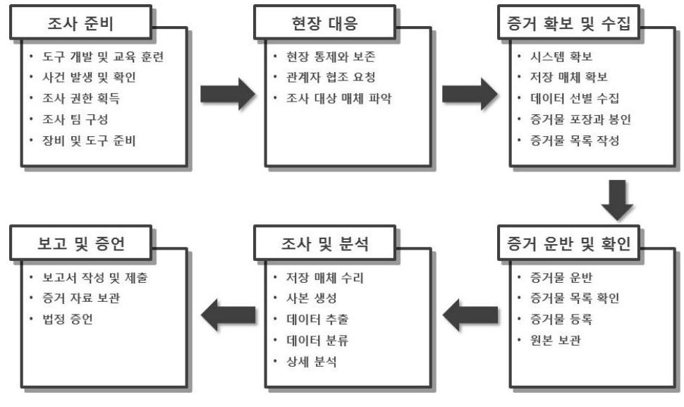
<그림 II-1> 디지털 포렌식 조사 모델

# 가. 조사 준비 

디지털 기기가 점점 다양해지고, 디지털 저장매체에 저장되어 있거나 네트워크 상에서 전송되는 디지털 데이터의 복잡한 특성으로 인해 디지털 포렌식 조사를 수행하는 조직은 본격적인 디지털 포렌식 조사를 시작하기 전에 사전 준비 과정 을 거치게 된다. 사건의 특성에 맞는 철저한 준비가 이루어지지 않는다면 중요한 디지털 증거를 수집하지 못하거나 훼손할 위험성이 존재한다. 따라서 본격적인 디 지털 포렌식 조사에 앞서 조사할 대상에 대한 정보 수집과 조사 계획을 수립해야 한다. 또한 디지털 포렌식 조사 기법에 대해 숙지하고 관련 기술 개발에 노력을 해야 한다. 이와 같은 조사 준비 과정은 도구 개발 및 교육 훈련, 사건 발생 및 확인, 조사 권한 획득, 인원 구성, 장비 및 도구 준비 단계로 나눌 수 있다.

## 나. 현장 대응

현장 대응 단계의 궁극적인 목표는 디지털 증거를 본격적으로 시작하기 이전에 현장을 통제하고 이를 보존하여 필요한 모든 증거가 수집되도록 준비하는 것이다. 따라서 디지털 포렌식 조사를 수행하기 위한 현장에 도착하면 조사에 필요한 조 치를 취한다. 현장을 통제 및 보존해야하며 관계자에게 협조를 요청하고, 조사 대 상 매체를 파악 및 선정해야 한다. 또한 현장 대응 과정에서 증거 인멸 시도를 차 단하기 위한 조치를 취해야하며, 디지털 증거의 훼손 위험성을 최소화해야 한다.

이러한 현장 대응 절차는 디지털 포렌식 조사를 수행하는 조사 기관의 특성에 따라 수행 방법이 달라질 수 있으며, 각 기관의 정책과 권한에 따라 작성된 현장 대응 지침서나 증거 처리 규칙에 따라 조사를 수행한다.

## 다. 증거 확보 및 수집

현장 대응 과정에서 디지털 증거를 수집하기 위한 준비 과정을 마쳤다면, 조사 대상자의 증거물을 확보하고 어떤 종류의 데이터를 어떠한 방법으로 수집할 것인 지를 결정한다. 이때에 수사 기관의 경우에는 영장의 기재 내용에 의거하여 압수 수색을 진행하고 필요한 증거물을 압수해야하며, 민간의 경우에는 의뢰인의 협조

를 얻어 현장에서 데이터를 수집 및 분석할 것인지, 시스템이나 중요 자료에 대한 사본을 생성하여 이를 확보할 것인지 협의한다.

디지털 증거를 수집하기 위한 증거물을 결정하였으면, 증거 수집 방법을 결정해 야 한다. 조사 현장에서의 시스템 및 네트워크 상황을 최대한 고려하여 디지털 증 거를 수집하기 위한 방법을 결정하고, 시스템 압수 가능 여부, 디스크 이미징을 통한 압수 여부, 활성 데이터의 수집 필요성을 고려하여 증거물을 확보한다.

증거 확보 및 수집 단계에서는 기본적으로 현장에 있는 모든 잠재적 증거물을 확보하는 것이지만 수집 및 분석해야할 디지털 증거의 분량이 방대할 경우에는 조사에 필요한 증거 자료 위주로 확보하는 것이 효과적이다.

증거 확보는 크게 시스템 확보, 원본 저장 매체 확보, 저장 매체 복제, 데이터 선별 수집으로 분류할 수 있다.

# 라. 증거 운반 및 확인 

디지털 증거 운반 과정에서는 획득한 증거물의 진정성 유지와 훼손 방지를 주 의해야한다. 또한 증거물의 누락 및 도난이 발생하지 않도록 연계보관 원칙을 철저히 유지하고, 반복 확인 과정을 거치는 일 또한 중요하다. 증거물을 인수인계 할 때 반드시 증거물 목록을 함께 전달하여 증거물과 비교한 후, 누락된 증거물은 없는지 확인해야 한다. 획득한 증거물에 대한 분석이 가능한 장소에 운반이 완료 되면, 운반하기 전 과정과 동일하게 증거물 목록을 이용하여 증거물을 대조하면서 훼손 여부를 확인함으로써 증거물 운반 과정 중에 누락 및 분실된 것은 없는지 확인해야 한다.

## 마. 조사 및 분석

조사 및 분석 단계는 획득한 증거물에 대한 분석 단계로써 분석에서는 다양한 기법을 활용한다. 일반적으로 디지털 포렌식 분석 작업에 사용되는 디지털 포렌식 분석 프로그램들은 증거물 획득 및 분석 기능을 제공하고 있다. 분석을 수행하기 위한 증거 수집 과정에서 복사한 이미지 파일을 확인하고, 확인 과정에서 범죄 증 거를 발견하면 파일의 확인 과정이 어떻게 진행되었는지 문서화하고 원본 데이터

에는 직접 접근하지 않음으로써 원본 데이터의 무결성을 제공할 수 있다. 이러한 디지털 포렌식 분석에는 삭제 파일 복구, 은닉 및 암호화되어 있는 데이터 검색, 파일 시스템 분석, 파일 컨텐츠 조사, 로그 분석, 통계 분석 등이 있다.

최근에는 점차 디지털 포렌식 조사에서 다루는 디지털 데이터의 양이 증가하고 있으며, 사건에 따라 조사 및 분석을 수행해야할 데이터가 다르다. 따라서 효과적 인 분석 작업을 수행하기 위해서는 주어진 데이터를 체계적으로 분류하고 사건 특성에 맞는 데이터를 선별하는 과정이 필요하다.

# 바. 보고 및 증언 

결과 보고서는 디지털 포렌식 조사자 및 분석자의 모든 행동과 관찰 내역, 분석 과정 등이 정확히 기록되어야 하고 각 단계의 결과가 완벽하게 동일해야 한다. 또 한 결과 보고서는 디지털 포렌식에 대한 지식과 이해가 부족한 일반인도 쉽게 이 해할 수 있도록 정확하고 간결하며 논리 정연하게 작성해야 한다.

결과 보고서에 포함되어야 할 항목은 다음과 같다.

- 사건 및 보고서 번호
- 사건 조사자 및 제출자 신분
- 증거 수집 일시, 보고서 작성 일시
- 디지털 증거물의 시리얼 번호, 제작, 모델을 포함 아이템의 설명 기록 리스트
- 조사자 및 분석자, 보고서 작성자의 신분과 서명
- 조사 및 분석에 사용한 장비 및 환경
- 각 절차에 대한 개략적 설명
- 사진 및 인쇄물 등과 같은 첨부 자료
- 증거의 독특한 아이템의 인쇄물, 증거의 디지털 복제원본, 절차 연속성 문서
- 추출 및 분석된 증거 데이터의 상세 설명
- 분석 결과 및 결론

# 4. 디지털 포렌식 유형

일반적으로 디지털 포렌식은 분석 목적에 따라 다음과 같이 크게 두 가지로 분 류할 수 있으며, 분석 대상에 따라 같이 여섯 가지로 분류할 수 있다[6].

아래 <표 II-3>는 디지털 포렌식의 유형을 나타내고 있다. <표 II-3> 디지털 포렌식의 유형

|  분류
기준 | 유 형 | 설 명  |
| --- | --- | --- |
|  분석
목적 | 사고 대응 포렌식 | - 시스템의 로그, 백도어, 루트킷 등을 조사하여 침입자의 신원과 침해 시스템의 피해 내용, 공 격자의 침입 경로 등을 파악하기 위한 분야
- 네트워크 기술과 서버의 로그 분석 기술과 운 영체제에 대한 이해가 필요  |
|   | 정보 추출 포렌식 | - 디지털 저장매체에 기록되어 있는 데이터를 복구하거나 검색하여 찾아냄으로써 범행 입증 에 필요한 증거를 얻어내는 분야  |
|  분석
대상 | 디스크 포렌식 | - 디스크 파일 시스템 분석
- 디스크 검색, 복구, MAC 분석, 키워드 검색  |
|   | 네트워크 포렌식 | - 네트워크를 통한 데이터 및 로그 분석
- 스니핑된 트래픽 로깅 파일 분석  |
|   | 인터넷 포렌식 | - WWW, FTP등의 인터넷 응용 프로토콜을 사 용하는 증거를 수집 및 분석
- 웹 히스토리 분석, 전자우편 헤더 분석, IP 추 적 등의 기술을 이용하여 증거를 수집  |
|   | 데이터베이스 포렌식 | - 데이터베이스로부터 데이터 추출 및 분석
- 기업의 분석 회계, 횡령, 탈세 수사 시 필수  |
|   | 모바일 포렌식 | - 모바일 기기에서 필요한 정보를 입수 및 분석
- 모바일 기기의 데이터 은닉 용이성으로 세심 한 분석이 필요  |
|   | 암호 포렌식 | - 문서나 시스템에서 암호 추출
- 증거 수집에서 비인가 접근을 막기 위해 문서 나 시스템에 암호를 설정한 경우 암호 분석  |

# 제 2 절 모바일 포렌식 

한국정보통신기술협회는 2007년 12월 26일에 표준번호 "TTAS.KO-12.0059"에 해당하는 "이동 전화 포렌식 가이드라인"을 제정하였다[3]. 이 표준은 이동 전화에 포함되어 있는 디지털 증거들을 정의하고 있으며, 이러한 디지털 증거에 대한 수 집 및 분석 절차와 방법을 제시하고 있다. 특히 이 표준은 수집, 분석, 보관의 과 정이 적법한 절차로 이루어질 수 있도록 표준 가이드라인을 제시하고 있다.

최근에는 이동 전화기에 높은 컴퓨팅 성능이 탑재된 모바일 기기에 대한 디지 털 포렌식의 한 분야인 모바일 포렌식이 등장하게 되었다. 즉, "모바일 포렌식"이 란 휴대폰, 스마트폰, 전자수첩, 디지털 카메라, MP3 플레이어, 휴대용 메모리카 드, USB 저장장치와 같이 이동성이 높은 디지털 기기에 저장된 데이터의 추출 및 복원하는 기법을 말한다[3]. 이동 전화 포렌식과 같은 기존의 모바일 포렌식은 통 화 기록, 연락처, SMS(Short Message Service)와 MMS(Multimedia Messaging Service) 메시지 등이 디지털 증거 수집대상이었지만, 최근에는 웹 브라우징, 무선 네트워크 환경 설정, 이메일 및 이미지 파일 등과 같이 모바일 디바이스에 저장된 데이터 및 스마트폰 애플리케이션 관련 중요 데이터 등으로 범위가 확대 되어가 고 있다[3].

## 1. 모바일 포렌식 절차

모바일 포렌식의 절차는 조사 및 분석 단계에서 이동 전화 포렌식보다 다양한 디지털 증거들을 수집 및 분석하기 위한 작업이 추가되었을 뿐, 한국정보통신기술 협회의 "TTAS.KO-12.0059" 표준에서 포함된 "이동 전화 포렌식 절차"과 크게 다 르지 않다. 또한, 스마트폰과 태블릿 PC와 같은 모바일 기기 역시 디지털 기기의 한 종류로써 디지털 포렌식의 절차와 크게 다르지 않다. 하지만 일반 디지털 기기 에 비해 모바일 기기는 개인의 생활과 밀접한 관련이 있는 디지털 데이터들이 다 수 저장되어 있기 때문에 모바일 포렌식 절차의 각 세부단계에서 프라이버시 침 해 문제가 발생하지 않도록 여러 사항을 고려해야 한다[3].

아래 <그림 II-2>는 모바일 포렌식 절차를 나타내고 있다.

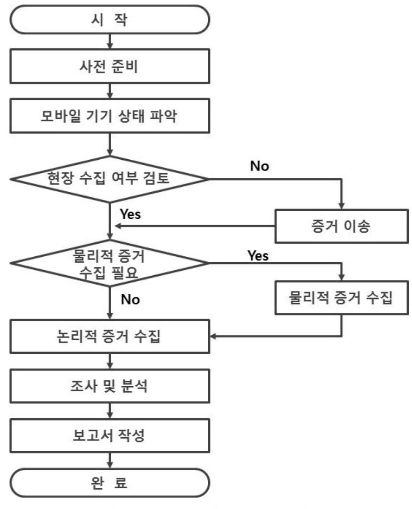

<그림 II-2> 모바일 포렌식 절차

# 2. 모바일 포렌식 도구 동향 분석 

모바일 포렌식 도구란 휴대폰, 스마트폰, 전자수첩, 디지털 카메라, MP3 플레이 어, 휴대용 메모리카드, USB 저장장치 등과 같은 디지털 모바일 기기에 저장된 데이터를 추출 및 복원 기능을 수행하는 하드웨어 장치 혹은 소프트웨어 프로그 램을 말한다[4].

아래 <표 II-4>는 주로 사용되는 모바일 포랜식 도구들의 종류를 나타낸다.

<표 II-4> 모바일 포랜식 도구들의 종류

| 이 름 | 플 랫폼 | 설 명 |
| :--: | :--: | :--: |
| BlackLight | Windows/ OSX/iOS | $\cdot$ iOS 포랜식 분석 소프트웨어 |
| Cellebrite Mobile Forensics | Windows | - 범용적 포랜식 추출 디바이스 |
| Secure View 3 Software Kit | Windows | - 하드웨어/소프트웨어 패키지 |
| Paraven Device Seizure | Windows | - 하드웨어/소프트웨어 패키지 |
| SAFT Mobile Foresics | Windows | - 안드로이드용 포랜식 애플리케이션 |
| MicroSystemation XRY/XACT | Windows | - 삭제 데이터 전용 |
| Oxygen Forensic Suite | Windows | - 스마트폰 포랜식 소프트웨어 |
| Elcomsoft iOS Forensic Toolkit | Windows/   Mac | - iOS 기기의 비트 이미지의 실시간 획득 |
| Elcomsoft Phone Password Breaker | Windows | - Blackberry 또는 iOS 기기의 패스워드 로 보호된 백업 부분에 접근 가능 |
| MOBILedit Forensic | Windows | - 하드웨어 커넥션 키트/소프트웨어 패키지 |
| viaForensics via Extract | Virtual Machine | - 안드로이드용 포랜식 소프트웨어 패키지 |
| Internet Evidence Finder | Windows | - 포랜식 증거 검색 및 복구 |

# - BlackLight 

BlackLight는 Mac OSX 컴퓨터와 iPhone과 iPad, iPod Touch 등 iOS 디바이 스, Windows 컴퓨터 등의 데이터를 분석할 수 있는 다중 플랫폼 포랜식 도구로 써 다양한 Windows 파일 시스템, 레지스트리 분석, 인터넷 사용 정보, 타임라인 분석, 파일 필터 뷰 등의 기능을 제공한다.

# - Cellebrite Mobile Forensics 

Cellebrite Mobile Forensics는 UFED Touch Ultimate와 UFED Link Analysis 등으로 구성되어 있다. UFED Touch Ultimate는 피처폰, 스마트폰, 휴대용 GPS 장치, 태블릿, 중국 칩셋을 사용한 모바일 기기 등으로부터 데이터의 추출, 디코 딩, 분석, 리포팅 기능을 제공하며, UFED Link Analysis는 논리적 및 물리적 추 출을 통해 여러 모바일 기기 간의 연결성을 분석하며, 데이터 추출 보고서를 기반 으로 여러 개의 모바일 기기 간의 접속과 통신 방법을 규정하고 시각화하는 기능 을 제공한다.

## - Secure View 3 Software Kit

Secure View 3 Software Kit는 다중 키워드 검색, 타임라인 분석, 통화, 문자, 연락처 간의 링크 데이터를 분석하여 링크 그래프 기능, 빈도별 휴대폰 행위 리스 트, 행위 뗐, 논리적인 웹 행위 데이터 등의 기능들을 제공한다.

## - Paraven Device Seizure

Paraven Device Seizure는 모바일 포렌식 추출 분석 시스템으로써 논리적 및 물리적 데이터 추출, 사용자 패스워드 추출과 진보된 파싱 및 분석, 구글 어스 통 합, 파일 정렬, 리포팅 기능등을 제공한다.

## - SAFT Mobile Foresics

SAFT Mobile Forensics는 안드로이드 기기에서 중요한 정보를 손쉽게 추출할 수 있는 기능을 포함한 모바일 포렌식 소프트웨어로써 안드로이드 기기의 통화 기록, SMS 기록, 연락처 리스트 등을 쉽게 보여주는 기능을 제공한다.

## - MicroSystemation XRY/XACT

MicroSystemation XRY/XACT는 스마트폰, GPS 기기, 3G 모뎀, MP3 플레이 어, iPad 등 다양한 모바일 기기에서 데이터를 추출하는 기능과 모바일 기기로부 터 물리적으로 추출한 데이터를 16 진수 형태로 보여주고, 필요에 따라 바이너리 파일로 저장할 수 있는 기능을 제공한다.

# - Oxygen Forensic Suite 

Oxygen Forensic Suite는 Standard Edition과 Analyst Edition으로 구성되어있 으며, Standard Edition은 모바일 기기의 정보, 연락처, 메시지, 이벤트 로그, 캘린 더 및 태스크, 파일 브라우저 등의 정보들을 제공하며, Analyst Edition은 Standard Edition에서 제공하는 기능뿐만 아니라 안드로이드 루팅, 애플리케이션 데이터 분석 백업 파일의 데이터 추출, 다양한 데이터 뷰어, 사전식 단어 디스플 레이, 전체 검색, 키 증거, 링크 및 통계, 패스워드 추출, 타임라인 분석, 웹 접속 과 위치 분석 기능등을 제공한다.

- Elcomsoft iOS Forensic Toolkit

Elcomsoft iOS Forensic Toolkit은 실시간으로 iOS 디바이스로부터 비트 단위 의 이미지를 획득하며, 패스코드, 패스워드 암호 키와 같은 iOS 디바이스의 비밀 데이터를 추출하고 패스코드의 유무와 상관없이 파일 시스템 이미지를 복호화 할 수 있는 기능을 제공한다.

- Elcomsoft Phone Password Breaker

Elcomsoft Phone Password Breaker는 패스워드로 보호되어 있는 Blackberry, iPhone, iPad, iPod 백업에 대한 접근을 가능하게 하고, 패스워드 복구 등의 기능 을 제공한다.

- MOBILedit Forensic

MOBILedit Forensic은 통화기록, 연락처, 텍스트 메시지, 멀티미디어 메시지, 파 이, 캘린더, 노트, IMEI, 운영체제, 펌웨어 등 모바일 디바이스의 중요 정보를 검 색할 수 있으며 논리적 및 물리적 데이터 추출 기능을 제공한다.

- viaForensics via Extract
viaForensics via Extract는 안드로이드 기기로부터 추출한 데이터의 검색 및 정렬 기능과 PDF 출력 기능, SMS 및 MMS의 데이터 복구 기능, 패스워드/패턴 /PIN 잠금에 대한 Bypass, 유연한 리포팅 등의 기능을 제공한다.

# - Internet Evidence Finder 

Internet Evidence Finder는 Windows와 Mac OSX를 지원하는 IEF Standard와 안드로이드와 iOS까지 지원하는 IEF Advanced로 구성되어 있으며 SMS, 이메일, Voicemail, 브라우저, 맵핑, 사진, 노트 등과 같은 데이터의 복구와 모바일 기기로 부터 추출한 이미지나 파일에서 모바일 채팅 애플리케이션의 데이터베이스를 검 색할 수 있는 기능을 제공한다.

아래 <표 II-5>는 모바일 포렌식 도구들의 기능들을 비교한 결과를 나타낸다.

| 이 름 | 제공형태 | 데이터 추출 | 데이터 분석 | 타임 라인 | 연결성 분석 | 패스워드   Bypass |
| :--: | :--: | :--: | :--: | :--: | :--: | :--: |
| BlackLight | SW | $\checkmark$ | $\checkmark$ | $\checkmark$ |  |  |
| Cellebrite Mobile Forensics | SW/HW | $\checkmark$ | $\checkmark$ | $\checkmark$ | $\checkmark$ |  |
| Secure View 3 Software Kit | SW | $\checkmark$ | $\checkmark$ | $\checkmark$ | $\checkmark$ |  |
| Paraven Device Seizure | SW/HW | $\checkmark$ | $\checkmark$ |  |  | $\checkmark$ |
| SAFT Mobile Foresics | SW/HW | $\checkmark$ | $\checkmark$ |  |  |  |
| MicroSystemation XRY/XACT | SW/HW | $\checkmark$ | $\checkmark$ | $\checkmark$ | $\checkmark$ |  |
| Oxygen Forensic Suite | SW | $\checkmark$ | $\checkmark$ | $\checkmark$ | $\checkmark$ |  |
| Elcomsoft iOS Forensic Toolkit | SW | $\checkmark$ | $\checkmark$ |  |  | $\checkmark$ |
| Elcomsoft Phone Password Breaker | SW | $\checkmark$ |  |  |  | $\checkmark$ |
| MOBILedit Forensic | SW/HW | $\checkmark$ | $\checkmark$ |  |  |  |
| viaForensics via Extract | SW | $\checkmark$ | $\checkmark$ |  |  | $\checkmark$ |
| Internet Evidence Finder | SW | $\checkmark$ | $\checkmark$ |  | $\checkmark$ |  |

# 제 3 절 안드로이드 

## 1. 안드로이드의 역사 및 시장 점유율

안드로이드는 최초에 리눅스 커널 2.6 버전을 기반으로 개발되었으며, 휴대 전 화를 비롯한 모바일 기기를 위한 운영체제, 미들웨어, 사용자 인터페이스, 애플리 케이션을 포함하고 있는 소프트웨어 스택이자 모바일 운영체제이다. 또한 이동 통 신사와 모바일 디바이스 제조사, 소프트웨어 제조사 등으로 이루어진 오픈 핸드셋 얼라이언스(OHA; Open Handset Alliance)에 의해 관리되는 오픈소스 모바일 디 바이스 플랫폼이다. 안드로이드는 리눅스 커널 상에서 동작하며 다양한 안드로이 드 시스템 구성 요소에 사용되는 $\mathrm{C} / \mathrm{C}++$ 라이브러리를 포함하고 있으며 자바 언 어로 애플리케이션을 개발할 수 있고, 기존의 자바 가상 머신과는 다른 달빅 (Dalvik) 가상 머신을 통해 자바로 작성된 애플리케이션을 별도의 프로세스로 실 행하는 구조로 되어 있다.

2005년 7월에 구글은 안드로이드 사를 인수하였고, 2007년 11월에 첫 번째 모바 일 기기 플랫폼인 안드로이드를 발표하였다. 이어서 2008년 8월에 안드로이드 마 켓을 발표하고 10월에는 오픈소스로 선언하였다. 이후로 안드로이드 다양한 플랫 폼들을 출시하고 있으며, 스마트폰뿐만 아니라 태블릿 PC 등에도 안드로이드 운 영체제를 탑재하여 출시하고 있다.

아래 <표 II-6>은 안드로이드의 주요 연혁을 나타낸다.
$<$ 표 II-6> 안드로이드 연혁

| 날 | |
| :--: | :--: |
| 2005년 07월 01일 | $\cdot$ 구글이 안드로이드 사를 인수 |
| 2007년 11월 12일 | $\cdot$ 안드로이드 출시 |
| 2008년 08월 28일 | $\cdot$ 안드로이드 마켓 발표 |
| 2008년 09월 23일 | $\cdot$ 안드로이드 1.0 플랫폼 출시 |
| 2008년 10월 21일 | $\cdot$ 오픈소스 소프트웨어로 안드로이드를 출시 |

| 2009년 02월 13일 | $\cdot$ 미국 안드로이드 마켓이 유료 앱 지원 |
| :--: | :--: |
| 2009년 03월 12일 | $\cdot$ 영국 안드로이드 마켓이 유료 앱 지원 |
| 2009년 04월 15일 | $\cdot$ 안드로이드 1.5(Cupcake) 플랫폼 출시 |
| 2009년 09월 16일 | $\cdot$ 안드로이드 1.6(Donut) 플랫폼 출시 |
| 2009년 10월 05일 | $\cdot$ 안드로이드 2.0/2.1(Eclari) 플랫폼 출시 |
| 2010년 05월 20일 | $\cdot$ 안드로이드 2.2(Froyo) 플랫폼 출시 |
| 2010년 05월 23일 | $\cdot$ 안드로이드 2.2 플랫폼을 탑재한 N1 스마트폰 출시 |
| 2010년 12월 06일 | $\cdot$ 안드로이드 2.3(Gingerbread) 플랫폼 출시 |
| 2011년 02월 22일 | $\cdot$ 안드로이드 3.0(Honeycomb) 플랫폼 출시 |
| 2011년 10월 19일 | $\cdot$ 안드로이드 4.0(Ice Cream Sandwitch) 플랫폼 출시 |
| 2012년 07월 09일 | $\cdot$ 안드로이드 4.1(Jelly Bean) 플랫폼 출시 |
| 2013년 10월 31일 | $\cdot$ 안드로이드 4.4 (Kitkat) 플랫폼 출시 |
| 2014년 10월 16일 | $\cdot$ 안드로이드 5.0(Lollipop) 플랫폼 출시 |

아래 <그림 II-3>은 구글에서 2014년 11월 03일에 발표한 안드로이드 플랫폼 버전별 점유율을 나타낸다.

| Version | Codename | Distribution |
| :--: | :--: | :--: |
| 2.2 | Froyo | $0.6 \%$ |
| $2.3 .3-2.3 .7$ | Gingerbread | $9.8 \%$ |
| $4.0 .3-4.0 .4$ | Ice Cream   Sandwitch | $8.5 \%$ |
| 4.1.X |  | $22.8 \%$ |
| 4.2.X | Jelly Bean | $20.8 \%$ |
| 4.3 |  | $7.3 \%$ |
| 4.4 | KitKat | $30.2 \%$ |

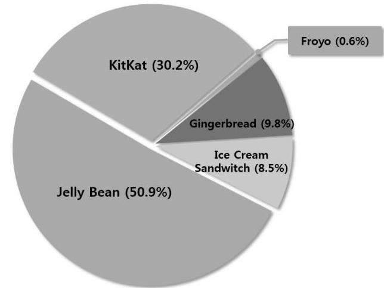
<그림 II-3> 안드로이드 플랫폼 버전별 점유율

안드로이드 플랫폼은 전 세계 스마트폰 시장에 많은 영향력을 끼치고 있으며, 이로 인해 모바일 포렌식 분야에서도 다양한 연구가 이루어지는 등 많은 관심을 받고 있다[6].

안드로이드는 발표된 지 2년여 만에 미국 6150만 명의 스마트폰 사용자 중 $26 \%$ 가 사용하는 스마트폰 플랫폼이 되었으며, 이는 스마트폰 플랫폼의 점유율 중 두 번째에 해당하였다[6]. ICT 시장조사기관 IDC(Internet Data Center)의 조사 결과, 2014년 2 분기 안드로이드가 전 세계 스마트폰 시장에서 $84.7 \%$ 의 판매량을 차지하고 있음을 발표하였다.

아래 <그림 II-4>와 <표 II-7>은 최근 2011년부터 2014년 2 분기까지의 스마 트폰 운영체제별 전 세계 스마트폰 판매량을 나타내고 있다.
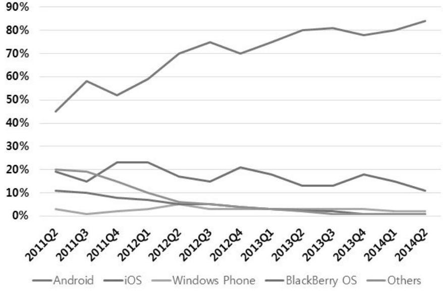
<그림 II-4> 전 세계 스마트폰 판매량(\%)

<표 II-7> 운영체제 별 전 세계 스마트폰 판매량(\%)

| 분 기 | Android | iOS | Windows Phone | BlackBerry | Others |
| :--: | :--: | :--: | :--: | :--: | :--: |
| Q2 2014 | $84.7 \%$ | $11.7 \%$ | $2.5 \%$ | $0.5 \%$ | $0.7 \%$ |
| Q2 2013 | $79.6 \%$ | $13.0 \%$ | $3.4 \%$ | $2.8 \%$ | $1.2 \%$ |
| Q2 2012 | $69.3 \%$ | $16.6 \%$ | $3.1 \%$ | $4.9 \%$ | $6.1 \%$ |
| Q2 2011 | $36.1 \%$ | $18.3 \%$ | $1.2 \%$ | $13.6 \%$ | $30.8 \%$ |

# 2. 안드로이드 디버그 브릿지 

안드로이드 디바이스를 컴퓨터 혹은 가상 장치(VM; Virtual Macine)에 USB 포 트를 통해 연결을 하면, 안드로이드 디바이스와 연결된 컴퓨터 혹은 VM에 여러 개의 USB 인터페이스가 제공된다. 안드로이드 디버그 브릿지(ADB; Android Debug Bridge)는 다양한 USB 인터페이스 중 안드로이드 디바이스를 분석하는데 중요한 기능 제공하는 USB 인터페이스이다. ADB는 안드로이드 디바이스 내에서 ADB 데몬(ADBD; ADB Daemon)이 백그라운드에서 실행되면서 안드로이드 디바 이스가 USB 포트 연결이 이루어질 경우, 안드로이드 플랫폼 및 애플리케이션 개 발자와 포랜식 분석가, 보안 엔지니어 등 안드로이드 디바이스에 대한 분석 작업 을 수행하는 분석가에게 디바이스를 제어할 수 있는 통신 기능을 제공한다.

안드로이드 포랜식 도구를 사용하거나 ADB를 직접 이용하기 위해서는 분석 대 상 안드로이드 디바이스에서 USB 디버깅이 활성화 상태로 되어있어야 하며, 에뮬 레이터에서 동작하는 안드로이드 가상 장치인 AVD(Android Virtual Device)의 경우에는 기본적으로 USB 디버깅이 활성화 상태로 되어있다. 하지만 에뮬레이터 가 아닌 실제 디바이스의 경우에는 USB 디버깅이 비활성화 상태로 되어있기 때 문에 USB 디버깅을 활성화상태로 변경하여야 한다. USB 디버깅은 디바이스 내 에 설치된 "설정" 애플리케이션의 "개발자옵션" 탭에서 활성화 및 비활성화 할 수 있다.

ADB는 아래와 같이 세 가지 컴포넌트로 동작한다.

- 안드로이드 디바이스에서 동작하는 ADBD
- 컴퓨터에서 동작하는 ADBD
- 컴퓨터에서 동작하는 ADB 클라이언트 프로그램

안드로이드 디바이스의 ADBD과 컴퓨터의 ADBD간의 통신은 USB 포트 연결 상에서 동작하는 가상 네트워크를 통해서 이루어진다. ADBD는 5555번부터 5585 번까지의 포트를 사용하고, 컴퓨터에서 동작하는 ADBD가 안드로이드 디바이스 혹은 에뮬레이터의 연결을 감지하면 두 개의 연결 포트(even포트와 odd포트)를 생성한다. even 포트는 안드로이드 디바이스 혹은 에뮬레이터의 콘솔과 통신하기

위해 생성된 연결 포트이고, odd 포트는 ADB 연결을 위한 포트이다. 로컬 ADB 클라이언트 프로그램은 로컬 ADBD와 통신하기 위해서 5037 번 포트를 사용한다.

ADB를 다루는 가장 기본적인 명령어는 adb devices 명령어이다. 해당 명령어 는 컴퓨터와 연결된 안드로이드 디바이스의 목록을 보여준다. 또한 adb kill-server 명령어는 로컬 ADB 서비스를 종료시키는 명령어이다.

아래 <그림 II-5>와 <그림 II-6>은 adb devices 명령어와 adb kill-server 명 령어의 결과 예시를 나타낸다.
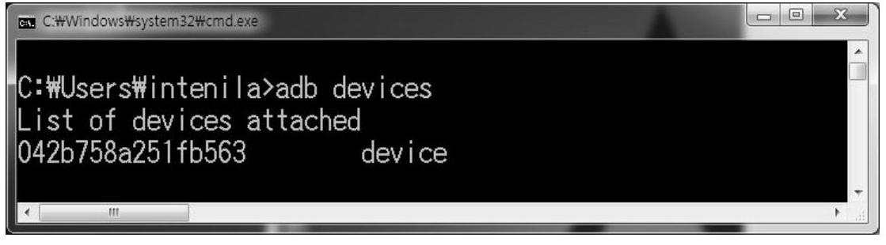
<그림 II-5> adb devices 결과 예시
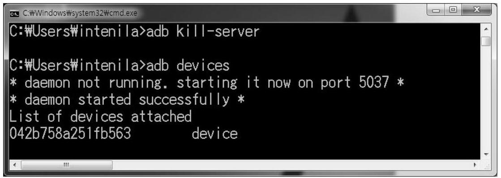
<그림 II-6> adb kill-server 결과 예시

안드로이드 디바이스 포렌식 분석가에게 adb shell 명령어은 분석 업무를 수행 하는데 있어 강력한 기능들을 제공한다. adb shell 명령을 이용하여 분석 대상 안 드로이드 디바이스에 쉘을 열어서 다양한 작업을 수행할 수 있다.

아래 <표 II-8>은 adb shell을 통해 연결된 쉘에서 안드로이드 디바이스에 대

한 포렌식 작업을 수행하는데 유용한 명령어들과 설명을 나타내고 있다.

# <표 II-8> 안드로이드 포렌식에 유용한 명령어 

| 명령어 | 설 명 |
| :--: | :--: |
| cat /proc/version | - 커널 버전 출력 |
| getprop ro.build.id | $\cdot$ 빌드 번호 출력 |
| cat /proc/cpuinfo | $\cdot$ 프로세서 정보, CPU 타입, 모델 제조사 등 출력 |
| cat/proc/meminfo | $\cdot$ 메모리 정보, 실제 메모리 및 가상 메모리 |
| vmstat | $\cdot$ 시스템 리소스 상황 모니터   - CPU, I/O, 메모리 등 |
| top | $\cdot$ 시스템 프로세스 상황 모니터링   - 메모리와 스왑 사용량 등 |
| netstat | $\cdot$ 네트워크 연결 상태 확인 |
| ps | - 현재 실행중인 프로세스 정보 |
| logcat | $\cdot$ 시스템과 애플리케이션 디버그 메시지를 지속적으로 업데이트하여 출력 |
| dumpsys | $\cdot$ 서비스, 메모리, 시스템에 대한 다양한 세부 정보 제공 |
| dumpstate | $\cdot$ 기기 상태 정보 덥프   - 상태 정보를 추출하는 여러 명령어들의 조합으로 구성 |
| dumpcrash | - 애플리케이션에서 크래쉬가 발생했을 때의 상태 정보 |
| bugreport | $\cdot$ logcat+dumpsys+dumpstate의 종합 정보 제공 |

ADB의 기능은 안드로이드 SDK(Software Development Kit)가 지속적으로 업 데이트되면서 다양해졌으며, 현재에는 안드로이드 디바이스의 분석 작업을 수행하 기 위한 강력한 도구가 되었다. 따라서 ADB는 포렌식 및 보안 분석가에게 중요 한 도구로 자리 잡게 되었다.

# 제 4 절 사전 분석 

디지털 포렌식 업무는 '디지털 포렌식 조사 모델'을 기반으로 수행되는데, 이 중 '증거 확보 및 수집' 과정에서는 가능한 모든 잠재적 증거물을 확보해야하지만 수 집 및 분석해야할 디지털 증거의 분량이 방대하거나 조사 대상이 한정적인 경우 에는 조사 및 분석에 필요한 증거 자료 위주로 확보하기 위한 데이터 선별 수집 과정이 진행될 수 있다. 이와 같이 데이터를 선별적으로 수집하기 위해서는 디지 털 증거가 저장되어있는 디지털 기기를 '디지털 포렌식 조사 모델'의 '조사 및 분 석' 과정보다 앞서서 분석해야할 필요성이 생길 수 있다. 따라서, 본 논문에서 말 하는 사전 분석(Pre-analysis)이란 디지털 포렌식 조사 모델 중 '증거 확보 및 수 집' 과정에서 '데이터 선별 수집' 업무를 수행하기 위해 디지털 증거에 대한 정밀 분석 과정 이전에 수행하는 분석 방법을 의미한다.

# 제 3 장 제안 기법 

## 제 1 절 개요

## 1. 등장배경 및 필요성

현재 주로 사용되고 있는 모바일 포렌식 도구들은 분석 대상 모바일 기기에 논 리적 및 물리적인 추출 기술을 적용하여 이미지를 획득하고, 이미지로부터 삭제된 디지털 데이터에 대한 복구 기능과 이미지에 포함된 디지털 데이터에 대한 강력 한 검색 및 필터링 기능등을 제공함으로써 범행 입증에 필요한 디지털 증거를 얻 어내는 "정보 추출 포렌식"을 주된 목적으로 삼고 있다.

하지만, 디지털 매체의 저장 기술의 발전으로 인해 디지털 매체의 저장 공간이 지속적으로 증가하고 있다. 또한, 디지털 매체의 저장 공간이 증가하는 만큼 한 사람당 보유하고 있는 디지털 기기의 개수도 증가하고 있다. 이러한 추세는 디지 털 기기에 논리적 및 물리적 추출 기술을 적용하여 디지털 기기의 이미지를 획득 하는 작업의 소요 시간이 크게 증가하는 결과를 얻게 된다. 또한, 방대한 용량의 이미지로부터 디지털 증거를 얻어내기 위한 작업은 더욱 더 어려워질 것이다. 또 한, 최근에는 프라이버시에 대한 관심이 증가함에 따라 모든 데이터를 수집하여 분석하는 이미지 추출방법 보다는 사건과 직접적으로 관련이 있는 데이터만 선별 하여 수집하는 형태가 선호되고 있다[1]. 따라서 분석 대상인 디지털 기기가 활성 화되어 있는 상태에서 디지털 데이터를 수집하는 기술에 대한 요구가 점차 증가 할 것으로 예상된다[1][4].

따라서 본 논문에서는 안드로이드 환경의 분석 대상 디바이스에서 디바이스에 대한 간략한 정보와 메모리 사용률, 애플리케이션에 대한 정보, 디바이스의 최근 활동 내역 등의 사전 분석 정보들을 제공함으로써 디지털 기기의 저장 공간의 증 가와 디지털 기기 보유량의 증가, 프라이버시에 대한 관심 증가로 인해 많은 어려 움을 겪고 있는 디지털 포렌식 업무의 효율성을 높이기 위한 사전 분석 기법을 제안한다.

# 2. 제안 기법의 절차 

본 논문에서 제안하는 기법은 크게 총 4단계로 이루어져있으며 각각의 단계는 데이터 추출 단계(Extracting), 데이터 선정 단계(Selecting), 데이터 결합 단계 (Combining)와 마지막으로 결과 보고 단계(Reporting)로 이루어져 있다.

아래 <그림 III-1>은 제안 기법의 전체적인 절차를 나타내고 있다.
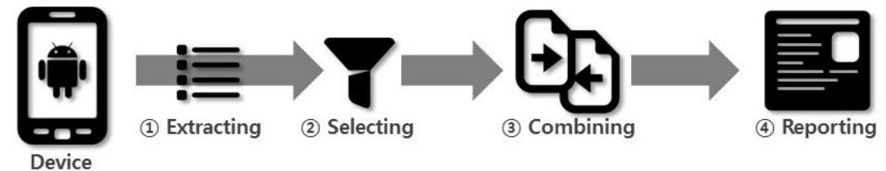
<그림 III-1> 제안 기법의 전체적인 절차

- 데이터 추출 단계 (Extracting)

데이터 추출 단계는 안드로이드 디바이스를 USB 인터페이스를 이용하여 분석 컴퓨터와 연결하고 ADB 명령을 이용하여 안드로이드 디바이스에 저장되어 있는 데이터 및 디바이스에 의해 생성된 데이터를 분석 컴퓨터로 추출하는 단계이다.

- 데이터 선정 단계 (Selecting)

데이터 선정 단계는 안드로이드 디바이스로부터 추출한 데이터들 중 디지털 포 렌식의 사전 분석에 유용하게 활용할 수 있는 데이터들을 선정하는 단계이다.

- 데이터 결합 단계 (Combining)

데이터 결합 단계는 안드로이드 디바이스로부터 데이터를 수집하고 데이터를 선정하는 단계를 거친 데이터들에 대해서 연관성이 있는 데이터들끼리 연결하는 단계이다.

- 결과 보고 단계 (Reporting)

결과 보고 단계는 디지털 포렌식 분석가에게 분석 대상 안드로이드 디바이스에 대한 사전 분석 정보들을 요약 및 종합 정리하여 보고서를 파일의 형태로 제공하 는 단계이다.

데이터 추출 방법 및 사전 분석에 유용한 데이터에 대한 선정은 제2절에서 자 세히 다루고, 데이터 결합 단계를 통해 제안 기법을 통해서 얻을 수 있는 결과 데 이터에 대한 내용은 제 3 절에서 다룬다.

# 제 2 절 데이터 추출 및 선정 방법 

ADB의 dumpsys 명령어는 서비스, 메모리, 시스템에 대한 다양한 세부 정보를 포함하여 디바이스에 설치된 애플리케이션에 대한 자세한 정보를 제공한다. dumpsys 명령의 결과로 다양한 서비스들이 덤프가 되어 출력된다. 출력되는 결과 는 아래 <표 III-1>과 같은 포맷으로 다양한 서비스들이 나열되어있다.

## <표 III-1> DUMP OF SERVICE의 포맷

DUMP OF SERVICE 서비스명 1:
...서비스 1에 대한 결과 데이터 ...

DUMP OF SERVICE 서비스명 2:
...서비스 2에 대한 결과 데이터 ...
DUMP OF SERVICE 서비스명 3:
...서비스 3에 대한 결과 데이터 ...

아래 <표 III-2>는 dumpsys 명령의 결과로 출력된 다양한 서비스 중 디지털 포렌식에 의미가 있는 데이터들이 포함되어있는 서비스명과 해당 서비스에 대한 간략한 설명을 나타내고 있다.

$<$ 표 III-2> 추출 대상 서비스명

| 서비스명 | 설 명 |
| :--: | :--: |
| account | $\cdot$ 디바이스에서 사용 중인 계정들에 대한 정보 |
| appops | $\cdot$ 애플리케이션 별 최근에 실행된 행위에 관한 정보   - 안드로이드 4.3버전 이상부터 서비스 제공 |
| dbinfo | $\cdot$ 데이터베이스 별 최근에 발생한 행위들에 대한 정보 |
| diskstats | $\cdot$ 안드로이드 디바이스의 디스크 용량에 대한 정보 |
| iphonesubinfo | $\cdot$IMEI 및 디바이스 ID 정보 |
| meminfo | $\cdot$ 메모리 사용에 관한 상세 정보 |
| package | $\cdot$ 디바이스에 설치된 애플리케이션에 대한 상세 정보 |
| usagestats | $\cdot$최근 동안에 실행된 애플리케이션에 관한 정보 |

# - DUMP OF SERVICE account 

account 서비스에는 안드로이드 디바이스 사용자가 애플리케이션을 사용하기 위해서 등록한 계정들과 해당 계정이 사용되는 애플리케이션의 패키지명에 대한 정보가 포함되어있다. 이러한 정보들은 분석 대상 디바이스에서 주로 사용되는 계 정과 해당 계정을 사용하는 애플리케이션을 파악하는데 도움을 줄 수 있는 정보 들이다.

아래 <표 III-3>은 account 서비스에 저장된 정보들의 예시를 나타내고 있다.
<표 III-3> DUMP OF SERVICE account 예시

DUMP OF SERVICE account:
User UserInfo(0:Owner:13):
Accounts: 4
Account (name=example@gmail.com, type=com.google)
Account (name=example@nate.com, type=com.facebook.auth.login)
Account (name=example, type=com.iloen.auth.login)
...하략...

# - DUMP OF SERVICE appops 

appops 안드로이드 버전 3.4 이상의 디바이스부터 제공하는 서비스이다. appops 서비스에는 각 패키지별 최근에 수행한 활동들에 대한 시간에 대한 정보들을 제 공하고 있다. 활동들 중에는 SMS를 수신하는 행위인 RECEIVE_SMS와 주소록에 대한 접근을 하는 READ_CONTACTS와 같이 사용자의 개인정보에 접근을 수행 하는 행위들에 대한 기록도 포함되어있다.

아래 <표 III-4>는 appops 서비스에 저장된 정보들의 예시를 나타내고 있다.
<표 III-4> DUMP OF SERVICE appops 예시

DUMP OF SERVICE appops:
Uid u0a77:
Package com.kakao.talk:
READ_CONTACTS: mode $=0$; time $=+5 \mathrm{~s} 831 \mathrm{~ms}$ ago; duration $=0$
RECEIVE_SMS: mode $=0$; time $=+283 \mathrm{~d} 11 \mathrm{~h} 9 \mathrm{~m} 24 \mathrm{~s} 542 \mathrm{~ms}$ ago; duration $=0$
READ_CLIPBOARD: mode $=0$; time $=+2 \mathrm{~d} 9 \mathrm{~h} 0 \mathrm{~m} 53 \mathrm{~s} 14 \mathrm{~ms}$ ago; duration $=0$
WAKE_LOCK: mode $=0$; time $=+3 \mathrm{~m} 25 \mathrm{~s} 419 \mathrm{~ms}$ ago; duration $=+2 \mathrm{~s} 4 \mathrm{~ms}$
...하략...

## - DUMP OF SERVICE dbinfo

dbinfo 서비스는 최근에 활동이 있던 데이터베이스 파일들에 대한 정보를 제공 하고 있으며, 해당 데이터베이스 파일에 실행되었던 SQL문과 SQL문의 실행 시간 들이 포함되어있다. 이러한 정보들은 데이터베이스 파일에 대한 접근 이력과 수행 된 SQL문들을 파악함으로써 데이터베이스 파일에서 발생한 행위들에 대한 분석 작업을 수행하는데 도움이 될 수 있는 정보이다.

아래 <표 III-5>는 dbinfo 서비스에 저장된 정보들의 예시를 나타내고 있다.

# $<$ 표 III-5> DUMP OF SERVICE dbinfo 예시 

DUMP OF SERVICE dbinfo:
Connection pool for /data/data/personal.jhjeong.app.batterylite/databases/http_auth.db:
Open: true
Max connections: 1
Available primary connection:
Connection \#0:
isPrimaryConnection: true
onlyAllowReadOnlyOperations: true
Most recently executed operations:
0 [2014-11-16 12:08:31:640] executeForCurserWindow took 0ms - succeeded, sol="PRAGMA database_list:" 1 [2014-11-16 12:08:39.640] executeForLong took 0ms - succeeded, sol="PRAGMA page_size:" 2 [2014-11-16 12:08:39.640] executeForLong took 0ms - succeeded, sol="PRAGMA page_count:" 3 [2014-11-16 12:08:01.264] executeForCurserWindow took 1ms - succeeded, sol="PRAGMA database_list:" ...하략...

## - DUMP OF SERVICE diskstats

diskstat 서비스는 분석 대상 디바이스의 데이터 공간과 캐시 공간, 시스템 공간 에 대한 사용률에 대한 정보를 제공한다.

아래 <표 III-6>은 diskstats 서비스에 저장된 정보들의 예시를 나타내고 있다.

## <표 III-6> DUMP OF SERVICE diskstats예시

DUMP OF SERVICE diskstats
Latency: 0ms [512B Data Write]
Data-Free: $20859192 \mathrm{~K} / 28061148 \mathrm{~K}$ total $=74 \%$ free
Cache-Free: $693416 \mathrm{~K} / 706392 \mathrm{~K}$ total $=98 \%$ free
System-Free: $311744 \mathrm{~K} / 1033516 \mathrm{~K}$ total $=30 \%$ free

## - DUMP OF SERVICE iphonesubinfo

iphonesubinfo 서비스는 분석 대상 디바이스의 통신 타입과 디바이스 ID에 대한 정보를 제공한다.

아래 <표 III-7>은 iphonesubinfo 서비스에 저장된 정보들의 예시를 나타내고 있다.

<표 III-7> DUMP OF SERVICE iphonesubinfo 예시

DUMP OF SERVICE iphonesubinfo
Phone Subscriber Info:
Phone Type $=$ GSM
Device ID $=123456789123456$

# - DUMP OF SERVICE meminfo 

meminfo 서비스는 분석 대상 디바이스에서 실행 중인 패키지들에 대한 메모리 사용에 관한 상세한 정보와 최근 활동 이력이 존재하는 데이터베이스 파일들에 대한 정보를 제공한다. 이러한 정보는 휘발성 데이터로써 현재 분석 대상 디바이 스 내에서 악의적인 행동이 발생하고 있을 경우에 유용하게 사용될 수 있다.

아래 <표 III-8>은 meminfo 서비스에 저장된 정보들의 예시를 나타내고 있다.

## <표 III-8> DUMP OF SERVICE meminfo 예시

| DUMP OF SERVICE meminfo: |  |  |  |  |
| :--: | :--: | :--: | :--: | :--: |
|  | Pss   Total | Pss   Clean | Shared   Dirty | Private   Dirty |
| Native Heap | 4556 | 0 | 1000 | 4536 |
| Dalvik Heap | 4492 | 0 | 15416 | 4072 |
| Dalvik Other | 4359 | 0 | 3152 | 4272 |
| DATABASES |  |  |  |  |
| pgsz dbsz | Lookaside(b) |  | cache | Dbname |
| 424 | 62 |  | 1876/127/17 | /data/data/com.google.android.gms/databases/rmq.db |
| 428 | 31 |  | 1000/113/3 | /data/user/0/com.google.android.gsf/databases/googlesettings.db |
| ...하락... |  |  |  |  |

## - DUMP OF SERVICE package

package 서비스는 분석 대상 디바이스에 정의된 리졸버 테이블에 관한 정보와 분석 대상 설치된 애플리케이션에 대한 다양하고 상세한 정보를 제공하고 있다. 이러한 정보들은 분석 대상 디바이스 내에 설치된 애플리케이션들의 리스트 및 애플리케이션의 위치와 최초 설치 시간 및 업데이트 시간 등 애플리케이션에 대 한 상세 정보를 제공함으로써 분석 대상 디바이스에 설치된 애플리케이션에 대한

정보들을 파악하는데 도움이 될 수 있다. 특히, 애플리케이션을 분석할 필요가 생 길 경우, 분석 대상 애플리케이션을 선정하는데 도움이 될 수 있는 정보이다.

아래 <표 III-9>는 package 서비스에 저장된 정보들의 예시를 나타내고 있다.

# <표 III-9> DUMP OF SERVICE package 예시 

DUMP OF SERVICE package:
Receiver Resolver Table:
android.intent.action.PRE_BOOT_COMPLETED:
4329fdd8 com.android.providers.calendar/.CalendarUpgradeReceiver filter 432a0038
432bc5b8 com.android.providers.contacts/.ContactsUpgradeReceiver filter 432bc868
432d21e0 com.google.android.gsf/Loginservice.MigrateToAccountManagerBroadcastReceiver filter 433d2198
432e3290 com.android.providers.media/.MediaUpgradeReceiver filter 432e34d8
43897060 com.google.android.googlequicksearchbox/.GelStubAppWatcher filter 43897510
...중략...
Package [com.facebook.katana] (43233540):
userId $=10078$ gids $=[1028,1015,3003]$
pkg=Package(435e22e8 com.facebook.katana)
codePath=/data/app/com.facebook.katana-1.apk
resourcePath=/data/app/com.facebook.katana-1.apk
...중략...
firstInstallTime $=2014-02-0715: 51: 04$
lastUpdateTime $=2014-10-24$ 21:03:21
installerPackageName=com.android.vending
signatures=PackageSignatures(43210458 [432341f0])
permissionsFixed=true haveGids=true installStatus=1
pkgFlags=[ HAS_CODE ALLOW_CLEAR_USER_DATA ALLOW_BACKUP ]
User 0: installed=true blocked=false stopped=false notLaunched=false enabled=0 disabledComponents:
com.facebook.wallpaper.WallpaperMuzeiSource
com.facebook.wallpaper.system.WallpaperUserPresentBroadcastReceiver
com.facebook.wallpaper.WallpaperSource
com.facebook.notifications.dashclock.NotificationDashClockExtension
...중략...
grantedPermissions:
android.permission.READ_EXTERNAL_STORAGE
android.permission.SET_WALLPAPER
android.permission.GET_TASKS
...하락...

## - DUMP OF SERVICE usagestats

usagestats 서비스는 최근 날짜별로 해당 날에 실행하였던 애플리케이션의 패키 지명과 실행 횟수, 총 실행 시간 등에 대한 정보를 제공한다. 이러한 정보는 분석

대상 디바이스의 사용자가 주로 사용하는 애플리케이션을 쉽게 알 수 있도록 도 움을 줄 수 있는 정보이다.

아래 <표 III-10>은 usagestats서비스에 저장된 정보들의 예시를 나타내고 있다.
<표 III-10> DUMP OF SERVICE usagestats예시

DUMP OF SERVICE usagestats:
Date: 20141117
com.google.android.googlequicksearchbox: 72 times, 196612 ms
...중략...
com.android.vending: 1 times, 38073 ms
...중략...
com.android.contacts: 2 times, 100480 ms
...중략...
com.google.android.dialer: 19 times, 2686555 ms
...중략...
com.android.chrome: 4 times, 962823 ms
...중략...
com.iloen.melon: 4 times, 9752035 ms
...중략...
personal.jhjeong.app.batterylite: 7 times, 2368579 ms
...중략...
com.facebook.katana: 37 times, 5730802 ms
...하락...

# 제 3 절 제안 기법의 활용 방안 

제안 기법은 안드로이드 디바이스에 대한 정밀 분석을 수행하기에 앞서 분석 대상 디바이스에 대한 사전 정보를 제공함으로써 정밀하게 분석할 대상을 선정하 는데 도움을 주는 것을 목표로 한다. 따라서 제안 기법을 통해서 분석 대상 디바 이스에 대한 요약 정보 및 설치된 애플리케이션에 대한 상세한 정보들과 안드로 이드 디바이스에서 최근에 활동한 애플리케이션들에 대한 목록 등의 정보를 분석 가에게 제공한다.

본 절에서는 제안 기법을 통해서 얻을 수 있는 사전 정보들과 해당 정보들의 활용 방안에 대해서 설명한다.

## 1. 디바이스 정보

## 가. 버전 정보 및 통신 타입 정보

분석 대상 안드로이드 디바이스의 안드로이드 버전과 커널 버전 정보를 제공함 으로써 분석 디바이스에 대한 운영체제 및 커널 정보를 파악할 수 있게 한다. 그 리고 디바이스에 대한 루팅을 수행하기 위해서는 해당 디바이스의 버전에 맞는 커널 파일을 사용해야하는데, 이러한 버전 정보 제공을 통해서 루팅에 필요한 커 널 파일의 버전 정보를 제공할 수 있다. 또한 분석 대상 디바이스의 통신 타입과 디바이스 ID 정보를 제공할 수 있다.

## 나. 계정 정보

안드로이드 디바이스 사용자가 설치된 일부 애플리케이션들은 사용자에게 편의 성을 제공하기 위하여 애플리케이션의 실행에 필요한 사용자 계정을 안드로이드 디바이스 내부에 저장하는 경우가 존재한다. 이러한 계정들과 해당 계정들을 이용 하는 애플리케이션의 패키지명을 제공함으로써 분석 대상 디바이스에서 주로 사

# 유저 

용되는 사용자의 계정을 포랜식 분석가에게 제공할 수 있다.

## 다. 디스크 및 RAM 정보

분석 대상 디바이스의 디스크 및 RAM의 상태 정보를 제공함으로써 저장 공간 의 사용률과 RAM 사용률을 파악할 수 있다.

## 2. 애플리케이션 정보

## 가. 패키지명 및 식별자 정보

애플리케이션의 패키지명과 애플리케이션이 할당받은 UID 및 GID와 같은 고정 적인 식별자와 실행 중인 애플리케이션일 경우에는 PID의 정보까지 제공한다. 이 를 통해 분석 디바이스의 파일시스템을 분석하거나, 프로세스들에 대한 분석을 수 행할 때에 애플리케이션을 식별할 수 있도록 한다.

## 나. 설치 및 업데이트 시간

애플리케이션이 최초로 설치된 시간과 최근에 업데이트된 시간 정보를 제공함 으로써 해당 애플리케이션이 언제부터 분석 대상 디바이스에서 활동을 시작했는 지, 지속적으로 업데이트를 수행하고 있는지에 대한 정보를 제공할 수 있다.

## 다. 최근 실행된 데이터베이스 파일

해당 애플리케이션이 사용하는 데이터베이스 파일 중 최근에 해당 데이터베이 스 파일에 대한 조회, 삽입, 수정 등의 작업을 수행하였던 데이터베이스의 저장 위치와 데이터베이스 파일명을 제공한다.

# 라. 보유 권한 

애플리케이션이 보유하고 있는 권한들에 대한 리스트를 제공한다. 이를 통해 해 당 애플리케이션이 수행할 수 있는 활동의 한계점 및 사용자의 개인정보에 대한 접근 가능성 유무를 판단할 수 있다.

## 마. 수신 가능한 인텐트 액션

안드로이드 디바이스에서는 배터리가 부족하다거나 네트워크 연결이 끊기거나 SMS 및 MMS의 송신 및 수신 등의 다양한 이벤트들이 발생할 수 있다. 이처럼 언제 발생할지 예측하기 어려운 이벤트들의 발생 시점을 알아야 하는 애플리케이 션이 존재할 수 있다[7]. 이러한 애플리케이션들은 '브로드캐스트(Broadcast)'라는 메커니즘을 이용하여 특정 이벤트들의 발생을 감지할 수 있다. 만일, SMS의 수신 이벤트를 감지하는 애플리케이션의 경우에는 해당 애플리케이션을 개발할 때에 android.provider.Telephony.SMS_RECEIVED라는 인텐트 액션을 브로드캐스트 리 시버에 등록을 해야 한다[7].

본 논문의 제안 기법은 각 애플리케이션 별로 해당 애플리케이션이 수신 가능 한 인텐트 액션들의 리스트를 제공함으로써 해당 애플리케이션이 분석 대상 디바 이스에서 어떠한 이벤트가 발생했을 시에 동작하는지 알려줄 수 있다.

## 바. 최근 실행한 권한 정보

안드로이드 4.3 버전 이상의 디바이스부터는 App ops 라는 기능이 탑재되어 있 다. App ops란 안드로이드 디바이스에 설치된 애플리케이션들의 권한들을 관리하 는 기능으로써 dumpsys 명령어를 통해서 각 애플리케이션별로 최근에 실행하였 던 권한들의 리스트와 시간 정보를 추출할 수 있다. App ops 기능을 통해서 조회 가능한 권한들의 목록은 아래와 같다.

- Access notifications
- Notification volume
- Alarm volume
- Play audio

| Audio focus | Post notification |
| :-- | :-- |
| Bluetooth volume | Read calendar |
| Call phone | Read call log |
| Camera | Read clipboard |
| Draw on top | Read contacts |
| Keep awake | Read SMS/MMS |
| Location | Receive SMS/MMS |
| Master volume | Record audio |
| Media buttons | Ring volume |
| Media volume | Send SMS/MMS |
| Modify calendar | Vibrate |
| Modify call log | Voice volume |
| Modify clipboard | Write SMS/MMS |
| Modify contacts | Write contacts |
| Modify settings |  |

# 사. 메모리 정보 

실행 중인 애플리케이션의 경우에는 해당 애플리케이션이 점유하고 있는 메모 리에 대한 상세한 정보를 제안 기법을 통해서 제공받을 수 있다.

## 3. 최근 활동 정보

분석 대상 안드로이드 디바이스에서 최근 몇 일간 실행되었던 애플리케이션의 패키지명과 실행 횟수, 실행 시간 등에 대한 정보를 제안 기법을 통해서 제공받을 수 있다. 이와 같은 정보를 통해서 분석 대상 안드로이드 디바이스의 사용자가 최 근 몇 일간 사용하였던 애플리케이션들의 리스트를 분석함으로써 타임라인 분석 에 이용할 수 있으며, 악성 애플리케이션을 분석하기 위해서 악성 애플리케이션이 실행된 시간을 제공받을 수 있다.

# 제 4 장 구현 결과 

## 제 1 절 구현 및 테스트 환경

본 논문의 제안 기법은 Windows 운영체제를 사용 중인 컴퓨터에서 개발되었으 며, 제안 기법의 구현 결과를 또한 대부분 디지털 포렌식 도구들의 동작 환경으로 채택하고 있는 Windows 운영체제에서 독립적으로 실행 가능한 프로그램으로 제 작하였다. 제안 기법의 구현 환경에 대한 자세한 사양은 아래 <표 IV-1>과 같다.
$<$ 표 IV-1> 제안 기법의 구현 환경

| 구 분 | 사 양 |
| :--: | :-- |
| 운영체제 | $\cdot$ Windows 7 Ultimate K 64bits |
| CPU | Intel(R) Core(TM) i7-3770 |
| RAM | $\cdot 8.00 \mathrm{~GB}$ |
| 개발언어 | Python 2.7 |
| 실행 프로그램 형태 | $\cdot$ Executable Windows programs |

제안 기법의 구현물에 대한 테스트는 실제로 안드로이드 운영체제를 탑재하고 있는 디바이스를 대상으로 진행하였으며, 테스트에 사용된 안드로이드 디바이스들 의 모델명과 안드로이드 버전은 아래 <표 IV-2>와 같다.
$<$ 표 IV-2> 테스트 디바이스의 모델명 및 안드로이드 버전

| 모델명 | 안드로이드 버전 | 모델명 | 안드로이드 버전 |
| :--: | :--: | :--: | :--: |
| LG-F300S | 4.2 .2 | SHV-E210K | 4.3 |
| Nexus 5 | 4.4 .4 | SHV-E160S | 4.1 .2 |
| Nexus 7 | 4.4 .3 | SHV-E210S | 4.1 .2 |

# 제 2 절 동작 과정 

제안 기법의 구현물의 전체적인 동작 과정은 기본적으로 본 논문의 제 3 장 제 1 절에서 설명한 제안 기법의 절차를 따르고 있으며, 추가적으로 제안 기법의 구현 물이 동작할 수 있도록 분석 대상 안드로이드 디바이스의 상태를 확인 및 검증하 는 준비 과정이 추가되어 총 5 단계로 구성되어있다.

아래 <표 IV-3>은 제안 기법 구현물의 단계별 작업을 나타내고 있다.
$<$ 표 IV-3> 제안 기법 구현물의 단계별 작업

| 과정 | 단계 | 단계 내 작업 |
| :--: | :--: | :--: |
| 준비 | 1 | - USB 인터페이스 연결 상태 확인 |
|  |  | - 분석 대상 디바이스의 버전 정보 추출 |
| 데이터   추출 | 2 | - dumpsys 명령 실행 및 결과 데이터 저장 |
|  | 3 | - 선정된 서비스 데이터 추출 |
|  |  | - 디바이스 정보 및 애플리케이션 정보 추출 |
|  | 4 | - 디바이스 정보 종합 |
|  |  | - 애플리케이션 정보들의 결합 |
| 결과   보고 | 5 | - 결과 보고서의 항목별 페이지 생성 |
|  |  | - 최종 결과 보고서 파일 생성 및 항목별 페이지 링크 연결 |

본 절에서는 제안 기법 구현물의 단계별로 상세한 동작을 설명한다.

## 1. 준비 단계

## 가. USB 포트 인터페이스 연결 상태 확인

USB 포트 인터페이스 연결 상태 확인 작업은 분석 대상 안드로이드 디바이스 와 분석 컴퓨터와의 연결 상태를 확인하는 단계이다. 연결 상태 확인의 결과는 아

래와 같이 네 가지 유형으로 나눌 수 있다.
(1) ADB 실행 불가 상태

ADB가 분석 컴퓨터에 설치가 되어있지 않거나 분석 컴퓨터의 시스템 환경변수 에 등록되어있지 않은 경우에는 ADB의 실행이 불가능하다. 이와 같은 상태가 확 인이 될 경우에는, ADB 설치 및 시스템 환경변수 등록을 요구하는 메시지를 출 력한다.
(2) 연결된 기기가 없는 상태

분석 컴퓨터에 ADB 드라이버 및 통합 USB 연결 드라이버가 설치되어 있지 않는 경우에는 ADB를 통해 연결된 디바이스 리스트를 조회할 경우에 해당 리스 트의 값이 NULL일 수 있다. 혹은 포렌식 분석가의 실수로 안드로이드 디바이스 를 분석 컴퓨터에 USB 포트로 연결하지 않은 상태에서도 연결된 디바이스 리스 트가 NULL일 수 있다. 이와 같은 상태가 확인이 될 경우에는, 분석 대상 디바이 스의 연결 상태 확인 요청 및 드라이버 설치를 요구하는 메시지를 출력한다.
(3) USB 디버그 비활성화 상태

분석 대상 안드로이드 디바이스의 USB 디버그가 비활성화 상태일 경우에는 ADB를 통해 연결된 디바이스 리스트를 조회할 경우에 해당 리스트에 연결된 디 바이스의 식별자가 조회되지만 연결 상태가 "unauthorized"로 비인가된 상태로 출 력된다. 이와 같은 상태가 확인이 될 경우에는, 분석 대상 안드로이드 디바이스의 USB 디버그 모드를 활성화하도록 요구하는 메시지를 출력한다.
(4) 정상적인 연결 상태

분석 대상 안드로이드 디바이스와 분석 컴퓨터와 정상적으로 연결이 되었을 경 우에는 USB 포트 인터페이스의 연결 상태가 완료되었다는 메시지를 출력한 후

다음 단계로 계속 진행한다.

# 나. 디바이스 버전 정보 추출 

디바이스 버전 정보 추출 작업은 분석 대상 안드로이드 디바이스의 안드로이드 버전과 커널버전, 빌드번호를 추출하는 단계이다. 특히, 안드로이드 버전은 이후에 진행될 데이터 선정 단계에서 dumpsys 내에서 추출할 서비스의 목록에 appops 서비스의 삭제 여부를 결정하는데 바로 사용되는 정보이다.

## 2. 데이터 추출 단계

## 가. dumpsys 데이터 추출

dumpsys 데이터 추출 작업은 분석 대상 안드로이드 디바이스에 dumpsys 명령 을 실행함으로써 디바이스 내 서비스, 메모리, 시스템에 대한 다양한 데이터들을 추출하는 단계이다. 추출되는 데이터의 크기는 분석 대상 디바이스마다 다르며, 작게는 2 MB 에서 크게는 8 MB 까지 존재하며 각각 60,000 라인에서 300,000 라인의 데이터를 보유하고 있다. 모든 작업 중 가장 오랜 시간이 걸리는 작업으로 본 논 문의 구현물의 전체 작업 시간의 $99 \%$ 를 차지한다.

## 3. 데이터 선정 단계

## 가. 선정된 서비스 데이터 추출

dumpsys의 결과 데이터로 추출된 다양한 서비스 및 서비스 데이터들 중 디지 털 포렌식 작업에 유용한 데이터들이 포함된 서비스들의 데이터를 추출하는 작업 이다. 분석 대상 디바이스의 안드로이드 버전이 4.3 미만인 경우에는 appops 서비 스가 존재하지 않기 때문에 appops를 제외한 서비스들을 추출한다.

# 나. 디바이스 정보 및 애플리케이션 정보 추출 

dumpsys로부터 추출한 각 서비스 데이터들 내에서 디바이스의 정보와 애플리 케이션의 정보들만 추출하는 과싱(Parsing) 작업을 통해 분석 대상 안드로이드 디 바이스에 대한 사전 분석에 필요한 정보들만 추출한다.

## 4. 데이터 결합 단계

## 가. 디바이스 정보 종합

각 서비스 데이터부터 추출한 디바이스의 정보들에 대한 검증작업과 문자열 처 리작업을 수행하여 결과 보고서 파일에 삽입하기 쉬운 형태로 변경한 뒤 하나의 리스트에 종합적으로 저장하는 단계이다.

## 나. 애플리케이션 정보들의 결합

각 서비스 데이터부터 추출한 애플리케이션들의 정보들에 대한 검증작업과 문 자열 처리작업을 수행하고, 각 데이터들의 연관성을 고려하여 하나의 리스트에 종 합적으로 저장하는 단계이다.

## 5. 결과 보고 단계

## 가. 결과 보고서의 항목별 페이지 생성

최종 결과 보고서의 내용들을 저장하고 있는 디바이스 정보 페이지와 애플리케 이션 리스트 페이지, 애플리케이션의 정보 페이지, 데이터베이스 정보페이지, 데이 터베이스 별 SQL 쿼리 데이터, 인텐트 액션 리스트 페이지 등등의 결과 보고서의 항목별 페이지를 생성하는 단계이다.

# 나. 최종 결과 보고서 과일 생성 및 항목별 페이지 링크 연결 

결과 보고서의 항목별 페이지를 하나의 페이지에서 확인할 수 있도록 각 페이 지들을 링크로 연결하고 메뉴 페이지 및 분석 결과 페이지를 출력하는 페이지 등 을 생성하는 단계로써 본 논문의 구현물의 최종 단계이다.

아래 <그림 IV-1>은 제안 기법 구현물의 전체 동작 순서도를 나타내고 있다.
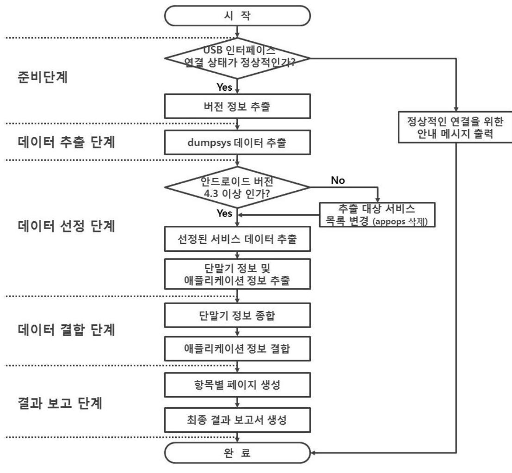
<그림 IV-1> 구현물의 전체 동작 순서도

# 제 3 절 실행 결과 

## 1. 프로그램 실행 화면

프로그램의 실행 결과는 디바이스의 연결 상태에 따라서 네 가지로 나누어진다.

## 가. ADB 실행 불가 상태

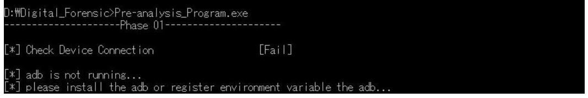
<그림 IV-2> 프로그램 실행 결과(ADB 실행 불가 상태)

## 나. 연결된 기기가 없는 상태

<그림 IV-3> 프로그램 실행 결과(연결된 기기가 없는 상태)

## 다. USB 디버그 비활성화 상태

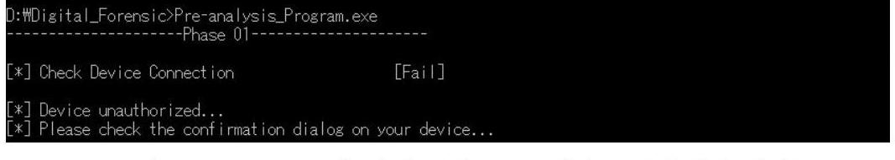
<그림 IV-4> 프로그램 실행 결과(USB 디버그 비활성화 상태)

# 라. 정상적인 연결 상태 

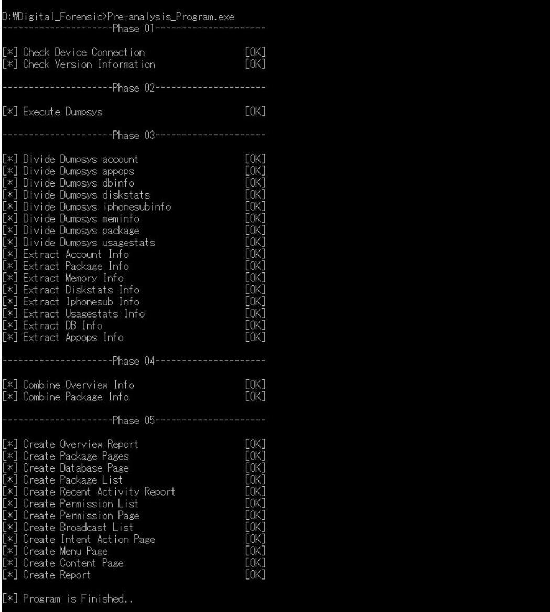
<그림 IV-5> 프로그램 실행 결과(정상적인 연결 상태)

정상적인 연결 상태 외에는 정상적인 USB 포트 인터페이스 연결을 위한 안내 메시지를 출력하고 프로그램이 종료된다.

# 2. 결과 보고서 

## 가. 메인 페이지

결과 보고서의 메인 페이지는 Overview 페이지이며 데이터 추출 및 분석을 시 작한 시간과 분석 대상 디바이스에 대한 디바이스 정보를 출력한다.
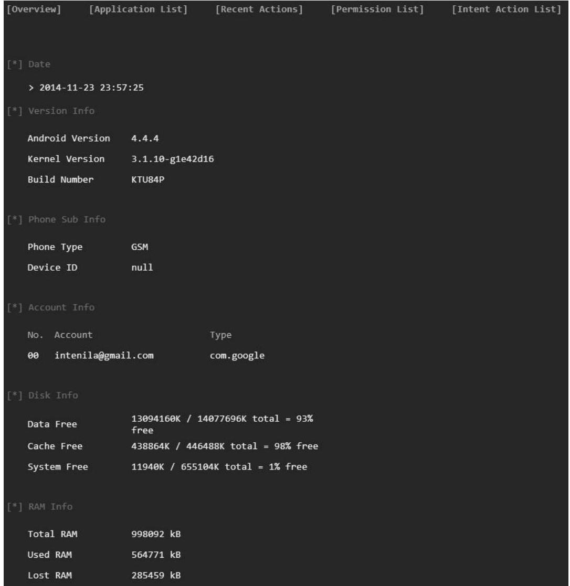
<그림 IV-6> 결과 보고서의 메인페이지(Overview 페이지)

# 나. 애플리케이션 리스트 페이지 

결과 보고서의 애플리케이션 리스트 페이지에는 분석 대상 안드로이드 디바이 스에 설치된 애플리케이션들의 패키지명과 해당 애플리케이션의 프로세스 ID와 해당 애플리케이션이 사용 중인 메모리의 크기를 나타내는 PSS(Proportional Set Size)를 출력하는 페이지이다. 애플리케이션의 리스트에서 패키지명을 클릭하면 해당 애플리케이션의 상세한 정보를 출력하는 애플리케이션 정보 페이지로 이동 한다.

| [Overview] | [Application List] | [Recent Actions] | [Permission List] | [Intent-Action List] |
| :--: | :--: | :--: | :--: | :--: |
| [1] Application List |  |  |  |  |
| No. | Package Name | PID | Pss |  |
| 000 | com.google.android.ears | 10022 | Not running |  |
| 001 | com.android.defcontainer | 10012 | Not running |  |
| 002 | com.android.launcher | 10033 | 22695 |  |
| 003 | com.nuance.xt9.input | 10059 | 3212 |  |
| 004 | com.google.android.exchange | 10016 | Not running |  |
| 005 | com.android.contacts | 10000 | Not running |  |
| 006 | com.android.providers.partnerbookmarks | 10043 | Not running |  |
| 007 | com.google.android.nfcprovision | 10067 | Not running |  |
| 008 | com.android.phone | 1001 | 7187 |  |
| 009 | com.android.calculator2 | 10005 | Not running |  |
| 010 | com.google.android.apps.walletnfcrel | 10058 | Not running |  |
| 011 | com.android.htmlviewer | 10028 | Not running |  |
| 012 | com.google.android.gsf.login | 10021 | Not running |  |
| 013 | com.android.bluetooth | 1002 | Not running |  |
| 014 | com.android.providers.calendar | 10007 | 4366 |  |
| 015 | com.google.android.email | 10015 | Not running |  |
| 016 | com.android.providers.downloads.ui | 10014 | Not running |  |
| 017 | com.android.documentsui | 10075 | Not running |  |
| 018 | com.android.sharedstoragebackup | 10048 | Not running |  |
| 019 | com.android.vpndialogs | 10057 | Not running |  |

<그림 IV-7> 애플리케이션 리스트 페이지

# 다. 애플리케이션 정보 페이지 

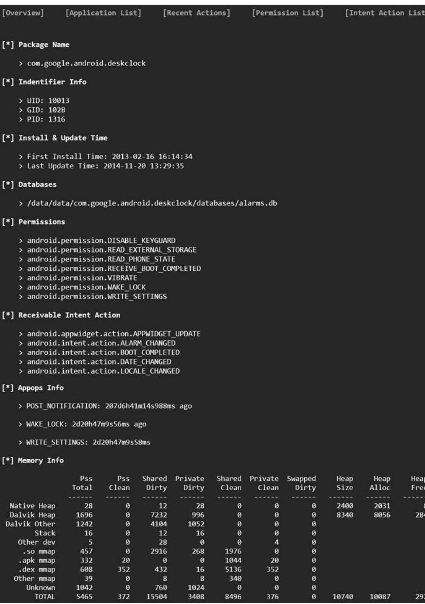

<그림 IV-8> 애플리케이션 정보 페이지

# 라. 최근 활동 페이지 

결과 보고서의 최근 활동 페이지는 분석 대상 안드로이드 디바이스에서 최근 며칠 동안에 실행하였던 애플리케이션의 패키지명과 실행 횟수 및 총 실행 시간 을 날짜별로 분류하여 출력한다. 최근 활동 페이지의 리스트에서 패키지명을 클릭 하면 해당 애플리케이션의 상세한 정보를 출력하는 페이지로 이동한다.

| [Overview] | [Application List] | [Recent Actions] | [Permission List] | [Intent Action List] |
| :--: | :--: | :--: | :--: | :--: |
| [*] Date 2014-11-19 |  |  |  |  |
|  | No. | Package Name | Times Hours of use |  |
|  | 00 | com.android.launcher | 10 | 4 min 2 sec |
|  | 01 | com.android.vending | 1 | 26 sec |
|  | 02 | com.mxtech.videoplayer.ad | 2 | 12 min 22 sec |
|  | 03 | com.quickoffice.android | 1 | 21 sec |
|  | 04 | com.google.android.gms | 1 | 1 min 13 sec |
|  | 05 | com.android.packageinstaller | 1 | 2 sec |
|  | 06 | com.android.settings | 5 | 21 sec |
|  | 07 | com.rhmsoft.fm.hd | 2 | 49 sec |
| [*] Date 2014-11-20 |  |  |  |  |
|  | No. | Package Name | Times Hours of use |  |
|  | 00 | com.android.launcher | 9 | 1 min 23 sec |
|  | 01 | com.google.android.gm | 1 | 2 sec |
|  | 02 | com.google.android.gms | 1 | 8 sec |
|  | 03 | com.adobe.reader | 3 | 6 min 56 sec |
|  | 04 | com.android.settings | 2 | 38 sec |
|  | 05 | com.google.android.talk | 1 | 4 sec |
| [*] Date 2014-11-23 |  |  |  |  |
|  | No. | Package Name | Times Hours of use |  |
|  | 00 | com.android.launcher | 1 | 5 sec |
|  | 01 | com.android.settings | 1 | 6 sec |

<그림 IV-9> 최근 활동 페이지

# 마. 권한 리스트 페이지 

결과 보고서의 권한 리스트 페이지에는 분석 대상 안드로이드 디바이스에 설치 된 애플리케이션들이 보유하고 있는 모든 권한들을 리스트로 출력하는 페이지이 다. 권한 리스트에서 패키지명을 클릭하면 해당 권한을 보유하고 있는 애플리케이 션의 리스트를 출력하는 페이지로 이동한다.

<그림 IV-10> 권한 리스트 페이지

# 마. 특정 권한을 보유한 애플리케이션 리스트 페이지 

권한 리스트 페이지에서 특정 권한을 선택하면 아래 <그림 IV-11>과 같이 해 당 권한을 보유하고 있는 애플리케이션의 리스트를 출력하는 페이지로 이동한다. 이 페이지의 애플리케이션 리스트에서 패키지명을 클릭하면 해당 애플리케이션의 상세한 정보를 출력하는 페이지로 이동한다.

| [Overview] | [Application List] | [Recent Actions] | [Permission List] | [Intent Action List] |
| :--: | :--: | :--: | :--: | :--: |
| [7] Application List (which includes android.permission.READ_CONTACTS permission |  |  |  |  |
| No. | Package Name |  |  |  |
| 000 | com.google.android.GoogleCamera |  |  |  |
| 001 | com.google.android.apps.docs |  |  |  |
| 002 | com.google.android.apps.inputmethod.hindi |  |  |  |
| 003 | com.google.android.apps.plus |  |  |  |
| 004 | com.google.android.apps.walletnfcrel |  |  |  |
| 005 | com.google.android.email |  |  |  |
| 006 | com.google.android.exchange |  |  |  |
| 007 | com.google.android.gallery3d |  |  |  |
| 008 | com.google.android.gm |  |  |  |
| 009 | com.google.android.googlequicksearchbox |  |  |  |
| 010 | com.google.android.inputmethod.korean |  |  |  |
| 011 | com.google.android.inputmethod.latin |  |  |  |
| 012 | com.google.android.inputmethod.pinyin |  |  |  |
| 013 | com.google.android.nfcprovision |  |  |  |
| 014 | com.google.android.setupwizard |  |  |  |
| 015 | com.google.android.tag |  |  |  |
| 016 | com.google.android.talk |  |  |  |
| 017 | com.google.android.widget.userinfo |  |  |  |
| 018 | com.iloen.melon |  |  |  |

<그림 IV-11> 특정 권한을 보유한 애플리케이션 리스트 페이지

# 바. 인텐트 액션 리스트 페이지 

결과 보고서의 인텐트 액션 리스트 페이지에는 분석 대상 안드로이드 디바이스 에 설치된 애플리케이션들이 수신할 수 있는 모든 인텐트 액션들을 리스트로 출 력하는 페이지이다. 인텐트 액션 리스트에서 패키지명을 클릭하면 해당 인텐트 액 션을 수신할 수 있는 애플리케이션의 리스트를 출력하는 페이지로 이동한다.

| [Overview] | [Application List] | [Recent Actions] | [Permission List] | [Intent Action List] |
| :--: | :--: | :--: | :--: | :--: |
| [*] Receivable Intent List |  |  |  |  |
| No. | Intent |  |  |  |
| 000 | .BOOKMARK_APPWIDGET_UPDATE |  |  |  |
| 001 | AudioEffect.ACTION_GET_PARAM |  |  |  |
| 002 | AudioEffect.ACTION_SET_PARAM |  |  |  |
| 003 | android.accounts.LOGIN_ACCOUNTS_CHANGED |  |  |  |
| 004 | android.app.action.DEVICE_ADMIN_ENABLED |  |  |  |
| 005 | android.appwidget.action.APPWIDGET_DISABLED |  |  |  |
| 006 | android.appwidget.action.APPWIDGET_ENABLED |  |  |  |
| 007 | android.appwidget.action.APPWIDGET_UPDATE |  |  |  |
| 008 | android.bluetooth.a2dp.action.SINK_STATE_CHANGED |  |  |  |
| 009 | android.bluetooth. adapter.action.DISCOVERY_FINISHED |  |  |  |
| 010 | android.bluetooth. adapter.action.DISCOVERY_STARTED |  |  |  |
| 011 | android.bluetooth. adapter.action.STATE_CHANGED |  |  |  |
| 012 | android.bluetooth.device.action.ACL_CONNECTED |  |  |  |
| 013 | android.bluetooth.device.action.ACL_DISCONNECTED |  |  |  |
| 014 | android.bluetooth.device.action.CONNECTION_ACCESS_CANCEL |  |  |  |
| 015 | android.bluetooth.device.action.CONNECTION_ACCESS_REPLY |  |  |  |
| 016 | android.bluetooth.device.action.CONNECTION_ACCESS_REQUEST |  |  |  |
| 017 | android.bluetooth.device.action.PAIRING_CANCEL |  |  |  |
| 018 | android.bluetooth.device.action.PAIRING_REQUEST |  |  |  |
| 019 | android.bluetooth.headset.action.STATE_CHANGED |  |  |  |

<그림 IV-12> 인텐트 액션 리스트 페이지

# 사. 특정 인텐트 액션을 수신 가능한 애플리케이션 리스트 페이지 

인텐트 액션 리스트 페이지에서 특정 인텐트 액션을 선택하면 아래 <그림 IV -13>과 같이 해당 인텐트 액션을 수신할 수 있는 애플리케이션의 리스트를 출력 하는 페이지로 이동한다. 이 페이지의 애플리케이션 리스트에서 패키지명을 클릭 하면 해당 애플리케이션의 상세한 정보를 출력하는 페이지로 이동한다.

| [Overview] | [Application List] | [Recent Actions] | [Permission List] | [Intent Action List] |
| :--: | :--: | :--: | :--: | :--: |
| [*] Application List (which receive android.intent.action.BOOT_COMPLETED intent |  |  |  |  |
| No. | Package Name |  |  |  |
| 000 | android |  |  |  |
| 001 | com.android.phone |  |  |  |
| 002 | com.android.providers.calendar |  |  |  |
| 003 | com.android.providers.downloads |  |  |  |
| 004 | com.android.providers.media |  |  |  |
| 005 | com.android.systemui |  |  |  |
| 006 | com.android.vending |  |  |  |
| 007 | com.google.android.GoogleCamera |  |  |  |
| 008 | com.google.android.apps.enterprise.dmagent |  |  |  |
| 009 | com.google.android.apps.walletnfcrel |  |  |  |
| 010 | com.google.android.calendar |  |  |  |
| 011 | com.google.android.configupdater |  |  |  |
| 012 | com.google.android.deskclock |  |  |  |
| 013 | com.google.android.email |  |  |  |
| 014 | com.google.android.gallery3d |  |  |  |
| 015 | com.google.android.gm |  |  |  |
| 016 | com.google.android.gms |  |  |  |
| 017 | com.google.android.googlequicksearchbox |  |  |  |
| 018 | com.google.android.gsf |  |  |  |
| 019 | com.google.android.inputmethodclatchs |  |  |  |

<그림 IV-13> 특정 인텐트 액션을 수신 가능한 애플리케이션 리스트 페이지

# 제 5 장 결 론 

스마트 디바이스들의 편리한 휴대성과 강력한 컴퓨팅 능력은 스마트 디바이스 사용자들에게 개인적인 용무에서의 편의성 제공과 시간과 장소의 제약 없이 언제 어디서든 회사 업무를 수행할 수 있는 연속성을 제공하게 되었다. 하지만 스마트 디바이스의 휴대성과 컴퓨팅 능력은 사이버 범죄와 같은 악의적인 목적으로 활용 될 수 있으며, 이와 같은 스마트 디바이스를 이용한 범죄들에 대응하기 위해 디지 털 포렌식의 한 분야인 모바일 포렌식에 대한 필요성이 증가되었으며, 이에 대한 연구가 활발히 진행되고 있다.

현재 주로 사용되고 있는 모바일 포렌식 도구들은 스마트 디바이스로부터 이미 지를 추출하고, 삭제된 데이터를 복원하거나 방대한 데이터들 사이에서 필터링하 거나 데이터를 검색하는 등의 기술을 활용함으로써 범죄를 입증할 수 있는 디지 털 증거를 획득하는 '정보 추출 포렌식'의 유형의 도구이다. 하지만 최근에는 프라 이버시에 대한 관심이 증가함하고 있으며, 디지털 매체의 저장 기술의 발전으로 인해 디지털 매체의 저장 용량이 크게 증가하고 있는 추세이다. 따라서 분석 대상 디바이스로부터 이미지를 추출하고 모든 데이터를 수집하여 분석하는 방법 보다 는 사건과 직접적으로 관련이 있는 데이터만 선별하여 수집하는 형태가 선호되고 있다.

따라서 본 논문에서는 스마트 디바이스 중 가장 높은 점유율을 차지하고 있는 안드로이드 디바이스를 대상으로 디바이스의 사전 분석 정보를 제공하는 기법을 제안하였다. 또한 제안한 기법을 실제로 구현함으로써 실제로 얻을 수 있는 정보 들에 대해서 분석하고 제안 기법의 활용방안을 분석하였다.

이에 따라 본 논문에서 제안한 기법은 안드로이드 디바이스를 대상으로 디지털 포렌식 업무 수행 시 해당 디바이스에 대한 정보들을 추출 및 분석하여 포렌식 분석가에게 사전 정보를 제공함으로써 분석 대상 디바이스를 파악하기 위한 정보 와 해당 디바이스에 설치된 애플리케이션에 대한 정보 및 프로세스에 대한 정보 를 제공함으로써 정밀 분석을 수행하기 위한 데이터 및 애플리케이션을 선정하는 데 도움을 줄 수 있을 것으로 기대된다.

# 참고문헌 

[01] 이상진, "디지털 포랜식 개론", 이룬 출판사, 2010.07.
[02] 한국정보통신기술협회, "컴퓨터 포랜식 가이드라인", 2007.12.
[03] 한국정보통신기술협회, "이동 전화 포랜식 가이드라인", 2007.12.
[04] 정보통신산업진흥원, "모바일 포랜식 도구 동향 분석", 2014.03.
[05] 한국방송통신전파진흥원, "모바일 포랜식 기술의 현재와 미래", 방송통신기술 이슈\&전망 2014년 제 41호, 2014.01
[06] 한국디지털포랜식연구회, "e-포랜식", 2013.05
[07] 앤드류 후그, "안드로이드 포랜식", 2013.02
[08] 천인국, "그림으로 쉽게 설명하는 안드로이드 프로그래밍", 2012.08
[09] 한국전자통신연구원, "스마트폰 포랜식 기술 동향", 전자통신동향분석 제28권 제3호, 2013.06.
[10] 한국전자통신연구원, "디지털 포랜식 기술 및 동향", 전자통신동향분석 제22권 제 1 호, 2007.02.
[11] 한국정보통신기술협회, "컴퓨터 포랜식을 위한 디지털 증거 분석도구 요구사 항", 2008.12.
[12] 한국정보통신기술협회, "컴퓨터 포랜식을 위한 디지털 증거 분석도구 검증", 2009.12.
[13] 한국정보통신기술협회, "컴퓨터 포랜식을 위한 디지털 데이터 수집도구 요구 사항", 2007.12.
[14] RFC 3227, "Guidelines for Evidence Collection and Archiving", 2002.02
[15] 이재현, "스마트폰 포랜식 증거수집 절차 및 분석에 대한 연구", 석사학위논 문, 호서대학교, 2012.08
[16] Ericsson, "Ericsson Mobility Report", 2014.11
[17] 대검찰청, "디지털 증거 수집 및 분석 규정", 대검예규 438호, 2008.12.
[18] 한국전자통신연구원, "디지털 포랜식 기술과 표준화 동향", TTA Journal No.118, 2008.08.
[19] National Institute of Standard Technology, "Guide to Integrating Forensic

Techniques into Incident Response", Special Publication 800-86, 2006.08.
[20] Seung-hwan Ju, Hee-suk Seo and Jin Kwak, "Study on Analysis Methodology for Android Applications," Journal of Internet Technology, vol. 14, no. 5, pp. 851-857, 2013.09.
[21] Ilyoung Hong and Sangjin Lee, "Research on Efficient Live Evidence Analysis System Based on User Activity Using Android Logging System," Journal of The Korea Institute of information Security \& Cryptology, vol. 22, no. 1, pp. 67-80, 2012.02.
[22] 한지성, 이상진, "라이브 포랜식을 위한 윈도우즈 물리 메모리 분석 도구," 정 보보호학회논문지 제 21 권 제 2 호, pp.71-82, 2011.04.
[23] 홍일영, 이상진, "안드로이드 로그 시스템을 이용한 효율적인 사용자 행위기 반 라이브 증거수집 및 분석 시스템 연구", 정보보호학회논문지 제 22 권 제 1 호, pp.67-80, 2012.02.
[24] 최슬기, 곽진, "라이브 포랜식을 위한 안드로이드 애플리케이션의 최근 활동 분석 기법", 2014년도 한국정보보호학회 충청지부 정보보호 학술발표회 논문 집, pp.128-130. 2014.09.
[25] Google, "Android Debug Bridge", http://developer.android.com/
[26] 김진국, "디지털 증거 수집 방안", forensic-proof.com
[27] 김진국, "디지털 포랜식 개요", forensic-proof.com
[28] 김진국, "스마트기기 포랜식", forensic-proof.com

# ABSTRACT 

## Pre-Analysis Method of Android Device for Digital Forensics

Seul-Ki Choi Department of Information Security Engineering Graduate school of Soonchunhyang University Asan, Korea

(Supervised by Professor Jin Kwak)

Recently, Cyber crimes using smart device are increasing. Therefore, the study of mobile forensics which is one part of digital forensics is actively proceeding and the interest of mobile forensics is also increasing. The mobile forensics tools and the study of mobile forensics that are mainly used so far are only focused on extracting images from smart device to get digital evidence. However, through the storage capacity to digital device and the interest of privacy to users who use smart devices are both increasing, as techniques that analyze by selecting the data which is directly related are more preferred than extracting images. Therefore, in this paper I propose the pre-analysis method of android device for digital forensics. Proposed method can be the guidance to forensic analyst who need information about application and android device for digital forensic analyzing. Consequently, I expect proposed method of this paper could help digital forensics analysts to select the target for performing on detailed analysis.

# 감사의 글 

정보보호의 꿈나무가 되겠다는 자신감을 품고 2007년에 입학한 제가 학부과정 과 지난 2년 동안의 대학원 생활을 거쳐 석사학위를 받게 되었습니다. 지난 시간 들을 돌이켜보면 아직 많은 면에서 저에게 많은 도움들을 아낌없이 베풀어주신 분들이 계셨기 때문에 제가 조금이나마 성장을 할 수 있었음을 깨닫을 수 있었고, 저에게는 이분들에 대한 존경과 감사함이라는 마음을 간직할 수밖에 없던 시간들 이었습니다. 이제 논문을 마무리하면서 지금의 제가 있을 수 있도록 격려해주시고 많은 도움을 베풀어주신 분들께 감사의 인사를 드리고자 합니다.

먼저, 석사과정동안 대학원 생활을 무사히 마칠 수 있도록 항상 신경써주시고 성심성의껏 지도를 해주신 곽진 교수님께 감사드립니다. 연구에 대한 지도뿐만 아 니라 인생에 대해서도 많은 조언을 해주셔서 감사드립니다. 교수님의 지도와 조언 덕분에 저의 부족한 부분들과 부족한 부분들을 해결해나가는 방법, 그리고 연구자 란 누구이며, 연구가 무엇인지에 대해 조금이나마 알 수 있게 되었습니다. 교수님 의 말씀을 항상 떠올리며, 교수님의 제자로서 끊임없이 새로운 연구에 도전하는 연구자가 될 수 있도록 노력하겠습니다. 앞으로도 지켜봐주시길 바랍니다.

또한 정보보호학과의 무한한 발전을 위해 끊임없이 연구하시며, 학생들에게도 열정 가득한 강의를 해주시고, 따뜻한 조언과 격려의 말씀을 해주신 임강빈 교수 님, 이선영 교수님, 염홍열 교수님께 감사드립니다.

그리고 아무리 바빠도 시간을 내주시어 저의 고민을 들어주시고 많은 조언을 해주신 정보보호응용및보증연구실 선배님들과 연구에 대한 열정을 잊지 않도록 바짝 추격해오는 정보보호응용및보증연구실 후배님들께 감사의 인사를 전합니다.

마지막으로 항상 저의 선택을 존중해주시고 묵묵히 기다려주시며, 모든 지원을 아끼지 않으신 부모님께 감사의 말씀 올리며, 항상 존경하고 있다고 말씀드리고 싶습니다.

앞으로도 연구에 대한 끊임없는 열정과 호기심을 갖고 살아갈 것이고, 지금의 제가 있을 수 있도록 해주신 분들께서도 자랑스럽게 여길 수 있는 '최슬기'가 되 도록 항상 노력하겠습니다.

감사합니다.

