>  style="width:2.91667in;height:0.82333in" /> style="width:0.66667in;height:0.66667in" /> style="width:0.66667in;height:0.66667in" /> style="width:0.66667in;height:0.66667in" /> style="width:0.15667in;height:0.13667in" />저작자표시**-**비영리**-**변경금지
> **2.0** 대한민국
>
> 이용자는 아래의 조건을 따르는 경우에 한하여 자유롭게
>
> l 이 저작물을 복제, 배포, 전송, 전시, 공연 및 방송할 수 있습니다.
>
> 다음과 같은 조건을 따라야 합니다**:**
>
> 저작자표시. 귀하는 원저작자를 표시하여야 합니다.
>
> 비영리. 귀하는 이 저작물을 영리 목적으로 이용할 수 없습니다.
>
> 변경금지. 귀하는 이 저작물을 개작, 변형 또는 가공할 수 없습니다.
>
> l 귀하는, 이 저작물의 재이용이나 배포의 경우, 이 저작물에 적용된
> 이용허락조건 을 명확하게 나타내어야 합니다.
>
> l 저작권자로부터 별도의 허가를 받으면 이러한 조건들은 적용되지
> 않습니다.
>
> 저작권법에 따른 이용자의 권리는 위의 내용에 의하여 영향을 받지
> 않습니다**.**
>
> 이것은 [이용허락규약<u>(Legal
> Code)</u>](http://creativecommons.org/licenses/by-nc-nd/2.0/kr/legalcode)을
> 이해하기 쉽게 요약한 것입니다.
>
> [<u>Disclaimer</u>](http://creativecommons.org/licenses/by-nc-nd/2.0/kr/)
>
> 석 사 학 위 논 문
>
>  style="width:4.09375in;height:4.125in" />모바일 포렌식을 통한
>
> 이미지 조작 행위 탐지에 관한 연구
>
> 지도교수 정 두 원
>
> 동국대학교 일반대학원 경찰행정학과
>
> 이 지 원
>
> 2024

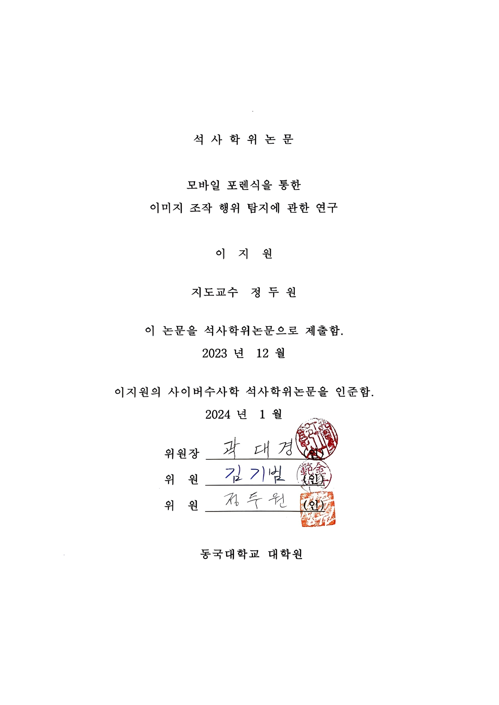

> 목 차
>
> 제1장 서 론
> ··········································································································1
>
> 제1절 연구의 목적
> ·························································································1
>
> 제2절 연구의 범위 및 방법
> ·········································································3
>
>  style="width:4.09375in;height:4.125in" />1. 연구의 범위
> ····························································································3
>
> 2\. 연구의 방법
> ····························································································4
>
> 제2장 연구의 주요 개념 및 선행연구
> ··························································6
>
> 제1절 모바일 포렌식
> ·····················································································6
>
> 1\. 모바일 포렌식의 정의와 필요성
> ·······················································6
>
> 2\. 안드로이드 데이터의 수집 방법
> ·······················································7
>
> 제2절 이미지 조작
> ·························································································9
>
> 1\. 이미지 조작의 정의와 기술
> ·······························································9
>
> 2\. 이미지 조작의 탐지 기법
> ·································································10
>
> 제3장 이미지 조작 행위 탐지를 위한 아티팩트 분석
> ··························13
>
> 제1절 실험 설계
> ···························································································13
>
> 제2절 이미지 파일 분석
> ·············································································18
>
> 1\. JPEG 파일 포맷
> ··················································································18
>
> 2\. Filename Signature
> ··········································································25
>
> 3\. Reference Database
> ·········································································26
>
> 제3절 모바일 포렌식 아티팩트 분석
> ······················································28
>
> \- i -
>
> 1\. 이미지 편집 도구 아티팩트
> ·····························································28
>
> 2\. 갤러리 애플리케이션 아티팩트
> ·······················································36
>
> 3\. 안드로이드 시스템 아티팩트
> ···························································37
>
> 제4장 이미지 조작 행위 탐지를 위한 포렌식 조사
> ·······························40
>
>  style="width:4.09375in;height:4.125in" />제1절 절차
> ······································································································40
>
> 제2절 검증
> ······································································································42
>
> 1\. 논의
> ·········································································································42
>
> 2\. 시나리오 분석
> ······················································································45
>
> 제5장 결 론
> ········································································································52
>
> 참 고 문 헌
> ··································································································55
>
> ABSTRACT
> ·····································································································60
>
> \- ii -
>
> 표 목차
>
> \<표 3-1\> 이미지 편집 도구 정보
> ·································································15
>
> \<표 3-2\> 조작된 이미지 생성 시 고려한 후처리 기능과 저장 방식
> ······16
>
>  style="width:4.09375in;height:4.125in" />\<표 3-3\> JPEG 파일 포맷
> 내부 구조 ··························································20
>
> \<표 3-4\> Exif 정보에 남아있는 애플리케이션 시그니처
> ·························21
>
> ＜표 3-5＞ 이미지 편집 도구가 사용하는 DQT
> ···········································23
>
> ＜표 3-6＞ 편집된 이미지 파일명 분석
> ··························································25
>
> \<표 3-7\> 이미지 편집 도구 분석 결과
> ························································30
>
> \<표 4-1\> 쟁점시간대의 A씨의 행위 정보
> ···················································51
>
> 그림 목차
>
> \[그림 2-1\] 이미지 조작의 하위 범주
> ····························································10
>
> \[그림 3-1\] 조작된 이미지 생성을 위해 제거한 객체 영역
> ························17
>
> \[그림 3-2\] 조작된 이미지 생성을 위해 제거한 배경 영역
> ························17
>
> \[그림 3-3\] JPEG 압축 프로세스
> ····································································18
>
> \[그림 3-4\] Reference DB 스키마
> ·································································27
>
> \[그림 3-5\] JPEG 시그니처 식별을 통한 편집 이미지 식별
> ······················31
>
> \[그림 3-6\] Mask를 통한 조작된 영역 식별
> ·················································32
>
> \[그림 3-7\] ‘저장’ 기능 사용시 원본 이미지 식별 경로
> ······························33
>
> \[그림 3-8\] Timestamp를 포함하여 기록되는 로그(Meitu)
> ·······················34
>
> \- iii -
>
> \[그림 3-9\] JPEG 시그니처를 가지는 캐시 파일
> ·········································35
>
> \[그림 3-10\] 캐싱된 갤러리에 저장된 이미지(빨간선)
> ································35
>
> \[그림 3-11\] 휴지통 이동, 휴지통 비우기 행위 식별
> ··································36
>
> \[그림 3-12\] 갤러리 이미지의 썸캐시
> ····························································37
>
> \[그림 3-13\] UsageStats를 통해 확인한 앱 시작 및 종료 시간
> ···············38
>
>  style="width:4.09375in;height:4.125in" />\[그림 3-14\] UsageStats를
> 통해 확인한 앱 최근 사용 시간 ····················38
>
> \[그림 3-15\] Activity Broadcast를 통해 확인한 앱 삭제 시간
> ················39
>
> \[그림 3-16\] Activity를 통해 확인한 앱 종료 시간
> ····································39
>
> \[그림 4-1\] 이미지 조작 행위 탐지를 위한 포렌식 조사 절차
> ···················40
>
> \[그림 4-2\] 객제지우기 및 Noise Analysis 적용
> ········································44
>
> \[그림 4-3\] 분석 대상 이미지 (b)의 Exif(좌), DQT(우)
> ···························44
>
> \[그림 4-4\] 복원을 통해 획득한 이미지
> ························································45
>
> \[그림 4-5\] 획득한 이미지의 DQT
> ·································································46
>
> \[그림 4-6\] 이미지 처리 기술 적용 결과
> ·······················································47
>
> \[그림 4-7\] /files/images 경로에서 식별한 원본 이미지와 편집 영역
> ····48
>
> \[그림 4-8\] 원본 이미지(좌), 편집 영역(우)
> ·················································48
>
> \[그림 4-9\] UsageStats(Last 24 hour events)를 통한 쟁점시간대의 Snap
>
> Edit 활용 행위 식별
> ···························································································49
>
> \[그림 4-10\] 썸캐시 경로에서 확인 가능한 캐싱된 원본 이미지
> ··············50
>
> \[그림 4-11\] 쟁점시간대 휴지통 비우기를 통한 완전삭제 행위 식별
> ·······50
>
> \- iv -
>
> 제1장 서 론
>
> 제1절 연구의 목적
>
> 디지털 기술의 발전으로 디지털 이미지에 편집을 가하는 이미지 편집
>
>  style="width:4.09375in;height:4.125in" />도구가 보급되어 누구나 손쉽게
> 원하는 이미지로 편집을 할 수 있게 되
>
> 었다. 앱 스토어에서 이미지 편집을 제공하는 대표적인 도구에는 Adobe
>
> Photoshop, Snapseed, Meitu 등이 있으며, 사용자는 이러한 서드파티앱
>
> 을 다운로드하지 않고도 스마트폰 기본 애플리케이션으로 이미지 편집
>
> 이 가능하다.
>
> 이미지 편집 방식에는 대표적으로 크롭(Cropping), 크기 조절(Resizin
>
> g), 색상 조절(Color Correction), 밝기 조절(Brightness Correction) 등이
>
> 있다. 최근에는 이러한 기본적인 편집 기능 외에도 인공지능(AI)을 활용
>
> 하여 이미지를 편집할 수 있는 기술이 등장하였다. 이러한 기술은 사용
>
> 자가 원하는 대상이나 배경을 자연스럽게 제거하거나 변경하는 데 사용
>
> 된다. 이미지에서 객체를 제거하는 기술은 Object Removal 또는 Inpaint
>
> ing이라고 불린다(Qin, Zeng, Zong & Xu, 2021). 이 기술은 이미지에서
>
> 제거할 대상 위치의 픽셀값을 확인한 후, 지워질 영역 주변의 픽셀값을
>
> 이용해 기존 값을 대체하는 방식으로 이루어지며, 대체하는 과정에서 인
>
> 접한 픽셀값과의 관계를 고려하여 자연스럽게 이미지를 만들도록 한다.
>
> 배경을 제거하는 기술인 Background Removal 또한 앞선 기술과 유사하
>
> 게 배경과 객체를 구분한 후 배경으로 인식된 부분을 제거하는 방식으
>
> 로 이루어진다.
>
> 이러한 이미지 편집 기술의 보급으로 전문가의 영역이었던 고급 편집
>
> \- 1 -
>
> 기술은 누구나 쉽게 완성도 높은 이미지 생성을 가능하게 하여 사용자
>
> 들에게 많은 이점을 제공하지만, 해당 기술의 광범위한 보급은 이미지
>
> 조작의 급속한 증가를 가져오며 거짓 정보 생성 및 배포, 증거인멸, 사
>
> 실 부인 등과 같은 범죄 행위에 악용될 수 있는 가능성을 야기한다. 이
>
> 는 재판에서 디지털 증거로 사용되는 디지털 이미지의 증거능력을 판단
>
>  style="width:4.09375in;height:4.125in" />하는 데 영향을 미친다. 이러한
> 문제를 해결하기 위해 이미지 포렌식 분
>
> 야에서는 이미지 파일 및 그래픽적 분석을 통한 이미지 조작 탐지(Imag
>
> e Manipulation Detection) 기술을 활발히 연구하고 있다(Zheng, Zhang
>
> & Thing, 2019). 그러나 디지털 포렌식에서는 이미지에만 초점을 맞추
>
> 는 것이 아닌, 이미지 조작이 발생한 다양한 상황을 가정해야 한다. 예
>
> 를 들어, 재판에서 사건 증거물로 사용되는 디지털 이미지의 조작이 의
>
> 심될 때, 임의제출 또는 압수한 스마트폰의 포렌식을 통해 원본 이미지
>
> 를 획득하거나 조작 행위를 식별해야 할 필요가 있다. 또한 온라인이나
>
> 메신저상에서 유포되는 불법적인 이미지나 영상에 대해서도 해당 파일
>
> 자체의 분석뿐만 아니라 유포자의 스마트폰을 분석하여 조작 및 유포
>
> 행위를 식별해야 할 필요가 있다. 이러한 상황에서 이미지 파일 자체를
>
> 분석하는 것만으로는 행위에 대한 충분한 정보를 얻기 어려우므로, 디지
>
> 털 포렌식을 통해 이미지 조작 행위에 대한 구체적인 정보를 획득해야
>
> 한다.
>
> 본 논문에서는 기존의 이미지 분석 방식과 더불어 모바일 포렌식 아
>
> 티팩트 분석을 통해 이미지 조작 행위를 탐지하기 위한 포렌식 조사 절
>
> 차를 제안한다. 이를 위해 모바일 포렌식과 이미지 조작에 대한 이론적
>
> 배경 및 선행연구를 살펴본다. 이후 이미지 파일과 모바일 기기에 대한
>
> 포렌식적 분석을 수행하여 얻은 결과를 기반으로, 세 단계로 구성된 포
>
> \- 2 -
>
> 렌식 조사 절차를 제안한다. 마지막으로 제안한 절차의 단계별 장단점을
>
> 논의하고, 해당 절차를 가상 시나리오에 적용하여 효과를 검증한다.
>
> 제2절 연구의 범위 및 방법
>
>  style="width:4.09375in;height:4.125in" />1. 연구의 범위
>
> 본 연구에서는 안드로이드 스마트폰을 통해 이미지 편집 도구를 사용
>
> 하여 이미지 편집을 수행하고, 이로부터 발생하는 조작된 이미지 파일과
>
> 모바일 포렌식 아티팩트를 분석한다. 이미지 파일 분석은 조작된 이미지
>
> 를 탐지하기 위해 이미지의 메타데이터에 남는 아티팩트 분석을 수행하
>
> 는 것으로, 디지털 이미지 처리에 널리 사용되는 표준 이미지 파일 포맷
>
> 인 JPEG(Joint Photographic Experts Group)을 연구대상으로 한다. 모
>
> 바일 포렌식 아티팩트 분석은 사용자의 이미지 조작 행위를 탐지하기
>
> 위해 모바일 기기에 설치되어 있는 이미지 편집 도구와 관련한 아티팩
>
> 트 분석을 수행하는 것으로, 본 연구에서는 11종의 이미지 편집 도구를
>
> 대상으로 분석을 수행한다. 더불어, 사용자의 안티포렌식 행위를 추적하
>
> 기 위해 이미지 삭제 행위와 이미지 편집 도구 실행 및 삭제 행위 등을
>
> 추적할 수 있도록, 갤러리 애플리케이션 아티팩트와 안드로이드 시스템
>
> 아티팩트 분석을 수행한다.
>
> \- 3 -
>
> 2\. 연구의 방법
>
> 이미지 편집 도구를 설치하여 편집을 수행하고, 디지털 포렌식의 대상
>
> 이 되는 안드로이드 스마트폰은 모바일 포렌식 아티팩트 수집을 위해
>
> 루팅(Rooting)을 수행한다. 루팅은 사용자의 기기에 대한 최고 권한과
>
>  style="width:4.09375in;height:4.125in" />완전한 제어를 얻는 방법으로,
> 일반적인 상태에서 접근할 수 없었던 애
>
> 플리케이션 데이터와 시스템 파일 등에 접근할 수 있게 한다(김예미, 유
>
> 희정, 이윤정 & 조진성, 2019).
>
> 루팅된 스마트폰에 이미지 편집 도구를 설치하고 객체 또는 배경 지
>
> 우기 기술을 활용하여 11장의 원본 이미지를 대상으로 이미지 조작을
>
> 수행한다. 각 도구를 활용하여 조작한 이미지 데이터셋은 메타데이터를
>
> 분석하여 조작 관련 아티팩트를 식별할 수 있도록 한다. 이미지의 메타
>
> 데이터는 대표적인 오픈소스 도구인 exiftool1)과 프리웨어인 JPEGsnoo
>
> p2), 또한 헥스에디터를 통해 분석을 진행한다. 이때, 이미지 편집 도구
>
> 애플리케이션의 이름이나 판매자 등과 같이 각 도구를 식별할 수 있도
>
> 록 하는 정보를 확인한다.
>
> 이미지 조작에 사용된 루팅된 스마트폰의 모바일 포렌식 아티팩트는
>
> ADB(Android Debug Bridge)를 활용하여 데이터를 추출함으로써 분석
>
> 을 진행한다. ADB는 안드로이드 기기와 컴퓨터 사이에 디버깅을 위한
>
> 통신을 제공하는 인터페이스로, 컴퓨터에서 안드로이드 기기를 제어함으
>
> 로써 파일 전송, 애플리케이션 설치 및 삭제 등을 가능하도록 한다.
>
> 모바일 포렌식 아티팩트를 추출하는 방법은 다음과 같다. 루팅된 스마
>
> 1\) https://exiftool.org
>
> 2\) https://github.com/ImpulseAdventure/JPEGsnoop
>
> \- 4 -
>
> 트폰과 컴퓨터를 케이블을 통해 연결한 후, ADB 명령어를 활용하여 기
>
> 기와 컴퓨터의 통신을 가능하도록 한다. 이때 ADB에서 ‘adb shell’ 명령
>
> 어를 통해 기기의 저장소에 접근할 수 있도록 한다. 이후 ‘su’ 명령어를
>
> 통해 최상위 관리자 권한을 획득함으로써, 기존에 접근할 수 없었던 애
>
> 플리케이션과 시스템과 관련된 데이터를 수집할 수 있도록 한다. 해당
>
>  style="width:4.09375in;height:4.125in" />명령어는 루팅된
> 스마트폰에서만 실행이 가능하며, 루팅되지 않았을 경
>
> 우에는 사용할 수 없다. 본 연구에서는 애플리케이션의 데이터를 수집하
>
> 기 위해 우선적으로 해당 애플리케이션의 고유 식별자인 패키지명을 확
>
> 인하였으며, ‘cp –r /data/data/\[package_name\]/ /sdcard’ 명령어를 통해
>
> 특정 패키지명을 가진 애플리케이션의 앱 데이터가 저장된 경로의 모든
>
> 하위 디렉터리를 사용자가 기본적으로 접근할 수 있는 저장소로 복사하
>
> 도록 한다. 이후, 컴퓨터의 파일탐색기를 통해 스마트폰의 저장소에 접
>
> 근하여 앞서 명령어를 통해 획득한 앱 데이터를 컴퓨터로 이동시켜 아
>
> 티팩트 분석을 진행한다.
>
> \- 5 -
>
> 제2장 연구의 주요 개념 및 선행연구
>
> 제1절 모바일 포렌식
>
> 1\. 모바일 포렌식의 정의와 필요성
>
>  style="width:4.09375in;height:4.125in" />포렌식이란, 증거를 수집,
> 보존, 처리하는 과정에서 법정에 증거를 사
>
> 용하기 위해 과학적·기술적인 기법을 사용하여 증거가치가 상실되지 않
>
> 도록 하는 일련의 절차를 의미한다(곽병선, 2011). 다양한 디지털 기기의
>
> 보급이 상용화됨으로써 물리적인 형태의 증거뿐만 아니라, 전자적인 형
>
> 태의 증거를 다루기 위한 디지털 포렌식이 등장하게 되었다. 디지털 포
>
> 렌식은 디지털 증거의 수집단계에서부터 재판에 증거가 제출되어 증거
>
> 로 채택되기까지의 일련의 모든 과정을 의미한다(권양섭, 2009). 또한,
>
> 디지털 포렌식이란 디지털 기기 또는 디지털 서비스가 범죄의 도구로
>
> 사용되었거나 범죄의 대상이 되어 피해를 보았을 경우, 내부의 디지털
>
> 데이터를 과학적으로 수집 및 분석하여 사건의 경위를 밝혀 법정에서
>
> 규명하고 증명할 수 있도록 하는 모든 절차와 기술에 대한 학문이라 정
>
> 의한다(KISA Report, 2021). 디지털 포렌식은 그 대상에 따라 컴퓨터 포
>
> 렌식, 모바일 포렌식, 네트워크 포렌식, 클라우드 포렌식 등으로 분류된
>
> 다(김국식, 2020; KISA Report, 2021).
>
> 모바일 포렌식은 스마트폰, 테블릿 PC 등의 모바일 기기에서 발생한
>
> 디지털 증거를 수집하고 분석하는 과정을 의미한다(김현우 & 손태식, 2
>
> 023). 일상생활에서 스마트폰은 사용자와 가장 밀접하게 연결된 기기로
>
> 사용되며, 기본 애플리케이션 외에도 앱 스토어를 통해 설치한 서드파티
>
> \- 6 -
>
> 애플리케이션을 통해 사용자가 다양한 활동을 수행하도록 한다. 사진 촬
>
> 영, 이미지나 영상 편집, 메신저, 메모, 콘텐츠 시청, 인터넷 뱅킹 등의
>
> 활동은 스마트폰에 사용자 행위에 대한 흔적을 남기게 되며, 이러한 행
>
> 위들로 남겨진 데이터는 포렌식 절차에서 유의미하게 활용된다. 특히 최
>
> 근에는 마약 관련 사건이나 불법촬영 여부 등을 확인하기 위해 스마트
>
>  style="width:4.09375in;height:4.125in" />폰을 임의제출 받거나
> 압수수색을 진행함으로써 모바일 포렌식이 필수
>
> 적으로 진행되고 있다.
>
> 2\. 안드로이드 데이터의 수집 방법
>
> 본 연구의 분석 대상인 안드로이드 스마트폰에서 데이터를 수집하는
>
> 방법은 다음과 같다. 첫 번째는 루팅(Rooting)을 통한 데이터 수집이다.
>
> 루팅은 안드로이드 운영체제의 취약점을 공격하여 관리자 권한을 얻는
>
> 것을 의미한다(오정훈 & 이상진, 2012). 리눅스를 기반으로 하는 안드로
>
> 이드 운영체제는 리눅스에서 관리자 권한을 의미하는 ‘root’ 권한을 얻기
>
> 위해, ‘su’ 명령어를 사용해야 한다. 따라서, 루팅은 취약점을 통해 일시
>
> 적으로 관리자 권한을 얻은 후, 해당 명령어를 운영체제에 삽입하여 언
>
> 제든 관리자 권한을 얻을 수 있도록 한다(오정훈 & 이상진, 2012). 루팅
>
> 된 스마트폰은 안드로이드의 ‘/data’ 경로에 접근할 수 있게 된다. 해당
>
> 경로는 사용자가 앱 스토어에서 다운로드하는 서드파티 애플리케이션에
>
> 대한 데이터가 저장되는 곳으로, 디지털 포렌식에 있어 유의미한 정보가
>
> 포함된다(서승희, 박진성, 김역 & 이창훈, 2018). 이때, 데이터는 안드로
>
> 이드에서 공식적으로 제공하는 ADB를 활용하여 수집한다.
>
> 두 번째 방법은 루팅을 하지 않고도 데이터를 수집하는 방식으로, 백
>
> \- 7 -
>
> 업을 통해 정보를 획득할 수 있다. ADB는 루트 권한 없이 정보를 추출
>
> 할 수 있도록 ‘backup’ 명령어를 제공한다. 이는 관리자 권한 없이도 직
>
> 접적인 데이터 수집을 가능하게 한다. 그러나 안드로이드 애플리케이션
>
> 의 기본 설정 및 권한 정보를 정의하는 AndroidManifest.xml 파일에 all
>
> owBackup 권한이 ‘false’로 설정된 경우, 정보 추출이 불가능하여 기기
>
>  style="width:4.09375in;height:4.125in" />내의 모든 정보를 수집하는
> 데에 어려움이 있다(김예미, 유희정, 이윤정
>
> & 조진성, 2019; 서승희, 박진성, 김역 & 이창훈, 2018). ADB 외에도 백
>
> 업 애플리케이션을 활용하여 데이터를 수집할 수 있다. 삼성 갤럭시는
>
> 제조사에서 Smart Switch라는 명칭의 백업 애플리케이션을 제공하여
>
> 데이터 수집할 수 있도록 한다. 그러나 백업 데이터는 단순 평문 상태로
>
> 저장되지 않기 때문에 포렌식을 위해서는 백업 이미지의 복호화 과정이
>
> 필요하다(박명서 & 김종성, 2018).
>
> 김예미 외 3인(2019)은 안드로이드에서 획득 가능한 데이터를 기본 애
>
> 플리케이션과 앱 스토어에서 다운로드할 수 있는 응용 애플리케이션으
>
> 로 구분하였으며, 해당 데이터를 획득하기 위해 4가지 수집 방법으로 구
>
> 분하여 획득할 수 있는 데이터의 범위에 대해 연구하였다. 특히, 루팅을
>
> 통해 앞서 언급한 애플리케이션에 대한 데이터를 모두 얻을 수 있다는
>
> 점을 강조하여 스마트폰의 디지털 포렌식 정보 획득에 주로 활용될 수
>
> 있음을 언급하였다. 권혁철 외 3인(2023)은 루팅을 통한 관리자 권한 획
>
> 득 없이도 ADB를 활용하여 시스템 로그를 추출하여 디지털 포렌식 수
>
> 사에 활용할 수 있는 데이터를 정규화하는 방법을 제시하였다. 류정현
>
> 외 1인(2017)은 스마트폰 사용자의 주요 활동이 응용 프로그램을 통해
>
> 이루어진다는 점을 강조하며, 이를 통해 사용자의 행동을 파악하고 사이
>
> 버 범죄 사건에서 핵심 증거를 획득할 수 있다고 시사하였다.
>
> \- 8 -
>
> 앞선 선행연구를 기반으로, 본 연구에서는 응용 프로그램인 이미지 편
>
> 집 도구와 관련한 아티팩트 분석을 위해 루팅된 스마트폰과 ADB를 활
>
> 용하여 관련 아티팩트 추출을 진행하도록 하며, 포렌식 분석을 통해 사
>
> 용자의 이미지 조작 행위를 탐지할 수 있도록 한다.
>
>  style="width:4.09375in;height:4.125in" />제2절 이미지 조작
>
> 1\. 이미지 조작의 정의와 기술
>
> 이미지 조작(Image Manipulation)은 디지털 기기에서 이미지 편집 도
>
> 구로 디지털 이미지에 수행하는 모든 작업을 말한다(이지원, 전승제, 박
>
> 윤지, 정재현 & 정두원, 2023). Zheng et al.(2019)와 Thakur & Rohilla
>
> (2022)는 \[그림 2-1\]과 같이 이미지 조작을 이미지 위조(Image Forger
>
> y), 이미지 변조(Image Tampering), 이미지 생성(Image Generating), 이
>
> 미지 스테가노그라피(Image Steganography)와 같은 하위 범주로 분류
>
> 하였다. 이미지 위조는 과거에 일어난 사실을 속이기 위해 가짜 그래픽
>
> 콘텐츠를 생성하는 이미지 조작을 의미하며, 이미지 변조는 이미지 그래
>
> 픽의 특정 부분을 변경하는 특수한 유형의 이미지 위조를 의미한다(Zhe
>
> ng, Zhang & Thing, 2019; Thakur & Rohilla, 2022). 이미지 생성은 컴
>
> 퓨터를 통해 조작된 이미지를 생성하는 것을 의미하며, 이미지 스테가노
>
> 그라피는 이미지 위조와 같이 그래픽적 특성을 이용해 눈속임을 의도하
>
> 는 것이 아닌, 이미지의 특정 필셀을 특정 값으로 변경하거나 채워 넣어
>
> 이미지에 추가 정보를 포함하는 것을 의미한다(Zheng, Zhang & Thing,
>
> 2019; Thakur & Rohilla, 2022).
>
> \- 9 -
>
> 이미지 조작 기술에는 대표적으로 Copy-move와 Cut-paste를 포괄하
>
> 는 Splicing과 Erase-fill이라는 용어로 사용되는 Inpainting 기술이 포함
>
> 된다(Zheng, Zhang & Thing, 2019). Copy-move는 이미지 내의 특정
>
> 객체 혹은 영역을 복사하여 동일한 이미지의 다른 위치에 붙여넣는 기
>
> 술이며, Cut-paste는 잘라낸 영역을 다른 이미지에 붙여넣는 기술이다
>
> 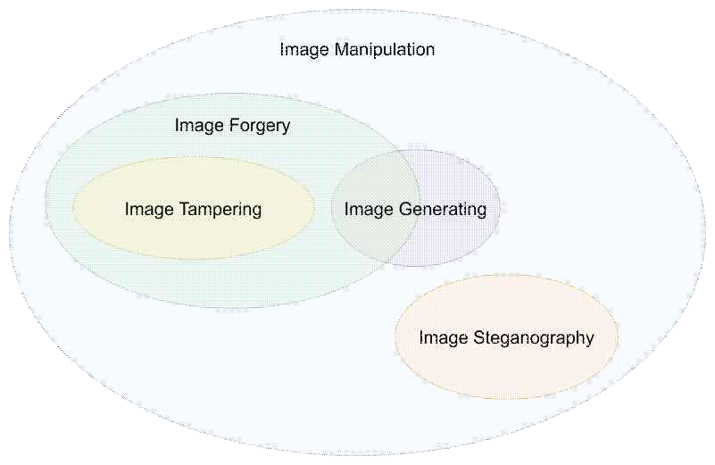 style="width:3.30489in;height:2.14932in" /> style="width:4.09375in;height:4.125in" />(Christlein, Riess, Jordan,
> Riess, & Angelopoulou, 2012; Hossain, Dagi
>
> uklas & Skodras, 2023). Erase-fill은 이미지 내의 특정 객체나 영역을
>
> 지우고 그 부분을 주변 환경에 맞게 채워 넣음으로써 이미지를 조작하
>
> 는 기술이다(Hossain, Dagiuklas & Skodras, 2023).
>
> \[그림 2-1\] 이미지 조작의 하위 범주
>
> 2\. 이미지 조작의 탐지 기법
>
> 이미지 조작을 탐지하기 위해 Noise analysis(Fan, Cao & Kot, 2013),
>
> Error Level Analysis(Azhan, Ikuesan, Razak & Kenbande, 2022), Prin
>
> cipal Component Analysis(Zimba & Xingming, 2011), Luminance Grad
>
> \- 10 -
>
> ient(Cai, 2016) 등과 같은 이미지 처리 기술 기반의 연구가 꾸준히 진행
>
> 되고 있다. 최근에는 딥러닝 기반으로 이미지 조작을 탐지하는 연구가
>
> 진행되고 있다(Rao & Ni, 2016). Deep fake 기술 악용 사례가 증가하면
>
> 서 조작된 얼굴 이미지를 탐지하는 연구들이 진행되고 있으며(Wang, Li
>
> u, Cao & Chow, 2022), Rossler et al.(2019)는 표정을 바꾸거나 얼굴을
>
>  style="width:4.09375in;height:4.125in" />교체하는 Face Expression과
> Face Swap을 딥러닝에 기반하여 탐지하는
>
> 연구를 발표하였다. Bappy et al.(2017)는 하이브리드 CNN-LSTM 모델
>
> 을 사용하여 조작된 영역의 주요 특성인 픽셀 경계의 불일치를 통해 조
>
> 작된 영역과 조작되지 않은 영역을 구분하여 이미지 조작을 탐지해 내
>
> 는 기법을 제시하였다.
>
> 이미지의 그래픽적 특징을 통한 조작 탐지 방식이 아닌, 이미지의 파
>
> 일 포맷이 지닌 특징을 통해 조작 및 이미지 출처 식별에 주목한 연구
>
> 도 존재한다. 특히, 가장 보편적으로 사용되는 손실 압축 방식인 JPEG
>
> 파일 포맷의 특징을 통해 촬영 기기나 촬영 및 편집에 사용된 애플리케
>
> 이션을 탐지하는 방법이 연구되고 있다. JPEG 이미지 생성 과정에서 이
>
> 미지 자체와 이미지 썸네일에 생성되는 DQT(Define Qunatizaion Tabl
>
> e)를 종합 분석하여 이미지를 촬영한 단말기, 저장에 사용한 애플리케이
>
> 션 등을 식별할 수 있다는 것을 확인하였다(김민식, 정두원 & 이상진, 2
>
> 016). JPEG 압축 알고리즘을 분석하여 이미지를 유포한 기기에 따른 M
>
> MS 및 메신저 이미지의 처리 과정을 분석하여 이미지 유포에 사용된
>
> 애플리케이션 및 기기 제조사를 특정하는 연구가 진행되었다(허욱, 김소
>
> 람, 박은후, 신수민 & 김종성, 2020).
>
> 선행연구는 이미지 분석에만 초점을 두어 주로 메타데이터나 이미지
>
> 의 압축 알고리즘을 통해 출처를 식별하는 데 주목한다. 그러나 파일에
>
> \- 11 -
>
> 기록되는 정보 자체에만 주목하기 때문에 디지털 포렌식 관점에서 이미
>
> 지 조작 행위를 탐지하기 위한 포괄적인 조사 방식을 제시하지 못한다
>
> 는 한계가 있다.
>
> 본 논문에서는 알고리즘의 개발과 운용을 위해 필요한 자원이 딥러닝
>
> 에 기반한 방법론에 비해 상대적으로 적은 방식을 우선적으로 고려하며,
>
>  style="width:4.09375in;height:4.125in" />디지털 포렌식의 특수성을
> 고려하여 포괄적인 이미지 조작 행위 탐지를
>
> 위한 포렌식 조사 절차를 제안한다.
>
> \- 12 -
>
> 제3장 이미지 조작 행위 탐지를 위한 아티팩트 분석
>
> 제1절 실험 설계
>
> 이미지 조작 행위 탐지를 위한 이미지 파일 분석과 모바일 포렌식 아
>
>  style="width:4.09375in;height:4.125in" />티팩트 분석을 위해 이미지
> 편집 도구를 활용하여 조작된 이미지를 생
>
> 성한다. 조작을 위해 선정한 이미지 편집 도구는 2022년 07월 기준 구글
>
> 플레이스토어에 등록된 객체지우기(Object Removal) 또는 배경지우기(B
>
> ackground Removal) 편집 기능을 제공하는 애플리케이션 중, 평점 4.0
>
> 이상이며 다운로드 100만회 이상인 애플리케이션 10종과 삼성 갤럭시에
>
> 서 기본적으로 제공하는 포토에디터 1종으로 구성된다. 11종의 애플리케
>
> 이션 중, 7종은 객체지우기를 사용하였으며, 나머지 4종을 통해서는 배
>
> 경지우기 기능을 사용하여 조작된 이미지를 생성한다. \<표 3-1\>은 선정
>
> 한 이미지 편집 도구에 관한 정보를 제공하며, 각 애플리케이션의 명칭,
>
> 판매자명, 버전, 패키지명, 사용된 조작 기능에 대한 내용을 담고 있다.
>
> 앞서 언급된 ‘패키지명’이란, 안드로이드에서 애플리케이션을 식별하고
>
> 관리하는 데 사용되는 고유 이름으로, 본 연구에서는 모바일 포렌식 아
>
> 티팩트 분석 시, 특정한 이미지 편집 도구와 관련된 아티팩트 추출을 위
>
> 해 해당 정보가 사용된다.
>
> 조작된 이미지 생성 시, 이미지 편집 도구별로 이미지 저장 과정에서
>
> 제공해주는 후처리 기능과 저장 방식을 고려한다. 도구별로 이미지를 저
>
> 장하는 과정에서 이미지의 크기나 파일 포맷을 설정하거나 이미지를 저
>
> 장하는 방식을 설정할 수 있도록 후처리 기능과 저장 방식이 제공된다.
>
> 이를 고려하는 이유는 이미지 설정값에 따라 이미지에 남는 메타데이터
>
> \- 13 -
>
> 와 이미지를 표현하기 위한 구성값들이 달라지기 때문이다. \<표 3-2\>는
>
> 각 도구에서 편집된 이미지를 저장하는 과정에서 고려한 후처리 기능과
>
> 저장 방식, 그리고 해당 설정값을 모두 고려하였을 때 생성된 총 이미지
>
> 샘플의 개수를 보여준다. 본 연구에서의 해당 설정값은 갤럭시 S10e(안
>
> 드로이드 12)로 촬영한 11장의 원본 이미지에 대하여, 각 이미지 편집
>
>  style="width:4.09375in;height:4.125in" />도구로 원본 이미지를 편집한
> 후 저장하는 과정에서 고려된다.
>
> \[그림 3-1\]과 \[그림 3-2\]는 조작된 이미지 생성에 활용되는 11장의 원
>
> 본 이미지를 기반으로, 제거한 대상이 되는 객체와 배경을 표시한 것이
>
> 다. 본 연구에서 생성한 조작된 이미지 데이터셋과 각 이미지의 저장 방
>
> 식에 대한 구체적인 정보를 담은 파일은 Github repository3)에서 다운로
>
> 드 가능하다.
>
> 3\) https://github.com/allinonee/Manipulated-Image-Dataset
>
> \- 14 -

> \<표 3-1\> 이미지 편집 도구 정보
>
> \- 15 -

> \<표 3-2\> 조작된 이미지 생성 시 고려한 후처리 기능과 저장 방식
>
> \- 16 -
>
> 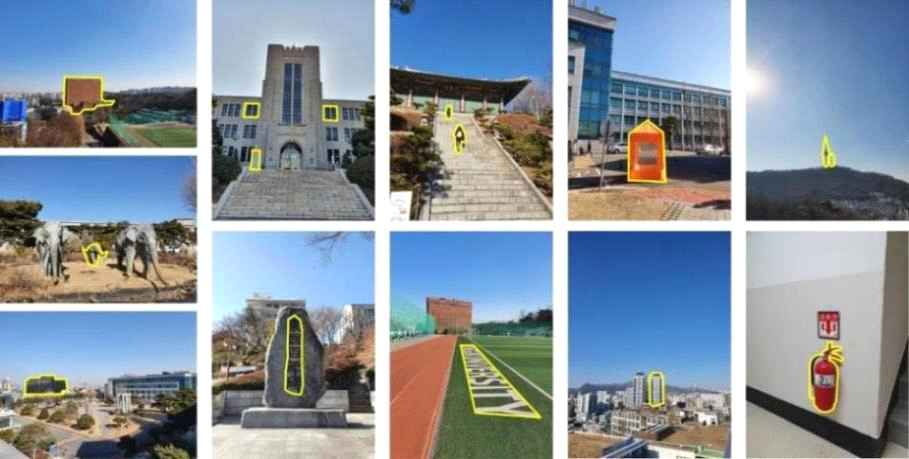 style="width:5.0756in;height:2.55554in" />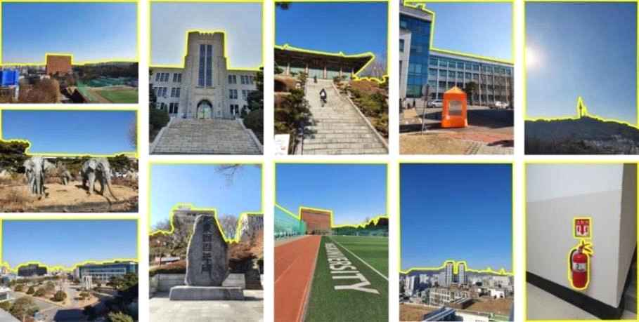 style="width:5.0756in;height:2.55554in" /> style="width:4.09375in;height:4.125in" />\[그림 3-1\] 조작된 이미지
> 생성을 위해 제거한 객체 영역
>
> \[그림 3-2\] 조작된 이미지 생성을 위해 제거한 배경 영역
>
> \- 17 -
>
> 제2절 이미지 파일 분석
>
> 본 연구는 디지털 이미지 처리에 널리 사용되는 표준 이미지 파일 포
>
> 맷인 JPEG을 연구대상으로 하며, JPEG 파일 포맷을 분석하여 이미지의
>
> 메타데이터를 통해 조작을 탐지하도록 한다.
>
> 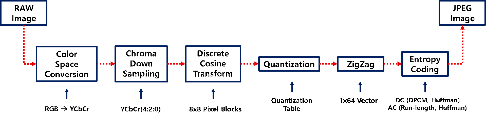 style="width:5.11558in;height:1.29192in" /> style="width:4.09375in;height:4.125in" />1. JPEG 파일 포맷
>
> JPEG(Joint Photographic Experts Group)은 높은 압축률과 이미지 품
>
> 질을 유지하는 손실 압축 방식의 이미지 파일 형식이다. 이는 대부분의
>
> 브라우저, 소프트웨어, 애플리케이션 등에 호환되며 가장 보편적인 이미
>
> 지 파일 포맷으로 사용된다. \[그림 3-3\]은 JPEG 이미지의 압축 프로세
>
> 스를 보여준다.
>
> \[그림 3-3\] JPEG 압축 프로세스
>
> JPEG은 이미지의 색 공간을 RGB 컬러모델에서 YCbCr 컬러모델로
>
> 변환한다. RGB 컬러모델은 빨강(R), 초록(G), 파랑(B) 세 가지 기본 색
>
> 을 조합하여 색을 표현하는 방식이며, YCbCr 컬러모델은 밝기 정보(Y),
>
> 색상 정보(Cb, Cr)을 분리하여 표현하는 방식이다. 이렇게 분리된 구조
>
> \- 18 -
>
> 는 압축을 용이하게 하며, JPEG은 해당 컬러모델을 사용하여 이미지를
>
> 압축한다. 변환 이후 이미지의 색상 데이터를 줄이고 압축률을 향상시키
>
> 기 위해 Chroma Down Sampling 과정을 거친다. 이때, 밝기 정보를 나
>
> 타내는 Y 성분은 그대로 두고, 색상 정보를 나타내는 Cb와 Cr을 특정
>
> 비율에 따라 줄여나간다. 이 비율은 ‘샘플링할 픽셀 블록 너비(높이는 2
>
>  style="width:4.09375in;height:4.125in" />로 고정) : 첫 번째 행에서
> 추출할 색상 정보 샘플 개수 : 두 번째 행에
>
> 서 추출할 색상 정보 샘플 개수’로 표현된다. 4:4:4 비율은 모든 픽셀에
>
> 서 모든 색상의 정보를 보존하여 압축이 수행되지 않는다. 4:2:2 비율은
>
> 각 픽셀 행에서 번갈아가며 Cb와 Cr 색상 정보를 선택하여 압축이 이루
>
> 어진다. 4:2:0 비율은 픽셀의 첫 번째 행에서만 Cb와 Cr 색상 정보를 번
>
> 갈아 선택하여 압축이 수행된다.
>
> 그다음, 이미지는 DCT(Discrete Cosine Transform)를 통해 작은 크기
>
> 의 블록으로 분할되며 주파수 구성 요소를 얻는다. 이 과정에서 이미지
>
> 는 저주파 성분과 고주파 성분으로 나타나게 된다. 저주파 성분은 이미
>
> 지의 전체적인 밝기를 결정하는 중요한 정보인 DC 계수로 표현되며, 고
>
> 주파 성분은 눈에 띄지 않는 세부 정보인 AC 계수로 표현된다. 이후 D
>
> QT(Define Quantization Table)를 활용한 양자화 과정을 통해 이미지에
>
> 서 중요하지 않은 정보를 제거하고, 해당 데이터를 1차원 배열로 변환하
>
> 는 ZigZag Scanning 과정을 거친다. 양자화된 DC 계수는 DPCM(Differ
>
> ential Pulse Code Modulation)과 Huffman Coding을 통해 부호화되며,
>
> AC 계수는 Run-Lenth Encoding과 Huffman Coding을 통해 부호화된
>
> 다. 이러한 과정을 통해 데이터의 중복을 제거하여 압축된 JPEG 파일을
>
> 생성하며, 생성된 JPEG 파일은 일반적으로 \<표 3-3\>과 같은 내부 구조
>
> 를 갖는다.
>
> \- 19 -

> 이미지 파일 분석에서는 이미지와 관련한 메타데이터를 저장하는 Exif
>
> 정보와 이미지 압축에 사용되는 양자화 테이블인 DQT를 활용하여 이미
>
> 지의 조작 여부를 식별하도록 한다.
>
> \<표 3-3\> JPEG 파일 포맷 내부 구조
>
> \- 20 -
>
> 가. Exif (Exchangeable Image File Format)
>
> Exif(Exchangeable Image File Format)는 이미지 파일에 포함된 메타
>
> 데이터로, 디지털카메라나 스마트폰 등 디지털 기기로 촬영된 사진에 대
>
> 한 세부 정보를 포함한다(이상훈 & 김수연, 2018). 이러한 정보는 이미
>
>  style="width:4.09375in;height:4.125in" />지가 생성된 날짜, 촬영 위치
> 정보, 촬영에 사용된 기기에 대한 정보 등
>
> 이 포함된다. 이미지 편집 도구로 편집된 이미지는 해당 도구를 식별할
>
> 수 있는 시그니처를 Exif 정보에 남기게 되며, 이는 이미지 조작을 식별
>
> 할 수 있게 한다. 본 연구에서는 \<표 3-4\>와 같이 선정한 4개의 애플리
>
> 케이션에서 편집을 식별할 수 있도록 하는 관련 시그니처를 확인할 수
>
> 있었다.
>
> 이와 같이 Exif 정보를 통해 이미지의 마지막 출처나 편집 여부를 확
>
> 인할 수 있지만, 해당 정보를 삭제하거나 수정하는 기술을 통해 쉽게 조
>
> 작이 가능하다는 단점이 존재한다.
>
> \<표 3-4\> Exif 정보에 남아있는 애플리케이션 시그니처
>
> \- 21 -
>
> 나. DQT (Define Quantization Table)
>
> DQT(Define Quantization Table)는 이미지의 압축률을 결정하는 양자
>
> 화 테이블이다. 이 테이블은 파일 포맷 내에서 8x8 크기의 정수 배열로
>
> 표현되며, DCT를 수행한 결과로 나온 8x8 픽셀 블록의 계수를 양자화
>
>  style="width:4.09375in;height:4.125in" />하는데 사용된다. 이를 통해
> DCT 계수가 작아지고 이미지 데이터를 압
>
> 축할 수 있게 된다. JPEG 파일에서는 일반적으로 밝기(Luminance)와
>
> 색상(Chrominance)의 양자화를 위한 2개의 DQT를 포함하고 있다.
>
> DQT는 카메라 모델 및 제조사에서 파생될 수 있는 고유한 디지털 식
>
> 별자로 활용된다(Kornblum, 2008; Dohyun, Yunho & Sangjin, 2018). 이
>
> 러한 특성은 이미지 편집 도구를 식별하는 데에도 적용할 수 있다. 이미
>
> 지 편집 도구는 특정 DQT를 사용하여 파일 크기를 줄이거나 저장된 이
>
> 미지의 품질을 최적화 하는데, 이는 이미지의 마지막 출처를 식별하거나
>
> 이미지가 조작 되었는지의 여부를 판단하는 기준으로 활용될 수 있다.
>
> \<표 3-5\>는 각 애플리케이션이 제공하는 밝기와 색상 정보에 대한 DQ
>
> T를 나타낸다. 대부분의 애플리케이션은 하나의 고유한 DQT를 사용하
>
> 는 것이 아닌, 여러 종류의 DQT를 사용하고 있음을 식별하였으며, 밝기
>
> 와 색상에 대한 동일한 DQT를 사용하는 경우가 빈번히 나타나고 있음
>
> 을 확인하였다. 이러한 패턴은 이미지 조작을 탐지하는 데 유용하게 활
>
> 용될 수 있다. 예를 들어, 대규모 이미지 데이터셋에서 조작된 이미지를
>
> 식별할 경우, 특정 DQT 패턴이 나타난다면 해당 이미지가 조작되었을
>
> 가능성이 높다는 판단할 수 있게 된다. 또한, DQT는 삭제와 수정이 상
>
> 대적으로 쉬운 Exif 정보를 보완하여 활용될 수 있는 중요한 정보가 된
>
> 다.
>
> \- 22 -

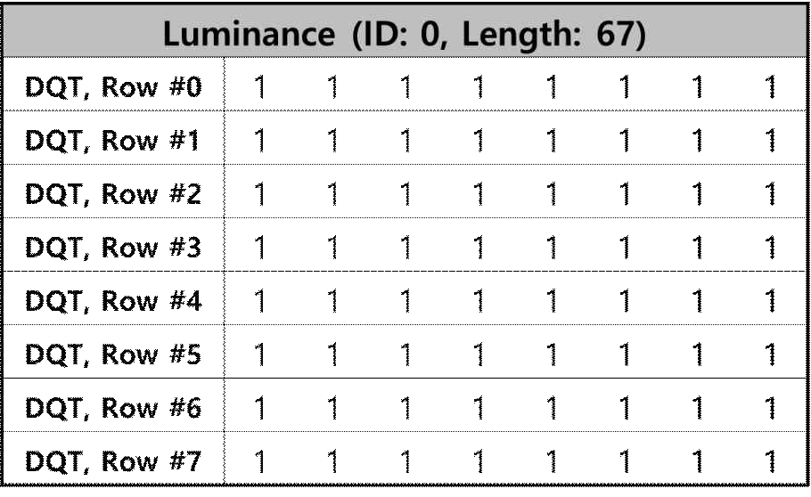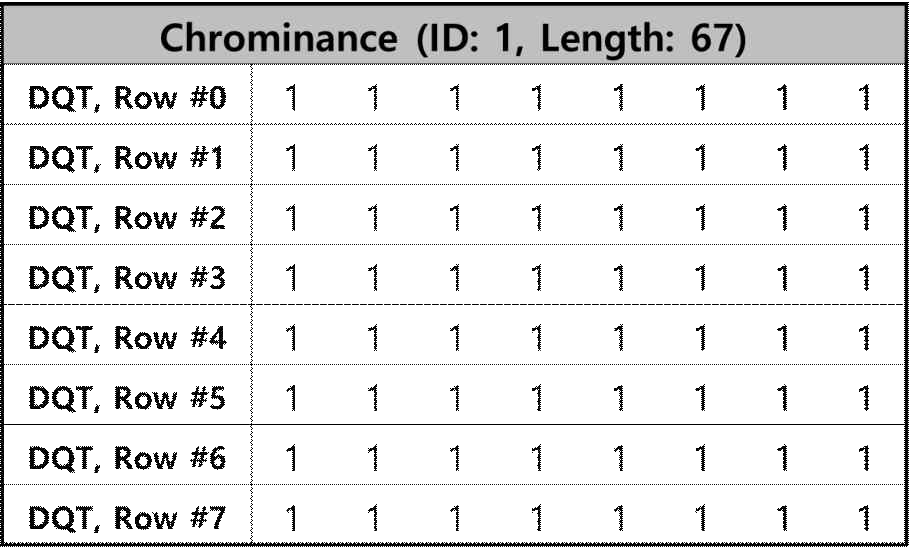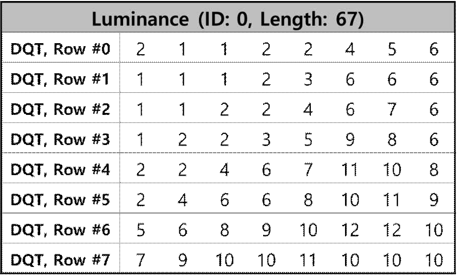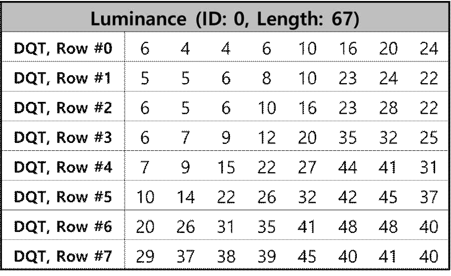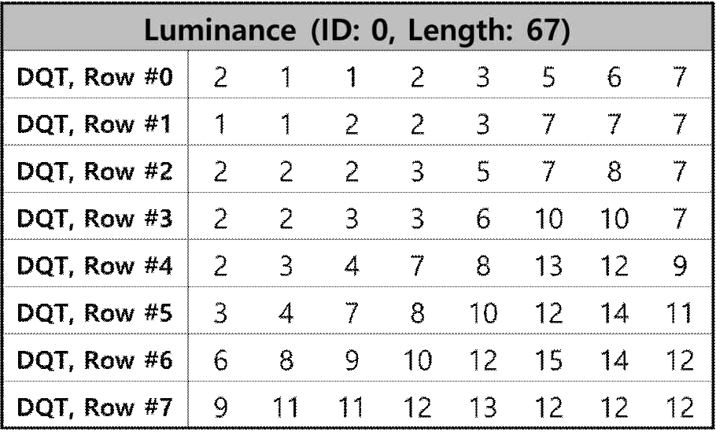

> \<표 3-5\> 이미지 편집 도구가 사용하는 DQT
>
> \- 23 -

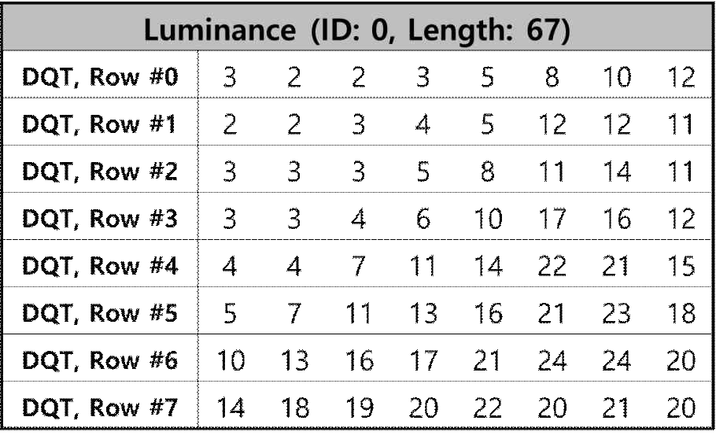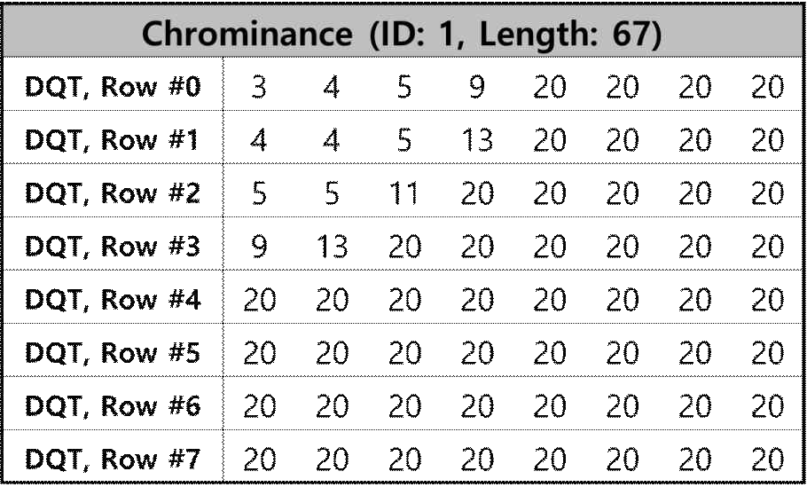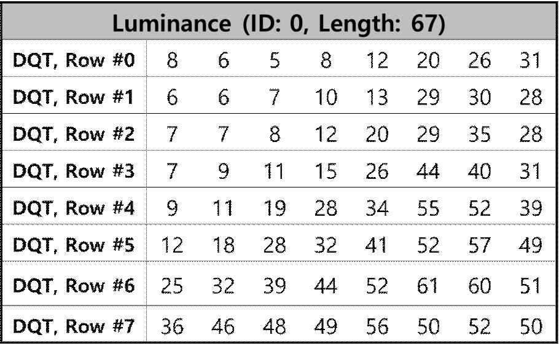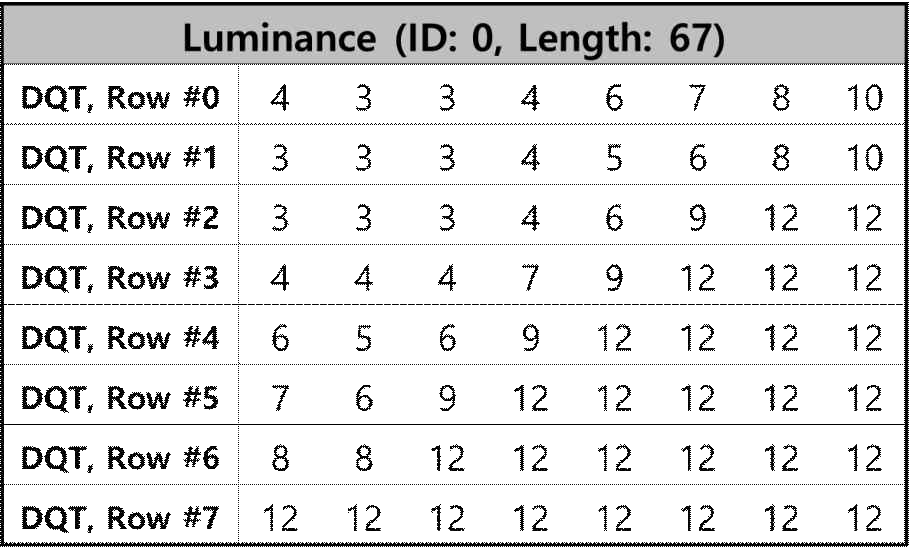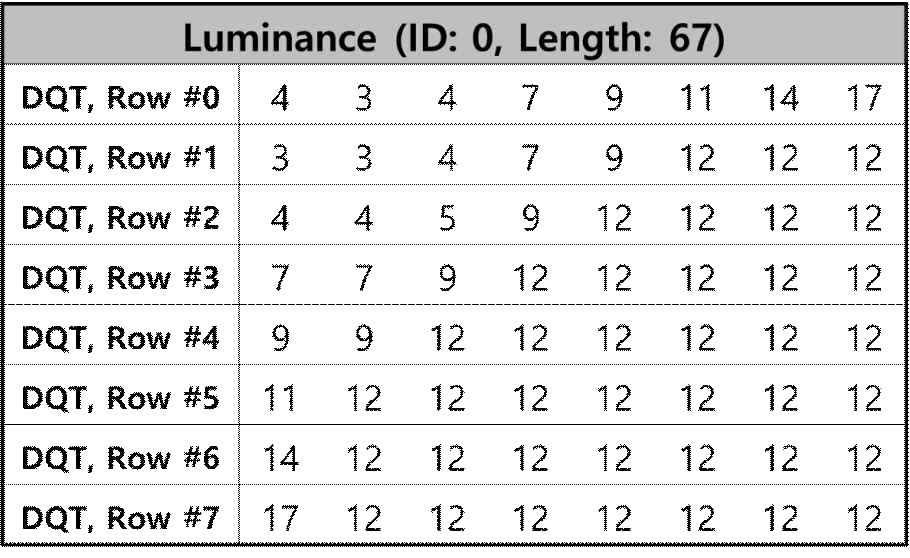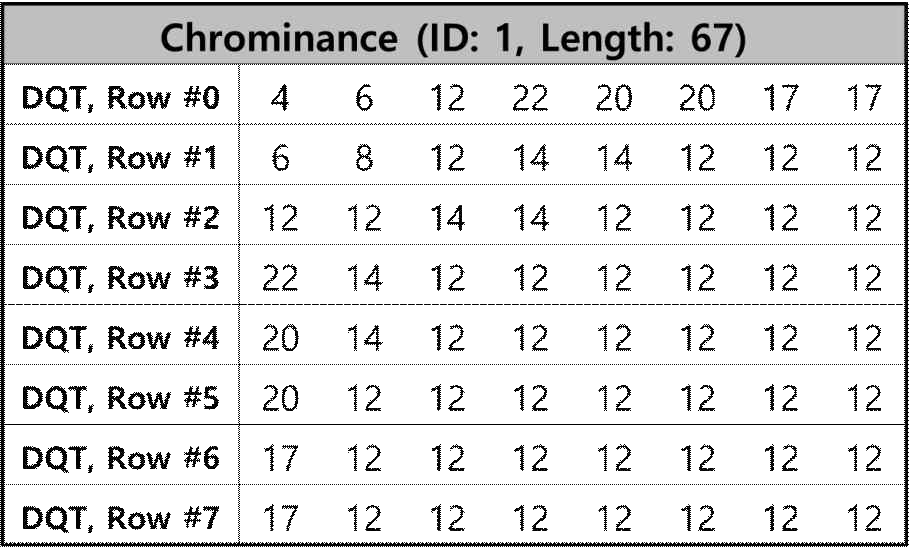

> \- 24 -
>
> 2\. Filename Signature
>
> 본 연구에서는 조작에 사용된 이미지 편집 도구를 식별할 수 있도록
>
> 편집된 이미지의 파일명을 분석한다. \<표 3-6\>은 이미지 편집 도구별
>
> 저장 방식에 따른 파일명 분석 결과를 보여준다. 편집 이미지의 파일명
>
>  style="width:4.09375in;height:4.125in" />은 대부분 파일의 생성일자를
> 포함하고 있으며, 편집에 사용된 원본 이
>
> 미지의 파일명, 이미지 편집 애플리케이션의 시그니처 등을 포함하고 있
>
> 다. 파일명은 상대적으로 쉽게 변경할 수 있어, 해당 정보만으로 포렌식
>
> 을 수행하는 것에 한계가 있다. 그러나 파일명이 보존되고 있는 경우,
>
> 편집 도구가 생성하는 특유의 파일명은 조작 행위 탐지를 위한 단서로
>
> 작용할 수 있다.
>
> \<표 3-6\> 편집된 이미지 파일명 분석
>
> \- 25 -
>
>  style="width:4.09375in;height:4.125in" />3. Reference Database
>
> 이미지 조작을 판별하는 기준으로 사용되는 데이터베이스인 Reference
>
> DB는 JPEG 파일의 메타데이터인 Exif 정보와 DQT, Filename Signatu
>
> re를 종합적으로 고려하여 이미지 조작 및 마지막 출처를 식별하기 위
>
> 해 생성된다.
>
> Reference DB에는 조작된 이미지의 Exif 정보와 DQT를 파싱하여 얻
>
> 은 데이터가 삽입된다. 또한 조작된 이미지 파일명에 \<표 3-6\>에서 식
>
> 별한 편집 도구의 시그니처가 포함되는 경우, 이미지의 마지막 출처 식
>
> 별을 위해 해당 시그니처를 데이터베이스에 삽입한다.
>
> \- 26 -
>
> \[그림 3-4\]는 Reference DB의 구조를 나타내는 스키마를 보여준다. 이
>
> 는 데이터베이스에 저장되는 정보의 구조와 관계를 시각적으로 표현한
>
> 것으로, 3개의 테이블로 구성된다. Image_Editors 테이블은 이미지 편집
>
> 도구의 이름과 해당 도구의 버전을 저장하는 참조 테이블 역할을 수행
>
> 한다. 이미지 편집 도구의 버전에 따라 이미지의 메타데이터가 변경될
>
> 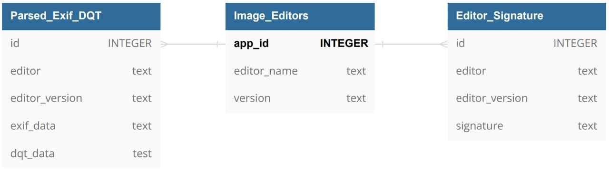 style="width:4.67749in;height:1.38349in" /> style="width:4.09375in;height:4.125in" />수 있기 때문에, 해당 테이블은
> 각 이미지 편집 도구에 따른 버전을 명
>
> 시한다. Parsed_Exif_DQT 테이블은 이미지 편집 도구별 Exif 정보와 D
>
> QT를 저장한다. Exif 정보의 경우 exiftool을 활용하여 애플리케이션의
>
> 시그니처를 남기는 정보를 파싱해 삽입하며, DQT의 경우 JPEG 이미지
>
> 에서 DQT의 헤더 시그니처(0xFFDB)를 통해 파싱한 후 MD5 해시를
>
> 적용해 삽입하도록 한다. Editor_Signature 테이블은 이미지 파일명에
>
> 이미지 편집 도구의 시그니처를 남기는 경우 해당 정보를 삽입하도록
>
> 한다.
>
> 본 연구에서 Exif 정보와 DQT의 자동화된 파싱 및 DB 삽입을 위해
>
> 개발한 DQT Parser와 이미지 조작을 판별하는 기준이 되는 Reference
>
> DB에 대한 정보는 GitHub repository4)에서 확인할 수 있다.
>
> \[그림 3-4\] Reference DB 스키마
>
> 4\) https://github.com/allinonee/DQT-Parser
>
> \- 27 -
>
> 제3절 모바일 포렌식 아티팩트 분석
>
> 본 절에서는 이미지 조작 행위 탐지를 위한 이미지 편집 도구 아티팩
>
> 트 분석을 수행과 더불어 사용자의 안티포렌식 행위를 추적하기 위한
>
> 갤러리 애플리케이션 및 안드로이드 시스템 아티팩트 분석을 수행한다.
>
>  style="width:4.09375in;height:4.125in" />1. 이미지 편집 도구 아티팩트
>
> 가. 이미지 조작 행위 식별 정보
>
> 이미지 편집 도구 아티팩트 분석을 통해 이미지 조작 행위와 관련하
>
> 여 어떠한 정보를 획득 및 고려할 수 있는지 확인한다.
>
> 먼저 ‘편집된 이미지 존재 여부’이다. 편집된 이미지는 편집 후 갤러리
>
> 에 저장된 이미지가 아닌, 이미지 편집 도구의 앱 데이터가 저장된 경로
>
> 에 존재하는 애플리케이션 자체가 남기는 아티팩트를 의미한다. 애플리
>
> 케이션에서 이미지를 편집하면 자동으로 갤러리에 저장되지만, 이를 삭
>
> 제할 경우 이미지는 확인할 수 없게 된다. 따라서 이미지 삭제 시에도
>
> 편집된 이미지를 확인할 수 있다면 이는 안티포렌식 행위에 대응할 수
>
> 있는 유의미한 정보가 된다. 두 번째는 ‘편집된 영역 식별 가능 여부’이
>
> 다. 디지털 이미지가 증거로 사용될 경우, 조작된 영역을 정확히 확인할
>
> 수 있다면 이는 조작 행위 식별에 유용한 정보가 된다. 세 번째는 ‘편집
>
> 에 사용된 원본 이미지 확인 가능 여부’이다. 편집에 사용된 원본 이미
>
> 지가 무엇이었는지 식별할 수 있는 정보가 되며, 편집된 이미지와의 그
>
> 래픽적 유사성을 비교함으로써 원본 이미지에서 편집된 이미지가 파생
>
> \- 28 -
>
> 되었는지 여부를 판단할 수 있게 된다.
>
> 네 번째는 ‘편집 로그 존재 여부’이다. 이는 특정 이미지를 편집하였을
>
> 때, 편집을 시작 및 종료한 시간과 편집 방법, 편집 이후의 결과물 등에
>
> 대한 정보를 파악할 수 있도록 한다. 특히 편집 로그는 사용자 행위에
>
> 대한 구체적인 정보를 기록하므로, 조작 행위 식별을 위한 아티팩트 분
>
>  style="width:4.09375in;height:4.125in" />석 과정에서 매우 유용한
> 정보로 작용한다. 다음은 ‘이미지 캐싱 여부’이
>
> 다. 주로 애플리케이션에서는 앱 자체에서 사용되는 이미지 또는 사용자
>
> 의 이미지를 임시로 저장하여 사용자가 애플리케이션을 실행할 때마다
>
> 빠르게 검색 및 사용할 수 있도록 한다. 이는 성능 향상과 용량 문제 해
>
> 소 등을 위해 시행된다. 캐싱된 이미지는 안티포렌식 행위를 식별하는
>
> 데 활용될 수 있다. 이미지 편집 도구는 사용자가 편집한 이미지를 갤러
>
> 리에 저장하기 위해 권한을 요청하며, 이는 이미지 저장을 위한 필수 단
>
> 계가 된다. 따라서 캐시에는 애플리케이션에서 쓰이는 이미지뿐만 아니
>
> 라 사용자의 기본 갤러리에 저장되어있는 이미지도 포함되어, 사용자가
>
> 갤러리에서 이미지를 삭제하더라도 캐시를 통해 해당 이미지가 존재했
>
> 음을 확인할 수 있다.
>
> 본 연구에서는 ‘계정 정보, 설치시간, 최근 사용 시간’을 추가적으로 확
>
> 인함으로써 이미지 조작 행위 식별에 도움이 될 수 있도록 하였다. 이미
>
> 지 조작 행위 식별 정보를 기준으로 도구별 아티팩트 분석을 통해 식별
>
> 할 수 있는 종합적인 분석 결과는 \<표 3-7\>과 같다.
>
> \- 29 -

> \<표 3-7\> 이미지 편집 도구 아티팩트 분석 결과 (△ : 가장 최근에 편집된
> 기록만 확인 가능)
>
> \- 30 -

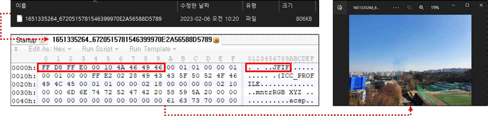

> 나. 이미지 편집 도구 아티팩트 분석
>
> 안드로이드의 ‘/data/data/\[package_name\]/’ 경로는 특정 패키지명을
>
> 가진 앱의 데이터가 저장되는 경로로 앱의 설정, 로그, 캐시, 데이터베이
>
> 스 등이 저장된다. 본 연구에서는 11개의 이미지 편집 도구로 편집을 진
>
>  style="width:4.09375in;height:4.125in" />행한 후, 위 경로를 추출하여
> 분석을 진행한다. 위 경로 외에도 유의미
>
> 한 데이터를 포함하는 경우, 추가적인 분석을 진행한다.
>
> 1\) 편집된 이미지 (Edited Image)
>
> 11개 애플리케이션 중, 5개의 애플리케이션에서 편집된 이미지를 확인
>
> 할 수 있었다. Snapseed의 경우, \[그림 3-5\]와 같이 임의의 숫자로 되어
>
> 있는 파일을 JPEG 시그니처 식별을 통해 확장자를 변경해줌으로써 확
>
> 인할 수 있으며, Meitu와 Background Eraser(Inshot)의 경우 외부 저장
>
> 소(External Storage)인 ‘/storage/emulated/0/Android/data/\[package_na
>
> me\]’ 경로에서 확인할 수 있었다. 또한 SnapEdit와 Background Eraser
>
> (Inshot)는 가장 최근에 편집한 이미지만을 확인할 수 있었으며, Photo
>
> Studio는 편집에 대한 설정과 작업 내용을 임시 저장해주는 기능을 사
>
> 용할 경우, 편집된 이미지를 남기는 것을 확인할 수 있었다.
>
> \[그림 3-5\] JPEG 시그니처 식별을 통한 편집 이미지 식별
>
> \- 31 -
>
> 2\) 조작된 영역 (Manipulated region)
>
> 대부분의 애플리케이션에서 조작된 영역을 식별할 만한 아티팩트를
>
> 남기지 않았다. 그러나 SnapEdit의 경우 \[그림 3-6\]의 좌측과 같이 객체
>
> 제거를 위해 사용자가 제거한 영역에 대한 Mask를 남기는 것을 볼 수
>
> 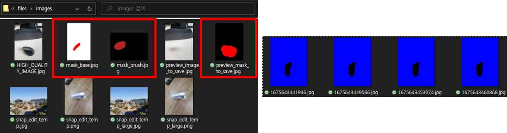 style="width:5.11225in;height:1.34519in" /> style="width:4.09375in;height:4.125in" />있었으며, Photo Studio에서도
> 우측과 같이 ‘(편집시간정보).jpg’로 가장
>
> 최근에 편집한 이미지에 대해서 Mask를 저장하고 있는 것을 확인할 수
>
> 있었다. 이는 사용자가 어떠한 객체나 영역을 지우고 남겼는지에 대한
>
> 행위 정보를 명확히 식별할 수 있도록 한다.
>
> \[그림 3-6\] Mask를 통한 조작된 영역 식별
>
> 3\) 원본 이미지 (Original Image)
>
> 11개 애플리케이션 중, 8개 애플리케이션에서 편집에 사용된 원본 이
>
> 미지를 확인할 수 있었다. 대부분 패키지가 저장되는 경로에 원본 이미
>
> 지가 존재하였으나, Meitu와 Background Eraser(Inshot)의 경우에는 외
>
> 부 저장소에서 확인할 수 있었다. Samsung PhotoEditor 또한 특정 경로
>
> 에서 원본 이미지를 확인할 수 있었다. 해당 에디터는 원본 파일 자체에
>
> \- 32 -
>
> 편집된 설정을 덮어씌워 편집된 이미지만을 저장하도록 하는 ‘저장’과
>
> 편집된 이미지를 원본 이미지와 별개의 파일로 저장하도록 하는 ‘다른
>
> 파일로 저장’ 두 가지의 저장 방식을 지원한다. 일반적으로 ‘저장’ 기능
>
> 을 사용할 경우, \[그림 3-7\]과 같이 원본 복원(Revert)을 통해 편집하기
>
> 전의 원본 상태로 이미지를 복원할 수 있다. 이때 원본 이미지는 ‘data/s
>
> 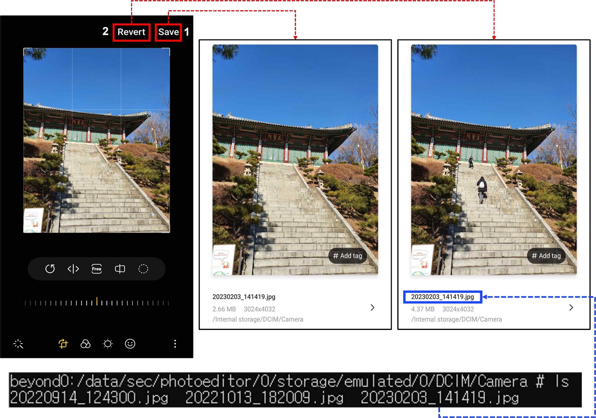 style="width:4.65917in;height:3.27142in" /> style="width:4.09375in;height:4.125in" />ec/photoeditor/0/storage/emulated/0/DCIM/Camera/(원본파일명)’
> 경로에
>
> 저장된다. Samsumg PhotoEditor는 삼성 스마트폰에 기본으로 탑재된
>
> 사진 편집 애플리케이션으로, 앱 스토어에서 서드파티앱을 다운로드하지
>
> 않고도 사진 편집 작업을 수행할 수 있도록 한다. 이러한 높은 접근성을
>
> 가진 기본 앱에 대한 분석은 모바일 포렌식 조사에 큰 기여를 할 수 있
>
> 다.
>
> \[그림 3-7\] ‘저장’ 기능 사용시 원본 이미지 식별 경로
>
> \- 33 -
>
> 4\) 편집 로그 (Edited Log)
>
> 편집 로그는 이미지 조작 행위를 식별하는 데 중요한 역할을 한다. M
>
> eitu에서는 \[그림 3-8\]과 같이 편집된 이미지의 저장 경로, 사용된 원본
>
> 이미지 파일명, 편집된 이미지 파일명, 편집 시작 시간, 사용한 편집 기
>
> 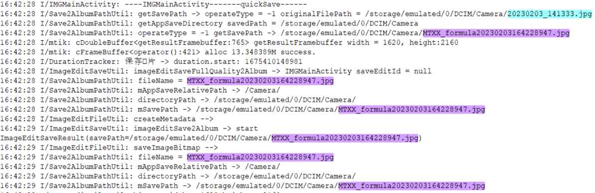 style="width:4.95567in;height:1.61657in" /> style="width:4.09375in;height:4.125in" />능 등이 로그로 기록된다.
> Adobe Photoshop Fix와 Photo Studio는 이미
>
> 지 편집의 과정을 임시 저장하는 프로젝트의 단위로 편집할 경우, 프로
>
> 젝트명, 프로젝트 생성 시간, 수정 시간 등이 로그로 기록된다. Backgro
>
> und Eraser(Inshot)의 경우에도 편집된 이미지 파일명, 편집 시작 시간,
>
> 편집된 이미지 저장 시간 등이 확인 가능하다. 이러한 로그 파일들은 대
>
> 부분 Timestamp를 포함하여 저장되므로, 이미지 조작 행위 식별에 큰
>
> 도움이 된다.
>
> \[그림 3-8\] Timestamp를 포함하여 기록되는 로그(Meitu)
>
> 5\) 이미지 캐싱 (Image caching)
>
> 이미지 편집 도구는 편집 이미지를 갤러리에 저장하기 위해 첫 사용
>
> 시, 사용자에게 접근 권한을 허용할 것인지 묻는다. 허용을 하였을 경우,
>
> \- 34 -
>
> 갤러리에 저장된 이미지도 캐싱이 되어 사용자가 이미지를 삭제하더라
>
> 도 캐시를 통해 갤러리에 존재했던 이미지를 확인할 수 있다. \[그림 3-
>
> 9\]는 캐싱된 이미지가 저장되는 ‘/data/data/\[package_name\]/cache/imag
>
> e_manager_disk_cache/’ 경로에 존재하는 파일을 보여준다. ‘(random_nu
>
> m).0’이라는 파일명으로 존재하는 캐싱된 이미지는 JPEG 시그니처(0xF
>
> 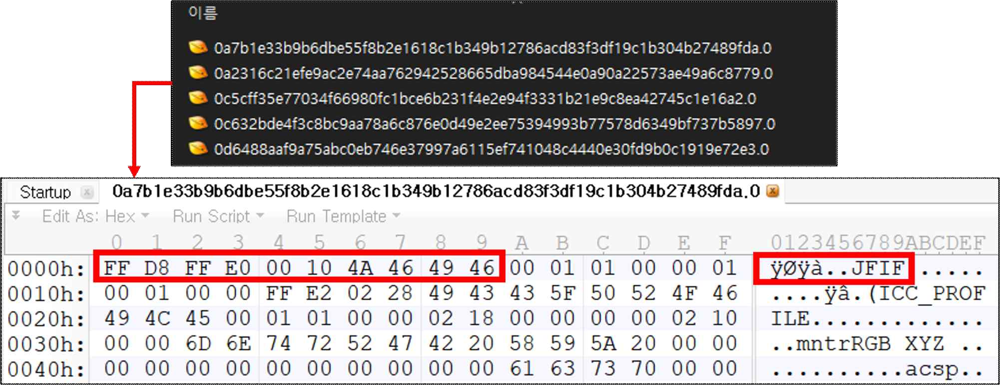 style="width:4.00118in;height:1.54165in" />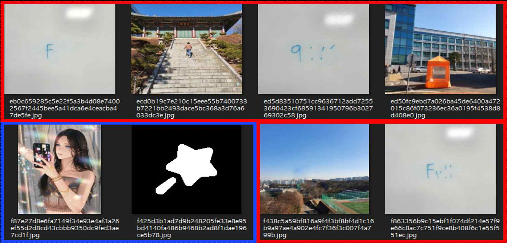 style="width:3.65304in;height:1.75142in" /> style="width:4.09375in;height:4.125in" />FD8)를 가지고 있으며,
> 해당하는 확장자로의 변경을 통해 \[그림 3-10\]과
>
> 같이 앱 자체에서 사용하는 이미지와 갤러리에 저장된 이미지로 구성되
>
> 는 것을 확인할 수 있다. 이는 사용자의 안티포렌식 행위 식별에 유용하
>
> 게 쓰일 수 있다.
>
> \[그림 3-9\] JPEG 시그니처를 가지는 캐시 파일
>
> \[그림 3-10\] 캐싱된 갤러리에 저장된 이미지(빨간선)
>
> \- 35 -
>
> 2\. 갤러리 애플리케이션 아티팩트
>
> 갤러리 애플리케이션 아티팩트 분석을 통해 이미지 삭제 행위에 대한
>
> 정보를 수집하여 안티포렌식 행위를 식별할 수 있도록 한다. 삼성 스마
>
> 트폰에서는 갤러리에서 이미지를 삭제했을 경우, 삭제가 즉시 이루어지
>
>  style="width:5.19387in;height:0.98226in" /> style="width:4.09375in;height:4.125in" />지 않고 ‘휴지통(Trash)’으로
> 이동하게 된다. 이동한 이미지는 약 30일
>
> 동안 보존되며, 이 기간 동안에는 복원(Restore)을 가능하도록 한다. 또
>
> 한 30일 내에 ‘휴지통 비우기(Empty)’를 통해 모든 이미지를 영구 삭제
>
> 할 수 있도록 한다.
>
> ‘/data/data/com.sec.android.gallery3d/’는 삼성 갤러리 애플리케이션과
>
> 관련된 데이터와 설정 파일을 저장하는 경로이다. 이 경로에 포함된 데
>
> 이터베이스(databases/local.db)를 분석함으로써 \[그림 3-11\]과 같이
> 휴지
>
> 통으로 이미지를 이동(MOVE_TO_TRASH_MULTIPLE)하거나 휴지통
>
> 을 비우는 작업(EMPTY_MULTIPLE)과 관련된 로그 정보를 확인할 수
>
> 있다. 또한 \[그림 3-12\]와 같이 갤러리에서 이미지의 미리보기 썸네일을
>
> 저장하는 썸캐시를 확인함으로써 기존에 존재했던 이미지를 확인할 수
>
> 있도록 한다.
>
> \[그림 3-11\] 휴지통 이동, 휴지통 비우기 행위 식별
>
> \- 36 -
>
> 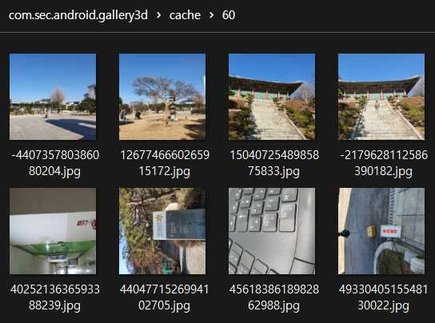 style="width:3.35653in;height:2.22424in" /> style="width:4.09375in;height:4.125in" />\[그림 3-12\] 갤러리 이미지의
> 썸캐시
>
> 3\. 안드로이드 시스템 아티팩트
>
> 안드로이드 시스템 아티팩트 분석을 통해 이미지 편집 도구의 설치
>
> 및 삭제 시간, 실행 및 종료 시간을 추적할 수 있다. 스마트폰 내의 시
>
> 스템 아티팩트는 운영체제에서 이벤트가 발생할 때 기록되는 로그를 나
>
> 타낸다. 이러한 시스템 아티팩트는 사용자가 직접 삭제하거나 변경하기
>
> 어렵기 때문에 포렌식 조사에서 사용자 행위를 분석하는 데 유용하게
>
> 쓰일 수 있다(박은후·강수진·김소람·김종성, 2020; 강예지·김동현·이선경·
>
> 박정흠·이상진, 2021).
>
> ADB의 dumpsys 명령어를 통해 안드로이드 시스템 서비스에 대한 진
>
> 단 로그를 출력할 수 있다5). 특히 dumpsys는 UsageStats와 Activity를
>
> 통해 사용자 행동을 분석할 수 있도록 한다. UsageStats는 애플리케이
>
> 션 사용 통계 정보를 제공하여 사용자의 앱 시작 및 종료 시간, 최근 사
>
> 5\) https://developer.android.com/tools/dumpsys
>
> \- 37 -
>
> 용 시간 등을 기록한다. 패키지명이 ‘com.niksoftware.snapseed’인 애플
>
> 리케이션에 대하여, \[그림 3-13\]은 ACTIVITY_RESUMED와 ACTIVIT
>
> Y_STOPPED를 통해 애플리케이션의 시작 및 종료 행위를 식별할 수
>
> 있음을 보여준다. 더불어, \[그림 3-14\]의 lastTimeUsed를 통해 애플리케
>
> 이션의 최근 사용 시간을 파악할 수 있도록 한다.
>
> 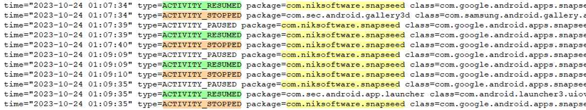 style="width:5.09393in;height:1.14708in" />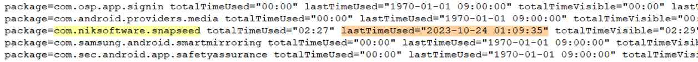 style="width:5.09393in;height:0.611in" /> style="width:4.09375in;height:4.125in" />Activity Broadcast는
> 애플리케이션 삭제 시간을 기록한다. \[그림 3-1
>
> 5\]은 ‘package_removed’를 통해 애플리케이션 삭제 행위를 식별할 수 있
>
> 음을 보여주며, 애플리케이션의 삭제 시간을 추적할 수 있음을 보여준
>
> 다. \[그림 3-16\]은 ‘ApplicationExitInfo’를 통해 애플리케이션의 종료
> 시
>
> 간을 명확하게 식별할 수 있도록 한다.
>
> \[그림 3-13\] UsageStats를 통해 확인한 앱 시작 및 종료 시간
> (ACTIVITY_RESUMED, ACTIVITY_STOPPED)
>
> \[그림 3-14\] UsageStats를 통해 확인한 앱 최근 사용 시간
> (lastTimeUsed)
>
> \- 38 -
>
> 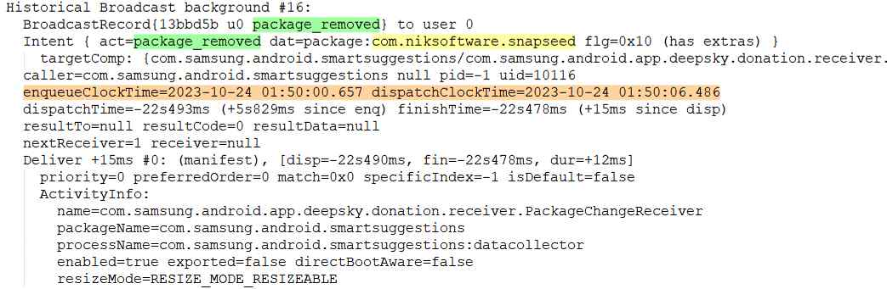 style="width:5.09393in;height:1.78306in" />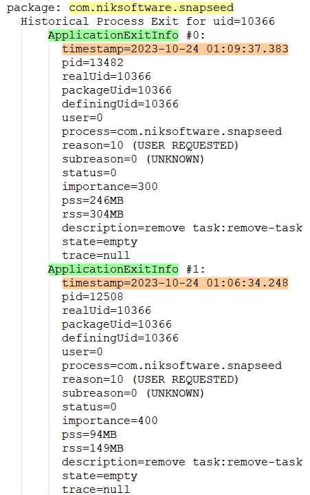 style="width:2.36207in;height:3.48119in" /> style="width:4.09375in;height:4.125in" />\[그림 3-15\] Activity
> Broadcast를 통해 확인한 앱 삭제 시간 (PACKAGE_REMOVED)
>
> \[그림 3-16\] Activity를 통해 확인한 앱 종료 시간
> (ApplicationExitInfo)
>
> \- 39 -
>
> 제4장 이미지 조작 행위 탐지를 위한 포렌식 조사
>
> 제1절 절차
>
> 본 연구에서 제안하는 이미지 조작 행위 탐지를 위한 포렌식 조사 절
>
> 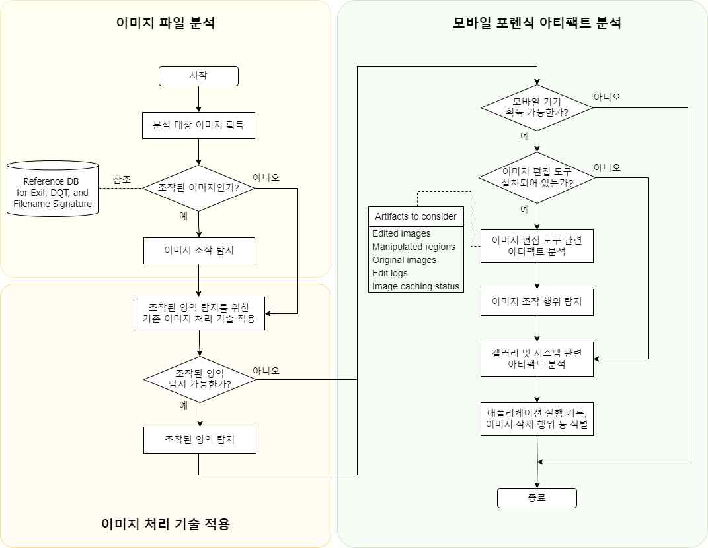 style="width:5.09393in;height:4.46844in" /> style="width:4.09375in;height:4.125in" />차는 \[그림 4-1\]과 같으며,
> 세 단계로 구성된다.
>
> \[그림 4-1\] 이미지 조작 행위 탐지를 위한 포렌식 조사 절차
>
> \- 40 -
>
> 이미지 파일 분석(Image file analysis) 단계에서는 분석 대상 이미지
>
> 를 획득한 후, 이미지의 메타데이터인 Exif 정보, DQT, 그리고 Filenam
>
> e Signature 분석을 위해 조작 탐지의 기준이 되는 Reference DB를 참
>
> 조한다. Reference DB는 조작과 관련한 이미지의 메타데이터가 삽입되
>
> 어 있으며, 이는 분석 대상 이미지의 메타데이터와의 비교를 통해 이미
>
>  style="width:4.09375in;height:4.125in" />지의 조작 여부와 마지막
> 출처를 확인할 수 있도록 한다.
>
> 이미지 처리 기술 적용(Image processing techniques application) 단
>
> 계는 이미지 조작 탐지를 위해 사용되고 있는 기존의 이미지 처리 기법
>
> 의 활용을 의미한다. 조작 탐지에 사용되는 기법으로 Noise Analysis, E
>
> LA(Error Level Analysis), PCA(Principal Component Analysis), Lumin
>
> ance Gradient 등이 있다. 이러한 기술들을 조작된 이미지에 적용함으로
>
> 써 그래픽적인 불규칙성, 불일치를 파악할 수 있으며, 조작으로 인해 변
>
> 형된 영역을 식별할 수 있도록 한다.
>
> 모바일 포렌식 아티팩트 분석(Mobile forensics artifacts analysis) 단
>
> 계에서는 이미지 편집 도구가 설치된 모바일 기기를 임의제출이나 영장
>
> 을 통해 압수하여 획득한 경우, 이미지 편집 도구의 앱 데이터가 저장되
>
> 어있는 경로의 모든 하위 디렉터리에 존재하는 데이터를 추출 및 분석
>
> 함으로써 이미지 조작 행위를 탐지한다. 추가적으로 갤러리 애플리케이
>
> 션 아티팩트와 안드로이드 시스템 아티팩트를 분석함으로써 이미지 삭
>
> 제나 애플리케이션 삭제 행위와 같은 안티포렌식 행위와 관련된 정보를
>
> 식별할 수 있도록 한다.
>
> \- 41 -
>
> 제2절 검증
>
> 본 절에서는 절차에서 제시된 각 기법의 장단점을 검토하고, 기법 간
>
> 의 상호 보완의 필요성에 대한 논의를 진행한다. 또한, 이미지 조작 행
>
> 위와 관련된 가상의 시나리오를 소개하고, 제안하는 이미지 조작 행위
>
>  style="width:4.09375in;height:4.125in" />탐지 절차를 통해 해당
> 시나리오를 분석한다.
>
> 1\. 논의
>
> 이미지 파일 분석과 이미지 처리 기술 적용은 이미지 파일을 대상으
>
> 로 분석을 수행하며, 모바일 포렌식 아티팩트 분석은 모바일 기기를 대
>
> 상으로 분석을 수행한다.
>
> 이미지 파일 분석은 파일의 메타데이터 시그니처를 기반으로 하기 때
>
> 문에 단순하고 빠른 분석이 가능하다는 장점이 있다. 그러나 새로운 애
>
> 플리케이션에 대한 사전 분석이 필요하며, 파일 전송이나 화질 변경과
>
> 같은 재인코딩이 발생하는 경우 메타데이터가 손상될 가능성이 높으며,
>
> 사용자가 쉽게 변경할 수 있는 단점이 있다.
>
> 이미지 처리 기술 적용은 이미지의 그래픽 데이터를 분석하여 파일의
>
> 메타데이터 변경에 대비해 강건한 분석이 가능하며, 더불어 조작된 영역
>
> 에 대해서도 효과적으로 탐지할 수 있는 장점이 있다. \[그림 4-2\]는 Sep
>
> arable Median Filter를 적용한 Noise Analysis를 자동화한 도구를 조작
>
> 된 이미지에 적용한 결과이다. 이를 통해 조작된 영역에서 특정한 노이
>
> 즈 패턴을 식별함으로써 조작 영역을 탐지할 수 있다. 좌측은 원본 이미
>
> 지, 중간은 객체를 지운 조작된 이미지, 우측은 조작된 이미지에 Noise
>
> \- 42 -
>
> analysis를 적용한 결과를 나타낸다. (a)와 (b)는 모두 특정 영역을 지움
>
> 으로써 이미지를 조작한 경우로, (a)에서는 조작된 영역이 그래픽적으로
>
> 탐지되었음을 확인할 수 있지만, (b)에서는 해당 기술로 조작이 탐지되
>
> 지 않는 미탐의 예를 보여준다. 해당 기술은 오탐과 미탐의 가능성이 내
>
> 재되어 있으며, AI의 발전으로 인해 이미지 편집 기술이 더욱 정교해진
>
>  style="width:4.09375in;height:4.125in" />다면 이미지 처리 기술을 통한
> 조작 탐지가 더욱 어려워질 수 있다는
>
> 한계가 있다. 또한, 이러한 정교한 조작 기술은 스마트폰 앱에서 기본적
>
> 으로 제공되는 기능을 통해 쉽게 생성될 수 있어 단점이 더욱 부각될
>
> 수 있다.
>
> 모바일 포렌식 아티팩트 분석은 사용자의 이미지 조작에 대한 행위
>
> 정보를 식별할 수 있도록 한다. 이 과정에서 이미지 조작이 발생한 시간
>
> 과 조작된 영역뿐만 아니라 경우에 따라 조작에 사용된 원본 이미지도
>
> 획득할 수 있다. 이는 조작과 관련된 구체적인 행위 정보를 제공하는 장
>
> 점이 있으나, 분석 대상 이미지의 편집에 사용된 스마트폰을 확보해야
>
> 한다는 점과 해당 앱이 삭제되지 않았을 경우에만 구체적인 정보를 획
>
> 득할 수 있다는 단점이 있다.
>
> 따라서 본 연구에서는 각각의 분석 방식을 하나의 포괄적인 조사 절
>
> 차로 통합함으로써 각 방식의 단점을 상호 보완할 수 있도록 한다. 예를
>
> 들어, 파일의 메타데이터가 손상되거나 변경되더라도 이미지 처리 기술
>
> 을 활용하거나 모바일 포렌식 아티팩트 분석을 통해 이미지 조작을 확
>
> 인할 수 있도록 하며, 이미지 처리 기술로 이미지 조작이 탐지되지 않는
>
> 경우에도 다른 단계에서 조작을 확인할 수 있도록 한다. 예로 이미지 처
>
> 리 기술로는 조작을 확인할 수 없는 (b)의 경우, \[그림 4-3\] 좌측의 Exif
>
> 분석 결과를 통해 Software 정보가 ‘AdvaSoft TouchRetouch’이고, 우측
>
> \- 43 -
>
> 의 DQT 분석(\<표 3-5\> 참조)을 통해 이미지 편집 도구가 ‘Remove Un
>
> wanted Object’인 것이 식별되므로 해당 이미지가 조작이 이루어졌음을
>
> 식별할 수 있다.
>
> 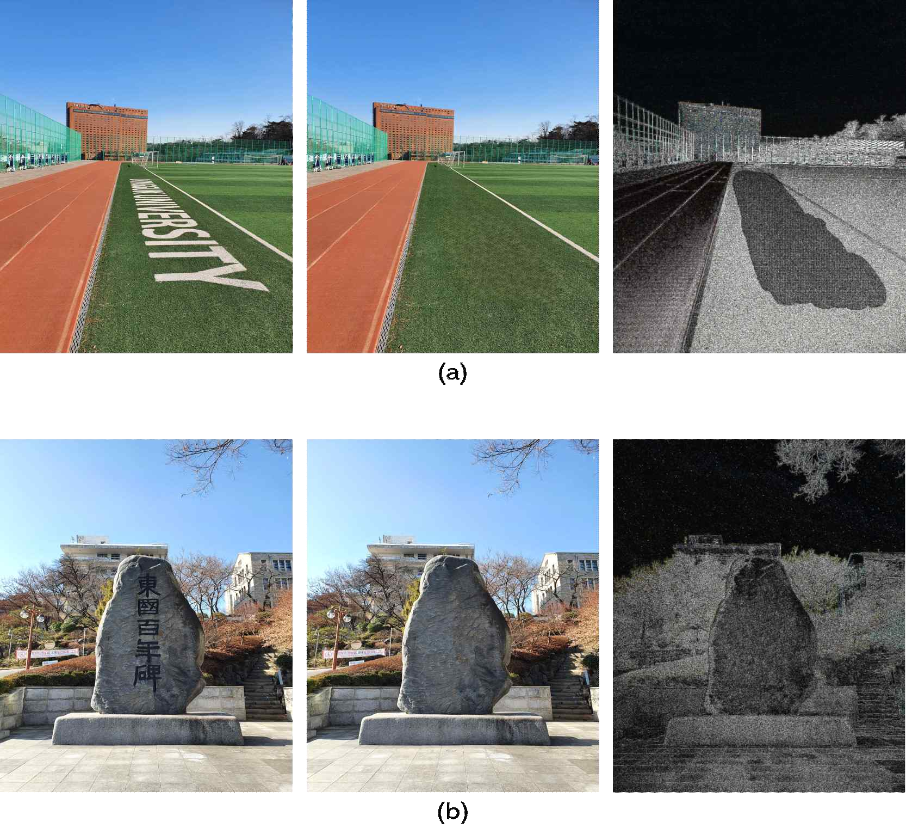 style="width:3.33154in;height:3.08163in" />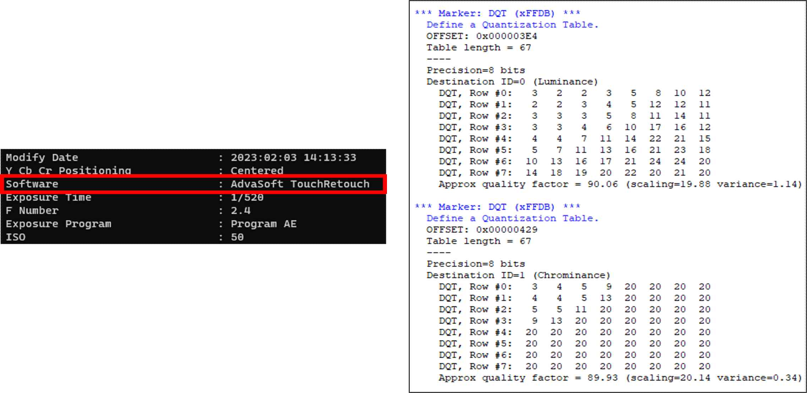 style="width:4.54256in;height:2.2159in" /> style="width:4.09375in;height:4.125in" />\[그림 4-2\] 객체지우기 및
> Noise Analysis 적용
>
> \[그림 4-3\] 분석 대상 이미지 (b)의 Exif(좌), DQT(우)
>
> \- 44 -
>
> 2\. 시나리오 분석
>
> 가. 시나리오 설명
>
> A씨는 K회사의 임직원으로, 회사의 중요한 기술 도면에 접근할 수 있
>
>  style="width:2.81015in;height:1.77972in" /> style="width:4.09375in;height:4.125in" />는 권한을 가지고 있다. 2023년
> 10월 12일 오전 02시 23분경, A씨는 익
>
> 명으로 회사 측에 거액의 금전을 요구하며, 회사의 경쟁사에 기밀 정보
>
> 를 유출하겠다는 협박 메시지와 함께 기밀 도면 일부분이 지워진 이미
>
> 지를 메일로 보낸다. 이를 심각하게 받아들인 회사 측은 즉시 경찰에 신
>
> 고하였고, 경찰은 A씨를 조사하기 시작한다. A씨는 자신은 명백히 이와
>
> 관련된 행위를 한 적이 없다고 주장하며, 스마트폰을 임의제출한다. 포
>
> 렌식 수사관은 A씨 스마트폰의 갤러리 휴지통에 접근하여 복원 기능을
>
> 통해 도면 일부분이 지워진 이미지인 \[그림 4-4\]을 획득한 상황이다.
>
> \[그림 4-4\] 복원을 통해 획득한 이미지 (파일명: 1697044604151.png)
>
> \- 45 -
>
> 나. 증거 분석
>
> 1\) 이미지 파일 분석
>
> Exif 정보와 Filename 분석을 통해 해당 이미지는 2023-10-12 02:16:4
>
> 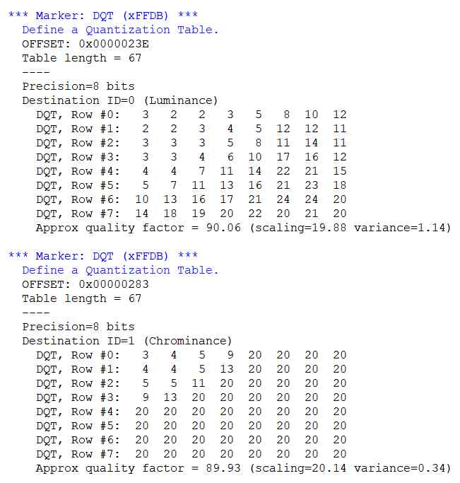 style="width:2.83181in;height:3.09328in" /> style="width:4.09375in;height:4.125in" />4에 생성되었음이 확인되었다.
> JPEG 파일 포맷을 확인할 수 있는 프리
>
> 웨어인 JPEGsnoop를 활용하여 확인한 DQT는 \[그림 4-5\]와 같았으며,
>
> \<표 3-5\>를 참고하여 해당 이미지는 Remove Unwanted Object, Snap
>
> Edit 또는 Photo Studio 등의 이미지 편집 도구로 편집된 이미지임이 확
>
> 인되었다.
>
> \[그림 4-5\] 획득한 이미지의 DQT
>
> \- 46 -
>
> 2\) 이미지 처리 기술 적용
>
> 이미지 처리 기술의 적용을 통해 조작된 영역을 식별하기 위해 디지
>
> 털 이미지 포렌식을 위한 무료 도구인 Forensically6)를 활용하여 확인하
>
> 였다. \[그림 4-6\]는 이미지 처리를 적용한 결과이며, 해당 결과를 통해서
>
>  style="width:4.07114in;height:3.08162in" /> style="width:4.09375in;height:4.125in" />는 특정 조작 영역을 명확히
> 식별할 수 없었다.
>
> \[그림 4-6\] 이미지 처리 기술 적용 결과
>
> 3\) 이미지 편집 도구 아티팩트 분석
>
> 이미지 파일 포맷 분석을 통해 확인한 이미지 편집 도구 후보군 중,
>
> A씨의 스마트폰에는 SnapEdit 애플리케이션이 설치되어 있는 것으로
>
> 6\) https://29a.ch/photo-forensics/#forensic-magnifier
>
> \- 47 -
>
> 확인되었다. ‘/data/data/snapedit.app.remove/’ 경로의 하위 디렉터리 분
>
> 석을 통해 \[그림 4-7\] 경로에서, \[그림 4-8\]과 같이 편집에 사용된
> 원본
>
> 이미지(snap_edit_temp.jpg, snap_edit_temp_large.jpg)와 편집된 영역(ma
>
> sk_brush)을 확인할 수 있었다.
>
> 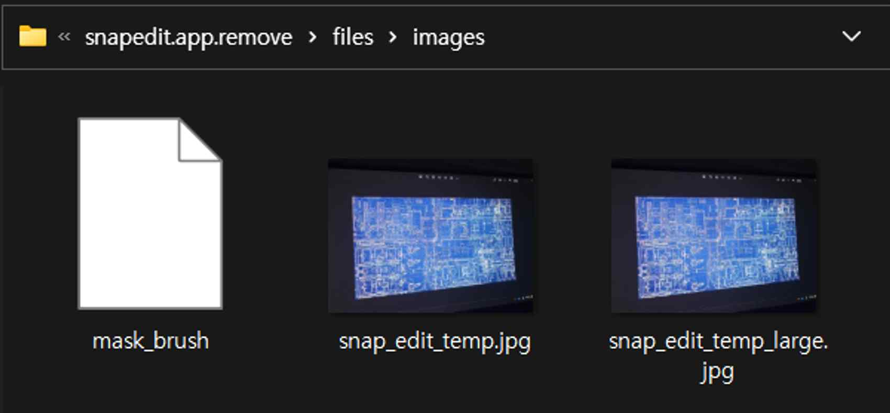 style="width:3.80296in;height:1.60657in" /> style="width:1.73907in;height:1.43676in" />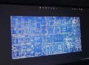 style="width:1.73907in;height:1.43676in" /> style="width:4.09375in;height:4.125in" />\[그림 4-7\] /files/images
> 경로에서 식별한 원본 이미지와 편집 영역
>
> \[그림 4-8\] 원본 이미지(좌), 편집 영역(우)
>
> 4\) 안드로이드 시스템 아티팩트 분석
>
> UsageStats을 확인한 결과인 \[그림 4-9\]를 통해 2023-10-12 02:13:06
>
> 에 SnapEdit이 실행되었으며, 2023-10-12 02:17:07에 최종적으로 사용을
>
> \- 48 -
>
> 종료한 것으로 확인되었다. 앞서 이미지 파일 분석을 통해 확인한 이미
>
> 지 파일의 생성시간을 고려하였을 때, 조작된 이미지는 SnapEdit 도구의
>
> 실행 및 종료 사이에 생성되어 해당 앱을 통해 편집되었음을 확인할 수
>
> 있다.
>
> 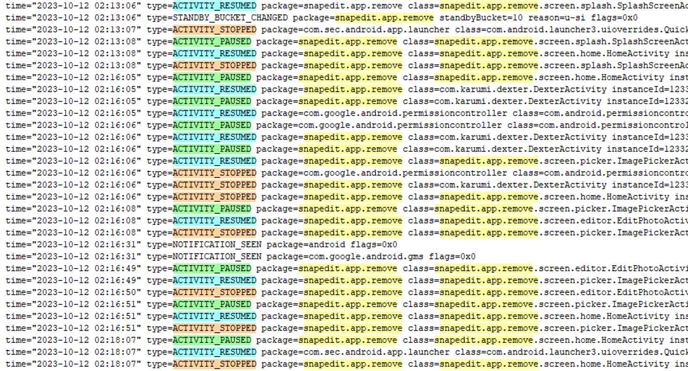 style="width:5.09393in;height:2.71203in" /> style="width:4.09375in;height:4.125in" />\[그림 4-9\] UsageStats(Last
> 24 hour events)를 통한 쟁점시간대의 SnapEdit 활용 행위 식별
>
> 5\) 갤러리 애플리케이션 아티팩트
>
> 갤러리 썸네일에 활용되는 썸캐시 경로인 ‘/data/data/com.sec.android.
>
> gallery3d/cache/’을 확인하였을 때(\[그림 4-10\] 참고), 원본 이미지를
> 식
>
> 별할 수 있었으며, 이는 원본 이미지가 기존에 갤러리에 존재했음을 확
>
> 인할 수 있게 한다.
>
> \- 49 -

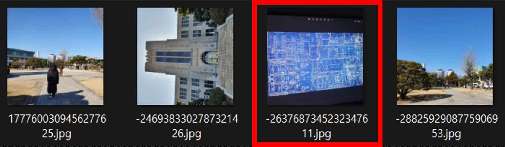

> \[그림 4-10\] 썸캐시 경로에서 확인 가능한 캐싱된 원본 이미지
>
> 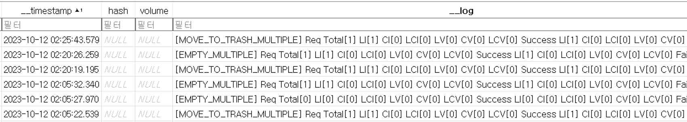 style="width:5.09393in;height:0.90735in" /> style="width:4.09375in;height:4.125in" />\[그림 4-11\]은 쟁점시간대
> 갤러리의 휴지통 기능과 관련된 기록을 보
>
> 여준다. 분석 결과, 편집 이미지 생성시간(2023-10-12 02:16:44) 이후와
>
> SnapEdit 종료시간(2023-10-12 02:17:07) 이후, 2023-10-12 02:20 경, 갤
>
> 러리에서 하나의 이미지를 휴지통에 옮긴 후, 휴지통 비우기를 통해 완
>
> 전삭제한 것을 확인할 수 있었다. 이는 썸캐시에는 존재하지만 현재 갤
>
> 러리에 존재하지 않는 유출을 위한 원본 도면 이미지로 추측되며, 2023-
>
> 10-12 02:25:43에 하나의 이미지를 휴지통으로 옮긴 로그가 마지막으로
>
> 기록된 것으로 보아, 기밀 도면 일부분이 지워진 편집된 이미지를 메일
>
> 로 보낸 후, 삭제를 위해 휴지통으로 이동한 것으로 식별된다.
>
> \[그림 4-11\] 쟁점시간대 휴지통 비우기를 통한 완전삭제 행위 식별
>
> \- 50 -
>
> 다. 종합 분석 결과
>
> \<표 4-1\>은 쟁점시간대의 A씨의 행위 정보를 종합 분석한 결과를 보
>
> 여준다. A씨는 협박성 메일 작성을 위해 갤러리에 존재하였던 도면의
>
>  style="width:4.09375in;height:4.125in" />원본 이미지를 SnapEdit
> 애플리케이션을 사용하여 조작하였으며, 이후
>
> 원본 이미지를 갤러리에서 완전삭제하였다. 이후 조작된 이미지를 메일
>
> 에 첨부하여 협박성 메일을 보냈으며, 해당 이미지 또한 삭제를 통해 증
>
> 거를 제거한 것으로 확인되었다.
>
> \<표 4-1\> 쟁점시간대의 A씨의 행위 정보
>
> \- 51 -
>
> 제5장 결 론
>
> 이미지 조작 탐지를 위한 연구는 지금까지 많이 진행되어왔다. 그러나
>
> 대부분의 연구는 이미지 파일 자체만을 분석 대상으로 삼아 이미지가
>
> 조작되었는지를 식별하는 데 초점을 맞추고 있다. 이는 이미지의 조작
>
>  style="width:4.09375in;height:4.125in" />여부만을 파악할 뿐이며, 누가,
> 언제, 어떻게 조작했는지에 대한 구체적
>
> 인 사용자의 행위 정보를 식별하는 데 한계가 있다. 최근에는 디지털 기
>
> 기 사용이 더욱 증가함에 따라 용의자의 행위에 대한 혐의 입증을 위해
>
> 디지털 기기에 대한 분석이 필수적으로 진행되고 있다. 본 연구에서는
>
> 사용자의 행위 분석을 위해 다양한 디지털 기기 가운데 모바일 기기를
>
> 중점적으로 다룬다. 모바일 기기는 높은 접근성을 제공하여 사용자들이
>
> 사진 촬영, 이미지 편집, 온라인 소셜 미디어 활동 등 다양한 활동을 수
>
> 행하는 데 널리 사용되고 있으며, 이에 따라 모바일 기기에서의 이미지
>
> 조작 가능성이 증가하고 있기 때문이다.
>
> 본 연구는 기존의 이미지 파일만을 분석 대상으로 하는 이미지 파일
>
> 의 메타데이터 및 그래픽 분석과 더불어 행위 분석을 위한 모바일 포렌
>
> 식을 조사 절차에 적용함으로써 이미지의 조작 여부뿐만 아니라 이미지
>
> 조작 행위를 탐지할 수 있도록 하는 포렌식 조사 절차를 제시하고 검증
>
> 하는 것을 목적으로 한다.
>
> 제안하는 이미지 조작 행위 탐지를 위한 포렌식 조사 절차는 세 단계
>
> 로 구성된다. 첫 번째 단계인 이미지 파일 분석은 이미지 파일을 분석
>
> 대상으로 하며, 이미지의 메타데이터인 Exif 정보와 DQT, 그리고 Filen
>
> ame Signature를 통해 이미지 조작을 탐지한다. 이때, 조작된 이미지의
>
> 메타데이터를 이미지 편집 도구의 버전별로 정보를 담고 있는 조작 판
>
> \- 52 -
>
> 별의 기준이 되는 Reference DB의 참조를 통해 조작을 탐지하도록 한
>
> 다. 두 번째 단계인 이미지 처리 기술의 적용은 앞선 단계와 동일하게
>
> 이미지 파일을 분석 대상으로 하며, 기존에 알려진 이미지 처리 기술을
>
> 조작된 이미지에 적용함으로써 조작된 영역을 그래픽적으로 탐지할 수
>
> 있도록 한다. 세 번째 단계인 모바일 포렌식 아티팩트 분석은 모바일 기
>
>  style="width:4.09375in;height:4.125in" />기가 임의 제출되었거나 영장을
> 통해 압수되었을 경우 해당 기기를 분
>
> 석 대상으로 하여 이미지 조작 행위를 탐지한다. 이미지 조작 행위 탐지
>
> 를 위해 본 연구에서는 이미지 편집 도구 아티팩트, 갤러리 애플리케이
>
> 션 아티팩트, 그리고 안드로이드 시스템 아티팩트를 분석한다. 이미지
>
> 편집 도구 아티팩트는 애플리케이션의 고유한 식별자로 사용되는 패키
>
> 지명을 통해 해당 패키지가 저장되는 경로에 존재하는 데이터를 추출
>
> 및 분석함으로써 이미지 조작 행위 여부를 탐지한다. 이때, 이미지 조작
>
> 행위를 식별하기 위해 '편집된 이미지, 편집된 영역, 편집 로그, 캐싱된
>
> 이미지'의 존재 여부를 고려하여 조작 행위를 식별하도록 한다. 갤러리
>
> 애플리케이션 아티팩트 분석은 삼성 스마트폰에서 이미지 삭제 시 제공
>
> 하는 '휴지통' 기능과 관련한 아티팩트를 분석하여 이미지 삭제 행위에
>
> 대한 정보를 수집하도록 함으로써 안티포렌식 행위를 식별하도록 한다.
>
> 더불어 안드로이드 시스템 아티팩트를 분석함으로써 사용자의 애플리케
>
> 이션 설치 및 삭제 시간, 시작 및 종료 시간을 추적함으로써 이미지 조
>
> 작 및 안티포렌식 행위를 식별한다.
>
> 본 연구에서는 모바일 포렌식을 통해 사용자의 이미지 조작 행위에
>
> 대한 구체적인 분석이 가능함을 보여주었으며, 가상 시나리오를 활용하
>
> 여 제안한 포렌식 조사 절차의 효과를 검증하였다. 이와 같은 연구 결과
>
> 는 다음과 같은 의의를 지닌다. 먼저, 제안한 포렌식 조사 절차는 각 단
>
> \- 53 -
>
> 계마다 나타날 수 있는 단점을 상호보완하여 이미지 조작 행위 탐지의
>
> 정확도를 향상시켰다. 특히, 모바일 포렌식 아티팩트 분석 단계를 통해
>
> 사용자의 행위에 대한 분석을 가능하도록 함으로써 이미지 파일 자체의
>
> 조작 여부뿐만 아니라 용의자의 혐의 입증에 탁월한 역할을 수행할 수
>
> 있게 되었다. 또한 연구에서 제시한 애플리케이션 아티팩트와 관련한 분
>
>  style="width:4.09375in;height:4.125in" />석 방법은 해당 연구뿐만
> 아니라 사용자의 행위 입증을 위한 포렌식 수
>
> 사에서도 활용될 수 있을 것으로 기대된다. 끝으로, 본 연구에서 생성한
>
> 조작된 이미지 데이터셋과 이미지 조작 탐지의 판별 기준이 되는 Refer
>
> ence DB와 더불어 이미지 메타데이터 파싱 코드를 제공함으로써 응용
>
> 프로그램의 후처리 단계에서의 그래픽적 차이를 분석하거나 조작된 영
>
> 역을 탐지하는 연구에 기여할 수 있도록 한다.
>
> 본 연구는 갤럭시 S10e(안드로이드 12)를 통해서만 실험되었기 때문
>
> 에, 다양한 기종 및 안드로이드 버전에 대한 연구가 필요하며, 운영체제
>
> 에 대한 최상위 관리자 권한을 얻는 루팅 과정이 진행되지 않을 경우,
>
> 애플리케이션과 관련한 데이터는 획득할 수 없다는 한계를 지닌다. 또한
>
> 본 연구는 JPEG으로 연구대상을 한정하였기 때문에 다양한 이미지 파
>
> 일 포맷에 대한 추가적인 연구가 필요하다. 이러한 한계를 보완하여 포
>
> 괄적인 이미지 조작 행위 탐지를 위한 포렌식 조사 절차에 관한 연구가
>
> 향후 이루어지기를 기대한다.
>
> \- 54 -
>
> 참 고 문 헌
>
> 1\. 국내문헌
>
> 가. 연구논문
>
>  style="width:4.09375in;height:4.125in" />강예지·김동현·이선경·박정흠·이상진.
> (2021), “안드로이드 UsageStats
>
> 의 포렌식 활용 방안”, 「디지털포렌식연구」, 15(4): 1-12.
>
> 곽병선. (2011), “디지털 포렌식 수사의 문제점과 개선방안”, 「법학연
>
> 구」, 42: 171-191.
>
> 권양섭. (2009), “디지털 포렌식 법률체계 구축 방안”, 「법학연구」, 35:
>
> 357-382.
>
> 김경주·김가연·조은상·박재현. (2023), “ADB 모듈을 이용한 안드로이드
>
> 기기 사진 촬영 자동화 시스템 개발”, 「2023년도 대한전자공학회
>
> 하계학술대회 논문집」, 2008-2009.
>
> 김국식. (2020), "클라우드 환경에서 수색 및 압수의 허용성 및 그 개선
>
> 방안", 「석사학위논문」, 서울대학교 대학원.
>
> 김도현·이상진. (2016), “모바일 포렌식 동향”, 「정보보호학회지」, 26(
>
> 5): 22-31.
>
> 김민식·정두원·이상진. (2016), “스마트폰 JPEG 파일의 출처 식별을 위
>
> 한 DQT 정보 데이터베이스 구축”, 「정보보호학회논문지」, 26
>
> (2): 359-367.
>
> 김영준·김완주·임재성. (2020), “무결성 향상을 위한 모바일 포렌식 모델
>
> 연구”, 「정보보호학회논문지」, 30(3): 417-428.
>
> \- 55 -
>
> 김예미·유희정·이윤영,·조진성. (2019), “안드로이드 스마트폰 정보 추출
>
> 방법에 관한 연구”, 「한국정보과학회 2019 한국소프트웨어종합학
>
> 술대회 논문집」, 1272-1274.
>
> 김현우·손태식. (2023), “윈도우 10 환경의 디지털 포렌식 기반 침해사고
>
> 진단 및 대응”, 「JOURNAL OF PLATFORM TECHNOLOG
>
>  style="width:4.09375in;height:4.125in" />Y」, 11(4): 35-49.
>
> 류정현·박종혁. (2017), “모바일 포렌식 연구를 위한 서드 파티 어플리케
>
> 이션 분석”, 「한국정보처리학회 학술대회논문집」, 24(1): 336-33
>
> 9\.
>
> 박기홍·장혜숙. (2012), “모바일 포렌식을 위한 안드로이드폰 로그캣 필
>
> 터링 연구”, 「한국컴퓨터정보학회 학술발표논문집」, 20(2): 217-
>
> 219\.
>
> 박명서·김종성. (2018), “스마트폰 백업 데이터 획득 연구 동향”, 「정보
>
> 보호학회지」, 28(5): 5-8.
>
> 박은후·강수진·김소람·김종성. (2020), “데이터 획득방법에 따른 최신 삼
>
> 성 스마트폰의 시스템 로그 분석과 포렌식 활용 기법”, 「디지털
>
> 포렌식연구」, 14(1): 1-19.
>
> 서승희·박진성·김역·이창훈. (2018), “디지털 포렌식 측면에서의 안드로이
>
> 드 디바이스에 대한 데이터 수집 연구” 「OSIA Standards & Te
>
> chnology Review Journal」, 31(2): 12-17.
>
> 오정훈·이상진. (2012), “안드로이드 스마트폰 포렌식 분석 방법에 관한
>
> 연구”, 「디지털포렌식연구」, 6(1): 47-76.
>
> 이상훈·김수연. (2018), "사회연결망서비스의 EXIF 기반 Hashtag 추천
>
> 시스템", 「Information Systems Review」, 20(3): 73-92.
>
> \- 56 -
>
> 이지원·전승제·박윤지·정재현·정두원. (2023), “이미지 조작 탐지를 위한
>
> 포렌식 방법론”,「정보보호학회논문지」, 33(4): 671-685.
>
> 허욱·김소람·박은후·신수민·김종성. (2020), “JPEG 이미지 압축정보를 이
>
> 용한 이미지 유포 기기 특정 방안 연구”,「디지털포렌식연구」, 1
>
> 4(1): 33-44.
>
>  style="width:4.09375in;height:4.125in" />2. 외국문헌
>
> 가. 연구논문
>
> Azhan, N. A. N., Ikuesan, R. A., Razak, S. A., & Kebande, V. R. (20
>
> 22), “Error Level Analysis Technique for Identifying JPEG Bloc
>
> k Unique Signature for Digital Forensic Analysis”, Electronics,
>
> 11(9): 1468.
>
> Bappy, J. H., Roy-Chowdhury, A. K., Bunk, J., Nataraj, L., & Manjun
>
> ath, B. S. (2017), “Exploiting spatial structure for localizing ma
>
> nipulated image regions”, In Proceedings of the IEEE internatio
>
> nal conference on computer vision, 4970-4979.
>
> Cai, H. (2016), “Luminance gradient for evaluating lighting”, Lighting
>
> Research & Technology, 48(2): 155-175.
>
> Christlein, V., Riess, C., Jordan, J., Riess, C., & Angelopoulou, E.
> (201
>
> 2), “An evaluation of popular copy-move forgery detection appr
>
> oaches”, IEEE Transactions on information forensics and securi
>
> ty, 7(6); 1841-1854.
>
> \- 57 -
>
> Fan, J., Cao, H., & Kot, A. C. (2013), “Estimating EXIF parameters b
>
> ased on noise features for image manipulation detection”, IEEE
>
> Transactions on Information Forensics and Security, 8(4): 608-
>
> 618\.
>
> Hossain, F., Dagiuklas, T., & Skodras, A. (2023), “A New Forgery I
>
>  style="width:4.09375in;height:4.125in" />mage Dataset and its
> Subjective Evaluation”, In 2023 IEEE IA
>
> S Global Conference on Emerging Technologies, 1-6.
>
> Kim, D., Lee, Y., & Lee, S. (2018), “Mobile forensic reference set (M
>
> FReS) and mobile forensic investigation for android devices”, T
>
> he Journal of Supercomputing, 74: 6618-6632.
>
> Kornblum, J. D. (2008), “Using JPEG quantization tables to identify i
>
> magery processed by software”, digital investigation, 5: 21-25.
>
> Qin, Z., Zeng, Q., Zong, Y., & Xu, F. (2021), “Image inpainting based
>
> on deep learning: A review”, Displays, 69.
>
> Rao, Y., & Ni, J. (2016), “A deep learning approach to detection of sp
>
> licing and copy-move forgeries in images”, In 2016 IEEE intern
>
> ational workshop on information forensics and security (WIFS),
>
> 1-6.
>
> Rossler, A., Cozzolino, D., Verdoliva, L., Riess, C., Thies, J., &
> Nießn
>
> er, M. (2019), “Faceforensics++: Learning to detect manipulated
>
> facial images”, In Proceedings of the IEEE/CVF international c
>
> onference on computer vision, 1-11.
>
> Thakur, R., & Rohilla, R. (2020), “Recent advances in digital image m
>
> anipulation detection techniques: A brief review”, Forensic scien
>
> \- 58 -
>
> ce international, 312.
>
> Wang, T., Liu, M., Cao, W., & Chow, K. P. (2022), “Deepfake noise i
>
> nvestigation and detection”, Forensic Science International: Digi
>
> tal Investigation, 42.
>
> Zheng, L., Zhang, Y., & Thing, V. L. (2019), “A survey on image ta
>
>  style="width:4.09375in;height:4.125in" />mpering and its detection in
> real-world photos”, Journal of Vis
>
> ual Communication and Image Representation, 58: 380-399.
>
> Zimba, M., & Xingming, S. (2011), “DWT-PCA (EVD) based copy-m
>
> ove image forgery detection”, International Journal of Digital C
>
> ontent Technology and its Applications, 5(1): 251-258.
>
> 3\. 기타 문헌
>
> 한국인터넷진흥원(KISA), “모바일 포렌식 연구 및 조사의 동향과 발전
>
> 방향”, 2021.
>
> \- 59 -
>
> ABSTRACT
>
> A Study on the Detection of
>
>  style="width:4.09375in;height:4.125in" />Image Manipulation Behavior
>
> through Mobile Forensics
>
> Lee, Jiwon
>
> Department of Police Administration
>
> Graduate School of Dongguk University
>
> By applying artificial intelligence to image editing technology, it ha
>
> s become possible to generate high-quality images. However, this tec
>
> hnology can be exploited for criminal activities, necessitating the
> need
>
> for countermeasures. This study proposes a forensic investigation pro
>
> cedure for detecting image manipulation behavior.
>
> The proposed forensic investigation procedure for image manipulatio
>
> n detection consists of three stages. The first stage, image file
> analy
>
> sis, focuses on analyzing the image file. It detects image manipulatio
>
> n through Exif information, DQT, and Filename Signature. During thi
>
> \- 60 -
>
> s process, detection is facilitated by referencing a Reference Databas
>
> e, which contains information about manipulated images based on the
>
> versions of image editing tools. The second stage, the application of
> i
>
> mage processing techniques, similarly analyzes image files as the pre
>
> vious stage. It visually detects manipulated regions by applying know
>
>  style="width:4.09375in;height:4.125in" />n image processing techniques
> to manipulated images. The third stag
>
> e, mobile forensic artifacts analysis, targets mobile devices
> submitted
>
> arbitrarily or seized through legal warrants. It detects image
> manipula
>
> tion behavior by analyzing artifacts related to image editing tool
> artif
>
> acts, gallery application artifacts, and Android system artifacts. The
> i
>
> mage editing tool artifacts are analyzed by extracting and examining
>
> data stored in the path where the package name, used as a unique id
>
> entifier for the application, is located. Gallery application
> artifacts anal
>
> ysis involves examining artifacts related to the 'Trash' feature
> provid
>
> ed when deleting images on Samsung smartphones, collecting informa
>
> tion about image deletion actions, thereby identifying anti-forensic
> be
>
> havior. Additionally, the analysis of Android system artifacts
> identifie
>
> s user application installation and deletion times, as well as start
> and
>
> end times, to identify image manipulation and anti-forensic behavior.
>
> The proposed forensic investigation procedure addresses potential s
>
> hortcomings in each stage, enhancing the accuracy of image manipula
>
> tion detection. The mobile forensic artifacts analysis stage enables
> th
>
> e analysis of user behavior, contributing not only to determining the
>
> manipulation of image files but also to proving the suspect's involve
>
> \- 61 -
>
> ment. The analysis methods related to application artifacts presented
>
> in this study are expected to be applicable not only in this research
>
> but also in forensic investigations aimed at proving user behavior. Fi
>
> nally, this study contributes to the field by providing a manipulated
> i
>
> mage dataset, a Reference Database serving as the discrimination crit
>
>  style="width:4.09375in;height:4.125in" />erion for image manipulation
> detection, and image metadata parsing c
>
> ode. This facilitates the analysis of graphical differences in
> post-proc
>
> essing stages of applications or the detection of manipulated regions,
>
> contributing to future research in this domain.
>
> \- 62 -
