# 불법촬영 범죄 대응을 위한 현장용 모바일 포랜식 도구 개발에 관한 연구 

김 승 규*, 김 무 석**, 강 구 민***
성균관대학교 일반대학원 과학수사학과(석사졸업)*, (박사과정)**, 성균관대학교 법학과 (박사)***

## A Study on the Development of Mobile Forensic Tool for the Response to Hidden Camera Crime

Seung-Kyu Kim*, Mu-Seok Kim**, Gu-Min Kang** Graduate school of Forensics, Sungkyunkwan University (Master's degree)*, (The Doctor's course)** College of Law, Sungkyunkwan University (Ph.D) ${ }^{* * *}$

요 약

불법촬영 범죄의 증가와 함께 범죄에 사용된 모바일 기기와 기기 내 전자정보의 증거능력 인정에 관한 법률적 쟁점들이 지속적으로 제 기되었다. 판례는 불법촬영 범죄현장에서 임의제출 받은 모바일 기기의 증거능력과 관련하여 피고인의 임의성 확보, 피고인에게 임의제출 에 관한 충분한 고지, 모바일 기기에 대한 임의제출 확인서, 적법점차 및 임의성 확보에 관한 증명 등을 요건으로 제시하고 있다. 이하에 도 법원은 기본적으로 디지털 증거의 증거능력을 위하여 무결성과 동일성을 함께 요구하고 있다. 최초 범죄현장에서 이러한 요건들을 일 잎이 다 확인하여 증거수집을 하기 어려운 실정이다. 그래서 본 연구에서는 불법촬영 범죄가 발생한 최초 현장에서 사용하는 데에 착화된 현장을 모바일 포랜식 도구를 제안한다. 현장용 모바일 포랜식 도구는 디지털 증거의 무결성과 동일성을 기본적으로 유지할 수 있고 불법 촬영 범죄 수사 시 현장에서 발생할 수 있는 임의성 입증의 한계점 보완에 초점을 맞추었다. 도구는 범죄현장에서 제출받은 모바일 기기 에 저장된 사진, 동영상, 행색일, 로그 데이터 등의 유관 정보를 시간 범위 기준으로 선별분석할 수 있는 기능과 함께 판례에서 제시하고 있는 제출자의 임의성 확인을 위하여 임의제출 확인서 작성 기능을 탑재하여 임의제출자에 관한 정보, 임의제출에 관한 고지를 정확히 만 았다는 내용, 제출자의 서명 등을 확인할 수 있는 기능을 구현함으로써 피고인의 임의성을 확보하였다. 또한 도구에 대한 신뢰성을 높이 고자 미국 NIST와 한국정보통신기술협회(TTA)에서 제시하고 있는 포랜식 도구 검증항목을 참고하여 현장용 모바일 포랜식 도구에 대한 검증 실험을 수행하였다. 본 연구의 내용이 향후 불법촬영 범죄의 증거 확보에 실질적인 도움이 되었으면 하는 바랏이다.

주제어 : 불법촬영 범죄, 모바일포랜식, 임의제출, 디지털 성범죄, 안드로이드포랜식

#### Abstract

Since rising the hidden camera crime rate, legal issues regarding the admissibility of mobile device evidence and electronic information evidence used in the crime have been continuously raised. In the precedent, the requirements for being treated as mobile device evidence have suggested such as the securing the voluntariness of defendant, the sufficient notice about voluntary submission to the defendant, the confirmation of voluntary submission related to the mobile device, the due process of law, and the proof of securing the voluntariness. In addition, the court essentially requires integrity and identity for the admissibility of digital evidence. However, it is hard to gather the evidence with checking up every requirement at the initial crime scene. Therefore, we propose a mobile forensic tool to use in the crime scene through this study. The tool could basically maintain the integrity and identity of digital evidence, also focused on supplementing the limitations of proving voluntariness that may occur in the scene when investigating hidden camera crimes. The tool has the function to selectively analyze photos, videos, thumbnails and log data based on time range. We also put the function of writing a confirmation of voluntary submission into mobile forensic tool to secure the voluntariness of the defendant. Indeed, this function involves to check the information about voluntary submitter, the notice of voluntary submission, and the signature of the submitter. In order to enhance the reliability of mobile forensic tool, we conducted an experiment on verification of the tool through forensic tool verification item what NIST and TTA suggested. We hope that this study will be helpful effectively to secure the evidence from hidden camera crime scene in the future.

Key Words : Hidden Camera Crime, Mobile Forensics, Voluntary Submission, Digital Sexual Crime, Android Forensics

[^0]
[^0]:    ※ 본 논문은 제 1 저자의 석사학위 논문 중 일부 내용을 논문형식에 맞게 수정 $\cdot$ 보완한 논문임.
    ※ 본 논문은 (사)한국디지털포랜식학회에서 주최하는 2020년 하계 학술대회에서 발표된 논문임.

    - Received 01 September 2020, Revised 01 September 2020, Accepted 29 September 2020
    - 제 1 저자 (First Author) : Seungkyu Kim (Email : gndltm234@naver.com)
    - 교신저자(Corresponding Author) : Gumin Kang (Email : kanggumin@skku.edu)

# I. 들어가기 

## 1.1 불법촬영 범죄 현황

디지털 기술의 발전으로 휴대용 모바일 기기의 수가 급증하면서, 2020년 4월 현재 대한민국의 스마트폰 및 피처폰의 가 일 건수는 $56,187,098$ 건이며, 총 69,348,210건이 무선 통신서비스로 이용되고 있다 [1]. 이와 더불어 스마트폰 내 카메 라를 이용한 불법촬영 범죄도 증가하는 현실이다. 경찰청에 따르면 카메라 등을 이용한 불법 촬영 발생 건수가 2011년 1,535건에서 2018년 5,925건으로 약 3.8 배 늘어났다 [2].

불법촬영 범죄형태로는 스마트폰 등과 같이 개인이 직접 촬영하는 경우가 $85.5 \%$ 로 가장 많았고 [3], 특히 불특정 다수 를 범죄의 표적으로 하고 있어 범죄가 신고되지 않으면 촬영물 피해자의 신원 확인조차 어려운 현실이다 [4]. 불법촬영 범 죄의 피해자 중 $95 \%$ 가 여성이며, 피해자의 연령대는 10 대 $14.7 \%, 20$ 대 $39.4 \%, 30$ 대 $11 \%, 40$ 대 이상 $9.9 \%$ 로 피해자 대부분 젊은 여성임을 알 수 있다 [5].

스마트폰의 카메라를 이용하여 불법으로 몰래 촬영한 사진이나 동영상이 SNS와 같은 네트워크를 통한 유포, 모바일 기 기 분실 및 도난으로 인한 유포 등의 다양한 이유로 확산되고 있는 실정이다 [6]. 하지만 이렇게 촬영된 사진이나 동영상이 한 번 유포되어 확산되면 삭제하기 어려울 뿐만 아니라 피해자가 극단적인 선택까지 하는 경우도 종종 발생하여 심각한 사 최적 문제로 대두되고 있다 [7].

이에 따라 정부는 2017년 9월 '디지털 성범죄(불법촬영 등) 피해 방지 종합 대책'을 마련하여 '디지털 성범죄'라는 용어를 도입함과 동시에 현행제도에 관한 개선방안 및 조치계획을 제시하는 등의 노력을 하고 있으며 [8], 2018년 12월 18일과 2020년 5월 19일에는 성폭력범죄의 처벌 등에 관한 특례법(이하 성폭력처벌법)이 개정되면서 제 14 조에 카메라 등을 이용 한 불법 촬영범죄에 관한 처벌을 강화하였다.

## 1.2. 현장용 모바일 포렌식 도구 개발의 필요성

신고를 받은 경찰관이 현장에 도착하기까지 용의자는 스마트폰에 저장된 사진이나 동영상을 SNS 등에 유포한 후 삭제하 거나, 클라우드와 같은 곳에 저장한 후 삭제할 수 있는 시간이 충분하다. 최근에는 개인정보보호가 강조되면서 스마트폰의 손쉬운 초기화 기능을 통해 스마트폰에 저장된 데이터를 모두 삭제할 수 있으며, 심지어 원격에서도 초기화를 진행할 수 있 다 [9].

또한, 손쉽게 데이터를 업로드하고 다운로드할 수 있는 환경이 조성되면서 범죄자가 불법 촬영한 사진이나 동영상 등을 어렵지 않게 유포할 수 있다. 유포된 사진이나 동영상은 피해자들의 증거자료 수집 및 법적 대응을 위한 시간과 전문성 부 족, 유포된 사이트의 서버가 해외에 있는 경우, 비용 등의 문제로 삭제하기 힘든 현실이다 [10]. 이러한 특성들은 스마트폰 으로 불법 촬영된 촬영물의 증거인멸 및 유포가 이루어지기 전에 불법촬영 범죄현장에서 신속하게 혐의를 입증하고, 현장 초기대응을 수행해야 할 필요가 있다.

기존 선행연구들에서는 수사기관의 압수$\cdot$수색$\cdot$검증영장에 의한 모바일 포렌식이 이루어진다는 점을 전제로 하고 있어, 압 수절차의 적법성, 분석과정에서의 우결성, 압수된 디지털 증거의 원본과의 동일성, 진술이 담긴 경우의 전문법적 적용 여부 등을 중점으로 다루고 있다. 하지만 본 연구에서는 불법촬영 범죄인 몰래카메라 범죄와 같은 경우로 한정하여 현장에서 영 장에 의한 모바일 포렌식을 수행할 수 없는 상황에서 긴급하게 범죄혐의를 확인하고 그 과정에서 제출자의 임의성을 확보할 수 있는 기능을 탑재한 현장용 모바일 포렌식 도구를 제안한다.

## II. 현장용 모바일 포렌식 도구의 법적 요건

## 2.1. 임의성 요건

불법촬영 범죄는 주로 피해자 또는 주변인의 신고에 의해 경찰이 현장에 도착한 후 용의자의 스마트폰을 확인하면서 시 작된다. 경찰이 용의자의 스마트폰을 확인하는 행위는 경찰의 수사활동으로 볼 수 있으며, 수사에는 적법절차가 요구된다. 특히 영장 없이 단순히 혐의사실을 확인하는 과정에서는 용의자로부터 스마트폰을 임의제출 받아 확인할 수밖에 없다는 한 계정이 있다. 물론 형사소송법상 임의제출한 물건은 영장 없이 압수할 수 있다고 규정하고(법 제218조) 있으나, 불법촬영 범죄의 경우 모바일 포렌식 장비로 현장에서 즉각적으로 확인하여 제출자에게 반환하기 보다는 스마트폰을 압수한 후 경찰 의 분석팀에 의뢰하는 방식으로 이루어지다 보니 시간이 오래 걸리고 그 시간 동안 제출자의 사생활을 침해할 수 있어 현장 에서 신속하고 정확하게 범죄 혐의사실을 확인하되 제출자의 임의성까지 확보할 수 있는 도구에 초점을 맞추었다.

한 남성이 지하철 에스컬레이터에서 총 18 회에 걸쳐 스마트폰으로 여성의 치아 속을 몰래 촬영하여 현행범으로 체포되었 다. 이에 대하여 대법원은 피고인의 모바일 기기에 대해 적법한 임의제출이 이루어지지 않아, 압수한 모바일 기기 자체와 모바일 기기 내에 저장된 전자정보의 증거능력을 부정하였던 원심관결(의정부지방법원 2019. 8. 22. 신고 2018 2757 판 결)이 잘못되었다고 판단하였다. 또한, 대법원 2016. 2. 18. 신고 2015도13726 판결을 참조하여 현행범 체포현장이나 범 죄현장에서 소지자 등에게 임의로 제출받은 물건은 영장 없이 압수할 수 있는 것이 허용되며, 이 경우 검사나 사법경찰관은 별도로 사후에 영장을 받을 필요가 없다는 점을 적시하였다 [11].

분법촬영 범죄는 사전에 영장을 받아 집행하기 어려워 당사자에게 임의제출을 권유하여 압수한 후 수사기관의 증거분석 실에서 정밀분석 후 혐의사실 관련 증거를 압수하는 방식으로 진행된다. 이때, 임의제출을 통하여 압수된 모바일 기기의 전 자정보가 증거능력을 인정받기 위해서는 제출자에게 임의제출에 관한 정확한 고지, 제출자의 임의성, 제출자의 임의제출에 관한 이해도, 그리고 이를 담보할 수 있는 제출자의 서명이나 날인이 포함된 임의제출 확인서, 수사관의 협박성 여부 등이 고려된다 [12]. 최근 '포랜식 미란다(Forensic Miranda) 원칙'을 제안한 연구에서는 포랜식 분야에서의 정치적 중요성과 함께 일반인들이 이해하기 어려운 포랜식 도구의 작동원리와 한계에 대해서 피압수자에게 설명할 필요가 있다고 한다 [13].

# 2.2. 선별압수 요건 

모바일 기기에는 광범위한 전자정보가 저장되어 있으므로, 전자정보의 제공 범위를 우선 결정할 필요가 있다. 즉, 현장에 서 용의자가 임의제출하는 것은 모바일 기기 자체가 아니라 모바일 기기에 저장된 범위가 정해진 전자정보이다. 이에 따라 임의제출 확인서에는 모바일 기기 자체를 임의제출물로 기재할 것이 아니라 '0년 0월 0일 11시 00 분부터 12시 00 분까지의 카메라 갤러리 사진' 등과 같이 구체적으로 압수할 전자정보의 대상을 특정하여 기재할 필요가 있다. 수사기관은 압수할 전 자정보의 대상을 특정하고 선별압수된 전자정보에 대한 상세목록을 별도로 출력하여 현장에서 제출자에게 임의제출확인서와 함께 교부한다. 이 때 범죄혐의가 확인된다면, 분법촬영 범죄에 사용된 스마트폰은 촬영도구로 사용되었기 때문에 그 자체 도 범죄에 이용된 물건으로 압수대상이 된다.
실제로 원칙적 선별 압수, 예외적 매체 압수라는 기준을 제시하였던 소위 '전교조 시국선언 사건'[14]에서는 파일의 시간 정보를 기준으로 데이터를 선별 압수한 것에 대하여 혐의사실과 관련된 정보를 적합하게 선별한 것으로 인정하였다 [15]. 또한 형사소송법 제106조 제3항의 규정에 따라 임의제출 확인서에 혐의사실과 관련한 전자정보와 그 범위에 대한 정확한 기재가 필요하고 [16], 그에 따라 시간정보를 기준으로 압수할 전자정보의 범위를 구체화하는 방법이 적절하다.
무엇보다 임의제출은 제출자의 자유로운 의사에서 비롯되어 영장주의의 예피로 인정되는 것이기 때문에 모바일 기기 내 전자정보에 대한 압수과정 속에서 제출자의 임의성이 보장되어야 한다. 그뿐만 아니라 디지털포랜식 역시 압수-수색의 일환 이라는 점에서 제출자에게도 그 과정에 참여할 수 있는 참여권을 보장해줘야 한다. 따라서 제출자에게 압수의 전 과정에 참 여할 수 있는 기회를 부여함으로써 임의성과 절차의 적법성을 확보할 수 있다.

## III. 불법촬영 범죄 현장용 모바일 포랜식 도구

## 3.1. 불법촬영 범죄 현장용 모바일 포랜식 도구의 개요

모바일 기기로 촬영한 분법촬영 범죄가 발생하였을 때, 발생한 현장에서 사용하는 데에 특화된 현장용 모바일 포랜식 도 구를 제안한다. 해당 도구의 제안은 분법촬영 범죄 수사 시 현장에서 생길 수 있는 한계점 보완에 초점을 맞추었다. 도구는 범죄현장에서 제출받은 모바일 기기의 임의제출 성립이 어려운 점을 개선하고자, 임의제출 간에 적법절차와 피고인의 임의 성을 확인할 수 있는 임의제출 확인서 작성 기능과 신속하고 정확하게 분법촬영 범죄와 유관한 정보(사진, 동영상, 펄네일, 로그)만을 분석할 수 있는 기능을 갖추었다. 이외에도 분석하는 과정을 동영상 녹화하여 저장하는 기능을 갖춰 도구 사용의 과정을 확인할 수 있도록 조치하였다.
본 논문에서 제안하는 현장용 모바일 포랜식 도구는 Python 3.8 언어로 작성하였으며, Pycharm(2020.1.1. Commu nity Edition)이라는 파이썬 IDE(Integrated Development Environment)를 사용하여 개발하였다. 다양한 스마트 폰 운영체제와 제조사 중 구글의 Android 운영체제(버전 9.0)를 탑재한 모바일 기기인 Samsung 사의 Galaxy S9(SM -960N), Galaxy S8(SM-G950N)과 LG 사의 G7 ThinQ(LM-G710N)을 분석하여 도출한 데이터를 토대로 제작되었 다. 또한, 메신저, 클라우드, 카메라 애플리케이션 등을 분석한 데이터를 기반으로 제작되었으며 대표적으로 네이버 클라우 드, 텔레그램, 카카오톡 등이 있다. 이를 통해 촬영물을 특정 서버나 네트워크로 연결된 개인저장장치에 촬영물을 업로드한 행위와 모바일 기기에 설치된 카메라 애플리케이션을 사용한 행위들을 식별할 수 있다.
도구의 기능은 크게 화면 녹화, 분석과 출력, 임의제출 확인서 작성과 서명 기능으로 분류할 수 있다. 화면 녹화 기능은 화면을 캡처하고 캡처한 파일을 프레임별로 합쳐 '.avi' 파일을 생성한다. 모바일 기기의 분석을 위해서는 가장 먼저 분석할 시간 범위와 항목(사진 $\cdot$ 동영상 $\cdot$ 펄네일 $\cdot$ 로그)을 설정해야 하며, 설정된 이후에는 조건에 해당하는 파일들의 리스트가 항 목별로 생성된다. 출력 기능에서는 앞서 설정한 시간 범위와 생성된 파일 리스트를 참조하여, 조건에 해당하는 사진 $\cdot$ 동영 상 $\cdot$ 펄네일 $\cdot$ 로그 데이터를 출력한다. 펄네일 데이터의 경우에는 시그니처 분석과 펄캐시 파일 분석의 과정을 거친 후 출력 된다. 임의제출 확인서를 작성하기 위해서는 제출자의 정보와 시간 범위, 현장, 담당 경찰관 정보 등을 입력해야 하며, 입력 된 정보는 '.docx' 파일에 임의제출 고지에 관한 내용과 함께 저장된다. 이후 서명 버튼을 누르면 '.docx' 파일이 그림 파일 로 변환되면서, 그림 파일에 서명할 수 있는 환경이 제공된다. 서명된 파일은 '.pdf' 파일 형태로 저장된다.

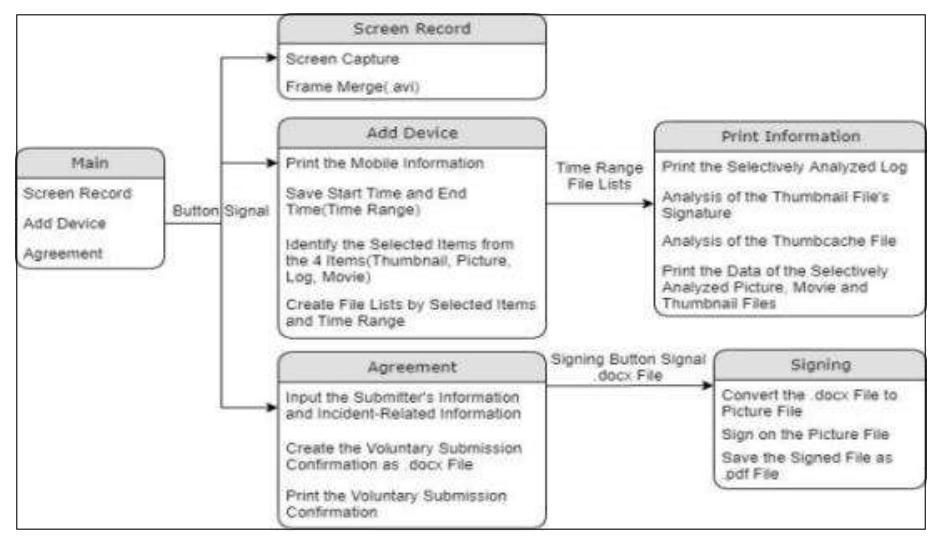

그림 1. 도구의 구성도
Figure 1. Diagram of tool

# 3.2. 안드로이드 모바일 기기의 분석대상 데이터 

본 논문에서 제안하는 현장용 모바일 포렌식 도구에서 분석하는 데이터는 SD카드 경로에 저장되어 있는 사진, 동영상, 펌네임과 'logcat'이라는 ADB 명령으로 수집할 수 있는 로그 데이터이다. SD카드의 경로는 /sdcard로 USB를 사용하여 PC와 안드로이드 모바일 기기를 연결하면 접근할 수 있다. 하지만 직접 모바일 기기에서 USB 연결을 설정해주고, PC에 모바일 기기 제조사에서 지원하는 USB 드라이버 프로그램 등을 설치해주어야 하는 전제조건이 필요하다 [17]. 앞서 언급 한 것처럼 /sdcard에 저장되는 데이터는 보통 사진, 동영상, 음악 등과 같은 멀티미디어 데이터와 태용량의 응용프로그램 데이터 등이다. 고로, /sdcard에 저장된 데이터는 불법촬영 범죄현장에서 혐의를 밝히는데 중요한 데이터가 될 수 있다.

### 3.2.1. 카메라 애플리케이션을 사용하여 저장된 데이터

카메라 애플리케이션을 사용하여 촬영된 사진과 동영상은 일반적으로 '/sdcard/DCIM/Camera' 경로에 저장된다. 하지 만 '/sdcard/DCIM/Camera' 경로 이외에 '/sdcard/Android/[애플리케이션 패키지 이름]' 경로에도 유의미한 데이터가 저장되며, 사용자가 사용한 카메라 애플리케이션 종류에 따라 경로가 조금씩 다를 수 있다. 또한, 사진과 동영상이 촬영되어 모바일 기기의 갤러리 등에 저장되면서 펌네일이 생성될 수 있다. 갤러리 펌네일의 경우, 모바일 기기에 저장된 멀티미디어 (사진, 동영상) 데이터를 미리 보여주기 위하여 원본 파일이 축소된 이미지 파일로, 갤러리 애플리케이션에 진입한 시점에 생성되며 제조사와 운영체제에 따라 상이할 수 있다 [18]. 펌네일은 용의자가 모바일 기기로 사진이나 동영상을 촬영했던 흔적을 확인할 수 있도록 도움을 주며, 촬영했던 사진이나 동영상 파일을 삭제하더라도 펌네일이 남아있다면 삭제한 정황을 파악하는 데에도 도움이 될 수 있다 [19]. 또한, 모바일 갤러리에는 그래픽 데이터를 삭제하더라도 휴지통에 임시로 저장하 는 기능이 있다. 즉, 사용자가 휴지통 내의 데이터를 재삭제하지 않는다면, 임의제출 직전에 갤러리에서 삭제한 데이터의 분 석이 가능하다. 테스트 결과, 휴지통 내 파일의 Access Time은 삭제되기 이전 원본 파일의 Access Time과 동일했다.

모바일 기기의 기본 갤러리 애플리케이션을 통해 생성된 펌네일 데이터는 그 경로와 저장형태가 제조사별로 달랐다. 먼저 삼성 모바일 기기(SM-G950N, SM-960N)의 경우 '/sdcard/Android/data/com.sec.android.gallery3d/cache' 경 로에 펌네일 파일이 저장되고, LG 모바일 기기(LM-G710N)의 경우 펌네일 캐시 파일이 '/sdcard/Android/data/com. android.gallery3d/cache'에 저장된다. 삼성 모바일 기기의 경우, 대부분 확장자 '. 0 ' 파일 형태였으며, 그래픽 파일 단위 로 펌네일이 각각 생성 $\cdot$ 저장되어 있었다. 또한, hex 데이터를 분석한 결과 '. 0 ' 파일의 시그니처가 JPEG 파일 시그니처 ( $0 x$ FF D8 FF E0 $==$ $==4 A 464946$ )와 동일했다.

반면, LG 모바일 기기에 저장된 펌네일은 개별 파일 단위로 저장되지 않고, 펌캐시(thumbcache) 파일 안에 연속적으 로 저장되어 있다. 즉, LG 모바일 기기의 갤러리 펌네일을 추출하기 위해서는 펌캐시 파일의 구조를 분석하여야 한다. 펌 캐시 파일은 '. 0 ' 및 '. 1 ' 파일이 존재하는데, '. 0 ' 파일에 먼저 펌캐시가 기록되고 용량이나 양이 일정 수준에 도달할 경우 '. 1 ' 파일에 기록된다. 만약 '. 1 ' 파일도 일정 수준에 도달할 경우에는 '. 0 ' 파일의 펌캐시를 삭제하고 새로 기록한다. 펌캐시 파일의 hex 구조는 [그림 2]와 같으며, '/local/image/item/count + identifier + /\%Image Path\%/\%Image Na me\% + Unix Time(원본 그래픽 파일의 생성시간)' 이후 JPEG 시그니처의 시작과 함께 펌네일 그래픽 데이터가 저장 된 형태다 [20]. 본 논문에서 제안하는 현장용 모바일 포렌식 도구는 이러한 구조를 분석하여 Unix Time(원본 그래픽 파 일의 생성시간)을 기준으로 그래픽 데이터를 추출할 수 있도록 제작하였다.
[표 1]은 카메라 애플리케이션으로 촬영하여 저장된 사진, 동영상, 펌네일의 경로를 분석한 것으로 본 논문에서 제안하는 현장용 모바일 포렌식 도구의 분석대상 데이터이다. 보통 사진 파일의 확장자는 '.jpg', 동영상 파일은 '.mp4', 펌네일 파일은 확장자 '. 0 ' 및 '. 1 '을 가졌다.

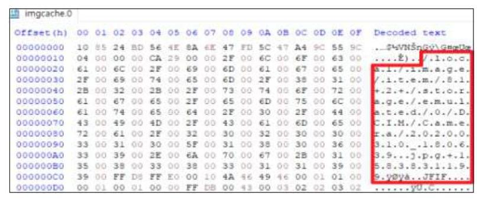

그림 2. 엠캐시 파일(imgcache.0) hex 구조
Figure 2. Hex structure of thumbcache file

표 1. 카메라 애플리케이션을 사용하여 저장된 데이터
Table 1. Data generated by camera applications

| 애플리케이션 이름 | 데이터 유형 | 경로 | 모델 |
| :--: | :--: | :--: | :--: |
| 기본 카메라 | 사진 - 동영상 | /sdcard/DCIM/Camera | SM-G950N   SM-960N   LM-G710N |
|  | 펌네임 | /sdcard/Android/data/com.sec.android.gallery3d/cache | SM-G950N   SM-960N |
|  |  | /sdcard/Android/data/com.android.gallery3d/cache | LM-G710N |
|  | 휴지통 | /sdcard/Android/data/com.sec.android.gallery3d/files/.Trash   /sdcard/Android/data/com.android.gallery3d/files/.trashcan | $\begin{aligned} & \text { SM-G950N } \\ & \text { SM-960N } \\ & \text { LM-G710N } \end{aligned}$ |
| Camera 360 9.7.6 | 사진 - 동영상 | /sdcard/DCIM/Camera | SM-G950N   SM-960N   LM-G710N |
|  | 사진 | /sdcard/Camera360/TempData/.sandbox/(Unix Time) | LM-G710N |
| B612 9.4.10 | 사진 | /sdcard/Pictures/B612 | SM-G950N   SM-960N   LM-G710N |
|  | 동영상 | /sdcard/Movies/B612 |  |
| Naver Line Camera 14.2.15 | 사진 - 동영상 | /sdcard/DCIM/LINECamera |  |
|  | 동영상 | /sdcard/Android/data/jp.naver.linecamera.android/files/video |  |
| YouCam Perfect 5.49.1 | 사진 - 동영상 | /sdcard/DCIM/YouCam Perfect |  |
| SNOW 9.4.21 | 사진 - 동영상 | /sdcard/SNOW |  |
| SweetSnap 3.14.100555 | 사진 - 동영상 | /sdcard/DCIM/Camera |  |
| Foodie 3.5.5 | 사진 - 동영상 | /sdcard/Foodie | SM-G950N   SM-960N   LM-G710N |
| Z Camera 4.47 | 사진 - 동영상 | /sdcard/DCIM/Camera |  |
|  | 펌네임 | /sdcard/Android/data/com.jb.xcamera/cache |  |
| Sweet Selfie 3.12.1189 | 사진 - 동영상 | /sdcard/DCIM/Camera |  |
| Candy Camera 5.4.59-play | 사진 | /sdcard/DCIM/CandyCam |  |
|  | 동영상 | /sdcard/Movies/CandyCam |  |
| YouCam Makeup 5.66.2 | 사진 - 동영상 | /sdcard/DCIM/YouCam Makeup |  |
| Cymera 4.1.1 | 사진 | /sdcard/DCIM/Cymera2 |  |
| SODA 3.2.6 | 사진 - 동영상 | /sdcard/DCIM/Camera |  |
|  | 펌네임 | /sdcard/Android/data/com.snowcorp.soda.android/cache/glide |  |
| ULike 2.9.6 | 사진 - 동영상 | /sdcard/DCIM/Camera |  |
| Beauty Plus 7.1.000 | 사진 - 동영상 | /sdcard/DCIM/Camera |  |
|  | 사진 | /sdcard/BeautyPlus/.temp | LM-G710N |

# 3.2.2. 클라우드와 메신저 애플리케이션을 사용하여 저장된 데이터 

최근 화제가 된 일명 '명테그램 N번방 사건'이 있다. 범인은 메신저 애플리케이션 종류 중 하나인 명테그램을 사용하여 미성년자 등의 성착취 영상을 유포하고, 이를 통해 수익을 취했다 [21]. 이뿐만 아니라 'N번방'을 통해 유통된 것으로 추정 되는 성착취 동영상을 재판매하는 사건까지 발생했다 [22]. 메신저 애플리케이션은 대화창 기능과 더불어 데이터를 업로드 할 수 있는 기능, 카메라 촬영 기능 등을 함께 제공함으로써, 디지털 성범죄에 악용될 소지가 다분하다. 불법촬영 범죄현장 에서 용의자가 메신저 애플리케이션을 사용하면 손쉽게 데이터를 전송할 수 있고, 만약 다른 이에게 촬영물이 전송되어 데 이터가 확산된다면 촬영물의 삭제는 굉장히 어려워진다.

클라우드를 사용하면 메신저 애플리케이션과 비슷하게 굳이 PC 내부의 공간에 저장하지 않을 수 있으며, 언제 어디서든 필요한 자료를 업로드 및 다운로드할 수 있다 [23]. 클라우드 또한 모바일 기기에 애플리케이션을 설치하여 손쉽게 사용할 수 있다. 즉, 불법촬영 범죄 용의자가 클라우드 사용자라면 촬영물을 손쉽게 업로드할 수 있게 된다. 이와 같은 관점에서 본 연구에서는 클라우드와 메신저 애플리케이션 데이터를 분석해야 할 필요성을 느꼈다. 분석은 클라우드와 메신저 애플리케이

선 내에서 촬영물을 업로드, 자체 촬영 기능 사용 등의 이벤트로 인해 생성된 사진, 동영상, 펄네일 데이터를 탐색하는 과정 으로 진행하였다. 약 20 여 개의 앱을 분석한 결과 중 유의미한 내용을 선정하여 [표 2]에 정리했다. Wechat 애플리케이션 경로의 경우에는 [Random Directory] 부분이 모바일 기기 모델별로 상이했다.

표 2. 클라우드와 메신저 애플리케이션을 사용하여 저장된 데이터 Table 2. Data generated by cloud and messenger applications

|  애플리케이션 이름 및 종류 | 데이터 유형 | 경로 | 모델  |
| --- | --- | --- | --- |
|  Naver Line 10.8.3 | 펄네일 | /sdcard/Android/data/jp.naver.line.android/storage/mo | SM-G950N
SM-960N
LM-G710N  |
|   | 사진 | /sdcard/Android/data/jp.naver.line.android/storage/write | SM-960N  |
|  Telegram 6.1.1 | 사진 | /sdcard/Telegram/Telegram Images |   |
|   | 동영상 | /sdcard/Telegram/Telegram Video |   |
|   | 펄네일 | /sdcard/Android/data/org.telegram.messenger/cache |   |
|   | 사진 $\cdot$ 동영상 | /sdcard/Pictures/Telegram |   |
|  Wechat 7.0.13 | 사진 | /sdcard/tencent/MicroMsg/[Random Directory]/image2 |   |
|   | 동영상 | /sdcard/tencent/MicroMsg/[Random Directory]/video |   |
|  KaKaoTalk 8.8.6 | 펄네일 | sdcard/Android/data/com.kakao.talk/contents/Mg==/|Chat_1
d|/[Random Directory] |   |
|   | 동영상 | sdcard/Android/data/com.kakao.talk/contents/Mw==/|Chat_ 1d|/[Random Directory] |   |
|  WhatsApp 2.20.172 | 사진 | /sdcard/WhatsApp/Media/WhatsApp Images/Sent |   |
|   | 동영상 | /sdcard/WhatsApp/Media/WhatsApp Video/Sent |   |
|  Viber 13.0.0.4 | 펄네일 | /sdcard/Android/data/com.viber.voip/cache/ImageFetcherThu mb |   |
|  Naver Cloud 5.3.8 | 펄네일 | /sdcard/Android/data/com.nhn.android.ndrive/cache/image_m anager_disk_cache |   |
|  Degoo 1.57.30.200527 | 펄네일 | /sdcard/Android/data/com.degoo.android/cache |   |

또한, 메신저 애플리케이션에는 소위 '비밀 대화방' 혹은 '대화방 숨기기'와 같이 대화방 내용을 은닉할 수 있는 기능이 있 다. 비밀 대화방을 사용하면 대화방에서 주고받은 대화 내용은 기존의 모바일 기기에만 암호화되어 저장되고, 메신저 애플 리케이션 클라우드 서버에는 대화 내용이 저장되지 않는다. 즉, 동일한 계정일지라도 다른 모바일 기기에서 메신저 애플리 케이션에 로그인하면 이전 모바일 기기의 비밀 대화방 내용을 확인할 수 없다[24]. [표 2]의 유의미한 데이터가 존재했던 6 개의 메신저 애플리케이션 중 5 개가 대화방을 은닉할 수 있는 기능이 존재했다. KaKaoTalk, Telegram, Viber 메신저 앱에는 '비밀 대화방' 기능이 존재하고, Naver Line 앱에는 비밀 대화방 대신 '대화방 숨기기' 기능이 있다. WhatsApp은 대화방 보관 기능으로 대화방을 숨길 수 있다. 본 연구에서는 대화방을 은닉할 수 있는 기능을 통해 전송된 멀티미디어 데 이터에 대해서도 분석하고, Wechat 메신저 앱을 제외한 5 개의 앱에서 앞선 [표 2]와 동일한 결과를 확인했다.

# 3.2.3. 로그 데이터

'로그'란 PC에서 발생한 이벤트, 프로세스 내용, 이용 상황 등을 시간의 흐름으로 기록한 것을 의미한다. 이러한 로그는 사고 발생 시 사고의 원인 파악, 데이터 복구 등에 도움이 된다 [25]. 안드로이드 운영체제가 탑재된 모바일 기기의 경우, 'logcat'이라는 ADB 명령을 통해 안드로이드 시스템, 최근 애플리케이션 구동 정보 등의 로그를 확인할 수 있다. 실제로 'logcat'은 스팩 트레이스의 기능 을 가지고 있어, 개발자가 애플리케이션 오류를 분석하는데 사용되고 [26], 다양한 오픈소스 프로그램에서도 응용된다 [27]. 'logcat'을 통해 출력되는 메시지의 형태는 크게 시간 정보, 로그 레벨, 구동되었던 애플리케이션의 패키지 이름, 구동 내 용 등으로 이루어져 있다. 애플리케이션 패키지 이름이란 애플리케이션의 고유 ID로 보통 'com.××××.×××'의 형태를 가지 고 있다. 즉, 패키지 이름을 통해 각 애플리케이션을 식별하는 것이 가능하다 [28]. 로그 레벨은 Verbose의 'V', Debug 의 'D', Info의 'I', Warn의 'W', Error의 'E', Assert의 'A'로 구성되어있고, 레벨별로 의미하는 바가 상이하다 [29]. 정 리하면, 'logcat'으로 출력되는 정보를 통해 사용자가 구동했던 애플리케이션, 그에 상응하는 시간 정보, 구동 내용 등을 확 인할 수 있다. 본 연구에서 제안하는 현장용 모바일 포맷식 도구는 지정한 시간 범위의 로그 데이터를 분석하여 카메라, 메 신저, 클라우드 애플리케이션의 구동 내역을 선별 $\cdot$ 분석할 수 있도록 제작되었다.

## 3.3. 현장용 모바일 포맷식 도구의 기능

### 3.3.1. Main 화면

현장용 모바일 포맷식 도구를 실행하면 Screen Record, Add Device, Agreement의 버튼 3개와 함께 창이 생성된 다. Screen Record는 도구를 사용하는 스크린을 동영상 녹화하여 저장할 수 있는 기능으로, Screen Record를 누르면

녹화를 시작할 수 있는 프로그램이 실행된다. 이후 'Start 버튼을 누르면 녹화가 시작되고, 창을 닫으면 자동으로 녹화 가 중지된다. 녹화된 동영상은 지정된 경로에 녹화 날짜와 시간으로 명명되어 ',avi' 파일 형태로 저장된다. 녹화된 영상을 통해 도구 사용과정을 살펴볼 수 있으며, 도구 사용이 적절했는가에 문제의 소지를 개선할 수 있다. Add Device는 안드로 이드 모바일 기기를 연결 $\cdot$ 분석 $\cdot$ 출력하는 기능을 제공하며, Agreement는 임의제출 확인서 작성 기능이다.
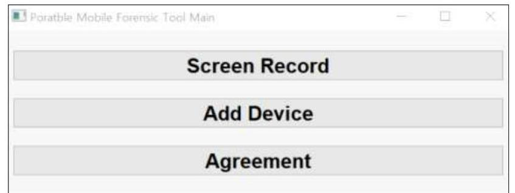

그림 3. 현찰용 모바일 포맷식 도구 Main 화면
Figure 3. Main screen of the tool

# 3.3.2. 안드로이드 모바일 기기 분석기능 

Main 화면의 Add Device를 누르면, 도구와 연결된 안드로이드 모바일 기기를 분석할 수 있는 화면이 생성된다. 이 화 면에서는 연결된 모바일 기기의 정보를 확인할 수 있고, 분석하고자 하는 항목과 파일의 시간 범위를 설정할 수 있다. 연결 된 모바일 기기의 정보로는 기기의 시리얼 번호와 모델명을 확인할 수 있다. [그림 4]에서는 시리얼 번호 '21d8a5ee0404 7ece'와 모델명 'SM_G960N'을 확인할 수 있다. 그리고 연결된 기기가 존재하지 않을 경우, 'No device found'의 경고창 이 생성되는데, 'Please connect the device.'라는 운구와 함께 모바일 기기의 연결을 권한다.
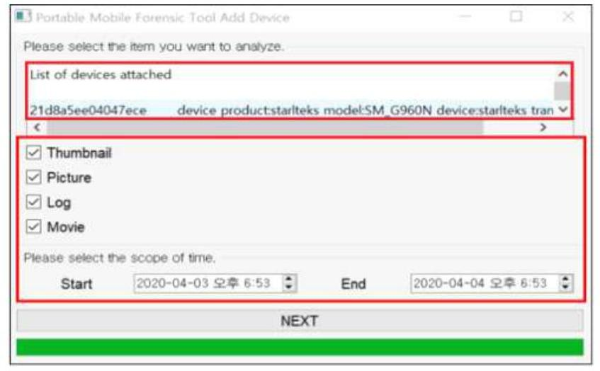

그림 4. Add Device 화면
Figure 4. 'Add Device' screen of the tool
분석항목은 썰네일(Thumbnail), 사진(Picture), 동영상(Movie), 로그(Log)로 총 4 가지가 있다. 사진, 동영상, 썰네 일은 앞서 언급한 분석대상의 경로에서 추출되며 로그는 'logcat' 명령어를 기반으로 수집된다. 4 가지 항목 중 원하는 항목 을 개별적으로 선택할 수 있다. 시간 범위는 Start에 설정한 시간부터 End에 설정한 시간까지의 범위로 지정된다. 도구는 사진, 동영상, 썰네일, 로그 중 선택한 항목의 파일을 가운데 설정한 시간 범위 안에 생성되어 접근된 데이터를 탐색하게 된 다. 이 기능을 통해 불법촬영 범죄현장에서 범죄 발생시간이 포함된 시간 범위 내에 접근된 데이터만을 탐색할 수 있다.

### 3.3.3. 로그 출력 기능

NEXT 버튼을 누른 후, 가장 먼저 결과가 출력되는 것은 선별된 로그 데이터다. 우측 하단의 Log Viewer 패널에서 출 력된 데이터를 확인할 수 있으며, 선별은 애플리케이션의 패키지 이름과 설정한 시간 범위를 기준으로 진행된다. 로그 데이 터를 선별할 때 입력된 애플리케이션 패키지 이름은 약 50 개며 수정할 수 있다. 로그 데이터에서 특정 앱의 패키지 이름을 탐색하여 카메라, 메신저, 클라우드, 안티포랜식 애플리케이션 등의 구동 내역을 확인할 수 있다.

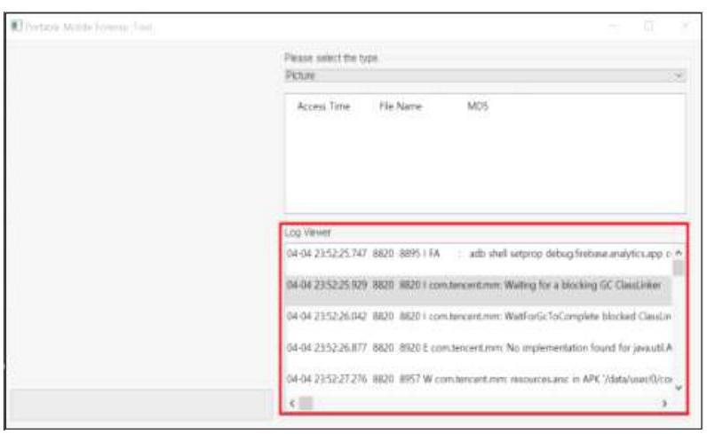

그림 5. 선별된 로그 데이터 출력
Figure 5. Selected log data

# 3.3.4. 웹네일(Thumbnail) 출력 기능 

우측 상단의 'Please select the type'이 적힌 채널에서 Picture, Movie, Thumbnail 항목 중 하나를 선택하여 문 석된 내용을 확인할 수 있다. 분석된 내용은 Access Time, File Name, MD5 할림에 정리되어 출력된다. Access Tim e은 파일의 접근시간을 의미하며, File Name은 파일 이름, MD5는 파일의 MD5 해시값을 의미한다. 목록에서 확인하고 자 하는 항목을 선택하면 좌측에 출력된다. 웹네일 데이터의 시그니처는 보통 JPEG의 시그니처와 동일하다는 특징을 가지 고 있다. 이러한 특징을 기반으로 도구에 JPEG의 시그니처를 탐색할 수 있도록 프로세스와 앞서 언급했던 LG 모바일 기 기의 웹캐시 파일의 구조와 내용을 분석할 수 있는 기능을 추가함으로써 웹네일 분석기능을 구현하였다.
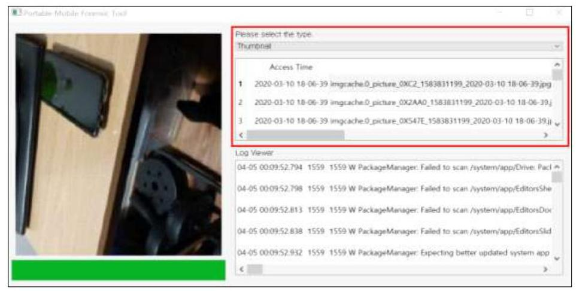

그림 6. 선별된 웹네일 데이터 출력
Figure 6. Selected thumbnail data
웹네일 데이터 추출 및 출력과정은 [그림 7]과 같다. 우선 탐색하고자 하는 웹네일 데이터가 Thumbcache 파일인지 아 닌지 구분한다. Thumbcache 파일인 경우 파일 내 메타데이터 중 Unix Time을 분석하여, 해당 원본 그래픽의 생성시간 을 파악한다. 다음으로 파악된 Unix Time이 Start Time과 End Time 범위에 해당하는지 파악하고, 범위에 해당하지 않는 경우 이와 같은 과정을 다음 대상 웹네일에 적용하여 반복한다. 범위에 해당하는 웹네일은 출력된다. 탐색하고자 하는 웹네일 데이터가 Thumbcache 파일이 아닌 경우에는 미리 지정한 웹네일 데이터가 저장된 경로에서 접근시간(Access Ti me)이 Start Time과 End Time 범위에 포함되는 파일을 탐색한다. 시간 범위의 파일들이 추려지고 나면, 파일들에서 J PEG 파일 시그니처를 가지고 있는 웹네일 파일들을 선별한다. 이렇게 두 가지 과정을 거쳐 선별되어 추출된 웹네일들은 접근시간(Access Time), 웹네일 경로, MD5 해시값 정보와 함께 도구에 출력된다. 사진과 동영상을 분석하여 출력하는 기능의 알고리즘도 이와 비슷한데, 웹네일 선별과정의 JPEG 파일 시그니처를 파악하는 것 대신에 확장자 '.jpg', 'mp4'를 파악하여 사진과 동영상 파일들을 선별하였다.

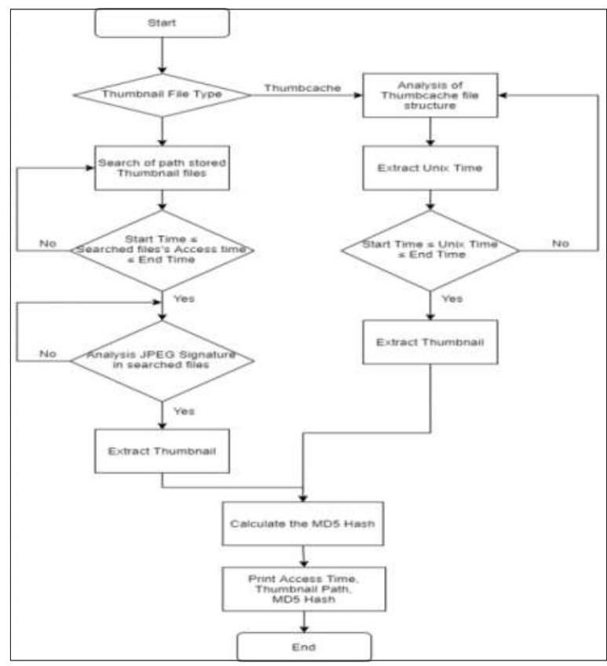

그림 7. 썸네일 분석 알고리즘
Figure 7. Algorithm of thumbnail analysis

# 3.3.5. 사진(Picture) $\cdot$ 동영상(Movie) 출력 기능 

썸네일의 출력과 동일한 원리로 우측 상단의 'Please select the type'이 적힌 채널에서 Picture와 Movie를 선택하 면 사진과 동영상 데이터를 각각 확인할 수 있다. 동영상 데이터의 경우 목록 중 항목을 선택하면 해당 동영상이 재생된다.
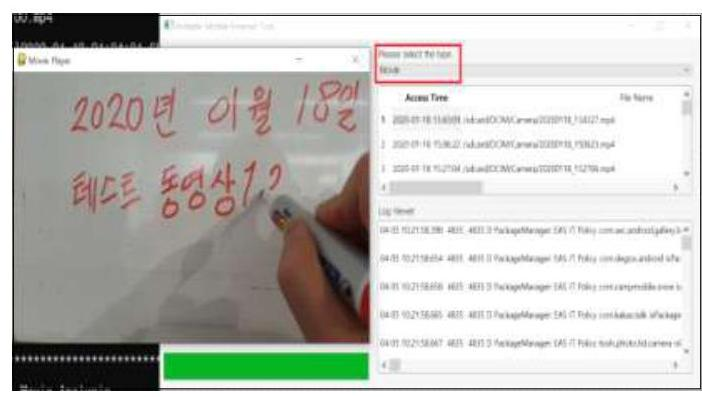

그림 8. 선별된 동영상 데이터 출력
Figure 8. Selected movie data

### 3.3.6. 임의제출 확인서 작성 기능

앞서 임의제출물의 적법한 압수에 관하여 설명한 바와 같이 임의제출에는 제출자의 임의성을 확실히 할 수 있는 조치가 필요하다. 또한, 임의제출 전자정보의 정확한 대상 및 범위도 제출당사자가 확인할 수 있어야 한다. 이를 위해 협의사실과 관련한 전자정보가 기재되고, 기재된 전자정보에 대하여 제출자의 동의 서명이 첨부할 수 있는 기능이 포함된다면, 현장에 서 임의제출자의 임의성 증명에 도움이 될 것이다.

실제로 경찰청 범죄수사규칙 제5장 제123조(임의제출물의 압수 등) 제3항에는 임의제출서를 제출하게 해야 한다는 내용과 함께 별지 제75호 서식인 임의제출서 양식이 공유되어 있다. 본 연구에서 제안하는 도구의 임의제출 확인서 작성 기능은 범죄수사규칙의 임의제출서 양식과 앞서 언급한 임의제출이 적법하기 위한 요건을 참고하여 제작되었으며, 도구 자체에 기능을 탑재하여 임의제출된 스마트폰에 대한 모바일 포맷식 직후에 임의제출에 대한 확인서를 바로 현장에서 출력하여 교부함으로써 임의성에 대한 논란을 미연 에 차단할 수 있다. 특히 임의제출확인서를 교부하기 위해서는 제출자의 참여와 이에 대한 서명확인이 필요하기 때문에 모바일 포맷 식 과정에서 제출자의 참여권을 담보할 수 있고 수사기관의 무분별한 탐색을 방지할 수 있어 제출자의 프라이버시를 보호할 수 있다.

도구의 Main 화면에서 Agreement 버튼을 누르면 임의제출 확인서 작성 기능으로 진입할 수 있다. 확인서를 작성하기 위해서는 제출자의 주민등록번호, 제출자 성명, 연락처, 분석하고자 하는 전자정보의 시간 범위(Start Time - End Tim e), 범죄현장, 담당 경찰관의 직급과 성명을 입력해야 한다. 정보를 입력한 후 APPLY 버튼을 누르면, 왼쪽에 임의제출 확 인서가 출력된다. 확인서에는 입력한 제출자에 관한 정보, 법률규정, 임의제출 고지와 관련한 내용, 안드로이드 모바일 기기 의 정보(모델, 시리얼 번호) 및 분석대상 전자정보 등의 내용이 포함된다. 임의제출 확인서에 정보들이 입력한 후 SIGNIN G 버튼을 클릭하면 서명할 수 있는 환경이 제공되며 Save 버튼을 눌러 임의제출 확인서 서명본을 저장할 수 있다. 서명본 은 '서명본 생성날짜_제출자 성명_Signed.pdf' 형태로 저장된다.
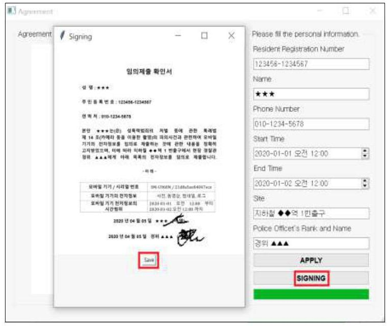

그림 9. 임의제출 확인서 서명 기능
Figure 9. Signing on the voluntary submission confirmation

# IV. 현장용 모바일 포렌식 도구 검증 

최근 수사기법의 일종으로 디지털 포렌식이 대두되어 자연스레 디지털 포렌식 도구의 공급과 수요가 늘어나는 추세이다. 하지만 디지털 포렌식 도구를 사용하여 추출한 결과가 법정에서 증거로써 증거능력을 인정받기 위해서는 사용한 디지털 포 렌식 도구가 신뢰성이 검증된 도구여야 한다. 하지만 국내에는 새로 개발되는 포렌식 도구에 대한 검증을 미국 NIST처럼 확인해주는 정부기관이 없어 미국 NIST와 국내 TTA에서 마련한 도구검증 항목들을 참고하여 현장용 모바일 포렌식 도구 에 적합한 신뢰성 검증항목을 설정하고 그에 대한 검증실험을 수행하였다.

## 4.1. 현장용 모바일 포렌식 도구 검증항목 수립

국내에는 아직 모바일 포렌식 도구 검증에 관한 표준이 제정되지 않았다. NIST에서 제정한 모바일 포렌식 도구의 요구 사항(Mobile Device Forensic Tool Test Spec V 3.0)도 본 연구에서 제안하는 현장용 모바일 포렌식 도구에 그대로 적용하기는 어렵다. 현장용 모바일 포렌식 도구는 데이터를 추출 - 이미징 하여 분석하는 것이 목적이 아니라 범죄현장에서 신속히 혐의를 파악하고, 혐의가 파악된 모바일 기기를 압수해 보존조치를 취하는 것을 목적으로 하기 때문이다. 또한, 임의 제출 확인서 작성 기능도 포함되어 있어 기존에 제정되었던 표준을 그대로 적용하기에는 한계가 있다.

이러한 한계를 이용로, 본 연구에서는 NIST의 모바일 포렌식 도구 요구사항과[30] 한국정보통신기술협회에서 제안한 디지털 증거 분석도구 검증(TTAK.KO-12.0112)을[31] 참고하여 현장용 모바일 포렌식 도구에 적합한 검증항목을 수립하 고, 이에 대한 실험을 진행하였다. [표 3]은 현장용 모바일 포렌식 도구의 실험을 위해 수립한 일반적인 검증항목 목록으 로, 기본적으로 만족해야 하는 요구사항을 포함한다. '참고항목' 열에는 TTA, NIST에서 참고한 부분을 표시하였다.

표 3. 현장용 모바일 포렌식 도구의 일반적인 검증항목
Table 3. General verification item of the tool

| 구분 | 내용 | 참고항목 |
| :--: | :--: | :--: |
| A_01 | 현장용 모바일 포렌식 도구에서 출력되는 데이터의 변동 및 수정이 발생하지 않는다. | TTA의 GV_01   NIST의 MDT-CR-03 |
| A_02 | 현장용 모바일 포렌식 도구에서 출력되는 데이터의 변동 및 수정이 발생할 경우, 사용자에게 이를 알린다. | NIST의 MDT-CR-04 |
| A_03 | 현장용 모바일 포렌식 도구에 모바일 기기 연결이 제대로 이루어지지 않은 경우, 사용자에게 이를 알린다. | NIST의 MDT-RO-05 |

| A_04 | 형의 파악을 위한 데이터의 분석기능이 제공된다. | TTA의 GV_04 |
| :--: | :--: | :--: |
| A_05 | 동일한 환경과 입력에 대해서 동일한 분석 결과를 출력한다. | TTA의 GV_05 |
| A_06 | 도구를 사용한 파일을 기록한다. | TTA의 GV_06 |
| A_07 | 도구를 사용하는데 방대한 오류 로그를 기록한다. | TTA의 GV_07 |
| A_08 | 재출사의 정보, 제출된 모바일 기기의 정보, 범죄 발생시간 및 장소, 담당 경찰관 등의 정보가 정확히 기록된 일의제출 확인서가 작성된다. | 없음 |

[표 4]는 현장용 모바일 포맷식 도구의 분석기능에 대한 검증항목으로, 분법촬영 범죄현장에서 현장용 모바일 포맷식 도 구가 탐색 $\cdot$ 분석해야 할 데이터와 관련한 내용을 포함한다.

표 4. 현장용 모바일 포맷식 도구의 분석기능 검증항목
Table 4. Analysis function verification item of the tool

| 구분 | 내용 | 참고항목 |
| :--: | :--: | :--: |
| B_01 | 현장용 모바일 포맷식 도구는 모바일 기기의 내부 데이터들에 대한 시간 정보를 정확히 분석한다. | TTA의 AFV_01 |
| B_02 | 증거 데이터에 관한 해시값 생성이 가능하다. | TTA의 AFV_07 |
| B_03 | 연결된 모바일 기기를 식별할 수 있는 고유의 정보를 제공한다. | NIST의 MDT-CA-01 |
| B_04 | 모바일 기기의 업데이트가이 데이터 사전, 동영상, 캠페인 등을 분석하고, 출력하는 기능을 제공한다. | NIST의 MDT-CA-05 |
| B_05 | 모바일 기기를 분석하여 데이터를 메인이나 클라우드 등에 업로드, 온라인 정황을 알 수 있다. | TTA의 AFV_02   NIST의 MDT-CA-08 |
| B_06 | 모바일 기기를 분석하여 카메라로 촬영한 정황을 알 수 있다. | TTA의 AFV_02 |

# 4.2. 수립한 검증항목에 대한 실험 

- 검증항목 : A_01, A_04, A_05, B_02, B_04
- 검증내용 : 현장용 모바일 포맷식 도구를 사용하여 특정 파일을 분석 $\cdot$ 출력한 후, 도구를 사용하기 전과의 해시값 비교 를 통해 특정 파일의 데이터가 변동했는지 확인한다. 실험 대상 파일명은 '20200421_170702.jpg'이며, 도구를 사용하기 전의 MD5 해시값은 '8d949e1adc5af59e4e6ceaccf98e5008'이다.
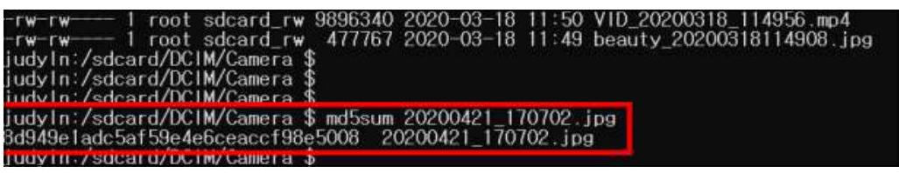

그림 10. 도구 사용 전 특정 파일의 MD5 해시값
Figure 10. MD5 hash value before tool use
현장용 모바일 포맷식 도구를 사용하여 '20200421_170702.jpg' 파일을 출력한 결과, 도구 사용하기 전의 해시값과 일 치하는 것을 확인할 수 있으며, 파일의 이름이 포함된 경로도 정상적으로 나옴을 확인할 수 있었다.
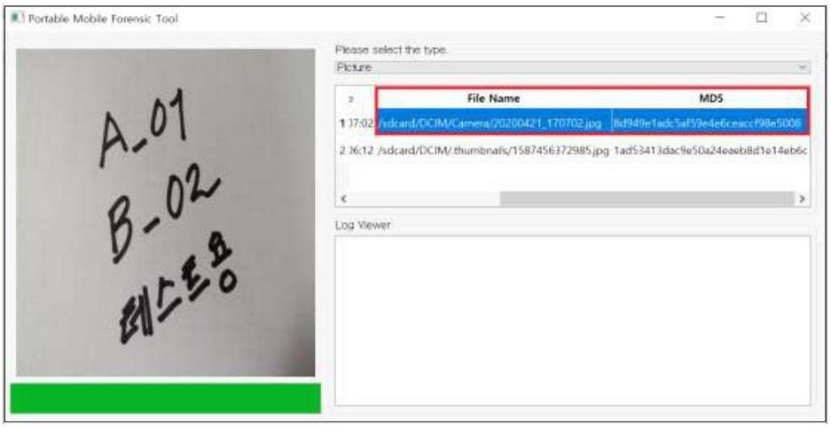

그림 11. 도구를 사용하여 20200421_170702.jpg 파일 출력
Figure 11. Print the 20200421_170702.jpg file

도구 사용 후, 앞서 수동으로 해시값을 확인했던 방식으로 '20200421_170702.jpg' 파일의 해시값을 확인하고, 비교한 결과 도 구 사용 전과 동일했다. 또한, 동일한 모바일 기기와 파일을 대상으로 수차례 더 분석을 수행한 결과도 알선 결과와 변함이 없었

다. 이에 따라 본 연구에서 제안하는 현장용 모바일 포랜식 도구는 A_01, A_04, A_05, B_02, B_04의 검증항목을 만족하였다.

- 검증항목 : B_01
- 검증내용 : 현장용 모바일 포랜식 도구를 사용하여 특정 파일을 분석$\cdot$출력한 후, 도구에 출력된 시간 정보 값과 직접 확인한 시간 정보가 일치하는지 확인한다. 실험 대상 파일명은 '20200421_190515.jpg'이며, 직접 확인한 접근시간은 '20 20-04-21 19:05:15.240047491'이다.
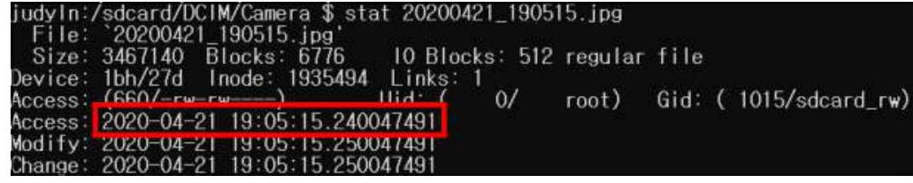

그림 12. 직접 확인한 시간 정보
Figure 12. Checked time information in person
도구에서 출력되는 '20200421_190515.jpg'파일의 접근시간을 확인하면, 소수점 이하의 수를 제외한 시간으로 '2020-04 -21 19:05:15'임을 알 수 있다. 이를 통해 실제 파일의 접근시간과 도구가 분석한 파일의 접근시간이 일치한다는 점을 알 수 있다. 본 연구에서 제안하는 현장용 모바일 포랜식 도구는 B_01 검증항목을 만족한다.
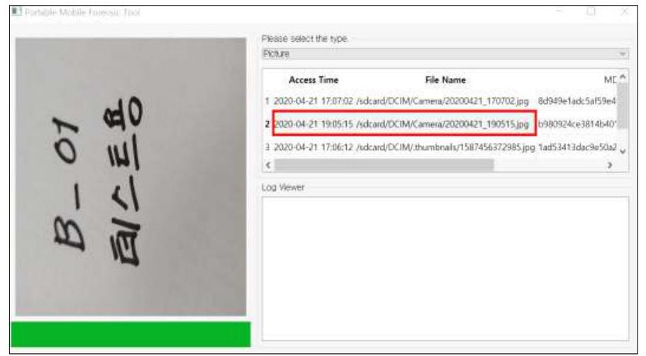

그림 13. 도구를 사용하여 확인한 시간 정보
Figure 13. Checked time information by tool

- 검증항목 : A_03
- 검증내용 : 본 연구에서 제안하는 현장용 모바일 포랜식 도구는 연결된 모바일 기기가 없을 경우 'No device found'의 경고창과 함께 'Please connect the device'라는 문구의 경고 메시지를 생성하며, 모바일 기기를 연결할 것을 알린다.
- 검증항목 : A_06
- 검증내용 : 본 연구에서 제안하는 현장용 모바일 포랜식 도구에는 화면 녹화 기능이 있어, 모바일 기기를 분석하는 과정 을 동영상으로 녹화하고, 저장할 수 있다. 동영상은 '.avi' 파일 형태로 저장되고, 이 동영상을 통해 도구를 사용한 전 과정 을 확인할 수 있다.
- 검증항목 : A_07
- 검증내용 : 본 연구에서 제안하는 현장용 모바일 포랜식 도구는 사용 중 발생하는 오류를 기록한다. '날짜와 시간_Error _Log.txt' 파일 형태의 로그가 생성되며, 이를 통해 분석되지 않은 파일, 운영체제 오류 등을 확인할 수 있다.
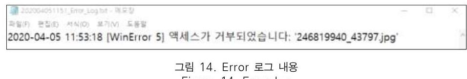

그림 14. Error 로그 내용
Figure 14. Error log

- 검증항목 : A_08
- 검증내용 : 본 연구에서 제안하는 현장용 모바일 포랜식 도구에는 임의체출 확인서 작성 기능이 포함되어있다. 확인서에 는 모바일 기기 제출자의 주민등록번호, 제출자 성명, 연락처, 분석하고자 하는 전자정보의 시간 범위(Start Time E nd Time), 범죄현장, 담당 경찰관의 직급과 성명, 제출자의 서명, 담당 경찰관의 서명이 포함된다.

- 검증항목 : B_03
- 검증내용 : 본 연구에서 제안하는 현장용 모바일 포랜식 도구는 연결된 모바일 기기 고유의 시리얼 번호와 모델명을 출 력한다. 이를 통해 연결된 모바일 기기를 식별할 수 있다.
- 검증항목 : B_05, B_06
- 검증내용 : 본 연구에서 제안하는 현장용 모바일 포랜식 도구는 선별 분석된 로그 데이터를 출력해주는 기능을 포함하고 있다. 선별된 로그에서는 카메라, 메신저, 클라우드, 안티포랜식 애플리케이션의 구동 흔적을 확인할 수 있다.

기존의 표준들을 토대로 수립한 현장용 모바일 포랜식 도구의 검증항목과 그의 결과에 따르면, 대부분 검증항목에 만족한 다. 하지만 불만족한 항목이 있고, 새로운 개념의 모바일 포랜식 도구와 검증항목의 제안인 만큼 향후 보완해야 할 점이 적 끊게 있다고 여긴다. 이를 반영하여, 본 연구에서 제안하는 현장용 모바일 포랜식 도구의 기능들은 지속적인 연구를 통해 추가 및 개선할 것이며, 이와 더불어 검증항목과 실험도 견고히 할 것이다.

# V. 걸 론 

디지털 성범죄에 대한 처벌을 강화하고, 예방대책에 관한 정책을 실시하고, 기술적으로 탐지 및 삭제 기술을 개발하는 등 디지털 성범죄의 피해를 줄이기 위한 노력이 범정부 차원에서 계속적으로 이어지고 있다. 하지만 여전히 불법촬영 범죄는 증가하고 있는 반면에 최초 범행현장에서의 증거수집의 어려움과 절차상의 하자로 인하여 피해자는 존재하지만 가해자가 처 벌받지 않은 상황이 종종 발생하곤 한다. 특히 스마트폰 보안강화로 증거수집이 어려워지고, 법원에서는 위변조가 용이한 디지털 증거에 대하여 엄격한 해석을 하고 있는 상황에서, 임의제출에 의한 스마트폰을 분석할 시 제출자의 임의성 확보, 신속$\cdot$정확한 분석을 통한 제출자의 프라이버시 보호 등을 담보할 수 있는 모바일 포랜식 도구의 개발이 필요하였다.

이러한 문제의식을 갖고 본 연구에서는 불법촬영 범죄현장에서 모바일 기기 임의제출의 적법성을 담보하기 위한 '현장용 모바일 포랜식 도구' 개발을 제안하였다. 특히 임의성 확인을 명확하게 하기 위한 방법은 제출자가 그 임의제출 사실을 충분 히 인지하고 그에 대한 사실을 서면에 서명 등의 방법으로 확인해주는 것이다. 현장용 모바일 포랜식 도구에서 임의제출 확 인서 작성 기능을 구현함으로써 제출자의 임의성을 확보하는 데에 기여할 것이라고 여긴다.

기존의 모바일 포랜식 도구를 사용하여 최초 현장에서 모바일 기기의 전자정보를 정밀분석하면 시간적, 환경적 제한사항 이 따르는 한편, 현실적으로 일선 파출소 또는 지구대 단위에 지방청 단위로 지급되는 모바일 포랜식 장비가 지급되지 않아 즉각적인 확인절차가 어렵다. 또한, 포랜식 분석 과정 중에 제출자의 참여권이 보장되지 않아 수사기관에 의한 무분별한 분 석으로 개인의 사생활이 노출될 위험성도 있다. 무엇보다 올해카메라 범죄와 같은 불법촬영 범죄는 영장에 의한 압수$\cdot$수색 으로 진행되기 보다는 주로 제출자가 스마트폰을 수사기관에 임의제출하여 분석이 이루어지다 보니 제출자의 임의성 확인이 중요하다. 즉 현장용 모바일 포랜식 도구는 기존의 모바일 도구와 마찬가지로 디지털 증거에 대한 동일성 및 무결성을 유지 하면서 무엇보다 현장에서 즉각적이고 신속하게 대응함과 동시에 임의성까지 확보할 수 있는 도구이다.

따라서 현장용 모바일 포랜식 도구는 현장에서 임의제출에 대한 임의성을 확보하고, 불법촬영 범죄혐의와 관련된 정보만을 신 속히 탐색하여, 혐의를 파악하고 초기대응에 기여할 수 있는 기술적 보완이 필요하다는 점에 착안하여, 불법촬영 범죄혐의를 파 악하는데 필요한 정보(사진, 동영상, 펄네일, 로그)를 시간 범위 내에서 신속히 선별분석할 수 있고 임의성을 확인할 수 있는 현 장용 모바일 포랜식 도구를 개발하였다. 또한, 판례에서 디지털 증거의 증거능력을 인정하기 위한 진정성 요건 중 검증된 포랜식 도구의 요건을 요구하고 있기 때문에 도구의 신뢰성 확보를 위한 도구 검증내용을 함께 검토하여 밝혀주었다. 검증 관련하여 국 내에 미국 NIST와 같은 검증기관이 없는 관계로 미국 NIST와 한국 TTA의 기준을 참고하여 도구의 신뢰성을 검증하였다.

본 연구는 불법촬영 범죄에 대한 초동 수사 단계에서 수사관이 신속하게 범죄 관련 증거를 찾고 적법한 절차에 의해 수 사가 이루어졌음을 확인해주는 현장용 모바일 포랜식 도구 개발을 제안하였다. 그리고 도구를 통해 출력된 결과의 신뢰성을 높이고자 검증, 실험, 증거능력 확보와 관련된 연구를 진행하여 법률과 기술의 융합을 도모하였다. 새로운 개념의 모바일 포 랜식 도구를 제안한 만큼 향후 보완할 점이 적지 않다고 여기며, 지속적인 연구를 통해 도구의 기능을 개선할 것이다. 본 연구의 내용이 향후 불법촬영 범죄의 증거 확보에 실질적인 도움이 되고, 특정 범죄현장에 최적화된 디지털 포랜식 도구의 개발에 촉진제 역할이 됐으면 하는 바람이다.

# 참 고 문 헌 (References) 

[1] Ministry of Science and ICT, "(As of April 2020) Subscription Line Statistics of Wireless Communication Service", 2020.
[2] Criminal Statistics of National Police Agency, "Crime occurrence and arrest status(Nationwide)", 2018.
[3] Korea Communication Commission, "170926 (Press release) Comprehensive Measures for the Prev ention of Damage to Digital Sexual Crimes(Common)", pp.2, 2017.
[4] J. O. Kim, H. H. Ham, "A Study on the Characters of Sexual Crime and the Suggestion of Crime Prevention in Swimming Beach : Focus on the Cases Haeundae Swimming Beach in Busan", Cris isonomy, 9(6), pp.176, 2013.
[5] Y. O. Cho, "A Study on the Factors Associated with Recidivism of Sex Offenders in the Hidden Surveillance Camera Crime in South Korea", Journal of Korean Public Police and Security Studies ,12(4), pp.157, 2016.
[6] Korea Communication Commission, "Comprehensive Measures for the Prevention of Damage to Di gital Sexual Crimes(Common)", Available : https://www.gov.kr/portal/ntnadmNews/1209515.
[7] S. H. Park, R. H. Kim, "Tears of a woman victim of hidden camera 'for millions of won for months to del ete the video.", JoongAng Ilbo, Available : https://news.joins.com/article/21974828.
[8] Korea Communication Commission, "Comprehensive Measures for the Prevention of Damage to Di gital Sexual Crimes(Common)", Available : https://www.gov.kr/portal/ntnadmNews/1209515.
[9] Android Help, "Reset your Android device to factory settings", Available : https://support.google.c om/android/answer/6088915?hl=en.
[10] S. H. Kim, Y. M. Kim, H. A. Kim, S. H. Seo, Y. J. Jang, "A Study on the Improvement Measures of the delete Damaged videos of Digital sexual violence", Ewha Journal of Gender and Law, 10(1), pp.49, 2018.
[11] Supreme Court of Korea, 2019. 11. 14. 2019 13290.
[12] Supreme Court of Korea, 2016. 2. 18. 2015 13726.
[13] M. K. Kim, S. J. Ryu, "Forensic Miranda Principle and Procedural Justice", Korean Criminological Review, 30(4), pp.305, 2019.
[14] Supreme Court of Korea, 2011. 5. 26. 2009 1190.
[15] Y. S. Kwon, "An Study Research on the Actual Status for the Establishment of Guidelines to Co llect and Handle Digital Evidence of Police", Journal of Law research, 33(2), pp.75-76, 2017.
[16] Y. J. Choi, "Legal Study of the Warrant in Principle and the Exception about Seizure and Search of Electro nically Stored Information : Mainly about Mobile Phones and Devices", The Justice, (153), pp.132, 2016.
[17] J. H. Oh, S. J. Lee, "A Study on the Analysis Methodology of Smartphone for Android Forensic s", Journal of Digital Forensics, (9), pp.54, 2012.
[18] J. M. Kim, S. J. Lee, "Digital forensic framework for illegal footage : Focused On Android Smar tphone", Journal of Digital Forensics, 12(3), pp.47-48, 2018.
[19] D. H. Yun, S. J. Lee, "Study for Android Smartphone`s Gallery Thumbnail Forensic Analysis", K IPS Review, 6(1), pp.31-36, 2017.
[20] D. H. Yun, S. J. Lee, "Study for Android Smartphone`s Gallery Thumbnail Forensic Analysis", K IPS Review, 6(1), pp.32-34, 2017.
[21] D. H. Han, "Police arrested 2 out of 3 accomplices Cho Ju-Bin...The Telegram vigilante is also under in vestigation.", The Seoul Economic Daily, Available : https://www.sedaily.com/NewsView/1Z1BHJQOVC.
[22] J. Y. Kwon, "I'm selling materials for room number N and Doctor's Room...Arrests in their 20s f or resale of sexual exploitation", Inews24, Available : http://www.inews24.com/view/1255056.
[23] Naver Encyclopedia, "Cloud", Available: https://terms.naver.com/entry.nhn?docId=3607510\&cid=58598\&categoryId=59316.
[24] M. H. Lee, S. J. Lee, "A Study on the User Data Acquisition Method of Cloud-Based Messenger Usi ng Acquisition of Authentication Information", Journal of Digital Forensics, 13(4), pp.337-338, 2019.
[25] Naver Encyclopedia, "Log", Available : https://terms.naver.com/entry.nhn?docId=754519\&cid=42 $341 \&$ categoryId $=42341$.
[26] M. C. Kim, C. K. Jeong, "User Control Trace for Android Application Failure Analysis", The Jou rnal of Korean Institute of Information Technology, 13(3), pp.73-74, 2015.
[27] GitHub, "logcat", Available : https://github.com/search?q=logcat.
[28] Android Studio, "Set the application ID", Available: https://developer.android.com/studio/build/application+id?hl=ko.
[29] Android Studio, "Write and View Logs with Logcat", Available:
https://developer.android.com/studio/debug/am-logcat\#kotlin.
[30] NIST, "Mobile Device Forensic Tool Test Spec V 3.0 (July 2019)", 2019.
[31] Telecommunications Technology Association(TTA), "Verification Specification of Digital Evidence Analysis Tool for Computer Forensics(TTAK.KO-12.0112)", 2009.

# 저 자 소 개 

김 승 균 (Seungkyu Kim)
준회원
2018년 2월 : 상육대학교 컴퓨터학부 컴퓨터시스템전공 졸업
2020년 8월 : 성균관대학교 일반대학원 과학수사학과 석사졸업
관심분야 : 모바일포렌식, 디지털포렌식 등

김 우 석 (Museok Kim)
준회원
2012년 6월 2013년 2월 : (주)지탱디시스템
2014년 4월 2014년 12월 : 식품의약품안전처 위패사범중앙조사단
2019년 2월 : 고려대학교 정보보호대학원 석사졸업
2019년 3월 현재 : 성균관대학교 일반대학원 과학수사학과 박사과정
2015년 2월 현재 : 경찰청
관심분야 : 모바일포렌식, 디지털포렌식, 산업보안, 과학수사 등

장 구 민 (Gumin Kang)
준회원
2012년 8월 : 성균관대학교 법과대학 법학박사(형사법)
2012년 9월 2013년 8월: University of Washington School of Law Post-Doctoral Fellow
2013년 4월 2013년 8월: 주 시애틀 대한민국 총영사관 법률자문위원
2018년 6월 2018년 8월: 특검 디지털포렌식 수사팀장(수사관, 3급)
2017년 3월 2020년 2월: 성균관대학교 과학수사학과 초빙교수
관심분야 : 디지털포렌식, 산업보안조사, 과학수사, 형사법 등

