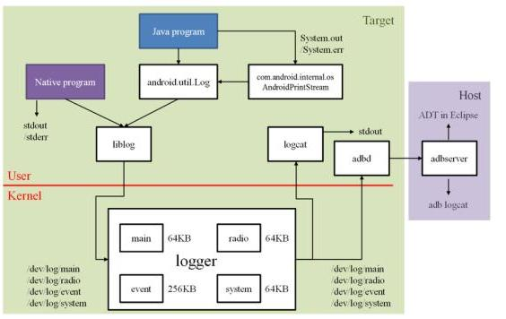
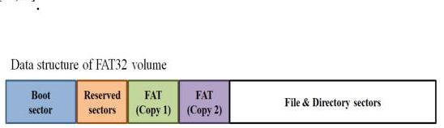
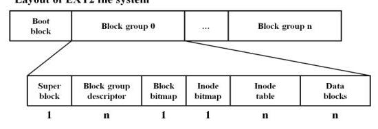
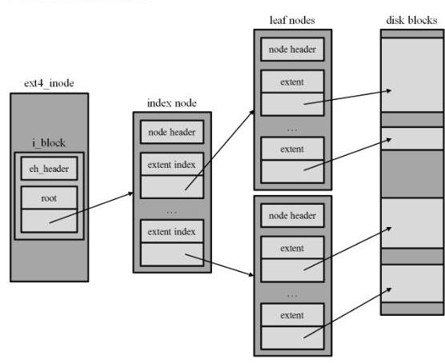
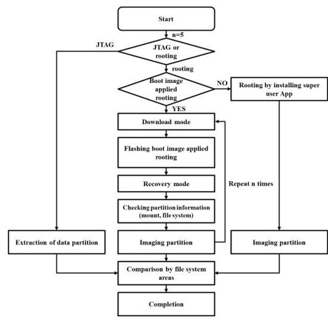
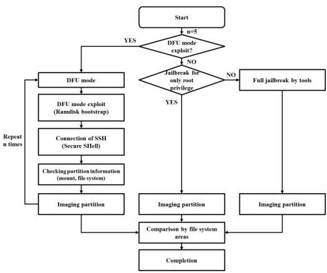
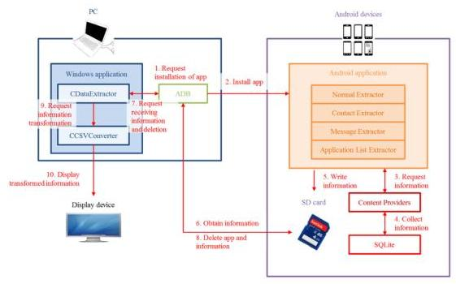

# 스마트폰 포랜식 및 증거 수집방안 동향 분석 

이 경 뮬*, 오 인 수*, 이 선 영*, 임 강 빈*

## Trends of Smartphone Forensic and Evidence Acquisition Methods

Kyungroul Lee*, Insu Oh*, Sun-Young Lee*, Kangbin Yim*

## 요 약

스마트폰이 보편화되면서 다양한 정보가 스마트폰 내부에 저장되어 편리한 생활이 가능하게 되었다. 하지만 이 러한 이점에도 불구하고 스마트폰을 통한, 혹은 스마트폰을 이용한 범죄가 발생하는 실정이며, 범죄와 관련된 다 양한 정보가 스마트폰에 저장됨으로써 이러한 정보를 확보하여 증거로 채택하는 것이 가능하다. 따라서 본 논문에 서는 스마트폰 포랜식에 대한 기술적인 동향을 분석하였으며, 스마트폰 내부에 저장되는 정보인 증거를 수집하는 방안에 대한 동향을 분석하였다.

Key Words : Smartphone, Forensic, Evidence acquisition, Android, Trend

## ABSTRACT

As smartphone become popular, various information is stored to smartphone inside, so people become to live a convenient life. Even though this advantage, there are many crimes using or by the smartphone, hence, the information stored in the smartphone is able to adapt as an evidence. Therefore, we analyzed trends of smartphone forensic and evidence acquisition methods in this paper.

## 1. 서 론

스마트폰은 과거 전화 위주의 기능을 제공하던 휴 대폰과 데이터를 전송하기 위한 무선 네트워크 기술 이 결합되어 장소에 구애받지 않고 기존 PC에서의 작 업이 가능한 기기로 발전하였다. 하지만 이러한 긍정 적인 측면에도 불구하고 범죄의 수단으로 활용되는 부정적인 측면도 존재한다. 피해사례로 2012년 1월 7 일 노컷뉴스 기사를 참조하면, 배경화면 앱인 New Year 2012 Live Wallpaper v1.3을 설치할 경우, 사용 자의 구글 이메일 주소, 안드로이드 ID, 앱 리스트, 국

가코드 등이 외부로 전송되는 문제점이 존재한다고 지적하였고 ${ }^{[1]}, 2012$ 년 3월 21 일 지디넷코리아의 보도 를 참조하면, 카카오톡을 통하여 피싱을 당한 사례가 접수되었다. 피해자는 친구로부터 카카오톡 메시지를 받아 600 만원을 송금했지만, 이는 공격자가 정당한 카카오톡 사용자로 위장한 것으로 몇 시간 뒤 대화명 과 사진이 바뀐 것으로 조사되었다. 또한 2012년 3월 7일 트위터를 통하여 분실한 스마트폰으로 카카오톡 에 저장된 가족에게 200 만원을 요청한 사기 사례가 공개되었다 ${ }^{[2]}$. 이와 같이 악의적인 사용자에 의한 피 해사례도 존재하지만, 사용자가 자신의 증거를 숨기기

[^0]
[^0]:    ※ 본 연구는 한국연구재단 이공분야기초연구사업(No. NRF-2015R1D1A1A01057300), 순천향대학교 학술연구비 지원 및 순천향대학교 산학협력단 관리로 수행되었습니다.

    - First Author: Soonchunhyang University R\&BD Center for Security and Safety Industries (SSI), carpedm@sch.ac.kr, 정회원
    * Corresponding Author: Soonchunhyang University Department of Information Security Engineering, yim@schac.kr, 정회원
    * Soonchunhyang University Department of Information Security Engineering, catalyst32@sch.ac.kr, 학생회원, sunlee@sch.ac.kr, 정회원 논문번호 : KICS2017-02-055, Received February 27, 2017; Revised April 21, 2017; Accepted May 11, 2017

위한 사례도 존재한다. 스마트폰에서는 공장에서 출시 한 상태로 되돌리는 기능인 초기화 기능을 제공하는 데, 사용자는 자신의 기기에 저장된 증거를 고의로 숨 기거나 제거하기 위하여 해당 기능을 악용한다. 특히, 애플사의 iOS는 복원이 불가능하고, 안드로이드 운영 체제는 상당부분이 복원이 불가능한 것으로 알려져 있다[7]. 따라서 이러한 상황에서도 증거를 확보하기 위한 연구가 필요하다.

상기와 같은 피해사례는 지속적으로 증가하는 추세이다. 사실 스마트폰에는 다양한 보안기능이 탑재되어 공격자에 의하여 악의적으로 활용되는 것을 방지한다. 안드로이드 운영체제는 이러한 보안기능을 위하여 샌드박스(sandbox)를 도입하였다. 샌드박스는 프로그램 을 보호된 영역에서 작동시켜 시스템의 악의적인 조 작을 방지하는 것으로, 보안에서의 안드로이드 핵심 구조이다. 샌드박스의 특징은 다른 앱 및 OS, 사용자 가 영향을 발생시킬 수 있는 동작에 대한 권한을 가질 수 없도록 방지한다. 이러한 동작은 각 앱의 기밀정보 (private data) 읽기 및 쓰기, 네트워크 접근, 다른 앱 파일 읽기 및 쓰기를 포함한다. 따라서 자신의 샌드박 스에 명시적인 선언이 없을 경우, 다른 앱의 기밀정보, 연관되지 않은 기능, 간섭 기능이 제한되며, 각 앱은 리스팅된 이상의 권한을 가지지 못한다. 그 외에도 리눅스 실행파일을 위한 groups, users, 서명검증 상속, 앱 서명, 앱 변경 시 재서명, 앱 인증서, 앱 ID 및 샌 드박스, 권한 이상을 수행할 경우 보안 예외 발생, 허 락되지 않은 행위 발생 시 앱 종료 및 로그 기록, 디바 이스별 비밀번호 관리, 원격 초기화 기능을 통한 데이 터 보호 기능을 제공한다[24].

이러한 보안기능은 접근제어를 통하여 제공되기도 하며, 안드로이드 앱은 AndroidManifest.xml에 명시 한 자원만 접근이 가능하다. 해당 xml 파일에는 앱 권 한과 자원뿐만 아니라 개발자가 명시한 부분이 포함 되며, 이를 토대로 리눅스에서의 UID/GID 기반의 접 근제어를 수행한다. 하지만 접근제어를 기록하는 대상 에서 차이점이 존재하는데, 리눅스는 /etc/passwd, /etc/group이지만, 안드로이드는 소스코드 내 system/ core/include/private/android_filesystem_config.h에 명시된다[3].

스마트폰에서 상기와 같은 보안기능을 제공하고 있 음에도 불구하고, 피해사례가 발생하는 원인은 스마트 폰 환경에서의 취약점이 존재하기 때문이다. 기술적인 요소를 떠나 가장 큰 문제점은 사용자의 인식이다. 사 용자의 대부분은 보안보다 기기와 개인정보의 분실에 대한 관심이 큰 것으로 조사되었다. Trend Micro의 조사결과에 따르면 사용자의 44%가 보안 소프트웨어 를 사용하고 있지 않으며, 18세 이상의 1,000명 사용 자가 감염이나 피싱보다 기기 및 개인정보의 분실이 더 심각한 것으로 생각한다고 조사되었다. 게다가 사 용자의 25%만 보안 소프트웨어를 사용하는 실정이었 으며, 20% 정도는 보안 소프트웨어의 설치가 필요하지 않는 것으로 조사되었다[4].

이러한 인식과 더불어 기술적으로도 다양한 취약점 이 드러나기 시작하였으며, 그 원인은 크게 루트 권한 획득, 악성코드, 개인정보 유출로 분류된다. 루트 권한 획득은 운영체제의 취약점을 주로 활용하며, 일례로 2007년 아이폰에서 libtiff 라이브러리 버퍼오버플로 우를 통한 루트 권한 획득 가능성, 2009년 SMS 메시 지 처리 과정에서 루트 권한 획득 가능성이 발견되었 다. 아이폰 외의 다른 운영체제에서도 SMS 메시지 처 리 과정, 그리고 멀티미디어 파일 처리 과정에서 버퍼 오버플로우를 통한 루트 권한 획득 가능성이 발견되 었다. 또한 사용자의 개인정보는 공격자에 의하여 다 양하게 활용이 가능하므로 이를 유출하는 악성코드도 등장하였다. 유출되는 개인정보로는 주소록 정보, 위 치 정보, IMEI(International Mobile Equipment Identity), 계좌정보 등의 민감한 정보가 포함되며, 실 제로 이러한 행위를 수행하는 악성 앱인 Aurora Feint 와 MogoRoad, Strom8이 발견되었다. Aurora Feint와 MogoRoad는 개인정보를 유출하는 것이 확인되어 앱 스토에서 판매가 금지되었고, Strom8은 캘리포니아 주에 의하여 소송되었다. 취약점이 발생하는 원인을 살펴보면, 버퍼오버플로우는 경계값 체크를 부적절하 게 수행함으로써 발생하며, 특히 GIF와 MP3와 같은 미디어 파일을 파싱하는 과정에서 주로 발생한다. 이 와 더불어 악의적인 코드가 삽입된 문서 및 SMS 메 시지 처리 과정에서 발생하는 취약점, 일반 사용자가 접근할 수 없는 폴더 접근 취약점 등으로 인하여 피해 사례가 발생하는 것으로 판단된다[4].

이러한 이유로 공격으로 인한 범죄를 규명하기 위 하여 디지털 포렌식 기술이 등장하였으며, 다양한 디 지털 증거를 수집함으로써 범죄 행위를 규명한다. 따 라서 본 논문에서는 현재 연구된 디지털 포렌식 기술 의 동향을 조사하고 분석하였으며, 증거를 수집하기 위한 방안에 대한 동향을 조사하고 분석하였다.

## Ⅱ. 스마트폰 포렌식 배경 지식

### 2.1 디지털 포렌식

디지털 증거를 수집하여 원본성과 무결성을 입증한

후, 증거로 보장된 자료를 분석하여 수사에 활용하는 과정을 디지털 포렌식이라 일컫는다. 포렌식이란 단어 는 "법 정의", "과학수사의"라는 의미를 가지며, 범죄 를 분석하기 위하여 일반적으로 생체 정보인 지문, 모 발, DNA 감식, 변사체 검사가 그 대상이었다. 하지만 IT 기술이 발전하고 정보사회로 급격하게 변화하는 과정에서 정보가 디지털화 되어 컴퓨터와 같은 디지 털 기기에 저장된 데이터가 증거나 단서로 활용되었 고, 이에 디지털 포렌식 기술이 발전하였다. 디지털 포렌식은 디지털 기기인 PC, PDA, 서버, 모바일 장치 등을 이용하는 범죄 및 해당 장치에 저장된 데이터를 기반으로 행위를 규명하는 것을 의미하며, 디지털 데 이터 획득 및 분석, 증거 추출, 보존, 표현 등의 과정 으로 구성된다. 이렇게 수집된 증거는 검찰과 같은 국 가 수사기관에서 범죄를 수사하기 위한 목적으로 참 용되며, 보험사기 및 내부정보 유출과 같은 민간 분야 에서도 디지털 포렌식 기술의 중요성이 높아지는 추 세이다 ${ }^{[3]}$.

디지털 포렌식의 수행은 운영체제의 활성화 여부에 따라 두 가지 경우로 분류되며, 일반적으로 활성화된 시스템에서의 휘발성 공간에 저장된 데이터를 수집한 후, 비휘발성 공간에 저장된 데이터를 수집하는 절차 로 진행된다 ${ }^{[6]}$. 이러한 절차에 따라 수집되는 데이터 는 크게 휘발성 데이터와 비휘발성 데이터로 분류된 다. 비휘발성 데이터는 일반적인 PC의 하드디스크와 같이 전원이 인가되지 않더라도 데이터가 보존되는 정보를 의미하며, 디지털 포렌식에서 주로 활용하는 데이터이다. 휘발성 데이터는 메모리와 같이 전원이 인가되지 않으면 소실되는 정보를 의미하며, 일반적인 포렌식 과정에서는 전원이 인가되지 않은 상태로 증 거가 채택되므로 수집에 주요한 대상은 아니었다. 하 지만 휘발성 데이터 중 로그가 플랫폼 하부 시스템부 터 응용 프로그램까지의 전반적으로 발생한 로그를 기록하기 때문에 사용자 행위를 추적하는데 유용한 자료로 활용이 가능하며, 비휘발성 메모리에 기록되지 않은 파일 접근 및 재생 시각과 같은 상세한 정보를 제공하는 특징, 그리고 이러한 로그가 임의로 조작될 수 없는 특징을 가지기 때문에 신뢰성이 높은 정보로 활용이 가능하여 최근에는 휘발성 데이터를 수집하는 연구도 진행되는 추세이다 ${ }^{[6]}$.

상기와 같이 디지털 포렌식에서 휘발성 및 비휘발 성 데이터를 수집하기 위해서는 일련의 절차가 필요 하며, 크게 증거 수집 준비, 증거 수집, 증거 분석, 증 거 제출로 분류된다. 증거 수집 준비 단계는 의미와 동일하게 증거를 수집하기 위한 환경을 구성함으로써

준비를 수행하는 단계이다. 증거 수집 단계는 운영체 제의 활성화 여부에 따라 활성화 시스템과 비활성화 시스템에서의 증거 수집으로 분류되며, 활성화 시스템 에서의 증거 수집은 운영체제가 종료되지 않은 상태 의 디지털 기기에서 증거를 수집하는 단계로, 주로 휘 발성 데이터를 수집한다. 하지만 휘발성 데이터들은 실행과정에서 변경되거나 훼손될 가능성이 존재하기 때문에 일반적으로 포렌식 도구를 사용하여 수집한다. 비휘발성 시스템에서의 증거 수집은 운영체제가 종료 된 상태의 디지털 기기에서 증거를 수집하는 단계로, 주로 하드디스크 및 플래시 메모리로부터 비휘발성 데이터를 수집한다. 증거 분석 단계는 수집한 데이터 로부터 실제 증거에 대한 의미를 도출하는 단계로, 다 양한 포렌식 도구를 통하여 암호 복구, 덤프 메모리 분석, 윈도우즈 레지스트리 분석, 타임라인 분석, 삭제 된 파일 복구, 비정상 파일 탐지, 이메일 분석, 로그 분석을 수행함으로써 증거를 확보한다. 마지막으로 증 거 제출 단계는 확보된 증거를 제출하는 단계로, 확보 된 증거의 신뢰성을 보장하기 위하여 무결성, 그리고 사용된 포렌식 도구를 검증하여야 한다. 확보된 증거 는 손상되거나 임의로 변조한 것이 아님을 확인하기 위하여 해시 및 오류 검증 알고리즘을 통하여 무결성 을 증명한다. 또한, 증거를 확보하는 과정에서 사용한 포렌식 도구도 동일하게 정보를 손상시키거나 임의로 변조하지 않는다는 것을 증명하여야 하며, 그 일례로 NIST에서 시행한 디지털 포렌식 도구 검증 보고서가 있다 ${ }^{[7]}$.

이와 같이 디지털 포렌식에서 증거를 확보하기 위 해서는 일련의 절차가 필요하며, 모바일 기기에서도 비슷하게 적용된다. 하지만 디지털 기기는 그 구성도 방대할 뿐만 아니라 다양한 특징을 가지기 때문에, 해 당 기기, 혹은 기기의 목적에 맞는 절차가 필요하다 ${ }^{[7]}$. 하지만 이러한 절차를 통해서도 모바일 기기에서 증 거를 분석하는 것은 쉽지 않다. 모바일 기기, 예를 들 어 안드로이드 기기의 경우에는 엄청난 양의 로그 메 시지를 다양하게 발생시킬 뿐만 아니라, 사용자의 행 위와 관련된 정보, 그리고 사용자의 행위와 관련되지 않은 정보가 복합적으로 발생되기 때문에 이러한 로 그를 의미가 있도록 해석하기 위해서는 많은 시간이 필요하며, 이를 위한 체크리스트 및 행위 파악을 위한 방안이 마련되어야 할 것으로 사료된다.

## 2.2 디지털 안티 포렌식

상기 긍정적인 의미의 디지털 포렌식과 반대 개념 인 디지털 안티 포렌식에 대한 연구도 진행되었다. 디

지털 안티 포렌식은 디지털 포렌식에서 증거로 활용 하는 정보를 수집하지 못하도록 방해 및 파괴하는 행 위를 의미한다. 이러한 행위는 크게 데이터 파괴, 데 이터 은닉, 데이터 조작, 데이터 출처 제거로 분류된 다. 데이터 파괴 행위는 증거로 활용하는 데이터를 사 용하지 못하도록 방해하거나 조사를 진행하지 못하도 록 방해하는 행위이며, 그 예로 파일 문제 기술이 있 다. 파일 문제 (file shredding)는 데이터가 증거로 사용 되지 않도록 완전히 파괴하는 방법으로, 파일 문제 앱 을 사용하여 데이터를 복구하지 못하도록 파괴한다. 파일 문제 앱의 일례로 file shredder가 있으며, 선택 한 파일을 대상으로 임의의 데이터를 반복하여 다시 써 넣음으로써 영구히 제거한다. 데이터 은닉 행위는 디지털 정보를 직관적으로 볼 수 없도록 정보를 변환 하는 행위이며, 그 예로 암호화 기술과 스테가노그래 피 기술이 있다. 암호화 기술의 근본적인 목적은 상호 간의 안전한 통신을 지원하여 기밀성을 보장하기 위 한 것이며, 암호화 앱의 일례인 LUKS manage 앱은 안드로이드 기기에서 루팅 후 가상 폴더를 마운트, 언 마운트, 생성, 삭제하는 관리 기능과 가상 폴더를 암 호화하는 기능을 제공한다. 스테가노그래피 기술은 데 이터에 정보를 숨기는 것을 의미하며, 이를 위한 데이 터로 용량이 큰 이미지 및 오디오, 비디오 파일과 같 은 미디어 파일을 주로 활용한다. 스테가노그래피 앱 의 일례로는 StegDroid Alpha 앱이 있으며, 비밀 메 시지를 숨긴 오디오 파일을 비밀번호를 기반으로 생 성한 후, 비밀번호를 입력하여 비밀 메시지를 추출하 는 기능을 제공한다. 데이터 조작 행위는 거짓된 증거 를 확인하도록 증거 정보를 조작하여 잘못된 정보나 우회 정보를 삽입하는 행위이며, 그 예로 정보 변조가 있다. 정보 변조는 동작 중인 상태에서 참조하는 정보, 혹은 저장된 정보를 변조함으로써 거짓된 정보를 믿 도록 유도하는 것으로, 대표적으로 위치 정보의 변조 가 있다. 위치 정보는 소셜 네트워크 서비스(SNS, Social Network Service) 앱과 앱 앱에서 주로 활용하 며, 자신의 위치를 숨기거나 거짓된 정보를 제공하기 위하여 위치 정보를 변조한다. 위치 정보 변조 앱의 일 례로는 Fake GPS Location 앱이 있으며, 현재 GPS 위 치를 거짓으로 설정할 수 있는 기능을 제공한다. 마지 막으로 데이터 출처 제거 행위는 증거의 신뢰성을 보장 하지 못하도록 증거의 출처를 제거하거나, 증거로 활용 되는 정보를 생성하지 못하도록 방해하는 행위이다[^1].

### 2.3 스마트폰 동향

스마트폰 동향 조사에서는 스마트폰의 역사 및 시 장 동향 및 점유율, 스마트폰 운영체제 특징 및 비교, 스마트폰 운영체제 종류 및 특징에 대하여 조사하고자 한다. 이러한 조사는 다음과 같은 내용을 포함한다.

스마트폰의 역사는 1991년 HP에서 PDA라는 명칭 을 사용하는 HP95LX 모델인 개인용 미니 휴대 컴퓨터로부터 유래되었다. 하지만 이 모델은 통신 모듈이 탑재되지 않은 LOTUS-123 프로그램과 일정 관리 기능이 탑재된 컴퓨터였다. 이후 2000년대에는 PDA에 통신 모듈이 장착되면서 비로소 스마트폰이라는 용어 가 사용되었으며, palm에서 만든 터치 기반의 단말기 가 성공을 거두었다. 이에 마이크로소프트에서 모바일 OS인 WinCE를 개발하였고, Rim의 BlackBerry, 노키아의 심비안이 등장하면서 스마트폰의 발전을 이루 었다. 중추적으로는 2007년 애플의 아이폰이 출시되 어 세계적으로 성공을 거두었으며, 2007년 구글이 open ecosystem을 발표함으로써 다음 해 최초의 안드로이드 폰인 G1이 출시되었다[^2]. 이와 같이 스마트폰 이 선풍적인 인기를 끌어 세계적으로 발전하였으며, 그 시장 역시 발전하였다. 특히 안드로이드의 경우에 는 2014년 2분기를 기준으로 세계적으로 84.7%를 점 유할 만큼 압도적이며, 국내에서도 88.6%의 점유율로 조사되었다[^3].

스마트폰 운영체제는 심비안, 블랙베리, iOS, 안드로이드, 윈도우 폰으로 분류되며[^4], 이를 표 1에 나타 내었다.

### 2.4 안드로이드 동향

안드로이드 동향 조사는 버전에 적합한 증거를 수 집하는 방안을 준비하기 위한 단계이며, 아키텍처, 컴 포넌트, 기능 및 특징에 대한 조사결과를 서술한다. 안드로이드 플랫폼은 리눅스 기반의 모바일 플랫폼으 로, 단순히 운영체제로만 구성된 것이 아닌 미들웨어, UI, 인터넷 브라우저, 다양한 어플리케이션으로 구성 된다. 안드로이드 플랫폼 아키텍처 및 구성요소는 어플리케이션, 어플리케이션 프레임워크, 라이브러리, 안드로이드 런타임, 리눅스 커널로 구성된다. 어플리케이션은 이메일 클라이언트, SMS 프로그램, 달력, 지도, 브라우저, 주소록 등의 어플리케이션이 제공되 며, 모든 어플리케이션이 자바 언어로 작성된다. 어플리케이션 프레임워크는 개발자에게 어플리케이션을 개발하기 위한 각종 클래스와 메소드를 제공한다. 라이브러리는 시스템 C 라이브러리, 미디어 라이브러리, surface 관리자, LibWebCore, 2D 그래픽 엔진, 3D 라이브러리, 데이터베이스 엔진 등 운영에 필요한 라이브러리가 제공된다. 안드로이드 런타임은 달력 가상

[^1]: 1197

표 1. 스마트폰 운영체제 특징 ${ }^{[4]}$
Table 1. Smart phone operating system features ${ }^{[4]}$

| Features | Symbian | BlackBerry | iOS | Android | Windows phone |
| :--: | :--: | :--: | :--: | :--: | :--: |
| Company | Symbian foundation | RIM | Apple | Google(OHA) | Microsoft |
| OS family | Mobile OS | Mobile OS | Mac OS X | Linux | Windows CE 7 |
| Supported CPU architecture | ARM, x86 | ARM | ARM | ARM, MIPS,   Power   architecture, x86 | ARM |
| Default web browser/engine | WebKit | WebKit | WebKit | WebKit | Internet explorer mobile 7.0 |
| 3rd party application store | Symbian horizon | App world | App store | Android marketplace | Windows marketplace for mobile |
| Email sync protocols supported | POP3, IMAP | - | POP3, IMAP,   MAPI | POP3, IMAP,   MAPI | POP3, IMAP,   MAPI |
| Official SDK platform | Windows | Windows | Mac OS X | Windows, Linux, Mac OS X | Windows |

머신이 핵심으로, 어플리케이션이 자바로 구현되기 때 문에 달빅 가상머신에서 최소 메모리로 사용하도록 최적화된 실행 가능한 포맷의 파일을 실행하며, 스레 딩과 저수준 메모리 관리 등의 기능은 리눅스 커널에 의존한다. 리눅스 커널은 보안, 프로세스 관리, 메모리 관리, 네트워크 관리와 같은 운영에 주요한 서비스를 제공하며, 하드웨어와 상위 소프트웨어 스택 간 추상 화된 계층 역할을 수행한다 ${ }^{[10]}$.

안드로이드 아키텍처 및 구성요소를 기반으로 다양 한 콤포넌트가 제공되며, 액티비티(activity), 서비스 (service), 브로드캐스트 리시버(broadcast receivers), 컨텐트 프로바이더(content providers)가 있다. 액티비 티는 사용자와 상호작용이 가능한 하나의 사용자 인 터제이스를 나타내며, 하나의 어플리케이션은 한 개 이상의 액티비티를 포함한다. 서비스는 사용자 인터페 이스를 가지지 않고 백그라운드에서 실행되며, 액티비 티가 사라진 후에도 계속 동작하여야 하는 미디어 플 레이어와 같은 경우에 사용된다. 브로드캐스트 리시버 는 브로드캐스트 공지(announcement)를 수신하고 응 답하는 역할을 수행하는데, 이벤트가 발생한 경우 이 를 알려주는 역할을 수행한다. 이는 별도의 사용자 인 터제이스를 가지지 않으며, 특정 브로드캐스트가 발생 하였을 경우, 해당 액티비티를 시작하거나 Notifica
tion Manager를 통하여 사용자에게 알리는 역할을 수행한다. 컨텐트 프로바이더는 다른 어플리케이션에

계 사용 가능한 특정 어플리케이션 집합을 만드는 것 으로, 데이터의 경우에는 파일 시스템을 비롯하여 여 러 종류의 의미가 있는 방식으로 저장이 가능하며, 이 를 통하여 어플리케이션 간 데이터를 공유하는 것이 가능하다 ${ }^{[11]}$. 안드로이드의 주요 기능과 특징은 표 2 와 같다 ${ }^{[10]}$.

## 2.5 안드로이드 로그 시스템

안드로이드 플랫폼에 대한 전반적인 분석을 기반으 로 포렌식 관점에서의 구성요소에 대한 분석이 필요 하며, 그 대상으로 안드로이드 로그 시스템이 있다. 일반적인 안드로이드 로그 시스템은 다음과 같다 ${ }^{[11]}$.
안드로이드 로그 시스템은 플랫폼 하부 시스템으로 부터 응용 프로그램까지 시스템의 전반적인 로그를 기록할 수 있도록 설계되어 있으며, 이는 리눅스 커널 로그인 dmesg와 /prockmsg 커널 로그와는 차이점을 가진다. 리눅스 로그 시스템은 로그 메시지 저장을 위 한 커널 드라이버와 커널 버퍼, 로그 앤트리 생성과 로그 메시지 접근을 위한 C, C++, Java 클래스 라이 브러리, 커널 버퍼로부터 로그 메시지를 읽어오는 프 로그램인 logcat, 타겟 디바이스로부터 로그 메시지를 확인하고 필터링하는 기능(eclipse, ddms)인 네 가지 구성요소로 이루어진다. 이러한 로그를 저장하기 위한 공간은 main, radio, event, system 네 가지 로그 버퍼 가 있으며, 커널 드라이버인 로거(logger)가 이를 관리

표 2. 안드로이드 주요 기능 및 특징 ${ }^{[10]}$ Table 2. Features of Android ${ }^{[10]}$

| Features | Description |
| :--: | :--: |
| Network support | GSM/EDGE   CDMA   EV-DO   UMTS   Bluetooth   Wi-Fi |
| Handset layout | Medium to large size display VGA   Support for existing smart phone layout |
| Graphic support | 2D graphics support   3D graphics support based on OpenGL ES 1.0 |
| Storage device | SQLite |
| Multi-touch | Restriction of multi-touch feature in the kernel to prevent Apple's touch screen patent infringement |
| Messaging | SMS, MMS, Threaded text message |
| Web browser | Open source WebKit browser |
| Java support | Running Java by Dalvik Virtual Machine |
| Multimedia support | H.263, H. 264, MPEG-4, SP, AMR, AAC, AMR-WB, AAC, HE-AAC, MP3, MIDI, OGG, WAV |
| Development environment | Emulator   Debugging tools   Memory/performance profiling Plug-in for the Eclipse IDE |
| Hardware support | Camera, Touch screen, GPS, Accelerometers, Electromagnets, 3D Graphics accelerator |
| Application support | PC download not supported Downloading and installing via OTA |

한다 ${ }^{[8,9]}$.
안드로이드에서 로그를 기록하기 위하여 로그 시스 템에 접근하는 방안을 살펴보면, 사용자 공간의 어플 리케이션은 커널의 버퍼에 저장된 로그에 직접 접근 할 수 없으므로 /dev 디렉토리에 리눅스 디바이스 노

그림 1. 안드로이드 로그 시스템[11]
Fig. 1. Android log system[11]
드를 제공함으로써 읽기 및 쓰기가 가능하다. 뿐만 아 니라 liblog라는 네이티브 라이브러리에서 디바이스 노드를 읽고 쓸 수 있는 API를 제공하므로 시스템 전 체에서 사용이 가능하며, C 로 작성된 네이티브 어플 리케이션 및 라이브러리에서 사용이 가능하다. C가 아닌 자바로 작성된 플랫폼 및 어플리케이션은 달빅 가상머신에서 동작하므로 android.util.Log, android.ut il.EventLog, android.util.Slog 클래스를 통하여 로그 시스템에 접근이 가능하며, 해당 클래스 내부에서는 liblog를 호출한다 ${ }^{[6]}$.

상기 안드로이드 로그 시스템으로부터 생성 가능한 로그의 종류는 로그 생성원 및 저장 위치의 특징에 따 라 다른 종류를 가진다. 로그 생성원에 따른 로그는 크게 기본 로그, 제조사 로그, 어플리케이션 로그로 분류된다. 기본 로그는 안드로이드 플랫폼에 내장된 로그로, 제조사가 수정하지 않으면 모든 디바이스에서 동일하게 나타나는 로그이다. 제조사 로그는 안드로이 드 플랫폼을 탑재하여 스마트폰을 출시하는 제조사가 오류 및 버그 등의 정보를 확인하기 위한 목적으로 기 록하는 로그이다. 어플리케이션 로그는 기본 로그와 제조사 로그를 제외한 로그를 의미하며, 실행 중인 엠 으로부터 생성하는 로그이다 ${ }^{[6]}$.

저장 위치에 따른 로그는 크게 main, event, radio, system으로 분류되며, main 로그는 메인 어플리케이 션 로그로, 어플리케이션 및 플랫폼 내부에서 android.util.Log 클래스를 이용하여 기록되는 로그이 다. 포맷식 관점에서 의미가 있는 로그의 대부분은 main에 기록된다. Event 로그는 시스템 이벤트 정보 를 위한 로그로, 어플리케이션 및 플랫폼 내부에서 android.util.EventLog 클래스를 이용하여 기록되는 로그이다. 로그 엔트리는 바이너리 형태의 파라미터와 태그 코드로 이루어져 있으며, 태그 코드는

/system/etc/event-log-tags에 저장된다. Radio 로그는 이동통신망 접속과 관련된 이벤트 로그이며, system 로그는 플랫폼 내부의 하위레벨 시스템 메시지 및 디 버깅을 위한 로그로, android.util.Slog 클래스를 이용 하여 기록되는 로그이다 ${ }^{[6,9]}$.

상기 로그 생성원에 따라 생성되는 로그는 각기 다 른 포맷을 가진다. 더 자세히 살펴보면, main, radio, system에 기록되는 로그는 텍스트 메시지로 구성되며, event에 기록되는 로그는 바이너리로 구성된다. 이러 한 특징으로 event 로그는 작은 크기로 저장되는 장점 이 있지만, 로그 버퍼로부터 읽기 및 이벤트 스트링을 디코딩할 경우에는 추가적인 처리가 필요한 단점이 존재한다. 로그의 각 엔트리는 메시지 깊이, 패딩, 프 로세스 ID, 스레드 ID, 타임스탱프, 메시지 내용으로 구성된다 ${ }^{[6]}$.

로그 시스템의 엔트리와 관련된 특징은 로그 엔트 리의 구조와 메모리상에 저장 가능한 엔트리의 최대 개수가 제조사별로 다를 수 있다는 것이다. 로그를 수 집하기 위하여 logcat 명령을 수행하면, 안드로이드 로그 엔트리는 텍스트 형태로 가공되어 출력되며, 각 로그의 내용은 해당 메시지가 발생한 시스템 혹은 어 플리케이션을 나타내는 태그, 타임스탱프, 메시지 로 그 레벨, 이벤트 우선순위, 로그 메시지 자체를 표시 하는 텍스트로 구성된다 ${ }^{[6]}$.

## 2.6 플래시 메모리

안드로이드에서의 디지털 포랜식과 관련하여, 로그 를 수집하기 위해서는 파일 시스템에 대한 분석이 필 요하며, 안드로이드 플랫폼에서는 플래시 메모리를 기 반으로 파일 시스템을 구성하므로, 플래시 메모리 중 류, 플래시 메모리를 이용한 파일 시스템 서비스 제공 방안 및 적용 방안에 대한 내용을 포함한다.

플래시 메모리의 종류는 크게 NAND, NOR가 있 다. 두 종류의 특징을 살펴보면, NAND 플래시 메모 리는 NOR 플래시 메모리에 비하여 집적도가 높아 10 배 이상의 내구성을 가지며, 비트 당 제작비용이 저렴 하다. 또한, 페이지 단위로 읽기/쓰기 동작이 가능한 장점이 존재하지만, 해당 페이지를 쓰거나 지울 경우 에는 페이지 단위의 블록을 삭제하여야 하는 특징이 있다 ${ }^{[12]}$.

NAND 플래시 메모리를 살펴보면, 데이터를 읽고 쓰는 기본적인 단위는 페이지이며, 한 페이지 크기는 512 바이트에서 2,048바이트를 가진다. 각 페이지는 해당 페이지에서 발생 가능한 예리를 보정하며, 관련 된 메타 데이터를 보관하는 여분의 공간인 spare 영역,

표 3. 플래시 메모리 기본 연산 수행 시간[13]
Table 3. Execution time of basic operation of flash memory[13]

|  Type | READ | WRITE | ERASE  |
| --- | --- | --- | --- |
|  DRAM | $\begin{gathered} 60 \mathrm{~ns}(2 \mathrm{~B}) \ 2.56 \mathrm{us}(512 \mathrm{~B}) \end{gathered}$ | $\begin{gathered} 60 \mathrm{~ns}(2 \mathrm{~B}) \ 512 \mathrm{us}(512 \mathrm{~B}) \end{gathered}$ | N/A  |
|  NOR | $\begin{gathered} 150 \mathrm{~ns}(1 \mathrm{~B}) \ 14.4 \mathrm{us}(512 \mathrm{~B}) \end{gathered}$ | $\begin{gathered} 211 \mathrm{~ns}(2 \mathrm{~B}) \ 3.53 \mathrm{us}(512 \mathrm{~B}) \end{gathered}$ | $1.2 \mathrm{~s}(128 \mathrm{~KB})$  |
|  NAND | $\begin{gathered} 10.2 \mathrm{~ns}(1 \mathrm{~B}) \ 35.9 \mathrm{us}(512 \mathrm{~B}) \end{gathered}$ | $\begin{gathered} 201 \mathrm{~ns}(2 \mathrm{~B}) \ 226 \mathrm{us}(512 \mathrm{~B}) \end{gathered}$ | $2 \mathrm{~ms}(16 \mathrm{~KB})$  |
|  DISK | Average
2.56 us (512B) | Average
$12.4 \mathrm{us}(2 \mathrm{~B})$ | N/A  |

또는 OOB(Out-Of-Band) 영역을 가진다. 플래시 메모 리는 기본적인 연산의 단위인 페이지를 블록으로 구 성하므로 구성된 블록이 플래시 메모리에서 관리하는 최소의 단위를 의미한다. 플래시 메모리의 기본 연산 수행시간은 표 3과 같다 ${ }^{[13]}$.

플래시 메모리는 블록으로 구성되고, 각 블록은 페 이지로 구성되며, 각 블록은 32 개 이상의 페이지로 구 성된다. 각 페이지는 512 바이트에서 2,048바이트의 크기를 가지며, 내부 여유 공간이 부족한 경우에는 블 록 내부에 유효하지 않은 페이지를 정리하여 여유 공 간을 할당하는 garbage collection 작업을 수행한다 ${ }^{[13]}$.

## 2.7 스마트폰 파일 시스템

상기와 같은 플래시 메모리를 이용하여 파일 시스 템을 제공함으로써 안드로이드 플랫폼에서 저장 장치 로 사용이 가능하다. 플래시 메모리를 이용한 파일 시 스텝 서비스 제공 방안 및 적용 방안, 파일 시스템 중 류 및 적용 대상, 안드로이드 플랫폼에서 활용하는 파 일 시스템인 JFFS2, YAFFS, FAT32, EXT2, EXT3, EXT4, 저널링 기능을 조사하였으며, 파일 시스템별 파티션 정보를 분석함으로써 증거를 수집하기 위한 방안에 대한 내용을 포함한다.

플래시 메모리를 이용하여 파일 시스템을 제공하는 방식은 플래시 메모리에 특화된 파일 시스템과 기존 파일 시스템을 에뮬레이션하는 파일 시스템으로 분류 된다. 메모리에 특화된 파일 시스템, 즉, 전용 파일 시 스텝은 플래시 메모리의 특성을 이해하여 특화시킴으 로써 전용으로 활용하는 파일 시스템을 의미한다. 기 존 파일 시스템을 에뮬레이션하는 파일 시스템은 FTL 과 같이 기존 파일 시스템을 사용하면서 플래시 메모 리를 블록 디바이스와 같이 에뮬레이션하는 방식이다 ${ }^{[29]}$. FTL은 플래시 메모리와 블록 디바이스 중간에 위 치하여 플래시 메모리를 블록 디바이스처럼 인식되도

록 한다. 만약 논리 주소에 대한 쓰기 요청은 가능한 물리 주소에 수행하고 그 매핑정보를 따로 관리하는 방식을 사용하기 때문에 블록 디바이스처럼 활용이 가능하다[13].

플래시 메모리에 특화된 파일 시스템은 JFFS와 YAFFS가 있으며, JFFS2는 JFFS를 발전시킨 것으로 LFS 구조를 사용한다. LFS 구조는 파일 시스템의 메타 데이터와 데이터를 묶어 로그 구조로 만들고, 이를 순차적인 방법으로 디스크에 저장하는 방식이다. LFS에서는 플래시 메모리에 대한 갱신을 다른 빈 페이지에 기록하여 플래시 메모리상에서의 삭제 연산을 최소화하는 방법을 사용한다. 이를 통하여 out-place 업데이트 연산을 최소화하는 방법을 사용하며, YAFFS의 경우에는 체크포인트 정책을 도입하여 빠른 초기화 수행을 지원한다[13].

따라서 상기와 같은 방식으로 플래시 메모리에 파일 시스템을 적용하는 것이 가능하다. 로그를 수집하기 위해서는 플래시 메모리 외에도 파일 시스템을 통하여 확보가 가능하므로 파일 시스템에 대한 조사 및 분석이 필요하다. 본 논문에서는 안드로이드 플랫폼에서 활용하는 JFFS2, YAFFS, FAT32, EXT2, EXT3, EXT4, 그리고 이에 포함되는 저널링 기능을 살펴보고, 파일 시스템별 파티션 정보를 살펴본다. 이러한 분석이 완료된 후에는 파일 시스템에 맞는 증거를 수집하는 것이 가능하며, 더 나아가 파일 시스템에 잔존하는 데이터를 조합 및 복구함으로써 삭제된 파일, 혹은 파일 시스템 일부에 저장된 추가적인 증거를 수집하는 것이 가능하다.

파일 시스템은 파일의 속성을 기록하는 메타 데이터 영역과 실제 데이터를 기록하는 데이터 영역으로 분류된다. 메타 데이터는 파일 시스템에서 파일을 관리하기 위한 정보이며, 파일 속성 및 실제 데이터가 기록된 위치를 찾기 위한 정보를 포함한다. 만약 운영 체제에서 파일 데이터를 읽기 위한 요청이 발생하면, 메타 데이터의 데이터 위치정보를 참조하여 실제 파일에 접근한다[12].

안드로이드 플랫폼에서는 다양한 파일 시스템을 활용하며, 플래시 메모리에서는 JFFS2, YAFFS, EXT2, EXT3, EXT4 파일 시스템, SD 카드에서는 FAT32 파일 시스템을 사용한다. 따라서 각 파일 시스템에 대한 이해가 필요하므로 이에 대한 조사 및 분석 결과를 다음에 서술한다.

JFFS(Journaling Flash File System)는 데이터를 로그 형태로 구성하여 쓸 때는 플래시 메모리에 순차적으로 쓰며, 읽을 때는 로그를 역순으로 검색하여 가장 최근에 갱신된 데이터를 읽는 방식이다. JFFS는 저널링 노드로 jffs_node 구조체를 사용하는데, 해당 노드의 크기는 48 bytes로 많은 공간을 차지하는 단점이 존재한다. 이러한 단점을 보완하기 위하여 JFFS2에서는 jffs2_raw_node_ref라는 16bytes의 크기를 가지는 구조체에 next_in_ino, next_phys, flash_offset, totlen 정보를 포함하여 기존 JFFS 시스템의 jffs_node을 대체함으로써 공간을 확보하였다. 하지만 이 파일 시스템 역시 메모리의 많은 부분을 jffs2_raw_node_ref을 저장하기 위한 공간을 확보하여야 하며, 노드를 찾아 파일의 구조를 결정하기 위한 시간이 많이 소모되는 단점이 존재한다. 또한 마운트 시 플래시 메모리 전체를 스캔하여야 하므로 용량에 따라 시간이 많이 걸리는 경우도 존재한다[13].

YAFFS(Yet Another Flash File System)은 JFFS2에서의 메모리 소모량이 많은 단점과 느린 마운트 성능을 개선하기 위하여 개발된 NAND 플래시 전용 파일 시스템이며, YAFFS2는 2002년 Aleph One에서 개발되었다. 이 파일 시스템은 로그 구조를 기반으로 플래시 메모리의 갱신 연산을 추가 연산으로 변형하여 처리하는 out-place 갱신 기법을 사용함으로써 플래시 메모리의 in-place 갱신이 어려운 단점을 보완한다. YAFFS2는 쓰기 연산을 위한 공간 요청이 발생하면 빈 블록을 찾기 위하여 블록 상태정보를 순차적으로 검색한 후, 그 결과를 기반으로 할당하기 때문에 블록 사용 횟수를 고려하지 않아 메모리를 균등하게 사용하지 못하는 단점이 있다. 또한 순차적으로 블록을 찾기 때문에 초기화 시점에 지연이 발생하는 등의 단점이 존재하며, 이를 보완하기 위한 방안으로 체크포인트 정책을 도입하였다. 해당 정책의 주요한 목적은 초기화에 걸리는 시간을 보완하는 것으로, 플래시 메모리의 상태를 마운트가 해제되는 시점에 기록하고 다음 초기화에서 플래시 전체를 검색하는 것이 아닌 체크포인트 영역을 읽어 파일 시스템의 상태를 복원하는 방법이다. 하지만 마운트가 정상적으로 해제되지 않을 경우에는 체크포인트가 무시되므로 이를 복구하기 위하여 메모리 전체를 다시 검색하여 읽어야 하는 문제점도 존재한다[13].

NAND 플래시의 구성요소인 페이지를 YAFFS2에서는 chunk로, spare를 tag라 명칭하며, chunk에는 object 헤더 및 파일 데이터 저장, tag에는 chunk와 object 정보를 저장한다. 따라서 하나의 파일은 2개 이상의 chunk와 tag로 이루어지며, 같은 object ID 값을 가진다. 여러 개의 chunk는 서로를 구분하기 위하여 chunk ID를 사용하며, 첫 번째 chunk에 object 헤더

가 기록된다. 파일의 구성은 Tnode-Tree를 구성함으로써 파일과 관련된 chunk를 관리한다. 하나의 Tnode 앤트리가 가진 값은 페이지의 물리 주소가 아니라 16 개 페이지로 구성된 그룹 주소를 가지며, 페이지를 찾기 위해서는 해당 페이지를 순차적으로 접근하여 각 페이지 tag 영역의 논리 주소와 일치 여부를 판단함으로써 페이지를 찾은 후, 데이터에 접근한다[13].

안드로이드 스마트폰에서는 내부 저장매체 외에도 외부 저장매체가 존재하며, NAND 플래시 메모리의 한 종류인 Micro SD Card를 사용한다. 해당 메모리를 위한 파일 시스템은 FAT32를 사용하므로 이를 상세하게 살펴본다. FAT32 구성은 불륜의 첫 번째 섹터를 의미하는 boot record, 예약된 영역인 reserved, 클러스터를 관리하는 테이블로 구성된 FAT#1과 #2, 실제 파일이 저장되는 data 영역과 사용하지 않은 영역으로 구성된다. FAT#1과 #2는 클러스터를 관리하는 테이블이 모인 공간으로 실제 파일 위치 및 크기, 이름과 같은 정보를 저장한다. 파일이 호출되면 FAT 테이블에서 파일의 실제 저장위치 정보를 확인한 후, 파일이 저장된 위치로 이동하는 방식으로 파일을 탐색한다. 하지만 이러한 방식은 탐색시간이 오래 걸리는 단점이 있으며, 테이블 영역이 손상될 경우에는 정상적인 파일도 사용하지 못하는 단점이 있다[12]. FAT32 파일 시스템의 구조는 다음과 같다[14].

EXT2 구성 요소는 크게 부트 섹터와 블록 그룹이 있다. 블록 그룹은 내부적으로 슈퍼 블록, 그룹 디스크립터 테이블, inode bitmap, inode table로 구성된다. 블록 그룹을 활용하면, 주요 데이터와 파일 데이터 간 집약도를 높이는 특성이 발생하여 파일을 저장할 때 발생하는 단편화를 줄이며, 파일 입/출력과 관련된 응답속도가 빠른 장점이 있다. EXT3은 EXT2에 저널링 기능을 추가한 것으로, 저널링 파일 시스템이란, 데이터를 쓰는 중 비정상적으로 종료될 경우, 파일 시스템이 손상되기 때문에 이를 복구하는 파일 시스템이다. 복구를 위해서는 특별한 공간을 확보하여 저널링에 필요한 정보를 저장한다. EXT4는 EXT3에서 사용하던 블록 매핑방식을 개선한 파일 시스템이다[12]. EXT2, EXT4 파일 시스템의 구조는 그림 3, 4와 같다[15,16].

**그림 2.** FAT32 파일 시스템

**Fig. 2.** FAT32 file system

**그림 3.** EXT2 파일 시스템[15]

**Fig. 3.** Layout of EXT2 file system[15]

EXT4 파일 시스템을 자세히 살펴보면, 운영체제에서 인식하는 부트 섹터와 여러 개의 블록 그룹으로 구성된 파일 시스템이다. 각 블록 그룹은 데이터 블록으로 구성되고, 슈퍼 블록이나 그룹 디스크립터 테이블, 예약된 영역은 모든 블록 그룹에 존재하는 것이 아니라 블록 그룹 간 일정한 간격으로 존재한다. 아이노드 테이블은 블록 그룹 내 존재하는 아이노드의 정보를 저장한 곳으로, EXT2/EXT3의 경우에는 데이터 파일이 저장되는 논리적인 블록번호를 direct/indirect 방법으로 표현한다. 이러한 방식은 작은 크기를 가진 파일에서 매우 효율적이지만, 큰 크기를 가진 파일은 단편화로 인하여 비효율적이다. 이를 보완하고자 EXT4는 크기와 상관없이 연속되는 블록을 나타내는 익스텐트 방법으로 효율성을 향상시켰다. 이는 익스텐트 트리를 사용함으로써 큰 파일을 효율적으로 나타내는 것이 가능하며, 단일 파일인 경우에는 인덱스 노드를 참조하여 여러 익스텐트가 참조하는 리프 노드에 접근이 가능하다. 리프 노드는 자신의 익스텐트를 통하여 논리 블록에 접근하는 방식으로 효율성을 향상시킨다[17].

이와 같이 안드로이드 플랫폼에서는 다양한 파일 시스템을 활용한다. 따라서 포렌식 관점에서는 각 파일에

**그림 4.** EXT4 파일 시스템[16]

**Fig. 4.** EXT4 extent tree layout[16]

표 4. 파일 시스템 별 파티션 정보 ${ }^{[18]}$ Table 4. Partition information by file systems ${ }^{[18]}$

|  Path | Name | File
system | Mount point  |
| --- | --- | --- | --- |
|  /dev/block/mmcblk0p32 | efs | ext4 | /efs  |
|  /dev/block/mmcblk0p24 | system | ext4 | /system  |
|  /dev/block/mmcblk0p25 | data | ext4 | /data  |
|  /dev/block/mmcblk0p26 | cache | ext4 | /cache  |
|  /dev/block/mmcblk0p29 | sdcard | vfat | /mnt/sdcard  |

일 시스템에 존재하는 증거를 수집하기 위한 배경으 로 파일 시스템 별 파티션 정보를 확인하는 것이 필요 하며, 기존에 분석된 갤럭시 노트의 파티션 정보를 다 음에 나타내었다 ${ }^{[18]}$.

이와 같이 안드로이드 플랫폼의 조사 및 분석 결과 를 기반으로 포렌식 관점에서 재해석함으로써 증거를 확보하기 위한 방안을 마련하는데 도움이 될 것으로 판단된다. 증거를 확보하기 위한 방안은 일반적인 포 렌식 절차를 토대로 확보가 가능하며, 모바일 및 스마 트폰에 특화된 방법에 대한 조사 및 분석결과를 기반 으로 확보하는 것도 가능하다. 이를 기반으로 실제 데 이터를 추출함으로써 증거 확보에 대한 결과를 도출 한 후, 증거를 활용하기 위한 방안을 마련하여야 할 것으로 판단된다. 우선, 다음 단계로 스마트폰 포렌식 에 대한 동향 조사를 서술한다.

## III. 스마트폰 포렌식 및 증거 수집방안 동향

## 3.1 스마트폰 포렌식 동향

스마트폰 포렌식 동향 조사에서는 기존의 모바일 포렌식에 대한 전반적인 동향 조사와 스마트폰 데이 터 수집 절차, 증거 수집 및 분석 과정, 수집 절차 호 를도에 대한 전반적인 내용을 서술하고자 한다. 이러 한 조사는 다음과 같은 내용을 포함한다.

모바일 포렌식은 모바일 기기를 기반으로 범죄 사 실의 증거 자료를 확보하기 위하여 전화번호부 및 음 성, 메시지, 사진, 동영상 등의 데이터를 수집하는 것 을 의미한다 ${ }^{[2]}$. 디지털 포렌식은 주로 PC나 서버와 같 은 기기를 대상으로 진행되었으며, 모바일 포렌식, 혹 은 스마트폰 포렌식에 대한 연구는 미비한 실정이다 ${ }^{[6]}$. 스마트폰의 데이터 수집 절차는 기존의 PC나 서버 에서의 수집 절차와 크게 다르지는 않지만, 세부적인 단계에서 차이점을 보인다. 특히 스마트폰 기기 중 안 드로이드 플랫폼을 사용하는 기기의 증거 수집 및 분 석에 대한 연구가 지속적으로 이루어지고 있으며, 이

러한 절차는 시아모(Andre Morun de L. Siamo)가 제 시한 것을 가장 많이 사용한다.

시아모가 제시한 스마트폰에서의 증거 수집 및 분 석 절차는 총 세 단계로 구성된다. 첫 번째 단계는 스 마트폰을 처음 수집하였을 때의 데이터 보존을 위한 절차로, 안드로이드 기기의 기종 및 버전 정보를 확인 한다. 기종 및 버전 정보는 차후 수집방안의 활용에 필요한 정보로, 루팅 시도 및 포렌식 도구 이용과 같 은 시도방법에 대한 힌트를 제공한다. 이러한 방법으 로 수집되는 정보는 수집과정에서의 데이터 소멸 및 유출을 방지하여야 하며, 보존상태에 따라 증거자료로 의 가치를 가지기 때문에 주의가 필요하다. 이에 대한 상세한 절차를 설명하면, 우선적으로 스마트폰의 전원 인가여부를 확인한다. 전원 인가여부에 따라 다른 방 법으로 수집을 시도하며, 전원이 꺼진 경우에는 SD 카드를 분리한 후, SD 카드 내에 저장된 데이터를 수 집한다. SD 카드의 수집이 완료되면, 스마트폰의 정 상적인 동작을 위하여 SD 카드의 복사본을 삽입한 후, 스마트폰에 전원을 인가하여 구동시킨다. 이 과정 에서 네트워크가 연결되는 경우, 내부의 정보가 유출 되거나 훼손될 가능성이 존재하며, 외부로부터의 악의 적인 명령에 의하여 데이터가 훼손될 수 있으므로 네 트워크로의 연결을 차단한다. 네트워크로의 연결을 차 단하는 방법 중 하나로는 비행기 모드로 전환하는 방 법이 있으며, 이 과정에서도 네트워크로 연결되는 순 간이 존재할 수 있으므로 그 정보를 기록하여 차후 증 거를 도출하는데 활용한다.

두 번째 단계는 기기의 접근에 대한 권한이 있을 경우에 해당하는 절차로, 예를 들어 비밀번호가 설정 되지 않아 잠기지 않은 상태가 이에 해당한다. 우선적 으로 SD 카드의 데이터를 추출하지 못한 경우, SD 카 드 내의 데이터를 추출한 후, 복사본을 저장한 SD 카 드를 삽입한다. SD 카드를 삽입한 후에는 기기 내의 데이터를 수집하기 위한 적절한 권한을 가지는지 확 인하며, 적절한 권한을 가질 경우에는 기기 내의 데이 터를 수집한다. 내부 데이터를 수집하기 위한 준비과 정으로는 USB 디버깅 도구, ADB, 안드로이드 SDK 중 하나를 선택하여 기기에 연결하며, 기기에 연결된 이후에는 접근이 허가된 적절한 권한을 통하여 내부 메모리에 저장된 시스템 파티션을 복사한다. 또한 활 성화 메모리에 저장된 데이터를 수집하기 위하여 COMMAND SHELL을 이용하며, 이를 통하여 메모 리를 덜프함으로써 기기 내의 비활성/활성 데이터를 수집한다.

마지막 단계는 기기의 접근에 대한 권한이 없을 경

우에 해당하는 절차로, 예를 들어 비밀번호가 설정되어 잠긴 상태가 이에 해당한다. 일반적으로 기기가 잠긴 경우에는 내부에 저장된 데이터에 소프트웨어로 접근하지 못하기 때문에 하드웨어를 통하여 데이터를 수집하며, 제조사나 인증이 허가된 업체로부터 요청받아 이를 수행하는 것이 가능하다. 만약 이러한 상황이 여의치 않은 경우에는 ADB를 통하여 슈퍼유저와 같은 적절한 권한으로 접근한다. 하지만 이 방법은 접근하기 쉬운 데이터만 추출이 가능하며, 인증하지 않은 상태에서 잠긴 데이터에 접근할 경우에는 증거로써의 가치가 없다는 단점이 존재한다. 이러한 방법으로 내/외부에 저장된 데이터를 수집하였다면, 이를 분석함으로써 증거를 도출한다[7].

상기 이러한 증거 수집 과정을 토대로 안드로이드와 iOS에서의 데이터 수집 절차를 다음에 나타내었다. 안드로이드에서의 데이터 수집 절차는 다음과 같다[18].

절차를 자세히 살펴보면, 기기의 접근에 권한이 없을 경우에는 JTAG이나 루팅을 통하여 데이터를 수집한다. JTAG을 활용하는 경우에는 JTAG 인터페이스를 통하여 데이터 파티션을 추출한 후, 파일 시스템 영역을 비교함으로써 내부 정보를 추출하는 과정을 거친다. 하드웨어적으로 추출하는 방법인 JTAG은 연결을 위한 핀을 숨기는 경우, 혹은 핀 자체를 제거하는 경우도 존재하기 때문에 이러한 경우에는 소프트웨어적인 방법으로 데이터 수집을 시도하며, 대표적인 방법이 루팅이다. 기기 내의 데이터를 수집하기 위해 서는 적절한 권한을 획득하여야 하지만, 일반적으로

그림 5. Data collection procedure on Android Fig. 5. 안드로이드에서의 데이터 수집 절차

정상적인 방법으로 권한을 획득하기는 어렵기 때문에 인증을 우회하는 방법 중 하나인 루팅을 통하여 권한을 획득한다. 루팅을 위한 방법은 크게 두 가지로 분류되며, 루팅을 위한 앱을 설치하는 방법과 루팅이 적용된 부트 이미지를 플래싱하는 방법이 있다. 루팅을 위한 앱을 설치하는 방법은 슈퍼유저 권한을 루팅하는 앱을 설치한 후, 기기 내의 데이터를 수집하기 위하여 파티션을 추출하며, 파일 시스템 영역을 비교함으로써 내부 정보를 추출하는 과정을 거친다. 루팅이 적용된 부트 이미지를 플래싱하는 방법은 루팅이 적용된 부트 이미지를 다운로드하기 위하여 다운로드 모드로 구동한 후, 루팅이 적용된 부트 이미지를 플래싱한다. 이후 복구 모드로 구동한 후, 마운트 및 파일 시스템과 같은 파티션 정보를 확인하여 수집을 위한 준비과정을 수행한다. 이러한 정보를 확인한 후, 파티션을 이미징하며, 상기 과정을 n번(일반적으로 5번) 반복적으로 추출하여 동일한 결과를 가질 경우에만 증거로 활용한다. 이후, 파일 시스템 영역을 비교함으로써 내부 정보를 추출하는 과정을 거친다[18].

iOS에서의 데이터 수집 절차는 그림 6과 같다[18]. 절차를 자세히 살펴보면, 안드로이드에서와 마찬가지로 권한을 획득하기 위하여 루팅을 시도한다. iOS에서 루팅을 위한 방법으로는 탈옥이 있으며, 루트 권한만을 획득하기 위한 탈옥과 탈옥 도구를 이용한 완전 탈옥으로 분류된다. 루트 권한만을 획득하기 위한 탈옥은 해당 목적만을 위하여 탈옥을 시도함으로써 루트 권한을 획득하며, 이후 파티션을 이미징한 후, 파일 시스템 영역을 비교함으로써 내부 정보를 추출하는 과정을 거친다. 탈옥 도구를 이용한 완전 탈옥도 마찬가지로 탈옥을 시도하여 루트 권한을 획득한 후, 파티션을 이미징하며, 파일 시스템 영역을 비교함으로써 내부 정보를 추출하는 과정을 거친다. 그 외의 방법으로 파티션을 이미징하기 위하여 DFU(Device Firmware Upgrade) 모드로 구동한 후, 이 상태에서 exploit을 시도하여 SSH(Secure SHell)로 접속한다. 접속이 완료되면, 마운트 및 파일 시스템과 같은 파티션 정보를 확인한 후, 이를 기반으로 파티션을 이미징하며, 이러한 과정을 n번(일반적으로 5번) 반복적으로 추출하여 동일한 결과를 가질 경우에만 증거로 활용한다. 이후, 파일 시스템 영역을 비교함으로써 내부 정보를 추출하는 과정을 거친다[18].

상기와 같은 방법을 통하여 스마트폰에서 증거를 수집하는 것이 가능하다. 특히 동일한 과정을 반복한 후, 그 결과가 동일할 경우에는 증거로써의 신뢰성을 확보하지만, 모바일 기기의 경우, 활성화된 상태에서

무결성을 유지하는 것이 어렵다. 따라서 이러한 상황에서도 증거를 확보하기 위해서는 적절한 포랜식 도구와 기술을 사용하여 신뢰성을 보장하는 것이 가능하다면, 현본 데이터가 최소한으로 손상되더라도 증거로써 인정받는 것이 가능하다.

### 3.2 증거 수집방안 동향

스마트폰 포랜식에 대한 조사 및 분석 결과를 기반으로 안드로이드에서의 증거 수집방안에 대한 상세한 내용을 조사 및 분석한다. 이러한 조사는 다음과 같은 내용을 포함한다.

증거 수집은 다양한 방안이 존재하며, 조사된 수집방안은 메모리 칩 분리, SYN, JTAG, revolving, 안드로이드 SDK의 ADB와 DDMS, 콘텐트 프로바이더, 루팅(임시 루팅, 완전 루팅), Nandroid 백업, 모바일 포랜식 프로그램 등을 이용한 포랜식 기법, FTK Imager를 이용한 외장 메모리 이미지 획득, 리눅스 dd 명령을 통한 내장 메모리 획득, 여러 형태로 저장되는 위치 정보 수집 기법, SQLite 데이터베이스 파일 분석 기법, XML 파일 분석 기법, 디바이스 노드(/dev/log), logcat, dumpstate, dumpsys, bugreport, 포랜식 장비(UFED), 포랜식 소프트웨어(oxygen forensic suit 2010, Paraben의 device seizure, Micro Systemation의 XRY), 디버깅, 제조사 프로그램 등이 있다. 본 논문에서는 이러한 방안을 소프트웨어와 하드웨어로 분류하고, 더 세분화하여, SD 카드 분석, 논리적 분석, 물리적 분석, chip-off로 분류한 후, 각 방안의 특성을 분석하여 분류결과를 도출한다. 뿐만 아니라 각 파일 시스템별 증거 수집방안도 조사 및 분석하여 상기와 같이 특성에 맞도록 분류한다.

### 3.2.1 데이터 수집 방안 동향

포랜식의 개념을 다시 살펴보면, 법정에서 증거로 사용하기 위하여 그 가치가 상실되지 않도록 증거를 수집, 보존, 처리하는 일련의 과정을 의미한다. 연산이 가능한 기기에 이동성이 추가됨으로써 장소에 구애받지 않고 사용이 가능한 장점이 있지만, 이를 이용한 범죄 역시 증가하고 있어 저장된 정보를 증거로 제출하는 디지털 포랜식으로 발전하였다. 따라서 컴퓨팅 환경에서 범죄가 발생하였을 경우에는 그 행위를 입증하기 위한 증거를 찾아야 한다. 증거를 찾기 위한 처음 단계는 증거의 흔적을 찾는 것이다. 컴퓨팅 환경에서는 다양한 정보들이 저장장치에 저장되며, 이를 흔히 로그라 부른다. 이러한 로그들은 수사를 위한 기초자료로 활용되거나 실제 증거로써의 가치를 가지기 때문에 로그를 수집하는 것이 중요한 절차 중 하나이다. 로그는 다양한 정보가 저장되는데, 예를 들면 행을 이용한 내역, 앱을 이용한 내역 등의 정보가 저장된다. 이러한 정보들은 시스템 스캔 행위, exploit 도구를 이용한 공격, 특정 사용자 계정으로 접속, root 권한 획득, 악성코드 설치, 자료 유출 및 삭제와 같은 악의적인 행위에 대한 흔적이 기록되기 때문에 상관관계를 분석함으로써 증거로의 가치를 가지게 된다[19].

상기와 같은 로그를 수집하는 방법은 크게 네 가지로, viaForensics의 운영자인 Andrew Hong이 DFI News에서 제안한 SD 카드 분석, 논리적 분석, 물리적 분석, chip-off 분석으로 분류된다[20,21].

SD 카드 분석은 SD 카드에 저장된 데이터를 분석하는 방법으로, SD 카드의 경우에는 일반적으로 FAT32 파일 시스템을 사용하기 때문에 FAT32 파일 시스템을 분석하는 방법을 사용한다[21]. SD 카드에는 보통 앱을 구동하는데 필요한 데이터가 저장되며, FAT32 파일 시스템이기 때문에 스마트폰 포랜식이 아닌 일반적인 PC의 포랜식을 통하여 정보를 분석하는 것이 가능하다[20].

논리적 분석은 앱을 이용하여 분석하는 방법으로, 데이터를 수집하기 위한 앱을 설치한 후, 이를 실행함으로써 데이터를 수집하고, 수집된 데이터를 SD 카드에 저장하여 증거를 확보한다[21]. 이 분석을 통하여 스마트폰 내부에 저장된 브라우저, 통화내역, 연락처, 멀티미디어(메타데이터), MMS, SMS, 일정, 앱 정보를 수집하는 것이 가능하다[20]. 이 방법으로 어플리케이션 데이터 공유 인터페이스(content provider)를 통하여 레코드 단위로 데이터를 추출하는 것이 가능하며, 루트권한을 획득한 후, 파일 단위, 혹은 파티션 이미지

그림 6. iOS에서의 증거 수집 절차

Fig. 6. Data collection procedure on iOS

지를 추출하는 것이 가능하다 ${ }^{[18]}$.
물리적 분석은 NAND 메모리의 덤프 이미지를 분 석하는 방법으로, 일반적으로 리눅스 dd 명령어를 이 용하며, 스마트폰은 데이터를 저장하기 위하여 PC와 같이 하드디스크를 활용하는 것이 아니라 플래시 메 모리, 특히 NAND 플래시 메모리를 사용하기 때문에 메모리 내부에 저장된 데이터를 수집하여 증거를 확 보한다. 이 방법은 dd 명령어를 실행하기 위한 루트 권한이 필요하며, 플래시 메모리의 경우에는 일반적으 로 YAFFS2 파일 시스템을 사용하기 때문에 YAFFS2 파일 시스템을 분석하는 방법을 사용한다 ${ }^{[21]}$. 이 분석은 메모리의 모든 정보를 수집하는 것이 가능한 장점이 있으며, 아직 상용화된 포맨식 도구는 없는 실정이다 ${ }^{[20]}$. 이러한 방법으로 플래시 메모리 내 비합당 영역과 파일 메타데이터를 포함한 모든 페이 지 영역을 획득할 수 있는 장점이 있지만, 데이터를 수집하는데 1GB 당 1 시간 정도로 시간이 많이 소요 되고 JTAG 핀을 차단하거나 핀 구성을 달리할 경우 에는 접근이 불가능한 단점이 존재한다 ${ }^{[18]}$.

Chip-off는 스마트폰 내부에 장착된 플래시 메모리 를 분리한 후, 하드웨어 방식으로 데이터를 분석하는 방법이다 ${ }^{[21]}$. 일반적으로 리더기를 이용하여 데이터를 수집하지만, 리더기는 포맨식이 주요한 목적인 장비가 아니므로 법정에서 무결성에 대한 문제가 발생할 가 능성이 존재한다 ${ }^{[20]}$.

### 3.2.2 각 방식 분류

상기의 분류를 기반으로 각 방식의 대한 자세한 조 사 및 분석 결과는 다음과 같다. SD 카드 방식은 J. Lessard가 루팅된 안드로이드 기기를 대상으로 상용 도구로 추출한 SD 카드 이미지의 다양한 분석방법을 설명하였다 ${ }^{[18]}$. Chip-off 방식으로 revolving 통신이 있다. Revolving 통신 방식은 기기의 고장 및 훼손의 경우, 증거를 확보하기 위한 방법으로, 메모리를 분리 하여 데이터를 추출하는 방식이다 ${ }^{[2]}$. 이와 같이 다른 방식으로 접근하기 어려운 경우, 기기에 부착된 메모 리를 분리한 후, 리더기를 이용하여 내부에 저장된 데 이터를 읽으며, 전체 데이터의 획득이 가능한 장점이 있다 ${ }^{[22]}$.

물리적 방식은 JTAG, 물리적인 포맨식 도구로 분 류된다. JTAG 방식은 전원 불량 및 데이터 삭제, 데 이터 정밀 분석의 목적으로 사용된다 ${ }^{[2]}$. JTAG(Joint Test Action Group)은 임베디드 시스템 개발 및 유지/ 보수에 활용하기 위한 디버깅 인터페이스로, 스마트폰 기기 내부의 JTAG 핀과 외부의 커넥터를 연결함으로

써 JTAG을 이용한 기기 내부의 제어가 가능하므로, 디버깅 및 데이터를 수집하는 것이 가능하다. 하지만 이를 통하여 악의적인 데이터를 삽입하거나 역공학을 활용한 악의적인 행위가 가능하므로 제조사마다 일반 적인 핀앱과는 다르게 구성하여 외부로부터의 허가되 지 않은 사용을 방지하거나 핀을 완전히 제거하는 경 우도 있으므로 모든 스마트폰 기기에 적용하지 못하 는 단점이 존재한다 ${ }^{[7,30,31]}$.

물리적인 포맨식 도구 방식은 국내에서는 아직 활 방히 개발되는 실정은 아니지만, 국외에서는 스마트폰 포맨식을 위한 다양한 도구들이 개발되어 왔으며, Cellebrite 사의 UFED(Universal Forensic Extraction Device), Micro Systemation 사의 XRY 프로그램 등 이 있다. 이들 도구는 하드웨어 장비를 이용하여 기기 내에 저장된 데이터를 추출하며, 이를 통하여 덤프된 메모리를 획득한 후, 별도의 소프트웨어 도구를 통하 여 그 결과를 분석하는 것이 가능하다. 이 도구를 통 하여 Palm OS, Microsoft Windows Mobile, Blackberry, Symbian, iPhone, Android가 탑재된 스 마트폰의 데이터를 추출할 수 있으며, 특히 연락처, SMS, 통화내역, 오디오, 비디오, 이미지, 벨소리, 기기 정보 등을 획득하는 것이 가능하다 ${ }^{[20]}$. 이러한 수집이 가능한 이유는 JTAG을 통하여 연결이 완료되면 내부 메모리에 전체적으로 접근이 가능하기 때문이다 ${ }^{[22]}$.

논리적 방식은 제조사 프로그램을 통한 백일(SYN, kies), 논리적인 포맨식 도구, 디버깅(ADB, DDMS), 로그 저장소(/dev/log, logcat, dumpsys, dumpstate, bugreport), 데이터베이스(SQLite, text, XML), 컨텐 트 프로바이더, 기타로 분류된다.

- 제조사 프로그램 방식

제조사 프로그램 방식은 제조사에서 제공하는 프로 그램을 통하여 데이터를 수집하는 방법으로 SYN 방 식, kies 프로그램으로 분류된다. SYN 방식은 전원이 정상적으로 인가된 상태에서 현장에서 긴급히 데이터 의 존재유무, 그리고 삭제되지 않은 데이터를 추출하 는 방식이다. 이는 별도의 프로그램을 사용하지 않고 이동식 디스크 장치로 인식되도록 제조사에서 제공하 는 것으로, USB로 기기를 연결시킬 경우에는 메모리 로 인식되어 저장된 데이터 및 삭제된 데이터의 확인 이 가능하다. 디스크로 인식되기 때문에 데이터의 손 상 없이 수집하는 것이 가능하고 삭제된 메모리 영역 의 분석도 가능한 장점이 있지만, 전파의 영향으로 데 이터의 손상이 발생하거나 전원 인가여부에 따라 실 행되는 앱과 같은 프로그램에 의한 데이터 변형 및 딜

어쓰기로 인한 데이터 손실의 단점이 존재한다 ${ }^{[7]}$.
Kies 프로그램은 안드로이드 운영체제를 탑재한 삼 성의 갤럭시 계열의 기기에서 적용이 가능하며, 제조 사인 삼성전자에서 백업을 위한 프로그램인 kies 프로 그램을 통하여 콘텐츠 매니저, 콘텐츠 스토어, 아웃룩 동기화와 같은 기능을 지원한다. 제공하는 프로그램은 별도의 USB 인식도구를 설치할 필요가 없으며, kies 프로그램을 설치한 후, 기기를 연결하여 PC로 데이터 를 백업하는 것이 가능하다.

윈도우 모바일 운영체제를 탑재한 홈니아는 6.1 버 전에서 Windows XP는 ActiveSync 4.5, Windows VISTA와 Windows 7은 윈도우 모바일 device center 로 백업이 가능하다. 기기를 USB로 연결하면, 이를 탐지하여 프로그램이 구동된다. 이를 위하여 업체에서 제공하는 USB 통합 드라이버를 설치한 후, 삼성 모바 일에서 제공하는 MITs store installer의 PC 유틸리티 의 MITs wizard 3.0을 PC에 설치하여야 하며, 이후 기기와 동기화함으로써 이메일, 전화번호부, 문자와 같은 데이터를 PC로 백업하는 것이 가능하다.

이 방식은 상기의 제조사에서 제공하는 프로그램을 통하여 기기에 저장된 데이터를 백업한 후, 백업된 파 일을 분석하는 방식이다. 이는 M. Bader가 아이폰 3GS를 대상으로 추출된 백업 파일의 분석기법을 설 명하였으며 ${ }^{[18]}$, 상기의 제조사 프로그램을 통하여 내 부에 저장된 파일의 백업이 가능하다. 스마트폰은 백 업 외에도 동기화 기능을 제공하며, 이를 통하여 스마 트폰에 저장된 데이터와 PC에 저장되는 데이터를 동 일한 상태로 유지한다. 동기화 과정은 스마트폰에 전 원이 인가된 상태에서 PC와 연결한 후, 설정된 동기 화 방식에 따라 동기화를 수행한다. 동기화 방식은 스 마트폰 위주의 동기화와 PC 위주의 동기화로 분류되 며, 각 방식에 따라 동기화를 수행한다. 동기화 중 기

표 5. 스마트폰 백업 자료 분석 결과 일례 Table 5. Example of analysis result of smartphone backup data

| Data | Android | Analyzable   program | Windows   mobile | Analyzable   program |
| :--: | :--: | :--: | :--: | :--: |
| Contact | .spb | kies | .vef | MITs |
| SMS | .sme | kies | .sms | MITs,   notepad |
| Calendar | .ssc | kies | .csv | MITs,   excel |
| Multimedia | .mp3,   .avi,   etc. | windows   media   player, etc. | .skm | windows   media   player, etc. |

기나 PC에서 오류가 발생할 경우에는 메시지를 출력 하며, 동기화는 중지된다. 이와 같이 기기와 PC의 동 기화를 통하여 백업된 자료의 분석 결과의 일례를 표 5 에 나타내었다 ${ }^{[2]}$.

표와 같이 백업된 파일을 백업을 수행한 PC가 아 닌 다른 PC, 예를 들어 증거를 도출하기 위한 PC에서 데이터의 접근여부를 확인한 결과, 홈니아의 백업파일 은 MITs 프로그램과 메모장, 엑셀과 같은 프로그램에 서 원본 데이터에 접근이 가능하였으며, 갤럭시의 백 업파일은 kies 프로그램을 통하여 원본 데이터에 접근 이 가능하였다 ${ }^{[2]}$.

- 논리적 포랜식 도구 방식

논리적인 포랜식 도구 방식은 상용화된 포랜식 도 구를 통하여 데이터를 수집하는 방법으로, Oxygen Forensic Suite 2010, Paraben 사의 Device Seizure, Micro Systemation 사의 XRY 프로그램이 있다. Oxygen Forensic Suite 2010은 통합적인 포랜식 프로 그램으로 다양한 플랫폼을 탑재한 스마트폰 내의 데 이터를 종합적으로 확인이 가능하다. 플랫폼별로 획득 가능한 정보는 차이가 있으며, 안드로이드 플랫폼 기 만은 문자 메시지 정보와 연락처, 일정, 통화내역에 대한 정보의 획득이 가능하다 ${ }^{[20]}$.

- 디버깅 방식

디버깅 방식은 printk, 하드웨어 디버깅, Java debugger, DDMS, TraceView, Logcat, Gdb/ Gdbserver, Gprof, LTTng, Kernel shark/Ftrace, Oprofile, Gdb/Kgdb로 분류된다.

스마트폰 제조사에서의 커널 디버깅은 보통 printk 함수를 이용하거나 하드웨어 디버깅을 이용한 방법으 로 수행하였으며, 필요할 경우에는 시리얼 통신을 이 용하여 $\operatorname{KGDB}$ (Kernel debugging with remote GDB) 디버깅을 수행한다. Printk 함수를 이용한 방법은 문 석에 필요한 모든 정보에 해당 함수를 호출하여야 하 므로 제한적인 단점이 있으며, 하드웨어 디버깅 방식 중 하나인 JTAG의 경우에는 별도의 장비가 필요하고 해당 핀을 삭제한 경우도 존재하므로 디버깅이 불가 능한 단점이 있다. KGDB 방식의 경우에도 양산 시점 에서 시리얼 인터페이스를 제거하는 경우도 존재하므 로 디버깅이 불가능한 단점이 존재하며, 최근 개발되 는 BSP(Board Support Package) 자체가 시리얼 KGDB를 지원하지 않는 문제점이 존재한다. 또한 시 리얼의 경우에는 속도가 느려 많은 정보를 전달하기 에 어려움이 존재한다. 그 외 LTTng, Ftrace, Oprofile

The Journal of Korean Institute of Communications and Information Sciences '17-06 Vol.42 No.06

등의 방식으로 디버깅이 가능하며, 프로파일 기법, 샘 플링 기법을 사용하여 병목 현상 및 소프트웨어 버그 의 해결이 가능하다[23].

안드로이드 운영체제 구조는 커널, C/C++로 구성 된 라이브러리, 달빅 가상머신, 네이티브 응용 프로그 램, 자바로 구현된 안드로이드 프레임워크, 응용 프로 그램으로 구성된다. 이와 같이 계층적, 그리고 복합적 인 언어로 구현되기 때문에 구성에 따라 개별적인 디 버깅을 수행하여야 하며, 이는 다양한 방법이 존재한 다. 그 중 공개 소프트웨어로 구현된 디버깅 방법은 표 6과 같다[23].

상기 방법을 수행방식에 따라 분류하면, 소프트웨어를 중지시킨 후, 디버깅하는 대화식 디버깅 방법은 자비언어를 디버깅하는 자바 디버거와 네이티브 응용 프로그램을 디버깅하는 Gdb/Gdbserver, 커널을 디버 깅하는 Gdb/Kgdb가 있으며, 커널을 제외한 디버깅 방식은 모두 호스트 머신과 타켓 머신 간 USB 인터 페이스를 통하여 디버깅이 가능하다. 그 중 Gdb/Kgdb 를 이용한 디버깅 방식은 USB 인터페이스를 이용할 수 없는 문제점을 가지며, 커널 로그 메시지도 부팅 후, ADB를 이용하여 /proc/kmsg를 읽어 확인하는 날 은 수준인 문제점을 가진다. 소프트웨어를 중지시키지 않는 방식은 Ftrace, LTTng, Oprofile 방식으로 디버 깅을 수행한다[23].

이러한 디버깅 방식 중 포랜식에 적용이 가능한 방 식은 ADB, DDMS로 분류된다. ADB는 Android Debug Bridge의 약자로, 안드로이드에서 디버깅을 위 하여 드라이버를 제공한다. 이 드라이버는 단순히 USB 벌크 통신을 위한 인터페이스만 존재하며, 유저 레벨에서 USB 벌크 통신을 활용함으로써 DDMS와 같은 디버깅 환경을 제공한다[23]. 안드로이드 스마트 폰과 애플레이터를 관리하기 위한 개발자용 디버깅 프로그램인 ADB는 PC와 연결하기 위하여 제조사 홈 페이지에서 제공하는 해당 스마트폰의 USB 드라이버 를 설치하여야 한다. 기기와 PC를 USB 인터페이스를 통하여 연결한 후, ADB를 이용하여 데이터를 수집한 다. 이를 통하여 명령을 수행하기 위해서는 기기의 USB debugging 기능을 활성화하여야 한다. ABD가 제공하는 기능으로는 단말기 연결확인, shell 접속 데 이터 추출 및 삽입, 응용 프로그램 실행, APK(android package) 설치 및 제거, 파일복사 등이 있으며, 데이 터 추출 및 삽입은 적절하지 않은 권한으로 인하여 접 근이 불가능한 영역에 저장된 데이터의 추출, 그리고 삽입이 불가능하다[22]. 이 도구는 안드로이드 SDK에 포함되어 있으며, 안드로이드 플랫폼 기반의 다양한 기기 또는 애플레이터에 다양한 명령을 전송하는 콘 솔 도구로, 이를 통하여 상기와 같은 기능을 제공하는 것이 가능하다. 리눅스 shell과 유사한 기능을 제공하 는 adb shell 명령어를 이용함으로써 기기 내부의 탐 색 및 dalvik-heap 덤프, 그리고 루트 권한이 있을 경 우에는 dd 명령어를 통하여 플래시 메모리 및 각 파티 선에 대한 물리적인 덤프 이미지를 생성하는 것이 가 능하다[7].

DDMS는 Dalvik Debug Monitoring Service의 약 자로, 안드로이드 SDK에 포함된 개발 도구이다. 이를 통하여 안드로이드 플랫폼을 사용하는 기기 및 애플 레이터에서 내부 동작상태의 모니터링이 가능하며, 특 정 상황을 가정하여 실행 중인 프로세스의 내부 제어 가 가능한 디버깅 도구이다. 이 도구는 포랜식을 목적 으로 제공되는 도구는 아니다. 하지만 일부 하드웨어 방식의 상용 모바일 포랜식 도구가 DDMS에서 제공 하는 기능과 유사한 방식으로 프로세스 정보 및 기기 와 관련된 정보를 수집한다. 이러한 기능을 활용하여 화면 캡처, 파일 탐색, 기기 및 어플리케이션 상태정

표 6. 계층별 안드로이드 스마트폰 디버깅 방법 Table 6. Debugging methods of android smartphone by layers

|  Layers | Java debugger | DDMS | Trace View | Logcat | Gdbv/ Gdbserver | Gprof | LTTng | Kernel shark/Ftrace | Oprofile | Gdb/ Kgdb | Printk  |
| --- | --- | --- | --- | --- | --- | --- | --- | --- | --- | --- | --- |
|  Java application | O | O | O | O | - | - | - | - | - | - | -  |
|  Android framework | O | O | O | O | - | - | - | - | - | - | -  |
|  Dalvik | - | - | - | O | O | O | - | - | O | - | -  |
|  Native applications | - | - | - | O | O | O | - | - | O | - | -  |
|  Libraries | - | - | - | O | O | O | - | - | O | - | -  |
|  Kernel | - | - | - | - | - | - | O | O | O | O | O  |

보, 실행 중인 프로세스 정보, 로그 등의 정보를 수집 하는 것이 가능하며, dalvik-heap 넘프 생성을 통하여 특정 프로세스의 메모리 정보를 수집한 후, 메모리 분 석 도구를 활용함으로써 메모리 할당 및 인스턴스 사 용정보, heap 메모리에 대한 전반적인 내용의 확인이 가능하다 ${ }^{[22]}$.

## - 로그 저장소 방식

로그 저장소에 저장된 로그를 수집함으로써 증거를 수집하는 것이 가능하다. 안드로이드 플랫폼에서의 로 그 저장소에 저장된 로그를 수집하는 방법 및 도구로 는 $/ \mathrm{dev} / \log$, logcat, dumpsys, dumpstate, bugreport가 있다. 안드로이드 기기에서 로그 메시지를 수집하기 위해서는 커널 내의 로그 버퍼에 접근하여야 하며, 일 반 유저공간의 프로그램으로는 접근이 불가능하다. 따 라서 이에 접근하기 위하여 디바이스 노드를 할당하 고 있으며, 파일 시스템 내의 $/ \mathrm{dev} / \log$ 에 위치한다. 이 노드를 통하여 수집된 데이터는 바이너리 형태로 로 그가 추출된다. 하지만 접근권한이 필요하기 때문에 루팅하지 않은 상태에서는 로그를 수집하기 어려운 단점이 존재한다 ${ }^{[6]}$.

안드로이드에서 제공하는 네이티브 프로그램인 logcat은 다양한 쿼리를 인자로 원하는 로그를 선택하 여 수집하는 것 가능하며, 출력되는 로그는 보통 로그 시각, 로그대그, 로그메시지 등의 텍스트형태로 출력 된다. Logcat을 이용하는 방법으로는 다음과 같이 메 인 로그 수집을 위하여 logcat -b main -b system -v threadtime -d *:v 명령을 수행하며, 이벤트 로 그 수집을 위하여 logcat -b events -v threadtime -d *:v, 무선통신 로그를 수집하기 위하여 logcat -b radio -v threadtime -d *:v 명령을 수행한다. 하지 만 logcat은 안드로이드 단말 내부에서만 실행되는 프 로그램이기 때문에 호스트에서 실행하기 위해서는 ADB 를 이용하여 접속한 후, 실행하여야 하는 단점이 있다. 따라서 이러한 기능을 편리하게 확인할 수 있도 록 호스트에서 실행 가능한 DDMS 도구를 제공한다 ${ }^{[6]}$.

Dumpstate는 안드로이드 내부 모든 로그, 메모리 및 프로세스 상태, 프로그램 설치정보와 같은 모든 로 그를 한 번에 출력하는 도구로, 단말에 탑재된 도구이 다 ${ }^{[6]}$. Dumpsys는 안드로이드 내의 어플리케이션 및 기기의 상태에 대한 자세한 정보를 제공한다. Dumpsys를 이용하는 방법으로는 메모리 사용정보를 표시하기 위하여 dumpsys meminfo 명령을 수행하며, 프로세서 사용정보를 표시하기 위하여 dumpsys
cpuinfo, 모든 계정 정보를 표시하기 위하여 dumpsys account, activity에 대한 정보를 표시하기 위하여 dumpsys activity, 키보드 및 윈도우에 대한 정보를 표시하기 위하여 dumpsys window, 접속 가능한 wifi 액세스 포인트 및 현재 연결상태를 표시하기 위하여 dumpsys wifi, 전원관리와 관련된 정보(wakelock, screen off time 등)를 표시하기 위하여 dumpsys power 명령을 수행한다 ${ }^{[24]}$. Bugreport는 상기의 로그, 즉, dumpsys, dumpstate, logcat에 대한 정보를 통합 적으로 출력하는 도구이다 ${ }^{[25,}{ }^{[26]}$.

- 데이터베이스 방식

데이터베이스 방식은 스마트폰 기기에 정보를 저장 하기 위하여 활용하는 데이터베이스, 일반적으로 SQLite 형태의 DB(DataBase) 파일에 저장하며, 그 외 텍스트, XML 파일에 저장하기도 한다. 이러한 파 일을 분석함으로써 다음과 같은 위치 정보의 추출이 가능하다 ${ }^{[27]}$.

상기와 같이 기본적으로 데이터베이스에 필요한 정 보, 예를 들어 앱의 경우에는 앱을 구동하는데 필요한 정보를 데이터베이스에 저장한 후, 구동 시 이를 로드 함으로써 정보를 일회성이 아닌 영구적으로 활용한다. 이와 같이 안드로이드 앱은 각 앱마다 할당받은 공간 에 데이터베이스를 생성하여 앱에서 필요한 정보를 저장하며, 저장되는 데이터베이스의 경로는 일반적으로/data/data/[package_name]/databases/이다. 이 경 로는 안드로이드 버전에 따라 다르게 구성될 수 있으 며, 안드로이드 버전 1.6 애플데이터를 기준으로 통화 내역과 연락처 정보는 data/data/com.android.provider s.contacts/databases/contacts.db이다. 이를 토대로 ABD 의 shell에서 sqlite3 명령어를 입력함으로써 데 이터베이스 내 저장된 데이터의 확인이 가능하다. 그 밖에 문자메시지와 관련된 정보는 mmssms.db, 북마 크 및 팹 검색 이력은 browser.db를 통하여 추출이 가 능하다. 하지만 상기와 같이 데이터베이스가 저장된 파티션인 /data 파티션은 관리자 권한을 획득하여야만 접근이 가능한 파티션이므로 관리자 권한을 획득하는 단계가 필요하며, 이와 같이 권한을 획득하는 방법 중 하나로는 루팅이 있다 ${ }^{[20]}$.

컨텐트 프로바이더 방식은 컨텐트 프로바이더를 이 용하여 기본 앱이 제공하는 데이터를 수집하는 방법 이다. 안드로이드 플랫폼은 기본적으로 자신이 아닌 다른 앱의 데이터에 접근할 수 없도록 보안기능 중 하 나인 샌드박스가 적용되어 있기 때문에 플랫폼 내의 다양한 앱이 활용하는 데이터를 수집하는 것은 불가

그림 7. 컨텐트 프로바이더를 통한 정보를 수집하는 시스템 구성 일례 Fig. 7. Example of a system configuration collecting information from content providers

능하다. 하지만 앱들 간 정보교환이 필요한 경우도 존재하기 때문에 이를 위하여 컨텐트 프로바이더를 제공하며, 대부분의 기본 앱은 컨텐트 프로바이더를 통하여 데이터를 수집하는 것이 가능하다[21]. 데이터를 수집하기 위한 절차는 다음과 같다[20].

상기와 같은 시스템을 구성하여 컨텐트 프로바이더를 통하여 저장된 데이터를 요청하는 것이 가능하며, 데이터의 요청은 URI를 통하여 요청한다. 이를 위하여 앱이 활용하는 데이터베이스에 저장된 정보를 추출하기 위한 extractor 계열의 클래스가 존재하며, 이 클래스에서 정보를 추출한 후, CSV 파일 형태로 SD 카드에 저장한다[21]. 이와 같은 extractor는 표 7과 같은 종류가 존재한다[20].

상기와 같은 과정을 통하여 스마트폰 기기에서 정보를 수집하면, SD 카드에 저장된 정보를 분석하기 위하여 사용자의 PC에서 확인이 가능하도록 준비하는 과정이 필요하다. PC에서 안드로이드 앱을 설치한 후 실행하면, 실행되는 앱에서 상기와 같은 과정으로 기기 내에 저장된 데이터를 수집하여 SD 카드에 저장한다. 앱이 데이터를 모두 수집하여 정상적으로 종료되면, SD 카드에 저장된 정보를 토대로 직관적으로 확인하기 위하여 이를 출력한다. SD 카드에 저장된 기기 내의 정보는 CSV로 저장되기 때문에 저장 유형에 따라 정보를 분류하여 출력함으로써 시각적으로 확인이 가능하다.

하지만 이 방식의 경우, 레코드 단위로 데이터를 추출하기 때문에 삭제된 레코드는 수집하지 못하며, 각 제조사마다 콘텐트 프로바이더를 변경하여 출시할 경우에는 해당 콘텐트 프로바이더를 알지 못하면 데이터를 수집하지 못하는 단점이 존재한다[22].

### 기타 방식

기타 방식은 다음과 같다. X.Lee는 안드로이드 플랫폼의 휘발성 데이터의 수집과 관련된 연구를 진행하였으며, 포맷식 프로그램이 내장된 포맷식 SD 카드를 이용하여 IMEI, 실행 중인 프로세스, 배터리 및 메모리 상태, wifi MAC 주소와 같은 휘발성 데이터의 수집 가능성을 연구하였다. D. Mohindra는 파일 시스템의 데이터뿐만 아니라 내장 명령어를 통하여 시스템 시간, 시스템 uptime, 실행 중인 프로세스, 네트워크 접속정보, IP 주소 등의 휘발성 정보의 수집 가능성을 연구하였으며, 이를 위하여 logcat, dumpstate를 이용하였지만, 상세한 방안을 서술하지는 않았다. V.Thing은 실시간으로 어플리케이션 간 전달되는 데이터를 수집하여 분석하는 연구를 진행하였다. 실험 시나리오는 메시지 길이, 전송 간격, 작성시간, 메모리 덤프 간격에 편차를 두어 메시지를 송/수신한 후, 각각의 시나리오를 수행할 때마다 휘발성 메모리를 덤프함으로써 덤프된 메모리에 송/수신 메시지의 저장 여부를 실험하였다[8]. S. Chen은 live CD/DVD/USB 포맷식의 개념과 유사한 live SD에 대한 연구를 진행하였으며, 안드로이드 기기를 복구모드로 부팅한 후, 데이터를 추출하는 방안을 제안하였지만, 이 방법의 경우에는 모든 기기에 적용하지 못하는 단점이 존재한다. J. Zdziarski는 iOS 기반 기기의 포맷식 기법을 종합적으로 소개하였으며, 탈옥된 기기에서 NetCat을 이용하여 파티션 이미지를 추출하는 방법을 설명하였다[18]. 그 외 Nandroid 백업, 모바일 포맷식 프로그램 등을 이용한 포맷식 기법, FTK Imager를 이용한 확장

표 7. 안드로이드 앱 구성 요소 Table 7. Components of android app

|  App | Class | Extractable information  |
| --- | --- | --- |
|  Android | Normal Extractor | Call history, image, video, audio, browser, calendar information  |
|   | Contact Extractor | Contact information  |
|   | Message Extractor | SMS and MMS information  |
|   | Application List Extractor | Installed apps information  |
|  Windows | CData Extractor | Android app installation and deletion, CSV file receiving and deletion  |
|   | CCSV Converter | Converting CSV file to string  |

메모리 이미지 획득, 루팅 및 리눅스 dd 명령을 통한 내장 메모리 획득, 분석기법, 여러 형태로 저장되는 위치정보 수집기법, 안드로이드 SQLite 데이터베이스 파일 분석기법 등의 방법으로 기기 내의 데이터를 수 집하는 것이 가능하다[16].

### 3.3 루팅

상기와 같은 방식을 통하여 스마트폰 기기에 저장 된 증거를 수집하는 것이 가능하며, 수집된 증거를 분 석함으로써 법적인 효력을 가지는 것이 가능하다. 하 지만 상기 방식 중 일부 방식의 경우, 주로 논리적 방 식의 경우에는 해당 과정을 수행하는데 적절한 권한 이 필요하다. 이러한 권한으로는 root와 같은 슈퍼유 저에 대한 권한이 있으며, 이를 획득하는 과정, 즉, 루 팅과정이 선행되어야 한다. 예를 들어 앱에서 사용하 는 데이터베이스에 접근하는 방식의 경우에는 일반적 으로 앱 간 접근권한이 없기 때문에 직접적으로 접근 하는 것은 불가능하다[20]. 이는 플랫폼에서 스스로를 보호하기 위하여 신뢰할 수 없는 프로그램이 보호된 영역에서 시스템을 악의적으로 조작하는 것을 방지하 기 위하여 샌드박스를 도입함으로써 보안성을 제공하 며, 기본적으로 사용자에게 루트 권한이 할당되지 않 기 때문이다[22]. 따라서 권한을 획득하기 위하여 루팅 한 후, 데이터베이스에 접근하여야 한다. 이와 같이 루팅은 안드로이드 운영체제의 관리자 권한을 획득하 는 행위를 의미하며, 관리자 권한을 획득하면, 일반 사용자 권한으로 불가능한 접근 및 변경, 삭제와 같은 행위가 가능하다. 하지만 루팅된 기기의 경우에는 A/S 지원이 중단되며, 보안적으로 취약한 상태를 유지하기 때문에 위협에 노출되는 문제점이 존재한다[20].

루팅의 종류는 임시 루팅(temporary rooting)과 한 전 루팅(permanent rooting)이 있다. 임시 루팅은 루트 권한을 일시적으로 획득하는 것이며, 완전 루팅은 지 속적으로 루트 권한을 획득하는 것이다. 임시 루팅의 경우에는 ADB 및 커널의 취약점을 통하여 기기가 재 부팅되기 전까지의 사용시간 동안 관리자 권한을 획 득하는 것이 가능하다. 완전 루팅의 경우에는 이미 루 팅을 적용한 부트 이미지를 다운로드함으로써 구동 시점에 관리자 권한을 획득하는 것이 가능하다. 이러 한 부트 이미지를 생성하는 방법은 커널 영역에 권한 을 획득하는 바이너리, 예를 들어, su와 busybox 바이 너리, Superuser.apk 등을 삽입하는 방법, 그리고 램디 스크 영역의 코드, 예를 들어 default, prop, init, rc 등 의 코드를 관리자 권한을 획득하는 코드로 수정하는 방법이 있다. 이를 통하여 생성된 부트 이미지는 부트 이미지를 플래싱하는 프로그램인 Odin3을 사용하기나 fastboot 프로토콜을 통하여 부트 이미지를 플래싱 하는 것이 가능하다. Fastboot 프로토콜은 원래 호스 트 컴퓨터에서 USB로 연결된 스마트폰 기기 내의 플 래시 파일 시스템을 수정하는데 활용되는 진단 프로 토콜이지만, 쓰기가 가능하므로 이미지를 플래싱하는 것이 가능하며 루팅을 위한 방법으로 활용된다. 대부 분의 안드로이드 기기에서 fastboot 모드를 지원하며, 특히 HTC, 랜맥, LG 특정 모델에서 이를 지원한다. 루팅을 적용한 부트 이미지를 생성하는 방법 중 바이 너리를 삽입하는 방법은 시스템 파티션에 Superuser 이름의 앱이 설치되면서 설치되는 공간만큼의 데이터 가 손실되는 단점이 존재한다[18].

루팅의 적용이 완료된 후, 권한을 획득하기 위하여 복구 모드로 부팅하면, 시스템 파티션과 같은 일부 파 티션만 마운트되며, 데이터 파티션은 마운트되지 않으 므로 원본 데이터를 훼손하지 않으면서 파티션 이미 지를 획득하는 것이 가능하다. 이와 같은 과정이 완료 되면, 파티션 내의 데이터를 추출하기 위하여 ADB에 서 pull 명령어를 입력함으로써 파일 단위의 데이터 추출, 혹은 dd 명령어 및 NetCat을 이용하여 파티션의 전체 이미지를 추출하는 것이 가능하다[18].

안드로이드 플랫폼이 아닌 iOS의 경우에는 다른 방법을 통하여 관리자 권한을 획득한다. 우선 아이폰 의 동기화를 통하여 데이터를 백업하는 방법을 살펴 보면, PC와 기기의 동기화를 위하여 아이튠즈(iTunes) 프로그램을 사용하며, 연락처, 통화기록, 메모, 메시지, 앱 등의 데이터를 동기화하고 백업 기능을 통하여 PC 내의 별도의 공간에 저장한다. 저장된 백업파일을 토 대로 파일 단위로 데이터를 추출하고 분석하는 것이 가능하다. 하지만 이와 같은 경우에는 비할당 영역에 존재하는 데이터, 예를 들어 삭제된 파일의 경우에는 수집에 한계가 존재하므로 안드로이드 플랫폼에서의 루팅과 같이 루트 권한을 획득하기 위하여 탈옥을 시 도하며, 탈옥을 통하여 권한을 획득한 후, 데이터 파 티션의 이미지를 추출한다. 하지만 추출된 이미지의 경우에도 iOS 4 버전부터 암호화되어 저장되므로 분 석을 위해서는 복호화를 수행하여야 한다[18].

이와 같이 iOS 플랫폼에서 권한을 획득하기 위해 서는 탈옥이 필요하며, 탈옥은 크게 임시 탈옥 (Tethered Jailbreak)과 완전 탈옥(Untethered Jailbreak)으로 분류된다. 임시 탈옥은 램디스크 및 커 널을 수정하기 위하여 DFU(Device Firmware Upgrade) 모드로 부팅한 후, exploit을 시도함으로써 권한을 획득한다. 탈옥이 완료된 후에는 내부 터미널

The Journal of Korean Institute of Communications and Information Sciences '17-06 Vol.42 No.06

을 이용하여 SSH 접속이 가능하므로 dd 명령어 및 NetCat을 통하여 데이터 파티션의 이미지를 수집하는 것이 가능하다. 이 과정에서 시스템 파티션과 같은 구동에 필요한 파티션만 마운트되므로 데이터 파티션인 /dev/disk0s1s2는 마운트되지 않으며, 따라서 원본 데이터를 훼손하지 않으면서 데이터를 추출하는 것이 가능하다[18].

완전 탈옥은 redsn0w, Absinthe, evasi0n과 같은 탈옥 도구를 사용하는 것으로, 이러한 도구는 아이폰 개발자 커뮤니티에서 제공한다. 도구를 통하여 탈옥을 시도할 경우에는 권한을 획득하기 위한 앱, 예를 들어 Cydia와 같은 앱이 설치되면서 시스템 파티션의 앱 및 라이브러리 파일이 데이터 파티션으로 이동하면서 해당 공간만큼 메모리 내 존재하는 영역이 훼손되는 문제점이 존재한다. 이러한 문제점을 보완하기 위하여 앱 설치 및 이동과 같은 과정이 필요하지 않은 탈옥 방법도 존재한다[18].

상기와 같은 과정을 통하여 다양한 스마트폰 기기에서의 루트 권한을 획득하는 것이 가능하다. 이러한 방법을 토대로 실제 제품에서 루트 권한을 획득하는 일례를 조사하였으며, 그 결과를 다음에 나타내었다. 루팅을 가능하게 하는 프로그램으로는 SuperOneClick, Universal Androot, Z4root 등이 있다. 이들 중 하나인 SuperOneClock은 PC와 연동되어 구동된 상태에서 루팅을 시도한다. 자세한 과정은 기기와 PC를 USB로 연결하여 SuperOneClick 프로그램을 실행시킨 후, Root 버튼을 클릭한다. 버튼을 클릭한 후, 실행이 완료되면, 기기를 재부팅한다. 재부팅되면 기기에서 Superuser 앱이 실행되며, 이 앱을 통하여 관리자 권한을 획득한다[18].

### 3.4 추출 가능한 정보

실제 추출된 정보는 증거로 활용 가능한 정보도 포함하지만, 활용이 불가능한 정보도 포함되어 추출된다. 따라서 수집된 증거 중 실제로 활용이 가능한 증거를 확보하기 위하여, 어떠한 정보를 추출할 것인지, 그리고 해당 정보를 추출하기 위한 방안을 분석 및 도출하여 활용 가능한 형태의 증거를 확보하는 연구가 필요하다. 스마트폰에는 다양한 정보가 저장되며, 그중 데이터베이스, 앱 설치 목록 및 상세 정보, 기기 정보, 그리고 이를 조합한 업데이트 정보, IM 내의 연락처, 대화, 그림, 비디오, 음성녹음, 위치, export message, 파일 공유, 패키지 설치, 일반 패키지 등의 정보, 위치 정보, 에피 정보, 실행파일 정보, 행위별 정보인 부팅 및 망 접속 행위 정보, 통화 관련 행위 정보, SMS/MMS 관련 행위 정보, 이메일 관련 행위 정보, 지도 관련 행위 정보, 인터넷 브라우저 관련 행위 정보, 외장 SD 카드 관련 행위 정보, 카메라 관련 행위 정보, 파일 관련 행위 정보, 프로그램 관리 관련 행위 정보에 대한 상세한 내역을 조사 및 분석하여 그 특성에 맞도록 분류한다. 정보가 분류되면 정보별 파일정로를 조사 및 분석하며, 그 대상으로 연락처, 통화목록, SMS, 검색기록, 패스워드, 달력, 이메일, 카카오톡, 페이스북, 메모, 공인인증서, 시스템 및 사용자 앱 설치 목록 등에 대한 파일정로를 도출한 후, 그 결과를 기반으로 수사를 진행한다.

### 3.5 스마트폰 포렌식 및 증거 수집방안 요약

본 논문에서는 기존의 스마트폰 포렌식 및 증거 수집방안에 대한 동향을 조사 및 분석하였으며, 그 결과를 요약하여 표 8에 나타내었다.

#### IV. 결 론

본 논문에서는 스마트폰에 저장된 정보를 증거로 채택하기 위하여 스마트폰 포렌식 및 증거 수집 방안에 대한 동향을 조사하고 분석하였다. 스마트폰에서 증거로 채택하기 위한 배경 지식으로 디지털 포렌식, 스마트폰 동향, 안드로이드 동향, 로그 시스템, 플래시 메모리, 파일 시스템에 대하여 조사하였으며, 이를 기반으로 스마트폰에서의 포렌식 절차, 증거 수집 방안, 그리고 이를 수행하기 위하여 필요한 루팅에 대한 동향을 분석하였다. 이를 토대로 추출가능한 정보를 도출하였다.

본 논문에서 분석한 것과 같이 스마트폰에 저장된 다양한 정보를 기반으로 증거를 수집하기 위한 방안들은 상당히 연구되는 추세이지만, 이러한 정보를 활용하는 방안에 대한 연구는 미비한 것으로 판단된다. 따라서 향후 연구로는 다양한 정보를 수집하여 실제로 활용이 가능한 정보를 추출한 후, 이를 분류하고, 분류된 정보를 시각화함으로써 수사를 보다 효율적으로 진행하기 위한 방안에 대한 연구를 진행할 예정이다. 수사는 사람에 의하여 진행되는 것이기 때문에 사람들이 직관적으로 확인할 수 있는 도구가 효과적으로 활용될 것으로 판단되며, 이러한 방안으로 시간별, 프로세스별과 같이 수사기법과의 융합, 수사관의 관심사를 기반으로 정렬될 수 있는 필터링 기능, 로그 시스템과 같은 통계 등을 활용한다면 기존의 수사를 더욱 향상시킬 수 있을 것으로 판단된다. 마지막으로 시각화 결과를 토대로 이상징후를 탐지하기 위한 연구

표 8. 스마트폰 포랜식 및 증거 수집방안 정리
Table 8. Summarized smartphone forensic and evidence acquisition methods

| Main Category | Sub Category | Tools | Described Section |
| :--: | :--: | :--: | :--: |
| SD card analysis | Analysis of SD card images | - FAT32 file system | - Section 2.7   - Section 3.2.1   - Section 3.2.2 |
| Logical analysis | Dedicated program by manufacturer | - SYN   - Kies   - MITs wizard | - Section 3.2   - Section 3.2.2 |
|  | Logical forensic tools | - Oxygen Forensic Suit 2010   - Device Seizure   - XRY | - Section 3.2   - Section 3.2.2 |
|  | Debugging tools | - Printk   - Hardware debugging   - Java debugger   - DDMS   - TraceView   - Logcat   - Gdb/Gdbserver   - Gprof   - LTTng   - Kernel shark/ Ftrace   - Oprofile   - Gdb/Kgdb | - Section 2.5   - Section 3.2   - Section 3.2.2 |
|  | Log storage | - /dev/log   - Logcat   - Dumpsys   - Dumpstate   - Bugreport | - Section 2.5   - Section 3.2   - Section 3.2.2 |
|  | Database | - SQL   - Text   - XML file | - Section 2.4   - Section 3.2   - Section 3.2.2 |
|  | Content provider | - Installed app using content provider | - Section 2.4   - Section 3.2.2 |
| Physical analysis | JTAG | - JTAG tools | - Section 3.1   - Section 3.2   - Section 3.2.1   - Section 3.2.2 |
|  | Physical forensic tools | - UFFD, XRY | - Section 3.2   - Section 3.2.2 |
| Chip-off analysis | Revolving communication | - | - Section 3.2.1   - Section 3.2.2 |

를 진행할 예정이다. 이상행위의 탐지 목적은 이상행 위 자체의 존재를 확인하는 목적이지만, 포랜식 관점 에서는 그 주체에 대한 확인도 필요하므로 이상행위 의 주체가 사람인지, 혹은 기계인지, 그리고 그 결과 가 의도된 결과인지 등을 탐지하는 것이 목표라 할 수 있다. 기존 로그 서버 및 방화벽 시스템의 설계를 활 용하여 행위기반 탐지 기술을 적용한다면, 더욱 향상 된 증거 수집방안이 연구될 것이라 사료된다.

## References

[1] Y.-S. Jeong, Y.-U. Park, and S.-J. Cho, "Access control and directory name mapping mechanisms to prevent personal information leakage on android," J. KIISE, vol. 39, no. 6, pp. 366-372, Dec. 2012.
[2] K.-B. Yoon, W.-S. Chun, and D.-W. Park, "Forensic evidence of search and seized android and windows mobile smart phone," $J$. KIICE, vol. 17, no. 2, pp. 323-331, Feb. 2013.
[3] P.-J. Moon, "On the availability of antiforensic tools for android smartphones," $J$. KIECS, vol. 8, no. 6, pp. 855-861, Jun. 2013.
[4] Y.-M. Kim, et al., A study on development of smartphone based malicious code collection and analysis platform, KISA Research report, KISA-WP-2010-0076, Dec. 2010.
[5] Y.-S. Jeong, Y.-U. Park, and S.-J. Cho, "Secure storage to prevent private information leakage in android," in Proc. KIISE, vol. 39, no. 1A, pp. 42-44, Jun. 2012.
[6] I. Hong and S. Lee, "Research on efficient live evidence analysis system based on user activity using android logging system," $J$. KIISC, vol. 22, no. 1, pp. 67-80, Feb. 2012.
[7] S.-H. Yun and P.-J. Moon, "Design of the acquisition process of digital evidence in android smartphone," in Proc. KIECS, vol. 7, no. 1, pp. 480-484, Jun. 2013.
[8] S. Chung, "Technology trends of android platform and smart mobile devices," in Proc. KIEIE, pp. 2000-2001, Jun. 2010.
[9] S. Oh, J. Jung, and Y. Ryu, "A malicious behavior detection method using the android logging system," in Proc. KIISE, pp. 707-709, Dec. 2014.
[10] S. Ko, "A trend of android platform," $R$. KOCON, vol. 8, no. 2, pp. 45-49, Jun. 2010.
[11] eLinux.org, Android Logging System, Retrieved Jan. 21, 2017, from http://elinux. org/Android_Logging_System
[12] S. Lee, S. Oh, Y. Kim, S. Kim, and K. Ahn, "Multi FileSystem read performance analysis of SD card on android smartphone," in Proc.

KICS Int. Conf. Commun., pp. 1147-1148, Jun. 2011.
[13] Y. S. Oh and C. I. Park, "A new NAND flash memory file system for android based mobile platform," in Proc. KIISE, vol. 36, no. 2B, pp. 388-393, Nov. 2009.
[14] W. A. Bhat and S. M. K. Quadri, "Review of FAT data structure of FAT32 file system," Oriental J. Comput. Sci. \& Technol., vol. 3, no. 1, pp. 161-164, 2010.
[15] M. S. Barik, G. Gupta, S. Sinha, A. Mishra, and C. Mazumdar, "An efficient technique for enhancing forensic capabilities of Ext2 file system," J. Digital Investigation, vol. 4, pp. 55-61, Sept. 2007.
[16] A. Mathur, M. Cao, S. Bhattacharya, A. Dilger, A. Tomas, and L. Vivier, "The new ext4 filesystem: current status and future plans," in Proc. Linux Symp., vol. 2, pp. 21-33, Jun. 2007.
[17] J. Lee and K. Kim, "Characterization of EXT4 filesystem accesses for android web browser," in Proc. KIISE, vol. 39, no. 1A, pp. 89-91, Jun. 2012.
[18] Y. Lee and S. Lee, "A method of internal information acquisition of smartphones," $J$. KIISC, vol. 23, no. 6, pp. 1057-1067, Dec. 2013.
[19] H.-S. Jang, "Android log cat systems research for privacy," J. KSCI, vol. 17, no. 11, pp. 101-105, Nov. 2012.
[20] I.-S. Kim, Y.-G. An, J.-H. Yi, S.-J. Yang, and M.-H. Kim, "Implementation of an android smart phone forensic tool based on logical analysis," J. KSCI, vol. 16, no. 4, pp. 137148, Apr. 2011.
[21] Y.-G. An and M.-H. Kim, "Method of collecting data on android smartphone," in Proc. KSCI, vol. 19, no. 1, pp. 97-99, Jan. 2011.
[22] G.-H. Jeon, S.-C. Park, and S.-G. Kim, "Trend analysis of forensic technique in android environment," in Proc. KSII, pp. 283-284, Oct. 2015.
[23] J. Kyong, S.-S. Lim, M. Lee, and S. Her,
"USB-based debugging method for android smart phones," J. KIISE, vol. 39, no. 2, pp. 170-177, Apr. 2012.
[24] The Android Source Code, Dumpsys system diagnostics, Retrieved Jan. 21, 2017, from https://source.android.com/devices/tech/debug/d umpsys.html
[25] Y. Son and M. Chung, "Digital forensics for android location information using hierarchical clustering," J. KIEIE, vol. 51, no. 6, pp. 143151, Jun. 2014.
[26] ADB Shell, adb bufreport, Retrieved Jan. 21, 2017, from http://adbshell.com/commands/ adb-bugreport1
[27] K. C. Yeon, M.-H. Kim, D. Kim, and S.-J. Lee, "A study on geodata trace of navigation application in smart devices," J. KIISC, vol. 26, no. 1, pp. 109-115, Feb. 2016.
[28] H.-W. Lee, "Android based mobile device rooting attack detection and response mechanism using events extracted from daemon processes," J. KIISC, vol. 23, no. 3, pp. 479-490, Jun. 2013.
[29] H.-L. Li and S.-Y. Hwang, "An efficient page-level mapping algorithm for handling write requests in the flash translation layer by exploiting temporal locality," J. KICS, vol. 41, no. 10, pp. 1167-1175, Oct. 2016.
[30] G. Lee, D. Park, and Y. Shin, "A study on forensic integrity proof standard a cellular phone confiscation criminal investigation," $J$. KICS, pp. 512-519, Jun. 2008.
[31] Y. S. Yun, K. H. Ryoo, Y. D. Kim, S. K. Han, and Y. G. You, "Advanced on-chip debugging unit design for JTAG-based SOC," J. KICS, vol. 30, no. 3A, pp. 226-232, Mar. 2005.

## 이 경 률 (Kyungroul Lee)

2008년 8월: 순천향대학교 정 보보호학과(공학사)
2010년 8월: 순천향대학교 정 보보호학과(공학석사)
2015년 2월: 순천향대학교 정 보보호학과(공학박사)
2011년 5월-2011년 12월: (미)
퍼듀대학교 방문연구원
2015년 6월-2016년 2월: 순천향대학교 박사후연구원 2016년 3월-현재 : 순천향대학교 연구조교수
<관심분야> 취약점 분석, 시스템 보안, 하드웨어 보 안, 인터넷 뱅킹, 사용자 인증, 디바이스 인증

## 오 인 수 (Insu Oh)

2012년 3월-현재 : 순천향대학 교 정보보호학과 학사과정 <관심분야> 취약점 분석, 디바 이스 분석, 사물인터넷 보안, 오비잌 보안

## 이 선 영 (Sun-Young Lee)

1993년 2월: 부경대학교 전자 계산학과(이학사)
1995년 2월: 부경대학교 전자 계산학과(이학석사)
2001년 3월: 일본동경대학 전 자정보공학(공학박사)
2004년 3월-현재 : 순천향대학 교 정보보호학과 교수
<관심분야> 콘텐츠 보안, 암호이론, 정보이론, 정보 보안

임 강 빈 (Kangbin Yim)

1992년 2월: 아주대학교 전자 공학과(공학사)
1994년 2월: 아주대학교 전자 공학과(공학석사)
2001년 2월: 아주대학교 전자 공학과(공학박사)
1999년 3월-2000년 2월: (미) 아리조나주립대학교 연구원
2003년 3월-현재 : 순천향대학교 정보보호학과 교수 2005년 3월-현재 : 한국정보보호학회 이사 2009년 3월-현재 : 한국인터넷정보학회 이사 2010년 12월-2012년 2월: (미)퍼듀대학교 객원교수 <관심분야> 시스템보안, 접근제어, 보안구조설계, 취약점분석, 개념증명도구개발

