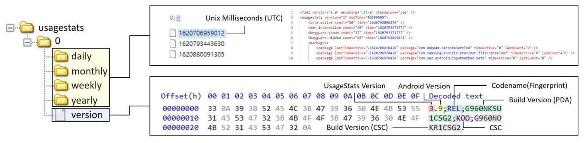
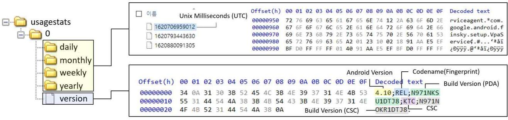
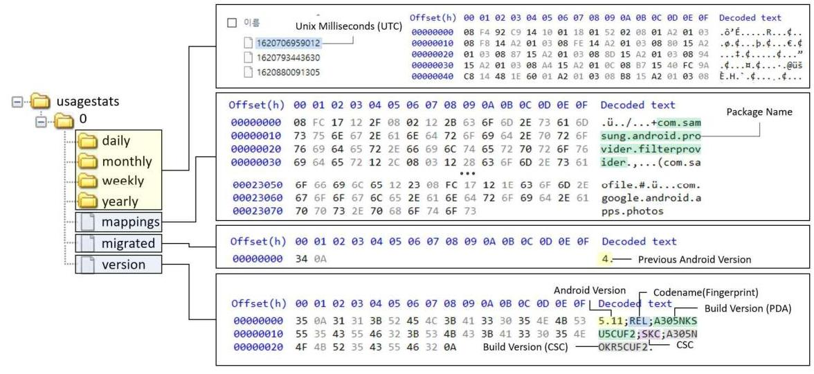

# 안드로이드 UsageStats의 포렌식 활용 방안 

강 예 지*, 김 동 현**, 이 선 경*, 박 정 흠***, 이 상 진**** 고려대학교 정보보호대학원 정보보호학과 (대학원생)*, (조교수)***, (교수)**** 육군사관학교 컴퓨터과학과 (강사)**

## Analysis on Android UsageStats for Digital Investigation

Yeji Kang*, Donghyun Kim**, Sunkyoung Lee*, Jungheum Park***, Sangjin Lee**** School of Cybersecurity, Korea University (Postgraduate Student)*, (Assistant Professor)***, (Professor)**** Department of Computer Science, Korea Military Academy (Lecturer)**

요 약

시스템 로그는 운영체제에서 이벤트가 발생할 때 기록되는 로그이며, 그 양이 방대하다. 또한, 사용자가 시스템 로그를 직접 삭제하거나, 변조하는 경우는 적기 때문에 포렌식 조사에서 유용하게 활용할 수 있다. UsageStats도 시스템 로그 중 하나로 패키지별로 사용자가 수행한 행위, 발생한 이벤트, 시간 정보를 기록한다. 사용자의 행위를 확인하는 데 유용하 게 사용할 수 있지만, 디지털 포렌식 조사보다는 사용자의 유형 또는 관심사를 파악하는 데 활용되고 있다. UsageStats 를 과상하는 연구와 도구는 존재하지만, 단순히 이벤트 발생 시각, 발생한 이벤트를 나열한 것이므로 발생한 이벤트의 의 미를 알지 못하면 올바르게 포렌식 조사에 활용하기 어렵다. 본 논문에서는 UsageStats의 버전별 구조와 포렌식 관점에 서의 차이점을 살펴보고 기록된 이벤트의 해석 방법을 제안하며, 시나리오 기반의 사례 연구를 통해서 UsageStats를 포 렌식 조사에 활용하는 방법을 제안한다.

주제어 : 디지털 포렌식, 모바일 포렌식, UsageStats, 안드로이드 시스템 로그

#### Abstract

System logs add records whenever an operating system or user event occurs, which can be of particular interest in forensic investigations as these types of logs are subject to user interference via modification or direct deletion of records. UsageStats is one type of system log that records user actions, events, and timestamps for each package which, while useful to identify user type or interest, is currently not leveraged for digital forensics. Some studies and tools exist to parse UsageStats, but the output of these tools is not useful for any meaningful investigation. In this paper, we analyse the structure of UsageStats from a forensic perspective, and propose a method to utilise UsageStats for forensic investigation examined in a scenario-based case study.

Key Words : Digital Forensics, Mobile Forensics, UsageStats, Android System Log

## 1. 서 론

모바일 포렌식은 스마트폰, 태블릿 PC, 웨어러블 기기 등을 대상으로 디지털 포렌식 조사를 수행하는 것이 다. 모바일 기기는 사용자의 일상생활에 밀접하게 연관되어 사용자의 정보를 기록한다. 예를 들어, 모바일 기기 에 설치된 웹 브라우저는 사용자의 인터넷 사용 기록, 메신저와 SNS는 사용자의 연락 내용과 친구 관계, 지도 는 사용자가 물리적으로 이동한 위치를 기록한다. 이처럼 모바일 기기에 기록된 정보는 디지털 포렌식 조사에 유용하게 활용할 수 있으며, 2000년 후반부터 스마트폰 사용이 증가하면서 모바일 포렌식과 관련된 많은 연구

[^0]
[^0]:    (1) 이 논문은 과학기술정보통신부-경찰청이 공동 지원한 '홀리스랩 2.0 사업(www.kipot.or.kr)'의 지원을 받아 수행된 연구결과입니다. [과제명: 안티-포렌식 기술 대응을 위한 데이터 획득 및 분석 기술 연구 / 과제번호: 210121M07]

    - Received 08 November 2021. Revised 09 November 2021. Accepted 24 December 2021
    - 제1저자(First Author) : Yeji Kang (Email: diana_kang@korea.ac.kr)
    - 교신저자(Corresponding Author) : Jungheum Park (Email: jungheumpark@korea.ac.kr)

가 현재까지도 진행되고 있다[1].
한편, 모바일 기기에서 가장 많이 활용되는 운영체제는 안드로이드(Android)이다. 논문을 작성한 시점 (2021년 11월)을 기준으로 안드로이드의 시장 점유율은 $72.44 \%$ 로 모바일 운영체제에서 압도적인 1위의 위치 에 있다[2]. 이러한 이유로 안드로이드에서 동작하는 어플리케이션의 아티팩트를 분석한 연구가 많다 [3],[4],[5]. 또한, 모바일 기기에 민감한 개인 정보가 기록되므로 제조사는 개인 정보 보호를 위해 모바일 기 기에 암호화와 같은 보안 수단을 적용한다. 모바일 기기에 적용된 보안 수단들은 모바일 포렌식 조사를 어렵게 만들며, 모바일 기기로부터 데이터를 수집하는 연구도 있다[6],[7]. 이처럼 모바일 포렌식 연구에는 데이터 수 집을 위한 포렌식 절차와 기술적 방법, 모바일 운영체제와 어플리케이션의 아티팩트 조사 방법이 있다. 본 연 구는 안드로이드 운영체제에서 기본적으로 생성하는 아티팩트인 UsageStats에 대하여 디지털 포렌식 관점에 서의 활용 및 조사 방법을 제안한다.
UsageStats는 시스템 로그 중 하나이다. 시스템 로그는 사용자의 의도와 관계없이 운영체제에서 생성하는 로그이며, 주로 운영체제에서 이벤트가 발생했을 때 로그를 기록하므로 시스템 로그는 방대하게 기록된다. 또 한, 사용자가 직접 삭제하거나 변조할 가능성이 적으므로 포렌식 조사에서 유용하게 활용할 수 있다[8]. UsageStats에는 패키지별로 사용자가 수행한 행위(키보드 입력, Focus 등), 발생한 이벤트, 시간 정보가 기 록되며, 사용자의 행위를 파악하는 데 사용할 수 있다. 이러한 특징으로 UsageStats는 사용자의 유형 및 관 심사를 분석하기 위한 어플리케이션에서 주로 활용된다[9]. 디지털 포렌식 조사에 유용하게 활용할 수 있는 정 보가 있음에도 불구하고, 디지털 포렌식 조사에서 널리 활용되지 못하고 있다. 안드로이드 버전마다 구조가 다 르고, 포렌식 조사 시 UsageStats의 활용 방법에 관한 연구가 이뤄지지 않았기 때문이다.
UsageStats에 기록된 로그를 파싱하는 도구는 존재한다[10],[11]. 하지만, 각 이벤트의 의미를 해석하는 연구가 진행되지 않아, 도구의 수행 결과는 이벤트 발생 시각, 이벤트 내용을 단순히 나열한 것이다. 이러한 이 유로 조사관은 UsageStats를 분석한 결과를 확인하더라도 해석하지 못하거나, 잘못 해석할 가능성이 있다.
본 논문에서는 다양한 버전의 안드로이드에서 수집한 UsageStats에 관해 연구한다. 2절에서는 안드로이드 시스템 로그와 UsageStats에 관련된 연구를 소개하고, 3절에서 UsageStats의 버전별 구조를 정리하고 포 렌식 관점에서 버전마다 다른 점을 살펴본다. 4절에서는 시나리오 기반의 사례 연구를 통해서 UsageStats를 포렌식 조사에 활용하는 방법을 제안한다. 마지막으로 5절에서 결론을 맺는다.

# II. 관련 연구 

## 2.1 안드로이드 로그 분석

안드로이드 로그에 대한 연구는 지금까지도 꾸준하게 진행되고 있다. D. Kim et al. 2016[1]은 모바일 포 렌식 동향에 관한 연구를 진행하여, 안드로이드 OS 및 iOS 모바일 포렌식 절차, 데이터 수집 및 분석에 대해 정리하였다. J. Cho et al. 2017[9]는 안드로이드 OS 기반 스마트폰에서 시스템 로그를 분석하고 항목별로 로그를 분류하였다. S. Park et al. 2018[12]는 안드로이드 OS 기반 기기에서 시스템 및 사용자 로그를 분 석하고 자동화 모델까지 개발하여 이상 행위를 탐지하는 연구를 진행하였다. E. Park et al. 2020[8]은 안 드로이드 OS를 기반으로 하는 최신 삼성 스마트폰에 대해 데이터 획득 방법에 따라 분석 가능한 시스템 로그 를 확인하였고 포렌식 활용 기법을 제안하였다.

## 2.2 안드로이드 UsageStats

안드로이드 OS의 UsageStats는 2014년 10월 안드로이드 5.0 버전(API 수준 21)에서 추가된 기능으로, 각 어플리케이션 사용량 통계와 행위별 시각을 포함하고 있다[8]. 안드로이드 오픈소스 프로젝트(AOSP)는 이 러한 UsageStats를 어플리케이션 개발에 사용할 수 있도록, UsageStats Manager 및 UsageStats와 관 련된 정보를 문서와 코드로 제공하고 있다[13],[14],[15]. 공개된 UsageStats API로 스마트폰 사용 내역을 추적하는 어플리케이션을 만들거나[16][17], 스마트폰의 상태를 추적하여 취약점을 탐지하는 어플리케이션을 만들 수 있다[18].
디지털 포렌식 관점에서 UsageStats를 사용하거나 분석한 연구들도 존재한다. Y. Konduru et al. 2018[19]은 안드로이드 스마트폰에서 일부 유명한 어플리케이션에 대해 아티팩트를 연구했으며, 어플리케이션 의 사용을 확인하기 위해 UsageStats를 이용하였다. H. Pieterse 2018[20]은 UsageStats의 시간값 확 인을 통해 데이터의 진정성(authenticity)을 확인하는 방법을 제안하였다. 하지만 모두 UsageStats의 정확

한 구조나 구체적인 활용 방법을 소개하지 않았다.
UsageStats 분석 도구로는 안드로이드 9 이하 버전에 대해서는 A. Brignoni가 개방한 XML Parser[21], 안드로이드 10 버전에 대해서는 Y. Khatri가 UsageStats의 구조를 분석하고 파싱할 수 있는 파이썬 코드를 제공하였다[22]. 하지만 11 이상의 최신 안드로이드 버전에서는 UsageStats의 구조가 달라졌 기 때문에 해당 연구에서 소개된 방법을 적용할 수 없다. 가장 최근에 발표된 UsageStats 연구는 안드로이드 11 에 대해 언급하고 있지만, 안드로이드 버전을 확인하는 방법만 연구되었고[23], 변화된 UsageStats의 구 조에 대해서는 분석하지 않았다. ALEAPP[10]는 오픈소스로 공개된 안드로이드 로그 이벤트 및 프로토콜 버 려 파서이다. 최신 안드로이드 버전의 UsageStats도 추가되었지만, 단순히 파싱만 지원하고 내용에 대한 해 석은 연구되지 않았다.

기존 연구들은 안드로이드 OS 기반의 스마트폰에서 시스템 로그를 디지털 포렌식에 활용하는 방안을 제시하 거나, UsageStats 파싱을 지원한다는 점에서 의의가 있다. 하지만 UsageStats에 저장되는 데이터에 대해 서는 자세히 연구되지 않았으므로, 포렌식 관점에서 UsageStats의 분석이 필요하다. 따라서 본 논문에서는 최신 안드로이드 12 버전을 포함한 모든 안드로이드 버전에서의 UsageStats 구조와 저장되는 데이터를 분석 하여 포렌식적으로 활용할 수 있는 방안을 제시하고, 시나리오 기반의 실험을 통해 실무에서의 활용 가능성을 보여준다.

# III. UsageStats 분석 

본 점에서는 UsageStats의 획득 방법에 대해 소개하고, 버전별 구조와 저장 정보에 대해서 분석한다.

### 3.1 획득 방법

안드로이드 시스템 로그는 사용자 데이터 파티션에 저장되며, 루트 권한이 없이 접근할 수 없다. 따라서 루 팅(Rooting)이나 Full Filesystem 수집을 통해 시스템 로그를 획득할 수 있다. UsageStats 역시 시스템 로그 중 하나로 동일한 방법으로 수집한다. 경로는 안드로이드 버전별로 다르며, 〈표 5〉와 같다.

## 3.2 안드로이드 $5 \sim 9$

UsageStats는 안드로이드 5.0 버전(API 수준 21)에서 처음 추가된 기능으로, 어플리케이션 패키지별 사 용자 통계를 시간값과 함께 저장하고 있다. 안드로이드 $5 \sim 9$ 버전에서 UsageStats의 저장 경로는 '/data/system/usagestats/0/'이고, 디렉토리 구조는 〈그림 1〉과 같다. UsageStats는 저장 주기에 따라 daily, weekly, monthly, yearly 4 개의 디렉토리에 저장된다.

UsageStats의 4 개의 디렉토리(daily, weekly, monthly, yearly) 아래에는 다양한 시간 간격으로 생성 된 UsageStats 파일이 존재한다. 파일의 이름은 Unix Milliseconds(UTC)로 표현된 타임스탱프이다. UsageStats 파일 내 시각 정보는 해당 타임스탱프를 기준으로 지난 시간이 기록된다.
version(/data/system/usagestats/0/version) 파일에는 UsageStats 버전, 안드로이드 버전, 코드 네임, PDA(Personal Digital Assistant)/CSC(Count Specific Code) 빌드 버전, CSC가 포함되어있 고, UsageStats 버전과 안드로이드 버전은 개행 문자 $(0 \times 0 \mathrm{~A})$ 로, 나머지 필드는 세미 콜론( $\left.{ }^{\prime}\right)$ )으로 구분된다.

〈그림 1〉 Android 9 이전 UsageStats - 디렉토리 구조
(Figure 1) Android 9 and earlier versions - Directory structure

안드로이드 9 버전 이하에서 UsageStats 정보는 XML(eXtensible Markup Language) 형식으로 저 장된다. UsageStats에 저장되는 정보는 크게 〈packages〉, 〈configurations〉, 〈event-log〉의 3 가지로 나 눌 수 있다. 〈packages〉 내에는 어플리케이션별 사용량이 기록되고, 〈configurations〉 내에는 기기의 전원 이 켜지면서 설정된 값이 기록되며, 〈event-log〉 내에는 어플리케이션의 실행 내역과 사용자 행위가 상세히 기록된다. 각 항목에서 확인할 수 있는 주요 정보는 〈표 1 〉과 같다.

〈표 1〉 Android 9 이하 UsageStats - 항목별 저장 정보
(Table 1) Android 9 and earlier versions - Data

| Field | Attribute | Description | Example |
| :--: | :--: | :--: | :--: |
| packages | package | 패키지 명 | com.kakao.talk |
|  | lastTimeActive | 마지막 기기 사용 시각 | 85346646 |
|  | timeActive | 총 기기 사용 시간 | 656029 |
|  | lastEvent | 기록된 마지막 이벤트 | 2 |
|  | appLaunchCount | 총 명 실행 횟수 | 13 |
| configurations | lastTimeActive | 마지막 기기 사용 시각 | 29129150 |
|  | timeActive | 총 기기 사용 시간 | 15630608 |
| event-log | package | 패키지 명 | com.google.android.youtube |
|  | class | 클래스 명 | com.google.android.apps.yo   utube.app.watchwhile.Watc   hWhileActivity |
|  | time | 이벤트 발생 시각 | 49848 |
|  | type | 행위 종류 | 1 |

# 3.3 안드로이드 10 

안드로이드 버전 10 (API 수준 29)에서 UsageStats가 일부 변경되었다. 먼저 안드로이드 10 이상부터 system-as-root가 강제되면서, 저장소가 DE(Device Encrypted) 저장소, CE(Credential Encrypted) 저장소의 2 가지로 구분되었다. DE 저장소에는 기기가 잠겨 있을 때도 확인 가능한 배경화면, 알람 등의 값이 저장된다. CE 저장소에는 기기의 잠금이 해제된 상태에서만 확인 가능한 연락처, 사진, 로그 등이 저장된다. 이때 UsageStats는 사용자 데이터이므로 CE 저장소에 저장되고, 따라서 안드로이드 10부터는 '/data/system_ce/usagestats/0' 경로에 UsageStats가 저장된다. 디렉토리 구조, version 파일의 정보, UsageStats 파일명은 안드로이드 9 이하와 동일한 형식으로 기록되며, [그림 2]와 같다.

〈그림 2〉Android 10 UsageStats - 디렉토리 구조
(Figure 2) Android 10 UsageStats - Directory structure

안드로이드 9까지에서는 XML 구조로 되어있어 내용의 파싱에 용이했다. 하지만 안드로이드 10 의 UsageStats는 바이너리 형식으로, 프로토콜 버퍼(Protocol Buffer)를 사용한다. 사용하는 프로토콜 버퍼는 AOSP(Android Open Source Project)에서 공개한 안드로이드 소스 코드 내의 usagestatsservice.proto[24]이다. protoc[25]와 같은 도구를 사용해서 프로토콜 버퍼 파일을 파이썬 파일 로 변환할 수 있고, 이를 통해 소스 코드 내에 usagestatsservice.proto에 포함된 구조체를 불러와 파서를 개발할 수 있다[22].
〈packages〉, 〈configurations〉, 〈event-log〉 각 항목에 저장되는 정보는 안드로이드 9과 유사하지만,

일부 변경되었다. 먼저 패키지 명을 로그마다 기록하는 대신 UsageStats 파일 앞부분에 기록하고, 로그에서 는 'package_index'를 통해 패키지 리스트를 인덱싱하여 사용한다. 더이상 'lastEvent'를 사용하지 않으며, 'last_time_visible_ms', 'total_time_visible_ms' 항목을 추가해 포그라운드로 실행된 시간을 기록한다. 각 항목에서 확인할 수 있는 주요 정보는 〈표 2〉와 같다.

〈표 2〉 Android 10 UsageStats - 항목별 저장 정보
(Table 2) Android 10 UsageStats - Data

| Field | Attribute | Description | Example |
| :--: | :--: | :--: | :--: |
| package | 패키지 명 | com.android.vending |  |
| packages | package_index | 패키지 인덱스 | 53 |
|  | last_time_active_ms | 마지막 실행된 시각 | 5570193 |
|  | total_time_active_ms | 총 실행된 시각 | 16240 |
|  | last_time_visible_ms | 마지막 화면 표시 시간 | 5570218 |
|  | total_time_visible_ms | 총 화면 표시 시간 | 16752 |
|  | apptLaunchCount | 총 명 실행 횟수 | 2 |
| configurations | last_time_active_ms | 마지막 기기 사용 시각 | 604523249 |
|  | total_time_active_ms | 총 기기 사용 시간 | 53392 |
| event-log | package_index | 패키지 인덱스 | 53 |
|  | class_index | 클래스 인덱스 | 13 |
|  | time_ms | 이벤트 방생 시각 | 5538230 |
|  | type | 행위 종류 | 15 |

# 3.4 안드로이드 $11 \sim 12$ 

안드로이드 11부터는 UsageStats 디렉토리 내 mappings, migrated 파일이 추가되며, UsageStats 파일의 구조가 일부 변경되었다. 기기 내 저장 경로는 '/data/system_ce/usagestats/0'이고, 변경된 디렉토 리 구조는 [그림 3]과 같다. version 파일의 구조와 UsageStats 파일명은 안드로이드 10 이하와 동일하다.
migrated(/data/system_ce/usagestats/0/migrated) 파일은 기기에 저장되었던 이전 안드로이드 버 전을 나타낸다. 만약 version 내에서 확인한 UsageStats 버전이 5이고, migrated에서 확인한 버전이 4라 면, 기기가 안드로이드 10 에서 11 로 업데이트 되었음을 알 수 있다.
mappings(/data/system_ce/usagestats/0/mappings)는 UsageStats에서 사용하는 모든 패키지명, 클래스명, 문자열로 된 부가 정보를 저장한 파일로, 구조 난독화를 위해 만들어졌다. UsageStats 바이너리 파일 내에서 문자열로 저장되던 패키지 명은 사라지고, 대신 토큰을 사용하여 저장한다. 따라서 UsageStats 의 토큰값을 이용하여 mappings에서 패키지 명을 찾는다.

〈그림 3〉 Android 11 이후 UsageStats - 디렉토리 구조
(Figure 3) Android 11 and later versions - Directory
안드로이드 11에서의 UsageStats는 안드로이드 10과 같이 바이너리 형태의 프로토콜 버퍼 구조로 저장되 지만, 구조가 일부 변경되었다. 안드로이드 소스 코드 내의 UsageStatsservice_v2.proto[26] 파일을 활용

하어 안드로이드 10 에서하같이 분석 가능하다. mappings 파일 역시 프로토콜 버퍼 형태이고, UsageStatsservice_v2.proto 내 ObfuscatedPackagesProto을 활용하여 분석할 수 있다.
〈packages〉, 〈configurations〉, 〈event-log〉 각 항목에 저장되는 정보는 패키지 명이 토큰으로 저장되 는 것을 제외하면, 안드로이드 10 과 동일하다. 'package_index', 'class_index'가 각각 'package_token', 'class_token'으로 변경되었다. 각 항목에서 확인할 수 있는 주요 정보는 〈표 3〉과 같다.

〈표 3〉Android 11 이후 UsageStats - 항목별 저장 정보
(Table 3) Android 11 and later versions - Data

| Field | Attribute | Description | Example |
| :--: | :--: | :--: | :--: |
| packages | package_token | 패키지 토큰 | 422 |
|  | last_time_active_ms | 마지막 실행된 시각 | 1635815825516 |
|  | total_time_active_ms | 총 실행된 시각 | 131425 |
|  | last_time_visible_ms | 마지막 화면 표시 시간 | 1635815825516 |
|  | total_time_visible_ms | 총 화면 표시 시간 | 3499 |
|  | appLaunchCount | 총 앱 실행 횟수 | 2 |
| configurations | last_time_active_ms | 마지막 기기 사용 시각 | 1635813998574 |
|  | total_time_active_ms | 총 기기 사용 시간 | 28980 |
| event-log | package_token | 패키지 토큰 | 422 |
|  | class_token | 클래스 토큰 | 1 |
|  | time_ms | 이벤트 발생 시각 | 1634917474613 |
|  | type | 행위 종류 | 17 |

# 3.5 버전별 비교 

안드로이드 버전별 UsageStats의 분석 결과를 정리하면〈표 4〉와 같다. UsageStats는 안드로이드 버전 에 따라 다른 형식으로 저장되며 그 경로도 다르다. 따라서 각 안드로이드 버전에 맞게 UsageStats를 분석 및 파싱해야 할 필요가 있다.
'event-log'에서 확인할 수 있는 행위의 종류는〈표 5〉와 같다. 기록되는 각 이벤트에 대해 어떤 종류의 행 위를 수행했는지 확인할 수 있다.

〈표 4〉안드로이드 버전별 UsageStats 분석 결과 비교
(Table 4) Comparison of UsageStats by version

|  | Android 5 9 | Android 10 | Android 11 12 |
| :--: | :--: | :--: | :--: |
| Format | XML | Binary | Binary |
| Path | /data/system/usagestats /0/ | /data/system_ce/usagesta ts/0 | /data/system_ce/usagestat s/0 |
| Directory name | daily, weekly, monthly, yearly | daily, weekly, monthly, yearly | daily, weekly, monthly, yearly |
| UsageStats   Filename | Timestamp   (Unix Milliseconds) | Timestamp   (Unix Milliseconds) | Timestamp   (Unix Milliseconds) |
| Files | version | version | mappings, migrated, version |
| UsageStats version | 3 | 4 | 5 |
| Protocol Buffer Type | - | usagestatsservice.proto | usagestatsservice_v2.proto |
| Featured Change | - | Protocol buffer | Tokenised package name |

〈표 5〉Type 별 사용자 행위 종류
(Table 5) User behaviour for types

| No | Type | Description |
| :--: | :--: | :--: |
| 0 | NONE | No event type. |
| 1 | ACTIVITY_RESUMED | An event type denoting that an Activity moved to the foreground. |
| 2 | ACTIVITY_PAUSED | An event type denoting that an Activity moved to the background. |
| 5 | CONFIGURATION_CHANGE | An event type denoting that the device configuration has changed. |
| 7 | USER_INTERACTION | An event type denoting that a package was interacted with in some way by the user. |
| 8 | SHORTCUT_INVOCATION | An event type denoting that an action equivalent to a ShortcutInfo is taken by the user. |
| 11 | STANDBY_BUCKET_CHANGED | An event type denoting a change in App Standby Bucket. |
| 15 | SCREEN_INTERACTIVE | An event type denoting that the screen has gone in to an interactive state (turned on for full user interaction, not ambient display or other non-interactive state). |
| 16 | SCREEN_NON_INTERACTIVE | An event type denoting that the screen has gone in to a non-interactive state (completely turned off or turned on only in a non-interactive state like ambient display). |
| 17 | KEYGUARD_SHOWN | An event type denoting that the screen's keyguard has been shown, whether or not the screen is off. |
| 18 | KEYGUARD_HIDDEN | An event type denoting that the screen's keyguard has been hidden. |
| 19 | FOREGROUND_SERVICE_START | An event type denoting start of a foreground service. |
| 20 | FOREGROUND_SERVICE_STOP | An event type denoting stop of a foreground service. |
| 23 | ACTIVITY_STOPPED | An activity becomes invisible on the UI, corresponding to Activity onStop() of the activity's lifecycle. |
| 26 | DEVICE_SHUTDOWN | An event type denoting that the Android runtime underwent a shutdown process. |
| 27 | DEVICE_STARTUP | An event type denoting that the Android runtime started up. |

# IV. Case Study 

본 절에서는 범죄 상황을 가정하여 안드로이드 UsageStats의 디지털 포랜식 활용 방안을 제시한다.

## 4.1 시나리오

김 사원은 A 회사의 신입 사원으로 박 대리의 팀에 배치되었다. 박 대리는 김 사원에게 사적인 감정을 품고 지속적으로 언락을 하였으나, 김 사원은 계속해서 거절했다. 미칠 뒤 11 월 2 일 새벽 1 시 5 분경, 박 대리는 이 에 대한 보복으로 팀원이 모두 포함된 텔레그램 단체 채팅방에서 김 사원을 언급하며 성희롱성 방언이 담긴 메 시지를 보냈다. 이에 김 사원은 박 대리를 성희롱 및 명예 훼손 혐의로 고소했다. 하지만 박 대리는 본인이 델 레그램 메시지를 보내지 않았고, 그 시간에는 잠을 자고 있었기 때문에 자동 로그인 된 PC를 통해 타인이 보 냈다고 주장했다. 박 대리의 핸드폰을 압수하여 포랜식 분석을 의뢰한 상황이다. 텔레그램 어플리케이션이 삭 제되어 있어서 어플리케이션 로그는 확인할 수 없다.

### 4.2 UsageStats 활용 증거 분석

본 소절에서는 UsageStats만을 이용하여 얻을 수 있는 정보를 통해 증거를 분석한 내용을 기술한다. 분석 대상인 박 대리의 스마트폰은 삼성 갤럭시 A30(SM-A305N)이고, 안드로이드 OS 11 버전을 사용한다.

# 4.2.1 기기 및 사용자 정보

UsageStats의 'version'에서 안드로이드 버전, 코드 네임, PDA/CSC 펌웨어 빌드 버전, 통신사 코드를 알 수 있다. 또한 'mappings' 내 저장되는 문자열에는 계정 정보도 포함된다. 특히 'com.android.gm' 패키 지는 Gmail 계정 정보를 담고 있는데, 플레이 스토어에서 사용한 계정과 기본으로 연동되므로 기기에 로그인 된 구글 계정임을 알 수 있다. 압수한 기기의 정보를 확인하여 정리하면 〈표 6〉과 같다.

〈표 6〉 기기 및 사용자 정보 〈Table 6〉 Device and user information

|  Field | Value | Source  |
| --- | --- | --- |
|  Android version | 11 | version  |
|  Codename | REL |   |
|  Buildversion(PDA) | A305NKSU5CUP2 |   |
|  CSC | CSC |   |
|  Buildversion(CSC) | A305NOKR5CUP2 |   |
|  User account | daeree.park@gmail.com | mappings  |

### 4.2.2 화면 잠금 해제 및 사용

또한 패키지명이 android인 이벤트 로그는 한 패키지에 국한되지 않은 기기 자체의 상태 변경 정보를 기록 하는데, 'SCREEN_INTERACTIVE(15)'는 유저가 화면을 사용하기 시작한 이벤트이고, 'SCREEN_NON_INTERACTIVE(16)'는 유저가 화면 사용을 종료한 이벤트이다〈표 5〉. 이 두 이벤트 로그 를 통해 사용자가 화면 잠금을 해제하여 실제로 사용하고 시간을 알 수 있다. 따라서 '2021-11-02 01:02:09' 에 기기를 사용하기 시작해, '2021-11-02 01:05:26'에 사용이 종료되었음을 알 수 있다[그림 4].

### 4.2.3 텔레그램 사용 내역

'event-log' 내에는 패키지, 클래스, 시간 정보와 함께 변경된 상태 정보가 남는다. 앱이 실행되는 시간 동 안 각 패키지의 클래스 사용 정보를 확인할 수 있는데, 앱이 실행될 때 'ACTIVITY_RESUMED(1)', 앱이 중지될 때 'ACTIVITY_PAUSED(2)', 앱이 종료될 때 'ACTIVITY_STOPPED(23)' 타입의 로그가 생성된 다(〈표 5〉). 이 로그들을 통해 앱이 실행되고 있는 시각을 정확하게 확인할 수 있다. 따라서 텔레그램의 사용 시각은 '2021-11-02 01:02:10'부터 '2021-11-02 01:05:27'임을 알 수 있다〈그림 4〉.

|  Last Time Active | Usage Typ |  |  |   |
| --- | --- | --- | --- | --- |
|  2021-11-02 01:02:09 | event-log | android | SCREEN_INTERACTIVE | daily  |
|  2021-11-02 01:02:10 | event-log | org.telegram.messenger | ACTIVITY_RESUMED | org.telegram.ui.LaunchActivity  |
|  2021-11-02 01:02:10 | event-log | android | KEYGUARD_HIDDEN | daily  |
|  2021-11-02 01:02:10 | event-log | com.samsung.android.net.wifi.wifiguider | STANDBP_BUCKET_CHANNELD | daily  |
|  2021-11-02 01:02:15 | event-log | com.google.android.apps.techyun | STANDBP_BUCKET_CHANNELD | daily  |
|  2021-11-02 01:02:15 | event-log | com.google.android.gm | STANDBP_BUCKET_CHANNELD | daily  |
|  2021-11-02 01:02:19 | event-log | com.android.settings.intelligence | STANDBP_BUCKET_CHANNELD | daily  |
|  2021-11-02 01:02:19 | event-log | com.samsung.android.samsungpanaudofill | STANDBP_BUCKET_CHANNELD | daily  |
|  2021-11-02 01:05:26 | event-log | android | SCREEN_NON_INTERACTIVE | daily  |
|  2021-11-02 01:05:27 | event-log | org.telegram.messenger | ACTIVITY_PAUSED | org.telegram.ui.LaunchActivity  |
|  2021-11-02 01:05:27 | event-log | org.telegram.messenger | ACTIVITY_STOPPED | org.telegram.ui.LaunchActivity  |
|  2021-11-02 01:05:27 | event-log | android | KEYGUARD_SHOWN | daily  |

〈그림 4〉 UsageStats 이벤트 로그 〈Figure 4〉 UsageStats 'event-log'

### 4.3. 분석 결과 정리

UsageStats 분석을 통해 박 대리의 기기 사용 시각 및 행위 정보를 파악할 수 있다. 사건이 발생한 시각인 11월 2일 오전 1시 5분에 기기를 사용하고 있었고, 텔레그램 어플리케이션 역시 사용 중이었음을 알 수 있다. 비록 텔레그램 어플리케이션이 삭제되었더라도 UsageStats는 시스템 로그이므로 삭제되지 않는다. 따라서 사 용자가 임의로 삭제할 수 없으므로 증거 인멸의 가능성이 낮다. 또한 시각과 함께 이벤트가 기록되기 때문에 특정 시각에 어떤 어플리케이션이 실행되었는지 정확하게 확인할 수 있으므로 유용한 증거로 사용될 수 있다.

# V. 걸 론 

본 논문은 안드로이드 5 9. 10. 11 12 버전마다 UsageStats의 구조를 분석하고, 버전별 차이점을 확인 하였다. 안드로이드 5 9 버전의 UsageStats은 XML 형식으로 로그를 기록하였고, 10 12 버전에서는 프 로토콜 버퍼(Protocol Buffer) 형식으로 로그를 기록하였다. 프로토콜 버퍼 형식으로 기록된 UsageStats을 분석하는 방법을 제안하였다. UsageStats 분석을 통해서 실행 시각, 발생한 이벤트, 패키지 명 등 패키지 실 행에 대한 밀접한 정보가 기록되는 것을 확인하였다. 또한, 시나리오 기반의 사례 연구를 통해서, 어플리케이션 아티팩트가 삭제된 상황에서 UsageStats을 분석하여 사용자의 행위를 파악할 수 있는 포랜식 조사 방법을 제 안하였다. 연구에서 제안한 UsageStats의 포랜식 활용 방안은 추후 안드로이드 12 가 탑재될 모바일 기기에 서도 유용하게 사용될 것으로 기대한다.
UsageStats의 로그는 방대하게 기록되고 어플리케이션의 실행 기간(Term)을 수작업으로 분석하는 것은 많은 시간이 소요된다. 따라서, 향후 연구로 UsageStats의 어플리케이션 실행 흔적을 시각화하는 방법을 연 구하여, 포랜식 조사 시 UsageStats을 더 효율적으로 분석하는 방안을 제시할 것이다.

# 참 고 문 헌 (References) 

[1] D. H. Kim, and S. J. Lee, "Mobile Forensic Trend," Review of KIISC, 26.5, 22-31, 201 6 .
[2] Android Usage Statistics, https://gs.statcounter.com/os-market-share/mobile/worldwid e. Accessed Oct, 2021.
[3] A. Menahil, W. Iqbal, M. Iftikhar, W. B. Shahid, K. Mansoor, S. Rubab, "Forensic Ana lysis of Social Networking Applications on an Android Smartphone," Wireless Communi cations and Mobile Computing, Vol. 2021, 2021.
[4] A. AlZahrani, M. A. Wani, W. A. Bhat, "Forensic analysis of Twitch video streaming a ctivities on Android," Journal of Forensic Sciences, Vol. 66, No. 5, pp. 1721-1741, 2021.
[5] P. Domingues, R. Nogueira, J. C. Francisco, M. Frade, "Post-mortem digital forensic a rtifacts of TikTok Android App," Proceedings of the 15th International Conference on A vailability, Reliability and Security, pp. 1-8, 2020.
[6] P. Feng, Q. Li, P. Zhang, Z. Chen, "Logical acquisition method based on data migratio n for Android mobile devices," Digital Investigation, Vol. 26, pp. 55-62, 2018.
[7] S. J. Yang, J. H. Choi, K. B. Kim, T. J. Chang, "New acquisition method based on fir mware update protocols for Android smartphones," Digital Investigation, Vol. 14, pp. S 68-S76, 2015.
[8] E. H. Park, S. J. Kang, S. R. Kim, J. S. Kim, "System Log Analysis and Forensic Appl ication Techniques of Latest Samsung Smartphones by Data Acquisition Methods," Jour nal of Digital Forensics, Vol. 14, No. 1, pp. 1-19, 2020.
[9] J. H. Jo, J. H. Lee, S. R. Kim, J. H. Lee, S. J. Yang, C. H. Lee, "Analysis on Non-Vo latile System Log of Android Based Smartphone," Journal of Digital Forensics, Vol. 11, No. 2, pp. 19-42, 2017.
[10] iLEAPP \& ALEAPP: Parse and validate mobile forensic artifacts with Python, The Di gital Forensic Research Conference DFRWS 2020 USA, 2020.
[11] Magnet Axiom Product Documents, https://support.magnetforensics.com/s/product-do cumentation?prod = axiom-artifact, Accessed Oct, 2021.
[12] S. J. Park, S. Y. Park, K. W. Ma, "An automatic user activity analysis method for dis covering latent requirements: usability issue detection on mobile applications," Sensor s, vol. 18, no. 9, pp. 2963, 2018.
[13] UsageStats, https://developer.android.com/reference/android/app/usage/UsageStats. A ccessed Oct. 2021.
[14] AOSP/platform_frameworks_base, https://github.com/aosp-mirror/platform_frameworks _base/tree/master/services/usage/java/com/android/server/usage. Accessed Oct. 2021.
[15] UsageEvents.Event, https://developer.android.com/reference/android/app/usage/Usage Events.Eve
[16] F. Ahmed, "Child Monitor," 2018.
[17] A. K. Singh, A.K. Prajapati, V. Kumar, S. Mishra, "Usage analysis of mobile devices," Procedia computer science, Vol. 122, pp. 657-662, 2017.
[18] A. Possemato, D. Nisi, Y. Fratantonio. "Preventing and Detecting State Inference Att acks on Android," Network and Distributed Systems Security (NDSS) Symposium 2021, 2021.
[19] Y. Konduru, N. Mishra, S.Sharma, "Acquisition and Analysis of Forensic Data Artefac ts of Some Popular Apps in Android Smartphone.", 2018 IEEE 16th Intl Conf on Depen dable, Autonomic and Secure Computing, 16th Intl Conf on Pervasive Intelligence and Computing, 4th Intl Conf on Big Data Intelligence and Computing and Cyber Science a nd Technology Congress(DASC/PiCom/DataCom/CyberSciTech), pp. 86-93, 2018.

[20] H. Pieterse, M. Olivier, R.V. Heerden, "Smartphone data evaluation model: Identifyin g authentic smartphone data." Digital Investigation, Vol. 24, pp. 11-24, 2018.
[21] A. Brignoni, Usagestats XML Parser, https://abrignoni.blogspot.com/2019/02/android-UsageStats-xml-parser.html. Accessed Oct, 2021.
[22] Y. Khatri, UsageStats on Android 10(Q), https://www.swiftforensics.com/search?q=us agestat. Accessed Oct, 2021.
[23] Identifying the Android Operating System Version thru UsageStats, https://sansorg. egnyte.com/dl/7fcm4X4GtN. Accessed Oct, 2021.
[24] AOSP proto files, https://github.com/aosp-mirror/platform_frameworks_base/tree/mast er/core/proto/android/server/usagestatsservice.proto. Accessed Oct, 2021.
[25] protoc, https://github.com/protocolbuffers/protobuf/releases. Accessed Oct, 2021.
[26] AOSP proto files, https://github.com/aosp-mirror/platform_frameworks_base/tree/mast er/core/proto. Accessed Oct, 2021.

# 저 자 소 개 

강 예 지 (Yeji Kang)
준회원
2020년 2월 : 고려대학교 지구환경과학과 졸업
2020년 3월 현재 : 고려대학교 정보보호대학원 정보보호학과 석사과정
관심분야 : 디지털 포렌식, 모바일 포렌식, 침해사고대응

김 동 현 (Donghyun Kim)
준회원
2019년 2월 : 순천항대학교 정보보호학과 졸업
2021년 2월 : 고려대학교 정보보호대학원 공학석사
2021년 6월 현재 : 육군사관학교 교수부 이학처 컴퓨터과학과 교수사관
관심분야: 사이버 보안, 디지털포렌식

이 선 경 (Sunkyoung Lee)
준회원
2019년 8월 : 서울여자대학교 정보보호학과 졸업
2019년 9월 현재 : 고려대학교 정보보호대학원 정보보호학과 석사과정
관심분야 : 디지털 포렌식, 정보보호, IoT 포렌식

박 정 홈 (Jungheum Park)
준회원
2014년 2월 : 고려대학교 정보보호대학원 공학박사
2015년 1월 2019년 2월 : 미국 국립표준기술연구원(NIST) 방문연구원
2019년 3월 2021년 8월 : 고려대학교 정보보호연구원 연구교수
2021년 9월 현재 : 고려대학교 정보보호대학원 조교수
관심분야 : 디지털 포렌식, 사이버범죄대응, 침해사고대응

이 상 진 (Sangjin Lee)
평생회원
1989년 10월 1999년 2월 : 한국전자통신연구원 선임연구원
1999년 3월 2001년 8월 : 고려대학교 자연과학대학 조교수
2001년 9월 현재 : 고려대학교 정보보호대학원 교수
2017년 3월 현재 : 고려대학교 정보보호대학원 원장
관심분야 : 대칭키 암호, 정보은닉 이론, 디지털 포렌식

