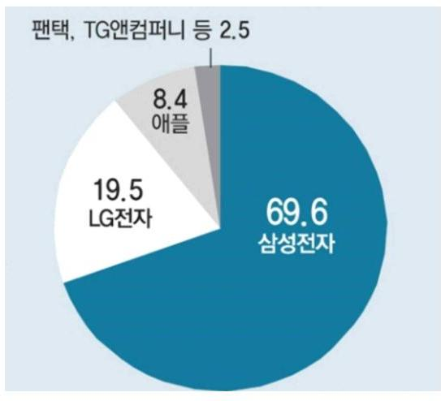
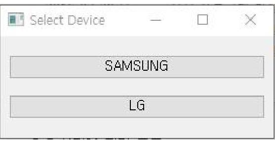
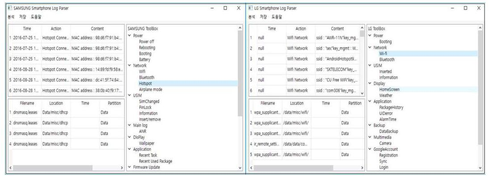

# 안드로이드 기반 스마트폰 비휘발성 시스템 로그에 대한 분석 

조 재 형 ${ }^{1}$, 이 재 형 ${ }^{1}$, 김 소 람 ${ }^{1}$, 이 재 형 ${ }^{3}$, 양 승 재 ${ }^{3}$, 이 창 훈 ${ }^{3}$, 김 종 성 ${ }^{1,2}$ 국민대학교 금융정보보안학과 ${ }^{1}$, 국민대학교 정보보안암호수학과 ${ }^{2}$, 서울과학기술대학교 컴퓨터공학부 ${ }^{3}$

## Analysis on Non-Volatile System Log of Android Based Smartphone

Jaehyung Cho ${ }^{1}$, Jaehyoung Lee ${ }^{1}$, Soram Kim ${ }^{1}$, Jaehyeong Lee ${ }^{3}$, Seungjae Yang ${ }^{3}$, Changhoon Lee ${ }^{3}$, Jongsung Kim ${ }^{1,2}$ Dept. of Financial Information Security, Kookmin University ${ }^{1}$ Dept. of Information Security, Cryptology, and Mathematics, Kookmin University ${ }^{2}$ Dept. of Computer Science and Engineering, Seoul National University of Science and Technology ${ }^{3}$

## 요 약

모바일 기기는 휴대성, 편리성 등의 장점으로 스마트폰, 태블릿 PC, 웨어러블 장치와 같은 형태로 현대 개개인의 일상에 깊숙이 들어와 있으며, 이와 같은 이유로 모바일 기기는 사용자의 행위와 관련된 대부분의 데이터를 저장하고 있는 장치라 할 수 있다. 안드로이드 스마트폰의 시스템 로그는 전원 종료, 리커버리 모드 진입 등의 사용자와 연관된 정보를 담고 있으며, 사용자가 직접 조작하기 어려운 특징이 있다. 하지만 제조사$\cdot$모델마다 저장하는 경로와 내용이 상이하며, 지속적으로 저장되는 로그의 경우 파일의 용량이 큰 경우가 있어 분석이 쉽지 않다. 시스템 로그에는 공장 초기화나 유심교체 등의 안티 포렌식 행위에 대한 정보도 담고 있기 때문에 시스템 로그에 대한 조사와 분석을 통하여 증거로서 활용하기 위한 연구가 필요하다. 본 논문에서는 안드로이드 스마트폰의 시스템 로그를 조사 및 분석하여 각기 다른 형식을 가지고 있는 시스템 로그를 정규화하고, 안티 포렌식 행위에 대한 대응 방안을 제시한다.

주제어 : 디지털 포렌식, 안드로이드. 시스템 로그, 안티 포렌식, 공장 초기화

[^0]
[^0]:    ※ 이 논문은 2017년도 정부(과학기술통신부)의 재원으로 정보통신기술진흥센터의 지원을 받아 수행되었 습니다. (No.2017-0-00344, 최신 모바일 기기에 대한 암호해독 및 포렌식 분석)

    - Received 03 March 2013, Revised 04 April 2013, Accepted 5 May 2013
    - 제1저자(First Author) : Jaehyung Cho (Email : whwogudsla@kookmin.ac.kr)
    - 교신저자(Corresponding Author) : Jongsung Kim (Email : jskim@kookmin.ac.kr)

# ABSTRACT 

Mobile devices are deeply embedded in the daily lives of modern individuals in the form this reason, mobile devices store most data related to the user's behavior. The system log of android smartphone is contains lots of user's behavior, and difficult to modify directly by the user. The locations and contents to store are different for each manufacturer and model. Since it contains information about anti-forensics activities such as factory reset and replacement of USIM card it is necessary to conduct research and analysis for system log to use as evidence. In this paper, we investigate and analyze the system log of android smartphone, which is lacking in research until now, and normalize the system log having differnet format and present it as a countermeasure against anti-forensics behavior.

Key Words : Digital Forensics, Android, System Log, Anti Forensics, Factory Reset

## I. 서 론

국내 스마트폰 제조사인 삼성, LG는 스마트폰의 운영체제로 안드로이드를 선택하고 있다. 2016년도 상반기 국내 인터넷 이용환경 현황조사에 따르면 국내 스마트폰 사용자의 $70 \%$ 이상이 안드로이드 OS를 사용하고 있다[1]. 안드로이드 OS를 사용하는 제품으로는 노키아, 샤오미, 화웨이 등 외국 제조사의 제품도 존재하지만 국내의 사용자들은 2016년 8월 기준 삼성 $69.6 \%$, LG $19.5 \%$ 로 국내 제조사 제품을 선호하는 경향이 있다1). 대한민국의 스마트폰 보급률은 2016년 3월 기준 $91 \%$ 를 기록했으며, 평균적으로 하루에 3 시간 이상 사용하는 것으로 나타났다[2]. 따라서 스마트폰은 사용자와 관련된 정보를 담고 있을 가능성이 매우 높으며, 범죄에 대한 직간접적인 증거를 담고 있을 확률이 높기 때문에 법정에서 증거로서 활용되고 있다.

현재까지 모바일 포렌식은 주로 애플리케이션의 데이터베이스 파일이나 동적 로그 분석에 대한 연구가 진행 되어왔다[3,4]. 그러나 안티 포렌식 행위에 대한 사용자의 접근 및 편의가 발전함에 따라서 데이터 완전삭제, 공장 초기화 등의 행위가 빈번하게 일어나고 있다. 이에 따라 기존에 연구된 모바일 포렌식 분석 기법으로는 안티 포렌식 기법이 적용된 스마트폰에서 증거를 획득하기 어려워지고 있으며, 안티 포렌식 행위에 대한 흔적을 찾는 것조차 쉽지 않다. 시스템 로그는 리커버리 모드 진입이나 유심에 대한 정보를 가지고 있으나, 제조사$\cdot$모델에 따라 저장하는 파일의 이름이나 형식에 차이가 있다. 따라서 리커버리 모드 진입여부나 유심정보 등을 담고 있는 안드로이드 비휘발성 시스템 로그의 효율적인 분석을 위한 정규화와, 안티 포렌식 행위에 대한 대응책을 마련하는 것이 필요하다.

안드로이드 폰의 시스템 로그는 일반적으로 많이 사용되는 데이터베이스 파일 분석이나 동적 로그 분석과 같이 wi-fi, bluetooth 등의 네트워크 정보를 저장하고 있다. 하지만 기존의 분석

[^0]
[^0]:    1) 아틀라스리서치 2016년 8월 2주차.

방법으로 알 수 없는 전원 관련로그나 리커버리 모드 진입 정보 등의 정보 또한 저장하고 있으며, 이는 시스템 로그 분석으로만 알아낼 수 있는 직접적으로 사용자의 행위와 관련된 정보가 존재 한다는 것을 의미한다. 또한 많이 사용되고 있는 안티 포렌식 행위인 공장 초기화와, 유심 교체에 대한 정보 또한 기록하고 있다.

본 논문의 II 장에서는 국내에서 많이 사용되는 삼성, LG 스마트폰의 기기 정보를 분석하여 시스템 로그가 저장되는 파티션을 선별한다. III장에서는 각기 다른 포맷을 가지고 있는 분석의 편의를 위하여 시스템 로그를 정규화하며, IV장에서는 기존 데이터 분석으로 알아내기 어려운 안티 포렌식 행위에 대한 시스템 로그의 활용 방안에 대하여 제안한다. V장에서는 정규화한 시스템 로그를 분석하기 위한 도구를 제작하며, VI장에서 결론으로 맺는다.

그림 1. 국내 제조사별 판매 점유율
Fig 1. Market share by manufacturer

# II. 조사대상 기기 정보 

본 장에서는 국내에서 많이 사용되는 제조사인 삼성과 LG의 기기를 선별하여 조사대상 파티션을 구분한다. OS 버전 점유율을 선별 기준으로 정하였으며, 각각 $17.1 \%, 30.1 \%, 31.8 \%$ 의 점유율을 기록한 KitKat (4.4), Lollipop (5.x), Marshmallow (6.x)를 선정했다(2017년 6월 발표 기준, Google). 또한 시스템 로그가 저장될 가능성이 높은 내부 파티션과 부팅 모드에 따른 마운트 파티션을 조사한다. 조사대상 기기의 정보는 [표 1]과 같다.

표 1. 조사대상 기기 정보
Table 1. Target Devices Information

| Category | LG | SAMSUNG |  |  |  |  |
| :--: | :--: | :--: | :--: | :--: | :--: | :--: |
| Device   name | G2 | Galaxy   No'te2 | Galaxy S3 | Galaxy S4 | Galaxy J5 | Galaxy S6 |
| Model   name | LG-F320L | SHV-E250S | SHV-E210S | SHV-E300L | SM-J500N0 | SM-920L |
| OS   version | 4.4 .2   (KitKat) | 4.4 .4   (KitKat) | 4.4 .4   (KitKat) | 5.0 .1   (Lollipop) | 5.1 .1   (Lollipop) | 6.0 .1   (Marshmallow) |

# 2.1 조사대상 기기 파티션 정보 

안드로이드 기기의 파티션 구성은 제조사$\cdot$모델마다 큰 차이를 보이며, 제조사가 정의한 각각 파티션들의 목적에 따라 다양한 시스템 로그가 저장될 가능성이 있다. 안드로이드는 임베디드 리눅스 기반의 시스템으로 모든 파티션이 mmcblk* 형식의 파일로 관리되며 cat /proc/partitions 명령어를 통해 해당 기기의 모든 내부 파티션에 대한 블록 장치명을 확인할 수 있다. 또한 블록 장치명에 대한 마운트 포인트의 경우 /dev/block/platform/dw_mmc/by-name 경로에서 ls -1 명령어를 통해 확인할 수 있다. 해당하는 경로는 제조사$\cdot$모델마다 약간의 차이가 있으나 대체적 으로 유사하다.

안드로이드 스마트폰이 각 모델마다 가지고 있는 파티션의 개수와 종류는 매우 다양하며 같은 이름의 파티션이라도 저장하고 있는 정보는 서로 상이하다. 조사대상 기기의 내부 플래시 메모리 파티션은 LG 기기의 경우 39개로 나뉘어 있었고, 삼성 기기의 경우 12 28개로 나뉘어 있다. 이 중에서 시스템 로그가 저장될 수 없는 바이너리 파티션을 제외하면 [표 2]의 음영 표시 된 부분과 같다. 따라서 조사 기기에서 분석할 파티션은 LG 기기의 경우 fota, system, cache, userdata 이고, 삼성 기기의 경우 system, cache, userdata 파티션이다.

표 2. 기기별 조사대상 파티션
Table 2. Target investigation partitions by device

| partition   number | G2 | Galaxy   note2 | Galaxy S3 | Galaxy S4 | Galaxy J5 | Galaxy S6 |
| :--: | :--: | :--: | :--: | :--: | :--: | :--: |
| 1 | /modem | /bota0 | /bota0 | /bota0 | /apnhlos | /bota0 |
| 2 | /sbl1 | /bota1 | /bota1 | /bota1 | /modem | /bota1 |
| 3 | /dbi | /efs | /efs | /efs | /sbl1 | /efs |
| 4 | /ddr | /m9kefs1 | /param | /m9kefs1 | /ddr | /param |
| 5 | /aboot | /m9kefs2 | /boot | /m9kefs2 | /aboot | /boot |
| 6 | /rpm | /m9kefs3 | /recovery | /m9kefs3 | /rpm | /recovery |
| 7 | /boot | /param | /radio | /carrier | /qsee | /ota |
| 8 | /tz | /boot | /cache | /param | /qhee | /radio |
| 9 | /pad | /recovery | /system | /boot | /fsg | /tombstone |
| 10 | /modemst1 | /modem | /hidden | /recovery | /sec | /dnt |
| 11 | /modemst2 | /tombstones | /ota | /ota | /pad | /persistent |
| 12 | /pad1 | /cache | /userdata | /cdma | /param | /steady |
| 13 | /misc | /system | - | /radio | /efs | /persdata |
| 14 | /persist | /preload | - | /tombstones | /modemst1 | /sbfs |
| 15 | /recovery | /ota | - | /tdata | /modemst2 | /system |
| 16 | /fsg | /data | - | /hidden | /boot | /cache |
| 17 | /fsc | - | - | /persdata | /recovery | /hidden |
| 18 | /ssd | - | - | /reserved2 | /fota | /userdata |
| 19 | /pad2 | - | - | /cache | /backup | - |
| 20 | /encrypt | - | - | /system | /fsc | - |
| 21 | /drm | - | - | /userdata | /ssd | - |
| 22 | /sns | - | - | - | /persist | - |
| 23 | /ve | - | - | - | /persistent | - |
| 24 | /laf | - | - | - | /persdata | - |
| 25 | /fota | - | - | - | /system | - |
| 26 | /mpt | - | - | - | /cache | - |
| 27 | /carrier | - | - | - | /hidden | - |
| 28 | /eri | - | - | - | /userdata | - |
| 29 | /blus | - | - | - | - | - |
| 30 | /dbibak | - | - | - | - | - |
| 31 | /rpmbak | - | - | - | - | - |
| 32 | /tzbak | - | - | - | - | - |
| 33 | /rct | - | - | - | - | - |
| 34 | /system | - | - | - | - | - |
| 35 | /cache | - | - | - | - | - |
| 36 | /tombstones | - | - | - | - | - |
| 37 | /spare | - | - | - | - | - |
| 38 | /userdata | - | - | - | - | - |
| 39 | /grow | - | - | - | - | - |

Fota 파티션은 firmware over the air의 약자로 펌웨어 업데이트 관련 로그가 기록되어 있고, system 파티션은 시스템을 구성하는 운영체제에 관련된 모든 파일이 저장되는 파티션이다. Cache 파티션의 경우 애플리케이션에서 자주 사용하는 내용, 리커버리 로그, 임시 파일 등이 저장 되어 있다. Userdata 또는 data 파티션은 장치에 다운로드하고 설치된 애플리케이션 및 데이터 베이스, 사용자 설정과 같은 사용자의 행위와 밀접한 관계를 가진 데이터를 가장 많이 저장하고 있는 파티션이다.

| shell@c1skt /dev/block/platform/dw_mmc/by-name \$ is -1 |  |  |  |
| :--: | :--: | :--: | :--: |
| is -1 |  |  |  |
| ifwxfwxfwx root | root | 2016-08-03 23:00 BOOT $\rightarrow$ /dev/block/mmcblk0p5 |  |
| ifwxfwxfwx root | root | 2016-08-03 23:00 BOTAO $\rightarrow$ /dev/block/mmcblk0p1 |  |
| ifwxfwxfwx root | root | 2016-08-03 23:00 BOTA1 $\rightarrow$ /dev/block/mmcblk0p2 |  |
| ifwxfwxfwx root | root | 2016-08-03 23:00 CACHE $\rightarrow$ /dev/block/mmcblk0p8 |  |
| ifwxfwxfwx root | root | 2016-08-03 23:00 EFS $\rightarrow$ /dev/block/mmcblk0p3 |  |
| ifwxfwxfwx root | root | 2016-08-03 23:00 H10DEN $\rightarrow$ /dev/block/mmcblk0p10 |  |
| ifwxfwxfwx root | root | 2016-08-03 23:00 OTA $\rightarrow$ /dev/block/mmcblk0p11 |  |
| ifwxfwxfwx root | root | 2016-08-03 23:00 PARAM $\rightarrow$ /dev/block/mmcblk0p4 |  |
| ifwxfwxfwx root | root | 2016-08-03 23:00 RADIO $\rightarrow$ /dev/block/mmcblk0p7 |  |
| ifwxfwxfwx root | root | 2016-08-03 23:00 RECOVERY $\rightarrow$ /dev/block/mmcblk0p6 |  |
| ifwxfwxfwx root | root | 2016-08-03 23:00 SYSTEM $\rightarrow$ /dev/block/mmcblk0p9 |  |
| ifwxfwxfwx root | root | 2016-08-03 23:00 USERDATA $\rightarrow$ /dev/block/mmcblk0p12 |  |

그림 2. Galaxy S3(SHV-E210S)의 블록 장치와 파티션의 연결 상태
Fig 2. Block number and partitions connection status of Galaxy S3(SHV-E210S)

조사대상 파티션 이외에는 대부분이 바이너리 파티션으로 부팅 이미지나 백업 등의 이미지이며, 실질적으로 사용자와 연관성 있는 시스템 로그를 저장하지 않는다.

# 2.2 부팅 상태에 따른 마운트 파티션 

안드로이드 기기는 크게 일반 부팅 모드와 리커버리 모드로 부팅할 수 있다. 일반 부팅 모드는 일반적으로 사용자가 사용하기 위하여 스마트폰을 작동했을 때 실행되며, 리커버리 모드는 사용자가 공장 초기화, cache 파티션 초기화 등의 기능을 사용할 때 실행된다. 리커버리 모드의 경우 기기마다 약간의 차이가 있지만 기기의 홈 버튼, 볼륨 상하버튼, 전원버튼 등을 조합하여 동시에 누르면 실행할 수 있다. 하지만 일반적으로 사용자는 리커버리 모드에 진입하는 경우가 매우 드물다.

부팅 상태에 따라 마운트되는 파티션은 주로 제조사에 의존하게 되며, 읽기 전용(read only) 상태가 아니라면 해당 모드로 부팅하게 되었을 때 시스템 로그가 저장될 가능성이 높은 파티션 이므로 분석 대상이 된다. 일반 부팅 모드와 리커버리 모드를 혼용하여 데이터를 추출할 시 주의할 점은 상태에 따라서 파티션 명이 다를 수 있다는 것이다. 예를 들어, 일반 부팅 모드에서는 /data로 나타나지만 리커버리 모드에서는 /userdata로 나타날 수 있다. 따라서 파티션을 추출할 때는 파티션 명보다는 블록 장치명을 파악하여 추출하는 것이 효율적이다.

일반 부팅 모드로 부팅하게 될 경우 일반적으로 리커버리 모드일 때 보다 더 많은 파티션이 마운트 된다. 일반 모드로 부팅하게 될 경우 스마트폰이 사용해야하는 기능이 더 많기 때문에 상대적으로 더 많은 파티션이 마운트 될 수밖에 없다. 따라서 리커버리 모드로 부팅할 경우 일반 모드로 부팅할 경우에 비하여 상대적으로 적은 양의 데이터를 변화시키게 되며, 가능하다면

리커버리 모드로 부팅하여 데이터를 추출하는 임시 루팅 방법을 이용하여 시스템 로그가 저장되어 있는 파티션을 획득하는 것이 무결성 훼손을 최소화할 수 있다. 조사대상 기기들이 일반 모드와 리커버리 모드로 부팅하게 될 경우 마운트 되는 파티션은 아래의 [표 3, 4]와 같다.

표 3. 기기 별 일반 부팅 상태에서 마운트 되는 파티션 Table 3. Mounted partitions on legacy boot mode

| Device name | Block numbers | Partitions |
| :--: | :--: | :--: |
| G2(LG-F320L) | mmcblk0p1 | /modem |
|  | mmcblk0p14 | /persist |
|  | mmcblk0p21 | /drm |
|  | mmcblk0p22 | /sns |
|  | mmcblk0p26 | /mpt |
|  | mmcblk0p34 | /system |
|  | mmcblk0p35 | /cache |
|  | mmcblk0p38 | /userdata |
| Galaxy note2(SHV-E250S) | mmcblk0p3 | /efs |
|  | mmcblk0p10 | /firmware |
|  | mmcblk0p11 | /tombstones |
|  | mmcblk0p12 | /cache |
|  | mmcblk0p13 | /system |
|  | mmcblk0p16 | /data |
| Galaxy S3(SHV-E210S) | mmcblk0p3 | /efs |
|  | mmcblk0p8 | /cache |
|  | mmcblk0p9 | /system |
|  | mmcblk0p10 | /preload |
|  | mmcblk0p12 | /data |
| Galaxy S4(SHV-E300L) | mmcblk0p3 | /efs |
|  | mmcblk0p13 | /firmware |
|  | mmcblk0p16 | /preload |
|  | mmcblk0p19 | /cache |
|  | mmcblk0p20 | /system |
|  | mmcblk0p21 | /data |
| Galaxy J5(SM-J500N0) | mmcblk0p13 | /efs |
|  | mmcblk0p22 | /persist |
|  | mmcblk0p24 | /persdata |
|  | mmcblk0p25 | /system |
|  | mmcblk0p26 | /cache |
|  | mmcblk0p27 | /proload |
|  | mmcblk0p28 | /userdata |
| Galaxy S6(SM-920L) | sda3 | /efs |
|  | sda13 | /persdata |
|  | sda14 | /sbfs |
|  | sda15 | /system |
|  | sda16 | /cache |
|  | sda18 | /userdata |

표 4. 기기 별 리커버리 모드 상태에서 마운트 되는 파티션
Table 4. Mounted partitions on recovery mode

| Device name | Block numbers | Partitions |
| :--: | :--: | :--: |
| G2(LG-F320L) | mmcblk0p38 | /data |
|  | mmcblk0p34 | /system |
| Galaxy note2(SHV-E250S) | mmcblk0p13 | /system |
| Galaxy S3(SHV-E210S) | mmcblk0p9 | /system |
| Galaxy S4(SHV-E300L) | mmcblk0p20 | /system |
| Galaxy J5(SM-J500N0) | Disable adb in recovery mode |  |
| Galaxy S6(SM-920L) | sda15 | /system |

LG G2의 경우 리커버리 모드로 데이터 추출을 할 경우라도 data 파티션이 마운트되어 있기 때문에 해당 파티션의 무결성 훼손을 막기는 어렵다. 하지만 일반 부팅 모드와 비교하여 다른 시스템 로그가 저장되어 있는 fota, cache와 같은 파티션이 마운트되지 않기 때문에 리커버리 모드로 데이터를 추출 하는 것이 무결성 훼손을 최소화 하는 방법이다.

# III. 시스템 로그 분석 

본 장에서는 각 파티션에 저장되어 있는 시스템 로그 중에서 포렌식적으로 의미가 있는 로그 만을 선별하여 일정한 행위에 따라 분류 및 정규화한다.

안드로이드 운영체제는 각 제조사마다 커스터마이징(Custumizing)하여 사용하기 때문에 제조사 마다 기록되는 로그의 파일명이나 내용이 다른 경우가 존재한다. 또는 같은 제조사일지라도 저장하는 로그 파일은 차이가 있으며, 같은 파일명을 가지고 있더라도 기록되는 형식에는 차이가 존재할 수 있다. 예를 들어, 삼성의 Galaxy S3와 Galaxy J5의 경우 hotspot의 정보를 담고 있는 dnsmasq.leases 파일에 S3는 시간, MAC 주소, IP 주소, 기기명, DHCP에서 할당 된 후의 MAC 주소 포맷으로 되어 있지만 J5는 DUID(DHCP Unique Identifier)를 추가적으로 저장한다. 이와 같은 이유로 같은 이름을 가지지만 형식이 다른 파일에 대하여 통일된 방식으로 정규화를 진행하였다. 그러나 배터리 충전 횟수와 같은 포렌식적으로 의미가 부족한 파일을 제외하여 분석하였다.

## 3.1 전원 관련 로그

삼성 기기의 경우 전원종료와 관련된 로그는 다섯 가지로 구분된다. 정상 종료를 했을 경우 'null', 재부팅을 하였을 경우 'Global Action restart', 배터리 방전의 경우 'no power', 안드로이드

펌웨어 업데이트를 통하여 전원이 종료 되면 over the air의 약자인 'OTA'가 남게 되며, USIM 카드를 제거했을 경우 "SIM is removed/added"가 남게 된다. 하지만 배터리를 분리하여 종료하게 될 경우 로그가 기록되지 않는다. 마지막으로 부팅 관련 시스템 로그를 통하여 해당 기기의 부팅 시간을 알 수 있다[표 5].

표 5. 전원 관련 로그 (삼성)
Table 5. Power on/off log (SAMSUNG)

| Main   action | Location | Normal format |  |  |
| :--: | :--: | :--: | :--: | :--: |
|  |  | Time | Action | Content |
| Power off | /data/log/power_off_reset_re ason.txt | yyyy-mm-dd   hh:mm:ss | POWER   OFF | reason : null |
|  | /data/log/power_off_reset_re ason_backup.txt | yyyy-mm-dd   hh:mm:ss | POWER   OFF | reason : null |
| Reboot | /data/log/power_off_reset_re ason.txt | yyyy-mm-dd   hh:mm:ss | POWER RESTART | reason : Global   Actions restart |
|  | /data/log/power_off_reset_re ason_backup.txt | yyyy-mm-dd   hh:mm:ss | POWER   RESTART | reason : Global   Actions restart |
| Boot | /data/data/com.wssyncmldm/ app_log/dm_booting*.log | mm-dd hh:mm:ss | BOOTING TIME | - |
|  | /data/system/heating_log | mm-dd hh:mm:ss | BOOTING TIME | - |
| Battery   low | /data/log/power_off_reset_re ason.txt | yyyy-mm-dd   hh:mm:ss | - | reason: no power |
|  | /data/log/power_off_reset_re ason_backup.txt | yyyy-mm-dd   hh:mm:ss | - | reason: no power |
| OTA | /data/log/power_off_reset_re ason.txt | yyyy-mm-dd   hh:mm:ss | - | reason: OTA |
|  | /data/log/power_off_reset_re ason_backup.txt | yyyy-mm-dd   hh:mm:ss | - | reason: OTA |
| SIM removed /added | /data/log/power_off_reset_re ason.txt | yyyy-mm-dd   hh:mm:ss | USIM   changed | reason : SIM is removed/added. |
|  | /data/log/power_off_reset_re ason_backup.txt | yyyy-mm-dd   hh:mm:ss | - | reason: SIM is removed/added. |

LG의 경우 기기 종료에 대한 로그는 기록되지 않으며, 부팅에 관한 로그만 저장된다[표 6].

표 6. 전원 관련 로그 (LG)
Table 6. Power on $\log$ (LG)

| Main   action | Location | Normal format |  |  |
| :--: | :--: | :--: | :--: | :--: |
|  |  | Time | Action | Content |
| Boot | /data/system/dropbox/ SYSTEM_BOOT@14 70120408380.txt | $\begin{gathered} \text { yyyy-mm-dd } \\ \text { hh:mm } \end{gathered}$ | BOOTING   TIME | Build :   lge/g2_lgu_kr/g2:4.4.2/KOT49LF320L22h   /F320L22h.1438755154:user/release-keys   Kernel:Linuxversion3.4.0-perf-gcd818cb(   lgmobile@8LLGSBX)(gccversion4.7(GC   C))\#1SMPPREEMPTWedAug |

# 3.2 네트워크 관련 로그 

삼성 기기의 경우 네트워크와 관련된 로그로는 wi-fi, 비행기 모드, 블루투스, 핫스팟에 대한 파일이 저장되어 있다. 네트워크와 관련된 로그는 해당 시간에 접속한 AP나 기기를 통하여 사용자의 위치를 파악할 수 있다.

표 7. 네트워크 관련 로그 (삼성)
Table 7. Network $\log$ (SAMSUNG)

| Main action | Location | Normal format |  |  |
| :--: | :--: | :--: | :--: | :--: |
|  |  | Time | Action | Content |
| Wi-Fi | /data/misc/wifi/networkHi story.txt | - | Wi-Fi SSID | SSID : iptime_extender |
|  | /data/misc/wifi/wpa_suppl icant.conf | - | Wi-Fi SSID | SSID : cryptography_lab $(2.4 \mathrm{GHz})^{\prime \prime}$ password="*** |
|  | /data/misc/wifi/wpa_suppl icant.bak.conf | - | Wi-Fi SSID | SSID = cryptography_lab $(2.4 \mathrm{GHz})^{\prime \prime}$ password="*** |
|  | /data/misc/wifi/wpa_suppl icant.bak2.conf | - | Wi-Fi SSID | SSID = cryptography_lab $(2.4 \mathrm{GHz})^{\prime \prime}$ password="*** |
|  | /data/system/netstats/dev.[ UnixTime]-[UnixTime] | $\begin{gathered} \text { yyyy-mm-dd } \\ \text { hh:mm:ss - } \\ \text { yyyy-mm-dd } \\ \text { hh:mm:ss } \end{gathered}$ | Wi-Fi   connected | connected_AP_Name:   "KMU(info)" |

| Airplane   mode | /data/misc/bluedroiddump   /subBuffer.log | hh:mm:ss | Airplane   Mode ON | - |
| :-- | :-- | :--: | :--: | :--: |
| Hotspot | /data/misc/dhcp/dnsmasq.l   eases | yyyy-mm-dd   hh:mm:ss | Hotspot   Connected | MAC address :   14:89:fd:f9:**:**   IPaddress:192.168.***.***   Devicename:android-*** |
| Bluetooth | /data/misc/bluedroid/bt_co   nfig.xml | yyyy-mm-dd   hh:mm:ss | Device   enrollment | Connected_Device_Name:Mi   BluetoothSpeaker |
|  | /data/misc/bluedroid/bt_co   nfig.new | yyyy-mm-dd   hh:mm:ss | Device   enrollment | Connected_Device_Name:Mi   BluetoothSpeaker |
|  | /data/misc/bluedroid/bt_co   nfig.old | yyyy-mm-dd   hh:mm:ss | Device   enrollment | Connected_Device_Name:Mi   BluetoothSpeaker |
|  | /data/data/com.android.set   tings/shared_prefs/bluetoo   th_settings.xml | yyyy-mm-dd   hh:mm:ss | Bluetooth   Device   Search | - |

LG 기기의 경우 비행기 모드와 관련된 로그는 남지 않지만, 블루투스를 사용하여 주고받은 데이터의 정보가 추가적으로 기록된다. 또한 wi-fi 연결 실패와 관련된 로그 파일이 추가적으로 저장된다.

표 8. 네트워크 관련 로그 (LG)
Table 8. Network $\log$ (LG)

| Main   action | Location | Normal format |  |  |
| :--: | :--: | :--: | :--: | :--: |
|  |  | Time | Action | Content |
| Wi-Fi | /data/data/com.lge.qre   mote/shared_prefs/ir_r   emote_settings.xml | - | Wi-Fi SSID | connected_bss_id :   50:60:28:15:**:**   connected_ss_id:KMU |
|  | /data/system/netstats/ui   d_tag.[UnixTime]-[Uni   xTime] | yyyy-mm-   dd hh:mm | Wi-Fi   Connected | ssid : KMU |
|  | /data/misc/wifi/wpa_su   pplicant.conf | - | Wi-Fi SSID | ssid : KMU |
|  | /data/misc/wifi/WifiCo   nnectionFailList | yyyy-mm-   dd hh:mm | Wi-Fi   Connection Fail   List | ssid : iptime   error_type:3   date_info:2016-07-3000:43   bssid:00:26:66:b7:**:** |
|  | /data/misc/wifi/WifiCo   nnectionSuccessList* | yyyy-mm-   dd hh:mm | Wi-Fi   Connection   Success List | ssid : KMU   date_info:2016-08-0518:29   error_type:0   bssid:50:60:28:15:**:** |

| Bluetooth | /data/misc/bluedroid/bt   _config.old | Bluetooth   Connection Info | Name : Galaxy S6 edge   DevClass:5898764   DevType:1 |  |
| :-- | :-- | :--: | :--: | :--: |
|  | /data/data/com.android   .settings/shared_prefs/   bluetooth_settings.xml | yyyy-mm-   dd hh:mm | Bluetooth   Connection   Time | last_discovering_time   1472389594779   discoverable_end_timestamp:14   72389540957   last_selected_device_time:14723   89594519 |
|  | /data/data/com.android   .bluetooth/shared_prefs   /OPPMGR.xml | - | Delivered File   Info | file   storage/emulated/0/Download/G   mail_Mobile.pdf |
| Hotspot | /data/misc/dhcp/dnsma   sq.leases | yyyy-mm-   dd hh:mm | Hotspot   Connected | MAC address :   dc:41:5f:74:**:**   IPaddress:192.168.***.***   Devicename: ${ }^{* * *}$-iPhone |

# 3.3 USIM 관련 로그 

삼성 기기의 USIM과 관련된 로그는 유심 카드의 상태, 통신사, 고유번호 등을 저장하고 있다. 상태에 대한 정보는 'ABSENT', 'LOADED', 'IMSI'2)로 나뉜다. USIM이 없을 때 'ABSENT', USIM을 읽게 될 때 'LOADED', 전화번호가 등록될 때 'IMSI'가 기록된다. 삼성의 Galaxy J5, Galaxy S6 기기에서는 유심 교체에 대한 흔적이 나타났으며, 이를 토대로 사용자가 안티 포렌식 행위를 했음을 짐작할 수 있다.

표 9. USIM 관련 로그 (삼성)
Table 9. USIM $\log$ (SAMSUNG)

| Main   action | Location | Normal format |  |  |
| :-- | :-- | :--: | :--: | :--: |
|  |  | Time | Action | content |
| PinLock | /data/system/us   agestats/usage-h   istory.xml | yyyy-mm-dd   hh:mm | SimPinLock   Settings | - |
| last   USIM   info. \&   USIM   info. | /data/system/Si   mCard.dat | yyyy-mm-dd   hh:mm:ss | SimChanged | PreviousSimCountryIso=kr   PreviousSimOperator=45006   PreviousSimOperatorName=LGU+   PreviousSimSerialNumber=8982067512   $01^{* * * * * * *}$   PreviousSimPhoneNumber $=+82106844$   $* * * *$ |

2) International Mobile Subscriber Identity의 약자로 셀룰러 네트워크에서 사용자를 구별하는데 사용하는 식별자

|  |  |  |  | CurrentSimCountryIso=kr   CurrentSimOperator=45005   CurrentSimOperatorName=   CurrentSimSerialNumber=8982051402   $408^{* * * * * *}$   CurrentSimPhoneNumber=0104256****   SimChangeTime $=1470186361765$   SimChangeOperation=2 |
| :-- | :-- | :-- | :-- | :--: |
| 삼입/제거 | /data/log/setup   wizard.ttxt | yyyy-mm-dd   hh:mm:ss | SIM_STATE   _CHANGED | ABSENT |

LG 기기의 경우 삼성 기기의 대부분과 같이 USIM 정보와 상태에 대한 로그만 기록된다.

표 10. USIM 관련 로그 (LG)
Table 10. USIM $\log$ (LG)

| Main   action | Location | Normal format |  |  |
| :-- | :-- | :-- | :-- | :-- |
|  |  | Time | Action | Content |
| Insert | /data/data/com.android.   providers.partnerbookm   arks/files/flex.dat | yyyy-mm-dd   hh:mm:ss | USIM STATE | SIM_STATE:LOADED |
| USIM   info. | /data/data/com.lge.ime/s   hared_prefs/siminfo.xml | USIM Info |  |  |

# 3.4 구글 계정 관련 로그 

안드로이드 스마트폰의 경우 일반적으로 구글 계정을 동기화하여 사용하게 되며, 구글과 관련 된 여러 애플리케이션이 설치되어 있다. 구글 계정 변경이나 Gmail을 이용한 흔적 등을 찾을 수 있으며, 다른 계정으로 동기화하게 될 경우 안티 포렌식 행위로 추정할 수 있다.

구글 계정 관련 로그의 경우 대부분 오픈소스를 이용한 애플리케이션의 경로에 남게 되므로 삼성과 LG 기기에 큰 차이가 없으나, 삼성과 다르게 LG의 경우 로그인 실패기록에 관한 로그가 발견되었다.

표 11. 구글 계정 관련 로그 (삼성)
Table 11. Google account (SAMSUNG)

| Main   action | Location | Normal format |  |  |
| :--: | :--: | :--: | :--: | :--: |
|  |  | Time | Action | Content |
| Registra   tion | /data/data/com.android.vending/shared_   prefs/finsky.xml | yyyy-mm-dd   hh:mm:ss | Create   New   Account | id :   ja***@gmail.com |
| Synchro   nization | /data/data/com.google.android.gms/shar   ed_prefs/com.google.android.gms.auth.a   uthzen.cryptaulth.SyncManager.proximi   ty_features.xml | yyyy-mm-dd   hh:mm:ss | Last   Synchroni   zation | account   gn***@gmail.com |
|  | /data/data/com.google.android.apps.boo   ks/shared_prefs/SyncAccounts.xml | yyyy-mm-dd   hh:mm:ss | Last   Synchroni   zation | account   gn***@gmail.com |
| Log in | /data/data/com.google.android.apps.docs   /shared_prefs/com.google.android.apps.   docs_preferences.xml | yyyy-mm-dd   hh:mm::ss | Google   Login | id   wi***5@gmail.com |
| Gmail | /data/data/com.google.android.gms/share   d_prefs/ULR_PERSISTENT_PREFS.xml | yyyy-mm-dd   hh:mm:ss | Mail   Send | id :   wi***@gmail.com |
|  | /data/data/com.google.android.gms/shar   ed_prefs/unifiedemail.xml | yyyy-mm-dd   hh:mm:ss | Mail   Send | - |

표 12. 구글 계정 관련 로그 (LG)
Table 12. Google account (LG)

| Main action | Location | Normal format |  |  |
| :--: | :--: | :--: | :--: | :--: |
|  |  | Time | Action | Content |
| Registra tion | /data/data/com.google.android.gms/ shared_prefs/com.google.android.g cm.xml | yyyy-mm-dd   hh:mm:ss | Create New   Account | account   wh***@gmail.com |
| Syncron ization | /data/data/com.google.android.apps .books/shared_prefs/SyncAccounts. xml | yyyy-mm-dd   hh:mm:ss | Last   Synchronization | account   wh***@gmail.com |
| Log in | /data/data/com.google.android.apps .docs/shared_prefs/com.google.and roid.apps.docs_preferences.xml | yyyy-mm-dd   hh:mm:ss | Last Logged | account   wh***@gmail.com |
| Reconn ection | /data/data/com.google.android.youtu be/shared_prefs/google_conversion. xml | yyyy-mm-dd   hh:mm:ss | Last Retry Time | - |
| Gmail | /data/data/com.google.android.gms/ shared_prefs/ULR_PERSISTENT_ PREFS.xml | yyyy-mm-dd   hh:mm:ss | Mail Send | account   wh***@gmail.com |

# 3.5 애플리케이션 관련 로그 

애플리케이션에 관련된 로그로는 ANR(Application Not Response)이나 패키지의 사용기록 등이 있다. 해당 로그를 이용하면 사용자가 해당하는 시간에 사용한 애플리케이션의 기록을 알 수 있으며, 직접적으로 해당 시간에 스마트폰을 조작했다는 사실을 알 수 있다.

표 13. 애플리케이션 관련 로그 (삼성)
Table 13. Application $\log$ (SAMSUNG)

| Main   action | Location | Normal format |  |  |
| :--: | :--: | :--: | :--: | :--: |
|  |  | Time | Action | Content |
| ANR | /data/anr/trace.txt | yyyy-mm-dd   hh:mm:ss | Application not responding | - |
|  | /data/anr/trace.txt.bugreport | yyyy-mm-dd   hh:mm:ss | Bugreport time | - |
|  | /data/system/dropbox/data_app _native@[UnixTime].txt | yyyy-mm-dd   hh:mm:ss | Crashed | crashed_application_p akage:com.kakao.talk |
| Recent task | /data/system/recent_tasks/[task_ id]_task.xml | yyyy-mm-dd   hh:mm:ss-   yyyy-mm-dd   hh:mm:ss | Recent Task | package:net.daum.and   roid.map/.MapMainA   ctivity |
|  | /data/system/package-usage.list | yyyy-mm-dd   hh:mm:ss | Recent Task | package:com.google.a ndroid.youtube |
|  | /data/system/usage-날짜 | yyyy-mm-dd | Recent Task | com.android.settings com.android.settings.S ubSettings |

표 14. 애플리케이션 관련 로그 (LG)
Table 14. Application $\log$ (LG)

| Main   action | Location | Normal format |  |  |
| :--: | :--: | :--: | :--: | :--: |
|  |  | Time | Action | Content |
| Package   History | /data/system/appops.xml | yyyy-mm-dd   hh:mm:ss | Packages   access time | com.android.LGSetupWizard |
|  | /data/system/usagestats/us   age-history.xml | yyyy-mm-dd   hh:mm:ss | Packages   access time | com.android.LGSetupWizar   d.SetupFlowController |
| UIDerror | /data/system/uiderrors.txt | yyyy-mm-dd   hh:mm:ss | uiderror | Systempackagecom.lguplus. nsrm_clientsignaturechange d;retainingdata. |
| Alarm | /data/data/com.lge.clock/s hared_prefs/RECENTLY_   SAVED_TIME.xml | yyyy-mm-dd   hh:mm:ss | Alarm Set   Time | - |

# 3.6 리커버리 모드 관련 로그 

사용자가 일반적으로 스마트폰을 사용할 때 리커버리 모드로 부팅하는 경우는 많지 않다. 리커버리 모드에서는 공장 초기화나 캐시 파티션 와이핑(wiping)3) 기능을 이용할 수 있다. data 파티션의 로그의 경우 하나의 파일로 리커버리 관련 모드를 관리하며, cache 파티션의 로그의 경우 리커버리 모드로 진입을 하게 되는 경우 항상 기록되며, 최대 11 개 까지 저장된다.

표 15. 리커버리 관련 로그 (삼성)
Table 15. Recovery $\log$ (SAMSUNG)

| Main   action | Location | Normal format |  |  |
| :--: | :--: | :--: | :--: | :--: |
|  |  | Time | Action | Content |
| Recovery | /data/log/recovery_log.txt | yyyy-mm-dd   hh:mm:ss | Starting recovery | - |
|  | /data/log/recovery_kernel_log.txt | yyyy-mm-dd   hh:mm:ss | Starting recovery | - |
|  | /cache/recovery/last_log | yyyy-mm-dd   hh:mm:ss | Starting recovery | - |
|  | /cache/recovery/last_recovery | yyyy-mm-dd   hh:mm:ss | Starting recovery | - |
|  | /cache/recovery/last_kernel | yyyy-mm-dd   hh:mm:ss | Starting recovery | - |
|  | /cache/recovery/log | yyyy-mm-dd   hh:mm:ss | Starting recovery | - |

표 16. 리커버리 관련 로그 (LG)
Table 16. Recovery $\log$ (LG)

| Main   action | Location | Normal format |  |  |
| :-- | :--: | :--: | :--: | :--: |
|  |  | Time | Action | Content |
| Recovery | /cache/recovery/last_log.* | yyyy-mm-dd   hh:mm | Starting recovery | - |

## 3.7 기타 로그

앞 장에서와 같이 삼성 기기와 LG 기기의 시스템 로그를 같은 분류로 묶을 수 있는 경우도 있지만, 안드로이드 OS는 제조사 별로 커스터마이징 되어있기 때문에 제조사에 따라 저장되는 로그가 다른 경우가 존재한다. 삼성 기기의 경우 LG 기기에서 볼 수 없는 통화 관련 시스템

[^0]
[^0]:    3) 데이터 완전 삭제 기술 중 하나로 본 논문에서는 데이터 영역을 전부 0 으로 채우는 zero-filling을 의미함

로그나, SD 카드 마운트에 관련된 로그가 저장된다. 이 외에도 배경화면이나 펌웨어 업데이트 관련 로그가 존재한다.

LG 기기의 경우 삼성의 기기보다 상대적으로 적은 양의 시스템 로그가 저장된다. 하지만 삼성 기기에서 저장하지 않는 카메라 애플리케이션 관련 로그나 기기 정보를 백업할 당시의 로그가 기록된다. 이 외에도 삼성 기기와 같은 배경화면과 펌웨어 업데이트 관련 로그가 남게 된다.

표 17. 기타 로그 (삼성)
Table 17. Other logs (SAMSUNG)

| Main   action | Location | Normal format |  |  |
| :--: | :--: | :--: | :--: | :--: |
|  |  | Time | Action | Content |
| MMS | /data/data/com.android.mms/s   hared_prefs/com.android.mm   s_contact.xml | - | MMS | name : ${ }^{* * *}$   number:01024215*** |
| CallDrop | /data/log/CallDropInfoLog.txt | yyyy-mm-dd   hh:mm:ss | Call Drop | - |
| Mount | /data/data/com.skt.skaf.A000   Z00040/shared_prefs/MEDIA   _MOUNTED_Time.xml | yyyy-mm-dd   hh:mm:ss | SD Card mounted | - |
| Wallpaper | /data/log/wallpaper_log.txt | yyyy-mm-dd   hh:mm:ss | Wallpaper   Changed | - |
| Firmware update | /perdata/abt-persistence-servi ce*.log | yyyy-mm-dd   hh:mm:ss | Firmware   Update | previousfirmwareversion:sam sung/j5ltekx/j5ltekx:5.1.1/LM Y48B/J500N0KOU1AOK2:u ser/release-keys updatefirmwareversion:samsu ng/j5ltekx/j5ltekx:5.1.1/LMY 48B/J500N0KOU1AOI2:user /release-keys |

표 18. 기타 로그 (LG)
Table 18. Other logs (LG)

| Main   action | Location | Normal format |  |  |
| :--: | :--: | :--: | :--: | :--: |
|  |  | Time | Action | Content |
| Camera | /data/data/com.lge.cam era/shared_prefs/Main_ CameraAppConfig.xml | yyyy-mm-dd   hh:mm:ss | Video \&   Camera Info | thumbnail_path_camera :   storage/emulated/0/DCIM/Came   ra/20160805_134848.jpg |
| Wallpaper | /data/data/com.lge.laun cher2/shared_prefs/LG Home2_Theme.xml | - | LGHome   Theme Info | CurrentTheme :   com.lge.launcher2.theme.marsh mallow |

| Weather | /data/data/com.lge.size   changable.weather/shar   ed_prefs/DataCacheDi   rtyFactorPref.xml | yyyy-mm-dd   hh:mm | Weather \&   Location   Update Time |  |
| :-- | :-- | :--: | :--: | :--: |
| Firmware   update | /cache/fota/log/FSUA_   LOG_****.txt | - | Firmware   Update | - |
| Data   backup | /data/data/com.lge.bnr/   shared_prefs/BNR_co   mmon.xml | yyyy-mm-dd   hh:mm | Data Backup   Info | password_hint:5   last_backup_location:SD_CARD   back_up_count:2   password:AB874467A7D1FF5FC   71A4ADE87DC0E098B458AAE   last_external_backup_time:20160   805135748 |

# IV. 안티 포렌식 행위에 대한 대응 방안 

시스템 로그는 기기에 따라 공장 초기화, 유심 교체 등의 안티 포렌식 행위에 대한 정보를 기기에 따라 획득할 수 있다. 본 논문에서는 두 가지 행위에 대한 실험을 하였으며, 공장 초기화의 경우 모든 기기에서 유심 교체의 경우 일부 기기에서 해당 행위에 대한 시스템 로그를 발견했다.

## 4.1 공장 초기화

안드로이드 리커버리 모드에서 제공하는 데이터 삭제는 공장 초기화와 cache 파티션 초기화 두 가지가 있다. 공장 초기화는 가장 흔하게 사용되는 안티 포렌식 행위이며, 현재까지 알려진 바로는 cache 파티션과, data 파티션의 모든 데이터를 와이핑(wiping)한다고 알려져 있다. 본 논문의 실험에서는 대상 기기들의 공장 초기화를 진행하고 플래시 메모리 전체를 수집하여 공장 초기화를 진행한 시간과 비슷한 시기에 수정되거나 생성된 시스템 로그를 조사하였다.

실험결과 공장 초기화 기능은 제조사와 관련 없이 data 파티션의 모든 데이터를 wiping하였고 cache 파티션의 일부를 와이핑 하였으나, 공장 초기화에 대한 로그 파일이 남아있었다. Data 파티션의 경우 공장 초기화 이전에 기록된 데이터를 모두 삭제하였지만, 공장 초기화 직후의 리커버리 모드 진입에 대한 로그가 남아있게 된다. Cache 파티션의 경우 리커버리 모드의 진입 및 행위가 last_log.*의 형식으로 저장되며, 최대 11 번까지 파일로 생성된다. 결론적으로 사용자가 악의적으로 공장 초기화를 진행했다 하더라도 data 파티션에 리커버리 모드 진입에 대한 로그가 남아있으며, cache 파티션에 공장 초기화를 진행한 시간에 대한 정보도 남게 된다. 사용자가 고의적으로 공장 초기화에 대한 정보를 숨기기 위해서는 리커버리 모드에 11 번 이상 진입해야 하며, 일반적으로 스마트폰을 사용하는 사용자들은 리커버리 모드로 부팅하는 경우가 매우 드물기 때문에, 고의적으로 리커버리 모드에 연속적으로 진입하는 것은 리커버리 모드 관련 로그를 숨기기 위한 정황상 증거로 활용될 수 있다.

| last_command |  |
| :-- | :-- |
| last_install |  |
| last_kernel |  |
| last_last_kernel |  |
| last_log |  |
| last_log.1 | 1 |
| last_log.2 | 2 |
| last_log.3 | 3 |
| last_log.4 | 4 |
| last_recovery |  |

그림 3. cache 파티션에 저장되는 리커버리 로그
Fig 3, Recovery log stored in cache partition

# 4.2 유심 교체 

유심 교체는 스마트폰의 사용자가 본인이 사용하던 장비를 부인하기 위하여 사용하는 안티 포렌식 행위이다. 유심에 대한 정보를 저장하는 로그는 본 논문의 3.3장에서 조사하였으며, 일반적으로 유심이 기기에 삽입되어 있지 않을 때 기록되는 'ABSENT'가 나온 이후에 'LOADED'가 기록되었다 하더라도, 이전 유심의 정보를 저장하지 않기 때문에 유심이 교체된 것인지 동일한 유심을 다시 삽입한 것인지 구분하는 것은 불가능하다. 실험 대상 기기에서 유심 교체에 대한 내용을 저장하는 기기는 삼성 Galaxy J5, Galaxy S6 뿐이며, 각각 /data/system/ 경로의 SimCard.dat, /data/log/ 경로의 radio_SIM_removed.log 이름으로 저장된다. SimCard.dat 파일은 현재 삽입되어 있는 유심카드와 바로 이전에 사용된 유심카드에 대한 정보를 담고 있으며, 국가, 통신사, 번호 등의 정보를 기록한다[그림 4].

PreviousSimCountryIso=kr
PreviousSimOperator $=45006$
PreviousSimOperatorName=LGU+
PreviousSimSerialNumber=898206751201******
PreviousSimPhoneNumber $=+821068^{* * * * * *}$
CurrentSimCountryIso=kr
CurrentSimOperator=45005
CurrentSimOperatorName=
CurrentSimSerialNumber=89820514024******
CurrentSimPhoneNumber $=01042^{* * * * * *}$
SimChangeTime $=1470186361765$
SimChangeOperation=2
그림 4. Galaxy J5의 SimCard.dat
Fig 4. SimCard.dat in Galaxy J5

# V. 시스템 로그 분석 도구 제작 

시스템 로그는 같은 제조사의 같은 이름을 가진 파일일지라도 저장되는 형식이 다르기 때문에 정규화 과정이 필요하다(본 논문 III장). 정규화는 main action. location, time, action, content 항목으로 나누어 진행했으며, 제조사에 따라 저장되는 로그가 다르기 때문에 각기 다른 포맷으로 도구를 제작했다. 도구의 첫 화면은 제조사를 선택하는 화면이며, 삼성 또는 LG를 선택했을 경우 각 제조사의 main action을 가진 화면으로 전환된다. 도구의 화면은 크게 3 개의 위젯으로 나뉘어 있으며, 좌측 상단에는 time과 action, content를 보여주는 테이블 창으로 구성되어 있다. 우측에는 각 제조사의 행위를 main action에 따라 펼쳐진 트리 구조로 되어있으며, 마지막 좌측 하단에는 시스템 로그 파일의 기존 메타정보를 알려주는 filename, location, time, partition에 관한 정보가 나타난다. 도구의 분석 기능은 파일이나 디렉터리 단위로 분석을 지원하며, 우측 트리창의 action 항목을 누를 경우 각 항목에 대한 분석 결과가 GUI 화면에 나타나게 된다. 또한 분석한 결과 전체를 CSV 형식으로 저장할 수 있다. 도구에 대한 레이아웃은 [그림5, 6]과 같다.

그림 5. 도구의 초기화면
Fig 5. Initial layout of analysis tool

그림 6. 삼성(좌) / LG(우) 분석화면
Fig 6. Analysis layout of SAMSUNG(Left) / LG(Right)

# VI. 결론 및 향후 연구 

현재까지 안드로이드 포렌식에서는 기기의 휘발성 메모리나, 애플리케이션의 데이터베이스 파일을 대상으로 분석되어 왔다. 하지만 안티 포렌식 행위의 접근성 편리성 등의 증가로 비전문가 일지라도 쉽게 정보를 숨기거나 파괴할 수 있으며, 이에 따른 증거 확보가 어려워지고 있다. 따라서 안티 포렌식 행위를 증명하기 위한 증거를 찾아낼 수 있는 안티 안티 포렌식 기법의 필요성이 높아지고 있다.

본 논문에서는 현재까지 연구가 부족한 안드로이드 운영체제를 사용하는 스마트폰의 시스템 로그를 분석하였다. 분석 결과 시스템 로그에도 사용자의 행위와 연관 있는 파일이 다수 발견 되었지만, 기기의 제조사나 모델에 따라 저장되는 시스템 로그의 종류 및 형식 등의 차이가 존재 하였기 때문에, 이를 효율적으로 분석하기 위하여 각각의 행위에 따라 정규화를 진행하였다. 조사 대상기기에서 일반적으로 저장되는 시스템 로그의 경로는 삼성 기기의 경우 data 파티션의 $\log$, misc, system, data 폴더와 cache 파티션의 recovery 폴더이며, LG 기기의 경우 data 파티션의 anr, dontpanic, misc, system 폴더와 cache 파티션의 recovery, fota 폴더이다. 분석관의 편의를 위하여 정규화한 시스템 로그를 분석할 수 있는 도구를 제작하였으며, 제조사에 따른 레이아웃을 제작해 분석의 편의를 증가시켰다.

또한 기존의 데이터 분석 방법으로는 알아낼 수 없었던 안티 포렌식 행위에 대한 증거로써 시스템 로그의 의미도 분석하였다. 안티 포렌식 행위는 공장 초기화와 유심 교체 두 항목에 대하여 IV장에서 정리하였고, 공장 초기화의 경우 모든 기기에서 유심 교체의 경우 일부 기기에서 증거를 추출할 수 있었다.

본 연구를 통하여 안드로이드 포렌식 조사에 일반적으로 사용되지 않던 시스템 로그를 증거로 활용하기 위한 기반이 마련될 것으로 기대되며, 안티 포렌식 행위에 대한 정황상 증거로 활용할 수 있을 것이다. 하지만 제조사 모델 별로 저장되는 시스템 로그의 경로와 종류, 내용이 다르기 때문에 다양한 기기에 대하여 조사 및 분석이 필요하며, 해당하는 기기들을 모두 호환할 수 있는 도구의 제작이 요구된다.

# 참 고 문 헌 (References) 

[1] KISA, "Study on domestic Internet usage environment in the first half of 2016"
[2] TNS, "모바일 앱 이용실태와 소비자의 이해", 2016
[3] Dohyun Kim, Sangjin Lee, "모바일 포렌식 동향", REVIEW OF KIISC, 2016, 26.5: 22-31.
[4] Horsman, Graeme, and Lynne R. Conniss. "Investigating evidence of mobile phone usage by drivers in road traffic accidents." Digital Investigation, 12, 2015: S30-S37.
[5] Albano, Pietro, et al. "A novel anti-forensics technique for the android OS." Broadband and Wireless Computing, Communication and Applications (BWCCA), 2011 International Conference on. IEEE, 2011.

# 著者紹介 

## 조 재 형 (Jaehyung Cho)

## 정회원

2015년 7월 : 국민대학교 수학과 졸업
2017년 7월 : 국민대학교 금융정보보안학과 석사
2017년 8월 현재 : 국민대학교 금융정보보안학과 박사과정
관심분야 : 디지털 포렌식, 정보보호

이 재 형 (Jaehyoung Lee)
정회원

2016년 2월 : 국민대학교 수학과 졸업
2016년 3월 현재 : 국민대학교 금융정보보안학과 석사과정
관심분야 : 디지털 포렌식, 정보보호

김 소 람 (Soram Kim)
정회원

2016년 2월 : 국민대학교 수학과 졸업
2016년 3월 현재 : 국민대학교 금융정보보안학과 석사과정
관심분야 : 디지털 포렌식, 정보보호

이 재 형 (Jaehyeong Lee)
정회원

2017년 2월 : 서울과학기술대학교 컴퓨터공학과 졸업 2017년 3월 현재 : 신한금융투자 정보보호센터 재직
관심분야 : 디지털 포렌식, 정보보호

양 승 재 (Seungjae Yang)
정회원

2017년 2월 : 서울과학기술대학교 컴퓨터공학과 졸업 2017년 3월 현재 : 신한데이타시스템 정보보안센터 재직
관심분야 : 디지털 포렌식, 정보보호

# 著者紹介 

이 창 훈 (Changhoon Lee)
종신회원
2001년 2월 : 한양대학교 자연과학부 수학전공 학사
2003년 2월 : 고려대학교 정보보호대학원 석사
2008년 2월 : 고려대학교 정보경영전문대학원 정보보호전공 박사
2008년 4월 2008년 12월 : 고려대학교 정보보호연구원 연구교수
2009년 3월 2012년 2월 : 한신대학교 컴퓨터 공학부 조교수
2012년 3월 2015년 3월 : 서울과학기술대학교 컴퓨터공학과 조교수
2015년 4월 현재 : 서울과학기술대학교 컴퓨터공학과 부교수
관심분야 : 정보보호, 암호 알고리즘, 디지털 포랜식

김 종 성 (Jongsung Kim)
종신회원
2000년 8월 2002년 8월 : 고려대학교 수학 학사/이학석사
2006년 11월 : K.U.Leuven, ESAT/SCD-COSIC 정보보호 공학박사
2007년 2월 : 고려대학교 정보보호대학원 공학박사
2007년 3월 2009년 8월 : 고려대학교 정보보호기술연구센터 연구교수
2009년 9월 2013년 2월 : 경남대학교 e-비즈니스학과 조교수
2013년 3월 2017년 2월 : 국민대학교 수학과 부교수
2014년 3월 현재 : 국민대학교 일반대학원 금융정보보안학과 부교수
2017년 3월 현재 : 국민대학교 정보보안암호수학과 부교수
관심분야 : 정보보호, 암호 알고리즘, 디지털 포랜식

