# 안드로이드 기반 스마트폰의 디지털 포렌식 분석에 관한 연구 

연세대학교 공학대학원
컴퓨터공학 전공
임 상 우

# 안드로이드 기반 스마트폰의 디지털 포렌식 분석에 관한 연구 

지도교수 박 상 현

이 논문을 석사학위 논문으로 제출함

2013년 12월 일

연세대학교 공학대학원
컴퓨터공학 전공
임 상 우

# 임 상 우의 석사학위 논문을 인준함 


## 연세대학교 공학대학원

2013년 12월 일

# 감사의 글 

처음 시작할 때에 멀게만 느껴지던 2년 반의 시간이 벌써 다 지나가 마무 리 단계에 오게 되었습니다. 회사 생활과 학교생활을 병행하다 보니 바쁜 나날들이였지만, 직장생활에서 나를 한 번 더 발전시키고 지식에 대한 갈증 을 해소 할 수 있는 기회가 되었습니다.

많은 분들의 도움이 있었기에 어렵게 논문을 완성할 수 있었습니다. 부족 한 지식으로 논문이 무사히 완성될 수 있게 많은 지도와 편달을 해주신 박 상현 교수님께 고개 숙여 감사드립니다. 그리고 더 좋은 논문이 될 수 있도 록 많은 조언을 해주신 부심 교수님이신 한승재 교수님, 이경우 교수님께도 감사드립니다. 일반 직장인에서 공무원으로 신분이 변경되는 과정에서 여러 여건상 어려움이 많았지만 컴퓨터 공학전공 81기 동기들의 도움이 저에겐 큰 힘이 되었습니다. 두 개의 학교를 다니는 상황에서 여러 가지 어려움이 많았지만 많은 분들의 도움이 있었습니다. 안드로이드 루팅에 대한 많은 지 식으로 도움을 준 동찬에게도 감사의 인사를 드립니다.

마지막으로 항상 제가 잘되기를 바라시며 기도하시는 어머니, 아버지, 고 생스럽지만 힘든 내색 한번 없이 옆을 지켜준 착한 아내 문신해 사랑합니 다.

# 차 례 

그림차례 ..... iv
표 차 례 ..... vi
국문요약 ..... vii
제 1 장 서 론 ..... 1
1.1 연구개요 ..... 1
1.2 디지털포렌식이란 [5] ..... 2
제 2 장 관련연구 ..... 7
2.1. 관련연구 - 연구 동향 ..... 7
2.2. 데이터 수집 방법과 도구 ..... 8
제 3 장 안드로이드 디지털 포렌식 기술 ..... 9
3.1 ADB(Android Debug Bridge) ..... 9
3.2 루팅(Rooting) ..... 10
3.3 안드로이드 데이터 저장 방식 ..... 11
3.4 안드로이드 구조 ..... 12
3.5 Content Provider을 이용한 데이터 추출 ..... 15
3.5.1 AFLogical ..... 15
3.6. ADB 를 이용한 Database 직접 접근 ..... 16
3.7. 이미지 생성을 통한 데이터 분석 ..... 22

3.8 SD 카드에서의 파일 복구 ..... 24
제 4 장 제안하는 방법 ..... 25
4.1 데이터 수집 및 분석 절차 ..... 25
4.2 증거 수집을 위한 데이터들의 종류 ..... 26
4.2.1 갤럭시 S4의 데이터 ..... 26
4.2.2 Nexus 7 2세대의 데이터 ..... 27
4.2.3 배가 R3의 데이터 ..... 28
4.2.4 배가 Racer의 데이터 ..... 28
4.3 사용자의 위치 정보 수집 방법 ..... 29
4.3.1 사진 촬영시 포함되어 있는 정보 ..... 29
4.3.2 GPS 정보로 지도상에 위치를 확인하는 방법 ..... 30
4.3.3 네이버 지도에서 확인하는 방법 ..... 31
4.3.4 위도 경도로 주소 알아 내기 ..... 32
4.3.5 사진의 구조물 파악 ..... 33
4.3.6 위치정보 수집 앱 사용 ..... 34
4.3.7 지도앱을 사용 ..... 35
4.3.8 SNS 앱에 저장된 이미지 파일에서의 위치정보 ..... 36
4.3.9 SNS에서의 위치정보 수집 ..... 37
4.3.10 GPS 접속 정보에서 위치정보 추출 ..... 39
4.4 데이터 추출 ..... 39
4.4.1 Nexus 7 2nd 에서의 데이터 추출 ..... 39
4.4.2 배가 R3에서의 데이터 추출 ..... 41
4.5 기존 방법과의 데이터 비교 ..... 42

4.5.1 Nexus 7 2nd 의 데이터 비교 ..... 43
4.5.2 배가 R3 의 데이터 비교 ..... 44
4.3 사용자의 위치 정보 수집 방법 ..... 29
4.4 데이터 추출 ..... 39
4.5 기존 방법과의 데이터 비교 ..... 42
제 5 장 결론 및 향후 연구 ..... 45
참 고 문 헌 ..... 46
[ABSTRACT] ..... 49

# 그 림 차 례 

[그림 1] 안드로이드 구조 ..... 12
[그림 2] AFLogical 실행화면 ..... 16
[그림 3] 전화번호 목록 ..... 17
[그림 4] 통화기록 목록 ..... 18
[그림 5] SMS/MMS 리스트 ..... 19
[그림 6] 내장메모리 리스트 ..... 20
[그림 7] 다운로드 리스트 ..... 20
[그림 8] History 테이블 ..... 22
[그림 9] Image 생성 과정 ..... 23
[그림 10] FTK를 통한 이미지 로딩 ..... 23
[그림 11] Recuva를 이용한 파일 복구 ..... 24
[그림 12] EXIF 내용 ..... 30
[그림 13] GPS 좌표를 이용한 지도 표시 ..... 31
[그림 14] Naver 지도를 이용한 위치 표시 ..... 32
[그림 15] 의미있는 사진내 구조물 ..... 34
[그림 16] 앱의 위치정보 저장 ..... 34
[그림 17] 지도 앱에서의 위치 이미지 ..... 35
[그림 18] 네비게이션의 저장 정보 ..... 36
[그림 19] SNS에 저장된 이미지 파일 ..... 36
[그림 20] SNS에 저장된 이미지 변경 후 확인 ..... 37
[그림 21] 파일 생성 시간 ..... 37
[그림 22] SNS 데이터 ..... 38

[그림 23] SNS 데이터 위치정보 확인 ..... 38
[그림 24] GPS 위치정보 저장 ..... 39
[그림 25] 통화내역 확인 ..... 42
[그림 26] suggestions 테이블 ..... 42
[그림 27] Nexus 데이터 비교 그래프 ..... 43
[그림 28] R3 데이터 비교 그래프 ..... 44

# 표 차 례 

<표 1> 국내 스마트폰 가입자 ..... 2
$<$ 표 2> Wake lock ..... 14
$<$ 표 3> raw_contacts 테이블 내용 ..... 16
$<$ 표 4> 갤러시 S4 데이터 ..... 26
$<$ 표 5> Nexus 72 세대 데이터 ..... 27
$<$ 표 6> 베가 R3 데이터 ..... 28
$<$ 표 7> 베가 레이서 데이터 ..... 28
$<$ 표 8> Nexus 데이터 비교 ..... 43
$<$ 표 9> R3 데이터 비교 ..... 44

# 국 문 요 약 

안드로이드 기반 스마트폰의 디지털 포렌식 분석에 관한 연구

연세대학교 공학대학원
컴 퓨 터 공 학 전 공
임 상 우

현대사회에서 모바일기기의 사용은 기하급수적으로 늘어났고, 앞으로도 계속해서 증가할 것으로 생각 된다. 이로 인해서 직접적으로는 스미싱과 같 은 범죄에 사용되고, 간접적으로는 사건 해결의 중요한 증거로 사용 될 수 있는 자료들을 가지고 있을 확률이 높다. 스마트 폰에는 통화기록과 SMS, MMS 수신발신 내용, 웹페이지 접근 경로 및 웹페이지에서 검색한 검색어, 네비게이션 경로 탐색 정보와 안내 받은 경로, 모바일 뱅킹 사용 내역과 중 권 거래 내역 등 수많은 정보들이 포함되어 있다. 이러한 수많은 정보들이 어디에 저장되어 있는지 어떻게 하면 그 정보들을 꺼내어 사건의 해결 단서 로 사용할 수 있을지에 대한 연구이다. 모바일 기기의 정보는 어떤 사건이 발생하였을 때에 수사 과정과 법정 분쟁 시에 반드시 수집되어야 하는 중요 한 증거들로 대두되고 있지만 아직까지 스마트폰 증거 수집에 대한 연구와 표준 절차는 활성화 되어 있지 않은 실정이다. 본 논문에서는 안드로이드 포렌식의 데이터 수집 방법과 중요 데이터들의 저장 영역 분석 및 추출을 연구하고 데이터를 사용자의 위치정보를 따라 추출하는 방법에 대해 연구한다.

핵심어 : 디지털포렌식, 모바일 포렌식, 안드로이드

# 제 1 장 서 론 

## 1.1 연구개요

일상생활에서 일반 사용자들은 PC의 사용 시간 보다 점점 스마트폰 사용 시간이 늘어가고 있다. 스마트폰의 특징은 사용자가 항상 소지하고 다니는 물건으로 많은 정보들이 저장되어 있다. 기존 피처폰에서는 사용하지 않던 많은 기능들이 추가 되면서 디지털 정보의 생산과 공유가 더 자유로워지고, 그로 인해 범죄의 대상이 되어 개인정보 유출이나 금융거래를 유도하여 피 해를 입히는 사례들이 늘어가고 있다.

이런 사건들이 발생하였을 때에 수사 과정과 법정 분쟁 시에는 반드시 수 집되어야 하는 중요한 증거들로 대두되고 있지만 아직까지 스마트폰 증거 수집에 대한 연구와 표준 절차는 활성화되어 있지 않은 실정이다.

매번 업그레이드 되는 스마트폰 OS에 따라 정보들의 저장 방법이나 위치 도 변경되어 가고 있다. 본 논문에서는 안드로이드 포랜식의 데이터 수집 방법과 중요 데이터들의 저장 영역 분석 및 추출을 연구하고 데이터를 사용 자의 위치정보를 따라 추출하는 방법에 대해 연구한다.

아래 표와 같이 스마트폰 사용자 증가로 정보의 저장 장치가 PC에서 스 마트폰으로 이동하고 안드로이드, 아이폰의 보급율이 급격히 늘어가고 있다.

<표 1> 국내 스마트폰 가입자 (단위=만명)

|  시기 | 가입자 | 증가폭
(전분기 대비)  |
| --- | --- | --- |
|  2012년 1 분기 | 2572 | 314  |
|  2012년 2 분기 | 2833 | 261  |
|  2012년 3 분기 | 3088 | 255  |
|  2012년 4 분기 | 3273 | 185  |
|  2013년 1 분기 | 3433 | 160  |
|  2013년 2 분기 | 3566 | 123  |
|  2013년 8월 | 3632 | 76  |

# 1.2 디지털포렌식이란 [5]

디지털포렌식(Digital Forensic) 이란 전자증거물(하드디스크, USB, 스마 트폰 등)을 사법기관에 제출하기 위해 데이터를 수집, 분석, 보고서를 작성 하는 것을 의미한다. 디지털 포렌식은 경찰, 검찰, 등의 국가 수사기관의 범 죄 발생 시 사건 해결을 위한 수사에 활용되고 있으며, 일반기업체나 금융 기관 등의 민간분야에서도 정보 유출 방지 및 유출된 정보의 출처를 확인하 기 위해 필요성이 증가하고 있는 현실이다. 예를 들면, 포렌식 기술은 내부 에서 정보가 유출되지 않게 하기 위함과 회계 감사와 같이 내부 보안 강화 와 보험 사기나 인터넷 뱅킹 피해보상을 위한 법적 증거 자료 수집에 활용 가능하다.

- 디지털 포렌식 역사

도입기 (1970년대 후반 1980년대 초반)에는 미국에서 부터 컴퓨터와 관련된 범죄가 법으로 만들어졌고, 저작권, 개인정보보호, 사이버 스토킹, 아

동 포르노 등을 대처하기 위해 관련 법안 통과하였다. 성장기(1980년대 1990년대)에는 법 집행 기관을 중심으로 디지털 포랜식 관련 기관 설립하여 서로 간의 커뮤니티를 위해 관련 기구를 조직하거나 심포지엄 개최하였다. 표준기(2000년대 2010년대)에는 국가별로 디지털 포랜식 표준 수립하고, 국가기관을 중심으로 디지털 포랜식 정책, 기술 연구 하였다. 암흑기(2010년 대 현재)에는 클라우드 기술을 이용하여 증거 수집의 어려움과 빅데이터 로 분석의 어려움, 분석 대상 디지털 기기가 매우 다양함, 안티포랜식 기법 의 증가, 고급 은닉 기법의 증가, 관련 법제도로 인해 적용 범위가 제한되었 다.

- 국내 디지털 수사기관의 변천

군 또는 정보부에서 전자정보 수집을 시작하여 1997년 경찰청 컴퓨터 범 죄 수사대가 만들어지고, 1999년 경찰청 사이버 범죄 수사대, 2000년 경찰청 사이버테러대응센터가 만들었다. 2004년에 경찰청 디지털증거분석센터, 2008 년에는 대검찰청 디지털포랜식센터가 만들어 졌다.

- 디지털포랜식이 사용 분야

많은 디지털 기기가 등장함에 따라 디지털포랜식을 사용하는 분야는 점차 늘고 있다. 분야로는 사이버 및 지능 범죄, 해킹, 바이러스 및 악성코드 피 해 조사, 사이버테러, 정보은닉, 암호화, 공갈, 사기, 위조, 협박, 횡령, 배임, 명예훼손 등 일반 범죄와 회계부정, 세금포탈, 기업 비밀 유출, 살인, 강도, 강간, 폭행 등의 강력 범죄 등에 사용되면 차차 민사소송 대응에도 늘어 가 고 있다.

- 디지털포랜식 적용 대상

디지털포랜식 적용 대상으로는 휴대폰, 스마트폰, 개인용 및 서버용 컴퓨터, 노트북, 이동형 저장 매체(CD, DVD, USB, 외장하드 등), 데이터베이스, 디지털카메라, PDA, 녹음기, 캠코더, MP3, PMP, CCTV, GPS 네비게이션, 블랙박스, 네트워크 장비(라우터, 스위치 등)등과 같이 디지털 증거가 저장 될 수 있는 모든 디지털 기기에 디지털 포랜식을 적용할 수 있다.

디지털 포랜식의 정의를 보면 사법기관에 제출하기 위해라고 되어 있지 만, 과거와 다르게 거의 모든 곳에서 디지털 기기가 쓰여지고 있기 때문에 최근의 디지털 포랜식은 단순히 사법기관 제출용이 아닌 침해사고 대응, 민 사소송 대응, 포랜식 회계 감사, 포랜식 컨설팅, 이디스커버리(eDiscovery), 포랜식 증거 분석, 내부 감사와 같이 여러 분야에서 디지털포랜식이 사용되 고 있다.

예를 들면 퇴사한 직원의 컴퓨터 하드 디스크에서 데이터를 복구하여 특 정 단어나 데이터를 검색하는 것도 넓은 의미로는 디지털포랜식이라 할 수 있다. 그렇지만 일단 디지털 포랜식은 사법기관에 사건의 확인을 위해 증거 로 제출하는 것을 목적으로 하고 있기 때문에 법적인 측면에서도 이해가 필 요하다. 법정에서는 디지털포랜식을 이용하여 얻어진 증거 자료의 증거능력 에 대해 중요하게 생각한다. 특히 형사소송에서는 「위법수집증거배제원 칙」과 전문법칙에 따라 디지털 증거의 증거능력을 인정하고 있으며, 민사 소송에서는 다소 완화되어 적용 되고 있다.

- 디지털 증거의 증거능력을 갖추기 위해 필요한 요건

첫 번째로 진정성 (Authenticity)으로 증거 데이터 수집 과정에서 오류 없 이 의도된 결과가 정확히 획득됐고, 그로 인해 생성된 자료임이 입증되어야

한다. 두번째로 무결성 (Integrity)으로 디지털 증거는 다른 증거와는 달리 변경과 훼손이 아주 용이하다는 특징이 있으므로 최초 증거가 수집된 이후 에 법정에 제출되기까지 변경이나 훼손이 없었다는 점이 입증되어야 한다. 세 번째로 신뢰성 (Reliability)으로 증거 데이터의 처리 과정에서 사용된 솔 루션과 분석가의 자질에 신뢰성이 입증되어야 한다. 네번째로 원본성 (Origi nality)으로 원본 매체의 데이터와 실제 법정에 제출되는 데이터의 동일함이 입증되어야 한다. 이렇게 증거능력이 인정된 증거의 증명력은 자유심증주의 에 근거하여 판단한다.

- 관련 법률

관련 법률로는 형사소송법/규칙, 디지털증거수집 및 분석규정(대검찰청 예 규), 정보통신망 이용 촉진 및 정보보호 등에 관한 법률, 통신비밀보호법, 부정경쟁방지 및 영업비밀보호에 관한 법률, 산업기술의 유출방지 및 보호 에 관한 법률, 신용정보법 등 개인정보관련 규정 등이 있다.

- 디지털포랜식의 절차

디지털포랜식을 일반적으로 다음과 같은 절차로 진행된다. 사전 준비 단 계에서는 도구테스트, 방법론 숙지, 저장매체 준비를 하고, 증거수집 단계에 서는 수집 대상 파악, 압수 대상 선정, 증거 목록 작성, 디지털 증거 수집, 관련자 면담, 문서화, 복사/복제/이미징 작업을 한다. 이후 증거 포장 및 이 송 작업 단계를 하는데 이때에는 증거를 포장하고 이를 이송 및 보관하는 단계이다. 조사 분석 단계에서는 데이터 추출과 분류, 인덱싱 작업을 거쳐 데이터 검색과 프로파일링 작업을 하고 정밀 검토 단계에서는 분석 결과 검 증, 분석 과정 검토의 단계를 거쳐 마지막으로 용어 설명, 객관적 설명 및

결과 정리를 하는 보고서 작성 단계를 거친다.

- 디지털포렌식의 종류

스마트폰, 모바일 기기로는 최근 사용이 급증하고 있는 모바일 기기들 (스마트폰, 네비게이션, MP3 등)의 증거 수집 및 분석이 있고, 디스크에서 는 하드디스크, SSD, USB, CD 등, 비휘발성 저장매체의 증거 분석 및 획득 을 작업을 한다. 라이브포렌식은 실제로 동작 중인 시스템에서 실시간으로 증거를 획득하고 분석하는 것을 말하며, 웹에서는 웹 브라우저에 저장되는 즐겨찾기, 쿠키, 임시파일, 접속 정보 등의 데이터를 분석하여 증거 수집하 는 것이다. 이메일 데이터에서는 메일 보낸 사람과 받은 사람, 보낸 시간, 내용 등을 증거 수집하여 분석하는 것들이 있다.

# 제2장 관련연구 

## 2.1. 관련연구 - 연구 동향

안드로이드에서 그 동안 포렌식 관점에서의 연구는 스마트 폰에 저장 되 어 있는 여러 가지 데이터들 예를 들면 외장 메모리와 내장 메모리에 포함 되어 있는 데이터를 어떻게 추출 할 것인지에 대한 것이 주를 이루었다.

Andrew Hoog는 안드로이드 플랫폼의 구조와 안드로이드 플랫폼의 데이 터 수집 방식에 대해 설명하고, 하드웨어적인 방법으로 JTAG와 메모리 분 리를 통한 데이터 추출 방법과 소프트웨어적인 방법으로 루팅 상황에서 AD B를 이용한 쉘 접근 방법, 백업을 이용한 데이터 추출 방법을 소개하고 있 다.[23]

Jeff Lessard는 HTC 디자이어 폰을 루팅하여 데이터를 수집하고 분석하 는 방법을 설명하고, 디지털 포렌식 도구인 FTK (www.accessdata.com)를 이용하여 외장 메모리에 있는 데이터를 DD 명령어를 통해 이미지화 하여 문자열 검색 및 파일 카밍 등 여러 가지 방법을 사용하여 데이터를 분석하 였다.[25]

Stefan Maus는 루팅 환경에서 안드로이드폰의 위치정보를 사용하는 앱들 의 데이터를 수집하고, 이 데이터에서 위도, 경도 등의 위치와 관련된 데이 터를 추출하여 사용자의 위치 정보를 추출하는 방법을 설명하고 있다.[26]

# 2.2. 데이터 수집 방법과 도구 

상용 포렌식 도구들을 사용하는 것은 분석과 보고서 등을 한 번에 처리 할 수 있는 편리한 방법이지만, 기기 마다 호환성의 차이와 기능 지원 여부 에 따라 도구를 잘 선택해야 한다.

- 안드로이드 SDK를 사용하여 ADB(Android Debug Bridge)와 DDMS 를 이용하여 스마트폰 내의 파일 탐색과 파일 추출할 수 있고, Dumpsys, D umpstat 등의 덤프 파일 추출, 디바이스 정보를 얻을 수 있는 방법이나 유 저 영역 이외의 영역은 루트 권한이 필요하다.
- 커스텀 리커버리를 사용하여 기본적으로 루트권한을 가지고 내부 파일 에 접근하여 데이터를 추출하는 방법으로 기기마다 호환성 여부를 판단하여 적용하여야 한다.
- 제조사에서 제공하는 데이터 추출 프로그램은 신뢰성 있고 간편하지만 정해진 데이터만 추출 가능하다는 단점이 있다.
- 외장 메모리 : 스마트폰 내에 설치되는 앱을 이용하여 외장 메모리에 저장되어진 데이터들에 대한 정보 수집한다.

# 제 3 장 안드로이드 디지털 포렌식 기술 

안드로이드 플랫폼에서 포렌식을 하기 위한 방법에 대하여 알아본다. 안 드로이드 기기 내의 저장매체에서 데이터를 수집하기 위해 Super User 권 한을 획득하는 루팅과 기기를 Debug 하기 위한 ADB(Anroid Debug Bridg e) 그리고 비휘발성 메모리를 물리적으로 이미지로 저장하기 위한 dd 명령 등에 대해서도 알아 본다.

### 3.1 ADB(Android Debug Bridge)

ADB란 ADT(Android Developer Tools) 안에 포함된 개발자 도구 중 하 나로 Android Debug Bridge의 줄임말이다. 아래와 같은 명령어 들이 있다. adb shell 명명은 adb 명령어를 직접 입력하여 실행할 수 있는 Shell 모드로 들어가는 명령어이다. 이 상태에서 1 s , find 등 리눅스 명령어를 제한적으로 실행할 수 있다.
adb push / pull 명령은 안드로이드 기기로 파일을 복사하거나 가져올 수 있는 기능이다. 우리에게는 MTP모드라는게 있어서 이보다 훨씬 쉽게 윈도 우즈에서 바로 파일을 복사할 수 있지만, 시스템 폴더라던지 내부에 숨어 있는 파일들을 접근하기에는 adb 명령어를 이용하는 게 조금 더 유리하다. 예제는 다음과 같다.
adb push c:WtsnowdeerWtestApp.apk/data/app/
adb pull /data/app/snowdeer.test.app.apk c:WtsnowdeerWtestApp.apk

adb install / uninstall 명령어는 어플리케이션을 설치하거나 삭제할 수 있는 명령어입니다. 역시나 그냥 안드로이드 설정이나 기타 런처 등을 통해 서 더욱 쉽게 할 수 있지만, 설정이나 런처에서 삭제 못하는 어플들은 adb 를 통해서 삭제할 수 있는 방법이 있다. 예제는 다음과 같다.
adb install c:Wtsnowdeer\#testApp.apk
adb uninstall snowdeer.test.app
adb shell logcat 명령어는 로그 데이터를 화면에 표시 할 때 사용한다.
adb shell dumpsys 명령어는 안드로이드 시스템 정보를 화면에 표시할 때 사용한다.
adb shell dd 명령은 파일, 디렉토리 이미지를 만들 때 사용한다.

# 3.2 루팅(Rooting) 

제조사에서 안드로이드 스마트폰을 출시할 때에 기본적으로 제공하는 권 한은 유저권한이다. 유저권한으로 거의 모든 시스템을 사용할 수 있지만, 우 리가 원하는 것은 포렌식을 하기 위한 시스템 영역까지 접근 할 수 있는 권 한을 말한다. 그러기 위해서는 루팅을 하여 유저권한이 아닌 루트 권한을 획득하는 것이 필요하다. 루팅(Rooting)은 모바일 기기에서 구동되는 안드로 이드 운영 체제 상에서 최상위 권한(root 권한)을 얻음으로 해당 기기의 생 산자 또는 판매자 측에서 걸어 놓은 제약을 해제하는 행위를 가리키는 말이 다. root 권한에는 적용 범위나 지속 여부에 따라 3 가지 권한으로 나눌 수 있다.

- Permanent root : Custom ROM을 통하여 획득한 root권한으로, 재부팅 이후에도 root 권한으로 부팅되어 권한이 지속된다.
- Temporary root : 재부팅할 경우에 사라지는 임시적으로 root 권한이 동작하는 모드를 말한다.
- Recovery Mode root : Custom Recovery 파티션을 플래싱하여 획득하 는 root 권한이다. Custom ROM에서는 adb 데몬을 root 권한으로 실행한다.


# 3.3 안드로이드 데이터 저장 방식 

안드로이드에서 제공하고 있는 어플리케이션을 위한 데이터 저장 방식에 는 4 가지가 있다. 데이터베이스와 File, 프리퍼런스, 네트워크이다.

첫번째로 데이터베이스인데 안드로이드에서는 SQLite라는 DB엔진을 제 공하고 있다. 안드로이드 어플리케이션에서는 SQLite를 사용하여 일반 데이 터베이스처럼 테이블들을 생성하여 데이터를 저장할 수 있다. 일반 어플리 케이션을 데이터베이스를 사용하듯이 안드로이드에서도 쉽게 데이터를 생성 하고 읽을 수 있는 편리한 기능을 제공하고 있다. 두번째로 File로서 안드로 이드 플랫폼에서는 어플리케이션에서 파일을 생성하고 데이터를 저장할 수 있도록 파일과 관련된 자바 클래스들을 여러 가지 제공하고 있다. 세번째로 프리퍼런스로서 안드로이드에서는 파일과 데이터베이스 이외에 쉽게 데이터 를 저장하고 읽을 수 있도록 제공하는 기능이 바로 프리퍼런스 이다. 파일 이나 데이터베이스 같이 복잡하지 않고 쉽게 데이터를 Key와 Value로 저장 하여 사용편의성을 높였다. 기본적으로 어플리케이션을 설정값을 저장하는 데 사용되고 있다.

# 3.4 안드로이드 구조 

안드로이드 시스템의 가장 큰 특징은 자바를 이용하여 어플리케이션을 제 작하고 프레임워크 단이 자바를 포함하고 있다는 것이 가장 큰 특징이지만 그 바탕에는 리눅스라는 배경이 튼튼하게 지탱하고 있어서 가능한 것이다. 기존에도 스마트폰 OS는 여러 가지가 존재 하였지만 그렇게 오래 가지 못 하고 사장되었는데 그 이유는 에코시스템이 존재 하지 않아 개발환경이 부 족하고 만들어지는 어플리케이션들이 많지 않아서였다. 하지만 안드로이드 는 구글이라는 든든한 지원자가 있어서 리눅스의 장점과 에코시스템 구축을 위한 지속적인 노력으로 안드로이드가 모바일 운영체제의 중심에 설수 있게 되었다. 아직 완벽하다고 볼 수는 없지만 오픈소스의 장점으로 그 부족한 부분들을 점차 개선할 것으로 보인다.
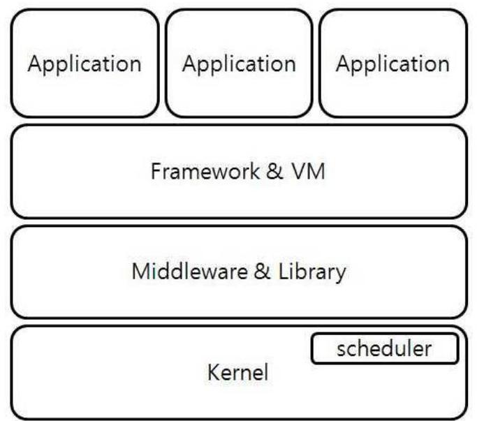
[그림 1] 안드로이드 구조

- 리눅스 커널

안드로이드에 맞게 리눅스 커널을 수정하여 만든 부분이다. 그러므로 리 눅스 운영체제가 내장하고 있는 기본적인 기능들은 가지고 있으며, 여기에 안드로이드 플랫폼에 맞는 동작을 위해 필요한 기능들이 추가되어 있는 형 태로 구성되어 있다. 하드웨어 컨트롤을 위한 디바이스 드라이버, 메모리 관 리, 프로세스 관리, 네트워크 관리 등과 같은 운영체제의 기본 동작을 관리 한다. 안드로이드 플랫폼에서 추가된 리눅스 커널의 내용으로는 Alarm 에 사용되는 AlarmManager가 있는데 알람 동작을 위한 작업과 이벤트를 발생 할 수 있도록 제공 된다. Ashmem은 Android Shared Memory Driver로서 안드로이드 시스템에서 사용하는 리소스 및 데이터를 시스템 상의 공유한 다. Kernel Debugger/Logger는 안드로이드 플랫폼이 동작할 때에 출력하는 로그를 컨트롤하는 드라이버로 시스템의 상태를 확인하는데 유용하게 사용 되는 Logcat을 사용하기 위한 드라이버이다. Binder는 안드로이드에서는 각 각의 프로세서 간에 데이터를 주고받기 위해 만들어졌다. IPC(Inter Process Communication) 통신을 통해 데이터를 주고받도록 구현되어 있다. Power Management는 안드로이드에서는 리눅스 커널을 사용하고 있지만, 모바일 기기들은 기존의 리눅스 커널의 전원관리 보다 좀 더 세심한 전원관리가 필 요하다. 기존 PC에서는 전원이 연결되어 있어서 모바일 기기들처럼 배터리 가 소모되고 재충전하여야하는 번거로움이 없기 때문에 전원관리 부분에서 다소 포괄적으로 구현되어져 있었기 때문이다. 모바일 기기에서 조금 더 세 분화 시켜서 관리하고자 하는 부분이 되겠다. Wake Lock을 이용하여 CPU 와 화면, 키보드 라이트 등을 상황에 맞게 관리한다.

$<$ 표 2> Wake lock

|  Flag Value | CPU | Screen | Keyboard  |
| --- | --- | --- | --- |
|  PARTIAL_WAKE_LOCK | On* | Off | Off  |
|  SCREEN_DIM_WAKE_LOCK | On | Dim | Off  |
|  SCREEN_BRIGHT_WAKE_LOCK | On | Bright | Off  |
|  FULL_WAKE_LOCK | On | Bright | Bright  |

- HAL(Hardware Abstraction Layer) 영역

안드로이드 플랫폼의 상위 영역에서 하위 영역인 하드웨어에 접근하기 위 한 인터페이스를 제공한다. 명확하게 구분되어진 것은 아니다. 안드로이드 버전이 업데이트 될수록 포함되어지는 지원 영역이 점점 늘어나는 추세이 다. 전화를 위한 RIL단이 포함되어 있고, GPS와 여러 가지 센서, 하드웨어 장치 제어를 위한 API 들을 제공하고 있다. 하드웨어를 제어하기 위해 제공 되는 계층으로 상위 단이 변경되어도 그대로 사용할 수 있도록 구조화 되어 있다고 볼 수 있다.

- 안드로이드 Runtime 영역

안드로이드 Runtime 자바의 주요 기능을 대부분 포함하고 있다. 모든 안 드로이드 Dalvik 버츄어 머신 내에 어플리케이션이 자신의 영역을 가지고 동작한다. Dalvik에서는 아주 작은 메모리에서 동작하는 최적화된 Dalvik E xecutable(.dex) 파일을 실행한다. Dalvik VM은 자바 컴파일러를 통해 컴파 일된 후의 Class를 dx라는 도구에 의해 .dex 파일로 변환하여 실행한다.

- Dalvik VM

Dalvik은 구글에서 자바를 활용하기 위해 직접 만든 Java Virtual Machin e입니다. 자바 코드로 작성된 소스는 bytecode로 컴파일 되고, 안드로이드에

내장되어 있는 Dalvik VM에 의해 실행되는 구조이다.
기존 Java Virtual Machine과 다른 점은 Dalvik VM에서는 .class 파일이 실행되는 것이 아니라 .dex 파일을 실행하는 것이라고 볼 수 있겠다. 어떤 면에서는 자바 라이선스 비용을 줄이기 위한 것도 포함되어 있겠다.

이로서 Dalvik VM은 Register-Based Architecture로 모바일 기기에 최적 화되어 구성되었고 여러 개의 어플리케이션이 실행 가능 하도록 설계 되었 다. Linux Kernel의 사용으로 프로세스간 영역을 보장하여 보안을 유지하 고 메모리 관리 및 스레딩 까지 포함되어 있다.

# 3.5 Content Provider을 이용한 데이터 추출 

안드로이드 어플리케이션은 데이터를 저장하기 위해 SQLite 데이터베이 스를 사용하는데, 어플리케이션 소유의 데이터베이스에는 바로 접근이 가능 하지만 다른 어플리케이션과 데이터를 공유하기 위해서 다른 어플리케이션 의 데이터베이스에는 접근은 할 수가 없는 구조로 되어 있다. 이때에 다른 어플리케이션이 접근할 수 있도록 통로 역할을 하는 것이 Content Provider 이라고 볼 수 있다.

### 3.5.1 AFLogical

AFLogical은 viaForensics에서 개발 되었으며, 안드로이드의 정보 공유 기능인 Content Provider를 이용해서 데이터를 추출한다. 추출된 데이터로 는 CallLog Calls(통화내역), Contacts Phones(전화번호부), MMS, MMSPa rts(MMS 내용), SMS(문자 메시지)가 있다.

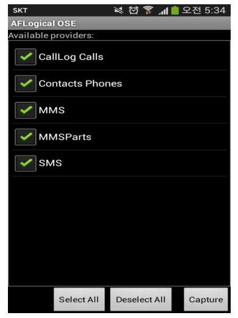
[그림 2] AFLogical 실행화면

# 3.6. ADB 를 이용한 Database 직접 접근 

아래 데이터들은 최신 안드로이드 레퍼런스 디바이스인 넥서스7 2세대에 서 추출한 데이터 들이며 레퍼런스 디바이스가 아닌 것은 각 제조사 마다 저장 위치가 조금씩 다를 수 있다. 여기서는 넥서스7 2세대와 삼성 갤럭시 S4를 각각 분석하였다. 처음으로 연락처는 contacts2.db에 저장되어 있는데 그 경로는/data/data/com.android.providers.contacts/databases/이다. 데이터 베이스 내의 raw contacts 테이블 내용을 보면 아래와 같이 저장되어 있다.
<표 3> raw contacts 테이블 내용

| _id | contact_id | display_name | sync3 |
| :-- | :-- | :-- | :-- |
| 1 | 10 | 홍길동 | 2013-09-30T13:21:09.295Z |
| 2 | 11 | 김진수 | 2013-09-30T13:21:10.578Z |
| 3 | 12 | 김철수 | 2013-09-30T13:21:11.773Z |
| 4 | 13 | 이영희 | 2013-09-30T13:21:11.201Z |

raw_contacts테이블의 contact_id 필드의 값으로 contact2_phone_lookup 테이블 의 raw_contact_id 필드 값으로 검색하면 해당 사람의 전화번호를 찾을 수 있다.

| RecNo | data_id | raw_contact_id | normalized_number | min_matc |
| :--: | :--: | :--: | :--: | :--: |
| Click here to define a filter |  |  |  |  |
| 1 | 27 | 1001197 | 365 | 5607937 |
| 2 | 27 | 10 +821197397 |  | 5607937 |
| 3 | 30 | 110178566 |  | 1886658 |
| 4 | 30 | 11 +82178566 |  | 1886658 |
| 5 | 33 | 1201031866 |  | 1006681 |
| 6 | 33 | 12 +821031866 |  | 1006681 |
| 7 | 36 | 130112332 |  | 2632332 |
| 8 | 36 | 13 +82112332 |  | 2632332 |
| 9 | 39 | 1401062695 |  | 6925962 |
| 10 | 39 | 14 +821062695 |  | 6925962 |
| 11 | 42 | 150162225 |  | 1315222 |
| 12 | 42 | 15 +82162225 |  | 1315222 |

[그림 3] 전화번호 목록

통화기록도 contacts2.db 에 저장되어 있는데 그 정보는 calls 테이블에 저장되어 있다. 테이블 내용을 보면 duration 통화 시간, date 수발신된 시 간, name 통화자 이름으로 구성되어 있으며 type으로 1 은 수신, 2는 발신, 3 은 부재중전화로 되어 있다. 아래 그림은 통화기록 목록 테이블 이다.

| id | number | date | duration | type | new | name | numbertype <br> Click he |
| :--: | :--: | :--: | :--: | :--: | :--: | :--: | :--: |
| 176301034279 |  | 1377986726000 | 0 | 1 | 10 |  | 2 |
| 176401037947 |  | 1377989718397 | 669 | 2 | 1 |  | 2 |
| 176501084757 |  | 1377991439072 | 0 | 2 | 1 |  | 2 |
| 176601084757 |  | 1377993302321 | 0 | 2 | 1 |  | 2 |
| 176701034279 |  | 1377993422000 | 0 | 1 | 1 |  | 2 |
| 176801084757 |  | 1377993355855 | 566 | 1 | 1 |  | 2 |
| 176901034279 |  | 1377993942434 | 0 | 2 | 1 |  | 2 |
| 177001034279 |  | 1377994762000 | 0 | 1 | 1 |  | 2 |
| 177101034279 |  | 1377994936000 | 0 | 1 | 1 |  | 2 |
| 177201084757 |  | 1377994911418 | 743 | 1 | 1 |  | 2 |
| 177301037947 |  | 1377995673263 | 845 | 2 | 1 |  | 2 |

[그림 4] 통화기록 목록

SMS/MMS는 mmssms.db 데이터 베이스에 저장되어 있고 경로는/data/ data/com.android.providers.telephony/databases/ 이고, sms 테이블 내용으 로는 address 전화번호, date 수발신 시간, read 수신된 메시지를 읽었으면 1 로 읽지 않았으면 0 저장된다. type은 1 로 저장되면 발신, 2 로 저장되면 수 신을 표시한다. body에는 문자 메시지 내용이 포함되어 있고, service cente r에는 SMS서비스센터 번호가 저장 된다.

| id | thread_id | address | person | date | date_sent | protocol | read |
| :--: | :--: | :--: | :--: | :--: | :--: | :--: | :--: |
|  |  |  |  |  |  |  |  |
| 1 |  | 1010722 | 1 | <null> | 1371176400000 | 0 | 0 | 1 |
| 2 |  | 2158838 |  | <null> | 1371176617000 | 0 | 0 | 1 |
| 3 |  | 4010443 | i | <null> | 1371181779000 | 0 | 0 | 1 |
| 4 |  | 5011488 |  | <null> | 1371181837000 | 0 | 0 | 1 |
| 5 |  | 4010443 | i | <null> | 1371189406079 | 0 | <null> | 1 |
| 6 |  | 6 \#\#111/ |  | <null> | 1371189500000 | 0 | 0 | 1 |
| 7 |  | 6 \#\#111/ |  | <null> | 1371190563000 | 0 | 0 | 1 |
| 8 |  | 7156657 |  | <null> | 1371191161000 | 0 | 0 | 1 |
|  |  |  |  |  |  |  |  |
| 9 |  | 5011488 |  | <null> | 1371192072212 | 0 | <null> | 1 |
| 10 |  | 5011488 |  | <null> | 1371192103000 | 0 | 0 | 1 |
| 11 |  | 5011488 |  | <null> | 1371192116526 | 0 | <null> | 1 |
| 12 |  | 4010443 | i | <null> | 1371194220000 | 0 | 0 | 1 |
| 13 |  | 8158887 |  | <null> | 1371195513000 | 0 | 0 | 1 |
|  |  |  |  |  |  |  |  |
| 14 |  | 9010958 |  | <null> | 1371201852000 | 0 | 0 | 1 |
|  |  |  |  |  |  |  |  |
| 15 |  | 10010688 | 1 | <null> | 1371203229000 | 0 | 0 | 1 |
|  |  |  |  |  |  |  |  |

[그림 5] SMS/MMS 리스트

일정은 /data/data/com.android.providers.calendar/databases/calendar.db 에 저장되고 알람은 /data/data/com.google.android.deskclock/databases/alar m.db 에 저장된다. 외장메모리의 파일 리스트는 /data/data/com.android.pr oviders.media/databases/external.db 에 저장되어 있다. 내장메모리는 intern al.db에 저장되어 있고, 경로는/data/data/com.android.providers.media/datab ases/ 이다. files 테이블에는 _data 파일 위치 경로, _size 파일 크기, date_a dded 파일 추가된 날짜, date_modified 파일 수정된 날짜가 저장되어 있다.

| .id | .data | .size | format | parent | .date_added | .date_modified | .mime_type |
| :--: | :--: | :--: | :--: | :--: | :--: | :--: | :--: |
|  |  |  |  |  |  | Click here to define a filter |  |
|  | 1530 /storage/emulated/0/Books/MoonReader/The Man Who Would Be King.epub_2.png |  | 82927 | 14347 | 1273 | 1380927506 | 1380548969 | image/png |
|  | 1531 /storage/emulated/0/Books/MoonReader/The Man Who Would Be King.epub_1.png |  | 121336 | 14347 | 1273 | 1380927506 | 1380548970 | image/png |
|  | 1532 /storage/emulated/0/Books/MoonReader/Alice in Wonderland.epub |  | 48948 | 12288 | 1274 | 1380927506 | 1380548969 | <null> |
|  | 1533 /storage/emulated/0/Books/MoonReader/IN THE YEAR 2009.epub |  | 44641 | 12288 | 1274 | 1380927506 | 1380548969 | <null> |
|  | 1534 /storage/emulated/0/Books/MoonReader/The Man Who Would Be King.epub |  | 52511 | 12288 | 1274 | 1380927506 | 1380548969 | <null> |
|  | 1535 /storage/emulated/0/Books/1F8Reader/cache/fbreeder_cat |  | 9901 | 12288 | 1276 | 1380927506 | 1380549031 | <null> |

[그림 6] 내장메모리 리스트

다운로드는 downloads.db 데이터 베이스에 저장되어 있고, 전체 경로는 / data/data/com.android.providers.downloads/databases/이다. 저장된 내용을 보면 uri에는 사용자가 실제로 다운 받았던 사이트 주소가 저장되어 있고, h int, data 에는 다운 받은 파일의 디렉토리와 파일명 정보, lastmod 에는 마 지막 수정 시간이 저장되어 있다.
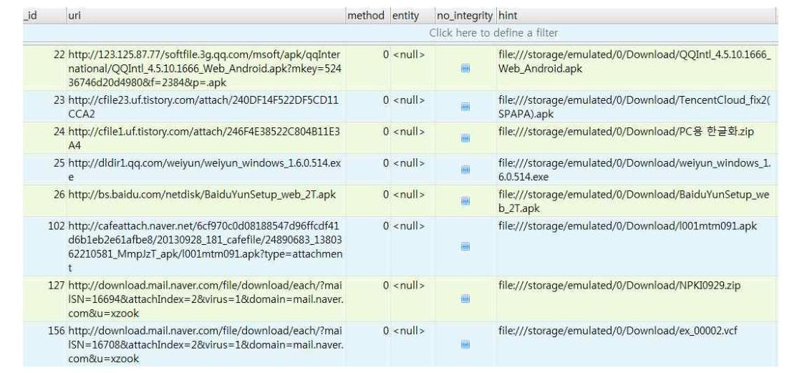
[그림 7] 다운로드 리스트

저장되어 있는 경로를 보면 아래와 같다.

- 시스템설정
/data/data/com.android.providers.settings/databases/settings.db
- 파일에 구글지도 검색어
/data/data/com.google.android.apps.maps/databases/search_history.db
- 구글지도 북마크
/data/data/com.google.android.apps.maps/files/DATA_STARRING
- Wifi 리스트
/data/misc/wifi/wpa_supplicant.conf
- Wifi Mac 캐시
/data/data/com.google.android.location/files/cache.cell
- 기지국 Cell 캐시
/data/data/com.google.android.location/files/cache.cell
- 사진 동영상
/sdcard/dcim/camera/
- 북마크
/data/data/com.android.chrome/app_chrome/Default/Bookmarks

Bookmarks의 History 테이블에는 URL 사용자가 방문한 사이트 주소, tit le 방문한 사이트의 타이틀명, visit_count 해당 사이트에 방문한 횟수, last_ visit_time 마지막으로 방문한 시간이 저장되어 있다.

| id | url | title | visit_count | typed_count | last_visit_time |
| :--: | :--: | :--: | :--: | :--: | :--: |
|  |  | Click here to define a filter |  |  |  |
|  | 1 http://www.google.com/int//ko/chrome/browser/mobile/t Android용 Chrome - 채용 솔저보기 <br> sus/ondros1html |  | 1 |  | 13024586348335430 |
|  | 2 http://www.naver.com/ | 네이버 : 나의 경쟁력, 네이버 | 57 |  | 13025632848121333 |
|  | 3 http://newsstand.naver.com/293 | 주요전문사, 전체전문사 : 네이버 뉴스스탠드 | 1 |  | 13024586518071554 |
|  | 4 http://www.blister.net/archives/165139 | 채용, 허스텔 '아이팩' 출시 | 1 blister.net | 1 | 13024586749164266 |
|  | 5 http://www.google.com/support/music/bin/answer.py?an US\&를 통한 컴퓨터 간 음악 파일 전송 - Google Play 도용 <br> soen $=1101500$ bin $=4 n$ |  | 2 |  | 13025225287211146 |
|  | 6 https://support.google.com/googleplay/answer/1101500? US\&를 통한 컴퓨터 간 음악 파일 전송 - Google Play 도용 <br> ㅇ $=4 n$ |  | 2 |  | 13025225287211146 |
|  | 7 http://search.naver.com/search.naver?where=newserch\&q: qj루폴러스 : 네이버 통합검색 <br> uery=!g\%EC\%9C\%A0\%ED\%9A\%BC\%EB\%9F\%AC\%EC\%8A <br> \%A481em=!oq: j:uyjym685m=1\&sa=1\&aioj=!g\%EC\%9C <br> \%A08sqdt=0\&ss=url\# |  | 2 |  | 13024586567022725 |
|  | 8 http://cr.naver.com/nl/m=1\&px=382\&pg=136\&ss=382\&c int 광대역 for : 네이버 통합검색 <br> y=136\&p=RC7jM35Y7usssQVU\&sossss2-222021\&q=!g\% <br> C9\%AF\%CT\%C3\%87\%AF\%8D\%8A\&ss=!rab:ncal3bf=!we <br> axn/h\&s=newserch\&s=!J\&ial10ssCAAAB2DZ\&E8dime=1 <br> 380132964741\&t=14\&a=nd=g:lsr2de=2\&t=0\&u=http\%3 <br> A//search.naver.com/search.naver\%3Fwhere\%3Dnewserch <br> \%26query\%3Dbr\%2B\%255A\%2584\%2591\%255B\%258C\%2 <br> 380\%25EC\%2597\%25A0\%2B0e\%26ie\%3Dutf8\%26sm\%3D <br> tab_ohir\%26sp8\%3D0 |  | 1 |  | 13024586565203847 |

[그림 8] History 테이블

# 3.7. 이미지 생성을 통한 데이터 분석 

R3는 블록 장치 전용 파일 시스템인 EXT4를 사용한다. R3의 userdata 파티션의 이미지를 생성하기 위해서 mount 명령을 통해서 확인할 수 있다. 아래 그림을 보면 /dev/block/mmcblk0p26 에 위치하고 있는 것을 볼 수 있 다. 이 경로를 이용하여 dd 명령어로 이미지 파일을 생성한다.

11rootBandroid:/ \# mount
mount
rootfs on / type rootfs (ro,relatime)
tmpfs on /dev type tmpfs (rw,nosuid,relatime,mode=755)
devpts on /dev/pts type devpts (rw,relatime, mode=600)
proc on /proc type proc (rw,relatime)
sysfs on /sys type sysfs (rw,relatime)
none on /acct type cgroup (rw,relatime,cpuacct)
tmpfs on /mnt/asec type tmpfs (rw,relatime, mode=755, gid=1000)
tmpfs on /mnt/obb type tmpfs (rw,relatime, mode=755, gid=1000)
none on /dev/cpuct1 type cgroup (rw,relatime, cpu)
/dev/block/mmcblk0p14 on /system type ext4 (ro,relatime, data=ordered)
/dev/block/mmcblk0p15 on /persist type ext4 (rw,nosuid,nodev,relatime, data=order ed)
/dev/block/mmcblk0p26 on /data type ext4 (rw,nosuid,nodev,relatime,noauto_da_all oc, data=ordered)
/dev/block/mmcblk0p16 on /cache type ext4 (rw,nosuid,nodev,relatime, data=ordered )
/dev/block/mmcblk0p13 on /preload type ext4 (ro,relatime, data=ordered)
/dev/block/platform/msm_sdcc.1/by-name/modem on / firmware type vfat (ro,relatime ,uid=1000, gid=1000, fmask=0337, dmask=0227, codepage=cp437,iocharset=iso8859-1, shor tname=lower,errors=remount-ro)
/dev/fuse on /storage/sdcard0 type fuse (rw,nosuid,nodev,relatime,user_id=1023,g roup_id=1023,default_permissions,allow_other)
/dev/block/dm-0 on /mnt/asec/com.neaststudios.procapture-1 type ext4 (ro,dirsync ,nosuid,nodev, noatime)
rootBandroid:/ \# dd if=/dev/block/mmcblk0p26 of=/sdcard/dbdata.img bs=2048
dd if=/dev/block/mmcblk0p26 of=/sdcard/dbdata.img bs=2048
[그림 9] Image 생성 과정
만들어진 img 파일을 포렌식 툴인 FTK에서 로딩하여 내용을 확인해 보 았다.
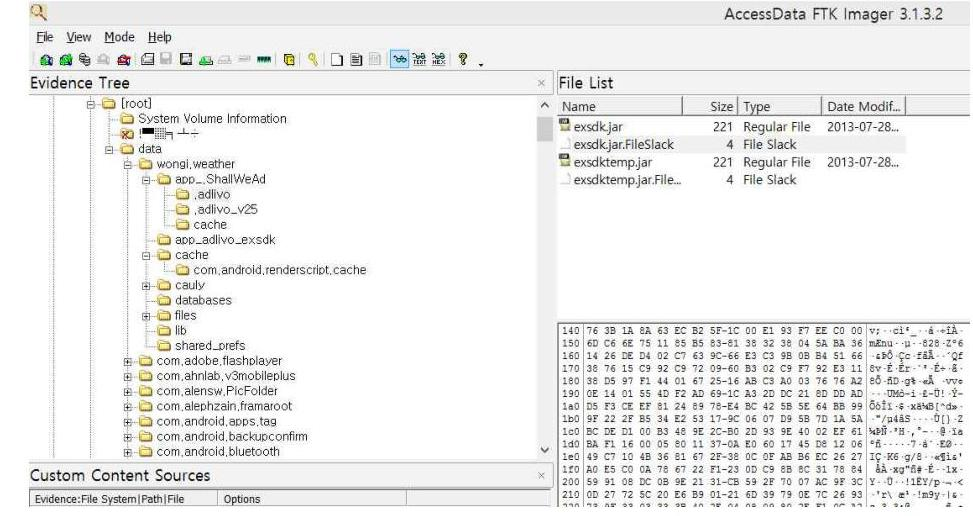
[그림 10] FTK를 통한 이미지 로딩

# 3.8 SD 카드에서의 파일 복구 

SD 카드에 저장된 파일은 USB를 통해서 PC와 연결하여 내용을 확인할 수 있다. 안드로이드의 SD카드의 기본 포맷은 FAT32로 되어 있어서 삭제 된 파일을 복구 할 때에 윈도우의 하드디스크 복구에 사용하는 기법을 모두 사용할 수 있다. 다음은 간단히 Recuva를 사용하여 삭제된 파일을 확인하 고 복구하는 것을 보여 준다.
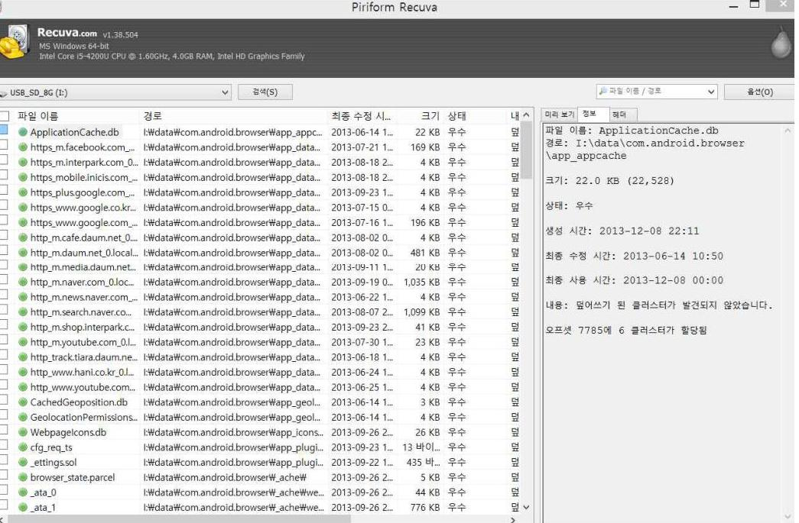
[그림 11] Recuva를 이용한 파일 복구

# 제4장 제안하는 방법 

## 4.1 데이터 수집 및 분석 절차

첫번째로 제안하는 방법은 스마트폰에 저장되어 있는 수많은 데이터들 중 에서 사용자의 위치를 파악할 수 있는 여러 가지 방법으로 사용자의 이동 경로를 파악한다. 파악하는 방법으로는 아래와 같은 것들이 있다.

- 사진 촬영시 포함되어 있는 정보
- GPS 정보로 지도상에 위치를 확인하는 방법
- 네이버 지도에서 확인하는 방법
- 위도경도로 주소를 알아내는 방법
- 사용자가 촬영한 사진에 위치정보를 알 수 있는 건물 또는 표시판이 있을 때.
- 위치정보 수집 앱 사용
- 지도앱을 사용
- SNS 앱에 저장된 이미지 파일에서의 위치정보
- SNS에서의 위치정보 수집
- GPS 접속 정보에서 위치정보 추출

두번째로 이동경로를 통해 사용자게 해당 지역에 머물렀던 시간을 파악하 고, 정확한 시간 범위를 정할 수 없다면 최대한 넓은 영역으로 시간 범위를 설정한다.

세번째로 정해진 시간영역으로 스마트폰에서 그 시간대에 사용된 앱과 데 이터베이스, 사진파일, 문서 파일등 모든 파일을 검색한다.

네 번째로 사건과 관련될만한 파일들을 분석하여 사건의 증거자료를 찾는다.

# 4.2 증거 수집을 위한 데이터들의 종류 

사건이 발생하였을 때에 스마트폰에서 데이터를 수집하여야 하는 부분의 데이터 저장 위치는 사용자가 사용한 어플리케이션의 데이터는 data/data/ 하위 디렉토리 저장된다. 그리고 사진 촬영이나 동영상 촬영 등의 데이터는 스마트폰의 차체 메모리나 SD Memory card 에 저장된다. 차례로 해당 데 이터들의 크기를 실제 사용하는 폰에서 알아보면 아래와 같다.

### 4.2.1 갤럭시 S 4 의 데이터

$<$ 표 4> 갤럭시 S4 데이터

| Data $\backslash$ data $\backslash$ | 내장 메모리 |
| :-- | :-- |
| Name: data | Name: sdcard0 |
| Type: 폴더 | Type: 폴더 |
| Path: /Data/ | Path: /storage/ |
| Contains: 5808 파일, 14115 폴더 | Contains: 7490 파일, 1412 폴더 |
| 크기: $445.61 \mathrm{MB}(467,253,598$ Bytes) | 크기: $7.03 \mathrm{~GB}(7,547,436,846$ Bytes) |

| Sd 메모리 |
| :-- |
| Name: extSdCard |
| Type: 폴더 |
| Path: /storage/ |
| Contains: 4936 파일, 85 폴더 |
| 크기: $13.68 \mathrm{~GB}(14,688,823,850$ Bytes) |

# 4.2.2 Nexus 72 세대의 데이터 

<표 5> Nexus 72 세대 데이터

| Data $\backslash$ data $\backslash$ | 내장 메모리 |
| :-- | :-- |
| Name: data |  |
| Type: 폴더 | Name: sdcard0 |
| Path: /data/ | Type: 폴더 |
| Contains: 7568 파일, 1700 폴더 | Path: /storage/ |
| 크기: 864.39 MB | Contains: 2746 파일, 582 폴더 |
| (906,383,702 Bytes) | 크기: $9.92 \mathrm{~GB}(10,654,618,869$ Bytes) |

위와 같이 스마트폰에서 사용자들이 접근하여 사용하는 데이터 저장 영역 에 대해 확인해 보면 앱 사용을 위해 저장되는/data/ 영역과 제조사에서 제공하는 내장 메모리, 외장 추가 메모리 등이 있다.

최근 스마트폰의 대용량화가 진행 되면서 내장 메모리는 16GB, 32GB, 64 GB 까지 커지면서 사용자가 사진과 동영상 그리고 기타의 여러 가지 파일 들을 기가바이트 단위로 저장하고 있고, 내장 메모리 뿐만 아니라 외장메모

리를 추가 장착할 수 있어서 MicroSD 카드를 통하여 16, 32, 64GB 까지 추가 하여 수집 및 분석하여야하는 데이터의 양이 엄청나게 많은 것을 볼 수 있다.

# 4.2.3 베가 R3의 데이터 

## <표 6> 베가 R3 데이터

| Data $\backslash$ data $\backslash$ | 내장 메모리 |
| :-- | :-- |
| Name: data | Type: 폴더 |
| Type: 폴더 | Path: /storage/ |
| Path: /data/ | Contains: 5692 파일, 918 폴더 |
| Contains: 5870 파일, 1920 폴더 | 크기: $3.24 \mathrm{~GB}(3,475,669,820$ Bytes) |
| 크기: $827.79 \mathrm{MB}(867,999,883$ Bytes) |  |
| Sd 메모리 |  |
| Name: SdCard |  |
| Type: 폴더 |  |
| Path: / |  |
| Contains: 35 파일, 35 폴더 |  |
| 크기: $4.49 \mathrm{~GB}(4,826,130,350$ Bytes) |  |

### 4.2.4 베가 Racer의 데이터

## <표 7> 베가 레이서 데이터

| Data data $\backslash$ | 내장 메모리 |
| :-- | :-- |
| Name: data | Name: sdcard |
| Type: 폴더 | Type: 폴더 |
| Path: /data/ | Path: / |
| Contains: 7297 파일, 1111 폴더 | Contains: 5325 파일, 734 폴더 |
| 크기: $443.26 \mathrm{~GB}(464,796,583$ Bytes) | 크기: $4.38 \mathrm{~GB}(4,700,711,967$ Bytes) |

# 4.3 사용자의 위치 정보 수집 방법 

### 4.3.1 사진 촬영시 포함되어 있는 정보

EXIF 정보란 디지털카메라의 이미지 파일에 함께 저장되어 이미지 파일 의 여러 가지 정보를 포함하고 있는 형식이다. 약칭은 Exif, EXIF이다. 일본 전자공업진흥협회(JEIDA)에서 만들어서 전 세계에서 사용하고 있다. 저장되 어 있는 정보를 확인하려면 exif 규격에 맞는 프로그램을 별도 실행하여야 하며, 원본 이미지를 수정하게 되면 부가적으로 기록된 정보는 사라진다. 포 함된 내용으로는 화상 데이터와 카메라 제조사(Maker), 이미지 에디터(Soft ware), 사진 보정 날짜(Datetime), 카메라 모델(Model), 촬영 위치, Exif 버 전(Exif Version), 촬영한 날짜(Shoot Datetime), 웹에 올려진 사진의 실제 크기(Image Size), 노출 시간(Exposure Time:셔터 스피드), 촬영 프로그램 (Exposure Program), 렌즈 초점 길이(Focal Length), 조리개 개방 수치(FNumber), 플래시 사용 여부 등 세부적인 부가정보를 기록할 수 있다. 화상 데이터는 주로 TIFF(Tagged Image File Format)나 JPEG 압축 파일을 이 용하기 때문에 TIFF나 JPEG 파일로 사진 수정, 소프트웨어 그대로 표시, 편집할 수 있다. 최근 카메라에서는 위성항법장치(GPS) 수신기가 기본 장착 되어 있어서 위치 정보를 저장한다. 아래 그림과 같이 사진의 EXIF 정보에 남아 있는 GPS 위치 정보와 촬영 일자 정보를 이용할 수 있다.

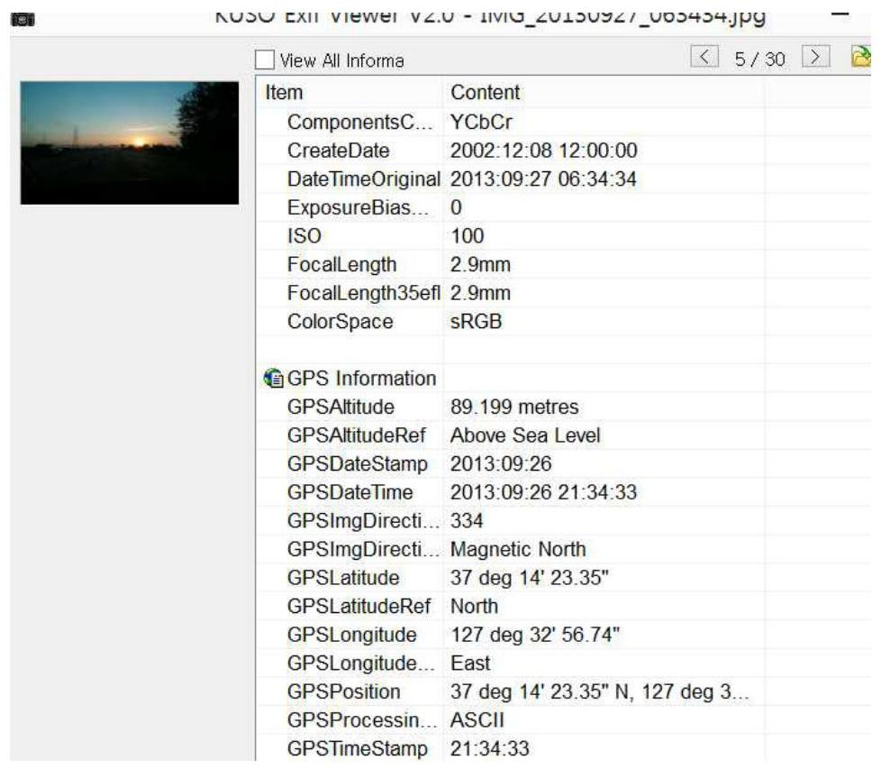
[그림 12] EXIF 내용

EXIF 정보에서 얻어진 GPS 좌표 는 GPS Latitude (위도) : 37; 14; 23.3 5, GPS Logitude (경도) : 127; 32; 56.74 이다.

# 4.3.2 GPS 정보로 지도상에 위치를 확인하는 방법 

GPS 정보로 지도상에 위치를 확인하는 방법으로는 도분초를 도로 변환하 여 지도에 표시하는 방법이 있는데 계산식은 아래와 같다.
도 + ((분/60)+(초/3600))

$$
\begin{aligned}
& 127+((32 / 60)+(56.74 / 3600))= \\
& 127.549094444
\end{aligned}
$$

계산식으로 얻어진 값으로 구글 지도에서 입력하여 위치를 확인한다.
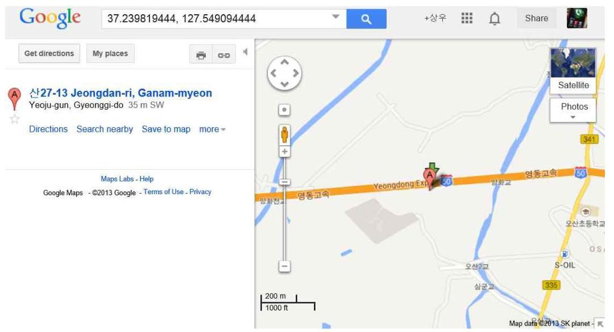
[그림 13] GPS 좌표를 이용한 지도 표시
4.3.3 네이버 지도에서 확인하는 방법

네이버지도를 실행하면 어떤 특정 지역의 주소는 아래 주소와 같이 되어

있다. 여기의 주소에서 숫자 부분을 찾고자 하는 위도, 경도로 변경하여 확 인할 수 있다.
http://map.naver.com/?dlevel=11\&lat=37.239819444\&lng=127.549094444 \& query $=\&$ menu $=$ location\&stab=SITE_1\%3B1\&siteOrder=0\&queryRank=1\&ma $\mathrm{pMode}=0 \&$ enc $=b 64$

[그림 14] Naver 지도를 이용한 위치 표시

# 4.3.4 위도 경도로 주소 알아 내기 

Geocoder함수를 이용하여 지도로 표시하지 않고 GPS좌표를 주소로 바로 변환하여 확인할 수 있다 아래 함수는 GPS좌표를 주소로 변환해 주는 함수 이다.

```
public void getAddress() {
    Geocoder geoCoder = new Geocoder(this);
    double lat = location.getLatitude();
    double lng = location.getLongitude();
    List<Address> addresses = null;
    try {
        addresses = geoCoder.getFromLocation(lat, lng, 5);
    //위도, 정도의 좌표로부터 Address 타입의 배열을 돌려준다
    } catch (IOException e) {
        e.printStackTrace();
    }
    if(addresses.size()>0){
        Address mAddress = addresses.get(0);
        mAddressStr = "Phone is near this address -
        "+mAddress.getCountryName()+" " // 국가 이름 반환
            +mAddress.getPostalCode()+" " //우편번호 반환
            +mAddress.getLocality()+" " //시/도의 이름을 반환
            +mAddress.getThoroughfare()+" " //도로명 번환
            +mAddress.getFeatureName(); //번지를 반환
    }
}
```


# 4.3.5 사진의 구조물 파악 

사용자가 촬영한 사진에 위치정보를 알 수 있는 건물 또는 표시판이 있을 때에도 위치를 파악할 수 있다. 사진의 파일 속성을 보면 DateTimeOriginal 로 저장된 사진 촬영 시간을 확인 할 수 있다.

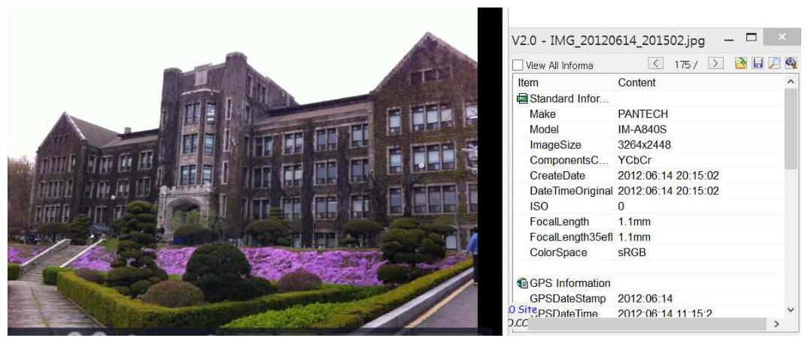
[그림 15] 의미있는 사진내 구조물

# 4.3.6 위치정보 수집 앱 사용 

안드로이드에는 위치정보를 사용하는 수많은 앱들이 존재한다. 이런 앱들 은 자체적으로 위치정보를 저장하고 있는 것들이 많다. 아래는 자체적으로 위치정보를 저장하는 앱 중에 하나의 데이터를 확인해 보았다. 예를 들어 사용자가 인터넷 속도 측정을 위해 벤치마크 툴을 사용하였을 때이다. /nexus7_backup1010.tar/data/data/com.benchbee.AST/databases/benchbeeD B/BENCHBEE
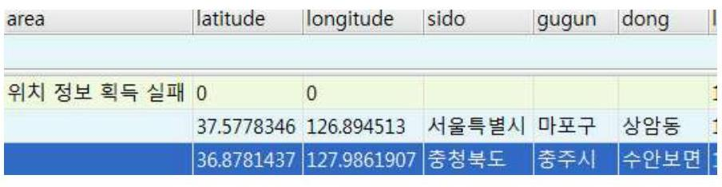
[그림 16] 앱의 위치정보 저장

# 4.3.7 지도맵을 사용 

다음 맵을 이용하여 지도 검색과 네비게이션 기능을 사용하였을 때 net.d aum.android.map\cache\map\cache\001\ 아래에 이미지 파일이 저장되는데 이 이미지들에서도 위치에 대한 정보를 확인할 수 있는 여러 지명들을 볼 수 있다.
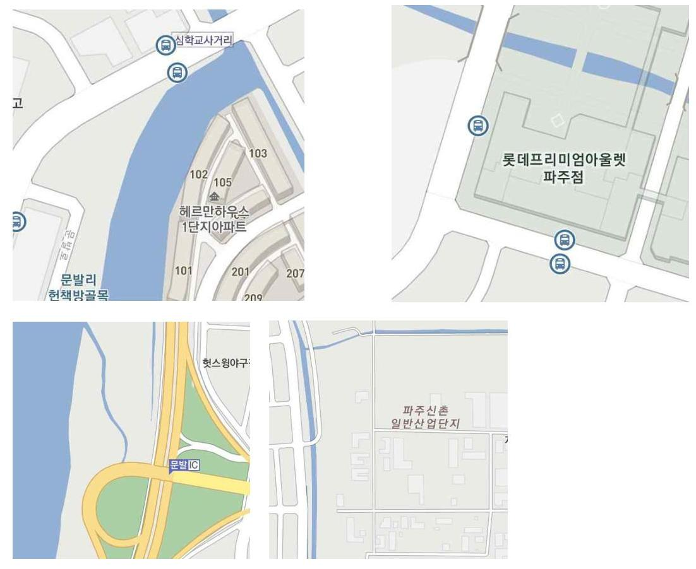
[그림 17] 지도 앱에서의 위치 이미지

경로는 net.daum.android.map/map/data/search_history 이고 저장된 내용 을 확인하여 보면 key 검색한 위치 명과 startPoint 네비게이션 모드에서 출 발 지점, endPoint 네비게이션 모드에서 도착 지점 등이 저장되어 있다.

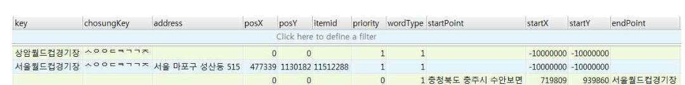
[그림 18] 네비게이션의 저장 정보

# 4.3.8 SNS 앱에 저장된 이미지 파일에서의 위치정보 

페이스북 앱에서는 사용자가 위치정보를 사용하면 해당되는 지점의 이미 지를 저장한다. 저장되는 경로는 data data $\backslash$ com.facebook.katana $\backslash$ cache $\backslash$ ima ge $\backslash$ 이고 저장된 파일들은 아래와 같이 .image과 .lru 파일들로 존재한다.

| 01qF0Rx8jX1vpchGa0Rd8eXKlP8 | image | 60,158 2013-10-18 14:5 |
| :--: | :--: | :--: |
| 0NPIWRpYKo_IFI-DvHbFZPWw30E | image | 16,746 2013-10-20 07:1 |
| 0nxTA-8-_GErpf2YZH6NteSBiXA | image | 5,192 2013-10-18 21:3 |
| 007LDQdg0KN2kM64NHYCJQCAoRw | image | 3,085 2013-10-20 21:3 |
| 0raX576J4yv22r3LrluQenyLFAM | image | 5,352 2013-10-18 21:3 |
| 0S_TR--h6ZgOSOtpFyjnHFkad_c | image | 147 2013-10-20 07:1 |
| 0whSTvF4S3ttYusC9sM0aZ4RQco | image | 109,861 2013-10-17 21:0 |
| 11ASg5oEYFB0-RAZCfChuGkIikA | image | 7,078 2013-10-20 21:3 |
| 17_CSACJKyEghaklIf6ikXhvMGc | image | 3,610 2013-10-21 07:1 |
| 18CEcP27pAyIgmXHvJEoXjdTdlE | image | 7,756 2013-10-18 21:3 |
| 1aQfDtPhq5G3-89KMzuCEhC7oQU | image | 3,708 2013-10-20 21:3 |
| 1Ee3xofLHMxJMLzDJURggghcBWM | image | 3,851 2013-10-17 21:0 |
| 1gPVyq6_dK0dCaON7vkV_7OQKuc | image | 2,548 2013-10-17 14:5 |
| 1hAbphLxwfVJATn07UoQ1cVd0eI | image | 3,437 2013-10-20 10:1 |
| 1NQaIOLEzd3aAha2xaHup0U49Ts | image | 5,993 2013-10-19 09:0 |
| 1Nx4dKb1vlev06sSEl8VovcNc0c | image | 97.962 2013-10-18 07:4 |

[그림 19] SNS에 저장된 이미지 파일

여기서 .image 파일들은 바로 실행해서 이미지를 확인할 수 없고 .jpg 파 일로 변경하면 이미지를 확인해 볼 수 있다. 그리고 이미지의 파일 속성에 서 FileModify Date를 통해 사용자가 위치했던 지역의 이미지 파일이 생성 된 시간도 알 수 있다.

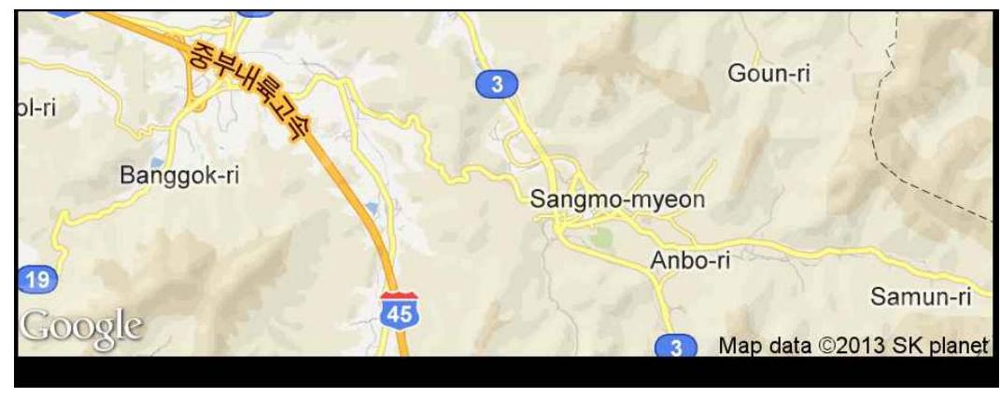
[그림 20] SNS에 저장된 이미지 변경 후 확인

| Item | Content |
| :-- | :-- |
| (1)Other Informati... |  |
| BackgroundCo... | 254 |
| BitDepth | 8 |
| ColorType | Palette |
| Compression | Deflate/Inflate |
| FileMobifyDate | $2013: 10: 2107: 19: 44$ |
| FileName | C:\swDrive\Phone_Data\S4:201... |
| FileSize | 59 kB |
| FileType | PNG |
| Filter | Adaptive |
| ImageHeight | 332 |
| ImageWidth | 936 |
| Interface | Noninterlaced |

[그림 21] 파일 생성 시간

# 4.3.9 SNS에서의 위치정보 수집 

트위터에서도 글을 올렸을 때에 위치정보 동의를 하였다면, data data co m.twitter.android databases $\ 55138446-3 . d b$ 경로에 데이터 베이스가 생성되 고 그 내용은 아래와 같이 위도와 경도가 저장되어 있고 글을 올렸을 때의 시간이 저장되어 있다.


[그림 22] SNS 데이터

데이터베이스 테이블은 statuses이고 필드를 보면 Latitude, Longitude, Created 글을 올린 시간 등이 위의 그림과 같이 저장 되어 있다. 위치 정보 만 있는 것이 아니라 내용까지 확인 할 수 있어서 사용자가 어떤 부분에 관 심을 가지는지도 확인이 가능하다.
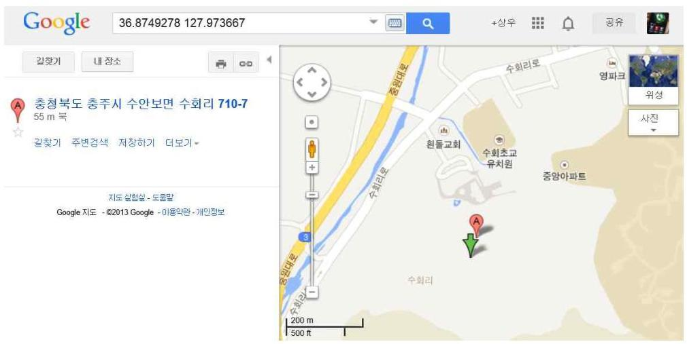
[그림 23] SNS 데이터 위치정보 확인

# 4.3.10 GPS 접속 정보에서 위치정보 추출 

GPS를 사용하기 위하여 설정을 On, Off 하였을 때에는 마지막으로 머물 렀던 지점의 위치정보가 data/data/com.android.browser/app_geolocation 경 로에 아래와 같이 저장 된다.

| RecNo | latitude | longitude | altitude | accuracy | altitudeAccuracy heading speed | timestamp |  |
| :--: | :--: | :--: | :--: | :--: | :--: | :--: | :--: |
|  |  |  |  |  | Click here to define a filter |  |  |
| 1 | 37.5777909 | 126.8944966 | <null> | 22 | <null> <null> <null> 1367438787291 |  |  |

[그림 24] GPS 위치정보 저장

### 4.4 데이터 추출

앞에서 얻어진 위치 정보를 이용하여 사건 당시에 머물렀던 장소의 시간 을 파악하여 그 시간의 데이터들을 추출하면 분석해야 할 데이터의 양이 상 당히 줄어들게 된다.

### 4.4.1 Nexus 7 2nd 에서의 데이터 추출

위치정보를 이용하여 피험의자가 있었던 장소에 머물렀던 시간이 2013년 10월 19일 밤 12시부터 2013년 10월 20일 밤 12시까지라는 정보를 추출하였 을 때에 기존의 방대한 데이터에서 해당 위치에 머물렀을 때에 접근하거나 동작한 파일들을 뽑아서 검토해야할 데이터의 양을 현저하게 줄이는 방법이 다. 일정 기간을 조회하기 위해 해당 시간의 시작시간과 종료 시간에 각각 파일을 생성한다.

```
root@deb:/data/data # touch -t 201310190000 start2.txt
touch -t 201310190000 start2.txt
root@deb:/data/data # touch -t 201310210000 end2.txt
touch -t 201310210000 end2.txt
```

앞에서 생성한 파일을 기준으로 그 사이에 생성되거나 접근한 파일에 대 한 리스트를 생성한다.

```
1|root@deb:/data/data # find /data/data/ -newer start2.txt -a !
-newer end2.txt > exelist.txt
```

앞에서 얻은 리스트로 피형의자가 어떤 행동을 하였는지 파악할 수 있다. exelist.txt 파일 내용을 보면 아래와 같다.

- /data/data/com.google.android.calendar : 일정을 열어보거나 업데이트
- /data/data/com.locna11.KimGiSa : 김기사 네비게이션을 이용
- /data/data/com.kakao.talk/ : 카카오톡을 사용
- /data/data/com.kakao.talk/databases/KaKaoTalk.db

Wifi_cache 테이블 내에는 사용자가 접속한 무선 공유기의 ssid 와 updat e 시간이 기록되어 있다. 보통 ssid는 Wifi 공유기를 사용하는 업체나 가게 명으로 되어 있어서 위치를 파악하는데 용의한 데이터이다.

T 맵을 사용하였을 때에는 /data/data/com.skt.skaf.1001mtm091 에 저장되 며 shared_prefs 파일 내에 route_guide_termination_info.xml의 내용을 보면 마지막 목적지를 확인 할 수 있다. <string name="route_guide_destination_

name" $>$ 동대문 $</$ string $></$ map $>$
다음 맵을 사용하였을 때에도 data/data/net.daum.android.map 에 저장되 며 네이버 밴드를 사용하면 /data/data/com.nhn.android.band 에 저장된다.

# 4.4.2 배가 R3에서의 데이터 추출 

R3에서도 Nexus에서와 마찬가지로 아래와 같은 과정을 거친다.

```
C:\MUsersWizesty>adb shell
shell@android:/ $ su
if
<dot@android:/ H cd data/data
    cd data/data
<dot@android:/data/data H touch -t 201309270000 start.txt
touch -t 201309270000 start.txt
<dot@android:/data/data H touch -t 201309272359 end.txt
touch -t 201309272359 end.txt
<dot@android:/data/data H-find /data/data/ -newer start.txt -a ! -newer end.txt
$ r3exelist.txt
art.txt -a ! -newer end.txt > r3exelist.txt
<dot@android:/data/data H
C:\MUsersWizesty>
```

얻어진 r3exelist.txt 파일에서 사용자의 행동을 파악하기 위해 중요한 정 보들을 따로 추출한다. 예를 들어/data/data/com.android.chrome/cache에서 는 사용자의 웹브라우저 사용 내용을 확인할 수 있고, /data/data/com.andro id.providers.contacts/databases/contacts2.db Contacts2.db 에서 calls 테이블 을 확인하여 누구와 언제 통화를 하였는지 확인한다. 전화를 사용하거나 전 화번호부에 전화번호 추가 삭제한 것을 알 수 있다. 해당 시간대에 통화 내 역 데이터베이스를 보면 3 명의 사람과 통화하였고 type에서 1 의 값은 수신 전화 2 의 값은 발신 전화이다. duration 은 통화 시간으로 이 X호라는 사람 과 1363 초라는 긴 시간 통화 한 것을 확인 할 수 있다.

| id | number | date | duration | type | new | name | numbertype |
| :--: | :--: | :--: | :--: | :--: | :--: | :--: | :--: |
|  |  |  |  |  |  | Click here to define a fill |  |
| 1853 | 010302; | 1378127050943 | 1363 | 1 | 1 이 |  | 2 |
| 1854 | 010568 C | 1378162772966 | 0 | 2 | 1 청 |  | 7 |
| 1855 | 010568 C | 1378162860769 | 0 | 2 | 1 청 |  | 7 |
| 1856 | 010568 C | 1378163027000 | 0 | 1 | 1 청 |  | 7 |
| 1857 | 010568 C | 1378163503876 | 0 | 2 | 1 청 |  | 7 |
| 1858 | 157712 | 1378167500000 | 0 | 1 | $1<\mathrm{r}$ |  | 0 |
| 1859 | 189940 C | 1378168055000 | 0 | 1 | $1<\mathrm{r}$ |  | 0 |
| 1860 | 0102611 | 1378172512000 | 0 | 1 | 1 박 |  | 7 |

[그림 25] 통화내역 확인

그리고 youtube 사용내역은/data/data/com.google.android.youtube/histor y.db 에서 확인 할 수 있는데 history.db 파일에서 suggestions 테이블을 확 인해 보면 아래와 같이 어떤 문장으로 검색하였는지를 확인할 수 있다.

| RecNo | id | display1 | display2 | query | date |
| :--: | :--: | :--: | :--: | :--: | :--: |
| Click here to define a filter |  |  |  |  |  |
| 1 |  | 2 안소미 | <null> | 안소미 | 1379285802741 |
| 2 |  | 3 댄수다 | <null> | 댄수다 | 1379285831043 |
| 3 |  | 4 24시간이 모자라 | <null> | 24시간이 모자라 | 1379888554554 |

[그림 26] suggestions 테이블

# 4.5 기존 방법과의 데이터 비교 

기존 Nexus와 R3에서 위치정보를 이용하여 사건 발생 시간을 정확하게 추측할 수 없지만 대략적으로 좁혔을 때의 범위를 2 개월로 하여 기존 분석 해야하는 데이터의 크기와 2 개월 내에서 사용자가 접근하였던 각각의 Data/ data 와 내장 메모리, SD카드 등의 데이터 크기를 비교해 보았다.

# 4.5.1 Nexus 7 2nd 의 데이터 비교 

기존 방법에서 증거 수집을 위하여 데이터를 추출하기 위해서는 전체의 데이터를 수집하여 원하는 정보를 찾아내어야 했다. 이때에는 사용자가 접 근할 수 있는 저장 영역의 거의 대부분을 관련된 단어나, 촬영된 사진 전체 를 검색하거나 각각을 확인하여야 하지만 앞에서 제시한 방법을 이용하였을 때에는 시간 범위를 최대한 넓게 설정하여도 기존 데이터에서 상당 부분 검 토하여야 하는 데이터의 양이 줄어든 것을 알 수 있다.
$<$ 표 8> Nexus 데이터 비교

| 메모리 | 기존 모든 데이터 추출 | 시간 범위내의 추출 |
| :-- | :-- | :-- |
| data/data(크기) | 864.38 MB | 73 MB |
| 내장 메모리(크기) | 9920 MB | 212 MB |
| data/data(개수) | 7568 개 | 580 개 |
| 내장 메모리(개수) | 2746 개 | 238 개 |

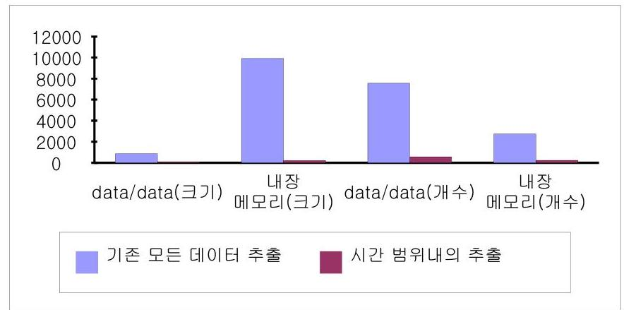
[그림 27] Nexus 데이터 비교 그래프

# 4.5.2 배가 R3 의 데이터 비교 

배가 R3에서도 Nexus 7 2nd 와 동일하게 시간범위를 2 개월로 하여 데이 터를 수집해 보았다. 아래의 결과를 보면 기존 데이터에서 시간범위를 정하 였을 때에 사건관련 증거를 찾아야 하는 영역이 줄어든 것을 볼 수 있다.
$<$ 표 9> R3 데이터 비교

| 메모리 | 기존 모든 데이터 추출 | 시간 범위내의 추출 |
| :-- | :-- | :-- |
| data/data | 827.79 MB | 97 MB |
| 내장 메모리 | 3320 MB | 176 MB |
| SD | 4490 MB | 1102 MB |
| data/data | 5870 개 | 380 개 |
| 내장 메모리 | 5692 개 | 580 개 |
| SD | 35 개 | 2 개 |

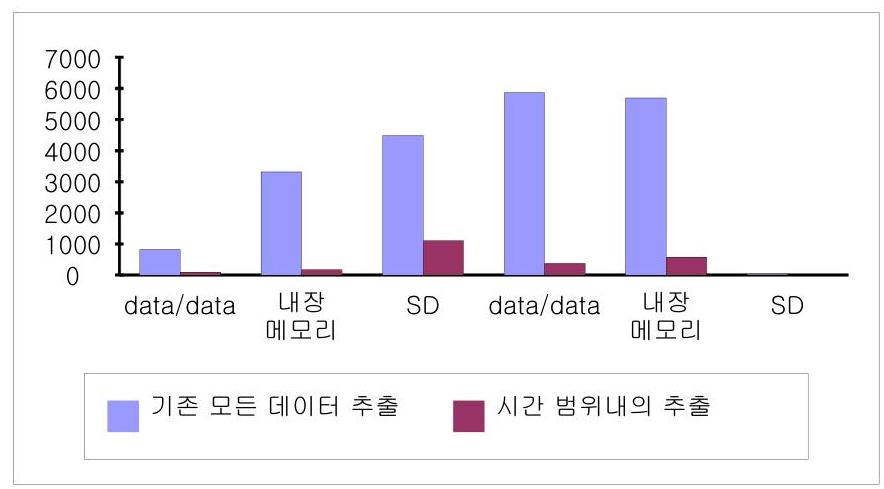
[그림 28] R3 데이터 비교 그래프

# 제 5 장 결론 및 향후 연구 

스마트폰을 압수하여 증거 수집을 할 때에 전체 범위가 대상이 되지만 피 혐의자의 위치를 파악할 수 있으면 사건 발생 시간을 모르더라도 위치를 이 용하여 시간 범위를 이용하여 데이터 추출 범위를 줄일 수 있다.

기존 방법은 스마트폰의 모든 데이터를 추출하여 사건과 관련된 정보를 찾아야 한다. 기존 시간 기준 데이터 추출 방법에 추가하여 위치 기준 데이 터 추출 방법을 추가하여 분석 데이터 범위를 축소한다. 문제점으로 사용자 의 이동 경로에 따른 위치관련 데이터의 축적이 계속 되어 지지 않으면 위 치 구분이 명확하지 않아 범위가 넓어 질 수 있다. 사건을 해결하기 위해 시간 기준 데이터 추출법에 추가하여 사용자의 동선과 관련된 위치 데이터 를 기준으로 하여 데이터를 추출하는 방법을 사용함으로 해서 추출하는 데 이터의 범위를 줄여서 분석해야 하는 데이터의 양을 줄일 수 있는 효과가 있다. 사용자 이동 경로에 따른 위치 파악을 위한 데이터들의 적절한 조합 으로 위치 추적의 정밀도 향상 및 안드로이드 버전 및 제조사별 정리 필요 하다.

# 참 고 문 헌 

[1] 박용일, "모바일 포랜식에 관한 연구 : 디지털 증거능력을 위한 모바일 포랜식 가이드라인을 중심으로", 성균관대학교, 2008
[2] 이규안, "JTAG방식을 이용한 모바일 포랜식 기법 연구", 숭실대학교, 2 010
[3] 박종원, "JTAG디버거를 이용한 안드로이드 시스템 디버깅", 임베디드월 드 2010. 8
[4] 법률사무소 민후의 공식 블로그, http://blog.naver.com/himinwho? Redirect=Log\&logNo=110174266354
[5] 포랜식프루프, http://forensic-proof.com/archives/4680
[6] 전자통신동향분석, 제 22권 제 1 호 2007년 2월 "디지털 포랜식 기술 및 동향"
[7] "Geocoder", http://developer.android.com/reference/android/location/Geo coder.html\#q=Geocoder
[8] 오정훈, "안드로이드 스마트폰 포랜식 분석 방법에 관한 연구", 고려대 석사 논문, 2011.12
[9] 홍일영, "안드로이드 로그에 대한 라이브 증거수집 및 분석 시스템 연 구", 고려대 석사 논문, 2011.12
[10] 구본미, 김주영, 이태림, 신상욱, "Android \& iOS기반 스마트폰의 디지 털 증거 수집 및 분석", 정보보호학회논문지, 2011. 2
[11] 홍일영, 이상진, "안드로이드 로그 시스템을 이용한 효율적인 사용자 행위기반 라이브 증거수집 및 분석 시스템 연구", 정보보호학회논문지, 2 012

[12] 여해동," 비휘발성팬을 사용하는 플래시 파일 시스템의 효율적인 메타 데이터 관리기법", 한양대학교, 2010
[13] 김태준, "복구 메커니즘을 고려한 모바일 폰 데이터 보호 기법", 서강 대학교, 2010
[14] 박용일, "모바일 포렌식에 관한 연구 :디지털 증거능력을 위한 모바일 포렌식 가이드라인을 중심으로", 성균관대학교, 2008
[15] 육동훈, "NAND플래쉬 메모리를 위한 저널링 F AT 파일 시스템",한국 외국어대학교, 2009
[16] 나상훈, "디지털 증거의 수집과 증거능력에 관한 연구", 고려대학교, 20 10
[17] 경찰청, 한국디지털포렌식학회, "디지털증거 처리 표준 가이드라인", 서 울 :경찰청, 2006
[18] 이성윤, "휴대전화 수사의 문제점 및 그 해결 방안", 檢察, 통권 제119 호, 대검찰청, 2008
[19] 이재홍, 오진하, 김석현, 이상호, 허준영, 조유근, 홍지만, "NAND플래시 파일 시스템을 위한 안전 삭제 기법", 정보과학회논문지: 컴퓨팅의 실 제 및 레터 제 14 권 제 3 호, 한국정보과학회, 2008
[20] 변정수, "한국형 디지털 증거분석 표준화 :경찰청 디지털 증거처리 표 준 가이드라인 및 증거분석 전문매뉴얼의 고찰", 디지털 포렌식 연구 제1 권 제1호, pp.163-177, 서울: 한국디지털포렌식학회, 2007
[21] Andrew Hoog, "Android Forensics: Investigation, Analysis and Mobil e Security for Google Android", Syngress, 1 edition, June, 2011
[22] Andrew Case, "Forensic Memory Analysis of Android's Dalvik Virt ual Machine", Source Conference, Jun. 2011

[23] Andrew Hoog, "Android forensics", Mobile Forensics World 2009, M ay. 2009
[24] Embedded News, 2012년 3월호 http://www.embeddedworld.co.kr/
[25] Jeff Lessard, "Android Forensics:Simplifying Cell Phone Examination s", SMALL SCALE DIGITAL DEVICE FORENSICS JOURNAL V OL. 2010
[26] Stefan Maus, Forensic Analysis of Geodata in Android Smart phones, Cyberforensics 2011, Strathclyde University
[27] Xinfang Lee, "Design and Imple mentation of Forensic System in A ndroid Smart Phone", The 5th Jointed Workshop on Information Sec urity, Aug. 2011
[28] Open Handset Alliance, http://www.openhandsetalliance.com/
[29] Xinfang Lee, "Design and Imple mentation of Forensic System in A ndroid Smart Phone", The 5th Jointed Workshop on Information Sec urity, Aug. 2011

# [ABSTRACT] 

## A Study on Digital Forensic Analysis of Android-based smart phone

Lim, Sang Woo<br>Major in Computer Engineering<br>The Graduate School of Engineering<br>Yonsei University<br>Supervised by Prof. Park, Sang-Hyun

In today's society, the use of mobile device increases geometrically, an d it is expected to be increasing more and more in the future. For this r eason, it is used in crime directly, such as smishing, and it is likely that it is used in important evidences for solving the problems indirectly. In s mart phone, there are numerous informations; the call log, the SMS, MM S mail contents of incoming and outcoming, the access route of web pag e, the search word in web page, the information for route search in navi gational equipment, the guided route information, the details of usage of mobile banking, and the contents of securities exchange etc. In this stud y , it is about where the information is stored. And then, it studies how t o find the information and how to get a clue for solving the problems.

The information of mobile device is becoming one of the important evide nces to be collected surely during the criminal investigation process and the court dispute, when it comes to occurred accidents. Still, the study a nd standard procedure about collecting evidences of smart phone are dea ctivated. Therefore, there is the data collection method of android forensi c. And it studies the analysis on the storage area of important data and the sampling, and the sampling method of data according to users' locati on information.

Keyword: Digital Forensic, Mobile Forensic, Android

