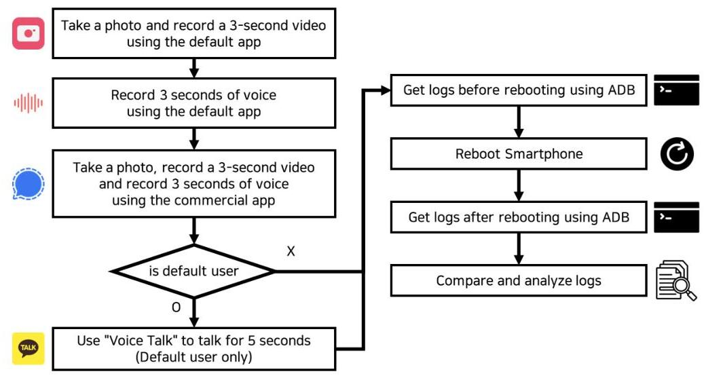
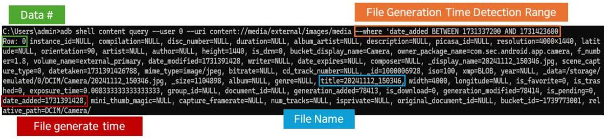
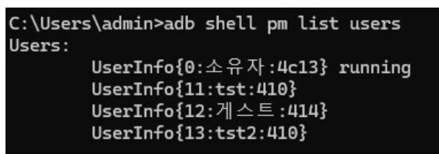
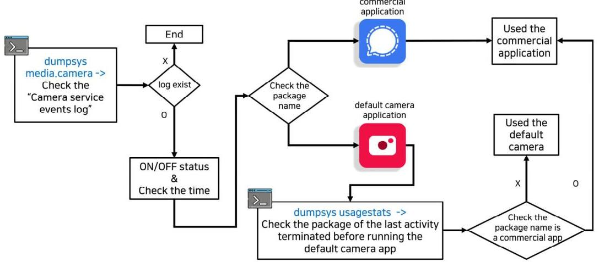
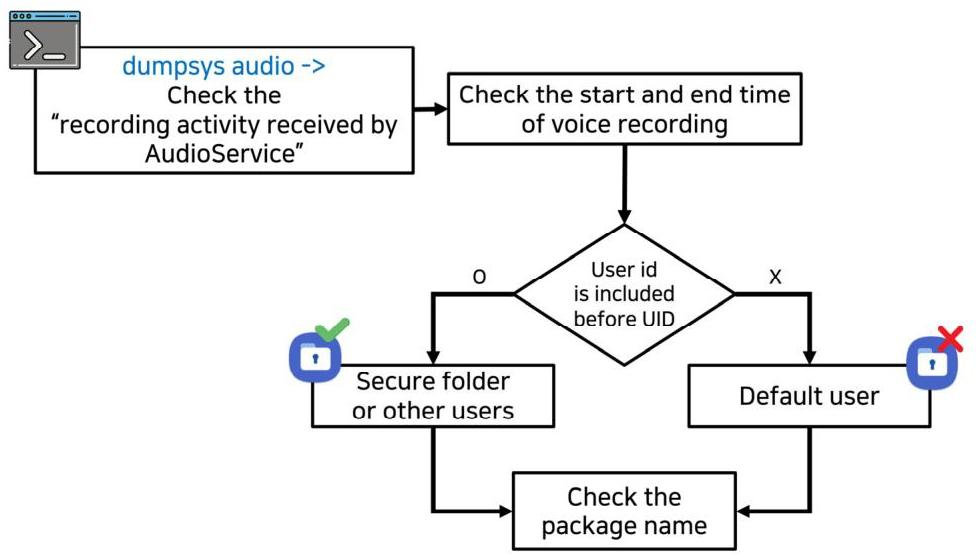
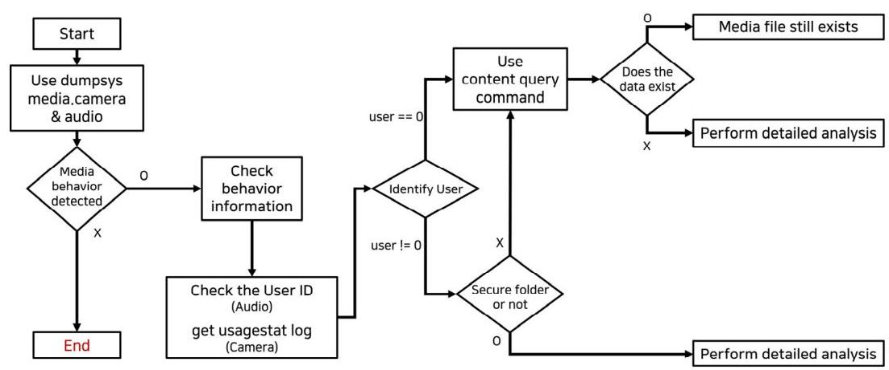
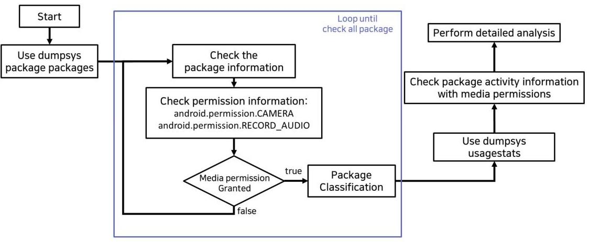
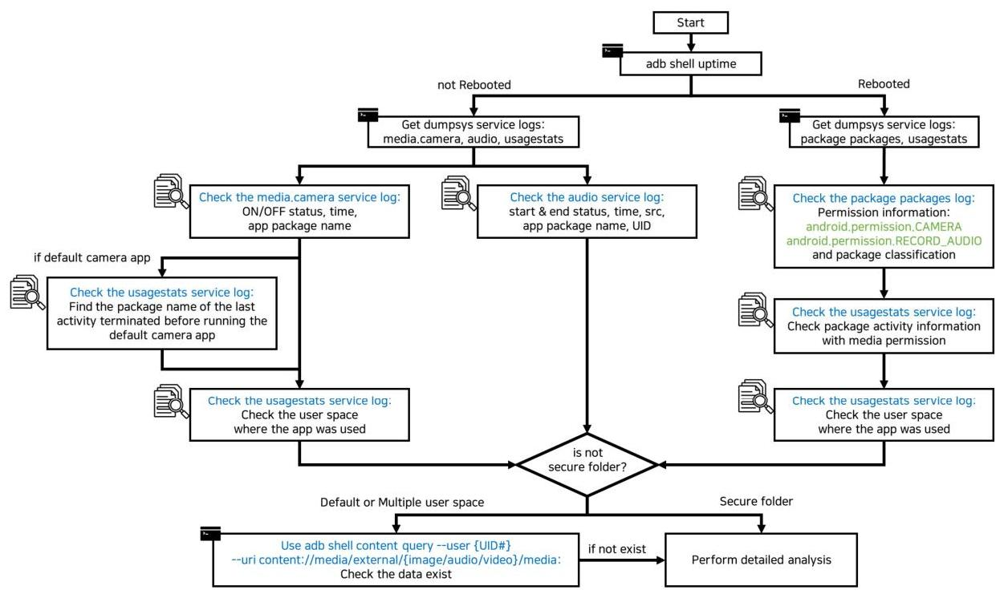

# 안드로이드 로그를 활용한 촬영 및 음성 녹음 탐지 방안 연구 

안 원 석*, 김 한 결*, 위 다 빈*, 김 동 인**, 박 명 서***<br>한성대학교 융합보안학과 (대학원생)*, (교수)***, IT융합공학부 (학부생)**

## A Study on the Method of Detecting Filming and Voice Recording Using Android Logs

Wonseok An*, Hangyeol Kim*, Dabin We*, Dong-in Kim**, Myungseo Park***<br>Dept. of Convergence Security, Hansung University (Graduated),* (Professor)***,<br>Dept. of IT Convergence Engineering, (Student)**

## ■ 요약 ■

최신 스마트폰은 사진, 동영상, 음성 녹음과 같은 멀티미디어 데이터 생성 기능을 제공한다. 하지만, 일부 사람들은 이 러한 스마트폰의 기능을 이용하여 몰래카메라와 같은 성범죄, 기업 또는 국가 보안시설의 기밀유출과 같은 범죄 행위를 저지른다. 반대로 일부 사람들은 범죄 행위를 저지르지 않았음에도 억울하게 용의자로 지목되어 스마트폰에 저장된 파일 을 강제로 보여주거나, 포렌식 분석을 위해 스마트폰을 제출하여 스마트폰을 사용하지 못하는 불편함을 겪는다. 또한, 조 사해야 하는 사람이 많다면 용의자 특정에 시간이 크게 소요되어 조사자와 피조사자 모두 불편함을 겪을 수 있다. 본 논문 에서는 안드로이드 로그를 이용하여 앞선 문제점을 극복하고 사용자의 촬영 및 음성 녹음 사용 정보를 확인하는 방법을 제안한다. 본 논문에서는 ADB (Android Debug Bridge)로 획득할 수 있는 촬영 및 음성 녹음 관련 안드로이드 로그를 휘발 성과 비휘발성 로그로 나누어 분석하고 로그를 활용하여 행위를 탐지할 수 있는지 설명한다. 또한, 설명한 내용을 바탕으 로 휘발성과 비휘발성 로그에 따른 미디어 행위 탐지 프로세스를 제안한다.

- 주제어 : 안드로이드 로그, 행위 탐지, ADB, 디지털 포렌식


## ■ ABSTRACT ■

The latest smartphones provide multimedia data generation functions such as photos, videos, and voice recordings. However, some people use these smartphones to commit sex crimes such as hidden cameras and criminal acts such as leaking confidential information of corporate or national security facilities. On the contrary, some people are unfairly pointed out as suspects even though they did not commit criminal acts, and they are forced to show files stored in smartphones or submit smartphones for forensic analysis, causing inconvenience to not use smartphones. In addition, if there are many people who need to investigate, it takes a lot of time to identify the suspect, which can cause inconvenience to both the investigator and the subject. In this paper, we propose to use Android log that can quickly check the user's smartphone usage information to overcome the previous problem. In this paper, we analyze Android logs

[^0]
[^0]:    ※ 본 연구는 한성대학교 학술연구비 지원과제임.

    - 투고일 : 2025.03.04. 심사게시일 : 2025.03.05. 게재확정일 : 2025.04.22.
    - 제1저자(First Author) : Wonseok An (Email : aws0918@hansung.ac.kr)
    - 교신저자(Corresponding Author) : Myungseo Park (Email : pms91@hansung.ac.kr)

related to filming and voice recording that can be acquired with Android Debug Bridge (ADB) by dividing them into volatile and nonvolatile logs, and explain whether behavior can be detected by using the logs. In addition, based on the contents described, we propose a process of detecting media behavior according to volatile and nonvolatile logs.

- Key Words : Android log, Behavior detection, ADB, Digital Forensics


# ।. 서 론 

현대 사회에서 스마트폰은 사람들의 필수품으로 거의 모든 상황에서 휴대하는 유용한 장치다. 특히 스 마트폰 사용자는 사진과 동영상을 촬영하고 편집해 공유하거나, 음성 녹음을 통해 범죄 또는 불합리한 상황에서의 증거물을 남겨두기도 한다. 하지만 일부 사람들은 스마트폰의 멀티미디어 생성 기능을 악용 하여 타인의 동의를 받지 않은 상황 또는 촬영과 녹음이 제한된 구역에서 사진 혹은 동영상을 촬영하거 나, 음성 녹음하는 행위로 피해를 준다. 대표적으로 공공장소에서 타인의 신체를 몰래 촬영하거나[1], 민 감한 정보를 촬영 또는 녹음하여 유출하는[2] 등 문제가 있다.

범죄의 증거를 확보하는 것 외에도 의심되는 행위를 한 인원을 특정하는 것 또한 중요하다. 일례로 무 고한 사람이 불법 촬영 용의자로 지목된 사람이 조사 과정에서 사생활을 이유로 사진첩을 공개하고 싶 지 않아 협조에 거부하여 시간이 지체되는 문제가 있다. 실제로 억울하게 성범죄자로 몰린 남성이 스마 트폰 포렌식 분석을 이유로 한 달여간 스마트폰을 사용하지 못하여 피해를 본 사례가 존재한다[3]. 또한, 조사해야 하는 인원이 많다면 용의자 분류로 인해 발생하는 시간 소요도 크다. 예로 군부대에서의 보안 검사의 경우 전 부대 내의 장병들을 대상으로 보안 검사가 진행되는 만큼 인원이 많을수록 시간 소요가 커진다는 문제가 있다. 또는, 국가 보안시설로 견학을 오거나 업무로 인해 많은 사람이 방문했을 경우 역시 군부대의 예시와 마찬가지로 모든 방문객을 대상으로 검사를 해야 한다는 시간적 문제가 존재하며 입장 전 별도 보안 프로그램을 스마트폰에 설치해야 하는 불편요소가 존재한다.

본 논문에서는 앞서 제기된 문제를 극복하기 위해 정확도를 보장하면서도 빠르게 획득할 수 있는 안 드로이드 로그를 이용하여 스마트폰 사용자의 촬영 및 음성 녹음을 탐지하는 방법을 제안한다. 안드로 이드 로그에는 카메라, 음성 녹음 기능을 사용한 애플리케이션에 대한 시간 및 행위 정보가 저장되어 용 의자를 선별하거나 범죄의 증거를 확인하기 위해 사용할 수 있다. 또 다른 장점으로 스마트폰을 PC에 연 결하고 ADB 명령어를 사용하면 바로 획득할 수 있어, 수집 속도가 매우 빠르고 일부 로그 데이터는 보 안 폴더와 '여러 사용자' 기능으로 생성된 사용자 환경의 id 값을 확인할 수 있다. 이런 특징을 활용하면 스마트폰 사용자가 범죄를 부인하거나 사용자 환경을 교체하여 증거를 은닉하려는 안티 포렌식 행위도 탐지 가능하다.

본 논문의 2장에서는 안드로이드 로그 시스템에 대한 설명과 안드로이드 로그를 활용한 선행 연구를 소개한다. 3장에서는 실험 환경과 실험 설계를 설명한다. 4장에서는 실험에 활용한 로그 설명과 활용방 안을 설명하고 5장에서는 로그를 이용한 탐지 프로세스를 제안한다. 마지막으로 6장에서 결론을 맺는다.

# II. 배경 지식 및 선행 연구 

## 2.1. 안드로이드 로그 시스템

안드로이드 OS는 스마트폰의 애플리케이션, 배터리, 네트워크 등 기기 내의 다양한 시스템 로그에 기 록한다. 시스템 로그는 루트 권한 여부와 관계없이 ADB 명령어를 사용하여 확인할 수 있다. 대표적인 ADB 로그 획득 명령어는 'adb shell dumpsys'와 ' adb logcat'이다. dumpsys와 logcat는 안드로이드 기기 의/system/bin 경로에 바이너리 파일로 존재하며, 사용자가 루트 권한을 통하여 직접 삭제하거나 중지 하지 않는 이상, 사용자의 시스템 정보들이 실시간으로 기록된다. logcat 명령어는 시스템 및 앱 정보를 실시간으로 출력한다. 모니터링과 디버깅과 같은 작업에서 주로 활용되며, ' - d' 옵션으로 명령어를 실행 할 시 실행 시점까지 기록된 모든 로그를 출력한다. 또한, 크기 단위로 로그가 기록되어 일정 크기에 도달 하면 가장 오래된 로그를 지우고 새로운 로그를 기록하는 특징이 존재하므로 시간 범위가 비교적 짧고 재부 팅 시 기록이 초기화되는 문제가 있다. dumpsys 명령어는 현재까지 기록된 시스템 및 앱 정보를 출력한다. dumpsys 명령어 뒤에 media.camera, audio, wifi, battery 등 다양한 서비스명을 입력하여 원하는 서비스에 대한 시스템 로그를 확인할 수 있다. 본 논문에서는 dumpsys 명령어로 생성된 로그를 활용하여 연구를 수 행하였다. dumpsys 명령어로 생성된 로그들을 통해 로그 획득 시점까지 스마트폰 사용 정보를 확인할 수 있으나, 일부 로그는 재부팅 후 기록이 초기화된다. 따라서 본 논문에서는 재부팅을 하지 않은 경우와 재부 팅을 한 경우 두 가지로 나누어 각각 어떤 dumpsys 명령어 로그를 활용할 수 있는지 서술할 것이다.

## 2.2. 스마트폰 로그 포렌식에 대한 관련 연구

스마트폰의 로그를 대상으로 분석을 진행한 연구는 이전부터 여럿 진행된 바 있다. 강예지 외 4 인은 안드로이드의 UsageStats를 OS 버전 별로 분석하고 포렌식 활용 방안을 제시하였다[4]. 해당 연구에서는 UsageStats 서비스의 'event-log'를 분석하였으나, 이는 adb shell dumpsys usagestats 명령어를 사용하면 'event-log'와 동일한 내용의 로그를 획득할 수 있다. 권혁철 외 3 인은 adb shell dumpsuys 명령어로 획 득할 수 있는 안드로이드 로그 중 수사에 사용할 수 있는 로그를 선별 및 분석하고 데이터 정규화 방안 을 제시하였다[5]. 해당 선행 연구에서는 다양한 상황에 초점을 맞춰 usagestats, media.camera, wifi, batterystats 등 다양한 서비스에 대한 로그를 활용하였다. 김승규 외 2 인은 불법촬영 범죄가 발생한 최초 현장에서 활용할 수 있는 현장용 모바일 포렌식 도구를 제안하였다[6]. 해당 연구에서는 adb logcat 명령 어로 획득한 안드로이드 로그를 활용해 연구를 수행하였으나, logcat 명령어로 획득한 로그는 크기 단위 로 로그가 저장되므로 로그를 활용할 수 있는 시간 범위가 좁다는 한계가 있다. Potocký 외 2인은 산업 용 모바일 기기를 사용한 산업 스파이 문제를 해결하기 위한 탐지 모델을 제시하였다[7]. 해당 논문에서 는 adb shell dumpsys 명령어를 사용하여 audio, media.camera 서비스의 로그를 획득하고, 이를 활용하 여 촬영, 음성 녹음을 탐지하는 사례를 제시하였으나, 해당 dumpsys 로그의 경우 기기를 재부팅 하면 기 록이 초기화된다는 한계가 있다. 따라서 재부팅 해도 기록이 초기화되지 않는 로그를 통해 한계점을 보 완할 필요가 있다. J. Santos Junior 외 3 인은 adb shell dumpsys 명령어로 추출한 안드로이드 로그를 분

석하고 포렌식 분석에서의 유용성을 확인하였다. 해당 선행 연구에서는 account, alarm, battery, netstats, notification 등 다양한 서비스에 대한 로그를 활용하여 사용자 활동과 기기 상태, 네트워크와 같은 정보 를 확인하였다. 여러 연구에서 안드로이드 로그를 활용한 선행 연구들이 수행되었으나, 연구에 따라 활 용되는 로그와 활용 방법에서 차이가 나타났다. 본 연구에서는 logcat을 활용하거나 UsageStats 하나만 활용한 선행 연구와는 달리 dumpsys 명령어로 4 개의 서비스 로그를 활용하였으며, 광범위한 상황에 초 점을 맞춘 선행 연구와는 달리 재부팅 전/후 촬영 및 음성 녹음 탐지를 중심으로 연구를 수행하였다.

# III. 실험 환경 및 설계 

## 3.1. 실험 환경

본 연구에서는 언제, 어떠한 앱으로, 어떠한 행위를 했는지 확인하기 위해 6 개 종류의 스마트폰에서 사진, 동영상 촬영 및 음성 녹음을 사용하는 애플리케이션을 사용해 로그 데이터를 생성하였다. 애플리 케이션은 촬영 또는 음성 녹음 중 한 가지만을 지원하는 기본 앱과 촬영 및 음성 녹음 전부를 지원하는 상용 앱으로 구분하였으며 명령어로 획득한 로그를 통해 기본 앱과 상용 앱을 명확히 구분할 수 있는지 확인하였다. 연구에 활용된 스마트폰은 [Table 1]과 같다. 제조사가 다르거나 제조사는 같지만, 스마트폰 마다 생성되는 로그가 다른 경우가 존재하는지 확인하기 위해 국내 스마트폰 2종과 중국 스마트폰 4종 을 대상으로 연구를 진행하였다. 실험에 사용된 6 종의 기기는 전부 부팅 되지 않은 실제 기기이다. 용의 자가 증거를 은닉하기 위한 목적으로 보안 폴더와 같은 다른 사용자 환경에서 사진, 동영상 촬영 및 음 성 녹음을 수행하였다고 가정하여 다른 사용자 환경에도 애플리케이션을 설치하였다. 다른 사용자 환경 은 국내 스마트폰 2종은 보안 폴더를 활용하였고, Redmi Note 13 5G 기종은 Second Space를 활용하였으 며 나머지 3종은 '여러 사용자' 기능을 활용하였다. 로그 수집을 위해 스마트폰 설정에서 개발자 모드를 활성화한 후, ADB를 활성화하였다. ADB를 활용한 dumpsys 명령어를 활용하여 사진 및 동영상 촬영, 음 성 녹음에 대한 로그를 수집하였다. iQOO, OPPO 등 중국제 스마트폰은 <Table 1>과 같이 안드로이드 기반의 제조사 독자 OS를 사용하였으며 해당 OS 또한 ADB를 사용하여 로그 획득이 가능하였다.
(Table 1) The smartphone environment used in the study

| Device | OS | Country of <br> manufacture | Other user features <br> of the smartphone |
| :--: | :--: | :--: | :--: |
| Galaxy Z Fold 3 | Android 14 | Korea | Secure Folder |
| Galaxy A31 | Android 13 | Korea | Secure Folder |
| iQOO Z9x | Origin 4 <br> (based on Android 14) | China | Multiple user |
| OPPO A2x 5G | ColorOS 13,1 <br> (based on Android 13) | China | Multiple user |
| Redmi Note 13 5G | Android 13 | China | Second Space |
| ENJOY 70 | Harmony 3.0.0 | China | Multiple user |

실험은 기본 앱과 상용 앱으로 구분하여 진행하였다. 각 스마트폰에 내장된 카메라 앱과 음성 녹음 앱 을 기본 앱으로 정의하였으며, 앱 정보는 <Table $2>$ 와 같다. 또한, 상용 앱은 사진, 동영상 촬영 및 음 성 녹음 기능이 모두 포함되어 있고 채팅을 통한 정보유출이 가능한 메신저 앱을 사용하였다. 상용 앱 정보는 $<$ Table $3>$ 과 같다.

〈Table 2〉 Default apps used in the study

| Device | Camera package name | recorder package name | Installed <br> user space |
| :--: | :--: | :--: | :--: |
| Galaxy Z Fold 3 | com.sec.android.app.camera | com.sec.android.app.voicenote | Default user <br> and Secure Folder |
| Galaxy A31 | com.sec.android.app.camera | com.sec.android.app.voicenote | Default user <br> and Multiple user |
| iQOO Z9x | com.android.camera | com.android.bbksoundrecorder | Default user <br> and Multiple user |
| OPPO A2x 5G | com.optus.camera | com.coloros.soundrecorder | Default user <br> and Multiple user |
| Redmi Note 13 5G | com.android.camera | com.android.soundrecorder | Default user <br> and Second Space |
| ENJOY 70 | com.huawei.camera | com.huawei.soundrecoder | Default user <br> and Secure Folder |

〈Table 3〉 Commercial apps used in the study

| Application Name | Version | App info | Installed <br> user space |
| :--: | :--: | :--: | :--: |
| KakaoTalk | v.11.0.0 | Commercial instant messanger app by <br> Kakao Corporation | Default user |
| Signal | v.7.13.4 | Commercial instant messanger app by <br> Signal Messenger LLC | Default user |
| Telegram | v.11.0.0 | Commercial instant messanger app by <br> Telegram Messenger LLP | Other user |

# 3.2. 실험 설계 

실험은 재부팅 하지 않은 기본 사용자 환경, 재부팅 한 기본 사용자 환경, 재부팅 하지 않은 다른 사용자 환경, 마지막으로 재부팅 한 다른 사용자 환경, 총 4 가지 환경에서 진행하였다. 실험에 앞서 행위에 따른 로 그를 수집 및 선별하였다. 먼저 촬영 기록 로그를 생성하기 위해 기본 카메라 앱과 상용 메신저 앱으로 사 진, 동영상 촬영을 수행한다. 다음으로 음성 녹음 기록이 남는 로그를 생성하기 위해 기본 음성 녹음 앱과 상용 메신저 앱에서 음성 녹음을 수행한다. 이후 ADB로 로그를 획득하고, 스마트폰을 재부팅 한 뒤 다시 로 그를 획득한다. 마지막으로 재부팅 전, 후로 획득한 두 로그의 구조를 비교 분석하여 차이를 확인한다. 이전 과정을 통해 획득한 로그 중 삼성 Galaxy 기기에만 존재하는 "dumpsys media.camera.worker" 서비스와 같 이 특정 제조사에 한정된 서비스 로그를 제외하고, 실험에 사용된 전체 기기에서 공통적으로 획득할 수 있 는 로그를 선별하였다. 최종적으로 선별된 로그는 <Table 4>와 같다.

(Table 4) dumpsys commands used in the study

| Command | Information available | Remain after reboot |
| :--: | :--: | :--: |
| dumpsys media.camera | Camera on/off, App package name | No |
| dumpsys audio | Audio Recording start/stop, Audio source, App package name, App UID | No |
| dumpsys usagestats | Activity Resume/Stopped/Paused information for packages | Yes |
| dumpsys package packages | Package Name, Installation status, Permissions | Yes |

다음으로 선별한 <Table $4>$ 의 로그의 활용 가능성을 확인하기 위해 시간 및 저장 분량 관점에서 잔 존 여부를 분석하였다. 잔존 시간을 확인하기 위해 카메라 ON/OFF와 음성 녹음을 각각 1회 수행하고 일 주일 동안 대기한 후 로그를 추출하여 확인하였고, 잔존 분량을 확인하기 위해 102 줄 분량의 로그가 생 성되도록 카메라 ON/OFF, 음성 시작/종료를 반복하였다. 이를 통한 분석한 결과는 <Table 5>와 같다. package packages 명령어는 현재 설치된 패키지의 정보를 출력하는 로그로 시간, 분량에 영향을 받지 않 으므로 제외하였다.
(Table 5) The remaining time of the log used in the study

| Command | Remaining time | Remaining logs |
| :--: | :--: | :--: |
| dumpsys media.camera | More than 7 days | Up to 100 |
| dumpsys audio | More than 7 days | Up to 50 |
| dumpsys usagestats | 24 hours | No limits |

마지막으로 기본 사용자/다른 사용자 환경에서 <Figure 1>과 같이 실험을 진행한다. 먼저 사진, 동영 상 촬영 로그를 생성하기 위해 스마트폰 기본 카메라 앱을 실행하여 사진을 1회 촬영하고, 3초간 동영상 을 촬영한다. 다음으로 스마트폰 기본 음성 녹음 앱을 실행하여 3초간 음성 녹음을 한다. 마지막으로 상 용 앱을 실행하여 기본 앱과 동일하게 앱을 사용한다. 여기서 기본 사용자 환경의 KakaoTalk 앱에서는 음성 녹음과 구별되는 audio 로그를 생성할 수 있도록 추가로 "보이스톡" 기능을 사용해 5초간 통화하는 과정을 진행한다. 해당 과정이 끝난 후 adb shell dumpsys 명령어를 사용하여 재부팅 전후로 로그를 획 득한 뒤 비교 분석을 진행한다.

〈Figure 1〉 Experimental Process


# IV. 촬영 및 음성 녹음 탐지 

본 장에서는 설계된 실험 수행으로 생성된 로그를 기반으로 촬영 및 음성 녹음을 탐지하는 방법을 설 명한다. 본 논문에서의 분석 대상 로그는 재부팅 후에도 잔존 하는 경우 비휘발성으로 정의하였고 초기 화되는 경우 휘발성으로 정의하였다.

## 4.1. 로그를 활용한 촬영 및 녹음 탐지

촬영 및 녹음 탐지에 사용될 수 있는 휘발성 로그는 재부팅 후 기록이 전부 삭제되어 확인할 수 없다 는 한계가 있지만. 미디어 행위를 비교적 명확하게 확인할 수 있다는 장점이 있다. 본 절에서는 dumpsys 의 휘발성 로그인 media.camera, audio 서비스 로그와 비휘발성 로그인 usagestats, package packages 서 비스 로그를 활용한 촬영 및 녹음 탐지 방법을 설명한다.
media.camera 서비스 로그에는 $<$ Figure $2>$ 와 같이 카메라 실행 관련 정보가 포함된다. media.camera 서비스 로그의 " $==$ Camera service event $\log$ (most recent at top): $==$ " 항목 내 데이터에서 카메라의 on, off 여부와 카메라를 사용한 앱의 패키지 이름을 확인할 수 있다.

〈Figure 2〉 Example of recording media behavior in the 'dumpsys media.camera'
$==$ Camera service events log (most recent at top): $==$
08-26 16:44:58 : DISCONNECT device 0 client for package org.thoughtcrime.securesms (PID 2158)
08-26 16:44:55 : CONNECT device 0 client for package org.thoughtcrime.securesms (PID 2158, priority 0)
08-26 16:44:21 : DISCONNECT device 20 client for package com.sec.android.app.camera (PID 31298)
08-26 16:44:19 : CONNECT device 20 client for package com.sec.android.app.camera (PID 31298, priority 0)
08-26 16:44:04: DISCONNECT device 20 client for package com.sec.android.app.camera (PID 31298)
08-26 16:44:02: CONNECT device 20 client for package com.sec.android.app.camera (PID 31298, priority 0)

| Logged Time | Camera <br> CONNECT or <br> DISCONNECT | Application package name |
| :-- | :-- | :-- |

media.camera 서비스 로그를 단독으로 활용하는 경우 실제 촬영 여부와 보안 폴더와 같은 다른 사용 자 환경 정보를 확인할 수 없다. 따라서 이러한 한계를 보완하기 위해 추가적인 방법을 활용해야 한다.

실제 촬영 여부는 미디어 데이터베이스를 확인하는 방법으로 보완할 수 있다. "adb shell content query --user [User ID\#] --uri [uri]" 명령어를 사용하면 특정 사용자 환경의 미디어 데이터베이스 정보를 확인할 수 있다. <Table 6>의 uri를 이용하여 원하는 미디어 데이터베이스 값을 확인할 수 있고, 앞선 명령어에 " - - where" 옵션을 추가하고 —where 옵션의 파라미터로 "added_data" 값 범위를 지정하면 <Figure 3>와 같이 특정 시간대에 생성된 데이터베이스 값을 확인할 수 있다. 다른 사용자 환경의 정보 는 "여러 사용자" 기능으로 생성된 사용자 환경만 확인할 수 있으며 보안 폴더는 접근 권한 문제로 확인 할 수 없다. 만약 보안 폴더에서의 카메라 시작/종료 행위가 식별되었다면, 상세 분석을 통해 실제 생성/ 삭제되었는지 판단해야 한다.

〈Figure 3〉 The result of the image file history from November 12 to 13 using 'dumpsys content query'


〈Table 6〉 URI to get information from the media database

| URI | Media data type |
| :-- | :-- |
| content://media/external/image/media | Image |
| content://media/external/audio/media | Audio |
| content://media/external/video/media | Video |

다른 사용자 환경 식별은 usagestats 서비스 로그와 비교 분석하여 정확히 어느 사용자가 사용하였는 지 확인하는 방법으로 보완할 수 있다. usagestats 서비스 로그에는 <Figure 4>와 같이 사용자가 실행한 애플리케이션의 액티비티 정보가 저장된다. 또한, 사용자 환경마다 로그가 기록되는 특징이 있다. 이 점 을 활용하여 media.camera 서비스 로그와 함께 사용하여 정확히 어떤 사용자로 카메라 기능을 사용했는 지 확인할 수 있다. 단, 서로 다른 로그에 기록되는 만큼 약 $1 \sim 2$ 초 정도의 시간 차이가 발생할 수 있다.

〈Figure 4〉 Example of recording activity information in the 'dumpsys usagestats'

|  |  |  |  |  |  |  |  |  |  |  |  |  |  |  |  |  |  |  |  |  |  |  |  |  |  |  |  |  |  |  |  |  |  |  |  |  |  |  |  |  |  |  |  |  |  |  |  |  |  |  |  |  |  |  |  |  |  |  |  |  |  |  |  |  |  |  |  |  |  |  |  |  |  |  |  |  |  |  |  |  |  |  |  |  |  |  |  |  |  |  |  |  |  |  |  |  |  |  |  |  | 

usagestats 서비스 로그에 저장되는 이벤트 로그는 24 시간 잔존하고 재부팅 후에도 삭제되지 않지만 기본 사용자 외 다른 사용자의 기록은 삭제된다는 문제가 있다. 다만 "adb shell pm list users" 명령어를 통해 $<$ Figure $5>$ 와 같이 "여러 사용자" 기능으로 생성된 사용자들의 ID와 이름을 확보할 수 있으므로 재 부팅으로 기록이 남지 않았다면 이 명령어를 통해 다른 사용자 환경에 대한 상세 분석을 유도할 수 있다.
(Figure 5) Check user information using ADB

audio 서비스 로그에는 <Figure $6>$ 과 같이 음성 녹음 관련 정보가 저장된다. 해당 서비스 로그의 "recording activity received by AudioService" 항목 내 데이터에서 음성 녹음 시작, 종료 여부와 녹음 기 능을 사용한 앱의 패키지 이름, 보안 폴더/여러 사용자 모드 사용 여부를 확인할 수 있다. 또한, 동영상 촬영 시 소리가 녹음되기 때문에 동영상을 촬영한 경우 또한 audio 서비스 로그에 기록된다. audio 서비 스 로그에서 보안 폴더 및 다른 사용자 환경에서의 실행 여부를 확인하기 위해서는 로그의 uid 항목을 확인한다. uid 값 맨 앞에 user id에 해당하는 숫자가 포함되어 있는지 확인하면 어느 환경에서 실행하였 는지 알 수 있다. 일반적으로 기본 앱의 경우 user id가 "0"이며 다른 사용자 환경의 user id는 각 스마트 폰 제조사마다 다른 값이 부여된다. 예시로 실험에 사용된 Galaxy Z Fold 3과 A31의 보안 폴더 user id는 "150"이라는 고정된 값이라는 특징이 있으며 iQOO Z9x, OPPO A2x, Redmi note 13, ENJOY 70의 다른 사용자 환경 user id는 "0"이 아닌 임의의 숫자 값으로 다른 사용자 기능을 새로 활성화하거나, 비활성화 후 활성화하는 경우 user id가 1 씩 증가하는 특징이 있다.
(Figure 6) Example of recording media behavior in the 'dumpsys audio'

Events log: recording activity received by AudioService
08-19 11:10:48:444 rec start rild:231 uid:10118 session:313 src:CAMCORDER not silenced pack:com.sec.android.app.camera 08-19 11:10:53:078 rec stop rild:231 uid:10118 session:313 src:CAMCORDER not silenced pack:com.sec.android.app.camera 08-19 11:11:04:858 rec start rild:247 uid:10118 session:385 src:HOTWORD not silenced pack:com.sec.android.app.voicenote 08-19 11:11:09:391 rec stop rild:247 uid:10118 session:385 src:HOTWORD not silenced pack:com.sec.android.app.voicenote 08-19 11:11:21:936 rec update rild:271uid:15010118 session:385 src:HOTWORD not silenced pack:com.sec.android.app.camera 08-19 11:11:24:757 rec update rild:279 uid:15010118 session:401 src:CAMCORDER not silenced pack:com.sec.android.app.camera 08-19 11:11:27:600 rec stop rild:279 uid:15010118 session:401 src:CAMCORDER not silenced pack:com.sec.android.app.camera 08-19 11:11:28:702 rec update rild:295 uid:15010118 session:433 src:HOTWORD not silenced pack:com.sec.android.app.camera 08-19 11:11:32:074 rec start rild:303 uid:15010118 session:443 src:MIC not silenced pack:com.sec.android.app.voicenote 08-19 11:11:39:779 rec stop rild:303 uid:15010118 session:443 src:MIC not silenced pack:com.sec.android.app.voicenote 08-19 13:49:32:894rec start rild:375uid:10118 session:689 src:CAMCORDER not silenced pack:com.sec.android.app.camera 08-19 13:49:36:320 rec stop rild:375 uid:10118 session:689 src:CAMCORDER not silenced pack:com.sec.android.app.camera 13:49:32:43:320000000000000000000000000000000000000000000000000000000000000000000000000000000000000000000000000000000000000000000000000000000000000000000000000000000000000000000000000000000000000000000000000000000000

를 탐지할 수 있다. 예시로 KakaoTalk 앱의 음성 녹음 src 정보를 비교한 <Figure 7>을 확인하면 음성 통 화를 사용한 경우 'VOICE_COMMUNICATION', 음성 녹음을 사용한 경우 'MIC' 값을 확인할 수 있다.

# 〈Figure 7〉 The difference in src data by voice service of the com,kakao,talk app 

|  | Reframe: Voice Talk |
| :--: | :--: |
| 12-04 16:15:29:215 rec update riid:1349583 uid:10328 session:1356769 src:VOICE_COMMUNICATION not silenced pack:com.kakao.talk |  |
| 12-04 16:15:37:683 rec stop riid:1349583 uid:10328 session:1356769 src:VOICE_COMMUNICATION not silenced pack:com.kakao.talk |  |
| 12-04 16:17:03:907 rec update riid:1349623 uid:10328 session:1356809 src:MIC not silenced pack:com.kakao.talk |  |
| 12-04 16:17:05:640 rec stop riid:1349623 uid:10328 session:1356809 src:MIC not silenced pack:com.kakao.talk |  |

media.camera와 audio 서비스 로그들은 스마트폰을 재부팅 하면 로그가 초기화되어 촬영 및 녹음 여 부를 확인할 수 없게 된다. 이 경우 비휘발성 로그인 usagestats 와 package packages 서비스 로그를 사 용한다.
usagestats 서비스 로그는 앞선 설명과 같이 로그 획득 시점으로부터 24 시간 이내의 이벤트 로그를 확 인할 수 있다. 이는 재부팅을 해도 남아있기 때문에 스마트폰이 재부팅되어 휘발성 로그가 전부 초기화 되어도 활용할 수 있다. usagestats 서비스 로그의 또 다른 특징은 사용자 ID 별로 로그가 생성된다는 점 이다. 기본 사용자 외에 추가 1 개 사용자에 대한 24 시간 이내의 로그를 확인할 수 있다. 비록 사용자 ID 가 3 개 이상이어도 24 시간 남는 로그는 기본 사용자와 가장 마지막에 사용한 사용자, 총 두 개의 로그만 남기 때문에 사용자 전체를 확인하지는 못하지만, 스마트폰 사용자가 여러 이용자 서비스를 이용한다는 것을 특정할 수 있어 추가적인 분석을 유도할 수 있다. dumpsys package packages 서비스 로그는 기기 에 설치된 모든 앱의 정보를 출력하는 명령어로 해당 명령어를 통해 앱의 카메라 및 음성 녹음 사용 권 한을 확인할 수 있다. 또한, <Figure 8>의 예시와 같이 사용자 id 별로 설치 정보나 권한 정보가 다르므 로 보안 폴더 또는 다른 사용자 시스템에만 설치되었는지, 실제 사용하였는지에 대한 여부를 판단할 수 있다.

〈Figure 8〉 Example of identifying Telegram application installed only in secure folders

| Package [org.telegram.messenger] id2ef36; | Application Info. Start: |
| :--: | :--: |
| appid=10421 |  |
| pkg=Package(241be89 org.telegram.messenger) |  |

User 0: ceDataNode=0: installed=false hidden=false suspended=false distractionFlags=0: stopped=true notLaunched=true enabled=0: instant=false virtual=false: InstallReason=0

Check the "installed" value of the "User [User ID\#]" line.

User 150: ceDataNode=2162080: installed=true hidden=false suspended=false distractionFlags=0: stopped=false notLaunched=false enabled=0: instant=false virtual=false: InstallReason=4

# 4.2. 휘발성 로그를 활용한 촬영 및 음성 녹음 사용 앱 탐지 방안 

본 절에서는 휘발성 로그인 media.camera, audio 서비스 로그를 활용한 촬영 및 음성 녹음 사용 앱 탐 지 방안을 설명한다. media.camera 서비스 로그를 활용한 카메라 사용 앱 탐지 방안은 <Figure 9>와 같 다. 획득한 media.camera 서비스 로그의 "Camera Service events log" 항목을 확인하여 카메라 on/off 정 보와 시간, 카메라를 사용한 패키지를 확인한다. 패키지를 확인하였을 때, 상용 앱의 패키지 이름이 식별 되었다면, 사용자가 상용 앱을 통해 카메라 기능을 사용했음을 식별할 수 있다. 만약 기본 카메라 앱의 패키지 이름이 식별되었다면 기본 카메라 앱의 정확한 사용 출처를 식별해야 한다. 카카오톡과 같이 일 부 상용 앱은 사진 촬영 시 기본 카메라 앱을 사용하기 때문이다. 이 경우 usagestats 서비스 로그를 활용 하여 정확한 사용 출처를 식별할 수 있다. 먼저 카메라 로그에서 확인한 시간대의 기본 카메라 앱을 찾 고, 바로 이전에 종료된 액티비티의 패키지 이름을 확인한다. 패키지 이름이 상용 앱이라면 상용 앱에서 기본 카메라 앱을 통해 카메라 기능을 사용한 것을 식별할 수 있고, 그렇지 않다면 기본 카메라 앱을 사 용하여 카메라 기능을 사용한 것을 식별할 수 있다.

〈Figure 9〉 App detection method using camera from 'dumpsys media.camera' log


추가로 어떤 사용자 환경에서 카메라를 사용하였는지 식별할 수 있다. 먼저 media.camera 로그에서 사 용한 패키지 명과 사용한 시간대를 확인한다. 다음으로 usagestats 서비스 로그에서 해당 시간대의 앱 사 용 로그를 식별한 후, 식별한 로그가 어떤 사용자 환경의 로그인지 user id를 통해 확인한다. user id가 0 이라면 기본 사용자 환경이며, 0 이 아닌 경우 다른 사용자 환경에서 사용한 것을 확인할 수 있다.
audio 서비스 로그를 활용한 음성 녹음 사용 앱 탐지 방안은 <Figure $10>$ 과 같다. 먼저 audio 서비스 로그를 획득한다. 이후 획득한 음성 로그의 "recording activity received by AudioService" 항목을 확인하 여 녹음 시작/종료 시간과 "uid", 패키지 이름을 식별한다. 또한, audio 서비스 로그는 media.camera 서비 스 로그와는 다르게 실제로 음성을 녹음하거나 녹음을 종료할 때 로그가 남기 때문에 로그를 통한 확실 한 행위 입증이 가능하다는 이점이 존재한다.
uid는 애플리케이션의 고유 식별 값이며, 만일 기본 사용자 외에 보안 폴더 또는 다른 사용자가 사용

하였다면 uid 값 앞에 user id가 추가로 붙는다. 예로 기본 사용자가 사용한 앱의 uid가 '10000'이라면, 삼 성 보안 폴더에서 사용한 동일 앱의 uid는 삼성 보안 폴더의 user id '150'이 더해진 '15010000'이 된다. 따라서 앱 uid에 추가된 user id를 확인하면 어느 사용자 환경에서 음성 녹음을 했는지 확인할 수 있다.

또한, 음성을 녹음하는 행위는 모두 로그에 기록되기 때문에 음성이 녹음되는 동영상 촬영행위도 입증 할 수 있다. 앱 패키지 명으로 식별된 앱이 카메라 전용 앱이거나, 카메라 로그와 대조했을 때, 앱 사용 시점이 일치한다면 사용자가 동영상을 촬영했다는 것을 확인할 수 있다.

〈Figure 10〉 App detection method using voice recording from 'dumpsys audio' log


# V. 로그를 활용한 촬영 및 녹음 탐지 프로세스 제안 

본 장에서는 휘발성/비휘발성 로그들을 이용하여 미디어 행위를 탐지하는 프로세스를 제안한다. 해당 프로세스는 usagestats 서비스 로그에 저장되는 사용자 이벤트 로그 최대 기록시간인 24 시간을 기준으로 24 시간 내 사용자의 촬영 및 녹음 사용을 탐지하는 것으로 설계하였다. 먼저 재부팅 여부를 확인하기 위 해 "adb shell uptime" 명령어를 사용한다. 해당 명령어를 사용하면 <Figure 11>의 예시와 같이 스마트폰 이 부팅된 후 시간이 얼마나 지났는지 확인할 수 있다. 해당 명령어로 획득한 시간 값이 분석 시작 시점부 터 분석하고자 하는 시간 사이의 시간 값보다 짧은 경우 사용자가 재부팅을 하였다고 판단할 수 있다.

앞선 명령어를 확인하여 스마트폰 재부팅 여부를 판별하고 재부팅되지 않은 경우, 휘발성 로그를 활용 한 탐지 프로세스를 수행하며 재부팅된 경우 비휘발성 로그를 활용한 탐지 프로세스를 수행한다.

〈Figure 11〉 Check smartphone boot time using uptime command

```
C:\Users\admin>adb shell uptime
    10:02:07 up 12 days, 20:01, 0 users, load average: 0.00, 0.00, 0.00
```

# 5.1. 휘발성 로그를 활용한 탐지 프로세스 

사용자가 스마트폰을 재부팅 하지 않은 경우, media.camera, audio, usagestats 3 개의 서비스 로그를 활용 하여 <Figure 12>의 방법으로 촬영 및 녹음을 탐지하는 방안을 제안한다. 먼저 adb dumpsys media.camera 와 adb dumpsys audio 명령어로 카메라와 오디오 로그를 획득한다. 획득한 두 로그에 어떠한 기록도 존재 하지 않았다면 사용자가 미디어 행위를 하지 않았다고 간주하여 탐지 프로세스를 종료한다.

로그에 기록이 존재한다면 로그에 기록된 시간, 행위, 사용 앱 패키지 정보를 확인한다. 이후 해당 앱 이 어떤 사용자 환경에서 사용되었는지 식별한다. 음성 녹음은 audio 서비스 로그에서 uid 정보를 확인 하는 방법을 사용하고, 카메라 사용은 adb dumpsys usagestats 명령어로 획득한 로그와 media.camera 서 비스 로그를 비교하여 카메라 사용 앱의 액티비티가 어느 사용자 환경에서 실행되었는지 확인하는 방법 을 사용한다. 만약 기본 사용자 환경에서 앱을 사용했다면 content query 명령어를 이용하여 미디어 데 이터베이스에 접근해 미디어 파일 기록이 존재하는지 확인한다. 기록이 존재하는 경우 기기에서 해당 미디어를 확인하고, 남지 않았다면 상세 분석을 통해 삭제된 파일 정보를 확인하여야 한다. 만일 content 명령어를 사용할 수 없는 보안 폴더의 경우에는 상세 분석이 필요하다.
〈Figure 12〉 Media detection process on non-rebooted smartphones


## 5.2. 비휘발성 로그를 활용한 탐지 프로세스

사용자가 스마트폰을 재부팅 한 경우, media.camera와 audio 서비스 로그 사용이 제한될 수 있다. 이 경우 usagestats와 package packages 서비스 로그를 활용하여 <Figure 13>의 방법으로 촬영 및 녹음을 탐지하는 방안을 제안한다.

먼저 adb dumpsys package packages 명령어로 패키지 로그를 추출한다. 이후 패키지 로그에서 패키지의 권한 정보를 확인하고 "android.permission.CAMERA", "android.permission.RECORD_AUDIO" 권한 값을 확인 하여 최소 하나의 권한이 "granted=true"인 앱 패키지를 선별한다. 선별이 종료된 후 adb dumpsys usagestats 명령어로 로그를 획득하고 선별된 앱 중 액티비티 상태 값이 "RESUME"인 로그를 식별하여

〈Figure 13〉 Media detection process on rebooted smartphones


사용자가 어떠한 앱을 사용하였는지 확인한다. 이후 정밀 조사를 수행하여 앱을 통해 어떠한 행위를 하 였는지 확인한다. 최종적으로 본 장의 1,2절 프로세스를 하나로 통합한 구성도는 <Figure 14>와 같다.

〈Figure 14〉 Overall detection process


# VI. 결 론 

본 논문에서는 안드로이드 스마트폰을 이용한 불법 행위 중 불법 미디어 행위를 중심으로 ADB에서 획득한 로그를 이용한 포렌식 방법을 제안하였다. media.camera와 audio 서비스 로그의 경우 재부팅 하 면 초기화되는 문제에도 불구하고 사용자가 언제, 어떠한 사용자 환경에서, 어떠한 앱으로 촬영 또는 음

성 녹음을 하였는지 기록하며 카메라 ON/OFF, 녹음 시작/종료가 명확하게 로그에 남기 때문에 사용자 가 미디어 파일을 삭제함으로써 범죄를 부인해도 증거로 활용될 수 있다. 재부팅을 하여 기록 삭제를 시 도하여도 재부팅 전 기록까지 최대 24 시간 남아있는 usagestats 서비스 로그를 통해 미디어 행위를 식별 할 수 있다. 또한, 키워드를 기반으로 획득한 로그에서 필요한 정보를 추출하는 방안을 제시함으로써, 안 드로이드 OS뿐만 아니라 iOS의 로그 시스템에서도 키워드 기반으로 촬영 및 음성 녹음 로그를 분류하여 본 연구 내용을 적용할 수 있다.

안드로이드 로그의 한계로 media.camera 서비스 로그와 audio 서비스 로그의 휘발성 문제와 usagestats 서비스 로그에 저장되는 액티비티 정보는 24 시간만 남으며, 여러 사용자 환경에서는 기본 사용자 환경 을 포함한 두 개의 사용자 환경 정보만 획득할 수 있다는 문제가 있다. 또한, 안드로이드 버전이 업그레 이드되면 로그의 내용이 변동될 수 있다는 문제도 존재한다. 하지만 이런 한계에도 불구하고 복잡한 과 정 없이 ADB를 통해 쉽고 빠르게 사용자의 행위를 파악할 수 있으며, 높은 보안성으로 직접 데이터를 확인할 수 없는 보안 폴더의 행위까지 로그를 통해 간접적으로 확인할 수 있다는 장점이 있다. 또한, 사 용자가 스마트폰을 루팅 하여 사용하더라도, 사용자가 직접 dumpsys 서비스를 중지하거나 dumpsys 바 이너리 파일을 삭제하지 않는 이상, 루팅 하지 않은 기기와 동일하게 로그를 획득할 수 있다. 단 dumpsys를 조작할 수 없는 비루팅 기기와 달리 루팅 기기는 dumpsys 바이너리 파일을 조작하거나 dumpsys가 호출하는 "dump()" 메서드를 후킹하여 출력을 조작할 수 있다. 따라서 루팅된 기기의 로그를 분석할 때에는 시스템 무결성 검사를 수행하거나, 사용자가 Xposed나 Frida와 같은 메서드 후킹 도구를 사용했는지를 확인하여 로그의 신뢰성을 확보해야 한다. 본 연구에서는 신뢰할 수 있는 환경을 가정하 여 연구를 수행하였으나 향후 연구에서는 신뢰할 수 없는 루팅 환경을 가정하여 로그 조작 및 무결성 검 증 연구를 수행할 것이다.

# 참 고 문 헌 (References) 

[1] H. K. Hong, "Illegal filming of female passengers on the Gimpo Gold Line platform...Arrested in their 30s," Yonhap News Agency, Available: <https://www.yna.co.kr/view/AKR20240422046000065,> 2024.04.22. confirmed.
[2] H. D. Kim, "Photos of guns and armored vehicles posted on social media...scape after military cell phones are allowed," The Korea Economic Daily, Available: <https://www.hankyung.com/article/2022081810797>, 2022.08.18. confirmed.
[3] B. Y. So, "Accused of Taking 'Hidden Camera' on the Subway While Using Phone... Cleared of Charges 3 Months Later" Civil Servant 'Anger', News1, Available: <https://www.news1.kr/society/general-society/5419833,> 2024.05.19. confirmed.
[4] Yeji Kang, Donghyun Kim, Sunkyoung Lee, Jungheum Park and Sangjin Lee, "Analysis on Android UsageStats for Digital Investigation," Journal of Digital Forensics, 15(4), Dec. 2021, pp.1-12.
[5] Hyeokcheol Gwon, Byeongchan Jeong, Geunyeong Choi and Jungheum Park, "Research on Method for Analyzing and Normalizing Android Diagnostic Logs for Digital Forensics," Journal of Digital Forensics, 17(3), Sep. 2023, pp.52-66.
[6] Seung-Kyu Kim, Mu-Seok Kim and Gu-Min Kang, "A Study on the Development of Mobile Forensic Tool for the Response to Hidden Camera Crime," Journal of Digital Forensics, 14(3), Sep. 2020, pp.290-304.
[7] S. Potocký, J. Štulrajter and M. Turčaník, "Advanced Industrial Espionage: Mobile Device as Anti-Forensic and Anonymization Tool," 2024 New Trends in Signal Processing (NTSP), (Demanovska Dolina, Slovakia,) pp.1-8, 2024.
[8] J. Santos Junior, G. Naldoni, C. Brene and G. Majeau. "The Secret Life of Mobile Devices: Analysis of Android Device Logs in the Light of Digital Forensics and Cyber Intelligence," in Companion Proceedings of the 24th Brazilian Symposium on Information and Computational Systems Security, (São José dos Campos/SP,) pp. 408-411, 2024.

# 저 자 소 개 


안 원 석 (Wonseok An)
준희원

2025년 2월 : 한성대학교 IT융합공학부 학사
2025년 3월 현재: 한성대학교 융합보안학과 석사과정
관심분야: 디지털 포렌식, 정보보호


김 한 결 (Hangyeol Kim)
준희원

2024년 8월 : 강남대학교 소프트웨어응용학부 학사
2024년 9월 현재: 한성대학교 융합보안학과 석사과정
관심분야: 디지털 포렌식, 정보보호


위 다 빈 (Dabin We)
준희원

2024년 2월 : 강남대학교 소프트웨어응용학부 학사
2024년 3월 현재: 한성대학교 융합보안학과 석사과정
관심분야: 디지털 포렌식, 정보보호


김 동 인 (Dongin Kim)
준희원

2018년 3월 현재: 한성대학교 IT융합공학부 학사과정
관심분야: 디지털 포렌식, 정보보호


박 명 서 (Myungseo Park)
장희원
2013년 2월 : 국민대학교 수학과 이학사
2015년 2월 : 국민대학교 금융정보보안학과 이학석사
2014년 12월 2017년 2월: 국가보안기술연구소 연구원
2021년 8월 : 국민대학교 금융정보보안학과 이학박사
2021년 9월 2022년 2월: 국민대학교 금융정보보안학과 박사후 연구원
2022년 3월 2023년 8월: 강남대학교 ICT융합공학부 조교수
2023년 9월 현재: 한성대학교 융합보안학과 조교수
관심분야: 디지털 포렌식, 암호 알고리즘, 정보보호

