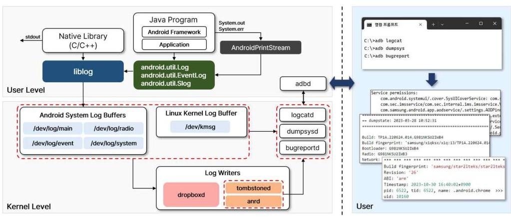
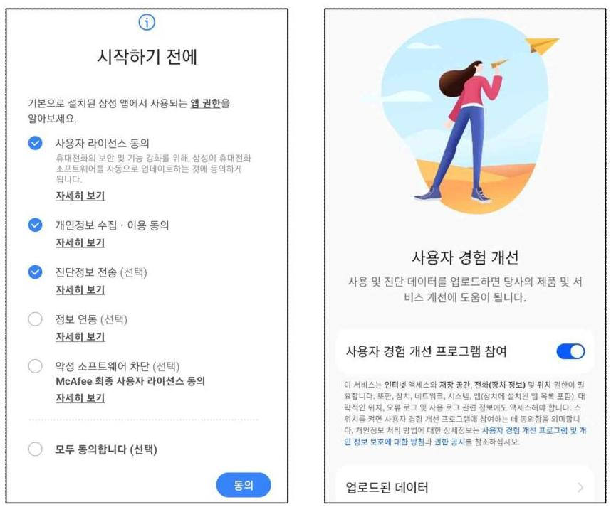
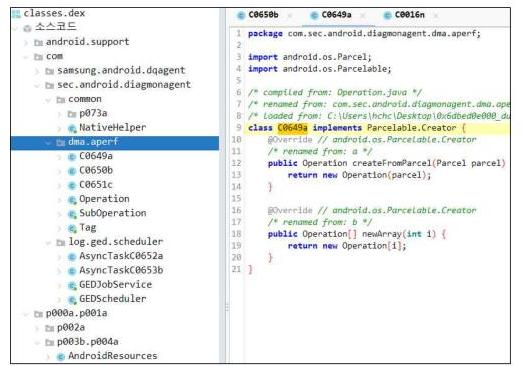
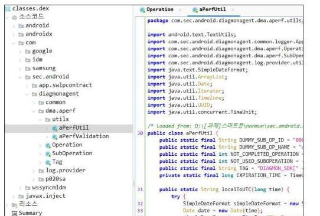
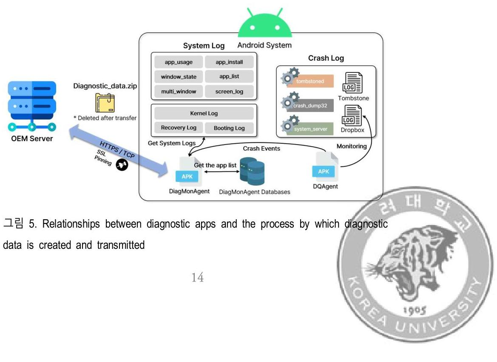
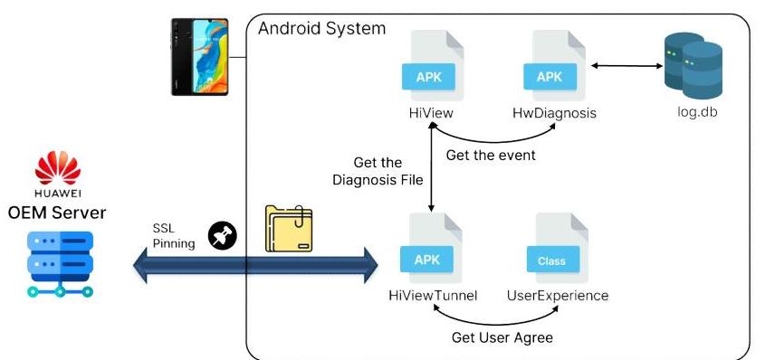
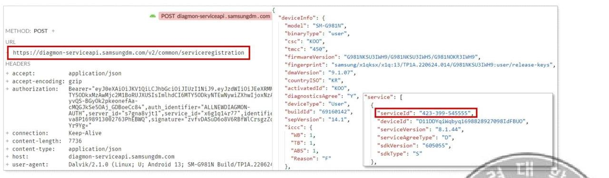
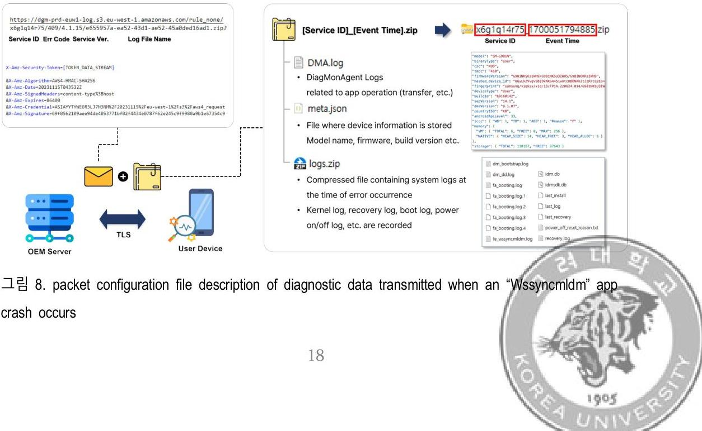
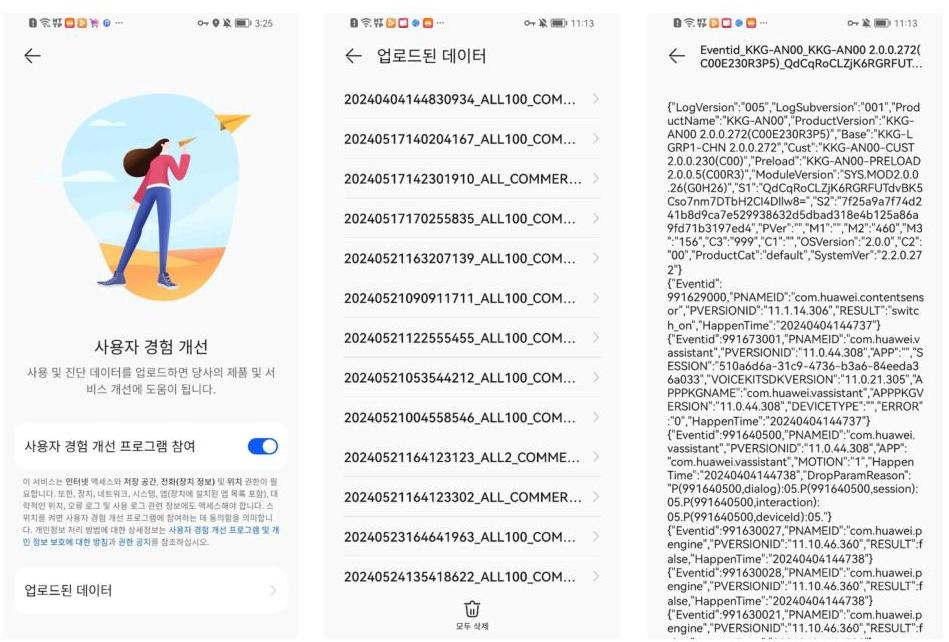

# (c)creative <br> commons 

C O M M O N S D E E D

저작자표시-비영리-변경금지 2.0 대한민국
이용자는 아래의 조건을 따르는 경우에 한하여 자유롭게

- 이 저작물을 복제, 배포, 전송, 전시, 공연 및 방송할 수 있습니다.

다음과 같은 조건을 따라야 합니다:

저작자표시. 귀하는 원저작자를 표시하여야 합니다.

비영리. 귀하는 이 저작물을 영리 목적으로 이용할 수 없습니다.

변경금지. 귀하는 이 저작물을 개작, 변형 또는 가공할 수 없습니다.

- 귀하는, 이 저작물의 재이용이나 배포의 경우, 이 저작물에 적용된 이용허락조건 을 명확하게 나타내어야 합니다.
- 저작권자로부터 별도의 허가를 받으면 이러한 조건들은 적용되지 않습니다.

저작권법에 따른 이용자의 권리는 위의 내용에 의하여 영향을 받지 않습니다.
이것은 이용허락규약(Legal Code)을 이해하기 쉽게 요약한 것입니다.
Disclaimer $\square$

석 사 학 위 논 문

# 안드로이드 스마트폰의 진단데이터 분석 


고 려 대 학 교 정 보 보 호 대 학 원
정 보 보 호 학 과


2024년 8월

# 박 정 흠 교 수 지 도 <br> 석 사 학 위 논 문 

## 안드로이드 스마트폰의 <br> 진단데이터 분석

이 논문을 공학 석사학위 논문으로 제출함

2024년 4월

## 고 려 대 학 교 정 보 보 호 대 학 원

정 보 보 호 학 과

조 형 철 (인)

# 조형철의 공학 석사학위논문 심사를 완료함 

2024년 6월

위원장 박 정 흠 (인)
위 원 이 상 진 (인)
위 원 신 영 주 (인)

# 안드로이드 스마트폰의 진단데이터 분석 

조 형 철<br>정 보 보 호 학 과<br>지도교수: 박 정 흠

## 초록

안드로이드는 2023년도 3 분기 기준으로 전 세계 스마트폰 시장의 $71.4 \%$ 를 점유하고 있으며, 안드로이드 제조사는 전 세계 사용자에게 서비스 품질 개선을 목적으로 진단데이터를 수집한다. 이러한 안드로이드 제조사가 수집하는 진단데이터의 내용과 동작 주기에 대해서는 알려진 바 없다. 우리는 스마트폰 제조사 중 안드로이드 시장에서 가장 높은 점유율을 가진 삼성과 화웨이 스마트폰을 대상으로 진단데이터 수집 행위를 분석하여 어떤 진단데이터가 네트워크 패킷을 통해 서버와 통신하는지, 진단데이터 수집을 진행하는 시스템 앱이 어떻게 작동하는지 그리고 진단데이터가 사용자 개인정보를 침해하는지를 설명한다.

주제어: 진단데이터, 안드로이드 스마트폰 제조사, 안드로이드 시스템

# Visualization Methodology for Messenger Data Analysis 

by Hyungchul Cho<br>Department of Cyber Security<br>under the supervision of Professor Jungheum Park


#### Abstract

Android accounts for $71.4 \%$ of the global smartphone market as of Q3 2023, and Android manufacturers collect diagnostic data to improve the quality of service to users around the world. The content and frequency of diagnostic data collected by these Android manufacturers is unknown. We analyze the diagnostic data collection behavior of Samsung and Huawei smartphones, which has the largest share of the Android market among smartphone manufacturers, to explain which diagnostic data is communicated to the server via network packets, how the system app that collects the diagnostic data works, and whether the diagnostic data violates user privacy.


Keywords: Digital Forensics, Android smartphone OEM, Android system

# 목차 

1. 서론 ..... 1
2. 관련 연구 ..... 3
3. 배경지식 ..... 4
3.1 안드로이드 로깅 시스템 ..... 4
3.2 모바일 기기에서 메신저 데이터 추출 ..... 5
4. 실험 설계 및 과정 ..... 7
4.1 실험 목적 및 대상 ..... 7
4.2 실험 과정 ..... 7
4.2.1 공장 초기화 ..... 8
4.2.2 초기 설정 ..... 8
4.2.3 기기 루팅 ..... 9
4.2.4 진단 앱 식별 및 수집 ..... 10
4.2.4.1 진단 앱 식별 ..... 10
4.2.4.2 진단 앱 수집 ..... 10
4.2.5 진단 앱 분석 ..... 11
4.2.5.1 역분석 ..... 11
4.2.5.2 동적 분석 ..... 11
4.2.5.3 네트워크 패킷 분석 ..... 12
4.2.6 진단데이터 해석 및 개인정보 침해 여부 파악 ..... 12
5. 진단데이터 식별 및 분석 결과

5.1 진단 앱 메커니즘 및 진단데이터 전송 과정 ..... 13
5.1.1 삼성의 진단 앱 매커니즘 및 진단데이터 전송 과정 ..... 13
5.1.2 화웨이의 진단 앱 매커니즘 및 진단데이터 전송 과정 ..... 16
5.2 삼성의 진단데이터 전송 관련 패킷 분석 ..... 17
5.2.1 기기 진단데이터 수집 동의 ..... 17
5.2.2 시스템 로그 수집 및 진단데이터 생성 ..... 17
5.2.3 진단데이터 서버 전송 및 삭제 ..... 18
5.3 동적 바이너리 계측으로 확인한 삼성의 진단 앱 로그 ..... 19
5.4 화웨이의 진단데이터 내용 ..... 20
5.5 진단데이터 수집의 개인정보 침해 여부 ..... 21
6. 한계 및 논의 ..... 23
7. 결론 및 향후 발전 방향 ..... 25
참고문헌 ..... 26

# $<$ 丑 卦禅> 

丑 1. Types and descriptions of log buffers in the Android system ..... 4
丑 2. Types and descriptions of error log daemons in the Android system ..... 6
丑 3. Types and versions of experimental subjects and tools ..... 8
丑 4. Location of app files to collect ..... 10
丑 5. serviceinfo table data in diagmon.db confirmed by DiagMonAgent version 8.0.23: Check the list of apps managed by Samsung to transmit diagnostic data. 16
丑 6. List and contents of Wssyncmldm and Scloud diagnostic data files sent by Diagmonagent ..... 19
丑 7. Diagnostic data transmission packet message hooked with Frida ..... 20

# $<$ 그림 차례> 

그림 1. Structure of Android diagnostic data collection tool: Logs are collected at the kernel level and logs collected through ADB can be checked through tools such as dumpsys, bugreport, etc.5

그림 2. Samsung and Huawei's smartphone initial setup screen to consent to collect diagnostic data 9

그림 3. Partially obfuscated .dex file obtained from path /data/dalvik-cache. $\cdot$ 11
그림 4. Class names and function names can be clearly identified compared to obfuscated files with .dex files obtained from memory.11

그림 5. Relationships between diagnostic apps and the process by which diagnostic data is created and transmitted ..... 14
그림 6 Relationships between diagnostic apps and the process by which diagnostic data is created and transmitted by Huawei ..... 16
그림 7. A packet that registers the list of diagnostic data collection target apps managed by the "DiagMonAgent" app on the server. ..... 17
그림 8. packet configuration file description of diagnostic data transmitted when an "Wssyncmldm" app crash occurs ..... 19
그림 9. Diagnostic data generated in the app directory of "Wssyncmldm" ..... 19
그림 10. Contents of diagnostic data file generated from "Scloud" App ..... 19
그림 11. What files are uploaded and the content of that data if you agree to help Huawei improve your user experience ..... 21
그림 12. Terms of agreement for provision of diagnostic and usage data in OneUI 6.0 version ..... 24

# 1. 서론 

스마트폰 제조사는 서비스 안정화 및 품질 개선이라는 명목으로 진단데이터를 수집한다. 제조사들은 진단데이터 수집을 위해 사용자의 동의를 받고 있으며, 주로 사용자가 선택하여 동의를 표하는 방식인 옵트인(Opt-in)을 준수한다. 하지만 이를 통해 사용자가 진단데이터 전송 기능을 인지할 수는 있어도, 해당 옵션을 통해 어떤 진단데이터가 제조사로 전송되는지 명시적으로 표기하지 않고 있다. 이 때문에 사용자가 제대로 인지하지 못하는 진단데이터가 수집될 수 있다.

앱스토어에서 다운로드한 앱은 기기 데이터를 주기적으로 수집하면 앱스토어에서 악성 앱으로 평판이 분류되고 곧 차단된다. 하지만 제조사가 만든 시스템 앱은 사용자가 선택하여 다운로드하거나 삭제할 수 없고 기기에 처음부터 설치되어 작동한다. 또한 시스템 앱이 데이터를 수집하는 행위는 특별한 제재가 없으며, 앱 실행자가 시스템 계정이기 때문에 일반 앱과 비교하여 가지고 있는 권한도 더 많다. 이러한 시스템 앱을 통해 제조사가 기기에서 어떤 정보 수집하고 있는지와 데이터가 어떻게 활용되고 있는지, 그리고 데이터의 사용 목적이 명확하지 않다.

본 논문에서는 사용자의 개인정보 및 개인정보자기결정권을 보호하기 위해서 제조사에서 가져가는 진단 정보를 확인하고 이를 통해 제조사가 수집하는 데이터가 개인정보 보호 규정을 침해하는지 확인한다. 이를 위해서 첫 번째로 진단데이터와 관련된 시스템 앱을 식별한다. 두 번째로, 제조사의 진단데이터 수집을 진행하는 시스템 앱 (이하 "진단 앱")을 분석하여 진단 앱의 작동 방식과 어떠한 진단데이터가 수집되는지 확인한다. 세 번째로 네트워크 패킷을 분석하여 외부로 전달하는 진단데이터의 종류와 형태를 확인한다. 이 과정을 통해 제조사의

진단데이터 수집 행위가 개인정보 침해에 해당하는지를 판단하고 제조사의 적합한 진단데이터 수집 방향을 권고한다.

본 논문이 기여하는 바는 다음과 같다.

- 제조사의 진단데이터 생성 및 수집 메커니즘 확인
- 제조사가 수집하는 실제 진단데이터 패킷을 확인
- 수집하는 진단데이터가 사용자의 개인정보를 침해 하는지 확인

본 논문은 7 개의 절로 구성된다. 먼저 2절에서는 본 연구와 관련된 이전 연구에 대해 설명한다. 3절에서는 논문의 배경지식을 살펴보고, 4절에서는 실험 설계 및 과정을 소개한다. 5절에서는 4절에서의 실험을 통해서 얻은 제조사 진단데이터를 분석한 결과를 제시한다. 6절에서는 연구의 한계 및 토의점을 설명하고 마지막 7절에서 연구의 결론 및 향후 연구 방향을 밝히며 논문을 마친다.

# 2. 관련 연구 

안드로이드 앱이 사용자의 개인정보를 과도하게 수집하는 것에 관한 여러 연구가 진행되었다. Fan 등은 안드로이드의 건강 앱에서 개인정보를 과도하게 가져간다는 연구를 발표하였다[1]. Guamán 등은 국가 간 통신으로 개인정보를 취급하는 앱들의 실태와 이러한 앱들이 가져가는 개인정보가 GDPR(General Data Protecti-on Regulation)을 위반하는지를 조사하였다. 이 연구에 따르면 2020년 5월 스페인의 구글 플레이 스토어 인기 안드로이드 앱 100 개 중에서 $66 \%$ 가 모호하거나 일관되지 않은 국가간 통신으로 잠재적인 GDPR 위반을 하고 있다.

구글 플레이 스토어 앱이 아닌 제조사의 시스템 앱의 개인정보 수집에 관한 연구도 진행되었다. Leith 등은 Google의 메시지 및 전화 앱에서 사용자 동의 없이 Google로 사용자의 개인정보가 전송되는 것을 확인했다[3]. Liu 등은 안드로이드 제조사(Samsung, Xiaomi, Huawei)의 데이터 수집 사례를 조사하고 식별자 종류를 지속 기간별, 범위별로 구분하였다[4]. 특히 패킷으로 전송되는 기기 식별자 중에서 공장 초기화하여도 바뀌지 않는 영구적인 기기 식별자(FDR-persistent Identifier)의 수집을 지양할 것을 권고했다. 또한, 안드로이드 기기의 네트워크 패킷의 전송 내용을 분석하여 개인정보 침해 여부를 확인했다[5]. 이전 연구들은 제조사의 진단데이터 수집을 고려하지 않은 연구로, 제조사가 수집하는 진단데이터에 관한 연구도 필요하다.

# 3. 배경지식 

## 3.1 안드로이드 로깅 시스템

안드로이드 로깅 시스템은 리눅스 커널이 동작하는 커널 레벨부터 애플리케이션이 동작하는 사용자 레벨까지 시스템 전반적으로 로그를 기록할 수 있도록 설계되어 있다. 커널을 비롯한 네이티브 라이브러리(C/C++)에서는 liblog를 이용하여 로그를 생성하며, 안드로이드 프레임워크와 애플리케이션에서는 안드로이드 프레임워크에 구현된 'android.util.Log', 'android.util.EventLog', 'android.util.Slog'를 이용하여 로그를 생성한다[6]. 안드로이드 프레임워크의 로깅 모듈은 네이티브 라이브러리와 마찬가지로 liblog를 이용하여 로그를 생성하게 되므로, 안드로이드 운영체제에서 생성되는 로그는 모두 liblog 라이브러리를 이용하여 생성된다고 할 수 있다.

안드로이드 운영체제는 생성된 로그를 로그 종류에 따라 분류하여 5 개의 로그 버퍼에 저장한다. 로그 버퍼의 종류로는 main, radio, system, events, kernel이 있으며, 기본적으로 4 KB 의 크기를 가진다. 각 로그 버퍼에 대한 설명은 [표 1]과 같다[7].

| Type | Path | Description |
| :--: | :--: | :-- |
| main | $/ \mathrm{dev} / \log /$ main | Log buffer where general log messages are stored |
| radio | $/ \mathrm{dev} / \log /$ radio | Log buffer where log messages related to mobile communication networks <br> are stored |
| system | $/ \mathrm{dev} / \log /$ system | Log buffer where Android system or debugging related logs are stored. |
| events | $/ \mathrm{dev} / \log /$ event | Log buffer that stores event information that occurs in the system, such <br> as screen turning on, button click, app startup, etc. |
| kernel | $/ \mathrm{dev} / \mathrm{kmsg}$ | Log buffer where logs generated by the Linux kernel are stored |

표 1. Types and descriptions of log buffers in the Android system



그림 1. Structure of Android diagnostic data collection tool: Logs are collected at the kernel level and logs collected through ADB can be checked through tools such as dumpsys, bugreport, etc.

사용자가 안드로이드 운영체제의 로그 버퍼 및 생성된 로그 파일에 접근하기 위해서는 루팅을 하여 파일 시스템에 직접 접근하거나, ADB(Android Debug Bridge)의 로그켓(logcat), 버그 리포트(bugreport), 시스템 덤프(dumpsys) 기능을 사용하여 접근할 수 있다. [그림 1]은 앞서 설명한 안드로이드 운영체제의 로깅 시스템을 그림으로 나타낸 것으로, 세로 점선을 기준으로 좌측은 로그를 생성하는 사용자 레벨과 커널 레벨의 로깅 시스템, 우측은 사용자가 로그 정보를 확인할 수 있는 인터페이스로 구분된다. 사용자는 목적에 맞는 ADB 명령어를 통해서 안드로이드의 로그를 확인할 수 있다.

# 3.2 모바일 기기에서 메신저 데이터 추출 

안드로이드 운영체제는 시스템 충돌(Crash)과 같은 특정한 이벤트가 발생하였을 때, 이벤트에 대한 정보를 사용자에게 제공하기 위해 로그 기록 데몬을 이용하여 로그 메시지를 파일 형태로 기록한다. 로그 기록 데몬의 종류로는 ANR(Application Not Response) 이벤트를 처리하는 anrd, 네이티브 충돌을 처리하는 tombstoned 그리고 애플리케이션 동작 이벤트를 처리하는 dropboxd가 있다[8][9]. 각 로그 기록 데몬으로

생성되는 오류 로그는 [표 2]에서 종류별 오류 로그가 생성되는 경로와 상세 설명으로 정리하였다.

| Type | Path | Description |
| :--: | :-- | :-- |
| ANR | /data/anr | Generated when there is no response from the application for a certain <br> period of time <br> Record app status and ANR occurrence process information |
| Tombstone | /data/ <br> tombstone | Generated upon abnormal termination of native code (C/C++) <br> Log crash causes and debug information |
| Dropbox | /data/system/ <br> dropbox | Log where information such as hardware, kernel, battery, etc. is recorded <br> Some information related to abnormal termination is also included |

표 2. Types and descriptions of error log daemons in the Android system

# 4. 실험 설계 및 과정 

## 4.1 실험 목적 및 대상

실험은 진단데이터 수집의 메커니즘을 분석하여 진단데이터의 범위와 주기를 식별하고, 제조사 서버로 전송되는 진단데이터의 내용을 분석하는 것을 목적으로 한다.

실험 대상은 2023년 11월 기준으로 안드로이드 제조사 중 높은 점유율을 차지하는 삼성과 화웨이의 기기를 선정하였으며, 실험 대상과 도구에 대한 상세 정보는 [표 3]과 같다[10].

## 4.2 실험 과정

이후 본 논문에서 진행한 실험 과정은 다음과 같다.

1. 대상 기기를 공장 초기화한다.
2. 기기 "초기 설정"(기기를 처음 시작할 때 선택하는 초기 기기 옵션 설정)을 한다. 이때 진단데이터 수집은 허용한다.
3. 관리자 권한 획득을 위해 대상 기기를 루팅(Rooting)한다.
4. 진단과 관련된 앱을 식별하고, 역분석을 위한 앱 파일을 수집한다.
5. 진단 앱 역분석 및 진단데이터 패킷을 분석한다.

1. 진단데이터의 개인정보 침해 여부를 분석한다.

# 4.2.1 공장 초기화

실험에 앞서 일관된 기기 환경 설정과 불필요한 데이터를 초기화하기 위해서 공장 초기화를 진행한다. 삼성의 공장 초기화는 볼륨( $\uparrow$ ) + 빅스비 + 전원 버튼을 이용하여 진입한 복구 모드를 통해 초기화하였다[11].

|  Category | Version |   |
| --- | --- | --- |
|  OEM | Samsung | Huawei  |
|  Device | Galaxy S10 / SM-G973N | P30 Lite  |
|  Android | 12 | 9  |
|  Linux Kernel / EMUI | 4.14.113-26368205 | 10.0  |
|  Role | Tool / Version |   |
|  Rooting | Magisk / 26.1 |   |
|  Flashing | Odin / 3.13.1 | DC pheonix, HCU Client  |
|  Firmware Download | Frija / 2.0.23262.4 | azROM.net  |
|  Collect app packages | Fridump / 3 |   |
|  static analysis | Jdax / 1.4.7 |   |
|  network monitoring | Httptoolkit / 1.14.7 |   |
|  App dynamic analysis | Frida / 16.1.3 |   |

표 3. Types and versions of experimental subjects and tools

### 4.2.2 초기 설정

제조사의 진단데이터 수집 기능 활성화를 위해서 초기 설정에서 진단데이터 전송을 동의로 설정한다. 일반적으로 진단데이터 전송 동의 설정은 제조사별로 다르나 삼성의 경우 [그림 2]와 같이 사용자의 선택에 따라 동의하는 방식인 옵트인(Opt-in)으로 설정하여 사용자가 명시적으로 수집 동의를 허용하지 않으면 진단데이터를 수집하지 않는 정책을 채택한다. 하지만 사용자가 "모두 동의합니다"를 선택해서 진단데이터를 의도하지 않게 전송하게 되는 경우가 있다.

화웨이의 경우 사용자 경험 개선 프로그램 참여 동의를 선택하면 진단데이터가

제조사 서버로 업로드된다. 이 또한 사용자가 의도하지 않게 동의를 선택하여 제조사로 전송될 수 있다.



그림 2. Samsung and Huawei's smartphone initial setup screen to consent to collect diagnostic data

### 4.2.3 기기 루팅

진단 앱 분석을 위해서는 기기 루팅이 필요하다. 진단 앱은 시스템 앱으로, 시스템 앱에 접근하기 위해서는 관리자 권한이 필요하기 때문이다. 또한, 동적 분석 도구와 네트워크 패킷 모니터링 도구를 설치하고 사용하기 위해서도 관리자 권한이 필요하므로 기기 루팅은 필수적이다. 우리는 기기 루팅을 위해 삼성 기기의 경우 루팅에 주로 사용되는 Magisk와 Odin을 사용하였다[12][13]. 화웨이 기기의 경우 DC pheonix, HCU Client를 사용하였다[14].


# 4.2.4 진단 앱 식별 및 수집 

진단데이터를 생성하고 제조사로 전송하는 앱을 식별하고, 앱 패키지 파일을 수집하는 과정이다.

### 4.2.4.1 진단 앱 식별

진단 앱을 식별하기 위해 세 가지 과정을 진행한다. 첫 번째로 진단 앱은 시스템 계정을 통해 실행된다. 그러므로 ADB에서 "ps -ef | grep system |awk '\{print \$8\}" 명령어를 통해 시스템 계정에서 실행하는 앱을 필터링한다. 또한, 안드로이드의 앱 파일의 경로는 [표 4]와 같은데, 시스템 앱의 경로에 존재하는

| Path | Detail |
| :-- | :-- |
| /data/app | Storage path for the installed app package file |
| /data/data/ | Data storage path required to run the app |
| /data/dalvic-cache | Path where Dalvik byte code files (*.dex) files of installed apps are saved. |
| /system/app | Path where typical system app pa-ckage files (*.apk) are stored |
| /system/priv-app | Path where high-critical sys-tem app package files (*.apk) are saved |

표 4. Location of app files to collect
앱으로 필터링한다. 두 번째로 진단 앱은 시스템 로그에 접근하여 진단데이터를 생성하므로 "pm list permissions" 명령어를 통해 로그 접근 권한이 부여된 앱으로 필터링한다. 세 번째는 앱 패키지를 분석하여 진단데이터 수집 기능의 유무를 확인한다.

### 4.2.4.2 진단 앱 수집

실험 대상인 진단 앱의 패키지 파일은 [그림 3]과같이 난독화되어 있다. 난독화 해제된 앱 패키지 파일을 획득하기 위해 "/data/dalvic-cache" 경로 및 메모리에서 앱



그림 3. Partially obfuscated .dex file obtained from path /data/dalvik-cache.


그림 4. Class names and function names can be clearly identified compared to obfuscated files with .dex files obtained from memory.

패키지 파일을 추출한다. 추출한 앱 패키지 파일은 [그림 4]와 같이 난독화가 해제되어 있다. 메모리에서의 앱 패키지 파일 추출은 "Fridump3" 도구를 사용한다[15].

# 4.2.5 진단 앱 분석 

### 4.2.5.1 역분석

난독화가 해제된 진단 앱의 패키지 파일을 JADX 도구를 통해 디컴파일한다[16]. 디컴파일한 앱의 소스 코드를 역분석하여 진단 앱의 동작 방식과 진단데이터 수집 구조를 확인한다.

### 4.2.5.2 동적 분석

사용자의 행위나, 정해진 주기에 따른 진단 앱의 활동을 분석하기 위해 Frida로 동적 분석한다[17]. 서버와 소켓 통신하는 메시지와 진단 앱이 생성하는 앱 로그를 실시간으로 확인하기 위해 Frida 후킹 스크립트를 활용한다.

# 4.2.5.3 네트워크 패킷 분석 

서버와 기기가 주고받는 네트워크 패킷을 수집하고 분석한다. 이를 위해 Frida와 Httptoolkit 도구를 사용하여 네트워크 패킷 분석을 한다[17][18]. Frida는 진단 앱의 SSL Pinning 로직 우회에 사용한다. Httptoolkit은 앱과 서버 간 통신에서 인증 우회를 통해 앱의 HTTPS 패킷을 분석하는 데 사용한다.

### 4.2.6 진단데이터 해석 및 개인정보 침해 여부 파악

실험 과정에서 얻은 진단데이터를 분석하여 개인정보 보호법과 관련한 국내 판례를 기준으로 개인정보 침해 여부를 확인한다[19]. 국내 판례에서는 다른 데이터와 결합하여 개인을 식별할 수 있는 데이터를 수집하는 것도 개인정보 침해로 판단한다.

# 5. 진단데이터 식별 및 분석 결과 

본 절에서는 식별 및 분석 결과를 아래와 같이 네 가지로 분류하여 설명한다.

- 진단 앱 간 관계와 진단데이터의 생성 과정
- 진단데이터 수집 동의 시 주고받는 패킷의 내용
- 동적 바이너리 계측을 통해 확인한 진단 앱의 소켓 통신 내용과 로그
- 진단데이터 수집의 개인정보 침해 여부


## 5.1 진단 앱 메커니즘 및 진단데이터 전송

과정

### 5.1.1 삼성의 진단 앱 매커니즘 및 진단데이터 전송 과정

앞서 설명한 방법으로 시스템 앱을 수집하였고, 역분석을 통해 "DiagMonAgent"와 "DQAgent"가 진단 앱임을 확인했다.

먼저 "DiagMonAgent" 앱은 Diagnostic Moni -tor Agent의 약어로 진단데이터 수집 및 전송을 수행하는 앱이다. 이 앱은 기기의 진단데이터 수집 동의가 활성화된 경우, 시스템 로그와 앱 로그를 포함하여 진단데이터를 생성하고 제조사로 전송한다.

두 번째 "DQAgent"는 Device Quality Agent의 약어로 기기에서 앱 충돌 및 오류로 인한 비정상 종료를 탐지하는 시스템 앱이다.

진단 앱의 메커니즘 및 진단데이터 전송 과정은 [그림 5]와 같다. 크래시가 발생하면, Tombstone, DropBox에 크래시 로그가 생성되는데, DQAgent는 DropBox를 모니터링하여 크래시가 발생한 경우 Dia-gMonAgent로 진단데이터 생성 이벤트를 전송한다.

이벤트를 수신한 DiagMonAgent는 "./database/diagmon.db"의 앱 목록을 확인한다. 목록에 있는 앱에서 발생한 크래시일 경우 앱의 크래시 로그와 시스템 로그를 수집하여 진단데이터를 생성한다. 실험 기기의 Di-agMonAgent는 8.0.23 버전으로 "diagmon.db"에 있는 진단데이터 생성 앱 목록은 [표 5]와 같다.

다음으로 진단데이터를 압축하여 HTTPS 통신으로 삼성 서버에 보낸다. 전송에 성공하면 진단데이터 파일을 기기에서 삭제한다.


| No | Service Id | Package Name | Description |
| :--: | :--: | :--: | :--: |
| 1 | x6g1q14r75 | com.wssyncmidm | Software Update Monitor, manages the update status |
| 2 | 476-399-579853 | com.samsung.android.easysetup | Easy Setup, transfer data switching to a new device |
| 3 | r7xealiczv | com.samsung.android.samsungpassautofill | Samsung Pass Autofill automatically fills in login |
| 4 | 4L3-399-9749100 | com.samsung.android.arzone | AR Zone,augmented reality (AR) features |
| 5 | vruy5va1ta | com.sec.android.app. voicenote | Voice Memo, voice recording and playback functionality |
| 6 | wr7lmx4wui | com.samsung.android.app.watchmanager | Gear Manager, manages Samsung Galaxy Watches |
| 7 | sn0vpasr64 | com.samsung.android.app.notes | Samsung Notes, provides note-taking |
| 8 | x6g1q14r77 | com.sec.android.diagmonagent | Diagnostics Agent, Generate diagnostic data |
| 9 | 488-399-1029751 | Unknown | - |
| 10 | 999-399-549750 | com.samsung.android.dqagent | Data Quality Agent, monitor data usage |
| 11 | tu52hac8ar | com.samsung.android.app.telephonyui | Phone UI, part of the Phone app |
| 12 | md3xosg6cz | com.samsung.android.smartmirroring | Smart Mirroring, mirror screen to another screen |
| 13 | dc60qlc6ri | com.samsung.android.lool | Live On Link, share content between Samsung devices |
| 14 | br23r9jajw | com.samsung.android.app.routines | Bixby Routines, performs actions based on conditions |
| 15 | 4M0-399-5151102 | Unknown | - |
| 16 | lwoc1pz74b | com.samsung.android.smartsuggestions | Smart Suggestions, analyzes app usage patterns |
| 17 | sebzp6l7wd | com.samsung.android.mobileservice | Samsung Mobile Service |
| 18 | m0j4in5h9n | com.samsung.android.messaging | Messages app, used to send and receive messages |
| 19 | wl34fppqc3 | com.samsung.android.mdx | Multi Device Experience |
| 20 | 773-399-565755 | com.osp.app.signin | Samsung Account Sign-in |
| 21 | 4L0-399-515497 | com.samsung.android.app. sharelive | Share Live, share device's screen with others |
| 22 | bp23rgegzo | com.samsung.android.bixby.agent | Bixby Agent, the service that runs Bixby |
| 23 | 026-399-529756 | com.samsung.android.scloud | Samsung Cloud, a data backup and sync service |
| 24 | 423-399-545555 | com.samsung.android.app.aodservice | AOD Service, controls the Always On Display |
| 25 | 4N4-399-535399 | com.samsung.android.scs | Samsung Care Service |
| 26 | gnj0zl4j42 | com.sec.android.soagent | Agent Connection Service, helps apps communication |
| 27 | com8oll7xad | com.samsung.android.app.contacts | Contacts app, stores and manages contact information |
| 28 | 426-399-535356 | com.samsung.android.app.appsedge | Apps Edge, adds a panel to the edge of the screen |
| 29 | gp4ifmvkd | com.samsung.android.app.cocktailbarservice | CocktailBar Service, manages the edge lighting effects |
| 30 | 428-399-5249100 | com.samsung.android.video | Video Player app, which plays videos on device |
| 31 | 4F5-399-564949 | com.samsung.android.dynamidock | Dynamic Lock, uses surroundings to secure device |
| 32 | dj47h9zhd | com.sec.android.app.clockpackage | Clock app, provides alarms, timers, and a stopwatch |
| 33 | 407-399-545299 | com.sec.android.app.camera | Camera app, which take photos and videos |
| 34 | aceea2ka2h | Unknown | - |
| 35 | 4G8-399-5410252 | com.samsung.android.aremoji | AR Emoji, creates animated emojis |
| 36 | ca56b1nldz | com.samsung.android.incallui | In-Call UI, provides the interface during a phone call |
| 37 | ph91251zlh | com.samsung.android.dialer | Dialer make calls by dialing a phone number |
| 38 | zxvle3pfed | com.sec.android.app. quicktool | Quick Tools provides on Samsung devices. |
| 39 | 797-397-529898 | com.samsung.android.bixby.wakeup | Bixby Wakeup, detects the wake word or gesture |
| 40 | 4K0-399-5752101 | com.samsung.android.honeyboard | Samsung keyboard app |
| 41 | mf3km12ugy | com.sec.android.app.myfiles | Samsung file app |
| 42 | p595fm8rxk | com.samsung.android.samsungpass | Samsung Pass, stores credentials for automatic logins |
| 43 | sgw2l9fjk | com.sec.android.gallery3d | Gallery app, view and manage photos and videos |
| 44 | 414-399-485249 | com.samsung.android.app.dressroom | Dressroom, related to trying on clothes virtually |
| 45 | eustinww9v | com.samsung.android.spay | Samsung Pay, a mobile payment service |
| 46 | 785-396-5351100 | com.samsung.android.app.spage | Samsung Free, Samsung platform for OTT and news |
| 47 | adixmr0659 | Unknown | - |
| 48 | 795-395-509999 | com.samsung.android.rubin.app | Personalization Service Client, Individual setting service |
| 49 | 417-399-515357 | com.samsung.android.samsungpositioning | Samsung positioning, use GPS to detegetive location |

# 31. 5. serviceinfo table data in diagmon.db confirmed by DiagMonAgent version 8.0.23: Check the list of apps managed by Samsung to transmit diagnostic data.

# 5.1.2 화웨이의 진단 앱 매커니즘 및 진단데이터 전송 

## 과정

화웨이의 경우 진단데이터를 수집하는 앱은 "HwDiagnosis"와 "HiView"이다. 특히 "HwDiagnosis" 앱은 내수용 화웨이 스마트폰에서만 확인되므로 외수용은 제한적인 데이터만 획득하는 것으로 확인하였다.

먼저 "HwDiagnosis" 앱은 Huawei Diagnosis의 약어로 진단데이터 수집 및 전송을 수행하는 앱이다. 이 앱은 기기의 사용자 경험 개선 수집 동의가 활성화된 경우, 시스템 로그와 앱 로그를 포함하여 진단데이터를 생성한다.

두 번째 "HiView"는 화웨이 기기의 설정 앱을 구성하는 앱으로 특히 사용자 경험 개선에 사용자가 동의할 경우 제조사로 데이터를 전송하는 시스템 앱이다.

진단 앱의 메커니즘 및 진단데이터 전송 과정은 [그림 6]과 같다. "Hwdiagnosis"는 log.db를 생성한다. 이후 "HiView"로부터 사용자가 수집항목 전송에 동의할 경우 이벤트를 받는다. "HiView"는 "HiViewTunnel"을 통해서 제조사 서버로 수집된 $\log . \mathrm{db}$ 를 전송한다.


그림 6 Relationships between diagnostic apps and the process by which diapnostic data is created and transmitted by Huawei

# 5.2 삼성의 진단데이터 전송 관련 패킷 분석 

진단데이터 수집 대상이 되는 앱 중 삼성의 "Wssyncmldm", "Scloud"에 대한 사례 분석을 통해 진단데이터 전송과 관련된 패킷을 분석한다.

### 5.2.1 기기 진단데이터 수집 동의

삼성의 진단데이터 수집 동의는 초기 설정 또는 설정 - 개인정보 보호 진단데이터 보내기 동의를 활성화하면 된다. 사용자가 기기의 진단데이터 수집 동의 시 진단 앱은 서버에게 진단데이터를 수집할 앱 목록을 등록하는 패킷을 전송한다. [그림 6]에서 진단 앱이 진단데이터를 생성하도록 관리하는 앱 목록이 패킷을 통해 서버에 등록되는 것을 확인할 수 있다.

### 5.2.2 시스템 로그 수집 및 진단데이터 생성

Wssyncmldm 앱에 강제로 크래시를 발생시켰다. 그러자 [그림 7]과 같이


그림 7. A packet that registers the list of diagnostic data collection target apps managed by the "DiagMonAgent" app on the server.

Wssyncmldm의 앱 디렉터리에 진단데이터가 만들어진다. DiagMonAgent는 이 파일을 수집하여 자신의 앱 디렉터리의 ./files 경로에 압축 파일로 만든다.

# 5.2.3 진단데이터 서버 전송 및 삭제 

진단데이터는 DMA.log, meta.json, logs.zip으로 이루어져 있다. DMA.log는 DiagMonAgent 앱이 생성하는 로그 파일이며, meta.json은 기기 정보가 저장된 파일로 모델명, 펌웨어 버전, 빌드 버전 등의 정보가 있다. logs.zip은 크래시가 발생한 서비스 앱의 시스템 로그들이 포함된 압축 파일이다.

생성된 Wssyncmldm의 진단데이터를 구성하는 파일과 서버로 전송하는 패킷 내용은 [그림 7]과 같다. 앱의 서비스 아이디와 크래시가 발생한 시각을 파일명으로 하는 압축 파일을 만들어서 삼성 서버로 전송한다.
[표 6]과 같이 logs.zip은 크래시가 발생한 앱 마다 내용이 다르다. Scloud 앱에서 발생한 logs.zip의 구성은 단일 파일로 내용은 [그림 8]과 같다. [그림 8]은 기기에 로그인한 삼성 계정과 Scloud 계정의 이름이 다를 경우에 발생한다. 진단데이터 파일은 서버에 전송 후 삭제된다.


```
beyond1:/data/data/com.wssyncmldm # ls *
app_diagmon_report:
dm bootstrap.log fa_booting.log.1 fa_booting.log.4 idm.db recovery.log
dm_dd.log fa_booting.log.2 fa_extrainfo.log idmsdk.db
fa_booting.log fa_booting.log.3 fe_wssyncmldm.log power_off_reset_reason.txt
```

그림 9. Diagnostic data generated in the app directory of "Wssyncmldm"
beyond1:/data/data/com.samsung.android.scloud/files/logs/scloud/heystore/86 \# cat scloud_1710886816476.log java. lang. Exception: Device Names are different. 0.12518 , Galaxy 510
at com.samsung.android.scloud. heystore.z0.e[PatchDeviceName.java:11]
at r4.1.j[DeviceNameMonitorObserverImpl.java:1]
at r4.1.a[Unknown Source:2]
at r4.f0.f[Unknown Source:0]
at r4.f0.d[Unknown Source:0]
at r4.d0.apply[Unknown Source:4]
at com.samsung.android.scloud.common.exception.ExceptionHandler.commit(ExceptionHandler.java:7)
at com.samsung.android.scloud.common.exception.ExceptionHandler.apply(ExceptionHandler.java:1)
at r4.f0.g[Unknown Source:0]
at r4.f0.e[Unknown Source:0]
at r4.e0.run[Unknown Source:4]
at java. lang. Thread.run[Thread.java:920]
그림 10. Contents of diagnostic data file generated from "Scloud" App

# 5.3 동적 바이너리 계측으로 확인한 삼성의 진단 앱 로그 

Frida를 사용하여 진단 앱의 앱 로그와 소켓 메시지를 확인한 결과 DiagMonAgent의 소켓 메시지에서 압축 파일을 네트워크 통신을 통해 보내는 것을 [표 7]과 같이 확인하였다. 해당 내용은 앞서 네트워크 모니터링을 통해 확인한

| File name |  | Contents |
| :--: | :--: | :--: |
| DMA.log |  | Log file recorded by the DiagMonAgent app |
| meta.json |  | File containing device information such as model name, firmware and build version |
| logs.zip/ <br> Wssyncmldm | dm bootstrap.log | Log file that record system boot and initialization process |
|  | dm dd.log | Log file containing Android device activity, errors, warnings and debug |
|  | fa booting.log | boot-related log file that occurs in Android and user's access to the boot process |
|  | idm.db | Database file that stores information related to user authentication and permission |
|  | idmsdk.db | Database file that stores information related to user authentication and related SDKs |
|  | last log | Log file that record information related to users' login attempts and login status |
|  | last recovery | Log file containing information related to system recovery operations on Android |
|  | power off reset reason.txt | Log file that records what caused your Android device to suddenly turn off or restart |
|  | recovery.log | Log file that records logs related to system recovery operations on Android devices |
| logs.zip*Scloud | scloud [timestamp].log | Log file that records device names and errors created by the Scloud app |

표 6. List and contents of Wssyncmldm and Scloud diaonostic data files sent by Diagmonagent

진단데이터 전송 패킷 구조와 동일하다. 따라서 DiagMonAgent 앱은 진단데이터를 네트워크 패킷을 활용하여 서버에 전송한다는 것을 알 수 있다.

```
result, str => undefined
https://dgm-prd-euw1-log.s3.eu-west-1.amazonaws.com/rule_none/x6g1q14r75/409/3
.9.16/dc807806-a247-4e6b-944f-9f7de322be70.zip?X-Amz-Security-Token=IQoJb3Jp
Z2luX2VjEOP%2F%2F%2F%2F
...
.setRequestMethod result,str1,str2-> undefined PUT
.setRequestProperty result,str1,str2-> undefined Content-Type
application/octet-stream
96 0x7eb216068e 110
```

표 7. Diagnostic data transmission packet message hooked with Frida

# 5.4 화웨이의 진단데이터 내용 

화웨이의 기기에서 설정의 사용자 경험 개선 동의 후 업로드한 데이터의 내용은 [그림 ]과 같이 확인할 수 있다. 화웨이는 서버로 업로드한 기기의 데이터를 사용자가 UI를 통해 직접 확인할 수 있다. 이 파일의 내용은 "HwDiagnosis" 앱이 생성한 $\log . \mathrm{db}$ 의 내용이다.
$\log . \mathrm{db}$ 파일은 /data/log/log.db 경로에 저장된다. 해당 파일이 포함하는 내용은 다음과 같다.

- 네트워크 AP 정보
- 설치한 앱 목록 및 시간
- 앱 사용 시간
- 이벤트 타임 라인

- 기기 사용 흔적

특히 기기 사용 흔적의 경우 공장 초기화를 진행한 경우에도 해당 기기가 사용된 날짜를 확인할 수 있었다.



그림 11. What files are uploaded and the content of that data if you agree to help Huawei improve your user experience

### 5.5 진단데이터 수집의 개인정보 침해 여부

다음으로 삼성에서 진단데이터로 수집하는 항목은 다음과 같다.

- 기기 식별자 (IMEI)
- 기기에 설치한 앱 목록
- 기기 정보 (모델, 통신사, 루팅 여부)
- 사용 정보 (전원, 배터리, 복구 로그 등)

모바일 기기에서 서버로 사용자 데이터를 전송하는 행위


침해가 아니다. 예를 들면 소프트웨어 업데이트를 위해 사용자로부터 기기의 모델 및 소프트웨어 버전, 국가 정보를 수집하는 것은 개인정보 침해에 해당하지 않는다. 하지만 개인 식별자와 기기 식별자를 연결하여 수집하면 침해가 될 수 있다. 예를 들면 IMEI와 휴대 전화번호를 동시에 수집하면 기기의 식별자인 IMEI와 개인을 특정하는 식별자인 전화번호를 연결하여 기기 식별자를 보고 개인을 특정할 수 있으므로 침해에 해당한다[4][18].

기본적으로 삼성과 같은 제조사에서는 삼성페이, 갤럭시 스토어, 삼성 멤버스, 삼성 클라우드, 내 디바이스 찾기 등의 서비스를 이용하기 위해서는 삼성 계정이 필요하다. 삼성 계정 가입 시 필요한 필수 개인정보는 성명, 생년월일, 전화번호 또는 이메일 주소이다. 이러한 정보를 제조사에 제공하므로 여기에 더해 진단데이터의 기기 식별자까지 전달한다면 개인정보와 기기 식별자를 제조사에서 연결하여 개인을 특정할 수 있으므로 개인정보 침해가 우려된다.

# 6. 한계 및 논의 

본 실험은 기기 루팅이 된다는 가정하에 진행되었다. 그러나 안드로이드 시스템 앱이 루팅을 감지할 경우, 진단 데이터 전송 과정이 이와 달라질 가능성이 있다. 실제로 삼성의 경우 펌웨어 업데이트를 수행하는 "Fotaagent"에서 기기의 루팅 여부를 탐지하고 루팅된 기기일 경우 펌웨어 업데이트를 수행하지 않는다. 따라서 진단 앱의 경우에도 루팅 상태의 기기에서 서버와 앱이 통신하는 패킷과 비 루팅 상태에서 통신 패킷이 다를 수 있다.

연구를 통해 확인한 삼성의 진단데이터가 수집이 목적에 비해 과도하다고 판단했다. 삼성의 진단데이터 수집에 대한 OneUI 6.0의 동의 약관은 [그림 10]과 같다. 약관에서는 "사용자를 직접 알아볼 수 있는 정보는 포함하지 않는다."고 명시되어 있다. 또한 이러한 데이터는 "제조사의 제품 및 서비스의 품질과 성능 개선, 예기치 않은 작동 정지 또는 시스템 오류를 추적 및 해결하기 위한 목적으로 이용된다."고 명시되어 있다. 하지만 기기 식별 정보는 민감성이 높은 식별자로 제조사 계정 로그인 기능에서 수집한 개인정보와 연결될 경우 개인정보 침해가 우려된다. 따라서 사용 목적에 비해 기기에 영구적으로 남는 식별자를 수집하는 것은 과도하며 해당 정보는 진단데이터에서 배제할 것을 권고한다.

또한, 약관의 내용도 One UI 버전에 따라서 다르다. 4.1 버전은 2 년 동안 진단 정보를 유지 보관한다고 명시하나, 5.1 과 6.0 버전에서는 3 년으로 증가했다. 또한 4.1 버전에는 없는 문구가 5.1 버전부터 생성되어 표기되었다. 해당 표기 내용은 "또한, 기기의 상태 이상(가령, 과도한 발열)이 감지되거나 중대한 기능 오류(가령, 시스템 정지)가 발생, 또는 예상되는 경우에는, 당사가 제공하는 영업 방식(Push Notifi-cation)으로 알려드릴 수 있습니다."이다. 이를 통해 기기별로 데이터 수집

기간이 달라야 하는데 이를 제조사에서 준수하고 있는지 확인이 필요하다.
또한 화웨이의 경우 서버로 전송되는 패킷을 직접 확인하지 못했는데, 그 이유는 외수용 P30 lite에서는 사용자 경험 개선에 동의한 경우에도 패킷이 업로드 되지 않았기 때문이다. 따라서 내수용 기기의 루팅을 통한 패킷 확인이 필요하다.

# < 진단정보 

진단 및 사용 데이터 제공에 대한 동의

삼성전자㈜ 및 해외 지법인(이하 "삼성" 또는 "회사" 라 합니다)은 회사의 제품 및 서비스의 품질과 성능 개선을 위해 귀하의 도움을 받고자 합니다.
이 기기에는 귀하의 동의 하에 진단 및 사용
데이터(이하 "진단정보"라 합니다)를 자동 수집하는 소프트웨어가 포함되어 있습니다.

삼성에 제공되는 정보는 다음과 같습니다.
진단정보에는 하기 (1) (4) 가 포함되며, 여기에는 이름, 이메일, 전화번호와 같이 귀하를 직접 알아볼 수 있는 정보는 포함되지 않습니다.
(1) 기기정보(가령, 기기 식별정보, 모델명, OS버전, 디스플레이/배터리/센서 등과 같은 단말의 부품정보),
(2) 귀하의 디바이스 사용 방식에 대한 정보 (가령, 다른 기기 연결, 배터리, 디스플레이, 전원 등의 상태 및 오류 )
(3) 통신사에 대한 정보,
(4) 귀하의 시스템 및 애플리케이션 사용 방식에 대한 정보 (가령, 사용 빈도 및 시간, 설정정보, 오류, 주변 기지국 정보, 기기의 "위치" 기능이 활성화한 경우에 한하여 위치정보)

그림 12. Terms of agreement for provision of diagnostic and usage data in OneUI 6.0 version

# 7. 결론 및 향후 발전 방향 

본 연구는 삼성 갤럭시 및 화웨이 P30 Lite를 대상으로 진단데이터 수집 메커니즘을 분석하고, 제조사로 전송되는 진단데이터 패킷을 확인하여 개인정보 보호법 판례를 기준으로 분석했다. 그 결과 삼성의 진단데이터 수집은 목적에 비해 과하다고 판단되며, 특히 기기에 영구적으로 남는 식별자의 수집을 지양할 것을 권고한다.

최근까지 제조사에서 진단데이터를 수집하는 기능은 거의 모든 기기에서 예외 없이 탑재되고 있으나 진단데이터에 포함되는 내용과 생성 조건에 대한 연구는 부족하다. 따라서 사용자의 개인정보를 보호하기 위해 제조사가 약관을 위반하는 사항은 없는지 추적하고 확인하는 검증 절차가 필요하다. 정상적으로 활용되는 진단데이터는 보안 강화 및 사용자 편의 기능 제공 등에 활용되므로 검증을 통해 사용자에게 신뢰를 얻고 사용자의 진단데이터 제공을 활성화하기 위해 본 연구와 같은 노력이 요구된다.

삼성과 화웨이 뿐만 아니라 향후 다양한 안드로이드 제조사의 진단데이터 수집을 분석하여 제조사 별 진단데이터 수집 메커니즘과 진단데이터를 내용을 확인할 필요가 있다. 이러한 연구는 다양한 제조사가 사용자의 신뢰를 얻고 안드로이드 생태계의 안정성이 높아지는 선순환이 될 것이다.

# 참고문헌 

[1] Fan, M., Yu, L., Chen, S., Zhou, H., Luo, X., Li, S., \& Liu, T. (2020, October). An empirical evaluation of GDPR compliance violations in Android mHealth apps. In 2020 IEEE 31st international symposium on software reliability engineering (ISSRE) (pp. 253-264). IEEE.
[2] Guamán, D. S., Del Alamo, J. M., \& Caiza, J. C. (2021). GDPR compliance assessment for cross-border personal data transfers in android apps. IEEE Access, 9, 15961-15982.
[3] Leith, D. J. (2022, October). What Data Do The Google Dialer and Messages Apps On Android Send to Google?. In

International Conference on Security and Privacy in Communication Systems (pp. 549-568). Cham: Springer Nature Switzerland.
[4] Liu, H., Patras, P., \& Leith, D. J. (2023). On the data privacy practices of Android OEMs. PloS one, 18(1), e0279942.
[5] Liu, H., Patras, P., \& Leith, D. J. (2021). Android mobile OS snooping by Samsung, Xiaomi, Huawei and Realme handsets. techreport, Oct.
[6] Android Developers, "Understanding Logging" https://source.android.com/docs/core/tests/debug/understanding-logging accessed Apr 2024
[7] Elnux, "Android Logging System" https://elinux.org/Android_Logging_System accessed Apr 2024
[8] Android Developers, "https://developer.android.com/topic/performance/vitals/anr?hl=ko" accessed Apr 2024

[9] Android Developers, "DropBoxManager" https://developer.android.com/reference/kotlin/android/os/DropBoxManager accessed Apr 2024
[10] Counterpoint, "Global Smartphone Share: Qua-rterly Data" https://korea.counterpointresearch.com/ accessed Apr 2024
[11] Simply Mobile. (2022, Feb 19). How To Hard Reset ANY Samsung Phone [Video]. YouTube. https://www.youtube.com/watch?v=Q0nNemTg91g
[12] Github, "Magisk" https://github.com/topjohnwu/Magisk accessed Apr 2024
[13] Xdaforum, "Patched Odin 3.13.1" https://xdaforums.com/t/patched-odin-3-13-1.3762572/ accessed Apr 2024
[14] HCU Client, "HCU Client" https://hcu-client.com/ accessed Apr 2024
[15] Github, "Fridump3" https://github.com/rootbsd/fridump3 accessed Apr 2024
[16] Github, "Jadx" https://github.com/skylot/jadx accessed Apr 2024
[17] Github, "Frida" https://github.com/frida accessed Apr 2024
[18] Github, "Httptoolkit" https://github.com/httptoolkit/httptoolkit accessed Apr 2024
[19] Seoul Central District Court, Decision of 23 Feb 2011, 2010Godan5343.

