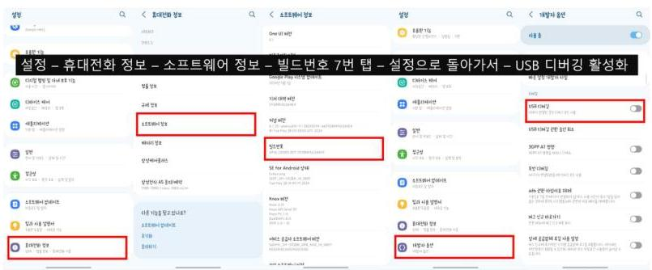
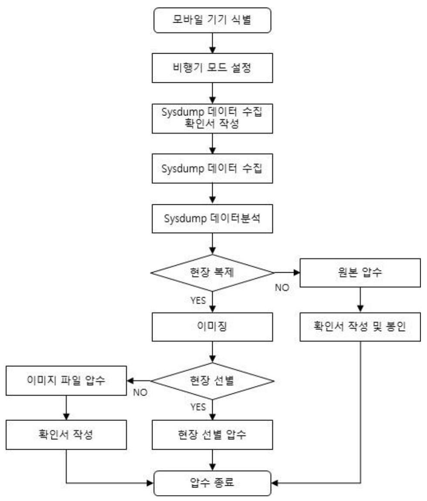

# (c)creative <br> commons 

C O M M O N S D E E D

저작자표시-비영리-변경금지 2.0 대한민국
이용자는 아래의 조건을 따르는 경우에 한하여 자유롭게

- 이 저작물을 복제, 배포, 전송, 전시, 공연 및 방송할 수 있습니다.

다음과 같은 조건을 따라야 합니다:

저작자표시. 귀하는 원저작자를 표시하여야 합니다.

비영리. 귀하는 이 저작물을 영리 목적으로 이용할 수 없습니다.

변경금지. 귀하는 이 저작물을 개작, 변형 또는 가공할 수 없습니다.

- 귀하는, 이 저작물의 재이용이나 배포의 경우, 이 저작물에 적용된 이용허락조건 을 명확하게 나타내어야 합니다.
- 저작권자로부터 별도의 허가를 받으면 이러한 조건들은 적용되지 않습니다.

저작권법에 따른 이용자의 권리는 위의 내용에 의하여 영향을 받지 않습니다.
이것은 이용허락규약(Legal Code)을 이해하기 쉽게 요약한 것입니다.
Disclaimer $\square$

碩士學位 請求論文
指導教授 金 奇 範

# 안드로이드의 Sysdump 포렌식에 관한 연구 

成均館大學校 一般大學院
科學搜查學科
陣 昇 均

| 頚
土
學
位
請
求
論
文
的
$\begin{array}{lll}\text { 只 } \\ \text { 只 } \\ \text { 只 }\end{array}$
的
$\begin{array}{lll}\text { 只 } \\ \text { 只 } \\ \text { 只 }\end{array}$
的
$\begin{array}{lll}\text { 只 } \\ \text { 只 } \\ \text { 只 }\end{array}$
的
$\begin{array}{lll}\text { 只 } \\ \text { 只 } \\ \text { 只 }\end{array}$
的
$\begin{array}{lll}\text { 只 } \\ \text { 只 } \\ \text { 只 }\end{array}$
的
$\begin{array}{lll}\text { 只 } \\ \text { 只 } \\ \text { 只 }\end{array}$
的
$\begin{array}{lll}\text { 只 } \\ \text { 只 } \\ \text { 只 }\end{array}$
的
$\begin{array}{lll}\text { 只 } \\ \text { 只 } \\ \text { 只 }\end{array}$
的
$\begin{array}{lll}\text { 只 } \\ \text { 只 } \\ \text { 只 }\end{array}$
的
$\begin{array}{lll}\text { 只 } \\ \text { 只 } \\ \text { 只 }\end{array}$
的
$\begin{array}{lll}\text { 只 } \\ \text { 只 } \\ \text { 只 }\end{array}$
的
$\begin{array}{lll}\text { 只 } \\ \text { 只 } \\ \text { 只 }\end{array}$
的
$\begin{array}{lll}\text { 只 } \\ \text { 只 } \\ \text { 只 }\end{array}$
的
$\begin{array}{lll}\text { 只 } \\ \text { 只 } \\ \text { 只 }\end{array}$
的
$\begin{array}{lll}\text { 只 } \\ \text { 只 } \\ \text { 只 }\end{array}$
的
$\begin{array}{lll}\text { 只 } \\ \text { 只 } \\ \text { 只 }\end{array}$
的
$\begin{array}{lll}\text { 只 } \\ \text { 只 } \\ \text { 只 }\end{array}$
的
$\begin{array}{lll}\text { 只 } \\ \text { 只 } \\ \text { 只 }\end{array}$
的
$\begin{array}{lll}\text { 只 } \\ \text { 只 } \\ \text { 只 }\end{array}$
的
$\begin{array}{lll}\text { 只 } \\ \text { 只 } \\ \text { 只 }\end{array}$
的
$\begin{array}{lll}\text { 只 } \\ \text { 只 } \\ \text { 只 }\end{array}$
的
$\begin{array}{lll}\text { 只 } \\ \text { 只 } \\ \text { 只 }\end{array}$
的
$\begin{array}{lll}\text { 只 } \\ \text { 只 } \\ \text { 只 }\end{array}$
的
$\begin{array}{lll}\text { 只 } \\ \text { 只 } \\ \text { 只 }\end{array}$
的
$\begin{array}{lll}\text { 只 } \\ \text { 只 } \\ \text { 只 }\end{array}$
的
$\begin{array}{lll}\text { 只 } \\ \text { 只 } \\ \text { 只 }\end{array}$
的
$\begin{array}{lll}\text { 只 } \\ \text { 只 } \\ \text { 只 }\end{array}$
的
$\begin{array}{lll}\text { 只 } \\ \text { 只 } \\ \text { 只 }\end{array}$
的
$\begin{array}{lll}\text { 只 } \\ \text { 只 } \\ \text { 只 }\end{array}$
的
$\begin{array}{lll}\text { 只 } \\ \text { 只 } \\ \text { 只 }\end{array}$
的
$\begin{array}{lll}\text { 只 } \\ \text { 只 } \\ \text { 只 }\end{array}$
的

碩士學位 請求論文
指導教授 金 奇 範

# 안드로이드의 Sysdump 포렌식에 관한 연구 <br> A Study on the Digital Forensics of Sysdump on Android System 

成均館大學校 一般大學院
科學搜查 學科
陣 昇 㘸

碩士學位 請求論文
指導教授 金 奇 範

# 안드로이드의 Sysdump 포렌식에 관한 연구 <br> A Study on the Digital Forensics of Sysdump on Android System 

이 論文을 工學 碩士學位請求論文으로 提出합니다.

$$
\begin{array}{llll}
2024 \text { 年 } & 4 月 & \text { 日 }
\end{array}
$$

成均館大學校 一般大學院
科學搜查 學科
陣 昇 㘧

# 2024 年 6 月 日 

審査委員長
審査委員
審査委員

# 목차 

제1장 서 론 ..... 1
제1절 연구 배경 및 필요성 ..... 1

1. 연구 배경 ..... 1
2. 연구 필요성 ..... 2
제2절 연구의 범위와 방법 ..... 3
3. 연구 범위 ..... 3
4. 연구 방법 ..... 4
제2장 안드로이드 시스템 로그 포렌식 선행연구 ..... 6
제1절 모바일포렌식 개념과 대응현황 ..... 6
5. 모바일포렌식 개념과 중요성 ..... 6
6. 안드로이드 스마트폰에서 데이터 획득 방법 ..... 7
7. 모바일포렌식 대응현황 ..... 12
제2절 안드로이드 시스템 로그 현황 및 수집 방법 ..... 15
8. 안드로이드 로그 개념 ..... 15
9. 안드로이드 로그 수집 방법 ..... 17
제3절 안드로이드 시스템 로그 선행연구 및 한계 ..... 21
제3장 안드로이드 시스템 Sysdump 포렌식 분석 ..... 24
제1절 실험 설계 ..... 24
10. 실험 목적 및 대상 ..... 24
11. 실험 방법 ..... 24
제2절 실험결과 분석 ..... 25
12. 기기 정보 ..... 25

2. 사용자 영역 ..... 27
3. 사용자 데이터 ..... 35
4. 보안 폴더 영역 ..... 42
제3절 시사점 및 한계 ..... 47
5. 시사점 ..... 47
6. 한계 ..... 52
제4장 Sysdump 분석 도구 개발 및 절차 제언 ..... 53
제1절 도구 개발 ..... 53
제2절 포렌식 절차 제언 ..... 58
제5장 결론 ..... 60

# 그림목차 

[그림 3-1] Sysdump 기능 메뉴 ..... 25
[그림 3-2] 좌 - S10 5G, 우 - S24 Ultra ..... 40
[그림 3-3] MPDBDumper@external ..... 40
[그림 3-4] 보안 폴더 파일 관련 행위 로그 ..... 44
[그림 3-5] [보안 폴더] 파일 목록 ..... 46
[그림 4-1] SD 카드 제거 로그 ..... 49
[그림 4-2] 보안 폴더로 기술 자료 이동 로그 ..... 49
[그림 4-3] 보안 폴더에 저장된 기술 자료 정보 ..... 49
[그림 4-4] 보안 폴더에서 파일 삭제 기록 ..... 50
[그림 4-5] 어플리케이션을 통한 카메라 사용 로그 ..... 51
[그림 4-6] 보안 폴더에 설치된 어플리케이션 목록 ..... 51
[그림 4-7] 기지국 연결 정보 ..... 52
[그림 5-1] USB 디버깅 설정 안내 ..... 53
[그림 5-2] 분석 결과 화면 ..... 54
[그림 5-3] 디바이스 정보 결과 ..... 54
[그림 5-4] 디바이스 목록 결과 ..... 55
[그림 5-5] 어플리케이션 목록 결과 ..... 55
[그림 5-6] 계정 목록 결과 ..... 56
[그림 5-7] 카메라 사용 내역 결과 ..... 56
[그림 5-8] Wifi 사용 내역 결과 ..... 57
[그림 5-9] 삭제된 어플리케이션 결과 ..... 57
[그림 5-10] 파일 작업 내역 결과 ..... 58
[그림 5-11] Sysdump 모바일포렌식 절차 ..... 59

# 표목차 

<표 1-1> 경찰청 디지털 증거 분석 현황(단위:건수) ..... 1
<표 2-1> ADB Backup 차단 설정 옵션 ..... 11
<표 2-2> 영장 별지 - 압수 대상 및 방법의 제한 ..... 13
<표 2-3> 모바일포랜식 상용 도구 기능 비교 ..... 15
<표 2-4> 안드로이드 로그 버퍼 설명 ..... 16
<표 2-5> 안드로이드 로그 종류 ..... 17
<표 2-6> 안드로이드 로그 수집 방법 ..... 18
<표 2-7> Logcat 로그 종류 및 설명 ..... 19
<표 3-1> Sysdump 포랜식 실험 대상 기기 정보 ..... 24
<표 3-2> 안드로이드 기기 기본 정보 ..... 26
<표 3-3> getSecureFolderId() 에러 로그 - Galaxy S10 5G ..... 27
<표 3-4> 어플리케이션 설치$\cdot$삭제 로그 ..... 28
<표 3-5> 어플리케이션 사용 기록 ..... 29
<표 3-6> 카메라 촬영 및 실행 로그 ..... 30
<표 3-7> 파일 탐색기 행위 로그 ..... 31
<표 3-8> SD 카드 관련 로그 - Galaxy Wide5 ..... 32
<표 3-9> USB 연결 기록 ..... 32
<표 3-10> USIM 장착 및 제거 로그 ..... 34
<표 3-11> 스마트폰 초기화 로그 ..... 34
<표 3-12> 어플리케이션 관련 로그 ..... 36
<표 3-13> 기지국 연결 로그 ..... 37
<표 3-14> 위치 정보 ..... 37
<표 3-15> 와이파이 및 테더링 접속 로그 ..... 38
<표 3-16> 기기에 로그인된 계정 정보 ..... 39

<표 3-17> MediaDB dump 파일 항목 ..... 41
<표 3-18> [보안폴더] 어플리케이션 삭제 로그 ..... 42
<표 3-19> 보안 폴더로 파일 이동 로그 ..... 43
<표 3-20> [보안 폴더] 어플리케이션 관련 로그 ..... 45
<표 3-21> [보안 폴더] 계정 관련 로그 ..... 46
<표 3-22> Sysdump 분석 결과 ..... 47

# 논문요약 

## 안드로이드의 Sysdump 포렌식에 관한 연구

현대 사회에서 스마트폰은 일상생활에서 개인과 긴밀하게 연결된 필수적인 도구로 자리 잡았다. 스마트폰은 범죄 수사에서 증거 가치가 계속 높아지고 있다. 조작이 간 단하기 때문에 증거 은닉 및 인멸을 쉽게 할 수 있다. 모바일포렌식은 스마트폰 특수 성으로 현장에서 사건 관련 정보를 확인하기에는 시간적$\cdot$기술적으로 한계가 있어 복 제 또는 원본을 압수하여 사무실에서 분석한다. 특정 증거의 존재나 증거 인멸, 은닉 행위를 수사기관 사무실에서 정밀 분석 후에 확인하게 된다. 이러한 절차로 인해서 증 거 인멸, 은닉 등의 안티 포렌식 행위를 압수$\cdot$수색이 끝나고 수사기관의 사무실에서 확인하게 된다. 현장에서 확인할 수 있다면, 다른 증거에 대한 추가 수색 및 다른 방 안을 모색할 수 있지만, 현장에서 스마트폰을 복제 또는 원본을 봉인해서 반출하게 되 면 이러한 기회조차 놓치게 된다.

Sysdump는 안드로이드 시스템의 기능으로 Dumpstate 로그를 비롯하여 사용자가 일반적으로 접근할 수 없는 다양한 로그와 스마트폰에 저장된 사진, 영상, 문서 파일 들의 목록과 정보를 Media DB Dump로 추출할 수 있는 기능이 있다. 안드로이드 시 스템의 로그는 사용자의 활동을 자세히 기록하고 있으며, Media DB는 사용자 영역과 보안 폴더 영역에 저장된 모든 파일 목록을 확인할 수 있어 포렌식적으로 중요하다.

제2장에서는 모바일포렌식 개념을 살펴, 상용 포렌식 도구에서 사용 중인 기법에 대해서 조사하였다. 현장에서 수사기관의 대응 방법과 이유에 대해서 알기 위해서이 다. 그리고 제3장에서는 Galaxy S24 Ultra(안드로이드 14), Galaxy Wide 5(안드로이 드 13), Galaxy S10 5G(안드로이드 12)를 대상으로 Sysdump 데이터를 분석하였다. 기기 정보, 사용자 영역, 보안 폴더 영역으로 나눴고, 세부적으로 49 개 항목으로 분류

하였다. 분석 결과를 바탕으로 증거 은닉, 인멸, 불법 촬영 등의 상황 활용하는 것을 제시하였다. 제 4 장에서 Sysdump 데이터를 쉽게 분석할 수 있도록 수집, 분석 도구를 제작하였다. 스마트폰 조작하여 기기에 데이터를 생성함으로 증거 능력에 문제가 발 생할 수 있어, 이를 보완하기 위한 Sysdump 데이터 분석을 위한 새로운 모바일포렌 식 절차를 제시하였다.

따라서, 본 연구에서는 안드로이드의 Sysdump 데이터를 분석하여 도구를 제작하 였다. 또한 증거 능력을 위해 포렌식 절차를 제안함으로써 현장에서 어플리케이션 및 파일 삭제 내역, 기기 초기화 등의 증거 인멸, 불법 촬영 등의 사용자 행위와 사용자 및 보안 폴더 영역에 은닉된 파일 목록을 신속하게 분석할 수 있을 것이라 기대한다.

Sysdump 데이터는 시간적, 기술적 문제로 인해 현장에서 스마트폰을 분석하지 못 하는 문제를 해결할 수 있을 것이다. 즉, 현장에서 분석하여 신속하게 범죄 혐의 확인, 증거 은닉, 인멸 행위 등에 대응할 수 있을 것으로 기대한다.

주제어 : 모바일포렌식, 안드로이드, Sysdump, 시스템 로그, 보안 폴더

# 제1장 서 론

## 제1절 연구 배경 및 필요성

## 1. 연구 배경

모바일 기기는 디지털 기술 발달로 개인의 일상생활에서 통신 도구를 넘어서 카메 라, 웹 서핑, 소셜 미디어 활동, 메신저와 같은 다양한 기능의 도구가 됐다. 스마트폰 에는 개인의 사생활 정보뿐만 아니라 범죄 행위에 대한 증거도 함께 저장되어 있다. 2023년 경찰백서에 따르면 2022년 모바일 기기 분석은 총 57,034건으로 전체 디지털 증거 분석 건수의의 약 $80 \%$ 에 해당한다. 모바일포랜식이 범죄 수사에서 얼마나 중요 한지를 명확히 보여주고 있다.1)

<표 1-1> 경찰청 디지털 증거 분석 현황(단위:건수)

|  구분 | 합계 | 컴퓨터기기
(PC,노트북 등) | 디지털기기
(CCTV,네비) | 모바일기기
(스마트폰,휴대폰) | 과일/기타
(해킹,암호,DB 등)  |
| --- | --- | --- | --- | --- | --- |
|  2013 | 11,200 | 3,138 | 483 | 7,332 | 247  |
|  2014 | 14,899 | 3,079 | 510 | 10,656 | 654  |
|  2015 | 24,295 | 3,357 | 712 | 19,526 | 700  |
|  2016 | 32,281 | 3,923 | 794 | 24,408 | 1,156  |
|  2017 | 36,060 | 4,198 | 867 | 30,238 | 757  |
|  2018 | 45,103 | 6,239 | 1,065 | 36,986 | 813  |
|  2019 | 56,440 | 7,295 | 1,412 | 46,551 | 1,182  |
|  2020 | 63,935 | 9,113 | 1,557 | 52,479 | 786  |
|  2021 | 75,420 | 13,311 | 2,353 | 58,563 | 1,193  |
|  2022 | 70,929 | 10,969 | 1,911 | 57,034 | 1,015  |

1) 경찰청, "경찰백서", 2023, 195면

스마트폰에는 디스크 전체를 암호화하는 Full Disk Encryption(FDE)를 이용하였 고, 최신 스마트폰은 보안 강화를 위해 파일마다 다른 키를 이용하는 File Based Encr yption(FBE) 방식으로 암호화하였다. ${ }^{2)}$ 또한 민감한 정보가 저장되거나, 중요한 파일 등에는 접근 권한을 제한하였고3), 어플리케이션 데이터베이스를 암호화, 직렬화 등의 방법으로 보안을 강화하였다.

모바일 기기는 보안강화로 데이터 획득과 분석이 어려워졌고, 용량도 커져서 데이 터 획득과 분석에 시간도 증가하고 있다. 현장에서 분석할 수 없어 매체를 압수하여 수사기관 사무실에서 복제 및 분석하고 있다.4) 모바일 기기에는 앱 설치와 삭제 등 사용자 행위에 대한 다양한 정보가 저장되어 있다.5) 현장에서 복제 또는 매체를 압수 하게 되면 해당 정보를 확보할 수 없어 문제가 발생한다.

# 2. 연구 필요성 

안드로이드 시스템 로그 수집 방법으로 ADB 명령어, 개발자 옵션의 버그 리포트, 안드로이드 Sysdump를 이용한 휘발성 로그 수집과 루팅으로 권한을 얻어 텍스트 파 일(.txt), 로그 파일(.log), xml 파일(.xml) 등의 파일 형태로 저장된 비휘발성 로그를 수집하는 방법이 있다. 기존 연구는 Logcat과 Dumpsys를 분석하여 사용자 행위, 안 티 포렌식 행위, 사용자 데이터 등을 확인하여6), 범죄 수사에 초점이 맞춰줘 있다. 스

[^0]
[^0]:    2) 서승희, 이창훈, "안드로이드 FDE-FBE 복호화 연구 동향", 정보보호학회지 제29권 제6호, 2019, $5-11$ 면
    3) L. Yang, L. Wang, D. Zhang, "Malicious Behavior Analysis of Android GUI Based on ADB" 2017 IEEE International Conference on Computational Science and Engineering (CSE) and IEEE International Conference on Embedded and Ubiquitous Computing (EUC), Guangzhou, China, 2017, p. 149
    4) 최은영, "핸드폰 압수$\cdot$수색에 있어 사생활보호에 관한 연구", 연세대학교 정보대학원 석사학위논문, 2017, 70 면
    5) 오현석, "전자증거의 선별압수와 매체압수에 관한 연구", 서울대학교 대학원, 석사학위논문, 2019, 81 면

마트폰 보안 폴더를 포함한 파일 목록 연구와 보안 폴더 내의 행위를 분석하는 연구 가 미흡했다.

스마트폰의 데이터는 데이터베이스로 저장되어 있고 암호화, 직렬화 등 데이터 보 호 방법이 적용되어 있다. 메모리는 1TB780까지 지원하고 있다. 디지털 증거는 현장 에서 선별 수집하는 것이 원칙이지만 스마트폰은 시간적, 기술적 어려움이 있어 매체 를 압수 하는 경우가 많다. ${ }^{9)}$

안드로이드 로그에는 사용자가 저장한 파일과 계정, 다양한 사용자 행위 등을 기록 하고 있는데 Sysdump 데이터를 통해 이를 확인할 수 있다. Sysdump 데이터를 확보 하지 않고 매체 압수를 하더라도 어플리케이션 데이터베이스 분석을 통해 증거 인멸, 계정 등의 정보를 얻을 수 있지만, 수색이 종료된 이후이므로 대응에 어려움이 있다. 압수$\cdot$수색 현장에서 스마트폰을 봉인해서 반출하기 전에 Sysdump 데이터를 수집$\cdot$분 석하여 사용자 행위에 대한 정보를 토대로 증거 은닉, 추가 매체 등을 파악하여 현장 에서 대응 방안을 모색할 수 있게 될 것이다.

# 제2절 연구의 범위와 방법 

## 1. 연구 범위

본 연구는 안드로이드 System Dump Mode(Sysdump)를 이용하여 현장에서 일어

[^0]
[^0]:    6) 권혁철, 정병찬, 최근영, 박정흠. "Android 진단 로그 포렌식 분석 및 정규화 방안 연구" 디지털포 렌식 연구, 제 17 권 제 3 호, 2023, 52-66면
    7) 삼성전자, "갤럭시 S24 울트라 사양정보", https://www.samsung.com/sec/smartphones/galaxy-s24ultra/specs/, (2024.04.27 최종확인)
    8) 애플, "아이폰 15 프로 사양정보", https://www.apple.com/kr/iphone-15-pro/specs/, (2024.04.27 최 종확인)
    9) 최은영, "핸드폰 압수$\cdot$수색에 있어 사생활보호에 관한 연구", 연세대학교 정보대학원, 석사학위논문, 2017. 70면

날 수 있는 여러 가지 상황에 대응하기 위한 연구를 하였다. 즉, 현행범에 대한 신속 한 협의 판단, 증거 은닉 및 인멸 행위 등을 확인하고자 한다.

실험은 안드로이드 운영체제를 탑재하였고, 국내에서 가장 많이 사용하고 있는 삼 성 스마트폰 3개를 대상으로 하였다. 가장 최근에 출시한 Galaxy S24 Ultra(Android 14)를 비롯하여 최신 운영체제를 이용 중인 Galaxy Wide 5(Android 13), Galaxy S10 5G(Android 12)를 선택하였다. 실험 대상은 안드로이드 운영체제의 Sysdump에서 추 출한 안드로이드 시스템 로그와 Media DB를 대상으로 하였다. 안드로이드 시스템 로 그에는 Dumpstate 로그를 포함하여 사용자가 접근할 수 없는 시스템 로그가 추출된 다. Media DB는 사용자 영역과 보안 폴더 영역으로 나눠서 추출되며 internal, extern al, media 세 가지 파일로 구성되어 있다.

다양한 로그 추출 방법 중에서 Sysdump를 채택한 이유는 권한 문제로 사용자가 접근 및 열어볼 수 없는 시스템 로그를 포함하고 있고, 사용자 영역과 보안 폴더 영역 에 저장된 파일의 정보 및 목록을 확인할 수 있기 때문이다.

# 2. 연구 방법 

본 연구는 모바일포렌식에 대한 국내외 논문 등 문헌 연구와 Sysdump 데이터에 대한 분석 실험을 중심으로 수행하였다. 제 2 장에서 국내외 논문과 법령 등을 바탕으 로 모바일포렌식의 개념과 증거 수집 방법을 서술하며, 수사 기관의 대응 현황을 살펴 본 뒤 모바일포렌식의 한계를 제시한다. 또한, 안드로이드 시스템 로그의 개념과 종류 에 대해서 살펴보고 Sysdump 데이터와의 차이점을 살펴보고자 한다. 즉, 제 2 장에서 는 모바일포렌식 대응 현황과 기존 연구에 사용된 안드로이드 시스템 로그를 보완할 수 있는 Sysdump 데이터 분석의 필요성을 제고하고 있다.

제3장에서는 실험 설계에 대한 상세 설명과 Sysdump 데이터를 분석하여 현장에 서 활용 가능한지를 확인한다. 실험 대상은 최신 안드로이드 버전을 이용하는 스마트

폰 3대로 제한하여 분석하였다. Sysdump 데이터를 이용하여 기기 정보와 사용자 행 위 및 행위에 따라서 저장되는 데이터를 중점으로 현장에서 활용 가능한지를 연구하 였다.

제4장에서는 분석 결과를 기기정보, 사용자 행위, 사용자 데이터로 분류하여 살펴 보고 이 연구의 시사점 및 한계를 살펴보고 분석 결과를 현장에서 활용할 수 있는 방 안을 제시하였고 이를 도구 개발을 통해 검증하였다. 나아가 Sysdump 데이터 수집 및 분석하는 절차를 제안하였다. 마지막으로 제5장에서 결론을 내리도록 한다.

# 제2장 안드로이드 시스템 로그 포랜식 선행연구 

## 제1절 모바일포랜식 개념과 대응현황

## 1. 모바일포랜식 개념과 중요성

컴퓨터 포랜식은 개인용 컴퓨터가 보급되기 시작한 1990년대 초 최초로 언급되어 미국 오로곤 주 포틀랜드에서 열린 국제컴퓨터 수사 전문가 협회인 IACIS(Internatio nal Association of Computer Investigative Specialists)에서 처음 사용되었다. ${ }^{10)}$ 초기 에는 컴퓨터 기기로부터 잠재적 증거 발견을 중점적으로 연구하였다. 이러한 연구는 1998년에 컴퓨터 증거, 디지털 오디오, 디지털 비디오, 휴대전화 등이 포함된 디지털 증거로 명명하게 되었다. 이에 따라 컴퓨터 포랜식에서 디지털포랜식이라는 명칭으로 변경되었다.11) 디지털포랜식은 컴퓨터, 모바일 등 디지털 증거를 과학적으로 입증된 방법을 통해 보존, 수집, 검증, 식별, 분석, 해석, 문서화, 제출하여 범죄를 입증하는 것 이다.12) 디지털포랜식은 디스크, 네트워크, 컴퓨터 등 어떤 유형을 대상으로 하느냐에 따라 구분 가능하다. ${ }^{13)}$

모바일포랜식은 스마트폰, 태블릿 PC, 피처폰 등 모바일 기기에 특화되어 있으 며,14) 모바일 기기에서 사건과 관련된 법적 증거를 수집, 식별, 분석, 문서화하여 법정

[^0]
[^0]:    10) 손정환, 김귀남, "국내 디지털포랜식 기술 현황과 발전 방안", 융합보안논문지 제5권 제 1 호, 2005, 13 면
    11) Carrie Morgan Whitcomb, "An Historical Perspective of Digital Evidence:A Forensic Scientist's Views", International Journal of Digital Evidence vol.1, 2002, p. 2
    12) Gary Palmer, "A road Map for Digital Forensics Research", DFRWS, 2001, p. 16
    13) 손정환, 김귀남, "국내 디지털포랜식 기술 현황과 발전 방안", 융합보안논문지 제5권 제 1 호, 2005, 13 면
    14) 어수웅, 조우연, 이석준, 손태식, "모바일포랜식 증거능력 확보 방안 연구", 정보보호학회논문지 제 26권 제 1 호, 2016, 136면

에 제출하는 일련의 과정 및 기술이다. ${ }^{15)} 2007$ 년 애플의 아이폰이 처음으로 출시되었 고, 2008년 아이폰 3 G 출시를 시작으로 구글에서 안드로이드 운영체제를 개발하면서 많은 제조사에서 안드로이드 운영체제를 기반으로 다양한 스마트폰을 생산하면서 급 속도로 확산되었다. ${ }^{16)}$ 이동 통신 기술은 3 G 이전에 음성과 문자 서비스를 제공하였 다. 모바일 기기에서 추출 가능한 데이터는 전화번호부, 통화목록, 문자메시지 등이 전부였다. ${ }^{17)}$ 하지만 3 G 에 이어 4 G 가 등장하면서 스마트폰은 사진, 동영상, 음성, 문서 등과 같은 멀티미디어 데이터와 일정과 이메일 등 다양한 어플리케이션 데이터 등을 확보할 수 있게 되었다. ${ }^{18)}$ 즉, 통화 녹음, 통화 내역, 메신저, 이메일, 사진, 동영상을 이용하여 범죄를 입증할 수 있게 되었다. ${ }^{19)}$ 특히 스마트폰에는 다양한 대화 내용이 저장되어 있고, 위치정보도 보관하는 경우가 많아 범죄 수사에서 더욱 중요해지고 있 다.

# 2. 안드로이드 스마트폰에서 데이터 획득 방법 

가. 물리적 방법

1) JTAG(Joint Test Action Group)

JTAG는 디바이스의 핀 상태를 읽어서 내부 신호의 상태를 확인하기 위한 기술로
15) 이경민, "모바일포랜식을 위한 CDMA 휴대폰의 데이터 추출 및 분석에 관한 硏究", 동국대학교 국제정보대학원 석사학위논문, 2007, 5면
16) 최우용, 은성경, "스마트폰 포랜식 기술 동향", 전자통신동향분석 제28권 제3호, 2013, 2면
17) 황태진, "모바일포랜식을 利用한 메신저 課據 比較 分析 硏究", 성균관대학교 정보통신대학원 석사 학위논문, 2018, 12면
18) 구선미, "효과적인 압수$\cdot$수색 현장 대응을 위한 모바일포랜식 방안 연구", 서울대학교 융합과학기 술대학원 석사학위논문, 2018, 12면
19) 구선미, "효과적인 압수$\cdot$수색 현장 대응을 위한 모바일포랜식 방안 연구", 서울대학교 융합과학기 술대학원 석사학위논문, 2018, 13면

서 기기 출시 이전에 보드 테스트, 디버깅에 활용된다. 논리회로와 플래시 메모리의 류정과 마이크로프로세서의 코어에 직접 접근할 수 있는 방법을 제시함으로 소스 레 벨 디버깅에도 사용할 수 있다. JTAG 인터페이스는 핀에 의해서 제어되며 회로의 배 선과 소자의 전기적 연결 상태 테스트, 디바이스 간의 연결 상태 테스트, 플래시 메모 리의 조작 등을 할 수 있다. 데이터 추출은 스마트폰에서 JTAG 핀을 찾고, JTAG 디 버깅 환경을 설정한 다음 데이터를 추출하고 이미징 해야 한다.30) 이 방법은 안드로 이드와 iOS 스마트폰에 대해 모두 사용할 수 있지만, 삼성 갤럭시S3와 애플 아이폰 4 부터는 기기 출하 시 메인보드의 JTAG 포트를 없애기 때문에 이 방법을 사용할 수 있는 모바일 기기가 제한적이다. ${ }^{21)}$

# 2) 칩오프(Chip-Off) 

Chip-Off는 디지털기기의 PCB 보드에서 NAND 플래시 메모리를 물리적으로 분 리한 후 메모리 탈거 중 손상된 핀을 복원하는 리볼링 작업 후 칩 배열에 따른 리더기 를 통해서 데이터를 추출하고 이미징하는 방법이다22). NAND 플래시 메모리 분리는 약 $280^{\circ} \mathrm{C}$ 미만의 열을 가하여 메모리의 손상을 최소화해야 한다. 그러나 메모리칩 분 해 과정에서 메모리에 저장된 데이터가 손상될 우려가 있고, 분리된 메모리를 PCB 보 드에 다시 연결하는 것은 기술적으로 어렵다. 분리 과정에서 보드 손상될 수 있어, 기 기를 반환해야 하는 경우에는 문제가 발생할 소지가 있으므로 장치가 파손되거나 비 정상 상태의 장치에 한해서 수행해야 한다.23) 디스크 암호화(Full Disk Encryption)는 안드로이드는 4.4 버전부터 업데이트를 통해 지원하였고, 안드로이드 7버전 이상으로

[^0]
[^0]:    20) 이정훈, 박대우, "휴대폰과 스마트폰의 모바일포랜식 추출방법 연구", 디지털산업정보학회논문지 제6권 제3호, 2010, 86면
    21) 김도현, 이상진, "모바일포랜식 동향", 정보보호학회지 제26권 제5호, 2016, 24면
    22) 최재원,김승주, "모바일포랜식 증거 수집방안 연구: 제조사 백업 앱 기반 데이터 획득 기법", 정보 보호학회논문지 제28권 제 1 호, 2018, 97면
    23) 한국정보통신기술협회, "모바일 기기 포랜식 지침", 정보통신단체표준, 2020, 19면

출시되는 기기는 디스크 암호화가 적용되어 출시하였다. 24 ) 이로 인해서 데이터를 로 우 레벨로 복제하더라도 하드웨어 기반의 저장소에 보관되어 있는 복호화 키를 추출 하기 어렵다. ${ }^{25)}$ Chip-off 기법으로 이미징을 하여도 복호화하지 못한다.

# 3) 커스텀 이미지(Custum Image) 

안드로이드 스마트폰의 펌웨어 내부의 커널이미지를 수정하여 커널영역에 덮어씌 운 뒤(flashing) 부팅하여 관리자 권한을 획득함으로써 내부 데이터를 수집하는 방법 이다. 일반적으로 푸팅 커널 제작은 스마트폰의 훼손을 최소화하기 위해 리커버리 커 널 이미지를 사용한다. ${ }^{26)}$

## 4) 부트로더 취약점(Bootloader Vulnerability)

부트로더(Bootloader)는 안드로이드 시스템을 부팅할 때, 메모리에 운영체제 커널 을 올려 실행 시키는 프로그램을 말한다. 부트로더 취약점은 시스템이 부팅될 때 메모 리에 변경된 부트로더를 올려, 데이터에 접근하는 권한을 가지는 방법이다. 스마트폰 의 메모리를 변경하지 않고, 비할당 영역의 데이터도 수집할 수 있다.27) 획득 방식이 비교적 간단하고 JTAG 방식에 비해 속도가 빠르지만, 스마트폰이 정상 동작하는 상 태에서만 획득할 수 있고, 기기별, 제조사별로 방식에 다르다. ${ }^{28)}$

[^0]
[^0]:    24) Samsung Knox Documentation, "File-based encryption and full-disk Encryption", https://docs.s amsungknox.com/admin/knox-platform-for-enterprise/kbas/kba-360039577713/\#what-is-full-disk -encryption-fde (2024.04.21. 최종 확인)
    25) 최재원,김승주, "모바일포랜식 증거 수집방안 연구: 제조사 백업 앱 기반 데이터 획득 기법", 정보 보호학회논문지 제 28 권 제 1 호, 2018, 97면
    26) 김도현, 이상진, "모바일포랜식 동향", 정보보호학회지 제26권 제5호, 2016, 24면
    27) 최우용, 은성경, "스마트폰 포랜식 기술 동향", 전자통신동향분석 제28권 제3호, 2013, 5면
    28) 어수웅, 조우연, 이석준 손태식, "모바일포랜식 증거능력 확보 방안 연구", 정보보호학회논문지 제 26권 제 1 호, 2016, 141면

5) 펌웨어 업데이트 프로토콜(Firmware Update Protocol)

안드로이드 스마트폰의 AP(Application Processor)에는 펌웨어(firmware) 업데이 트를 해 부트로더(Bootloader)를 로딩한 시점에서 플래시 메모리 영역에 대한 읽기$\cdot$쓰 기를 할 수 있는 명령어가 존재한다. 펌웨어 업데이트 프로토콜을 사용하여 스마트폰 을 펌웨어 업데이트 모드로 부팅한 후 플래시 메모리의 데이터를 이미징할 수 있다. JTAG보다 빠르게 수집할 수 있다. 하지만, 스마트폰 제조사별로 AP의 종류와 프로토 콜이 상이하기 때문에 적용할 수 있는 스마트폰이 제한적이고 전체수집만 가능하다는 한계가 있다. ${ }^{29)}$

# 나. 논리적 방법 

## 1) Contents Provider

Content Privider는 안드로이드 운영체제에서 데이터 공유를 위한 어플리케이션 정보 공유 모듈이다. 어플리케이션은 Content Provider를 통해서 다른 어플리케이션 의 데이터를 가져오거나 보내는 작업을 할 수 있다.30) Content Provider 기능을 이용 하는 어플리케이션을 통해 데이터 추출을 가능하지만, 최근에는 대부분의 어플리케이 션에서 URI를 비공개 하거나 Content Provider 접근을 허용하지 않으므로 통화기록, 메시지 등 일부 기본 어플리케이션만 Content Provider를 이용하여 수집 가능하다.31)

[^0]
[^0]:    29) 김도현, 이상진, "모바일포랜식 동향", 정보보호학회지 제26권 제5호, 2016, 24면
    30) 오정훈, 이상진, "안드로이드 스마트폰 포랜식 분석 방법에 관한 연구", 디지털포랜식연구 제9호, 2012, 49-50면
    31) 조재형, "안드로이드 스마트폰 시스템 로그 분석 연구", 국민대학교 일반대학원 석사학위논문, 2017, 23-24면

# 2) ADB 백업 프로토콜(ADB Backup Protocol) 

ADB Backup은 안드로이드 Icecream Sandwich(4.0) 이후 ADB에서 지원하는 기 능으로 관리자 권한이 없이 사용자 데이터를 추출할 수 있다는 장점을 가지고 있다. 32) ADB Backup을 이용하면 "/storage/emulated/0/" 디렉토리와 앱 데이터의 일부가 저장되는 "/data/data/" 디렉토리가 추출된다. 하지만 시스템 앱 데이터와 "/storage/emulated/0/Android" 디렉토리가 제외되어 일부 데이터만 추출 가능하다. ${ }^{33)}$ 그리 고 안드로이드 12(API Level 31)를 대상으로 하는 어플리케이션은 보안을 위해 어플 리케이션 manifest file에 다음과 같은 설정을 추가하여 어플리케이션 데이터가 추출 하지 않도록 할 수 있게 되었다. ${ }^{34)}$ 이후 대부분의 어플리케이션에서 해당 설정을 추 가하여 ADB Backup으로 어플리케이션 데이터를 추출하는 것을 차단하였다. 이후 이 를 우회하기 위해 어플리케이션을 다운그레이드하여 데이터를 추출하고 있다. 어플리 케이션 다운그레이드는 "pm uninstall" 명령어로 어플리케이션을 삭제할 때 " -k " 옵 션을 이용하여 데이터와 캐시 디렉토리를 보존하고, ADB Backup이 가능한 어플리케 이션 버전을 설치하여 백업하는 방법이다.
<표 2-1> ADB Backup 차단 설정 옵션

```
<service android:name="com.example.app.backgroundService"
    android:exported="false">
    <intent-filter>
        <action android:name="com.example.app.START_BACKGROUND" />
    </intent-filter>
</service>
```

32) 김승규, "휴대용 모바일포랜식 도구의 활용방안에 관한 연구", 성균관대학교 일반대학원 석사학위 논문, 2020, 23면
33) J. Rongen, Z. Geradts, "Extraction and Forensic Analysis of Artifacts on Wearables", International Journal of Forensic Science and Pathology, vol. 5, no. 1, 2017, p. 314
34) Android Developers, "Behavior changes: Apps targeting Android 12", https://developer.android.c om/about/versions/12/behavior-changes-12 (2024.04.26 최종확인)

3) 제조사 백업 프로토콜(Manufacturers Backup Protocol)

스마트폰 제조사들은 자사 스마트폰을 이용하는 사용자의 데이터를 안전하게 보관 하고 필요시 복원 및 다른 기기로 데이터 이동을 위해 기본으로 백업 프로토콜을 제 공한다. 제조사 백업 프로토콜은 이를 이용하여 스마트폰의 플래시 메모리에 저장된 데이터를 획득하는 기법이다. 기존에는 루팅 또는 하드웨어적으로 플래시 메모리에 접근하여 전체 데이터를 덤프하거나 취약점 등을 이용해야 해당 데이터에 접근 가능 했지만, 제조사 백업 프로토콜은 루팅 없이 이러한 정보를 포함하여 백업하는 것을 확 인할 수 있다. ${ }^{35)}$

# 3. 모바일포렌식 대응현황 

가. 모바일포렌식 법제 및 절차

형사소송법 제 106 조 제 3 항 36 )에 "법원은 압수의 목적물이 컴퓨터용디스크, 그 밖에 이와 비슷한 정보저장매체(이하 이 항에서 "정보저장매체등"이라 한다)인 경우에는 기억된 정보의 범위를 정하여 출력하거나 복제하여 제출받아야 한다. 다만, 범위를 정 하여 출력 또는 복제하는 방법이 불가능하거나 압수의 목적을 달성하기에 현저히 곤 란하다고 인정되는 때에는 정보저장매체등을 압수할 수 있다."고 규정되어 있다. 초기 에 모바일포렌식은 일반적으로 매체를 압수하는 방식으로 이루어졌다. 이후 포괄적 압수$\cdot$수색으로 인해 개인정보 침해를 최소화하기 위해 영장에 압수의 방법을 기재하 였다. ${ }^{37)}$

[^0]
[^0]:    35) 최재원, 김승주, "모바일포렌식 증거 수집방안 연구: 제조사 백업 앱 기반 데이터 획득 기법", 정보 보호학회논문지 제28권 제 1 호, 2018. 100면
    36) 해당 조항은 대법원 2011. 5. 26. 자 2009모1190 결정에 영향을 받아 2011년 7월에 신설

형사소송법에 따라 법원은 영장 별지의 "압수의 방법"에 대해 혐의 사실과 관련된 전자정보만을 정하여 압수하도록 하였다. 하지만 PC와 외부저장매체는 선별압수가 용이하였지만, 스마트폰은 기술적 한계가 있어 대부분 현장에서 봉인하여 매체를 압 수(36) 하거나 복제하고 있다.

# <표 2-2> 영장 별지 - 압수 대상 및 방법의 제한(39) 

2. 컴퓨터용 디스크 등 정보저장매체에 저장된 전자정보에 대한 압수$\cdot$수색 검증
나. 전자정보의 압수
(1)원칙

저장매체의 소재지에서 수색$\cdot$검증 후 혐의사실과 관련된 전자정보만을 범위를 정하여 문서로 출력하고 나 수사기관이 휴대한 저장매체에 복제하는 방법으로 압수할 수 있음.
(2) 저장매체의 하드카피$\cdot$이미징(이하 '복제'라 한다)이 허용되는 경우
(가) 집행현장에서의 복제
출력$\cdot$복사에 의한 집행이 불가능하거나, 압수의 목적을 달성하기에 현저히 곤란한 경우(1)피압수자 등 이 협조하지 않거나, 협조를 기대할 수 없는 경우, (2) 혐의사실과 관련된 개연성이 있는 전자정보가 삭 제$\cdot$폐기된 정황이 발견되는 경우, (3) 출력$\cdot$복사에 의한 집행이 피압수자 등의 영업활동이나 사생활의 평 온을 침해하는 경우, (4) 기타 이에 준하는 경우)에 한하여 저장매체 전부를 복제할 수 있음.
(나) 저장매체의 원본 반출이 허용되는 경우

1) 위(가)항의 경우 중 집행현장에서 저장매체의 복제복 획득이 불가능하거나 현저히 곤란할 때(1) 집 행현장에서의 하드카피$\cdot$이미징이 물리적$\cdot$기술적으로 불가능하거나 극히 곤란한 경우, (2) 하드카피$\cdot$이미징 에 의한 집행이 피압수자 등의 영업활동이나 사생활의 평온을 현저히 침해하는 경우, (3) 기타 이에 준하 는 경우)에 한하여, 피압수자 등의 참여하에 저장매체 원본을 봉인하여 저장매체의 소재지 이외의 장소 로 반출할 수 있음.

스마트폰은 컴퓨터, 저장매체, 서버 등과 다르게 운영체제 또는 어플리케이션의 데 이터베이스에 레코드 단위로 데이터를 저장하고 암호화, 적렬화 등의 방법으로 데이 터 보호한다. 스마트폰은 기술의 발달로 용량이 증가하고, 매 순간 데이터가 생성되므
37) 오현석, "전자증거의 선별압수와 매체압수에 관한 연구", 서울대학교 대학원 석사학위논문, 2019, 22면
38) 최은영, "핸드폰 압수$\cdot$수색에 있어 사생활보호에 관한 연구", 연세대학교 정보대학원 석사학위논 문, 2017, 15 면
39) 부산고등법원 2017. 6. 14. 선고 2017 5:85 판결, https://casenote.kr/\�\�\�\�\�\�\�\� A\%B3\%A0\%EB\%9D\%B1\%EB\%B2\%9D\%EC\%9B\%9D/2017\%EB\%85\%B885 (2024.04.29 최종확인)

로 분석에 많은 시간이 소요된다.40) 이러한 특성으로 인해서 스마트폰 분석은 모든 데이터를 복제하여 분석 도구를 통해서 분석해야만 한다. 스마트폰은 현장에서 선별 압수하는 것이 현저히 곤란하기 때문에 매체를 압수 또는 복제하고 있다.41)

# 나. 모바일포렌식 도구 현황 

Magnet Forensics 社의 Magnet Outrider42) 제품에서 Dumpsys, Content Provider 를 이용하여 안드로이드 시스템 로그와 SMS/MMS 등에 대한 분석을 지원하고 있다. 하지만 계정 정보, 기기 정보, 설치된 어플리케이션 등의 정보만 확인 가능하며 사용 자 행위 및 보안 폴더에 대한 정보는 확인할 수 없다. GMDSOFT 社43)와 MSAB社44)의 도구는 수집, 분석 도구로 나눠져 있다. 해당 도구들은 어플리케이션, 파일의 데이터를 확인할 수 있지만, 수집과 분석에 많은 시간이 걸리며 일부 로그만 활용하여 분석하고 있어 현장에서 활용하기 어렵다. 또한, 어플리케이션 삭제 시간, 용량, 카메 라 사용 SD 카드 사용 기록 등의 정보를 확인하기 어렵다. FINALDATA 社45)의 제 품은 수집, 분석이 하나 같이 있지만 타 상용 도구와 마찬가지로 시간이 오래 걸려 현 장에서 활용하기 어려움이 있다.

[^0]
[^0]:    40) 어수응, 조우연, 이석준, 손태식, "모바일포렌식 증거능력 확보 방안 연구", 정보보호학회논문지 제 26전 제 1 호, 2016. 138면
    41) 이승훈, "현장수사관의 디지털증거 수집 관련 지식수준에 대한 연구", 연세대학교 정보대학원 석사 학위논문, 2016. 48-49면
    42) Magnet Outriger, https://www.magnetforensics.com/products/magnet-outrider/ (2024.05.15 최종 확인)
    43) https://www.gmdsoft.com/ko/product/mobile-forensic-software/\#md_next; https://www.gmdsoft.c om/ko/product/mobile-forensic-software/\#md_red (2024. 07. 08 최종 확인)
    44) https://www.msab.com/product/xry-extract/; https://www.msab.com/product/analyze/ (2024. 07. 08 최종 확인)
    45) https://www.finaldata.co.kr/mobile/ (2024. 07. 08 최종 확인)

$<$ 표 2-3> 모바일포랜식 상용 도구 기능 비교

| 구분 | GMDSOFT | Magnet | MSAB | FINALDATA |
| :--: | :--: | :--: | :--: | :--: |
|  | MD-RED | Outrider | XRY | FINALMOBILE <br> Forensics |
| 기기 정보 | ○ | ○ | ○ | ○ |
| 계정 정보 | ○ | ○ | ○ | ○ |
| 초기화 기록 | ○ | $\times$ | $\times$ | ○ |
| 어플리케이션 리스트 | ○ | ○ | ○ | ○ |
| 어플리케이션 삭제 시간 | $\times$ | $\times$ | $\times$ | $\times$ |
| 어플리케이션 설치 시간 | ○ | $\times$ | ○ | ○ |
| 어플리케이션 용량 | $\times$ | $\times$ | $\times$ | $\times$ |
| 어플리케이션 데이터 | ○ | $\triangle$ | ○ | ○ |
| 카메라 사용 | $\times$ | $\times$ | $\times$ | $\times$ |
| SD 카드 사용 기록 | $\times$ | $\times$ | $\times$ | $\times$ |
| USIM 사용 기록 | $\times$ | $\times$ | $\times$ | $\triangle$ |
| USB 사용 기록 | $\times$ | $\times$ | $\times$ | $\times$ |
| 보안폴더 정보 | $\times$ | $\times$ | $\triangle$ | $\times$ |
| 파일 데이터 | ○ | $\times$ | ○ | ○ |
| 파일 메타데이터 | ○ | ○ | ○ | ○ |
| 파일 탐색기 행위 | $\triangle$ | $\times$ | $\triangle$ | $\triangle$ |
| 네트워크 정보 | ○ | $\times$ | $\times$ | $\times$ |

○ 기능 지원, $\triangle$ 일부 지원, $\times$ 지원하지 않음

제2절 안드로이드 시스템 로그 현황 및 수집 방법

# 1. 안드로이드 로그 개념 

안드로이드 시스템 로그는 시스템 구성 요소와 어플리케이션에서 시스템 전반에 걸친 정보 처리 과정, 오류 등을 디버깅하는 것이 주목적이다.46) 로그는 시스템, 그리
46) 홍일영, "안드로이드 로그에 대한 라이브 증거수집 및 분석시스템 연구", 고려대학교 정보보호대학 원 석사학위논문, 2012, 18면

고 사용자의 행위에 따라서 시스템이 기록하므로 이는 모바일포랜식에서 사용자의 행 위를 파악할 수 있는 중요한 증거가 된다.

# 1) 안드로이드 로그 시스템 구성 

안드로이드 시스템은 커널에 있는 버퍼 메시지를 저장하는 4 가지 형태로 구성되 어 있다.47)
(1) 로그 메시지를 저장하기 위한 커널 드라이버와 커널 버퍼
(2) 로그 엔트리의 생성과 로그 메시지에 접근을 위한 C, C++, Java Class
(3) 로그 메시지를 보여주기 위한 프로그램(Logcat)
(4) 호스트 머신으로부터 로그 메시지를 보여주고 필터링하는 기능(eclipse 또는 ddms를 통해서)

안드로이드 로그 시스템은 크게 사용자와 커널 공간으로 나누어진다. 커널 공간에 는 4 종류의 로그 버퍼들이 로그를 기록한다.48) 로그 버퍼는 커널 드라이버가 관리하 고, 사용자 공간의 어플리케이션은 커널 공간에 저장된 로그에 직접 접근이 불가하여 안드로이드 시스템은 / dev 디렉토리에 리눅스 디바이스 노드를 제공하여 어플리케이 션이 로그를 읽고 쓸 수 있도록 하고 있다.49)

[^0]
[^0]:    47) 오석호, 정지수, 류연순, "안드로이드 로그 시스템을 이용한 약성 행위 탐지 기법에 대한 연구", 한 국정보과학회 학술발표논문집, 2014, 708면
    48) 홍일영, 이상진, "안드로이드 로그 시스템을 이용한 효율적인 사용자 행위기반 라이브 증거수집 및 분석 시스템 연구", 정보보호학회논문지 제22권 제 1 호, 2012, 70면
    49) 권혁철, "Android 진단 로그 포랜식 분석 및 정규화 방안 연구", 고려대학교 정보보호대학원 석사 학위논문, 2024, 18면

$<$ 표 2-4> 안드로이드 로그 버퍼 설명

| 구분 | 내용 |
| :--: | :--: |
| main | - android.util.Log를 이용하여 기록된 안드로이드 메인 로그 <br> - 사용자가 설치한 어플리케이션 대부분 기록 |
| event | - android.util.EventLog를 이용하여 바이너리 또는 태그 형태로 <br> 기록된 로그 <br> - 배터리 상태, 잠금 정보 등을 기록 |
| radio | - 이동통신망 접속 관련 로그 |
| system | - 안드로이드 하위 시스템 메시지 및 디버깅을 위한 로그 <br> - 제조사에서 생성하는 로그를 기록 |

안드로이드 로그는 생성원에 따라서 안드로이드 기본 로그, 제조사 로그, 어플리케 이션 로그로 분류되며, 각 로그는 다음과 같은 내용을 기록한다.50)
$<$ 표 2-5> 안드로이드 로그 종류

| 구분 | 내용 |
| :-- | :-- |
| 안드로이드 기본 로그 | 안드로이드 시스템 내부에 저장된 로그로, 제조사가 변경하 <br> 지 않으면 모두 동일하게 기록 |
| 제조사 로그 | 안드로이드 운영체제를 탑재하는 제조사는 기본 안드로이 <br> 드 시스템 외에 추가로 탑재한 어플리케이션의 오류 등을 <br> 디버깅할 목적으로 기록 |
| 어플리케이션 로그 | 사용자가 설치한 어플리케이션이 생성하는 로그를 기록 |

# 2. 안드로이드 로그 수집 방법 

안드로이드 시스템에서 Logcat, Dumpsys, 버그리포트는 ADB를 통해 명령어로 수 집한다. 버그리포트는 개발자 모드를 통해서도 수집 가능하다.

[^0]
[^0]:    50) 홍임영, 이상진, "안드로이드 로그 시스템을 이용한 효율적인 사용자 행위기반 라이브 증거수집 및 분석 시스템 연구", 정보보호학회논문지 제22권 제 1 호, 2012, 70-71면

기본 통화 어플리케이션에서 *#9900\#을 입력하여 Sysdump 모드에 진입하여 Run dumpstate/logcat/modemlog를 통해 수집할 수 있다.
<표 2-6> 안드로이드 로그 수집 방법

| 연번 | 구분 | 수집 방법 | 비고 |
| :--: | :--: | :--: | :--: |
| 1 | Logcat | adb logcat |  |
| 2 | Dumpsys | - adb dumpsys <br> - adb dumpsys [서비스] |  |
| 3 | 버그리포트 | - adb bugreport <br> - 개발자 모드 > 버그 리포트 |  |
| 4 | Sysdump | (1) 기본 통화 어플리케이션 실행 <br> (2) *#9900\# 입력 <br> (3) Run dumpstate/logcat/modemlog <br> (4) Media DB Dump <br> (5) Copy to sdcard(include CP Ramdump) |  |

# 가. ADB(Android Debug Bridge) 

ADB는 디버깅, 앱 설치, 삭제 등의 기능을 지원하는 안드로이드 공식 도구이다.51) ADB는 (1)클라이언트, (2)데몬, (3)서버 등 3 가지로 구성되어 있다. (1)클라이언트는 컴퓨터에서 실행되며, 사용자의 명령어를 스마트폰에 전송한다. (2)데몬은 애뮬레이터 또는 안드로이드 기기에서 백그라운드 프로세스로 실행되고, 클라이언트를 통해 전달받은 명령을 실행한다. (3)서버는 컴퓨터에서 백그라운드에서 실행되고 클라이언트와 데몬 의 통신을 관리한다.52)

[^0]
[^0]:    51) 권혁철, 정병찬, 최근영, 박정흠, "Android 진단 로그 포랜식 분석 및 정규화 방안 연구", 디지털포 랜식 연구 제 17 권 제 3 호, 2023. 53면
    52) 이진우, "안드로이드 앱 설치 로그 분석", 숭실대학교 대학원 석사학위논문, 2019. 6면

# 1) Logcat 

Logcat은 안드로이드 시스템에서 실시간 디버깅에 사용하는 로깅 도구이다. 데이 터는 Ring Buffer 구조를 활용하여 저장하고, main, event, crash, radio, system으로 구성되어 있다.53)
$<$ 표 2-7> Logcat 로그 종류 및 설명

| 종류 | 내용 |
| :--: | :-- |
| main | 기본 로그로 시스템과 오류 로그를 제외한 main 로그 버퍼를 보여준다. |
| event | 바이너리 시스템 버퍼를 해석해서 보여준다. |
| crash | 기본 로그로 오류 로그를 보여준다. |
| radio | 이동 통신망 관련된 로그를 보여준다. |
| system | 기본 로그로 시스템 로그를 보여준다. |

2) Dumpsys

Dumpsys는 프로세스, CPU, 네트워크 사용량, 배터리 활동 등 안드로이드 시스템 에서 생성한 진단 로그를 검사하는 도구이다. 해당 로그는 디지털포렌식을 목적으로 설계된 것이 아니므로 로그 일부에만 시간 정보가 있고, 통일된 시간 형식을 갖추고 있지 않다. 일부 진단 로그는 시스템을 재부팅해도 삭제되지 않지만, 장시간 사용하면 덮어써질 수 있다. Dumpsys는 사용자 권한에서 실행되고 ADB Dumpsys로 전체 또 는 ADB Dumpsys [서비스]를 이용하여 특정 진단 로그만 추출할 수 있다. 54 )

[^0]
[^0]:    53) 권혁철, "Android 진단 로그 포렌식 분석 및 정규화 방안 연구", 고려대학교 정보보호대학원 석사 학위논문, 2024, 4-5면
    54) Lukas Bortnik, Arturs Lavrenovs, "Android Dumpsys Analysis to Indicate Driver Distraction", Digital Forensics and Cyber Crime ICDF2C(2020), 2021, pp.4-5

# 3) Bugreport 

Bugreport는 안드로이드 Dumpsys, Logcat, 메모리 정보, 프로세스 등의 모든 로그 를 한 번에 출력해주는 기능이다. 안드로이드 시스템에서 제공하는 기능으로 안드로 이드 운영체제를 이용하는 스마트폰에서 전부 사용가능하다. Bugreport는 어플리케이 션 사용중에 심각한 오류가 발생하였을 때 자동으로 생성 또는 사용자가 수동으로 생 성 가능하다.55) "ADB bugreport" 또는 "개발자 옵션에서 버그 리포트"를 이용하여 추출 가능하다.

## 나. DDMS(Dalvik Degug Monitor Server)

DDMS는 안드로이드에서 제공하는 Logcat, 스크린 캡처, 기기의 프로세스 정보, 스레드, 힙 정보를 보여주는 디버깅 도구이다.56) 해당 도구는 Android Studio 3.1부터 더 이상 사용되지 않으며, Android Studio 3.2부터는 제거되었다.57)

## 다. Sysdump

Sysdump는 안드로이드 시스템의 히든 메뉴를 이용하는 방법으로 기본 전화 어플 리케이션 키패드에서 *\#9900\#을 입력하여 진입할 수 있다. Dumpstate, Logcat, modem $\log$, CP based $\log$ 등의 로그를 추출 가능하며, 추가 설정을 통해 SecLog, CP

[^0]
[^0]:    55) 박은후, "데이터 획득방법에 따른 안드로이드 비회발성 로그의 포랜식 분석 프로세스 설계 및 적 용 방안", 국민대학교 일반대학원 석사학위논문, 2020, 12면
    56) Developers, "Using DDMS", https://stuff.mit.edu/afs/sipb/project/android/docs/tools/debugging/d dms.html (2024.04.26 최종확인)
    57) Android Developers, "Android Device Monitor", https://developer.android.com/studio/profile/moni tor (2024.04.26 최종확인)

RAM logging 등의 기능을 활성화 할 수 있다. Sysdump 데이터는 안드로이드 기본 기능을 이용하여 추출하고 스마트폰의 사용자 영역으로 복사하는 기능으로 다른 로그 추출 방법과 다르게 ADB 또는 별도의 소프트웨어가 없어도 된다. 또한 Logcat, Dumpsys 외에도 일반적으로 접근할 수 없는 다양한 시스템 로그와 Media DB를 수 집할 수 있어 더 많은 로그를 분석할 수 있다.

# 제3절 안드로이드 시스템 로그 선행연구 및 한계 

현재까지 안드로이드 시스템 로그 포랜식 관련한 연구는 스마트폰 무팅을 통해 스 마트폰에 저장된 비휘발성 로그 수집 및 분석하는 것과 ADB 명령어를 이용하여 안드 로이드 시스템 휘발성 로그 수집 및 분석 연구가 진행되었다.
X. lee 외 3명(ㅇ)은 현장에서 안드로이드 기기가 켜진 상태에서 데이터를 수집하는 기법을 소개하였다. 포랜식 소프트웨어가 내장된 포랜식 SD 카드를 기기에 삽입하고 내장된 JAVA 어플리케이션을 실행하여 현장에서 일부 비휘발성 데이터와 IMEI, 실 행 중인 프로세스, 배터리 정보, 메모리 정보, Wifi MAC 주소와 같은 휘발성 데이터 를 포랜식 SD카드에 수집한 것은 의미 있는 시도이나 사용자의 행위, 사용자 데이터 등에 대해서는 구체적인 분석 방안을 제안하지 못했다.

김승규 외 2 명(ㅇ)은 사진, 웜네일, Logcat을 이용하여 불법 촬영 범죄 대응을 위한 현장용 디지털포랜식 도구를 제안하였다. 해당 연구는 도구의 신뢰성을 위해 검증을 위해 TTA, NIST 등의 포랜식 도구 검증 항목으로 도구 검증 하였고, 해당 도구를 통 해 임의제출 받은 증거의 증거능력에 대해 살펴보았다. 하지만 해당 논문은 여러 종류 의 로그 중 Logcat만을 이용하였고, 로그를 이용하여 다양한 사용자 행위를 확인할

[^0]
[^0]:    58) Xinfang Lee, "Design and Implementation of Forensic System in Android Smart Phone", The 5th Jointed Workshop on Information Security, 2009
    59) 김승규, 천성덕, 강구민, "현장용 모바일포랜식 도구를 이용한 몰래카메라 범죄 증거 확보에 관한 연구", 형사법의 신동향 제68호, 2020, 134-171면

수 있지만 불법 촬영 범죄에 대해서만 분석 및 활용하였다.
홍일영 외 1 명(60)은 현장에서 안드로이드 로그를 수집하여 활용할 수 있도록 안드 로이드 로그 수집 및 분석 시스템을 제안하였다. 부팅, Wifi연결, 통화-메시지 수발신, SD카드 제거 등을 검색하는 정규 검색식을 DB화하여 분석하였다. 로그에는 기존 비 휘발성 데이터에서 확인하지 못하는 다양한 정보가 포함되어 있으며, 검색식 개수를 늘려서 현장에서 사용 가능한 검색 속도인지 검증을 하였다. 다만, 분석한 정보 대부 분은 비휘발성 데이터 분석을 통해 확인할 수 있는 정보이며, Logcat에 대해서만 분 석 및 DB화 하였다.

Lukas Bortnik 외 1 명(61)은 Dumpsys 로그를 분석하여 어플리케이션, 블루투스, 통 화, 화면 조작 등의 사용자 행위를 타임라인으로 구성하여 자동차 사고 조사에 활용하 는 방안을 제시하였다. 해당 논문은 여러 Dumpsys 로그 중 일부만 분석하였고, 자동 차 사고조사에 초점을 맞춰 연구를 하였다.

권혁철(62)은 안드로이드 로그를 디지털포렌식 수사에 유용한 데이터를 기준으로 ADB를 이용하여 수집하였고, 이를 사용자 행위, 사용자 데이터, 기기 정보, 사용자 파 일로 정규화하여 분석하였다. 어플리케이션 및 파일 삭제, 와이파이, 블루투스 연결기 록 등 디지털포렌식 수사에 유용한 데이터를 보여줬으나, 스마트폰 사용 기간을 알 수 있는 정보, SD카드 등 외부 저장매체를 사용한 기록 현장에서 활용 가능한 정보에 대 한 연구가 미흡하였고, 보안 폴더에 대한 연구는 전혀 되지 않았다.

스마트폰은 보안이 뛰어나며 특수성으로 인해 복제 및 분석은 상용 도구에 의존하 고 있다. 또한 상용 도구는 스마트폰을 전체 복제를 하고 분석하므로 상당한 시간이

[^0]
[^0]:    60) 홍일영, 이상진, "안드로이드 로그 시스템을 이용한 효율적인 사용자 행위기반 라이브 증거수집 및 분석 시스템 연구", 정보보호학회논문지 제22권 제 1 호, 2012, 67-80면
    61) Bortnik Lukas, Lavrenovs Arturs, "Android Dumpsys Analysis to Indicate Driver Distraction", Digital Forensics and Cyber Crime, 2021, pp.139-163
    62) 권혁철, "Android 진단 로그 포렌식 분석 및 정규화 방안 연구", 고려대학교 정보보호대학원 석사 학위논문, 2024

소요되어 현장에서 사용하기 어려움이 있다. 현재 모바일포랜식 절차는 현장에서 복 제 또는 원본 압수를 한 뒤에 수사기관 사무실에 복귀해서 정밀 분석을 수행하고 있 다. 이러한 절차는 간단한 조작을 통해 증거 인멸 및 은닉 등의 행위로 수사 방해를 할 수 있지만, 현장에서 이를 확인하기 어렵다는 문제가 있다.

안드로이드 시스템 로그에는 사용자의 행위 및 데이터를 기록하고 있어 이를 분석 하여 현장에서 활용할 수 있다. 하지만 기존 안드로이드 시스템 로그를 활용한 연구에 서 Dumpsys, Logcat만 이용하여 로그를 수집하여 분석하였고, 보안 폴더 및 사용자 가 보유 중인 파일 목록에 대해서는 확인할 수 없었다.

또한 현재 대부분의 모바일포랜식 도구에서 안드로이드 시스템 로그를 활용하고 있지 않다. 유일하게 Magnet Forensics 社에 로그 분석 도구가 별도로 있으며, 계정 정보, 기기정보, 설치된 어플리케이션 정보 등만 확인할 수 있다. 하지만 사용자의 행 위, 보안 폴더에 대한 정보는 확인할 수 없다.

Sysdump는 Dumpsys, Logcat을 포함한 안드로이드 시스템 로그와 Media DB를 추출할 수 있다. 안드로이드 시스템 로그에는 기기 정보, 사용자 행위 및 다양한 데이 터가 저장되므로 현장에서 Sysdump로 수집한 데이터를 분석하여 안티 포랜식 등의 행위 및 범죄 혐의를 신속한 입증에 활용 가능하다.

# 제3장 안드로이드 시스템 Sysdump 포랜식 분석 

## 제1절 실험 설계

## 1. 실험 목적 및 대상

본 실험은 Sysdump를 활용하여 Dumpstate, ADB로 접근할 수 없는 로그, 보안 폴 더 관련 로그와 파일 목록을 분석한다. 현장에서 증거 은닉, 인멸, 불법 촬영 등 사용 자의 행위를 보다 신속하게 입증하는데 목적이 있다. 분석 대상은 국내에서 안드로이 드 운영체제 기반 스마트폰 제조사 중에서 점유율이 가장 높은 삼성 스마트폰으로 선 정하였다. 안드로이드 버전은 가장 최근에 출시된 14 를 포함하여 최신 버전 3 개를 선 택하였다. 구체적인 분석은 Sysdump 데이터를 추출하여 분석하였다.

| 연번 | 제품명 | 모델명 | 안드로이드 버전 | 출시일 | 비고 |
| :--: | :--: | :--: | :--: | :--: | :--: |
| 1 | Galaxy S24 Ultra | SM-S928N | 14 | 2024. 01. 30 |  |
| 2 | Galaxy Wide 5 | SM-E426S | 13 | 2021. 09. 10 |  |
| 3 | Galaxy S10 5G | SM-G977N | 12 | 2019. 04. 05 |  |

## 2. 실험 방법

실험 데이터 확보는 스마트폰의 사용자와 보안 폴더 영역에 (1) 파일 생성과 삭제, (2) 어플리케이션 설치와 제거, (3) SD 카드와 USB 연결, (4) 어플리케이션 로그인, (5) Wifi와 테더링 연결, (6) 공장 초기화 등의 행위를 통해 생성하였다. 안드로이드 기본 전화 어플리케이션에서 *\#9900\#을 입력하여 Sysdump에 진입한다. Run dumpstate/lo

gcat/modem log를 수행하여 안드로이드 시스템 로그와 Media DB Dump로 사용자와 보안 폴더 영역에 저장된 파일 목록을 추출하였다. 추출된 파일은/data/log 경로에 저장되었다. Copy to sdcard(Include CP Ramdump)로 사용자 영역으로 복사하여 분 석하였다.

SysDump

Run dumpstate/logcat/modem log

Run dumpstate/logcat

Run CP based log

Delete dumpstate/logcat

Copy to sdcard(include CP Ramdump)

Low battery dump: Off

TCP DUMP START

TCP DROPDUMP: Off

Shutdown Broadcast Log: ON

Enable SecLog (currently disabled)

Media DB Dump
[그림 3-1] Sysdump 기능 메뉴

# 제2절 실험결과 분석 

## 1. 기기 정보

기기 정보는 기본적으로 설정에서 확인할 수 있는 정보이지만 전부 산재되어 있어 Sysdump 데이터 분석을 통해 필요한 정보만 한번에 확인할 수 있다. 모델번호, 안드 로이드 버전, 빌드번호, 시리얼번호, 최초통화일, 생산일자, 저장공간, 보안폴더 사용 여부, 보안폴더 ID를 확인할 수 있다.

분석 결과는 동일하면 하나의 기기에 대한 결과만 기입 하였으며, 결과가 다른 기 기는 해당 기기의 모델을 별도로 표시하였다.

<표 3-2> 안드로이드 기기 기본 정보

|  구분 | 로그  |
| --- | --- |
|  모델번호 | [ro.product.model]: [SM-S928N]  |
|  안드로이드 버전 | [ro.build.version.release]: [14]  |
|  빌드번호 | [ro.bootimage.build.version.incremental]: [S928NKSU1AXCA]  |
|  시리얼번호 | [ro.serialno]: [R3CX10JBTVN]  |
|  최초 통화일 | [ril.actdate]: [20240127]  |
|  생산일자 | [ril.manufacturedate]: [20240118]  |
|  저장공간 정보 | Data-Free: 585718528K / 982526172K total $=59 \%$ free
Cache-Free: 585718528K / 982526172K total $=59 \%$ free
System-Free: 0K / 6794180K total $=0 \%$ free
Metadata-Free: 28512K / 63488K total $=44 \%$ free
File-based Encryption: true
App Size: 79772615168
App Data Size: 51156433511
App Cache Size: 13147378688
Photos Size: 2105163776
Videos Size: 90943041536
Audio Size: 6383034368
Downloads Size: 0
System Size: 93404827648
Other Size: 64900395008  |
|  보안 폴더 사용 여부
(S24 Ultra, S10 5G) | User UserInfo(150:Secure Folder:  |
|  보안 폴더 ID 확인
(S24 Ultra, S10 5G) | [0]ApplicationHistoryImpl:
[SettingSearchIndexablesProviderHelperImpl] getSecureFolderId
- secureFolderId : 150  |

모델번호, 안드로이드 버전, 빌드번호에 따라서 스마트폰 복제 방법이 다르므로 확 인이 필요한 정보이다. 시리얼번호는 기기의 고유 값으로 해당 기기를 특정하는데 활

용할 수 있다. 스마트폰의 최소 사용은 최초 통화일과 생산 일자로 확인할 수 있고, 저장공간 정보는 메모리 크기, 사용량을 확인하여 현장에서 복제 또는 매체 압수를 판 단하는데 중요한 정보가 된다.

보안 폴더는 설정으로 어플리케이션 아이콘을 숨길 수 있으므로 사용 여부 확인이 필요하다. 보안 폴더는 처음 생성하면 id 값이 150 이고, 삭제하고 다시 생성할 때마다 id 값이 1 씩 증가한다. 기기에 따라서 보안 폴더 사용자 id 값을 가져오는데 에러가 발 생할 수 있다. 이런 경우는 "secure folder"를 검색하면 보안폴더 id를 확인할 수 있 다.
<표 3-3> getSecureFolderId() 에러 로그 - Galaxy S10 5G
getSecureFolderId() - is ERROR_INVALID_CONTAINER_ID[-1301]

# 2. 사용자 영역 

가. 사용자 행위

1) 어플리케이션 설치$\cdot$삭제

어플리케이션 설치$\cdot$삭제에 대한 로그는 pm_debug_info.txt 파일에 저장된다. 해당 로그는 Dumpstate 로그 파일에 기록 되어있지만, S24 Ultra는 pm_debug_info.txt 파 일에서만 확인 가능하다.

어플리케이션 설치 로그에서 설치 시간, 설치한 어플리케이션, 설치 경로를 확인할 수 있다. 어플리케이션 업데이트도 START INSTALL PACKAGE로 기록되므로 최 초 설치일은 다른 로그를 통해서 확인해야 한다. 어플리케이션 삭제는 시간, 삭제한 어플리케이션의 패키지명을 확인할 수 있다.

$<$ 표 3-4> 어플리케이션 설치$\cdot$삭제 로그

|  구분 | 로그  |
| --- | --- |
|  설치 | 2024-04-25 17:57:26.847: START INSTALL PACKAGE: observer(36381755)  |
|   | stagedDir(/data/app/vmdl1190722349.tmp)  |
|   | pkg(kr.co.everyfit.fitness)  |
|   | versionCode(237)  |
|   | Request from(com.android.vending)  |
|  삭제 | 2024-04-29 18:45:23.278: START DELETE PACKAGE: observer(158636372)  |
|   | pkg(com.lunosoft.hunteridle), user(0), caller(10083) flags(0)  |

어플리케이션 삭제 기록은 삭제 시점을 통해 사용자가 필요에 의해 삭제한것인지, 증거 인멸을 목적으로 삭제한 것인지를 판단하는데 활용할 수 있다. 2) 어플리케이션 사용 기록

24 시간 동안 어플리케이션을 사용한 기록을 확인할 수 있다. 어플리케이션 실행, 백그라운드 전환, 종료 등 다양한 행위가 type 형태로 기록되고, 어플리케이션 이름과 실행된 class를 확인할 수 있다. 다른 어플리케이션이 호출하면 taskRootPackage에 해당 어플리케이션이 기록된다. 어플리케이션 실행 기록은 24 시간 이내에 실행된 어 플리케이션을 확인할 수 있고, class 이름을 통해 행위를 추측할 수 있다. 어플리케이 션마다 class가 다르고, 하나의 class가 여러 가지 동작을 할 수 있으므로 정확한 행위 는 확인할 수 없고, 24 시간이 지나면 기록은 확인할 수 없다.

$<$ 표 3-5> 어플리케이션 사용 기록

| 구분 | 로그 |
| :--: | :--: |
| 어플리케이션 실행 정보 | user $=0$ <br> Last 24 hour events (beginTime=1715529052739 endTime=17156 15452739 ) <br> time $=1715529182880$ type=SCREEN_INTERACTIVE package=andr <br> oid flags $=0 \times 0$ <br> time $=1715529184268$ type $=$ ACTIVITY_RESUMED package $=\mathrm{c}$ om.sec.android.app.voicenote class=com.sec.android.app.voicenote.act ivity.ShortcutActivity instanceof=264763749 taskRootPackage=com.s ec.android.app.voicenote taskRootClass=com.sec.android.app.voicenot e.activity.ShortcutActivity flags $=0 \times 0$ |

3) 카메라 사용

기본 카메라로 사진을 촬영하면 로그가 생성되고, UID에 따라서 사용자 영역에서 촬영한 것인지, 보안 폴더 영역에서 촬영한 것인지 확인할 수 있다. 예를 들어 보안 폴더 ID가 150 이고 보안 폴더 영역에서 촬영하였다면 UID가 15010120(150 + 10120) 형태로 기록된다. 해당 로그는 기기에 따라 다르게 기록되므로 카메라 실행에 대한 로 그를 추가로 확인해야 한다.

또한 카메라 실행$\cdot$종료에 대한 로그도 확인할 수 있고, 어떤 어플리케이션에서 카 메라를 실행했고, 실행한 시간을 확인할 수 있다. 일부 어플리케이션이 자체 카메라를 이용하는 경우에도 모두 확인할 수 있다. 하지만 사용자 영역과 보안 폴더 영역을 구 분할 수 없고, 단순히 실행만 해도 로그가 기록되므로 촬영 여부를 명확히 확인하기 위해서는 다른 정보와 같이 확인해야 한다.

$<$ 표 3-6> 카메라 촬영 및 실행 로그

| 구분 | 로그 |
| :--: | :--: |
| 사진 촬영 로그 (S24 Ultra) | 05-20 00:03:30.068 150101203112831128 I CameraGenericEventHandl er: onPictureSaved : start <br> 05-20 00:03:30.069 150101203112831128 I CameraGenericEventHandl er: onPictureSaved : end |
| 사진 촬영 로그 (S10 5G) | 05-19 23:51:10.555 152101062485224852 I Camera12: onPictureSav ed : start |
| 사진 촬영 로그 (Wide 5) | 05-19 23:22:24.649 1011347714771 I WCamera/CaptureModule: on ShutterButtonClick update flag |
| 카메라 실행 | Dump of CameraServiceWorker CAMERA_EVENT <br> 2024-05-14 13:15:06.682 +0900, Open camera(3) for com.samsung.a ndroid.sead <br> 2024-05-14 13:15:07.411 +0900, Close camera(3) for com.samsung.a ndroid.sead <br> 2024-05-20 00:15:19.658 +0900, Open camera(20) for com.sec.android d.app.camera <br> 2024-05-20 00:15:24.402 +0900, Close camera(20) for com.sec.andro id.app.camera |

4) 파일 관련 행위

파일 관련 행위로 압축과 해제, 이름 변경, 삭제, 휴지통 비우기, 휴지통 일부 삭제 행위 등의 행위가 기록된다. 파일 삭제와 휴지통 전체 비우기는 시간, 삭제한 파일$\cdot$폴 더 개수를 확인할 수 있고, 휴지통에서 파일 일부만 삭제할 때는 삭제한 파일의 종류 까지 확인할 수 있다.

$<$ 표 3-7> 파일 탐색기 행위 로그

| 구분 | 로그 |
| :--: | :--: |
| 압축 | 2024-05-03 00:24:22:508 : OperationType = COMPRESS, PageType = <br> LOCAL_INTERNAL, SelectedItem = 119, SelectedFolder = 4 |
| 압축 해제 | 2024-04-28 00:27:10:813 : OperationType = <br> DECOMPRESS_FROM_PREVIEW, PageType = <br> PREVIEW_COMPRESSED_FILES, SelectedItem = 150 |
| 파일 이름 <br> 변경 | 2024-05-02 00:55:58:886 : OperationType = RENAME, PageType = RECENT, SelectedItem $=1$, SelectedFolder $=0$ |
| 파일 삭제 | 2024-04-28 00:27:26:001 : OperationType = MOVE_TO_TRASH, PageType = LOCAL_INTERNAL, SelectedItem = 1, SelectedFolder = 0 |
| 휴지통 전체 <br> 비우기 | 2024-04-17 22:50:28:047 : OperationType = EMPTY_TRASH, PageType = LOCAL_TRASH, SelectedItem $=4$, SelectedFolder $=1$ |
| 휴지통 일부 삭제 | 2024-04-15 13:11:00:034 : OperationType = DELETE, PageType = ANALYZE_STORAGE_RECOMMENDED_DELETE, SelectedItem = 4, SelectedFolder $=0$ : <br> Deleted Image:0 Video:0 Audio:4 Document:0 Others:0 items |

파일 삭제 행위는 시점을 통해 고의성을 판단할 수 있다. 삭제 파일에 대한 정보가 암호화되어 있어 어떤 파일을 삭제했는지 확인할 수 없지만 파일 및 폴더를 몇개 삭 제했는지는 확인할 수 있다.
5) 저장장치 사용 기록

저장 장치 사용 로그에는 SD카드, USB 사용 기록이 있다. SD카드 기록은 단순히 스마트폰에 장착하거나 제거한 시간만 확인할 수 있다. 최근에는 SD카드 슬롯 없이 출시하는 스마트폰이 증가하고 있고, Galaxy S24 Ultra, S10 5G 모델 또한 SD카드 슬롯이 없어 분석하지 못하였다.

$<$ 표 3-8> SD 카드 관련 로그 - Galaxy Wide5

|  구분 | 로그  |
| --- | --- |
|  SD카드 삽입 | 05-02 19:06:04.076 100732866328663 I MyFiles :
[0020/StorageVolumeManager] updateStorageMountState() ] SD card
mounted., mPath : #G\$E0PlGLsGNDmLo+G7zsIg/JnVNm , SD card
is not encrypted., sIsSdCardSupportLargeFile : true  |
|  SD카드 제거 | 05-02 21:44:26.793 100732866328663 I MyFiles :
[0759/StorageVolumeManager] updateStorageMountState() ] SD card
unmounted., mPath : #G\$E18EdWvq1VRbTwDWHi7BkUk51w , SD
card is not encrypted., sIsSdCardSupportLargeFile : false  |

USB 연결 기록은 Dumpsys usb와 /proc/usblog 두 가지 방법으로 확인할 수 있 다. Dumpsys usb는 ADB를 이용하여 확인하고, usblog 권한 문제로 확인할 수 없으 나 Sysdump 데이터를 이용하면 두 개의 기록을 모두 확인할 수 있다. 하지만 S24 Ultra의 Sysdump 데이터에서는 Dumpsys usb가 기록되지 않아 확인하기 위해서는 ADB를 이용해야 한다.

Dumpsys usb 로그는 USB가 스마트폰에 연결된 상태이면 모델과 제조사의 이름, 시리얼 번호까지 확인할 수 있지만, 해제하면 장치를 연결$\cdot$해제한 횟수, 시간, VID, PID 값을 확인할 수 있다. http://www.linux-usb.org/usb.ids에서 VID, PID 값으로 제조사 및 제품명을 확인할 수 있다. proc/usblog는 usb 연결 시간과 해제 시간을 확인할 수 있고, VID와 PID는 확인 가능하지만, 모델과 제조사의 이름은 기록이 안되므로 VID와 PID를 이용해야 한다.

# $<$ 표 3-9> USB 연결 기록

|  구분 | 로그  |
| --- | --- |
|  USB 연결 | host_manager $=\{$  |
|  상태 | devices $=\{$  |
|  (Wide 5, | name=/dev/bus/usb/001/002  |

| S10 5G) | vendor_id=1921 <br> product_id=21909 <br> $\cdots$ <br> manufacturer_name=SanDisk <br> product_name=Ultra USB 3.0 <br> version=1.00 <br> serial_number=4C530000150224109075 |
| :--: | :--: |
| USB 연결 <br> 해제 <br> (Wide 5, <br> S10 5G) | host_manager $=\{$ <br> num_connectS=2 <br> connections $=\{\{$ <br> timestamp=1714663166734 <br> manufacturer=1921 <br> product=21909 <br> $\cdots$ <br> timestamp $=1714663306868\}]$ |
| USB 연결 <br> 기록 | usblog PORT: count=26 maxline=128 <br> [04-13 13:56:35] [362483.037533] port connect - VID:0x0781 PID:0x5588 cnt:1 <br> [04-13 13:56:35] [362483.037535] device class 0 , interface class 8 <br> [04-13 13:56:56] [362504.358249] port disconnect - VID:0x0781 PID:0x5588 <br> [04-13 13:57:11] [362518.897702] port connect - VID:0x0781 PID:0x5588 <br> cnt:2 <br> [04-13 13:57:11] [362518.897703] device class 0 , interface class 8 <br> [04-13 13:57:27] [362535.299495] port disconnect - VID:0x0781 PID:0x5588 |

Micro SD카드는 2 cm 정도로 작아 은닉이 용이하지만, SD카드 제거 시점을 통해 사용자가 증거 은닉 목적으로 제거 했는지 확인할 수 있다. USB 또한 크기가 작아 은 닉이 용이하지만 로그를 통해 사용 시점을 확인하여 보유 여부를 확인할 수 있다.

6) USIM 기록

USIM 로그는 장착과 제거에 대한 로그를 확인할 수 있다. USIM을 장착한 시간과 통신사에 대한 정보를 확인할 수 있고, 제거한 시간도 확인 가능하다. Galaxy S10 5G 모델은 USIM 관련 로그가 다른 영역에 별도로 기록되어, 이전 기록까지 확인할 수 있지만 다른 모델은 Logcat 영역에 함께 기록되어 지난 몇 시간 안에 발생한 기록만 확인할 수 있다.

<표 3-10> USIM 장착 및 제거 로그

|  구분 | 로그  |
| --- | --- |
|  USIM 장착 | 06-13 01:46:00.248 1000 4236 4506 I SimManager_slot0: slot[0]: LOADED, LGU+_KR, hassim=true globalgcenabled=false phoneId=0 imsi $=$ ****************** mnoname=LGU+_KR mvnoname $=$ imsSwitchType $=4$  |
|  USIM 제거 | 06-13 01:45:42.484 1000 4236 4506 I SimManager_slot0: slot[0]: SIM REMOVED  |

7) 초기화 기록

초기화 로그는 다양하게 기록되지만 recovery_history.log 파일을 분석하였다. 스마 트폰 초기화는 설정에서 모든 설정 초기화, 리커버리 모드에서 Wipe data/factory reset 마지막으로 계정을 이용하여 원격 초기화하는 방법이 있다. <표 3-11> 스마트폰 초기화 로그

| 구분 | 로그 |
| :--: | :--: |
| 설정에서 초기화 | - [ff \| 2024/04/15 07:20:35 \| G977NKSU6HWD3] <br> --wipe_data <br> --requested_time=2024/04/15 16:20:16.637 <br> --reason=MasterClearConfirm,2024-04-15T16:20:16Z <br> --locale=ko-KR |
| 리커버리 <br> 모드에서 초기화 | - [in \| 2024/04/10 11:48:03 \| G977NKSU6HWD3] <br> MP \| OFFSRC:: - / ONSRC:: MRST / RSTSTAT:: <br> PINRESET RSVD30 <br> reboot_reason=UNKNOWN |
| 원격 초기화 | - [pn \| 2024/05/01 09:58:46 | G977NKSU6HWD3] <br> --wipe_data <br> --requested_time=2024/05/01 18:58:27.542 <br> --reason=Fmm.RemoteWipeOut,2024-05-01T18:58:27Z <br> --locale=ko-KR |

초기화 로그는 리커버리 모드에서 Wipe cache partition으로 삭제가 가능하며, 삭 제하기 전까지는 모든 로그가 저장되므로 사용자의 초기화 패턴을 파악할 수 있다.

# 3. 사용자 데이터 

1) 어플리케이션 정보
diskstats 섹션에서 설치된 어플리케이션 목록을 확인할 수 있으며, 각 어플리케이 션의 데이터와 캐시를 포함한 용량을 확인할 수 있다. 어플리케이션 데이터가 저장된 위치, 설치$\cdot$업데이트 시간 등도 확인할 수 있다.

$<$ 표 3-12> 어플리케이션 관련 로그

| 구분 | 로그 |
| :--: | :--: |
| 어플리케이션 <br> 목록 | Package Names: <br> ["com.samsung.SMT.lang_de_de_g01","com.samsung.SMT.lang_de_de_l01", <br> "kr.co.tmoney.tia","com.google.android.networkstack.tethering","kr.or.nhic", <br> … ] |
| 어플리케이션 <br> 용량 | App Sizes: [114783744,114202112,133174784,93184,98244096, … ] <br> App Data Sizes: [0,0,34648064,29184,14155776, … ] <br> Cache Sizes: $[0,0,23015424,14336,8495104, \cdots]$ |
| 어플리케이션 <br> 설치일 | Package [com.kakao.talk] (5e1af4c): <br> pkg=Package{ef99c44 com.kakao.talk} <br> User 0: ceDataInode=345595 installed=true hidden=false <br> installReason ${ }^{63)}=2$ <br> firstInstallTime=2024-01-26 23:50:51 <br> uninstallReason $=0$ |

2) 위치 정보

기지국에는 고유한 Cell ID, LAC(TAC) ${ }^{64)}$, MNC, MCC 값이 있다. 로그에서 기지 국 관련 정보는 CellFingerprint, CELL_SCAN_RESULT, mCellularCellId 등 여러 형 태로 기록되지만, 최근 몇 분 동안 연결된 기지국에 대한 기록만 남아있다.

기지국에 대한 정보는 Radio 로그에 512 kb 만 저장되며, 짧게는 1 시간 길게는 12 시 간 정도가 기록된다. 사용자가 지난 몇 시간 동안 방문한 위치를 확인할 수 있지만, Galaxy S10 5G 기기에서만 마스킹 되지 않은 기지국 정보를 확인할 수 있었다.

SIB READ FAIL은 Galaxy S24 Ultra 기기에서 LTE 연결에 실패할 때 생성되는 로그로 AS_CHECK.txt 파일에 Cell ID, LAC(TAC)가 기록된다. 해당 파일은 스마트

[^0]
[^0]:    63) https://developer.android.com/reference/android/content/pm/PackageInstaller.SessionInfo (2024.05.0 4 최종확인) 0=unknown, 1=admin policy, 2=device restore, 3=device setup, 4=user request
    64) https://wiki.opencellid.org/wiki/FAQ LAC는 GSM/UMTS, TAC는 LTE에서 이용하는 기술

폰이 켜진 이후부터 기록이 된다. 시간 정보는 Sys와 Diag로 기록되며, Sys는 스마트 폰이 켜진 이후 경과한 시간이 초로 기록되며, eRR.p 로그를 통해 스마트폰이 켜진 시간을 확인하여 계산한다. Diag는 UTC + 0 기준으로 시간만 순서대로 기록된다. 해 당 로그의 기지국 정보를 이용해 사용자가 다녀온 장소를 확인할 수 있지만, 특정 조 건에서만 생성되는 로그로 한계가 있다.

# $<$ 표 3-13> 기지국 연결 로그 

| 구분 | 로그 |
| :--: | :--: |
| NetworkRegistr ationInfo | 05-05 02:32:19.545 13651427 D RILJ : [7091]< DATA_REGISTRA TION_STATE $\{$ $\cdots$ <br> .cellIdentityLte $=\{1$.base $=\{$.mcc $=450$, .mnc $=05$, .ci $=34586387$, .pc $\mathrm{i}=318$, .tac $=14086$, .earfcn $=2500\}$, .operatorNames $=\{$.alphaLong $=$ SKTelecom, .alphaShort = SKTelecom), .bandwidth = -1\}, ... <br> \} \{[PHONE0] |
| SIB READ <br> FAIL $\left.{ }^{65}\right)$ | 1095146.509240 03:05:55.136 cmss.c 7545 [LTE IDLE SIB RE AD FAIL] last camped on pci:288 freq:3050 cid:2239747 tac:43312 / faile d pci:143 freq:275 / rsrp:-88 |

위치 정보는 기지국 외에 위도와 경도도 기록이 된다. 기록되는 위치 정보는 마지 막 위치 정보이며 오차 거리까지 같이 기록된다.
$<$ 표 3-14> 위치 정보

| 구분 | 로그 |
| :--: | :-- |
| 마지막 위치정보 | last availability: LocationAvailability[true] <br> last location (fine): \{fused, 37.587689,126.990507 $\pm 11.48 \mathrm{~m}$, alt=96.59 $\pm 1.4 \mathrm{~m}$, <br> ert=03-30 10:48:43.145\} <br> last location (coarse): \{fused, 37.585586,126.987828 $\pm 2000.0 \mathrm{~m}$, ert=03-30 <br> 10:41:12.948\} |

65) http://www.ktword.co.kr/test/view/view.php?no=5994 (2024.05.05. 최종 확인)

|  | Stationary ThrottlingLocationEngine: |
| :-- | :-- |
|  | location: \{fused, 37.587689,126.990507 $\pm 11.48 \mathrm{~m}$, alt $=96.59 \pm 1.4 \mathrm{~m}$, ert $=03-30$ |
|  | $10: 48: 43.145$ \} |
|  | last locations: |
|  | fused: Location[fused 37.587689,126.990507 hAcc=11.485 …] |
|  | gps: Location[gps 37.587807,126.990058 hAcc=3.7900925 …] |
|  | network: Location[network 37.587689,126.990507 hAcc=11.485 |
|  | et $=+2 \mathrm{~d} 14 \mathrm{hlm} 2 \mathrm{~s} 508 \mathrm{~ms}$ alt $=96.5999984741211 \mathrm{vAcc}=1.4026781$ |
| Gnss 위치 | native internal state: |
| Gnss Location Data:: LatitudeDegrees: 37.5878, LongitudeDegrees: |  |
|  | 126.99, altitudeMeters: 129.84, … |

3) 네트워크 기록

테더링 연결 정보에서 핫스팟, USB 테더링을 이용한 기록을 확인할 수 있다. 핫스 팟과 USB를 구분할 수 없지만 장치의 이름, IP, Mac 주소를 확인할 수 있으며, 사용 자가 테더링을 연결하면 태블릿, PC, 노트북 등의 장치를 확인할 수 있고, 현장에서 로그를 참고하여 해당 장치를 압수 수색할 수 있다.

Wifi 연결 정보에서는 언제 어떤 Wifi에 연결했는지와 1 시간 단위로 송수신한 데 이터의 양을 확인할 수 있다. SSID는 설치한 장소의 이름을 주로 사용하므로, Wifi 사 용자의 방문 장소를 유추할 수 있다. 또한 해당 Wifi를 얼마나 오래, 자주 사용하는지 를 통해 자주 방문하는 장소도 확인할 수 있다.
<표 3-15> 와이파이 및 테더링 접속 로그

| 구분 | 로그 |
| :--: | :-- |
| 테더링 <br> 연결 정보 | 2024-05-02T19:06:06.772374 - [rndis0.DHCP.Repository] ... netAddr: <br> 192.168.219.77/24, expTime: 352943488,hostname: DESKTOP-8UNTKB0 |
| Wifi 연결 <br> 정보 | WifiMetrics: <br> mConnectionEvents: |

| startTime=4-6 22:12:48.437, SSID="iptime_home", ... startTime=4-7 19:4:4.342, SSID="jhyunt_2G", ... ident=[\{type=1, ratType=COMBINED, wifiNetworkKey="iptime_home"wpa2-psk, metered=false, defaultNetwork=false, oemManaged=OEM_NONE, subId=-1\}] uid=-1 set=ALL tag $=0 \times 0$ <br> NetworkStatsHistory: bucketDuration=3600 $\mathrm{st}=1712408400 \mathrm{rb}=2092 \mathrm{rp}=17 \mathrm{tb}=2123 \mathrm{tp}=18 \mathrm{op}=0$ $\mathrm{st}=1712484000 \mathrm{rb}=14370 \mathrm{rp}=47 \mathrm{tb}=6337 \mathrm{tp}=77 \mathrm{op}=0$ |
| :--: | :--: |

4) 계정

계정 로그는 통해 스마트폰에 등록된 모든 계정 목록을 확인할 수 있고, 각 계정이 어떤 어플리케이션에 로그인했는지 확인할 수 있다.

수사 과정에서 확인하지 못한 계정을 찾을 수 있으므로, 계정 정보 확인은 필요하 다. 로그아웃한 계정에 대한 로그는 명확하게 기록되지 않지만, 이메일주소가 로그 상 에 일정 기간 남아있으므로 정규표현식으로 이메일주소를 검색하면 로그아웃한 계정 정보도 확인할 수 있다.
<표 3-16> 기기에 로그인된 계정 정보

| 구분 | 로그 |
| :--: | :--: |
| 계정 목록 | User UserInfo\{0: :4c13\}: <br> Accounts: 19 <br> Account \{name=; @gmail.com, type=com.google\} <br> Account \{name=; @naver.com, type=com.microsoft.skydrive\} <br> Account \{name=j @naver.com, type=com.microsoft.appmanager\} |
| 로그인한 <br> 어플리케이션 | Account visibility: <br> $k$ : i@gmail.com <br> com.google.android.apps.maps, 2 <br> com.google.android.apps.translate, 2 <br> ; sil.com <br> com.google.android.apps.maps, 2 <br> com.alibaba.aliexpresshd, 2 |

5) 파일 목록

파일 목록에 관한 정보는 Galaxy S24 Ultra부터는 파일 이름에 "MPDBDumper@" 가 붙게 되었다. internal은/system/media에 저장된 파일의 목록 그리고 external은/storage/emulated/0에 저장된 모든 파일의 목록을 보여준다. 사용자 영역에 저장된 모든 파일의 이름, 크기, 시간 정보, 저장 경로 등을 확인할 수 있다. media는/storage/emulated/0에 저장된 사진, 동영상의 목록을 보여주며 파일 이름, 크기, 시간 정보, 저장 경로, 메타데이터 등을 멀티미디어에 대한 상세 정보를 확인할 수 있다.

|  이름 | 유형 | 이름 | 유형  |
| --- | --- | --- | --- |
|  external.tsv | TSV 파일 | MPDBDumper@external.tsv | TSV 파일  |
|  internal.tsv | TSV 파일 | MPDBDumper@internal.tsv | TSV 파일  |
|  media.tsv | TSV 파일 | SecMPDBDumper@media.tsv | TSV 파일  |

[그림 3-2] 좌 - S10 5G, 우 - S24 Ultra

|  user_id | resolution | owner_package_name | writer | date taken | date | size  |
| --- | --- | --- | --- | --- | --- | --- |
|  0 null | null | null |  |  | /storage/emulated |   |
|  0.1920×1080 | com.sec.android.easyMover | Samsung S\&K-5908N | 1699860602000 | /storage/emulated/S/OC/Ad.Danang/20231113_142932.mp4 | 101100536 |   |
|  0.4000×3000 | com.sec.android.easyMover | null | 1705466942888 | /storage/emulated/S/OC/Ad.Camara/20240117_134903.heic | 820692 |   |
|  0 null | null | null |  | /storage/emulated/S/Download/5.4.7.pdf | 889442 |   |
|  0 null | null | null |  | /storage/emulated/S/Download/5.pdf | 335591 |   |
|  0 null | null | null |  | /storage/emulated/S/Download/53.pdf | 1876442 |   |

[그림 3-3] MPDBDumper@external

$<$ 표 3-17> MediaDB dump 파일 항목

| 구분 | 항목 |  |  |  |
| :--: | :--: | :--: | :--: | :--: |
| internal, external | instance_id | * user_id | compilation | disc_number |
|  | duration | album_artist | resolution | orientation |
|  | artist | author | format | height |
|  | is_drm | bucket_display_name | owner_package_name | parent |
|  | volume_name | date_modified | writer | date_expires |
|  | composer | _display_name | datetaken | mime_type |
|  | bitrate | cd_track_number | _id | xmp |
|  | year | _data | size | album |
|  | genre | title | width | is_favorite |
|  | is_trashed | group_id | document_id | generation_added |
|  | is_download | generation_modified | is_pending | date_added |
|  | capture_framerate | num_tracks | original_document_id | bucket_id |
|  | media_type | relative_path |  |  |
| media | _id | media_id | _data | size |
|  | format | date_added | date_modified | mime_type |
|  | title | description | _display_name | picasa_id |
|  | orientation | datetaken | mini_thumb_magic | bucket_id |
|  | bucket_display_name | isprivate | duration | bookmark |
|  | artist | album | resolution | tags |
|  | category | language | media_type | old_id |
|  | is_drm | width | height | owner_package_nam e |
|  | color_standard | color_transfer | color_range | _hash |
|  | is_pending | date_expires | is_trashed | group_id |
|  | primary_directory | secondary_directory | document_id | instance_id |
|  | original_document_id | relative_path | volume_name | date_touched |
|  | datetime | latitude | longitude | addr |
|  | is_favorite | is_bide | sef_file_type | sef_file_sub_type |
|  | sef_file_types | burst_group_id | best_image | reusable |
|  | spherical_mosaic | smartcrop_rect | smartcrop_rect_ratio | image_clusterid |
|  | image_quality | image_screener | captured_url | captured_app |
|  | is_360_video | recordingtype | recording_mode | type3dvideo |
|  | is_hdr10_video | video_view_mode | video_codec_info | audio_codec_info |
|  | resumePos | isPlayed | group_type | cloud_server_id |
|  | cloud_revision | hash | cloud_thumb_path | cloud_cached_path |
|  | _data2 | cloud_server_path | cloud_original_size | is_cloud |
|  | dirty | deleted | timestamp | generation_added |
|  | generation_modified | xmp | original_file_hash | date_metadata |
|  | date_restored | revitalized_type | revitalized_time | revitalized_path |
|  | dynamic_view_info | need_parse | *orientation_tag | *cloud_original_bin ary_hash |
|  | *cloud_original_binary size | *captured_original_p idh | *recent_primary | * $\odot$ vr_view_mode |
|  | * $\odot$ _data_draft | * $\odot$ ai_cache | * $\odot$ capture_framerate | * $\odot$ cam_model |

*은 Galaxy S10 5G, $\odot$ Galaxy Wide 5에 없는 항목을 표기한 것이다.

# 4. 보안 폴더 영역 

가. 보안 폴더 사용자 행위

1) 보안 폴더 어플리케이션 삭제

보안 폴더 영역에서 삭제한 어플리케이션에 대한 기록도 pm_debug_info.txt 파일 에 저장되며, 삭제 시간, 삭제한 어플리케이션, 삭제한 user id를 확인할 수 있다.
<표 3-18> [보안폴더] 어플리케이션 삭제 로그

| 구분 | 로그 |
| :--: | :--: |
| 어플리케이션 <br> 삭제 | 2024-05-02 01:14:47.932: START DELETE PACKAGE: <br> observer(196442494) <br> pkg(com.ncsoft.lineagew), user(150), caller(15010083) flags(0) |

2) 보안 폴더로 이동 관련 로그

사용자 영역에서 보안 폴더로 이동한 파일에 대한 로그가 기록되며, 이동한 파일 이름이 전부 평문으로 저장되므로 무슨 파일을 언제 옮겼는지 확인할 수 있다. 로그는 RemoteContentProvider History와 Application History로 기록된다. RemoteContentP rovider History는 RemoteContentHistoryImpl에 대한 로그만 기록되어 있고, Applica tion History는 ProvisioningHistoryImpl, ApplicationHistoryImpl, RemoteContentHist oryImpl, LauncherHistoryImpl 4가지에 대한 로그가 기록된다. 보안 폴더로 이동한 파일의 로그는 약 500 600 KB 만 저장되며 나머지는 지워진다.

보안 폴더로 이동한 기록은 사용자가 언제, 어떤 파일을 이동했는지 확인할 수 있 고, 범죄 발생 시점에 이동했다면 은닉이 목적일 수도 있을 것이다.

$<$ 표 3-19> 보안 폴더로 파일 이동 로그

| 구분 | 로그 |
| :--: | :--: |
| 보안 폴더로 이동 | ```task[TASK_MOVE_FILES], srcContainerId[0], destContainerId[150]     srcFilePaths[     /storage/emulated/0/Samsung Flow/DOC_테스트.docx     /storage/emulated/0/Samsung Flow/JPG_테스트.jpg     /storage/emulated/0/Samsung Flow/PPT_테스트.pptx     /storage/emulated/0/Samsung Flow/XLS_테스트.xlsx     /storage/emulated/0/Samsung Flow/ZIP_테스트.zip     ]         destFilePaths[     /storage/emulated/0/Samsung Flow/DOC_테스트.docx     /storage/emulated/0/Samsung Flow/JPG_테스트.jpg     /storage/emulated/0/Samsung Flow/PPT_테스트.pptx     /storage/emulated/0/Samsung Flow/XLS_테스트.xlsx     /storage/emulated/0/Samsung Flow/ZIP_테스트.zip     ]         translatedDestFilePaths[     /storage/emulated/150/Samsung Flow/DOC_테스트.docx     /storage/emulated/150/Samsung Flow/JPG_테스트.jpg     /storage/emulated/150/Samsung Flow/PPT_테스트.pptx     /storage/emulated/150/Samsung Flow/XLS_테스트.xlsx     /storage/emulated/150/Samsung Flow/ZIP_테스트.zip     ]         unlimitedMoveUri[null]         isMoveOperation[true], fileCount[5]         isUseFile[false], srcFilePath[], destFilePath[]         srcClassName[], sessionId[2004069024071776829], isMoveToPersonal[fal     se]``` |
| RemoteCont entProvider History | ```05-03 14:35:03.523 15010137 1965 8247 I [150]RemoteContentHistoryImpl: [ScanFileImpl] MediaScanner::onScanCompleted() - scannedPath[/storage/emulat ed/150/Samsung Flow/ZIP_테스트.zip], uri[content://media/external_primary/file /1000017970]     05-03 14:35:03.931 15010137 1965 1965 D [150]RemoteContentHistoryImpl: [FileOperationProgressNotificationImpl] updateNotification() - title[보안 폴더 공간으로 항목 이동 중…], contentText[(14/14)], percent[100]     05-03 14:35:05.520 15010137 1965 1965 I [150]RemoteContentHistoryImpl:``` |

|  | [FileOperationHelperImpl] finishFileOperation() - FileOperationResultMessage \{ type[SUCCESS], successCount[14] <br> toastMessage[항목 14개를 보안 폴더로 이동했어요.], preferenceMes <br> sage[항목 14 개를 이동했어요.] <br> \} |
| :--: | :--: |
| Application History | 05-05 01:52:11.096 15010137 22432 22655 I [150]ProvisioningHistoryImpl: <br> [MyFilesProviderHelperImpl] updateMyFilesIconStatus userid[150] value[true] <br> 05-05 01:52:11.100 15010137 22432 22655 I [150]ApplicationHistoryImpl: [No <br> tificationControllerImpl] createNotificationChannels() <br> 05-05 01:52:11.650 15010137 22432 22774 E [150]RemoteContentHistoryImp <br> I: [MediaProviderVersionCheckerImpl] getMediaProviderVersion() - occur excep <br> tion[com.google.android.mediaprovider] <br> 05-05 01:52:11.688 15010137 22432 22432 D [150]RemoteContentHistoryImp <br> I: [ExternalStorageImpl] getExternalStoragePath : /storage/emulated/150 |

3) 보안 폴더 내 파일 관련 행위 로그

해당 로그는 사용자 영역과 동일하게 저장되며, user id를 통해 구분할 수 있다.

```
PROVIDER ContentProviderRecord(a7001dd u150 com.sec.android.app.myFiles/.external.providers.MyFilesProvider) pid=30076
Client:
    ---OperationHistory
    2024-05-03 14:35:49:400 : OperationType = DELETE, PageType = LOCAL_TRASH, SelectedItem = 1, SelectedFolder = 0 : #G$E35b/e671ts
    2024-05-03 14:36:31:004 : OperationType = MOVE_TO_TRASH, PageType = LOCAL_INTERNAL, SelectedItem = 2, SelectedFolder = 0 : #G$E1
    2024-05-03 14:22:47:621 : OperationType = EMPTY_TRASH, PageType = LOCAL_TRASH, SelectedItem = 14, SelectedFolder = 0 : #G$E0P1Gi
    Deleted Image:2 Video:4 Audio:2 Document:5 Others:1 items
    2024-05-02 01:15:34:630 : OperationType = COPY, PageType = LOCAL_INTERNAL, SelectedItem = 4, SelectedFolder = 0 : #G$E10EdWcq1V5
    2024-05-01 01:01:41:621 : OperationType = DELETE, PageType = LOCAL_TRASH, SelectedItem = 1, SelectedFolder = 0 : #G$E2RK5HQAG8V9
```

[그림 3-4] 보안 폴더 파일 관련 행위 로그

# 나. 보안 폴더 사용자 데이터 

1) 보안 폴더 어플리케이션 정보

로그를 통해 보안 폴더 내에 설치된 어플리케이션 목록과 설치 시간을 확인할 수

있다. 목록은 사용자 영역과 다르게 All apps on Secure Folder로 저장된다. 패키지 명을 통해 수사 대상인 어플리케이션이 설치됐는지 확인하는 데 활용할 수 있다.
<표 3-20> [보안 폴더] 어플리케이션 관련 로그

| 구분 | 로그 |
| :--: | :--: |
| 어플리케이션 <br> 목록 | 05-04 10:56:44.541 1013773457384 D [0]ApplicationHistoryImpl: [SALogWriterImpl] Status log - StatusId : 2000, Detail Or Value : All apps on Secure Folder com.sec.android.app.camera, com.sec.android.app.sbrowser, com.samsung.android.app.contacts, com.sec.android.app.myfiles, com.sec.android.gallery3d, com.samsung.android.calendar, com.samsung.android.app.notes, com.duplicate.file.data.removeer.cleaner.media, com.remoduplicatefilesremover, com.mxtech.videoplayer.ad, notion.id, com.samsung.android.samsungpass, org.telegram.messenger, com.kakao.talk, com.wire, com.facebook.orca, com.tencent.mm |
| 어플리케이션 <br> 설치일 | Package [com.kakao.talk] (ca22936): <br> $\operatorname{appld}=10809$ <br> pkg=Package\{ef99c44 com.kakao.talk\} <br> $\cdots$ <br> User 150: ceDataInode=755381 installed=true hidden=false <br> suspended=false distractionFlags=0 stopped=false notLaunched=false <br> enabled $=0$ instant=false virtual=false <br> installReason $=4$ <br> firstInstallTime $=2024-05-0100: 22: 34$ <br> uninstallReason $=0$ <br> overlay paths: <br> /data/resource-cache/android-SemWT_G_MonetPalette-3psw.frro |

2) 보안 폴더 계정 정보

보안 폴더에서 사용하는 계정 정보는 사용자 영역과 동일하게 확인할 수 있으며,

사용자 ID 값을 이용하여 구분할 수 있다.

<표 3-21> [보안 폴더] 계정 관련 로그

|  구분 | 로그  |
| --- | --- |
|  계정 목록 | User UserInfo\{150:Secure Folder:10061030\}:  |
|   | Accounts: 2  |
|   | Account \{name=j @gmail.com, type=com.google\}  |
|   | Account \{name=j....@naver.com, type=com.osp.app.signin\}  |
|  로그인한
어플리케이션 | Account visibility:  |
|   | j @gmail.com  |
|   | com.google.android.apps.maps, 2  |
|   | com.ncsoft.lineagew, 2  |
|   | com.google.android.apps.restore, 2  |

3) 보안 폴더 파일 목록

보안 폴더 파일 목록은 추출된 압축 파일의 이름이 150_MediaDbDump_[Unixtim e].zip이며, tsv 파일에 user_id가 150으로 구분할 수 있으며, 나머지 항목은 전부 동일 하다. 보안 폴더 파일 목록은 활성 파일을 대상으로 추출된 것으로 파일을 삭제하면 목록에서 확인 불가능하다. 하지만, 보안 폴더 이동 관련 로그는 일정 기간 저장되므 로, 두 개의 정보를 조합하여 증거 은닉 및 인멸 행위 확인에 활용할 수 있다.

|  instance_id: | user_id: | duration: | resolution: | owner_package_name: | data_modified: | writer: | data  |
| --- | --- | --- | --- | --- | --- | --- | --- |
|  null | 150 | null | com.amsung.android.ensservice | 150.00000 null |  |  | /storage/emulated/150/Android/media/com.amsung.android.ensservice  |
|  null | 150 | null | com.google.android.gms | 151.763376 null |  |  | /storage/emulated/150/Android/media/com.google.android.gms  |
|  null | 150 | null | null | 1714578999 null |  |  | /storage/emulated/150/Download/KakaoTalk/보안폴더.PDF.pdf  |
|  null | 150 | null | null | 1714578998 null |  |  | /storage/emulated/150/Download/KakaoTalk/보안폴더.한글.hoops  |
|  null | 150 | 4000+1000 | null | 1714578941 null |  |  | /storage/emulated/150/OCAN/Camera/보안폴더.사진.jpg  |
|  null | 150 | null | null | 1714578942 null |  |  | /storage/emulated/150/Recording/Voice Recorder  |
|  null | 150 | 1237 null | null | 1714578932 null |  |  | /storage/emulated/150/Recording/Voice Recorder/보안폴더.동성.info  |

[그림 3-5] [보안 폴더] 파일 목록

# 제3절 시사점 및 한계 

## 1. 시사점

Sysdump 데이터는 안드로이드 내부의 모든 로그와 메모리 및 프로세스 현황, 어 플리케이션 설치 정보 등의 모든 로그를 확인할 수 있다. 로그는 기기의 모델, 빅스비 및 Knox 기능 탑재 여부 등에 따라서 차이가 발생한다.

Sysdump 데이터 추출 데이터에는 모바일포랜식 관점에서 유의미한 정보 외에도 화면 상태, 배터리 상태 등의 수많은 시스템 관련 내용이 저장되어 있다. 따라서 현장 에서 스마트폰을 복제 및 원본 반출하기 전에 스마트폰 사용 기간, 어플리케이션 및 파일 삭제, 초기화 기록 등 현장에서 확인하면 유의미한 정보를 선정하여 분류하였다.
<표 3-22> Sysdump 분석 결과

| 대분류 | 소문류 | 기기명 | Galaxy <br> S24 Ultra | Galaxy <br> Wide 5 | Galaxy <br> S10 5G |
| :--: | :--: | :--: | :--: | :--: | :--: |
| 기기 <br> 정보 |  | 모델 번호 | ○ | ○ | ○ |
|  |  | 안드로이드 버전 | ○ | ○ | ○ |
|  |  | 빌드번호 | ○ | ○ | ○ |
|  |  | 시리얼 번호 | ○ | ○ | ○ |
|  |  | 최초 통화일 | ○ | ○ | ○ |
|  |  | 생산일자 | ○ | ○ | ○ |
|  |  | 저장공간 정보 | ○ | ○ | ○ |
|  |  | 보안 폴더 활성화 여부 | ○ | ○ | ○ |
|  |  | 보안 폴더 ID | ○ | $\times$ | $\Delta$ |
| 사용자 <br> 영역 | 사용자 <br> 행위 | 어플리케이션 | 설치 | ○ | ○ |
|  |  | 삭제 | ○ | ○ | ○ |
|  |  | 실행 | ○ | ○ | ○ |
|  |  | 카메라 | 촬영 | ○ | ○ |
|  |  | 실행 | ○ | ○ | ○ |
|  |  | 파일 | 압축 | ○ | ○ |
|  |  | 압축 해제 | ○ | ○ | ○ |

|  |  |  | 이름 변경 |  | ○ | ○ | ○ |
| :--: | :--: | :--: | :--: | :--: | :--: | :--: | :--: |
|  |  |  | 삭제 | ○ | ○ | ○ |  |
|  |  | 휴지통 | 비우기 | ○ | ○ | ○ |  |
|  |  |  | 일부 삭제 | ○ | ○ | ○ |  |
|  |  | SD카드 | 삽입 | $\times$ | ○ | $\times$ |  |
|  |  |  | 제거 | $\times$ | ○ | $\times$ |  |
|  |  | USB | 연결 | $\times$ | ○ | ○ |  |
|  |  |  | 해제 | $\times$ | ○ | ○ |  |
|  |  |  | 기록 | ○ | ○ | ○ |  |
|  |  | USIM | 삽입 | ○ | ○ | ○ |  |
|  |  |  | 제거 | ○ | ○ | ○ |  |
|  | 공장 |  |  | ○ | ○ | ○ |  |
|  | 사용자 <br> 데이터 | 어플리케이션 | 목록 | ○ | ○ | ○ |  |
|  |  | 정보 | 용량 | ○ | ○ | ○ |  |
|  |  |  | 설치일 | ○ | ○ | ○ |  |
|  |  | 위치 정보 | 기지국 정보 | $\Delta$ | $\times$ | ○ |  |
|  |  |  | 좌표 | $\Delta$ | $\Delta$ | $\Delta$ |  |
|  |  | 네트워크 연결 | 테더링 기록 | ○ | ○ | ○ |  |
|  |  |  | Wifi 기록 | ○ | ○ | ○ |  |
|  |  | 계정 정보 |  | ○ | ○ | ○ |  |
|  |  | 파일 | 목록 | ○ | ○ | ○ |  |
| 보안 <br> 폴더 <br> 영역 | 사용자 <br> 행위 | 어플리케이션 | 삭제 | ○ | $\times$ | ○ |  |
|  |  | 파일 | 압축 | ○ |  | ○ |  |
|  |  |  | 압축 해제 | ○ |  | ○ |  |
|  |  |  | 이름 변경 | ○ |  | ○ |  |
|  |  |  | 삭제 | ○ |  | ○ |  |
|  |  | 휴지통 | 비우기 | ○ |  | ○ |  |
|  |  |  | 일부 삭제 | ○ |  | ○ |  |
|  |  | 보안 폴더로 이동 |  | ○ |  | ○ |  |
|  |  | 어플리케이션 | 목록 | ○ |  | ○ |  |
|  |  |  | 설치일 | ○ |  | ○ |  |
|  |  | 계정 정보 |  | ○ |  | ○ |  |
|  |  | 파일 | 목록 | ○ |  | ○ |  |

Sysdump 데이터 분석 기술은 증거은닉 및 인멸 행위 탐지, 기지국 정보 이용 스토 킹 탐지 등에 활용할 수 있다. 먼저 증거 은닉 및 인멸 행위 탐지를 살펴보면 피의자 가 스마트폰에서 SD 카드를 제거하는 경우 Sysdump 데이터 분석을 통해 확인할 수 있다.

# [그림 4-1] SD 카드 제거 로그 

스마트폰에 보안 폴더가 활성화 되어있는 것을 확인할 수 있고, 피압수자가 보안폴 더 암호를 진술하지 않은 경우 Sysdump 데이터를 분석하여 어떤 파일을 보안 폴더에 복사했는지, 파일 이름 및 메타 데이터를 확인할 수 있다.

```
85-07 15:19:20.663 15818137 21903 21903 D [150]RemoteContentHistoryImpl: [FileOperat
ionValidatorImpl] validateFileOperationRequest[] - isValidate true, FileOperation {
task[7ASK_MOVE_FILES], srcContainerId[0], destContainerId[150]
srcFilePaths[
/storage/emulated/0/반도체 기술 자료.pptx
/storage/emulated/0/기술사향서.pdf
/storage/emulated/0/반도체 장비 견적서.hap
]
destFilePaths[
/storage/emulated/0/반도체 기술 자료.pptx
/storage/emulated/0/기술사향서.pdf
/storage/emulated/0/반도체 장비 견적서.hap
]
translatedDestFilePaths[
/storage/emulated/150/반도체 기술 자료.pptx
/storage/emulated/150/기술사향서.pdf
/storage/emulated/150/반도체 장비 견적서.hap
]
unlimitedMoveUrl[null]
isMoveOperation[true], fileCount[3]
isUseFile[false], srcFilePath[], destFilePath[]
srcClassName[], sessionId[7310188206452548179], isMoveToPersonal[false]
```

[그림 4-2] 보안 폴더로 기술 자료 이동 로그

| user_id | resolution | display_name |  |  |  |
| :--: | :--: | :--: | :--: | :--: | :--: |
| 150-4000×3000 | 20240413_173528.jpg |  | 1.713E+12 /storage/emulated/150/OCIM/Camera/20240413_173528.jpg |  | 1053095 |
| 150-4000×3000 | 20240413_173530.jpg |  | 1.713E+12 /storage/emulated/150/OCIM/Camera/20240413_173530.jpg |  | 1164802 |
| 150-4000×3000 | 20240413_173531.jpg |  | 1.713E+12 /storage/emulated/150/OCIM/Camera/20240413_173531.jpg |  | 3592955 |
| 150-4000×3000 | 20240413_173533.jpg |  | 1.713E+12 /storage/emulated/150/OCIM/Camera/20240413_173533.jpg |  | 987331 |
| 150 null | 반도체 장비 견적서.hap |  |  | /storage/emulated/150/반도체 장비 견적서.hap | 343552 |
| 150 null | 기술사향서.pdf |  |  | /storage/emulated/150/기술사향서.pdf | 29177062 |
| 150 null | 반도체 기술 자료.pot |  |  | /storage/emulated/150/반도체 기술 자료.pot | 2498200 |

[그림 4-3] 보안 폴더에 저장된 기술 자료 정보

즉, 보안 폴더의 내용을 확인할 수 없지만 특정 파일의 이동 시기, 용량 등의 정보 는 원본 정보와 동일성을 확인 하는데 이용할 수 있다. 물론 해시값과 다르게 파일 이 름, 용량 등을 비교하는 것으로 정확한 입증은 어렵다.

Sysdump 데이터 분석을 통해 보안 폴더에 저장되어 있던 파일을 삭제한 것도 확 인할 수 있다. 압수수색과 시간적으로 근접한 시점에 삭제되었다면, 수사기관의 진입 을 사전에 인지하고 삭제하였는지 조사해야 한다.

[^0]2024-05-03 14:39:49:408 : OperationType = DELETE, PageType = LOCAL_TRASH, SelectedItem = 1, SelectedFolder = 0 : \#G\$E35b/e67itzeH1qcfxpq3e4a7jm7H64+vqrr7F7a7jhNC4rdns5a/F6eS/z+f krcTguKPD40St2vTkodPio6DP9+X9n+f8rZ6w8+Gbsfzlh7D59ZKpqKrMs+eunLD5qsm3+/2etf6Ymav7+5uw/f2e svP+m7fz49nwpb7L46/jz+m/oMvmr6iFtf/8hderodnxpKuKmqaj3avk7Y+niuiF3o0c9W1PQEY0biEgPO52w/Q=
$2024-05-03$ 14:39:35:459 : OperationType = DELETE, PageType = LOCAL_TRASH, SelectedItem = 5, SelectedFolder = 0 : \#G\$E2XK5HUAG8VFpcuF5KH7xHWhfyAgpD8nJRF69cVhfyHWsBvEBXXL5cUl2uVlx dvF1bAbJaW128Q09dsEpZGrFMTFzsB1xFvAcLSvACCkXkHgtA5AsSEbtVCF6/BQtAu1AMQumHDkeJABBC6gILROwH CUvsBg1B8kBLHK9SWBbyVlIGsVJLFrkcDkbtHGwSsEBKHboTeR+yRBBd/BYcM/kcezyebNL2Ud+11zC5h125XFwL
[그림 4-4] 보안 폴더에서 파일 삭제 기록

보안 폴더와 사용자 영역에서 삭제된 기록을 모두 확인할 수 있으며, OperationTy pe에 따라서 휴지통으로 이동, 휴지통 전체 비우기, 휴지통에서 선택 삭제 등의 행위 를 확인할 수 있다. 시간과 행위를 통해 증거 인멸 목적인지 판단에 활용할 수 있지 만, 파일의 이름은 암호화되어 기록되므로 삭제한 파일의 이름은 확인할 수 없다.


[^0]:    보안폴더 영역
    PROVIDER ContentProviderRecord\{7dca0a8 u150 com.sec.android.app.myfiles/.external. provide rs.MyFilesProvider\} pid=27137

Dump of CameraServiceWorker COMMON Activity
2024-05-15 05:14:40.981 +0900, Open camera(20) for com.sec.android.app.camera 2024-05-15 05:15:21.156 +0900, Close camera(20) for com.sec.android.app.camera 2024-05-20 22:59:13.827 +0900, Open camera(20) for com.sec.android.app.camera 2024-05-20 22:59:14.516 +0900, Close camera(20) for com.sec.android.app.camera 2024-05-20 23:02:27.903 +0900, Open camera(0) for com.kii.safe 2024-05-20 23:10:32.774 +0900, Close camera(0) for com.kii.safe

Shake EventListener: false
[그림 4-5] 어플리케이션을 통한 카메라 사용 로그

만약, 스마트폰에 Keepsafe 어플리케이션이 없다면, 보안 폴더에 저장되있을 가능 성이 있으므로, 보안 폴더가 활성화 여부를 확인해야 한다. 보안 폴더가 활성화되어 있다면, 보안 폴더에 설치된 어플리케이션 목록을 확인해야 한다.

[^0][그림 4-6] 보안 폴더에 설치된 어플리케이션 목록

또한, 기지국 정보를 이용한 스토킹도 확인할 수 있다. 스마트폰은 통신을 위해 기 지국 연결 상태를 지속적으로 기록하므로 현장에서 기지국 정보를 이용하면 지난 몇 시간 동안 사용자의 스토킹 정황을 확인할 수 있다.

다만, Radio 로그는 휘발성으로 몇 시간의 기록만 저장되며, 최신 휴대폰에서는 기 지국 정보를 마스킹 처리하므로 모든 기기에서 적용이 어렵다는 한계가 있다.


[^0]:    05-20 23:40:25.689 150101371358831653 I [150]LauncherHistoryImpl: [SaLoggingHelperImpl] laun cherStatusLogging() - All apps on Secure Folder com.sec.android.app.camera, com.sec.android.ap p.sbrowser, com.samsung.android.app.contacts, com.sec.android.app.myfiles, com.sec.android.gal lery3d, com.samsung.android.calendar, com.samsung.android.app.notes, com.duplicate.file.data.r emover.cleaner.media, com.remoduplicatefilesremover, com.mxtech.videoplayer.ad, notion.id, com .samsung.android.samsungpass, org. telegram.messenger, com.kakao.talk, com.wire, com.facebook.o rca, com.tencent.mm, com.kii.safe

$05-14$ 17:35:27.940 $\{. \mathrm{mcc}=450$, .mnc $=05$, .ci $=34585863$, .tac $=14086$, $05-14$ 17:36:46.793 $\{. \mathrm{mcc}=450$, .mnc $=05$, .ci $=34585863$, .tac $=14086$, $05-14$ 23:59:40.854 $\{. \mathrm{mcc}=450$, .mnc $=05$, .ci $=34585863$, .tac $=14086$, $05-15$ 00:01:43.058 $\{. \mathrm{mcc}=450$, .mnc $=05$, .ci $=34585863$, .tac $=14086$,
[그림 4-7] 기지국 연결 정보

# 2. 한계 

그간 연구된 안드로이드 시스템 로그에 대한 연구는 주로 ADB를 이용하여 추출한 Logcat, Sysdump, Bugreport 로그와 루팅된 스마트폰의 시스템 영역에서 추출한 로 그를 대상으로 사용자 영역만 분석하였고, 보안 폴더 영역에 대한 연구는 진행되지 않 았다. 본 연구는 사용자 및 보안 폴더 영역을 대상으로 현장에서 활용할 수 있는 정보 를 선정하였고, 이러한 연구는 현장에서 봉인 후 원본 반출하여 분석하는 스마트폰에 서 현장에서 활용할 수 있는 정보를 수집하여 향후 현장 수사 단계에서 수사관의 관 단을 도울 수 있도록 할 것이다. 하지만 안드로이드 스마트폰에서 잠금 해제하지 못하 면 Sysdump 데이터를 수집할 수 없으며, 데이터를 수집하여도 로그는 저장 기간이 짧거나 용량 제한이 있어 확인 가능한 기간이 짧다는 한계가 명확하다. Galaxy S24 (Android 14), Galaxy S10 5G(Android 12) 그리고 보안 폴더 기능을 지원하지 않는 Galaxy Wide 5(Android 13)을 이용해 실험하였기 때문에, 보안 폴더를 지원하는 And roid 13 인 기기에 대한 연구가 더 필요하다. 또한, 현장에서 활용할 수 있는 정보 수집 을 목적으로 한 연구로, 실제 메시지 등의 실적적인 데이터는 분석하지 못한다는 한계 가 있다.

# 제4장 Sysdump 분석 도구 개발 및 절차 제언 

## 제1절 도구 개발

방대한 Sysdump 데이터를 현장에서 활용하기 위한 도구를 개발하였다. 도구는 Python 3.10 버전을 활용하여 개발하였고 PyInstaller를 이용하여 Python이 없어도 실 행할 수 있도록 실행파일로 제작하였다. 보안 등의 문제로 안드로이드 스마트폰에서 USB 디버깅을 자동으로 설정할 수 없어, 프로그램을 실행하면 USB 디버깅 설정 안 내를 하였고, 이후에는 ADB를 이용하여 자동으로 Sysdump 메뉴에 접근하여 로그 및 Media DB를 추출하고 분석하도록 하였다.


USB 디버깅 활성화 이후 휴대전화를 연결하고 안내창을 닫아주시기 바랍니다.
[그림 5-1] USB 디버깅 설정 안내

디바이스 정보, 디바이스 목록, 계정 목록, Wifi 사용 내역, 카메라 사용 내역, SD 카드 사용 내역, 삭제된 어플리케이션, 파일 활동 내역, 초기화 기록, 어플리케이션 목 목을 분석하는 도구를 제작하였다. 분석 결과는 HTML로 출력하였고 메인 페이지에 서 각각의 결과에 접근하여 확인할 수 있도록 하였다.

# 분석 결과

|  분석 결과 | Description  |
| --- | --- |
|  디바이스 정보 | 디바이스의 버전, 모델명, 시리얼 번호 등의 기본 정보를 보여줍니다.  |
|  디바이스 목록 | 디바이스를 이용하여 테더링 등을 이용하여 연결한적 있는 기기를 보여주며, 사용자가 소유하고
있는 다른 기기를 확인하는데 활용할 수 있습니다.  |
|  계정 목록 | 디바이스에서 로그인한 계정 정보를 보여줍니다.  |
|  애플리케이션 목록 | 설치된 애플리케이션 목록을 보여줍니다.  |
|  WiFi 사용 내역 | WiFi 사용 내역을 보여주며, SSID를 이용하여 어느 장소에 갔는지 유추 및 해당 장소에서 얼마나
오래 또는 많은 데이터를 송수신했는지 확인할 수 있습니다.  |
|  카메라 사용 내역 | 카메라 사용 내역을 보여주며, 어떤 애플리케이션에서 카메라를 이용했는지 확인할 수 있습니다.  |
|  삭제된 애플리케이션 | 사용자가 삭제한 애플리케이션 목록을 보여줍니다.  |
|  파일 활동 내역 | 파일 삭제, 이동, 압축 등의 기록을 보여줍니다.  |

856.39 초 경과 [그림 5-2] 분석 결과 화면

기기의 모델 정보, 안드로이드 버전, 부트로더 버전, 시리얼번호, 최초 통화일, 제조 일, 보안 폴더 활성화 여부, 보안폴더 ID를 확인할 수 있다.

## Device Information

|  Model | Android Version | Bootloader | Serial Number | Device Activation Date | Manufacture Date | SecureFolder | SecureFolderID  |
| --- | --- | --- | --- | --- | --- | --- | --- |
|  SM-5928N | 14 | 5928N65U1AXCA | 6 | 20240127 | 20240118 | Enabled | 152  |

[그림 5-3] 디바이스 정보 결과

디바이스 목록은 분석 대상 기기의 핫스팟과 테더링에 언제, 어떤 장치를 연결했는 지 확인하기 위해 테더링 연결 로그에서 시간, 장치 이름만 분석하였다.

# Possibly Owned Device List 

| Date/Time | Device Name |
| :--: | :--: |
| 2024-06-29T23:22:35.481452 | DESKTOP-BUNTKB0 |
| 2024-06-29T23:22:35.492433 | DESKTOP-BUNTKB0 |
| 2024-07-01T11:09:18.700721 | forensic |
| 2024-07-01T11:09:18.710512 | forensic |
| 2024-07-04T13:52:39.072673 | forensic |

[그림 5-4] 디바이스 목록 결과

어플리케이션 목록은 패키지 이름, 전체 용량, 데이터 용량, 캐시 용량, 설치 시간 을 확인할 수 있다. 어플리케이션 이름은 https://play.google.com/store/apps/details?i $\mathrm{d}=$ [패키지 명]을 입력하면 확인할 수 있다.

## Application List

| Package Names | App Sizes | App Data Sizes | Cache Sizes | First Install Times |
| :-- | :-- | :-- | :-- | :-- |
| com.samsung.SMTJang_de_de_g01 | 114841088 | 0 | 0 | $2024-01-27$ 08:23:04 |
| com.samsung.SMTJang_de_de_101 | 114255360 | 0 | 0 | $2024-01-27$ 08:23:00 |
| kcco.tmoney.tia | 134665728 | 44969984 | 28880896 | $2024-01-26$ 23:44:38 |
| com.google.android.networkstack.tethering | 93184 | 29184 | 14336 | $1970-01-01$ 09:00:00 |
| kco:rchic | 95507968 | 14155776 | 8495104 | $2024-01-26$ 23:47:56 |
| com.samsung.android.provider.filterprovider | 93184 | 1071104 | 33792 | $2022-01-01$ 09:00:00 |
| com.touchtechnologies.dexprofile | 10217984 | 0 | 0 | $2024-01-26$ 23:35:39 |

[그림 5-5] 어플리케이션 목록 결과

계정 목록은 사용자 영역(0), 듀얼 앱 영역(95), 보안폴더 영역(150)에 설치된 어플 리케이션에 로그인된 계정을 확인할 수 있다.

# Search Results

- User UserInfo(0:1 :4c13):
- Account (name=ji @gmail.com, type=com.google)
- Account (name=ji 9@gmail.com, type=com.google)
- Account (name=k msic1@gmail.com, type=com.google)
- User UserInfo(95:DUAL_APP:20001010):
- User UserInfo(150:Secure Folder:10061030):
- Account (name=ji @gmail.com, type=com.google)
- Account (name=ji naver.com, type=com.osp.app.signin) [그림 5-6] 계정 목록 결과

Wifi 사용 내역은 연결한 Wifi의 SSID, 시간, 송수신 바이트를 확인할 수 있다.

## Camera Usage

|  Date/Time | Camera Usage | Package Name | Description  |
| --- | --- | --- | --- |
|  2024-06-22 19:27:25.943 +0900 | 실행 | com.sec.android.app.camera | 카메라  |
|  2024-06-22 19:27:54.451 +0900 | 종료 | com.sec.android.app.camera | 카메라  |
|  2024-06-23 14:56:24.065 +0900 | 실행 | kcor.newtashu.app | 대전시 타슈(QR단말기전용)  |
|  2024-06-23 14:56:27.886 +0900 | 종료 | kcor.newtashu.app | 대전시 타슈(QR단말기전용)  |

[그림 5-7] 카메라 사용 내역 결과

삭제된 어플리케이션은 시간, 패키지 명, 이름, 삭제된 영역을 확인할 수 있다.

# Wifi Usage 

| SSID | Date/Time | Received Bytes | Transmitted Bytes |
| :--: | :--: | :--: | :--: |
|  | 2024-03-30 11:00:00 | 495319 | 401942531 |
|  | 2024-05-02 00:00:00 | 11240 | 5153717 |
|  | 2024-05-03 22:00:00 | 1827986 | 40248 |
|  | 2024-05-04 01:00:00 | 6713320 | 27910 |
|  | 2024-05-12 18:00:00 | 402300573 | 690106 |
|  | 2024-05-12 19:00:00 | 0 | 104 |

[그림 5-8] Wifi 사용 내역 결과

카메라 사용 내역은 카메라 실행과 종료 시간, 카메라를 실행한 어플리케이션 패키 지와 이름을 확인할 수 있다.

## List of Deleted Application

| Date/Time | Deleted App | Application Name | User ID |
| :-- | :-- | :-- | :-- |
| 2024-04-22 22:26:11.974 | com.YoStarKR Arknights | 명절방주 | 150 |
| 2024-04-23 15:04:11.463 | com.getupnote.android | UpNote - notes, diary, journal | 0 |
|  |  |  |  |
| 2024-05-02 01:15:05.256 | org.thoughtcrime.securesms | Sıgnaı Private Messenger | 150 |
| 2024-05-05 21:50:03.981 | livewallpaper.wallpapers.animewallpaper | Live Wallpaper - 4K Background | 0 |

사용자 영역에서 삭제된 앱: 6개
보안폴더 영역에서 삭제된 앱: 4개
[그림 5-9] 삭제된 어플리케이션 결과

파일 작업 내역은 시간, 작업 종류, 페이지 종류, 선택한 파일 및 폴더에 대해서 확

인할 수 있다. 페이지 종류에는 삭제, 휴지통으로 이동, 휴지통 비우기, 복사 등이 있 다. 페이지 종류는 내 파일 어플리케이션에서 최근 파일, 내부 저장공간 등으로 구분 된다.

# Operation History Report 

u0

| Date/Time | OperationType | PageType | SelectedItem | SelectedFolder |
| :--: | :--: | :--: | :--: | :--: |
| 2024-06-23 23:04:19:507 | MOVE_TO_TRASH | LOCAL_INTERNAL | 1 | 1 |
| 2024-06-23 20:57:06:887 | MOVE_TO_TRASH | LOCAL_INTERNAL | 1 | 1 |
| 2024-06-07 23:05:57:157 | MOVE_TO_TRASH | RECENT | 1 | 0 |

[그림 5-10] 파일 작업 내역 결과

## 제2절 포랜식 절차 제언

범죄 수사와 행정 조사 현장에서 Sysdump 데이터를 분석하려면 원본 압수나 이미 징 절차를 거치지 않고 특정 행위를 식별할 수 있다. Sysdump 데이터는 스마트폰 조 작을 통해 시스템 영역에 로그 파일을 생성하고, 사용자 영역에 복사하므로 포랜식 절 차를 제안하고자 한다. (1) 모바일 기기를 식별하고 Sysdump 데이터 수집 가능 여부 확인, (2) 수집을 위해 비행기 모드를 설정, (3) Sysdump 데이터 수집 동의 확인서 작 성, (4) Sysdump 데이터 수집, (5) Sysdump 데이터 분석, (6) 현장 복제 또는 원본 압 수 순으로 정의하여 제안하고자 한다.


[그림 5-11] Sysdump 모바일포랜식 절차

추가된 절차는 피의자에게 Sysdump 데이터 수집 방법을 설명하고 확인서를 받고, 피의자 참관하에 수집을 시작한다. 수집하는 장면은 동영상으로 스마트폰 화면이 나 오도록 촬영하여, Sysdump 데이터 수집 외에 다른 조작을 하지 않았음을 기록하여 추후에 문제가 발생할 시 입증에 활용한다.

# 제5장 결론 

스마트폰은 개인의 일상생활에 녹아있어 개인의 사생활뿐만 아니라 사용자의 행위 에 대한 정보를 저장하고 있다. 스마트폰은 조작이 간단하여 범죄 관련 증거 은닉, 인 열 행위가 쉽지만, 보안 강화로 인해 이를 분석하는데 어려움이 있다. 또한, 현재 모바 일포랜식은 현장에서 복제 또는 매체 압수하여 수사기관의 사무실에서 상세 분석을 수행하고 있어 현장에서 사용자의 행위를 확보하지 못하는 문제가 발생한다.

따라서 본 연구는 안드로이드 스마트폰의 Sysdump 기능을 이용하여, 현장에서 신 속하게 사용자의 행위를 분석할 수 있는지에 대해 실험 및 도구를 제작하였다. 그리고 Sysdump 데이터 수집 과정에서 발생할 수 있는 문제 보완을 위해 절차를 제안하였 다.

제2장에서 모바일포랜식의 개념과 중요성에 대해 살펴보고, 현재 상용 도구에서 사용하고 있는 수집 기법을 조사하였다. 또한 현재 수사기관에서 스마트폰을 어떻게 대응 현황과 상용 모바일포랜식 도구의 기능 비교를 하였다. 이를 위해 안드로이드 시 스탬 로그에 대한 사전 지식을 살펴보고, ADB 명령어를 이용한 Logcat, Dumpsys, Dumpstate와 Sysdump 데이터를 비교하였다. Sysdump 데이터에는 Dumpstate, Logcat, Dumpsys가 포함되어 있으며, recovery 로그, 어플리케이션 설치 삭제에 대한 로그 등이 저장되어 있다. 또한 Media DB를 통해 스마트폰에 저장된 파일의 메타데 이터를 확인할 수 있어, Sysdump 데이터를 분석해야 하는 필요성을 제시하였다.

제3장에서는 총 3 개의 삼성 스마트폰에서 Sysdump 데이터를 수집하여 실험하였 다. 버전에 따른 차이점을 확인하기 위해 안드로이드 버전은 $12 \sim 14$ 로 다양하게 활용 하였다. 실험은 상용 도구에서 분석할 수 없는 정보, 현장에서 활용할 수 있는 정보를 대상으로 크게 기기의 기본 정보, 사용자 영역, 보안 폴더 영역 3 가지로 분류하였으며, 총 49 가지 항목을 분석하였다. 스마트폰 잠금 해제하지 못하면 Sysdump 데이터를 수

집할 수 없으며, 수집하여도 안드로이드 시스템 로그가 포함되어 있다. 로그는 저장 기간이 짧거나 용량 제한이 있어 확인 가능한 기간이 짧다는 한계가 있으나 실험을 통해 증거 은닉, 인멸, 불법 촬영 등 수사상 활용 방안을 제시하여 현장에서 Sysdump 데이터의 유용함을 입증하였다.

마지막으로 제 4 장에서는 분석 결과를 토대로 현장에서 Sysdump 데이터에서 필요 한 정보만 분석할 수 있도록 도구 제작과 새로운 포랜식 절차를 제안하였다. 기존의 모바일포랜식 도구는 시간적, 기술적 한계로 인해 현장 분석에 어려움이 있다. 이를 위해 현장에서 필요한 정보만 신속히 확인할 수 있도록 도구를 제작하였다. 도구는 파 이썬을 이용하였으며, 수사관이 USB 디버깅 옵션만 설정하면 자동으로 수집, 분석을 진행하도록 설계하였다. 결과는 Html을 이용하여 확인할 수 있도록 하였다. 그리고, Sysdump 데이터는 스마트폰 조작을 통해 사용자 영역에 생성하므로 증거 능력에 문 제가 발생할 수 있으므로 수집, 분석 과정에 사용자 동의와 참관을 통해 이를 보완하 는 새로운 절차를 제안하였다.

본 연구는 스마트폰 잠금해제가 선행되어야 하며, 메시지, 파일 내용 등의 실질적 인 내용을 확인할 수 없다. 또한, 시스템 로그의 특성상 휘발성과 한계 용량으로 인해 오랜 기간 저장되지 않는다는 한계가 명확했다. 본 연구는 이러한 한계를 명확하게 인 지하여 현장에서 활용 가능한 정보만 선정하여 분석하였다. 기존에 기술적$\cdot$시간적 한 계로 현장에서 스마트폰을 분석할 수 없었으나 앞으로 현장에서 로그 분석을 통해 사 용자의 행위를 확인하고 이에 대응하는 것을 기대한다.

기기 및 버전마다 로그가 상이하여 향후 연구에서는 본 연구를 바탕으로 다양한 기기에 대해서 분석이 필요하다. 또한, Sysdump 데이터에 포함되지 않은 안드로이드 시스템 로그에도 중요한 정보가 많으므로 하나의 도구로 제작하는 연구가 필요하다. 앞으로 증거 인멸 및 은닉 행위, 불법 촬영 등 범행을 현장에서 신속하게 확인하여 혐 의 입증을 하는데 기여하기를 기대한다.

# 참고문헌 

## <국내 문헌>

$\square$ 논문
구선미, "효과적인 압수$\cdot$수색 현장 대응을 위한 모바일포랜식 방안 연구", 서울대학 교 융합과학기술대학원, 석사학위논문, 2018
권혁철, 정병찬, 최근영, 박정홍, "Android 진단 로그 포랜식 분석 및 정규화 방안 연구" 디지털포랜식 연구, 제 17 권 제 3 호, 2023
권혁철, "Android 진단 로그 포랜식 분석 및 정규화 방안 연구", 고려대학교 정보보 호대학원, 석사학위논문, 2024
김기훈, 박재성, 박동민, "MediaStore와 FileChannel를 이용한 문서 관리 어플리케이 션", 한국통신학회 학술대회논문집, 2018
김도현, 이상진, "모바일포랜식 동향", 정보보호학회지 제26권 제5호, 2016
김승규, 천성덕, 강구민, "현장용 모바일포랜식 도구를 이용한 몰래카메라 범죄 증거 확보에 관한 연구", 형사법의 신동향 제68호, 2020
김승규, "휴대용 모바일포랜식 도구의 활용방안에 관한 연구", 성균관대학교 일반대 학원, 석사학위논문, 2020
박은후, "데이터 획득방법에 따른 안드로이드 비휘발성 로그의 포랜식 분석 프로세 스 설계 및 적용 방안", 국민대학교 일반대학원, 석사학위논문, 2020
서승희, 이창훈, "안드로이드 FDE$\cdot$FBE 복호화 연구 동향", 정보보호학회지, 제29권 제6호, 2019
손정환, 김귀남, "국내 디지털포랜식 기술 현황과 발전 방안", 융합보안논문지 제5권 제 1 호, 2005

어수웅, 조우연, 이석준, 손태식, "모바일포랜식 증거능력 확보 방안 연구", 정보보호 학회논문지 제26권 제 1 호, 2016

오정훈, 이상진, "안드로이드 스마트폰 포랜식 분석 방법에 관한 연구", 디지털포랜 식연구, 제 9 호, 2012

오현석, "전자증거의 선별압수와 매체압수에 관한 연구", 서울대학교 대학원, 석사학 위논문, 2019

이경민, "모바일포랜식을 위한 CDMA 휴대폰의 데이터 추출 및 분석에 관한 硏究", 동국대학교 국제정보대학원, 석사학위논문, 2007

이승훈, "현장수사관의 디지털증거 수집 관련 지식수준에 대한 연구", 연세대학교 정보대학원, 석사학위논문, 2016

이정훈, 박대우, "휴대폰과 스마트폰의 모바일포랜식 추출방법 연구", 디지털산업정 보학회논문지 제6권 제3호, 2010

조재형, "안드로이드 스마트폰 시스템 로그 분석 연구", 국민대학교 일반대학원, 석 사학위논문, 2017

최우용, 은성경, "스마트폰 포랜식 기술 동향", 전자통신동향분석 제28권 제3호, 2013

최은영, "핸드폰 압수$\cdot$수색에 있어 사생활보호에 관한 연구", 연세대학교 정보대학 원, 석사학위논문, 2017

최재원, 김승주, "모바일포랜식 증거 수집방안 연구: 제조사 백업 앱 기반 데이터 획득 기법", 정보보호학회논문지 제28권 제 1 호, 2018

홍일영, 이상진, "안드로이드 로그 시스템을 이용한 효율적인 사용자 행위기반 라이 브 증거수집 및 분석 시스템 연구", 정보보호학회논문지, 제22권 제 1 호, 2012

황태진, "모바일포랜식을 利用한 메신저 證據 比較 分析 硏究", 성균관대학교 정보 통신대학원, 석사학위논문, 2018

$\square$ 보고서 등
경찰청, "경찰백서", 2023
한국정보통신기술협회, "모바일 기기 포랜식 지침", 2020
<해외 문헌>
C. Morgan, "An Historical Perspective of Digital Evidence:A Forensic Scientist's Views", International Journal of Digital Evidence vol.1, 2002
G. Palmer, "A road Map for Digital Forensics Research", DFRWS, 2001
J. Rongen, Z. Geradts, "Extraction and Forensic Analysis of Artifacts on Wearables", International Journal of Forensic Science and Pathology, vol. 5, no. 1, 2017
L. Yang, L. Wang, D. Zhang, "Malicious Behavior Analysis of Android GUI Based on ADB" 2017 IEEE International Conference on Computational Science and Engineering (CSE) and IEEE International Conference on Embedded and Ubiquitous Computing (EUC), Guangzhou, China, 2017
L. Bortnik, A. Lavrenovs, "Android Dumpsys Analysis to Indicate Driver Distraction", Digital Forensics and Cyber Crime 351, 2021
X. Lee, "Design and Imple mentation of Forensic System in Android Smart Phone", The 5th Jointed Workshop on Information Security, Aug. 2011

# ABSTRACT 

## A Study on the Digital Forensics of Sysdump on Android System

Jin, Seung Taek<br>Department of Forensic<br>Sungkyunkwan University

In modern society, mobile devices have become essential tools closely integrated into everyday life. Smartphones are increasingly valuable as evidence in criminal investigations, but their ease of manipulation makes it simple to hide or destroy evidence. Due to the specific characteristics of smartphones, mobile forensics involves duplicating or seizing the original device at the scene and analyzing it in an office due to time and technical constraints in verifying relevant information on-site. The existence of specific evidence or actions of hiding or destroying evidence are confirmed through detailed analysis at the investigative agency's office. This procedure means that anti-forensic activities, such as evidence destruction and concealment, are identified only after the search and seizure, and the investigation is conducted at the office. If evidence could be confirmed on-site, additional searches and other measures could be pursued, but seizing the smartphone for later analysis means such opportunities might be missed.

Sysdump is a feature of the Android system that can extract various logs, including dumpstate logs, and lists and information of photos, videos, and document files stored on the smartphone through Media DB Dump. Android system logs record user activities in detail, and Media DB allows checking all file

lists stored in both the user area and the secure folder area, making it forensically important.

Therefore, this study analyzed Sysdump data from Android devices to develop a tool. Additionally, by proposing forensic procedures to ensure evidence validity, it is expected that activities such as application and file deletion history, device initialization, and hidden file lists in the user and secure folder areas can be quickly analyzed on-site.

In Chapter 2, the concept of mobile forensics and the techniques used in commercial forensic tools were investigated to understand how and why law enforcement agencies respond at the scene. In Chapter 3, Sysdump data from Galaxy S24 Ultra (Android 14), Galaxy Wide 5 (Android 13), and Galaxy S10 5G (Android 12) were analyzed. The analysis was divided into device information, user area, and secure folder area, categorized into 49 detailed items. Based on the analysis results, methods for utilizing the analysis in situations involving evidence hiding, destruction, and illegal activities were proposed. To achieve the research goal of rapid on-site analysis, a tool for collecting and analyzing Sysdump data was developed in Chapter 4. A new mobile forensic procedure was proposed to address issues arising from manipulating device data by generating evidence, ensuring evidence validity.

Sysdump data can address the time and technical challenges of on-site smartphone analysis. Immediate on-site analysis is expected to quickly verify criminal suspicions and respond to evidence hiding and destruction activities.

주제어 : Mobile Forensics, Android, Sysdump, System log, Secure Folder

