# (c)creative <br> commons 

C O M M O N S D E E D

저작자표시-비영리-변경금지 2.0 대한민국
이용자는 아래의 조건을 따르는 경우에 한하여 자유롭게

- 이 저작물을 복제, 배포, 전송, 전시, 공연 및 방송할 수 있습니다.

다음과 같은 조건을 따라야 합니다:

저작자표시. 귀하는 원저작자를 표시하여야 합니다.

비영리. 귀하는 이 저작물을 영리 목적으로 이용할 수 없습니다.

변경금지. 귀하는 이 저작물을 개작, 변형 또는 가공할 수 없습니다.

- 귀하는, 이 저작물의 재이용이나 배포의 경우, 이 저작물에 적용된 이용허락조건 을 명확하게 나타내어야 합니다.
- 저작권자로부터 별도의 허가를 받으면 이러한 조건들은 적용되지 않습니다.

저작권법에 따른 이용자의 권리는 위의 내용에 의하여 영향을 받지 않습니다.
이것은 이용허락규약(Legal Code)을 이해하기 쉽게 요약한 것입니다.
Disclaimer $\square$

碩士學位 請求論文
指導教授 閔 萬 基

#  휴대용 모바일 포렌식 도구의 활용방안에 <br> 관한 연구 

- 몰래카메라 범죄를 중심으로 -

成均館大學校 一般大學院
科學搜查學科
金 承 圭

碩士學位 請求論文
指導教授 閔 萬 基

# 휴대용 모바일 포렌식 도구의 활용방안에 관한 연구 

- 몰래카메라 범죄를 중심으로 -

A Study on the Utilization of Portable Mobile
Forensics Tool

- Focused on hidden camera crimes -

成均館大學校 一般大學院
科學搜查學科
金 承 圭

碩士學位 請求論文
指導教授 閔 萬 基

# 휴대용 모바일 포렌식 도구의 활용방안에 관한 연구 

- 몰래카메라 범죄를 중심으로 -

A Study on the Utilization of Portable Mobile
Forensics Tool

- Focused on hidden camera crimes -

이 論文을 科學搜查學 碩士學位請求論文으로 提出합니다.

$$
\begin{array}{llll}
2020 & \text { 年 } & 4 \text { 月 } & \text { 日 }
\end{array}
$$

成均館大學校 一般大學院
科學搜查學科
金 承 圭

# 2020 年 6 月 日 

審査委員長
審査委員
審査委員

# 목차 

제1장 서론 ..... 1
제1절 연구의 목적 ..... 1
제2절 연구의 방법과 범위 ..... 3
제2장 휴대용 모바일 포렌식 도구의 필요성 ..... 5
제1절 몰래카메라 범죄 현황 및 특성 ..... 5

1. 몰래카메라 범죄 현황 ..... 5
2. 몰래카메라 범죄의 특징 ..... 6
제2절 선별분석과 협의 입증에 효율적인 현장용 모바일 포렌식 도구의 필요성 ..... 7
3. 신속한 협의 입증 ..... 7
4. 몰래카메라 범죄의 유관정보 선별분석 ..... 8
제3절 몰래카메라 범죄 수사 시 임의제출 성립의 어려움 ..... 9
5. 대범원 2019. 11. 14. 선고 2019도13290 판결 ..... 10
6. 대범원 2020. 04. 09. 선고 2019도17142 판결 ..... 11
제4절 몰래카메라 범죄 수사 시 법률적 쟁점 ..... 12

1. 몰래카메라 범죄에서 압수의 대상 ..... 13
2. 몰래카메라 범죄에서의 현행범 체포 ..... 14
3. 몰래카메라 범죄에서의 임의체출 ..... 16
제3장 휴대용 모바일 포렌식 도구 ..... 19
제1절 휴대용 모바일 포렌식 도구 및 특성 ..... 19
4. 휴대용 모바일 포렌식 도구 개요 ..... 19
5. 안드로이드 모바일 기기의 논리적 데이터 수집 기법 ..... 20
가. Content Provider 기반 수집 ..... 20
나. Rooting Kernel 기반 수집 ..... 21
다. Android Debug Bridge(ADB) Backup 기반 수집 ..... 23
6. 안드로이드 모바일 기기의 분석대상 데이터 ..... 24
가. 카메라 애플리케이션을 사용하여 저장된 데이터 ..... 24
나. 클라우드와 메신저 애플리케이션을 사용하여 저장된 데이터 ..... 31
다. 안티포렌식 애플리케이션 데이터 ..... 35
라. 로그 데이터 ..... 36
7. 휴대용 모바일 포렌식 도구의 기능 ..... 38
가. Main 화면 ..... 38
나. 화면 녹화 기능 ..... 39
다. 안드로이드 모바일 기기 분석기능 ..... 40
라. 로그 출력 기능 ..... 43
마. 썸네일(Thumnail) 출력 기능 ..... 47
바. 사진(Picture)・동영상(Movie) 출력 기능 ..... 50

사. 임의제출 확인서 작성 기능 ..... 51
아. Error 로그 생성 기능 ..... 55
자. DAS 시스템 연동 기능 ..... 55
제2절 휴대용 모바일 포렌식 도구 검증 ..... 57

1. 한국정보통신기술협회(TTA)의 디지털 포렌식 도구 검증 ..... 57
2. 미국표준기술연구소(NIST)의 디지털 포렌식 도구 검증 ..... 59
가. 컴퓨터 포렌식 도구 테스트 프로그램(CFTT) 프로젝트 ..... 59
나. 연합 테스트(FT) 프로젝트 ..... 64
3. 휴대용 모바일 포렌식 도구 검증 ..... 66
가. 휴대용 모바일 포렌식 도구 검증항목 수립 ..... 66
나. 수립한 검증항목에 대한 실험 ..... 68
제3절 휴대용 모바일 포렌식 도구의 사용 절차 ..... 74
4. 한국정보통신기술협회(TTA)의 모바일 포렌식 절차 ..... 74
5. 미국표준기술연구소(NIST)의 모바일 포렌식 절차 ..... 78
6. 휴대용 모바일 포렌식 도구의 사용 절차 ..... 79
제4장 휴대용 모바일 포렌식 도구 활용방안 ..... 83
제1절 시나리오별 모바일 기기 비교 실험 ..... 83
7. 갤러리 내 몰래카메라 촬영물을 삭제하지 못한 경우 ..... 83
8. 갤러리 내 몰래카메라 촬영물을 모두 삭제한 경우 ..... 89
9. 몰래카메라 촬영물을 클라우드에 업로드 후 삭제한 경우 ..... 93

4. 몰래카메라 촬영물을 메신저에 전송 후 삭제한 경우 ..... 97
제2절 몰래카메라 범죄 관련 디지털 증거의 증거능력 확보 ..... 102
5. 적법절차 ..... 102
6. 디지털 증거의 진정성 ..... 104
가. 무결성 $\cdot$ 동일성 ..... 105
나. 정확성 - 신뢰성 ..... 107
다. 전문성 ..... 108
7. 전문법칙 ..... 110
8. 참여권 보장 ..... 112
제5장 결론 ..... 117
참고문헌 ..... 120
ABSTRACT ..... 127

# 표 목차 

표 1. 2018년 성폭력처벌법(카메라등이용촬영) 범죄 발생 및 검거 현황 ..... 6
표 2. 권한에 따른 파티션 접근 범위 ..... 21
표 3. Galaxy S9(SM-960N) 모바일 기기의 사용자 데이터 ..... 22
표 4. 카메라 애플리케이션을 사용하여 저장된 데이터 ..... 28
표 5. 클라우드와 메신저 애플리케이션을 사용하여 저장된 데이터 ..... 32
표 6. logcat의 로그 레벨 ..... 38
표 7. 선별에 사용된 애플리케이션 패키지 이름 목록 ..... 44
표 8. 컴퓨터 포렌식을 위한 디지털 증거 분석도구 검증(TTAK.KO-12.0112)의 일 반적인 검증항목 ..... 58
표 9. 'Mobile Device Forensic Tool Specification, Test Assertions and Test Case s'의 기능 요구사항 ..... 60
표 10. 휴대용 모바일 포렌식 도구의 일반적인 검증항목 ..... 66
표 11. 휴대용 모바일 포렌식 도구의 분석기능 검증항목 ..... 68
표 12. 휴대용 모바일 포렌식 도구의 검증 ..... 73
표 13. 모바일 포렌식 절차의 단계별 과정 ..... 75
표 14. 'SP 800-101 Rev.1'의 모바일 포렌식 절차 ..... 78
표 15. 휴대용 모바일 포렌식 도구 사용 절차 설명 ..... 81
표 16. 몰래카메라 범행 시나리오 1 ..... 84
표 17. 몰래카메라 범행 시나리오 1 분석 결과 ..... 88
표 18. 몰래카메라 범행 시나리오 2 ..... 89
표 19. 몰래카메라 범행 시나리오 2 분석 결과 ..... 92
표 20. 몰래카메라 범행 시나리오 3 ..... 93

표 21. 몰래카메라 범행 시나리오 3 분석 결과 ..... 96
표 22. 몰래카메라 범행 시나리오 4 ..... 97
표 23. 몰래카메라 범행 시나리오 4 분석 결과 ..... 101
그림목차
그림 1. ADB를 이용한 데이터 추출 ..... 23
그림 2. 확장자 ' . 0 ' 씸네일 파일 ..... 25
그림 3. 확장자 ' . 0 ' 씸네일 파일의 시그니처 ..... 26
그림 4. 씸캐시 파일(imgcache.0) hex 구조 ..... 27
그림 5. 확장자 ' .jpg' 사진 파일과 '.mp4' 동영상 파일 ..... 27
그림 6. KaKaoTalk의 '비밀 채팅' 기능 ..... 34
그림 7. 구글 플레이에서 '숨김' 키워드로 검색된 안티포렌식 앱 목록 ..... 35
그림 8. logcat 명령 실행화면 ..... 37
그림 9. 휴대용 모바일 포렌식 도구 Main 화면 ..... 39
그림 10. 녹화 시작 ..... 39
그림 11. 저장된 녹화 동영상 ..... 40
그림 12. 연결된 안드로이드 모바일 기기 확인 ..... 41
그림 13. 연결된 기기가 없을 경우의 경고창 ..... 41
그림 14. 분석항목과 시간 범위 설정 ..... 42

그림 15. 선별된 로그 데이터 출력 ..... 43
그림 16. 선별된 썸네일 데이터 출력 ..... 47
그림 17. 썸네일 분석 알고리즘 ..... 49
그림 18. 선별된 사진 데이터 출력 ..... 50
그림 19. 선별된 동영상 데이터 출력 ..... 51
그림 20. 임의제출 확인서 작성 기능 ..... 53
그림 21. 임의제출 확인서 서명 기능 ..... 54
그림 22. 저장된 임의제출 확인서 서명본 ..... 54
그림 23. Error 로그 내용 ..... 55
그림 24. 디지털 인증시스템(DAS)의 인증 절차 ..... 56
그림 25. FT 라이브 CD 이미지(ISO 이미지 File)의 배경화면 ..... 65
그림 26. 도구 사용 전 특정 파일의 MD5 해시값 ..... 69
그림 27. 도구를 사용하여 20200421_170702.jpg 파일 출력 ..... 69
그림 28. 도구 사용 후 특정 파일의 MD5 해시값 비교 ..... 70
그림 29. 직접 확인한 시간 정보 ..... 70
그림 30. 도구를 사용하여 확인한 시간 정보 ..... 71
그림 31. 연결된 안드로이드 모바일 기기 확인 ..... 73
그림 32. 모바일 포렌식 절차(TTA의 이동 전화 포렌식 가이드라인) ..... 77
그림 33. 휴대용 모바일 포렌식 도구의 사용 절차 단계 ..... 80
그림 34. 시나리오 1 의 분석 범위 설정 ..... 85
그림 35. 시나리오 1 의 로그 데이터 분석 ..... 86
그림 36. 시나리오 1 의 썸네일 데이터 분석 ..... 87
그림 37. 시나리오 1 의 사진 데이터 분석 ..... 88
그림 38. 시나리오 2 의 분석 범위 설정 ..... 90
그림 39. 시나리오 2 의 로그 데이터 분석 ..... 91

그림 40. 시나리오 2의 썸네일 데이터 분석 ..... 92
그림 41. 시나리오 3의 로그 데이터 분석 1 ..... 94
그림 42. 시나리오 3의 로그 데이터 분석 2 ..... 95
그림 43. 시나리오 3의 썸네일 데이터 분석 ..... 96
그림 44. 시나리오 4의 로그 데이터 분석 1 ..... 99
그림 45. 시나리오 4의 로그 데이터 분석 2 ..... 99
그림 46. Telegram에 전송된 사진 ..... 100
그림 47. 시나리오 4의 썸네일 데이터 분석 ..... 101
그림 48. CFTT 프로젝트에서 제공하는 모바일 포랜식 도구 테스트 결과 ..... 108
그림 49. 한국포랜식학회 '디지털 포랜식 전문가' 자격제도 ..... 109
그림 50. 참여형 디지털 증거분석실 ..... 115

# 논문요약 

## 휴대용 모바일 포렌식 도구의 활용방안에 관한 연구 - 몰래카메라 범죄를 중심으로 -

몰래카메라 범죄의 증가와 함께 범죄에 사용된 모바일 기기와 기기 내 전자정보 의 증거능력 인정에 관한 법률적 쟁점들이 지속적으로 화두가 되었다. 대표적으로 임의제출 방식으로 압수한 모바일 기기를 현행범 체포현장에서 압수된 것으로 보아 증거능력을 인정받기 위해서는 사후영장이 필요하다고 여기는 해석과 소지자가 임 의로 제출한 물건에 대해서는 영장이 없어도 된다고 여기는 해석이 있다. 하지만 국내에서는 몰래카메라 범죄사건에서 발생하는 법률적 쟁점에 대해 기술적으로 보 완하고자 하는 연구가 활발히 진행되지 않는 것으로 보인다. 이에 따라 본 논문에 서는 몰래카메라 범죄사건 중 위와 같은 쟁점이 존재했던 판례, 연구 등을 비교$\cdot$ 분석하고, '휴대용 모바일 포렌식 도구'를 제안하여 수사 시 발생할 수 있는 한계점 을 기술적으로 보완하고자 하였다.

판례에 의하면 몰래카메라 범죄현장에서 임의제출 받은 모바일 기기의 증거능력 이 인정되기 위해서는 피고인의 임의성 확보, 피고인에게 임의제출에 관한 충분한 고지, 모바일 기기에 대한 임의제출 확인서, 적법절차 및 임의성 확보에 관한 증명 등의 요건이 필요하다. '휴대용 모바일 포렌식 도구'에는 임의제출 확인서 작성 기 능이 있는데, 해당 기능을 통해 작성된 임의제출 확인서에는 제출자에 관한 정보, 임의제출에 관한 고지를 정확히 받았다는 내용, 제출자의 서명 등을 포함시켜 앞서 언급한 요건들을 충족하고자 하였다.

모바일 기기에는 유용한 증거로 사용할 수 있는 데이터가 적잖이 저장되어 있 다. 하지만 몰래카메라 범죄현장에서 모바일 기기를 정밀분석하는 것은 한계가 있 다. 정밀분석을 진행하기 위해서는 다소 시간이 소요되고, 범죄혐의 파악만을 위한 정보를 제외한 민감한 개인정보까지 분석하는 경우가 발생할 수 있기 때문이다. 즉, 현장에서 범죄혐의와 관련된 정보만을 통해 혐의를 신속히 파악하고, 혐의가 있다 면 모바일 기기에 저장된 데이터를 용의자가 훼손할 수 없도록 하는 조치가 필요하 다. 이를 위해 모바일 기기에 저장된 사진, 동영상, 썸네일, 로그 데이터를 시간 범 위 기준으로 선별분석 할 수 있는 기능을 '휴대용 모바일 포렌식 도구'에 추가하였 다.

디지털 증거의 진정성을 입증하기 위한 요건 중 하나는 디지털 증거를 분석하는 데에 사용된 도구가 신뢰성이 확보된 도구여야 한다는 것이다. 신뢰성 확보를 위해 서는 도구에 대한 검증이 필수적이다. 하지만, 국내에는 모바일 포렌식 도구 검증에 관한 표준이 아직 제정되지 않았다. 이에 따라 본 연구에서는 기존의 NIST와 한국 정보통신기술협회(TTA)의 문헌을 참고하여, '휴대용 모바일 포렌식 도구'의 검증항 목을 새로이 제안하였으며 이를 기반으로 실험하였다. 뒤이어 휴대용 모바일 포렌 식 도구의 시나리오별 실험을 진행하며 신뢰성과 함께 활용성을 확보하고자 하였 다.

본 논문에서는 몰래카메라 범죄의 급등 속에서 수사 시 발현하는 쟁점과 한계점 에 대해 주목하였다. 이에 따라 한계점을 보완하기 위한 도구를 제안하였고, 도구의 신뢰성을 높이고자 검증, 실험, 증거능력 확보와 관련된 연구를 진행하였다. 본 논문 을 통해 기술과 법률의 융합을 도모하고자 했으며, 본 연구의 내용이 향후 몰래카메 라 범죄의 증거 확보에 실질적인 도움이 됐으면 하는 바람이다.

주제어 : 몰래카메라 범죄, 모바일 포렌식, 임의제출, 디지털 성범죄, 안드로이드 포 렌식

# 제1장 서론 

## 제1절 연구의 목적

디지털의 비약적인 발전은 기존에 사용하던 자료 저장방식에 많은 변화를 가져 왔다. 이에 따라 기존에 자료를 출력하여 보관하던 형태는 디지털 저장매체에 저장 하는 형태로 발전하였고, 법정에 증거물로 제출되는 디지털 증거도 증가하였다. 이 러한 범죄혐의와 관련된 디지털 증거를 법정에 제출하기까지 디지털 기기나 저장매 체 등에 저장된 데이터를 수집, 분석, 보고서 작성하는 일련의 과정을 '디지털 포랜 식'이라고 하는데, 현재 많은 디지털 기기와 저장매체가 양산되는 만큼 디지털 포랜 식이 적용되는 그 분야와 종류가 다양하다. 실제로 법정에 제출되는 디지털 증거들 은 모바일 기기에 저장된 데이터, 이메일, 데이터베이스, 컴퓨터 로그 기록, 촬영기 기의 사진 및 동영상 등 그 형태와 종류가 많다. 본 논문은 모바일 기기를 포랜식 대상으로 삼는 '모바일 포랜식'에 관한 내용을 담고 있다.1)

모바일 기기의 비약적인 발전은 문답무용이다. 최근에는 카메라 촬영 시 확대를 해도 화질이 손상되지 않도록 하는 광학 줄 기능까지 더한 모바일 기기가 출시되었 다.2) 하지만 이렇게 발전되는 모바일 기기와 더불어 범죄도 늘어나고 있다. 대표적 으로 디지털 성범죄 종류 중 몰래카메라 범죄가 있는데, 대검찰청 통계비율에 따르 면 성폭력범죄 중 카메라를 이용한 범죄비율이 2007년에서 2015년까지 $24.9 \%$ 가 상 승하였고, 그 피의자 수도 급증하는 추세이다.3) 그런데 이런 몰래카메라 범죄에 사

[^0]
[^0]:    1) 노명선/백명훈, 「디지털포랜식」, 고시계사, 2018, 26-36면.
    2) 김민수, "'100배 줌으로 당긴다'…프로급 카메라 '갤럭시 S20' 공개", 「한국경제TV」2020. 02. 12., http://www.wowtv.co.kr/NewsCenter/News/Read?articleId=A202002110385\&t=NN (2020. 05. 12. 검 색)
    3) 김세관, " $3.9 \% \rightarrow 24.9 \%$...'몰카' 범죄 가장 빠른 증가", 「머니투데이」 2019. 04. 08., https://news.m

용된 모바일 기기와 기기에 저장된 정보의 증거능력 인정에 대한 쟁점들이 있다. 여기에는 임의제출 방식으로 압수한 모바일 기기를 현행범 체포현장에서 압수된 것 으로 보아 사후영장을 청구해 발부받지 못했다면 압수된 모바일 기기와 기기에 저 장된 정보를 증거로 사용할 수 없다는 해석, 현행범으로 체포된 피의자는 수사기관 의 우월적 지위에 의해 임의제출을 거절할 수 없었을 것이라는 해석, 소지자가 임 의로 제출한 물건에 대해서는 영장 없이 압수가 허용된다는 해석, 제출자의 임의성 이 결여되어 적법한 임의제출로 볼 수 없다는 해석 등이 존재한다. 최근에는 압수 된 모바일 기기에 대해 사후영장을 청구해 발부받지 못했다는 이유로 증거능력이 부정되었던 2심 판결에 대해 "현행범 체포현장이나 범죄현장에서도 소지자 등이 임 의로 제출하는 물건을 형사소송법에 따라 영장 없이 압수하는 것이 허용된다."라며 2심의 판단을 파기한 대법원 판결이 있다.4) 이를 위해 본 연구에서는 몰래카메라 범죄의 사건 중 위와 같은 쟁점이 존재했던 국내사례, 연구, 판례들을 자세히 살펴 보고 개선할 필요성이 있는 한계점에 대해 파악하고자 한다.

모바일 기기에서 수집할 수 있는 정보는 제조사와 모델에 따라 다를 수 있지만, 공통으로 유용한 증거가 되는 데이터들이 있다. 크게 주소록, 통화기록, SMS, MMS, E-mail, 웹 기록, 멀티미디어(사진 및 동영상 등) 데이터, 문서, 지도 정보 등이 있고, 사용자가 추가적으로 설치한 애플리케이션을 통해 저장되는 데이터가 있을 것이다.5) 이와 같이 모바일 기기에는 다양한 정보가 저장되어 있지만 몰래카 메라 범죄현장에서 이러한 정보들을 정밀하게 분석하는 것은 한계가 있다. 정밀분 석을 진행하기 위해서는 다소 시간이 소요되고, 범죄혐의 파악만을 위한 정보를 제 외한 민감한 개인정보까지 분석하는 경우가 발생할 수 있기 때문이다. 즉, 현장에서 범죄혐의와 관련된 정보만을 통해 혐의를 신속히 파악하고, 혐의가 있다면 모바일

[^0]
[^0]:    t.co.kr/mtview.php?no=2019032911061924290 (2020. 05. 12. 검색)
    4) 대법원 2020. 04. 09. 선고 2019도17142 판결
    5) 사티시 봄미세티/로히트 타마/헤더 마하릭/김대혁 옮김,「모바일 포랜식(iOS, 안드로이드, 윈도우 폰, 플랙베리 플랫폼 포랜식을 위한)」, 에이콘출판사, 2015, 49-50면.

기기에 저장된 데이터를 용의자가 훼손할 수 없도록 조치해야 할 것이다. 이를 위 해 본 연구에서는 제조사별 모바일 기기에 따른 카메라, 클라우드, 메신저, 안티포 렌식 애플리케이션에 대한 연구와 이를 분석하고, 출력할 수 있는 도구를 제안하여 몰래카메라 범죄현장에서 효율적으로 선별분석하는 데에 기여하고자 한다. 도구는 '휴대용 모바일 포렌식 도구'라고 지칭하였다.

형사소송법 제308조의2(위법수집증거의 배제)에 근거하여, 위법하게 수집된 증거 의 증거능력은 인정되지 않는다. 즉, 법정에서 증거로 인정받기 위해서는 증거수집 에 있어서 절차적 위법이 없어야 한다. 또한, 디지털 증거의 진정성(무결성 $\cdot$ 동일성 - 도구 신뢰성 - 전문성) 입증, 디지털 증거가 전문증거 혹은 전문법칙의 예외규정에 해당되는지의 여부, 피압수자의 참여권 보장 등이 디지털 증거의 증거능력 여부를 판단하는 데에 고려요소가 된다. 결론적으로, 범죄현장에서 증거를 수집$\cdot$분석하는 것에서 그치는 것이 아니라 수집 후에 위법한 부분이 없었는지를 판단하고 나서 증 거능력의 인정 여부가 결정된다. 이를 위해 본 연구는 앞서 두 번째 문단에서 언급 한 임의제출과 관련된 쟁점을 개선하기 위해 도구에 '임의제출 확인서 작성' 기능을 휴대용 모바일 포렌식 도구에 포함시켰다. 또한, 국내외 자료를 참고하여 휴대용 모 바일 포렌식 도구에 대한 검증기준을 제시-실험하여 도구의 신뢰성을 보강하고자 했으며, 도구 사용 절차, 활용방안 등을 제시하였다.

# 제2절 연구의 방법과 범위 

연구는 크게 4 가지 부분으로 나누어 진행하였다. (1) 몰래카메라 범죄의 현황과 실무에 관한 연구는 통계자료 및 문헌을 통해, (2) 몰래카메라 범죄와 관련한 법률 연구는 기존 학술지 및 학위논문, 판결문 등의 문헌을 참조하여, (3) 모바일 포렌식

절차와 도구에 관련한 연구는 국내외 표준과 가이드라인, 국내외 학술지 논문, 연구 보고서 등을 참조하여, (4) 국내외 카메라, 클라우드, 메신저, 안티포랜식 애플리케이 션에 대한 분석과 시나리오별 휴대용 모바일 포랜식 도구 결과 비교는 실험을 통한 실증연구로 나누어 진행하였다.

본 연구의 제2장에서는 몰래카메라 범죄의 현황과 특성을 서술하며, 판례와 사 건 등을 토대로 몰래카메라 범죄 수사 시 실무상 발생할 수 있는 한계점을 제시한 다. 또한, 몰래카메라 범죄 수사 시 발생할 수 있는 법률적 쟁점을 압수의 대상, 현 행범 체포, 임의제출로 나누어 설명한다. 즉, 제2장에서는 실무상의 한계와 법률적 쟁점을 개선할 수 있는 휴대용 모바일 포랜식 도구의 필요성을 제고하고 있다.

제3장에서는 본 연구에서 제안하는 휴대용 모바일 포랜식 도구에 관하여 서술한 다. 먼저 도구의 분석원리, 도구의 분석대상이 되는 데이터, 도구의 각 기능을 이해 하는데 필요한 이론을 함께 설명하였다. 뒤이어 국내외 모바일 포랜식 도구의 검증 과 관련한 표준과 체제를 소개하고, 휴대용 모바일 포랜식 도구에 적합한 검증항목 을 제시 및 검증항목에 부합하는 실험한 결과를 기술하였다. 휴대용 모바일 포랜식 도구의 사용 절차도 제안하고 있으며, 한국정보통신기술협회와 NIST의 모바일 포 랜식 절차 관련 문헌을 참조하여 구상하였다.

제4장에서는 몰래카메라 범죄 발생 시 생길 수 있는 시나리오를 선정하여, 시나 리오별로 휴대용 모바일 포랜식 도구에서 출력되는 결과를 정리하였다. 이를 통해 몰래카메라 범죄현장 상황에 따른 적합한 활용방안을 제시하고자 한다. 이어서 디 지털 증거의 증거능력을 확보하기 위하여 고려해야 할 요건들을 정리하며, 몰래카 메라 범죄현장에서 수집한 모바일 기기의 증거가 증거능력을 부정당하지 않기 위해 나아가야 할 방향을 제시하였다.

# 제2장 휴대용 모바일 포렌식 도구의 필요성 

## 제1절 몰래카메라 범죄 현황 및 특성

## 1. 몰래카메라 범죄 현황

디지털 기술의 발전으로 휴대용 모바일 기기의 수가 급증하고 있다. 2020년 4월 무선 통신서비스 통계 현황에 따르면 대한민국의 스마트폰 및 피처폰의 가입 수는 $56,187,098$ 건이며, 총 69,348,210건이 무선 통신서비스를 제공받고 있다.6) 이 가입 수 는 대한민국 추계인구인 $51,780,579$ 명보다 많은 수치이다.7) 그런데 이와 더불어 몰 래카메라 범죄도 증가하는 현실이다. 경찰청 범죄통계의 '범죄 발생 및 검거 현황' 에 따르면 카메라 등을 이용하여 불법 촬영 발생 건수가 2011년 1,535건에서 2018 년 5,925건으로 약 3.8 배 늘어났다. 또한, 경찰청 통계에 따르면 2018년도 기준 남자 검거인원이 5,108명, 여자검거인원이 188명으로 남자검거인원이 여자검거인원에 비 해 약 27 배 높은 점을 확인할 수 있으며, 범죄 발생 시 검거율은 $94.7 \%$ 에 이른다는 점을 알 수 있다.8)

최근에는 유명 아나운서가 지하철역에서 여성의 하체 부위를 몰래 촬영하였다는 혐의로 인하여 체포된 사건도 발생하는 등, 불법 촬영범죄의 사태가 심각해지고 있 다.9) 이에 따라 정부는 2017년 9월 '디지털 성범죄(몰래카메라 등) 피해 방지 종합 대책’을 마련하여 '디지털 성범죄’라는 용어 개념을 도입함과 동시에 현행에 관한

[^0]
[^0]:    6) 과학기술정보통신부 , "(2020년 4월 기준) 무선통신서비스 가입회선 통계", 2020
    7) 통계청, "장래인구추계", 2019
    8) 경찰청 범죄통계, "범죄 발생 및 검거 현황(전국)", 2018
    9) 이철호, "김성준 전 SBS 앵커 검찰 송치…"불법 촬영 더 있었다"", 「채널A」 2019. 08. 01., http:// www.ichannela.com/news/main/news_detailPage.do?publishId=000000159553 (2019. 10. 21. 검색)

개선방안 및 조치계획을 제시하는 등의 노력을 하고 있으며,10) 2018년 12월 18일에 는 성폭력범죄의 처벌 등에 관한 특례법(이하 성폭력처벌법)이 개정되면서 제 14 조 (카메라 등을 이용한 촬영) 범죄에 관한 처벌 규정이 강화되었다.
[표 1] 2018년 성폭력처벌법(카메라등이용촬영) 범죄 발생 및 검거 현황

| 죄종 | 발생 | 검거 | 발생 건수 <br> 대비 검거 <br> 건수 | 검거인원 |  |  |  |
| :--: | :--: | :--: | :--: | :--: | :--: | :--: | :--: |
|  |  |  |  | 소개 | 남자 | 여자 | 불상 |
| 성폭력처벌법 <br> 제 14 조 | 5,925 | 5,613 | 94.7 | 5,495 | 5,108 | 188 | 199 |

출처 : "범죄 발생 및 검거 현황(전국)", 경찰청 범죄 통계
2. 몰래카메라 범죄의 특징

몰래카메라 범죄형태로는 스마트폰 등과 같이 개인이 직접 촬영하는 경우가 $85.5 \%$ 로 가장 많았다.11) 또한, 몰래카메라 범죄의 범죄자는 불특정 다수를 범죄의 표적으로 하며, 이러한 범죄가 신고되지 않는 이상 촬영물 피해자의 신원 확인조차 어려운 현실이다.12) 성범죄 유형 별 재범 요인 연구에 의하면, 카메라 촬영 성범죄 의 피해자 중 $95 \%$ 가 여성임이 나타나며, 반면에 남성 피해자는 $1.4 \%$ 였다. 피해자의

[^0]
[^0]:    10) 방송통신위원회, "디지털 성범죄 피해방지 종합대책(공동)", 2017. 09. 26., https://www.gov.kr/port al/ntnadmNews/1209515 (2019. 09. 24. 검색)
    11) 방송통신위원회, "170926 (보도자료) 디지털 성범죄 피해방지 종합대책(공동)", 2017, 2면
    12) 김종오/함혜현, "해수욕장 성범죄의 특성과 범죄예방에의 시사점에 관한 연구:부산해운대해수욕장 사건을 중심으로", 『한국위기관리는집」제9권 제6호 (위기관리 이론과 실천, 2013) 176면.

연령대는 10 대 $14.7 \%, 20$ 대 $39.4 \%, 30$ 대 $11 \%, 40$ 대 이상 $9.9 \%$ 로 몰래카메라 범죄의 피해자 대부분 젊은 여성임을 알 수 있다. ${ }^{13)}$ 현대의 소형카메라 대부분은 스마트폰 과 연동되며, 스마트폰의 카메라 애플리케이션을 통해 무음으로도 촬영할 수 있다. 즉, 불법으로 몰래 촬영한 사진이나 동영상이 스마트폰에 저장되어 SNS와 같은 네 트워크를 통한 유포, 모바일 기기 분실 및 도난으로 인한 유포 등의 다양한 이유로 확산될 수 있다. ${ }^{14)}$ 하지만 이렇게 촬영된 사진이나 동영상이 한 번 유포되어 확산 되면 삭제하기 어려운 실정이다. ${ }^{15)}$

# 제2절 선별분석과 혐의 입증에 효율적인 현장용 모바일 포렌식 도구의 필요성 

## 1. 신속한 혐의 입증

신고 접수를 받은 경찰관이 현장에 도착하기까지 걸리는 시간 동안 용의자는 충 분히 모바일 기기에 저장된 범죄혐의 관련 증거를 인멸 및 훼손할 수 있다. 최근에 는 개인정보보호가 강조되면서 모바일 기기 운영체제에서 제공하는 초기화 기능이 사용자가 사용하기 쉽도록 구축되어있는데, 초기화 기능을 통해 휴대전화에 저장된 데이터를 모두 삭제할 수 있다. ${ }^{16)}$ 원격에서도 초기화를 진행할 수 있어, 현장에서

[^0]
[^0]:    13) 조용오, "성범죄 유형 별 재범 요인 연구: 카메라 촬영 범죄를 중심으로", 「한국치안행정논집」제 12권 제 4 호 (한국치안행정학회, 2016) 157면.
    14) 방송통신위원회, "디지털 성범죄 피해방지 종합대책(공동)", 2017. 09. 26., https://www.gov.kr/port al/ntnadmNews/1209515 (2019. 09. 24. 검색)
    15) 박성훈/김목환, 몰카 피해 여성의 눈물 "몇 달째 수백만원 주고 영상 삭제", 「중앙일보」2017. 09. 27., https://news.joins.com/article/21974828 (2020. 03. 05. 검색)
    16) Android 고객센터, "Android 기기 초기화 하기", https://support.google.com/android/answer/60889 15?hl=ko (2020. 03. 09. 검색)

신속히 증거물을 식별하고 관리하지 않으면 용의자의 데이터를 확보할 수 없는 상 황이 발생할 수 있다. ${ }^{17)}$ 실제로 여자 화장실에서 용변을 보던 여성을 촬영하고, 모 바일 기기를 초기화하여 범행의 증거를 인멸한 사건이 있다. ${ }^{18)}$

또한, 인터넷 및 디지털 기기의 발달은 손쉽게 데이터를 업로드하고 다운로드할 수 있는 환경을 조성하였다. 이렇게 조성된 환경을 이용하여 성범죄자들은 촬영한 사진이나 동영상 등을 어렵지 않게 유포할 수 있다. 유포된 사진이나 동영상은 피 해자들의 증거자료 수집 및 법적 대응을 위한 시간과 전문성 부족, 유포된 사이트 의 서버가 해외에 있는 경우, 비용 등의 문제로 삭제하기 힘들다. ${ }^{19)}$ 이러한 특성들 은 모바일 기기로 불법 촬영된 촬영물의 증거인멸 및 유포가 이루어지기 전에 몰래 카메라 범죄현장에서 신속하게 혐의를 입증하고, 현장 초기대응을 수행해야 함을 제고하고 있다.

# 2. 몰래카메라 범죄의 유관정보 선별분석 

모바일 기기는 개인의 통화기록, 문자메시지 기록, 사진, 동영상, 인터넷 검색기 록, 이메일, SNS 사용기록 등 많은 정보를 저장하고 있다. 심지어 모바일 기기에는 개인의 금융정보 및 건강상태 등의 정보까지 저장될 수 있으며, 신중한 선별분석이 이루어지지 않는다면 민감한 개인정보들이 노출될 수 있다.20) 실제로 모바일 기기 의 저장매체를 이미징 하여 분석하는 것은 사건과 유관한 정보 이외의 정보 또한 탐색이 가능한 위험성이 존재하며,21) 혐의를 입증하는데 필요한 정보 이외의 데이

[^0]
[^0]:    17) Google 계정 고객센터, "분석한 Android 기기 찾기, 잠그기 또는 초기화", https://support.google.c om/accounts/answer/6160491?hl=ko (2020. 03. 09. 검색)
    18) 강한, "女화장실 몰카 시도 20대 실행…"증거인멸 위해 휴대폰 초기화"", 「법률신문」2017. 10. 1 6., https://m.lawtimes.co.kr/Content/Case-Curation?serial=121963 (2020. 03. 09. 검색)
    19) 김숙희/김영미/김현아/서승희/장윤정, "디지털 성폭력 피해 영상물 삭제와 처리 개선방안에 관한 연구", 「이화센더법학」제10권 제 1 호 (이화여자대학교 센더법학연구소, 2018) 49면.
    20) 조기영, "사전영장 없는 휴대전화 압수 $\cdot$ 수색의 허용 여부", 「동북아법연구」제9권 제 3 호 (전북대 학교 동북아법연구소, 2016.1) 223면.

터를 분석할 수 있는 포랜식 도구도 사건과 무관한 정보를 탐색하는 데에 사용될 위험이 있다. 영장 없이 압수한 모바일 기기에 대한 분석은 사법적 통제를 받기 이 전에 이루어지는 예외적 상황으로 사건 유관정보 이외의 정보가 분석되지 않도록 신중을 가해야 한다.

# 제3절 몰래카메라 범죄 수사 시 임의제출 성립의 어려움 

모바일 기기 자체의 특성상 사용자가 손쉽게 휴대하고 다닐 수 있다. 또한, 보급 의 보편화로 더 이상 개인이 1 개 이상의 모바일 기기를 상시 소지하고 있는 것이 낯설지 않게 되었다. 쉽게 휴대할 수 있다는 모바일 기기의 특징 때문에 모바일 기 기에 대해서 사전에 압수 - 수색영장을 받지 않고 임의제출물의 압수(형사소송법 제 218조), 체포현장에서의 압수 - 수색(형사소송법 제216조 제2항) 등이 이루어지는 경 우가 다분하다. 이렇게 수집된 모바일 기기는 영장주의 원칙의 예외를 통하여 수집 된 기기로써 수집 당시의 적법절차 준수 여부, 임의제출자의 임의성 여부 등이 논의 대상으로 다뤄지고 있다.22) 이러한 논의가 진행됐던 대법원 2019. 11. 14. 선고 2019 도13290 판결과 대법원 2020. 4. 9. 선고 2019도17142 판결이 있다.

대법원 2019도13290 판결은 의정부지방법원 2019. 8. 22. 선고 2018도2757 판결 의 상고심으로, 피고인이 지하철 에스컬레이터에서 모바일 기기의 카메라로 여성 피해자의 치마 속을 몰래 촬영하고, 이외에도 피고인이 18 회에 걸쳐 성적 욕망과 수치심을 유발할 수 있는 타인의 신체를 그 의사와 반하여 촬영하였다는 사건을 다 문 판례이다.

[^0]
[^0]:    21) 박형식, "현행범 체포시 핸드폰 압수 - 수색의 한계와 효율성 제고방안", 「경찰학논총」제13권 제2 호 (원광대학교 경찰학연구소, 2018) 277면
    22) 최윤정, "전자정보 압수 - 수색에 적용되는 영장주의 원칙과 그 예외에 관한 법적 검토(휴대폰 등 모바일 기기를 중심으로)", 「저스티스」통권 제153호 (한국법학원, 2016) 129면.

대법원 2019도17142 판결은 의정부지방법원 2019. 10. 31. 선고 2018도3609 판결 의 상고심으로, 피고인이 지하철 전동차 안에서 카메라 기능이 있는 모바일 기기를 사용하여 앞에 앉아 있는 성명불상의 여성 피해자의 치마 속 부위를 몰래 촬영하 고, 이외에도 7회에 걸쳐 성적 욕망 또는 수치심을 유발할 수 있는 피해자들의 신 체를 그 의사에 반하여 촬영하였다는 사건을 다룬 판례이다.

# 1. 대법원 2019. 11. 14. 선고 2019도13290 판결 

대법원 2019도13290 판결에서는 원심(의정부지방법원 2018도2757)판결23)에서 부 정했던 증거능력에 대해서 잘못되었다고 판단하였다. 원심판결은 현행범 체포현장 에서 피고인의 모바일 기기에 대해 적법한 임의제출이 이루어지지 않았다고 판단하 여, 압수한 모바일 기기 자체와 모바일 기기 내에 저장된 전자정보의 증거능력을 부정하고, 결국 피고인의 자백 외에는 공소사실을 보강할 증거가 없다고 판단하여 무죄를 선고하였다. 이에 대해 대법원 2019도13290 판결은 압수조서의 압수경위란 에 기록된 범행 내용과 이를 작성한 사법경찰관 및 사법경찰리의 기명날인이 포함 되었던 점, 피고인이 해당 압수조서를 증거로 함에 동의한 점, 이 압수조서에 기록 된 압수경위의 내용에는 피고인이 범행을 저지른 현장을 직접 목격한 사람 진술이

[^0]
[^0]:    23) 의정부지방법원 2018도2757 판결은 원심 의정부지방법원 2018. 9. 13. 선고 2018고단3113 판결을 파기하며, 현장에서 피고인에게 임의제출 받은 모바일 기기에 대해 증거능력을 부정하였다. 먼저 임의제출이 현행범 체포 후에 이루어졌고, 체포 대상자로부터 모바일 기기를 제출받는 절차가 강제 적이지 않다고 판단할 여지가 거의 없다고 보았다. 이러한 해석이 대법원 2016. 2. 18. 선고 2015도 13726 판결과 어긋나지만 영장주의 원칙에 충실한 점에서, 현행범 체포된 피의자가 소지하던 물건 은 형사소송법 제216조 제 1 항과 제 217 조 제 2 항에 근거하여 긴급압수한 다음 사후영장을 발부받으 면 된다고 판단하였다. 이에 따라 체포현장에서 임의제출된 물건이라도 압수 후 48 시간 이내에 사 후영장을 청구하여 발부받지 못했다면 압수된 임의제출물은 유죄의 증거로 할 수 없다고 판시하였 고, 해당 사건에서 수집된 모바일 기기의 증거능력은 부정되었다. 이어서 경찰관이 피고인의 신분 확인과 모바일 기기를 요구하는 과정에서 피고인의 심리적 위축이 있을 것으로 짐작하였고, 임의제 출에 관한 압수절차 및 그 효과에 관한 정확한 고지가 없었던 것으로 판단하였다. 또한, 경찰관은 피고인으로부터 임의제출서를 청구하지 않고, 압수증명서를 교부하지 않았다는 점에서도 적법한 절 차를 준수하지 않았다고 판단하였으며, 이러한 피고인의 임의성 의사 부재에 대한 의심을 배제할 검사의 증명이 전혀 없다는 점에서 수집된 모바일 기기를 증거로 인정할 수 없다고 판단하였다.

담겼으며 이는 형사소송법 제312조 제5항의 '피고인이 아닌 자가 수사과정에서 작 성한 진술서로' 볼 수 있으므로 임의제출절차의 여부에 영향을 받지 않는 별개 독 립적 증거에 해당한다는 점을 토대로 압수조서의 압수경위란 내용이 피고인의 자백 을 보강하는 증거로 볼 여지가 많다고 판단하였다.24)

또한, 대법원 2016. 2. 18. 선고 2015도13726 판결25)을 참조하여 현행범 체포현장 이나 범죄현장에서 소지자 등에게 임의로 제출받은 물건은 영장 없이 압수할 수 있 는 것이 허용되며, 이 경우 검사나 사법경찰관은 별도로 사후에 영장을 받을 필요 가 없다는 점을 적시하였고, 이러한 점에서 보강증거 불비를 이유로 무죄를 선고했 던 원심판결 중 원심 판시 별지 범죄일람표 연번 18번에 관한 성폭력범죄의 처벌 등에 관한 특례법 위반(카메라등이용촬영) 부분을 파기하였다. 이로써 종전의 대법 원 2015도13726 판결 법리를 재차 확인한 관례가 되었다.26)
2. 대법원 2020. 04. 09. 선고 2019도17142 판결

대법원 2019도17142 판결에서는 원심(의정부지방법원 2018도3609)판결27) 중 무

[^0]
[^0]:    24) 대법원 2019. 11. 14. 선고 2019도13290 판결
    25) 대법원 2016. 2. 18. 선고 2015도13726 판결에서는 해당 사건 공소사실 중 검찰 수사관이 피고인에 게 임의제출의 의미 $\cdot$ 효과 등에 관하여 고지한 점, 피고인이 필로폰을 임의제출할 경우 압수되어 돌려받지 못한다는 사정을 피고인이 충분히 알았을 것이라는 점, 체포 당시 피고인이 필로폰 관련 범행을 부인하였다는 자료가 없다는 점, 검찰 수사관이 임의제출 받기 위하여 피고인을 기망하거나 협박한 사정이 없다는 점 등을 비추어 적법한 임의제출이 이루어졌다고 판시하며, 사후 압수 $\cdot$ 수색 영장을 발부받지 않아 위법한 수집이라고 판시한 원심의 판단이 형사소송법 제218조에서 규정한 임의제출물의 압수 등에 관한 법리를 오해하여 판결에 영향을 미친 잘못이 있다고 판단하였다.
    26) 대법원 주요판결, "피고인이 휴대전화기의 카메라로 피해자를 몰래 촬영한 현장에서 현행범으로 체포되면서 위 휴대전화기를 수사기관에 임의제출한 사안에서, 피고인의 자백을 보강할 증거가 있 는지 여부가 쟁점이 된 사건[대법원 2019. 11. 14. 선고 중요판결]", https://scourt.go.kr/supreme/ne ws/NewsViewAction2.work?seqnum=6873\&gubun=4\&searchOption=\&searchWord= (2020. 03. 08. 검색)
    27) 의정부지방법원 2018도3609 판결은 원심 의정부지방법원 고양지원 2018. 11. 29. 선고 2018고단224 0 판결을 파기하고, 현장에서 피고인에게 임의제출 받은 모바일 기기와 모바일 기기에서 추출된 전 자정보에 대해 유죄의 증거로 사용할 수 없다고 판단하며 무죄를 선고하였다. 판결에서는 (1) 임의 제출 후 사후영장 미구비로 인한 증거능력 부재, (2) 제출의 임의성 증명부재로 인한 증거능력 부재

죄 부분을 파기하고, 환송하였다. 판결에서는 원심 판단의 전제인 형사소송법 제218 조에 따라 피고인의 모바일 기기를 압수가 위법했다는 부분을 두 가지 이유로 인정 하지 않았다. 먼저, 대법원 2019도13290 판결과 대법원 2015도13726 판결을 참조하 여 형사소송법 제 218 조에 따른 영장 없는 압수 - 수색은 현행범 체포현장에서 허용 되지 않는다고 해석하고, 사후영장을 받아야 한다는 원심의 판단을 부정하였다. 이 어서, 모바일 기기 임의제출의 임의성 여부에 관하여 원심이 전혀 쟁점이 되지 않 았던 임의성 여부를 직권으로 판단하기 이전에 필요한 심리를 다하지 않아, 판결에 잘못된 영향을 미쳤다고 판단하였다. 앞서 판례들을 통하여, 몰래카메라 범죄에 임 의제출 받은 모바일 기기의 증거능력 인정에 관한 쟁점을 살펴볼 수 있으며, 임의 제출 과정에서 피고인의 임의성이 보장되고, 이를 증명할 수 있는 대안 등의 적법 한 절차를 위한 요건이 필요하다는 것을 알 수 있다. ${ }^{28)}$

# 제4절 몰래카메라 범죄 수사 시 법률적 쟁점 

몰래카메라 범죄는 「성폭력범죄의 처벌 등에 관한 특례법」(이하 성폭력처벌 법)과 「정보통신망 이용촉진 및 정보보호 등에 관한 법률」(이하 정보통신망법)에

[^0]
[^0]:    라는 두 가지 이유를 들어 모바일 기기의 증거능력을 부정하였다. 모바일 기기의 압수 경위를 살펴 보면 임의제출이 이루어지기 전에 현행범 체포가 이루어졌고, 이후 계속된 모바일 기기의 압수에 대해서 사후 압수영장은 청구되지 않았다. 판결은 형사소송법 제 218 조에 따른 영장없는 압수 - 수색 이 현행범 체포현장에서는 허용되지 않는다고 해석함과 동시에, 형사소송법 제 216 조 제 1 항과 제 217 조 제 2 항에 근거하여 48 시간 이내에 사후영장을 발부받을으로써 압수 - 수색을 불가능하게 만드는 것도 아니라고 판시하며, 해당 사건에서 사법경찰관이 심실로 형사소송법 제 216 조 제 1 항 제 2 호에 근거한 압수를 했지만 이에 대한 사후영장을 발부받지 못했다는 이유로 모바일 기기의 증거능력을 인정할 수 없다고 판단하였다. 또한, 피고인이 현행범 체포된 이후 모바일 기기를 요구받아서 위축 된 심리였을 것으로 짐작했고, 임의제출에 관한 절차와 효과에 대한 사법경찰관의 고지 또는 피고 인의 인식이 없던 것으로 보이는 점들을 이유로 현행범 체포현장에서 피고인이 모바일 기기를 임 의제출하는 과정 속에서 경찰관의 강제수사 또는 피고인의 임의적 제출의사 부재를 의심할 수 있 으나, 이를 배제할 검사의 증명이 부족하다고 판단하였다.
    28) 대법원 2020. 04. 09. 선고 2019도17142 판결

의하여 형사처벌의 대상이 된다.29) 정보통신망법 제44조의7(불법정보의 유통금지 등) 제 1 항 제 1 호에서는 음란한 부호 $\cdot$ 문언 $\cdot$ 음향 $\cdot$ 화상 또는 영상을 배포 $\cdot$ 판매 $\cdot$ 임대하거나 공공연하게 전시하는 내용의 정보는 정보통신망을 통하여 유통해서는 안 된다고 명시하고 있으며, 정보통신망법 제74조(벌칙) 제 1 항 제 2 호에서는 제 44 조 의 7 제 1 항 제 1 호를 위반할 시 1 년 이하의 징역 또는 1 천만원 이하의 벌금에 처한다 고 명시하고 있다. 성폭력처벌법 제 14 조(카메라 등을 이용한 촬영)는 불법으로 촬영 되는 범죄와 해당 촬영물이 배포되는 것 등에 대한 처벌을 규정하고 있다.30)

# 1. 몰래카메라 범죄에서 압수의 대상 

형사소송법 제 106 조에 제 3 항은 압수의 목적물이 컴퓨터용디스크, 그 밖에 이와 비슷한 정보저장매체인 경우에는 기억된 정보의 범위를 정하여 출력하거나 복제하 여 제출받아야 한다고 규정하여, 정보의 압수를 가능하다고 명시하였다. 제 106 조에 제 4 항에서는 제 3 항에서 정보를 제공받은 경우 정보 주체에게 통지해야 함을 규정하 고 있다. 따라서 현행법 규정에 따르면, 전자정보는 형사소송법상 압수 - 수색 절차 로 인하여 취득할 수 있는 증거에 해당함은 분명하다. 형사소송법 제217조, 제218조 등의 조문들에는 압수의 대상을 물건으로 규정하고 있으며, 제 106 조에서도 압수의
29) 박해림, "몰래 카메라 범죄의 해석과 입법적 개선방안", 법과정책」제23권 제3호 (제주대학교 법과 정책연구원, 2017) 101면
30) 성폭력범죄의 처벌 등에 관한 특례법 제 14 조(카메라 등을 이용한 촬영) (1) 카메라나 그 밖에 이와 유사한 기능을 갖춘 기계장치를 이용하여 성적 욕망 또는 수치심을 유발할 수 있는 사람의 신체를 촬영대상자의 의사에 반하여 촬영한 자는 5 년 이하의 징역 또는 3 천만 원 이하의 벌금에 처한다. (2) 제 1 항에 따른 촬영물 또는 복제물(복제물의 복제물을 포함한다. 이하 이 항에서 같다)을 반포 $\cdot$ 판매 $\cdot$ 임대 $\cdot$ 제공 또는 공공연하게 전시 $\cdot$ 상영(이하 "반포등"이라 한다)한 자 또는 제 1 항의 촬영이 촬영 당시에는 촬영대상자의 의사에 반하지 아니한 경우에도 사후에 그 촬영물 또는 복제물을 촬 영대상자의 의사에 반하여 반포등을 한 자는 5 년 이하의 징역 또는 3 천만 원 이하의 벌금에 처한 다.
(3) 영리를 목적으로 촬영대상자의 의사에 반하여 「정보통신망 이용촉진 및 정보보호 등에 관한 법률」제 2 조 제 1 항 제 1 호의 정보통신망(이하 "정보통신망"이라 한다)을 이용하여 제 2 항의 죄를 범 한 자는 7 년 이하의 징역에 처한다.

대상을 정보라고 명시하지 않고 있다. 이에 관하여 압수의 대상이 정보저장매체인 지, 전자정보인지 여부에 관한 대립이 있다.31) 하지만 대법원 2011. 5. 26. 자 2009 모1190 관결을 통하여 전자정보가 압수의 대상임을 명시한 내용을 확인할 수 있다. 판례에서는 '전자정보에 대한 압수 - 수색영장'이라는 문구를 첫머리에 명시하였고, 압수 - 수색의 대상은 저장매체가 아니라 전자정보 그 자체임을 명백히 하였다.32)

전자정보는 저장매체와는 별개로 독립된 가치를 지니는 무형의 산물이다. 저장 매체를 사용하여 사람을 때린 경우 등과 같이 저장매체 자체가 증거의 가치를 지니 지 않는 이상,33) 저장매체를 압수하는 목적은 저장매체 내 전자정보의 수집에 있다. 이에 따라 압수 - 수색의 대상은 전자정보 자체라고 봄이 타당하고, 사법적 통제 역 시 이를 대상으로 이루어져야 한다.34) 모바일 기기를 사용하여 촬영한 몰래카메라 범죄의 수사과정에서의 압수 대상은 불법 촬영한 사진이나 동영상, 사건 시간대에 카메라를 구동시켰던 정보, 촬영물 삭제 및 모바일 기기 초기화와 같은 증거인멸의 시도 등에 관한 전자정보가 적절할 것이다.
2. 몰래카메라 범죄에서의 현행범 체포

현행범인이란 '범죄의 실행 중이거나 실행의 즉후인 자'를 일컫는다.35) 범죄의 실행 중이란 범죄의 실행에 착수되어 종료하지 못한 상태를 의미한다.36) 준현행범

[^0]
[^0]:    31) 최윤정, 앞의 논문, 114면.
    32) 이숙연, "전자정보에 대한 압수수색과 기본권, 그리고 영장주의에 관하여", 헌법학연구」제18권 제 1호(2012. 3) 1면.
    33) 최윤정, 앞의 논문, 126-127면.
    34) 최윤정, 앞의 논문, 116면.
    35) 형사소송법 제211조(현행법인과 준현행범인) (1) 범죄의 실행 중이거나 실행의 즉후인 자를 현행범 인이라 한다.
    (2) 다음 각 호의 1 에 해당하는 자는 현행범인으로 간주한다.

    1. 범인으로 호창되어 추적되고 있는 때
    2. 장물이나 범죄에 사용되었다고 인정함에 충분한 흉기 기타의 물건을 소지하고 있는 때
    3. 신체 또는 의복류에 현저한 증적이 있는 때
    4. 누구임을 물음에 대하여 도망하려 하는 때

인이란 현행범인은 아니지만 현행범인으로 간주되는 자를 의미하며,37) 이러한 현행 범인은 누구든지 영장 없이 체포할 수 있다고 규정하고 있다.38) 우리 형사소송법은 수사 단계에서 압수・수색을 행함에 있어 영장주의를 원칙으로 하면서도 긴급성이 인정되는 경우 일정한 예외를 규정하고 있는바, 그 중 대표적인 것이 영장에 의한 체포, 긴급체포, 구속, 현행범인의 체포에 수반하는 압수・수색(제216조 제1항)이며, 그밖에 범죄장소에서의 압수・수색(제216조 제3항) 등이 인정되고 있다.39) 즉, 검사 또는 사법경찰관은 현행범인을 체포 또는 구속하는 경우에 필요한 때에는 영장 없 이 압수, 수색, 검증을 할 수 있다.40)

형사소송법은 체포현장의 압수, 수색, 검증에 따라서 압수한 물건을 계속 압수할 필요가 있는 경우 체포한 때부터 48시간 이내에 지체 없이 사후영장을 청구하도록 규정하고 있다.41) 이는 영장주의 예외에 대한 사법적 통제를 위한 것으로, 체포현장

[^0]
[^0]:    36) 박형식, 앞의 논문, 260면.
    37) 노명선/이환규, 「형사소송법(제5판)」, SKKUP, 2017, 129면.
    38) 형사소송법 제212조(현행범인의 체포) 현행범인은 누구든지 영장없이 체포할 수 있다.
    39) 민만기, "현행 압수-수색 절차상 plain view 원칙의 적용 가능성과 입법론적 검토", 「성균관법 학」 제25권 제2호 (법학연구소, 2013) 153면.
    40) 형사소송법 제216조(영장에 의하지 아니한 강제처분) (1) 검사 또는 사법경찰관은 제200조의2・제2 00조의3・제201조 또는 제212조의 규정에 의하여 피의자를 체포 또는 구속하는 경우에 필요한 때 에는 영장 없이 다음 처분을 할 수 있다.

    1. 타인의 주거나 타인이 간수하는 가옥, 건조물, 항공기, 선차 내에서의 피의자 수색. 다만, 제200 조의2 또는 제201조에 따라 피의자를 체포 또는 구속하는 경우의 피의자 수색은 미리 수색영장을 발부받기 어려운 긴급한 사정이 있는 때에 한정한다.
    2. 체포현장에서의 압수, 수색, 검증
    (2) 전항 제2호의 규정은 검사 또는 사법경찰관이 피고인에 대한 구속영장의 집행의 경우에 준용한 다.
    (3) 범행 중 또는 범행 직후의 범죄장소에서 긴급을 요하여 법원 판사의 영장을 받을 수 없는 때에 는 영장 없이 압수, 수색 또는 검증을 할 수 있다. 이 경우에는 사후에 지체 없이 영장을 받아야 한다.
    41) 형사소송법 제217조(영장에 의하지 아니하는 강제처분) (1) 검사 또는 사법경찰관은 제200조의3에 따라 체포된 자가 소유・소지 또는 보관하는 물건에 대하여 긴급히 압수할 필요가 있는 경우에는 체포한 때부터 24 시간 이내에 한하여 영장 없이 압수・수색 또는 검증을 할 수 있다.
    (2) 검사 또는 사법경찰관은 제 1 항 또는 제 216 조 제 1 항 제 2 호에 따라 압수한 물건을 계속 압수할 필요가 있는 경우에는 지체 없이 압수・수색영장을 청구하여야 한다. 이 경우 압수・수색영장의 청 구는 체포한 때부터 48 시간 이내에 하여야 한다.
    (3) 검사 또는 사법경찰관은 제 2 항에 따라 청구한 압수・수색영장을 발부받지 못한 때에는 압수한 물건을 즉시 반환하여야 한다.

에서 영장 없이 전자정보를 압수 $\cdot$ 수색할 수 있도록 허용하게 되면 수사기관이 모 든 전자정보를 탐색 $\cdot$ 수집할 가능성이 있기 때문이다. 42)

이와 관련하여 지하철역에서 발생한 몰래카메라 범죄에 대하여 피고인의 모바일 기기에 대해 증거능력이 인정되지 않은 판례(서울서부지법 2017. 8. 4. 선고 2016고 단2563)가 있다. 피고인은 2016년 7월 지하철역 승강장에서 피고인의 모바일 기기를 이용하여 피해자 여성의 다리와 엉덩이 부위를 동영상으로 4회 촬영한 혐의로 기소 되었다. 당시 현장에 출동한 경찰은 임의제출 받은 피고인의 모바일 기기에서 여성 등의 신체가 포함된 영상을 확인하고, 현행범으로 체포했다. 하지만 피고인의 모바 일 기기를 임의제출 받은 이후, 압수한 모바일 기기에 대해 사후영장이 청구되지 않았으며, 이러한 점이 영장주의에 어긋난 적법하지 못한 절차로 인정되어 피고인 의 모바일 기기에 대한 증거능력을 인정받지 못했다. 43
3. 몰래카메라 범죄에서의 임의제출

우리나라 형사소송법에서는 검사, 사법경찰관은 피의자 기타인의 유류한 물건이 나 소유자, 소지자 또는 보관자가 임의로 제출한 물건을 영장 없이 압수할 수 있다 고 규정하고 있다. 44) 이와 관련하여 대법원은 임의제출로 압수 받은 필로폰에 관하 여 적법하다고 판단하였다(대법원 2015도13726 판결). 대법원 2015도13726 판결에서 는 검찰 수사관이 피고인의 필로폰을 압수하기 전에 피고인에게 임의제출의 의미와 효과 등을 고지하였던 점, 피고인은 동종범행 형사처벌 전력을 보유하여 임의제출 을 하면 필로폰을 다시 돌려받지 못함을 알고 있었을 것이라는 점, 피고인이 체포

[^0]
[^0]:    42) 최윤정, 앞의 논문, 138-139면.
    43) 왕성민, "[그건 이렇습니다] 시민이 붙잡아 경찰에 넘긴 몰카범 무죄, 왜?", 「법률신문뉴스」 2017. 08. 31., https://www.lawtimes.co.kr/Legal-News/Legal-News-View?serial=120539\&kind=AA\&key $=$ (2020. 03. 11. 검색)
    44) 형사소송법 제218조(영장에 의하지 아니한 압수) 검사, 사법경찰관은 피의자 기타인의 유류한 물 건이나 소유자, 소지자 또는 보관자가 임의로 제출한 물건을 영장 없이 압수할 수 있다.

당시 필로폰 범행에 관해 부인한 것이 없다는 점, 검찰 수사관이 필로폰을 임의제 출 받기 위하여 피고인을 협박하는 등의 사정이 없는 점 등에 비추어 임의제출 받 은 필로폰의 압수를 적법하게 보았다.45) 또한, 필로폰을 압수한 날에 검찰청에서 임 의제출 확인서를 작성하였으며 피고인으로부터 서명, 날인도 받았다.46) 위의 판례에 서 볼 수 있듯이 임의제출이 적법하게 이루어져 임의제출물이 증거로서 가치를 가 지기 위해서는 제출자에게 임의제출에 관한 정확한 고지, 제출자의 임의성, 제출자 의 임의제출에 관한 이해도, 그리고 이를 담보할 수 있는 제출자의 서명이나 날인 이 포함된 임의제출 확인서 확보, 수사관의 협박성 여부 등이 중요하게 작용한다.

본 연구에서 다루는 몰래카메라 범죄에 사용된 모바일 기기의 경우에는 범죄 발 생을 예측하기 어려운 특성상 사전영장을 청구받기 어려워 당사자에게 임의제출을 권유하여 압수하는 경우가 상당하다. 이때, 임의제출을 통하여 압수된 모바일 기기 의 전자정보가 증거능력을 인정받기 위해서는 제출자의 임의성이 확실히 담보되어 야 하며, 제출자에게 임의제출에 관한 정확한 고지 등이 이루어져야 한다. 최근 '포 랜식 미란다(Forensic Miranda) 원칙'을 제안한 연구에서는 포랜식 분야에서의 절차 적 정의 논의의 중요성과 함께 포랜식 분야의 일반인들이 이해하기 어려운 작동원 리와 한계에 대해서 법 집행 대상자들에게 포랜식 증거에 대한 구체적인 설명이 필 요하다고 언급하고 있다.47)

모바일 기기에는 광범위한 전자정보가 저장되어 있으므로, 전자정보의 제공 범 위를 결정하도록 하여야 하고, 제출자가 임의제출하는 대상이 모바일 기기 자체가 아닌 모바일 기기에 저장된 범위가 정해진 전자정보임을 분명히 인식하여야 한다. 이에 따라 임의제출 확인서에는 모바일 기기 자체를 임의제출물로 기재할 것이 아

[^0]
[^0]:    45) 대법원 2016.2.18. 선고 2015도13726 판결
    46) 이순옥, "현행법인 체포 및 임의제출물 압수와 관련한 대법원의 태도에 대한 연구 대법원 2016. 2. 18. 선고 2015도13726 판결", 「중앙법학」제18권 제4호 (중앙법학회, 2016) 341면.
    47) 김번기/유승진, "포랜식 미란다 원칙과 절차적 정의", 「형사정책연구」제30권 제4호 (한국형사정 책연구원, 2019) 305면.

니라 ' 0 년 0 월 0 일 11 시 00 분부터 12 시 00 분까지의 카메라 갤러리 사진' 등과 같이 구체적으로 압수할 전자정보의 대상을 특정하여 기재할 필요가 있다. 실제로 원칙 적 선별 압수, 예외적 매체 압수라는 기준을 판시하였던 대법원 2009도1190 판결(전 교조 시국선언 사건)48)에서는 파일의 시간정보를 기준으로 데이터를 선별 압수한 것에 대하여 혐의사실과 관련된 정보를 적합하게 선별한 것으로 인정하였다. 또한, '디지털 증거 수집 및 처리 실태조사'에 관련한 설문조사에 의하면 수사관들이 시간 정보를 기준으로 데이터를 선별하는 방법이 $38.0 \%$ 로 다른 선별 방법에 비해 가장 많았다. 결론적으로 시간정보를 기준으로 압수할 전자정보의 범위를 구체화하는 것 은 적절하다고 여길 수 있고,49) 적법한 임의제출물의 압수가 이루어지기 위해서는 임의제출 확인서에 혐의사실과 관련한 전자정보와 그 범위에 대한 정확한 기재가 필요할 것이다. ${ }^{50)}$ 그리고 임의제출은 제출자의 자유로운 의사에서 비롯되어 영장주 의의 예외로 인정되는 것으로 전자정보 압수의 과정 속에서 제출자의 임의성이 보 장되어야 하는데, 제출자에게 압수의 전 과정에 참여할 수 있는 기회를 부여함으로 써 임의성을 확보할 수 있다.51)

[^0]
[^0]:    48) 이재윤/강구민, "디지털증거 역외 압수・수색 쟁점 고찰", 「한국산업보안연구」제9권 제2호 (한국 산업보안연구학회, 2019) 191면.
    49) 권양섭, "경찰의 디지털 증거 수집 및 처리가이드라인 제정을 위한 실태조사 연구", 「원광법학」 제33권 제2호 (원광대학교 법학연구소, 2017) 75-76면.
    50) 최윤정, 앞의 논문, 132면.
    51) 최윤정, 앞의 논문, 133면.

# 제3장 휴대용 모바일 포렌식 도구 

## 제1절 휴대용 모바일 포렌식 도구 및 특성

1. 휴대용 모바일 포렌식 도구 개요

제3장에서는 모바일 기기로 촬영한 몰래카메라 범죄가 발생하였을 때, 발생한 현장에서 사용하는 테에 특화된 휴대용 모바일 포렌식 도구를 제안한다. 해당 도구 의 제안은 몰래카메라 범죄 수사 시 현장에서 생길 수 있는 한계점 보완에 초점을 맞추었다. 도구는 범죄현장에서 제출받은 모바일 기기의 임의제출 성립이 어려운 점을 개선하고자, 임의제출 간에 적법절차와 피고인의 임의성을 확인할 수 있는 임 의제출 확인서 작성 기능과 신속하고 정확하게 몰래카메라 범죄와 유관한 정보(사 진, 동영성, 썸네일, 로그)만을 분석할 수 있는 기능을 갖추었다. 이외에도 분석하는 과정을 동영상 녹화하여 저장하는 기능도 갖춰 도구 사용의 공정성을 확인할 수 있 다.

본 논문에서 제안하는 휴대용 모바일 포렌식 도구는 Python 3.8로 작성하였으 며, 다양한 스마트폰 운영체제와 제조사 중 구글의 Android 운영체제(버전 9.0)를 탑재한 모바일 기기인 Samsung 사의 Galaxy S9(SM-960N), Galaxy S8(SM-G950 N)과 LG 사의 G7 ThinQ(LM-G710N)을 분석하여 도출한 데이터를 토대로 제작되 었다. 또한, 메신저, 클라우드, 카메라 애플리케이션을 분석한 데이터를 기반으로 제 작되었으며 대표적으로 네이버 클라우드, 텔레그램, 카카오톡 등이 있다. 이를 통해 메신저와 클라우드 애플리케이션을 사용하여 촬영물을 특정 서버나 네트워크로 연 결된 개인저장장치에 촬영물을 업로드한 행위와 모바일 기기에 설치된 카메라 애플

리케이션을 사용한 행위들을 식별할 수 있다.
2. 안드로이드 모바일 기기의 논리적 데이터 수집 기법

안드로이드 모바일 기기의 데이터를 논리적으로 수집하는 기법이란 USB, $\mathrm{Wi}-\mathrm{Fi}$, 블루투스 등을 이용하여 모바일 기기의 데이터를 추출하는 것을 의미한 다.52) 이러한 논리적 수집 기법에는 크게 Content Provider 기반 수집, Rooting Kernel 기반 수집, 안드로이드 Backup Protocol 기반의 수집이 있다.

# 가. Content Provider 기반 수집 

Content Provider는 안드로이드 운영체제에서 지원하는 애플리케이션 데이터 공 유 모듈이다. Content Provider를 통해 애플리케이션은 연락처, 통화기록, SMS, MMS, 일정, 인터넷 접속 기록 등의 정보들을 다른 애플리케이션에 저장하거나 가 져올 수 있다.53) 하지만 Content Provider를 사용하여 데이터를 수집하기 위해서는 데이터를 수집할 수 있는 애플리케이션을 개발한 후, 수집 대상 안드로이드 모바일 기기에 설치해야 하는데, 이는 모바일 기기의 무결성을 보장하기 어려운 기법으로 국내에서는 사용되지 않는다.54)

[^0]
[^0]:    52) Maxim Chernyshev/Sherali Zeadally/Zubair Baig/Andrew Woodward, "Mobile Forensics: Advan ces, Challenges, and Research Opportunities.", "IEEE Security \& Privacy」제15권 제6호 (USA: IEEE, 2017) 46 연.
    53) 오정훈/이상진, "안드로이드 스마트폰 포랜식 분석 방법에 관한 연구", 「디지털포랜식연구」제9호 (한국디지털포랜식학회, 2012) 49 연.
    54) 김도현/이상진, "모바일 포랜식 동향", "정보보호학회지」제26권 제5호 (한국정보보호학회, 2016) 25 연.

나. Rooting Kernel 기반 수집

안드로이드 모바일 기기는 펌웨어 내부의 커널 이미지에 주어진 권한에 따라서 플래시메모리의 파티션에 대한 접근범위가 달라진다. 안드로이드는 User 권한, System 권한, Root 권한을 제공하고 있으며, 권한마다 접근 가능한 파티션은 [표 2]과 같다. [표 2]을 보면 알 수 있듯이 Root 권한이 접근 가능한 파티션의 범위가 가장 넓고, 포랜식적 관점에서 중요한 System과 Data 파티션을 동시에 읽고, 쓸 수 있는 유일한 권한이다. ${ }^{(5)}$ 이렇게 넓은 권한이 부여된 Root 권한을 획득하여 모바일 기기의 데이터를 수집하기 위해서는 안드로이드 모바일 기기의 커널 이미지에 Root 권한을 가지도록 수정하고, 이를 커널 영역에 덮어씌워 부팅하여 Root 권한을 획득 한 후, 데이터를 수집해야 한다. ${ }^{(6)}$
[표 2] 권한에 따른 파티션 접근 범위

| 권한 | 접근 가능한 파티션 범위 | 읽기/쓰기 가능 여부 |
| :--: | :--: | :--: |
| Root | Boot, Recovery, System, Data, SDcard | 읽기, 쓰기 |
| System | System | 읽기 |
|  | Data, SDcard | 읽기, 쓰기 |
| User | System | 읽기 |
|  | SDcard | 읽기, 쓰기 |

System 파티션에는 안드로이드 시스템에서 제공하는 애플리케이션 관련 데이터

[^0]
[^0]:    55) 서승희/박진성/김역/이창훈, "디지털 포랜식 측면에서의 안드로이드 디바이스에 대한 데이터 수집 연구", 「OSIA Standards \& Technology Review」제31권 제2호 (한국컴퓨터통신연구회, 2018) 13 -14 면.
    56) 김도현/이상진, 앞의 논문, 24 면.

(통화기록, 연락처, 기본 카메라 등)가 저장되며, Data 파티션에는 사용자가 새로이 설치한 애플리케이션의 데이터가 저장된다. Data 파티션의 사용자 데이터의 예시로 [표 3]과 같이 정리할 수 있으며, 모바일 기기의 모델과 운영체제에 따라 다를 수 있다. ${ }^{57)}$ SDcard 파티션에는 안드로이드 모바일 기기의 추가적인 데이터를 저장한 다. 여기에는 보통 사진, 동영상, 음악 등과 같은 멀티미디어 데이터와 대용량의 응 용프로그램 데이터 등이 포함된다. ${ }^{58)}$
[표 3] Galaxy S9(SM-960N) 모바일 기기의 사용자 데이터

| 항목 | 경로 |
| :--: | :--: |
| 구글 지도 | /data/data/com.google.android.apps.maps/databases/gmm_mypl aces.db |
| 구글 드라이브 | /data/data/com.google.android.apps.docs/databases/DocList.db |
| 카카오톡 | /data/data/com.kakao.talk/KakaoTalk.db <br> /data/data/com.kakao.talk/KakaoTalk2.db |
| 텔레그램 | /data/data/org.telegram.messenger/files/cache4.db |
| 네이버 | /data/data/com.nhn.android.search/databases/search.db |
| 네이버 라인 | /data/data/jp.naver.line.android/databases/naver_line |
| N 드라이브 | /data/data/com.nhn.android.ndrive/databases/ndrive.db |
| 드롭박스 | /data/data/com.dropbox.android/databases/2783500896-db.db |

[^0]
[^0]:    57) 김도현/이상진, 앞의 논문, 28 면.
    58) 오정훈/이상진, 앞의 논문, 54 면.

안드로이드는 PC와 안드로이드 기기의 연결, Shell 접속, 데이터 추출 및 삽입, 애플리케이션 설치 및 삭제 등의 기능을 제공하는 명령줄 도구인 ADB(Android Debug Bridge)를 제공한다. ADB를 사용하면 PC에서 Shell을 통해 안드로이드 모 바일 기기에 접근할 수 있는데, 이때 위에서 언급한 Root 권한을 가지고 있으면, 기 기의 어느 영역이라도 접근할 수 있게 된다. ADB의 명령에는 많은 옵션이 존재한 다. 예를 들어 데이터를 추출하는데 사용할 수 있는 'pull' 옵션이 있다. 'adb pull [추출대상 파일 경로] [추출된 파일을 저장할 경로]' 형식으로 명령을 입력하면 원 하는 데이터를 추출할 수 있다. ${ }^{59)}$
[그림 1] ADB를 이용한 데이터 추출

# WUsers\%10MMDesktop> 

WUsers\%10MMDesktop>
WUsers\%10MMDesktop>adb pull /sdcard/DCIM/Camera/IMG_20200120_171636.jpg ./ sdcard/DCIM/Camera/IMG_20200120_171636.jpg: 1 file pulled. 26.4 MEI/s (2729340 bytes in 0.030 s$)$

## 다. Android Debug Bridge(ADB) Backup 기반 수집

ADB Backup은 안드로이드 4.0 버전 이후 ADB에서 지원하는 백업 기능으로, Root 권한 없이도, 사용자 데이터를 추출할 수 있다는 장점을 가지고 있다. 안드로 이드 모바일 기기를 연결한 후 "adb backup" 명령과 "-f, -apk, -shared, -all, -system" 옵션을 사용하여 데이터를 수집할 수 있다.60) 하지만 백업 대상에서 시스 템 애플리케이션 데이터와 "/storage/emulated/0" 경로의 "Android" 폴더가 제외되 어 일부 데이터만 백업할 수 있다.61)

[^0]
[^0]:    59) 오정훈/이상진, 앞의 논문, 52-53면.
    60) 김도현/이상진, 앞의 논문, 25 면.
    61) 최재원/김승주, "모바일 포랜식 증거 수집방안 연구 제조사 백업 앱 기반 데이터 획득 기법", 「정

3. 안드로이드 모바일 기기의 분석대상 데이터

본 논문에서 제안하는 휴대용 모바일 포렌식 도구에서 분석하는 데이터는 SD카 드 경로에 저장되어 있는 사진, 동영상, 썸네일과 'logcat'이라는 ADB 명령으로 수 집할 수 있는 로그 데이터이다. SD카드의 경로는/sdcard로 USB를 사용하여 PC와 안드로이드 모바일 기기를 연결하면 접근할 수 있다. 하지만 직접 모바일 기기에서 USB 연결을 설정해주고, PC에 모바일 기기 제조사에서 지원하는 USB 드라이버 프로그램 등을 설치해주어야 하는 전제조건이 필요하다.62) 앞서 언급한 것처럼/sd card에 저장되는 데이터는 보통 사진, 동영상, 음악 등과 같은 멀티미디어 데이터와 대용량의 응용프로그램 데이터 등이다. 고로, /sdcard에 저장된 데이터는 몰래카메 라 범죄현장에서 혐의를 밝히는데 중요한 데이터가 될 수 있다.

가. 카메라 애플리케이션을 사용하여 저장된 데이터

카메라 애플리케이션을 사용하여 촬영된 사진과 동영상은 일반적으로 '/sdcard/ DCIM/Camera' 경로에 저장된다. 하지만 '/sdcard/DCIM/Camera' 경로 이외에 '/sdc ard/Android/[애플리케이션 패키지 이름]' 경로에도 유의미한 데이터가 저장되며, 사 용자가 사용한 카메라 애플리케이션 종류에 따라 경로가 조금씩 다를 수 있다. 또 한, 사진과 동영상이 촬영되어 모바일 기기의 갤러리 등에 저장되면서 썸네일이 생 성될 수 있다. 썸네일(Thumbnail)이란 그래픽 파일의 축소판으로 그래픽 파일을 탐 색하면서 알아보기 쉽게 만들어주는 역할을 한다. 갤러리 썸네일의 경우, 모바일 기 기에 저장된 멀티미디어(사진, 동영상) 데이터를 미리 보여주기 위하여 원본 파일이

[^0]
[^0]:    보보호학회논문지」제28권 제 1 호, (한국정보보호학회, 2018) 98면.
    62) 오정훈/이상진, 앞의 논문, 54 면.

축소된 이미지 파일로, 갤러리 애플리케이션에 진입한 시점에 생성되며 제조사와 운영체제에 따라 상이할 수 있다. ${ }^{63)}$ 썸네일은 용의자가 모바일 기기로 사진이나 동 영상을 촬영했던 흔적을 확인할 수 있도록 도움을 주며, 촬영했던 사진이나 동영상 파일을 삭제하더라도 썸네일이 남아있다면 삭제한 정황을 파악하는 데에도 도움이 될 수 있다. ${ }^{64)}$

모바일 기기의 기본 갤러리 애플리케이션을 통해 생성된 썸네일 데이터는 그 경 로와 저장형태가 제조사별로 달랐다. 먼저 삼성 모바일 기기(SM-G950N, SM-960 N)의 경우 '/sdcard/Android/data/com.sec.android.gallery3d/cache' 경로에 썸네일 파 일이 저장되고, LG 모바일 기기(LM-G710N)의 경우 썸네일 캐시 파일이 '/sdcard/ Android/data/com.android.gallery3d/cache'에 저장된다. 삼성 모바일 기기의 경우, 대부분 확장자 ' .0 ' 파일 형태였으며, 그래픽 파일 단위로 썸네일이 각각 생성 $\cdot$ 저장 되어 있었다. 또한, hex 데이터를 분석한 결과 ' .0 ' 파일의 시그니처가 JPEG 파일 시그니처( 0 x FF D8 FF E0 $\times \times \times \times 4$ A 4649 46)와 동일했다.
[그림 2] 확장자 ' .0 ' 썸네일 파일
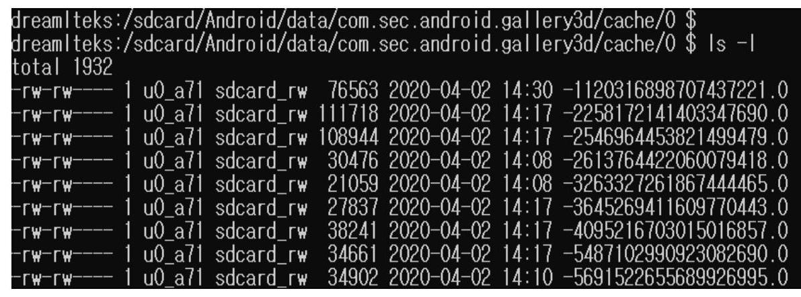
63) 김종만/이상진, "불법 촬영물에 대한 디지털 포랜식 프레임워크 - 안드로이드 스마트폰 중심으로 -", 「디지털포랜식연구」제12권 제 3 호 (한국디지털포랜식학회, 2018) 47-48면.
64) 윤대호/이상진, "안드로이드 스마트폰의 갤러리 썸네일(Thumbnail)에 대한 포랜식 분석 방법에 관 한 연구", 「정보처리학회논문지」제6권 제 1 호 (한국정보처리학회, 2017) 31-36면.

[그림 3] 확장자 ' 0 ' 썸네일 파일의 시그니처
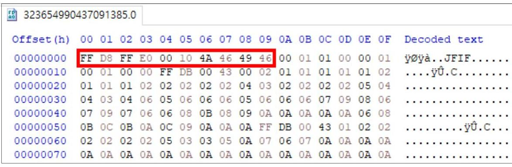

반면, LG 모바일 기기에 저장된 썸네일은 개별 파일 단위로 저장되지 않고, 썸 캐시(thumbcache) 파일 안에 연속적으로 저장되어 있다. 즉, LG 모바일 기기의 갤 러리 썸네일를 추출하기 위해서는 썸캐시 파일의 구조를 분석하여야 한다. 썸캐시 파일은 ' 0 ' 및 ' 1 ' 파일이 존재하는데, ' 0 ' 파일에 먼저 썸캐시가 기록되고 용량이나 양이 일정 수준에 도달할 경우 ' 1 ' 파일에 기록된다. 만약 ' 1 ' 파일도 일정 수준에 도달할 경우에는 ' 0 ' 파일의 썸캐시를 삭제하고 새로 기록한다. 썸캐시 파일의 hex 구조는 [그림 4]와 같으며, '/local/image/item/count + identifier + /\%Image Path\% /\%Image Name\% + Unix Time(원본 그래픽 파일의 생성시간)' 이후 JPEG 시그니 처의 시작과 함께 썸네일 그래픽 데이터가 저장된 형태다.65) 본 논문에서 제안하는 휴대용 모바일 포렌식 도구는 이러한 구조를 분석하여 Unix Time(원본 그래픽 파 일의 생성시간)을 기준으로 그래픽 데이터를 추출할 수 있도록 제작하였다.
65) 윤대호/이상진, 앞의 논문, 32-34면.

[그림 4] 썸캐시 파일(imgcache.0) hex 구조
imgcache.0
Offset(h) 00 01 02 03 04 05 06 07 08 09 0A 0B 0C 0D 0E 0F Decoded text
00000000 10 85 24 BD 56 4E 8A 6E 47 FD 5C 47 A4 9C 55 9C ...SWMM\$nG@\GmwDw
00000010 04 00 00 00 CA 29 00 00 2F 00 6C 00 6F 00 63 00 ....Ei, /.1.o.c.
00000020 61 00 6C 00 2F 00 69 00 6D 00 61 00 67 00 65 00 31.1.1.1.m.a.g.e.
00000030 2F 00 69 00 74 00 65 00 6D 00 2F 00 38 00 31 00 /.i.t.e.m./.8.1.
00000040 2B 00 32 00 2B 00 2F 00 73 00 74 00 6F 00 72 00 +.2.+./.s.t.o.r.
00000050 61 00 67 00 65 00 2F 00 65 00 6D 00 75 00 6C 00 a.g.e./.e.m.u.l.
00000060 61 00 74 00 65 00 64 00 2F 00 30 00 2F 00 44 00 a.t.e.d./.0./.D.
00000070 43 00 49 00 4D 00 2F 00 43 00 61 00 6D 00 65 00 C.I.M./.C.a.m.e.
00000080 72 00 61 00 2F 00 32 00 30 00 32 00 30 00 30 00 c.a./.2.0.2.0.0.
00000090 33 00 31 00 30 00 5F 00 31 00 38 00 30 00 36 00 3.1.0._.1.8.0.6.
000000A0 33 00 39 00 2E 00 6A 00 70 00 67 00 2B 00 31 00 3.9...3.p.g.+.1.
000000B0 35 00 38 00 33 00 38 00 33 00 31 00 31 00 39 00 5.8.3.8.3.1.1.9.
000000C0 39 00 FF D8 FF E0 00 10 4A 46 49 46 00 01 01 00 5.9994...2FIF.....
000000D0 00 01 00 01 00 00 FF DB 00 43 00 03 02 02 03 02 ......30.C.......

[표 4]는 카메라 애플리케이션으로 촬영하여 저장된 사진, 동영상, 썸네일의 경 로를 분석한 것으로 본 논문에서 제안하는 휴대용 모바일 포렌식 도구의 분석대상 데이터이다. 보통 사진 파일의 확장자는 '.jpg', 동영상 파일은 '.mp4', 썸네일 파일은 확장자 '.0' 및 '.1'을 가졌다.
[그림 5] 확장자 '.jpg' 사진 파일과 '.mp4' 동영상 파일
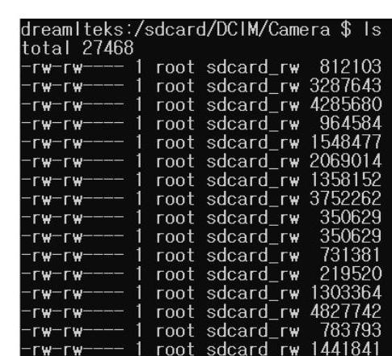

[표 4] 카메라 애플리케이션을 사용하여 저장된 데이터

| 애플리케이션 이름 | 데이터 유형 | 경로 | 모델 |
| :--: | :--: | :--: | :--: |
| 기본 카메라 <br> 갤러리 | 사진 $\cdot$ 동영상 | /sdcard/DCIM/Camera | SM-G950N <br> (Galaxy S8) <br> SM-960N <br> (Galaxy S9) <br> LM-G710N <br> (G7 ThinQ) |
|  | 범네일 | /sdcard/Android/data/com. <br> sec.android.gallery3d/cache | SM-G950N <br> SM-960N |
|  |  | /sdcard/Android/data/com. android.gallery3d/cache | LM-G710N |
|  | 휴지통 | /sdcard/Android/data/com. sec.android.gallery3d/files/. Trash | SM-G950N <br> SM-960N |
|  |  | /sdcard/Android/data/com. android.gallery3d/files/.tras hcan | LM-G710N |
| B612 | 사진 | /sdcard/Pictures/B612 | SM-G950N |
| 9.4.10 | 동영상 | /sdcard/Movies/B612 | SM-960N |

| Naver Line Camera <br> 14.2.15 | 사진・동영상 | /sdcard/DCIM/LINECamera | LM-G710N |
| :--: | :--: | :--: | :--: |
|  | 동영상 | /sdcard/Android/data/jp.naver. <br> linecamera.android/files/video |
| YouCam Perfect <br> 5.49 .1 | 사진・동영상 | /sdcard/DCIM/YouCam Perfect |
| SNOW <br> 9.4.21 | 사진・동영상 | /sdcard/SNOW |
| SweetSnap <br> 3.14.100555 | 사진・동영상 | /sdcard/DCIM/Camera |
| Foodie <br> 3.5.5 | 사진・동영상 | /sdcard/Foodie |
| Z Camera <br> 4.47 | 사진・동영상 | /sdcard/DCIM/Camera |
|  | 썸네일 | /sdcard/Android/data/com.jb. <br> zcamera/cache |
| Sweet Selfie <br> 3.12.1189 | 사진・동영상 | /sdcard/DCIM/Camera |
| Candy Camera <br> 5.4.59-play | 사진 | /sdcard/DCIM/CandyCam |
|  | 동영상 | /sdcard/Movies/CandyCam |
| YouCam Makeup <br> 5.66 .2 | 사진・동영상 | /sdcard/DCIM/YouCam Make <br> up |

| Cymera <br> 4.1.1 | 사진 | /sdcard/DCIM/Cymera2 |  |
| :--: | :--: | :--: | :--: |
| SODA <br> 3.2.6 | 사진 $\cdot$ 동영상 | /sdcard/DCIM/Camera |  |
|  | 썸네일 | /sdcard/Android/data/com. snowcorp.soda.android/cach e/glide |  |
| $\begin{gathered} \text { ULike } \\ 2.9 .6 \end{gathered}$ | 사진 $\cdot$ 동영상 | /sdcard/DCIM/Camera |  |
| Beauty Plus <br> 7.1.000 | 사진 $\cdot$ 동영상 | /sdcard/DCIM/Camera | SM-G950N <br> SM-960N <br> LM-G710N |
|  | 사진 | /sdcard/BeautyPlus/.temp | LM-G710N |
| Camera 360 <br> 9.7.6 | 사진 $\cdot$ 동영상 | /sdcard/DCIM/Camera | SM-G950N <br> SM-960N <br> LM-G710N |
|  | 사진 | /sdcard/Camera360/TempDat a/.sandbox/[Unix Time] | LM-G710N |

나. 클라우드와 메신저 애플리케이션을 사용하여 저장된 데이터

최근 화제가 된 일명 '텔레그램 N번방 사건'이 있다. 범인은 메신저 애플리케이 션 종류 중 하나인 텔레그램을 사용하여 미성년자 등의 성착취 영상을 유포하고, 이를 통해 수익을 취했다. ${ }^{(6)}$ 이뿐만 아니라 'N번방’을 통해 유통된 것으로 추정되는 성착취 동영상을 재판매하는 사건까지 발생했다. ${ }^{(6)}$ 메신저 애플리케이션은 대화창 기능과 더불어 데이터를 업로드할 수 있는 기능, 카메라 촬영 기능 등을 함께 제공 함으로써, 디지털 성범죄에 악용될 소지가 다분하다. 몰래카메라 범죄현장에서 용의 자가 메신저 애플리케이션을 사용하면 손쉽게 데이터를 전송할 수 있고, 만약 다른 이에게 촬영물이 전송되어 데이터가 확산된다면 촬영물의 삭제는 굉장히 어려워진 다. 이에 따라 최근에는 이렇게 유포된 음란물에 대해 추적하여 삭제하는 방안에 관한 연구들이 진행되고 있다. 최근에는 메신저와 클라우드를 통해 유포된 파일의 해시값과 원본 파일의 해쉬값을 이용하여 대상이 되는 동영상 파일만을 추적하는 수사기법을 제시한 연구가 있는데, 실험의 결과값에 대한 법률적인 검토 내용도 포 함되어 있어 제안하는 기법이 향후 어떻게 활용될지 기대된다. ${ }^{(8)}$

클라우드를 사용하면 메신저 애플리케이션과 비슷하게 굳이 PC 내부의 공간에 저장하지 않을 수 있으며, 언제 어디서든 필요한 자료를 업로드 및 다운로드할 수 있다. ${ }^{(9)}$ 클라우드 또한 모바일 기기에 애플리케이션을 설치하여 손쉽게 사용할 수 있다. 즉, 몰래카메라 범죄 용의자가 클라우드 사용자라면 촬영물을 손쉽게 업로드 할 수 있게 된다. 이와 같은 관점에서 본 연구에서는 클라우드와 메신저 애플리케

[^0]
[^0]:    66) 한동훈, "경찰, 조주빈 공범 3명 중 2 명 검거..."텔레그램 자경단도 수사 대상"", 「서울경제」 2020. 04. 02., https://www.sedaily.com/NewsView/1Z1BHJQOVC (2020. 04. 02. 검색)
    67) 권준영, ""n번방 $\cdot$ 박사방 자료 팝니다" $\cdots$ 성착취물 재판매한 20 대 구속", 「아이뉴스24」2020. 04. 0 2., http://www.inews24.com/view/1255056 (2020. 04. 02. 검색)
    68) 천성덕/강구민, "디지털 포랜식 분석을 통한 온라인 음란물 최초 유포자 확인 연구", 「치안정책연 구」제33권 제2호 (경찰대학교 치안정책연구소, 2019) 125면.
    69) 네이버 지식백과, "클라우드", https://terms.naver.com/entry.nhn?docId=3607510\&cid=58598\&catego ryId=59316 (2020. 04. 02. 검색)

이션 데이터를 분석해야 할 필요성을 느꼈다. 분석은 클라우드와 메신저 애플리케 이션 내에서 촬영물을 업로드, 자체 촬영 기능 사용 등의 이벤트로 인해 생성된 사 진, 동영상, 웹네일 데이터를 탐색하는 과정으로 진행하였다. 약 20여 개의 앱을 문 석한 결과 중 유의미한 내용을 선정하여 [표 5]에 정리했다. Wechat 애플리케이션 경로의 경우에는 \{Random Directory\} 부분이 모바일 기기 모델별로 상이했다.
[표 5] 클라우드와 메신저 애플리케이션을 사용하여 저장된 데이터

| 애플리케이션 이름 및 종류 | 데이터 유형 | 경로 | 모델 |
| :--: | :--: | :--: | :--: |
| Naver Line <br> 10.8.3 <br> (메신저) | 웹네일 | /sdcard/Android/data/jp.na ver.line.android/storage/mo | SM-G950N <br> SM-960N <br> LM-G710N |
|  | 사진 | /sdcard/Android/data/jp.nav er.line.android/storage/write | SM-960N |
| Telegram <br> 6.1.1 <br> (메신저) | 사진 | /sdcard/Telegram/Telegram Images | SM-G950N <br> SM-960N <br> LM-G710N |
|  | 동영상 | /sdcard/Telegram/Telegram <br> Video |  |
|  | 웹네일 | /sdcard/Android/data/org.tel egram.messenger/cache |  |
|  | 사진 $\cdot$ 동영상 | /sdcard/Pictures/Telegram |  |
| Wechat <br> 7.0.13 | 사진 | /sdcard/tencent/MicroMsg/[R <br> andom Directory]/image2 | SM-G950N <br> SM-960N |
|  | 동영상 | /sdcard/tencent/MicroMsg/[R |  |

| (메신저) |  | andom Directory//video | LM-G710N |
| :--: | :--: | :--: | :--: |
| KaKaoTalk <br> 8.8 .6 <br> (메신저) | 썸네일 | sdcard/Android/data/com.kak ao.talk/contents/Mg==/\{Chat_1 d\}/\{Random Directory\} | SM-G950N <br> SM-960N <br> LM-G710N |
|  | 동영상 | sdcard/Android/data/com.kak ao.talk/contents/Mw==/\{Chat_ ld\}/\{Random Directory\} |  |
| WhatsApp <br> 2.20.172 <br> (메신저) | 사진 | /sdcard/WhatsApp/Media/Wh atsApp Images/Sent | SM-G950N <br> SM-960N <br> LM-G710N |
|  | 동영상 | /sdcard/WhatsApp/Media/Wha tsApp Video/Sent |  |
| Viber <br> 13.0.0.4 <br> (메신저) | 썸네일 | /sdcard/Android/data/com.vi ber.voip/cache/ImageFetcher Thumb | SM-G950N <br> SM-960N <br> LM-G710N |
| Naver Cloud <br> 5.3 .8 <br> (클라우드) | 썸네일 | /sdcard/Android/data/com. nhn.android.ndrive/cache/im age_manager_disk_cache | SM-G950N <br> SM-960N <br> LM-G710N |
| Degoo <br> 1.57.30.200527 <br> (클라우드) | 썸네일 | /sdcard/Android/data/com.de goo.android/cache | SM-G950N <br> SM-960N <br> LM-G710N |

또한, 메신저 애플리케이션에는 소위 '비밀 대화방' 혹은 '대화방 숨기기'와 같이 대화방 내용을 은닉할 수 있는 기능이 있다. 비밀 대화방을 사용하면 대화방에서 주고받은 대화 내용은 기존의 모바일 기기에만 암호화되어 저장되고, 메신저 애플

리케이션 클라우드 서버에는 대화 내용이 저장되지 않는다. 즉, 동일한 계정일지라 도 다른 모바일 기기에서 메신저 애플리케이션에 로그인하면 이전 모바일 기기의 비밀 대화방 내용을 확인할 수 없다.70) [표 5]의 유의미한 데이터가 존재했던 6 개의 메신저 애플리케이션 중 5 개가 대화방을 은닉할 수 있는 기능이 존재했다. KaKaoT alk, Telegram, Viber 메신저 앱에는 '비밀 대화방' 기능이 존재하고, Naver Line 앱 에는 비밀 대화방 대신 '대화방 숨기기' 기능이 있다. WhatsApp은 대화방 보관 기 능으로 대화방을 숨길 수 있다. 본 연구에서는 대화방을 은닉할 수 있는 기능을 통 해 전송된 멀티미디어 데이터에 대해서도 분석하고, Wechat 메신저 앱을 제외한 5 개의 앱에서 앞선 [표 5]와 동일한 결과를 확인했다.
[그림 6] KaKaoTalk의 '비밀 채팅' 기능
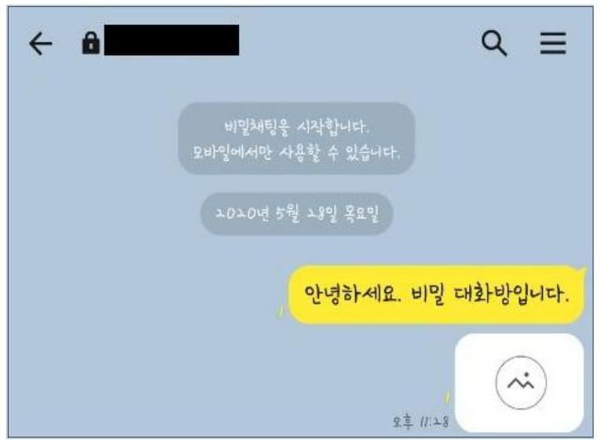

[^0]
[^0]:    70) 이민형/이상진, "인증정보 획득을 이용한 클라우드 메신저의 사용자 데이터 획득 기법에 관한 연 구", 「디지털포렌식연구」 제 13 권 제 4 호 (한국디지털포렌식학회, 2019) 337-338면.

다. 안티포랜식 애플리케이션 데이터

안티포랜식이란, 디지털 포랜식과 반대로 디지털 데이터를 분석하지 못하도록 은닉, 삭제하는 기법 등을 의미한다.71) 이러한 안티포랜식의 기법을 지원하는 애플 리케이션이 날로 증가하고 있는데, 실제로 멀티미디어 데이터 은닉, 애플리케이션 은닉, 잠금 등의 그 종류와 개수가 많다. 용의자는 안티포랜식 애플리케이션을 사용 하여 현장에서 데이터를 은닉할 수 있으며, 이에 따라 현장에서 안티포랜식을 탐지 할 수 있는 조치가 이루어져야 할 것이다.

[그림 7] 구글 플레이에서 '숨김' 키워드로 검색된 안티포랜식 앱 목록

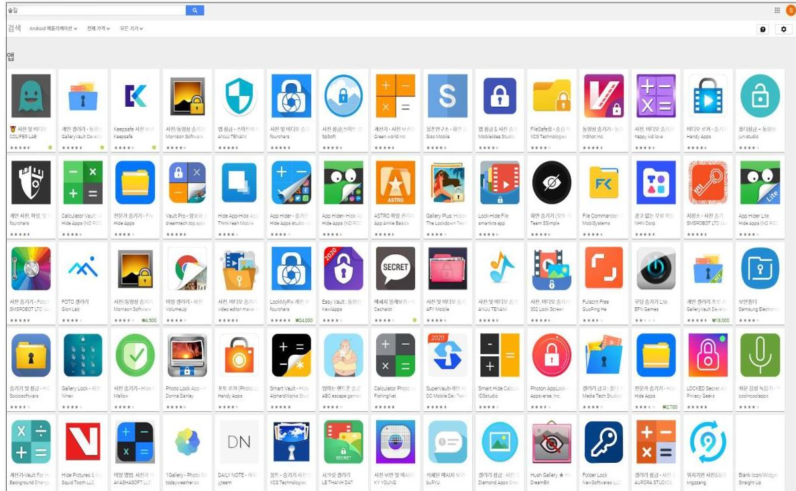

71) 네이버 지식백과, "안티포랜식", https://terms.naver.com/entry.nhn?docId=3396707&cid=42107&cate goryId=42107 (2020. 04. 30. 검색)

범죄현장에서 데이터를 은닉 - 인멸하는 안티포랜식 애플리케이션을 사용한 모바 일 기기를 수집한 경우, 현장에서 은닉 - 인멸된 증거 데이터를 확인하는 것은 어렵 다. 그러므로 범죄현장에서 안티포랜식 애플리케이션을 사용한 흔적이나 정황을 확 인하게 된다면 현장에서 매체 자체를 압수하거나 보존조치를 취하고, 그에 따른 정 밀한 분석이 이루어져야 할 것이다. ${ }^{72)}$ 이러한 안티포랜식 애플리케이션의 사용 흔 적 파악을 위해, 본 연구에서 제안하는 휴대용 모바일 포랜식 도구는 로그 데이터 에서 안티포랜식 애플리케이션 구동 정보를 탐색하여 출력한다.

# 라. 로그 데이터 

'로그'란 PC에서 발생한 이벤트, 프로세스 내용, 이용 상황 등을 시간의 흐름으 로 기록한 것을 의미한다. 이러한 로그는 사고 발생 시 사고의 원인 파악, 데이터 복구 등에 도움이 된다. ${ }^{73)}$ 안드로이드 운영체제가 탑재된 모바일 기기의 경우, 'logc at'이라는 ADB 명령을 통해 안드로이드 시스템, 최근 애플리케이션 구동 정보 등의 로그를 확인할 수 있다. 실제로 'logcat'은 스택 트레이스의 기능을 가지고 있어, 개 발자가 애플리케이션 오류를 분석하는데 사용되고,74) 다양한 오픈소스 프로그램에 서도 응용된다. ${ }^{75)}$ [그림 8]은 'logcat' 명령의 실행화면이다.

[^0]
[^0]:    72) 김종만/이상진, 앞의 논문, 41-43면.
    73) 네이버 지식백과, "로그", https://terms.naver.com/entry.nhn?docId=754519\&cid=42341\&categoryId= 42341 (2020. 04. 04. 검색)
    74) 김문찬/정충교, "이용자 조작 추적을 통한 안드로이드 어플리케이션 오류 분석", 『한국정보기술학 회논문지」제13권 제 3 호 (한국정보기술학회, 2015) 73-74면.
    75) GitHub, "logcat", https://github.com/search?q=logcat (2020. 04. 04. 검색)

[그림 8] logcat 명령 실행화면

```
tarlteks / $ logcat
    beginning of main
04-04 11:03:41:079 6683 6840 D GOS PkgData: setCustomFeatureFlag, pkgName: com.tencent.mm.
old featureFlag: 342277969730895875, new featureFlag: 342277969730895875
04-04 11:03:41:080 6683 6840 D GOS PkgData: PkgData(), pkgName: org.thoughtcrime.securesms
04-04 11:03:41:080 6683 6840 D GOS PkgData: setCustomFeatureFlag, pkgName: org.thoughtcrime
securesms, old featureFlag: 342277969730895875, new featureFlag: 342277969730895875
04-04 11:03:41:080 6683 6840 D GOS PkgData: PkgData(), pkgName: com.compmobile.snow
04-04 11:03:41:080 6683 6840 D GOS PkgData: setCustomFeatureFlag, pkgName: com.compmobile.
now, old featureFlag: 342277969730895875, new featureFlag: 342277969730895875
04-04 11:03:41:081 6683 6840 D GOS PkgData: PkgData(), pkgName: org.telegram.messenger
04-04 11:03:41:081 6683 6840 D GOS PkgData: setCustomFeatureFlag, pkgName: org.telegram.messenger, old featureFlag: 342277969730895875, new featureFlag: 342277969730895875
04-04 11:03:41:089 6683 6840 D GOS PkgData: PkgData(), pkgName: jp.naver.line.android
04-04 11:03:41:090 6683 6840 D GOS PkgData: setCustomFeatureFlag, pkgName: jp.naver.line.android,
```

'logcat'을 통해 출력되는 메시지의 형태는 크게 시간 정보, 로그 레벨, 구동되었 던 애플리케이션의 패키지 이름, 구동 내용 등으로 이루어져 있다. 애플리케이션 패 키지 이름이란 애플리케이션의 고유 ID로 보통 'com.××××××'의 형태를 가지고 있다. 즉, 패키지 이름을 통해 각 애플리케이션을 식별하는 것이 가능하다.76 로그 레 벨은 Verbose의 'V', Debug의 'D', Info의 'I', Warn의 'W', Error의 'E', Assert의 'A'로 구성되어 있고, 레벨별로 의미하는 바가 상이하다.77) 정리하면, 'logcat'으로 출력되는 정보를 통해 사용자가 구동했던 애플리케이션, 그에 상응하는 시간 정보, 구동 내용 등을 확인할 수 있다. 본 연구에서 제안하는 휴대용 모바일 포렌식 도구 는 지정한 시간 범위의 로그 데이터를 분석하여 카메라, 메신저, 클라우드 애플리케 이션의 구동 내역을 선별 $\cdot$ 분석할 수 있도록 제작되었다.

[^0]
[^0]:    76) Android Studio, "Set the application ID", https://developer.android.com/studio/build/application-i d?hl=ko (2020. 04. 03 검색)
    77) Android Studio, "Write and View Logs with Logcat", https://developer.android.com/studio/debug /am-logcat\#kotlin (2020. 04. 03 검색)

[표 6] logcat의 로그 레벨

| 로그 레벨 | 내용 |
| :--: | :-- |
| Verbose | 모든 로그 메시지 표시 |
| Debug | 개발에 유용한 디버그 메시지, 이보다 낮은 레벨의 메시지 표시 |
| Info | 일반적인 사용을 위한 메시지, 이보다 낮은 레벨의 메시지 표시 |
| Warn | 오류는 아니지만 발생할 수 있는 문제에 관한 메시지, 이보다 낮은 <br> 레벨의 메시지 표시 |
| Error | 오류 메시지, 이보다 낮은 레벨의 메시지 표시 |
| Assert | 개발자가 발생해서는 안 된다고 여기는 문제 표시 |

4. 휴대용 모바일 포렌식 도구의 기능

가. Main 화면

휴대용 모바일 포렌식 도구를 실행하면 Screen Record, Add Device, Agreement 의 버튼 3 개와 함께 창이 생성된다. Screen Record는 도구를 사용하는 스크린을 동 영상 녹화하여 저장할 수 있는 기능을 제공한다. 녹화된 영상을 통해 도구 사용의 전 과정을 살펴볼 수 있으며, 도구 사용이 적절했는가에 문제의 소지를 개선할 수 있다. Add Device는 안드로이드 모바일 기기를 연결 $\cdot$ 분석 $\cdot$ 출력하는 기능을 제공 하며, Agreement는 임의제출 확인서 작성 기능이다.

[그림 9] 휴대용 모바일 포렌식 도구 Main 화면
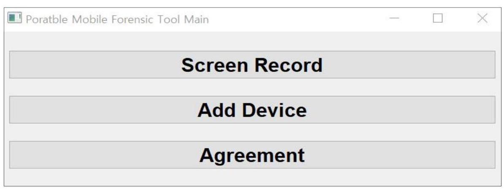

# 나. 화면 녹화 기능 

Main 화면의 Screen Record를 누르면, 녹화를 시작할 수 있는 프로그램이 실행 된다. 이후 'Start 버튼을 누르면 녹화가 시작되고, 창을 닫으면 자동으로 녹화 가 중지된다. 녹화된 동영상은 지정된 경로에 녹화 날짜와 시간으로 명명되어 'avi' 파일 형태로 저장된다.
[그림 10] 녹화 시작
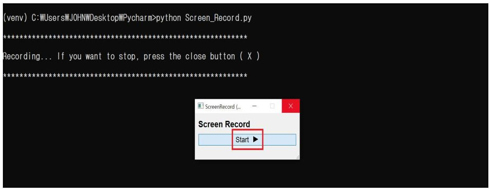

[그림 11] 저장된 녹화 동영상

| 园 Idea | 2019-12-12 오전 11:18 | 파일 홀더  |
| --- | --- | --- |
|  2020년04월04일_14시59분57조.341 | 2019-12-12 오전 11:17 | 파일 홀더  |
|  2020-04-04 오후 2:59 | 2020-04-04 오후 2:59 | AVI 파일  |
|  2020-03-29 오전 9:35 | Python File |   |
|  Screen_Record_Ul.py | 2020-01-27 오후 1:55 | Python File  |

다. 안드로이드 모바일 기기 분석기능

Main 화면의 Add Device를 누르면, 도구와 연결된 안드로이드 모바일 기기를 분석할 수 있는 화면이 생성된다. 이 화면에서는 연결된 모바일 기기의 정보를 확인할 수 있고, 분석하고자 하는 항목과 파일의 시간 범위를 설정할 수 있다. 연결된 모바일 기기의 정보로는 기기의 시리얼 번호와 모델명을 확인할 수 있다. [그림 12] 에서는 시리얼 번호 '21d8a5ee04047ece'와 모델명 'SM_G960N'을 확인할 수 있다. 그리고 연결된 기기가 존재하지 않을 경우, 'No device found'의 경고창이 생성되는 데, 'Please connect the device.'라는 문구와 함께 모바일 기기의 연결을 권한다.

[그림 12] 연결된 안드로이드 모바일 기기 확인
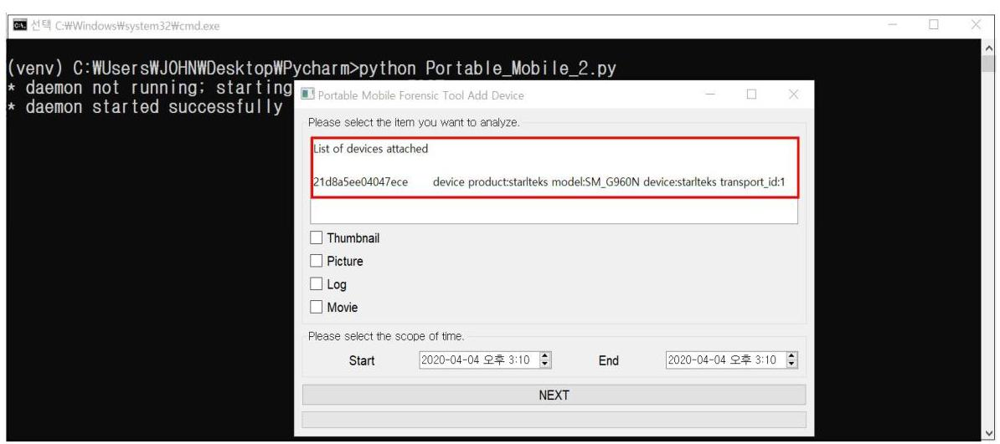
[그림 13] 연결된 기기가 없을 경우의 경고창
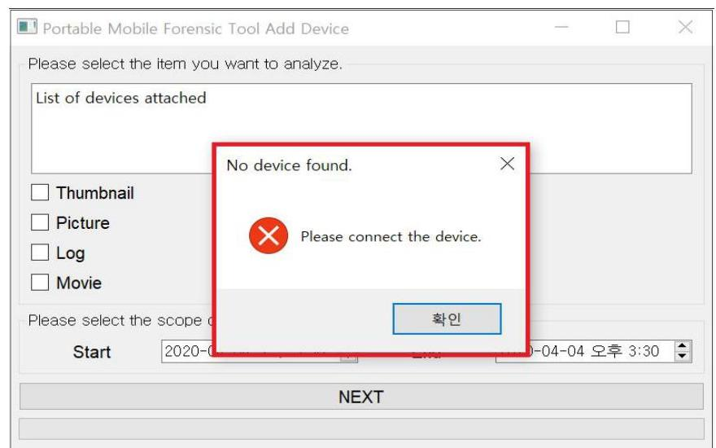

분석항목은 썸네일(Thumbnail), 사진(Picture), 동영상(Movie), 로그(Log)로 총 4 가지가 있다. 사진, 동영상, 썸네일은 앞서 언급한 분석대상의 경로에서 추출되며 로그는 'logcat' 명령어를 기반으로 수집된다. 4 가지 항목 중 원하는 항목을 개별적

으로 선택할 수 있다. 시간 범위는 Start에 설정한 시간부터 End에 설정한 시간까 지의 범위로 지정된다. 도구는 사진, 동영상, 썸데일, 로그 중 선택한 항목의 파일들 가운데 설정한 시간 범위 안에 생성된 파일을 탐색하게 되는데, 이 기능을 통해 몰 래카메라 범죄현장에서 범죄 발생시간이 포함된 시간 범위 내에 접근된 데이터만을 탐색할 수 있게 되어 사건과 무관한 데이터의 무분별한 탐색을 방지할 수 있다. 항 목선택과 시간 설정을 하고 NEXT 버튼을 누르면, 탐색이 진행되고 자동으로 분석 한 내용을 출력해주는 창이 생성된다.
[그림 14] 분석항목과 시간 범위 설정

| Portable Mobile Forensic Tool Add Device |  |  |  |  |  | $\times$ |
| :--: | :--: | :--: | :--: | :--: | :--: | :--: |
| Please select the item you want to analyze. |  |  |  |  |  |  |
| List of devices attached |  |  |  |  |  | ^ |
| 21d8a5ee04047ece device product:stariteks model:SM_G960N device:stariteks tran $\checkmark$ |  |  |  |  |  | $>$ |
| $\checkmark$ |  |  |  |  |  | $>$ |
| $\checkmark$ Thumbnail |  |  |  |  |  |  |
| $\checkmark$ Picture |  |  |  |  |  |  |
| $\checkmark$ Log |  |  |  |  |  |  |
| $\checkmark$ Movie |  |  |  |  |  |  |
| Please select the scope of time. |  |  |  |  |  |  |
| Start | 2020-04-03 ㅇㅇㅇ 6:53 | End |  | 2020-04-04 ㅇㅇㅇ 6:53 |  |  |
| NEXT |  |  |  |  |  |  |

라. 로그 출력 기능

NEXT 버튼을 누른 후, 가장 먼저 결과가 출력되는 것은 선별된 로그 데이터다. 우측 하단의 Log Viewer 패널에서 출력된 데이터를 확인할 수 있으며, 선별은 애 플리케이션의 패키지 이름과 설정한 시간 범위를 기준으로 진행된다. [표 7]은 로그 데이터를 선별할 때 기준으로 사용된 애플리케이션의 패키지 이름 목록이다. 로그 데이터에서 특정 앱의 패키지 이름을 탐색하여 카메라, 메신저, 클라우드, 안티포렌 식 애플리케이션 등의 구동 내역을 확인할 수 있다.
[그림 15] 선별된 로그 데이터 출력
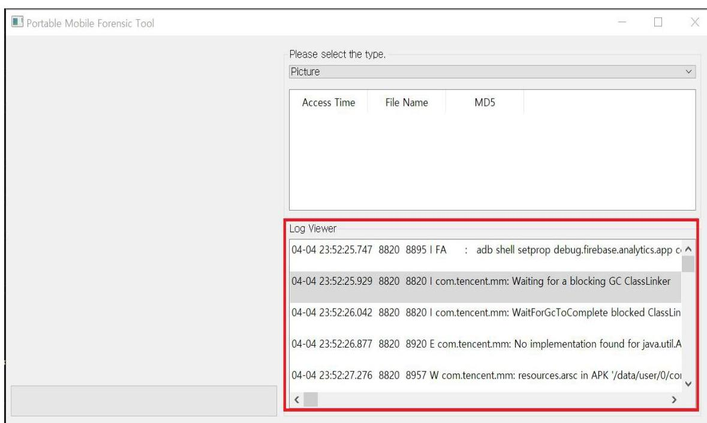

[표 7] 선별에 사용된 애플리케이션 패키지 이름 목록

| 종류 | 애플리케이션 | 패키지 이름 |
| :--: | :--: | :--: |
| 카메라 | Samsung Camera | com.sec.android.app.camera |
|  | LG Camera | com.lge.camera |
|  | B612 | com.linecorp.b612.android |
|  | Naver Line Camer | jp.naver.linecamera.android |
|  | Beauty Plus | com.commsource.beautyplus |
|  | Camera360 | vStudio.Android.Camera360 |
|  | YouCam Perfect | com.cyberlink.youperfect |
|  | SNOW | com.campmobile.snow |
|  | SweetSnap | com.ufotosoft.justshot |
|  | ZCamera | com.jb.zcamera |
|  | Sweet Selfie | com.cam001.selfie |
|  | CandyCamera | com.joeware.android.gpulumera |
|  | YouCam Makeup | com.cyberlink.youcammakeup |
|  | Cymera | com.cyworld.camera |
|  | SODA | com.snowcorp.soda.android |
|  | ULike | com.gorgeous.liteinternational |

|  | HD Camera | tools.photo.hd.camera |
| :--: | :--: | :--: |
|  | Foodie | com.linecorp.foodcam.android |
|  | Naver Cloud | com.nhn.android.ndrive |
|  | OneDrive | com.microsoft.skydrive |
|  | G Cloud Gallery | com.genie9.cloud.gallery |
|  | G Cloud Backup | com.genie9.gcloudbackup |
|  | Google Drive | com.google.android.apps.docs |
|  | degoo | com.degoo.android |
|  | dropbox | com.dropbox.android |
|  | pcloud | com.pcloud.pcloud |
|  | sync | com.sync.mobileapp |
|  | box | com.box.android |
|  | mega | mega.privacy.android.app |
|  | amazon drive, amazon photo | com.amazon.clouddrive.photos |
|  |  | com.amazon.drive |
|  | Naver Line | jp.naver.line.android |
|  | Telegram | org.telegram.messenger |
|  | Wechat | com.tencent.mm |

|  | KakaoTalk | com.kakao.talk |
| :--: | :--: | :--: |
|  | Skype | com.skype.raider |
|  | Whatsapp | com.whatsapp |
|  | Tango | com.sgiggle.production |
|  | Viber | com.viber.voip |
|  | facebook messenger | com.facebook.orca |
|  | Signal | org.thoughtcrime.securesms |
| 안티 <br> 포랜서 | 사진 및 비디오 <br> 숨기기 | com.colure.app.privacygallery |
|  | Keepsafe 사진 보관함 | com.kii.safe |
|  | 개인 갤러리 - 동영상, <br> 사진 및 파일 숨기기 | com.thinkyeah.galleryvault |
|  | 사진/동영상 숨기기, <br> 잠금 - Gallery Lock | com.morrison.gallerylocklite |
|  | App Hider- Hide <br> Apps Hide Photos <br> Multiple Accounts | com.app.hider.master.pro |
|  | App Hider - 숨겨진 <br> 병렬 공간에서 <br> 앱 숨기기 | com.hidespps.apphider |

마. 썸네일(Thumnail) 출력 기능

우측 상단의 'Please select the type'이 적힌 패널에서 Picture, Movie, Thumnail 항목 중 하나를 선택하여 분석된 내용을 확인할 수 있다. 분석된 내용은 Access Time, File Name, MD5 칼럼에 정리되어 출력된다. Access Time은 파일의 접근시 간을 의미하며, File Name은 파일 이름, MD5는 파일의 MD5 해시값을 의미한다. 목록에서 확인하고자 하는 항목을 선택하면 좌측에 출력된다. 썸네일 데이터의 시 그니처는 보통 JPEG의 시그니처와 동일하다는 특징을 가지고 있다. 이러한 특징을 기반으로, 도구에 JPEG의 시그니처를 탐색할 수 있도록 프로세스를 추가하고, 앞서 언급했던 LG 모바일 기기의 썸캐시 파일의 구조와 내용을 분석할 수 있는 기능을 추가함으로써 썸네일 분석기능을 보완하였다.
[그림 16] 선별된 썸네일 데이터 출력
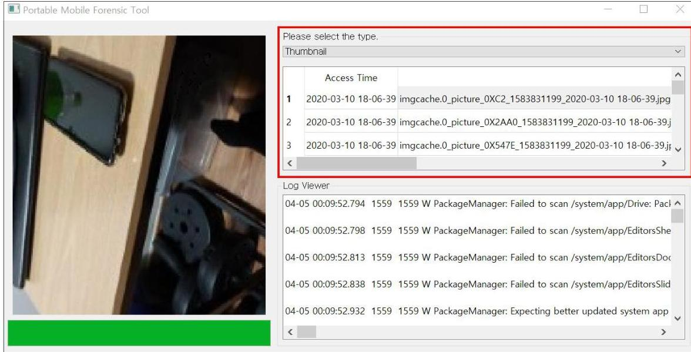

썸네일 데이터 추출 및 출력과정은 [그림 17]과 같다. 우선 탐색하고자 하는 썸 네일 데이터가 Thumbcache 파일인지 아닌지 구분한다. Thumbcache 파일인 경우, 파일 내 메타데이터 중 Unix Time을 분석하여, 해당 원본 그래픽의 생성시간을 파 악한다. 다음으로 파악된 Unix Time이 Start Time과 End Time 범위에 해당하는 지 파악하고, 범위에 해당하지 않는 경우 이와 같은 과정을 다음 대상 썸네일에 적 용하며 반복한다. 범위에 해당하는 썸네일은 추출 $\cdot$ 출력된다. 탐색하고자 하는 썸네 일 데이터가 Thumbcache 파일이 아닌 경우에는 미리 지정한 썸네일 데이터가 저 장된 경로에서 접근시간(Access Time)이 Start Time과 End Time 범위에 포함되 는 파일을 탐색한다. 시간 범위의 파일들이 추려지고 나면, 파일들에서 JPEG 파일 시그니처를 가지고 있는 썸네일 파일들을 선별한다. 이렇게 두 가지 과정을 거쳐 선별되어 추출된 썸네일들은 접근시간(Access Time), 썸네일 경로, MD5 해시값 정 보와 함께 도구에 출력된다. 사진과 동영상을 분석하여 출력하는 기능의 알고리즘 도 이와 비슷한데, 썸네일 선별과정의 JPEG 파일 시그니처를 파악하는 것 대신에 확장자 ' .jpg', 'mp4'를 파악하여 사진과 동영상 파일들을 선별하였다.

[그림 17] 썸네일 분석 알고리즘
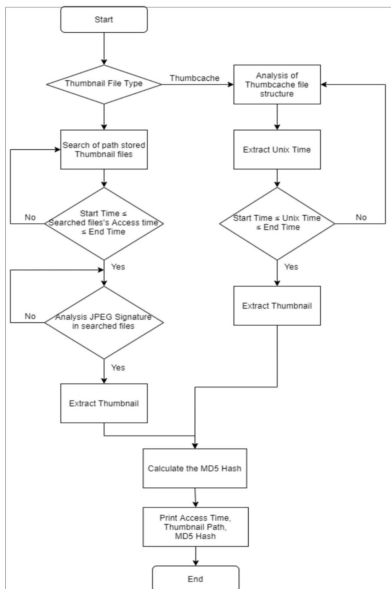

바. 사진(Picture) $\cdot$ 동영상(Movie) 출력 기능

썸네일의 출력과 동일한 원리로 우측 상단의 'Please select the type'이 적힌 패 닐에서 Picture와 Movie를 선택하면 사진과 동영상 데이터를 각각 확인할 수 있다. 동영상 데이터의 경우 목록 중 항목을 선택하면 해당 동영상이 재생된다.
[그림 18] 선별된 사진 데이터 출력
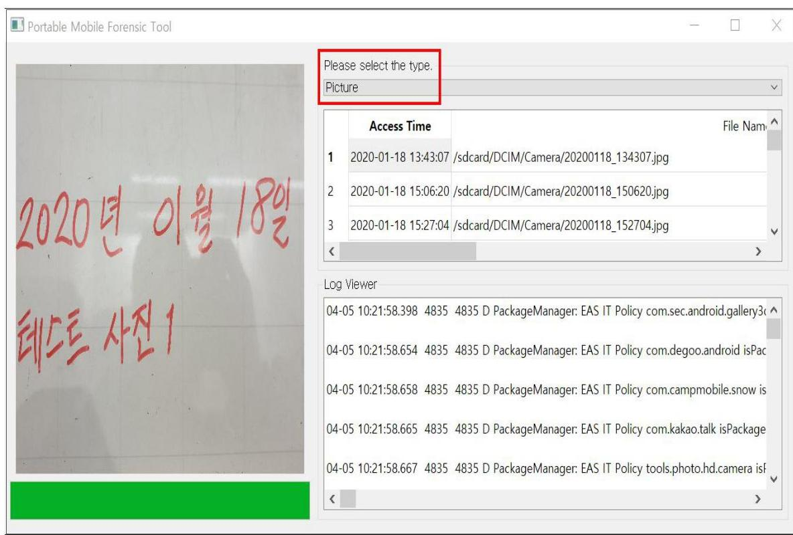

[그림 19] 선별된 동영상 데이터 출력
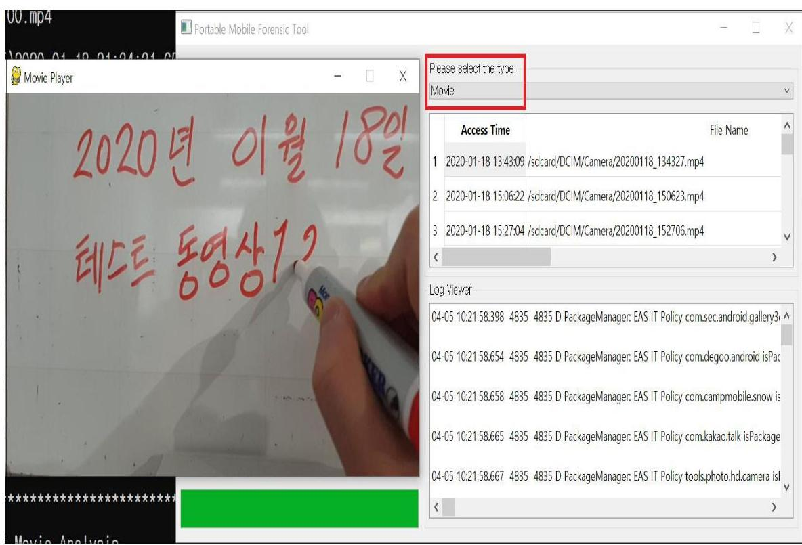

사. 임의제출 확인서 작성 기능

임의제출 확인서 작성 기능은 기존의 모바일 포렌식 도구와 차별화된 기능으로 범죄현장에서의 적법한 수사절차에 도움이 될 수 있다. 본 논문의 제2장에서 임의 제출물의 적법한 압수에 관하여 설명한 바와 같이 임의제출에는 제출자의 임의성을 확실히 할 수 있는 조치가 필요하다. 또한, 임의제출 전자정보의 정확한 대상 및 범 위도 제출당사자가 확인할 수 있어야 한다. 이를 위해 혐의사실과 관련한 전자정보 가 기재되고, 기재된 전자정보에 대하여 제출자의 동의 서명이 첨부할 수 있는 기 능이 포함된다면, 현장에서 임의제출자의 임의성 증명에 도움이 될 것이다.

실제로 경찰청 범죄수사규칙 제5장 제123조(임의제출물의 압수 등) 제3항에는 임의제출서를 제출하게 해야 한다는 내용과 함께 별지 제75호 서식인 임의제출서 양식이 공유되어 있다. ${ }^{78)}$ 본 연구에서 제안하는 도구의 임의제출 확인서 작성 기능 은 범죄수사규칙의 임의제출서 양식과 본 논문의 제 2 장 제 3 절에서 언급한 임의제출 이 적법하기 위한 조건을 참고하여 제작되었다. 도구의 Main 화면에서 Agreement 버튼을 누르면 임의제출 확인서 작성 기능으로 진입할 수 있다. 확인서를 작성하기 위해서는 제출자의 주민등록번호, 제출자 성명, 연락처, 분석하고자 하는 전자정보 의 시간 범위(Start Time $^{-}$End Time), 범죄현장, 담당 경찰관의 직급과 성명을 입 력해야 한다. 정보를 입력한 후 APPLY 버튼을 누르면, 왼쪽에 임의제출 확인서가 출력된다. 확인서에는 입력한 제출자에 관한 정보, 법률규정, 임의제출 고지와 관련 한 내용, 안드로이드 모바일 기기의 정보(모델, 시리얼 번호) 및 분석대상 전자정보 등의 내용이 포함된다.

[^0]
[^0]:    78) 경찰청 범죄수사규칙 제5장 제123조(임의 제출물의 압수 등) (3) 경찰관은 소유자, 소지자 또는 보 관자가 임의 제출한 물건을 압수할 때에는 되도록 제출자에게 별지 제75호 서식의 임의제출서를 제출하게 하고 별지 제79호 서식의 압수조서와 별지 제80호 서식의 압수목록을 작성하여야 한다. 이 경우에는 제출자에게 별지 제76호 서식의 압수증명서를 교부하여야 한다.

[그림 20] 임의제출 확인서 작성 기능
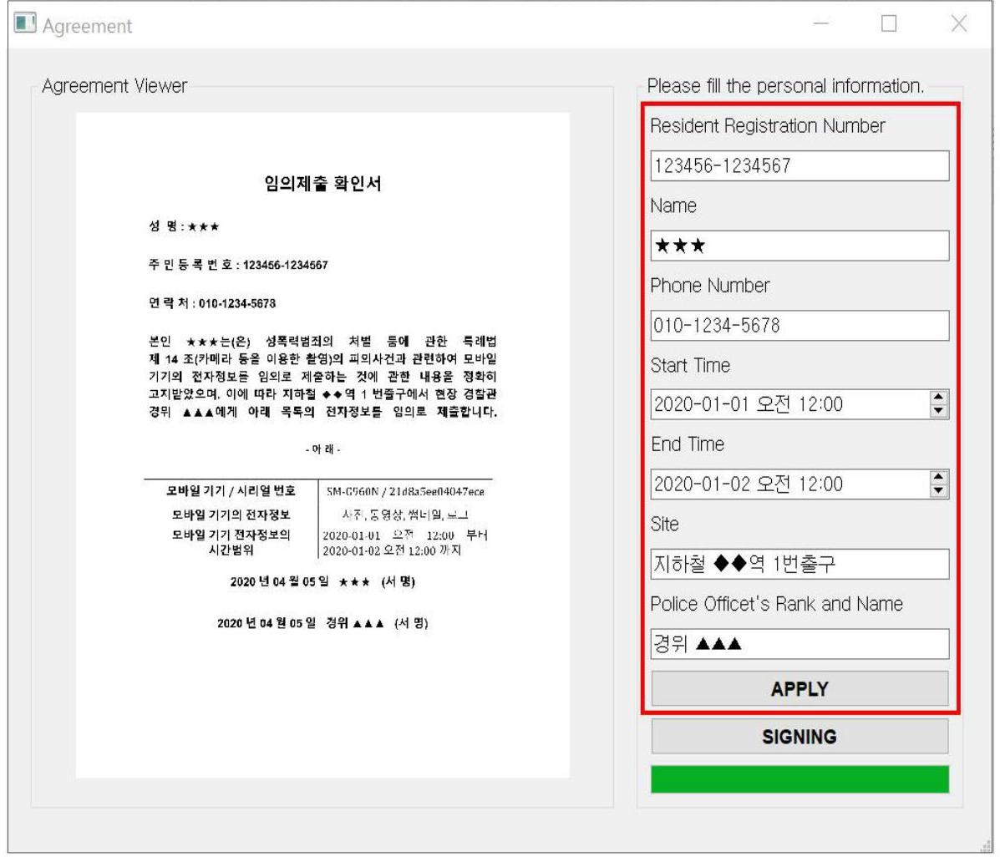

임의제출 확인서에 정보들이 입력한 후 SIGNING 버튼을 클릭하면 서명할 수 있는 환경이 제공되며 Save 버튼을 눌러 임의제출 확인서 서명본을 저장할 수 있 다. 서명본은 '서명본 생성날짜_제출자 성명_Signed.pdf' 형태로 저장된다.

[그림 21] 임의제출 확인서 서명 기능

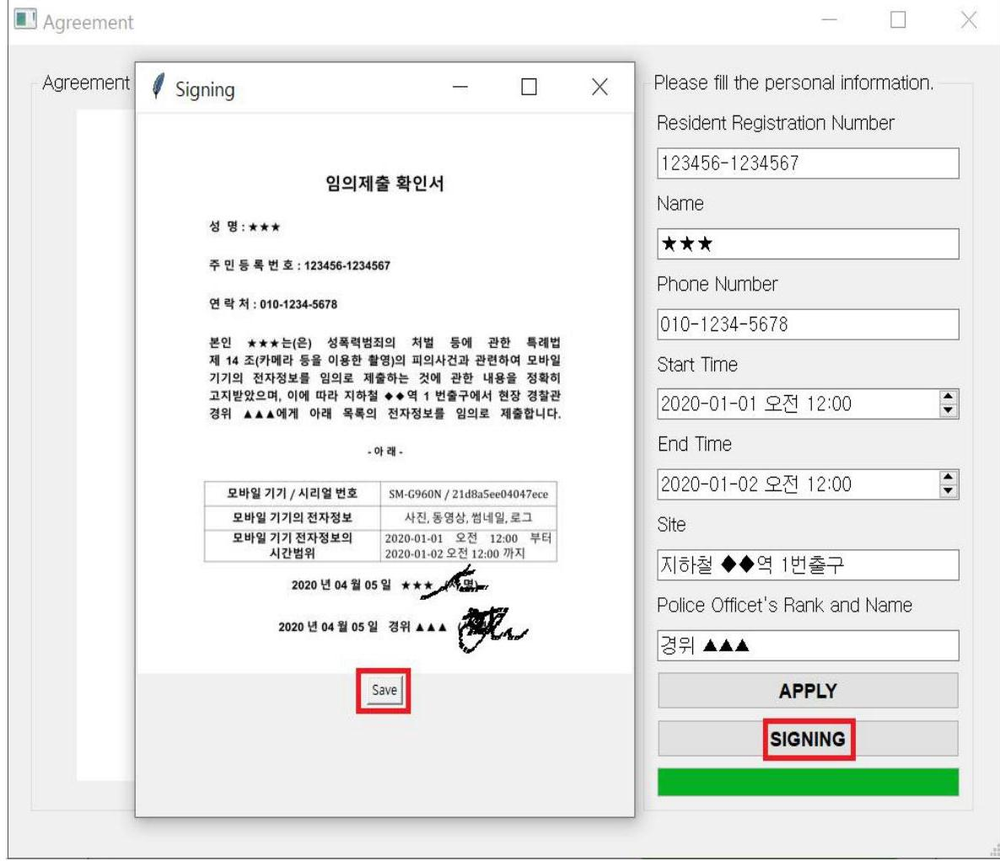

[그림 22] 저장된 임의제출 확인서 서명본

|  |   |   |
| --- | --- | --- |
|  2020-04-05_***_Signed.pdf | 2020-04-05 오전 11:43 | PDF 파일  |
|  2020-04-05_***_pdf | 2020-04-05 오전 11:40 | PDF 파일  |
|  Agreement_Ul.py | 2020-03-29 오전 9:35 | Python File  |

- 54 -

# 아. Error 로그 생성 기능 

도구 사용 간에 발생했던 오류를 로그로 저장하는 기능도 포함되어 있다. 파일 이름은 '날짜와 시간_Error_Log.txt' 형태로, 에러의 시간과 내용이 기록된다.
[그림 23] Error 로그 내용
202004051151_Error_Log.txt - 녹음장
파일(1) 편집(1) 서식(11) 보기(11) 도용됨
2020-04-05 11:53:18 [WinError 5] 액세스가 거부되었습니다: '246819940_43797.jpg'

자. DAS 시스템 연동 기능

본 연구에서 제안하는 휴대용 모바일 포랜식 도구와 현재 국립과학수사연구원 (이하 국과수) 디지털포랜식분석과에서 운용하고 있는 DAS(Digital Authentication System)의 기능을 연동한다면 몰래카메라 범죄현장에서 발견된 디지털 증거의 동 일성 $\cdot$ 무결성을 둘러싼 진정성에 대한 입증을 강화할 수 있을 것이다. DAS 시스템 의 사용자는 디지털 인증시스템을 통해 증거물을 채증하고, 이에 대한 인증을 요청 할 수 있다. 인증요청을 하게 되면 증거물에 관한 정보가 인증서비스 서버로 전송 되며, 요청에 대한 확인을 자동으로 처리하여 인증조회, 인증서 발급이 가능하게 된 다. 또한, 증거물들의 해시값을 하루 단위로 계산한 뒤, 전체 해시값을 재계산하여 매주 대한민국 전자관보에 게시하게 되는데, 이를 통해 증거물의 무결성과 동일성 이 유지되는 것을 확인할 수 있다.79)
79) 김경태/이규민/장구민, "디지털 증거 인증시스템(DAS)을 통한 진정성 입증에 관한 연구", 「형사 법의 신동향」제64호 (대검찰청, 2019) 88-92면.

[그림 24] 디지털 인증시스템(DAS)의 인증 절차
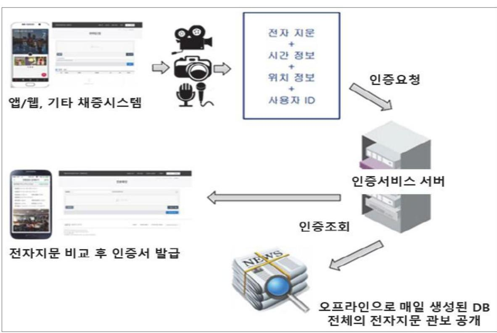

휴대용 모바일 포랜식 도구와 함께 DAS 시스템을 사용하면 디지털 증거의 진 정성 입증 효과와 범죄현장에서 발생할 수 있는 담당 경찰관 혹은 수사관의 실수 방지를 기대할 수 있다. 모바일 기기로 촬영한 몰래카메라 범죄의 경우, 현장에서 용의자가 촬영물을 변조 $\cdot$ 삭제하거나 유포할 가능성이 있고, 경찰관들의 수사 관행 혹은 개개인의 판단으로 무심코 처리한 행동이 디지털 증거의 무결성을 훼손하는 일이 발생할 수도 있다. 휴대용 모바일 포랜식 도구의 기능과 DAS 시스템의 해시 값을 활용한 무결성 검증 기능을 연동한다면 현장에서 생길 수 있는 위와 같은 문 제들을 개선하는데 적잖은 도움이 될 것이다. ${ }^{80)}$

[^0]
[^0]:    80) 김경태/이규민/강구민, 앞의 논문, 98면.

# 제2절 휴대용 모바일 포렌식 도구 검증 

최근 수사기법의 일종으로 디지털 포렌식이 대두되어 자연스레 디지털 포렌식 도구의 공급과 수요가 늘어나는 추세이다. 하지만 디지털 포렌식 도구를 사용하여 추출한 결과가 법정에서 증거로써 증거능력을 인정받기 위해서는 사용한 디지털 포 렌식 도구가 신뢰성이 검증된 도구여야 한다. 제3장 제2절에서는 국내외 디지털 포 렌식 도구의 신뢰성 검증 관련 프로젝트 및 표준 제정 등을 소개하고, 본 연구에서 제안하는 휴대용 모바일 포렌식 도구에 적합한 신뢰성 검증 항목과 검증 테스트 결 과를 제안한다.

1. 한국정보통신기술협회(TTA)의 디지털 포렌식 도구 검증

한국정보통신기술협회(TTA, Telecommunications Technology Association)는 정보통신 산업과 기술 등의 발전을 목표로 설립된 정보통신표준 제정기관이다.81) 한국정보통신기술협회는 2007년부터 디지털 포렌식과 관련한 다양한 표준을 제정하 였는데, 이 중에는 디지털 포렌식 도구와 관련한 것들이 있다.82)

- 사이버 침해 사고 분석을 위한 네트워크 포렌식 분석 도구 요구사항(표준번호 : TTAK.KO-12.0294, 제개정일 : 2016.12.27.)
- 컴퓨터 포렌식을 위한 디지털 증거 분석도구 검증(표준번호 : TTAK.KO-12.0112, 제개정일 : 2009.12.22.)
- 컴퓨터 포렌식을 위한 디지털 데이터 수집도구 검증(표준번호 : TTAK.KO-12.0

[^0]
[^0]:    81) 네이버 지식백과, "한국정보통신기술협회", https://terms.naver.com/entry.nhn?docId=1203854\&cid= 40942\&categoryId=34632 (2020. 04. 08. 검색)
    82) 강구민, "디지털 포렌식 도구 검증에 관한 연구", 연구용역과제, 2014.10., 174-176면.

075, 제개정일 : 2008.12.19.)

- 컴퓨터 포랜식을 위한 디지털 증거 분석도구 요구사항(표준번호 : TTAK.KO-1 2.0081, 제개정일 : 2008.12.19.)
- 컴퓨터 포랜식을 위한 디지털 데이터 수집도구 요구사항(표준번호 : TTAS.KO12.0057, 제개정일 : 2007.12.26.)

예를 들어 '컴퓨터 포랜식을 위한 디지털 증거 분석도구 검증(TTAK.KO-12.0112)' 에서는 일반적인 검증, 삭제 파일 복구 관련 기능 검증, 파일 및 문자열 탐색 기능 관 련 검증, 기타 분석기능에 대한 검증으로 디지털 증거 분석도구에 대한 검증항목을 분류하였다.
[표 8] 컴퓨터 포랜식을 위한 디지털 증거 분석도구 검증(TTAK.KO-12.0112)의 일반적인 검증항목

| 번호 | 내용 |
| :--: | :-- |
| GV_01 | 분석대상 데이터의 변동 및 수정이 발생하지 않음 |
| GV_02 | 직접적인 매체 접근 시, 쓰기방지장치가 없는 경우 디지털 데이 터 원본이 변경되지 않음 |
| GV_03 | 하나 이상의 파일시스템을 지원하며, 분석 도구가 지원 가능하 다고 명시한 파일시스템과 파일시스템에서의 메타데이터를 정확 히 인식함 |
| GV_04 | 증거 식별을 위해 증거 매체에 대한 데이터 추출과 분석기능을 제공함 |
| GV_05 | 동일한 환경에서 동일한 입력 데이터에 대하여 항상 동일한 분 |

|   | 석 결과를 출력함  |
| --- | --- |
|  GV_06 | 수행한 이벤트 로그를 정확하게 기록함  |
|  GV_07 | 수행 도중 발생한 오류에 대해 보고함  |
|  GV_08 | 분석된 결과에 대한 정확한 리포팅이 가능함  |

위와 같이 한국정보통신기술협회는 컴퓨터와 네트워크 포렌식 도구에 관한 요구 사항과 검증항목 표준들을 제정하였다. 하지만 모바일 기기를 분석하고 수집하는 모바일 포렌식 도구 검증에 관한 내용이 심도 있게 다뤄진 표준을 제정하지 않은 것을 확인할 수 있다. 실제로 2007년 12월 26일에 제정된 '이동 전화 포렌식 가이드 라인(표준번호 : TTAS.KO-12.0059)'에서 '이동 전화'라는 용어와 함께 모바일 포렌 식 도구 개발 방향을 제시하고 있지만, 앞서 제정한 표준처럼 심도 있게 다루고 있 지는 않다. '이동 전화 포렌식 가이드라인'이 제정된 2007년 이후, 모바일 기기의 발 전은 비약적이다. 향후 모바일 포렌식과 관련한 표준의 개정이 필요할 것으로 여겨 진다.

# 2. 미국표준기술연구소(NIST)의 디지털 포렌식 도구 검증

가. 컴퓨터 포렌식 도구 테스트 프로그램(CFTT) 프로젝트

미국표준기술연구소(National Institute of Standards and Technology, 이하 NIS T)는 미국 상무부 산하의 국립 연구소이다. ${ }^{83)}$ NIST에는 포렌식 조사에 사용되는 도구에 대해서 신뢰성 기준 제공을 위한 연구를 진행하는 컴퓨터 포렌식 도구 테스

[^0] [^0]: 83) 네이버 지식백과, "미국표준기술연구소", https://terms.naver.com/entry.nhn?docId=812834\&cid=431 33\&categoryId=43133 (2020. 04. 09. 검색)

트 프로그램(Computer Forensics Tool Testing Program, 이하 CFTT) 프로젝트가 있다. 84 CFTT는 디지털 포랜식 도구를 테스트하기 위한 방법론을 확립하고, 도구 테스트 결과를 제공하여, 도구 개선과 사용자가 포랜식 도구를 이해하는데 필요한 정보를 제공하고 있다. ${ }^{85)}$ 실제로 CFTT는 2019년 7월에 모바일 기기의 데이터를 수집하는 포랜식 도구에 관한 요구사항을 정의한 'Mobile Device Forensic Tool Sp ecification, Test Assertions and Test Cases'를 발행하여, ${ }^{86)}$ 모바일 포랜식 도구의 신뢰성 검증 테스트의 기준을 수립하였다. 'Mobile Device Forensic Tool Specificat ion, Test Assertions and Test Cases'에서 요구하는 도구의 기능을 정리하면 다음 과 같다.
[표 9] 'Mobile Device Forensic Tool Specification, Test Assertions and Test Cases'의 기능 요구사항

| 번호 | 내용 |
| :--: | :-- |
| MDT-CR-01 | 모바일 포랜식 도구는 모바일 기기의 이미지 파일에서 지원되는 <br> 모든 아티팩트 데이터를 추출하여 보여준다. |
|  | MDT-CA-01. 이미지 파일에서 모든 가입자 및 모바일 기기의 <br> 정보를 제공한다. <br> MDT-CA-02. 이미지 파일에서 모든 PIM(주소록, 캘린더 \& <br> 노트) 데이터를 제공한다. <br> MDT-CA-03. 이미지 파일에서 모든 통화 데이터(수신, 발신, <br> 부재중, 날짜 타임스탬프, 기간)를 제공한다. |

[^0]
[^0]:    84) 강구민, "디지털 포랜식 도구 검증에 관한 연구", 연구용역과제, 2014. 10., 174-176면.
    85) NIST, "Computer Forensics Tool Testing Program", https://www.nist.gov/itl/ssd/software-qual ty-group/computer-forensics-tool-testing-program-cftt (2020. 04. 09. 검색)
    86) NIST, "Mobile Device Forensic Tool Test Spec V 3.0 (July 2019)", https://www.nist.gov/itl/ssd /software-quality-group/computer-forensics-tool-testing-program-cftt/cftt-technical/mobile (2020. 04. 09. 검색)

|  | MDT-CA-04. 이미지 파일에서 모든 메시지 데이터(SMS, M MS 등)를 제공한다. <br> MDT-CA-05. 이미지 파일에서 모든 개별(오디오, 문서, 그래 픽 \& 비디오)파일을 제공한다. <br> MDT-CA-06. 이미지 파일에서 모든 검색(History \& Bookmar k) 데이터를 제공한다. <br> MDT-CA-07. 이미지 파일에서 모든 이메일 데이터를 제공한 다. <br> MDT-CA-08. 이미지 파일에서 모든 소셜 미디어 애플리케이 션의 데이터를 제공한다. <br> MDT-CA-09. 이미지 파일에서 모든 위치기반 애플리케이션의 데이터를 제공한다. |
| :--: | :--: |
| MDT-CR-02. | 도구는 텍스트를 올바르게 표현한다. <br> MDT-CA-10. 출력된 텍스트는 올바른 문자로 표현된다. |
| MDT-CR-03. | 모바일 포렌식 도구는 조사 중인 이미지 파일을 변조하지 않는다. <br> MDT-CA-11. 이미지 파일을 변조하지 않는다. |
| MDT-CR-04. | 모바일 포렌식 도구는 이미지 파일에 변조가 가해질 경우, 도구 사용자에게 이를 알린다. |
|  | MDT-CA-12. 이미지 파일이 변조된 경우, 도구는 이미지 파 일이 변조되었음을 사용자에게 알린다. |
| MDT-RO-01. | 모바일 포렌식 도구는 물리 메모리의 이미지 파일을 생성한다. (예시 : 부트로더) |
|  | MDT-AO-01. 물리 메모리의 이미지 파일을 생성한다. |
| MDT-RO-02. | 모바일 포렌식 도구는 논리적 수집(지원되는 메모리 아티팩트) |

|  | 의 이미지 파일을 생성한다. |
| :--: | :--: |
|  | MDT-AO-02. 지원되는 메모리 아티팩트를 포함한 이미지 파 일을 생성한다. |
| MDT-RO-03. | 모바일 포렌식 도구는 논리적 수집(선택한 메모리 아티팩트)의 이미지 파일을 생성한다. |
|  | MDT-AO-03. 선택한 메모리 아티팩트를 포함한 이미지 파일 을 생성한다. |
| MDT-RO-04. | 모바일 포렌식 도구는 모바일 기기 파일시스템의 획득으로부터 이미지 파일을 생성한다. |
|  | MDT-AO-04. 모바일 기기 파일시스템의 이미지 파일을 생성 한다. |
| MDT-RO-05. | 모바일 포렌식 도구는 연결한 모바일 기기에 접근하지 못할 경 우, 이를 사용자에게 알린다. |
|  | MDT-AO-05. 도구와 모바일 기기의 연결 실패 혹은 연결한 모바일 기기로부터 데이터를 획득하는데 실패할 경우, 사용자에 게 알린다. |
| MDT-RO-06. | 모바일 포렌식 도구는 획득이 완료되기 전에 중지되면, 사용자 에게 알린다. |
|  | MDT-AO-06. 획득이 중단될 경우, 사용자에게 알린다. |
| MDT-RO-07. | 모바일 포렌식 도구는 PIN 코드와 PUK 코드를 통하여 잠겨있 는 UICC에 접근할 수 있다. |
|  | MDT-AO-07. 모바일 포렌식 도구는 잘못된 PIN을 입력했을 경우, 잠긴 UICC 획득에 대한 남은 인증시도 횟수 정보를 제공 |

|   | 한다.
MDT-AO-08. 모바일 포랜 도구는 올바른 PIN 코드가 부여되 면 UICC의 잠금을 해제한다.
MDT-AO-09. 모바일 포랜식 도구는 잘못된 PUK 코드가 입 력될 경우, 잠긴 UICC 획득에 대한 남은 인증시도 횟수 정보를 제공한다.
MDT-AO-10. 모바일 포랜식 도구는 올바른 PUK 코드가 주 어진 경우, 최대 횟수로 잘못된 PIN 코드를 입력한 것으로 인해 잠긴 UICC를 잠금 해제한다.  |
| --- | --- |
|  MDT-RO-08. | 모바일 포랜식 도구는 잠금해제 된 UICC를 획득하여 이미지 파 일을 생성한다.
MDT-AO-11. UICC 아티팩트를 포함한 이미지 파일을 생성한 다.  |
|  MDT-RO-09. | 모바일 포랜식 도구는 UICC 이미지 파일에서 지원되는 모든 아 티팩트 데이터를 추출하여 출력한다.
MDT-AO-12. 모바일 포랜식 도구는 UICC 이미지 파일에서 SPN(Service Provider Name) 정보를 제공한다.
MDT-AO-13. 모바일 포랜식 도구는 UICC 이미지 파일에서 ICCID(Integrated Circuit Card Identifier) 정보를 제공한다.
MDT-AO-14. 모바일 포랜식 도구는 UICC 이미지 파일에서 국제 모바일 가입자 ID(International Mobile Subscriber Identit y, IMSI) 정보를 제공한다.
MDT-AO-15. 모바일 포랜식 도구는 UICC 이미지 파일에서 MSISDN(Mobile Subscriber International ISDN Number) 정보  |

|  | 를 제공한다.
MDT-AO-16. 모바일 포렌식 도구는 UICC 이미지 파일에서 단축 다이얼 번호(Abbreviated Dialing Numbers, ADNs) 정보 를 제공한다.
MDT-AO-17. 모바일 포렌식 도구는 UICC 이미지 파일에서 마지막 전화번호(Last Numbers Dialed, LND) 정보를 제공한다. MDT-AO-18. 모바일 포렌식 도구는 UICC 이미지 파일에서 문자 메시지(SMS) 정보를 제공한다.
MDT-AO-19. 모바일 포린식 도구는 UICC 이미지 파일에서 위치정보(LOCI, GPRSLOCI) 정보를 제공한다. |
| :--: | :--: |
| MDT-RO-10. | 모바일 포렌식 도구는 삭제된 아티팩트 중 복구할 수 있는 데이 터를 제공한다. |
|  | MDT-AO-20. 이미지 파일에서 복구 가능한 삭제된 데이터가 있을 경우, 도구는 삭제된 항목의 데이터를 복구하여 제공한다. |

# 나. 연합 테스트(FT) 프로젝트 

연합 테스트(Federated Testing, 이하 FT)는 NIST의 CFTT 프로그램을 확장한 프로젝트로 디지털 포렌식 도구의 테스트를 위한 자료들(테스트 환경, 테스트 전략, 테스트 절차, 데이터 세트 등)을 제공한다. 이러한 FT의 핵심 목표는 디지털 포렌 식 전문가들이 도구를 테스트하는 데 도움을 주고, 디지털 포렌식 커뮤니티 내에서 도구 테스트 결과를 공유하는 데 있다. FT에서 제공되는 공통 테스트 환경은 리눅 스 기반 라이브 CD 이미지(.ISO 이미지 파일) 형태로 CFTT 웹사이트에서 다운로

드할 수 있다. ${ }^{87)}$ 이 FT 라이브 CD 이미지 내에는 디스크 이미징 테스트를 위한 환 경, 포랜식 미디어 준비, 문자열 검색, 하드웨어 쓰기 방지, 모바일 포랜식 데이터 추출 도구 등의 테스트 사례별 상세 수행 과정과 도구 테스트를 보조하는 유틸리티 들을 제공한다. ${ }^{88)}$
[그림 25] FT 라이브 CD 이미지(ISO 이미지 File)의 배경화면
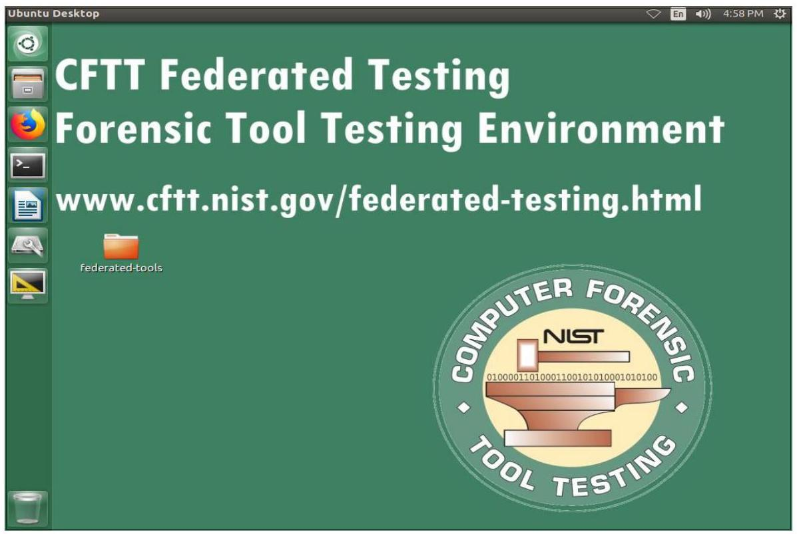

[^0]
[^0]:    87) 박정흠/James R. Lyle/BarBara Guttman, "NIST의 디지털 포랜식 도구 검증 체계 소개", 「정보 보호학회지」제26권 제5호 (한국정보보호학회, 2016) 58-59면.
    88) NIST, "Federated Testing Project", https://www.nist.gov/itl/ssd/software-quality-group/compute r-forensics-tool-testing-program-cftt/federated-testing (2020. 04. 09. 검색)

# 3. 휴대용 모바일 포랜식 도구 검증

가. 휴대용 모바일 포랜식 도구 검증항목 수립

지금까지 한국정보통신기술협회(TTA)와 NIST에서 제정한 디지털 포랜식 도구 의 검증 표준들에 관한 내용을 살펴보았다. 하지만 국내에는 아직 모바일 포랜식 도구 검증에 관한 표준이 제정되지 않았으며, NIST에서 제정한 모바일 포랜식 도 구의 요구사항도 본 연구에서 제안하는 휴대용 모바일 포랜식 도구에 그대로 적용 하기는 어렵다. 휴대용 모바일 포랜식 도구는 기존의 모바일 포랜식 도구와는 달리 데이터를 추출 - 이미징 하여 분석하는 것이 목적이 아니라 범죄현장에서 신속히 협 의를 파악하고, 혐의가 파악된 모바일 기기를 압수해 보존조치를 취하는 것을 목적 으로 하기 때문이다. 또한, 새로운 임의제출 확인서 작성 기능도 포함되어 있어 기 존에 제정되었던 표준을 그대로 적용하기에는 한계가 있다. 이러한 한계를 이유로, 본 연구에서는 NIST의 모바일 포랜식 도구 요구사항과 한국정보통신기술협회에서 제안한 디지털 증거 분석도구 검증(TTAK.KO-12.0112)을 참고하여 휴대용 모바일 포랜식 도구에 적합한 검증항목을 수립하고, 이에 대한 테스트를 진행하였다. [표 10] 은 휴대용 모바일 포랜식 도구의 테스트를 위해 수립한 일반적인 검증항목 목록으로, 기본적으로 만족해야 하는 요구사항을 포함한다. '참고항목' 열에는 TTA, NIST에서 참고한 부분을 표시하였다. [표 10] 휴대용 모바일 포랜식 도구의 일반적인 검증항목

|  구분 | 내용 | 참고항목  |
| --- | --- | --- |
|  A_01 | 휴대용 모바일 포랜식 도구에서 출력되는 데이
터의 변동 및 수정이 발생하지 않는다. | TTA의 GV_01
NIST의 MDT-CR-03  |

| A_02 | 휴대용 모바일 포렌식 도구에서 출력되는 데이 터의 변동 및 수정이 발생할 경우, 사용자에게 이를 알린다. | NIST의 MDT-CR-04 |
| :--: | :--: | :--: |
| A_03 | 휴대용 모바일 포렌식 도구에 모바일 기기 연 결이 제대로 이루어지지 않은 경우, 사용자에 게 이를 알린다. | NIST의 MDT-RO-05 |
| A_04 | 혐의 파악을 위한 데이터의 분석기능이 제공된다. | TTA의 GV_04 |
| A_05 | 동일한 환경과 입력에 대해서 동일한 분석 결 과를 출력한다. | TTA의 GV_05 |
| A_06 | 도구를 사용한 과정을 기록한다. | TTA의 GV_06 |
| A_07 | 도구를 사용하는데 발생한 오류 로그를 기록한다. | TTA의 GV_07 |
| A_08 | 제출자의 정보, 제출된 모바일 기기의 정보, 범 죄 발생시간 및 장소, 담당 경찰관 등의 정보가 정확히 기록된 임의제출 확인서가 작성된다. | 없음 |

[표 11]는 휴대용 모바일 포렌식 도구의 분석기능에 대한 검증항목으로, 몰래카메 라 범죄현장에서 휴대용 모바일 포렌식 도구가 탐색 $\cdot$ 분석해야 할 데이터와 관련한 내용을 포함한다.

[표 11] 휴대용 모바일 포랜식 도구의 분석기능 검증항목

|  구분 | 내용 | 참고항목  |
| --- | --- | --- |
|  B_01 | 휴대용 모바일 포랜식 도구는 모바일 기기의 내부 데이터들에 대한 시간 정보를 정확히 분 석한다. | TTA의 AFV_01  |
|  B_02 | 증거 데이터에 관한 해시값 생성이 가능하다. | TTA의 AFV_07  |
|  B_03 | 연결된 모바일 기기를 식별할 수 있는 고유의 정보를 제공한다. | NIST의 MDT-CA-01  |
|  B_04 | 모바일 기기의 멀티미디어 데이터(사진, 동영 상, 웹네일 등)를 분석하고, 출력하는 기능을 제공한다. | NIST의 MDT-CA-05  |
|  B_05 | 모바일 기기를 분석하여 데이터를 메신저나 클 라우드 등에 업로드, 은닉한 정황을 알 수 있 다. | TTA의 AFV_02
NIST의 MDT-CA-08  |
|  B_06 | 모바일 기기를 분석하여 카메라로 촬영한 정황을 알 수 있다. | TTA의 AFV_02  |

나. 수립한 검증항목에 대한 실험

- 검증항목 : A_01, A_04, A_05, B_02, B_04
- 검증내용 : 휴대용 모바일 포랜식 도구를 사용하여 특정 파일을 분석$\cdot$출력한 후, 도구를 사용하기 전과의 해시값 비교를 통해 특정 파일의 데이터가 변동됐는지 확인한다. 테스트 대상 파일명은 '20200421_170702.jpg'이며, 도구를 사용하기 전의 MD5 해시값은 '8d949e1adc5af59e4e6ceaccf98e5008'이다.

[그림 26] 도구 사용 전 특정 파일의 MD5 해시값

| rw-rw-1 root sdcard_rw 0888540 2020-03-18 11:50 VID 20200318 114956 mod rw-rw-1 root sdcard_rw 477767 2020-03-18 11:49 benuly 20200318114908 .jpg |  |
| :--: | :--: |
|  |  |
|  |  |
|  |  |
|  |  |
|  |  |
|  |  |
|  |  |
|  |  |
|  |  |
|  |  |
|  |  |
|  |  |
|  |  |
|  |  |
|  |  |
|  |  |
|  |  |
|  |  |
|  |  |
|  |  |
|  |  |
|  |  |
|  |  |
|  |  |
|  |  |
|  |  |
|  |  |
|  |  |
|  |  |
|  |  |
|  |  |
|  |  |
|  |  |
|  |  |
|  |  |
|  |  |
|  |  |
|  |  |
|  |  |
|  |  |


[그림 28] 도구 사용 후 특정 파일의 MD5 해시값 비교
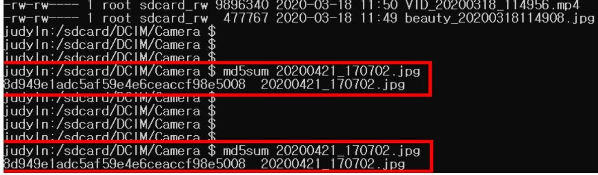

도구 사용 후, 앞서 수동으로 해시값을 확인했던 방식으로 '20200421_170702.jpg' 파일의 해시값을 확인하고, 비교한 결과 도구 사용 전과 동일했다. 또한, 동일한 모바 일 기기와 파일을 대상으로 수차례 더 분석을 수행한 결과도 앞선 결과와 변함이 없 었다. 이를 통해, 본 연구에서 제안하는 휴대용 모바일 포랜식 도구는 A_01, A_04, A _05, B_02, B_04의 검증항목을 만족한다는 것을 알 수 있었다.

- 검증항목 : B_01
- 검증내용 : 휴대용 모바일 포랜식 도구를 사용하여 특정 파일을 분석$\cdot$출력한 후, 도구에 출력된 시간 정보 값과 직접 확인한 시간 정보가 일치하는지 확인한다. 테 스트 대상 파일명은 '20200421_190515.jpg'이며, 직접 확인한 접근시간은 '2020-0421 19:05:15.240047491'이다.
[그림 29] 직접 확인한 시간 정보
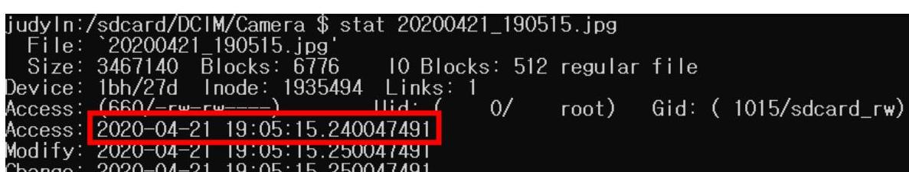

도구에서 출력되는 '20200421_190515.jpg'파일의 접근시간을 확인하면, 소수점 이하 의 수를 제외한 시간으로 '2020-04-21 19:05:15'임을 알 수 있다. 이를 통해 실제 파일 의 접근시간과 도구가 분석한 파일의 접근시간이 일치한다는 점을 알 수 있다. 본 연 구에서 제안하는 휴대용 모바일 포렌식 도구는 B_01 검증항목을 만족한다.
[그림 30] 도구를 사용하여 확인한 시간 정보


- 검증항목 : A_03
- 검증내용 : 본 연구에서 제안하는 휴대용 모바일 포렌식 도구는 연결된 모바일 기 기가 없을 경우 'No device found'의 경고창과 함께 'Please connect the device'라 는 문구의 경고 메시지를 생성하며, 모바일 기기를 연결할 것을 알린다.

- 검증항목 : A_06
- 검증내용 : 본 연구에서 제안하는 휴대용 모바일 포렌식 도구에는 화면 녹화 기능 이 있어, 모바일 기기를 분석하는 과정을 동영상으로 녹화하고, 저장할 수 있다. 동영상은 'avi' 파일 형태로 저장되고, 이 동영상을 통해 도구를 사용한 전 과정을 확인할 수 있다.
- 검증항목 : A_07
- 검증내용 : 본 연구에서 제안하는 휴대용 모바일 포렌식 도구는 사용 중 발생하는 오류를 기록한다. '날짜와 시간_Error_Log.txt' 파일 형태의 로그가 생성되며, 이를 통해 분석되지 않은 파일, 운영체제 오류 등을 확인할 수 있다.
- 검증항목 : A_08
- 검증내용 : 본 연구에서 제안하는 휴대용 모바일 포렌식 도구에는 임의제출 확인 서 작성 기능이 포함되어있다. 확인서에는 모바일 기기 제출자의 주민등록번호, 제출자 성명, 연락처, 분석하고자 하는 전자정보의 시간 범위(Start Time End Time), 범죄현장, 담당 경찰관의 직급과 성명, 제출자의 서명, 담당 경찰관의 서 명이 포함된다.
- 검증항목 : B_03
- 검증내용 : 본 연구에서 제안하는 휴대용 모바일 포렌식 도구는 연결된 모바일 기 기 고유의 시리얼 번호와 모델명을 출력한다. 이를 통해 연결된 모바일 기기를 식 별할 수 있다.

[그림 31] 연결된 안드로이드 모바일 기기 확인
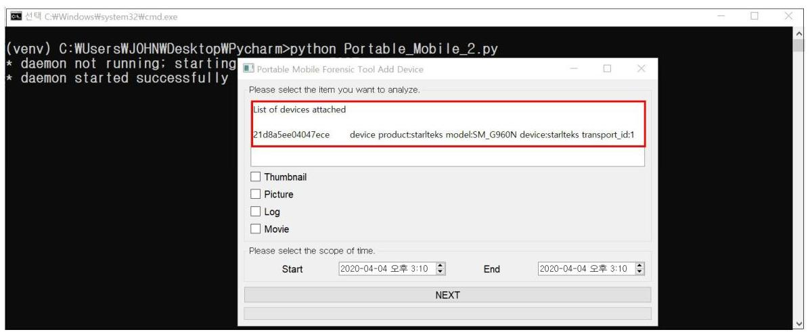

- 검증항목 : B_05, B_06
- 검증내용 : 본 연구에서 제안하는 휴대용 모바일 포랜식 도구는 선별 분석된 로그 데이터를 출력해주는 기능을 포함하고 있다. 선별된 로그에서는 카메라, 메신저, 클라우드, 안티포랜식 애플리케이션의 구동 흔적을 확인할 수 있다.
[표 12] 휴대용 모바일 포랜식 도구의 검증

| 구분 | 결과 |
| :--: | :--: |
| A_01 | 만족 |
| A_02 | 불만족 |
| A_03 | 만족 |
| A_04 | 만족 |
| A_05 | 만족 |
| A_06 | 만족 |
| A_07 | 만족 |
| A_08 | 만족 |

| B_01 | 만족 |
| :--: | :--: |
| B_02 | 만족 |
| B_03 | 만족 |
| B_04 | 만족 |
| B_05 | 만족 |
| B_06 | 만족 |

기존의 표준들을 토대로 수립한 휴대용 모바일 포렌식 도구의 검증항목과 그의 결과에 따르면, 대부분 검증항목에 만족한다. 하지만 불만족한 항목이 있고, 새로운 개념의 모바일 포렌식 도구와 검증항목의 제안인 만큼 향후 보완해야 할 점이 있다 고 여긴다. 이를 반영하여, 본 연구에서 제안하는 휴대용 모바일 포렌식 도구의 기능 들은 지속적인 연구를 통해 추가 및 개선할 것이며, 이와 더불어 검증항목과 실험도 견고히 할 것이다.

# 제3절 휴대용 모바일 포렌식 도구의 사용 절차 

모바일 기기는 컴퓨터와 다르게 휴대성, 편리성, 무선통신 연결 등의 다양한 특 정을 가지고 있다. 모바일 포렌식 절차는 기존 디지털 포렌식의 절차와 유사하지만, 모바일 기기의 특징으로 인해 세부적으로 다른 점이 존재한다. 본 제 3 장 제 3 절에서 는 국내외에서 제정된 기존의 모바일 포렌식 절차를 소개하며, 이를 참고하여 고안 한 ‘휴대용 모바일 포렌식 도구 사용 절차’를 제안한다.

1. 한국정보통신기술협회(TTA)의 모바일 포렌식 절차89)
[^0]
[^0]:    89) 한국정보통신기술협회, "이동 전화 포렌식 가이드라인", 2007. 12. 26.

우리나라는 모바일 포렌식 절차에 관한 공식 가이드라인이 존재하지 않으며, 모 바일 기기의 내용이 포함된 한국정보통신기술협회의 자료만 존재한다.90) 한국정보 통신기술협회는 2007년 12월에 제정된 '이동 전화 포렌식 가이드라인(표준번호 : T TAS.KO-12.0059)'에서 모바일 포렌식에 관한 절차를 제안하고 있다. 절차는 사전 준비, 초기대응, 증거수집, 모바일 기기 포장・운송・보관, 조사 및 분석, 보고서 작 성의 단계별 과정으로 구성되어 있다.
[표 13] 모바일 포렌식 절차의 단계별 과정

| 단계 | 내용 |
| :--: | :--: |
| 사전준비 | - 모바일 기기의 데이터를 수집하고, 분석하기 위한 제반사항에 대해 준비하는 단계이다. <br> - 데이터 수집 방법을 물리적 수집방법과 논리적 수집방법으로 나누어 설명한다. |
| 초기대응 | - 사건 현장을 보존하고, 모바일 기기에 관련한 정보를 기록하 여 차후에 있을 재현에 대비하는 단계이다. <br> - 모바일 기기를 입수하였을 때의 상태를 정상으로 켜져 있는 경우, 모바일 기기가 꺼져 있는 경우, 파손 또는 침수 등의 비정상 상태의 경우로 구분하여 설명한다. |
| 증거수집 | - 모바일 기기에의 데이터에 변조 없이, 디지털 증거를 추출하 는 단계이다. (모바일 기기와 외부와의 통신을 차단하여, 모 바일 기기의 변조를 예방) <br> - 물리적 수집방법 : 플래시메모리를 분리하여 직접 메모리 읽 |

90) 서승희/박진성/김역/이창훈, 앞의 논문, 12-13면.

|  | 음(Chip-Off), JTAG <br> - 논리적 수집방법 : 모바일 기기의 파일전송 프로토콜 사용하 여 직접 파일을 수집하는 방법, 소프트웨어를 이용하는 방법 <br> - 디지털 증거에 대해 모든 해시값을 저장하여 무결성 보장한다. |
| :--: | :--: |
| 모바일 기기 <br> 포장 $\cdot$ 운송 $\cdot$ <br> 보관 | - 모바일 기기를 압수한 담당자는 시간 정보와 서명을 통해 잘 차 연속성을 유지한다. <br> - 모바일 기기를 옮길 경우, 전자파가 차단되는 기능의 가방에 보관하여 옮긴다. <br> - 운반되는 중 모바일 기기의 배터리가 방전되지 않도록 조치한 다. |
| 조사 및 분석 | - 디지털 증거를 분석하고, 법정에 제출할 수 있도록 만드는 단 계이다. <br> - 수집한 증거를 복사하면서부터 시작한다. (논리적 복사와 물 리적 복사로 구분하여 설명) <br> - 사건과 직접적으로 관련 있는 디지털 증거를 추출한다. <br> - 포랜식 전문가는 가입자와 장치 ID, 날짜 $\cdot$ 시간 $\cdot$ 언어 $\cdot$ 설정 정보, 전화번호 목록, 스케줄, SMS, MMS, 이메일, 멀티미디 어(사진, 동영상, 오디오, 녹음 등), 통화기록, 메모, 위치 정보 등의 내용을 분석해야 한다. |
| 보고서 작성 | - 보고서는 조사자가 이해하기 쉬운 용어를 사용하여, 정확 - 간 결 $\cdot$ 논리 정연하게 작성한다. <br> - 보고서에 포함되어야 할 내용이 정리되어 있다. (예시 : 보고 서 번호, 조사자의 신분과 서명, 추출한 증거 내용 등) |

[그림 32] 모바일 포랜식 절차 (TTA의 이동 전화 포랜식 가이드라인)
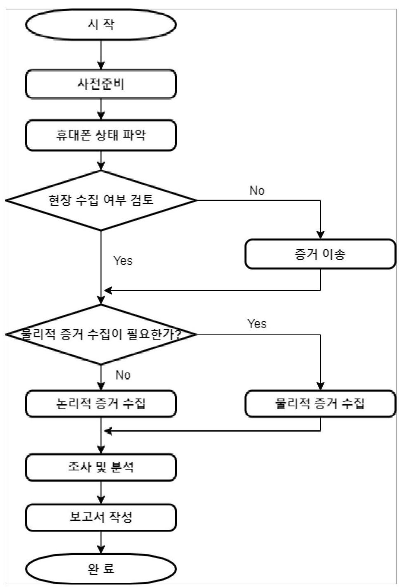

2. 미국표준기술연구소(NIST)의 모바일 포랜식 절차

해외의 모바일 포랜식 절차에 관한 자료는 다양하다. 그중 NIST의 'SP 800-101 Rev. 1 Guidelines on Mobile Device Forensics(이하 SP 800-101 Rev.1)'이 대표적이 다.91) SP 800-101 Rev.1는 모바일 포랜식 절차를 보존(Preservation), 획득(Acquisit ion), 검사 및 분석(Examination and Analysis), 보고서 작성(Reporting) 4단계로 나 누어 설명하고 있으며 모바일 기기의 특정 및 모바일 포랜식 도구 등에 관한 내용 도 기술하고 있다.92)
[표 14] 'SP 800-101 Rev.1'의 모바일 포랜식 절차

| 단계 | 내용 |
| :--: | :--: |
| 보존 <br> Preservation | 증거로서 보존의 대상이 되는 모바일 기기를 변조시키지 않고, 안 전하게 유지하는 과정이다. 증거보존에는 전자증거의 탐색, 인식, 수집 등의 초기 대응적인 과정이 포함된다. Preservation 장에서 는 현장 조사 $\cdot$ 보존, 현장 문서화, 고립(GPS, Wi-Fi, Bluetooth 등의 네트워크 차단), 증거 포장 $\cdot$ 운송 $\cdot$ 보관 등의 내용이 다뤄진 다. |
| 획득 <br> Acquisition | 이미징 혹은 다른 방식을 사용하여, 모바일 기기의 데이터를 수집 하는 단계를 의미한다. Acquisition 장에서는 모바일 기기 식별, 도구 선택 및 예상, GSM $\cdot$ iOS $\cdot$ Android 기기 획득 시 고려사항, UICC $\cdot$ 메모리 $\cdot$ 클라우드 데이터 획득 등의 내용을 다루고 있다. |

[^0]
[^0]:    91) NIST, "SP 800-101 Rev. 1 Guidelines on Mobile Device Forensics", https://csrc.nist.gov/publicati ons/detail/sp/800-101/rev-1/final (2020. 04. 10. 검색)
    92) 서승희/박진성/김역/이창훈, 앞의 논문, 12-13면.

|  조사와 분석
Examination
and Analysis | 모바일 포랜식 분석 도구를 사용하여, 수집한 모바일 기기를 분석 하고, 디지털 증거를 추출한다. Examination 과정은 은닉된 디지 털 증거를 찾아내는 과정으로, 결과에는 데이터의 내용과 상태를 상세히 기술한다. Analysis 과정은 Examination 결과를 사건에 대 한 유의성 및 가치성에 중점을 두어 살펴본다는 점에서 Examinat ion 과정과 다르다.  |
| --- | --- |
|  보고서 작성
Reporting | 모바일 포랜식을 수행한 전체 과정과 분석된 결과에 대해 보고서를 작성한 단계로, 수사의 모든 단계와 결론에 대해 상세한 요약을 포함한다. 도구에서 생성된 보고서에는 일반적으로 포랜식 전문가 이름, 사건 번호, 날짜 및 제목, 디지털 증거 범위 및 파일 등의 내용이 포함된다.  |

# 3. 휴대용 모바일 포랜식 도구의 사용 절차

본 연구에서 제안하는 휴대용 모바일 포랜식 도구의 사용 절차는 앞서 소개한 한국정보통신기술협회(TTA)와 NIST의 절차처럼 모바일 포랜식에 관련한 전반적 인 절차를 다룬 것이 아니며, 몰래카메라 범죄현장에서 도구를 사용하는데 필요한 과정을 중심으로 수립되었다. 본 절차는 한국정보통신기술협회(TTA)와 NIST에서 수립한 모바일 포랜식 절차, 경찰청 훈령 중 범죄수사규칙 제123조(임의 제출물의 압수 등)를 참조하여 구성하였다. 범죄수사규칙 제 123 조에는 임의제출에 관한 설명 과 더불어, 제출받을 문서, 작성할 문서, 교부해야 할 문서들의 내용이 포함되어있 다. ${ }^{(63)}$

[^0] [^0]: (63) 범죄수사규칙 제123조(임의제출물의 압수 등) (1) 경찰관은 소유자, 소지자 또는 보관자가 임의로 제출하는 물건은 영장 없이 압수할 수 있고, 주거주 또는 간수자가 임의로 승낙하는 경우에는 영장

휴대용 모바일 포랜식 도구의 사용 절차는 크게 (1) 모바일 기기 임의제출 동의, (2) 모바일 기기의 네트워크 차단, (3) 모바일 기기의 USB 연결 설정, (4) 휴대용 모 바일 포랜식 도구 실행, (5) 도구의 화면 녹화, (6) 임의제출 확인서 작성, (7) 모바일 기기 분석, (8) 몰래카메라 범죄혐의 파악으로 구성하였다. 만약 몰래카메라 범죄현 장에서 임의제출을 거부할 시에는 현행범인의 체포에 수반하는 압수·수색(형사소송 법 제216조 제 1 항 제 2 호)으로 진행할 수 있으며, 이때 영장 없이 압수·수색을 진행 하였기 때문에 사후 48 시간 내에 영장을 발부받아야 한다.
[그림 33] 휴대용 모바일 포랜식 도구의 사용 절차 단계
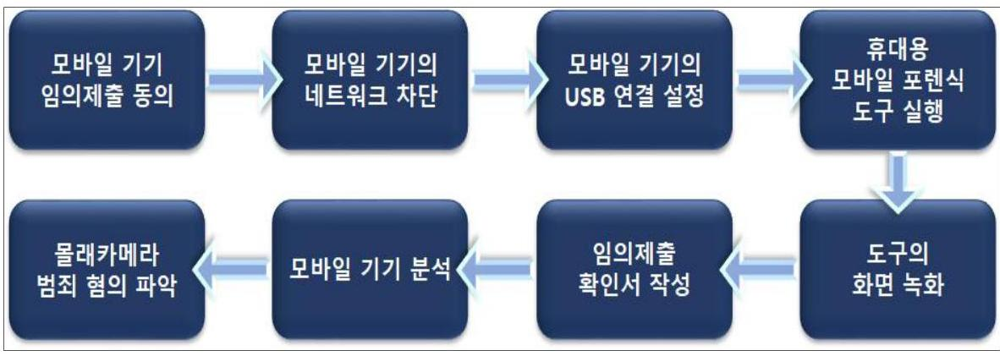

[^0]
[^0]:    없이 수색할 수 있다.
    (2) 경찰관은 소유자, 소지자 또는 보관자에게 임의 제출을 요구할 필요가 있을 때에는 사법경찰관 명 의로 별지 제78호 서식의 물건 제출 요청서를 발부할 수 있다.
    (3) 경찰관은 소유자, 소지자 또는 보관자가 임의 제출한 물건을 압수할 때에는 되도록 제출자에게 별 지 제75호 서식의 임의제출서를 제출하게 하고 별지 제79호 서식의 압수조서와 별지 제80호 서식 의 압수목록을 작성하여야 한다. 이 경우에는 제출자에게 별지 제76호 서식의 압수증명서를 교부하 여야 한다.
    (4) 경찰관은 임의 제출한 물건을 압수한 경우에 그 소유자가 그 물건의 소유권을 포기한다는 의사표 시를 하였을 때에는 전항의 임의제출서에 그 취지를 기재하거나 별지 제77호 서식의 소유권 포기 서를 제출하게 하여야 한다.

[표 15] 휴대용 모바일 포랜식 도구 사용 절차 설명

| 단계 | 내용 |
| :--: | :--: |
| 모바일 기기 <br> 임의제출 동의 <br> 모바일 기기의 네트워크 차단 | 몰래카메라 범죄현장에 도착한 담당 경찰관은 용의자에게 임 의제출에 관한 내용을 정확히 고지하고, 제출자의 임의성을 확보한 후 모바일 기기를 제출받는다. 제출받은 모바일 기기 는 변조되지 않도록 네트워크를 차단하고, 켜져 있는 모바일 기기를 종료하지 못하도록 조치한다. 켜져 있는 모바일 기기 가 종료되면 제안하는 도구가 수집하는 로그의 데이터가 삭제 될 수 있으므로 각별히 주의한다. |
| 모바일 기기의 USB 연결 설정 | 휴대용 모바일 포랜식 도구와 모바일 기기의 정상적인 USB 연결을 위해 모바일 기기의 설정 $\rightarrow$ 개발자 옵션 $\rightarrow$ USB 디 버깅을 허용으로 설정한다. |
| 휴대용 모바일 포랜식 도구 실행 <br> 도구 화면 녹화 | 모바일 기기를 연결하고, 도구를 실행한다. 메인화면에서 'Screen Record' 기능을 사용하여, 도구 화면을 녹화한다. 도 구 사용 시작과 동시에 녹화하여 적법하지 못한 도구 사용을 예방하고, 저장된 녹화물을 통해 사용과정을 증명할 수 있다. |
| 임의제출 확인서 작성 | 도구의 메인화면에서 'Agreement' 기능을 사용하여, 임의제출 확인서 작성 기능을 실행한다. 담당 경찰관은 임의제출 확인 서를 작성하면서 임의제출에 관한 압수절차 및 효과에 관한 내용을 제출자에게 정확히 고지하며, 제출자의 임의성 확보를 확실히 한다. |

| 모바일 기기 분석 | 임의제출 확인서 작성 후에 메인화면의 'Add Device' 기능을 사용하여, 모바일 기기를 분석한다. 모바일 기기에서 도구 점 근을 허용한다. 모바일 기기 분석 시에는 제출자가 동의한 데 이터 범위를 벗어나지 않도록 주의하며, 분석할 항목과 시간 범위를 설정한다. 분석이 완료되면, 제출자 참여하에 분석된 결과를 확인한다. |
| :--: | :--: |
| 몰래카메라 <br> 범죄혐의 파악 | 분석한 내용을 통해 몰래카메라 범죄혐의 혹은 범죄은닉 정황 등이 파악되면, 담당 경찰관은 현행범 체포와 동시에 임의 제 출받은 모바일 기기를 압수한다. 그리고 혐의에 부합하는 데 이터에 관한 전자정보 상세목록, 해시값 확인서, 압수증명서를 피압수자에게 교부한다. |

현장에서 범죄혐의가 확인되어 피압수자를 현행범으로 체포하면서, 모바일 기기에 대한 압수가 이루어진 후에는 경찰의 증거분석실에서 정밀분석이 이루어져야 한다. 현 장에서 반출한 모바일 기기의 정밀분석은 장비와 환경이 구비된 경찰서나 경찰청 분석 실에서 진행될 필요가 있다. 이에 따라 현행범 체포 시, 피압수자에게 모바일 기기에 대한 원본반출 확인서를 작성하여 교부한다. 이어서 정밀분석을 통해 선별압수가 진행 된 후에는 통상적인 디지털 증거에 대한 압수수색 과정에서처럼 전자정보 확인서, 전 자정보 상세목록, 압수증명서 등을 피압수자에게 교부한다. 만약 불법 촬영한 사진 혹 은 동영상 등이 저장된 모바일 기기를 피압수자에게 환부 조치할 경우 재유포될 위험 이 있기 때문에 피압수자에게 돌려주지 않고 수사기관이 계속해서 압수한다. 94)

[^0]
[^0]:    94) 경찰청, "디지털 증거 수집 및 처리 등에 관한 규칙 제 12 조(확인서 등)"<경찰청훈령 제845호>, 2017. 8. 28.
    (1) 수사관은 제 11 조제 1 항에 따라 디지털 데이터를 압수하는 경우에는 해시값을 확인한 후 별지 제

# 제4장 휴대용 모바일 포렌식 도구 활용방안 

## 제1절 시나리오별 모바일 기기 비교 실험

본 연구에서는 제작된 휴대용 모바일 포렌식 도구의 성능과 활용성을 확인하기 위하여 실험을 진행했다. 실험을 위해 임의의 시나리오를 수립하고 시나리오에서 예상되는 결과와 실제로 도구에서 출력되는 결과를 비교하는 방식으로 진행하였다. 시나리오는 몰래카메라 범죄현장에서 용의자가 모바일 기기를 조작할 수 있는 경우 들을 선정하여 수립하였으며, 실험에는 LG 사의 G7 ThinQ(LM-G710N)와 Samsun g 사의 Galaxy S9(SM-960N) 모바일 기기를 사용하였다.

1. 갤러리 내 몰래카메라 촬영물을 삭제하지 못한 경우

[^0]
[^0]:    1호서식의 전자정보 확인서를 작성하여야 한다.
    (2) 수사관은 제 11 조제 2 항에 따라 획득한 복제본을 반출하는 경우에는 해시값 확인 및 참여권 고지 후 별지 제 3 호서식의 복제본 반출(획득) 확인서를 작성하여야 한다. 이 경우 복제본 반출 이후 디 지털 데이터를 압수할 때에는 제 1 항을 따른다.
    (3) 수사관은 제 11 조제 3 항에 따라 디지털 저장매체 원본을 반출하는 경우에는 원본봉인 및 참여권 고지 후 별지 제 4 호서식의 원본반출 확인서 또는 별지 제 5 호서식의 원본반출 확인서(모바일 기기) 를 작성하여야 한다. 이 경우 원본반출 이후 디지털 데이터를 압수하는 때에는 제 1 항을, 복제본을 획득할 때에는 제 2 항을 각 따른다.
    (4) 제 3 항 후단 중 원본반출 이후 복제본을 획득하는 경우 피압수자등이 복제본 획득과정에 참여하 지 않거나 참여를 철회할 때에는 별지 제 3 호서식의 복제본 반출(획득) 확인서 작성을 생략할 수 있 다.
    (5) 수사관 또는 증거분석관은 제 11 조제 2 항 또는 제 11 조제 3 항에 따른 압수$\cdot$수색$\cdot$검증 과정에서 피압 수자등이 참여를 철회하는 경우에는 별지 제 6 호서식의 참여철회 확인서를 작성하도록 하여야 한다.
    (6) 수사관은 제 11 조제 3 항에 따라 반출한 디지털 저장매체 원본을 반환하는 경우에는 별지 제 7 호서 식의 반출 원본 저장매체 인수증을 작성하도록 하여야 한다.
    (7) 수사관은 제 11 조에 따라 디지털 데이터를 압수한 경우에 압수증명서 및 상세목록의 교부를 제 12 조제 1 항에 따라 작성한 별지 제 1 호서식의 전자정보 확인서 교부로 갈음할 수 있다.
    (8) 그 외 압수$\cdot$수색$\cdot$검증과 관련된 서류의 작성은 범죄수사규칙(경찰청훈령 제774호)의 규정을 준 용한다.

몰래카메라 범죄 발생 후, 사건 현장에 경찰관이 도착하기까지 현장 주변 사람 들의 제제로 용의자가 모바일 기기를 조작하지 못했다는 시나리오이다. 즉, 몰래카 메라 범죄 후 모바일 기기에 저장된 불법 촬영물을 삭제하지 못했다.
[표 16] 몰래카메라 범행 시나리오 1

| 날짜 및 시간 | 내용 |
| :--: | :--: |
| 2020년 04월 28일 14:34 | 용의자가 모바일 기기의 기본 카메라로 한 여성의 하체를 사진 촬영하였다. |
| 2020년 04월 28일 14:34 | 용의자는 모바일 기기의 사진을 갤러리에서 확인하였다. |
| 2020년 04월 28일 14:38 | 피해 여성은 몰래카메라 범죄로 경찰에 신고하였다. |
| 2020년 04월 28일 14:45 | 범죄현장의 주변 사람들이 용의자가 모바일 기기를 조작 할 수 없도록 제재하였다. |
| 2020년 04월 28일 14:50 | 범죄현장에 담당 경찰관이 도착했다. |

시나리오 1에 따르면 촬영시간 2020년 04월 28일 14:34을 포함하고, 용의자가 모 바일 기기를 조작할 수 없도록 제재 받은 2020년 04월 28일 14:45까지의 데이터를 분석해야 한다. 실험에서는 Start 시간을 2020년 04월 28일 14:30으로, End 시간을 2020년 04월 28일 14:45으로 시간 범위를 설정하였다. 디바이스 연결정보에서 'LM-

G710N' 모델명과 'LMG710N7519229b' 시리얼 번호를 확인할 수 있다.
[그림 34] 시나리오 1 의 분석 범위 설정
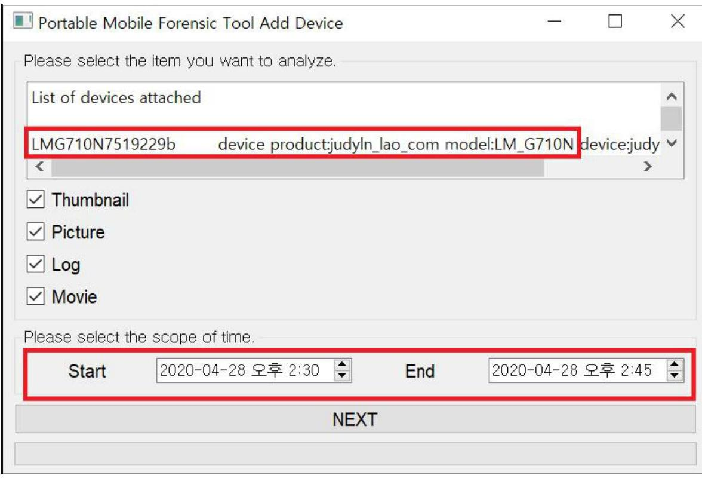

용의자는 모바일 기기의 기본 카메라로 촬영했다고 한다. 즉, 설정한 시간 범위 안의 로그 데이터에서 기본 카메라 애플리케이션의 구동 흔적이 남아있을 것을 예 상할 수 있다. 실험을 통해 LG 모바일 기기의 기본 카메라 애플리케이션 패키지 이 름인 'com.lge.camera'을 발견하였고, 설정한 시간 내에 카메라 앱이 구동되었다는 것을 확인했다.

[그림 35] 시나리오 1의 로그 데이터 분석
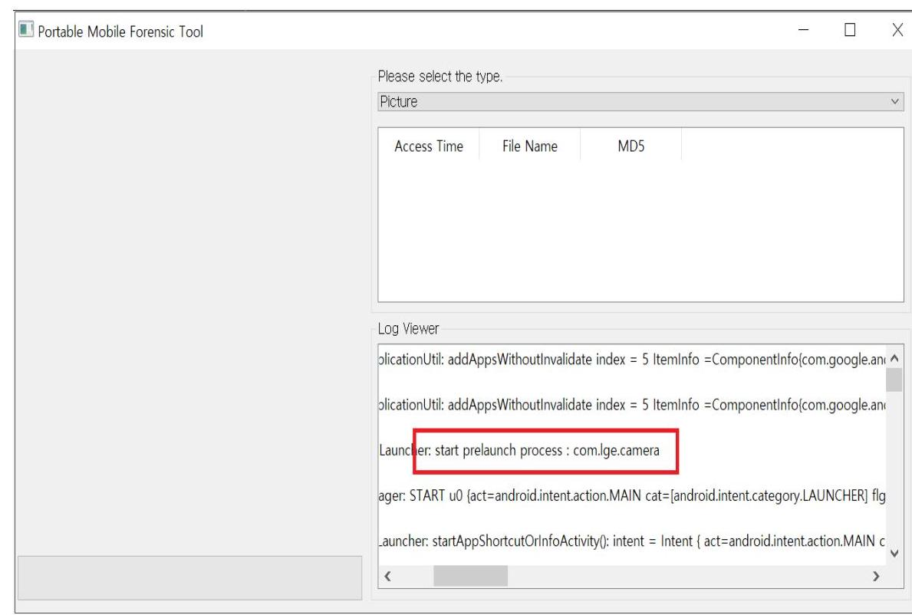

용의자는 모바일 기기로 사진을 촬영하고, 촬영물을 확인했다고 한다. 촬영물을 확인하기 위해서는 갤러리에 접근해야 하는데, 갤러리에 진입할 시 범네일이 생성 된다. 실험을 통해 2020년 04월 28일 14:34:32에 생성된 LG 모바일 기기의 imgcach e. 0 파일 속 범네일 데이터를 확인했다.

[그림 36] 시나리오 1의 범네일 데이터 분석
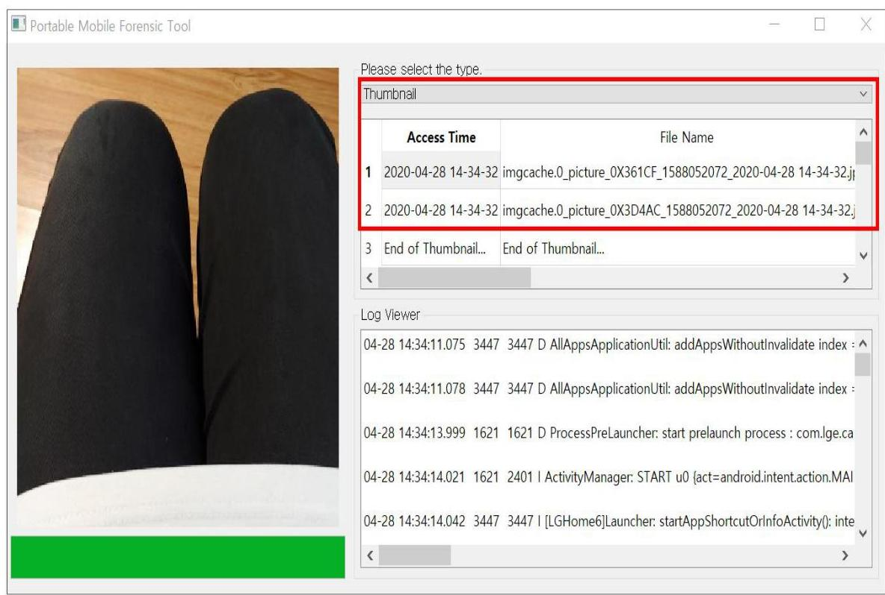

기본 카메라로 촬영한 사진 데이터는/sdcard/DCIM/Camera에 저장된다. 실험 결과에서는 2020년 04월 28일 14:34:32에 생성된 20200428_143432.jpg 파일을 확인 할 수 있었다.

[그림 37] 시나리오 1의 사진 데이터 분석
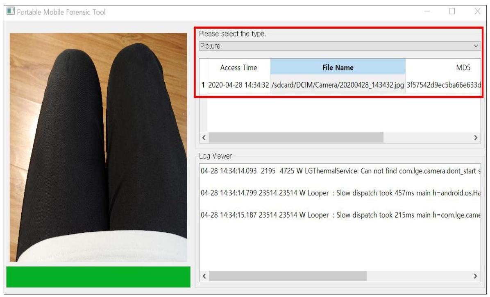
[표 17] 몰래카메라 범행 시나리오 1 분석 결과

| 항목 | 내용 |
| :--: | :--: |
| 시리얼 번호 <br> - 모델명 | 시리얼 번호 : LMG710N7519229b, 모델명 : LM-G710N |
| 로그 | com.lge.camera(LG 모바일 기기 기본 카메라 앱 패키지 이름) 구 동 흔적 |
| 썸네일 | 2020년 04월 28일 14:34:32에 생성된 LG 모바일 기기의 /sdcard /Android/data/com.android.gallery3d/cache/imgcache. 0 파일 속 썸네일 데이터 |
| 사진 | /sdcard/DCIM/Camera/20200428_143432.jpg 파일 |

2. 갤러리 내 몰래카메라 촬영물을 모두 삭제한 경우

몰래카메라 범죄 발생 후, 사건 현장에 경찰관이 도착하기까지 용의자가 모바일 기기의 갤러리 내에 저장된 데이터를 모두 삭제했다는 시나리오이다. 즉, 몰래카메 라 범죄 후 모바일 기기에 저장된 불법 촬영물을 삭제하였다.

[표 18] 몰래카메라 범행 시나리오 2

|  날짜 및 시간 | 내용  |
| --- | --- |
|  2020년 04월 28일 20:17 | 용의자가 모바일 기기의 SODA 애플리케이션으로 한 여 성의 하체를 사진 촬영하였다.  |
|  2020년 04월 28일 20:18 | 용의자는 범행을 의심받자 모바일 기기에 저장된 사진을 확인한 후, 갤러리에 저장된 데이터를 모두 삭제하였다.  |
|  2020년 04월 28일 20:21 | 피해 여성은 몰래카메라 범죄로 경찰에 신고하였다.  |
|  2020년 04월 28일 20:25 | 범죄현장에 담당 경찰관이 도착했다.  |

시나리오 2에 따르면 촬영시간 2020년 04월 28일 20:17을 포함하고, 담당 경찰관 이 현장에 도착하여, 용의자가 모바일 기기를 조작할 수 없게 된 2020년 04월 28일 2 0:25까지의 데이터를 분석해야 한다. 실험에서는 Start 시간을 2020년 04월 28일 20:1 5 으로, End 시간을 2020년 04월 28일 20:25으로 시간 범위를 설정하였다. 디바이스 연결정보에서 'SM-G960N' 모델명과 '21d8a5ee04047ece' 시리얼 번호를 확인할 수 있 다.

[그림 28] 시나리오 2의 분석 범위 설정
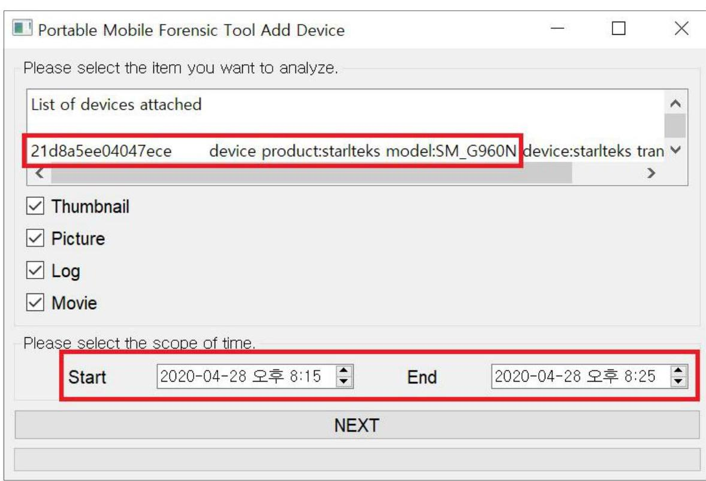

용의자는 SODA라는 카메라 애플리케이션으로 촬영했다고 한다. 이로써, 설정한 시간 범위 안의 로그 데이터에서 SODA 앱의 구동 흔적이 남아있음을 예상할 수 있다. 실험을 통해 SODA 애플리케이션 패키지 이름인 'com.snowcorp.soda.android' 을 발견하였다.

[그림 39] 시나리오 2의 로그 데이터 분석
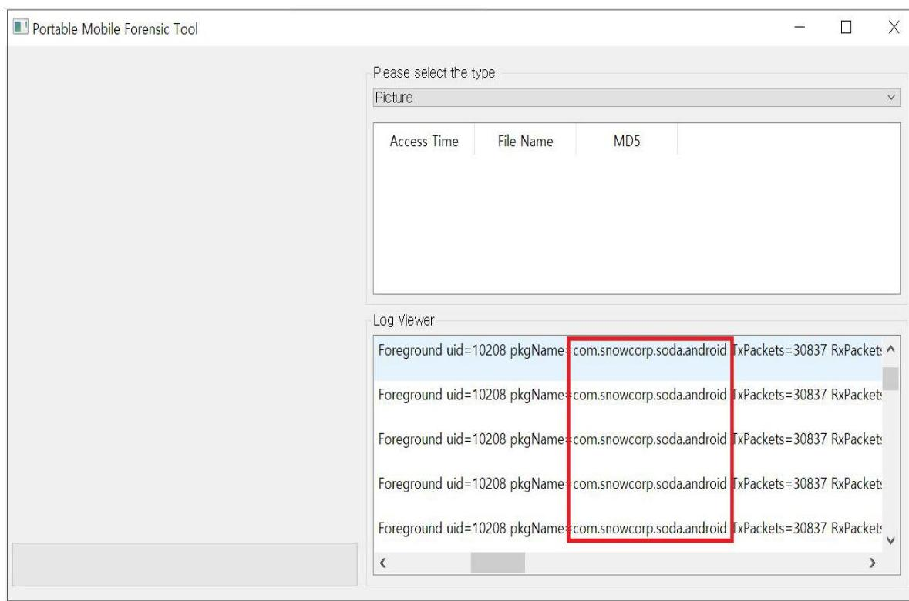

시나리오 2에 의하면, 용의자가 모바일 기기에 저장된 사진을 확인한 후, 갤러리 에 저장된 데이터를 삭제하였다고 한다. 모바일 기기의 갤러리에는 휴지통이라는 기능이 있어, 삭제한 사진이나 동영상 파일을 바로 삭제하지 않고, '/sdcard/Android /data/com.sec.android.gallery3d/files/.Trash' 경로에 임시로 저장한다. 즉, 데이터를 삭제하였더라도 휴지통 디렉터리에 데이터가 남아있을 가능성이 있다. 본 실험에서 는 휴지통 디렉터리에서 삭제되었던 '1440421539586445165' 파일을 발견하였다. '144 0421539586445165' 파일의 Access Time은 삭제되기 전 원본 파일의 Access Time 과 같다. 또한, 갤러리에 접근해서 생성된 썸네일 파일 ' 5474557483016189102.0' 파 일도 발견하였다. 즉, 갤러리의 데이터를 삭제하더라도 썸네일과 휴지통을 통해 삭 제된 데이터와 그 정황을 확인할 수 있다.

[그림 40] 시나리오 2의 썸네일 데이터 분석
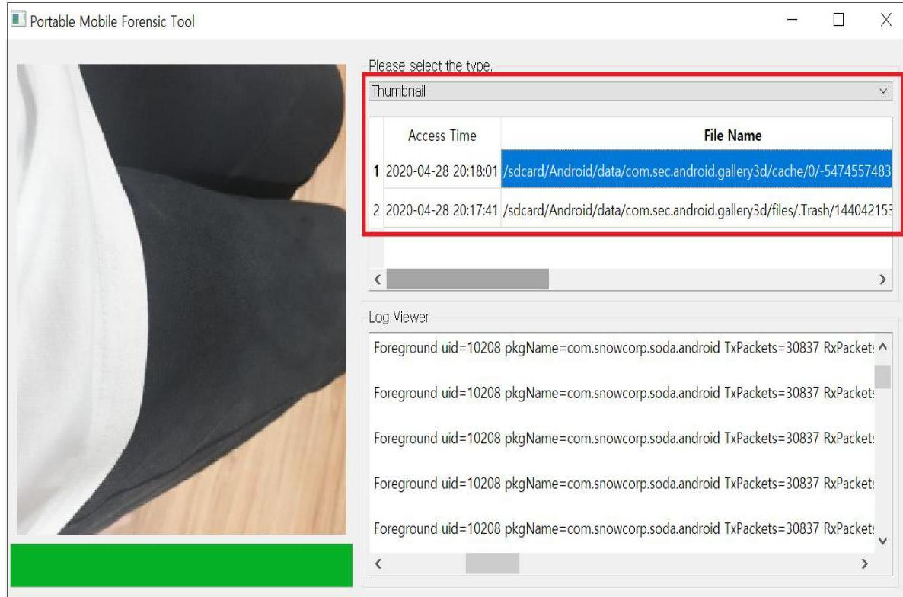
[표 19] 몰래카메라 범행 시나리오 2 분석 결과

| 항목 | 내용 |
| :--: | :-- |
| 시리얼 번호 <br> - 모델명 | 시리얼 번호 : 21d8a5ee04047ece, 모델명 : SM-G960N |
| 로그 | com.snowcorp.soda.android(SODA 앱 패키지 이름) 구동 흔적 |
| 썸네일 | 2020년 04월 28일 20:18:01에 생성된 /sdcard/Android/data/com. <br> sec.android.gallery3d/cache/0/-5474557483016189102.0 파일 |

| 휴지통 | /sdcard/Android/data/com.sec.android.gallery3d/files/.Trash/144 <br> 0421539586445165 파일 |
| :-- | :-- |

3. 몰래카메라 촬영물을 클라우드에 업로드 후 삭제한 경우

몰래카메라 범죄 발생 후, 사건 현장에 경찰관이 도착하기까지 용의자가 불법 촬영물을 클라우드에 업로드하고, 모바일 기기의 갤러리 내에 저장된 사진을 모두 삭제했다는 시나리오이다.
[표 20] 몰래카메라 범행 시나리오 3

| 날짜 및 시간 | 내용 |
| :--: | :--: |
| 2020년 04월 29일 10:12 | 용의자가 모바일 기기의 SNOW 앱으로 한 여성의 하체를 사진 촬영하였다. |
| 2020년 04월 29일 10:14 | 용의자는 범행을 의심받자 모바일 기기에 저장된 사진을 확인한 후, 용의자 본인 계정의 Naver Cloud에 사진을 업 로드하였다. |
| 2020년 04월 29일 10:14 | 업로드 후, 갤러리 내의 데이터와 휴지통 내의 데이터를 모두 삭제하였다. |
| 2020년 04월 29일 10:17 | 피해 여성은 몰래카메라 범죄로 경찰에 신고하였다. |
| 2020년 04월 29일 10:29 | 범죄현장에 담당 경찰관이 도착했다. |

시나리오 3에 따르면 촬영시간 2020년 04월 29일 10:12을 포함하고, 담당 경찰관 이 현장에 도착하여, 용의자가 모바일 기기를 조작할 수 없게 된 2020년 04월 29일 1 0:29까지의 데이터를 분석해야 한다. 실험에서는 Start 시간을 2020년 04월 29일 10:1 0으로, End 시간을 2020년 04월 29일 10:30으로 시간 범위를 설정하여 분석하였다. 용의자는 총 2 개의 애플리케이션을 사용하여, 몰래카메라 범죄를 저지르고 클라우 드에 업로드하여 은닉하려 했다. 본 실험에서는 촬영에 사용된 SNOW 앱의 패키지 이름 'com.campmobile.snow'과 클라우드 업로드에 사용된 Naver Cloud 앱의 패키 지 이름 'com.nhn.android.ndrive'을 시간 범위 내의 로그 데이터에서 확인하여, 애 플리케이션의 구동 흔적을 발견하였다.
[그림 41] 시나리오 3의 로그 데이터 분석 1
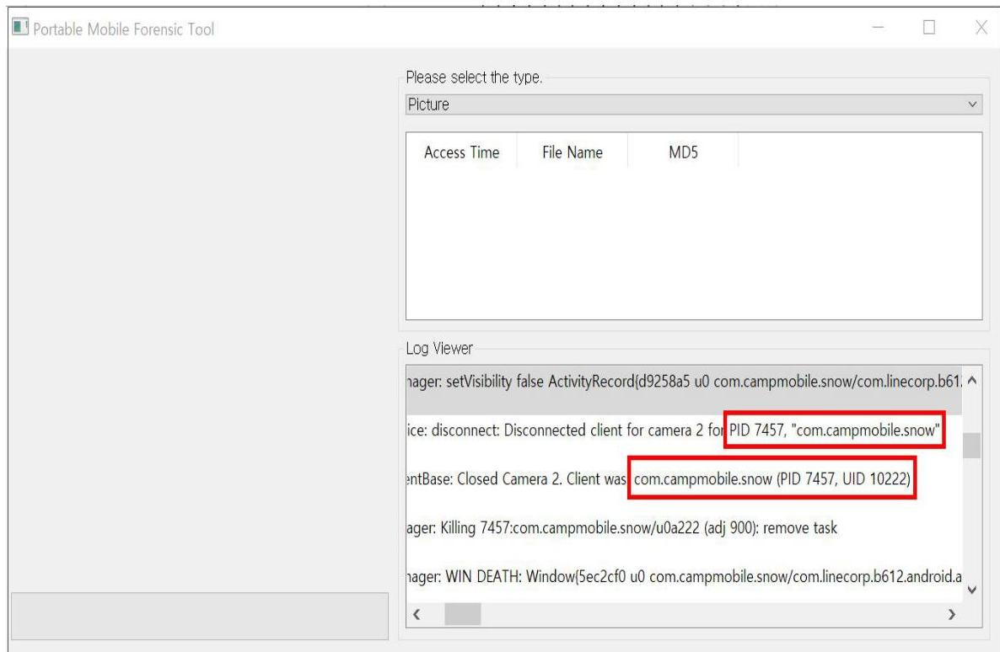

[그림 42] 시나리오 3의 로그 데이터 분석 2
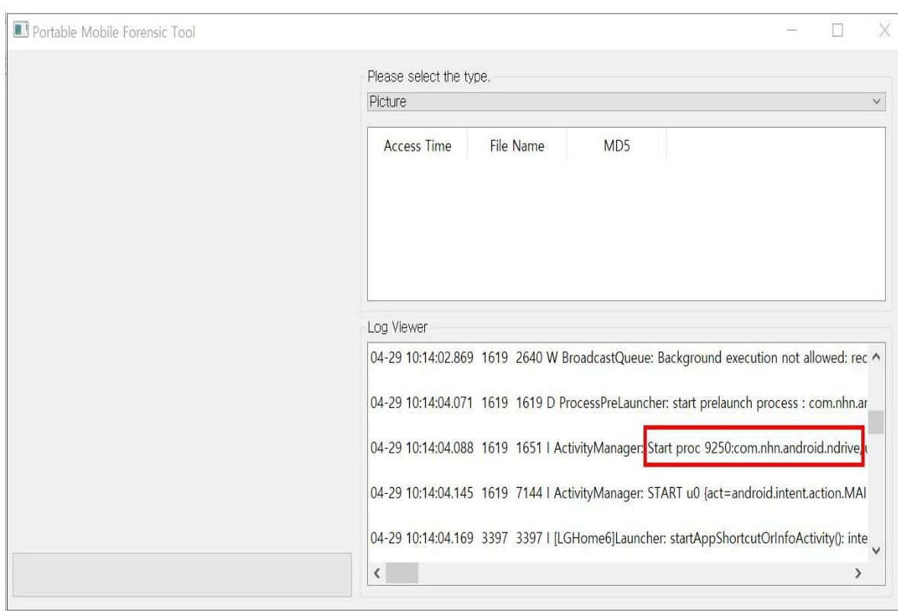

이어서 Naver Cloud에 업로드한 데이터의 범네일이 저장되는 '/sdcard/Android/ data/com.nhn.android.ndrive/cache/image_manager_disk_cache/' 경로와 갤러리에 접근할 때 생기는 범네일이 저장되는 'imgcache.0' 파일에서, 용의자가 Naver Cloud 에 업로드하고 삭제한 사진을 찾을 수 있었다. 본 시나리오에서는 용의자가 휴지통 의 데이터를 삭제하여, '/sdcard/Android/data/com.android.gallery3d/files/.trashcan' 경로에 저장된 삭제 데이터를 확인할 수 없었다.

[그림 43] 시나리오 3의 썸네일 데이터 분석
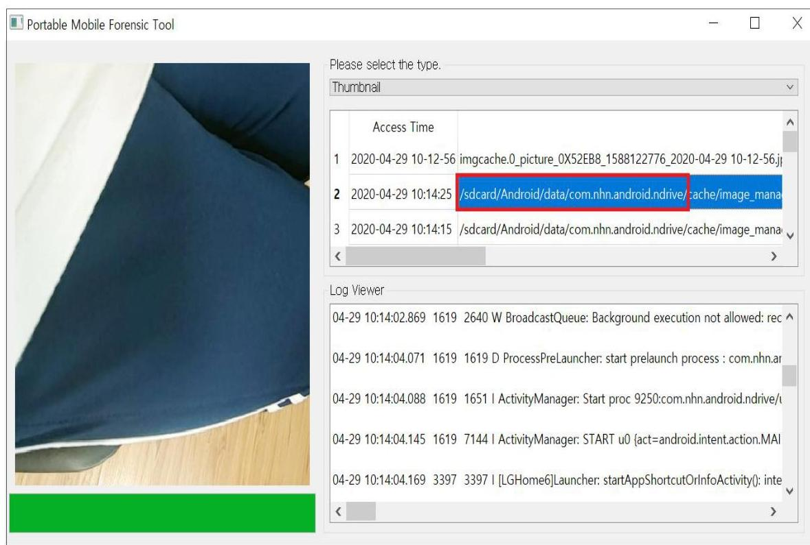
[표 21] 몰래카메라 범행 시나리오 3 분석 결과

| 항목 | 내용 |
| :--: | :--: |
| 시리얼 번호 <br> - 모델명 | 시리얼 번호 : LMG710N7519229b, 모델명 : LM-G710N |
| 로그 | com.campmobile.snow(SNOW 앱 패키지 이름) 구동 흔적 com.nhn.android.ndrive(Naver Cloud 앱 패키지 이름) 구동 흔적 |
| 썸네일 | 2020년 04월 29일 10:12:56에 생성된 LG 모바일 기기의 / sdcard /Android/data/com.android.gallery3d/cache/imgcache. 0 파일 속 썸네일 데이터 |

| 2020년 04월 29일 10:14:25에 생성된/sdcard/Android/data/com. nhn.android.ndrive/cache/image_manager_disk_cache/b58296ca9 227333d9d130957f705ca80db6d9f71e050145bbdc09babf3d54fa6.0 파일 2020년 04월 29일 10:14:15에 생성된/sdcard/Android/data/com. nhn.android.ndrive/cache/image_manager_disk_cache/e00d3b048 e6d96de09ae8043d3ba92d226851909894d7beab0e83bd94ca83c00.0 파일 | |
| --- | --- |
|  |

1. 몰래카메라 촬영물을 메신저에 전송 후 삭제한 경우

몰래카메라 범죄 발생 후, 사건 현장에 경찰관이 도착하기까지 용의자가 불법 촬영물을 메신저 애플리케이션으로 본인 계정의 채팅방에 전송하고, 모바일 기기의 갤러리 내에 저장된 사진을 모두 삭제했다는 시나리오이다. [표 22] 몰래카메라 범행 시나리오 4

| 날짜 및 시간 | 내용 |
| :--: | :--: |
| 2020년 04월 29일 21:27 | 용의자가 모바일 기기의 B612 앱으로 한 여성의 하체를 사진 촬영하였다. |
| 2020년 04월 29일 21:28 | 용의자는 범행을 의심받자 모바일 기기에 저장된 사진을 확인한 후, 용의자 본인 계정의 Telegram 채팅방에 사진 을 전송하였다. |

| 2020년 04월 29일 21:28 | 업로드 후, 갤러리 내의 데이터와 휴지통 내의 데이터를
모두 삭제하였다.  |
| --- | --- |
|  2020년 04월 29일 21:30 | 피해 여성은 몰래카메라 범죄로 경찰에 신고하였다.  |
|  2020년 04월 29일 21:39 | 범죄현장에 담당 경찰관이 도착했다.  |

시나리오 4에 따르면 촬영시간 2020년 04월 29일 21:27을 포함하고, 담당 경찰관 이 현장에 도착하여, 용의자가 모바일 기기를 조작할 수 없게 된 2020년 04월 29일 2 1:39까지의 데이터를 분석해야 한다. 실험에서는 Start 시간을 2020년 04월 29일 21:2 5 으로, End 시간을 2020년 04월 29일 21:40으로 시간 범위를 설정하여 분석하였다. 실험에 사용된 모바일 기기는 SM-G960N이다. 본 실험에서는 분석한 로그 데이터에 서 촬영에 사용된 B612 앱과 전송에 사용된 메신저 Telegram 앱의 구동 흔적을 찾 을 수 있었다. B612 앱의 패키지 이름은 'com.linecorp.b612.android'이며, Telegram 앱의 패키지 이름은 'org.telegram.messenger'이다.

[그림 44] 시나리오 4의 로그 데이터 분석 1
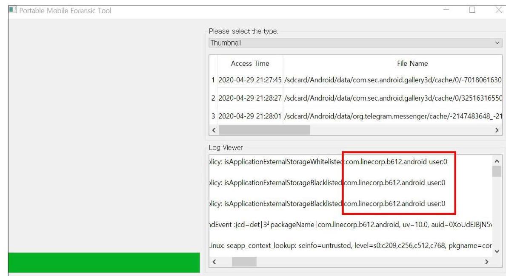
[그림 45] 시나리오 4의 로그 데이터 분석 2
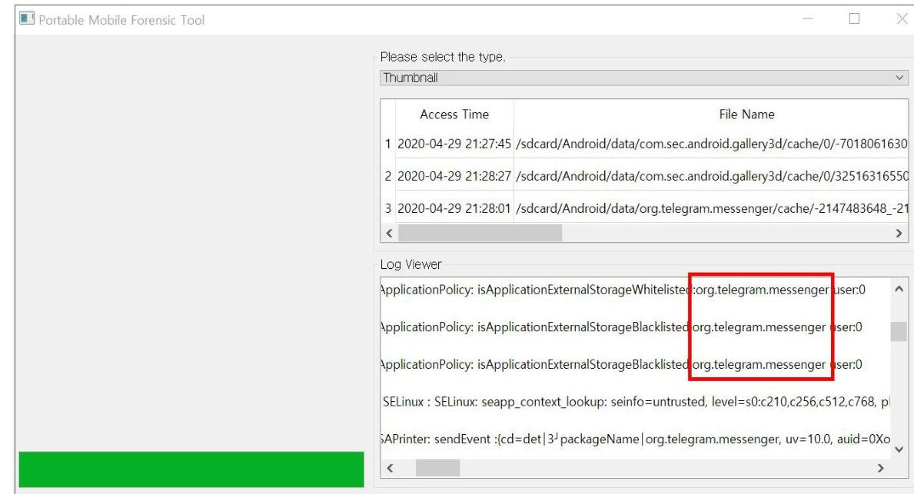

용의자는 몰래카메라 범행 후, 촬영한 사진을 Telegram 메신저 앱을 통해 본인 계정만이 존재하는 채팅방에 전송하였다. [그림 46]을 통해 용의자가 채팅방에 전송했 던 사진과 전송시각 오후 9:28을 확인할 수 있다.
[그림 46] Telegram에 전송된 사진
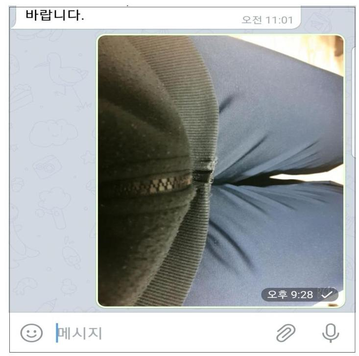

분석을 통해 Telegram 채팅방에 전송하여 생성된 썸네일을 발견하였다. 저장된 경로는 '/sdcard/Android/data/org.telegram.messenger/cache'였다. 갤러리에 접근할 때 생기는 썸네일 파일도 2 개 발견했는데, LG 모바일 기기와는 달리 '/sdcard/Andr oid/data/com.sec.android.gallery3d/cache' 경로에 개별파일로 저장되어 있었다. 휴지 통의 데이터는 삭제되어 파일을 확인할 수 없었다.

[그림 47] 시나리오 4의 썸네일 데이터 분석
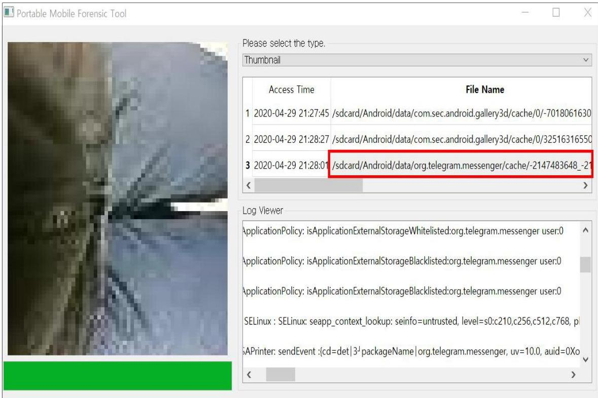
[표 23] 몰래카메라 범행 시나리오 4 분석 결과

| 항목 | 내용 |
| :--: | :--: |
| 시리얼 번호 <br> - 모델명 | 시리얼 번호 : 21d8a5ee04047ece, 모델명 : SM-G960N |
| 로그 | com.linecorp.b612.android(B612 앱 패키지 이름) 구동 흔적 org.telegram.messenger(Telegram 앱 패키지 이름) 구동 흔적 |
| 썸네일 | 2020년 04월 29일 21:27:45에 생성된 /sdcard/Android/data/com. sec.android.gallery3d/cache/0/-7018061630950327576.0 파일 |

2020년 04월 29일 21:28:27에 생성된/sdcard/Android/data/com. sec.android.gallery3d/cache/0/3251631655033298189.0 파일

2020년 04월 29일 21:28:01에 생성된/sdcard/Android/data/org.t elegram.messenger/cache/ 2147483648_210016.jpg 파일

# 제2절 몰래카메라 범죄 관련 디지털 증거의 증거능력 확보 

앞선 내용에서 휴대용 모바일 포랜식 도구의 필요성, 도구에서 분석하는 데이터 와 기능, 도구의 검증과 사용 절차, 도구 실험 등을 다루었다. 하지만, 도구를 사용 하여 도출된 모든 결과가 무조건 디지털 증거로 인정되는 것이 아니다. 도출된 결 과가 증거능력을 인정받기 위해서는 고려해야 할 조건들이 있기 때문이다. 먼저 형 사소송법 제308조의2(위법수집증거의 배제)에 근거하여,95) 증거수집에 있어서 절차 적 위법이 없어야 한다. 이외에도 디지털 증거의 진정성 입증, 디지털 증거가 전문 증거 혹은 전문법칙의 예외규정에 해당되는지의 여부, 피압수자의 참여권 보장 등 이 고려되어야 한다. 96 )

1. 적법절차

형사소송법 제199조 제 1 항은 "수사에 관하여는 그 목적을 달성하기 위하여 필요

[^0]
[^0]:    95) 형사소송법 제308조의2(위법수집증거의 배제) 적법한 절차에 따르지 아니하고 수집한 증거는 증거 로 할 수 없다.
    96) 한대일, "전자적 증거의 진정성 입증에 관한 연구", 성균관대학교 박사학위논문, 2014., 126면.

한 조사를 할 수 있다. 다만, 강제처분은 이 법률에 특별한 규정이 있는 경우에 한 하며, 필요한 최소한도의 범위 안에서만 하여야 한다."라고 규정하고, 제215조 제1 항에서는 "검사는 범죄수사에 필요한 때에는 피의자가 죄를 범하였다고 의심할 만 한 정황이 있고 해당 사건과 관계가 있다고 인정할 수 있는 것에 한정하여 지방법 원판사에게 청구하여 발부받은 영장에 의하여 압수, 수색 또는 검증을 할 수 있다." 라고 규정하고 있다. 즉, 피압수자가 소지한 디지털 저장매체에 대해서 디지털 포렌 식을 수행할 시 법원에서 발부한 영장에 근거하여 형사소송법 제106조 제3항97)에 따라 압수물에 기억된 정보의 범위를 정하여 관련 정보만을 선별 압수 - 수색해야 한다.98) 또한, 형사소송법 제216조와 제217조에 따라 영장에 의하지 않은 강제처분 이 이루어질 경우에는 48 시간 이내에 압수물에 대해 사후영장을 지체 없이 청구해 야 하며, 형사소송법 제218조에 따라 압수물의 소유자 또는 보관자가 임의로 제출 한 물건에 대해서는 영장 없이 압수할 수 있다.

2007년 개정된 형사소송법 제308조의2에서는 위법하게 수집된 증거의 증거능력 을 배제하겠다는 '위법수집증거배체법칙'을 규정하고 있다. 즉, 디지털 증거의 압수 - 수색 - 검증에서 적법한 절차가 이루어져야만 증거능력을 인정받을 수 있다.99) 이 런 적법절차의 중요함은 이미 제2장 제3절의 의정부지방법원 2018 ㅇ2757 판결과 의 정부지방법원 2018 ㅇ3609 판결, 제4절의 서울서부지법 2016고단2563 판결들을 통하 여 익히 보았다. 이 세 판례는 몰래카메라 범죄현장에서 수집한 모바일 기기가 임 의제출 받은 물건이라도, 현행범인 체포에 따른 체포현장에서의 압수 - 수색 - 검증 으로 압수한 모바일 기기로 보았으며, 압수한 모바일 기기에 대해 48 시간 이내에

[^0]
[^0]:    97) 형사소송법 제106조(압수) (3) 법원은 압수의 목적물이 컴퓨터용디스크, 그 밖에 이와 비슷한 정보 저장매체(이하 이 항에서 "정보저장매체등"이라 한다)인 경우에는 기억된 정보의 범위를 정하여 출 력하거나 복제하여 제출받아야 한다. 다만, 범위를 정하여 출력 또는 복제하는 방법이 불가능하기 나 압수의 목적을 달성하기에 현저히 곤란하다고 인정되는 때에는 정보저장매체등을 압수할 수 있 다.
    98) 강구민/천성덕/김무석, 「디지털포렌식」, 안북스, 2020, 59면.
    99) 한대일, 앞의 논문, 126 면.

사후영장이 청구되지 않은 것이 위법하다고 판단하였다. 또한, 2018 2757 관결과 2018 3609 관결의 경우에는 제출자의 임의성을 증명하지 못한 점을 근거로 영장 없이 압수할 수 있는 임의제출물의 압수로 보지 않으며 증거능력을 인정하지 않았 다. 이를 통해 사전영장을 청구하는 것이 어려운 몰래카메라 범죄 특성상 생길 수 있는 절차의 위법함과 그에 따른 증거능력의 부정을 살펴볼 수 있다. 대법원 2007 도3061 관결에서는 수사기관의 절차위반행위가 적법절차의 실질적인 내용을 침해하 는 경우에 증거능력배제를 인정한다고 판시하고 있다. ${ }^{100)}$ 기존 학설과 법규정으로 는 적법절차의 실질적 내용에 대해 알 수 없지만, 법원이 형사소송법 제308조의2 적용여부를 적법절차의 실질적 내용을 기준으로 법관이 판단할 문제로 해석하고 있 으므로, 적법절차의 실질적 내용의 위반 여부는 모든 사정을 종합적으로 살펴보고 판단되어야 할 것이다. ${ }^{101)}$
2. 디지털 증거의 진정성

디지털 증거의 증거능력이 인정되기 위해서는 진정성이 입증되어야 한다. 디지 털 증거의 진정성에는 (1) 동일성이 인정되고 모든 과정에서 인위적인 조작이 없어 야 한다는 무결성과 동일성 (2) 디지털 증거를 압수 - 수색 - 검증하는 경우에 있어 분석한 감정인 혹은 분석관이 전문적인 지식 - 기술 - 경험을 가져야 한다는 전문성 (3) 디지털 포렌식에 사용된 도구 등이 오류의 가능성이 전혀 없거나 무시할 정도의 극소여야 한다는 도구에 대한 신뢰성과 정확성이 포함된다. ${ }^{102)}$

[^0]
[^0]:    100) 대법원 2007. 11. 15. 선고 2007도3061 판결
    101) 강구민/천성덕/김무석, 「디지털포렌식」, 안북스, 2020, 61면.
    102) 강구민, "대공사건에 있어 전자적 증거의 증거능력", 「형사소송 이론과 실무」제8권 제2호 (한국 형사소송법학회, 2016) $159-160$ 면.

# 가. 무결성・동일성 

디지털 포랜식이 알려지면서 수사기관의 압수・수색 진행 중 수사관이 디지털 저장매체를 열어보지 못하도록 암호화를 하거나 훼손시키는 경우가 빈번히 발생한 다. 형사소송상에서 디지털 증거의 증거능력을 인정받기 위해서는 행위자에 의한 원본 생성에서부터 수사과정에서의 수집 및 분석을 거쳐 법정에 증거로 제출하기까 지 디지털 증거의 무결성이 훼손되지 않도록 주의해야 한다. ${ }^{103)}$ 디지털 증거의 진 정성 입증을 위한 요건이 처음 제시된 소위 '일심회 사건' 관례가 있다. 관례에는 무결성의 담보와 무결성을 입증할 수 있는 방법에 관한 내용이 포함되어 있다. ${ }^{104)}$
'일심회 사건'의 관례에 의하면 디지털 저장매체 원본에 저장된 내용과 출력된 문건의 동일성이 인정(동일성)되어야 하고, 이를 위해 디지털 저장매체 원본이 압수 된 이후 문건 출력에 이르기까지 변경되지 않았을 담보(무결성)되어야 한다고 판시 하였다. 또한, 관례에서는 (1) 피고인들 입회하에 서명무인을 받아 봉인상태 확인, 봉인해제, 재봉인을 한 사실 (2) 전 과정을 녹화한 사실 (3) 피고인들 입회하에 봉인 을 풀고 이미징 작업을 하였는데, 이미징 작업을 통해 생성된 과일의 해시(Hash)값 과 디지털 저장매체 원본의 해시값이 동일한 사실 (4) 피고인들, 검사, 변호인이 모 두 참여한 가운데 검증을 실시하여 이미징 작업을 통해 생성된 과일의 내용과 출력

[^0]
[^0]:    103) 서기민, 장기식, 김기범, "디지털 증거의 무결성 : 모든 디지털 증거의 무결성을 입증할 수 있는 가?", 「디지털포랜식연구」제7호 (한국디지털포랜식학회, 2010) 2-5면.
    104) 대법원 2007. 12. 13. 선고 2007도7257 판결(이른바 '일심회 사건'에서 대법원은 디지털 증거의 진 정성 입증 요건으로 "압수물인 디지털 저장매체로부터 출력된 문건이 증거로 사용되기 위해서는 디지털 저장매체 원본에 저장된 내용과 출력된 문건의 동일성이 인정되어야 할 것인데, 그 동일성 을 인정하기 위해서는 디지털 저장매체 원본이 압수된 이후 문건 출력에 이르기까지 변경되지 않 았음이 담보되어야 하고 특히 디지털 저장매체 원본에 변화가 일어나는 것을 방지하기 위해 디지 털 저장매체 원본을 대신하여 디지털 저장매체에 저장된 자료를 '하드카피'・'이미징'한 매체로부터 문건이 출력된 경우에는 디지털 저장매체 원본과 '하드카피'・'이미징'한 매체 사이에 자료의 동일 성도 인정되어야 한다. 나아가 법원 감정을 통해 디지털 저장매체 원본 혹은 '하드카피'・'이미징'한 매체에 저장된 내용과 출력된 문건의 동일성을 확인하는 과정에서 이용된 컴퓨터의 기계적 정확성, 프로그램의 신뢰성, 입력 $\cdot$ 처리 $\cdot$ 출력의 각 단계에서 조작자의 전문적인 기술능력과 정확성이 담보 되어야 한다."라고 판시한 바 있다.)

된 문건에 기재된 내용이 동일함을 확인 사실들을 통해 디지털 증거의 동일성과 무 결성을 인정하며, 동일성과 무결성을 입증할 수 있는 구체적인 방법까지 제시하였 다. 105)

이외에도 포렌식 전문가의 입회 등을 통한 보관의 연속성 담보, 증거 조작 가능 성이 없음을 증명하는 방식으로 디지털 증거의 무결성과 동일성을 증명할 수도 있 다.106) 지금까지의 내용을 통해 몰래카메라 범죄현장에서 범죄혐의를 파악하는 것 에서 그치는 것이 아니라 범죄에 사용된 모바일 기기를 압수한 후, 정밀분석하여 법정에 증거로써 제출되기까지 동일성과 무결성을 훼손하지 않도록 조심해야 함을 알 수 있다.

본 논문의 제 3 장 제 2 절에서는 이미 휴대용 모바일 포렌식 도구를 사용하여 분석 한 모바일 기기의 데이터의 무결성이 훼손되지 않는 점을 확인하였다. 도구를 사용하 기 전과 사용 후의 해시값을 비교하여 특정 파일의 데이터가 변동됐는지 수차례 확 인하였는데, 파일의 해시값에는 변화가 없었다.

하지만 본 논문에서 언급한 휴대용 모바일 포렌식 도구의 기술적인 기능만으로 모바일 기기 자체의 해시값 비교를 통한 무결성 - 동일성을 입증하는 데에는 한계가 있다. 이에 따라 범죄현장에서 휴대용 모바일 포렌식 도구를 사용하는 전체 과정의 녹화, 절차에 참여한 수사관이나 전문가의 무결성 - 동일성 입증에 관한 증언 등의 절 차적 보완이 수반되어야 할 것이다. 실제로 소위 '왕재산 사건'의 판례에서 정보저장 매체 원본과 이미징 한 매체의 해시값 비교 외에도 무결성 - 동일성을 입증할 수 있 는 방법들을 제시하며,107) 법관이 디지털 증거의 진정성을 인정함에 있어 여러 가지

[^0]
[^0]:    105) 김경태/이규민/강구민, 앞의 논문, 78면.
    106) 강구민/천성덕/김무석, 「디지털포렌식」, 안북스, 2020, 65면.
    107) 대법원 2013. 07. 26. 선고 2013도2511 판결(이른바 '왕재산 사건'에서 대법원은 디지털 증거의 무 결성 - 동일성 입증 방법으로 "압수물인 컴퓨터용 디스크 그 밖에 이와 비슷한 정보저장매체(이하 '정보저장매체'라고만 한다.)에 입력하여 기억된 문자정보 또는 그 출력물(이하 '출력 문건'이라 한 다)을 증거로 사용하기 위해서는 정보저장매체 원본에 저장된 내용과 출력 문건의 동일성이 인정 되어야 하고, 이를 위해서는 정보저장매체 원본이 압수 시부터 문건 출력 시까지 변경되지 않았다 는 사정, 즉 무결성이 담보되어야 한다. 특히 정보저장매체 원본을 대신하여 저장매체에 저장된 자

방법을 선택할 수 있는 것을 보여준다. 108)

# 나. 정확성・신뢰성 

'일심회 사건'의 판례에서는 "법원 감정을 통해 디지털 저장매체 원본 혹은 '하드 카피'・'이미징'한 매체에 저장된 내용과 출력된 문건의 동일성을 확인하는 과정에 서 이용된 컴퓨터의 기계적 정확성, 프로그램의 신뢰성, 입력 - 처리 - 출력의 각 단 계에서 조작자의 전문적인 기술능력과 정확성이 담보되어야 한다."라고 판시하며, 디 지털 증거를 수집하고 분석하는데 사용된 도구의 신뢰성과 조작자의 전문성 확보도 명시하고 있다. 도구의 신뢰성을 검증하기 위해서는 중립적이고 객관적인 기관에서 다양한 평가방법과 환경에서 포랜식 도구의 검증을 수행해야 할 것이다. 실제로 도 구 검증을 수행하고 인증해주는 기관으로 제 3 장 제 2 절에서 언급했던 미국표준기술 연구소(NIST)가 대표적이다. NIST의 CFTT에서는 디지털 포랜식에 사용되는 도구 들을 테스트하기 위한 방법론을 확립하고, 테스트한 결과를 제공하고 있다. ${ }^{109)}$ 우리 나라에는 NIST와 같이 디지털 포랜식 도구를 검증해주는 기관 혹은 프로젝트가 존 재하지 않는다. 날로 발전하는 디지털 포랜식 기술과 도구에 발맞춰 이를 검증할

[^0]
[^0]:    료를 '하드카피' 또는 '이미징'한 매체로부터 출력한 문건의 경우에는 정보저장매체 원본과 '하드카 피' 또는 '이미징'한 매체 사이에 자료의 동일성도 인정되어야 할 뿐만 아니라, 이를 확인하는 과정 에서 이용한 컴퓨터의 기계적 정확성, 프로그램의 신뢰성, 입력-처리-출력의 각 단계에서 조작자의 전문적인 기술능력과 정확성이 담보되어야 한다. 이 경우 출력 문건과 정보저장매체에 저장된 자료 가 동일하고 정보저장매체 원본이 문건 출력 시까지 변경되지 않았다는 점은, 피압수$\cdot$수색 당사자 가 정보저장매체 원본과 '하드카피' 또는 '이미징'한 매체의 해쉬(Hash) 값이 동일하다는 취지로 서 명한 확인서면을 교루받아 법원에 제출하는 방법에 의하여 증명하는 것이 원칙이나, 그와 같은 방 법에 의한 증명이 불가능하거나 현저히 곤란한 경우에는, 정보저장매체 원본에 대한 압수, 봉인, 봉 인해제, '하드카피' 또는 '이미징' 등 일련의 절차에 참여한 수사관이나 전문가 등의 증언에 의해 정 보저장매체 원본과 '하드카피' 또는 '이미징'한 매체 사이의 해쉬 값이 동일하다거나 정보저장매체 원본이 최초 압수 시부터 밀봉되어 증거 제출 시까지 전혀 변경되지 않았다는 등의 사정을 증명하 는 방법 또는 법원이 그 원본에 저장된 자료와 증거로 제출된 출력 문건을 대조하는 방법 등으로 도 그와 같은 무결성$\cdot$동일성을 인정할 수 있으며, 반드시 압수$\cdot$수색 과정을 촬영한 영상녹화물 제 생 등의 방법으로만 증명하여야 한다고 볼 것은 아니다."라고 판시한 바 있다.)
    108) 노명선/백명훈, 「디지털포랜식」, 고시계사, 2018, 48면.
    109) 한대일, 앞의 논문, 169-170면.

수 있는 기관과 시스템을 구축해야 할 것이다.

[그림 48] CFTT 프로젝트에서 제공하는 모바일 포랜식 도구 테스트 결과

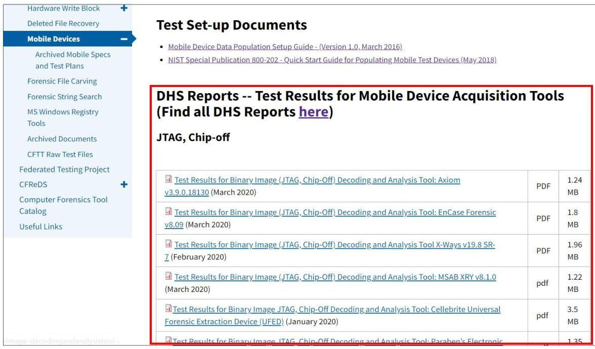

### 110) 대법원 2007. 12. 13. 선고 2007도7257 판결

111) 노명선/백명훈, 앞의 단행본, 44면.

리적일 것이다. 국내에는 사단법인 한국포랜식학회에서 2012년부터 국가공인 민간 자격으로 인정받아 운영 중인 '디지털 포랜식 전문가' 자격제도가 있으며, 112) 이외에 도 Opentext사의 Encase 프로그램을 사용하여 시험을 치러 컴퓨터 포랜식 숙달도 를 확인하는 자격제도인 Encase Certified Examiner(EnCE) ${ }^{113}$ 과 AccessData사의 F orensic Toolkit 프로그램들의 숙달도를 확인하는 자격제도인 AccessData Certified Examiner(ACE) ${ }^{114}$ 등이 있다.
[그림 49] 한국포랜식학회 '디지털 포랜식 전문가' 자격제도

| 디지털포랜식자격검정시험 | 시험안내 | 시험점수 | 합격확인 | 자격증 발급 | 고객지원 | 아이페이지 |
| :--: | :--: | :--: | :--: | :--: | :--: | :--: |
|  |  |  |  |  |  |  |
|  |  |  |  |  |  |  |
|  |  |  |  |  |  |  |
|  |  |  |  |  |  |  |
|  |  |  |  |  |  |  |
|  |  |  |  |  |  |  |
|  |  |  |  |  |  |  |
|  |  |  |  |  |  |  |
|  |  |  |  |  |  |  |
|  |  |  |  |  |  |  |
|  |  |  |  |  |  |  |
|  |  |  |  |  |  |  |
|  |  |  |  |  |  |  |
|  |  |  |  |  |  |  |
|  |  |  |  |  |  |  |
|  |  |  |  |  |  |  |
|  |  |  |  |  |  |  |
|  |  |  |  |  |  |  |
|  |  |  |  |  |  |  |
|  |  |  |  |  |  |  |
|  |  |  |  |  |  |  |
|  |  |  |  |  |  |  |
|  |  |  |  |  |  |  |
|  |  |  |  |  |  |  |
|  |  |  |  |  |  |  |
|  |  |  |  |  |  |  |
|  |  |  |  |  |  |  |
|  |  |  |  |  |  |  |
|  |  |  |  |  |  |  |
|  |  |  |  |  |  |  |
|  |  |  |  |  |  |  |


분야 대학원 과정을 이수하여 석사 이상의 학위를 소지한 자 (4) 디지털 포랜식, 컴 퓨터공학, 전자공학, 정보보호공학 등 관련 분야 학사학위를 소지하고, 해당 분야 전문교육 과정을 수료하거나 자격증을 소지한 자를 규정하여 선발하고 있다. ${ }^{115)}$

또한, 검찰의 경우 (1) 대검찰청 디지털수사과에서 실시하는 "디지털포랜식 전문 가 양성과정"의 교육을 이수한 자 (2) 국내$\cdot$외 컴퓨터 관련 교육과정을 이수한 자로 서 디지털포랜식 관련 지식이 충분하다고 인정되는 자 (3) 3개월 이상 디지털포랜식 수사실무를 수행한 경력이 있는 자의 규정을 두어 디지털 포랜식 수사관을 임명하 고 있다. ${ }^{116)}$
3. 전문법칙

앞서 언급한 적법한 절차대로 디지털 증거를 수집하고, 진정성을 입증한다고 해 서 증거로써 인정받는 것이 아니다. 왜냐하면 수집한 디지털 증거에 진술 내용이 포함되어 전문법칙이 적용되고, 이로 인해 증거능력을 인정받지 못할 수 있기 때문 이다. 형사소송법 제310조의2에서는 "제311조 내지 제316조에 규정한 것 이외에는 공판준비 또는 공판기일에서의 진술에 대신하여 진술을 기재한 서류나 공판준비 또 는 공판기일 외에서의 타인의 진술을 내용으로 하는 진술은 이를 증거로 할 수 없 다."고 규정하여, 제311조 내지 제316조의 예외적인 경우를 제외하고 전문증거의 증 거능력을 인정하지 않고 있다. ${ }^{117)}$

디지털 증거는 작성자의 생각, 의견, 사실관계 등을 컴퓨터 프로그램을 사용하여 입력 $\cdot$ 처리 $\cdot$ 생성된 경우와 컴퓨터 프로그램에 의하여 자체 기계적으로 생성된 경

[^0]
[^0]:    115) 경찰청, "디지털 증거 수집 및 처리 등에 관한 규칙 제5조"<경찰청훈령 제845호>, 2017. 8. 28.
    116) 대검찰청, "디지털 증거 수집$\cdot$분석 및 관리 규정 제7조"<대검찰청예규 제991호>, 2019. 05. 20.
    117) 형사소송법 제310조의2(전문증거와 증거능력의 제한) 제311조 내지 제316조에 규정한 것 이외에 는 공판준비 또는 공판기일에서의 진술에 대신하여 진술을 기재한 서류나 공판준비 또는 공판기일 외에서의 타인의 진술을 내용으로 하는 진술은 이를 증거로 할 수 없다.

우로 구분할 수 있다. 전자와 같이 디지털 증거의 출력 문건이 진술증거로 사용될 경우, 그 기재 내용의 진실성에 관하여는 전문법칙이 적용되어 증거능력이 인정되 지 않지만, 요증사실과 관련이 없는 경우에는 전문법칙이 적용되지 않는다. ${ }^{118)}$ 후자 의 경우에는 비진술증거로써 전문법칙이 적용되지 않는다. ${ }^{119)}$
'일심회 사건' 판례에서는 '영남위원회 사건'120)을 참조하여 "압수된 디지털 저장 매체로부터 출력된 문건이 진술증거로 사용되는 경우에는 그 기재내용의 진실성에 관하여 전문법칙이 적용되므로, 형사소송법 제313조 제 1 항에 의하여 그 작성자 또 는 진술자의 진술에 의하여 그 성립의 진정함이 증명된 때에 한하여 이를 증거로 사용할 수 있다."라고 전문법칙의 요건을 제시하며, 검사가 디지털 저장매체에서 출 력하여 증거로 제출한 문건 중 53 개를 제외하고 그 밖의 문건이 작성자에 의해 성 립의 진정함이 증명되지 않았거나 작성자가 불분명하다는 이유로 그 문건의 내용을 증거로 사용할 수 없다고 판시하였다. ${ }^{121)}$

결국, 피고인의 디지털 저장매체에서 수집된 문건이나 기록이 증거로 사용되기 위해서는 피고인의 법정진술이 수반되어야 하는데, 실제로 대부분의 피고인이 법정 에서 이를 부정하여 범죄 입증에 많은 어려움이 있다. ${ }^{122)}$ 이러한 어려움을 개선하 고자 형사소송법 제 313 조 제 2 항이 신설되었다.

제313조 제2항은 "진술서의 작성자가 공판준비나 공판기일에서 그 성립의 진정 을 부인하는 경우에는 과학적 분석결과에 기초한 디지털포렌식 자료, 감정 등 객관 적 방법으로 성립의 진정함이 증명되는 때에는 증거로 할 수 있다."라고 규정하고 있어, ${ }^{123)}$ 정보저장매체에 저장된 진술의 내용을 담은 문건에 대하여 작성자로 추정

[^0]
[^0]:    118) 장상귀, "디지털 증거의 증거능력에 관한 연구", 「법학교수 - 검찰실무연구회 발표자료집」(대검 참정, 2009) 237면.
    119) 한대일, 앞의 논문, 130 면.
    120) 대법원 1999. 9. 3. 선고 $99 \operatorname{도} 2317$ 판결
    121) 대법원 2007. 12. 13. 선고 2007도257 판결
    122) 권양섭, "디지털 증거의 증거능력에 관한 고찰", 「(사)한국법이론실무학회지법이론실무연구」제4 권 제 1 호 (한국법이론실무학회, 2016) 163면.
    123) 형사소송법 제 313 조(진술서등) (2) 제 1 항 본문에도 불구하고 진술서의 작성자가 공판준비나 공판

되는 사람이 '모르는 문건'이라고 주장하여 성립의 진정을 인정하지 않더라도, 디지 털 포랜식 등의 객관적인 방법으로 증거의 진정성을 입증할 수 있게 되었다. ${ }^{124)}$

휴대용 모바일 포랜식 도구를 사용하여 분석하는 데이터는 사진, 동영상, 썸네일, 로그 데이터이다. 해당 데이터들은 진술이 담기지 않는 비진술증거이고, 심지어 썸 네일과 로그 데이터의 경우에는 사람의 개입 없이 컴퓨터 프로그램에 의하여 기계 적으로 생성된다는 점에서 전문법칙의 적용 대상이 아니다. 즉, 본 연구에서 분석한 데이터는 전문증거에 해당하지 않으며, 전문법칙에 의해 증거능력이 인정되지 않는 대상의 데이터가 아니라고 볼 수 있다.

# 4. 참여권 보장 

디지털 포랜식 적법절차의 일환으로 피압수자의 참여권 보장이 있다. 참여권 보 장은 압수 $\cdot$ 수색 현장에서 수사기관의 무분별한 압수 $\cdot$ 수색을 방지하여 피압수자가 법익 보호를 받을 수 있도록 한다.

첫째, 피압수자는 수사기관의 원본 매체 압수에 대해 방어할 수 있게 된다. 원본 매체가 압수되면 피압수자는 일상생활에서 큰 불편함을 겪으며, 기업의 경우 업무 가 마비될 수 있다. 둘째, 피압수자의 방대한 전자정보의 보안을 유지할 수 있다. 피압수자의 참여로 선별 압수가 적법히 진행된다면 협의와 관련성 없는 개인의 사 생활 정보 또는 기업의 영업비밀, 특허, 저작권 등의 정보의 유출을 예방할 수 있 다. 셋째, 수사기관의 무분별한 별건 수사로 인한 확장 수사를 방지할 수 있다. 기 업이나 개인을 상대로 범죄 척결이라는 명목하에 확장 수사가 진행되면 표적수사$\cdot$

[^0]
[^0]:    기일에서 그 성립의 진정을 부인하는 경우에는 과학적 분석결과에 기초한 디지털포랜식 자료, 감정 등 객관적 방법으로 성립의 진정함이 증명되는 때에는 증거로 할 수 있다. 다만, 피고인 아닌 자가 작성한 진술서는 피고인 또는 변호인이 공판준비 또는 공판기일에 그 기계 내용에 관하여 작성자 를 신문할 수 있었을 것을 요한다.
    124) 강구민, 앞의 논문, 157 면.

정치수사가 이루어질 수 있는데, 피압수자의 참여를 통해 무분별한 수사의 확장을 저지할 수 있다. ${ }^{125)}$

이에 따라 형사소송법에서는 수사기관의 압수 $\cdot$ 수색 $\cdot$ 검증 절차에서 당사자의 참여권 보장에 관하여 규정하고 있다. 형사소송법 제 121 조는 당사자의 참여에 관하 여 규정하고 있고, ${ }^{126)}$ 제 122 조는 미리 참여권자에게 집행의 일시와 장소 통지를 규 정하며,127) 제 123 조에서는 책임자 또는 참여인(참여권자)의 참여에 관하여 규정하고 있다. ${ }^{128)}$

또한, 검찰과 경찰도 참여권을 보장을 위한 규정을 두어 디지털 포렌식 절차에 서 피압수자의 참여권이 배제되지 않도록 노력하고 있다. 검찰은 「디지털 증거의 수집$\cdot$분석 및 관리 규정」의 제 17 조와 제 22 조에서 피압수자의 참여권 보장을 규 정129)하고 있으며, 제 17 조 제 1 항에서 "주임검사 등은 디지털 증거를 압수 $\cdot$ 수색 $\cdot$ 검 증하는 과정에서 피압수자 등에게 참여의 기회를 보장하여야 한다."라고 명시하고 있다. 경찰은 「디지털 증거 수집 및 처리 등에 관한 규칙」의 제 11 조 제 4 항에서 "수사관은 제 1 항부터 제 3 항까지의 규정에 따라 디지털 데이터를 압수하는 경우에는 피의자나 변호인, 소유자, 소지자 또는 형사소송법 제 123 조에 정한 참여인(이하 "피 압수자등"이라고 한다)의 참여권을 보장하여야 한다."고 규정하고 있다. ${ }^{130)}$

[^0]
[^0]:    125) 김무석, "디지털포렌식에서의 참여권 보장 방안", 「치안정책연구」제32권 제 3 호 (경찰대학 치안 정책연구소, 2018) 295-296면.
    126) 형사소송법 제 121 조(영장집행과 당사자의 참여) 검사, 피고인 또는 변호인은 압수 $\cdot$ 수색영장의 집행에 참여할 수 있다.
    127) 형사소송법 제 122 조(영장집행과 참여권자에의 통지) 압수 $\cdot$ 수색영장을 집행함에는 미리 집행의 일시와 장소를 전조에 규정한 자에게 통지하여야 한다. 단, 전조에 규정한 자가 참여하지 아니한다 는 의사를 명시한 때 또는 급속을 요하는 때에는 예외로 한다.
    128) 형사소송법 제 123 조(영장의 집행과 책임자의 참여) (1) 공무소, 군사용의 항공기 또는 선차 내에 서 압수 $\cdot$ 수색영장을 집행함에는 그 책임자에게 참여할 것을 통지하여야 한다.
    (2) 전항에 규정한 이외의 타인의 주거, 간수자 있는 가옥, 건조물, 항공기 또는 선차 내에서 압수 $\cdot$ 수색영장을 집행함에는 주거주, 간수자 또는 이에 준하는 자를 참여하게 하여야 한다.
    (3) 전항의 자를 참여하게 하지 못할 때에는 인거인 또는 지방공공단체의 직원을 참여하게 하여야 한다.
    129) 대검찰청, "디지털 증거 수집$\cdot$분석 및 관리 규정"<대검찰청예규 제991호>, 2019. 05. 20.
    130) 경찰청, "디지털 증거 수집 및 처리 등에 관한 규칙"<경찰청훈령 제845호>, 2017. 8. 28.

소위 '종근당 사건' 관례에서는 "전자정보가 담긴 저장매체 또는 복제본을 수사 기관 사무실 등으로 옮겨 이를 복제 $\cdot$ 탐색 $\cdot$ 출력하는 경우에도, 그와 같은 일련의 과정에서 형사소송법 제219조, 제121조에서 규정하는 피압수 - 수색 당사자(이하 '피 압수자'라 한다)나 그 변호인에게 참여의 기회를 보장하고 혐의사실과 무관한 전자 정보의 임의적인 복제 등을 막기 위한 적절한 조치를 취하는 등 영장주의 원칙과 적법절차를 준수하여야 한다."라고 참여권 보장에 관한 요건을 제시하며, 디지털 포 렌식 절차에 피의자의 참여가 없었다는 이유로 영장 전체의 위법으로 판단하였고, 적법하게 압수한 디지털 증거의 증거능력까지 인정하지 않았다. ${ }^{131)}$

하지만 참여권 보장에는 피압수자가 법익 보호를 받을 수 있도록 하는 긍정적인 측면 외에도 참여권이 악용되어 수사지연, 수사방해, 증거인멸 등의 수사 진행에 어 려움을 줄 수 있는 부정적인 측면도 존재한다. 형사절차상 피의자(피고인)의 권리를 악용하여 의도적으로 참여를 거부하거나 지연시켜 수사기관의 수사를 방해할 수 있 기 때문이다. ${ }^{132)}$ 즉, 디지털 포렌식 절차에서 피압수자의 참여권의 여부를 기준으로 절차적 위법성이 판단된다면, 피압수자의 불참으로 수사 진행이 지연 $\cdot$ 방해되어 실 체적 진실 발견의 목적을 달성하기 어려워질 것이다. ${ }^{133)}$

만약 압수 - 수색의 대상자가 의도치 않게 디지털 포렌식 절차에 참여할 수 없다 면 형사소송법에서 규정하는 참여인들을 피압수자를 대신하여 참여시킬 수 있 다. ${ }^{134)}$ 또한, 이러한 참여인들도 절차에 참여하기를 꺼릴 경우 디지털 포렌식 전문 가 입회인을 참여시킬 수 있다. 입회인이란 '뒷날 증인으로 삼기 위하여 어떠한 사 실이 발생하거나 존재하는 자리에 함께 참석하여 지켜보는 사람’을 의미하는데,135) 제 3 자의 입장으로 디지털 포렌식 절차에 참여하므로 가장 객관적인 판단자임과 동

[^0]
[^0]:    131) 대법원 2015. 7. 16. 선고 2011 ㄷ 1839 판결
    132) 김무식, 앞의 논문, 297면.
    133) 강구민/김창우/오경식, "압수 - 수색영장 집행에 있어 참여권자에 관한 소고", 「법학논총」제22권 제2호 (조선대학교 법학연구원, 2015) 525면.
    134) 형사소송법 제 123 조(영장의 집행과 책임자의 참여)
    135) 네이버 국어사전, "입회인", https://ko.dict.naver.com/seo.nhn?id=31415800 (2020. 05. 20. 검색)

시에 증인이 될 수 있다는 점에서 상당한 객관성과 전문성이 요구된다. ${ }^{136)}$
참여권 보장을 위해 '참여형 디지털 증거분석실'을 제안한 연구가 있다. 제안된 '참여형 디지털 증거분석실'은 두 개의 참여조사실과 1 개의 분석실로 구성되어 있 고, 물리적으로 분리되어 있다.
[그림 50] 참여형 디지털 증거분석실


분석실에서는 포랜식 수사관이 디지털 포랜식 절차를 진행하게 되고, 참여조사 실에서는 수사관과 피의자가 분석된 내용을 확인하며 혐의에 관한 질의응답을 하게 된다. 이러한 물리적인 분리는 절차에 참여하는 피의자 정보인권의 보장과 수사기 법의 노출을 차단할 수 있을 것으로 기대된다. ${ }^{137)}$ 지금까지 참여권 보장과 관련한 규정, 참여권 보장의 장단점, 피압수자의 참여권이 보장되지 않아 증거능력이 부정 된 내용이 포함된 판례, 개선방안 등을 살펴보았다. 몰래카메라 범죄현장에서도 범

[^0]
[^0]:    136) 강구민/천성덕/김무석, 「디지털포랜식」, 안북스, 2020, 63면.
    137) 김무석, 앞의 논문, 301-303면.

죄혐의가 파악된 이후, 압수한 모바일 기기에 대한 디지털 포랜식 절차에서 피압수 자의 참여 기회 부여가 배제되지 않도록 각별히 주의해야 할 것이다.

# 제5장 결론 

디지털 성범죄에 관한 처벌 규정 강화, 개선의 조치, 탐지 및 삭제 기술의 개발 등 디지털 성범죄의 피해를 줄이기 위한 노력이 계속 이어지고 있지만, 여전히 몰 래카메라 범죄의 수사 시 생길 수 있는 어려움과 관련하여 개선할 필요가 있는 부 분이 존재한다. 모바일 기기의 휴대성과 몰래카메라 범죄 발생을 사전에 예측하기 힘들다는 특성 때문에 몰래카메라 범죄에 사용된 모바일 기기는 영장 없이 범죄현 장에서 임의제출이나 현행범 체포에 의한 압수를 통해 수집될 가능성이 다분하다. 여기서 현장의 모바일 기기 수집과정에 대해 각기 다른 법률적 해석이 적용되어, 수집된 모바일 기기의 증거능력이 인정될 수도 되지 않을 수도 있다.

본 논문의 제 2 장에서 소개한 판례들을 통해 임의제출로 수집된 모바일 기기의 증거능력에 대해 판결의 상이한 해석들을 살펴보았다. 여기에는 임의제출 받은 모 바일 기기를 현행범 체포현장의 압수로 보아 형사소송법 제 217 조 제 2 항에 따라 사 후영장이 청구되어야 한다는 해석, 형사소송법 제 218 조에 따라 임의제출 받은 모바 일 기기에 대해서는 영장 없이 압수할 수 있다는 해석, 현행범으로 체포된 피의자 는 수사기관의 우월적 지위에 의해 임의제출을 거절할 수 없었을 것이라는 해석, 제출자의 임의성이 결여되어 적법한 임의제출로 볼 수 없다는 해석 등이 있었다. 이를 통해 임의제출이 성립되기 위해 필요한 조건들과 주의해야 할 점들을 비롯하 여 현 몰래카메라 범죄 수사의 한계에 주목할 수 있었다.

이에 따라 제3장에서는 몰래카메라 범죄현장에서 모바일 기기 임의제출의 적법 성을 강화하기 위한 ‘휴대용 모바일 포렌식 도구’를 개발 - 제안하였는데, 특히 임의 제출 확인서 작성 기능이 제출자의 임의성을 확보하는 데에 기여할 것이라고 여긴 다. 기존의 모바일 포렌식 도구를 사용하여 모바일 기기의 전자정보를 정밀분석하

면 범죄와 관련 없는 민감한 개인정보까지 탐색할 위험이 있고, 범죄현장에서 분석 하기에는 시간적, 환경적 제한사항이 따른다. 즉, 현장에서 몰래카메라 범죄혐의와 관련된 정보만을 신속히 탐색하여, 혐의를 파악하고 초기대응에 기여할 수 있는 기 술적 보완이 필요하다. 이러한 점들을 개선하기 위해 몰래카메라 범죄혐의를 파악 하는데 필요한 정보(사진, 동영상, 썸네일, 로그)를 시간 범위 내에서 신속히 선별분 석할 수 있도록 휴대용 모바일 포렌식 도구를 제작하였다. 또한, 도구의 신뢰성 확 보를 위한 도구 검증내용과 휴대용 모바일 포렌식 도구 사용 절차를 함께 제안하였 다. 절차에서는 임의성 확보부터 범죄혐의가 파악된 후 조치해야 할 사항까지 다루 었다.

제4장에서는 몰래카메라 범죄 수사 시 발생할 수 있는 경우를 선정하고, 이에 따 른 활용방안을 제안하여 도구의 활용성을 높이고자 하였다. 실험은 임의로 수립한 시 나리오에 따라 모바일 기기를 조작하고, 휴대용 모바일 포렌식 도구로 분석하여 각기 다른 결과값을 확인하는 방식으로 이루어졌다. 뒤이어 디지털 증거의 증거능력 확보 와 관련한 내용을 기술하였다. 디지털 증거의 증거능력 확보를 위해서는 적법절차, 디 지털 증거의 진정성, 전문법칙, 참여권 보장 등이 고려되어야 한다. 먼저 몰래카메라 범죄현장에서 범죄혐의를 파악하는데 절차의 위법함이 없어야 하고, 절차 내에서 피 압수자의 참여권이 배제되지 않도록 주의해야 한다. 이후 수집한 디지털 증거의 진 정성이 입증되어야 하며, 전문증거에 해당하는지 확인해야 한다. 수집한 디지털 증 거가 전문법칙이 적용되어 증거능력을 인정받지 못할 수 있기 때문이다.

본 연구는 몰래카메라 범죄가 급등하는 사회 속에서 수사 시 발현하는 쟁점과 문 제점에 대해 집중해보았고, 이를 개선하기 위한 도구 및 활용방안을 제안하였다. 그리 고 도구를 통해 출력된 결과의 신뢰성을 높이고자 검증, 실험, 증거능력 확보와 관련 된 연구를 진행하여 법률과 기술의 융합을 도모하였다. 새로운 개념의 모바일 포렌식 도구를 제안한 만큼 향후 보완할 점이 적잖다고 여기며, 지속적인 연구를 통해 도구 의 기능을 개선하고 검증항목, 사용 절차, 실험 등에 대해서도 견고히 할 것이다. 본

연구의 내용이 향후 몰래카메라 범죄의 증거 확보에 실질적인 도움이 되고, 특정 범 죄현장에 최적화된 디지털 포렌식 도구의 개발에 촉진제 역할이 됐으면 하는 바람이 다.

# 참고문헌 

## $\square$ 국내자료

강구민, "대공사건에 있어 전자적 증거의 증거능력", 「형사소송 이론과 실무」제8 제 2호, 한국형사소송법학회, 2016.
$\qquad$ , "디지털 포랜식 도구 검증에 관한 연구", 연구용역과제, 2014.
강구민/김창우/오경식, "압수・수색영장 집행에 있어 참여권자에 관한 소고", 「법학 논총」제22권 제2호, 조선대학교 법학연구원, 2015.
강구민/천성덕/김무석, 「디지털포랜식」, 안북스, 2020.
과학기술정보통신부 , "(2019년 1월 기준) 무선통신서비스 가입회선 통계", 2019.
경찰청 범죄통계, "범죄 발생 및 검거 현황(전국)", 2018.
권양섭, "경찰의 디지털 증거 수집 및 처리가이드라인 제정을 위한 실태조사 연구",「원광법학」제33권 제2호, 원광대학교 법학연구소, 2017.
$\qquad$ , "디지털 증거의 증거능력에 관한 고찰", 「(사)한국법이론실무학회지법이론 실무연구」제4권 제 1 호, 한국법이론실무학회, 2016.
김경태/이규민/강구민, "디지털 증거 인증시스템(DAS)을 통한 진정성 입증에 관한 연 구", 「형사법의 신동향」제64호, 대검찰청, 2019.
김도현/이상진, "모바일 포랜식 동향", 「정보보호학회지」제26권 제5호, 한국정보보 호학회, 2016.
김면기/유승진, "포랜식 미란다 원칙과 절차적 정의", 「형사정책연구」제30권 제4호, 한국형사정책연구원, 2019.
김무석, "디지털포랜식에서의 참여권 보장 방안", 「치안정책연구」제32권 제3호, 경 찰대학 치안정책연구소, 2018.

김문찬/정충교, "이용자 조작 추적을 통한 안드로이드 어플리케이션 오류 분석", 한국정보기술학회논문지, 제 13 권 제 3 호, 한국정보기술학회, 2015.

김숙희/김영미/김현아/서승희/장윤정, "디지털 성폭력 피해 영상물 삭제와 처리 개선 방안에 관한 연구", "이화젠더법학」제 10 권 제 1 호, 이화여자대학교 젠더법학 연구소, 2018.

김종만/이상진, "불법 촬영물에 대한 디지털 포랜식 프레임워크 - 안드로이드 스마트 폰 중심으로-", 디지털포랜식연구」제 12 권 제 3 호, 한국디지털포랜식학회, 2018.

김종오/함혜현, "해수욕장 성범죄의 특성과 범죄예방에의 시사점에 관한 연구:부산해 운대해수욕장 사건을 중심으로", 한국위기관리는집, 제9권 제6호, 위기관리 이론과 실천, 2013.

노명선/이완규, 형사소송법(제5판) , SKKUP, 2017.
노명선/백명훈, 디지털포랜식」, 고시계사, 2018.
민만기, "현행 압수$\cdot$수색 절차상 plain view 원칙의 적용 가능성과 입법론적 검토", "성균관법학」제 25 권 제 2 호, 법학연구소, 2013.

박정흠/James R. Lyle/BarBara Guttman, "NIST의 디지털 포랜식 도구 검증 체계 소 개", 정보보호학회지, 제26권 제5호, 한국정보보호학회, 2016.

박형식, "현행범 체포시 핸드폰 압수 - 수색의 한계와 효율성 제고방안", 경찰학논 총, 제 13 권 제 2 호, 원광대학교 경찰학연구소, 2018.

박혜림, "몰래 카메라 범죄의 해석과 입법적 개선방안", 법과정책, 제23권 제3호, 제 주대학교 법과정책연구원, 2017.

방송통신위원회, "170926 (보도자료) 디지털 성범죄 피해방지 종합대책(공동)", 2017. 사티시 봄미세티/로히트 타마/헤더 마하릭/김대혁 옮김, 모바일 포랜식(iOS, 안드로 이드, 윈도우폰, 블랙베리 플랫폼 포랜식을 위한) , 에이콘, 2015.

서기민, 장기식, 김기범, "디지털 증거의 무결성 : 모든 디지털 증거의 무결성을 입증

할 수 있는가?", 「디지털포랜식연구」제7호, 한국디지털포랜식학회, 2010. 서승희/박진성/김역/이창훈, "디지털 포랜식 측면에서의 안드로이드 디바이스에 대한 데이터 수집 연구", 「OSIA Standards \& Technology Review」제31권 제2 호, 한국컴퓨터통신연구회, 2018.

오정훈/이상진, "안드로이드 스마트폰 포랜식 분석 방법에 관한 연구", 「디지털포랜 식연구」제9호, 한국디지털포랜식학회, 2012.

윤대호/이상진, "안드로이드 스마트폰의 갤러리 썸네일(Thumbnail)에 대한 포랜식 분 석 방법에 관한 연구", 「정보처리학회논문지」제6권 제 1 호, 한국정보처리학 회, 2017.

이민형/이상진, "인증정보 획득을 이용한 클라우드 메신저의 사용자 데이터 획득 기 법에 관한 연구", 「디지털포랜식연구」제13권 제4호, 한국디지털포랜식학회, 2019.

이숙연, "전자정보에 대한 압수수색과 기본권, 그리고 영장주의에 관하여", 헌법학연 구」제 18 권 제 1 호, 2012.

이순옥, "현행범인 체포 및 임의제출물 압수와 관련한 대법원의 태도에 대한 연구 대 법원 2016. 2. 18. 선고 2015도13726 판결", 「중앙법학」제18권 제4호, 중앙법 학회, 2016.

이재윤/강구민, "디지털증거 역외 압수 $\cdot$ 수색 쟁점 고찰", 「한국산업보안연구」제9권 제2호, 한국산업보안연구학회, 2019.

장상귀, "디지털 증거의 증거능력에 관한 연구", 「법학교수 $\cdot$ 검찰실무연구회 발표자 료집」, 대검찰청, 2009.

조기영, "사전영장 없는 휴대전화 압수 $\cdot$ 수색의 허용 여부", 「동북아법연구」제9권 제3호, 전북대학교 동북아법연구소, 2016.

조윤오, "성범죄 유형 별 재범 요인 연구: 카메라 촬영 범죄를 중심으로", 「한국치안 행정논집」제12권 제4호, 한국치안행정학회, 2016.

천성덕/강구민, "디지털 포랜식 분석을 통한 온라인 음란물 최초 유포자 확인 연구",「치안정책연구」제33권 제2호, 경찰대학교 치안정책연구소, 2019.

최윤정, "전자정보 압수 $\cdot$ 수색에 적용되는 영장주의 원칙과 그 예외에 관한 법적 검 토(휴대폰 등 모바일 기기를 중심으로)", 「저스티스」통권 제153호, 한국법학 원, 2016.

최재원/김승주, "모바일 포랜식 증거 수집방안 연구 제조사 백업 앱 기반 데이터 획 득 기법", 「정보보호학회논문지」제28권 제 1 호, 한국정보보호학회, 2018.

통계청, "장래인구추계", 2019
한국정보통신기술협회, "이동 전화 포랜식 가이드라인", 2007. 12. 26.
한대일, "전자적 증거의 진정성 입증에 관한 연구", 성균관대학교 박사학위논문, 2014.

# $\square$ 외국자료 

Maxim Chernyshev/Sherali Zeadally/Zubair Baig/Andrew Woodward, "Mobile Forensics: Advances, Challenges, and Research Opportunities.", 「IEEE Security \& Privacy」제15권 제6호, USA: IEEE, 2017.

NIST, "Mobile Device Forensic Tool Test Spec V 3.0 (July 2019)", 2019.
NIST, "SP 800-101 Rev. 1 Guidelines on Mobile Device Forensics", 2014.

## $\square$ 인터넷 등 기타자료

<인터넷 자료>
네이버 국어사전, "입회인", https://ko.dict.naver.com/seo.nhn?id=31415800
네이버 지식백과, "로그", https://terms.naver.com/entry.nhn?docId=754519\&cid=42341

\&categoryId $=42341$
네이버 지식백과, "미국표준기술연구소", https://terms.naver.com/entry.nhn?docId=812 834\&cid $=43133 \&$ categoryId $=43133$

네이버 지식백과, "안티포렌식", https://terms.naver.com/entry.nhn?docId=3396707\&ci $\mathrm{d}=42107 \&$ categoryId $=42107$

네이버 지식백과, "클라우드", https://terms.naver.com/entry.nhn?docId=3607510\&cid= 58598\&categoryId $=59316$

네이버 지식백과, "한국정보통신기술협회", https://terms.naver.com/entry.nhn?docId=1 203854\&cid=40942\&categoryId $=34632$

방송통신위원회, "디지털 성범죄 피해방지 종합대책(공동)", 2017. 09. 26., https://ww w.gov.kr/portal/ntnadmNews/1209515

Android Studio, "Set the application ID", https://developer.android.com/studio/build/ application-id?hl=ko

Android Studio, "Write and View Logs with Logcat", https://developer.android.com /studio/debug/am-logcat\#kotlin

Android 고객센터, "Android 기기 초기화 하기", https://support.google.com/android/a nswer/6088915?hl=ko

GitHub, "logcat", https://github.com/search?q=logcat
Google 계정 고객센터, "분석한 Android 기기 찾기, 잠그기 또는 초기화", https://sup port.google.com/accounts/answer/6160491?hl=ko

NIST, "Computer Forensics Tool Testing Program", https://www.nist.gov/itl/ssd/s oftware-quality-group/computer-forensics-tool-testing-program-cftt

NIST, "Federated Testing Project", https://www.nist.gov/itl/ssd/software-quality-g roup/computer-forensics-tool-testing-program-cftt/federated-testing

NIST, "Mobile Device Forensic Tool Test Spec V 3.0 (July 2019)", https://www.ni

st.gov/itl/ssd/software-quality-group/computer-forensics-tool-testing-progr am-cftt/cftt-technical/mobile

NIST, "SP 800-101 Rev. 1 Guidelines on Mobile Device Forensics", https://csrc.nist. gov/publications/detail/sp/800-101/rev-1/final
<행정규칙>
경찰청, "디지털 증거 수집 및 처리 등에 관한 규칙"<경찰청훈령 제845호>, 2017. 8. 28.

대검찰청, "디지털 증거 수집 및 분석 규정"<대검찰청예규 제991호>, 2019. 05. 20.
<인터넷 기사>
강한, "女화장실 몰카 시도 20대 실형…"증거인멸 위해 휴대폰 초기화"", 「법률신 문」2017. 10. 16., https://m.lawtimes.co.kr/Content/Case-Curation?serial=121 963

권준영, ""n번방 $\cdot$ 박사방 자료 팝니다"…성착취물 재판매한 20대 구속", 「아이뉴스2 4」2020. 04. 02., http://www.inews24.com/view/1255056

김민수, "'100배 줌으로 당긴다'…프로급 카메라 '갤럭시 S20' 공개", 「한국경제T V」2020. 02. 12., http://www.wowtv.co.kr/NewsCenter/News/Read?articleId $=\mathrm{A} 202002110385 \& \mathrm{t}=\mathrm{NN}$

김세관, " $3.9 \% \rightarrow 24.9 \%$...'몰카' 범죄 가장 빠른 증가", 「머니투데이」 2019. 04. 08., https://news.mt.co.kr/mtview.php?no=2019032911061924290

박성훈/김록환, 몰카 피해 여성의 눈물 "몇 달째 수백만원 주고 영상 삭제", 「중앙일 보」2017. 09. 27., https://news.joins.com/article/21974828

왕성민, "[그건 이렇습니다] 시민이 붙잡아 경찰에 넘긴 몰카범 무죄, 왜?", 「법률신 문뉴스」2017. 08. 31., https://www.lawtimes.co.kr/Legal-News/Legal-News

-View?serial=120539\&kind=AA\&key=
이철호, "김성준 전 SBS 앵커 검찰 송치..."불법 촬영 더 있었다"", 「채널A」 2019.0 8. 01., http://www.ichannela.com/news/main/news_detailPage.do?publishId=0 00000159553
한동훈, "경찰, 조주빈 공범 3명 중 2명 검거..."텔레그램 자경단도 수사 대상"", 「서 울경제」 2020. 04. 02., https://www.sedaily.com/NewsView/1Z1BHJQOVC

# ABSTRACT 

## A Study on the Utilization of Portable Mobile Forensics Tool <br> - Focused on hidden camera crimes -

Seungkyu Kim<br>Department of Forensic<br>Sungkyunkwan University

Along with the increase in hidden camera crimes, legal issues regarding the recognition of evidence capabilities of mobile devices and electronic information s tored in devices have continuously become a hot topic. Typical examples are tha t a mobile device seized by a voluntary submission method was confiscated fro m the scene of an arrest, which means that a post-warrant is needed to be reco gnized for its ability to prove evidence and that interpretation that it is not nece ssary to have a warrant for items submitted arbitrarily by the holder. However, there seems to be no active research in Korea to technically supplement legal is sues arising from hidden camera crimes. Accordingly, this paper tried to compar e and analyze the precedents and studies of hidden camera crime cases, and pro pose 'Portable Mobile Forensics Tool' to technically supplement the limitations t hat may arise during the investigation.

According to the precedent, in order to recognize the evidence capability of a mobile device submitted arbitrarily at a hidden camera crime scene, requirements such as securing the accused's voluntariness, sufficient notification of the accuse d's voluntary submission, confirmation of voluntary submission about the mobile device, proof of legality procedure, and securing of arbitraryity are required. 'Por table Mobile Forensics Tool' has a function to fill out a voluntary submission c onfirmation. The voluntary submission confirmation document prepared for the f unction included information about the submitter, information on the received acc urate notice of voluntary submission, and the signature of the submitter to meet the aforementioned requirements.

Mobile devices contain a considerable amount of data that can be used as us eful evidence. However, there is a limit of detailed analyzing mobile devices in h idden camera crime scenes. This is because it takes some time to conduct a det ailed analysis, and even sensitive personal information may be analyzed, except f or information that only identifies criminal charges. In other words, it is necessa ry to quickly identify the charges through only information related to criminal c harges at the scene and, if so, prevent the suspect from damaging the data stor ed on the mobile device. For this purpose, the function to selectively analyze ph otos, videos, thumbnails, and log data stored on mobile devices based on time ra nge was added to the 'Portable Mobile Forensics Tool'.

One of the requirements to demonstrate the authenticity of digital evidence is that the tools used to analyze digital evidence should be reliable tools. Validation of tools is essential to ensure reliability. However, standards on verification of $m$ obile forensics tools have yet to be established in Korea. Accordingly, in this st udy, the verification items of 'portable mobile forensics tools' were newly propo

sed and tested based on the existing documents of the NIST and the Telecomm unications Technology Association(TTA). Subsequently, a scenario-specific exper iment of portable mobile forensics tools was carried out to ensure reliability and usability.

In this paper, we noted the issues and limitations that emerge during investi gations amid a surge in hidden camera crime. Accordingly, tools were proposed to supplement the limitations, and studies related to verification, experimentation, and securing evidence capabilities were conducted to enhance the reliability of th e tool. Through this paper, I want to promote the convergence of technology an d law, and hope that the contents of this research will be of practical help in se curing evidence for hidden camera crimes in the future.

