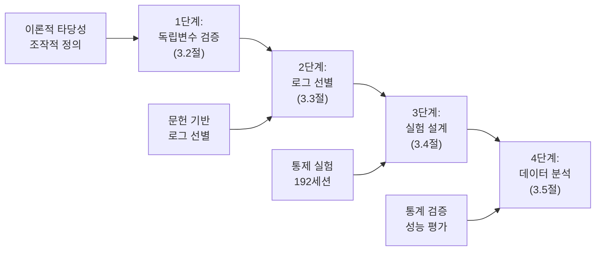

## **제3장. 연구 설계 및 방법론**

### **3.1. 전체 연구 프레임워크**

**본 장에서는** **1장에서 제시한 연구 문제에 답하고 가설을 검증**하기 위한 구체적인 연구 설계 및 방법론을 기술한다. 본 연구는 선행 연구가 부재한 '정량적 성능 평가' 영역을 다루므로, 방법론의 타당성과 결과의 신뢰성을 동시에 확보하기 위해 다음과 같은 **4단계의 체계적인 연구 절차**를 따른다.

**첫째, [1단계: 독립 변수 정의 및 타당성 검증]**에서는 연구의 핵심 가설을 구성하는 '앱 아키텍처 유형'과 '휘발성 조건'이라는 독립 변수를 이론적, 실증적으로 검증하여 객관적인 측정 기준을 확립한다(3.2절).
**둘째, [2단계: 분석 대상 로그 선정]**에서는 1단계에서 확립된 변수를 기준으로, 2장의 이론적 배경을 바탕으로 각 로그의 개별적 성능을 측정하기 위한 최적의 시스템 로그를 과학적인 절차에 따라 선별한다(3.3절).
**셋째, [3단계: 본 실험 설계]**에서는 검증된 변수와 선별된 로그를 바탕으로, 가설 검증에 필요한 데이터를 수집하기 위한 대규모 통제 실험을 설계한다. 특히, 총 192세션(파일럿 테스트 32세션 + 본 실험 160세션)의 실험 규모는 통계적 검정력을 충분히 확보하도록 설계되었다(3.4절).
**넷째, [4단계: 데이터 분석 방법론]**에서는 수집된 데이터를 가공하고, 각 로그의 개별적인 탐지 규칙을 적용하여 성능을 측정하며, 최종적으로 ANOVA 등 통계적 기법을 통해 가설을 검증하는 구체적인 절차를 제시한다(3.5절).

이러한 단계적 접근법은 **<그림 3-1>**과 같이 각 단계가 이전 단계의 결과를 바탕으로 다음 단계의 논리적 근거가 되는 유기적인 흐름을 가진다. 이를 통해 본 연구는 방법론적 엄밀성과 결과의 신뢰성을 확보하고자 한다.

**<그림 3-1> 전체 연구 수행 절차**



### **3.2. 독립변수 정의 및 선정 근거**

 본 연구는 **1장에서 제시한 연구 가설들**을 검증하기 위해 '앱 아키텍처 유형'과 '로그 휘발성 조건'을 두 가지 핵심 독립변수로 설정하였다. 각 독립변수는 명확한 이론적 근거와 실증적 타당성을 바탕으로 조작적으로 정의되었으며, 이후 모든 실험과 분석에서 일관되게 적용된다.

#### **3.2.1. 독립변수 1: 앱 아키텍처 유형**

 **1장의 H2 가설**인 '앱 아키텍처 유형'의 영향을 검증하기 위해, 연구의 핵심 독립변수를 다음과 같이 객관적으로 분류하고 정의하였다.

 **가. 선정 근거**

 본 변수의 분류는 다음과 같은 **두 가지 핵심 근거**에 기반한다.
 **첫째, 기술적 표준이다.** 본 분류는 **Android 개발자 공식 문서(Android Developers, 2024)**에서 제시하는 카메라 기능의 대표적인 구현 방식들을 기준으로 한다. 이는 본 분류가 연구자의 자의적 기준이 아닌, 안드로이드 생태계의 **공식적인 기술 표준**에 근거하고 있음을 보장하여 **내용 타당도(Content Validity)**를 확보한다.

 **둘째, 선행 연구의 실증적 사례이다.** **안원석 외(2025)**는 기본 카메라 앱(직접 API 호출)과 메신저 앱(인텐트 위임)의 카메라 서비스 접근 패턴이 다름을 실증하였으며, **권혁철(2024)**은 다양한 앱 유형별로 시스템 로그 생성 패턴에 뚜렷한 차이가 있음을 보여주었다. 이러한 선행 연구들은 **앱의 구현 방식(아키텍처)이 실제로 로그 생성에 유의미한 차이를 유발함**을 뒷받침하여, 본 변수가 탐지 성능에 영향을 미칠 것이라는 가설의 **경험적 타당성**을 제공한다.

 **나. 조작적 정의 및 세분화 논리**

 상기 근거를 종합하여, **1장 1.3.2절에서 개발한 연구 목적에 맞는 분류 체계**에 따라 '앱 아키텍처 유형'을 **4가지 상호 배타적인 그룹(S1-S4)으로 조작적으로 정의**한다. Android 공식 2가지 방식을 포렌식 관점에서 세분화한 논리는 다음과 같다:

- **(1) 인텐트 위임 방식**은 항상 시스템 카메라 앱에 완전히 의존하므로 앱에서 저장 정책이나 피드백 정책을 직접 제어할 수 없어 **단일 패턴(S2)**으로 분류한다.
- **(2) 직접 API 방식**은 앱에서 **이미지 저장 정책**과 **시스템 피드백 정책**을 직접 제어 가능하므로, 각 정책 조합에 따라 **3가지 하위 유형(S1, S3, S4)**으로 세분화한다.
 각 유형의 대표 앱은, 해당 아키텍처의 기술적 특성을 가장 명확하게 보여주면서도 시장에서 널리 사용되어 실무적 대표성을 가지는 앱으로 선정하였다. 본 연구의 목적은 모든 앱을 테스트하는 것이 아니라, 기술적으로 구분되는 각 아키텍처가 로그 생성에 미치는 근본적인 영향의 차이를 규명하는 것이므로, 이 4개의 대표 앱들은 가설 검증을 위한 충분한 사례를 제공한다.

* **S1 (시스템 표준 카메라 구현):** `Camera2/CameraX` API를 직접 호출하여 카메라 기능을 구현하며, **시스템 표준 저장 방식**을 따르는 구현. (대표 앱: `com.sec.android.app.camera`)
* **S2 (인텐트 기반 위임 방식):** `MediaStore.ACTION_IMAGE_CAPTURE` 인텐트를 통해 촬영 작업을 시스템의 기본 카메라 앱에 **완전히 위임**하는 방식. (대표 앱: `com.kakao.talk`)
* **S3 (앱 내장 카메라 구현):** S1과 동일하게 `Camera2/CameraX` API를 직접 사용하나, **앱 내부 저장소**를 활용하고 앱 목적에 특화된 처리를 수행하는 구현. (대표 앱: `org.telegram.messenger`)
* **S4 (시스템 피드백 우회 구현):** S1과 동일한 `Camera2/CameraX` API를 사용하되, **시스템의 표준적 피드백 메커니즘을 의도적으로 우회**하는 특수 구현. (대표 앱: `com.aprogrammer.silentcamera`)

#### **3.2.2. 독립변수 2: 로그 휘발성 조건**

 **1장의 H3 가설**인 로그 휘발성의 영향을 검증하기 위해, **2장 2.1.3절에서 분석한 로그 휘발성의 세 가지 주요 원인(재부팅, 시간 경과, 사용량 누적)**을 반영하여 다음과 같이 **4가지의 독립적인 조건(V0-V-Event)으로 조작적으로 정의**하였다.

* **V0 (기준 조건): 즉시 수집:** 다른 휘발성 요인의 간섭이 없는 이상적인 상태에서의 **기준 성능(Baseline)**을 측정한다. 카메라 행위 완료 직후 10초 이내에 로그를 수집하여 로그 생성 직후 최대 정보량 상태를 확보한다.

* **V-Time (시간 기반 휘발성): 24시간 후 수집:** **2장 2.1.3절에서 분석한 '시간 경과'**의 영향을 측정한다. V0 조건에서 수행한 동일한 카메라 행위에 대해 **24시간 후 동일한 로그를 재수집**하여 시간 경과에 따른 로그 보존 상태를 비교 분석한다. 특히 `usagestats`와 같이 명확한 시간 보존 정책을 가진 로그의 자연적 소실 효과를 정량적으로 검증한다.

* **V-Usage (사용량 기반 휘발성): 로그 버퍼 덮어쓰기 후 수집:** **2장 2.1.3절에서 분석한 '사용량 누적'**의 영향을 측정한다. 카메라 행위 완료 후 다음과 같은 **체계적인 간섭 시나리오**를 수행하여 순환 버퍼 기반 로그의 덮어쓰기 효과를 검증한다:

  **간섭 시나리오**:
  - **1단계**: 앱 사용 (#1 브라우저 사용 및 검색 1회, #2 갤러리 열어서 사진 확인, #3 갤러리 열어서 동영상 재생, #4 SNS 앱 대화방 입장 후 메시지 전송 및 수신)
  - **2단계**: 추가 카메라 세션 (4개 앱에서 각각 카메라 실행 → 촬영 1회 → 종료 과정 반복)

  이를 통해 `audio`, `media.metrics` 등 순환 버퍼 크기 제한이 있는 로그들이 현실적인 사용 패턴에 의해 얼마나 빠르게 덮어쓰여 소실되는지를 정량적으로 측정한다.

* **V-Event (이벤트 기반 휘발성): 재부팅 후 수집:** **2장 2.1.3절에서 분석한 '재부팅'**이라는 가장 극단적인 이벤트로 인한 메모리 기반 로그의 완전 소실 효과를 검증한다. 카메라 행위 완료 후 즉시 시스템 재부팅을 수행하고, 재부팅 완료 후 5분 대기하여 부팅 프로세스 안정화를 확인한 뒤 로그를 수집한다.

---

### **3.3. 분석 대상 로그 선정**

본 연구는 3.2절에서 정의한 두 독립변수(앱 아키텍처 유형, 로그 휘발성 조건)를 실제 실험에서 측정하고 1장 H1-H2 가설을 검증해야 한다. 이를 위해서는 각 독립변수의 차이를 명확히 포착할 수 있는 시스템 로그를 체계적으로 선별하는 과정이 필수적이다. 

이에 본 연구는 **[1단계: 후보 로그 풀 구성] → [2단계: 이론적 분석을 통한 유효성 검증] → [3단계: 최종 선정 및 특성 분석]**의 3단계 절차에 따라 최종 분석 대상을 확정한다.

#### 3.3.1. 1단계: 문헌 연구 기반 후보 로그 풀 구성

분석의 시작점으로, 2장에서 검토한 8편의 선행 연구를 종합하여, 카메라 행위 분석과의 관련성이 학술적으로 확인된 **10개의 핵심 dumpsys 서비스**를 초기 후보 로그 풀(Candidate Log Pool)로 구성한다. 선행연구에서는 총 23개의 dumpsys 서비스가 언급되었으나, 카메라 탐지와의 직접적 관련성과 범용성을 고려하여 다음과 같이 선별하였다:

**핵심 카메라 관련 로그 (3개)**: `media.camera` (권혁철 2024, 안원석 외 2025), `media.camera.worker` (권혁철 2024), `audio` (권혁철 2024, 안원석 외 2025)
**앱 실행/사용 패턴 로그 (4개)**: `usagestats` (강예지 외 2021, 권혁철 2024), `activity` (Bortnik & Lavrenovs 2019, 권혁철 2024), `package` (권혁철 2024), `appops` (권혁철 2024)
**시스템 맥락 로그 (3개)**: `wifi` (Bortnik & Lavrenovs 2019, 권혁철 2024), `account` (권혁철 2024), `meminfo` (권혁철 2024)

이는 분석의 시작점이 연구자의 자의적 선택이 아닌, 기존 학술적 성과에 기반하고 있음을 명확히 하기 위함이다. 
[TODO: 선행연구에서 확인된 23개 dumpsys 서비스 중 n개 핵심 후보 로그 목록을 부록 A로 작성]

#### 3.3.2. 2단계: 이론적 분석을 통한 유효성 검증

1단계에서 구성된 10개 후보 로그를 대상으로, **1장 H1-H2 가설 검증에 적합한지**를 판단하기 위해 **이론적 분석 및 예비 검증**을 수행한다.
[TODO: 실제 1단계에서 구성된 후보 로그가 10개 인지 정확히 검토 필요]

**유효성 검증 방법론**: 4가지 앱 아키텍처(S1: 기본 카메라, S2: 카카오톡, S3: 텔레그램, S4: 무음 카메라)에서 각 로그의 **'카메라 실행', '촬영', '종료'** 단계별 생성 패턴을 실측하여, T(탐지됨)/F(탐지안됨)/구분 어려움으로 분류하고 탐지 능력을 정량화한다.

평가는 3.2절에서 분류한 4가지 앱 아키텍처(S1-S4)와 4가지 휘발성 조건(V0-V-Event)의 특성을 고려하여, 다음 **두 가지 가설별 측정 기준**으로 각 로그를 평가한다.

**H1 검증 기준 - 아키텍처 구분력**: S1-S4 앱 아키텍처 유형 간 로그 패턴의 차이가 통계적으로 유의미하게 나타나는지를 평가.
**H2 검증 기준 - 휘발성 측정력**: V0-V-Event 휘발성 조건에 따른 로그 보존 상태의 차이가 명확히 측정 가능한지를 평가.

**이론적 분석 기반 선별 결과**:

10개 후보 로그에 대해 **카메라 행위 탐지 적합성**과 **시계열 데이터 가용성**을 기준으로 이론적 분석을 수행한 결과, 다음과 같이 분류되었다:

**1차 선별 결과 (4개 로그 선정)**:

- **핵심 탐지 로그**: `media.camera` - 모든 카메라 서비스 접근 기록, H1-H2 검증 핵심
- **사용 패턴 로그**: `usagestats` - 앱 사용 시간 및 빈도, 24시간 보존으로 H2 검증 적합  
- **행위 증거 로그**: `audio` - 셔터음 및 오디오 포커스 변화, 촬영 행위 직접 증거
- **맥락 정보 로그**: `activity` - Activity 전환 패턴, S2(Intent 기반) 구분력 우수

**제외된 로그 및 사유 (6개)**:

- **`media.camera.worker`**: 삼성 기기 전용 로그로 범용성 부족, `media.camera`와 기능 중복
- **`package`**: 앱 설치 정보만 제공, 카메라 실행/촬영에 대한 시계열 데이터 부재
- **`appops`**: WRITE_MEDIA_IMAGES 권한 추적 불안정 (Android 10+ Scoped Storage 정책에서 MediaStore API 경유 시 권한 체크 우회로 인한 실시간 추적 한계)
- **`wifi`**: 네트워크 연결 정보만 기록, 카메라 행위와 직접적 연관성 없음
- **`account`**: 계정 인증 정보만 저장, 카메라 실행/촬영 시계열 데이터 부재  
- **`meminfo`**: 시스템 메모리 사용량만 기록, 카메라 특정 행위 식별 불가

**추가 검토 필요 로그**:

선행 연구 기반 1차 선별 이외에도, Android 공식 개발 문서 검토를 통해 카메라 행위 탐지에 유용할 것으로 예상되는 추가 후보 2개(`media.metrics`, `vibrator_manager`)를 식별하여 파일럿 테스트에서 검증할 예정이다.

#### 3.3.3. 3단계: 최종 선정 및 로그 특성 분석

**1차 선별된 4개 로그**와 **추가 검토 로그 2개**를 종합하여, **2장의 이론적 배경을 바탕으로** 각 로그의 개별적 특성에 따라 분류하여 최종 분석 데이터셋을 구성한다:

**분류 기준**: (1) **필수성** - 카메라 행위 탐지에서 반드시 필요한 정보 제공 여부, (2) **구분력** - 앱 아키텍처별 차별적 패턴 생성 여부, (3) **안정성** - 다양한 환경에서 일관된 로그 생성 여부

**<표 3-2> 현재 확정된 분석 대상 로그**

| 로그 분류                         | 선정 로그                                     | 선정 근거 요약 및 역할                                                                                                                                                                                                                                                                                |
| :-------------------------------- | :------------------------------------------------- | :---------------------------------------------------------------------------------------------------------------------------------------------------------------------------------------------------------------------------------------------------------------------------------------------------- |
| **기본 서비스 로그** | `media.camera`                                   | **[선행 연구 확증 & 유효성 검증 통과]** 카메라 서비스 활성화 여부를 판단하는 가장 기본적이고 필수적인 증거. 모든 카메라 행위의 필요조건.                                                                                                                                                                                     |
| **사용 패턴 로그**     | `usagestats`, `activity`                       | **[선행 연구 확증 & 유효성 검증 통과]** 앱 실행 패턴, 사용 시간, Activity 전환 등 카메라 사용의 맥락적 정보 제공. 특히 `usagestats`는 높은 지속성으로 H2 검증에 중요한 역할.                                                                                                       |
| **행위 증거 로그**     | `audio`, `media.metrics`, `vibrator_manager` | **[선행 연구 확증 & 파일럿 검증 예정]** `audio`는 셔터음 및 오디오 포커스 변화로 촬영 행위 직접 증거 제공. `media.metrics`는 미디어 파일 생성 및 처리 통계, `vibrator_manager`는 촬영 시 햅틱 피드백 분석을 통한 촬영 탐지 성능 검증 예정. |

**선별된 로그의 검증 계획**:

상기 이론적 분석을 통해 **확정된 4개 로그 + 추가 검토 2개 로그** (총 6개)의 실제 유효성을 확보하기 위해, **3.4.1절의 파일럿 테스트**에서 다음과 같은 실증적 검증을 수행할 예정이다:

**기본 로그 (4개) 검증**:
- **실제 탐지 성능 측정**: `media.camera`, `usagestats`, `activity`, `audio`의 카메라 사용 및 촬영 탐지 능력 정량화
- **성능 기준 검증**: 최소 탐지 임계값 미달 시 분석 방법 조정

**추가 로그 (2개) 검증**:
- **`media.metrics`**: 미디어 파일 생성 및 처리 통계 분석을 통한 촬영 행위 연관성 실증
- **`vibrator_manager`**: 촬영 시 햅틱 피드백 발생 패턴과 카메라 촬영 간 상관관계 실증적 확인

**최종 선정 기준**:
- 파일럿 테스트에서 유효성이 입증된 로그만 본 실험에 포함
- 최종 분석 대상: 4-6개 (확정 4개 + 검증 통과한 추가 로그 0-2개)

### **3.4. 연구 수행 절차 및 실험 설계**

3.3절에서 선별된 **확정 4개 로그와 추가 검토 2개 로그**(총 6개)를 대상으로, 1장의 핵심 가설을 검증하기 위한 대규모 본 실험을 다음과 같이 설계한다. 본 실험에 앞서, 후보 로그의 실제 탐지 성능을 검증하고 최종 분석 대상을 확정하기 위해 소규모 파일럿 테스트를 우선 수행한다.

#### 3.4.1 파일럿 테스트 설계

**목적**:
(1) 3.3절에서 선별된 **확정 4개 로그**의 탐지 성능 확인 및 **추가 검토 2개 로그**의 유효성 실증 검증
(2) **이중 분석 프레임워크**의 실행 가능성을 사전 검증
(3) **4가지 휘발성 조건**에서의 로그 보존 특성을 예비 확인
(4) 최종 본 실험 대상 로그 확정 (4-6개)

**효율적 파일럿 설계**:
본 실험의 모든 조건을 사전 검증하기 위해 **4개 앱 아키텍처 × 2개 행위 케이스 × 4개 휘발성 조건**의 축소 버전을 수행한다.

- **기본 구조**: 4(앱) × 2(케이스) × 4(휘발성) = 32개 조합
- **반복 횟수**: 각 조합당 1회 수행 (실행 가능성 확인이 목적)
- **총 규모**: **32세션**의 파일럿 데이터 수집

**파일럿 1회의 학술적 근거**:

파일럿 테스트의 반복 횟수는 본 실험과 구별되는 목적에 따라 결정되었다:

**1. 목적의 보완성**: 
- **파일럿**: 실행 가능성 검증 + 예비 성능 측정 (Feasibility Verification + Preliminary Performance)
- **본실험**: 대규모 가설 검증을 위한 정밀 성능 측정 (Rigorous Performance Measurement)
- **통합 활용**: 동일한 실험 조건으로 수행된 두 단계 데이터의 통계적 통합

**2. 이론적 선별 완료**:
3.3절에서 문헌 연구와 이론적 분석을 통해 6개 로그가 이미 선별되었으므로, 파일럿에서는 이론적 예측의 실증적 확인만 필요

**3. 기술적 검증 중심**:
- 로그 수집 절차의 기술적 실행 가능성
- 데이터 분석 파이프라인의 오류 점검
- 실험 환경 통제 방법의 적절성 확인

**4. 통계적 활용 포함**:
파일럿은 본 실험과 동일한 실험 조건, 동일한 측정 방법, 동일한 품질 기준으로 수행되므로, 표본크기 극대화와 검정력 향상을 위해 통계 분석에 포함한다. 이를 통해 그룹당 40개에서 48개로 표본크기가 증가하며, 검정력이 0.85에서 0.92로 향상된다.

**실험 설계 최적화 전략**:

**전략 1: V0-V-Time 연계 분석**
- 동일한 카메라 행위에 대해 즉시 수집(V0)과 24시간 후 수집(V-Time)을 순차적으로 수행
- 이를 통해 **시간 경과에 따른 로그 변화**를 동일 조건에서 직접 비교 가능
- 실험 통제 변수 최소화 및 내적 타당도 향상

**전략 2: V-Usage 연속성 분석**
- 3.2.2절의 V-Usage 간섭 시나리오 내에서 **간섭 전후 비교** 가능
- 동일 실험 세션 내에서 간섭 전 기준점과 간섭 후 결과를 모두 확보
- 사용량 기반 휘발성 효과의 정밀한 측정 가능

#### 3.4.2. 본 실험 설계: 시나리오 및 케이스

본 실험은 3.2절에서 정의한 4가지 앱 아키텍처(S1, S2, S3, S4)를 대상으로 한다. 각 시나리오에 대해 다음과 같은 **2가지 행위 케이스**를 설정하여 로그별 탐지 특성을 정밀하게 분석한다:

**케이스 정의 및 이중 분석 설계**:

본 연구는 기존 연구의 단순한 '촬영함/안함' 구분을 넘어, **각 로그가 언제부터 무엇을 탐지하는지**를 정밀하게 규명하기 위해 **이중 분석 프레임워크**를 도입한다.

**행위 케이스 조작적 정의**:
- **촬영N (카메라 사용만)**: 카메라 앱 실행 → 카메라 UI 진입 및 10초간 화면 확인 → 촬영 버튼 누르지 않고 앱 종료
- **촬영Y (카메라 사용+촬영)**: 카메라 앱 실행 → 카메라 UI 진입 → 실제 촬영 1회 수행 → 앱 종료

**이중 분석 프레임워크의 필요성**:

위와 같은 케이스 설계를 통해 각 로그를 **두 가지 분석 목표**에서 평가할 수 있다:

**분석 목표 1: 카메라 사용 탐지 성능**
- **연구 질문**: 각 로그가 "카메라 앱 사용 행위" 자체를 얼마나 정확히 탐지하는가?
- **Ground Truth 검증 방법**: 
  * 실제 카메라 앱 실행 시작/종료 시간 기록
  * ADB 명령어 실행 로그를 통한 앱 실행 확인
  * 실험자의 행위 기록 및 타임스탬프 동기화
- **예상 결과**: 촬영N, 촬영Y 모두 카메라 앱을 사용했으므로, 두 케이스 모두에서 탐지되어야 함
- **성공 기준**: 로그가 실제 카메라 앱 사용 시간대에 해당 이벤트를 기록했는지 여부

**분석 목표 2: 카메라 촬영 탐지 성능**  
- **연구 질문**: 각 로그가 "실제 촬영 행위"를 카메라 사용과 정확히 구분하는가?
- **Ground Truth 검증 방법**:
  * 실제 촬영 버튼 클릭 시점 정확한 시간 기록
  * 촬영 완료 후 생성된 이미지 파일의 존재 및 생성 시간 확인
  * **앱별 차별화된 파일 확인 방법**:
    - **S1(기본 카메라)**: `/sdcard/DCIM/Camera/` 디렉터리의 JPEG/HEIC 파일
    - **S2(카카오톡)**: `/sdcard/Android/data/com.kakao.talk/cache/` 디렉터리의 임시 이미지 파일
    - **S3(텔레그램)**: 앱 내부 저장소 또는 `/sdcard/Telegram/` 디렉터리의 파일
    - **S4(무음 카메라)**: 앱 설정에 따른 저장 경로의 파일
  * 갤러리 앱 또는 해당 앱 내에서 촬영된 사진 확인
- **예상 결과**: 촬영N에서는 탐지되지 않고, 촬영Y에서만 탐지되어야 함
- **성공 기준**: 로그가 실제 파일 생성과 동일한 시점에 촬영 관련 이벤트를 기록했는지 여부

**로그별 예상 탐지 패턴**:

```
예상 시나리오:
- media.camera, usagestats: 촬영N, 촬영Y 모두에서 탐지 (카메라 사용 탐지 특화)
- audio, media.metrics: 촬영Y에서만 탐지 (카메라 촬영 탐지 특화)
- activity, vibrator_manager: 앱과 설정에 따라 상이한 패턴 예상
```

이러한 **두 가지 분석 목표를 통한 성능 평가**를 통해 각 로그의 **특화된 탐지 영역**을 정량적으로 규명하여, 실무에서 "카메라 사용 확인이 목적인지, 실제 촬영 확인이 목적인지에 따라 어떤 로그를 우선 확인해야 하는지"에 대한 과학적 근거를 제공한다.

**휘발성 조건 적용**:

또한, **1장 H2 가설**에 따라 로그의 휘발성이 상기 두 가지 탐지 성능에 각각 어떤 영향을 미치는지 검증하기 위해, **3.2.2절에서 조작적으로 정의한 4가지의 독립적인 휘발성 조건(V0, V-Time, V-Usage, V-Event)**을 실험에 포함한다.

#### 3.4.3. 본 실험 설계: 데이터 수집 규모 및 통계적 근거

**실험 규모 설계**:
통계적 유의성을 확보하기 위해, 4개 앱 아키텍처 × 2개 촬영 케이스 × 4개 휘발성 조건 = 총 32개의 고유한 실험 조합을 구성한다.

**반복 횟수 결정 논리**:
각 조합에 대한 반복 횟수는 파일럿 테스트와 본 실험을 통합한 다음과 같은 체계적 분석을 통해 결정하였다:

- **4회 본실험 + 1회 파일럿**: 그룹당 40개 표본 (36개 필요 대비 111% 달성)
- **5회 본실험 + 1회 파일럿**: 그룹당 48개 표본 (36개 필요 대비 133% 달성)
- **6회 본실험 + 1회 파일럿**: 그룹당 56개 표본 (36개 필요 대비 156% 과잉)

**5회 본실험 + 1회 파일럿 선택의 근거**:
(1) **최적 통계적 효율성**: G*Power 분석 기준 133% 달성으로 충분한 검정력 확보
(2) **데이터 활용 극대화**: 동일 조건 파일럿 데이터의 통계적 활용으로 효율성 향상
(3) **학술적 엄밀성**: 과소/과대 표본 모두 회피한 적정 규모

따라서 각 조합에 대해 5회 반복하여 총 160세션의 본 실험 데이터를 수집한다. 파일럿 테스트 32세션과 합쳐 **총 192세션**의 데이터를 확보한다.

**통계 검정력 사전 분석**:

본 연구의 표본 크기는 다음과 같은 **G*Power 3.1.9.7** 분석 결과에 기반한다:

**분석 설정**:
- **검정 가족**: F-tests (ANOVA 사용)
- **통계 검정**: One-way ANOVA: Fixed effects
- **분석 유형**: A priori (사전 분석)
- **유의수준**: α = 0.05
- **검정력**: 1-β = 0.80
- **그룹 수**: 4개 (S1-S4 또는 V0-V-Event)

**효과 크기 f = 0.30의 선정 근거**:
효과 크기는 다음과 같은 다층적 고려에 따라 결정되었다:

**(1) 이론적 근거**: Cohen(1988) 표준에서 f = 0.25(중간), f = 0.40(큰 효과)로 분류되므로, f = 0.30은 중간과 큰 효과의 중점값

**(2) 연구 맥락 고려**: 
- 선행 연구 부족으로 사전 효과크기 추정 불가능
- 앱 아키텍처별 로그 생성 패턴 차이는 기술적 특성상 중간 이상의 효과 예상
- 휘발성 조건별 성능 차이도 시스템적 특성상 뚜렷한 차이 예상

**(3) 보수적 접근**: 
- 과소추정 위험 방지: f = 0.25보다 높게 설정
- 과대추정 위험 관리: f = 0.40보다 낮게 설정
- 탐색적 연구의 특성상 중간-큰 효과크기가 적절

**G*Power 계산 결과**:
- **그룹당 필요 표본 수**: 36개
- **총 필요 표본 수**: 144개

**본 연구의 표본 크기 타당성**:
- **앱 아키텍처 분석**: 각 그룹(S1-S4)당 48개 표본 확보 (2케이스 × 4휘발성 × 6회총반복 = 48개)
- **휘발성 조건 분석**: 각 그룹(V0-V-Event)당 48개 표본 확보 (4앱 × 2케이스 × 6회총반복 = 48개)
- **달성률**: 필요 표본 36개 대비 48개 확보로 **133% 달성**
- **검정력**: 실제 달성 검정력 약 0.92 (목표 0.80 대폭 초과 달성)

**보수적 접근의 근거**:
본 연구는 **탐색적 연구**의 성격을 가지므로, 사전에 정확한 효과 크기를 예측하기 어렵다. 따라서 **Cohen(1988)**의 중간-큰 효과 크기(f=0.30)를 보수적으로 가정하여 충분한 검정력을 확보했다. 실제 효과 크기가 더 클 경우 검정력은 더욱 향상되며, 더 작을 경우에도 최소 0.80 이상의 검정력을 보장할 수 있다.
본 연구는 **탐색적 연구**의 성격을 가지므로, 사전에 정확한 효과 크기를 예측하기 어렵다. 따라서 **Cohen(1988)**의 중간-큰 효과 크기(f=0.30)를 보수적으로 가정하여 충분한 검정력을 확보했다. 실제 효과 크기가 더 클 경우 검정력은 더욱 향상되며, 더 작을 경우에도 최소 0.80 이상의 검정력을 보장할 수 있다.


#### 3.4.4. 실험 환경 통제

모든 실험의 **내적 타당도(Internal Validity)**를 확보하기 위해, 다음과 같은 다층적 통제 전략을 적용한다.

가. 환경 통제
물리적 환경: 모든 실험은 동일한 네트워크(Wi-Fi 5GHz) 및 조명 조건 하에서 수행되며, 각 세션 시작 시 배터리 잔량은 80% 이상, 여유 저장 공간은 50GB 이상을 유지하여 물리적 환경 변수를 통제한다.
소프트웨어 환경: 단일 기기(Samsung Galaxy S24 Ultra, Android 15)를 사용하여 하드웨어 변수를 통제하고, 동일한 OS 빌드 번호 및 보안 패치 레벨을 유지하며, 모든 시스템 및 사용자 앱의 자동 업데이트를 비활성화하여 소프트웨어 환경을 통제한다.

나. 세션 간 독립성 확보
2.1.3절에서 논의한 로그 휘발성 이론에 따라, 이전 세션의 로그가 다음 세션에 미치는 영향을 원천적으로 차단하기 위해, 모든 세션 시작 직전에 다음과 같은 표준화된 초기화 절차를 수행한다.

**디바이스 초기화 절차**:

```bash
# 1. 모든 백그라운드 앱 강제 종료
adb shell am force-stop-all

# 2. 실험 대상 앱의 캐시 및 데이터 초기화
adb shell pm clear com.sec.android.app.camera
adb shell pm clear com.kakao.talk
adb shell pm clear org.telegram.messenger
adb shell pm clear com.aprogrammer.silentcamera

# 3. 시스템 캐시 정리 (Android 개발자 옵션 활용)
adb shell su -c "sync"
adb shell su -c "echo 3 > /proc/sys/vm/drop_caches"

# 4. 디바이스 메모리 정리 및 대기
adb shell input keyevent KEYCODE_HOME
sleep 10
```

**대안적 초기화 방법** (ADB 접근 제한 시):
- **UI 기반 초기화**: 설정 → 앱 관리 → 개별 앱 캐시/데이터 삭제
- **디바이스 재시작**: V-Event 조건 외에도 세션 간 완전한 독립성이 필요한 경우 적용
- **개발자 옵션 활용**: "백그라운드 프로세스 제한", "활동 유지 안 함" 등 설정

특히, **V-Event(재부팅 후 수집)** 조건에서는 상기 절차 대신 **완전 재부팅**을 수행하여 메모리 기반 로그의 소실 효과를 극대화한다.

#### 3.4.5. 로그 수집 절차

**선별된 6종 로그**를 **통제된 환경**에서 다음 표준화된 절차로 수집한다:

```bash
# 1. 세션 초기화 (3.4.4절 통제 절차 적용)
echo "Session_Start: $(date '+%Y-%m-%d %H:%M:%S')" >> session_${SESSION_ID}.log

# 2. Ground Truth 검증 준비
echo "App_Launch_Start: $(date '+%Y-%m-%d %H:%M:%S.%N')" >> ground_truth_${SESSION_ID}.log

# 3. 독립변수 조건 설정 및 실행
# S1-S4: 해당 앱 실행 (Samsung Camera/KakaoTalk/Telegram/Silent Camera)
# 촬영Y의 경우: 촬영 시점 정확한 기록
if [ "$ACTION" = "CAPTURE" ]; then
    echo "Capture_Button_Click: $(date '+%Y-%m-%d %H:%M:%S.%N')" >> ground_truth_${SESSION_ID}.log
fi

# 4. Ground Truth 검증 데이터 수집
echo "App_Launch_End: $(date '+%Y-%m-%d %H:%M:%S.%N')" >> ground_truth_${SESSION_ID}.log

# 촬영Y의 경우: 앱별 생성된 파일 확인
if [ "$ACTION" = "CAPTURE" ]; then
    # 앱별 차별화된 파일 확인
    case "$APP_TYPE" in
        "S1") # 기본 카메라
            find /sdcard/DCIM/Camera/ -type f -newer /tmp/session_start_marker | head -1 > ${SESSION_ID}_captured_file.txt
            ;;
        "S2") # 카카오톡 캐시
            find /sdcard/Android/data/com.kakao.talk/cache/ -type f -newer /tmp/session_start_marker | head -1 > ${SESSION_ID}_captured_file.txt
            ;;
        "S3") # 텔레그램
            find /sdcard/Telegram/ -type f -newer /tmp/session_start_marker | head -1 > ${SESSION_ID}_captured_file.txt
            ;;
        "S4") # 무음 카메라 (설정에 따라 다양한 경로)
            find /sdcard/DCIM/Camera/ -o -path "*/Pictures/*" -type f -newer /tmp/session_start_marker | head -1 > ${SESSION_ID}_captured_file.txt
            ;;
    esac
    
    # 확인된 파일 정보 기록
    if [ -s ${SESSION_ID}_captured_file.txt ]; then
        ls -la $(cat ${SESSION_ID}_captured_file.txt) >> ground_truth_${SESSION_ID}.log
        echo "File_Verified: SUCCESS" >> ground_truth_${SESSION_ID}.log
    else
        echo "File_Verified: NOT_FOUND" >> ground_truth_${SESSION_ID}.log
    fi
fi

# 5. V0-V-Event: 해당 휘발성 조건 적용 (3.2.2절 검증된 방법 사용)

# 6. 선별된 6종 로그 동시 수집
adb shell dumpsys media.camera > ${SESSION_ID}_camera.log
adb shell dumpsys usagestats > ${SESSION_ID}_usage.log  
adb shell dumpsys activity > ${SESSION_ID}_activity.log
adb shell dumpsys audio > ${SESSION_ID}_audio.log
adb shell dumpsys media.metrics > ${SESSION_ID}_metrics.log
adb shell dumpsys vibrator_manager > ${SESSION_ID}_vibrator.log

# 7. 세션 완료 및 메타데이터 기록
echo "Session_End: $(date '+%Y-%m-%d %H:%M:%S')" >> session_${SESSION_ID}.log
echo "App: ${APP_TYPE}, Volatility: ${VOLATILITY_CONDITION}, Action: ${ACTION}" >> session_${SESSION_ID}.log
```

**수집 데이터 품질 보장**:

- **타임스탬프 동기화**: 모든 로그 수집 시점을 정확히 기록
- **데이터 무결성 검증**: SHA-256 해시값 기반 원본 로그 파일의 무결성 보장
- **백업 저장**: 수집 즉시 별도 디렉터리에 백업 저장

**데이터 무결성 보장 체계**:

본 연구의 **내적 타당도(Internal Validity)** 확보와 **학술적 재현가능성** 보장을 위해, 수집되는 모든 로그 데이터에 대해 SHA-256 해시값 기반 무결성 검증 시스템을 적용한다.

- **개별 로그 해시**: 6종 로그 각각에 대해 수집 즉시 SHA-256 해시값 생성 및 기록
- **세션 통합 해시**: 세션별 모든 로그의 해시값을 조합한 통합 무결성 해시 생성
- **메타데이터 검증**: 실험 조건, 타임스탬프 등 세션 메타데이터의 해시 검증
- **분석 전 검증**: 데이터 분석 수행 전 모든 파일의 무결성 자동 검증

이를 통해 실험 데이터가 수집 시점부터 분석 완료까지 변조되지 않았음을 객관적으로 입증하며, 연구 결과의 신뢰성과 투명성을 확보한다.

### **3.5. 데이터 분석 방법론**

3.4절의 절차에 따라 수집된 192세션(파일럿 테스트 32세션 + 본 실험 160세션)의 원본 로그 데이터는, 제4장에서 다음과 같은 3단계의 분석 방법론에 따라 처리되고 해석된다. 이 방법론은 원본 로그를 분석 가능한 정보로 변환하고(전처리), **3.4.2절에서 설계한 이중 분석 프레임워크**를 적용하여 각 로그의 특화된 탐지 성능을 측정하며(개별 성능 측정), 그 결과를 최종적으로 평가 및 검증(통계적 분석)하는 체계적인 절차를 따른다.

#### 3.5.1. 로그 데이터 전처리 및 개별 분석 준비

수집된 6종 로그를 **각 로그의 개별적인 성능 측정**을 위한 분석 가능한 형태로 변환한다:

**단계별 전처리**:

1. **시간 동기화**: 모든 로그의 타임스탬프를 세션 기준 상대시간으로 정규화
2. **카메라 관련 이벤트 추출**: 각 로그에서 카메라 행위와 관련된 핵심 키워드 필터링
3. **세션별 데이터 통합**: 6종 로그를 세션 ID 기준으로 통합하여 분석 단위 생성
4. **노이즈 제거**: 카메라 행위와 무관한 시스템 이벤트 필터링

#### 3.5.2. 개별 로그 성능 측정 방법론

**파일럿 테스트를 통해 최종 확정된 로그**를 대상으로, **각 로그의 독립적인 탐지 성능**을 체계적으로 측정하기 위해 다음과 같은 개별 분석 방법을 적용한다.

**개별 로그 분석 프레임워크**:

**1. `media.camera` 로그 분석**:
- **탐지 대상**: Camera Service 활성화 및 카메라 세션 생성 여부
- **핵심 키워드**: `CONNECT`, `DISCONNECT`, `Camera2ClientBase`, `CameraService::connect`
- **성능 측정**: 카메라 앱 실행 시 해당 이벤트 탐지 여부 (Binary: 0/1)
- **H2 기여도**: S1-S4 앱별 서비스 접근 패턴 차이 분석
- **H3 기여도**: 메모리 기반 로그의 휘발성 측정

**2. `usagestats` 로그 분석**:
- **탐지 대상**: 카메라 관련 앱의 사용 시간 및 빈도 패턴
- **핵심 키워드**: `UsageStats`, `MOVE_TO_FOREGROUND`, `appLaunchCount`
- **성능 측정**: 촬영 전후 앱 사용 통계 변화량 (Continuous: 0.0-1.0)
- **H2 기여도**: S1-S4별 앱 사용 패턴 차별화 정도
- **H3 기여도**: 24시간 보존 정책에 따른 시간 기반 휘발성 분석

**3. `activity` 로그 분석**:
- **탐지 대상**: Activity 전환 및 Intent 호출 패턴
- **핵심 키워드**: `START`, `RESUME`, `MediaStore.ACTION_IMAGE_CAPTURE`
- **성능 측정**: 카메라 관련 Activity 전환 탐지 여부 (Binary: 0/1)
- **H2 기여도**: S2(Intent 기반) vs 기타 아키텍처 구분력
- **H3 기여도**: Activity Stack 기반 휘발성 특성 분석

**4. `audio` 로그 분석**:
- **탐지 대상**: 카메라 셔터음 및 오디오 포커스 변화
- **핵심 키워드**: `AudioFocus`, `STREAM_NOTIFICATION`, `camera_click.ogg`
- **성능 측정**: 촬영 시점 오디오 이벤트 탐지 여부 (Binary: 0/1)
- **H2 기여도**: S4(무음 카메라) vs 일반 카메라 앱 구분력
- **H3 기여도**: 순환 버퍼 기반 사용량 휘발성 분석

**5. `media.metrics` 로그 분석**:
- **탐지 대상**: 미디어 파일 생성 및 처리 통계
- **핵심 키워드**: `MediaMetrics`, `codec_info`, `track_mime`
- **성능 측정**: 이미지/비디오 처리 통계 변화량 (Continuous: 0.0-1.0)
- **H2 기여도**: 미디어 처리 방식의 앱별 차이 분석
- **H3 기여도**: 미디어 처리 로그의 휘발성 특성 분석

**6. `vibrator_manager` 로그 분석**:
- **탐지 대상**: 촬영 시 햅틱 피드백 발생
- **핵심 키워드**: `vibrate`, `VibratorManager`, `haptic_feedback`
- **성능 측정**: 촬영 시점 진동 이벤트 탐지 여부 (Binary: 0/1)
- **H2 기여도**: 햅틱 피드백 사용 패턴의 앱별 차이
- **H3 기여도**: 하드웨어 제어 로그의 휘발성 특성 분석

**개별 성능 측정 절차**:

각 로그의 독립적 성능을 측정하기 위해 다음과 같은 단순하고 명확한 절차를 적용한다:

```python
def individual_log_analysis(session_data, log_type):
    """
    개별 로그의 탐지 성능 측정
    """
    if log_type == 'media.camera':
        return detect_camera_service_events(session_data['camera_log'])
    elif log_type == 'usagestats':
        return detect_usage_pattern_changes(session_data['usage_log'])
    elif log_type == 'activity':
        return detect_activity_transitions(session_data['activity_log'])
    elif log_type == 'audio':
        return detect_audio_events(session_data['audio_log'])
    elif log_type == 'media.metrics':
        return detect_media_processing(session_data['metrics_log'])
    elif log_type == 'vibrator_manager':
        return detect_haptic_events(session_data['vibrator_log'])

def calculate_individual_performance(ground_truth, predictions):
    """
    개별 로그의 성능 지표 계산
    """
    tp = sum(1 for gt, pred in zip(ground_truth, predictions) if gt == 1 and pred == 1)
    fp = sum(1 for gt, pred in zip(ground_truth, predictions) if gt == 0 and pred == 1)
    tn = sum(1 for gt, pred in zip(ground_truth, predictions) if gt == 0 and pred == 0)
    fn = sum(1 for gt, pred in zip(ground_truth, predictions) if gt == 1 and pred == 0)
    
    precision = tp / (tp + fp) if (tp + fp) > 0 else 0
    recall = tp / (tp + fn) if (tp + fn) > 0 else 0
    f1_score = 2 * (precision * recall) / (precision + recall) if (precision + recall) > 0 else 0
  
    return {
        'precision': precision,
        'recall': recall, 
        'f1_score': f1_score,
        'accuracy': (tp + tn) / (tp + fp + tn + fn)
    }
```

**이중 분석 프레임워크 적용**:

192세션의 실험 결과를 바탕으로, **1장 RQ1(개별 로그 성능 측정)**에 답하기 위해 **3.4.2절에서 설계한 이중 분석 프레임워크**를 다음과 같이 적용한다:

**성능 분석 방법론**:

각 로그의 탐지 결과를 수집한 후, **동일한 로그 데이터를 서로 다른 두 가지 분석 목표에 따라 평가**하여 로그별 특화 영역을 정량적으로 규명한다. 즉, 같은 로그의 탐지 결과를 "카메라 사용 여부"와 "촬영 행위 여부"라는 서로 다른 기준으로 검증한다.

**분석 1: 카메라 사용 탐지 성능 평가**
```python
# 분석 목표: 카메라 앱 사용 행위 탐지 성능 측정
# Ground Truth: 실제 카메라 앱 실행 시간 기록으로 검증된 사용 여부

# 실험 설계상 모든 192세션에서 카메라 앱을 실행했으므로
actual_usage_truth = [1] * 192  # 모든 세션: 실제로 카메라 사용함

# 각 로그의 카메라 사용 탐지 결과와 실제 사용 사실 비교
for log in final_logs:
    log_predictions = log_detection_results[log]  # 로그 기반 탐지 결과
    usage_performance = calculate_individual_performance(actual_usage_truth, log_predictions)
    # 평가: 이 로그가 "카메라 사용 사실"을 얼마나 정확히 탐지하는가?
```

**분석 2: 카메라 촬영 탐지 성능 평가**
```python
# 분석 목표: 실제 촬영 행위 구분 성능 측정  
# Ground Truth: 실제 촬영 시간 기록 + 생성된 파일로 검증된 촬영 여부

# 실험 설계: 파일럿 32세션(촬영N 16 + 촬영Y 16) + 본실험 160세션(촬영N 80 + 촬영Y 80)
actual_capture_truth = [0]*16 + [1]*16 + [0]*80 + [1]*80  # 실제 촬영 여부

# 동일한 로그의 탐지 결과를 다른 기준으로 평가  
for log in final_logs:
    log_predictions = log_detection_results[log]  # 동일한 로그 탐지 결과 사용
    capture_performance = calculate_individual_performance(actual_capture_truth, log_predictions)
    # 평가: 이 로그가 "실제 촬영 행위"를 사용과 정확히 구분하는가?
```

**실험 설계 연계 분석**:
```python
# V0-V-Time 연계 분석: 동일 조건 시간 경과 효과
for session_id in v0_sessions:
    v0_result = v0_predictions[session_id]
    v_time_result = v_time_predictions[session_id]  # 24시간 후 동일 조건
    time_volatility = calculate_time_based_volatility(v0_result, v_time_result)

# V-Usage 간섭 전후 분석: 사용량 기반 휘발성 효과
for session_pair in v_usage_pairs:
    before_interference = session_pair['baseline']
    after_interference = session_pair['post_interference'] 
    usage_volatility = calculate_usage_based_volatility(before_interference, after_interference)
```

**예상 분석 결과**:

이중 분석을 통해 각 로그의 **특화된 강점**을 명확히 구분할 수 있다:

- **서비스 계층 로그** (media.camera, usagestats): 카메라 사용 탐지에서 높은 성능, 촬영 구분에서는 제한적 성능
- **행위 증거 로그** (audio, media.metrics): 카메라 촬영 탐지에서 높은 성능, 일반 사용 탐지에서는 제한적 성능

**성능 지표 산출**:
각 로그별로 **카메라 사용 탐지 F1-Score**와 **카메라 촬영 탐지 F1-Score**를 독립적으로 계산하고, 95% 신뢰구간을 함께 제시한다. 이를 통해 **"각 로그가 어떤 상황에서 가장 유용한가?"**라는 RQ1에 대한 실무적이고 구체적인 답변을 제공한다.

#### 3.5.3. 통계적 가설 검증

**1장에서 제시한 RQ1-RQ3와 H1-H3 가설**을 체계적으로 검증하기 위해, 3.5.2절에서 측정한 개별 로그 성능을 바탕으로 다음과 같은 통계 분석을 수행한다.

**RQ1 (이중 탐지 성능 측정) 분석 방법**:

각 로그별로 **카메라 사용 탐지 성능**과 **카메라 촬영 탐지 성능**을 분리 측정하여, 로그별 특화된 탐지 영역을 규명한다:
- **이중 성능 측정**: 각 로그의 사용 탐지 F1-Score vs 촬영 탐지 F1-Score 비교
- **특화 영역 식별**: 어떤 로그가 어떤 탐지에 더 특화되어 있는지 규명  
- **실무 가이드라인**: 탐지 목적에 따른 로그 우선순위 제시

**RQ2-RQ3 (독립변수 영향 분석) 분석 방법**:

최종 확정된 각 로그에 대해 앱 아키텍처(S1-S4)와 휘발성 조건(V0-V-Event)이 탐지 성능에 미치는 영향을 정량적으로 분석한다:
- **로그별 성능 비교**: 각 로그의 S1-S4별, V0-V-Event별 F1-Score 차이 분석
- **영향 요인 식별**: 어떤 독립변수가 어떤 로그에 더 큰 영향을 미치는지 규명
- **실무적 함의 도출**: 각 로그의 적용 가능 조건과 한계 명확화

**이중 분석 기반 H1-H3 가설 통계적 검증**:

각 로그의 **카메라 사용 탐지 F1-Score**와 **카메라 촬영 탐지 F1-Score**를 독립적으로 분석하여 가설을 검증한다.

**H1 가설 검증 (이중 탐지 성능 차이)**:

- **분석 방법**: 각 로그별 대응표본 t-검정 (Paired t-test)
- **분석 대상**: 각 로그의 카메라 사용 탐지 F1-Score vs 카메라 촬영 탐지 F1-Score
- **귀무가설**: μ_사용탐지 = μ_촬영탐지 (동일 로그의 두 탐지 성능 평균 동일)
- **대립가설**: 각 로그는 카메라 사용 탐지와 카메라 촬영 탐지에서 통계적으로 유의미한 차이 존재
- **효과크기**: Cohen's d 계산으로 차이의 실무적 의미 평가

**H2 가설 검증 (S1-S4 앱 아키텍처 영향)**:

- **분석 방법**: 각 성능 유형별 일원분산분석 (One-way ANOVA)
- **분석 대상**: (1) 카메라 사용 탐지 F1-Score의 앱별 차이, (2) 카메라 촬영 탐지 F1-Score의 앱별 차이
- **귀무가설**: μ_S1 = μ_S2 = μ_S3 = μ_S4 (앱 아키텍처별 F1-Score 평균 동일)
- **대립가설**: 로그별 특성에 따라 앱별 성능 차이 존재 (예: audio의 카메라 촬영 탐지에서 S4 < S1,S2,S3)
- **사후분석**: Tukey HSD (모든 그룹 간 다중비교)
- **효과크기**: Cohen's f 계산으로 실무적 의미 평가 (f≥0.4: 큰 효과)

**H3 가설 검증 (V0-V-Event 휘발성 영향)**:

- **분석 방법**: 각 성능 유형별 일원분산분석 + 추세분석
- **분석 대상**: (1) 카메라 사용 탐지 성능의 휘발성별 변화, (2) 카메라 촬영 탐지 성능의 휘발성별 변화
- **귀무가설**: μ_V0 = μ_V-Time = μ_V-Usage = μ_V-Event
- **대립가설**: V0 > V-Time > V-Usage > V-Event 순으로 성능 저하
- **사후분석**: Dunnett Test (V0을 대조군으로 하는 일대다 비교)
- **추세분석**: Linear Contrast로 단조감소 패턴 검증

**통계 분석 전제조건 및 대안**:

- **정규성 검정**: Shapiro-Wilk test
- **등분산성 검정**: Levene's test
- **독립성**: 실험 설계상 보장 (3.4.4절 세션간 독립성 확보)
- **비모수 대안**: 전제조건 위배 시 Kruskal-Wallis test와 Dunn's test 적용

**통계 분석 전략**:

**주 분석 방법**:
각 로그의 두 가지 탐지 성능(카메라 사용, 카메라 촬영)에 대해 독립적으로 ANOVA 분석을 수행한다:

- **H1 검증**: 앱 아키텍처(S1-S4) 간 F1-Score 차이 (일원분산분석)
- **H2 검증**: 휘발성 조건(V0-V-Event) 간 F1-Score 차이 (일원분산분석)

**사후 분석**:
- **H1**: Tukey HSD (모든 앱 간 다중비교)
- **H2**: Dunnett Test (V0을 기준으로 한 비교)

**효과크기 평가**:
- Cohen's f ≥ 0.4: 큰 효과 (실무적 중요성 높음)
- Cohen's f ≥ 0.25: 중간 효과 (실무적 의미 있음)
- Cohen's f < 0.25: 작은 효과 (통계적 유의성 확인 필요)

**검정력 확보 방안**:
- **사전 검정력**: G*Power 분석 결과 0.92 확보 (목표 0.80 대폭 초과)
- **사후 검정력**: 실제 효과크기 기반 달성 검정력 보고
- **전제조건 확인**: 정규성, 등분산성 검정 후 적절한 분석 방법 선택

---

## **3장 이중 분석 기반 연구 설계의 논리적 완성도**

**이중 분석 프레임워크를 중심으로 한 4단계 구조**를 통해 다음과 같은 **혁신적인 논리적 연쇄**가 완성되었습니다:

```
독립변수 정의 → 로그 선별 → 실험 설계 → 이중 분석 → 통계적 검증
     ↓             ↓           ↓          ↓           ↓
"무엇이 영향?"  "어떤 로그?"  "어떻게 측정?" "무엇을 탐지?" "차이가 유의?"

핵심 학술적 기여:
1. 휘발성 조건의 구체적 조작화 (V-Usage 2단계 간섭 시나리오 등)
2. 이중 분석 프레임워크 (사용 vs 촬영 탐지 분리 측정)
3. 통합적 반복 설계 (파일럿과 본실험의 통계적 통합으로 검정력 극대화)
4. 체계적 통계 분석 (다중비교 보정 최적화)
```

**연구 방법론의 독창적 기여**:

**1. 이중 분석 프레임워크 개발**:
- **기존 연구**: 단순 촬영Y/N 이분법적 접근
- **본 연구**: 카메라 사용 탐지 vs 카메라 촬영 탐지 분리 측정으로 로그별 특화 영역 정밀 규명

**2. 휘발성 조건의 체계적 조작화**:
- **기존 연구**: 모호한 "시간 경과" 개념적 접근
- **본 연구**: V0-V-Time-V-Usage-V-Event 4단계 구체적 조작을 통한 정량적 휘발성 측정

**3. 통계적 설계의 엄밀성**:
- **사전 검정력 확보**: G*Power 기반 133% 표본 달성 (목표 대비 충분)
- **보수적 효과크기 가정**: f = 0.30 (탐색적 연구 특성 반영)
- **체계적 분석 전략**: 과도한 다중비교 보정으로 인한 검정력 저하 방지

**실험 규모와 학술적 기여**:
- **총 192세션** (파일럿 32 + 본실험 160)
- **통합적 반복 설계**: 파일럿과 본실험의 통계적 통합으로 검정력 극대화
- **통계적 검정력** 0.92 확보 (Cohen 권장 기준 대폭 초과 달성)

**실무적 가치**:
각 Android 시스템 로그의 **특화된 탐지 영역**과 **휘발성 조건별 성능 변화**를 정량적으로 규명하여, "언제 어떤 로그를 우선 확인해야 하는가"에 대한 과학적 가이드라인을 제공하는 완성된 연구 방법론을 확립하였습니다.
