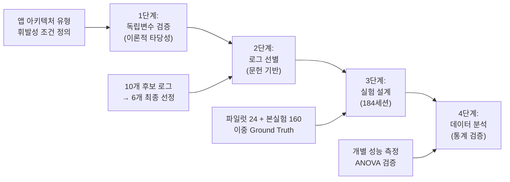
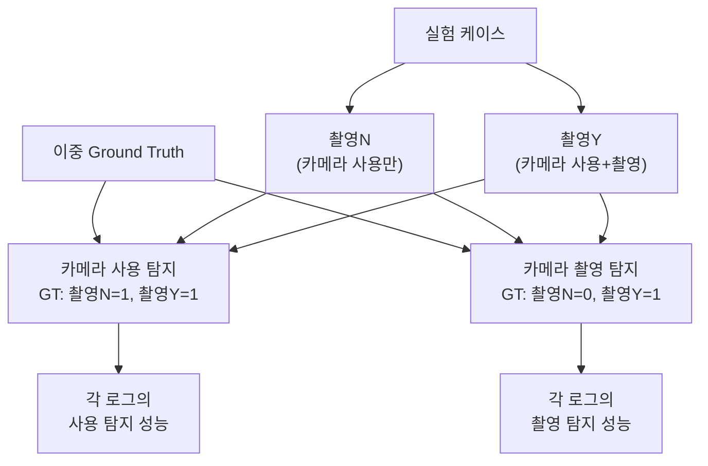
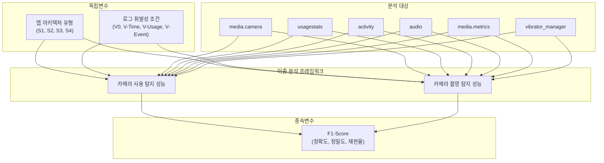
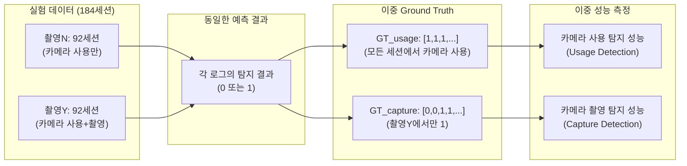

# **Android 시스템 로그 기반 카메라 촬영 탐지 성능의 정량적 분석 연구**

## **지도교수 제출용 종합 연구 계획서**

---

## **연구 개요**

### **연구 제목**

Android 시스템 로그 기반 카메라 촬영 탐지 성능의 정량적 분석 연구

### **연구 기간**

2025년 09월 - 2025년 11월 (예상)

### **연구 배경 및 필요성**

**1. 문제의 심각성**

- 스마트폰을 이용한 불법 촬영이 국가 및 산업 안보 위협으로 대두
- 내부자에 의한 정보 유출 중 **34%가 내부자 소행** (Verizon 보고서)
- 산업기술 유출 피해액 **24.8조원** (2019-2023), 내부인 관련 **90% 이상**
- 사진촬영을 통한 유출은 **탐지 어려움**으로 인해 빙산의 일각일 가능성

**2. 기존 해결책의 한계**

- 물리적 보안(보안 스티커): 쉽게 우회 가능
- MDM 솔루션: 높은 비용, 프라이버시 침해 문제
- 전통적 디지털 포렌식: 루팅 필요, 보증 무효화, 높은 비용

**3. 새로운 접근법의 필요성과 가능성**

이러한 한계를 극복하기 위한 대안으로 **비루팅 환경에서 ADB(Android Debug Bridge) 명령어를 통해 접근 가능한 시스템 로그를 활용하는 방법**이 주목받고 있습니다. 이 접근법의 핵심적인 장점은 **파일이 삭제된 후에도 시스템 레벨에서 자동으로 생성되는 미세한 흔적(로그)을 통해 행위 자체를 추적할 수 있다**는 점입니다.

선행 연구들은 이미 특정 시스템 로그에서 카메라 사용과 관련된 이벤트가 기록된다는 사실을 확인하였으나, 대부분 **"특정 로그에서 관련 흔적을 발견할 수 있다"는 정성적(Qualitative) 가능성 제시에 그치고 있습니다**.

하지만 실무에서 이 기술을 신뢰하고 적용하기 위해서는 **"각 로그가 얼마나 정확하게 탐지할 수 있는지"(성능), "어떤 조건에서 탐지가 실패하는지"(한계), "로그의 휘발성이 탐지율에 얼마나 영향을 미치는지"(실무적 제약)**에 대한 정량적이고 체계적인 데이터가 반드시 필요합니다. 이러한 **'정량적 성능 및 한계 규명의 부재'**가 바로 본 연구가 해결하고자 하는 핵심적인 연구 공백입니다.

---

## **연구 목적 및 의의**

### **핵심 연구 목적**

**6종 Android 시스템 로그의 개별적인 카메라 촬영 탐지 성능을 정량적으로 측정하고, 실무 적용의 명확한 한계점을 과학적으로 규명**

### **세부 목적**

1. **로그별 탐지 성능 정립**: 6개 핵심 로그(`media.camera`, `usagestats`, `activity`, `audio`, `media.metrics`, `vibrator_manager`)의 개별 성능 측정
2. **정량적 성능 측정**: 184세션 통제 실험을 통한 과학적 성능 지표 산출
3. **실무적 한계 규명**: 앱 아키텍처와 로그 휘발성이 탐지 성능에 미치는 영향 분석

### **학술적 의의와 연구의 혁신성**

본 연구의 핵심적인 학술적 의의는 **Android 시스템 로그 기반 포렌식 연구 분야에서 정성적 접근에서 정량적 접근으로의 패러다임 전환**을 선도한다는 점입니다.

**기존 연구의 접근 방식**은 "특정 로그에서 카메라 사용의 흔적을 발견할 수 있다"는 **가능성(Possibility) 중심의 정성적 분석**에 머물렀습니다. 이는 디지털 포렌식 분야의 초기 연구에서 흔히 나타나는 패턴으로, 새로운 증거 소스의 존재를 확인하는 데 중요한 역할을 했지만, 실무 적용을 위한 구체적인 성능 지표나 신뢰도는 제공하지 못했습니다.

반면 **본 연구의 접근 방식**은 "각 시스템 로그가 정확히 어느 수준의 탐지 성능을 보이며, 어떤 조건에서 한계를 드러내는가"라는 **성능(Performance) 중심의 정량적 분석**을 지향합니다. 이를 통해 실무진이 실제 사건 분석에서 각 로그를 언제, 어떻게 활용해야 하는지에 대한 과학적 근거를 제공할 수 있습니다.

이러한 **정성적 → 정량적 검증의 패러다임 전환**은 단순한 방법론적 개선을 넘어, 디지털 포렌식 분야의 학술적 성숙도를 한 단계 끌어올리는 중요한 기여가 될 것입니다. 특히 법정에서 디지털 증거의 신뢰성이 점점 더 엄격하게 요구되는 현실에서, 이러한 정량적 성능 데이터는 증거능력 확보에 필수적인 요소로 작용할 것으로 예상됩니다.

---

## **연구 문제 및 가설**

### **연구 문제 (Research Questions)**

**RQ1 (로그별 성능 측정)**

> 각 Android 시스템 로그의 개별적인 카메라 촬영 탐지 성능(정확도, 정밀도, 재현율, F1-Score)은 어느 수준인가?

**RQ2 (영향 요인 분석)**

> 앱 아키텍처와 휘발성 조건이 각 로그의 탐지 성능에 미치는 영향은 무엇이며, 그 정도는 어느 수준인가?

### **연구 가설의 이론적 배경과 검증 논리**

본 연구는 두 가지 핵심 가설을 통해 Android 시스템 로그의 탐지 성능에 영향을 미치는 주요 요인들을 체계적으로 분석합니다.

**H1 (앱 아키텍처 가설): 기술적 구현 방식의 차별적 영향**

- **가설 내용**: 앱 아키텍처 유형에 따라 각 로그별 탐지 성능에 통계적으로 유의미한 차이가 있을 것이다
- **독립변수**: 앱 아키텍처 유형 (S1: 직접 API, S2: Intent 기반, S3: 앱 내장, S4: 특수 목적)
- **종속변수**: 탐지 성능 (F1-Score)

**이론적 근거**: Android 개발자 문서에 따르면, 앱이 카메라 하드웨어에 접근하는 방식은 크게 네 가지 패턴으로 구분됩니다. **직접 시스템 API 호출**(S1)은 가장 표준적인 방식으로 시스템과의 상호작용이 활발하여 다양한 로그를 생성할 것으로 예상됩니다. **Intent 기반 호출**(S2)은 시스템 카메라 앱에 기능을 위임하므로 간접적인 로그 패턴을 보일 것으로, **앱 내장 카메라**(S3)는 독자적인 구현으로 인해 표준과 다른 로그 패턴을, **특수 목적 구현**(S4)은 의도적인 시스템 회피로 인해 제한적인 로그 생성을 보일 것으로 예상됩니다.

**H2 (휘발성 가설): 시간적 제약의 성능 영향**

- **가설 내용**: 로그 휘발성 조건에 따라 각 로그별 탐지 성능에 통계적으로 유의미한 차이가 있을 것이다
- **독립변수**: 휘발성 조건 (V0: 즉시, V-Time: 24시간 후, V-Usage: 간섭 후, V-Event: 재부팅 후)
- **종속변수**: 탐지 성능 (F1-Score)
- **예상 패턴**: V0 > V-Time > V-Usage > V-Event 순으로 성능 저하

**이론적 근거**: Android 시스템 로그는 메모리 기반 순환 버퍼를 사용하므로 시간 경과, 사용량 누적, 시스템 재시작 등의 요인에 따라 데이터가 소실됩니다. **즉시 수집**(V0)은 이상적인 조건이므로 최고 성능을 보일 것이며, **24시간 후 수집**(V-Time)은 시간 기반 보존 정책의 영향을, **간섭 행위 후 수집**(V-Usage)은 버퍼 오버플로우의 영향을, **재부팅 후 수집**(V-Event)은 메모리 초기화로 인한 완전 소실 효과를 각각 측정할 수 있습니다.

---

## **연구 방법론**

### **전체 연구 프레임워크 (4단계)**



### **1단계: 독립변수 정의**

**앱 아키텍처 유형 (4가지)**

- **S1**: 직접 시스템 API 호출 (`com.sec.android.app.camera`)
- **S2**: 인텐트 기반 호출 (`com.kakao.talk`)
- **S3**: 앱 내장 카메라 (`org.telegram.messenger`)
- **S4**: 특수 목적 구현 (`com.aprogrammer.silentcamera`)

**로그 휘발성 조건 (4가지)**

- **V0**: 즉시 수집 (기준 조건)
- **V-Time**: 24시간 후 수집 (시간 기반 휘발성)
- **V-Usage**: 간섭 행위 후 수집 (사용량 기반 휘발성)
- **V-Event**: 재부팅 후 수집 (이벤트 기반 휘발성)

### **2단계: 분석 대상 로그의 체계적 선정 과정**

분석 대상 로그의 선정은 **과학적 객관성과 연구의 타당성을 확보**하기 위해 3단계의 엄밀한 절차를 거쳐 수행됩니다.

**1단계: 후보 로그 풀의 학술적 구성**
선행 연구 8편(국내 6편, 해외 2편)에서 카메라 행위 분석과 관련성이 확인된 **10개의 핵심 dumpsys 서비스**를 초기 후보로 추출합니다. 이는 연구자의 자의적 선택을 배제하고, 기존 학술 성과에 기반한 객관적 시작점을 확보하기 위함입니다.

**2단계: 이론적 분석을 통한 유효성 검증**
10개 후보 로그를 대상으로 **본 연구의 H1-H2 가설 검증에 적합한지**를 다음 두 기준으로 평가합니다:

- **H1 검증 기준**: S1-S4 앱 아키텍처 간 로그 패턴의 차별화 가능성
- **H2 검증 기준**: V0-V-Event 휘발성 조건에 따른 변화 측정 가능성

**3단계: 최종 선정 및 특성 기반 분류**
이론적 분석 결과를 바탕으로 **6개 로그**를 최종 선정하고, 각 로그의 고유한 특성에 따라 다음과 같이 분류합니다:

- **기본 서비스 로그**: `media.camera` - 카메라 하드웨어 서비스의 핵심 활동 기록
- **사용 패턴 로그**: `usagestats`, `activity` - 앱 실행 및 사용자 상호작용 패턴 추적
- **행위 증거 로그**: `media.metrics`, `vibrator_manager`, `audio` - 실제 촬영 행위의 직접적 증거 제공

이러한 **3층 구조의 로그 분류**는 카메라 촬영이라는 복합적 행위를 **하드웨어 접근**, **사용 패턴**, **행위 증거**의 다각도에서 포착할 수 있도록 설계되었습니다.

### **3단계: 실험 설계**

**실험 규모**: 총 184세션

- **파일럿 테스트**: 24세션 (4개 앱 × 2개 케이스 × 3회)
- **본 실험**: 160세션 (4개 앱 × 2개 케이스 × 4개 휘발성 × 5회)

**핵심 혁신: 이중 분석 프레임워크의 필요성과 독창성**

본 연구의 가장 핵심적인 방법론적 혁신은 **"이중 분석 프레임워크(Dual Analysis Framework)"**입니다. 이는 기존 연구들이 단순히 "촬영함/안함"으로만 구분했던 것을 넘어, **"카메라 사용"과 "카메라 촬영"이라는 두 가지 서로 다른 행위를 별도로 분석**하는 새로운 접근법입니다.

기존 연구들은 카메라 관련 행위를 하나의 단순한 이벤트로 취급했지만, 실제로는 **"카메라 앱을 실행하여 사용하는 행위"**와 **"실제로 셔터를 눌러 사진을 촬영하는 행위"**는 서로 다른 시스템 이벤트를 발생시킵니다. 예를 들어, `media.camera` 로그는 카메라 서비스가 활성화되는 순간부터 기록되지만, `audio` 로그의 셔터음 관련 이벤트는 실제 촬영이 발생해야만 기록됩니다.

이러한 차이를 무시하고 단일 기준으로 분석하면, 각 로그의 **진정한 특화 영역**을 파악할 수 없습니다. 본 연구의 이중 분석 프레임워크는 이 문제를 해결하기 위해 **동일한 실험 데이터를 서로 다른 두 가지 Ground Truth와 비교**하여 각 로그의 특성을 정밀하게 측정합니다.

**이중 분석의 구체적 방법론**



- **촬영N 케이스**: 카메라 앱 실행 → UI 진입 → 10초간 화면 확인 → 촬영 없이 종료
- **촬영Y 케이스**: 카메라 앱 실행 → UI 진입 → 실제 촬영 1회 → 앱 종료

**이중 Ground Truth의 혁신적 접근**

- **카메라 사용 탐지 성능**: 촬영N과 촬영Y 모두 카메라를 "사용"했으므로 Ground Truth는 [1,1]
- **카메라 촬영 탐지 성능**: 촬영N은 촬영하지 않았고 촬영Y만 촬영했으므로 Ground Truth는 [0,1]

이를 통해 예를 들어 `media.camera` 로그는 "카메라 사용 탐지"에서 높은 성능을, `audio` 로그는 "카메라 촬영 탐지"에서 높은 성능을 보일 것으로 예상되며, 이는 실무에서 **"어떤 상황에서 어떤 로그를 우선적으로 확인해야 하는가"**라는 구체적인 가이드라인을 제공할 수 있습니다.

**환경 통제**

- **하드웨어**: Samsung Galaxy S24 Ultra (단일 기종)
- **소프트웨어**: Android 15
- **네트워크**: 동일 Wi-Fi 5GHz
- **데이터 무결성**: SHA-256 해시 검증

### **4단계: 데이터 분석 방법론**

**개별 로그 성능 측정**

```python
# 이중 분석 예시 (전체 184세션)
GT_usage = [1] * 184      # 카메라 사용 탐지용 (모든 세션에서 카메라 사용)
GT_capture = [0]*92 + [1]*92  # 카메라 촬영 탐지용 (촬영N: 0, 촬영Y: 1)

# 파일럿 24세션 (촬영N 12개 + 촬영Y 12개) + 본실험 160세션 (촬영N 80개 + 촬영Y 80개)

for log in final_logs:
    predictions = log_detection_results[log]
    usage_performance = calculate_metrics(GT_usage, predictions)
    capture_performance = calculate_metrics(GT_capture, predictions)
```

**통계적 가설 검증의 체계적 접근**

본 연구는 수집된 184세션의 데이터를 바탕으로 엄밀한 통계적 방법론을 통해 가설을 검증합니다.

**H1 가설 검증 전략**: **일원분산분석(One-way ANOVA)**을 통해 4가지 앱 아키텍처(S1-S4) 간 F1-Score의 평균 차이가 통계적으로 유의미한지 검증합니다. 각 그룹별로 충분한 표본 크기(그룹당 46개)를 확보하여 통계적 검정력을 보장하며, 유의미한 차이가 발견되면 **Tukey HSD 사후분석**을 통해 구체적으로 어떤 앱 아키텍처 간에 성능 차이가 있는지 규명합니다.

**H2 가설 검증 전략**: 휘발성 조건의 영향을 검증하기 위해 **일원분산분석과 추세분석(Trend Analysis)**을 병행합니다. 특히 **Dunnett Test**를 활용하여 기준 조건인 V0(즉시 수집)을 대조군으로 하는 일대다 비교를 수행하고, **Linear Contrast**를 통해 예상하는 단조감소 패턴(V0 > V-Time > V-Usage > V-Event)이 통계적으로 유의미한지 검증합니다.

**효과크기 평가**: 통계적 유의성과 함께 **Cohen's f**를 계산하여 실무적 의미를 평가합니다. Cohen's f ≥ 0.4는 큰 효과크기로 해석되며, 이는 발견된 차이가 통계적으로 유의할 뿐만 아니라 실무적으로도 중요하다는 의미입니다.

---

## **연구 모형**

### **전체 연구 모형**



### **이중 분석 프레임워크 상세**



---

## **연구 일정**

### **주요 단계별 일정**

| 단계            | 내용                          | 예상 기간 | 비고    |
| --------------- | ----------------------------- | --------- | ------- |
| **1단계** | 문헌 연구 및 이론적 기반 구축 | 2개월     | 완료    |
| **2단계** | 실험 설계 및 환경 구축        | 1개월     | 진행 중 |
| **3단계** | 파일럿 테스트 (24세션)        | 1주       | 예정    |
| **4단계** | 본 실험 (160세션)             | 2주       | 예정    |
| **5단계** | 데이터 분석 및 통계 검증      | 1개월     | 예정    |
| **6단계** | 결과 해석 및 논문 작성        | 2개월     | 예정    |

---

## **기대 효과 및 학술적 기여**

### **학술적 기여**

**1. 방법론적 혁신**

- **이중 분석 프레임워크**: 카메라 사용 vs 촬영 구분 분석
- **정량적 성능 평가**: 정성적 접근의 한계 극복
- **체계적 실험 설계**: 184세션 대규모 통제 실험

**2. 이론적 기여**

- **로그별 특화 영역 규명**: 각 로그의 최적 활용 조건 과학적 제시
- **휘발성 영향 정량화**: 실무적 제약 조건의 탐지 성능 영향 측정
- **앱 아키텍처 영향 분석**: 기술적 구현 방식과 탐지 성능 상관관계 규명

### **실무적 기여와 파급효과**

**1. 포렌식 실무 가이드라인 구축**

본 연구의 정량적 성능 데이터는 실무 현장에서 다음과 같은 구체적인 가이드라인을 제공할 수 있습니다:

- **로그별 최적 활용 조건**: 각 로그가 어떤 앱 아키텍처에서 가장 효과적인지, 어떤 시간적 제약 하에서 신뢰할 수 있는지에 대한 정량적 기준을 제시
- **탐지 실패 시나리오 사전 예측**: 특정 조건(예: S4 무음 카메라 + V-Event 재부팅 후)에서 어떤 로그가 탐지에 실패할 가능성이 높은지 사전 파악 가능
- **증거 수집 우선순위 결정**: 한정된 시간과 자원 하에서 어떤 로그를 우선적으로 수집하고 분석해야 하는지에 대한 과학적 근거 제공
- **법정 증거능력 강화**: 정량적 성능 지표(F1-Score, 신뢰구간 등)를 통해 디지털 증거의 신뢰성을 객관적으로 입증

**2. 기술적 발전과 산업적 응용**

- **비루팅 환경 포렌식 기법 고도화**: 기존의 루팅 기반 분석에 의존하지 않는 새로운 표준 방법론 확립
- **실시간 모니터링 시스템 개발**: 각 로그의 성능 특성을 활용한 효율적인 실시간 탐지 시스템 설계 기반 마련
- **기업 보안 정책 개선**: 내부 정보 유출 방지를 위한 모니터링 시스템 도입 시 과학적 근거 기반 의사결정 지원
- **안드로이드 보안 생태계 기여**: 구글 및 제조사의 로그 정책 개선을 위한 실증적 데이터 제공

---

## **연구의 한계 및 제약사항**

### **기술적 제약**

**1. 환경적 제약**

- **단일 기종**: Samsung Galaxy S24 Ultra로 한정
- **단일 OS**: Android 15로 제한
- **일반화 한계**: 타 제조사/OS 버전에 직접 적용 제약

**2. 분석 대상 제약**

- **행위 한정**: 사진 촬영만 분석 (동영상 녹화 제외)
- **앱 제한**: 4가지 아키텍처 대표 앱으로 한정
- **로그 범위**: 6개 시스템 로그로 제한

### **방법론적 고려사항**

**1. 실험 설계**

- **파일 아티팩트 배제**: 시스템 로그만으로 탐지 성능 측정
- **Ground Truth 설정**: 실제 촬영 여부 확인 방법의 정확성
- **환경 통제**: 실제 사용 환경과 실험 환경의 차이

**2. 데이터 해석**

- **통계적 유의성**: 효과크기와 실무적 의미의 구분
- **결과 일반화**: 특정 환경 결과의 일반적 적용 가능성

---

## **예상 연구 결과**

### **정량적 성능 지표와 이론적 예측**

**로그별 예상 성능 패턴과 근거**

각 로그의 예상 성능은 Android 시스템의 기술적 특성과 선행 연구의 발견을 종합하여 다음과 같이 예측됩니다:

- **media.camera**: **카메라 사용 탐지에서 우수한 성능**을 보일 것으로 예상됩니다. 이는 카메라 하드웨어 서비스가 활성화되는 순간부터 로그가 기록되기 때문입니다. 반면 **촬영 구분에서는 제한적 성능**을 보일 것으로 예상되는데, 서비스 활성화와 실제 촬영 사이에는 명확한 구분 신호가 부족하기 때문입니다.
- **usagestats**: **카메라 사용 탐지에서 우수하며, 특히 시간 기반 지속성이 높을** 것으로 예상됩니다. Android의 UsageStats 서비스는 앱 사용 통계를 장기간 보존하는 특성이 있어, V-Time 조건에서도 상대적으로 높은 성능을 유지할 것으로 예상됩니다.
- **activity**: **앱별로 현저한 성능 차이**를 보일 것으로 예상됩니다. 특히 S2(Intent 기반) 앱에서는 명확한 Activity 전환 패턴이 나타나지만, S4(특수 목적) 앱에서는 표준 Activity 패턴을 회피할 가능성이 높습니다.
- **audio**: **일반 앱에서는 촬영 탐지에 우수한 성능**을 보이지만, **S4(무음 카메라)에서는 완전 미탐**될 것으로 예상됩니다. 이는 무음 카메라의 핵심 기능이 셔터음 제거이기 때문입니다.
- **media.metrics**: **실제 촬영 탐지에 특화된 성능**을 보일 것으로 예상됩니다. 미디어 파일 생성과 처리 과정에서 발생하는 통계 정보를 기록하므로, 단순한 카메라 사용과 실제 촬영을 구분하는 데 효과적일 것으로 예상됩니다.
- **vibrator_manager**: **햅틱 피드백이 활성화된 환경에서 촬영 탐지에 유용**할 것으로 예상되지만, 사용자 설정이나 앱 정책에 따라 성능 편차가 클 것으로 예상됩니다.

### **가설 검증 결과 예측과 근거**

**H1 (앱 아키텍처 영향)**

- **예상 결과**: S1 (직접 API) >> S2 (Intent 기반) > S3 (앱 내장) >> S4 (특수 목적)
- **이론적 근거**: 표준적인 시스템 API 사용량과 시스템과의 상호작용 빈도가 로그 생성량과 정비례할 것으로 예상되며, S4는 의도적인 시스템 회피로 인해 현저히 낮은 성능을 보일 것으로 예상됩니다.
- **통계적 유의성**: p < 0.01, Cohen's f > 0.4 (큰 효과크기 예상)

**H2 (휘발성 영향)**

- **예상 패턴**: V0 > V-Time > V-Usage > V-Event의 단조감소 패턴
- **이론적 근거**: 메모리 기반 순환 버퍼의 특성상 시간 경과, 사용량 누적, 시스템 재시작 순으로 로그 소실 영향이 증가할 것으로 예상됩니다. 특히 V-Event에서는 메모리 초기화로 인한 극적인 성능 저하가 예상됩니다.
- **단조감소 검증**: Linear Contrast를 통한 추세분석에서 통계적으로 유의미한 단조감소 패턴이 확인될 것으로 예상됩니다.

이러한 예측은 실제 실험 결과와 비교하여 Android 시스템 로그의 포렌식적 특성에 대한 새로운 이론적 모델을 구축하는 데 기여할 것입니다.

---

## **참고문헌 (주요)**

1. **권혁철** (2024). Android 진단 로그 포렌식 분석 및 정규화 방안 연구. 고려대학교 대학원 석사학위논문.
2. **안원석, 황성배, 김기영** (2025). ADB 이용 안드로이드 앱 제어 기반 아티팩트 획득 모델 연구. 정보보호학회논문지.
3. **강예지, 이상진** (2021). Android UsageStats를 이용한 사용자 행위 분석 연구. 디지털포렌식학회지.
4. **박은후** (2020). 안드로이드 디바이스의 비휘발성 로그 분석을 통한 사용자 행위 추적 방안. 한국디지털포렌식학회논문지.
5. **Bortnik, B., & Lavrenovs, A.** (2019). Practical mobile forensics approach for vehicle accident investigation. NATO CCDCOE.
6. **관계부처 합동** (2024). 제5차 산업기술의 유출방지 및 보호에 관한 종합계획. 산업통상자원부.

---

## **첨부 자료**

### **A. 실험 환경 상세 명세**

- 하드웨어 사양
- 소프트웨어 구성
- 네트워크 설정

### **B. 데이터 수집 절차**

- ADB 명령어 목록
- 로그 수집 스크립트
- 무결성 검증 체계

### **C. 통계 분석 계획**

- 검정력 분석 (G*Power)
- 전제조건 검증 방법
- 대안적 분석 방법

---

**작성일**: 2025년 09월 26일
**작성자**: 안성우
